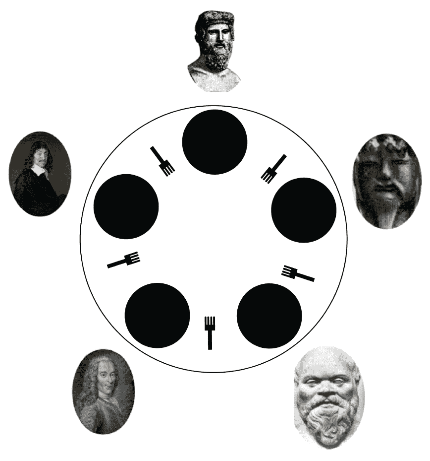
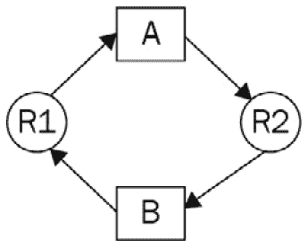
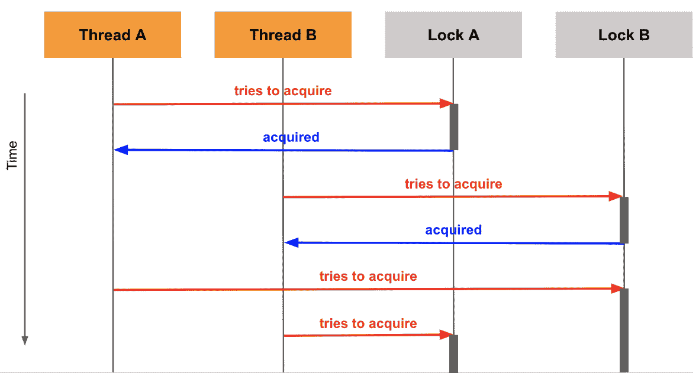

# 第十二章：*第十二章*：死锁

**死锁**，最常见的一种并发问题，将是我们在本书中首先分析的问题。在本章中，我们将讨论并发编程中死锁的理论原因。我们将以一个经典的同步问题，称为**就餐哲学家问题**，作为一个死锁的现实生活例子。我们还将展示一个实际的 Python 死锁实现，并讨论解决此问题的几种方法。本章还将涵盖与死锁相关且在并发编程中也是常见问题的活锁概念。

本章将涵盖以下主题：

+   死锁的概念

+   处理死锁情况的方法

+   活锁的概念

到本章结束时，我们将对问题、它在并发编程中的位置以及解决它的实际方法有一个深入的理解。

# 技术要求

本章的代码文件可以通过以下链接访问：[`github.com/PacktPublishing/Advanced-Python-Programming-Second-Edition/tree/main/Chapter12`](https://github.com/PacktPublishing/Advanced-Python-Programming-Second-Edition/tree/main/Chapter12).

# 死锁的概念

在并发编程中，死锁指的是一种无法取得进展的特定情况，程序锁定在其当前状态。在大多数情况下，这种现象是由不同锁对象之间缺乏或处理不当的协调（用于线程同步目的）引起的。在本节中，我们将讨论一个常见的思想实验，通常称为就餐哲学家问题，以说明死锁的概念及其原因；从那里，你将学习如何在 Python 并发程序中模拟这个问题。

## 就餐哲学家问题

就餐哲学家问题最初由并发编程的先驱埃德加·迪杰斯特拉（Edgar Dijkstra）在 1965 年提出。这个问题最初使用不同的技术术语（计算机系统中的资源竞争）进行演示，后来由英国计算机科学家、快速排序算法的发明者托尼·霍尔（Tony Hoare）重新表述。问题陈述如下。

五位哲学家围坐在一张桌子旁，每位哲学家面前都有一碗食物。五把叉子放在这五碗食物之间，所以每位哲学家左边和右边各有一把叉子。这种设置在以下图中显示：



图 12.1 – 就餐哲学家问题的说明

每位沉默的哲学家应该交替进行思考和进食。每个哲学家都需要周围有两把叉子才能从他们的碗里取食物，而且叉子不能在两个或更多不同的哲学家之间共享。当哲学家吃掉一定数量的食物后，他们应该将两把叉子放回各自原来的位置。此时，那位哲学家周围的哲学家将能够使用那些叉子。

由于哲学家们是沉默的，无法相互沟通，他们没有方法让对方知道他们需要叉子来吃。换句话说，哲学家唯一能吃的方法是两把叉子都已经可用。对于这个问题，必须为哲学家设计一套指令，以便他们能够高效地在吃和思考之间切换，从而确保每位哲学家都能获得足够的食物。

现在解决这个问题的潜在方法可能是一系列指令如下：

1.  哲学家必须思考，直到他们左手边的叉子变得可用。当这种情况发生时，哲学家应该拿起它。

1.  哲学家必须思考，直到他们右手边的叉子变得可用。当这种情况发生时，哲学家应该拿起它。

1.  如果哲学家手持两把叉子，他们将从前面的碗里吃掉一定数量的食物，然后以下规则适用：

    +   之后，哲学家必须将右手叉子放回原来的位置。

    +   之后，哲学家必须将左手叉子放回原来的位置。

1.  这个过程从第一步重复进行。

很明显，这套指令可能导致无法取得进展的情况；也就是说，如果一开始所有哲学家同时开始执行他们的指令。由于一开始所有的叉子都在桌子上，因此附近的哲学家都可以拿起叉子，每个哲学家都将能够执行第一个指令（拿起他们左手边的叉子）。

现在，经过这一步，每位哲学家都将用左手拿着一把叉子，桌子上将不再剩下任何叉子。由于没有哲学家同时拥有两把叉子，他们无法吃他们的食物。此外，他们所得到的指令规定，只有当哲学家吃掉一定数量的食物后，他们才能将叉子放在桌子上。这意味着只要哲学家没有吃，他们就不会放下他们所持有的叉子。

因此，由于每个哲学家只用左手拿着一个叉子，这意味着他们不能吃或放下他们手中的叉子。哲学家唯一能吃到食物的时间是当他们的邻居放下叉子时，而这只有在他们能吃到食物的情况下才可能；这创造了一个永远无法满足的条件的循环。这种情况本质上就是死锁的本质，其中系统的所有元素都停滞不前，无法取得任何进展。

想象现实世界中涉及共享资源并由用餐哲学家问题模型化的情况并不困难。例如，激发迪杰斯特拉构建这个公式的原始问题涉及与外部设备（如磁带驱动器）一起工作。

另一个例子是关于银行的：要执行两个银行账户之间的交易，你必须确保两个账户都被锁定，以便正确数量的资金能够被转移。在这里，这种类比并不完全成立——哲学家对应于锁定账户的交易（即叉子）——但可能会出现相同的技术难题。其他例子包括在线预订和允许多个客户端同时修改数据库。

话虽如此，我们将专门关注正式的用餐哲学家问题，因为它提供了一个干净、抽象的环境，可以轻松进行分析和分解。考虑到这一点，让我们考虑死锁的正式概念及其相关的理论。

## 并发系统中的死锁

给定一个具有多个线程或进程的并发程序，如果进程（或线程）正在等待一个被另一个进程持有和使用的资源，而这个进程反过来又正在等待另一个由不同进程持有的资源，那么执行流程就会进入死锁状态。换句话说，进程在等待只能在其执行完成后才能释放的资源时，无法继续执行其执行指令；因此，这些进程无法改变它们的执行状态。

死锁也被定义为并发程序在发生死锁时需要同时具备的条件。这些条件最初是由计算机科学家爱德华·G·科夫曼（Jr.）提出的，因此被称为**科夫曼条件**。这些条件如下：

+   至少有一个资源必须处于不可共享的状态。这意味着该资源被某个进程（或线程）持有，其他人无法访问；该资源只能由单个进程（或线程）在任何给定时间访问和持有。这种条件也称为**互斥**。

+   存在一个进程（或线程），它同时访问一个资源并等待其他进程（或线程）持有的另一个资源。换句话说，这个进程（或线程）需要访问两个资源来执行其指令，其中一个它已经持有，另一个它正在等待其他进程（或线程）提供。这种条件称为**持有并等待**。

+   只有当有特定的指令要求进程（或线程）释放它们所持有的资源时，进程（或线程）才能释放资源。也就是说，除非进程（或线程）自愿并主动释放资源，否则该资源将保持不可共享的状态。这就是**不可抢占条件**。

+   最后的条件称为**循环等待**。正如其名所示，这个条件指定了一组进程（或线程）存在，其中集合中的第一个进程（或线程）正在等待第二个进程（或线程）释放一个资源，而第二个进程（或线程）反过来又需要等待第三个进程（或线程）；最后，集合中的最后一个进程（或线程）正在等待第一个进程（或线程）。

让我们快速看一下死锁的基本示例。考虑一个并发程序，其中有两个不同的进程（进程**A**和进程**B**）和两种不同的资源（资源**R1**和资源**R2**），如下所示：



图 12.2 – 示例死锁图

没有任何资源可以在不同的进程之间共享，每个进程都需要访问这两个资源来执行其指令。以进程**A**为例。它已经持有资源**R1**，但它还需要**R2**来继续执行。然而，**R2**不能被进程**A**获取，因为它被进程**B**持有。所以，进程**A**不能继续执行。对进程**B**也是如此，它持有**R2**并需要**R1**来继续执行。而**R1**反过来又被进程**A**持有。

## Python 模拟

在本节中，我们将实现前面的情况在一个实际的 Python 程序中。具体来说，我们将有两个锁（我们将它们称为**锁 A**和**锁 B**）和两个单独的线程与锁交互（**线程 A**和**线程 B**）。在我们的程序中，我们将设置一个线程 A 已经获取锁 A 并正在等待获取已经被线程 B 获取的锁 B 的情况，而线程 B 反过来又正在等待锁 A 被释放。

如果你已经从相关的 GitHub 页面下载了这本书的代码，那么请转到`Chapter12`文件夹。让我们考虑`Chapter12/example1.py`文件，如下所示：

```py
import threading
import time
def thread_a():
    print('Thread A is starting...')
    print('Thread A waiting to acquire lock A.')
    lock_a.acquire()
    print('Thread A has acquired lock A, performing some \
      calculation...')
    time.sleep(2)
    print('Thread A waiting to acquire lock B.')
    lock_b.acquire()
    print('Thread A has acquired lock B, performing some \
      calculation...')
    time.sleep(2)
    print('Thread A releasing both locks.')
    lock_a.release()
    lock_b.release()
def thread_b():
    print('Thread B is starting...')
    print('Thread B waiting to acquire lock B.')
    lock_b.acquire()
    print('Thread B has acquired lock B, performing some \
      calculation...')
    time.sleep(5)
    print('Thread B waiting to acquire lock A.')
    lock_a.acquire()
    print('Thread B has acquired lock A, performing some \
      calculation...')
    time.sleep(5)
    print('Thread B releasing both locks.')
    lock_b.release()
    lock_a.release()
lock_a = threading.Lock()
lock_b = threading.Lock()
thread1 = threading.Thread(target=thread_a)
thread2 = threading.Thread(target=thread_b)
thread1.start()
thread2.start()
thread1.join()
thread2.join()
print('Finished.')
```

在这个脚本中，`thread_a()`和`thread_b()`函数分别指定线程 A 和线程 B。在我们的主程序中，我们还有两个`threading.Lock`对象：锁 A 和锁 B。线程指令的一般结构如下：

1.  启动线程。

1.  尝试使用与线程相同名称的锁（线程 A 将尝试获取锁 A，而线程 B 将尝试获取锁 B）。

1.  执行一些计算。

1.  尝试获取另一个锁（线程 A 将尝试获取锁 B，而线程 B 将尝试获取锁 A）。

1.  执行一些其他计算。

1.  释放两个锁。

1.  结束线程。

    注意

    注意，我们正在使用`time.sleep()`函数来模拟一些计算正在处理的行为。

首先，我们在主程序中几乎同时启动了线程 A 和线程 B。考虑到线程指令集的结构，我们可以看到，在这个点上，两个线程都将被启动；线程 A 将尝试获取锁 A，并且由于此时锁 A 仍然可用，所以会成功获取。对于线程 B 和锁 B 也是如此。然后，这两个线程将继续进行一些自己的计算。

让我们考虑我们程序当前的状态：锁 A 已被线程 A 获取，锁 B 已被线程 B 获取。在他们各自的计算过程完成后，线程 A 将尝试获取锁 B，而线程 B 将尝试获取锁 A。我们可以很容易地看出，这是我们死锁情况的开端：由于锁 B 已经被线程 B 持有，无法被线程 A 获取，因此，出于同样的原因，线程 B 也无法获取锁 A。

这两个线程现在将无限期地等待以获取它们各自的第二个锁。然而，释放锁的唯一方式是线程继续执行其执行指令并在结束时释放所有持有的锁。因此，我们的程序将在这一点上陷入执行，并且不会取得任何进一步的进展。

以下图进一步说明了死锁展开的过程，按顺序展示：



图 12.3 – 死锁序列图

现在，让我们看看我们创建的死锁在实际操作中的表现。通过运行脚本，你应该获得以下输出：

```py
> python example1.py
Thread A is starting...
Thread A waiting to acquire lock A.
Thread B is starting...
Thread A has acquired lock A, performing some calculation...
Thread B waiting to acquire lock B.
Thread B has acquired lock B, performing some calculation...
Thread A waiting to acquire lock B.
Thread B waiting to acquire lock A.
```

正如我们之前讨论的，由于每个线程都在尝试获取另一个线程当前持有的锁，因此释放锁的唯一方式是线程继续执行。这是一个死锁，你的程序将无限期地挂起，永远不会到达程序最后一行最后的`print`语句。

这种行为在各方面都是不可取的。在下一节中，我们将讨论防止死锁发生的潜在方法。

# 死锁情况的处理方法

直观地看，以下每种方法似乎都试图从我们的程序中消除四个 Coffman 条件之一以防止死锁。我们的第一个解决方案是在竞争资源中实现排名。

## 实现资源之间的排名

从 dining philosophers 问题以及我们的 Python 示例中，我们可以看到四个 Coffman 条件中的最后一个条件，即循环等待，是死锁问题的核心。它指定了我们的并发程序中的不同进程（或线程）循环等待其他进程（或线程）持有的资源。通过仔细观察，我们可以看到这一条件的根本原因是进程（或线程）访问资源时的顺序（或缺乏顺序）。

在 dining philosophers 问题中，每个哲学家被指示首先拿起他们左边的叉子，而在我们的 Python 示例中，线程总是尝试在执行任何计算之前获取具有相同名称的锁。正如你所看到的，当哲学家们同时开始进餐时，他们会拿起各自的左叉子，并陷入无限等待循环。同样，当两个线程同时开始执行时，它们会获取它们的锁，再次无限等待其他锁。

从这个结论中，我们可以推断出，如果进程（或线程）不是任意访问资源，而是按照预定的、静态的顺序访问资源，那么它们获取和等待资源的方式的循环性质将被消除。因此，对于我们的两个锁 Python 示例，我们希望两个线程都尝试以相同的顺序获取锁。例如，现在两个线程都将首先尝试获取锁 A，执行一些计算，然后尝试获取锁 B，执行进一步的计算，最后释放两个线程。

这种更改在 `Chapter12/example2.py` 文件中实现，如下所示：

```py
import threading
import time
def thread_a():
    print('Thread A is starting...')
    print('Thread A waiting to acquire lock A.')
    lock_a.acquire()
    print('Thread A has acquired lock A, performing some \
      calculation...')
    time.sleep(2)
    print('Thread A waiting to acquire lock B.')
    lock_b.acquire()
    print('Thread A has acquired lock B, performing some \
      calculation...')
    time.sleep(2)
    print('Thread A releasing both locks.')
    lock_a.release()
    lock_b.release()
def thread_b():
    print('Thread B is starting...')
    print('Thread B waiting to acquire lock A.')
    lock_a.acquire()
    print('Thread B has acquired lock A, performing some \
      calculation...')
    time.sleep(5)
    print('Thread B waiting to acquire lock B.')
    lock_b.acquire()
    print('Thread B has acquired lock B, performing some \
      calculation...')
    time.sleep(5)
    print('Thread B releasing both locks.')
    lock_b.release()
    lock_a.release()
lock_a = threading.Lock()
lock_b = threading.Lock()
thread1 = threading.Thread(target=thread_a)
thread2 = threading.Thread(target=thread_b)
thread1.start()
thread2.start()
thread1.join()
thread2.join()
print('Finished.')
```

现在这个脚本的版本能够完成其执行，并应该产生以下输出：

```py
> python3 example2.py
Thread A is starting...
Thread A waiting to acquire lock A.
Thread A has acquired lock A, performing some calculation...
Thread B is starting...
Thread B waiting to acquire lock A.
Thread A waiting to acquire lock B.
Thread A has acquired lock B, performing some calculation...
Thread A releasing both locks.
Thread B has acquired lock A, performing some calculation...
Thread B waiting to acquire lock B.
Thread B has acquired lock B, performing some calculation...
Thread B releasing both locks.
Finished.
```

这种方法有效地消除了我们两个锁示例中的死锁问题，但对于 dining philosophers 问题，它又能保持多好的效果呢？为了回答这个问题，让我们尝试自己用 Python 模拟这个问题及其解决方案。`Chapter12/example3.py` 文件包含了 Python 中 dining philosophers 问题的实现，如下所示：

```py
import threading
# The philosopher thread
def philosopher(left, right):
    while True:
        with left:
             with right:
                 print(f'Philosopher at \
                  {threading.currentThread()} is eating.')
# The chopsticks
N_FORKS = 5
forks = [threading.Lock() for n in range(N_FORKS)]
# Create all of the philosophers
phils = [ \
  threading.Thread(target=philosopher,args=(forks[n], forks \
    [(n + 1) % N_FORKS])) for n in range(N_FORKS)]
# Run all of the philosophers
for p in phils:
    p.start()
```

在这里，我们有一个 `philosopher()` 函数作为我们单独线程的底层逻辑。它接受两个 `Threading.Lock` 对象，并使用两个上下文管理器模拟之前讨论的进餐过程。在我们的主程序中，我们创建了一个包含五个锁对象的列表，命名为 `forks`，以及一个包含五个线程的列表，命名为 `phils`，具体规定第一个线程将获取第一个和第二个锁，第二个线程将获取第二个和第三个锁，依此类推；第五个线程将获取第五个和第一个锁（按顺序）。最后，我们同时启动所有五个线程。

如果我们运行脚本，我们会看到死锁几乎立即发生。以下是我的输出，直到程序无限期挂起：

```py
> python3 example3.py
Philosopher at <Thread(Thread-1, started 123145445048320)> is 
eating.
Philosopher at <Thread(Thread-1, started 123145445048320)> is 
eating.
Philosopher at <Thread(Thread-1, started 123145445048320)> is 
eating.
Philosopher at <Thread(Thread-1, started 123145445048320)> is 
eating.
Philosopher at <Thread(Thread-1, started 123145445048320)> is 
eating.
Philosopher at <Thread(Thread-1, started 123145445048320)> is 
eating.
Philosopher at <Thread(Thread-3, started 123145455558656)> is 
eating.
Philosopher at <Thread(Thread-1, started 123145445048320)> is 
eating.
Philosopher at <Thread(Thread-3, started 123145455558656)> is 
eating.
Philosopher at <Thread(Thread-3, started 123145455558656)> is 
eating.
Philosopher at <Thread(Thread-3, started 123145455558656)> is 
eating.
Philosopher at <Thread(Thread-3, started 123145455558656)> is 
eating.
Philosopher at <Thread(Thread-5, started 123145466068992)> is 
eating.
Philosopher at <Thread(Thread-3, started 123145455558656)> is 
eating.
Philosopher at <Thread(Thread-3, started 123145455558656)> is 
eating.
```

自然随之而来的问题是：我们如何在`philosopher()`函数中实现一个获取锁的顺序？在这里，我们将使用 Python 的内置`id()`函数，它返回参数的唯一、恒定的标识符，作为排序锁对象的键。我们还将实现一个自定义上下文管理器，将排序逻辑提取到单独的类中。导航到`Chapter12/example4.py`以查看这个特定的实现，如下所示：

```py
class acquire(object):
    def __init__(self, *locks):
        self.locks = sorted(locks, key=lambda x: id(x))
    def __enter__(self):
        for lock in self.locks:
            lock.acquire()
    def __exit__(self, ty, val, tb):
        for lock in reversed(self.locks):
            lock.release()
        return False
# The philosopher thread
def philosopher(left, right):
    while True:
        with acquire(left,right):
             print(f'Philosopher at \
               {threading.currentThread()} is eating.')
```

在保持主程序不变的情况下，这个脚本将生成一个输出，表明这种排序解决方案可以有效地解决哲学家就餐问题。

然而，当这种方法应用于某些特定情况时，存在一个问题。在保持并发的高级思想的同时，我们知道，当我们将并发应用于我们的程序时，我们的主要目标之一是提高速度。让我们回到我们的双锁示例，并检查在实现资源排序后我们的程序执行时间。看看`Chapter12/example5.py`文件；它只是实现了排序（或有序）锁定的双锁程序，并添加了一个计时器来跟踪两个线程完成执行所需的时间。

运行脚本后，你的输出应该类似于以下内容：

```py
> python3 example5.py
Thread A is starting...
Thread A waiting to acquire lock A.
Thread B is starting...
Thread A has acquired lock A, performing some calculation...
Thread B waiting to acquire lock A.
Thread A waiting to acquire lock B.
Thread A has acquired lock B, performing some calculation...
Thread A releasing both locks.
Thread B has acquired lock A, performing some calculation...
Thread B waiting to acquire lock B.
Thread B has acquired lock B, performing some calculation...
Thread B releasing both locks.
Took 14.01 seconds.
Finished.
```

在这里，你可以看到两个线程的合并执行大约花费了 14 秒。然而，如果我们仔细查看两个线程中的具体指令，我们会发现除了与锁交互外，线程 A 大约需要 4 秒来完成其计算（由两个`time.sleep(2)`命令模拟），而线程 B 大约需要 10 秒（两个`time.sleep(5)`命令）。

这是否意味着我们的程序执行时间与顺序执行两个线程的时间一样长？我们将通过`Chapter12/example6.py`文件来测试这个理论，其中我们指定每个线程应该依次使用相同的`thread_a()`和`thread_b()`函数执行其指令：

```py
lock_a = threading.Lock()
lock_b = threading.Lock()
thread1 = threading.Thread(target=thread_a)
thread2 = threading.Thread(target=thread_b)
start = timer()
thread1.start()
thread1.join()
thread2.start()
thread2.join()
print('Took %.2f seconds.' % (timer() - start))
print('Finished.')
```

如果你运行这个脚本，你会看到这个顺序版本的我们的双锁程序将花费与它的并发对应者相同的时间：

```py
> python3 example6.py
Thread A is starting...
Thread A waiting to acquire lock A.
Thread A has acquired lock A, performing some calculation...
Thread A waiting to acquire lock B.
Thread A has acquired lock B, performing some calculation...
Thread A releasing both locks.
Thread B is starting...
Thread B waiting to acquire lock A.
Thread B has acquired lock A, performing some calculation...
Thread B waiting to acquire lock B.
Thread B has acquired lock B, performing some calculation...
Thread B releasing both locks.
Took 14.01 seconds.
Finished.
```

这种有趣的现象是直接源于我们在程序中对锁的严格要求。换句话说，由于每个线程都必须获取两个锁以完成其执行，因此在任何给定时间，一个锁不能被超过一个线程获取。锁必须按照特定顺序获取，并且单个线程的执行不能同时发生。如果我们回顾`Chapter12/example5.py`文件产生的输出，就会明显看出线程 B 在线程 A 在其执行结束时释放两个锁后无法开始其计算。

这是非常直观的，因此，可以得出结论，如果你在并发程序的资源上放置足够的锁，它的执行将完全变为顺序的，并且，结合并发编程功能的开销，它的速度甚至比纯顺序版本的程序更差。然而，我们在哲学家就餐问题（用 Python 模拟）中并没有看到由锁创建的这种顺序性。这是因为，在两个线程的问题中，两个锁足以顺序化程序执行，而五个锁则不足以对哲学家就餐问题做同样的事情。

我们将在*第十三章*中探讨这种现象的另一个实例，*饥饿*。

## 忽略锁和共享资源

**锁**无疑是同步任务和一般并发编程中的重要工具。然而，如果使用锁导致不希望的情况，例如死锁，那么我们探索在并发程序中完全不使用锁的选项是很自然的。通过忽略锁，我们的程序资源在并发程序的不同进程/线程之间变得可共享，从而消除了四个 Coffman 条件中的第一个：**互斥**。

这种解决死锁问题的方法易于实现；让我们用前两个例子来尝试一下。在两个锁的例子中，我们只是简单地移除了线程函数和主程序中指定与锁对象任何交互的代码。换句话说，我们不再使用锁定机制了。`Chapter12/example7.py` 文件包含了这种方法的实现，如下所示：

```py
import threading
import time
from timeit import default_timer as timer
def thread_a():
    print('Thread A is starting...')
    print('Thread A is performing some calculation...')
    time.sleep(2)
    print('Thread A is performing some calculation...')
    time.sleep(2)
def thread_b():
    print('Thread B is starting...')
    print('Thread B is performing some calculation...')
    time.sleep(5)
    print('Thread B is performing some calculation...')
    time.sleep(5)
thread1 = threading.Thread(target=thread_a)
thread2 = threading.Thread(target=thread_b)
start = timer()
thread1.start()
thread2.start()
thread1.join()
thread2.join()
print('Took %.2f seconds.' % (timer() - start))
print('Finished.')
```

如果你运行脚本，你的输出应该类似于以下内容：

```py
> python3 example7.py
Thread A is starting...
Thread A is performing some calculation...
Thread B is starting...
Thread B is performing some calculation...
Thread A is performing some calculation...
Thread B is performing some calculation...
Took 10.00 seconds.
Finished.
```

很明显，由于我们没有使用锁来限制对任何计算过程的访问，两个线程的执行已经完全独立于彼此，因此线程完全并行运行。因此，我们也获得了更好的速度：由于线程并行运行，整个程序所需的总时间与较长的线程所需的时间相同（也就是说，线程 `B`，需要 `10` 秒）。

那么关于哲学家就餐问题呢？看起来我们也可以得出结论，如果没有锁（即叉子），这个问题可以很容易地解决。由于资源（食物）对每位哲学家是唯一的（换句话说，没有哲学家应该吃另一个哲学家的食物），因此每个哲学家应该可以继续执行而不用担心其他人。通过忽略锁，每个哲学家都可以并行执行，类似于我们在两个锁的例子中看到的那样。

做这件事，然而，意味着我们完全误解了问题。我们知道锁被用来确保进程和线程可以以系统化、协调的方式访问程序中的共享资源，以避免数据处理不当。因此，在并发程序中移除任何锁定机制意味着现在不受访问限制的共享资源被无序操作（因此，可能被破坏）的可能性显著增加。

因此，通过忽略锁，我们很可能需要完全重新设计和重构我们的并发程序。如果共享资源仍然需要以有组织的方式被访问和操作，就需要实施其他同步方法。我们进程和线程的逻辑可能需要改变以适当地与这种新的同步方法交互，程序结构的这种变化可能会对执行时间产生负面影响，并且也可能出现其他潜在的同步问题。

### 关于锁的附加说明

虽然在我们的程序中取消锁定机制以消除死锁的方法可能会引起一些疑问和担忧，但它确实有效地揭示了我们关于 Python 中锁对象的一个新观点：并发程序的一个元素在访问特定资源时可以完全绕过锁。换句话说，只有当进程或线程获取锁对象时，锁对象才阻止不同的进程/线程访问和操作共享资源。

那么，锁并不锁定任何东西。它们只是帮助指示在特定时间是否应该访问资源的标志；如果一个指导不当，甚至恶意的过程/线程试图在不检查锁对象存在的情况下访问该资源，它很可能能够轻松地做到这一点。换句话说，锁与它们应该锁定的资源没有关联，它们绝对不会阻止进程/线程访问这些资源。

因此，仅仅使用锁来设计和实现一个安全、动态的并发数据结构是低效的。为了实现这一点，我们可能需要增加锁和它们对应的资源之间的更多具体链接，或者完全使用不同的同步工具（例如，原子消息队列）。

### 关于死锁解决方案的总结性说明

在本章中，你已经看到了解决死锁问题的两种最常见的方法。每种方法都针对四个 Coffman 条件中的一个，虽然两者（在一定程度上）成功地防止了死锁在我们的例子中发生，但每种方法都提出了不同的问题和担忧。因此，真正理解你的并发程序的本质，知道哪一种适用，如果两者都适用的话，是很重要的。

也可能有些程序，通过死锁，被我们揭示为不适合并发执行；有些程序最好是顺序执行，强制并发会使它们变得更糟。正如我们讨论的那样，虽然并发在我们的应用程序的许多领域提供了显著的改进，但有些本质上不适合并发编程。在死锁情况下，开发者应该准备好考虑不同的方法来设计并发程序，并且不应该因为一个并发方法不起作用而不愿意实施另一种方法。

# 活锁的概念

活锁的概念与死锁相关联；有些人甚至认为它是死锁的另一种版本。在活锁情况下，并发程序中的进程（或线程）可以切换它们的状态；实际上，它们不断切换状态。然而，它们只是无限地来回切换，没有任何进展。我们现在将考虑一个实际的活锁场景。

假设一对配偶正在餐桌旁一起用餐。他们只有一把叉子可以共享，所以任何时候只有其中一个人可以吃饭。此外，配偶之间都很礼貌，即使其中一方饿了想吃食物，如果另一方也饿了，他们也会把叉子留在桌子上。这个规范是创建这个问题的活锁的核心：当双方都饿了，他们会互相等待对方先吃，从而形成一个无限循环，在这个循环中，每一方都在想吃和等待对方吃饭之间切换。

让我们在 Python 中模拟这个问题。导航到`Chapter12/example8.py`并查看`Spouse`类：

```py
class Spouse(threading.Thread):
    def __init__(self, name, partner):
        threading.Thread.__init__(self)
        self.name = name
        self.partner = partner
        self.hungry = True
    def run(self):
        while self.hungry:
            print('%s is hungry and wants to eat.' % self.name)
            if self.partner.hungry:
                print('%s is waiting for their partner to eat \
                  first...' % self.name)
            else:
                with fork:
                    print('%s has stared eating.' % self.name)
                    time.sleep(5)
                    print('%s is now full.' % self.name)
                    self.hungry = False
```

这个类继承自`threading.Thread`类，并实现了我们之前讨论的逻辑。它接受一个`Spouse`实例的名称和另一个`Spouse`对象作为其伴侣；当初始化时，`Spouse`对象总是饿的（`hungry`属性总是设置为`True`）。类中的`run()`函数指定了线程启动时的逻辑：只要`Spouse`对象的`hungry`属性设置为`True`，该对象就会尝试使用叉子，这是一个锁对象。然而，它总是检查其伴侣是否也将其`hungry`属性设置为`True`，如果是，它将不会继续获取锁，而是等待其伴侣去获取。

在我们的主程序中，我们首先创建叉子作为锁对象；然后，我们创建两个`Spouse`线程对象，它们是彼此的`partner`属性。最后，我们启动两个线程并运行程序，直到两个线程执行完毕：

```py
fork = threading.Lock()
partner1 = Spouse('Wife', None)
partner2 = Spouse('Husband', partner1)
partner1.partner = partner2
partner1.start()
partner2.start()
partner1.join()
partner2.join()
print('Finished.')
```

如果运行脚本，你会看到，正如我们讨论的那样，每个线程都会进入一个无限循环，在想吃和等待其伴侣吃饭之间切换；程序将永远运行，直到 Python 被中断。以下代码显示了我在获得的前几行输出：

```py
> python3 example8.py
Wife is hungry and wants to eat.
Wife is waiting for their partner to eat first...
Husband is hungry and wants to eat.
Wife is hungry and wants to eat.
Husband is waiting for their partner to eat first...
Wife is waiting for their partner to eat first...
Husband is hungry and wants to eat.
Wife is hungry and wants to eat.
Husband is waiting for their partner to eat first...
Wife is waiting for their partner to eat first...
Husband is hungry and wants to eat.
Wife is hungry and wants to eat.
Husband is waiting for their partner to eat first...
...
```

有了这些，我们可以得出关于死锁和活锁的讨论结论。

# 摘要

在本章中，我们讨论了并发应用程序中死锁的原因，并介绍了防止其发生的实施方法。我们的示例表明，并发性并不总是可以简单地实现，某些情况可能需要特殊处理。这些讨论为我们应对现实世界中的死锁做好了准备，并指出了可能的解决方案。

在下一章中，我们将讨论并发编程中的另一个常见问题：饥饿。

# 问题

1.  什么可能导致死锁情况，为什么它是不希望的？

1.  进餐哲学家问题与死锁问题有何关联？

1.  四个 Coffman 条件是什么？

1.  资源排序如何解决死锁问题？在实施此操作时可能会出现哪些其他问题？

1.  忽略锁如何解决死锁问题？在实施此操作时可能会出现哪些其他问题？

1.  活锁与死锁有何关联？

# 进一步阅读

+   *《Python 并行编程》*，作者：Jan. Palach，Packt Publishing Ltd，2014

+   *《Python 并行编程食谱》*，作者：Giancarlo Zaccone，Packt Publishing Ltd，2015

+   *《Python 线程死锁避免》* (`dabeaz.blogspot.com/2009/11/python-thread-deadlock-avoidance_20`)
