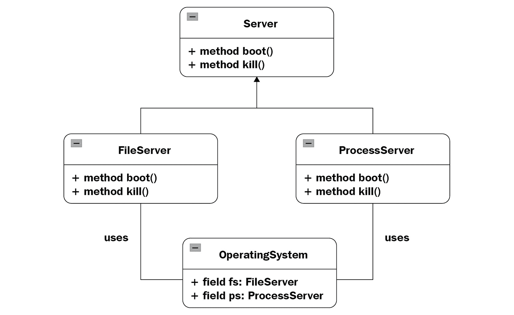

# 第二十二章：*第二十二章*：外观模式

在上一章中，我们介绍了一个第三种结构模式，即桥接模式，它有助于以解耦的方式定义抽象及其实现，以便两者可以独立变化。现在，我们将学习另一种结构模式，即**外观**模式，它在许多软件用例中实现了一个重要的目标：隐藏应用程序的内部工作原理，并且只提供必要的访问权限。

在本章中，我们将讨论以下主题：

+   理解外观模式

+   真实案例

+   用例

+   实现

在本章中，我们将看到为什么外观是一个好的模式来使用，以及它的好处是什么，并且像往常一样，我们将通过 Python 的实际示例来实现。

# 技术要求

本章的代码文件可以通过此链接访问：[`github.com/PacktPublishing/Advanced-Python-Programming-Second-Edition/tree/main/Chapter22`](https://github.com/PacktPublishing/Advanced-Python-Programming-Second-Edition/tree/main/Chapter22)。

# 理解外观模式

随着系统的演变，它们可以变得非常复杂。最终得到一个非常大的（有时是令人困惑的）类和交互集合并不罕见。在许多情况下，我们不想将这种复杂性暴露给客户端。这就是外观模式拯救我们的地方。

外观设计模式帮助我们隐藏系统的内部复杂性，并通过简化的接口仅向客户端暴露必要的内容。本质上，外观是一个在现有复杂系统上实现的抽象层。

让我们以计算机为例来阐述这一点。计算机是一个复杂的机器，它依赖于几个部分才能完全运行。为了简化问题，这里的“计算机”一词指的是使用冯·诺伊曼架构的 IBM 衍生产品。启动计算机是一个特别复杂的程序。CPU、主内存和硬盘需要运行，引导加载程序必须从硬盘加载到主内存，CPU 必须引导**操作系统**（**OS**）内核，等等。我们不需要将所有这些复杂性暴露给客户端，因此我们创建了一个外观，它封装了整个程序，确保所有步骤都按正确的顺序执行。

在对象设计和编程方面，我们应该有几个类，但只有`Computer`类需要暴露给客户端代码。客户端只需执行`Computer`类的`start()`方法，例如，其他所有复杂的部分都由外观`Computer`类处理。

在下一节中，我们将讨论更多外观模式的真实案例。

# 真实案例

外观模式在现实生活中非常常见。当你拨打银行或公司的电话时，你通常首先会被连接到客户服务部门。客户服务员工充当你与实际部门（账单、技术支持、一般协助等）之间的外观，以及将帮助你解决具体问题的员工。

另一个例子是用于打开汽车或摩托车的钥匙，这也可以被视为外观。这是一种简单的方法来激活内部非常复杂的系统。当然，对于我们可以用单个按钮激活的其他复杂电子设备，也是如此，例如计算机。

在软件中，`django-oscar-datacash`模块是一个与**DataCash**支付网关集成的 Django 第三方模块。该模块有一个网关类，它提供了对各种 DataCash API 的细粒度访问。在此基础上，它还提供了一个外观类，提供了一个不那么细粒度的 API（对于那些不想处理细节的人来说），以及保存交易以供审计的能力。

在下一节中，我们将看到外观模式在软件中的重要性。

# 用例

使用外观模式最常见的原因是提供一个单一、简单的入口点来访问复杂的系统。通过引入外观，客户端代码可以通过调用单个方法/函数来使用系统。同时，内部系统不会失去任何功能；它只是封装了它。

不向客户端代码暴露系统的内部功能给我们带来了额外的优势：我们可以对系统进行更改，但客户端代码对此一无所知，也不会受到影响。无需对客户端代码进行任何修改。

如果你的系统中有多层，外观也非常有用。你可以为每一层引入一个外观入口点，并让所有层通过它们的外观相互通信。这反过来又促进了**松耦合**，并尽可能保持层之间的独立性。

因此，我们现在已经准备好在下一节尝试一个实际的实现示例。

# 实现

假设我们想使用多服务器方法创建一个操作系统，类似于在**MINIX 3**（[j.mp/minix3](http://j.mp/minix3)）或**GNU Hurd**（[j.mp/gnuhurd](http://j.mp/gnuhurd)）中实现的方式。多服务器操作系统有一个最小的内核，称为**微内核**，它在特权模式下运行。系统中的所有其他服务都遵循服务器架构（驱动服务器、进程服务器、文件服务器等等）。每个服务器属于不同的内存地址空间，并在用户模式下运行在微内核之上。这种方法的优点是操作系统可以变得更加容错、可靠和安全的。例如，由于所有驱动都在驱动服务器上以用户模式运行，一个驱动程序中的错误不能使整个系统崩溃，也不能影响其他服务器。这种方法的缺点是性能开销和系统编程的复杂性。这些都是由于服务器和微内核之间，以及独立服务器之间通过消息传递进行通信的结果。消息传递比在如 Linux（[j.mp/helenosm](http://j.mp/helenosm)）这样的单一内核中使用的共享内存模型更复杂。

我们从`Server`接口开始。一个`Enum`参数描述了服务器可能的不同状态。我们使用`Server`接口并使基本的`boot()`和`kill()`方法成为强制性的，假设对于启动、终止和重启每个服务器都需要采取不同的操作。如果你之前没有使用 ABC 模块，请注意以下重要事项：

+   我们需要使用`metaclass`关键字来子类化`ABCMeta`。

+   我们使用`@abstractmethod`装饰器来声明服务器所有子类应该实现（强制）的方法。

尝试移除子类的`boot()`或`kill()`方法，看看会发生什么。同样，在移除`@abstractmethod`装饰器之后也做同样的事情。事情是否如你所预期的那样进行？

让我们考虑以下代码：

```py
 State = Enum('State', 'new running sleeping restart \
   zombie')

 class Server(metaclass=ABCMeta):
     @abstractmethod
     def __init__(self):
         pass

     def __str__(self):
         return self.name

     @abstractmethod
     def boot(self):
         pass

     @abstractmethod  
     def kill(self, restart=True):
         pass
```

一个模块化操作系统可以拥有大量有趣的服务器：文件服务器、进程服务器、认证服务器、网络服务器、图形/窗口服务器等等。以下示例包括两个存根服务器：`FileServer`和`ProcessServer`。除了`Server`接口要求实现的方法外，每个服务器还可以有自己的特定方法。例如，`FileServer`有一个`create_file()`方法用于创建文件，而`ProcessServer`有一个`create_process()`方法用于创建进程。

`FileServer`类如下：

```py
class FileServer(Server): 
    def __init__(self): 
        '''actions required for initializing the file \
          server''' 
        self.name = 'FileServer' 
        self.state = State.new 

    def boot(self): 
        print(f'booting the {self}') 
        '''actions required for booting the file server''' 
        self.state = State.running 

    def kill(self, restart=True): 
        print(f'Killing {self}') 
        '''actions required for killing the file server''' 
        self.state = State.restart if restart else \
          State.zombie 

    def create_file(self, user, name, permissions): 
        '''check validity of permissions, user rights, \
          etc.''' 
        print(f"trying to create the file '{name}' for \
           user '{user}' with permissions {permissions}") 
```

`ProcessServer`类如下：

```py
class ProcessServer(Server): 
    def __init__(self): 
        '''actions required for initializing the process \ 
          server''' 
        self.name = 'ProcessServer' 
        self.state = State.new 

    def boot(self): 
        print(f'booting the {self}') 
        '''actions required for booting the process \
          server''' 
        self.state = State.running 

    def kill(self, restart=True): 
        print(f'Killing {self}') 
        '''actions required for killing the process \
          server''' 
        self.state = State.restart if restart else \
          State.zombie 

    def create_process(self, user, name): 
        '''check user rights, generate PID, etc.'''  
        print(f"trying to create the process '{name}' for \
          user '{user}'")
```

`OperatingSystem` 类是一个门面。在其 `__init__()` 方法中，创建了所有必要的服务器实例。客户端代码使用的 `start()` 方法是进入系统的入口点。如果需要，可以添加更多包装方法，作为访问服务器服务（如 `create_file()` 和 `create_process()` 包装器）的入口点。从客户端的角度来看，所有这些服务都是由 `OperatingSystem` 类提供的。客户端不应该被服务器存在和每个服务器的责任等不必要的细节所困惑。

`OperatingSystem` 类的代码如下：

```py
class OperatingSystem: 
    '''The Facade''' 
    def __init__(self): 
        self.fs = FileServer() 
        self.ps = ProcessServer() 

    def start(self): 
        [i.boot() for i in (self.fs, self.ps)] 

    def create_file(self, user, name, permissions): 
        return self.fs.create_file(user, name, permissions) 

    def create_process(self, user, name): 
        return self.ps.create_process(user, name)
```

正如您将在下一分钟看到的那样，当我们展示示例的摘要时，有许多虚拟类和服务器。它们的存在是为了让您了解所需的抽象（如 `User`、`Process`、`File` 等）和服务器（如 `WindowServer`、`NetworkServer` 等），以便使系统功能化。一个推荐的练习是实现系统至少一个服务（例如，文件创建）。请随意更改接口和方法签名以适应您的需求。确保在您的更改之后，客户端代码除了门面 `OperatingSystem` 类之外不需要了解任何其他内容。

该应用程序可以用以下 UML 图来总结，其中 `OperatingSystem` 与 `FileServer` 和 `ProcessServer` 交互，将它们的方法隐藏在客户端代码之外：



图 22.1 — OS 示例的 UML 图

我们将回顾实现示例的细节；完整的代码在 `facade.py` 文件中：

1.  我们首先定义所需的导入：

    ```py
    from enum import Enum 
    from abc import ABCMeta, abstractmethod 
    ```

1.  我们使用 `Enum` 定义了 `State` 常量，如之前所示。

1.  然后，我们添加了 `User`、`Process` 和 `File` 类，在这个最小但功能性的示例中，它们什么都不做：

    ```py
    class User: 
        pass 

    class Process: 
        pass 

    class File: 
        pass 
    ```

1.  我们定义了之前展示的基类 `Server`。

1.  然后，我们定义了 `FileServer` 类和 `ProcessServer` 类，它们都是 `Server` 的子类。

1.  我们还添加了两个其他虚拟类，`WindowServer` 和 `NetworkServer`：

    ```py
    class WindowServer: 
        pass 

    class NetworkServer: 
        pass
    ```

1.  然后，我们定义了我们之前展示的 `OperatingSystem` 门面类。

1.  最后，这里是代码的主要部分，我们使用了我们定义的门面：

    ```py
    def main(): 
        os = OperatingSystem() 
        os.start()  
        os.create_file('foo', 'hello', '-rw-r-r') 
        os.create_process('bar', 'ls /tmp') 

    if __name__ == '__main__': 
        main()
    ```

如您所见，执行 `python facade.py` 命令会显示我们两个虚拟服务器的起始消息：

```py
booting the FileServer
booting the ProcessServer
trying to create the file 'hello' for user 'foo' with 
permissions -rw-r-r
trying to create the process 'ls /tmp' for user 'bar'
```

门面 `OperatingSystem` 类做得很好。客户端代码可以创建文件和进程，而无需了解操作系统内部细节，例如多个服务器的存在。更准确地说，客户端代码可以调用创建文件和进程的方法，但它们目前是虚拟的。作为一个有趣的练习，你可以实现这两个方法中的任何一个，甚至两个都实现。

# 摘要

在本章中，我们学习了如何使用门面模式。这个模式非常适合为想要使用复杂系统但不需要了解系统复杂性的客户端代码提供一个简单的接口。我们讨论了一个使用门面的 Django 第三方模块：`django-oscar-datacash`。它使用门面模式提供了一个简单的 DataCash API 以及保存交易的能力。

我们还学习了如何实现多服务器操作系统所使用的接口。总的来说，我们了解到门面模式是一种优雅地隐藏系统复杂性的方法，因为在大多数情况下，客户端代码不应该意识到这些细节。

在下一章中，我们将介绍其他结构化设计模式。

# 问题

1.  使用门面模式有哪些高级好处？

1.  使用门面模式在修改应用程序时有什么帮助？

1.  我们考虑的操作系统 Python 示例中，门面模式是如何实现的？

# 进一步阅读

《*设计模式*》由 Gamma Enrich，Helm Richard，Johnson Ralph 和 Vlissides John 著，可在[`www.amazon.com/Design-Patterns-Object-Oriented-Addison-Wesley-Professional-ebook/dp/B000SEIBB8`](https://www.amazon.com/Design-Patterns-Object-Oriented-Addison-Wesley-Professional-ebook/dp/B000SEIBB8)找到
