# 第七章：*第七章*：处理消息、电子邮件通知和 PDF 报告

在本章中，我们将使用 Django 消息框架、电子邮件通知和模板以及 PDF 文档。为了让我们知道电子邮件实际上是从我们的系统中发送的，并且在不同电子邮件客户端中正确渲染，我们将使用一个免费的第三方服务来捕获所有发出的电子邮件。通过捕获所有发出的电子邮件，我们可以防止开发测试电子邮件发送给尚未看到它们的人。我们将使用 HTML、CSS 和 Django 模板语言来创建电子邮件和 PDF 报告模板。两者都将使用上下文数据，就像我们在 *第四章*，*URL、视图和模板* 中传递上下文到模板一样。

在本章中，我们将涵盖以下内容：

+   创建一个用于捕获应用发送的所有电子邮件的测试环境

+   使用 Django 消息框架创建闪存消息和自定义消息级别

+   创建和发送 HTML 和/或纯文本格式的电子邮件

+   使用 HTML、CSS 和 Django 模板语言创建基于模板的电子邮件

+   使用 HTML、CSS 和 Django 模板语言生成 PDF 文档

# 技术要求

要处理本章中的代码，需要在您的本地机器上安装以下工具：

+   Python 版本 3.9 – 作为项目的底层编程语言

+   Django 版本 4.0 – 作为项目的后端框架

+   pip 包管理器 – 用于管理第三方 Python/Django 包

我们将继续使用在 *第二章*，*项目配置* 中创建的解决方案。然而，并不需要使用 Visual Studio IDE。主要项目本身可以使用其他 IDE 运行，或者从项目根目录（其中包含 `manage.py` 文件）独立运行，使用终端或命令行窗口。无论您使用什么编辑器或 IDE，都需要一个虚拟环境来与 Django 项目一起工作。如何创建项目和虚拟环境的说明可以在 *第二章*，*项目配置* 中找到。您需要一个数据库来存储项目中的数据。在上一章的示例中选择了 PostgreSQL；然而，您可以为项目选择任何数据库类型，以使用本章中的示例。

我们将不会使用 `chapter_3` 应用数据固定文件中的任何数据，但如果该数据已经加载，请不要担心！本章的所有练习都将使用用户交互的表单中获取的数据，而不是来自数据库的数据。

本章创建的所有代码都可以在本书的 GitHub 仓库中找到：[`github.com/PacktPublishing/Becoming-an-Enterprise-Django-Developer`](https://github.com/PacktPublishing/Becoming-an-Enterprise-Django-Developer)。本章中展示的大部分代码可以在`/becoming_a_django_entdev/becoming_a_django_entdev/chapter_7/`目录中找到。

查看以下视频，了解*代码的实际应用*：[`bit.ly/3OzpalD`](https://bit.ly/3OzpalD)。

# 准备本章内容

首先，按照*第二章*中讨论的步骤，在您的项目中创建一个名为`chapter_7`的新应用。正如该节所述，不要忘记将`/becoming_a_django_entdev/becoming_a_django_entdev/chapter_7/apps.py`文件中您应用类中的`name =`变量的值更改为指向您安装应用的位置。务必还将此应用包含在`settings.py`文件中的`INSTALLED_APPS`变量中。

在网站的主要`urls.py`文件中，添加以下路径，该路径指向我们将在本章中创建的应用的 URL 模式：

```py
# /becoming_a_django_entdev/urls.py
```

```py
...
```

```py
urlpatterns = [
```

```py
    path(
```

```py
        '', 
```

```py
        include('becoming_a_django_entdev.chapter_7.urls')
```

```py
    ),
```

```py
]
```

将`chapter_5`应用中找到的 URL 模式、表单、字段、视图、模板、CSS 和 JavaScript 文件直接复制到新创建的`chapter_7`应用中。这样，我们可以将每个章节的练习分开，本章的练习将建立在*第五章*中*Django 表单*的练习之上。在您复制到本章应用的代码中，确保更新所有从`chapter_5`/`chapter-5`到`chapter_7`/`chapter-7`的文件/代码引用，如有必要。

## 创建 Mailtrap 账户

为了在本章中与电子邮件示例一起工作，您需要一个能够捕获从正在构建的系统发送的所有电子邮件的电子邮件测试服务，因为我们是在本地运行项目。目前市场上有很多不同的第三方服务，它们都提供这种解决方案。每个服务在提供的附加测试工具和功能以及与该服务相关的成本方面都有所不同。您可以使用本书未选择的服务。如果您选择这样做，您将不得不遵循该服务的说明来配置您项目的设置，而不是本节中找到的说明。

为了演示本章中的练习，我们将使用一个完全免费的名为 **Mailtrap** 的服务。创建账户时无需信用卡，并且对个人副项目免费。这不是基于试用期的计划；它终身免费，或者至少直到 Mailtrap 改变其政策和程序。Mailtrap 还提供升级的付费计划，如果你和你的团队决定使用这项服务，这将特别有用，尤其是在多个开发环境和大型测试团队中。

按照以下步骤创建和设置你的 Mailtrap 账户：

1.  访问 [`mailtrap.io/register/signup`](https://mailtrap.io/register/signup) 创建新账户。按照他们网站上提供的步骤进行操作。

1.  要激活你的账户，你需要回到你的邮箱收件箱，如果你在收件箱中没有看到它，请点击 `垃圾邮件` 文件夹。

1.  完成后，登录你的新账户，你将被带到 **我的收件箱**，第一个标签页是 **SMTP 设置**。

1.  在你的项目 `settings.py` 文件中，如下所示：

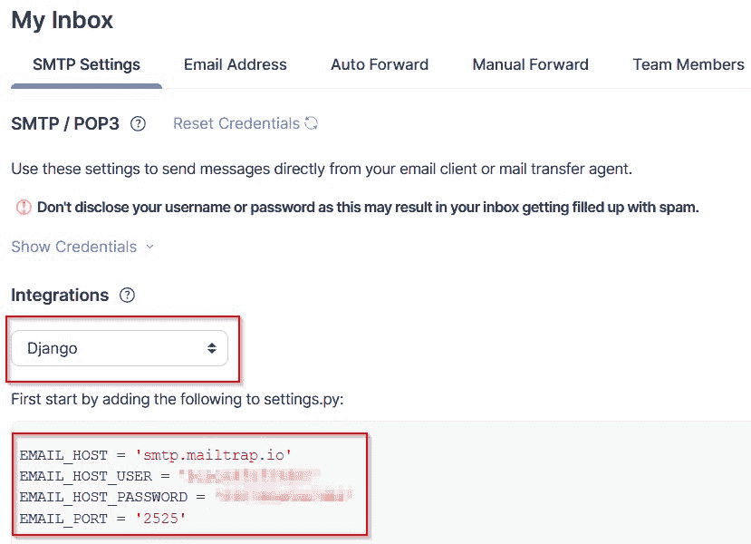

图 7.1 – Mailtrap – SMTP 设置

将这些变量，以及你在账户中提供的凭证，添加到 `settings.py` 文件的任何位置。

1.  此步骤是可选的。为了在生产环境中分离这些变量，在你的 `settings.py` 文件中使用以下条件语句。每个变量的值也保存在项目的 `.env` 文件中：

    ```py
    # /becoming_a_django_entdev/settings.py
    ...
    if DEBUG:
        EMAIL_HOST = os.getenv('EMAIL_HOST')
        EMAIL_HOST_USER = os.getenv('EMAIL_HOST_USER')
        EMAIL_HOST_PASSWORD = os.getenv('EMAIL_HOST_PASSWORD')
        EMAIL_PORT = os.getenv('EMAIL_PORT')
    else:
        # Production Email Connection Settings
        Pass
    ```

确保在运行项目之前，将变量添加到你的本地 `.env` 文件中，当使用前面的示例时。

注意

为了使 Mailtrap 能够与你的 Heroku 项目一起工作，确保将你的本地 `.env` 文件中的四个电子邮件变量添加到每个 Heroku 应用的配置变量中。有关如何操作的说明，请参阅 *第二章*，*项目配置*下的*远程变量*小节。你可以为每个环境使用相同的连接设置，它们都将发送到同一个收件箱。

就这样。Mailtrap 现已配置，并将拦截来自你的 Django 项目的所有邮件。接下来，让我们继续使用 Django 消息框架创建闪存消息。

# 使用 Django 消息框架

让我们先来介绍 **Django 消息框架**，这是一个用于向用户提供基于会话的消息的框架。**闪存消息**是一种一次性通知消息，直接显示给用户，这正是该框架创建的消息类型。我们可以将消息渲染到用户在模板中放置代码的任何位置，无论是模态弹出窗口还是从页面顶部或底部下拉的消息，甚至可以出现在用户提交的表单上方或下方。

在本章中，`chapter_7` `FormClassView` 类将是主要的工作类，因为它将主要用于触发我们将要编写的操作。我们将编写在相应的 `ContactForm` 类中执行这些操作的方法，该类用于 `chapter_7` 应用程序的 `FormClassView` 类。

在我们开始编写这些类之前，我们首先将启用 Django 消息框架。

## 启用 Django 消息框架

这些设置将启用 Django 消息框架。项目不需要此框架即可运行。如果需要，可以删除这些设置，但为了使用本章，它们是必需的。很可能在您创建项目时，这些设置已经自动为您生成。请再次检查以确保无误。

在您的 `settings.py` 文件中，请确保存在以下设置和值：

```py
# /becoming_a_django_entdev/settings.py
```

```py
...
```

```py
INSTALLED_APPS = [
```

```py
    ...
```

```py
    'django.contrib.sessions',
```

```py
    'django.contrib.messages',
```

```py
]
```

```py
MIDDLEWARE = [
```

```py
    ...
```

```py
    'django.contrib.sessions.middleware.SessionMiddleware',
```

```py
    'django.contrib.messages.middleware.MessageMiddleware',
```

```py
]
```

```py
TEMPLATES = [
```

```py
    {
```

```py
        ...
```

```py
        'OPTIONS': {
```

```py
            'context_processors': [
```

```py
                ...
```

```py
                'django.contrib.messages.context_processors.messages',
```

```py
            ],
```

```py
        },
```

```py
    },
```

```py
]
```

在前面的设置中，需要记住的一个重要事项是 `SessionMiddleware` 总是在 `MIDDLEWARE` 列表中的 `MessageMiddleware` 条目之前。同样适用于 `INSTALLED_APPS` 变量；请确保 `django.contrib.sessions` 应用程序在 `django.contrib.messages` 应用程序之前。在 `TEMPLATES` 配置下显示的 Django 消息框架上下文处理器也是必需的，以便在您的模板中从任何地方访问 Django 消息框架上下文。这意味着您不需要在每个页面的上下文中显式定义一个变量专门用于消息。相反，它将通过项目的全局上下文自动可用。

接下来，我们将讨论 Django 消息框架的额外配置/启用。

### 消息存储后端

`settings.py` 文件中的 `MESSAGE_STORAGE` 变量。

可用于 `MESSAGE_STORAGE` 的后端选项在此列出：

+   `django.contrib.messages.storage.session.SessionStorage` – 在请求会话中存储消息，并要求将 `django.contrib.sessions` 应用程序包含在 `INSTALLED_APPS` 变量中。

+   `django.contrib.messages.storage.fallback.FallbackStorage` – 此选项首先使用现在已过时的 `CookieStorage`，然后，当 cookie 数据超过 2,048 字节阈值时，而不是像 `CookieStorage` 选项的默认操作那样删除那些较旧的 cookie，新消息将被放置在 `SessionStorage` 中。`CookieStorage` 在 Django 4.0 中不再受支持，但仍然可在 `django.contrib.messages.storage` 库中使用。目前尚不清楚这种存储方法何时将被完全删除。

+   `django.contrib.messages.storage.base.BaseStorage` – Django 提供此类作为开发人员创建自己的存储系统的一种方式。本身，这不会工作，因为这个类是一个抽象类，旨在被扩展。这被认为是超出本书范围的进阶主题。

让我们先将此设置为使用 `SessionStorage` 选项：

```py
# /becoming_a_django_entdev/settings.py
```

```py
...
```

```py
MESSAGE_STORAGE = 'django.contrib.messages.storage.session.SessionStorage'
```

### 消息级别

**消息级别**表示消息的不同严重程度。这些级别有一个变量名、一个小写标签名和一个表示严重程度的数值，如下表所示：

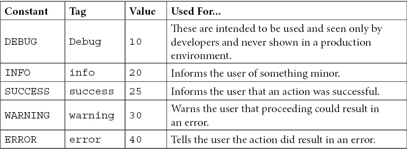

默认情况下，Django 将`MESSAGE_LEVEL`变量设置为`INFO`；更具体地说，Django 将其设置为`20`的值。这意味着如果我们尝试发布一个值为`10`的`DEBUG`相关消息，它将永远不会渲染到页面上。有些人可能会认为这是 Django 框架中的错误；然而，这是有意为之的设计。原因是，在生产环境中，我们不希望这些消息出现在任何地方供用户看到。任何值低于`20`的自定义消息级别也不会出现。相反，我们只想让开发人员和可能的项目测试人员在一个开发或本地环境中看到这些消息。

要在您的环境中启用与`DEBUG`相关的消息，最好的方法是在`settings.py`文件中再次利用调试条件，如下所示：

```py
# /becoming_a_django_entdev/settings.py
```

```py
...
```

```py
from django.contrib.messages 
```

```py
import constants as messages
```

```py
...
```

```py
if DEBUG:
```

```py
    MESSAGE_LEVEL = messages.DEBUG
```

```py
else:
```

```py
    pass
```

在这里，我们明确地定义了`MESSAGE_LEVEL`设置，以便在项目的`DEBUG`变量设置为`True`时包含与`DEBUG`相关的消息。如果`DEBUG`设置为`False`，就像生产环境的`.env`文件中所做的那样，那么它将使用 Django 的默认设置`messages.INFO`为此变量。我们完全可以省略等式中的`else`条件；然而，它被编写为一个占位符，用于说明目的。

### 消息标签

在本书代码中提供的`/becoming_a_django_entdev/chapter_7/static/chapter_7/css/site.css`文件中，有一些 CSS 样式正是这样做的；它们将本章讨论的每个消息级别样式化为不同的颜色。将这些样式复制并粘贴到您的项目中，您可以在浏览器中看到这些图像中描述的相同颜色。

在这个例子中，让我们将`INFO`消息的标签从原始的`info`更改为`information`，使用以下示例：

```py
# /becoming_a_django_entdev/settings.py
```

```py
...
```

```py
from django.contrib.messages 
```

```py
import constants as messages
```

```py
...
```

```py
MESSAGE_TAGS = {
```

```py
    messages.INFO: 'information',
```

```py
}
```

在前面的代码中，`DEBUG`、`SUCCESS`、`WARNING`和`ERROR`消息标签都将继续使用它们的默认消息标签值，因为我们没有将它们包含在这个列表中。

### 自定义消息级别

在`settings.py`文件中，请添加三个具有数值的新变量，如下所示：

```py
# /becoming_a_django_entdev/settings.py
```

```py
...
```

```py
MINOR = 50
```

```py
MAJOR = 60
```

```py
CRITICAL = 70
```

```py
MESSAGE_TAGS = {
```

```py
    messages.INFO: 'information',
```

```py
    MINOR: 'minor',
```

```py
    MAJOR: 'major',
```

```py
    CRITICAL: 'critical',
```

```py
}
```

每个新级别都使用这些数值定义。它们可以命名为任何不与其他设置变量冲突的名称。这些值可以是任何数字，例如`19`或`199`，尽管最好不使用任何默认值，如`10`、`20`、`25`、`30`或`40`，因为这些值已被其他级别使用。我们还添加了这些变量到`MESSAGE_TAGS`变量中，因为当我们有创建新消息的事件时，它也需要一个消息标签来在渲染 HTML 时添加 CSS 类。

现在 Django 消息框架的设置已经配置好了，我们可以使用该框架并创建消息。

## 创建消息

创建消息非常简单。为此练习，让我们修改 `FormClassView` 类中找到的 `post()` 方法，该方法已复制到 `chapter_7` 应用程序中。在这里，我们将添加在表单提交时创建消息的代码。Django 提供了两种编写消息的方式，一种是通过提供的 `add_message()` 方法，另一种是明确将消息添加到五个默认消息级别之一。

以下步骤展示了使用两种方式。请只使用其中一种：

1.  在 `/chapter_7/views.py` 文件中，将以下代码块中高亮显示的 `add_message()` 语句和上下文添加到 `FormClassView` 类的 `if form.is_valid():` 条件下。请记住取消注释或删除此条件中找到的 `return` 语句：

    ```py
    # /becoming_a_django_entdev/chapter_7/views.py
    ...
    from django.contrib 
    import messages
    from django.template.response 
    import TemplateResponse
    from django.views.generic.edit 
    import FormView
    class FormClassView(FormView):
        ...
        def post(self, request, *args, **kwargs):
            ...
            if form.is_valid():
                messages.add_message(
                    request,
                    messages.SUCCESS,
                    'Your contact form submitted successfully'
                )
                context = {
                    'title': 'FormClassView Page',
                    'page_id': 'form-class-id',
                    'page_class': 'form-class-page',
                    'h1_tag': 'This is the FormClassView Page Using ContactForm',
                    'form': form,
                }
        ...
    ```

1.  接下来，在 `/chapter_7/views.py` 文件中，将以下代码块中高亮显示的 `add_message()` 语句和上下文添加到 `FormClassView` 类的 `else:` 条件下。请记住取消注释或删除此条件中找到的 `return` 语句，并添加此处所示的新 `return` 语句：

    ```py
    # /becoming_a_django_entdev/chapter_7/views.py
    ...
    class FormClassView(FormView):
        ...
        def post(self, request, *args, **kwargs):
            ...
            if form.is_valid():
                ...
            else:
                messages.add_message(
                    request,
                    messages.ERROR,
                    'There was a problem submitting your contact form.<br />Please review the highlighted fields below.'
                )
                context = {
                    'title': 'FormClassView Page - Please Correct The Errors Below',
                    'page_id': 'form-class-id',
                    'page_class': 'form-class-page errors-found',
                    'h1_tag': 'This is the FormClassView Page Using ContactForm<br /><small class="error-msg">Errors Found</small>',
                    'form': form,
                }
            return TemplateResponse(
                request,
                self.template_name,
                context
            )
        ...
    ```

1.  此步骤不是必需的；它只是展示了编写和使用之前显示的消息的另一种方式。使用以下代码块中高亮显示的 `Success` 和 `Error` 级别语句作为之前显示语句的替代。只使用其中一种：

    ```py
    # /becoming_a_django_entdev/chapter_7/views.py
    ...
    class FormClassView(FormView):
        ...
        def post(self, request, *args, **kwargs):
            ...
            if form.is_valid():
                messages.success(
                    request,
                    'Your contact form submitted successfully'
                )
                ...
            else:
                messages.error(
                    request,
                    'There was a problem submitting your contact form.<br />Please review the highlighted fields below.'
                )
        ...
    ```

使用任何添加消息的示例都将执行相同的添加消息操作，而同时使用两个示例将导致相同的消息被添加两次到您的存储系统中。在前面所示的 `post()` 方法中，我们注释掉了旧的重定向语句，现在正在定义在表单提交时使用相同条件的成功和失败消息。消息本身可以接受一个字符串，并且该字符串可以包含 HTML，如图所示的失败消息。如果字符串中存在 HTML，则消息在使用模板中的消息时必须使用 `|safe` 过滤器。

接下来，让我们回顾一下在创建消息时可以做的额外事情。

### 使用自定义消息级别

如果我们想使用我们创建的自定义消息级别之一，例如 `CRITICAL`，那么我们只能使用 `add_message()` 方法。我们还需要导入 `settings` 来访问这些变量，如图所示：

```py
# /becoming_a_django_entdev/chapter_7/views.py
```

```py
from django.views.generic.edit 
```

```py
import FormView
```

```py
...
```

```py
from django.conf 
```

```py
import settings
```

```py
class FormClassView(FormView):
```

```py
    ...
```

```py
    def post(self, request, *args, **kwargs):
```

```py
        ...
```

```py
        if form.is_valid():
```

```py
            messages.add_message(
```

```py
                request,
```

```py
                settings.CRITICAL,
```

```py
                'This is critical!'
```

```py
            )
```

```py
            ...
```

消息的创建方式相同，只是使用 `settings.LEVEL` 而不是 `messages.LEVEL`。

### 使用额外标签

我们可以为消息及其仅有的消息传递额外的自定义 CSS 类。这是通过使用 `extra_tags` 属性将那个类（们）添加到添加消息操作中实现的。例如，让我们使用以下示例将我们的消息渲染为两个类，`success` 类会自动添加，以及一个额外的名为 `bold` 的类，以加粗渲染的文本，如下所示：

```py
# /becoming_a_django_entdev/chapter_7/views.py
```

```py
from django.contrib 
```

```py
import messages
```

```py
from django.views.generic.edit 
```

```py
import FormView
```

```py
from django.conf 
```

```py
import settings
```

```py
...
```

```py
class FormClassView(FormView):
```

```py
    ...
```

```py
    def post(self, request, *args, **kwargs):
```

```py
        ...
```

```py
        if form.is_valid():
```

```py
            messages.success(
```

```py
                request,
```

```py
                'Your contact form submitted successfully', 
```

```py
                extra_tags = 'bold'
```

```py
            )
```

```py
            ...
```

在完成本章标题为*显示消息*的部分后，当我们加载页面并检查消息时，我们应该在检查该特定元素时在屏幕上看到渲染的 CSS 类**粗体**和**成功**，如下面的截图所示：

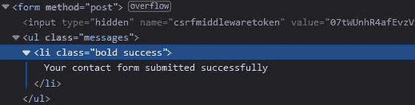

图 7.2 – Django 消息框架 – extra_tags 属性

### 那个静默失败

创建一个**静默失败**的消息，简单地说就是创建一个可重用的应用程序，使用 Django 消息框架，不需要其他开发者在不同的项目中启用 Django 消息框架。这意味着如果他们已禁用此框架或尚未启用，添加消息操作将不会阻止他们的项目正常工作。

要使用此选项，请将`fail_silently`属性添加到您的添加消息操作中，如下所示：

```py
# /becoming_a_django_entdev/chapter_7/views.py
```

```py
from django.contrib 
```

```py
import messages
```

```py
from django.views.generic.edit 
```

```py
import FormView
```

```py
from django.conf 
```

```py
import settings
```

```py
...
```

```py
class FormClassView(FormView):
```

```py
    ...
```

```py
    def post(self, request, *args, **kwargs):
```

```py
        ...
```

```py
        if form.is_valid():
```

```py
            messages.success(
```

```py
                request,
```

```py
                'Your contact form submitted successfully', 
```

```py
                fail_silently=True
```

```py
            )
```

```py
            ...
```

将`fail_silently`属性设置为`True`时，应用程序将正常运行，而不会出现阻止代码运行的错误。如果开发人员已禁用 Django 消息框架且未包含`fail_silently`属性，则在运行应用程序时，应触发一个闪存消息，您将看到**MessageFailure**错误，如下所示：

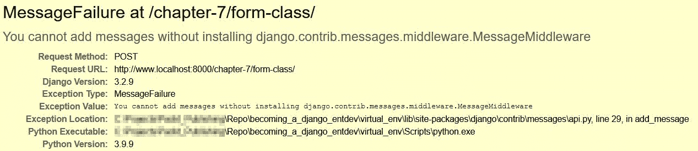

图 7.3 – Django 消息框架 – fail_silently 属性

在下一节中，我们将我们的消息渲染成模板，即 HTML。

## 显示消息

为了让消息真正被用户看到，我们需要在 Django 模板中添加一些代码。使用`chapter_7` `FormClassView`类使用的模板文件`/chapter_7/templates/chapter_7/form-class.html`，将以下代码添加到该模板中 HTML `<form>`对象的顶部：

```py
# /becoming_a_django_entdev/chapter_7/templates/chapter_7/form-class.html
```

```py
...
```

```py

```

```py
    ...
```

```py
    <form method="post">
```

```py
        
```

```py
        
```

```py
            <ul class="messages">
```

```py
                
```

```py
                    <li class="{{ message.tags }}">
```

```py
                        {{ message|safe }}
```

```py
                    </li>
```

```py
                
```

```py
            </ul>
```

```py
        
```

```py
        ...
```

此文件中的所有其他代码都可以保持不变。在这里，我们使用一个简单的条件语句来检查存储系统中是否存在此请求的消息。如果存在，则创建一个`<ul>`列表，然后遍历每个存在的消息，在该列表中为每个消息创建一个单独的`<li>`项目。消息本身使用`|safe`过滤器，允许它渲染消息字符串中可能存在的 HTML。

访问 URL `http://www.localhost:8000/chapter-7/form-class/` 并提交表单。有效或无效的消息将显示，具体取决于您是否实际触发了该表单的验证错误，如下面的截图所示：

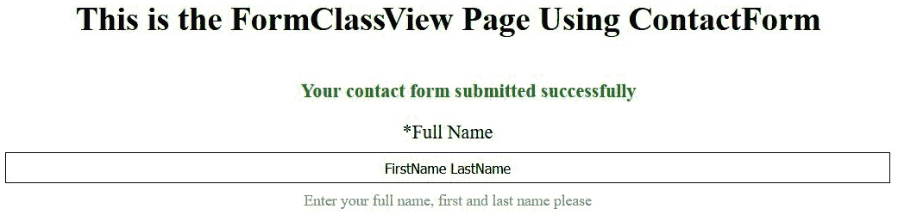

图 7.4 – Django 消息框架 – 显示消息

如果您使用的是本书提供的 CSS 类，前面的消息将在浏览器中以绿色显示。

现在我们已经启用了 Django 消息框架，并在我们的视图类中添加了几条消息，接下来让我们练习发送电子邮件通知而不是显示闪存消息。

# 配置电子邮件通知

本节将帮助我们构建实际的电子邮件通知而不是闪存消息。我们将编写逻辑以在添加消息的同一`FormClassView`类中的`post()`方法中触发发送电子邮件操作。我们将利用本章开头创建的 Mailtrap 账户来捕获我们项目发送的所有电子邮件。如果您尚未这样做，请创建一个 Mailtrap 账户，并在您的`settings.py`文件中配置该连接。如果不这样做，您将难以执行本节中的代码。

电子邮件存在三种 MIME 类型，如下所示：

+   `text/plain`

+   `application/rtf`

+   `text/html`

虽然存在三种 MIME 类型，但在发送电子邮件时 Django 只使用其中两种：纯文本和 HTML。富文本电子邮件被视为 HTML 电子邮件，因为它们包含 HTML 标记。

## 作为纯文本电子邮件

纯文本电子邮件就像其名称所暗示的那样；它们只是文本，没有其他内容。我们将在我们使用的`ContactForm`类中创建一个方法，准备并发送电子邮件。触发发送电子邮件的方法可以从技术上放置在任何类或任何文件中。按照以下步骤创建您的：

1.  在将`ContactForm`类复制到`/chapter_7/forms.py`文件中时，使用以下代码添加一个名为`send_email()`的新方法：

    ```py
    # /becoming_a_django_entdev/chapter_7/forms.py
    ...
    from django.core.mail 
    import EmailMessage
    ...
    class ContactForm(Form):
        ...
        def send_email(self, request):
            data = self.cleaned_data
            msg_body = 'Hello World'
            email = EmailMessage(
                subject = 'New Contact Form Entry',
                body = msg_body,
                from_email = 'no-reply@example.com',
                reply_to = ['no-reply@example.com'],
                cc = [],
                bcc = [],
                to = [data['email_1']],
                attachments = [],
                headers = {},
            )
            email.content_subtype = 'plain'
            email.send()
    ```

此方法将处理与格式化和发送电子邮件相关的所有繁琐工作。当然，这是一个基本的`text/plain`电子邮件，仅由`msg_body`变量组成的短语。`email.content_subtype`语句是我们告诉 Django 我们希望将此电子邮件格式化为纯文本电子邮件的地方。我们还从`django.core.mail`库中导入并使用了`EmailMessage`类，用于构建电子邮件和格式化与该电子邮件相关的标题。Django 还提供了基于方法的简单函数，例如`send_mail()`或`send_mass_mail()`，以及其他少量方法。我们将专注于`EmailMessage`类，因为它将涵盖我们在本章中需要实现的所有方面。要了解更多关于 Django 提供的所有电子邮件方法，请访问官方文档，网址为：[`docs.djangoproject.com/en/4.0/topics/email/`](https://docs.djangoproject.com/en/4.0/topics/email/)。

由于我们保持此示例非常基础，我们只定义了`subject`、`body`、`from_email`、`reply_to`和`to`属性。数据通过使用`self.cleaned_data`访问，我们将名为`email_1`的字段的值分配给`to`属性列表的值，即收件人的电子邮件地址。如果你要将电子邮件发送到多个地址，请在该列表中使用逗号分隔每个电子邮件地址，不要有空格。

1.  在`/chapter_7/views.py`文件中找到的`FormClassView`类中，保留与该视图类中发送消息相关的所有内容不变。要实际发送电子邮件，请将以下代码行添加到`post()`方法中，如图所示：

    ```py
    # /becoming_a_django_entdev/chapter_7/views.py
    from django.template.response 
    import TemplateResponse
    ...
    class FormClassView(FormView):
        ...
        def post(self, request, *args, **kwargs):
            form = self.form_class(request.POST)
            ...
            form.send_email(request)
            return TemplateResponse(
                request,
                self.template_name,
                context
            )
    ```

在这里，我们将发送电子邮件操作放置在`return`语句之上和检查表单是否有效的条件语句之下。我们目前没有将有效和无效表单提交的发送操作分开。

1.  现在，访问 URL `http://www.localhost:8000/chapter-7/form-class/`并提交表单，无论是有效还是无效状态。页面应该刷新而不会出现编程错误。你现在应该能在 Mailtrap 账户的收件箱中看到你的电子邮件，Mailtrap 账户的网址为[`mailtrap.io/inboxes/`](https://mailtrap.io/inboxes/)，如图所示：

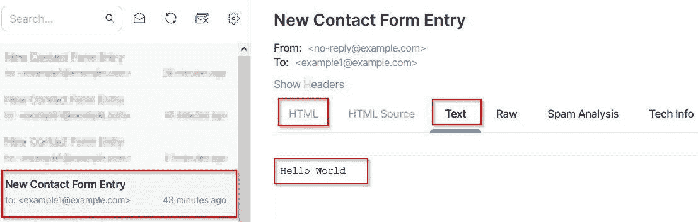


图 7.5 – Mailtrap – 纯文本电子邮件

你还会注意到电子邮件现在显示在`text/plain`下。

## 作为 HTML 电子邮件

配置 HTML 或富文本电子邮件相当简单。使用上一节中的相同示例，*作为纯文本电子邮件*，将纯文本电子邮件转换为 HTML 电子邮件只需更改两行代码。第一行代码是将`msg_body`变量更改为等于`'<b>Hello World</b>'`。这样，我们实际上可以传递 HTML 来查看它是否工作。第二行是将`email.content_subtype`的值更改为等于`'html'`，这样就完成了！

现在，再次访问相同的 URL，`http://www.localhost:8000/chapter-7/form-class/`，并提交表单。这次，当你访问 Mailtrap 收件箱[`mailtrap.io/inboxes/`](https://mailtrap.io/inboxes/)时，你应该能看到加粗的**Hello World**文本，如图所示：

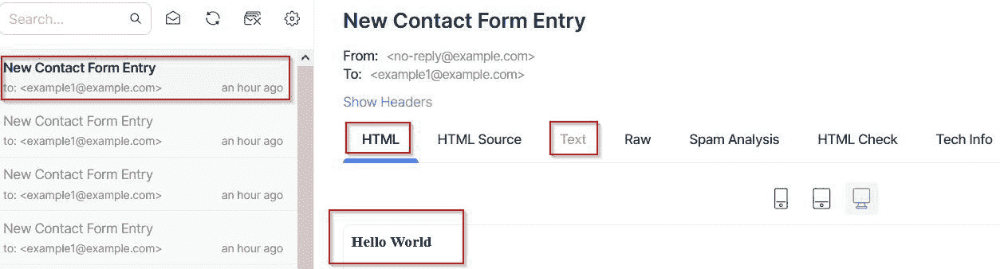


图 7.6 – Mailtrap – HTML 电子邮件

在前面的屏幕截图中，你还会看到电子邮件现在以`text/html` MIME 类型显示，没有提供文本回退，这意味着此电子邮件只提供 HTML。点击**Tech Info**标签将揭示有关你的电子邮件的其他详细信息。在此标签中，你可以验证实际的内容类型。检查 Content-Type 的值是否有等于**text/html; charset=utf-8**的 MIME 类型。

注意

`'html'`的值用于富文本和 HTML 格式的电子邮件。它们都将被发送为`text/html`。这是因为我们无法明确告诉 Django 为富文本电子邮件使用`'application/rtf'`。Django 只是假设富文本电子邮件是 HTML，因为它们包含 HTML 标记。

## 作为具有纯文本替代的 HTML 电子邮件

具有纯文本替代的 HTML 电子邮件用于难以渲染电子邮件 HTML 格式版本的电子邮件客户端，或者如果垃圾邮件拦截器只显示文本。我们需要使用 Django 提供的`EmailMultiAlternatives`类而不是`EmailMessage`类来完成此操作。`EmailMultiAlternatives`是`EmailMessage`类的扩展，这意味着`EmailMessage`类中所有可用的方法和属性都可以在这个类中使用，还有更多。当我们使用这个类时，我们格式化电子邮件为`text/html`，然后使用`EmailMultiAlternatives`类中可用的新的`attach_alternative()`方法，该替代电子邮件格式化为`text/plain`。

使用与*作为 HTML 电子邮件*子节相同的代码，并做出以下突出更改：

```py
# /becoming_a_django_entdev/chapter_7/forms.py
```

```py
...
```

```py
from django.core.mail 
```

```py
import (
```

```py
    EmailMessage,
```

```py
    EmailMultiAlternatives
```

```py
)
```

```py
...
```

```py
class ContactForm(Form):
```

```py
    ...
```

```py
    def send_email(self, request):
```

```py
        data = self.cleaned_data
```

```py
        msg_body = '<b>Hello World</b>'
```

```py
        email = EmailMultiAlternatives(
```

```py
            subject = 'New Contact Form Entry',
```

```py
            body = msg_body,
```

```py
            from_email = 'no-reply@example.com',
```

```py
            reply_to = ['no-reply@example.com'],
```

```py
            cc = [],
```

```py
            bcc = [],
```

```py
            to = [data['email_1']],
```

```py
            attachments = [],
```

```py
            headers = {},
```

```py
        )
```

```py
        email.content_subtype = 'html'
```

```py
        email.attach_alternative(
```

```py
            'Hello World',
```

```py
            'text/plain'
```

```py
        )
```

```py
        email.send()
```

在前面的例子中，我们只是将`EmailMessage`类替换为新的`EmailMultiAlternatives`类。然后，我们添加了`email.attact_alternative()`动作语句，该语句使用我们提供的文本`Hello World`格式化一个新的`text/plain`电子邮件，并将该新的纯文本格式化的电子邮件附加到原始 HTML 电子邮件上。我们这样做而不是使用`EmailMessage`类的`attachment`属性，因为我们实际上正在重构电子邮件的内容类型，使其现在成为`multipart/alternative` MIME 类型，而不是`text/html`或`text/plain` MIME 类型。

就这样；你现在有一个既是 HTML 又是纯文本的电子邮件。让我们验证一下。访问相同的 URL，`http://www.localhost:8000/chapter-7/form-class/`，并提交表单。这次，当你访问你的 Mailtrap 收件箱[`mailtrap.io/inboxes/`](https://mailtrap.io/inboxes/)时，你应该看到加粗的**Hello World**文本，并且也会看到**文本**标签现在突出显示并可点击，如图所示：

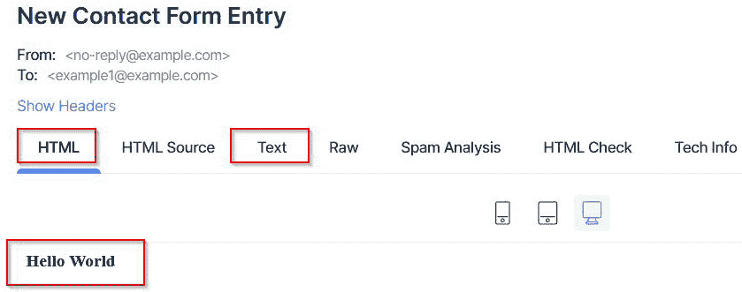

图 7.7 – Mailtrap – HTML 和纯文本电子邮件

点击**文本**标签将显示可用的纯文本格式。主要格式是 HTML，备用格式将是纯文本。在这个例子中，内容类型的顺序可以颠倒。当我们点击**技术信息**标签时，我们现在会看到**内容类型**显示为**multipart/alternative**，如图所示：

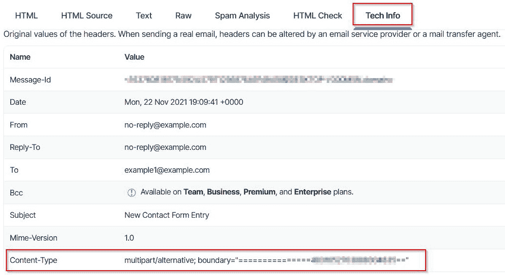

图 7.8 – Mailtrap – multipart/alternative

## 带有文件附件

发送带有文件附件的电子邮件也非常简单。Django 的 `EmailMessage` 类提供了一个名为 `attach_file()` 的方法，它允许我们通过传递该方法的两个位置参数（文件的路径和一个可选的 MIME 类型）轻松地附加文件。对于接下来的练习，请复制随本书代码一起提供的示例 PDF 文档，该文档位于 `/becoming_a_django_entdev/chapter_7/static/chapter_7/pdf/` 目录中，文件名为 `example.pdf`。在遵循此示例之前，请将此文件复制到与您的项目相同的目录中，或者创建一个自己的虚拟 PDF 文件。

在接下来的示例中，我们将继续在“作为纯文本替代的 HTML 电子邮件”部分中刚刚完成的最后一个示例，并将 `example.pdf` 文档附加到该电子邮件中。Django 文档描述了使用 `attach_file()` 方法，路径写为 `email.attach_file('static/chapter_7/pdf/example.pdf')`。这就是在许多 Django 项目中使用此方法时路径的定义方式。然而，由于使用了 `whitenoise` 包，我们必须导入 `settings.py` 文件并使用 `STATIC_ROOT` 变量，如下所示：

```py
# /becoming_a_django_entdev/chapter_7/forms.py
```

```py
...
```

```py
from django.conf 
```

```py
import settings
```

```py
...
```

```py
class ContactForm(Form):
```

```py
    ...
```

```py
    def send_email(self, request):
```

```py
        ...
```

```py
        email.attach_file(settings.STATIC_ROOT + '/chapter_7/pdf/example.pdf')
```

```py
        email.send()
```

注意

当使用 `STATIC_ROOT` 变量与 `whitenoise` 包结合使用时，我们现在必须运行 Django 管理命令 `collectstatic`，以便在本地运行项目时找到该文件。这不需要在每一个 Django 项目中执行，但在我们的项目中必须这样做。为此，首先停止项目运行。在终端或命令行窗口中，这可以通过在 Windows 上按 *Ctrl* + *C* 或在 Mac 上按 *Cmd* + *C* 并使用键盘来完成。然后，执行以下命令。当提示您这样做时，输入单词 `yes` 并按 *Enter* 键：

`(virtual_env) python manage.py collectstatic`

`(virtual_env) python manage.py runserver`

这是一个内置的 Django 命令，它将从您项目中加载的所有应用程序中收集静态文件，并将它们的副本放置到项目的 `STATIC_ROOT` 目录中，该目录被定义为 `/becoming_a_django_entdev/staticfiles/` 文件夹，我们在 Git 仓库中已忽略该文件夹。

就这样。现在，如果您访问相同的 URL，`http://www.localhost:8000/chapter-7/form-class/`，并提交表单，这次当您访问 Mailtrap 邮箱 [`mailtrap.io/inboxes/`](https://mailtrap.io/inboxes/) 时，您应该能在该电子邮件的右上角看到所附加的文件，如图所示：

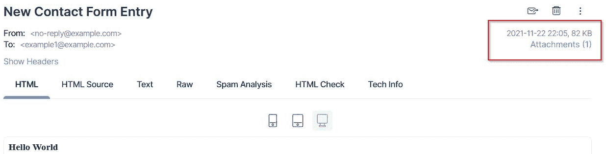

图 7.9 – Mailtrap – PDF 附件

Mailtrap 允许您点击此文档以打开和查看它或下载它。打开文档以查看它是否正常工作。

## 那个失败是静默的

开发者可以编写包含发送电子邮件等操作的可重用应用程序，并且让它们在失败时静默处理，就像我们使用 Django 消息框架时做的那样。这意味着当开发者安装了你的应用程序但尚未配置电子邮件客户端连接时，项目不会出错。Django 将此选项作为 `EmailMessage` 或 `EmailMultiAlternatives` 类的 `send()` 方法的属性提供。

要激活我们刚才编写的发送电子邮件示例中的 `fail_silently` 选项，请向现有的 `send()` 动作添加以下属性，如下所示：

```py
# /becoming_a_django_entdev/chapter_7/forms.py
```

```py
...
```

```py
class ContactForm(Form):
```

```py
    ...
```

```py
    def send_email(self, request):
```

```py
        ...
```

```py
        email.send(fail_silently=True)
```

这防止了当执行此代码时，`email.send()` 动作显示错误消息。

注意

Django 在使用前面提到的 `send_mail()` 和 `send_mass_mail()` 方法时也提供了此选项。要了解更多信息，请访问 [`docs.djangoproject.com/en/4.0/topics/email/`](https://docs.djangoproject.com/en/4.0/topics/email/)。

现在我们对 Django 中电子邮件的发送方式有了更好的理解，让我们继续创建我们自己的电子邮件模板，以便为我们客户提供定制服务。

# 编写自定义电子邮件模板

将 HTML 作为字符串写入 Python 可能会变得非常混乱。我们可以将正文内容，如 `'<b>Hello World</b>'`，作为 `.html` 模板文件编写。这将允许我们将多个电子邮件模板组织到 `chapter_7` 应用程序的 `/templates/emails/` 目录中。编程工作也可以以这种方式在开发者之间共享。电子邮件模板还可以用于纯文本格式的电子邮件，只需在 `.html` 文件中放置文本，而不包含任何 HTML 代码。虽然这听起来可能对纯文本电子邮件没有吸引力，但在与大量开发者合作时，这确实有其好处。让我们从使用纯文本电子邮件的最简单模板开始。

Django 提供了 `get_template()` 方法，位于 `django.template.loader` 库中。此方法将在以下子节中的所有电子邮件模板示例中使用。

## 对于纯文本电子邮件

按照以下步骤创建一个纯文本电子邮件的模板：

1.  在我们一直在使用的 `ContactForm` 类中，修改 `send_email()` 方法为以下代码：

    ```py
    # /becoming_a_django_entdev/chapter_7/forms.py
    ...
    from django.template.loader 
    import get_template
    ...
    class ContactForm(Form):
        ...
        def send_email(self, request):
            data = self.cleaned_data
            template = get_template(
                'chapter_7/emails/plain_text_format.html'
            )
            msg_body = template.render()
            email = EmailMessage(
                subject = 'New Contact Form Entry',
                body = msg_body,
                from_email = 'no-reply@example.com',
                reply_to = ['no-reply@example.com'],
                cc = [],
                bcc = [],
                to = [data['email_1']],
                attachments = [],
                headers = {},
            )
            email.content_subtype = 'plain'
            email.send(fail_silently = True)
    ```

在前面的代码中，我们导入了 `get_template()` 方法，并使用它来构建模板变量，该变量指向 `/chapter_7/emails/plain_text_format.html` 文件。

1.  现在，请在该目录下 `/chapter_7/templates/` 文件夹中创建该文件。在该文件中，只需添加文本 `Hello World`，不要添加其他内容。如果你在此文件中放置任何 HTML，它将作为纯文本正文内容中的字符串渲染，而不会作为 HTML 渲染。

1.  现在，访问相同的 URL，`http://www.localhost:8000/chapter-7/form-class/`，并提交表单。这次，当您访问您的 Mailtrap 收件箱[`mailtrap.io/inboxes/`](https://mailtrap.io/inboxes/)时，您应该会看到**HTML**标签已被禁用，只剩下**文本**标签来查看您的电子邮件。这也表明过程是成功的，如下面的截图所示：

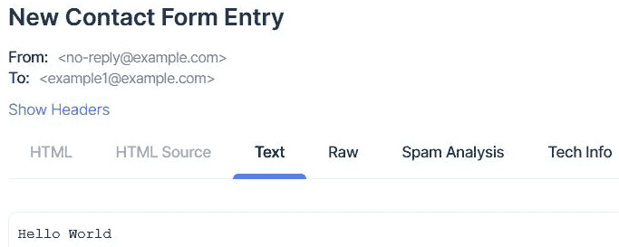

](img/Figure_7.10_B17243.jpg)

图 7.10 – Mailtrap – 纯文本模板

## 对于 HTML 电子邮件

编写 HTML 模板的方式与之前加载纯文本示例模板的方式相同。只需进行以下修改：

1.  首先，我们加载一个名为`html_format.html`的新文件，并将`content_subtype`改回`'html'`，如这里所示：

    ```py
    # /becoming_a_django_entdev/chapter_7/forms.py
    ...
    from django.template.loader 
    import get_template
    ...
    class ContactForm(Form):
        ...
        def send_email(self, request):
            data = self.cleaned_data
            template = get_template(
                'chapter_7/emails/html_format.html'
            )
            msg_body = template.render()
            email = EmailMessage(
                subject = 'New Contact Form Entry',
                body = msg_body,
                from_email = 'no-reply@example.com',
                reply_to = ['no-reply@example.com'],
                cc = [],
                bcc = [],
                to = [data['email_1']],
                attachments = [],
                headers = {},
            )
            email.content_subtype = 'html'
            email.send(fail_silently = True)
    ```

1.  现在，在您的`/chapter_7/templates/chapter_7/emails/`目录中创建`html_format.html`文件。在此文件中，放置以下代码，其中我们实际上需要像 HTML 页面一样格式化文档，并提供标记的`Hello World`文本：

    ```py
    # /becoming_a_django_entdev/chapter_7/templates/chapter_7/emails/html_format.html
    <!DOCTYPE html>
    <html lang="en" xmlns="http://www.w3.org/1999/xhtml">
        <head>
            <meta charset="utf-8" />
            <title>Hello World</title>
        </head>
        <body>
            <b>Hello World</b>
        </body>
    </html>
    ```

在此模板中，您可以按需格式化 HTML `<head>` 和 `<body>` 内容。甚至明智的做法是在此文档中包含响应式电子邮件和浏览器/客户端支持的语法，以确保在每种设备上都能正确渲染。您的电子邮件测试客户端通常会提供文档来帮助您处理这类事情。

1.  现在，访问相同的 URL，`http://www.localhost:8000/chapter-7/form-class/`，并提交表单。这次，当您访问您的 Mailtrap 收件箱[`mailtrap.io/inboxes/`](https://mailtrap.io/inboxes/)时，您应该会看到**HTML**标签现在已启用，而**文本**标签已被禁用。同样，这也表明过程是成功的，如以下所示：

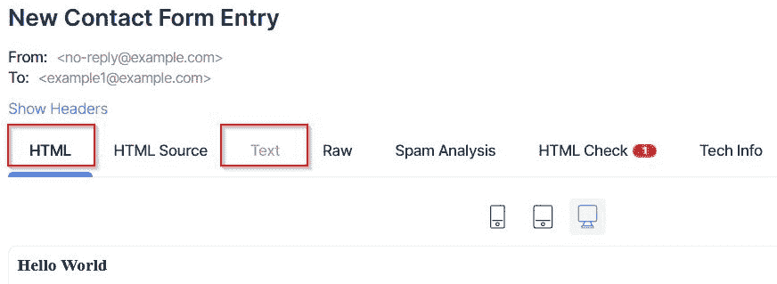

](img/Figure_7.11_B17243.jpg)

图 7.11 – Mailtrap – HTML 模板

## 提供模板上下文

当我们将动态内容引入等式中时，使用基于模板的电子邮件可以变得更加有用。为此，我们需要将上下文发送到`template.render()`语句。通过这样做，我们甚至可以将已定义为`data`变量的表单数据直接传递到模板中，在该模板中访问表单字段值。

在接下来的练习中，我们将渲染一个模板，该模板将显示用户为表单的每个字段输入的确切内容。按照以下步骤进行操作：

1.  在`ContactForm`的`send_email()`方法中，进行以下突出显示的更改：

    ```py
    # /becoming_a_django_entdev/chapter_7/forms.py
    ...
    from django.template.loader 
    import get_template
    ...
    class ContactForm(Form):
        ...
        def send_email(self, request):
            data = self.cleaned_data
            template = get_template('chapter_7/emails/new_contact_form_entry.html')
            context = {'data': data}
            msg_body = template.render(context)
            email = EmailMessage(
                subject = 'New Contact Form Entry',
                body = msg_body,
                from_email = 'no-reply@example.com',
                reply_to = ['no-reply@example.com'],
                cc = [],
                bcc = [],
                to = [data['email_1']],
                attachments = [],
                headers = {},
            )
            email.content_subtype = 'html'
            email.send(fail_silently = True)
    ```

1.  现在，在您的`/chapter_7/templates/chapter_7/emails/`目录中创建一个名为`new_contact_form_entry.html`的新文件，并将以下代码放入该文件中：

    ```py
    # /becoming_a_django_entdev/chapter_7/templates/chapter_7/emails/new_contact_form_entry.html
    
    <!DOCTYPE html>
    <html lang="en" xmlns="http://www.w3.org/1999/xhtml">
        <head>
            <meta charset="utf-8">
            <title>Contact Form Submitted</title>
        </head>
        <body>
            <center>
                <h1>New Contact Form Entry</h1>
                <h2>The field contents are listed below</h2>
                <ul>
                    <li>Full Name: {{ data.full_name }}</li>
                    <li>Email Field Example 1: {{ data.email_1 }}</li>
                    <li>Email Field Example 2: {{ data.email_2 }}</li>
                    <li>Email Field Example 3: {{ data.email_3 }}</li>
                    <li>Conditionally Required Field: {{ data.conditional_required }}</li>
                    <li>Multiple Emails Field: {{ data.multiple_emails }}</li>
                    <li>Message: {{ data.message }}</li>
                </ul>
            </center>
        </body>
    </html>
    ```

在这个模板中，您可以使用 Django 模板语言的标准标签和过滤器，例如编写条件语句来检查字段值是否等于特定值。这意味着您可以为存在于您的 `data` 变量中的所有字段编写循环，然后使用提供的字段标签而不是之前显示的定制标签。您还可以使用之前显示的加载标签加载 `static` 和/或自定义 `templatetags`，就像使用任何其他 Django 模板一样。

1.  现在，访问相同的 URL，`http://www.localhost:8000/chapter-7/form-class/`，并提交表单。这次，当您访问 Mailtrap 邮箱 [`mailtrap.io/inboxes/`](https://mailtrap.io/inboxes/) 时，您应该看到新电子邮件中每个字段的值，如图中所示：

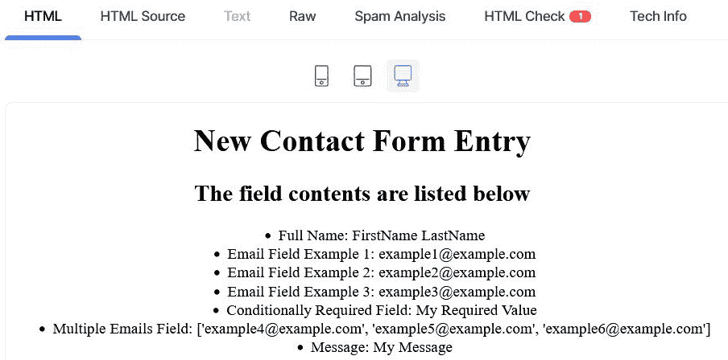

图 7.12 – Mailtrap – 模板上下文

接下来，让我们添加一个新的操作，在触发发送电子邮件操作的同一点创建 PDF 文档。

# 生成 PDF 报告

Django 依赖于第三方包的支持来生成 PDF 文档。他们自己的文档甚至建议使用 `reportlab` 包；然而，任何提供 PDF 支持的第三方包都可以使用。当使用除 `reportlab` 之外的内容时，请参阅该包的文档以获取如何使用该包的说明。`reportlab` 包甚至为开发者提供了示例 PDF 发票、报告、目录等，以便他们可以快速轻松地开始使用，前提是他们使用的是 `reportlab` 包的付费 Plus 版本。Plus 版本需要 `rlextra` 包，该包对公众不可用。要了解更多关于此服务和包可以提供的信息，请访问他们的文档 [`www.reportlab.com/dev/docs/`](https://www.reportlab.com/dev/docs/)。

在本节的所有练习中，我们将使用 `xhtml2pdf` 包，它也是免费的，但使用基于模板的 PDF 时更简单、更容易使用。我们将坚持为每个静态或动态 PDF 的内容创建一个单独的 `.html` 文件。

将 `xhtml2pdf` 包添加到您的 `requirements.txt` 文件中，并将其安装到您的虚拟环境或运行以下命令：

```py
(virtual_env) pip install xhtml2pdf
```

小贴士

在我合作的所有包中，我发现一些人在渲染复杂的 HTML 表格时存在困难。我建议完全避免使用表格，或者如果您需要将数据结构化为表格，请使用简单的结构以防止在文档创建过程中出现渲染差异和错误。

现在我们已经安装了一个生成 PDF 文档的工具，让我们来练习使用它。

## 作为基于模板的 PDF

在这里，我们将使用相同的 Django 模板语言来构建我们称之为 **PDF 模板** 的内容。

按照以下步骤创建您的模板：

1.  在`ContactForm`类中创建一个名为`generate_pdf()`的新方法，并包含以下代码：

    ```py
    # /becoming_a_django_entdev/chapter_7/forms.py
    ...
    from django.conf 
    import settings
    from django.http 
    import HttpResponse
    from django.template.loader 
    import get_template
    from xhtml2pdf 
    import pisa
    ...
    class ContactForm(Form):
        ...
        def generate_pdf(self, request):
            dest = open(settings.STATIC_ROOT + '/chapter_7/pdf/test.pdf', 'w+b')
            template = get_template('chapter_7/pdfs/pdf_template.html')
            html = template.render()
            result = pisa.CreatePDF(
                html,
                dest = dest,
            )
            return HttpResponse(result.err)
    ```

在这里，我们从`xhtml2pdf`包中导入`pisa`库，并使用`CreatePDF()`方法。我们还在使用 Python 的`open()`方法来指定我们想要创建的文档的目标文件夹和文件名。我们使用与之前相同的`STATIC_ROOT`变量，这很可能是由于我们的项目堆栈中的`whitenoise`包。正在创建的文件将位于`/becoming_a_django_entdev/staticfiles/chapter_7/pdf/`目录中。然后，我们将`result`变量设置为运行`CreatePDF()`方法的结果，其中我们传递渲染的 HTML 模板作为该 PDF 的内容。更多详细信息可在以下文档中找到：[`xhtml2pdf.readthedocs.io/en/latest/format_html.html`](https://xhtml2pdf.readthedocs.io/en/latest/format_html.html)。

注意

由于我们正在创建此文件，因此无需运行之前必须运行的`collectstatic`命令。

1.  接下来，在`FormClass_View`类的`post()`方法中，我们在这里编写了`send_email()`操作，让我们在该语句下方添加`generate_pdf()`操作，如下所示并突出显示：

    ```py
    # /becoming_a_django_entdev/chapter_7/views.py
    from django.template.response 
    import TemplateResponse
    from django.views.generic.edit 
    import FormView
    ...
    class FormClass_View(FormView):
        ...
        def post(self, request, *args, **kwargs):
            form = self.form_class(request.POST)
            ...
            form.send_email(request)
            form.generate_pdf(request)
            return TemplateResponse(
                request,
                self.template_name,
                context
            )
    ```

1.  接下来，在指定为 PDF 正文内容模板的`pdf_template.html`文件中，添加以下代码：

    ```py
    # /becoming_a_django_entdev/chapter_7/templates/chapter_7/pdfs/pdf_template.html
    <!DOCTYPE html>
    <html>
        <head></head>
        <body>
            <div id="header_obj"><h1>Header</h1></div>
            <div id="footer_obj">
                &copy;Footer - Page <pdf:pagenumber> of <pdf:pagecount>
            </div>
            <div class="body-content">
                <h2>Hello World</h2>
                <pdf:pdf-next-page />
            </div>
        </body>
    </html>
    ```

在这里，我们编写标准的 HTML 代码来创建 PDF 的内容。前面的示例在文档的每一页上创建了一个可重复使用的页眉和页脚。我们还使用特殊的供应商特定标签来告诉我们诸如当前页或文档的总页数等信息，例如在文档页脚中使用的`<pdf:pagenumber>`和`<pdf:pagecount>`。我们还使用了 Django 提供的``模板标签，该标签生成 50 段拉丁文本，使用我们传递给该函数的`50 p`值。代表**Lorem Ipsum**的拉丁文本仅用于说明在没有实际编写该内容的情况下，当有超过一页的内容时会发生什么。

1.  `size`属性用于指定我们想要指定的 HTML 文档大小，即 PDF 文档的物理大小和方向。接下来，使用`@page`和`@frame`CSS 对象来格式化你的 PDF 文档：

    ```py
    # /becoming_a_django_entdev/chapter_7/templates/chapter_7/pdfs/pdf_template.html
    ...
        <head>
            <style>
                @page {
                    size: a4 portrait;
                    @frame header_frame {
                        -pdf-frame-content: header_obj;
                        top: 50pt; left: 50pt;
                        width: 512pt; height: 40pt;
                    }
                    @frame content_frame {
                        top: 90pt; left: 50pt;
                        width: 512pt; height: 632pt;
                    }
                    @frame footer_frame {
                        -pdf-frame-content: footer_obj;
                        top: 772pt; left: 50pt;
                        width: 512pt; height: 20pt;
                    }
                }
                #header_obj { color: darkblue; text-align: center; }
                .body-content { color: black; text-align: left; }
                #footer_obj { color: green; text-align: right; }
            </style>
        </head>
    ...
    ```

`-pdf-frame-content`属性用于将`@frame`对象映射到具有与指定值匹配的 ID 属性的实际情况下的`<div>`。这必须是`<div>`而不是`<header>`或`<footer>`HTML 对象，否则你的内容将无法正确渲染。

1.  现在，访问相同的 URL，`http://www.localhost:8000/chapter-7/form-class/`，并提交表单。这次，您应该在您的`/becoming_a_django_entdev/staticfiles/chapter_7/pdf/`目录中看到一个名为`test.pdf`的新文件。当打开该文档时，您应该看到大约八页的随机生成的拉丁文文本，并且在每一页上，您都应该看到相同的页眉和页脚，如图所示：

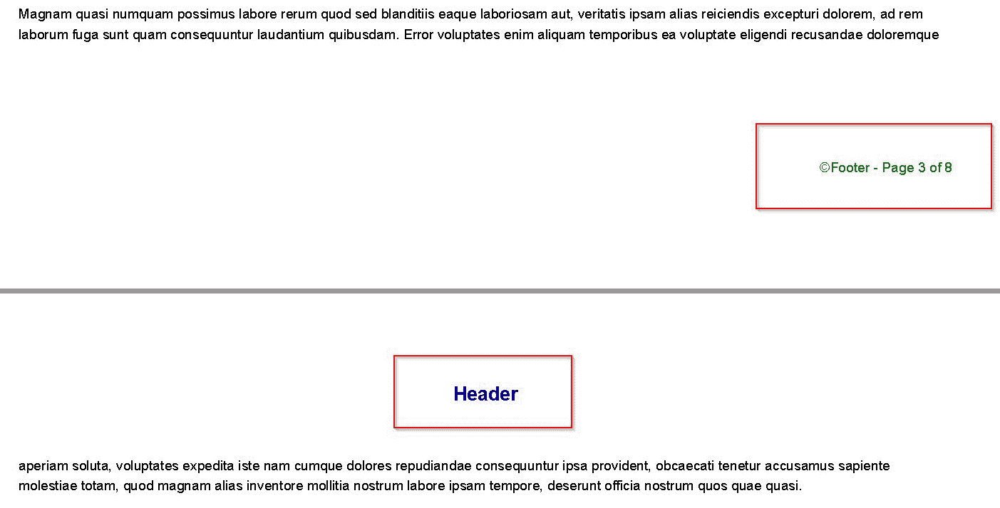

Figure 7.13 – xhmtl2pdf – 静态 PDF

小贴士

当打开此文档查看其外观时，尤其是在 Windows 上，您必须在再次提交表单之前关闭此文档，这将触发它生成一个新的文档。如果您不这样做，可能会遇到权限错误，表明另一个人或应用程序已经在使用该文件。

让我们接下来为 PDF 模板添加上下文。

## 添加上下文

让我们将表单字段值的内容传递到那个 PDF 中作为上下文。这种方法不一定要存在于表单类中；同样的，这也适用于`send_email()`方法。它们可以存在于视图或模型类中，甚至可以作为一个独立的实用方法，可以在任何地方使用。

目前，修改前面的示例，使用以下步骤传递上下文：

1.  在`ContactForm`类的同一个`generate_pdf()`方法中，进行以下突出显示的更改：

    ```py
    # /becoming_a_django_entdev/chapter_7/forms.py
    ...
    from django.conf 
    import settings
    from django.template.loader 
    import get_template
    from xhtml2pdf 
    import pisa
    ...
    class ContactForm(Form):
        ...
        def generate_pdf(self, request):
            data = self.cleaned_data
            context = { 'data': data }
            dest = open(settings.STATIC_ROOT + '/chapter_7/pdf/test_2.pdf', 'w+b')
            template = get_template(
                'chapter_7/pdfs/pdf_template.html'
            )
            html = template.render(context)
            result = pisa.CreatePDF(
                html,
                dest = dest,
            )
            return HttpResponse(result.err)
    ```

1.  接下来，在同一个`/chapter_7/pdfs/pdf_template.html`文件中，在现有的两行代码之间添加以下突出显示的代码，如图所示：

    ```py
    # /becoming_a_django_entdev/chapter_7/templates/chapter_7/pdfs/pdf_template.html
    ...
            <div class="body-content">
                <h2>Hello World</h2>
                <h3>The field contents are listed below</h3>
                <ul>
                    <li>Full Name: {{ data.full_name }}</li>
                    <li>Email Field Example 1: {{ data.email_1 }}</li>
                    <li>Email Field Example 2: {{ data.email_2 }}</li>
                    <li>Email Field Example 3: {{ data.email_3 }}</li>
                    <li>Conditionally Required Field: {{ data.conditional_required }}</li>
                    <li>Multiple Emails Field: {{ data.multiple_emails }}</li>
                    <li>Message: {{ data.message }}</li>
                </ul>
                <pdf:pdf-next-page />
            </div>
    ...
    ```

本章的*提供模板上下文*小节中编写的相同代码被使用。

1.  现在，访问相同的 URL，`http://www.localhost:8000/chapter-7/form-class/`，并提交表单。您应该在您的本地机器上的`/becoming_a_django_entdev/staticfiles/chapter_7/pdf/`目录中看到一个名为`test_2.pdf`的新文件。当您打开该文件时，应该仍然有八页的内容。在第一页上，将有一个包含我们刚刚传递到该 PDF 模板中的表单内容的列表，如图所示：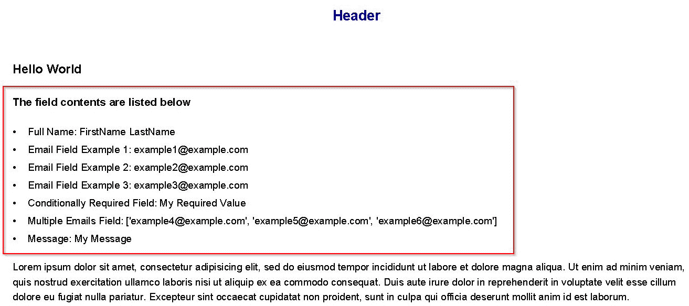

Figure 7.14 – xhmtl2pdf – 动态 PDF

现在我们知道了如何构建 PDF 模板和生成 PDF 文档，我们可以以非常干净和结构化的方式展示数据，这使得它们成为有价值的报告工具。

# 摘要

在完成本章中找到的练习后获得的技能之后，您现在可以创建和发送各种类型的信息、通知和报告。我们现在知道如何使用 Django 消息框架在每次页面加载或重新加载时提供闪存消息。我们可以创建和发送各种内容类型的电子邮件，甚至可以使用电子邮件测试客户端账户来捕获这些电子邮件，表明它们实际上正在工作。我们甚至安装了一个包并开始构建我们自己的 PDF 报告。

使用这些工具的任何组合来为您的项目增加价值。闪存消息、电子邮件通知和报告生成概念都有助于让用户了解并参与您的应用程序。始终记住，过多的信息可能会让用户感到不知所措，例如有成千上万的电子邮件通知涌入他们的收件箱。明智地使用它们！

Django 消息框架提供了一系列工具，可以为用户创建闪存消息。只需一点创意，Django 消息框架就可以与**异步 JavaScript 和 XML**（**AJAX**）一起使用，提供更类似于**单页应用程序**（**SPA**）的消息。在下一章，*第八章*，*使用 Django REST 框架*中，我们将讨论 Django REST 框架是什么以及如何使用它来处理 AJAX 请求。
