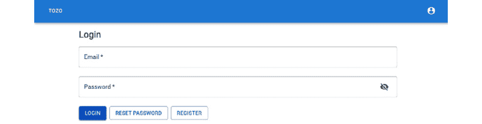

# 第四章：使用 React 创建可重用的前端

在上一章中，我们构建了一个用于管理会话、成员和待办事项的 API。在本章中，我们将创建一个前端，使其能够连接到该 API 或您可能希望使用的任何其他 API。此外，我们还将添加样式、路由、验证数据输入和通过 toast 提供反馈。

样式、路由、数据输入和反馈都是您应用中非常有用的功能，并不特定于待办事项。因此，在本章结束时，我们将创建一个前端，我们可以向其中添加具有任何特定功能的用户界面。

因此，在本章中，我们将涵盖以下主题：

+   提升基本的 React 应用

+   添加路由

+   启用数据输入

+   管理应用状态

+   支持 toast 反馈

# 技术要求

在本章中需要以下额外的文件夹，并应创建它们：

```py
tozo
└── frontend
    └── src
        └── components
```

要使用配套仓库 [`github.com/pgjones/tozo`](https://github.com/pgjones/tozo) 跟进本章的开发，请查看 `r1-ch4-start` 和 `r1-ch4-end` 标签之间的提交。

# 提升基本的 React 应用

在 *第一章** 的 *安装 NodeJS 用于前端开发* 部分，我们在 *设置开发系统* 中使用了 `create-react-app` 工具来创建一个标准的 React 应用，我们现在可以为此用途进行配置。

首先，由于我们正在使用前端开发服务器，我们需要通过在 *frontend/package.json* 中添加以下内容来代理 API 请求到我们的后端：

```py
{
  ...,
  "proxy": "http://localhost:5050"
}
```

突出的省略号表示现有的代码；请注意，已经添加了额外的尾随逗号。

接下来，我们将配置导入系统，以便我们可以使用以 *src* 为根的全路径（即，*src/components/Component*），而不是例如 *../components/Component*。这使得导入的文件更容易找到，因为我们总能将路径与 *src* 目录联系起来。这也与我们已经在后端使用的导入路径类型相匹配。为此，我们需要将以下内容添加到 *frontend/tsconfig.json*：

```py
{
  "compilerOptions": {
    "baseUrl": "./",
    ...
  }
}
```

`compilerOptions`部分应该已经存在，我们需要在其中添加`baseUrl`条目（突出显示的省略号表示现有的代码）。此外，我们需要安装`eslint-import-resolver-typescript`来通知`eslint`使用相同的`baseUrl`，在*frontend*目录中运行以下命令：

```py
npm install --save-dev eslint-import-resolver-typescript
```

这可以通过在 *frontend/package.json* 中的 `eslintConfig` 部分添加以下内容来配置：

```py
"eslintConfig": {
  "extends": [...],
  "settings": {
    "import/resolver": {
      "typescript": {}
    }
  }
}
```

突出的行表示现有 `eslintConfig` 部分内的现有代码。

通过这些小的配置更改，我们现在可以专注于设计应用样式、添加页面标题和添加认证上下文。

## 设计应用样式

构建一个设计系统并一致地使用它来设计应用程序需要付出很多努力。幸运的是，`MUI` ([mui.com](http://mui.com)) 是一个现有的 React 组件库，可以用来创建使用 Google 领先的 Material Design 系统的应用程序。在 *frontend* 目录中运行以下命令来安装 `MUI`：

```py
npm install @mui/material @mui/icons-material @mui/lab @emotion/react @emotion/styled 
```

由于材料设计和 MUI 基于 Roboto 字体，我们需要在 *frontend* 目录中运行以下命令来安装它：

```py
npm install @fontsource/roboto
```

此字体也需要包含在包中，因此以下导入应添加到 *frontend/src/App.tsx* 中：

```py
import "@fontsource/roboto/300.css";
import "@fontsource/roboto/400.css";
import "@fontsource/roboto/500.css";
import "@fontsource/roboto/700.css";
```

数字代表字体粗细（粗度）；默认情况下，`MUI` 只使用 `300`、`400`、`500` 和 `700` 的粗细，因此我们只需要这些。

语义化 HTML

MUI 非常擅长使用最描述性的 HTML 标签来表示元素；例如，MUI 按钮使用 `Button` 标签而不是对 `div` 标签进行样式化。这被称为 **语义化 HTML**，因为它使用 HTML 来加强内容的语义。这是一件重要的事情，因为它有助于可访问性并提高用户体验。

到目前为止，我们的应用程序将看起来与默认的 `MUI` 应用程序完全一样，但我们可以通过为主题化应用程序来改变这一点。为此，让我们在 *frontend/src/ThemeProvider.tsx* 中创建一个 `ThemeProvider` 元素，如下所示：

```py
import { useMemo } from "react";
import { PaletteMode } from "@mui/material";
import CssBaseline from "@mui/material/CssBaseline";
import useMediaQuery from "@mui/material/useMediaQuery";
import { createTheme, ThemeProvider as MuiThemeProvider } from "@mui/material/styles";
interface IProps {
  children: React.ReactNode;
}
const ThemeProvider = ({ children }: IProps) => {
  const prefersDarkMode = useMediaQuery("(prefers-color-scheme:     dark)"); 
  const theme = useMemo(
    () => {
      const palette = { 
        mode: (prefersDarkMode ? "dark" : "light") as           PaletteMode,
      }; 
      return createTheme({ palette }); 
    }, 
    [prefersDarkMode] 
  );
  return (
    <MuiThemeProvider theme={theme}>
      <CssBaseline enableColorScheme />
      { children }
    </MuiThemeProvider>
  );
};
export default ThemeProvider;
```

在这里，我们使用了 `CssBaseline` 组件来重置和标准化浏览器的样式，从而确保我们的应用程序在所有浏览器中看起来都一样。我们还使用了 `prefers-color-scheme` 系统首选项来根据用户的系统偏好将应用程序切换到深色模式。

`ThemeProvider` 应该在 `App` 组件中以任何样式化组件的父组件的形式渲染，即 *frontend/src/App.tsx* 应该如下所示：

```py
import ThemeProvider from "src/ThemeProvider";
const App = () => {
  return (
    <ThemeProvider>
    </ThemeProvider>
  );
}
```

注意，我已经将 `App` 函数定义的语法更改为使用箭头函数语法，而不是 `create-react-app` 为我们创建的函数定义语法。

函数式风格

TypeScript 允许使用 `function` 关键字或通过箭头 `=>` 语法来定义函数。虽然这两种风格之间存在差异，但对于 React 组件来说，使用哪种风格实际上没有区别。在这本书中，我将根据我的偏好使用箭头语法。

由于我们已经更改了 `App` 组件，我们还需要通过将 *frontend/src/App.test.tsx* 替换为以下内容来更新测试：

```py
import React from "react";
import { render } from "@testing-library/react";
import App from "./App";
test("renders the app", () => {
  render(<App />);
});
```

我们的目标是使应用程序能够在小手机屏幕、大桌面屏幕以及两者之间的所有屏幕上使用。我们可以通过为小手机屏幕构建应用程序并允许其根据屏幕大小调整大小来实现这一点。然而，正如你在 *图 4.1* 中可以看到的，当水平宽度很大时，这开始看起来很奇怪：


图 4.1：没有容器时应用程序的外观

通过在 *frontend/src/App.tsx* 中添加一个 `Container` 来解决这个问题：

```py
import Container from "@mui/material/Container";
const App = () => {
  return (
    <ThemeProvider>
      <Container maxWidth="md">
      </Container>
    </ThemeProvider>
  );
}
```

突出的行显示了添加的内容，结果如图 *4.2* 所示：



图 4.2：带有容器的应用外观

在设置样式后，我们现在可以为每个页面添加标题。

## 添加页面标题

我们可以通过配置页面标题，使其在用户浏览器中显示，从而为用户提供更好的体验，如图 *4.3* 所示：


图 4.3：标题（如 Chrome 所显示）

要设置标题，我们可以使用 `react-helmet-async`，这需要在 *frontend* 目录下运行以下命令：

```py
npm install react-helmet-async
```

要使用 `react-helmet-async`，我们需要通过在 *frontend/src/App.tsx* 中添加以下内容，将 `HelmetProvider` 添加为组件的祖先：

```py
import { Helmet, HelmetProvider } from "react-helmet-async";
const App = () => {
  return (
    <HelmetProvider>
      <Helmet>
        <title>Tozo</title>
      </Helmet>
      <ThemeProvider>
        <Container maxWidth="md">
        </Container>
      </ThemeProvider> 
    </HelmetProvider>
  );
}
```

突出显示的行将默认页面标题设置为 `Tozo`，并应添加到现有代码中。

我们现在可以创建一个 `Title` 组件，它既设置浏览器显示的标题，又在页面上显示清晰的标题文本，通过在 *frontend/src/components/Title.tsx* 中添加以下内容：

```py
import Typography from "@mui/material/Typography";
import { Helmet } from "react-helmet-async";
interface IProps {
  title: string;
}
const Title = ({ title }: IProps) => (
  <>
    <Helmet>
      <title>Tozo | {title}</title>
    </Helmet>
    <Typography component="h1" variant="h5">{title}    </Typography>
  </>
);
export default Title;
```

通过这个小的添加，我们现在可以思考应用如何知道用户是否已经认证。

## 添加认证上下文

前端应用需要跟踪用户当前是否已认证（登录），如果他们没有登录，则显示登录或注册页面。这是在整个应用中都会用到的东西，因此我们将通过在 *frontend/src/AuthContext.tsx* 中添加以下内容来使用一个 React 上下文，具体称为 `AuthContext`：

```py
import { createContext, useState } from "react";

interface IAuth {
  authenticated: boolean;
  setAuthenticated: (value: boolean) => void;
}

export const AuthContext = createContext<IAuth>({
  authenticated: true,
  setAuthenticated: (value: boolean) => {},
});

interface IProps {
  children?: React.ReactNode;
}

export const AuthContextProvider = ({ children }: IProps) => {
  const [authenticated, setAuthenticated] = useState(true);

  return (
    <AuthContext.Provider 
      value={{ authenticated, setAuthenticated }}
    >
      {children}
    </AuthContext.Provider>
  );
};
```

React 上下文和属性钻取

React 上下文最适合在 React 组件树中全局共享东西。这是因为提供者的任何子组件都将能够访问上下文。我们也可以通过通过树传递上下文来达到这个效果，这被称为属性钻取。然而，当有大量组件需要传递时，属性钻取很快就会变得繁琐。

要使这个上下文在整个应用中可用，我们可以在 *frontend/src/App.tsx* 中添加提供者：

```py
import { AuthContextProvider } from "src/AuthContext";

const App = () => {
  return (
    <AuthContextProvider>
      <HelmetProvider>
        <Helmet>
          <title>Tozo</title>
        </Helmet>
        <ThemeProvider>
          <Container maxWidth="md">
          </Container>
        </ThemeProvider> 
      </HelmetProvider>
    </AuthContextProvider>
  );
}
```

应该将突出显示的行添加到现有代码中。

这样就可以通过 `useContext` 钩子在任意组件中访问认证状态：

```py
import { AuthContext } from "src/AuthContext";
const { authenticated } = React.useContext(AuthContext);
```

我们将在设置路由时使用这个上下文。

# 添加路由

前端应用通常由多个页面组成，就像我们的待办事项应用一样。我们将通过路由来实现这一点，路由允许根据应用的路径渲染不同的页面组件。由于我们正在构建单页应用，这个路由将在前端代码中完成，而不是在多页应用中通常的后端完成。

我们将使用 React Router ([reactrouter.com](http://reactrouter.com)) 来处理应用中的路由。这需要在 *frontend* 目录下运行以下命令：

```py
npm install react-router-dom
```

单页应用

**单页应用**，通常称为**SPA**，是指从后端服务器只获取单个页面的 Web 应用。这个单页能够渲染应用内的所有页面。这是一个优点，因为从一页导航到另一页通常在 SPA 中更快；然而，这也带来了更大的初始下载成本。

我发现将所有路由放入一个名为`Router`的单个组件中更清晰，其中每个页面都是一个单独的`Route`。`Router`是通过在`*frontend/src/Router.tsx*`中添加以下内容来定义的：

```py
import { BrowserRouter, Routes } from "react-router-dom";
const Router = () => (
  <BrowserRouter>
    <Routes>
      {/* Place routes here */}
    </Routes>
  </BrowserRouter>
); 
export default Router;
```

然后，`Router`组件应该被渲染在`Container`组件中，如下所示，这应该添加到`*frontend/src/App.tsx*`中：

```py
import Router from "src/Router";

const App = () => {
  return (
    <AuthContextProvider>
      <HelmetProvider>
        <Helmet>
          <title>Tozo</title>
        </Helmet>
        <ThemeProvider>
          <Container maxWidth="md">
            <Router />
          </Container>
        </ThemeProvider> 
      </HelmetProvider>
    </AuthContextProvider>
  );
}
```

应该将突出显示的行添加到现有代码中。

我们现在可以为我们的路由添加认证，以确保某些页面只对已登录用户显示。

## 需要认证

应用程序中的大部分路由应该只对已登录的用户可用。因此，我们需要一个组件来检查用户是否已认证，并显示页面。或者，如果用户未认证，应用将重定向用户到登录页面。这是通过在`*frontend/src/components/RequireAuth.tsx*`中创建以下组件来实现的：

```py
import { useContext } from "react";
import { Navigate, useLocation } from "react-router-dom";
import { AuthContext } from "src/AuthContext";
interface IProps {
  children: React.ReactNode;
}
const RequireAuth = ({ children }: IProps) => {
  const { authenticated } = useContext(AuthContext);
  const location = useLocation();
  if (authenticated) {
    return <>{children}</>;
  } else {
    return <Navigate state={{ from: location }} to="/login/" />;
  }
};
export default RequireAuth;
```

导航状态被设置为包括当前位置，以便用户在成功认证后可以返回到页面。

然后，我们可以在`Route`组件内将`RequireAuth`用作`Page`组件的包装器，因为这确保了只有当用户认证后，`Page`才会显示，例如（这不应该添加到我们的应用中）：

```py
<Route 
  element={<RequireAuth><Page /></RequireAuth>} 
  path= "/private/" 
/>
```

路由设置的最后一点是控制导航时的滚动。

## 在导航时重置滚动

当用户在应用中导航并更改页面时，他们期望从页面顶部开始查看新页面（即页面的顶部）。由于视图或滚动位置将在 React Router 导航中保持固定，我们需要自己将其重置到顶部。我们可以通过以下组件来实现，该组件放置在`*frontend/src/components/ScrollToTop.tsx*`中：

```py
import { useEffect } from "react";
import { useLocation } from "react-router";

const ScrollToTop = () => {
  const { pathname } = useLocation();

  useEffect(() => {
    window.scrollTo(0, 0);
  }, [pathname]);

  return null;
};

export default ScrollToTop;
```

`useEffect`仅在它的`pathname`依赖项更改时触发，因此滚动仅在导航时发生。

应该通过在`*frontend/src/Router.tsx*`中添加以下内容，在`Router`组件中渲染此组件：

```py
import ScrollToTop from "src/components/ScrollToTop";

const Router = () => (
  <BrowserRouter>
    <ScrollToTop />
    <Routes>
      {/* Place routes here */}
    </Routes>
  </BrowserRouter>
);
```

应该将突出显示的行添加到现有代码中。

为了使前端测试通过，我们需要通过在`*frontend/src/setupTests.ts*`中添加以下内容来定义`window.scrollTo`函数：

```py
window.scrollTo = (x, y) => {
  document.documentElement.scrollTop = y;
}
```

这就是我们通过路由在我们的应用中启用页面所需的所有内容；现在，我们可以专注于用户如何输入数据。

# 启用数据输入

我们的应用程序用户需要输入他们的电子邮件和密码来登录，然后是待办任务的描述、截止日期和完成情况。这些字段需要分组到表单中；构建具有良好用户体验的表单需要大量努力，因为必须对每个字段和表单本身进行验证，并管理触摸状态、错误状态和焦点状态。

表单输入状态

表单输入框需要显示各种不同的状态，以帮助用户理解其使用方式和何时出现问题。首先，输入将处于空状态，没有值和错误。这很重要，因为输入不应该在用户触摸/交互之前显示错误。然后，当用户与其交互时，输入应显示它处于焦点状态。最后，在输入被触摸后，如果值不验证，则需要显示错误状态。

我们将使用 Formik ([formik.org](http://formik.org)) 来管理表单和字段状态，并使用 Yup ([github.com/jquense/yup](http://github.com/jquense/yup)) 来验证输入数据。这些是通过在 *前端* 目录中运行以下命令来安装的：

```py
npm install formik yup
```

由于我们将使用 MUI 进行样式化和 Formik 来管理状态，因此我们需要创建结合两者的字段组件。虽然这会因每个字段而异，但以下函数对所有组件都很有用，应该放置在 *前端/src/utils.tsx*：

```py
import { FieldMetaProps } from "formik";
import React from "react";
export const combineHelperText = <T, >(
    helperText: React.ReactNode | string | undefined, 
    meta: FieldMetaProps<T>,
) => {
  if (Boolean(meta.error) && meta.touched) {
    if (typeof helperText === "string") {
      return `${meta.error}. ${helperText ?? ""}`;
    } else {
      return (<>{meta.error}. {helperText}</>);
    }
  } else {
    return helperText;
  }
}
```

这个通用函数通过从 Formik 元数据属性中提取错误，并在有错误且用户触摸了输入时与辅助文本一起显示来工作。在 `<T, >` 中的逗号是必需的，用于区分我们想要的通用用法和 `<T>` JSX 元素单独所暗示的内容。

在安装了 Formik 并准备好使用辅助函数后，我们可以开始创建字段组件，从复选框字段开始。

## 实现一个样式化的复选框字段

在我们的应用程序中，我们需要一个复选框字段来指示待办事项是否完成，或者指示用户在登录时是否希望被记住。以下内容应添加到 *前端/src/components/CheckboxField.tsx*：

```py
import Checkbox from "@mui/material/Checkbox";
import FormControl from "@mui/material/FormControl";
import FormControlLabel from "@mui/material/FormControlLabel";
import FormHelperText from "@mui/material/FormHelperText";
import { FieldHookConfig, useField } from "formik";
import { combineHelperText } from "src/utils";

type IProps = FieldHookConfig<boolean> & {
  fullWidth?: boolean;
  helperText?: string;
  label: string;
  required?: boolean;
};

const CheckboxField = (props: IProps) => {
  const [field, meta] = useField<boolean>(props);

  return (
    <FormControl
      component="fieldset"
      error={Boolean(meta.error) && meta.touched}
      fullWidth={props.fullWidth}
      margin="normal"
      required={props.required}
    >
      <FormControlLabel
        control={<Checkbox {...field} checked={field.value} />}
        label={props.label}
      />
      <FormHelperText>
        {combineHelperText(props.helperText, meta)}
      </FormHelperText>
    </FormControl>
  );
};

export default CheckboxField;
```

尽管大部分代码是为了按照材料设计系统指定的样式化复选框，但关键方面是使用 `useField` 钩子来提取 Formik 状态，以便在 MUI 组件中使用。

我们现在可以继续到下一个字段，即日期输入字段。

## 实现一个样式化的日期字段

我们需要一个日期字段，让用户指定待办事项的截止日期，它将类似于 *图 4.4*：


图 4.4：移动屏幕上的日期选择器

要做到这一点，我们将使用 `MUI-X` ([mui.com/x](http://mui.com/x)) 组件而不是内置的浏览器日期选择器，因为 `MUI-X` 选择器对用户来说更容易使用。`MUI-X` 是一套高级 `MUI` 组件，因此它与 `MUI` 一起工作，并遵循相同的样式。除了 `MUI-X` 之外，我们还需要 `date-fns` 来将字符串解析为 `Date` 实例。

这两个组件都是通过在 *前端* 文件夹中运行以下命令来安装的：

```py
npm install @mui/x-date-pickers date-fns
```

安装了这些库后，我们可以在 *frontend/src/components/DateField.tsx* 中添加以下内容，以创建一个提供日期选择器的 `DateField` 组件，如图 4.4 所示：

```py
import TextField, { TextFieldProps } from "@mui/material/TextField";
import { AdapterDateFns } from "@mui/x-date-pickers/AdapterDateFns";
import { DatePicker } from "@mui/x-date-pickers/DatePicker";
import { LocalizationProvider } from "@mui/x-date-pickers/LocalizationProvider";
import { FieldHookConfig, useField } from "formik";
import { combineHelperText } from "src/utils";

const DateField = (
  props: FieldHookConfig<Date | null> & TextFieldProps
) => {
  const [field, meta, helpers] = useField<Date | null>(props);
  return (
    <LocalizationProvider dateAdapter={AdapterDateFns}>
      <DatePicker
        label={props.label}
        value={field.value}
        onChange={(newValue) => helpers.setValue(newValue)}
        renderInput={(params) => (
          <TextField 
            fullWidth={props.fullWidth}
            {...params} 
            helperText={combineHelperText(props.helperText, meta)} 
          />
        )}
      />
    </LocalizationProvider>
  );
}; 
export default DateField;
```

接下来，我们可以在输入电子邮件的表单中添加一个字段组件。

## 实现一个带样式的电子邮件字段

我们需要一个电子邮件字段，让用户登录和注册。为此，以下内容应添加到 *frontend/src/components/EmailField.tsx*：

```py
import TextField, { TextFieldProps } from "@mui/material/TextField";
import { FieldHookConfig, useField } from "formik";
import { combineHelperText } from "src/utils";

const EmailField = (props: FieldHookConfig<string> & TextFieldProps) => {
  const [field, meta] = useField<string>(props);
  return (
    <TextField
      {...props}
      autoComplete="email"
      error={Boolean(meta.error) && meta.touched}
      helperText={combineHelperText(props.helperText, meta)}
      margin="normal"
      type="email"
      {...field}
    />
  );
};

export default EmailField;
```

接下来，我们可以添加一个简单的文本字段。

## 实现一个带样式的文本字段

我们需要一个文本字段，让用户输入待办任务信息。为此，以下内容应添加到 *frontend/src/components/TextField.tsx*：

```py
import MUITextField, { TextFieldProps } from "@mui/material/TextField";
import { FieldHookConfig, useField } from "formik";
import { combineHelperText } from "src/utils";

const TextField = (props: FieldHookConfig<string> & TextFieldProps) => {
  const [field, meta] = useField<string>(props);
  return (
    <MUITextField
      {...props}
      error={Boolean(meta.error) && meta.touched}
      helperText={combineHelperText(props.helperText, meta)}
      margin="normal"
      type="text"
      {...field}
    />
  );
};

export default TextField;
```

最后，我们可以添加一个密码输入字段。

## 实现一个带样式的密码字段

我们需要一个密码字段，让用户在登录或更改密码时输入他们的现有密码。这个字段应该有一个可见性切换按钮，使得密码可见，因为这有助于用户正确地输入密码。

要做到这一点，以下内容应添加到 *frontend/src/components/PasswordField.tsx*：

```py
import IconButton from "@mui/material/IconButton";
import InputAdornment from "@mui/material/InputAdornment";
import TextField, { TextFieldProps } from "@mui/material/TextField";
import Visibility from "@mui/icons-material/Visibility";
import VisibilityOff from "@mui/icons-material/VisibilityOff";
import { FieldHookConfig, useField } from "formik";
import { useState } from "react";
import { combineHelperText } from "src/utils";

const PasswordField = (props: FieldHookConfig<string> & TextFieldProps) => {
  const [field, meta] = useField<string>(props);
  const [showPassword, setShowPassword] = useState(false);

  return (
    <TextField
      {...props}
      InputProps={{
        endAdornment: (
          <InputAdornment position="end">
            <IconButton
              onClick={() => setShowPassword((value) =>                 !value)}
              tabIndex={-1}
            >
              {showPassword ? <Visibility /> :                 <VisibilityOff />}
            </IconButton>
          </InputAdornment>
        ),
      }}
      error={Boolean(meta.error) && meta.touched}
      helperText={combineHelperText(props.helperText, meta)}
      margin="normal"
      type={showPassword ? "text" : "password"}
      {...field}
    />
  );
};

export default PasswordField;
```

可见性按钮被赋予 `tabIndex` 值为 `-1`，以将其从标签流中移除，这样在输入密码后按下 *Tab* 键会将焦点移至下一个字段而不是可见性按钮，从而符合用户的期望。

## 实现一个带样式的密码强度字段

现有的密码字段允许用户输入密码，但不会给出密码强度指示。当用户注册或更改密码时，这将非常有用。在过去，应用程序会强制要求密码中包含特殊的大写和小写字母字符，以使密码强度更高。然而，这很遗憾地导致了更弱的密码。因此，我们将要求密码足够强大，通过计算其熵来实现（这是我们在 *第二章*，*使用 Quart 创建可重用后端）中已经做到的）。

仅在后端 API 调用中检查强度会导致用户体验不佳，因为用户需要很长时间才能收到关于密码强度的反馈。幸运的是，有一个 `zxcvbn` 版本，我们可以在前端使用它来为用户提供关于密码强度的即时反馈。

首先，我们应该在 *前端* 目录中运行以下命令来安装它：

```py
npm install zxcvbn 
npm install --save-dev @types/zxcvbn
```

我们希望这个字段能够立即向用户提供关于他们密码强度的视觉反馈，无论是通过颜色（随着密码强度的提高而变得更绿），还是通过显示**好**或**强**的文本来表示。因此，让我们向`*frontend/src/components/PasswordWithStrengthField.tsx*`添加以下函数：

```py
const scoreToDisplay = (score: number) => {
  let progressColor = "other.red";
  let helperText = "Weak";
  switch (score) {
    case 25:
      progressColor = "other.pink";
      break;
    case 50:
      progressColor = "other.orange";
      break;
    case 75:
      progressColor = "other.yellow";
      helperText = "Good";
      break;
    case 100:
      progressColor = "other.green";
      helperText = "Strong";
      break;
  }
  return [progressColor, helperText];
};
```

然后，我们可以在字段本身中使用此函数，通过向`*frontend/src/components/PasswordWithStrengthField.tsx*`添加以下内容：

```py
import LinearProgress from "@mui/material/LinearProgress";
import { TextFieldProps } from "@mui/material/TextField";
import { FieldHookConfig, useField } from "formik";
import zxcvbn from "zxcvbn";
import PasswordField from "src/components/PasswordField";
const PasswordWithStrengthField = (
  props: FieldHookConfig<string> & TextFieldProps,
) => {
  const [field] = useField<string>(props);
  const result = zxcvbn(field.value ?? "");
  const score = (result.score * 100) / 4;
  const [progressColor, helperText] = scoreToDisplay(score);
  return (
    <>
      <PasswordField {...props} helperText={helperText} />
      <LinearProgress
        sx={{
          "& .MuiLinearProgress-barColorPrimary": {
            backgroundColor: progressColor,
          },
          backgroundColor: "action.selected",
          margin: "0 4px 24px 4px",
        }}
        value={score}
        variant="determinate"
      />
    </>
  );
};
export default PasswordWithStrengthField;
```

此代码在现有的`PasswordField`下方渲染一个`LinearProgress`组件，并根据已添加的`scoreToDisplay`函数着色。

`PasswordWithStrengthField`使用`zxcvbn`来确定密码强度。这意味着任何直接导入`PasswordWithStrengthField`的组件都会将`zxcvbn`添加到其包中，这是一个问题，因为`zxcvbn`非常大。因此，为了仅在需要时加载`zxcvbn`，我们可以通过向`*frontend/src/components/LazyPasswordWithStrengthField.tsx*`添加以下内容来使用 React 的懒加载和 suspense 系统：

```py
import { TextFieldProps } from "@mui/material/TextField"; 
import { lazy, Suspense } from "react";
import { FieldHookConfig } from "formik";
import PasswordField from "src/components/PasswordField";
const PasswordWithStrengthField = lazy( 
  () => import("src/components/PasswordWithStrengthField"), 
);
const LazyPasswordWithStrengthField = (
  props: FieldHookConfig<string> & TextFieldProps, 
) => (
  <Suspense fallback={<PasswordField {...props} />}>
    <PasswordWithStrengthField {...props} />
  </Suspense>
);
export default LazyPasswordWithStrengthField;
```

现在，`PasswordField`将显示给用户，直到`zxcvbn`被下载，从而通过确保只有在用户需要时才下载来提高用户体验。

这些都是我们待办事项应用所需的定制字段；接下来，我们需要一组样式化的操作按钮。

## 实现样式化表单操作

我们实现的字段将包含在需要提交的表单中。因此，让我们添加一个有用的辅助`FormActions`组件，允许用户将表单作为主要操作提交，或者作为次要操作导航到其他地方。以下代码应添加到`*frontend/src/components/FormActions.tsx*`：

```py
import Button from "@mui/material/Button"; 
import LoadingButton from "@mui/lab/LoadingButton"; 
import Stack from "@mui/material/Stack";
import { Link } from "react-router-dom";
interface ILink {
  label: string;
  to: string;
  state?: any;
}
interface IProps {
  disabled: boolean;
  isSubmitting: boolean;
  label: string;
  links?: ILink[];
}
const FormActions = ({ disabled, isSubmitting, label, links }: IProps) => (
  <Stack direction="row" spacing={1} sx={{ marginTop: 2 }}>
    <LoadingButton
      disabled={disabled}
      loading={isSubmitting}
      type="submit"
      variant="contained"
    > 
      {label}
    </LoadingButton> 
    {(links ?? []).map(({ label, to, state }) => (
      <Button 
        component={Link}
        key={to}
        state={state}
        to={to}
        variant="outlined" 
      >
        {label}
      </Button>
    ))}
  </Stack>
);
export default FormActions;
```

主要操作通过使用`LoadingButton`组件来显示，因为它允许我们通过旋转的圆圈向用户指示表单提交正在进行中。如果没有这种反馈，用户可能会认为应用已冻结或忽略了他们的点击。

现在我们已经拥有了用户输入数据所需的所有字段和辅助组件。这意味着我们可以专注于如何管理应用的状态，特别是如何从后端获取数据并将其存储在应用的状态中。

# 管理应用状态

与后端一样，拥有代表应用中使用的数据的模型很有帮助。这些模型将验证数据，帮助 linters 确保我们正确地使用数据，并确保使用正确的类型。我们还将使用模型来正确地将数据转换为与后端 API 通信时使用的 JSON 表示形式。

待办事项模型需要根据从后端接收到的内容或用户输入的数据构建。然后，模型需要以 JSON 格式输出，以便可以将此输出发送到后端。此外，模型还应验证构建它的数据是否具有正确的结构，并转换类型（即，将表示 JSON 中日期的字符串转换为 `Date` 实例）。

我们只需要在前端为待办事项提供一个模型，因此我们需要在 *frontend/src/models.ts* 中添加以下内容：

```py
import { formatISO } from "date-fns";
import * as yup from "yup";
const todoSchema = yup.object({
  complete: yup.boolean().required(),
  due: yup.date().nullable(),
  id: yup.number().required().positive().integer(),
  task: yup.string().trim().min(1).defined().strict(true), 
});
export class Todo {
  complete: boolean;
  due: Date | null;
  id: number;
  task: string;

  constructor(data: any) {
    const validatedData = todoSchema.validateSync(data);  
    this.complete = validatedData.complete;
    this.due = validatedData.due ?? null;
    this.id = validatedData.id;
    this.task = validatedData.task;
  }

  toJSON(): any {
    return {
      complete: this.complete,
      due:
        this.due !== null
          ? formatISO(this.due, { representation: "date" })
          : null,
      id: this.id,
      task: this.task,
    };
  }
}
```

`todoSchema` 在构造函数中使用，以确认数据具有正确的结构并转换类型。`toJSON` 方法是一个标准的 JavaScript 方法，用于将对象转换为 JSON 兼容的结构，这是通过将到期日期转换为 ISO 8601 格式的字符串来完成的。

虽然这个模型是针对我们的应用程序特定的，但使用带有 `yup` 验证的类是任何应用程序数据的良好模式。

在建立模型之后，我们现在可以与后端通信了，这是我们接下来要关注的重点。

## 与后端通信

我们需要从后端 API 发送和接收数据，并将其存储在本地状态中，以便在渲染各种组件时使用。首先，让我们安装 `axios`，因为它在发送和接收 JSON 方面比内置的 `fetch` 函数有更友好的 API。在 *frontend* 文件夹中运行以下命令即可安装：

```py
npm install axios
```

我们需要以允许跨多个组件使用的方式存储接收到的数据。为了管理这个状态，我们将使用 `React-Query` ([`tanstack.com/query/v4`](https://tanstack.com/query/v4))，因为它易于使用且令人愉悦。首先，让我们在 *frontend* 目录中运行以下命令来安装它：

```py
npm install @tanstack/react-query
```

要使用 `React-Query`，必须通过 React-Query 的 `QueryClientProvider` 提供一个 `QueryClient`。这是通过在 *frontend/src/App.tsx* 中添加以下内容来实现的：

```py
import { QueryClient, QueryClientProvider } from "@tanstack/react-query";
const queryClient = new QueryClient();

const App => {
  return (
    <QueryClientProvider client={queryClient}>
      <AuthContextProvider>
        <HelmetProvider>
          <Helmet>
            <title>Tozo</title>
          </Helmet>
          <ThemeProvider>
            <Container maxWidth="md">
              <Router />
            </Container>
          </ThemeProvider> 
        </HelmetProvider>
      </AuthContextProvider>
    </QueryClientProvider>
  );
};
```

应该将突出显示的行添加到现有代码中。

我们需要调整 React-Query，使得未认证的请求会导致 `AuthContext` 发生变化。这是为了处理用户在未先登录的情况下访问页面的情况。我们还将只允许在服务器没有响应或响应状态码为 `5XX` 时重试。

状态管理

在 React 中，渲染的输出必须是当前状态的函数。因此，当从后端获取数据时，我们需要管理各种获取状态。这些状态从获取加载开始，根据结果进展到成功或错误状态。假设获取成功，那么数据在需要再次获取之前的有效时长就是一个问题。所有这些状态都由 React-Query 帮助我们管理。

为了做到这一点，我们首先需要在 *frontend/src/query.ts* 文件中围绕 React-Query 的 `useQuery` 写一个包装器，该包装器用于从后端 API 获取数据，通过添加以下内容：

```py
import axios, { AxiosError } from "axios";
import { useContext } from "react";
import {
  QueryFunction,
  QueryFunctionContext,
  QueryKey,
  useQuery as useReactQuery,
  UseQueryOptions,
  UseQueryResult,
} from "@tanstack/react-query";

import { AuthContext } from "src/AuthContext";

const MAX_FAILURES = 2;

export function useQuery<
  TQueryFnData = unknown,
  TData = TQueryFnData,
  TQueryKey extends QueryKey = QueryKey,
>(
  queryKey: TQueryKey,
  queryFn: QueryFunction<TQueryFnData, TQueryKey>,
  options?: UseQueryOptions<TQueryFnData, AxiosError, TData, TQueryKey>,
): UseQueryResult<TData, AxiosError> {
  const { setAuthenticated } = useContext(AuthContext);

  return useReactQuery<TQueryFnData, AxiosError, TData, TQueryKey>(
    queryKey,
    async (context: QueryFunctionContext<TQueryKey>) => {
      try {
        return await queryFn(context);
      } catch (error) {
        if (axios.isAxiosError(error) && error.response?.status === 401) {
          setAuthenticated(false);
        }
        throw error;
      }
    },
    {
      retry: (failureCount: number, error: AxiosError) =>
        failureCount < MAX_FAILURES &&
        (!error.response || error.response.status >= 500),
      ...options,
    },
  );
}
```

这段代码通过检查 401 响应状态码的错误来包装标准的`useQuery`钩子，如图中第一个高亮块所示。由于 401 响应表示用户未认证，因此随后更新了本地认证状态。

代码还提供了逻辑来决定何时重试请求，如图中第二个高亮块所示。如果出现网络错误（无响应）或服务器错误（由`5XX`响应代码指示），逻辑将重试请求，最多重试两次。注意，因此，在出现网络故障的情况下，查询将在所有三次尝试都失败之前处于加载状态。

现在，我们将向 React-Query 的`useMutation`添加相同的逻辑，该钩子通过以下方式添加到*frontend/src/query.ts*：

```py
import {
  MutationFunction,
  useMutation as useReactMutation,
  UseMutationOptions,
  UseMutationResult,
} from "@tanstack/react-query";
export function useMutation<
  TData = unknown,
  TVariables = void,
  TContext = unknown,
>(
  mutationFn: MutationFunction<TData, TVariables>,
  options?: UseMutationOptions<TData, AxiosError, TVariables, TContext>,
): UseMutationResult<TData, AxiosError, TVariables, TContext> {
  const { setAuthenticated } = useContext(AuthContext);

  return useReactMutation<TData, AxiosError, TVariables, TContext>(
    async (variables: TVariables) => {
      try {
        return await mutationFn(variables);
      } catch (error) {
        if (axios.isAxiosError(error) && error.response?.status === 401) {
          setAuthenticated(false);
        }
        throw error;
      }
    },
    {
      retry: (failureCount: number, error: AxiosError) =>
        failureCount < MAX_FAILURES &&
        (!error.response || error.response.status >= 500),
      ...options,
    },
  );
}
```

这个`useMutation`钩子具有与`useQuery`钩子相同的认证包装和重试逻辑。

这两个新的钩子可以在应用的任何部分以与标准 React-Query 钩子相同的方式使用。例如，`useQuery`钩子可以这样使用：

```py
import { useQuery } from "src/queries";
const Component = () => {
  const { data } = useQuery(
    ["key"], 
    async () => {
      const response = await axios.get<any>("/");
      return response.data;
    },
  );
  return (<>{ data }</>);
};
```

现在我们可以完全与后端交互，并存储适当的状态，这使我们能够专注于向用户提供反馈。

# 支持吐司反馈

**吐司**（在 MUI 中称为**Snackbar**）可以用来向用户展示与页面上的直接元素无关的反馈。良好的吐司使用方式是在请求后端失败时显示错误消息，如图*4.5*所示，或者在用户更改密码后显示成功消息，因为没有直接通过页面内容进行确认。不良的使用方式是报告输入的电子邮件无效，在这种情况下，电子邮件字段应该显示错误。


图 4.5：吐司错误示例

为了支持吐司，我们需要能够从应用的任何组件中添加吐司，并显示该吐司。关键的是，如果有多个吐司，它们应该一个接一个地显示，以确保不会同时显示多个吐司。这是另一个 React 上下文用例，类似于之前添加的认证上下文。因此，让我们首先将以下吐司上下文添加到*frontend/src/ToastContext.tsx*：

```py
import { AlertColor } from "@mui/material/Alert";
import React, { createContext, useState } from "react";

export interface IToast {
  category?: AlertColor;
  key: number;
  message: string;
}

interface IToastContext {
  addToast: (message: string, category: AlertColor | undefined) => void;
  setToasts: React.Dispatch<React.SetStateAction<IToast[]>>;
  toasts: IToast[];
}

export const ToastContext = createContext<IToastContext>({
  addToast: () => {},
  setToasts: () => {},
  toasts: [],
});

interface IProps {
  children?: React.ReactNode;
}

export const ToastContextProvider = ({ children }: IProps) => {
  const [toasts, setToasts] = useState<IToast[]>([]);

  const addToast = (
    message: string,
    category: AlertColor | undefined = undefined,
  ) => {
    setToasts((prev) => [
      ...prev,
      {
        category,
        key: new Date().getTime(),
        message,
      },
    ]);
  };

  return (
    <ToastContext.Provider value={{ addToast, setToasts, toasts }}>
      {children}
    </ToastContext.Provider>
  );
};
```

由于`ToastContextProvider`需要是任何使用吐司的组件的祖先，我们可以将其添加到*frontend/src/App.tsx*：

```py
import { ToastContextProvider } from "src/ToastContext";

const App = () => {
  return (
    <QueryClientProvider client={queryClient}>
      <AuthContextProvider>
        <HelmetProvider>
          <Helmet>
            <title>Tozo</title>
          </Helmet>
          <ThemeProvider>
            <ToastContextProvider>
              <Container maxWidth="md">
                <Router />
              </Container>
            </ToastContextProvider>
          </ThemeProvider> 
        </HelmetProvider>
      </AuthContextProvider>
    </QueryClientProvider>
  );
}
```

应该将高亮行添加到现有代码中。

最后，我们需要显示吐司。我们可以通过添加以下内容到*frontend/src/components/Toasts.tsx*来实现：

```py
import Alert from "@mui/material/Alert"; 
import Snackbar from "@mui/material/Snackbar";
import React, { useContext, useEffect, useState } from "react";

import { ToastContext, IToast } from "src/ToastContext";

const Toasts = () => {
  const { toasts, setToasts } = useContext(ToastContext);
  const [open, setOpen] = useState(false);
  const [currentToast, setCurrentToast] = useState<IToast | undefined>();

  useEffect(() => {
    if (!open && toasts.length) {
      setCurrentToast(toasts[0]);
      setToasts((prev) => prev.slice(1));
      setOpen(true);
    }
  }, [open, setCurrentToast, setOpen, setToasts, toasts]);

  const onClose = (
    event?: React.SyntheticEvent | Event, reason?: string
  ) => {
    if (reason !== "clickaway") {
      setOpen(false);
    }
  };

  return (
    <Snackbar
      anchorOrigin={{
        horizontal: "center",
        vertical: "top",
      }}
      autoHideDuration={6000}
      key={currentToast?.key}
      onClose={onClose}
      open={open}
      TransitionProps={{
        onExited: () => setCurrentToast(undefined),
      }}
    >
      <Alert
        onClose={onClose}
        severity={currentToast?.category}
      >
        {currentToast?.message}
      </Alert>
    </Snackbar>
  );
};

export default Toasts;
```

这段代码的关键方面是`useEffect`，它将从吐司列表中取出一个吐司，并在有吐司要显示且没有打开的吐司时将其设置为当前吐司。吐司也会自动在 6 秒后关闭，给用户足够的时间来注册它。

我们现在需要在`App`组件中渲染`Toasts`组件，最终版本的前端代码`*frontend/src/App.tsx*`如下所示：

```py
import "@fontsource/roboto/300.css";
import "@fontsource/roboto/400.css";
import "@fontsource/roboto/500.css";
import "@fontsource/roboto/700.css";
import Container from "@mui/material/Container";
import { HelmetProvider } from "react-helmet-async";
import { QueryClient, QueryClientProvider } from "@tanstack/react-query";
import { AuthContextProvider } from "src/AuthContext";
import Toasts from "src/components/Toasts";
import Router from "src/Router";
import ThemeProvider from "src/ThemeProvider";
import { ToastContextProvider } from "src/ToastContext";
const queryClient = new QueryClient();
const App = () => (
  <QueryClientProvider client={queryClient}>
    <AuthContextProvider>
      <HelmetProvider>
        <ThemeProvider>
          <ToastContextProvider>
            <Container maxWidth="md">
              <Toasts />
              <Router />
            </Container>
          </ToastContextProvider>
        </ThemeProvider>
      </HelmetProvider>
    </AuthContextProvider>
  </QueryClientProvider>
);
export default App;
```

突出的行是为了添加 toast。

现在，当任何组件添加了一个 toast 时，它将在屏幕顶部中央作为一个 alert snackbar 显示 6 秒钟。

# 摘要

在本章中，我们创建了一个包含路由、验证数据输入和 toast 反馈的样式化前端，并且可以连接到我们在上一章中构建的后端 API。这将使我们能够添加我们待办应用所需的特定页面和功能。

本章添加的功能可以作为任何应用的基石，而不仅仅是这本书中开发的特定待办事项应用。你可以在此基础上添加任何你需要的功能的用户界面。

在下一章中，我们将构建页面并添加构成待办事项应用功能的部分。

# 进一步阅读

如果你发现你无法使用 React-Query 来表示你应用的状态，那么可能就是时候使用像 Redux 这样的完整状态管理工具了，[`redux.js.org`](https://redux.js.org)。
