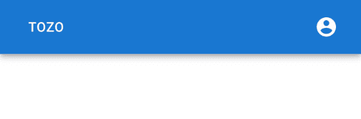
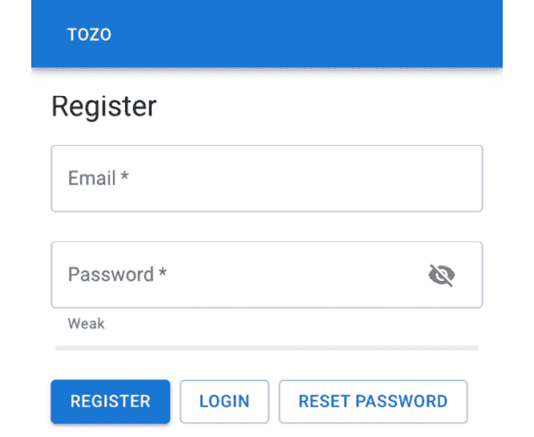
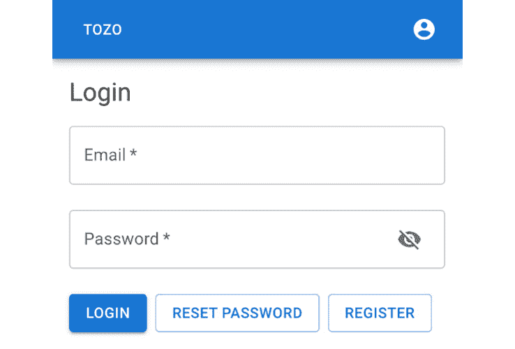
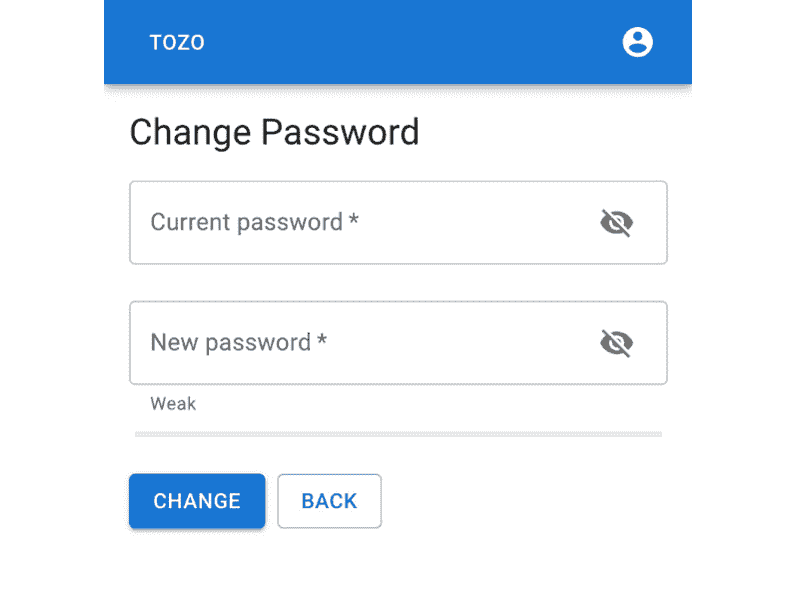
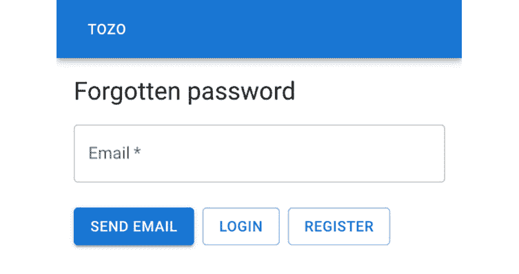
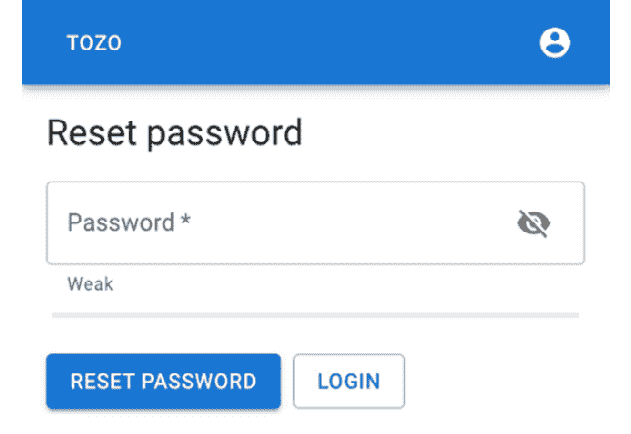
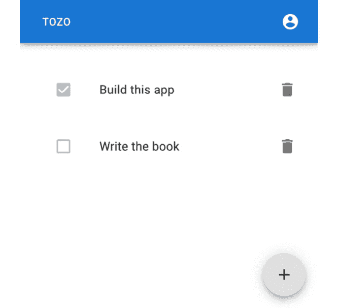
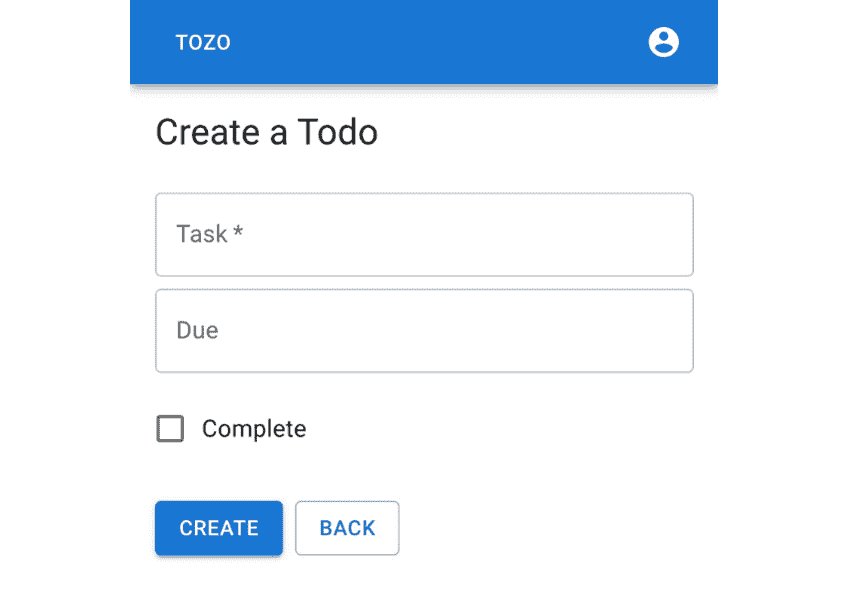
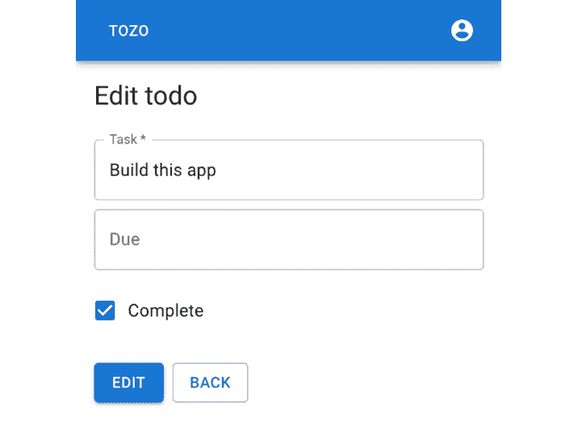

# 第五章：构建单页应用

在上一章中，我们通过工具和设置扩展了一个基本的 React 应用，这些工具和设置是我们构建用户界面所需的。这意味着在本章中，我们可以专注于将构成我们的单页应用的功能。具体来说，我们将添加允许用户进行身份验证、管理他们的密码和管理他们的待办事项的功能。

用户界面和功能，用于管理用户身份验证和密码，对任何应用都很有用，可以直接用于您的应用。虽然待办事项用户界面可能不符合您自己应用的需求，但技术将是可应用的。

因此，在本章中，我们将涵盖以下主题：

+   添加导航

+   添加用户身份验证页面

+   添加密码管理页面

+   添加待办事项页面

# 技术要求

本章需要以下额外的文件夹，并应创建：

```py
tozo
└── frontend
    └── src
        └── pages
```

要使用配套仓库 [`github.com/pgjones/tozo`](https://github.com/pgjones/tozo) 跟进本章的开发，请查看标签 `r1-ch5-start` 和 `r1-ch5-end` 之间的提交。

# 添加导航

我们正在构建的应用需要允许已登录用户导航到完整的待办事项列表、允许他们更改密码的页面，并允许他们注销。对于未登录用户，他们需要在登录、注册和重置密码页面之间进行导航。

专注于已登录用户的需求，Material Design 系统包括一个位于页面顶部的应用栏。这将允许链接到完整的待办事项列表（主页）以及一个账户菜单，用于更改他们的密码和注销。

更复杂的导航

您的应用可能比本书中构建的页面更多。这意味着导航系统需要能够链接到更多页面。虽然账户菜单可以通过与用户相关的更多链接进行扩展，但这并不是放置其他链接的好位置。相反，抽屉是最好的解决方案。抽屉可以从左侧滑入，并且可以包含所需数量的链接。

账户菜单需要允许用户注销，这意味着它需要通过突变查询后端，然后更新应用的本地身份验证上下文（状态）。为此，应在 *frontend/src/components/AccountMenu.tsx* 中添加以下代码：

```py
import axios from "axios"; 
import { useContext } from "react";
import { useQueryClient } from "@tanstack/react-query";
import { AuthContext } from "src/AuthContext";
import { useMutation } from "src/query";
const useLogout = () => {
  const { setAuthenticated } = useContext(AuthContext);
  const queryClient = useQueryClient();
  const { mutate: logout } = useMutation(
    async () => await axios.delete("/sessions/"),
    { 
      onSuccess: () => {
        setAuthenticated(false);
        queryClient.clear();
      },
    },
  );
  return logout;
};
```

此代码提供了一个 `logout` 函数，当调用时，会触发突变，从而发送 `DELETE /sessions/` 请求。如果此请求成功，用户将被注销，本地身份验证上下文设置为 `false`，并且由 `React-Query` 存储的数据将被清除。如果请求失败，则不会发生任何变化，提示用户再次尝试。

在此功能到位后，我们现在需要添加样式化菜单。我们可以通过向现有的 *frontend/src/components/AccountMenu.tsx* 代码中添加以下内容来实现：

```py
import Divider from "@mui/material/Divider";
import IconButton from "@mui/material/IconButton";
import Menu from "@mui/material/Menu";
import MenuItem from "@mui/material/MenuItem";
import AccountCircle from "@mui/icons-material/AccountCircle";
import React, { useState } from "react";
import { Link } from "react-router-dom";
const AccountMenu = () => {
  const logout = useLogout();
  const [anchorEl, setAnchorEl] = useState<null | HTMLElement>(null);
  const onMenuOpen = (event: React.MouseEvent<HTMLElement>) => 
    setAnchorEl(event.currentTarget);
  const onMenuClose = () => setAnchorEl(null);
  return (
    <>
      <IconButton
        color="inherit"
        onClick={onMenuOpen}
      >
        <AccountCircle />
      </IconButton>
      <Menu
        anchorEl={anchorEl}
        anchorOrigin={{ horizontal: "right", vertical: "top" }}
        keepMounted
        onClose={onMenuClose}
        open={Boolean(anchorEl)}
        transformOrigin={{           horizontal: "right", vertical: "top"         }}
      >
        <MenuItem 
          component={Link} 
          onClick={onMenuClose} 
          to="/change-password/"
        >
          Change password
        </MenuItem>
        <Divider />
        <MenuItem onClick={() => {logout(); onMenuClose();}}>
          Logout
        </MenuItem>
      </Menu>
    </>
  );
};
export default AccountMenu;
```

这是标准 MUI 代码，用于在点击 `IconButton` 组件时打开的菜单。

我们现在可以添加应用栏本身，包括指向主页的链接，如果用户已登录（认证），则添加账户菜单，通过在 *frontend/src/components/TopBar.tsx* 中添加以下内容：

```py
import AppBar from "@mui/material/AppBar";
import Box from "@mui/material/Box";
import Button from "@mui/material/Button";
import Toolbar from "@mui/material/Toolbar";
import React, { useContext } from "react";
import { Link } from "react-router-dom";
import { AuthContext } from "src/AuthContext";
import AccountMenu from "src/components/AccountMenu";
const sxToolbar = {
  paddingLeft: "env(safe-area-inset-left)",
  paddingRight: "env(safe-area-inset-right)",
  paddingTop: "env(safe-area-inset-top)",
}
const TopBar = () => {
  const { authenticated } = useContext(AuthContext);
  return (
    <>
      <AppBar position="fixed">
        <Toolbar sx={sxToolbar}>
          <Box sx={{ flexGrow: 1 }}>
            <Button color="inherit" component={Link} to="/">
              Tozo
            </Button>
          </Box>
          {authenticated ? <AccountMenu /> : null}
        </Toolbar>
      </AppBar>
      <Toolbar sx={{ ...sxToolbar, marginBottom: 2 }} />
    </>
  );
};
export default TopBar;
```

为了在具有刘海的设备（如 iPhone X）上正确显示应用栏，需要使用 `safe-area-inset` 的额外填充样式（已高亮）。

`TopBar` 应在 `BrowserRouter` 中的 `Router` 内渲染，通过在 *frontend/src/Router.tsx* 中添加以下内容：

```py
import TopBar from "src/components/TopBar";

const Router = () => (
  <BrowserRouter> 
    <ScrollToTop /> 
    <TopBar />
    <Routes> 
      {/* Place routes here */} 
    </Routes> 
  </BrowserRouter>
);
```

应将高亮行添加到现有代码中。

渲染后，应用栏应看起来像 *图 5.1*：



图 5.1：在移动浏览器中显示的应用栏

导航完成后，我们可以开始添加页面；我们将首先允许用户注册和登录。

# 添加用户认证页面

在首次访问我们的应用时，用户需要注册、确认他们的电子邮件并登录。而后续访问时，他们只需登录即可。这些操作中的每一个都需要在我们的应用中成为一个页面。

## 注册

当新用户访问我们的应用时，他们需要做的第一件事是注册，所以我们将首先添加一个注册页面。为了注册，用户需要输入他们的电子邮件和密码。一旦用户提供了这些信息，我们将使用成员 API 创建用户，然后重定向用户到登录页面，或者如果 API 调用失败，显示相关错误。

我们将首先将此逻辑作为一个自定义的 `useRegister` 钩子添加到 *frontend/src/pages/Register.tsx*：

```py
import axios from "axios"; 
import { FormikHelpers } from "formik";
import { useContext } from "react";
import { useNavigate } from "react-router";
import { ToastContext } from "src/ToastContext";
import { useMutation } from "src/query";
interface IForm {
  email: string;
  password: string;
}
const useRegister = () => {
  const navigate = useNavigate();
  const { addToast } = useContext(ToastContext);
  const { mutateAsync: register } = useMutation(
    async (data: IForm) => await axios.post("/members/", data),
  );
  return async (
    data: IForm,
    { setFieldError }: FormikHelpers<IForm>,
  ) => {
    try {
      await register(data);
      addToast("Registered", "success");
      navigate("/login/", { state: { email: data.email } });
    } catch (error: any) {
      if (
        error.response?.status === 400 &&
        error.response?.data.code === "WEAK_PASSWORD"
      ) {
        setFieldError("password", "Password is too weak");
      } else {
        addToast("Try again", "error");
      }
    }
  };
};
```

`useRegister` 钩子返回的函数设计为用作 `Formik` 的 `onSubmit` 属性。这允许函数在后端响应表明密码太弱时（如高亮所示）向密码字段添加特定错误。否则，如果注册成功，应用将导航到登录页面。

在注册时自动登录

我们已实现的流程将用户引导到登录页面，他们在注册后登录，而不是自动登录。虽然这不是最佳的用户体验，但这是为了减轻账户枚举，因此是一个安全的默认设置。然而，您可能认为对于您的应用来说用户体验更重要。如果是这样，后端路由需要登录用户，并且此页面应在注册后引导用户到主页。

我们现在需要提供用户输入他们的电子邮件和强密码的输入字段，我们可以通过显示密码强度来确保这一点。字段将被验证，以通知用户任何错误并使用正确的自动完成值。自动完成值应鼓励浏览器为用户做大部分工作（例如，填写他们的电子邮件地址）。

因此，注册页面通过在 *frontend/src/pages/Register.tsx* 中添加以下代码到现有代码中而扩展：

```py
import { Form, Formik } from "formik";
import { useLocation } from "react-router-dom"; 
import * as yup from "yup";

import EmailField from "src/components/EmailField";
import FormActions from "src/components/FormActions";
import LazyPasswordWithStrengthField from "src/components/LazyPasswordWithStrengthField";
import Title from "src/components/Title";
const validationSchema = yup.object({
  email: yup.string().email("Email invalid").required("Required"),
  password: yup.string().required("Required"),
});

const Register = () => {
  const location = useLocation();
  const onSubmit = useRegister();
  return (
    <>
      <Title title="Register" />
      <Formik<IForm>
        initialValues={{
          email: (location.state as any)?.email ?? "",
          password: "",
        }}
        onSubmit={onSubmit}
        validationSchema={validationSchema}
      >
        {({ dirty, isSubmitting, values }) => (
          <Form>
          <EmailField 
            fullWidth label="Email" name="email" required 
          />
            <LazyPasswordWithStrengthField
              autoComplete="new-password"
              fullWidth
              label="Password"
              name="password"
              required
            />
            <FormActions
              disabled={!dirty}
              isSubmitting={isSubmitting}
              label="Register"
              links={[
                {label: "Login", to: "/login/", state: { email:                   values.email }},
                {label: "Reset password", to: "/forgotten-                  password/", state: { email: values.email }},
              ]}
            />
          </Form>
        )}
      </Formik>
    </>
  );
};
export default Register;
```

由于用户经常忘记他们是否已经注册，我们已通过 `FormActions` 链接使导航到登录和重置密码页面变得更加容易。此外，当用户在这些页面之间导航时，电子邮件字段中的任何值都会被保留。这避免了用户需要再次输入它，从而提高了用户体验。这是通过 `location.state` 实现的，`useLocation` 钩子获取任何当前值，而 `FormActions` 组件的 `links` 属性的 `state` 部分设置它。

然后，我们可以通过在 *frontend/src/Router.tsx* 文件中添加以下内容来添加页面到路由中：

```py
import { Route } from "react-router-dom";
import Register from "src/pages/Register";
const Router = () => (
  <BrowserRouter>  
    <ScrollToTop />  
    <TopBar /> 
    <Routes>  
      <Route path="/register/" element={<Register />} /> 
    </Routes>  
  </BrowserRouter>
);
```

应该将高亮行添加到现有代码中。

完成的 **注册** 页面应类似于 *图 5.2*：



图 5.2：注册页面

现在用户能够注册后，他们接下来需要确认他们的电子邮件。

## 电子邮件确认

在注册时，用户会收到一封包含返回我们应用的链接的电子邮件。链接中有一个标识用户的令牌。通过跟随链接，用户将令牌传递给我们，并证明他们控制着电子邮件地址。因此，我们需要一个页面，当访问时，将令牌发送到后端并显示结果。

链接的形式为 `/confirm-email/:token/`，其中 `:token` 是实际用户的令牌（例如，`/confirm-email/abcd/`）。因此，我们可以通过添加以下内容到 *frontend/src/Router.tsx* 文件中，使用路由参数提取令牌：

```py
import ConfirmEmail from "src/pages/ConfirmEmail";
const Router = () => (
  <BrowserRouter>  
    <ScrollToTop />  
    <TopBar /> 
    <Routes>  
      <Route path="/register/" element={<Register />} />
<Route 
path="/confirm-email/:token/" element={<ConfirmEmail />} 
/> 
    </Routes>  
  </BrowserRouter>
);
```

应该将高亮行添加到现有代码中。

现在，我们可以构建 `ConfirmEmail` 页面并利用 `useParam` 钩子从路径中提取令牌。为此，需要在 *frontend/src/pages/ConfirmEmail.tsx* 文件中添加以下代码：

```py
import LinearProgress from "@mui/material/LinearProgress";
import axios from "axios";
import { useContext } from "react";
import { useParams } from "react-router";
import { Navigate } from "react-router-dom";

import { useQuery } from "src/query";
import { ToastContext } from "src/ToastContext";

interface IParams {
  token?: string;
}

const ConfirmEmail = () => {
  const { addToast } = useContext(ToastContext);
  const params = useParams() as IParams;
  const token = params.token ?? "";
  const { isLoading } = useQuery(
    ["Email"],
    async () => await axios.put("/members/email/", { token }),
    {
      onError: (error: any) => {
        if (error.response?.status === 400) {
          if (error.response?.data.code === "TOKEN_INVALID") {
            addToast("Invalid token", "error");
          } else if (error.response?.data.code === "TOKEN_            EXPIRED"){
            addToast("Token expired", "error");
          }
        } else {
          addToast("Try again", "error");
        }
      },
      onSuccess: () => addToast("Thanks", "success"),
    },
  );

  if (isLoading) {
    return  <LinearProgress />;
  } else {
    return <Navigate to="/" />;
  }
};

export default ConfirmEmail;
```

高亮行显示了从路径中提取的令牌参数。

为了确保用户知道应用正在运行，当前端等待后端响应时，会显示 `LinearProgress` 进度条；我们可以在 *图 5.3* 中看到这一点：


图 5.3：显示正在进行的处理的 LinearProgress 进度条的确认电子邮件页面

最后，在注册并确认他们的电子邮件后，用户将需要登录。

## 登录

用户需要登录才能查看和交互他们的待办事项。为此，用户需要输入他们的电子邮件和密码。一旦用户提供了这些信息，我们将使用会话 API 创建会话。如果登录成功，用户应随后被重定向到主页或 `from` 状态指定的页面（如果存在）。`from` 状态将用户重定向到他们尝试登录但未登录时查看的页面。

要完成这个任务，我们首先需要在 *frontend/src/pages/Login.tsx* 文件中添加以下逻辑：

```py
import axios from "axios"; 
import { FormikHelpers } from "formik";
import { useContext } from "react";
import { useLocation, useNavigate } from "react-router";
import { AuthContext } from "src/AuthContext";
import { ToastContext } from "src/ToastContext";
import { useMutation } from "src/query";
interface IForm {
  email: string;
  password: string;
}
const useLogin = () => {
  const location = useLocation();
  const navigate = useNavigate();
  const { addToast } = useContext(ToastContext);
  const { setAuthenticated } = useContext(AuthContext);
  const { mutateAsync: login } = useMutation(
    async (data: IForm) => await axios.post("/sessions/",      data),
  );
  return async (
    data: IForm,
    { setFieldError }: FormikHelpers<IForm>,
  ) => {
    try {
      await login(data);
      setAuthenticated(true);
      navigate((location.state as any)?.from ?? "/");
    } catch (error: any) {
      if (error.response?.status === 401) {
        setFieldError("email", "Invalid credentials");
        setFieldError("password", "Invalid credentials");
      } else {
        addToast("Try again", "error");
      }
    }
  };
};
```

在登录逻辑定义后，我们现在可以添加 UI 元素。这需要一个包含电子邮件和密码输入的表单，应将其添加到 *frontend/src/pages/Login.tsx* 中的现有代码中：

```py
import { Form, Formik } from "formik"; 
import * as yup from "yup";

import EmailField from "src/components/EmailField";
import FormActions from "src/components/FormActions";
import PasswordField from "src/components/PasswordField";
import Title from "src/components/Title";
const validationSchema = yup.object({
  email: yup.string().email("Email invalid").required("Required"),
  password: yup.string().required("Required"),
});

const Login = () => {
  const onSubmit= useLogin();
  const location = useLocation();
  return (
    <>
      <Title title="Login" />
      <Formik<IForm>
        initialValues={{
          email: (location.state as any)?.email ?? "",
          password: "",
        }}
        onSubmit={onSubmit}
        validationSchema={validationSchema}
      >
        {({ dirty, isSubmitting, values }) => (
          <Form>
            <EmailField
              fullWidth label="Email" name="email" required
            />
            <PasswordField
              autoComplete="password"
              fullWidth
              label="Password"
              name="password"
              required
            />
            <FormActions
              disabled={!dirty}
              isSubmitting={isSubmitting}
              label="Login"
              links={[
                {label: "Reset password", to: "/forgotten-                  password/", state: { email: values.email }},
                {label: "Register", to: "/register/", state: {                   email: values.email }},
              ]}
            />
          </Form>
        )}
      </Formik>
    </>
  );
};
export default Login;
```

突出的代码显示，表单提交在表单变脏之前是禁用的。这有助于用户，因为它确保他们只能在更改表单后提交表单。这是我们将在所有表单上使用的模式。

我们现在可以通过在 *frontend/src/Router.tsx* 中添加以下内容来将页面添加到路由中：

```py
import Login from "src/pages/Login";
const Router = () => ( 
  <BrowserRouter>   
    <ScrollToTop />   
    <TopBar />  
    <Routes>   
      <Route path="/register/" element={<Register />} /> 
      <Route  
        path="/confirm-email/:token/"        element={<ConfirmEmail />}  
      />  
      <Route path="/login/" element={<Login />} />
    </Routes>   
  </BrowserRouter> 
);
```

应将突出显示的行添加到现有代码中。

完成的 **登录** 页面应类似于 *图 5.4*：



图 5.4：登录页面

用户现在可以注册并登录到我们的应用。尽管如此，他们无法管理他们的密码，这是我们接下来要关注的。

# 添加密码管理页面

我们需要允许用户管理他们的密码。这相当复杂，因为用户经常忘记他们的密码，因此还需要一个安全的机制来重置密码。

## 修改密码

为了让用户更改他们的密码，他们必须提供现有的密码和一个强大的替代密码。因此，前端需要将两者都发送到后端，并在当前密码不正确或新密码太弱时显示相关错误。此逻辑包含在以下代码中，应添加到 *frontend/src/pages/ChangePassword.tsx*：

```py
import axios from "axios"; 
import { FormikHelpers } from "formik";
import { useContext } from "react";
import { useNavigate } from "react-router-dom";
import { ToastContext } from "src/ToastContext";
import { useMutation } from "src/query";
interface IForm {
  currentPassword: string;
  newPassword: string;
}

const useChangePassword = () => {
  const { addToast } = useContext(ToastContext);
  const { mutateAsync: changePassword } = useMutation(
    async (data: IForm) => 
      await axios.put("/members/password/", data),
  );
  const navigate = useNavigate();

  return async (
    data: IForm,
    { setFieldError }: FormikHelpers<IForm>,
  ) => {
    try {
      await changePassword(data);
      addToast("Changed", "success");
      navigate("/");
    } catch (error: any) {
      if (axios.isAxiosError(error)) {
        if (error.response?.status === 400) { 
          setFieldError("newPassword", "Password is too weak"); 
        } else if (error.response?.status === 401) {
          setFieldError("currentPassword", "Incorrect             password"); 
        }
      } else { 
        addToast("Try again", "error"); 
      } 
    }
  };
}
```

逻辑定义后，我们现在可以添加 UI 元素。这需要一个包含普通密码字段和密码强度字段的表单，如图所示，应将其添加到 *frontend/src/pages/ChangePassword.tsx* 中的现有代码中：

```py
import { Form, Formik } from "formik";
import * as yup from "yup";
import FormActions from "src/components/FormActions";
import LazyPasswordWithStrengthField from "src/components/LazyPasswordWithStrengthField";
import PasswordField from "src/components/PasswordField";
import Title from "src/components/Title";

const validationSchema = yup.object({
  currentPassword: yup.string().required("Required"),
  newPassword: yup.string().required("Required"),
});

const ChangePassword = () => {
  const onSubmit = useChangePassword();
  return (
    <>
      <Title title="Change Password" />
      <Formik<IForm>
        initialValues={{ currentPassword: "", newPassword: "" }}
        onSubmit={onSubmit}
        validationSchema={validationSchema}
      >
        {({ dirty, isSubmitting }) => (
          <Form>
            <PasswordField
              autoComplete="current-password"
              fullWidth
              label="Current password"
              name="currentPassword"
              required
            />
            <LazyPasswordWithStrengthField 
              autoComplete="new-password" 
              fullWidth 
              label="New password" 
              name="newPassword" 
              required 
            />
            <FormActions 
              disabled={!dirty}
              isSubmitting={isSubmitting} 
              label="Change" 
              links={[{ label: "Back", to: "/" }]} 
            />
          </Form>
        )}
      </Formik>
    </>
  );
};
export default ChangePassword;
```

然后，我们可以通过在 *frontend/src/Router.tsx* 中添加以下内容来将页面添加到路由中：

```py
import RequireAuth from "src/components/RequireAuth"; 
import ChangePassword from "src/pages/ChangePassword";
const Router = () => (
  <BrowserRouter>
    ...
    <Routes>
      ...
      <Route 
        path="/change-password/" 
        element={<RequireAuth><ChangePassword /></RequireAuth>} 
      />
    </Routes>
  </BrowserRouter>
);
```

在代码块中，`...` 代表为了简洁而省略的代码。

完成的 **修改密码** 页面应类似于 *图 5.5*：



图 5.5：修改密码页面

用户现在可以在登录状态下更改他们的密码。接下来，我们将允许用户在忘记密码时请求密码重置链接。

## 忘记密码

当用户忘记他们的密码时，他们需要通过请求重置链接来重置密码。为此，用户需要输入他们的电子邮件，然后我们将使用成员 API 向他们发送密码重置电子邮件，如果失败，则显示通用错误。

执行此操作的以下代码应放置在 *frontend/src/pages/ForgottenPassword.tsx*：

```py
import axios from "axios";
import { useContext } from "react";
import { useNavigate } from "react-router";

import { useMutation } from "src/query";
import { ToastContext } from "src/ToastContext";
interface IForm {
  email: string;
}

const useForgottenPassword = () => {
  const navigate = useNavigate();
  const { addToast } = useContext(ToastContext);

  const { mutateAsync: forgottenPassword } = useMutation(
    async (data: IForm) => 
      await axios.post("/members/forgotten-password/", data),
  ); 
  return async (data: IForm) => {
    try {
      await forgottenPassword(data);
      addToast("Reset link sent to your email", "success");
      navigate("/login/");
    } catch {
      addToast("Try again", "error");
    }
  };
};
```

逻辑定义后，我们现在可以添加 UI 元素。这需要一个包含电子邮件字段的表单，如图所示，应将其添加到 *frontend/src/pages/ForgottenPassword.tsx* 中的现有代码中：

```py
import { Form, Formik } from "formik";
import { useLocation } from "react-router";
import * as yup from "yup";

import EmailField from "src/components/EmailField";
import FormActions from "src/components/FormActions";
import Title from "src/components/Title";

const validationSchema = yup.object({ 
  email: yup.string().email("Email invalid").required("Required"), 
});

const ForgottenPassword = () => {
  const onSubmit = useForgottenPassword();
  const location = useLocation();

  return (
    <>
      <Title title="Forgotten password" />
      <Formik<IForm>
        initialValues={{ 
          email: (location.state as any)?.email ?? "" 
        }}
        onSubmit={onSubmit}
        validationSchema={validationSchema}
      >
        {({ dirty, isSubmitting, values }) => (
          <Form>
            <EmailField
              fullWidth label="Email" name="email" required
            />
            <FormActions 
              disabled={!dirty}
              isSubmitting={isSubmitting} 
              label="Send email" 
              links={[ 
                {label: "Login", to: "/login/", state: { email:                   values.email }}, 
                {label: "Register", to: "/register/", state: {                   email: values.email }}, 
              ]} 
            />
          </Form>
        )}
      </Formik>
    </>
  );
};

export default ForgottenPassword;
```

然后，我们可以通过在 *frontend/src/Router.tsx* 中添加以下内容来将页面添加到路由中：

```py
import ForgottenPassword from "src/pages/ForgottenPassword";
const Router = () => (
  <BrowserRouter>
    ...
    <Routes>
      ...
      <Route 
        path="/forgotten-password/" 
        element={<ForgottenPassword />} 
      />
    </Routes>
  </BrowserRouter>
);
```

在代码块中，`...` 代表为了简洁而省略的代码。

完成的 **忘记密码** 页面应类似于 *图 5.6*：



图 5.6：忘记密码页面

接下来，我们需要添加一个页面，让用户访问以实际重置他们的密码。

## 重置密码

发送给用户通过忘记密码页面的电子邮件将包含一个链接到重置密码页面。此链接将包含一个标识用户的令牌，这与前面描述的电子邮件确认过程相同。此页面需要允许用户输入一个新的强密码，并通过链接的令牌将其发送到后端。执行此操作的逻辑如下所示，应将其放置在 *frontend/src/pages/ResetPassword.tsx* 中：

```py
import axios from "axios";
import { FormikHelpers } from "formik";
import { useContext } from "react";
import { useNavigate, useParams } from "react-router";

import { useMutation } from "src/query";
import { ToastContext } from "src/ToastContext";
interface IForm {
  password: string;
}
interface IParams {
  token?: string;
}

const useResetPassword = () => {
  const navigate = useNavigate();
  const params = useParams() as IParams;
  const token = params.token ?? "";
  const { addToast } = useContext(ToastContext);

  const { mutateAsync: reset } = useMutation(
    async (password: string) => 
      await axios.put(
        "/members/reset-password/", { password, token },
      ),
  ); 
  return async (
    data: IForm, 
    { setFieldError }: FormikHelpers<IForm>, 
  ) => {
    try {
      await reset(data.password);
      addToast("Success", "success");
      navigate("/login/");
    } catch (error: any) {
      if (error.response?.status === 400) { 
        if (error.response?.data.code === "WEAK_PASSWORD") { 
          setFieldError("newPassword", "Password is too weak");  
        } else if (error.response?.data.code === "TOKEN_           INVALID") {
          addToast("Invalid token", "error"); 
        } else if (error.response?.data.code === "TOKEN_           EXPIRED") { 
          addToast("Token expired", "error"); 
        } 
      } else {
        addToast("Try again", "error");
      }
    }
  }
};
```

逻辑定义完毕后，我们现在可以添加 UI 元素。这需要一个包含显示密码强度字段的表单。我们可以通过向 *frontend/src/pages/ResetPassword.tsx* 中的现有代码添加以下代码来实现：

```py
import { Form, Formik } from "formik";
import * as yup from "yup";

import LazyPasswordWithStrengthField from "src/components/LazyPasswordWithStrengthField"
import FormActions from "src/components/FormActions";
import Title from "src/components/Title";

const validationSchema = yup.object({ 
  email: yup.string().email("Email invalid").required("Required"), 
});

const ResetPassword = () => { 
  const onSubmit = useResetPassword();
  return (
    <>
      <Title title="Reset password" />
      <Formik<IForm>
        initialValues={{ password: "" }}
        onSubmit={onSubmit}
        validationSchema={validationSchema}
      >
        {({ dirty, isSubmitting, values }) => (
          <Form>
            <LazyPasswordWithStrengthField
              autoComplete="new-password"
              fullWidth
              label="Password"
              name="password"
              required
            />
            <FormActions 
              disabled={!dirty}
              isSubmitting={isSubmitting} 
              label="Reset password"
              links={[{label: "Login", to: "/login/"}]}
            />
          </Form>
        )}
      </Formik>
    </>
  );
};

export default ResetPassword;
```

然后，我们可以通过向 *frontend/src/Router.tsx* 添加以下内容来添加页面到路由中：

```py
import ResetPassword from "src/pages/ResetPassword";
const Router = () => (
  <BrowserRouter>
    ...
    <Routes>
      ...
      <Route 
        path="/reset-password/:token/" 
        element={<ResetPassword />} 
      />
    </Routes>
  </BrowserRouter>
);
```

在代码块中，`...` 代表为了简洁而省略的代码。

完成的 **重置密码** 页面应类似于 *图 5.7*：



图 5.7：重置密码页面

用户现在可以管理他们的密码，这意味着我们可以专注于管理他们的待办事项的页面。

# 添加待办事项页面

用户将需要通过应用程序管理他们的待办事项，包括创建、编辑和查看他们的待办事项。这些对应于不同的页面，我们将添加。

首先，让我们创建我们将需要从后端获取待办事项的特定 `React-Query` 查询。我们可以通过向 *frontend/src/queries.ts* 添加以下代码来实现：

```py
import axios from "axios";
import { useQueryClient } from "@tanstack/react-query";
import { Todo } from "src/models";
import { useQuery } from "src/query";
export const STALE_TIME = 1000 * 60 * 5;  // 5 mins
export const useTodosQuery = () => 
  useQuery<Todo[]>(
    ["todos"], 
    async () => {
      const response = await axios.get("/todos/");
      return response.data.todos.map(
        (json: any) => new Todo(json)
      );
    },
    { staleTime: STALE_TIME },
  );
export const useTodoQuery = (id: number) => {
  const queryClient = useQueryClient();
  return useQuery<Todo>(
    ["todos", id.toString()],
    async () => {
      const response = await axios.get(`/todos/${id}/`);
      return new Todo(response.data);
    },
    {
      initialData: () => {
        return queryClient
          .getQueryData<Todo[]>(["todos"])
          ?.filter((todo: Todo) => todo.id === id)[0];
      },
      staleTime: STALE_TIME,
    },
  );
};
```

将 `staleTime` 选项（突出显示）的更改确保 `react-query` 不会不断重新获取待办事项数据，而是将其视为有效 5 分钟。这通过减少用户的互联网数据使用来提高用户体验。此外，如果可用，`useTodoQuery` 将有助于使用缓存的待办事项数据作为 `initialData`，从而节省对后端的请求并提高用户体验。

哪个用户的待办事项？

之前定义的 `useTodosQuery` 可能不清楚只会返回当前认证用户的待办事项。这是因为我们已经设置了后端只返回属于当前认证用户的待办事项。在用户能够更改前端代码并可能绕过检查的情况下，在后台做出认证决策至关重要。

接下来，我们需要通过向 *frontend/src/queries.ts* 添加以下内容来添加更新后端待办事项数据的突变：

```py
import { useMutation } from "src/query";
export interface ItodoData {
  complete: boolean;
  due: Date | null;
  task: string;
} 
export const useCreateTodoMutation = () => {
  const queryClient = useQueryClient();
  return useMutation(
    async (data: ItodoData) => await axios.post("/todos/",       data),
    {
      onSuccess: () => queryClient.invalidateQueries(["todos"]),
    },
  );
};
export const useEditTodoMutation = (id: number) => {
  const queryClient = useQueryClient();
  return useMutation(
    async (data: ItodoData) => 
      await axios.put(`/todos/${id}/`, data),
    {
      onSuccess: () => queryClient.        invalidateQueries(["todos"]), 
    },
  );
};
export const useDeleteTodoMutation = () => {
  const queryClient = useQueryClient();
  return useMutation(
    async (id: number) => 
      await axios.delete(`/todos/${id}/`),
    {
      onSuccess: () => queryClient.        invalidateQueries(["todos"]), 
    },
  );
};
```

这三个突变都将使 `[“todos”]` 查询数据无效，因此需要之前定义的待办事项查询来获取新数据，而不是返回过时的数据。

在这些查询可用的情况下，我们现在可以创建实际的视觉元素（即用户可以与之交互的页面）。

## 展示待办事项

我们需要的第一页是展示所有用户待办事项的页面，这实际上是用户的首页。除了展示待办事项外，它还需要提供创建待办事项以及编辑和删除现有待办事项的操作。

编辑或删除待办事项的操作可以通过点击待办事项或与其关联的删除按钮直接链接到待办事项。然而，创建待办事项是页面的主要操作，因此最适合使用浮动操作按钮。因此，待办事项页面应类似于 *图 5.8*：



图 5.8：显示待办事项的首页，以及浮动操作按钮

首先，让我们通过在 *frontend/src/components/Todo.tsx* 中添加以下内容来创建一个显示单个待办事项的组件：

```py
import Checkbox from "@mui/material/Checkbox";
import IconButton from "@mui/material/IconButton";
import ListItem from "@mui/material/ListItem";
import ListItemButton from "@mui/material/ListItemButton";
import ListItemIcon from "@mui/material/ListItemIcon";
import ListItemText from "@mui/material/ListItemText";
import Skeleton from "@mui/material/Skeleton";
import DeleteIcon from "@mui/icons-material/Delete";
import { format } from "date-fns";
import { Link } from "react-router-dom";
import { Todo as TodoModel } from "src/models";
import { useDeleteTodoMutation } from "src/queries";
interface IProps { todo?: TodoModel }
const Todo = ({ todo }: IProps) => {
  const { mutateAsync: deleteTodo } = useDeleteTodoMutation();
  let secondary; 
  if (todo === undefined) {
    secondary = <Skeleton width="200px" />;
  } else if (todo.due !== null) {
    secondary = format(todo.due, "P");
  }
  return (
    <ListItem
      secondaryAction={
        <IconButton
          disabled={todo === undefined} edge="end"
          onClick={() => deleteTodo(todo?.id!)}
        >
          <DeleteIcon />
        </IconButton>
      }
    >
      <ListItemButton
        component={Link} disabled={todo === undefined}
        to={`/todos/${todo?.id}/`}
      >
        <ListItemIcon>
          <Checkbox
            checked={todo?.complete ?? false}
            disabled disableRipple edge="start" tabIndex={-1}
          />
        </ListItemIcon>
        <ListItemText 
          primary={todo?.task ?? <Skeleton />}           secondary={secondary}
        />
      </ListItemButton>
    </ListItem>
  );
}
export default Todo;
```

当 `todo` 属性未定义时，此 `Todo` 组件将渲染骨架。我们可以利用这一点来改善用户体验，因为待办事项是从后端获取的。

骨架加载

从后端获取数据将花费一定的时间，在这段时间内，用户会想知道应用在做什么。因此，最好向用户展示应用正在工作（加载数据）。我们将通过使用与完成页面布局相同的灰色动画块（即骨架）来实现这一点。灰色的布局看起来像骨架，因此得名。

通过在 *frontend/src/pages/Todos.tsx* 中添加以下内容，完成显示用户所有待办事项的完整首页：

```py
import Fab from "@mui/material/Fab";
import List from "@mui/material/List";
import AddIcon from "@mui/icons-material/Add";
import { Link, Navigate } from "react-router-dom";
import Todo from "src/components/Todo";
import { useTodosQuery } from "src/queries";
const Todos = () => {
  const { data: todos } = useTodosQuery();
  if (todos?.length === 0) {
    return <Navigate to="/todos/new/" />;
  } else {
    return (
      <>
        <List>
          {todos !== undefined ?
            todos.map((todo) => <Todo key={todo.id} todo={todo} />)
            : [1, 2, 3].map((id) => <Todo key={-id} />)  
          }
        </List>
        <Fab 
          component={Link} 
          sx={{ 
            bottom: (theme) => theme.spacing(2), 
            position: "fixed", 
            right: (theme) => theme.spacing(2), 
          }} 
          to="/todos/new/"
        >
          <AddIcon />
        </Fab>
      </>
    );
  }
};
export default Todos;
```

然后，我们可以通过在 *frontend/src/Router.tsx* 中添加以下内容来将页面添加到路由中：

```py
import Todos from "src/pages/Todos";
const Router = () => (
  <BrowserRouter>
    ...
    <Routes>
      ...
      <Route 
        path="/" 
        element={<RequireAuth><Todos /></RequireAuth>} 
      />
    </Routes>
  </BrowserRouter>
);
```

在代码块中，`...` 代表为了简洁而省略的代码。

现在我们能够显示待办事项，我们需要能够创建和编辑它们。

## 创建待办事项

我们将需要为用户提供创建新待办事项和编辑现有待办事项的页面。这两个页面都需要一个表单来输入和编辑待办事项数据。为了避免在每个页面上重复表单代码，我们将创建一个 `TodoForm` 组件，首先通过在 *frontend/src/components/TodoForm.tsx* 中添加以下内容来定义表单验证：

```py
import * as yup from "yup";
const validationSchema = yup.object({
  complete: yup.boolean(),
  due: yup.date().nullable(),
  task: yup.string().required("Required"),
});
```

在定义了验证模式和表单结构后，我们可以添加组件本身。该组件只需要在 Formik 表单中渲染相关字段。以下代码应添加到 *frontend/src/components/TodoForm.tsx*：

```py
import { Form, Formik } from "formik";

import CheckboxField from "src/components/CheckboxField";
import DateField from "src/components/DateField";
import FormActions from "src/components/FormActions";
import TextField from "src/components/TextField";
import type { ITodoData } from "src/queries";

interface IProps {
  initialValues: ITodoData;
  label: string;
  onSubmit: (data: ITodoData) => Promise<any>;
}

const TodoForm = ({ initialValues, label, onSubmit }: IProps) => (
  <Formik< ITodoData>
    initialValues={initialValues}
    onSubmit={onSubmit}
    validationSchema={validationSchema}
  >
    {({ dirty, isSubmitting }) => (
      <Form>
        <TextField
          fullWidth label="Task" name="task" required
        />
        <DateField fullWidth label="Due" name="due" />
        <CheckboxField
          fullWidth label="Complete" name="complete"
        />
        <FormActions
          disabled={!dirty}
          isSubmitting={isSubmitting}
          label={label}
          links={[{ label: "Back", to: "/" }]}
        />
      </Form>
    )}
  </Formik>
);

export default TodoForm;
```

然后，我们可以在页面中使用 `TodoForm` 来创建待办任务，通过在 *frontend/src/pages/CreateTodo.tsx* 中添加以下内容：

```py
import { useContext } from "react";
import { useNavigate } from "react-router-dom";

import TodoForm from "src/components/TodoForm";
import Title from "src/components/Title";
import type { ITodoData } from "src/queries";
import { useCreateTodoMutation } from "src/queries";
import { ToastContext } from "src/ToastContext";

const CreateTodo = () => {
  const navigate = useNavigate();
  const { addToast } = useContext(ToastContext);
  const { mutateAsync: createTodo } = useCreateTodoMutation();
  const onSubmit = async (data: ITodoData) => {
    try {
      await createTodo(data);
      navigate("/");
    } catch {
      addToast("Try Again", "error");
    }
  };

  return (
    <>
      <Title title="Create a Todo" />
      <TodoForm
        initialValues={{           complete: false, due: null, task: ""         }}
        label="Create"
        onSubmit={onSubmit}
      />
    </>
  );
};

export default CreateTodo;
```

然后，我们可以通过在 *frontend/src/Router.tsx* 中添加以下内容来将页面添加到路由中：

```py
import CreateTodo from "src/pages/CreateTodo";
const Router = () => (
  <BrowserRouter>
    ...
    <Routes>
      ...
      <Route 
        path="/todos/new/" 
        element={<RequireAuth><CreateTodo /></RequireAuth>} 
      />
    </Routes>
  </BrowserRouter>
);
```

在代码块中，`...` 代表为了简洁而省略的代码。

完成的创建待办事项页面应类似于 *图 5.9*：



图 5.9：创建待办事项页面显示待办事项表单

用户在创建待办事项后希望能够编辑它们，这是我们接下来要添加的。

## 编辑待办事项

最后，对于待办事项页面，我们需要允许用户编辑他们的待办事项；您可以通过以下代码来实现，该代码应添加到 *frontend/src/pages/EditTodo.tsx*：

```py
import Skeleton from "@mui/material/Skeleton";
import { useContext } from "react";
import { useNavigate, useParams } from "react-router";

import TodoForm from "src/components/TodoForm";
import Title from "src/components/Title";
import type { ITodoData } from "src/queries";
import { useEditTodoMutation, useTodoQuery } from "src/queries";
import { ToastContext } from "src/ToastContext";

interface Iparams {
  id: string;
}

const EditTodo = () => {
  const navigate = useNavigate();
  const params = useParams<keyof Iparams>() as Iparams;
  const todoId = parseInt(params.id, 10);
  const { addToast } = useContext(ToastContext);
  const { data: todo } = useTodoQuery(todoId); 
  const { mutateAsync: editTodo } = useEditTodoMutation(todoId);

  const onSubmit = async (data: ITodoData) => {
    try {
      await editTodo(data);
      navigate("/");
    } catch {
      addToast("Try again", "error");
    }
  };

  return (
    <>
      <Title title="Edit todo" />
      {todo === undefined ? (
        <Skeleton height="80px" />
      ) : (
        <TodoForm
          initialValues={{
            complete: todo.complete,
            due: todo.due,
            task: todo.task,
          }}
          label="Edit"
          onSubmit={onSubmit}
        />
      )}
    </>
  );
};

export default EditTodo;
```

然后，我们可以通过在 *frontend/src/Router.tsx* 中添加以下内容来添加页面到路由：

```py
import EditTodo from "src/pages/EditTodo";
const Router = () => (
  <BrowserRouter>
    ...
    <Routes>
      ...
      <Route 
        path="/todos/:id/" 
        element={<RequireAuth><EditTodo /></RequireAuth>} 
      />
    </Routes>
  </BrowserRouter>
);
```

在代码块中，`...` 表示为了简洁而省略的代码。

完成的编辑待办事项页面应类似于 *图 5.10*：



图 5.10：编辑待办事项页面

这完成了我们待办应用所需的前端功能。

# 摘要

在本章中，我们创建了一个用户界面，允许用户进行身份验证、管理他们的密码以及管理他们的待办事项。这完成了应用的开发版本，我们现在可以在本地使用它来管理待办事项。

用户身份验证和密码管理用户界面对任何应用都很有用，可以直接用于您的应用中，而待办事项用户界面可以进行调整或作为其他功能的参考。

在下一章中，我们将把这个应用部署到生产环境，使用户能够访问和使用它。

# 进一步阅读

为了进一步增强您的应用，我建议您阅读更多关于良好 UX 实践的内容，例如，通过 [`builtformars.com`](https://builtformars.com)。此外，为了提高您的前端样式技能，我建议 [`css-tricks.com`](https://css-tricks.com)。

# 第三部分 发布一个生产就绪的应用

构建一个可工作的应用只是第一步；它需要部署到运行在 AWS 上的公共域名，确保安全，然后打包到移动应用商店。我们将通过尽可能多地融入行业最佳实践来完成所有这些工作。

本部分包括以下章节：

+   *第六章*，*部署和监控您的应用*

+   *第七章*，*保护和应用打包* 
