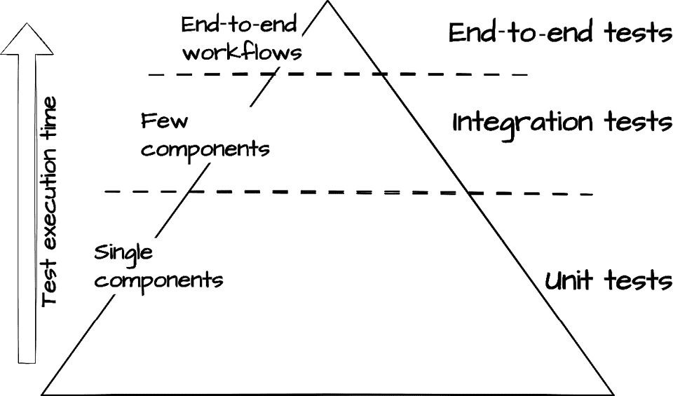

# 第八章：使用清洁架构实现测试模式

在前面的章节中，我们通过仔细实现清洁架构的每一层，从纯领域实体到框架无关的接口，构建了一个任务管理系统。对于许多开发者来说，测试可能感觉令人压倒，这是一个随着系统发展而日益复杂的必要负担。清洁架构提供了一个不同的视角，提供了一种结构化的方法，使测试变得可管理和有意义。

现在我们已经处理了清洁架构的所有层，让我们退后一步，看看这种架构方法如何改变我们的测试实践。通过尊重清洁架构的边界和依赖规则，我们创建的系统天生就是可测试的。每一层的明确责任和显式接口不仅指导我们测试什么，还指导我们如何有效地测试。

在本章中，你将了解清洁架构的显式边界如何通过专注的单元和集成测试实现全面的测试覆盖率。通过实际示例，你会发现清洁架构的**关注点分离**如何让我们彻底验证系统行为，同时保持测试的可维护性。我们将看到定义良好的接口和依赖规则如何自然地导致既作为验证工具又作为架构护栏的测试套件。

到本章结束时，你将能够创建专注、可维护且能够早期捕捉问题的测试套件。将测试从负担转变为维护架构完整性的强大工具。在这个过程中，我们将探讨以下主题：

+   清洁架构中测试的基础

+   构建可测试组件：一种测试驱动的方法

+   横跨**架构边界**的测试

+   高级测试模式，适用于清洁系统

# 技术要求

本章和本书其余部分展示的代码示例均使用 Python 3.13 进行测试。为了简洁起见，本章中的大多数代码示例仅部分实现。所有示例的完整版本可以在本书配套的 GitHub 仓库[`github.com/PacktPublishing/Clean-Architecture-with-Python`](https://github.com/PacktPublishing/Clean-Architecture-with-Python)中找到。

# 清洁架构中测试的基础

清洁架构中精心构建的层和显式依赖关系不仅使我们的系统更易于维护，而且从根本上改变了我们对待测试的方式。许多团队面对复杂的代码库和模糊的边界时，会退而求其次，通过 Selenium 或无头浏览器等工具进行端到端测试。虽然这些测试可以提供信心，确保关键用户工作流程正常工作，但它们通常速度慢、脆弱，在发生故障时提供反馈较差。此外，在这样系统中设置全面的单元和集成测试可能会感到令人压倒。当所有东西都紧密耦合时，你甚至从哪里开始？

清晰的架构提供了一个不同的视角。我们不必主要依赖端到端测试，而可以通过尊重架构边界的专注、可维护的测试来建立对系统的信心。而不是与复杂的依赖和设置作斗争，我们发现我们的架构边界为构建有效的测试套件提供了自然的指导。

测试对于维护健康的软件系统至关重要。通过测试，我们验证我们的代码按预期工作，及早捕捉回归问题，并确保我们的架构边界保持完整。清晰的架构和依赖规则使得我们能够在系统的每个层级编写专注且易于维护的测试。



图 8.1：测试金字塔，展示了理想测试类型的分布

*图 8.1* 中所示的测试金字塔展示了在设计良好的系统中测试类型的理想分布。宽阔的基础由快速**单元测试**组成，这些测试在开发过程中验证单个组件的隔离，提供快速的反馈。向上移动，**集成测试**验证组件之间的交互，同时执行速度仍然相对较快。在顶部，少量端到端测试验证关键用户工作流程，尽管这些测试通常运行较慢，在发生故障时提供的反馈也不够精确。

这种架构方法通过其定义良好的接口和组件隔离，自然地实现了最优的测试分布。我们的核心业务逻辑，在领域和应用层中隔离，可以通过专注的单元测试轻松验证，而无需外部依赖。接口适配器为集成测试提供了清晰的边界，使我们能够在不测试整个工作流程的情况下验证组件交互。这种架构的清晰性意味着我们可以主要通过快速、专注的测试来建立对系统的信心。虽然通过用户界面进行端到端测试有其位置，但清晰的架构使我们能够仅通过专注的单元和集成测试来建立对系统的信心。

在本章中，我们将使用`pytest`，Python 的标准测试框架，来展示这些测试模式。通过利用清晰的架构边界，我们将看到`pytest`的简单方法如何帮助我们构建全面的测试覆盖，而无需复杂的测试框架或浏览器自动化工具。尽管清晰的架构测试优势适用于任何工具选择，但使用单一、成熟的框架让我们能够专注于架构原则，而不是测试语法。

Clean Architecture 比简单方法需要更多的初始设置，包括额外的接口和层分离，这可能对小应用程序来说似乎是不必要的。然而，这种前期投资将测试从复杂的技术挑战转变为直接的验证。紧密耦合的替代方案可能最初看起来更快，但很快就需要协调数据库和外部服务来测试基本功能。我们建立的架构纪律创造了本质上可测试的系统，使团队能够通过专注的单元测试而不是缓慢、脆弱的端到端测试来建立信心。团队可以选择性地采用这些模式，但了解测试的好处有助于指导这些架构决策。

## 测试作为架构反馈

测试不过是代码的客户。如果我们发现测试难以编写或需要复杂的设置，这通常意味着我们的生产代码需要改进。正如依赖规则指导我们的生产代码组织一样，它同样为有效的测试设计提供了信息。当测试变得尴尬或脆弱时，这通常表明我们违反了架构边界或混合了应该保持分离的关注点。

这种架构反馈循环是 Clean Architecture 最有价值的测试好处之一。明确的边界和接口自然地与各种测试方法相匹配，包括**测试驱动开发**（**TDD**）。无论你是先写测试还是后写实现，Clean Architecture 的层都引导我们走向更好的设计：如果编写测试感觉尴尬，通常表明需要架构边界。如果测试设置变得复杂，这表明我们耦合了应该保持分离的关注点。这些信号作为早期警告，帮助我们识别和纠正架构违规，在它们在我们代码库中根深蒂固之前。

对于由于设置复杂或边界不明确而不愿采用全面单元测试的团队，Clean Architecture 提供了一条清晰的路径。每一层定义了明确的接口和依赖关系，提供了关于应该测试什么以及如何保持隔离的明确指导。在本章的剩余部分，我们将通过为任务管理系统中的每个架构层实现专注的测试来展示这些好处，展示 Clean Architecture 的边界如何自然地引导我们走向可维护的测试套件。

## 从测试复杂性到清晰的边界

许多开发者都在为缺乏清晰架构边界的代码库进行测试时感到困扰。在业务逻辑、持久性和展示关注点紧密耦合的系统中，即使是简单的测试也变成了复杂的技术挑战。考虑一个直接连接到数据库并在创建时发送通知的任务实体。测试其基本属性需要设置和管理这些外部依赖。这种关注点的耦合使得测试变得缓慢、脆弱且难以维护。团队通常会通过减少单元和集成测试，转而进行**端到端测试**来做出回应，尽管端到端测试很有价值，但在开发过程中却无法提供所需的快速反馈。

清洁架构通过在组件之间建立清晰的边界来改变这一景观。我们不再需要必须协调多个纠缠在一起的测试，而是可以专注于特定的职责：

+   领域实体和业务规则可以在隔离状态下进行测试

+   通过显式接口可以验证用例编排

+   基础设施问题在系统边界处保持清晰分离

层次结构在实际开发工作中增强了开发工作流程。每个架构边界都提供了自然的指导：

+   将错误隔离到特定的组件或交互中

+   添加专注于捕获边缘情况的测试

+   逐步构建全面的覆盖范围

这种清晰度显著提高了开发工作流程。当报告错误时，这种分层组织直接引导我们到适当的测试范围。领域逻辑问题可以在单元测试中重现，而集成问题有明确的边界可以检查。这种自然组织意味着随着我们维护和调试系统，我们的测试覆盖范围会自然地提高。每个已解决的问题都会导致针对特定行为的集中测试，逐步构建一个全面的测试套件，在它们达到生产之前捕捉边缘情况。

在接下来的章节中，我们将探讨这些测试模式在我们任务管理系统中的具体实现。您将看到清洁架构的边界如何使每种类型的测试更加专注和易于维护，从我们的领域层单元测试开始，逐步过渡到我们外部接口的集成测试。

# 测试清洁组件：实践中的单元测试

让我们看看清洁架构如何将单元测试从理论转化为实践。考虑一个简单的测试目标：验证新任务默认为中等优先级。在一个未与清洁架构范式对齐的代码库中，许多开发者都遇到过这样的类，其中简单的领域逻辑与基础设施纠缠在一起：

```py
class Task(Entity):
    """Anti-pattern: Domain entity with
    direct infrastructure dependencies."""
    def __init__(self, title: str, description: str):
        self.title = title
        self.description = description
        # Direct database dependency:
        self.db = Database() 
        # Direct notification dependency:
        self.notifier = NotificationService() 
        self.priority = Priority.MEDIUM
        # Save to database and notify on creation
        self.id = self.db.save_task(self.as_dict())
        self.notifier(f"Task {self.id} created") 
```

这段紧密耦合的代码迫使我们进行复杂的设置来测试关于我们的`Task`实体的简单业务规则：

```py
def test_new_task_priority_antipattern():
    """An anti-pattern mixing infrastructure concerns
    with simple domain logic."""
    # Complex setup just to test a default value
    db_connection = create_database_connection()
    notification_service = create_notification_service()
    # Just creating a task hits the database and notification service
    task = Task(
        title="Test task",
        description="Test description"
    )
    # Even checking a simple property requires a database query
    saved_task = task.db.get_task(task.id)
    assert saved_task['priority'] == Priority.MEDIUM 
```

这个测试虽然功能正常，但表现出几个常见问题。它需要复杂的设置，包括数据库和服务，仅为了验证一个简单的领域规则。当它失败时，原因可能是任何东西：

+   是否存在数据库连接问题？

+   通知服务是否未能初始化？

+   或者，实际上是我们优先级默认逻辑存在问题？

在测试甚至基本属性方面的这种复杂性突出了为什么许多开发者认为测试是繁琐的，并且通常*不值得付出努力*。

Clean Architecture 的边界通过保持我们的领域逻辑纯净和专注来消除这些问题。对于遵循 Clean Architecture 方法的代码，我们可以以显著清晰的方式测试这个相同的业务规则：

```py
@dataclass
class Task:
    """Clean Architecture: Pure domain entity."""
    title: str
    description: str
    project_id: UUID
    priority: Priority = Priority.MEDIUM
def test_new_task_priority():
    """Clean test focused purely on domain logic."""
    task = Task(
        title="Test task",
        description="Test description",
        project_id=UUID('12345678-1234-5678-1234-567812345678')
    )
    assert task.priority == Priority.MEDIUM 
```

这种差异非常明显。通过保持我们的领域实体专注于业务规则：

+   我们的测试验证了确切的一件事；新任务默认为中等优先级

+   设置只需要我们测试所需的数据

+   如果测试失败，只有一个可能的原因

+   测试立即运行，没有外部依赖

这种关注点的清晰分离展示了 Clean Architecture 的关键测试优势之一：以最小设置和最大清晰度验证业务规则。Clean Architecture 的边界为构建全面的测试覆盖率提供了一个自然的进展。在本节中，我们将实现专注且可维护的测试，以验证行为同时尊重这些架构边界。我们将从测试领域实体的最简单情况开始，逐步向外扩展到我们的架构层。

## 测试领域实体

在深入具体测试之前，让我们确立一个在整个测试过程中都会为我们服务的模式。由 Bill Wake([`xp123.com/3a-arrange-act-assert/`](https://xp123.com/3a-arrange-act-assert/))最初提出的** Arrange-Act-Assert** (**AAA**) 模式，为组织与 Clean Architecture 边界自然对齐的测试提供了一个清晰的框架：

+   **Arrange**：设置测试条件和测试数据

+   **Act**：执行正在被测试的行为

+   **Assert**：验证预期的结果

当测试领域实体时，这个模式变得特别优雅，因为 Clean Architecture 将我们的核心业务逻辑与外部关注点隔离开。考虑我们如何测试`Task`实体的完成行为：

```py
def test_task_completion_captures_completion_time():
    """Test that completing a task records the completion timestamp."""
    # Arrange
    task = Task(
        title="Test task",
        description="Test description",
        project_id=UUID('12345678-1234-5678-1234-567812345678'),
    )

    # Act
    task.complete()

    # Assert
    assert task.completed_at is not None
    assert (datetime.now() - task.completed_at) < timedelta(seconds=1) 
```

这个测试展示了 Clean Architecture 中领域实体测试的本质。我们只需要做的是：

1.  设置初始状态（一个具有所需属性的新任务）

1.  执行一个动作（完成任务）

1.  验证最终状态（记录了完成时间）

领域测试的清晰度来自 Clean Architecture 的关注点分离。我们不需要：

+   设置或管理数据库连接

+   配置通知服务

+   处理身份验证或授权

+   管理外部系统状态

我们正在测试纯净的业务逻辑：*当任务完成时，它应该记录何时发生*。这种关注点使我们的测试快速、可靠且易于阅读。如果测试失败，只有一个可能的原因，我们的完成逻辑没有正确工作。

这种对纯业务规则的专注是 Clean Architecture 为测试带来的关键好处之一。通过将我们的领域逻辑从基础设施关注点中隔离出来，我们可以通过简单、专注的测试来验证行为，这些测试作为我们业务规则的活文档。接下来，我们将看到这种测试的清晰性是如何随着我们从内部域层向外扩展而持续存在的。

## Python 中的测试替身工具

在我们开始使用用例测试之前，让我们了解 Python 如何帮助我们创建**测试替身**，这些测试替身作为测试组件的依赖替换。在测试具有依赖关系的代码时，我们通常需要一种方法来用我们可以控制的模拟版本替换真实实现（如数据库或外部服务）。与`pytest`无缝集成的 Python 的`unittest.mock`库提供了创建这些测试替身的有力工具：

```py
from unittest.mock import Mock
# Create a mock object that records calls and can return preset values
mock_repo = Mock()
# Configure the response we want
mock_repo.get.return_value = some_task
# Call will return some_task
mock_repo.get(123)
# Verify the call happened exactly once
mock_repo.get.assert_called_once()
# Mocks track all interaction details
# Shows what arguments were passed
print(mock_repo.get.call_args)
# Shows how many times it was called
print(mock_repo.get.call_count) 
```

这些模拟在测试中起到两个关键作用：

+   它们让我们控制依赖项的行为（例如，确保存储库始终返回特定的任务）

+   它们让我们验证我们的代码如何与这些依赖项交互（例如，确保我们恰好调用了一次`save()`）

## 测试用例编排

随着我们从域层向外扩展，我们自然会遇到对我们系统其他组件的依赖。例如，一个任务完成用例需要既有用于持久化更改的存储库，又有用于通知利益相关者的通知服务。然而，Clean Architecture 通过接口进行抽象强调，将这些依赖从潜在的测试难题转变为直接的实现细节。

正如这些抽象允许我们将存储库的实现从基于文件的存储切换到 SQLite 而无需更改任何依赖代码一样，它们使我们能够在测试期间用测试替身替换实际实现。我们的用例依赖于抽象接口，如`TaskRepository`和`NotificationPort`，而不是具体实现。这意味着我们可以在完全不修改用例代码的情况下为测试提供模拟实现。用例既不知道也不关心它是在与真实的 SQLite 存储库还是与测试替身一起工作。

让我们来看看我们如何使用模拟来独立测试我们的用例：

```py
def test_successful_task_completion():
    """Test task completion using mock dependencies."""
    # Arrange
    task = Task(
        title="Test task",
        description="Test description",
        project_id=UUID('12345678-1234-5678-1234-567812345678'),
    )
    task_repo = Mock()
    task_repo.get.return_value = task
    notification_service = Mock()

    use_case = CompleteTaskUseCase(
        task_repository=task_repo,
        notification_service=notification_service
    )
    request = CompleteTaskRequest(task_id=str(task.id)) 
```

安排阶段展示了适当的单元测试隔离。我们模拟了存储库和通知服务，以确保我们正在独立测试用例的编排逻辑。这种设置保证了我们的测试不会受到数据库问题、网络问题或其他外部因素的影响。

测试流程通过不同的模拟验证来验证我们的用例的编排责任：

```py
 # Act
    result = use_case.execute(request)
    # Assert
    assert result.is_success
    task_repo.save.assert_called_once_with(task)
    notification_service
      .notify_task_completed
      .assert_called_once_with(task) 
```

注意测试的断言如何专注于编排而不是业务逻辑。我们验证我们的用例协调正确的操作顺序，同时将那些操作的实现细节留给我们的测试替身。这种模式随着我们的用例变得更加复杂而自然扩展。无论是协调多个存储库、处理通知还是管理事务，Clean Architecture 的显式接口让我们可以通过集中的测试来验证复杂的工作流程。

在下一节中，我们将看到如何测试接口适配器引入了在系统边界处验证数据转换的新模式。

## 测试接口适配器

当我们转向接口适配器层时，我们的测试重点转向验证外部格式和我们的应用程序核心之间的正确转换。控制器和演示者充当这些翻译者，就像我们在之前层中的单元测试一样，我们希望模拟这一层之外的所有内容。我们不希望数据库连接、文件系统，甚至用例实现影响我们对转换逻辑的测试。Clean Architecture 的显式接口使这一点变得简单。我们可以模拟我们的用例，并专注于验证适配器在跨越系统边界时是否正确转换数据。

让我们看看我们如何测试控制器将外部字符串 ID 转换为我们的领域期望的 UUID 的责任。当 Web 或 CLI 客户端调用我们的系统时，他们通常会提供 ID 作为字符串。然而，我们的领域内部却使用 UUID。控制器必须处理这种转换：

```py
def test_controller_converts_string_id_to_uuid():
    """Test that controller properly converts
    string IDs to UUIDs for use cases."""
    # Arrange
    task_id = "123e4567-e89b-12d3-a456-426614174000"
    complete_use_case = Mock()
    complete_use_case.execute.return_value = Result.success(
        TaskResponse.from_entity(
            Task(
                title="Test Task",
                description="Test Description",
                project_id=UUID('12345678-1234-5678-1234-567812345678')
            )
        )
    )
    presenter = Mock(spec=TaskPresenter)

    controller = TaskController(
        complete_use_case=complete_use_case,
        presenter=presenter,
    ) 
```

安排阶段设置我们的测试场景。我们提供一个任务 ID 作为字符串（就像客户端一样）并创建一个配置为返回成功结果的模拟用例。当创建我们的演示者模拟时，我们使用`spec=TaskPresenter`来创建一个*严格*的模拟，该模拟了解我们的演示者接口：

```py
# Without spec, any method can be called
loose_mock = Mock()
loose_mock.non_existent_method()  # Works, but could hide bugs
# With spec, mock enforces the interface
strict_mock = Mock(spec=TaskPresenter)
strict_mock.non_existent_method()  # Raises AttributeError 
```

这种额外的**类型安全**在接口适配器层特别有价值，因为维护正确的接口边界至关重要。通过使用`spec`，我们确保我们的测试不仅捕捉到行为问题，还捕捉到违反契约的问题。

在我们的测试替身正确配置以强制执行接口边界后，我们可以验证控制器的转换逻辑：

```py
 # Act
    controller.handle_complete(task_id=task_id)
    # Assert
    complete_use_case.execute.assert_called_once()
    called_request = complete_use_case.execute.call_args[0][0]
    assert isinstance(called_request.task_id, UUID) 
```

当我们调用`handle_complete`时，控制器应该：

1.  从客户端获取字符串形式的任务 ID

1.  将其转换为`UUID`

1.  为用例创建一个正确格式化的请求

1.  将此请求传递给用例的`execute`方法

我们通过以下断言验证此流程：

+   确认用例被调用了一次

+   提取传递给用例的请求

+   验证该请求中的`task_id`现在是一个`UUID`，而不是一个字符串

这个测试确保控制器履行其核心责任：将外部数据格式转换为领域期望的类型。如果控制器未能将字符串标识符转换为`UUID`，则在检查`called_request.task_id`的类型时测试将失败。

同样，我们可以测试展示者以确保它们适当地格式化领域数据以供外部消费。让我们专注于一个特定的责任：将任务完成日期格式化为人类可读的字符串以供 CLI 使用。这种看似简单的转换是接口适配器角色的完美示例：

```py
def test_presenter_formats_completion_date():
    """Test that presenter formats dates according to
    interface requirements."""
    # Arrange
    completion_time = datetime(2024, 1, 15, 14, 30, tzinfo=timezone.utc)
    task = Task(
        title="Test Task",
        description="Test Description",
        project_id=UUID('12345678-1234-5678-1234-567812345678')
    )
    task.complete()
    # Override completion time for deterministic testing
    task.completed_at = completion_time
    task_response = TaskResponse.from_entity(task)
    presenter = CliTaskPresenter() 
```

这个测试展示了 Clean Architecture 分层方法如何简化测试。由于我们的领域实体没有外部依赖，我们可以在测试中轻松创建和操作它们。我们不需要担心实际中完成时间是如何设置的。`Task`实体的内在业务规则将防止任何非法状态（如在一个未完成的任务上设置完成时间）。这种隔离使我们的展示者测试变得简单且可靠。

```py
 # Act
    view_model = presenter.present_task(task_response)
    # Assert
    expected_format = "2024-01-15 14:30"
    assert expected_format in view_model.completion_info 
```

这个测试流程展示了 Clean Architecture 的显式边界如何使接口适配器测试变得简单直接。我们专注于验证数据格式化，而不涉及持久性、业务规则或其他我们单元测试已经验证的关注点。每个适配器都有一个明确且单一的责任，我们可以对其进行隔离测试。

虽然测试单个格式化关注点很有价值，但我们的展示者通常需要同时处理多个显示方面。让我们看看 Clean Architecture 的关注点分离如何帮助我们以清晰、系统的方法测试综合视图模型的创建：

```py
def test_presenter_provides_complete_view_model():
    """Test presenter creates properly formatted view model
    with all display fields."""
    # Arrange
    task = Task(
        title="Important Task",
        description="Testing view model creation",
        project_id=UUID('12345678-1234-5678-1234-567812345678'),
        priority=Priority.HIGH
    )
    task.complete()  # Set status to DONE
    task_response = TaskResponse.from_entity(task)
    presenter = CliTaskPresenter()
      # Act
    view_model = presenter.present_task(task_response)

    # Assert
    assert view_model.title == "Important Task"
    assert view_model.status_display == "[DONE]"
    assert view_model.priority_display == "HIGH PRIORITY"
    assert isinstance(view_model.completion_info, str) 
```

这个测试验证了我们的展示者如何将多个领域状态方面转换为便于显示的格式。Clean Architecture 关注点的分离意味着我们可以验证所有我们的展示逻辑（状态指示器、优先级格式化和完成信息），而不会与业务规则或基础设施关注点纠缠。

通过为测试单个层建立这些模式，我们现在可以探索 Clean Architecture 如何帮助我们测试跨越架构边界的交互。

# 测试跨越架构边界

由于我们的单元测试通过显式接口彻底验证了业务规则和编排逻辑，我们的集成测试可以非常具有战略意义。我们的单元测试使用模拟来验证组件在隔离状态下的行为，而这些集成测试则确认我们的具体实现能够正确地一起工作。我们不是测试所有组件组合的每一种可能性，而是关注关键的边界跨越，特别是涉及持久性或外部服务的基础设施。

考虑这如何改变我们的测试方法。在我们的单元测试中，我们模拟了仓库以验证用例正确协调任务创建和项目分配。现在我们将测试我们的实际`FileTaskRepository`和`FileProjectRepository`实现，在持久化到磁盘时是否维护这些关系。

让我们看看如何测试我们的文件系统持久化边界——这是集成测试提供价值超出单元测试覆盖范围的领域之一：

```py
@pytest.fixture
def repository(tmp_path): # tmp_path is a pytest builtin for temp dirs
    """Create repository using temporary directory."""
    return FileTaskRepository(data_dir=tmp_path)
def test_repo_handles_project_task_relationships(tmp_path):
    # Arrange
    task_repo = FileTaskRepository(tmp_path)
    project_repo = FileProjectRepository(tmp_path)
    project_repo.set_task_repository(task_repo)

    # Create project and tasks through the repository
    project = Project(name="Test Project",
                      description="Testing relationships")
    project_repo.save(project)
    task = Task(title="Test Task",
                description="Testing relationships",
                project_id=project.id)
    task_repo.save(task) 
```

这个测试设置演示了一个关键的集成点，即我们创建实际的仓库，通过文件系统存储进行协调。我们的单元测试已经使用模拟验证了业务规则，因此这个测试纯粹关注于验证我们的基础设施层是否正确维护这些关系。

```py
 # Act - Load project with its tasks
    loaded_project = project_repo.get(project.id)
    # Assert
    assert len(loaded_project.tasks) == 1
    assert loaded_project.tasks[0].title == "Test Task" 
```

测试验证了我们在单元测试中无法捕捉到的行为：

+   项目可以从磁盘加载其关联的任务

+   任务-项目关系在序列化后仍然存在

当处理跨越多个操作的**架构保证**时，这种仓库协调变得尤为重要。其中一个保证是我们的*收件箱*项目，这是在*第七章*中做出的关键基础设施级决策，以确保所有任务都有一个组织性的家。

另一个关键集成点是验证我们的`ProjectRepository`实现是否遵守这个收件箱保证。虽然我们的单元测试验证了围绕使用收件箱的业务规则（如防止其删除或完成），但我们的集成测试需要验证基础设施层正确维护这个特殊项目的存在：

```py
def test_repository_automatically_creates_inbox(tmp_path):
    """Test that project repository maintains inbox project
    across instantiations."""
    # Arrange - Create initial repository and verify Inbox exists
    initial_repo = FileProjectRepository(tmp_path)
    initial_inbox = initial_repo.get_inbox()
    assert initial_inbox.name == "INBOX"
    assert initial_inbox.project_type == ProjectType.INBOX
    # Act - Create new repository instance pointing to same directory
    new_repo = FileProjectRepository(tmp_path)

    # Assert - New instance maintains same Inbox
    persisted_inbox = new_repo.get_inbox()
    assert persisted_inbox.id == initial_inbox.id
    assert persisted_inbox.project_type == ProjectType.INBOX 
```

这个测试验证了由于使用了模拟仓库，我们的单元测试无法捕捉到的行为。我们的具体仓库实现负责收件箱的初始化和持久化。通过创建两个指向同一数据目录的独立仓库实例，我们确认：

+   仓库在首次使用时自动创建收件箱

+   收件箱的特殊性质（其类型和 ID）正确持久化

+   后续的仓库实例识别并维护这个相同的收件箱

这个专注的集成测试验证了一个基本的架构保证，它使我们的任务组织模式成为可能。我们不是测试每个可能的*收件箱*操作，而是验证使这些操作成为可能的核心基础设施行为。

在验证了我们的仓库实现和基础设施保证之后，让我们看看 Clean Architecture 如何使我们在用例级别进行专注的集成测试。考虑我们的任务创建用例。虽然我们的单元测试使用模拟仓库验证了其业务逻辑，但我们应确认它在使用真实持久化时能正确工作。Clean Architecture 的明确边界让我们能够有策略地进行测试，测试真实持久化同时模拟非持久化关注点，如通知：

```py
def test_task_creation_with_persistence(tmp_path):
    """Test task creation use case with real persistence."""
    # Arrange
    task_repo = FileTaskRepository(tmp_path)
    project_repo = FileProjectRepository(tmp_path)
    project_repo.set_task_repository(task_repo)

    use_case = CreateTaskUseCase(
        task_repository=task_repo,
        project_repository=project_repo,
        notification_service=Mock()  # Still mock non-persistence concerns
    ) 
```

在此测试设置中，我们使用真实的存储库来验证持久性行为，同时模拟通知，因为它们与此集成测试不相关。

```py
 # Act
    result = use_case.execute(CreateTaskRequest(
        title="Test Task",
        description="Integration test"
    ))
    # Assert - Task was persisted
    assert result.is_success
    created_task = task_repo.get(UUID(result.value.id))
    assert created_task.project_id == project_repo.get_inbox().id 
```

此测试验证我们的用例是否正确地与真实持久性一起编排任务创建：

+   任务已正确保存到磁盘

+   如预期，任务被分配到收件箱

+   我们可以通过存储库检索持久化的任务

通过保持通知模拟，我们保持测试的专注性，同时仍然验证关键持久性行为。这种涉及测试特定边界的实际实现（同时模拟其他边界）的战略集成测试方法，展示了清洁架构如何帮助我们创建全面的测试覆盖范围，而不增加不必要的复杂性。

这些集成测试展示了清洁架构的明确边界如何使多组件关注点的专注、有效测试成为可能。我们不必依赖触及每个系统组件的端到端测试，而可以通过验证存储库协调、基础设施级别的保证和使用案例持久性来战略性地测试特定的边界，同时模拟辅助关注点。

当在您的清洁架构系统中实现集成测试时：

+   让架构边界指导需要集成测试的内容

+   仅对正在验证的边界进行实际实现测试

+   信任你的业务规则单元测试覆盖率

+   让每个测试都专注于特定的集成关注点

在下一节中，我们将探讨有助于在系统变得更加复杂时保持测试清晰性的测试模式。

# 测试维护的工具和模式

虽然“清洁架构”的边界有助于我们编写专注的测试，但维护一个全面的测试套件也带来了自己的挑战。随着我们的任务管理系统不断增长，我们的测试也在增加。新的业务规则需要额外的测试用例，基础设施变更需要更新验证，简单的修改可能会影响多个测试文件。如果没有仔细的组织，我们可能会花费更多的时间来管理测试，而不是改进我们的系统。

当测试失败时，我们需要快速了解哪个架构边界被违反。当业务规则发生变化时，我们应该能够系统地更新测试，而不是在多个文件中搜索。当添加新的测试用例时，我们希望利用现有的测试基础设施，而不是重复设置代码。

Python 的测试生态系统，特别是`pytest`，提供了与清洁架构目标自然对齐的强大工具。我们将探讨如何：

+   在保持测试代码干净和专注的同时验证多个场景

+   组织测试**固定装置**以尊重架构边界

+   利用使维护更简单的测试工具

+   捕捉可能违反我们架构完整性的微妙问题

通过实际示例，我们将看到这些模式如何帮助我们在不增加维护负担的情况下保持全面的测试覆盖率，让我们用更少的代码验证更多场景，同时保持测试尽可能干净，与我们的架构保持一致。

## 结构化测试文件

清洁架构的明确边界为我们提供了测试文件的天然组织结构。无论您的团队选择按类型（单元/集成）组织测试还是将它们放在一起，内部结构应与您的应用程序架构保持一致。一个示例测试目录结构可能如下所示：

```py
tests/
    domain/
        entities/
            test_task.py
            test_project.py
        value_objects/
            test_deadline.py
    application/
        use_cases/
            test_task_use_cases.py
    # ... Remaining tests by layer 
```

这种组织方式通过文件系统边界强化了清洁架构的依赖规则。`tests/domain` 中的测试不需要从 `application` 或 `interfaces` 中导入任何内容，而 `tests/interfaces` 中的测试可以与所有层的组件一起工作，就像它们的实际生产对应物一样。这种结构对齐也提供了对潜在架构违规的早期警告。如果我们发现自己想要将存储库导入到领域实体测试中，尴尬的导入路径表明我们可能违反了清洁架构的依赖规则。

## 参数化测试以实现全面覆盖

在跨越架构边界进行测试时，我们经常需要在不同的条件下验证类似的行为。考虑我们的任务创建用例。我们需要测试多个输入组合下的项目分配、优先级设置和截止日期验证。为每个场景编写单独的测试方法会导致代码重复且维护困难。当业务规则发生变化时，我们需要更新多个测试，而不是单一的真实来源。

`pytest` 的 `parametrize` 装饰器改变了我们处理这些场景的方式。我们不必重复测试代码，而是可以定义数据变体来测试我们的架构边界：

```py
@pytest.mark.parametrize(
    "request_data,expected_behavior",
    [
        # Basic task creation - defaults to INBOX project
        (
            {
                "title": "Test Task",
                "description": "Basic creation"
            },
            {
                "project_type": ProjectType.INBOX,
                "priority": Priority.MEDIUM
            }
        ),
        # Explicit project assignment
        (
            {
                "title": "Project Task",
                "description": "With project",
                "project_id": "project-uuid"
            },
            {
                "project_type": ProjectType.REGULAR,
                "priority": Priority.MEDIUM
            }
        ),
        # High priority task
        # ... data for task
    ],
    ids=["basic-task", "project-task", "priority-task"]
) 
```

然后在上述 `parametrize` 装饰器之后的测试方法中，测试将针对参数列表中的每个项目运行一次：

```py
def test_task_creation_scenarios(request_data, expected_behavior):
    """Test task creation use case handles various
    input scenarios correctly."""
    # Arrange
    task_repo = Mock(spec=TaskRepository)
    project_repo = FileProjectRepository(tmp_path) 
    # Real project repo for INBOX

    use_case = CreateTaskUseCase(
        task_repository=task_repo,
        project_repository=project_repo
    )

    # Act
    result = use_case.execute(CreateTaskRequest(**request_data))

    # Assert
    assert result.is_success
    created_task = result.value
    if expected_behavior["project_type"] == ProjectType.INBOX:
        assert UUID(created_task.project_id) == (
            project_repo.get_inbox().id
        )
    assert created_task.priority == expected_behavior["priority"] 
```

此测试展示了参数化测试的几个关键好处。装饰器将每个测试用例的 `request_data` 和 `expected_behavior` 注入到我们的测试方法中，其中 `request_data` 代表系统边缘的输入，而 `expected_behavior` 定义了我们的预期领域规则。这种分离让我们可以声明式地定义测试场景，同时保持验证逻辑干净且专注。

`ids` 参数使测试失败更有意义：不是 `test_task_creation_scenarios[0]` 失败，我们看到 `test_task_creation_scenarios[basic-task]` 失败，立即突出显示哪个场景需要关注。

当使用参数化测试时，将相关场景分组并提供清晰的场景标识符是最佳实践。这种方法在测试数据变化的同时保持测试逻辑的专注，帮助我们在不牺牲测试清晰度的情况下保持全面的覆盖率。

在组织好我们的测试场景后，让我们探讨`pytest`的固定装置系统如何帮助我们管理跨架构边界的测试依赖。

## 组织测试固定装置

在我们的测试示例中，我们使用了`pytest`固定装置来管理测试依赖，从提供干净的任务实体到配置模拟存储库。虽然这些单独的固定装置满足了我们的即时测试需求，但随着测试套件的增长，管理跨架构边界的测试设置变得越来越复杂。每一层都有自己的设置需求：领域测试需要干净的实体实例，用例测试需要正确配置的存储库和服务，而接口测试需要格式化的请求数据。

`pytest`的固定装置系统，尤其是与它的`conftest.py`文件结合使用，帮助我们跨测试层次结构扩展这种固定装置模式，同时保持 Clean Architecture 的边界。通过将固定装置放置在适当的测试目录中，我们确保每个测试都能获得它确切需要的，而不需要额外的依赖：

```py
# tests/conftest.py - Root fixtures available to all tests
@pytest.fixture
def sample_task_data():
    """Provide basic task attributes for testing."""
    return {
        "title": "Test Task",
        "description": "Sample task for testing",
        "project_id": UUID('12345678-1234-5678-1234-567812345678'),
    }
# tests/domain/conftest.py - Domain layer fixtures
@pytest.fixture
def domain_task(sample_task_data):
    """Provide a clean Task entity for domain tests."""
    return Task(**sample_task_data)
# tests/application/conftest.py - Application layer fixtures
@pytest.fixture
def mock_task_repository(domain_task):
    """Provide a pre-configured mock repository."""
    repo = Mock(spec=TaskRepository)
    repo.get.return_value = domain_task
    return repo 
```

这种组织自然通过我们的测试结构强制执行 Clean Architecture 的依赖规则。需要同时使用领域实体和存储库的测试必须位于应用层或更高层，因为它依赖于这两层的固定装置。同样，仅使用领域实体的测试可以确信它没有意外地依赖于基础设施问题。

固定装置本身尊重我们的架构边界：

```py
# tests/interfaces/conftest.py - Interface layer fixtures
@pytest.fixture
def task_controller(mock_task_repository, mock_notification_port):
    """Provide a properly configured TaskController."""
    return TaskController(
        create_use_case=CreateTaskUseCase(
            task_repository=mock_task_repository,
            project_repository=Mock(spec=ProjectRepository),
            notification_service=mock_notification_port
        ),
        presenter=Mock(spec=TaskPresenter)
    )
@pytest.fixture
def task_request_json():
    """Provide sample request data as it would come from clients."""
    return {
        "title": "Test Task",
        "description": "Testing task creation",
        "priority": "HIGH"
    } 
```

当在架构边界使用固定装置时，结构它们以匹配您的生产依赖注入。例如，为了验证我们的控制器是否正确地将外部请求转换为用例操作：

```py
def test_controller_handles_task_creation(
    task_controller,
    task_request_json,
    mock_task_repository
):
    """Test task creation through controller layer."""
    result = task_controller.handle_create(**task_request_json)

    assert result.is_success
    mock_task_repository.save.assert_called_once() 
```

这种基于固定装置的方法在几个实际方面都有回报：

+   测试保持关注行为而不是设置。我们的测试验证控制器责任，而不需要设置代码使测试方法杂乱。

+   常见的测试配置是可重用的。同一个`task_controller`测试固定装置可以支持多个控制器测试场景。

+   依赖关系是明确的。测试的参数清楚地显示了我们在处理哪些组件。

+   组件初始化的更改只需在固定装置中更新，而不需要在每个测试中更新。

接下来，让我们考察这些模式如何与测试工具结合使用，以捕捉微妙的架构违规。

## 测试工具和技术

即使有组织良好的测试和固定装置，某些测试场景也面临着独特的挑战。一些测试在孤立的情况下可以通过，但由于隐藏的时间或状态依赖关系而失败，而其他测试可能掩盖了仅在特定条件下才会暴露的架构违规。让我们探讨一些实用的工具，这些工具有助于在尊重我们的架构边界的同时维护测试的可靠性。从控制测试中的时间到暴露隐藏的状态依赖关系，再到大规模管理测试套件执行，这些工具帮助我们捕捉到在系统深处根深蒂固的微妙架构违规。

### 测试中的时间管理

测试截止日期计算或基于时间的通知需要仔细处理时间。在我们的任务管理系统中，我们有几个时间敏感的功能。任务可能会逾期，截止日期临近时触发通知，完成任务会记录完成时间。如果不控制时间来测试这些功能，就会变得有问题。想象一下测试一个任务在其截止日期后逾期的情况。我们可能需要等待实际时间的流逝（使测试变得缓慢且不可靠），或者操纵系统时间（可能影响其他测试）。更糟糕的是，基于时间的测试可能会根据它们在一天中的运行时间而通过或失败。

`freezegun`库通过允许我们在测试中控制时间而不修改我们的领域逻辑来解决这些问题。首先，安装库：

```py
pip install freezegun 
```

`freezegun`库提供了一个上下文管理器，允许我们在其作用域内为代码运行设置特定的时间点。任何在`freeze_time():`块内的代码都将看到时间在那个时刻被冻结，而块外的代码将继续使用正常时间。这让我们能够在我们的领域实体继续使用真实的`datetime`对象的同时创建精确的测试场景：

```py
from freezegun import freeze_time
def test_task_deadline_approaching():
    """Test deadline notifications respect time boundaries."""
    # Arrange
    with freeze_time("2024-01-14 12:00:00"):
        task = Task(
            title="Time-sensitive task",
            description="Testing deadlines",
            project_id=UUID('12345678-1234-5678-1234-567812345678'),
            due_date=Deadline(datetime(
                2024, 1, 15, 12, 0, tzinfo=timezone.utc))
        )

    notification_service = Mock(spec=NotificationPort)
    use_case = CheckDeadlinesUseCase(
        task_repository=Mock(spec=TaskRepository),
        notification_service=notification_service,
        warning_threshold=timedelta(days=1)
    ) 
```

在这个测试安排中，我们在 1 月 14 日中午冻结时间，以创建一个 24 小时后到期的任务。这为我们测试截止日期计算提供了精确的初始状态。我们的领域实体继续使用标准的`datetime`对象，保持了 Clean Architecture 的关注点分离。只有对*当前时间*的感知受到影响：

```py
 # Act
    with freeze_time("2024-01-14 13:00:00"):
        result = use_case.execute()
    # Assert
    assert result.is_success
    notification_service.notify_task_deadline_approaching.assert_called_once() 
```

将时间向前推进一小时，我们可以验证我们的截止日期通知系统是否正确地识别了在警告阈值内的任务。测试立即运行，同时模拟了一个在现实世界中需要数小时才能验证的场景。我们的实体和用例保持对它们在模拟时间中运行的无知，维护了清晰的架构边界，同时使彻底测试时间相关行为成为可能。

这种模式将时间相关的逻辑保留在我们的领域内，同时使其可测试。我们的实体和用例使用真实的`datetime`对象工作，但我们的测试可以验证它们在特定时间点的行为。

### 暴露状态依赖

依赖于隐藏状态或执行顺序的测试可能会掩盖架构上的违规，尤其是在全局状态方面。在 Clean Architecture 中，每个组件应该是自包含的，依赖关系应通过接口显式传递。然而，微妙的全局状态可能会悄悄进入。以我们的任务管理系统中的通知服务为例：它可能维护一个内部队列，用于存储待处理的通知，这些通知可以在测试之间传递。一个验证高优先级任务通知的测试在单独运行时可能通过，但在运行填充此队列的测试之后可能会失败。或者，我们的项目仓库可能为了性能缓存任务数量，导致测试根据其他测试是否操作了这个缓存而通过或失败。

这些隐藏的状态依赖不仅使测试不可靠，而且通常表明存在架构违规，即维护应在我们接口中明确的状态的组件。最好尽可能早地暴露这些问题，因此强烈建议采用随机顺序运行测试的做法。使用 `pytest` 可以通过首先安装 `pytest-random-order` 来实现：

```py
pip install pytest-random-order 
```

然后配置它以在每次测试时运行：

```py
# pytest.ini
[pytest]
addopts = --random-order 
```

当测试以随机顺序运行时，隐藏的状态依赖会通过测试失败迅速显现。一旦测试依赖于全局状态或执行顺序，它就会不可预测地失败。这是一个明确的信号，表明我们需要调查我们的架构边界。当发生此类失败时，插件会提供一个种子值，让您能够重现确切的测试执行顺序：

```py
pytest --random-order-seed=123456 
```

您可以根据需要多次以种子指定的顺序运行测试，以确定失败的根本原因。

### 加速测试执行

随着您的测试目录增长，执行时间可能成为一个重大问题。最初快速运行的测试套件现在需要几分钟才能运行。在我们的任务管理系统里，我们已经对所有层进行了全面的覆盖，包括领域实体、用例、接口适配器和基础设施。按顺序运行所有这些测试，尤其是涉及文件系统操作或基于时间的行为的测试，可能会在开发反馈循环中造成明显的延迟。

快速的测试执行对于维护架构完整性至关重要。长时间运行的测试套件会阻碍开发过程中的频繁验证，增加了架构违规可能被忽视的风险。`pytest-xdist` 提供了并行化测试执行的同时保持测试完整性的工具。首先使用 `pip` 安装插件：

```py
pip install pytest-xdist 
```

在您的 `pytest.ini` 文件中配置并行执行：

```py
# pytest.ini
[pytest]
addopts = --random-order -n auto  # Combine random order with parallel execution 
```

对于任何无法在单个并行化组中运行的测试场景（例如，共享已知全局状态或资源的测试），`pytest-xdist` 提供了几个工具：

+   使用 `@pytest.mark.serial` 标记必须按顺序运行的测试

+   使用 `@pytest.mark.resource_group('global-cache')` 配置资源范围，以确保使用相同资源的测试一起运行

`-n auto` 标志自动利用可用的 CPU 核心，尽管如果需要，您可以指定一个确切的数量，例如 `-n 4`。这种方法使我们能够保持快速的测试执行，同时尊重我们的架构边界约束。关键的测试，用于验证我们的清洁架构原则，运行得足够快，可以成为每个开发周期的组成部分，有助于早期发现架构违规。

# 摘要

在本章中，我们探讨了清洁架构的原则如何直接转化为有效的测试实践。我们学习了如何通过架构边界自然引导我们的测试策略，明确测试的内容和如何构建这些测试。通过我们的任务管理系统，我们看到了清洁架构如何使我们能够专注于测试，而无需过度依赖端到端测试，同时保持我们的系统具有适应性和可持续性。

我们实施了几个关键的测试模式，展示了清洁架构的好处：

+   利用清洁架构的自然边界进行专注验证的单元测试

+   验证特定架构层之间行为的集成测试

+   构建可维护测试套件的工具和模式

最重要的是，我们看到了清洁架构对依赖和接口的细致关注如何使我们的测试更加专注和易于维护。通过组织我们的测试以尊重架构边界，从文件结构到测试夹具，我们创建了与我们的系统一起优雅增长的测试套件。

在*第九章*中，我们将探讨如何将清洁架构的原则应用于 Web 界面设计，展示我们如何通过关注架构边界来添加完整的基于 Flask 的 Web 界面到我们的任务管理系统，同时对核心应用程序进行最小改动。这个实际演示将突出清洁架构关注点分离如何使我们能够在维护现有 CLI 的同时无缝引入新的用户界面。

# 进一步阅读

+   *软件测试指南* ([`martinfowler.com/testing/`](https://martinfowler.com/testing/)). 收集了马丁·福勒博客上的所有测试文章。

+   *拒绝更多端到端测试* ([`testing.googleblog.com/2015/04/just-say-no-to-more-end-to-end-tests.html`](https://testing.googleblog.com/2015/04/just-say-no-to-more-end-to-end-tests.html)). 一篇由谷歌测试团队撰写的博客，论述过度依赖端到端测试可能导致软件开发中复杂性增加、易出错和反馈延迟，并提倡采取平衡的方法，强调单元测试和集成测试的重要性。

+   *使用 pytest 进行 Python 测试** ([`pytest.org/`](https://pytest.org/)). 本章所使用的测试工具的官方`pytest`文档，提供了关于测试工具的详细信息。

+   *测试驱动开发* ([`www.oreilly.com/library/view/test-driven-development/0321146530/`](https://www.oreilly.com/library/view/test-driven-development/0321146530/)). Kent Beck，TDD 的先驱之一，所著的 TDD 指南。本书为理解 TDD 如何改进软件设计以及它如何与清洁架构等架构模式自然对齐提供了坚实的基础。
