# 第一章：构建 博客应用程序

在这本书中，你将学习如何使用 Django 构建专业级别的网络项目。本章将引导你了解 Django 应用程序的基本构建块，从安装到部署。如果你还没有在你的机器上设置 Django，*安装 Django* 部分将指导你完成安装过程。

在我们开始第一个 Django 项目之前，让我们回顾一下你将要学习的内容。本章将为你提供一个框架的总体概述。它将引导你了解创建一个完全功能性的网络应用程序的不同主要组件：模型、模板、视图和 URL。你将了解 Django 的工作原理以及不同的框架组件如何交互。

你还将了解 Django 项目和应用程序之间的区别，并学习最重要的 Django 设置。你将构建一个简单的博客应用程序，允许用户浏览所有已发布的帖子并阅读单个帖子。你还将创建一个简单的管理界面来管理和发布帖子。在接下来的两章中，你将扩展博客应用程序以添加更多高级功能。

将本章视为构建完整 Django 应用的路线图。如果某些组件或概念一开始看起来不清楚，请不要担心。本书将详细探讨不同的框架组件。

本章将涵盖以下主题：

+   安装 Python

+   创建 Python 虚拟环境

+   安装 Django

+   创建和配置 Django 项目

+   构建 Django 应用程序

+   设计数据模型

+   创建和应用模型迁移

+   为你的模型设置管理站点

+   使用 QuerySets 和模型管理器

+   构建 视图、模板和 URL

+   理解 Django 请求/响应周期

你将首先在你的机器上安装 Python。

本章的源代码可以在[`github.com/PacktPublishing/Django-5-by-example/tree/main/Chapter01`](https://github.com/PacktPublishing/Django-5-by-example/tree/main/Chapter01)找到。

本章中使用的所有 Python 包都包含在章节源代码中的 `requirements.txt` 文件中。你可以按照以下部分的说明安装每个 Python 包，或者你可以使用命令 `python -m pip install -r requirements.txt` 一次性安装所有依赖。

# 安装 Python

Django 5.0 支持 Python 3.10、3.11 和 3.12。本书中的示例将使用 Python 3.12。

如果你使用的是 Linux 或 macOS，你可能已经安装了 Python。如果你使用的是 Windows，你可以从 [python.org](http://python.org) 网站下载 Python 安装程序。你可以从 [`www.python.org/downloads/`](https://www.python.org/downloads/) 下载适合你操作系统的 Python。

打开您机器的命令行 shell 提示符。如果您使用 macOS，请按 *Command + 空格键* 打开 Spotlight，并输入 **Terminal** 以打开 `Terminal.app`。如果您使用 Windows，请打开 **开始** 菜单，在搜索框中输入 `powers`。然后，单击 **Windows PowerShell** 应用程序以打开它。或者，您还可以使用更基本的命令提示符，通过在搜索框中输入 `cmd` 并单击 **Command Prompt** 应用程序来打开它。

通过在 shell 提示符中输入以下命令来验证您的机器上是否已安装 Python 3：

```py
python3 --version 
```

如果您看到以下内容，则表示您的计算机上已安装 Python 3：

```py
Python 3.12.3 
```

如果您遇到错误，请尝试使用 `python` 命令而不是 `python3`。如果您使用 Windows，建议您将 `python` 替换为 `py` 命令。

如果您的安装的 Python 版本低于 3.12，或者 Python 没有安装到您的计算机上，请从 [`www.python.org/downloads/`](https://www.python.org/downloads/) 下载 Python 3.12，并按照说明进行安装。在下载网站上，您可以找到适用于 Windows、macOS 和 Linux 的 Python 安装程序。

在本书的整个过程中，当在 shell 提示符中引用 Python 时，我们将使用 `python` 命令，尽管某些系统可能需要使用 `python3`。如果您使用 Linux 或 macOS，并且您的系统 Python 是 Python 2，您将需要使用 `python3` 来使用您安装的 Python 3 版本。请注意，Python 2 于 2020 年 1 月达到生命周期的终点，不应再使用。

在 Windows 中，`python` 是您默认 Python 安装的可执行文件，而 `py` 是 Python 启动器。Python 启动器是在 Python 3.3 中引入的。它会检测您的机器上安装了哪些 Python 版本，并自动委托给最新版本。

如果您使用 Windows，应使用 `py` 命令。您可以在 [`docs.python.org/3/using/windows.html#launcher`](https://docs.python.org/3/using/windows.html#launcher) 阅读有关 Windows Python 启动器的更多信息。

接下来，您将为您的项目创建一个 Python 环境，并安装必要的 Python 库。

# 创建 Python 虚拟环境

当您编写 Python 应用程序时，您通常会使用标准 Python 库中未包含的包和模块。您可能有需要不同版本相同模块的 Python 应用程序。然而，只能安装特定版本的模块系统范围。如果您为应用程序升级模块版本，可能会破坏需要该模块旧版本的其它应用程序。

为了解决这个问题，您可以使用 Python 虚拟环境。使用虚拟环境，您可以在隔离的位置安装 Python 模块，而不是在系统范围内安装它们。每个虚拟环境都有自己的 Python 二进制文件，并且可以在其 site-packages 目录中拥有自己独立的安装 Python 包集合。

自 3.3 版本以来，Python 内置了 `venv` 库，它提供了创建轻量级虚拟环境的支持。通过使用 Python `venv` 模块创建隔离的 Python 环境，您可以为不同的项目使用不同的包版本。使用 `venv` 的另一个优点是您不需要任何管理员权限来安装 Python 包。

如果您正在使用 Linux 或 macOS，请使用以下命令创建隔离环境：

```py
python -m venv my_env 
```

如果您的系统自带 Python 2 而您已安装 Python 3，请记住使用 `python3` 而不是 `python`。

如果您正在使用 Windows，请使用以下命令代替：

```py
py -m venv my_env 
```

这将在 Windows 中使用 Python 启动器。

之前的命令将在名为 `my_env` 的新目录中创建一个 Python 环境。在您的虚拟环境激活期间安装的任何 Python 库都将进入 `my_env/lib/python3.12/site-packages` 目录。

如果您正在使用 Linux 或 macOS，请运行以下命令以激活您的虚拟环境：

```py
source my_env/bin/activate 
```

如果您正在使用 Windows，请使用以下命令代替：

```py
.\my_env\Scripts\activate 
```

shell 提示符将包括括号内的活动虚拟环境名称，如下所示：

```py
(my_env) zenx@pc:~ zenx$ 
```

您可以使用 `deactivate` 命令随时停用您的环境。您可以在 [`docs.python.org/3/library/venv.html`](https://docs.python.org/3/library/venv.html) 找到有关 `venv` 的更多信息。

# 安装 Django

如果您已经安装了 Django 5.0，您可以跳过本节，直接跳转到 *创建您的第一个项目* 部分。

Django 作为 Python 模块提供，因此可以安装在任何 Python 环境中。如果您还没有安装 Django，以下是在您的机器上安装 Django 的快速指南。

## 使用 pip 安装 Django

`pip` 软件包管理系统是安装 Django 的首选方法。Python 3.12 预装了 `pip`，但您可以在 [`pip.pypa.io/en/stable/installation/`](https://pip.pypa.io/en/stable/installation/) 找到 `pip` 安装说明。

在 shell 提示符下运行以下命令以使用 `pip` 安装 Django：

```py
python -m pip install Django~=5.0.4 
```

这将在您的虚拟环境的 Python `site-packages` 目录中安装 Django 的最新 5.0 版本。

现在我们将检查 Django 是否已成功安装。在 shell 提示符下运行以下命令：

```py
python -m django --version 
```

如果您得到以 `5.0` 开头的输出，则表示 Django 已成功安装在您的机器上。如果您得到消息 `No module named Django`，则表示 Django 没有安装在您的机器上。如果您在安装 Django 时遇到问题，您可以查看在 [`docs.djangoproject.com/en/5.0/intro/install/`](https://docs.djangoproject.com/en/5.0/intro/install/) 描述的不同安装选项。

本章中使用的所有 Python 包都包含在上文提到的章节源代码中的 `requirements.txt` 文件中。您可以根据以下章节中的说明安装每个 Python 包，或者使用命令 `pip install -r requirements.txt` 一次性安装所有依赖。

# Django 概述

Django 是一个由一系列组件组成的框架，用于解决常见的 Web 开发问题。Django 组件松散耦合，这意味着它们可以独立管理。这有助于分离框架不同层的职责；数据库层不知道数据是如何显示的，模板系统不知道 Web 请求，等等。

Django 通过遵循 **DRY**（**不要重复自己**）原则提供最大程度的代码重用性。Django 还促进了快速开发，并允许您利用 Python 的动态能力（如反射）使用更少的代码。

您可以在 [`docs.djangoproject.com/en/5.0/misc/design-philosophies/`](https://docs.djangoproject.com/en/5.0/misc/design-philosophies/) 了解更多关于 Django 设计理念的信息。

## 主框架组件

Django 遵循 **MTV**（**模型-模板-视图**）模式。它与众所周知的 **MVC**（**模型-视图-控制器**）模式略有相似，其中模板充当视图，而框架本身充当控制器。

Django MTV 模式中的职责划分如下：

+   **模型**：这定义了逻辑数据结构，是数据库和视图之间的数据处理器。

+   **模板**：这是表示层。Django 使用纯文本模板系统，保留了浏览器渲染的所有内容。

+   **视图**：通过模型与数据库通信，并将数据传输到模板进行查看。

框架本身充当控制器。它根据 Django **URL** 配置向适当的视图发送请求。

在开发任何 Django 项目时，您都将与模型、视图、模板和 URL 一起工作。在本章中，您将学习它们是如何结合在一起的。

## Django 架构

*图 1.1* 展示了 Django 如何处理请求以及如何通过不同的主要 Django 组件（URL、视图、模型和模板）管理请求/响应周期：

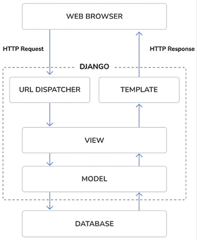

图 1.1：Django 架构

这就是 Django 处理 HTTP 请求并生成响应的方式：

1.  网络浏览器通过其 URL 请求页面，并将 HTTP 请求传递给 Django。

1.  Django 会遍历其配置的 URL 模式，并在第一个匹配请求 URL 的模式处停止。

1.  Django 执行与匹配的 URL 模式对应的视图。

1.  视图可能使用数据模型从数据库中检索信息。

1.  数据模型提供数据定义和行为。它们用于查询数据库。

1.  视图渲染一个模板（通常是 HTML）以显示数据，并将其与 HTTP 响应一起返回。

我们将在本章的“请求/响应周期”部分回顾 Django 的请求/响应周期。

Django 还包括请求/响应过程中的钩子，这些钩子被称为中间件。为了简化，中间件被有意地省略了。你将在本书的不同示例中使用中间件，你将在第十七章“上线”中学习如何创建自定义中间件。

我们已经介绍了 Django 的基础元素以及它是如何处理请求的。让我们探索 Django 5 引入的新特性。

## Django 5 的新特性

Django 5 引入了几个关键特性，这些特性将在本书的示例中使用。此版本还弃用了一些特性，并消除了之前已弃用的功能。Django 5.0 展示了以下新主要特性：

+   **管理站点中的分面过滤器**：现在可以将分面过滤器添加到管理站点。启用后，在管理员对象列表中会显示应用过滤器的分面计数。本章节的“添加分面计数到过滤器”部分介绍了这一功能。

+   **简化表单字段渲染的模板**：通过定义具有相关模板的字段组，表单字段渲染已被简化。这旨在使渲染 Django 表单字段相关元素的过程（如标签、小部件、帮助文本和错误）更加流畅。在*第二章，增强博客和添加社交功能*的“为评论表单创建模板”部分可以找到使用字段组的示例。

+   **数据库计算默认值**：Django 添加了数据库计算的默认值。本章的“添加日期时间字段”部分展示了此功能的示例。

+   **数据库生成的模型字段**：这是一种新类型的字段，允许你创建数据库生成的列。每次模型更改时，都会使用表达式自动设置字段值。字段值使用`GENERATED` `ALWAYS` SQL 语法设置。

+   **声明模型字段选择项的更多选项**：支持选择项的字段不再需要访问`.choices`属性来访问枚举类型。可以直接使用映射或可调用对象而不是可迭代对象来扩展枚举类型。本书中具有枚举类型的选项已被更新以反映这些变化。这种实例可以在本章的“添加状态字段”部分找到。

Django 5 还带来了一些对异步支持方面的改进**。异步服务器网关接口（ASGI**）支持首次在 Django 3 中引入，并在 Django 4.1 中通过为基于类的视图提供异步处理程序和异步 ORM 接口得到改进。Django 5 为认证框架添加了异步函数，提供了异步信号分发的支持，并将异步支持添加到多个内置装饰器中。

Django 5.0 停止支持 Python 3.8 和 3.9。

您可以在 Django 5.0 版本的发布说明中阅读完整的更改列表，链接为 [`docs.djangoproject.com/en/5.0/releases/5.0/`](https://docs.djangoproject.com/en/5.0/releases/5.0/)。

作为基于时间的发布，Django 5.0 没有重大变化，这使得将 Django 4 应用程序升级到 5.0 版本变得简单直接。

如果您想快速将现有的 Django 项目升级到 5.0 版本，可以使用 `django-upgrade` 工具。此包通过应用修复器将您的项目文件重写至目标版本。您可以在 [`github.com/adamchainz/django-upgrade`](https://github.com/adamchainz/django-upgrade) 找到使用 `django-upgrade` 的说明。

`django-upgrade` 工具的灵感来源于 `pyupgrade` 包。您可以使用 `pyupgrade` 自动升级 Python 新版本的语法。您可以在 [`github.com/asottile/pyupgrade`](https://github.com/asottile/pyupgrade) 找到有关 `pyupgrade` 的更多信息。

# 创建您的第一个项目

您的第一个 Django 项目将包括一个博客应用程序。这将为您提供一个对 Django 的功能和功能的坚实基础介绍。

由于博客需要从基本内容管理到评论、帖子分享、搜索和帖子推荐等高级功能在内的广泛功能，因此它是构建完整 Django 项目的完美起点。本书的前三章将涵盖博客项目。

在本章中，我们将从创建 Django 项目和博客的 Django 应用程序开始。然后我们将创建我们的数据模型并将它们同步到数据库。最后，我们将为博客创建一个管理站点，并构建视图、模板和 URL。 

*图 1.2* 展示了您将创建的博客应用程序页面：


图 1.2：第一章内置功能图

博客应用程序将包括一系列帖子，包括帖子标题、发布日期、作者、帖子摘要以及阅读帖子的链接。帖子列表页面将通过 `post_list` 视图实现。您将在本章学习如何创建视图。

当读者点击帖子列表页面上的帖子链接时，他们将被重定向到单个（详细）视图的帖子。详细视图将显示标题、发布日期、作者和完整的帖子正文。

让我们从创建我们的博客 Django 项目开始。Django 提供了一个命令，允许您创建初始项目文件结构。

在您的 shell 提示符中运行以下命令：

```py
django-admin startproject mysite 
```

这将创建一个名为 `mysite` 的 Django 项目。

为了防止冲突，请勿将项目命名为内置的 Python 或 Django 模块。

让我们看看生成的项目结构：

```py
mysite/
    manage.py
    mysite/
      __init__.py
      asgi.py
      settings.py
      urls.py
      wsgi.py 
```

外部的 `mysite/` 目录是我们项目的容器。它包含以下文件：

+   `manage.py`：这是一个用于与项目交互的命令行实用程序。您通常不需要编辑此文件。

+   `mysite/`：这是项目的 Python 包，它包含以下文件：

    +   `__init__.py`：一个空文件，告诉 Python 将 `mysite` 目录视为一个 Python 模块。

    +   `asgi.py`：这是配置以 ASGI 兼容的 Web 服务器作为 ASGI 应用程序运行项目的配置。ASGI 是异步 Web 服务器和应用程序的 Python 标准之一。

    +   `settings.py`：这表示项目的设置和配置，并包含初始默认设置。

    +   `urls.py`：这是您的 URL 模式所在的地方。这里定义的每个 URL 都映射到一个视图。

    +   `wsgi.py`：这是配置以 WSGI 兼容的 Web 服务器作为 **Web Server Gateway Interface**（**WSGI**）应用程序运行项目的配置。WSGI 是异步 Web 服务器和应用程序的 Python 标准之一。

## 应用初始数据库迁移

Django 应用程序需要一个数据库来存储数据。`settings.py` 文件包含项目在 `DATABASES` 设置中的数据库配置。默认配置是一个 SQLite3 数据库。SQLite 与 Python 3 一起打包，可以在任何 Python 应用程序中使用。SQLite 是一个轻量级数据库，您可以用它来与 Django 进行开发。如果您计划在生产环境中部署应用程序，您应该使用功能齐全的数据库，例如 PostgreSQL、MySQL 或 Oracle。您可以在 [`docs.djangoproject.com/en/5.0/topics/install/#database-installation`](https://docs.djangoproject.com/en/5.0/topics/install/#database-installation) 找到有关如何使用 Django 运行数据库的更多信息。

您的 `settings.py` 文件还包括一个名为 `INSTALLED_APPS` 的列表，其中包含默认添加到项目的常见 Django 应用程序。我们将在 *项目设置* 部分中介绍这些应用程序。

Django 应用程序包含映射到数据库表的数据模型。您将在 *创建博客数据模型* 部分中创建自己的模型。为了完成项目设置，您需要创建与 `INSTALLED_APPS` 设置中包含的默认 Django 应用程序模型关联的表。Django 提供了一个系统，可以帮助您管理数据库迁移。

打开 shell 提示符并运行以下命令：

```py
cd mysite
python manage.py migrate 
```

您将看到以下行结束的输出：

```py
Applying contenttypes.0001_initial... OK
Applying auth.0001_initial... OK
Applying admin.0001_initial... OK
Applying admin.0002_logentry_remove_auto_add... OK
Applying admin.0003_logentry_add_action_flag_choices... OK
Applying contenttypes.0002_remove_content_type_name... OK
Applying auth.0002_alter_permission_name_max_length... OK
Applying auth.0003_alter_user_email_max_length... OK
Applying auth.0004_alter_user_username_opts... OK
Applying auth.0005_alter_user_last_login_null... OK
Applying auth.0006_require_contenttypes_0002... OK
Applying auth.0007_alter_validators_add_error_messages... OK
Applying auth.0008_alter_user_username_max_length... OK
Applying auth.0009_alter_user_last_name_max_length... OK
Applying auth.0010_alter_group_name_max_length... OK
Applying auth.0011_update_proxy_permissions... OK
Applying auth.0012_alter_user_first_name_max_length... OK
Applying sessions.0001_initial... OK 
```

上述行是 Django 应用的数据库迁移。通过应用初始迁移，`INSTALLED_APPS`设置中列出的应用程序的表将在数据库中创建。

你将在本章的*创建和应用迁移*部分了解更多关于`migrate`管理命令的信息。

## 运行开发服务器

Django 自带了一个轻量级的 Web 服务器，可以快速运行你的代码，无需花费时间配置生产服务器。当你运行 Django 开发服务器时，它会持续检查你的代码中的更改。它会自动重新加载，让你在代码更改后无需手动重新加载。然而，它可能不会注意到某些操作，例如将新文件添加到你的项目中，因此在这些情况下，你必须手动重新启动服务器。

通过在 shell 提示符中输入以下命令来启动开发服务器：

```py
python manage.py runserver 
```

你应该看到类似以下内容：

```py
Watching for file changes with StatReloader
Performing system checks...
System check identified no issues (0 silenced).
January 01, 2024 - 10:00:00
Django version 5.0, using settings 'mysite.settings'
Starting development server at http://127.0.0.1:8000/
Quit the server with CONTROL-C. 
```

现在，在你的浏览器中打开`http://127.0.0.1:8000/`。你应该会看到一个页面，表明项目已成功运行，如图*图 1.3*所示：

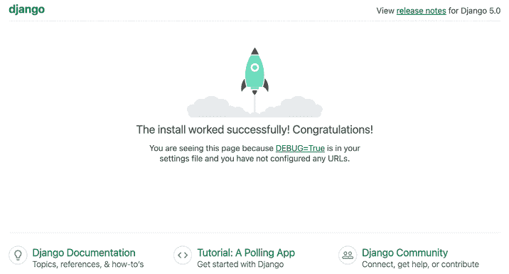

图 1.3：Django 开发服务器的默认页面

上述截图表明 Django 正在运行。如果你查看你的控制台，你会看到浏览器执行的`GET`请求：

```py
[01/Jan/2024 10:00:15] "GET / HTTP/1.1" 200 16351 
```

开发服务器会将每个 HTTP 请求记录在控制台。在运行开发服务器时发生的任何错误也会出现在控制台。

你可以自定义主机和端口运行 Django 开发服务器，或者告诉 Django 加载特定的设置文件，如下所示：

```py
python manage.py runserver 127.0.0.1:8001 --settings=mysite.settings 
```

当你必须处理需要不同配置的多个环境时，你可以为每个环境创建不同的设置文件。

此服务器仅适用于开发，不适用于生产使用。要在生产环境中部署 Django，你应该将其作为 WSGI 应用程序使用 Web 服务器（如 Apache、Gunicorn 或 uWSGI）运行，或者作为 ASGI 应用程序使用服务器（如 Daphne 或 Uvicorn）。你可以在[`docs.djangoproject.com/en/5.0/howto/deployment/wsgi/`](https://docs.djangoproject.com/en/5.0/howto/deployment/wsgi/)找到有关如何使用不同 Web 服务器部署 Django 的更多信息。

*第十七章*，*上线*，解释了如何为你的 Django 项目设置生产环境。

## 项目设置

让我们打开`settings.py`文件，看看项目的配置。Django 在这个文件中包含了一些设置，但这些只是所有可用 Django 设置的一部分。你可以在[`docs.djangoproject.com/en/5.0/ref/settings/`](https://docs.djangoproject.com/en/5.0/ref/settings/)看到所有设置及其默认值。

让我们回顾一下项目设置：

+   `DEBUG`是一个布尔值，用于开启和关闭项目的调试模式。如果设置为`True`，当你的应用程序抛出未捕获的异常时，Django 将显示详细的错误页面。当你迁移到生产环境时，请记住你必须将其设置为`False`。永远不要在生产环境中开启`DEBUG`模式部署网站，因为这会使敏感的项目相关数据暴露。

+   `ALLOWED_HOSTS`在调试模式开启或运行测试时不会应用。一旦你将网站迁移到生产环境并将`DEBUG`设置为`False`，你必须将你的域名/主机添加到这个设置中，以便它能够为你的 Django 网站提供服务。

+   `INSTALLED_APPS`是一个你必须为所有项目编辑的设置。此设置告诉 Django 哪些应用对此站点是活动的。默认情况下，Django 包括以下应用：

    +   `django.contrib.admin`: 一个管理网站。

    +   `django.contrib.auth`: 一个认证框架。

    +   `django.contrib.contenttypes`: 一个处理内容类型的框架。

    +   `django.contrib.sessions`: 一个会话框架。

    +   `django.contrib.messages`: 一个消息框架。

    +   `django.contrib.staticfiles`: 一个用于管理静态文件（如 CSS、JavaScript 文件和图像）的框架。

+   `MIDDLEWARE`是一个包含要执行的中间件的列表。

+   `ROOT_URLCONF`指示定义应用程序根 URL 模式的 Python 模块。

+   `DATABASES`是一个字典，包含项目中所有数据库的设置。必须始终有一个默认数据库。默认配置使用 SQLite3 数据库。

+   `LANGUAGE_CODE`定义了此 Django 站点的默认语言代码。

+   `USE_TZ`告诉 Django 激活/停用时区支持。Django 自带对时区感知日期时间的支持。当你使用`startproject`管理命令创建新项目时，此设置设置为`True`。

如果你对这里看到的内容不太理解，不要担心。你将在接下来的章节中了解更多关于不同的 Django 设置。

## 项目和应用

在整本书中，你将反复遇到**项目**和**应用**这两个术语。在 Django 中，一个项目被认为是一个带有一些设置的 Django 安装。一个应用是一组模型、视图、模板和 URL。应用与框架交互以提供特定功能，并且可以在各种项目中重用。你可以将项目视为你的网站，其中包含几个应用，如博客、维基或论坛，这些应用也可以被其他 Django 项目使用。

*图 1.4*显示了 Django 项目的结构：

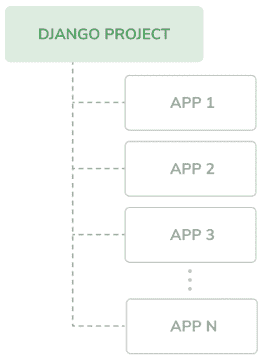

图 1.4：Django 项目/应用结构

## 创建一个应用

让我们创建我们的第一个 Django 应用。我们将从头开始构建一个博客应用。

在项目根目录的 shell 提示符中运行以下命令：

```py
python manage.py startapp blog 
```

这将创建应用的基本结构，其外观如下：

```py
blog/
    __init__.py
    admin.py
    apps.py
    migrations/
        __init__.py
    models.py
    tests.py
    views.py 
```

这些文件如下：

+   `__init__.py`：这是一个空文件，告诉 Python 将 `blog` 目录视为一个 Python 模块。

+   `admin.py`：你可以在这里注册模型，以便将它们包含在 Django 管理站点中——使用此站点是可选的。

+   `apps.py`：这包括 `blog` 应用程序的主要配置。

+   `migrations`：此目录将包含应用程序的数据库迁移。迁移允许 Django 跟踪你的模型更改并相应地同步数据库。此目录包含一个空的 `__init__.py` 文件。

+   `models.py`：这包括应用程序的数据模型；所有 Django 应用程序都需要一个 `models.py` 文件，但它可以是空的。

+   `tests.py`：你可以在这里添加应用程序的测试。

+   `views.py`：应用程序的逻辑在这里；每个视图接收一个 HTTP 请求，处理它，并返回一个响应。

应用程序结构准备就绪后，我们可以开始构建博客的数据模型。

# 创建博客数据模型

请记住，Python 对象是一组数据和方法的集合。类是打包数据和功能蓝图。创建一个新的类创建了一种新的对象类型，允许你创建该类型的实例。

Django 模型是关于你的数据行为的信息来源。它由一个继承自 `django.db.models.Model` 的 Python 类组成。每个模型映射到单个数据库表，其中类的每个属性代表一个数据库字段。

当你创建一个模型时，Django 将为你提供一个实用的 API，以便轻松查询数据库中的对象。

我们将为我们的博客应用程序定义数据库模型。然后，我们将为模型生成数据库迁移以创建相应的数据库表。在应用迁移时，Django 将为应用程序 `models.py` 文件中定义的每个模型创建一个表。

## 创建文章模型

首先，我们将定义一个 `Post` 模型，这将使我们能够将博客文章存储在数据库中。

将以下行添加到 `blog` 应用程序的 `models.py` 文件中。新行以粗体突出显示：

```py
from django.db import models
**class****Post****(models.Model):**
 **title = models.CharField(max_length=****250****)**
 **slug = models.SlugField(max_length=****250****)**
 **body = models.TextField()**
**def****__str__****(****self****):**
**return** **self.title** 
```

这是博客文章的数据模型。文章将有一个标题，一个称为 `slug` 的简短标签，以及正文。让我们看看这个模型的字段：

+   `title`：这是文章标题的字段。这是一个 `CharField` 字段，在 SQL 数据库中转换为 `VARCHAR` 列。

+   `slug`：这是一个 `SlugField` 字段，在 SQL 数据库中转换为 `VARCHAR` 列。slug 是一个只包含字母、数字、下划线或连字符的简短标签。标题为 *Django Reinhardt: A legend of Jazz* 的文章可能有一个 slug 如 *django-reinhardt-legend-jazz*。我们将在 *第二章，使用高级功能增强博客* 中使用 `slug` 字段来构建美观、SEO 友好的博客文章 URL。

+   `body`: 这是存储帖子主体的字段。这是一个`TextField`字段，在 SQL 数据库中对应一个`TEXT`列。

我们还向模型类添加了一个`__str__()`方法。这是默认的 Python 方法，用于返回一个包含对象人类可读表示的字符串。Django 将使用此方法在许多地方显示对象的名称，例如 Django 管理站点。

让我们看看模型及其字段是如何转换为数据库表和列的。以下图表显示了`Post`模型和 Django 在将模型同步到数据库时将创建的相应数据库表：

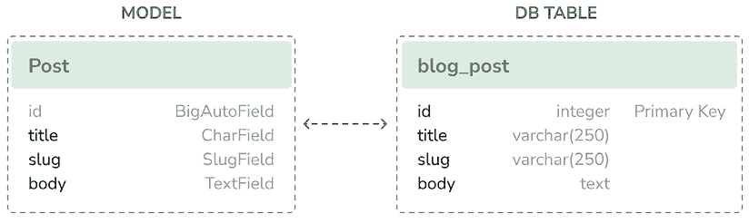

图 1.5：初始 Post 模型和数据库表对应关系

Django 将为每个模型字段创建一个数据库列：`title`、`slug`和`body`。你可以看到每个字段类型如何对应于数据库数据类型。

默认情况下，Django 为每个模型添加一个自动递增的主键字段。该字段的类型在每个应用程序配置中指定，或在全局`DEFAULT_AUTO_FIELD`设置中指定。当使用`startapp`命令创建应用程序时，`DEFAULT_AUTO_FIELD`的默认值是`BigAutoField`。这是一个 64 位的整数，根据可用的 ID 自动递增。如果你没有为你的模型指定主键，Django 会自动添加这个字段。你也可以通过在字段上设置`primary_key=True`来定义模型中的一个字段作为主键。

我们将使用额外的字段和行为扩展`Post`模型。一旦完成，我们将通过创建数据库迁移并应用它来将其同步到数据库。

## 添加日期时间字段

我们将继续通过向`Post`模型添加不同的日期时间字段。每篇帖子将在特定的日期和时间发布。因此，我们需要一个字段来存储发布日期和时间。我们还想存储`Post`对象创建的日期和时间以及最后一次修改的日期和时间。

编辑`blog`应用程序的`models.py`文件，使其看起来像这样；新行以粗体突出显示：

```py
from django.db import models
**from** **django.utils** **import** **timezone**
class Post(models.Model):
    title = models.CharField(max_length=250)
    slug = models.SlugField(max_length=250)
    body = models.TextField()
 **publish = models.DateTimeField(default=timezone.now)**
def __str__(self):
        return self.title 
```

我们已经向`Post`模型添加了一个`publish`字段。这是一个`DateTimeField`字段，在 SQL 数据库中对应一个`DATETIME`列。我们将用它来存储帖子发布的日期和时间。我们使用 Django 的`timezone.now`方法作为字段的默认值。注意，我们导入了`timezone`模块来使用这个方法。`timezone.now`返回一个时区感知格式的当前日期和时间。你可以将其视为标准 Python `datetime.now`方法的时区感知版本。

定义模型字段默认值的另一种方法是使用数据库计算出的默认值。Django 5 引入了这一特性，允许您使用底层数据库函数来生成默认值。例如，以下代码使用数据库服务器的当前日期和时间作为`publish`字段的默认值：

```py
from django.db import models
from django.db.models.functions import Now
class Post(models.Model):
    # ...
    publish = models.DateTimeField(db_default=Now()) 
```

要使用数据库生成的默认值，我们使用`db_default`属性而不是`default`。在这个例子中，我们使用了`Now`数据库函数。它具有与`default=timezone.now`类似的作用，但它使用`NOW()`数据库函数来生成初始值。您可以在[`docs.djangoproject.com/en/5.0/ref/models/fields/#django.db.models.Field.db_default`](https://docs.djangoproject.com/en/5.0/ref/models/fields/#django.db.models.Field.db_default)了解更多关于`db_default`属性的信息。您可以在[`docs.djangoproject.com/en/5.0/ref/models/database-functions/`](https://docs.djangoproject.com/en/5.0/ref/models/database-functions/)找到所有可用的数据库函数。

让我们继续之前的字段版本：

```py
class Post(models.Model):
    # ...
    publish = models.DateTimeField(default=timezone.now) 
```

编辑`blog`应用的`models.py`文件，并添加以下加粗的行：

```py
from django.db import models
from django.utils import timezone
class Post(models.Model):
    title = models.CharField(max_length=250)
    slug = models.SlugField(max_length=250)
    body = models.TextField()
    publish = models.DateTimeField(default=timezone.now)
 **created = models.DateTimeField(auto_now_add=****True****)**
 **updated = models.DateTimeField(auto_now=****True****)**
def __str__(self):
        return self.title 
```

我们已将以下字段添加到`Post`模型中：

+   `created`：这是一个`DateTimeField`字段。我们将用它来存储帖子创建的日期和时间。通过使用`auto_now_add`，日期将在创建对象时自动保存。

+   `updated`：这是一个`DateTimeField`字段。我们将用它来存储帖子最后更新的日期和时间。通过使用`auto_now`，日期将在保存对象时自动更新。

在 Django 模型中使用`auto_now_add`和`auto_now`日期时间字段对于跟踪对象的创建和最后修改时间非常有好处。

## 定义默认排序顺序

博客帖子通常按逆时间顺序展示，首先显示最新的帖子。对于我们的模型，我们将定义一个默认排序顺序。除非查询中指定了特定顺序，否则这种排序将在从数据库检索对象时生效。

按照以下内容编辑`blog`应用的`models.py`文件。新行已加粗：

```py
from django.db import models
from django.utils import timezone
class Post(models.Model):
    title = models.CharField(max_length=250)
    slug = models.SlugField(max_length=250)
    body = models.TextField()
    publish = models.DateTimeField(default=timezone.now)
    created = models.DateTimeField(auto_now_add=True)
    updated = models.DateTimeField(auto_now=True)
**class****Meta****:**
 **ordering = [****'-publish'****]**
def __str__(self):
        return self.title 
```

我们在模型内部添加了一个`Meta`类。这个类定义了模型的元数据。我们使用`ordering`属性告诉 Django 应该按`publish`字段排序结果。这种排序将在没有在查询中提供特定顺序的情况下作为数据库查询的默认排序方式。我们通过在字段名前使用连字符来表示降序，即`-publish`。默认情况下，帖子将按逆时间顺序返回。

## 添加数据库索引

让我们为`publish`字段定义一个数据库索引。这将提高通过此字段进行查询过滤或排序结果时的性能。我们预计许多查询将利用此索引，因为我们默认使用`publish`字段来排序结果。

编辑`blog`应用的`models.py`文件，使其看起来如下；新的行以粗体突出显示：

```py
from django.db import models
from django.utils import timezone
class Post(models.Model):
    title = models.CharField(max_length=250)
    slug = models.SlugField(max_length=250)
    body = models.TextField()
    publish = models.DateTimeField(default=timezone.now)
    created = models.DateTimeField(auto_now_add=True)
    updated = models.DateTimeField(auto_now=True)
    class Meta:
        ordering = ['-publish']
 **indexes = [**
 **models.Index(fields=[****'-publish'****]),**
 **]**
def __str__(self):
        return self.title 
```

我们在模型的`Meta`类中添加了`indexes`选项。此选项允许你为你的模型定义数据库索引，这可能包括一个或多个字段，以升序或降序，或功能表达式和数据库函数。我们为`publish`字段添加了一个索引。我们使用字段名前的连字符来定义特定于降序的索引。此索引的创建将包含在我们稍后为我们的博客模型生成的数据库迁移中。

MySQL 不支持索引排序。如果你使用 MySQL 作为数据库，将创建一个降序索引作为普通索引。

你可以在[`docs.djangoproject.com/en/5.0/ref/models/indexes/`](https://docs.djangoproject.com/en/5.0/ref/models/indexes/)找到有关如何为模型定义索引的更多信息。

## 激活应用

我们需要在项目中激活`blog`应用，以便 Django 能够跟踪应用并能够为其模型创建数据库表。

编辑`settings.py`文件，并将`blog.apps.BlogConfig`添加到`INSTALLED_APPS`设置中。它应该看起来像这样；新的行以粗体突出显示：

```py
INSTALLED_APPS = [
    'django.contrib.admin',
    'django.contrib.auth',
    'django.contrib.contenttypes',
    'django.contrib.sessions',
    'django.contrib.messages',
    'django.contrib.staticfiles',
**'blog.apps.BlogConfig'****,**
] 
```

`BlogConfig`类是应用配置。现在 Django 知道该应用对于此项目是激活的，并将能够加载应用模型。

## 添加状态字段

博客的一个常见功能是在发布之前将帖子保存为草稿。我们将在我们的模型中添加一个`status`字段，以便我们能够管理博客帖子的状态。我们将为帖子使用`Draft`和`Published`状态。

编辑`blog`应用的`models.py`文件，使其看起来如下。新的行以粗体突出显示：

```py
from django.db import models
from django.utils import timezone
class Post(models.Model):
**class****Status****(models.TextChoices):**
 **DRAFT =** **'DF'****,** **'Draft'**
 **PUBLISHED =** **'PB'****,** **'Published'**
    title = models.CharField(max_length=250)
    slug = models.SlugField(max_length=250)
    body = models.TextField()
    publish = models.DateTimeField(default=timezone.now)
    created = models.DateTimeField(auto_now_add=True)
    updated = models.DateTimeField(auto_now=True)
 **status = models.CharField(**
 **max_length=****2****,**
 **choices=Status,**
 **default=Status.DRAFT**
 **)**
class Meta:
        ordering = ['-publish']
        indexes = [
            models.Index(fields=['-publish']),
        ]
    def __str__(self):
        return self.title 
```

我们通过子类化`models.TextChoices`定义了枚举类`Status`。帖子状态的可用选项是`DRAFT`和`PUBLISHED`。它们相应的值是`DF`和`PB`，它们的标签或可读名称是*Draft*和*Published*。

Django 提供了枚举类型，你可以通过子类化来简单地定义选择。这些是基于 Python 标准库中的`enum`对象。你可以在[`docs.python.org/3/library/enum.html`](https://docs.python.org/3/library/enum.html)了解更多关于`enum`的信息。

Django 枚举类型相对于`enum`有一些修改。你可以在[`docs.djangoproject.com/en/5.0/ref/models/fields/#enumeration-types`](https://docs.djangoproject.com/en/5.0/ref/models/fields/#enumeration-types)了解这些差异。

我们可以通过访问 `Post.Status.choices` 来获取可用的选项，通过 `Post.Status.names` 来获取选项的名称，通过 `Post.Status.labels` 来获取可读性强的名称，以及通过 `Post.Status.values` 来获取选项的实际值。

我们还在模型中添加了一个新的 `status` 字段，它是一个 `CharField` 的实例。它包括一个 `choices` 参数，以限制字段的值只能为 `Status` 中的选项。我们还使用 `default` 参数为该字段设置了默认值。我们使用 `DRAFT` 作为该字段的默认选项。

在模型类内部定义选项并使用枚举类型是一种良好的实践。这将允许你轻松地在代码的任何地方引用选项标签、值或名称。你可以导入 `Post` 模型并使用 `Post.Status.DRAFT` 作为代码中任何地方的 *Draft* 状态的引用。

让我们看看如何与状态选项交互。

在 shell 提示符中运行以下命令以打开 Python shell：

```py
python manage.py shell 
```

然后，输入以下行：

```py
>>> from blog.models import Post
>>> Post.Status.choices 
```

你将获得具有值-标签对的 `enum` 选项，如下所示：

```py
[('DF', 'Draft'), ('PB', 'Published')] 
```

输入以下行：

```py
>>> Post.Status.labels 
```

你将得到 `enum` 成员的可读性名称，如下所示：

```py
['Draft', 'Published'] 
```

输入以下行：

```py
>>> Post.Status.values 
```

你将得到 `enum` 成员的值，如下所示。这些是可以存储在数据库中 `status` 字段的值：

```py
['DF', 'PB'] 
```

输入以下行：

```py
>>> Post.Status.names 
```

你将得到选项的名称，如下所示：

```py
['DRAFT', 'PUBLISHED'] 
```

你可以使用 `Post.Status.PUBLISHED` 访问特定的查找枚举成员，并且你可以访问它的 `.name` 和 `.value` 属性。

## 添加多对一关系

帖子总是由作者撰写的。我们将创建用户和帖子之间的关系，以指示哪个用户写了哪些帖子。Django 附带一个处理用户账户的认证框架。Django 认证框架位于 `django.contrib.auth` 包中，并包含一个 `User` 模型。为了定义用户和帖子之间的关系，我们将使用 `AUTH_USER_MODEL` 设置，该设置默认指向 `auth.User`。此设置允许你为项目指定不同的用户模型。

编辑 `blog` 应用程序的 `models.py` 文件，使其看起来如下。新行以粗体显示：

```py
**from** **django.conf** **import** **settings**
from django.db import models
from django.utils import timezone
class Post(models.Model):
    class Status(models.TextChoices):
        DRAFT = 'DF', 'Draft'
        PUBLISHED = 'PB', 'Published'
    title = models.CharField(max_length=250)
    slug = models.SlugField(max_length=250)
 **author = models.ForeignKey(**
 **settings.AUTH_USER_MODEL,**
 **on_delete=models.CASCADE,**
 **related_name=****'blog_posts'**
 **)**
    body = models.TextField()
    publish = models.DateTimeField(default=timezone.now)
    created = models.DateTimeField(auto_now_add=True)
    updated = models.DateTimeField(auto_now=True)
    status = models.CharField(
        max_length=2,
        choices=Status,
        default=Status.DRAFT
    )
    class Meta:
        ordering = ['-publish']
        indexes = [
            models.Index(fields=['-publish']),
        ]
    def __str__(self):
        return self.title 
```

我们已经导入了项目的设置，并在 `Post` 模型中添加了一个 `author` 字段。该字段定义了与默认用户模型的多对一关系，这意味着每篇帖子都是由一个用户撰写的，一个用户可以撰写任意数量的帖子。对于这个字段，Django 将在数据库中使用相关模型的键创建一个外键。

`on_delete`参数指定当引用的对象被删除时要采用的行为。这不仅仅适用于 Django；这是一个 SQL 标准。使用`CASCADE`，您指定当引用的用户被删除时，数据库也将删除所有相关的博客文章。您可以在[`docs.djangoproject.com/en/5.0/ref/models/fields/#django.db.models.ForeignKey.on_delete`](https://docs.djangoproject.com/en/5.0/ref/models/fields/#django.db.models.ForeignKey.on_delete)查看所有可能的选项。

我们使用`related_name`来指定反向关系的名称，从`User`到`Post`。这将使我们能够通过使用`user.blog_posts`的表示法轻松地从用户对象访问相关对象。我们将在稍后了解更多关于这一点。

Django 提供了不同类型的字段，您可以使用这些字段来定义您的模型。您可以在[`docs.djangoproject.com/en/5.0/ref/models/fields/`](https://docs.djangoproject.com/en/5.0/ref/models/fields/)找到所有字段类型。

`Post`模型现在已完成，我们现在可以将其同步到数据库。

## 创建并应用迁移

现在我们已经有了博客文章的数据模型，我们需要创建相应的数据库表。Django 提供了一个迁移系统，它跟踪对模型所做的更改，并使它们能够传播到数据库中。

`migrate`命令为`INSTALLED_APPS`中列出的所有应用程序应用迁移。它将数据库与当前模型和现有迁移同步。

首先，我们需要为我们的`Post`模型创建一个初始迁移。

在您项目的根目录下从 shell 提示符运行以下命令：

```py
python manage.py makemigrations blog 
```

您应该得到以下类似的输出：

```py
Migrations for 'blog':
    blog/migrations/0001_initial.py
        - Create model Post
        - Create index blog_post_publish_bb7600_idx on field(s)
          -publish of model post 
```

Django 刚刚在`blog`应用的`migrations`目录中创建了`0001_initial.py`文件。这个迁移包含创建`Post`模型数据库表的 SQL 语句以及为`publish`字段定义的数据库索引。

您可以通过查看文件内容来了解迁移是如何定义的。迁移指定了对其他迁移的依赖以及要在数据库中执行的操作以同步模型更改。

让我们看看 Django 将在数据库中执行的 SQL 代码以创建您的模型表。`sqlmigrate`命令接受迁移名称并返回它们的 SQL，而不执行它。

从 shell 提示符运行以下命令以检查您第一次迁移的 SQL 输出：

```py
python manage.py sqlmigrate blog 0001 
```

输出应该如下所示：

```py
BEGIN;
--
-- Create model Post
--
CREATE TABLE "blog_post" (
  "id" integer NOT NULL PRIMARY KEY AUTOINCREMENT,
  "title" varchar(250) NOT NULL,
  "slug" varchar(250) NOT NULL,
  "body" text NOT NULL,
  "publish" datetime NOT NULL,
  "created" datetime NOT NULL,
  "updated" datetime NOT NULL,
  "status" varchar(10) NOT NULL,
  "author_id" integer NOT NULL REFERENCES "auth_user" ("id") DEFERRABLE INITIALLY DEFERRED);
--
-- Create blog_post_publish_bb7600_idx on field(s) -publish of model post
--
CREATE INDEX "blog_post_publish_bb7600_idx" ON "blog_post" ("publish" DESC);
CREATE INDEX "blog_post_slug_b95473f2" ON "blog_post" ("slug");
CREATE INDEX "blog_post_author_id_dd7a8485" ON "blog_post" ("author_id");
COMMIT; 
```

实际输出取决于您使用的数据库。前面的输出是为 SQLite 生成的。如您在输出中看到的，Django 通过组合应用程序名称和模型的 _lowercase_ 名称（`blog_post`）来生成表名，但您也可以在模型的`Meta`类中使用`db_table`属性为您的模型指定一个自定义数据库名称。

Django 会创建一个自动增长的`id`列，该列用作每个模型的键，但你也可以通过在你的模型字段中指定`primary_key=True`来覆盖此设置。默认的`id`列由一个自动增加的整数组成。此列对应于自动添加到你的模型中的`id`字段。

以下三个数据库索引被创建：

+   在`publish`列上的降序索引。这是我们通过模型的`Meta`类的`indexes`选项显式定义的索引。

+   在`slug`列上的索引，因为`SlugField`字段默认意味着索引。

+   在`author_id`列上的索引，因为`ForeignKey`字段默认意味着索引。

让我们比较`Post`模型与其对应的数据库`blog_post`表：

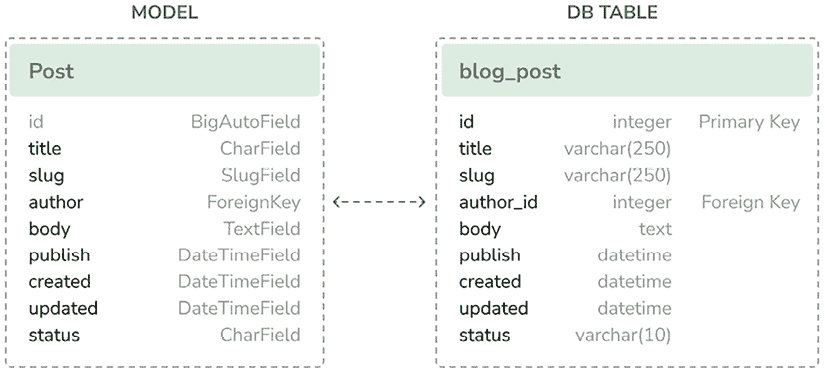

图 1.6：完整的 Post 模型和数据库表对应关系

*图 1.6*显示了模型字段如何对应于数据库表列。

让我们使用新模型同步数据库。

在 shell 提示符中执行以下命令以应用现有的迁移：

```py
python manage.py migrate 
```

你将得到以下行结束的输出：

```py
Applying blog.0001_initial... OK 
```

我们刚刚为`INSTALLED_APPS`中列出的应用程序应用了迁移，包括`blog`应用程序。应用迁移后，数据库反映了模型的当前状态。

如果你编辑`models.py`文件以添加、删除或更改现有模型的字段，或者如果你添加了新模型，你必须使用`makemigrations`命令创建一个新的迁移。每个迁移都允许 Django 跟踪模型变化。然后，你必须使用`migrate`命令应用迁移，以保持数据库与你的模型同步。

# 为模型创建管理站点

现在，`Post`模型与数据库同步后，我们可以创建一个简单的管理站点来管理博客文章。

Django 自带一个非常有用的内置管理界面，用于编辑内容。Django 站点通过读取模型元数据并提供一个用于编辑内容的现成接口来动态构建。你可以直接使用它，配置你希望如何在其中显示你的模型。

`django.contrib.admin`应用程序已经包含在`INSTALLED_APPS`设置中，因此你不需要添加它。

## 创建超级用户

首先，你需要创建一个用户来管理管理站点。运行以下命令：

```py
python manage.py createsuperuser 
```

你将看到以下输出。输入你想要的用户名、电子邮件和密码，如下所示：

```py
Username (leave blank to use 'admin'): admin
Email address: admin@admin.com
Password: ********
Password (again): ******** 
```

然后，你将看到以下成功消息：

```py
Superuser created successfully. 
```

我们刚刚创建了一个具有最高权限的管理员用户。

## Django 管理站点

使用以下命令启动开发服务器：

```py
python manage.py runserver 
```

在你的浏览器中打开`http://127.0.0.1:8000/admin/`。你应该看到管理登录页面，如图*图 1.7*所示：

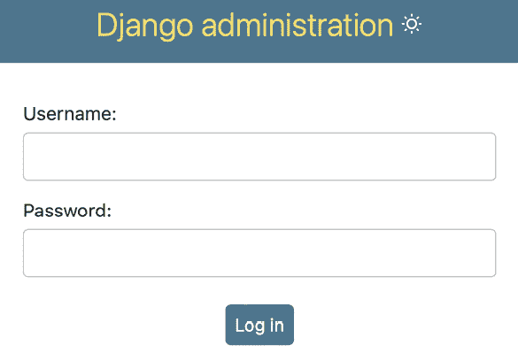

图 1.7：Django 管理站点登录屏幕

使用前一步骤中创建的用户凭据登录。你会看到如图 *图 1.8* 所示的管理站点索引页面：

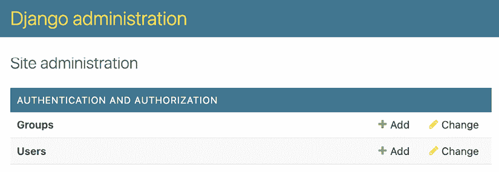

图 1.8：Django 管理站点索引页面

在前面的截图中所看到的 `Group` 和 `User` 模型是 Django 认证框架的一部分，位于 `django.contrib.auth`。如果你点击 **Users**，你会看到你之前创建的用户。

## 将模型添加到管理站点

让我们将你的博客模型添加到管理站点。编辑 `blog` 应用的 `admin.py` 文件，使其看起来像这样；新行以粗体突出显示：

```py
from django.contrib import admin
**from** **.models** **import** **Post**
**admin.site.register(Post)** 
```

现在，在浏览器中重新加载管理站点。你应该会在网站上看到你的 `Post` 模型，如下所示：

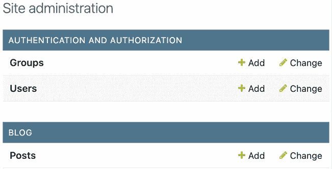

图 1.9：包含在 Django 管理站点索引页面中的博客应用的帖子模型

这很简单，对吧？当你将模型注册到 Django 管理站点时，你将获得一个由 introspecting 你的模型生成的用户友好界面，它允许你以简单的方式列出、编辑、创建和删除对象。

点击 **Posts** 旁边的 **添加** 链接来添加一个新的帖子。你会注意到 Django 为你的模型动态生成的表单，如图 *图 1.10* 所示：

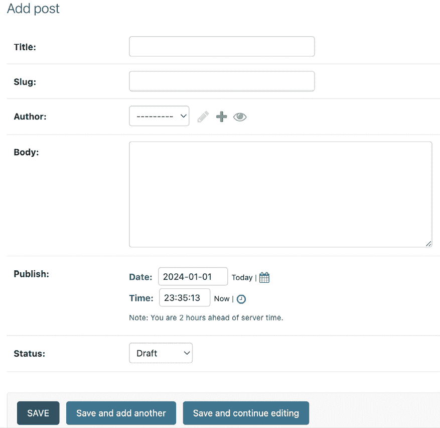

图 1.10：Django 管理站点帖子模型的编辑表单

Django 为每种类型的字段使用不同的表单小部件。即使是复杂的字段，如 `DateTimeField`，也使用简单的界面，如 JavaScript 日期选择器来显示。

填写表单并点击 **保存** 按钮。你应该会被重定向到帖子列表页面，并显示成功消息和刚刚创建的帖子，如图 *图 1.11* 所示：

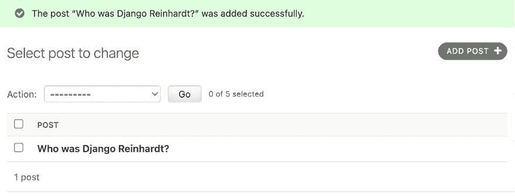

图 1.11：添加成功消息的帖子模型的 Django 管理站点列表视图

## 自定义模型显示方式

现在，我们将看看如何自定义管理站点。

编辑你的 `blog` 应用的 `admin.py` 文件，并按以下方式更改它。新行以粗体突出显示：

```py
from django.contrib import admin
from .models import Post
**@admin.register(****Post****)**
**class****PostAdmin****(admin.ModelAdmin):**
 **list_display = [****'title'****,** **'slug'****,** **'author'****,** **'publish'****,** **'status'****]** 
```

我们正在告诉 Django 管理站点，使用继承自 `ModelAdmin` 的自定义类来注册模型。在这个类中，我们可以包含有关如何在管理站点上显示模型以及如何与之交互的信息。

`list_display` 属性允许你设置你希望在管理对象列表页面上显示的模型字段。`@admin.register()` 装饰器执行与替换的 `admin.site.register()` 函数相同的功能，注册它装饰的 `ModelAdmin` 类。

让我们使用更多选项自定义 `admin` 模型。

编辑你的 `blog` 应用的 `admin.py` 文件，并按以下方式更改它。新行以粗体突出显示：

```py
from django.contrib import admin
from .models import Post
@admin.register(Post)
class PostAdmin(admin.ModelAdmin):
    list_display = ['title', 'slug', 'author', 'publish', 'status']
 **list_filter = [****'status'****,** **'created'****,** **'publish'****,** **'author'****]**
 **search_fields = [****'****title'****,** **'body'****]**
 **prepopulated_fields = {****'slug'****: (****'title'****,)}**
 **raw_id_fields = [****'author'****]**
 **date_hierarchy =** **'publish'**
 **ordering = [****'status'****,** **'publish'****]** 
```

返回你的浏览器并重新加载帖子列表页面。现在，它看起来是这样的：


图 1.12：Django 管理站点为帖子模型定制的列表视图

你可以看到在帖子列表页面上显示的字段是我们指定的 `list_display` 属性中的字段。列表页面现在包括一个右侧边栏，允许你通过 `list_filter` 属性中包含的字段过滤结果。对于 `ForeignKey` 字段如 `author` 的过滤器，只有当数据库中存在多个对象时才在侧边栏中显示。

页面上出现了一个搜索栏。这是因为我们使用 `search_fields` 属性定义了一个可搜索字段列表。在搜索栏下方，有一些导航链接，用于通过 `date_hierarchy` 属性定义的日期层次结构进行导航；默认情况下，帖子按 **状态** 和 **发布** 列排序。我们使用 `ordering` 属性指定了默认排序标准。

接下来，点击 **添加帖子** 链接。你也会在这里注意到一些变化。当你输入新帖子的标题时，`slug` 字段会自动填充。你已经告诉 Django 使用 `prepopulated_fields` 属性，将 `title` 字段的输入预先填充到 `slug` 字段中：

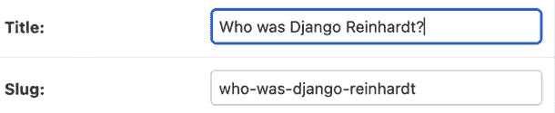

图 1.13：slug 模型现在在输入标题时自动预先填充

此外，`author` 字段现在显示为查找小部件，当有数千个用户时，这比输入选择下拉列表要好得多。这是通过 `raw_id_fields` 属性实现的，看起来像这样：


图 1.14：用于选择与帖子模型作者字段相关联的对象的小部件

## 将面数添加到过滤器中

Django 5.0 将面过滤功能引入到管理站点，展示了面数。这些计数表示对应于每个特定过滤器的对象数量，使得在管理员更改列表视图中识别匹配对象变得更容易。接下来，我们将确保面过滤器始终显示在 `PostAdmin` 管理模型中。

编辑你的 `blog` 应用程序的 `admin.py` 文件，并添加以下加粗的行：

```py
from django.contrib import admin
from .models import Post
@admin.register(Post)
class PostAdmin(admin.ModelAdmin):
    list_display = ['title', 'slug', 'author', 'publish', 'status']
    list_filter = ['status', 'created', 'publish', 'author']
    search_fields = ['title', 'body']
    prepopulated_fields = {'slug': ('title',)}
    raw_id_fields = ['author']
    date_hierarchy = 'publish'
    ordering = ['status', 'publish']
 **show_facets = admin.ShowFacets.ALWAYS** 
```

使用管理站点创建一些帖子，并访问 `http://127.0.0.1:8000/admin/blog/post/`。现在过滤器应包括总面数，如图 *图 1.15* 所示：

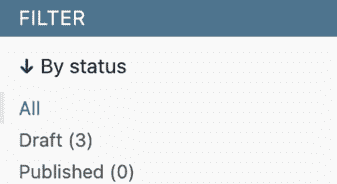

图 1.15：包括面数的状态字段过滤器

通过几行代码，我们已经自定义了模型在管理站点上的显示方式。有大量的方式可以自定义和扩展 Django 管理站点；你将在本书的后面了解更多关于这些内容。

你可以在 [`docs.djangoproject.com/en/5.0/ref/contrib/admin/`](https://docs.djangoproject.com/en/5.0/ref/contrib/admin/) 找到有关 Django 管理站点的更多信息。

# 使用查询集和管理器进行工作

现在我们已经有一个完全功能的管理站点来管理博客文章，这是一个学习如何以编程方式读取和写入数据库内容的好时机。

Django 的 **对象关系映射器**（**ORM**）是一个强大的数据库抽象 API，它让你可以轻松地创建、检索、更新和删除对象。ORM 允许你使用 Python 的面向对象范式生成 SQL 查询。你可以将其视为一种以 Pythonic 方式与数据库交互的方法，而不是编写原始 SQL 查询。

ORM 将你的模型映射到数据库表中，并为你提供了一个简单的 Pythonic 接口来与数据库交互。ORM 会生成 SQL 查询并将结果映射到模型对象。Django ORM 与 MySQL、PostgreSQL、SQLite、Oracle 和 MariaDB 兼容。

记住，你可以在项目的 `settings.py` 文件的 `DATABASES` 设置中定义你项目的数据库。Django 可以同时与多个数据库一起工作，并且你可以编写数据库路由器来创建自定义的数据路由方案。

一旦你创建了你的数据模型，Django 会为你提供一个免费的 API 来与之交互。你可以在官方文档中找到模型 API 参考，链接为 [`docs.djangoproject.com/en/5.0/ref/models/`](https://docs.djangoproject.com/en/5.0/ref/models/)。

Django ORM 基于 QuerySets。QuerySet 是一组数据库查询，用于从你的数据库中检索对象。你可以应用过滤器到 QuerySets 上，根据给定的参数来缩小查询结果。QuerySet 等同于一个 `SELECT` SQL 语句，而过滤器是限制 SQL 子句，如 `WHERE` 或 `LIMIT`。

接下来，你将学习如何构建和执行 QuerySets。

## 创建对象

在 shell 提示符中运行以下命令以打开 Python shell：

```py
python manage.py shell 
```

然后，输入以下行：

```py
>>> from django.contrib.auth.models import User
>>> from blog.models import Post
>>> user = User.objects.get(username='admin')
>>> post = Post(title='Another post',
...             slug='another-post',
...             body='Post body.',
...             author=user)
>>> post.save() 
```

让我们来分析一下这段代码的功能。

首先，我们通过用户名 `admin` 检索 `user` 对象：

```py
>>> user = User.objects.get(username='admin') 
```

`get()` 方法允许我们从数据库中检索单个对象。此方法在幕后执行一个 `SELECT` SQL 语句。注意，此方法期望一个与查询匹配的结果。如果数据库没有返回结果，此方法将引发一个 `DoesNotExist` 异常，如果数据库返回多个结果，它将引发一个 `MultipleObjectsReturned` 异常。这两个异常都是正在执行查询的模型类的属性。

然后，我们创建一个具有自定义标题、别名和正文的 `Post` 实例，并将之前检索到的用户设置为帖子的作者：

```py
>>> post = Post(title='Another post', slug='another-post', body='Post body.', author=user) 
```

这个对象是在内存中的，并没有持久化到数据库；我们创建了一个可以在运行时使用的 Python 对象，但并没有将其保存到数据库中。

最后，我们使用 `save()` 方法在数据库中保存 `Post` 对象：

```py
>>> post.save() 
```

此操作在幕后执行一个 `INSERT` SQL 语句。

我们首先在内存中创建了一个对象，然后将其持久化到数据库中。然而，你可以使用`create()`方法在单个操作中创建对象并将其持久化到数据库，如下所示：

```py
>>> Post.objects.create(title='One more post',
                    slug='one-more-post',
                    body='Post body.',
                    author=user) 
```

在某些情况下，你可能需要从数据库中检索对象或创建它（如果不存在）。`get_or_create()`方法通过检索对象或创建它（如果未找到）来简化此过程。此方法返回一个包含检索到的对象和一个表示是否创建了新对象的布尔值的元组。以下代码尝试检索用户名为`user2`的`User`对象，如果不存在，则创建一个：

```py
>>> user, created = User.objects.get_or_create(username='user2') 
```

## 更新对象

现在，将上一个`Post`对象的标题更改为不同的内容，并再次保存对象：

```py
>>> post.title = 'New title'
>>> post.save() 
```

这次，`save()`方法执行了一个`UPDATE` SQL 语句。

你对模型对象所做的更改在调用`save()`方法之前不会持久化到数据库。

## 检索对象

你已经知道如何使用`get()`方法从数据库中检索单个对象。我们通过`Post.objects.get()`访问这个方法。每个 Django 模型至少有一个管理器，默认管理器称为`objects`。你可以通过你的模型管理器获取查询集对象。

要检索表中的所有对象，我们使用默认`objects`管理器的`all()`方法，如下所示：

```py
>>> all_posts = Post.objects.all() 
```

这就是如何创建一个查询集，该查询集返回数据库中的所有对象。请注意，这个查询集尚未执行。Django 查询集是**懒加载**的，这意味着它们只有在被强制执行时才会被评估。这种行为使得查询集非常高效。如果你没有将查询集分配给变量，而是直接在 Python 命令行中写入它，那么查询集的 SQL 语句将被执行，因为你正在强制它生成输出：

```py
>>> Post.objects.all()
<QuerySet [<Post: Who was Django Reinhardt?>, <Post: New title>]> 
```

## 过滤对象

要过滤查询集，你可以使用管理器的`filter()`方法。此方法允许你通过使用字段查找来指定 SQL `WHERE` 子句的内容。

例如，你可以使用以下方法通过其`标题`过滤`Post`对象：

```py
>>> Post.objects.filter(title='Who was Django Reinhardt?') 
```

这个查询集将返回所有标题为*谁是 Django Reinhardt？*的帖子。让我们回顾一下使用此查询集生成的 SQL 语句。在 shell 中运行以下代码：

```py
>>> posts = Post.objects.filter(title='Who was Django Reinhardt?')
>>> print(posts.query) 
```

通过打印查询集的`query`属性，我们可以获取它产生的 SQL：

```py
SELECT "blog_post"."id", "blog_post"."title", "blog_post"."slug", "blog_post"."author_id", "blog_post"."body", "blog_post"."publish", "blog_post"."created", "blog_post"."updated", "blog_post"."status" FROM "blog_post" WHERE "blog_post"."title" = Who was Django Reinhardt? ORDER BY "blog_post"."publish" DESC 
```

生成的`WHERE`子句在`标题`列上执行精确匹配。`ORDER BY`子句指定了在`Post`模型的`Meta`选项中定义的默认顺序，因为我们没有在查询集中提供任何特定的排序。你将在稍后学习有关排序的内容。请注意，`query`属性不是查询集公共 API 的一部分。

## 使用字段查找

之前的查询集示例包含一个与精确匹配的过滤器查找。查询集接口为你提供了多种查找类型。使用两个下划线来定义查找类型，格式为 `field__lookup`。例如，以下查找产生一个精确匹配：

```py
>>> Post.objects.filter(id__exact=1) 
```

当没有提供特定的查找类型时，默认的查找类型是 `exact`。以下查找与上一个查找等效：

```py
>>> Post.objects.filter(id=1) 
```

让我们看看其他常见的查找类型。你可以使用 `iexact` 生成不区分大小写的查找：

```py
>>> Post.objects.filter(title__iexact='who was django reinhardt?') 
```

你也可以使用包含测试来过滤对象。`contains` 查找转换为使用 `LIKE` 操作符的 SQL 查找：

```py
>>> Post.objects.filter(title__contains='Django') 
```

相当的 SQL 子句是 `WHERE title LIKE '%Django%'`。还有一个不区分大小写版本，名为 `icontains`：

```py
>>> Post.objects.filter(title__icontains='django') 
```

你可以使用 `in` 查找检查给定的可迭代对象（通常是列表、元组或另一个查询集对象）。以下示例检索 `id` 为 `1` 或 `3` 的帖子：

```py
>>> Post.objects.filter(id__in=[1, 3]) 
```

以下示例展示了大于 (`gt`) 查找：

```py
>>> Post.objects.filter(id__gt=3) 
```

相当的 SQL 子句是 `WHERE ID > 3`。

以下示例展示了大于等于查找：

```py
>>> Post.objects.filter(id__gte=3) 
```

这一个展示了小于查找：

```py
>>> Post.objects.filter(id__lt=3) 
```

这展示了小于等于查找：

```py
>>> Post.objects.filter(id__lte=3) 
```

可以使用 `startswith` 和 `istartswith` 查找类型分别执行大小写敏感或不敏感的以...开头的查找：

```py
>>> Post.objects.filter(title__istartswith='who') 
```

可以使用 `endswith` 和 `iendswith` 查找类型分别执行大小写敏感或不敏感的以...结尾的查找：

```py
>>> Post.objects.filter(title__iendswith='reinhardt?') 
```

对于日期查找，也有不同的查找类型。精确日期查找可以按以下方式执行：

```py
>>> from datetime import date
>>> Post.objects.filter(publish__date=date(2024, 1, 31)) 
```

这展示了如何通过年份过滤 `DateField` 或 `DateTimeField` 字段：

```py
>>> Post.objects.filter(publish__year=2024) 
```

你还可以按月份进行过滤：

```py
>>> Post.objects.filter(publish__month=1) 
```

你还可以按天进行过滤：

```py
>>> Post.objects.filter(publish__day=1) 
```

你还可以将额外的查找链接到 `date`、`year`、`month` 和 `day`。例如，以下是一个查找大于给定日期的值的查询：

```py
>>> Post.objects.filter(publish__date__gt=date(2024, 1, 1)) 
```

要查找相关对象字段，你也使用双下划线表示法。例如，要检索用户名为 `admin` 的用户撰写的帖子，可以使用以下查询：

```py
>>> Post.objects.filter(author__username='admin') 
```

你还可以为相关字段链接额外的查找。例如，要检索用户名为 `ad` 开头的任何用户撰写的帖子，可以使用以下查询：

```py
>>> Post.objects.filter(author__username__starstwith='ad') 
```

你还可以按多个字段进行过滤。例如，以下查询集检索了由用户名为 `admin` 的作者在 2024 年发布的所有帖子：

```py
>>> Post.objects.filter(publish__year=2024, author__username='admin') 
```

## 链接过滤器

过滤查询集的结果是另一个查询集对象。这允许你将查询集链接在一起。你可以通过链接多个过滤器来构建与上一个查询集等效的查询集：

```py
>>> Post.objects.filter(publish__year=2024) \
>>>             .filter(author__username='admin') 
```

## 排除对象

你可以使用管理器的 `exclude()` 方法排除查询集中的某些结果。例如，你可以检索所有标题不以 `Why` 开头的 2024 年发布的帖子：

```py
>>> Post.objects.filter(publish__year=2024) \
>>>             .exclude(title__startswith='Why') 
```

## 排序对象

默认排序在模型的 `Meta` 选项的 `ordering` 中定义。您可以使用管理器的 `order_by()` 方法覆盖默认排序。例如，您可以按 `title` 排序检索所有对象，如下所示：

```py
>>> Post.objects.order_by('title') 
```

默认情况下，排序是升序的。您可以使用负号前缀来表示降序，如下所示：

```py
>>> Post.objects.order_by('-title') 
```

您可以按多个字段排序。以下示例首先按 `author` 排序，然后按 `title` 排序：

```py
>>> Post.objects.order_by('author', 'title') 
```

要随机排序，请使用字符串 `'?'`，如下所示：

```py
>>> Post.objects.order_by('?') 
```

## 限制 QuerySets

您可以使用 Python 数组切片语法的子集来限制 QuerySet 的结果数量。例如，以下 QuerySet 将结果限制为 5 个对象：

```py
>>> Post.objects.all()[:5] 
```

这转换为 SQL 的 `LIMIT 5` 子句。请注意，不支持负索引。

```py
>>> Post.objects.all()[3:6] 
```

前面的代码转换为 SQL 的 `OFFSET 3 LIMIT 6` 子句，以返回第四到第六个对象。

要检索单个对象，您可以使用索引而不是切片。例如，使用以下方法检索随机排序的帖子中的第一个对象：

```py
>>> Post.objects.order_by('?')[0] 
```

## 对象计数

`count()` 方法计算与 QuerySet 匹配的对象总数，并返回一个整数。此方法转换为 `SELECT COUNT(*)` SQL 语句。以下示例返回 `id` 小于 `3` 的帖子总数：

```py
>>> Post.objects.filter(id_lt=3).count()
2 
```

## 检查对象是否存在

`exists()` 方法允许您检查 QuerySet 是否包含任何结果。如果 QuerySet 包含任何项目，则此方法返回 `True`，否则返回 `False`。例如，您可以使用以下 QuerySet 检查是否有任何标题以 *Why* 开头的帖子：

```py
>>> Post.objects.filter(title__startswith='Why').exists()
False 
```

## 删除对象

如果您想删除一个对象，可以使用对象实例的 `delete()` 方法，如下所示：

```py
>>> post = Post.objects.get(id=1)
>>> post.delete() 
```

注意，删除对象也会删除任何与使用 `on_delete` 设置为 `CASCADE` 的 `ForeignKey` 对象定义的依赖关系。

## 使用 Q 对象进行复杂查找

使用 `filter()` 进行字段查找时，会与 SQL 的 `AND` 操作符连接。例如，`filter(field1='foo', field2='bar')` 将检索 `field1` 为 *foo* 且 `field2` 为 *bar* 的对象。如果您需要构建更复杂的查询，例如包含 `OR` 语句的查询，可以使用 `Q` 对象。

`Q` 对象允许您封装一组字段查找。您可以通过将 `Q` 对象与 `&`（与）、`|`（或）和 `^`（异或）运算符组合来构建语句。

例如，以下代码检索标题以字符串 *who* 或 *why*（不区分大小写）开头的帖子：

```py
>>> from django.db.models import Q
>>> starts_who = Q(title__istartswith='who')
>>> starts_why = Q(title__istartswith='why')
>>> Post.objects.filter(starts_who | starts_why) 
```

在这种情况下，我们使用 `|` 运算符构建一个 `OR` 语句。

您可以在 [`docs.djangoproject.com/en/5.0/topics/db/queries/#complex-lookups-with-q-objects`](https://docs.djangoproject.com/en/5.0/topics/db/queries/#complex-lookups-with-q-objects) 中了解更多关于 `Q` 对象的信息。

## 当 QuerySets 被评估时

创建查询集不会涉及任何数据库活动，直到它被评估。查询集通常会返回另一个未评估的查询集。你可以将任意数量的过滤器连接到一个查询集上，并且只有在查询集被评估时才会访问数据库。当查询集被评估时，它将转换为一个对数据库的 SQL 查询。

查询集仅在以下情况下才会被评估：

+   第一次遍历它们时

+   当你切片它们时，例如，`Post.objects.all()[:3]`

+   当你序列化或缓存它们时

+   当你调用 `repr()` 或 `len()` 时

+   当你显式调用 `list()` 时

+   当你在语句中测试它们，例如 `bool()`、`or`、`and` 或 `if`

## 更多关于查询集的信息

你将在本书的所有项目示例中使用查询集。你将在第三章“扩展你的博客应用程序”的“通过相似性检索帖子”部分中学习如何生成查询集的聚合。

你将在第七章“跟踪用户行为”的“优化涉及相关对象的查询集”部分中学习如何优化查询集。

查询集 API 参考文档位于 [`docs.djangoproject.com/en/5.0/ref/models/querysets/`](https://docs.djangoproject.com/en/5.0/ref/models/querysets/).

你可以在 [`docs.djangoproject.com/en/5.0/topics/db/queries/`](https://docs.djangoproject.com/en/5.0/topics/db/queries/) 了解更多关于使用 Django ORM 进行查询的信息。

## 创建模型管理器

每个模型的默认管理器是 `objects` 管理器。此管理器检索数据库中的所有对象。然而，我们可以为模型定义自定义管理器。

让我们创建一个自定义管理器来检索所有具有 `PUBLISHED` 状态的帖子。

为你的模型添加或自定义管理器有两种方式：你可以向现有管理器添加额外的管理方法，或者通过修改管理器返回的初始查询集来创建一个新的管理器。第一种方法为你提供了一个查询集表示法，如 `Post.objects.my_manager()`，而后者为你提供了一个查询集表示法，如 `Post.my_manager.all()`。

我们将选择第二种方法来实现一个管理器，它将允许我们使用 `Post.published.all()` 的表示法检索帖子。

编辑你的 `blog` 应用程序的 `models.py` 文件以添加自定义管理器，如下所示。新行以粗体显示：

```py
**class****PublishedManager****(models.Manager):**
**def****get_queryset****(****self****):**
**return** **(**
**super****().get_queryset().****filter****(status=Post.Status.PUBLISHED)**
 **)**
class Post(models.Model):
    # model fields
# ...
 **objects = models.Manager()** **# The default manager.**
 **published = PublishedManager()** **# Our custom manager.**
class Meta:
        ordering = ['-publish']
        indexes = [
            models.Index(fields=['-publish']),
        ]
    def __str__(self):
        return self.title 
```

在模型中声明的第一个管理器将成为默认管理器。你可以使用 `Meta` 属性 `default_manager_name` 来指定不同的默认管理器。如果模型中没有定义管理器，Django 会自动为它创建 `objects` 默认管理器。如果你为你的模型声明了任何管理器，但还想保留 `objects` 管理器，你必须明确将其添加到你的模型中。在前面的代码中，我们已经将默认的 `objects` 管理器和自定义的 `published` 管理器添加到了 `Post` 模型中。

管理器的 `get_queryset()` 方法返回将要执行的查询集。我们已重写此方法以构建一个自定义查询集，该查询集通过状态过滤帖子，并返回一个只包含具有 `PUBLISHED` 状态的帖子的连续查询集。

我们现在已为 `Post` 模型定义了一个自定义管理器。让我们测试它！

在 shell 提示符中再次使用以下命令启动开发服务器：

```py
python manage.py shell 
```

现在，你可以导入 `Post` 模型并检索所有标题以 `Who` 开头的已发布帖子，执行以下查询集：

```py
>>> from blog.models import Post
>>> Post.published.filter(title__startswith='Who') 
```

要为这个查询集获取结果，请确保将 `Post` 对象的 `status` 字段设置为 `PUBLISHED`，其 `title` 以字符串 *Who* 开头。

# 构建 list 和 detail 视图

现在你已经了解了如何使用 ORM，你就可以构建 `blog` 应用程序的视图了。Django 视图只是一个接收网络请求并返回网络响应的 Python 函数。返回所需响应的所有逻辑都放在视图中。

首先，你将创建你的应用程序视图，然后你将为每个视图定义一个 URL 模式，最后，你将创建 HTML 模板以渲染视图生成的数据。每个视图将渲染一个模板，向其传递变量，并返回一个包含渲染输出的 HTTP 响应。

## 创建列表和详情视图

让我们先创建一个显示帖子列表的视图。

编辑 `blog` 应用程序的 `views.py` 文件，使其看起来像这样；新行以粗体突出显示：

```py
from django.shortcuts import render
**from** **.models** **import** **Post**
**def****post_list****(****request****):**
 **posts = Post.published.****all****()**
**return** **render(**
 **request,**
**'blog/post/list.html'****,**
 **{****'posts'****: posts}**
 **)** 
```

这是我们非常第一个 Django 视图。`post_list` 视图将 `request` 对象作为唯一参数。所有视图都需要这个参数。

在这个视图中，我们使用之前创建的 `published` 管理器检索所有具有 `PUBLISHED` 状态的帖子。

最后，我们使用 Django 提供的 `render()` 快捷方式渲染给定模板的帖子列表。这个函数接受 `request` 对象、模板路径和上下文变量来渲染给定的模板。它返回一个包含渲染文本的 `HttpResponse` 对象（通常是 HTML 代码）。

`render()` 快捷方式会考虑请求上下文，因此任何由模板上下文处理器设置的变量都可以通过给定的模板访问。模板上下文处理器只是将变量设置到上下文中的可调用对象。你将在 *第四章*，*构建一个社交网站* 中学习如何使用上下文处理器。

让我们创建一个第二个视图来显示单个帖子。将以下函数添加到 `views.py` 文件中：

```py
from django.http import Http404
def post_detail(request, id):
    try:
        post = Post.published.get(id=id)
    except Post.DoesNotExist:
        raise Http404("No Post found.")
    return render(
        request,
        'blog/post/detail.html',
        {'post': post}
    ) 
```

这是 `post_detail` 视图。这个视图接受一个帖子的 `id` 参数。在视图中，我们尝试通过在 `published` 管理器上调用 `get()` 方法来检索具有给定 `id` 的 `Post` 对象。如果模型抛出 `DoesNotExist` 异常，因为没有找到结果，我们将引发 `Http404` 异常以返回 HTTP 404 错误。

最后，我们使用 `render()` 快捷方式使用模板渲染检索到的帖子。

## 使用 get_object_or_404 快捷方式

Django 提供了一个快捷方式来在给定的模型管理器上调用 `get()`，并在找不到对象时引发一个 `Http404` 异常而不是 `DoesNotExist` 异常。

编辑 `views.py` 文件以导入 `get_object_or_404` 快捷方式，并按如下方式更改 `post_detail` 视图。新的代码以粗体显示：

```py
from django.shortcuts import **get_object_or_404,** render
# ...
def post_detail(request, id):
 **post = get_object_or_404(**
 **Post,**
**id****=****id****,**
 **status=Post.Status.PUBLISHED**
 **)**
return render(
        request,
        'blog/post/detail.html',
        {'post': post}
    ) 
```

在详情视图中，我们现在使用 `get_object_or_404()` 快捷方式来检索所需的帖子。如果找不到对象，此函数将检索与给定参数匹配的对象或一个 HTTP 404（未找到）异常。

## 为您的视图添加 URL 模式

URL 模式允许您将 URL 映射到视图。一个 URL 模式由一个字符串模式、一个视图以及可选的名称组成，该名称允许您在项目范围内命名 URL。Django 会遍历每个 URL 模式，并在找到与请求 URL 匹配的第一个模式时停止。然后，Django 导入匹配 URL 模式的视图并执行它，传递 `HttpRequest` 类的实例和关键字或位置参数。

在 `blog` 应用程序的目录中创建一个 `urls.py` 文件，并将其中的以下行添加到该文件中：

```py
from django.urls import path
from . import views
app_name = 'blog'
urlpatterns = [
    # post views
    path('', views.post_list, name='post_list'),
    path('<int:id>/', views.post_detail, name='post_detail'),
] 
```

在前面的代码中，您使用 `app_name` 变量定义了一个应用程序命名空间。这允许您按应用程序组织 URL，并在引用时使用该名称。您使用 `path()` 函数定义了两个不同的模式。第一个 URL 模式不接收任何参数，并将其映射到 `post_list` 视图。第二个模式映射到 `post_detail` 视图，并仅接受一个参数 `id`，它由路径转换器 `int` 匹配的整数。

您可以使用尖括号来捕获 URL 中的值。在 URL 模式指定的任何 `<parameter>` 值都会被捕获为一个字符串。您可以使用路径转换器，例如 `<int:year>`，来特别匹配并返回一个整数。例如 `<slug:post>` 会特别匹配一个缩略词（只能包含字母、数字、下划线或连字符的字符串）。您可以在 Django 提供的所有路径转换器中查看 [`docs.djangoproject.com/en/5.0/topics/http/urls/#path-converters`](https://docs.djangoproject.com/en/5.0/topics/http/urls/#path-converters)。

如果使用 `path()` 和转换器不足以满足您的需求，您可以使用 `re_path()` 来代替，以使用 Python 正则表达式定义复杂的 URL 模式。您可以在 [`docs.djangoproject.com/en/5.0/ref/urls/#django.urls.re_path`](https://docs.djangoproject.com/en/5.0/ref/urls/#django.urls.re_path) 了解更多关于使用正则表达式定义 URL 模式的信息。如果您之前没有使用过正则表达式，您可能首先想查看 *正则表达式 HOWTO*，它位于 [`docs.python.org/3/howto/regex.html`](https://docs.python.org/3/howto/regex.html)。

为每个应用程序创建一个 `urls.py` 文件是使您的应用程序可以被其他项目重用的最佳方式。

接下来，您需要在项目的主要 URL 模式中包含`blog`应用的 URL 模式。

编辑位于项目`mysite`目录中的`urls.py`文件，并使其看起来如下。新代码以粗体显示：

```py
from django.contrib import admin
from django.urls import **include,** path
urlpatterns = [
    path('admin/', admin.site.urls),
 **path(****'blog/'****, include(****'blog.urls'****, namespace=****'blog'****)),**
] 
```

使用`include`定义的新 URL 模式引用了`blog`应用中定义的 URL 模式，以便它们在`blog/`路径下包含。您将这些模式包含在`blog`命名空间下。命名空间在整个项目中必须是唯一的。稍后，您可以通过使用命名空间后跟冒号和 URL 名称来轻松引用您的博客 URL，例如`blog:post_list`和`blog:post_detail`。您可以在[`docs.djangoproject.com/en/5.0/topics/http/urls/#url-namespaces`](https://docs.djangoproject.com/en/5.0/topics/http/urls/#url-namespaces)了解更多关于 URL 命名空间的信息。

# 为您的视图创建模板

您已经为`blog`应用创建了视图和 URL 模式。URL 模式将 URL 映射到视图，而视图决定哪些数据返回给用户。模板定义了数据的显示方式；它们通常是用 HTML 结合 Django 模板语言编写的。您可以在[`docs.djangoproject.com/en/5.0/ref/templates/language/`](https://docs.djangoproject.com/en/5.0/ref/templates/language/)找到有关 Django 模板语言的更多信息。

让我们向应用中添加模板以以用户友好的方式显示帖子。

在您的`blog`应用目录内创建以下目录和文件：

```py
templates/
    blog/
        base.html
        post/
            list.html
            detail.html 
```

上述结构将是您模板的文件结构。`base.html`文件将包含网站的主要 HTML 结构，并将内容分为主要内容区域和侧边栏。`list.html`和`detail.html`文件将继承自`base.html`文件，分别用于渲染博客文章列表和详情视图。

Django 有一个强大的模板语言，允许您指定数据如何显示。它基于*模板标签*、*模板变量*和*模板过滤器*：

+   模板标签控制模板的渲染，其形式如下：``。

+   模板变量在模板渲染时会被替换成相应的值，其形式如下：`{{ variable }}`。

+   模板过滤器允许您修改用于显示的变量，其形式如下：`{{ variable|filter }}`。

您可以在[`docs.djangoproject.com/en/5.0/ref/templates/builtins/`](https://docs.djangoproject.com/en/5.0/ref/templates/builtins/)查看所有内置的模板标签和过滤器。

## 创建基础模板

编辑`base.html`文件并添加以下代码：

```py

<!DOCTYPE html>
<html>
<head>
<title></title>
<link href="" rel="stylesheet">
</head>
<body>
<div id="content">
    
    
  </div>
<div id="sidebar">
<h2>My blog</h2>
<p>This is my blog.</p>
</div>
</body>
</html> 
```

`` 告诉 Django 加载由 `django.contrib.staticfiles` 应用程序提供的 `static` 模板标签，该应用程序包含在 `INSTALLED_APPS` 设置中。加载它们后，您可以在整个模板中使用 `` 模板标签。使用此模板标签，您可以包含静态文件，例如在 `blog` 应用的 `static/` 目录下找到的 `blog.css` 文件。将此章节中提供的代码的 `static/` 目录复制到与您的项目相同的位置，以将 CSS 样式应用到模板中。您可以在 [`github.com/PacktPublishing/Django-5-by-example/tree/master/Chapter01/mysite/blog/static`](https://github.com/PacktPublishing/Django-5-by-example/tree/master/Chapter01/mysite/blog/static) 找到该目录的内容。

您可以看到有两个 `` 标签。这告诉 Django 您想在那个区域定义一个块。继承此模板的模板可以用内容填充这些块。您定义了一个名为 `title` 的块和一个名为 `content` 的块。

## 创建帖子列表模板

让我们编辑 `post/list.html` 文件，使其看起来如下：

```py

My Blog

  <h1>My Blog</h1>
  
    <h2>
<a href="">
        {{ post.title }}
      </a>
</h2>
<p class="date">
      Published {{ post.publish }} by {{ post.author }}
    </p>
    {{ post.body|truncatewords:30|linebreaks }}
  
 
```

使用 `` 模板标签，您告诉 Django 从 `blog/base.html` 模板继承。然后，您将 `title` 和 `content` 块的内容填充到基本模板中。您遍历帖子并显示它们的标题、日期、作者和正文，包括在标题中链接到帖子的详细 URL。我们使用 Django 提供的 `` 模板标签构建 URL。

此模板标签允许您通过名称动态构建 URL。我们使用 `blog:post_detail` 来引用 `blog` 命名空间中的 `post_detail` URL。我们传递所需的 `post.id` 参数来为每个帖子构建 URL。

总是在您的模板中使用 `` 模板标签来构建 URL，而不是编写硬编码的 URL。这将使您的 URL 更易于维护。

在帖子的正文中，我们应用了两个模板过滤器：`truncatewords` 将值截断到指定的单词数，而 `linebreaks` 将输出转换为 HTML 换行符。您可以连接任意数量的模板过滤器；每个过滤器都将应用于前一个过滤器生成的输出。

## 访问我们的应用程序

将初始帖子的状态更改为**已发布**，如图 1.16 所示，并创建一些新的帖子，也设置为**已发布**状态。

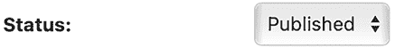

图 1.16：已发布帖子的状态字段

打开 shell 并执行以下命令以启动开发服务器：

```py
python manage.py runserver 
```

在您的浏览器中打开 `http://127.0.0.1:8000/blog/`；您将看到一切都在运行。您应该看到如下内容：

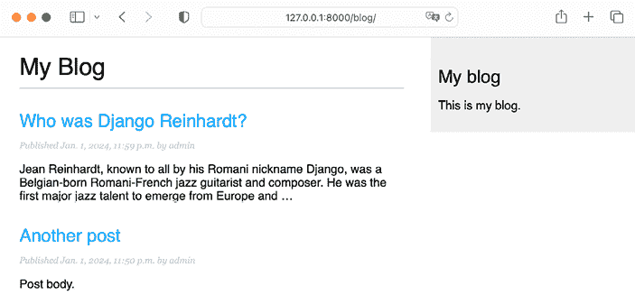

图 1.17：帖子列表视图的页面

## 创建帖子详情模板

接下来，编辑 `post/detail.html` 文件：

```py

{{ post.title }}

  <h1>{{ post.title }}</h1>
<p class="date">
    Published {{ post.publish }} by {{ post.author }}
  </p>
  {{ post.body|linebreaks }}
 
```

接下来，您可以回到浏览器并点击其中一个帖子标题，查看帖子的详情视图。您应该看到如下内容：

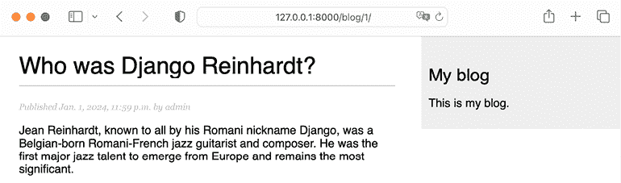

图 1.18：帖子详情视图的页面

看看 URL - 它应该包含自动生成的帖子 ID，如 `/blog/1/`。

# 请求/响应周期

让我们通过我们构建的应用程序来回顾 Django 的请求/响应周期。以下架构展示了 Django 处理 HTTP 请求和生成 HTTP 响应的简化示例：


图 1.19：Django 的请求/响应周期

让我们回顾 Django 的请求/响应过程：

网络浏览器通过其 URL 请求页面，例如，`https://domain.com/blog/33/`。Web 服务器接收 HTTP 请求并将其传递给 Django。

Django 遍历在 URL 模式配置中定义的每个 URL 模式。框架按出现顺序将每个模式与给定的 URL 路径进行比较，并在第一个匹配请求 URL 的模式处停止。在这种情况下，模式 `/blog/<id>/` 匹配路径 `/blog/33/`。

Django 导入匹配 URL 模式视图，并执行它，传递 `HttpRequest` 类的实例和关键字或位置参数。视图使用模型从数据库检索信息。使用 Django ORM，查询集被转换为 SQL 并在数据库中执行。

视图使用 `render()` 函数渲染 HTML 模板，并将 `Post` 对象作为上下文变量传递。

视图默认以 `text/html` 内容类型返回渲染的内容作为 `HttpResponse` 对象。

您始终可以使用此架构作为 Django 处理请求的基本参考。出于简化的目的，此架构不包括 Django 中间件。您将在本书的不同示例中使用中间件，您将在第十七章 *上线* 中学习如何创建自定义中间件。

# 本章中使用的管理命令

在本章中，我们介绍了各种 Django 管理命令。您需要熟悉它们，因为它们将在本书的整个过程中被频繁使用。让我们回顾一下本章中我们已涵盖的命令。

要创建名为 `mysite` 的新 Django 项目的文件结构，我们使用了以下命令：

```py
django-admin startproject mysite 
```

要创建名为 `blog` 的新 Django 应用程序的文件结构：

```py
python manage.py startapp blog 
```

要应用所有数据库迁移：

```py
python manage.py migrate 
```

要为 `blog` 应用程序的模型创建迁移：

```py
python manage.py makemigrations blog 
```

要查看 `blog` 应用程序第一次迁移将执行的 SQL 语句：

```py
python manage.py sqlmigrate blog 0001 
```

要运行 Django 开发服务器：

```py
python manage.py runserver 
```

要指定主机/端口和设置文件运行开发服务器：

```py
python manage.py runserver 127.0.0.1:8001 --settings=mysite.settings 
```

要运行 Django 壳：

```py
python manage.py shell 
```

要使用 Django 认证框架创建超级用户：

```py
python manage.py createsuperuser 
```

要查看可用的管理命令的完整列表，请查看 [`docs.djangoproject.com/en/5.0/ref/django-admin/`](https://docs.djangoproject.com/en/5.0/ref/django-admin/)。

# 摘要

在本章中，你通过创建一个简单的博客应用程序学习了 Django 网络框架的基础知识。你设计了数据模型并将迁移应用到数据库中。你还创建了视图、模板和博客的 URL。

在下一章中，你将通过为你的帖子创建规范 URL 和构建 SEO 友好的 URL 来增强你的博客。你还将学习如何实现对象分页以及如何构建基于类的视图。你还将创建表单，让用户可以通过电子邮件推荐帖子并评论帖子。

# 其他资源

以下资源提供了与本章所涵盖主题相关的额外信息：

+   本章的源代码：[`github.com/PacktPublishing/Django-5-by-example/tree/main/Chapter01`](https://github.com/PacktPublishing/Django-5-by-example/tree/main/Chapter01)

+   下载 Python：[`www.python.org/downloads/`](https://www.python.org/downloads/)

+   Windows Python 启动器：[`docs.python.org/3/using/windows.html#launcher`](https://docs.python.org/3/using/windows.html#launcher)

+   Python `venv` 库用于虚拟环境：[`docs.python.org/3/library/venv.html`](https://docs.python.org/3/library/venv.html)

+   Python `pip` 安装说明：[`pip.pypa.io/en/stable/installation/`](https://pip.pypa.io/en/stable/installation/)

+   Django 安装选项：[`docs.djangoproject.com/en/5.0/topics/install/`](https://docs.djangoproject.com/en/5.0/topics/install/)

+   Django 5.0 版本说明：[`docs.djangoproject.com/en/5.0/releases/5.0/`](https://docs.djangoproject.com/en/5.0/releases/5.0/)

+   `django-upgrade` 工具：[`github.com/adamchainz/django-upgrade`](https://github.com/adamchainz/django-upgrade)

+   `pyupgrade` 工具：[`github.com/asottile/pyupgrade`](https://github.com/asottile/pyupgrade)

+   Django 的设计理念：[`docs.djangoproject.com/en/5.0/misc/design-philosophies/`](https://docs.djangoproject.com/en/5.0/misc/design-philosophies/)

+   Django 模型字段参考：[`docs.djangoproject.com/en/5.0/ref/models/fields/`](https://docs.djangoproject.com/en/5.0/ref/models/fields/)

+   模型索引参考：[`docs.djangoproject.com/en/5.0/ref/models/indexes/`](https://docs.djangoproject.com/en/5.0/ref/models/indexes/)

+   Python 对枚举的支持：[`docs.python.org/3/library/enum.html`](https://docs.python.org/3/library/enum.html)

+   Django 模型枚举类型：[`docs.djangoproject.com/en/5.0/ref/models/fields/#enumeration-types`](https://docs.djangoproject.com/en/5.0/ref/models/fields/#enumeration-types)

+   Django 设置参考：[`docs.djangoproject.com/en/5.0/ref/settings/`](https://docs.djangoproject.com/en/5.0/ref/settings/)

+   模型字段数据库默认值：[`docs.djangoproject.com/en/5.0/ref/models/fields/#django.db.models.Field.db_default`](https://docs.djangoproject.com/en/5.0/ref/models/fields/#django.db.models.Field.db_default)

+   数据库函数：[`docs.djangoproject.com/en/5.0/ref/models/database-functions/`](https://docs.djangoproject.com/en/5.0/ref/models/database-functions/)

+   Django 管理站点：[`docs.djangoproject.com/en/5.0/ref/contrib/admin/`](https://docs.djangoproject.com/en/5.0/ref/contrib/admin/)

+   模型 API 参考文档：[`docs.djangoproject.com/en/5.0/ref/models/`](https://docs.djangoproject.com/en/5.0/ref/models/)

+   使用 Django ORM 进行查询：[`docs.djangoproject.com/en/5.0/topics/db/queries/`](https://docs.djangoproject.com/en/5.0/topics/db/queries/)

+   QuerySet API 参考文档：[`docs.djangoproject.com/en/5.0/ref/models/querysets/`](https://docs.djangoproject.com/en/5.0/ref/models/querysets/)

+   使用 Q 对象进行复杂查询：[`docs.djangoproject.com/en/5.0/topics/db/queries/#complex-lookups-with-q-objects`](https://docs.djangoproject.com/en/5.0/topics/db/queries/#complex-lookups-with-q-objects)

+   Django URL 分派器：[`docs.djangoproject.com/en/5.0/topics/http/urls/`](https://docs.djangoproject.com/en/5.0/topics/http/urls/)

+   Django 模板语言：[`docs.djangoproject.com/en/5.0/ref/templates/language/`](https://docs.djangoproject.com/en/5.0/ref/templates/language/)

+   内置模板标签和过滤器：[`docs.djangoproject.com/en/5.0/ref/templates/builtins/`](https://docs.djangoproject.com/en/5.0/ref/templates/builtins/)

+   Django 管理命令：[`docs.djangoproject.com/en/5.0/ref/django-admin/`](https://docs.djangoproject.com/en/5.0/ref/django-admin/)

+   本章代码的静态文件：[`github.com/PacktPublishing/Django-5-by-example/tree/master/Chapter01/mysite/blog/static`](https://github.com/PacktPublishing/Django-5-by-example/tree/master/Chapter01/mysite/blog/static)

# 加入我们的 Discord 社区！

与其他用户、Django 开发专家以及作者本人一起阅读此书。提问、为其他读者提供解决方案、通过 Ask Me Anything 会话与作者聊天等。扫描二维码或访问链接加入社区。

https://packt.link/Django5ByExample


