# 第二章：提升您的博客并添加社交功能

在上一章中，我们通过使用视图、模板和 URL 开发一个简单的博客应用程序，学习了 Django 的主要组件。在本章中，我们将通过添加现在许多博客平台都有的功能来扩展博客应用程序的功能。

在本章中，您将学习以下主题：

+   为模型使用规范 URL

+   为帖子创建 SEO 友好的 URL

+   为帖子列表视图添加分页

+   构建基于类的视图

+   使用 Django 发送电子邮件

+   使用 Django 表单通过电子邮件分享帖子

+   使用模型表单添加帖子评论

# 功能概述

*图 2.1*展示了本章将要构建的视图、模板和功能表示：

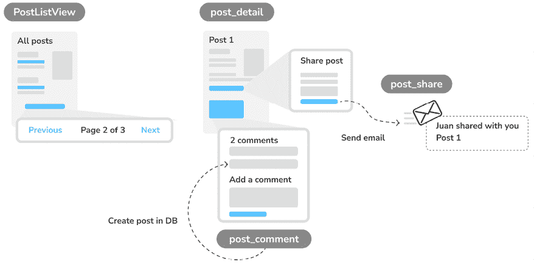

图 2.1：第二章构建的功能图

在本章中，我们将为帖子列表页面添加分页功能以浏览所有帖子。我们还将学习如何使用 Django 构建基于类的视图，并将`post_list`视图转换为名为`PostListView`的基于类的视图。

我们将创建`post_share`视图，通过电子邮件分享帖子。我们将使用 Django 表单来分享帖子并通过**简单邮件传输协议**（**SMTP**）发送电子邮件推荐。为了给帖子添加评论，我们将创建一个`Comment`模型来存储评论，并使用模型表单构建`post_comment`视图。

本章的源代码可以在[`github.com/PacktPublishing/Django-5-by-example/tree/main/Chapter02`](https://github.com/PacktPublishing/Django-5-by-example/tree/main/Chapter02)找到。

本章中使用的所有 Python 包都包含在章节源代码的`requirements.txt`文件中。您可以在以下部分按照说明安装每个 Python 包，或者可以使用`python -m pip install -r requirements.txt`命令一次性安装所有依赖。

# 为模型使用规范 URL

一个网站可能有不同的页面显示相同的内容。在我们的应用程序中，每个帖子的内容初始部分既在帖子列表页面上显示，也在帖子详情页面上显示。规范 URL 是资源的首选 URL。您可以将其视为特定内容的代表性页面的 URL。您的网站上可能有不同的页面显示帖子，但只有一个 URL 用作帖子的主要 URL。

规范 URL 允许您指定页面的主副本的 URL。Django 允许您在模型中实现`get_absolute_url()`方法以返回对象的规范 URL。

我们将使用在应用程序的 URL 模式中定义的`post_detail` URL 来构建`Post`对象的规范 URL。Django 提供了不同的 URL 解析器函数，允许您使用它们的名称和任何所需的参数动态构建 URL。我们将使用`django.urls`模块的`reverse()`实用函数。

编辑`blog`应用的`models.py`文件以导入`reverse()`函数并将`get_absolute_url()`方法添加到`Post`模型中，如下所示。新的代码以粗体显示：

```py
from django.conf import settings
from django.db import models
**from** **django.urls** **import** **reverse**
from django.utils import timezone
class PublishedManager(models.Manager):
    def get_queryset(self):
        return (
            super().get_queryset().filter(status=Post.Status.PUBLISHED)
        )
class Post(models.Model):
    # ...
class Meta:
        ordering = ['-publish']
        indexes = [
            models.Index(fields=['-publish']),
        ]
    def __str__(self):
        return self.title
**def****get_absolute_url****(****self****):**
**return** **reverse(**
**'blog:post_detail'****,**
 **args=[self.****id****]**
 **)** 
```

`reverse()`函数将使用在 URL 模式中定义的 URL 名称动态构建 URL。我们使用了`blog`命名空间，后面跟着一个冒号和`post_detail` URL 名称。记住，当从`blog.urls`包含 URL 模式时，`blog`命名空间在项目的`urls.py`主文件中定义。`post_detail` URL 在`blog`应用的`urls.py`文件中定义。

生成的字符串`blog:post_detail`可以在你的项目中全局使用来引用文章详细 URL。此 URL 有一个必需的参数，即要检索的博客文章的`id`。我们通过使用`args=[self.id]`将`Post`对象的`id`作为位置参数包含在内。

你可以在[`docs.djangoproject.com/en/5.0/ref/urlresolvers/`](https://docs.djangoproject.com/en/5.0/ref/urlresolvers/)了解更多关于 URL 实用函数的信息。

让我们将模板中的文章详细 URL 替换为新的`get_absolute_url()`方法。

编辑`blog/post/list.html`文件并替换以下行：

```py
<a href=""> 
```

将前面的行替换为以下行：

```py
<a href="{**{ post.get_absolute_url }**}"> 
```

现在的`blog/post/list.html`文件应该看起来如下：

```py

My Blog

  <h1>My Blog</h1>
  
    <h2>
<a href="{{ post.get_absolute_url }}">
        {{ post.title }}
      </a>
</h2>
<p class="date">
      Published {{ post.publish }} by {{ post.author }}
    </p>
    {{ post.body|truncatewords:30|linebreaks }}
  
 
```

打开 shell 提示符并执行以下命令以启动开发服务器：

```py
python manage.py runserver 
```

在你的浏览器中打开`http://127.0.0.1:8000/blog/`。指向单个博客文章的链接仍然应该有效。Django 现在使用`Post`模型的`get_absolute_url()`方法构建文章 URL。

# 创建对 SEO 友好的文章 URL

目前博客文章详细视图的规范 URL 看起来像`/blog/1/`。我们将更改 URL 模式以创建对 SEO 友好的文章 URL。我们将使用发布日期和`slug`值来构建单个文章的 URL。通过组合日期，我们将文章详细 URL 设置为`/blog/2024/1/1/who-was-django-reinhardt/`。我们将为搜索引擎提供友好的 URL 以进行索引，包含文章的标题和日期。

要通过发布日期和`slug`的组合检索单个文章，我们需要确保没有文章可以存储在数据库中，其`slug`和`publish`日期与现有文章相同。我们将通过定义`slug`为文章发布日期的唯一值来防止`Post`模型存储重复的文章。

编辑`models.py`文件并在`Post`模型的`slug`字段中添加以下`unique_for_date`参数：

```py
class Post(models.Model):
    # ...
    slug = models.SlugField(
        max_length=250,
 **unique_for_date=****'publish'**
    )
    # ... 
```

通过使用 `unique_for_date`，`slug` 字段现在必须对于存储在 `publish` 字段中的日期是唯一的。请注意，`publish` 字段是 `DateTimeField` 的一个实例，但唯一值的检查将仅针对日期（而不是时间）进行。Django 将防止你保存一个与给定发布日期的现有文章具有相同 slug 的新文章。我们现在确保 slug 对于发布日期是唯一的，因此我们现在可以通过 `publish` 和 `slug` 字段检索单个文章。

我们已经更改了模型，所以，让我们创建迁移。请注意，`unique_for_date` 并不在数据库级别强制执行，因此不需要数据库迁移。然而，Django 使用迁移来跟踪所有模型更改。我们将创建一个迁移，只是为了保持迁移与当前模型状态的一致。

在 shell 提示符中运行以下命令：

```py
python manage.py makemigrations blog 
```

你应该得到以下输出：

```py
Migrations for 'blog':
    blog/migrations/0002_alter_post_slug.py
    - Alter field slug on post 
```

Django 已经在 `blog` 应用程序的 `migrations` 目录中创建了 `0002_alter_post_slug.py` 文件。

在 shell 提示符中执行以下命令以应用现有迁移：

```py
python manage.py migrate 
```

你将得到一个以以下行结束的输出：

```py
Applying blog.0002_alter_post_slug... OK 
```

Django 将认为所有迁移都已应用，并且模型是一致的。由于 `unique_for_date` 并不在数据库级别强制执行，因此数据库中不会执行任何操作。

## 修改 URL 模式

让我们修改 URL 模式以使用发布日期和 slug 为文章详情 URL。

编辑 `blog` 应用的 `urls.py` 文件并替换以下行：

```py
path('<int:id>/', views.post_detail, name='post_detail'), 
```

将前面的行替换为以下行：

```py
path(
    '**<int:year>/<int:month>/<int:day>/<slug:post>/**',
    views.post_detail,
    name='post_detail'
), 
```

`urls.py` 文件现在应该看起来像这样：

```py
from django.urls import path
from . import views
app_name = 'blog'
urlpatterns = [
    # Post views
    path('', views.post_list, name='post_list'),
    path(
        '**<int:year>/<int:month>/<int:day>/<slug:post>/**',
         views.post_detail,
         name='post_detail'
    ),
] 
```

`post_detail` 视图的 URL 模式接受以下参数：

+   `year`：这需要一个整数

+   `month`：这需要一个整数

+   `day`：这需要一个整数

+   `post`：这需要一个 slug（一个只包含字母、数字、下划线或连字符的字符串）

`int` 路径转换器用于 `year`、`month` 和 `day` 参数，而 `slug` 路径转换器用于 `post` 参数。你可以在上一章中了解到路径转换器。你可以在 Django 提供的所有路径转换器中看到 [`docs.djangoproject.com/en/5.0/topics/http/urls/#path-converters`](https://docs.djangoproject.com/en/5.0/topics/http/urls/#path-converters)。

我们的文章现在有一个 SEO 友好的 URL，它是用每篇文章的日期和 slug 构建的。让我们相应地修改 `post_detail` 视图。

## 修改视图

我们将更改 `post_detail` 视图的参数以匹配新的 URL 参数并使用它们来检索相应的 `Post` 对象。

编辑 `views.py` 文件并修改 `post_detail` 视图如下：

```py
def post_detail(request, **year, month, day, post**):
    post = get_object_or_404(
        Post,
        status=Post.Status.PUBLISHED**,**
 **slug=post,**
 **publish__year=year,**
 **publish__month=month,**
 **publish__day=day)**
return render(
        request,
        'blog/post/detail.html',
        {'post': post}
    ) 
```

我们已修改`post_detail`视图，以接受`year`、`month`、`day`和`post`参数，并检索具有给定 slug 和发布日期的已发布文章。通过在`Post`模型的`slug`字段中添加`unique_for_date='publish'`，我们确保了对于给定日期只有一个具有 slug 的文章。因此，您可以使用日期和 slug 检索单个文章。

## 修改文章的规范 URL

我们还必须修改博客文章的规范 URL 参数，以匹配新的 URL 参数。

编辑`blog`应用的`models.py`文件，并按照以下方式编辑`get_absolute_url()`方法：

```py
class Post(models.Model):
    # ...
def get_absolute_url(self):
        return reverse(
            'blog:post_detail',
            args=[
                **self.publish.year,**
 **self.publish.month,**
 **self.publish.day,**
 **self.slug**
            ]
        ) 
```

在 shell 提示符中键入以下命令以启动开发服务器：

```py
python manage.py runserver 
```

接下来，您可以在浏览器中点击其中一个文章标题，查看文章的详细视图。您应该看到如下内容：

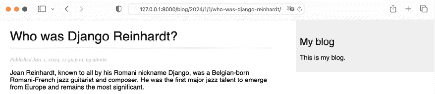

图 2.2：文章详细视图页面

您已经为博客文章设计了 SEO 友好的 URL。现在文章的 URL 看起来像这样：`/blog/2024/1/1/who-was-django-reinhardt/`。

现在您已经实现了 SEO 友好的 URL，让我们专注于使用分页实现文章导航。

# 添加分页

当您开始向博客添加内容时，您可以在数据库中轻松存储数十或数百篇文章。而不是在单页上显示所有文章，您可能希望将文章列表分页显示在几个页面上，并包含导航链接到不同的页面。这种功能称为分页，您几乎可以在显示长列表项的每个 Web 应用程序中找到它。

例如，Google 使用分页将搜索结果分散在多个页面上。*图 2.3*展示了 Google 搜索结果页面的分页链接：

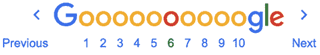

图 2.3：Google 搜索结果页面的分页链接

Django 有一个内置的分页类，允许您轻松管理分页数据。您可以定义每页要返回的对象数量，并且可以检索用户请求的页面对应的文章。

## 在文章列表视图中添加分页

我们将向文章列表添加分页，以便用户可以轻松浏览博客上发布的所有文章。

编辑`blog`应用的`views.py`文件，导入 Django 的`Paginator`类，并按照以下方式修改`post_list`视图：

```py
**from** **django.core.paginator** **import** **Paginator**
from django.shortcuts import get_object_or_404, render
from .models import Post
def post_list(request):
    **post_list** = Post.published.all()
**# Pagination with 3 posts per page**
 **paginator = Paginator(post_list,** **3****)**
 **page_number = request.GET.get(****'page'****,** **1****)**
 **posts = paginator.page(page_number)**
return render(
        request,
        'blog/post/list.html',
        {'posts': posts}
    ) 
```

让我们回顾一下我们添加到视图中的新代码：

1.  我们使用每页要返回的对象数量实例化`Paginator`类。我们将每页显示三篇文章。

1.  我们检索`page` `GET` HTTP 参数并将其存储在`page_number`变量中。此参数包含请求的页码。如果`page`参数不在请求的`GET`参数中，我们使用默认值`1`来加载结果的第一页。

1.  我们通过调用 `Paginator` 的 `page()` 方法来获取所需页面的对象。此方法返回一个 `Page` 对象，我们将其存储在 `posts` 变量中。

1.  我们将 `posts` 对象传递给模板。

## 创建分页模板

我们需要为用户创建页面导航，以便浏览不同的页面。在本节中，我们将创建一个模板来显示分页链接，并将其设计为通用，以便我们可以在网站上为任何对象分页重用该模板。

在 `templates/` 目录下创建一个新文件，并将其命名为 `pagination.html`。将以下 HTML 代码添加到文件中：

```py
<div class="pagination">
<span class="step-links">
    
      <a href="?page={{ page.previous_page_number }}">Previous</a>
    
    <span class="current">
      Page {{ page.number }} of {{ page.paginator.num_pages }}.
    </span>
    
      <a href="?page={{ page.next_page_number }}">Next</a>
    
  </span>
</div> 
```

这是一个通用的分页模板。该模板期望在上下文中有一个 `Page` 对象来渲染上一页和下一页的链接，并显示当前页和总页数。

让我们回到 `blog/post/list.html` 模板，并在 `` 块的底部包含 `pagination.html` 模板，如下所示：

```py

My Blog

  <h1>My Blog</h1>
  
    <h2>
<a href="{{ post.get_absolute_url }}">
        {{ post.title }}
      </a>
</h2>
<p class="date">
      Published {{ post.publish }} by {{ post.author }}
    </p>
    {{ post.body|truncatewords:30|linebreaks }}
  
  ****
 
```

`` 模板标签加载给定的模板，并使用当前的模板上下文来渲染它。我们使用 `with` 来向模板传递额外的上下文变量。分页模板使用 `page` 变量进行渲染，而我们从视图传递给模板的 `Page` 对象被称为 `posts`。我们使用 `with page=posts` 来传递分页模板期望的变量。您可以使用这种方法为任何类型的对象使用分页模板。

通过在 shell 提示符中输入以下命令来启动开发服务器：

```py
python manage.py runserver 
```

在您的浏览器中打开 `http://127.0.0.1:8000/admin/blog/post/` 并使用管理站点创建总共四篇不同的帖子。确保将所有帖子的状态设置为**已发布**。

现在，在您的浏览器中打开 `http://127.0.0.1:8000/blog/`。您应该看到按倒序排列的前三篇帖子，然后在帖子列表底部的导航链接如下所示：

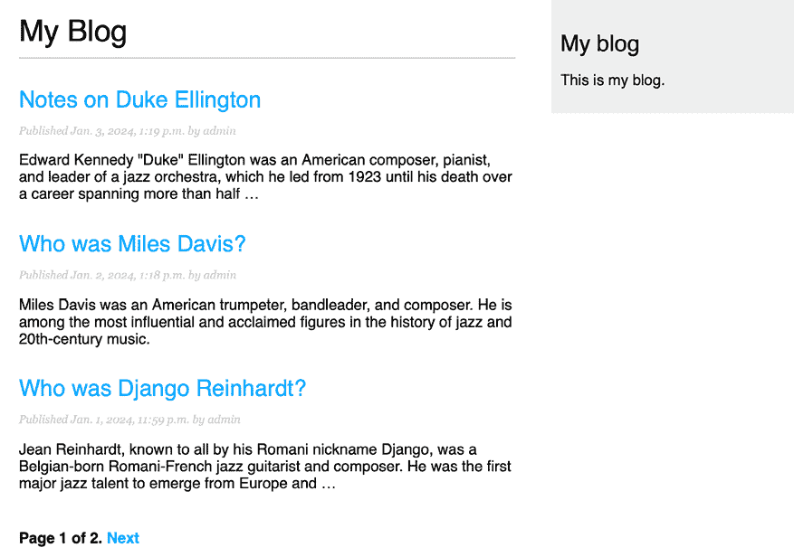

图 2.4：包含分页的帖子列表页面

如果您点击**下一页**，您将看到最后一篇帖子。第二页的 URL 包含 `?page=2` 的 `GET` 参数。此参数由视图用于通过分页器加载请求的页面。

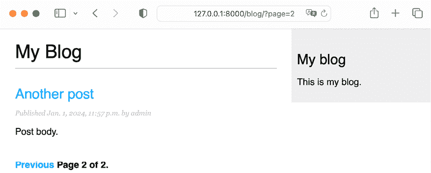

图 2.5：结果页的第二页

太好了，分页链接按预期工作。

## 处理分页错误

现在分页功能已经正常工作，我们可以在视图中添加对分页错误的异常处理。视图使用的 `page` 参数可能被用于错误值，例如不存在的页码或无法用作页码的字符串值。我们将为这些情况实现适当的错误处理。

在浏览器中打开 `http://127.0.0.1:8000/blog/?page=3`。您应该看到以下错误页面：

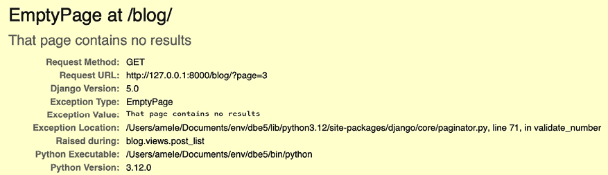

图 2.6：空页错误页面

当检索第`3`页时，`Paginator`对象抛出`EmptyPage`异常，因为它超出了范围。没有结果可以显示。让我们在我们的视图中处理这个错误。

编辑`blog`应用的`views.py`文件，添加必要的导入并修改`post_list`视图如下：

```py
from django.core.paginator import **EmptyPage,** Paginator
from django.shortcuts import get_object_or_404, render
from .models import Post
def post_list(request):
    post_list = Post.published.all()
    # Pagination with 3 posts per page
    paginator = Paginator(post_list, 3)
    page_number = request.GET.get('page', 1)
    **try****:**
        posts = paginator.page(page_number)
    **except** **EmptyPage:**
**# If page_number is out of range get last page of results**
 **posts = paginator.page(paginator.num_pages)**
return render(
        request,
        'blog/post/list.html',
        {'posts': posts}
    ) 
```

我们添加了一个 try 和 except 块来管理检索页面时出现的`EmptyPage`异常。如果请求的页面超出范围，我们返回最后一页的结果。我们通过`paginator.num_pages`获取总页数。总页数与最后一页的页码相同。

再次在浏览器中打开`http://127.0.0.1:8000/blog/?page=3`。现在，异常由视图管理，并返回如下最后页的结果：

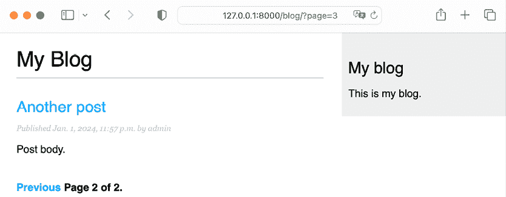

图 2.7：结果的最后一页

我们的视图也应该处理当`page`参数传递的不是整数时的情况。

在浏览器中打开`http://127.0.0.1:8000/blog/?page=asdf`。你应该看到以下错误页面：

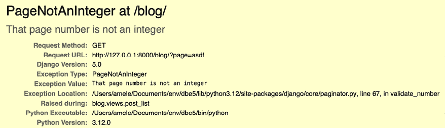

图 2.8：`PageNotAnInteger`错误页面

在这种情况下，当检索页面`asdf`时，`Paginator`对象抛出`PageNotAnInteger`异常，因为页码只能是整数。让我们在我们的视图中处理这个错误。

编辑`blog`应用的`views.py`文件，添加必要的导入并修改`post_list`视图如下：

```py
from django.shortcuts import get_object_or_404, render
from .models import Post
from django.core.paginator import EmptyPage**, PageNotAnInteger**, Paginator
def post_list(request):
    post_list = Post.published.all()
    # Pagination with 3 posts per page
    paginator = Paginator(post_list, 3)
    page_number = request.GET.get('page')
    try:
        posts = paginator.page(page_number)
    **except** **PageNotAnInteger:**
**# If page_number is not an integer get the first page**
 **posts = paginator.page(****1****)**
except EmptyPage:
        # If page_number is out of range get last page of results
        posts = paginator.page(paginator.num_pages)
    return render(
        request,
        'blog/post/list.html',
        {'posts': posts}
    ) 
```

我们添加了一个新的`except`块来管理检索页面时出现的`PageNotAnInteger`异常。如果请求的页面不是整数，我们返回结果的第一页。

再次在浏览器中打开`http://127.0.0.1:8000/blog/?page=asdf`。现在，异常由视图管理，并返回如下第一页的结果：

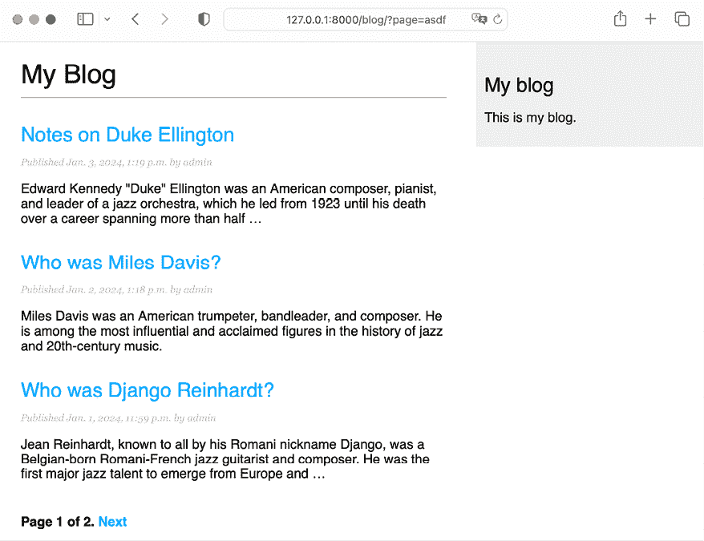

图 2.9：结果的第一页

博客文章的分页现在已经完全实现。

你可以在[`docs.djangoproject.com/en/5.0/ref/paginator/`](https://docs.djangoproject.com/en/5.0/ref/paginator/)了解更多关于`Paginator`类的信息。

学习了如何分页你的博客后，我们现在将转向将`post_list`视图转换为使用 Django 通用视图和内置分页构建的等效视图。

# 构建基于类的视图

我们使用基于函数的视图构建了博客应用。基于函数的视图简单而强大，但 Django 还允许你使用类来构建视图。

基于类的视图是实现视图作为 Python 对象而不是函数的另一种方式。由于视图是一个接收网络请求并返回网络响应的函数，你还可以将你的视图定义为类方法。Django 提供了你可以用来实现你自己的视图的基础视图类。所有这些类都继承自`View`类，该类处理 HTTP 方法调度和其他常见功能。

## 为什么使用基于类的视图

基于类的视图相对于基于函数的视图在特定用例中提供了一些优势。基于类的视图允许您：

+   将与 HTTP 方法相关的代码，如`GET`、`POST`或`PUT`，组织在单独的方法中，而不是使用条件分支

+   使用多重继承来创建可重用的视图类（也称为*mixins*）

## 使用基于类的视图来列出帖子

要了解如何编写基于类的视图，我们将创建一个新的与`post_list`视图等效的基于类的视图。我们将创建一个继承自 Django 提供的通用`ListView`视图的类。`ListView`允许您列出任何类型的对象。

编辑`blog`应用的`views.py`文件，并向其中添加以下代码：

```py
from django.views.generic import ListView
class PostListView(ListView):
    """
    Alternative post list view
    """
    queryset = Post.published.all()
    context_object_name = 'posts'
    paginate_by = 3
    template_name = 'blog/post/list.html' 
```

`PostListView`视图与之前构建的`post_list`视图类似。我们已经实现了一个继承自`ListView`类的基于类的视图。我们定义了一个具有以下属性的视图：

+   我们使用`queryset`来使用自定义 QuerySet，而不是检索所有对象。我们可以在不定义`queryset`属性的情况下指定`model = Post`，Django 将为我们构建通用的`Post.objects.all()` QuerySet。

+   我们使用上下文变量`posts`来表示查询结果。如果没有指定任何`context_object_name`，默认变量是`object_list`。

+   我们使用`paginate_by`定义结果分页，每页返回三个对象。

+   我们使用自定义模板来渲染带有`template_name`的页面。如果您没有设置默认模板，`ListView`将默认使用`blog/post_list.html`。

现在，编辑`blog`应用的`urls.py`文件，注释掉之前的`post_list` URL 模式，并使用`PostListView`类添加一个新的 URL 模式，如下所示：

```py
urlpatterns = [
    # Post views
**#** path('', views.post_list, name='post_list'),
**path(****''****, views.PostListView.as_view(), name=****'post_list'****),**
    path(
        '<int:year>/<int:month>/<int:day>/<slug:post>/',
        views.post_detail,
        name='post_detail'
    ),
] 
```

为了使分页功能正常工作，我们必须使用传递给模板的正确页面对象。Django 的`ListView`通用视图通过一个名为`page_obj`的变量传递请求的页面。我们必须相应地编辑`post/list.html`模板，以包含使用正确变量的分页器，如下所示：

```py

My Blog

  <h1>My Blog</h1>
  
    <h2>
<a href="{{ post.get_absolute_url }}">
        {{ post.title }}
      </a>
</h2>
<p class="date">
      Published {{ post.publish }} by {{ post.author }}
    </p>
    {{ post.body|truncatewords:30|linebreaks }}
  
  ****
 
```

在您的浏览器中打开`http://127.0.0.1:8000/blog/`并验证分页链接是否按预期工作。分页链接的行为应该与之前的`post_list`视图相同。

在这种情况下，异常处理略有不同。如果您尝试加载超出范围的页面或传递`page`参数中的非整数值，视图将返回一个带有状态码`404`（页面未找到）的 HTTP 响应，如下所示：

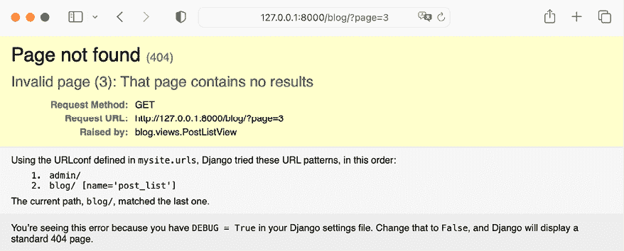

图 2.10：HTTP 404 页面未找到响应

返回 HTTP `404`状态码的异常处理由`ListView`视图提供。

这是一个如何编写基于类的视图的简单示例。您将在第十三章“创建内容管理系统”和随后的章节中了解更多关于基于类的视图的内容。

您可以在[`docs.djangoproject.com/en/5.0/topics/class-based-views/intro/`](https://docs.djangoproject.com/en/5.0/topics/class-based-views/intro/)阅读关于基于类的视图的介绍。

在学习如何使用基于类的视图和使用内置的对象分页后，我们将实现通过电子邮件分享帖子以吸引博客读者的功能。

# 通过电子邮件推荐帖子

我们将允许用户通过发送帖子推荐通过电子邮件与他人分享博客帖子。您将学习如何在 Django 中创建表单、处理数据提交以及发送电子邮件，为您的博客增添个性化特色。

花点时间思考一下，您如何可以使用*视图*、*URL*和*模板*来创建此功能，使用您在前一章中学到的知识。

为了允许用户通过电子邮件分享帖子，我们需要做以下事情：

1.  创建一个表单，让用户填写他们的姓名、他们的电子邮件地址、收件人的电子邮件地址以及可选的评论

1.  在`views.py`文件中创建一个视图来处理提交的数据并发送电子邮件

1.  在博客应用的`urls.py`文件中为新的视图添加一个 URL 模式

1.  创建一个模板来显示表单

## 使用 Django 创建表单

让我们从构建分享帖子的表单开始。Django 内置了一个表单框架，允许您轻松创建表单。表单框架使得定义表单字段、指定它们的显示方式以及指示如何验证输入数据变得简单。Django 表单框架提供了一个灵活的方式来在 HTML 中渲染表单并处理数据。

Django 提供了两个基础类来构建表单：

+   `Form`: 这允许您通过定义字段和验证来构建标准表单。

+   `ModelForm`: 这允许您构建与模型实例相关的表单。它提供了基础`Form`类的所有功能，但表单字段可以显式声明，或从模型字段自动生成。该表单可用于创建或编辑模型实例。

首先，在您的`blog`应用目录中创建一个`forms.py`文件，并将其中的以下代码添加到该文件中：

```py
from django import forms
class EmailPostForm(forms.Form):
    name = forms.CharField(max_length=25)
    email = forms.EmailField()
    to = forms.EmailField()
    comments = forms.CharField(
        required=False,
        widget=forms.Textarea
    ) 
```

我们已经定义了我们的第一个 Django 表单。`EmailPostForm`表单从基础`Form`类继承。我们使用不同的字段类型来相应地验证数据。

表单可以位于您的 Django 项目的任何位置。惯例是将它们放置在每个应用的`forms.py`文件中。

表单包含以下字段：

+   `name`: 一个最大长度为`25`字符的`CharField`实例。我们将用它来表示发送帖子的个人姓名。

+   `email`: `EmailField`的一个实例。我们将使用发送帖子推荐的个人电子邮件。

+   `to`: `EmailField`的一个实例。我们将使用收件人的电子邮件地址，该收件人将收到一封推荐帖子的电子邮件。

+   `comments`：`CharField` 的一个实例。我们将使用它来包含在帖子推荐电子邮件中的评论。我们通过将 `required` 设置为 `False` 使此字段可选，并指定了一个自定义小部件来渲染该字段。

每种字段类型都有一个默认的小部件，它决定了字段在 HTML 中的渲染方式。`name` 字段是 `CharField` 的一个实例。此类字段以 `<input type="text">` HTML 元素的形式渲染。默认小部件可以通过 `widget` 属性来覆盖。在 `comments` 字段中，我们使用 `Textarea` 小部件将其显示为 `<textarea>` HTML 元素，而不是默认的 `<input>` 元素。

字段验证也取决于字段类型。例如，`email` 和 `to` 字段是 `EmailField` 字段。这两个字段都需要一个有效的电子邮件地址；否则，字段验证将引发 `forms.ValidationError` 异常，表单将无法验证。表单字段验证还会考虑其他参数，例如 `name` 字段的最大长度为 `25` 或 `comments` 字段为可选。

这些只是 Django 为表单提供的字段类型中的一部分。您可以在 [`docs.djangoproject.com/en/5.0/ref/forms/fields/`](https://docs.djangoproject.com/en/5.0/ref/forms/fields/) 找到所有可用字段类型的列表。

## 在视图中处理表单

我们已经定义了一个通过电子邮件推荐帖子的表单。现在，我们需要一个视图来创建表单的实例并处理表单提交。

编辑 `blog` 应用程序的 `views.py` 文件，并向其中添加以下代码：

```py
from .forms import EmailPostForm
def post_share(request, post_id):
    # Retrieve post by id
    post = get_object_or_404(
        Post,
        id=post_id,
        status=Post.Status.PUBLISHED
    )
    if request.method == 'POST':
        # Form was submitted
        form = EmailPostForm(request.POST)
        if form.is_valid():
            # Form fields passed validation
            cd = form.cleaned_data
            # ... send email
else:
        form = EmailPostForm()
    return render(
 request,
        'blog/post/share.html',
        {
            'post': post,
            'form': form
        }
    ) 
```

我们定义了 `post_share` 视图，它接受 `request` 对象和 `post_id` 变量作为参数。我们使用 `get_object_or_404()` 快捷方式通过其 `id` 检索一个已发布的帖子。

我们使用相同的视图来显示初始表单和处理提交的数据。HTTP `request` 方法允许我们区分表单是否正在提交。一个 `GET` 请求表示需要向用户显示一个空表单，而一个 `POST` 请求表示表单正在提交。我们使用 `request.method == 'POST'` 来区分这两种情况。

这是显示表单和处理表单提交的过程：

1.  当页面首次加载时，视图接收一个 `GET` 请求。在这种情况下，创建一个新的 `EmailPostForm` 实例并将其存储在 `form` 变量中。此表单实例将用于在模板中显示空表单：

    ```py
    form = EmailPostForm() 
    ```

1.  当用户填写表单并通过 `POST` 提交时，会使用 `request.POST` 中包含的提交数据创建一个表单实例：

    ```py
    if request.method == 'POST':
        # Form was submitted
        form = EmailPostForm(request.POST) 
    ```

1.  然后，使用表单的 `is_valid()` 方法验证提交的数据。此方法验证表单中引入的数据，如果所有字段都包含有效数据，则返回 `True`。如果有任何字段包含无效数据，则 `is_valid()` 返回 `False`。可以通过 `form.errors` 获取验证错误列表。

1.  如果表单无效，表单将在模板中再次渲染，包括提交的数据。验证错误将在模板中显示。

1.  如果表单有效，将通过`form.cleaned_data`检索验证后的数据。这个属性是表单字段及其值的字典。表单不仅验证数据，而且通过将其规范化为一致格式来*清理*数据。

如果你的表单数据无效，`cleaned_data`将只包含有效的字段。

我们已经实现了显示表单和处理表单提交的视图。现在我们将学习如何使用 Django 发送邮件，然后我们将将该功能添加到`post_share`视图中。

## 使用 Django 发送邮件

使用 Django 发送邮件非常直接。你需要有一个本地的 SMTP 服务器，或者你需要访问一个外部 SMTP 服务器，比如你的电子邮件服务提供商。

以下设置允许你定义 SMTP 配置以使用 Django 发送邮件：

+   `EMAIL_HOST`：SMTP 服务器主机；默认为`localhost`

+   `EMAIL_PORT`：SMTP 端口；默认为`25`

+   `EMAIL_HOST_USER`：SMTP 服务器的用户名

+   `EMAIL_HOST_PASSWORD`：SMTP 服务器的密码

+   `EMAIL_USE_TLS`：是否使用**传输层安全**（**TLS**）安全连接

+   `EMAIL_USE_SSL`：是否使用隐式 TLS 安全连接

此外，你可以使用`DEFAULT_FROM_EMAIL`设置来指定发送 Django 邮件时的默认发送者。在这个例子中，我们将使用 Google 的 SMTP 服务器和一个标准的 Gmail 账户。

## 与环境变量一起工作

我们将向项目中添加 SMTP 配置设置，并从环境变量中加载 SMTP 凭据。通过使用环境变量，我们将避免在源代码中嵌入凭据。将配置与代码分离有多个原因：

+   **安全性**：代码中的凭据或密钥可能导致意外泄露，尤其是如果你将代码推送到公共仓库时。

+   **灵活性**：保持配置与代码分离将允许你在不同的环境中使用相同的代码库而无需任何更改。你将在第十七章“上线”中学习如何构建多个环境。

+   **可维护性**：更改配置不需要修改代码，确保你的项目在各个版本之间保持一致性。

为了便于将配置与代码分离，我们将使用`python-decouple`。这个库简化了在项目中使用环境变量的操作。你可以在[`github.com/HBNetwork/python-decouple`](https://github.com/HBNetwork/python-decouple)找到关于`python-decouple`的信息。

首先，通过运行以下命令使用`pip`安装`python-decouple`：

```py
python -m pip install python-decouple==3.8 
```

然后，在你的项目根目录内创建一个新文件，并将其命名为`.env`。`.env`文件将包含环境变量的键值对。将以下行添加到新文件中：

```py
EMAIL_HOST_USER=your_account@gmail.com
EMAIL_HOST_PASSWORD=
DEFAULT_FROM_EMAIL=My Blog <your_account@gmail.com> 
```

如果您有 Gmail 账户，请将`your_account@gmail.com`替换为您的 Gmail 账户。`EMAIL_HOST_PASSWORD`变量目前还没有值，我们稍后会添加它。`DEFAULT_FROM_EMAIL`变量将用于指定我们电子邮件的默认发送者。如果您没有 Gmail 账户，您可以使用电子邮件服务提供商的 SMTP 凭证。

如果您使用`git`仓库存储代码，请确保将`.env`文件包含在您的仓库的`.gitignore`文件中。这样做可以确保凭证不被包含在仓库中。

编辑您项目的`settings.py`文件，并向其中添加以下代码：

```py
**from** **decouple** **import** **config**
# ...
**# Email server configuration**
**EMAIL_HOST =** **'smtp.gmail.com'**
**EMAIL_HOST_USER = config(****'EMAIL_HOST_USER'****)**
**EMAIL_HOST_PASSWORD = config(****'EMAIL_HOST_PASSWORD'****)**
**EMAIL_PORT =** **587**
**EMAIL_USE_TLS =** **True**
**DEFAULT_FROM_EMAIL = config(****'DEFAULT_FROM_EMAIL'****)** 
```

`EMAIL_HOST_USER`、`EMAIL_HOST_PASSWORD`和`DEFAULT_FROM_EMAIL`设置现在是从`.env`文件中定义的环境变量加载的。

提供的`EMAIL_HOST`、`EMAIL_PORT`和`EMAIL_USE_TLS`设置是针对 Gmail 的 SMTP 服务器的。如果您没有 Gmail 账户，您可以使用电子邮件服务提供商的 SMTP 服务器配置。

除了 Gmail，您还可以使用一个专业、可扩展的电子邮件服务，允许您通过 SMTP 使用自己的域名发送电子邮件，例如 SendGrid ([`sendgrid.com/`](https://sendgrid.com/)) 或 Amazon **简单电子邮件服务** (**SES**) ([`aws.amazon.com/ses/`](https://aws.amazon.com/ses/))。这两个服务都将要求您验证您的域名和发送者电子邮件账户，并提供 SMTP 凭证以发送电子邮件。`django-anymail`应用程序简化了将电子邮件服务提供商（如 SendGrid 或 Amazon SES）添加到您项目的任务。您可以在[`anymail.dev/en/stable/installation/`](https://anymail.dev/en/stable/installation/)找到`django-anymail`的安装说明，以及在[`anymail.dev/en/stable/esps/`](https://anymail.dev/en/stable/esps/)找到支持的电子邮件服务提供商列表。

如果您不能使用 SMTP 服务器，您可以在`settings.py`文件中添加以下设置，让 Django 将电子邮件写入控制台：

```py
EMAIL_BACKEND = 'django.core.mail.backends.console.EmailBackend' 
```

使用此设置，Django 将输出所有电子邮件到 shell 而不是发送它们。这对于在没有 SMTP 服务器的情况下测试您的应用程序非常有用。

为了使用 Gmail 的 SMTP 服务器发送电子邮件，请确保您的 Gmail 账户中启用了两步验证。

在浏览器中打开[`myaccount.google.com/security`](https://myaccount.google.com/security)，并为您账户启用**两步验证**，如图*图 2.11*所示：

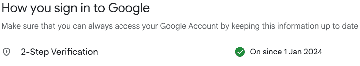

图 2.11：Google 账户的登录页面

然后，您需要创建一个应用密码，并使用它作为您的 SMTP 凭证。应用密码是一个 16 位数的密码，它允许一个不太安全的程序或设备访问您的 Google 账户。

要创建应用密码，请在浏览器中打开[`myaccount.google.com/apppasswords`](https://myaccount.google.com/apppasswords)。您将看到以下屏幕：

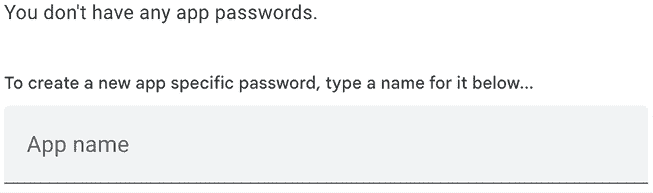

图 2.12：生成新的 Google 应用密码的表单

如果你无法访问 **应用密码**，可能是因为你的账户没有设置两步验证，你的账户是一个组织账户而不是标准 Gmail 账户，或者你开启了 Google 的高级保护。请确保使用标准 Gmail 账户，并为你的 Google 账户激活两步验证。你可以在[`support.google.com/accounts/answer/185833`](https://support.google.com/accounts/answer/185833)找到更多信息。

输入名称 `Blog` 并点击 **创建** 按钮，如下所示：

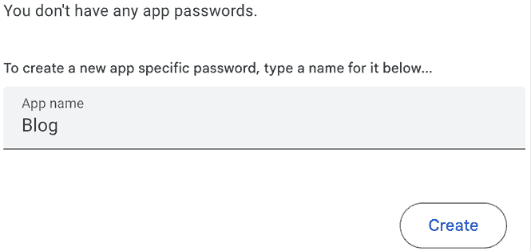

图 2.13：生成新的 Google 应用密码的表单

将生成一个新的密码并显示如下：

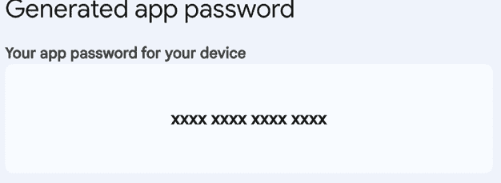

图 2.14：生成的 Google 应用密码

复制生成的应用密码。

接下来，编辑你的项目中的 `.env` 文件，并将应用密码添加到 `EMAIL_HOST_PASSWORD` 变量中，如下所示：

```py
EMAIL_HOST_USER=your_account@gmail.com
EMAIL_HOST_PASSWORD=**xxxxxxxxxxxxxxxx**
DEFAULT_FROM_EMAIL=My Blog <your_account@gmail.com> 
```

通过在系统 shell 提示符中运行以下命令来打开 Python shell：

```py
python manage.py shell 
```

在 Python shell 中执行以下代码：

```py
>>> from django.core.mail import send_mail
>>> send_mail('Django mail',
... 'This e-mail was sent with Django.',
... 'your_account@gmail.com',
...           ['your_account@gmail.com'],
...           fail_silently=False) 
```

`send_mail()` 函数需要主题、消息、发件人和收件人列表作为必需参数。通过设置可选参数 `fail_silently=False`，我们告诉它如果无法发送电子邮件则抛出异常。如果你看到的输出是 `1`，则表示你的电子邮件已成功发送。

如果你遇到 `CERTIFICATE_VERIFY_FAILED` 错误，请使用以下命令安装 `certify` 模块：`pip install --upgrade certifi`。如果你使用的是 macOS，请在 shell 中运行以下命令来安装 `certify` 并允许 Python 访问 macOS 根证书：

```py
/Applications/Python\ 3.12/Install\ Certificates.command 
```

检查你的收件箱。你应该已经收到了如图 *图 2.15* 所示的电子邮件：

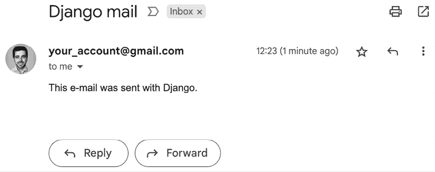

图 2.15：在 Gmail 中显示发送的测试电子邮件

你刚刚用 Django 发出了第一封电子邮件！你可以在[`docs.djangoproject.com/en/5.0/topics/email/`](https://docs.djangoproject.com/en/5.0/topics/email/)找到更多关于使用 Django 发送电子邮件的信息。

让我们将此功能添加到 `post_share` 视图中。

## 在视图中发送电子邮件

编辑 `blog` 应用程序中的 `views.py` 文件中的 `post_share` 视图，如下所示：

```py
# ...
**from** **django.core.mail** **import** **send_mail**
# ...
def post_share(request, post_id):
    # Retrieve post by id
    post = get_object_or_404(
        Post,
        id=post_id,
        status=Post.Status.PUBLISHED
    )
    **sent =** **False**
if request.method == 'POST':
        # Form was submitted
        form = EmailPostForm(request.POST)
        if form.is_valid():
            # Form fields passed validation
            cd = form.cleaned_data
            **post_url = request.build_absolute_uri(**
 **post.get_absolute_url()**
 **)**
 **subject = (**
**f"****{cd[****'name'****]}** **(****{cd[****'email'****]}****) "**
**f"recommends you read** **{post.title}****"**
 **)**
 **message = (**
**f"Read** **{post.title}** **at** **{post_url}****\n\n"**
**f"****{cd[****'name'****]}****\'s comments:** **{cd[****'comments'****]}****"**
 **)**
 **send_mail(**
 **subject=subject,**
 **message=message,**
 **from_email=****None****,**
 **recipient_list=[cd[****'to'****]]**
 **)**
 **sent =** **True**
else:
        form = EmailPostForm()
    return render(
        request,
        'blog/post/share.html',
        {
            'post': post,
            'form': form**,**
**'sent'****: sent**
        }
    ) 
```

在前面的代码中，我们声明了一个初始值为 `False` 的 `sent` 变量。在邮件发送后，我们将此变量设置为 `True`。我们将在模板中稍后使用 `sent` 变量来显示当表单成功提交时的成功消息。

由于我们必须在电子邮件中包含一个指向帖子的链接，我们使用帖子的 `get_absolute_url()` 方法检索帖子的绝对路径。我们使用此路径作为 `request.build_absolute_uri()` 的输入来构建一个完整的 URL，包括 HTTP 协议和主机名。

我们使用经过验证的表单的清理数据创建电子邮件的主题和消息正文。最后，我们将电子邮件发送到表单中 `to` 字段包含的电子邮件地址。在 `from_email` 参数中，我们传递 `None` 值，因此将使用 `DEFAULT_FROM_EMAIL` 设置的值作为发件人。

现在视图已经完成，我们必须为它添加一个新的 URL 模式。

打开你的`blog`应用的`urls.py`文件，并添加`post_share` URL 模式，如下所示：

```py
from django.urls import path
from . import views
app_name = 'blog'
urlpatterns = [
    # Post views
# path('', views.post_list, name='post_list'),
    path('', views.PostListView.as_view(), name='post_list'),
    path(
        '<int:year>/<int:month>/<int:day>/<slug:post>/',
        views.post_detail,
        name='post_detail'),
    **path(****'<int:post_id>/share/'****, views.post_share, name=****'post_share'****),**
] 
```

## 在模板中渲染表单

在创建表单、编写视图和添加 URL 模式后，唯一缺少的是视图的模板。

在`blog/templates/blog/post/`目录下创建一个新文件，并将其命名为`share.html`。

将以下代码添加到新的`share.html`模板中：

```py

Share a post

  
    <h1>E-mail successfully sent</h1>
<p>
      "{{ post.title }}" was successfully sent to {{ form.cleaned_data.to }}.
    </p>
  
    <h1>Share "{{ post.title }}" by e-mail</h1>
<form method="post">
      {{ form.as_p }}
      
      <input type="submit" value="Send e-mail">
</form>
  
 
```

这是用于显示通过电子邮件分享帖子的表单以及显示发送电子邮件后的成功消息的模板。我们通过``区分这两种情况。

为了显示表单，我们定义了一个 HTML 表单元素，表明它必须通过`POST`方法提交：

```py
<form method="post"> 
```

我们已经包含了表单实例`{{ form.as_p }}`。我们告诉 Django 使用`as_p`方法通过 HTML 段落`<p>`元素渲染表单字段。我们也可以使用`as_ul`将其渲染为无序列表，或者使用`as_table`将其渲染为 HTML 表格。

我们已经添加了一个``模板标签。此标签引入了一个带有自动生成的令牌的隐藏字段，以避免**跨站请求伪造**（**CSRF**）攻击。这些攻击包括恶意网站或程序在网站上对用户执行不受欢迎的操作。你可以在[`owasp.org/www-community/attacks/csrf`](https://owasp.org/www-community/attacks/csrf)找到有关 CSRF 的更多信息。

``模板标签生成一个隐藏字段，其渲染方式如下：

```py
<input type='hidden' name='csrfmiddlewaretoken' value='26JjKo2lcEtYkGoV9z4XmJIEHLXN5LDR' /> 
```

默认情况下，Django 会在所有`POST`请求中检查 CSRF 令牌。请记住，在所有通过`POST`提交的表单中包含`csrf_token`标签。

编辑`blog/post/detail.html`模板，使其看起来像这样：

```py

{{ post.title }}

  <h1>{{ post.title }}</h1>
<p class="date">
    Published {{ post.publish }} by {{ post.author }}
  </p>
  {{ post.body|linebreaks }}
  **<****p****>**
**<****a****href****=****""****>**
**Share this post**
**</****a****>**
**</****p****>**
 
```

我们已经添加了一个指向`post_share` URL 的链接。该 URL 通过 Django 提供的``模板标签动态构建。我们使用名为`blog`的命名空间和名为`post_share`的 URL。我们将帖子`id`作为参数传递以构建 URL。

打开 shell 提示符并执行以下命令以启动开发服务器：

```py
python manage.py runserver 
```

在你的浏览器中打开`http://127.0.0.1:8000/blog/`，然后点击任何帖子标题以查看帖子详情页面。

在帖子正文中，你应该看到你刚刚添加的链接，如图*图 2.16*所示：

![图片 B21088_02_16.png]

图 2.16：帖子详情页面，包括分享帖子的链接

点击**分享此帖子**，你应该看到包括通过电子邮件分享此帖子的表单的页面，如下所示：

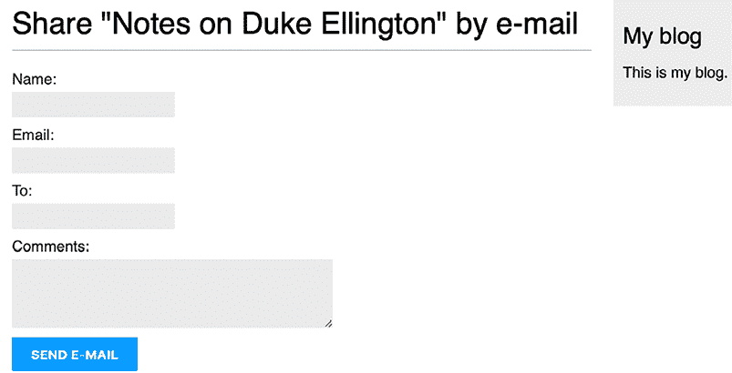

图 2.17：通过电子邮件分享帖子的页面

表单的 CSS 样式包含在`static/css/blog.css`文件中的示例代码中。当你点击**发送电子邮件**按钮时，表单将被提交并验证。如果所有字段都包含有效数据，你将得到以下成功消息：

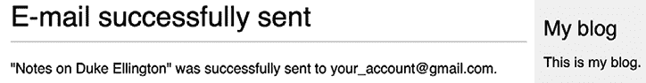

图 2.18：通过电子邮件分享帖子的成功消息

将帖子发送到您的电子邮件地址并检查您的收件箱。您收到的电子邮件应该看起来像这样：

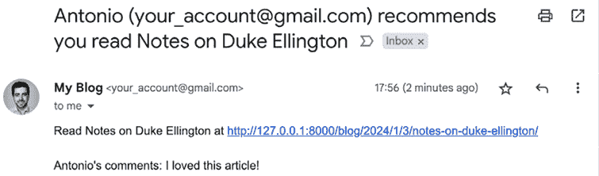

图 2.19：在 Gmail 中显示的测试电子邮件发送

如果您提交包含无效数据的表单，表单将被重新渲染，包括所有验证错误：

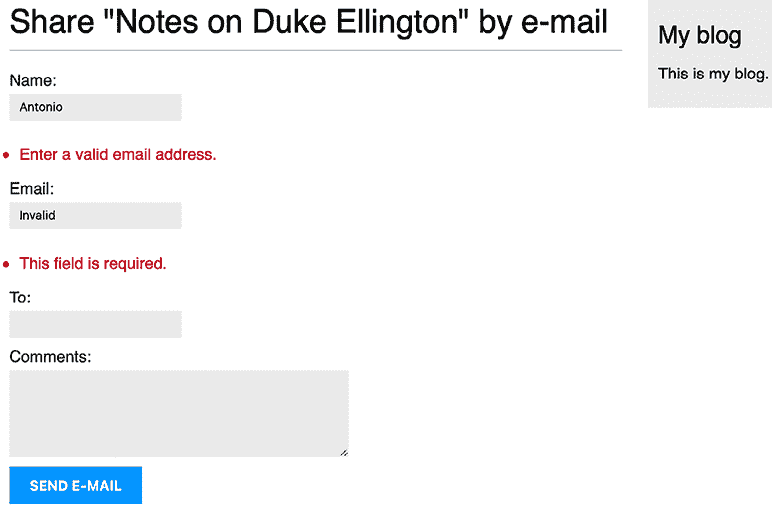

图 2.20：显示无效数据错误的分享帖子表单

大多数现代浏览器都会阻止您提交包含空或错误字段的表单。这是因为浏览器在提交表单之前会根据它们的属性验证字段。在这种情况下，表单将不会提交，浏览器将为错误字段显示错误消息。要使用现代浏览器测试 Django 表单验证，您可以通过在 HTML `<form>` 元素中添加`novalidate`属性来跳过浏览器表单验证，例如`<form method="post" novalidate>`。您可以将此属性添加到防止浏览器验证字段并测试您自己的表单验证。测试完成后，请删除`novalidate`属性以保持浏览器表单验证。

通过电子邮件分享帖子的功能现已完成。您可以在[`docs.djangoproject.com/en/5.0/topics/forms/`](https://docs.djangoproject.com/en/5.0/topics/forms/)找到更多关于处理表单的信息。

# 创建一个评论系统

我们将继续扩展我们的博客应用，添加一个允许用户对帖子进行评论的评论系统。为了构建评论系统，我们需要以下内容：

+   用于存储用户对帖子评论的评论模型

+   一个 Django 表单，允许用户提交评论并管理数据验证

+   一个视图来处理表单并将新评论保存到数据库中

+   一份评论列表和用于添加新评论的 HTML 表单，该表单可以包含在帖子详情模板中

## 创建评论模型

让我们先构建一个用于存储用户对帖子评论的模型。

打开您的`blog`应用的`models.py`文件并添加以下代码：

```py
class Comment(models.Model):
    post = models.ForeignKey(
        Post,
        on_delete=models.CASCADE,
        related_name='comments'
 )
    name = models.CharField(max_length=80)
    email = models.EmailField()
    body = models.TextField()
    created = models.DateTimeField(auto_now_add=True)
    updated = models.DateTimeField(auto_now=True)
    active = models.BooleanField(default=True)
    class Meta:
        ordering = ['created']
        indexes = [
            models.Index(fields=['created']),
        ]
    def __str__(self):
        return f'Comment by {self.name} on {self.post}' 
```

这是`Comment`模型。我们添加了一个`ForeignKey`字段来将每个评论与单个帖子关联。这种多对一关系在`Comment`模型中定义，因为每个评论都将针对一个帖子，每个帖子可能有多个评论。

`related_name` 属性允许您命名从相关对象返回此对象的关联属性。我们可以使用 `comment.post` 来检索评论对象的帖子，使用 `post.comments.all()` 来检索与帖子对象关联的所有评论。如果您不定义 `related_name` 属性，Django 将使用模型名称的小写形式，后跟 `_set`（即 `comment_set`）来命名相关对象与模型对象的关联关系，其中此关系已被定义。

您可以在 [`docs.djangoproject.com/en/5.0/topics/db/examples/many_to_one/`](https://docs.djangoproject.com/en/5.0/topics/db/examples/many_to_one/) 了解更多关于多对一关系的信息。

我们已定义 `active` 布尔字段来控制评论的状态。此字段将允许我们通过管理站点手动停用不适当的评论。我们使用 `default=True` 来表示所有评论默认为活动状态。

我们已定义 `created` 字段来存储评论创建的日期和时间。通过使用 `auto_now_add`，创建对象时日期将自动保存。在模型的 `Meta` 类中，我们添加了 `ordering = ['created']` 以默认按时间顺序排序评论，并添加了 `created` 字段的升序索引。这将提高使用 `created` 字段进行数据库查找或排序结果的性能。

我们构建的 `Comment` 模型与数据库未同步。我们需要生成一个新的数据库迁移来创建相应的数据库表。

从 shell 提示符运行以下命令：

```py
python manage.py makemigrations blog 
```

您应该看到以下输出：

```py
Migrations for 'blog':
  blog/migrations/0003_comment.py
    - Create model Comment 
```

Django 在 `blog` 应用程序的 `migrations/` 目录中生成了一个 `0003_comment.py` 文件。我们需要创建相关的数据库模式并将更改应用到数据库中。

运行以下命令以应用现有迁移：

```py
python manage.py migrate 
```

您将得到包含以下行的输出：

```py
Applying blog.0003_comment... OK 
```

迁移已应用，并在数据库中创建了 `blog_comment` 表。

## 在管理站点添加评论

接下来，我们将添加新的模型到管理站点，以便通过简单的界面管理评论。

打开 `blog` 应用的 `admin.py` 文件，导入 `Comment` 模型，并添加以下 `ModelAdmin` 类：

```py
from .models import **Comment,** Post
**@admin.register(****Comment****)**
**class****CommentAdmin****(admin.ModelAdmin):**
 **list_display = [****'name'****,** **'email'****,** **'post'****,** **'created'****,** **'active'****]**
 **list_filter = [****'active'****,** **'created'****,** **'updated'****]**
 **search_fields = [****'name'****,** **'email'****,** **'body'****]** 
```

打开 shell 提示符并执行以下命令以启动开发服务器：

```py
python manage.py runserver 
```

在您的浏览器中打开 `http://127.0.0.1:8000/admin/`。您应该能看到包含在 **BLOG** 部分的新的模型，如图 *图 2.21* 所示：

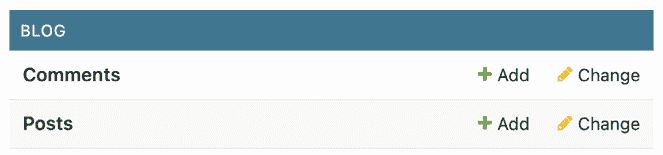

图 2.21：Django 管理索引页上的博客应用程序模型

模型现在已在管理站点上注册。

在 **Comments** 行中，点击 **Add**。您将看到添加新评论的表单：

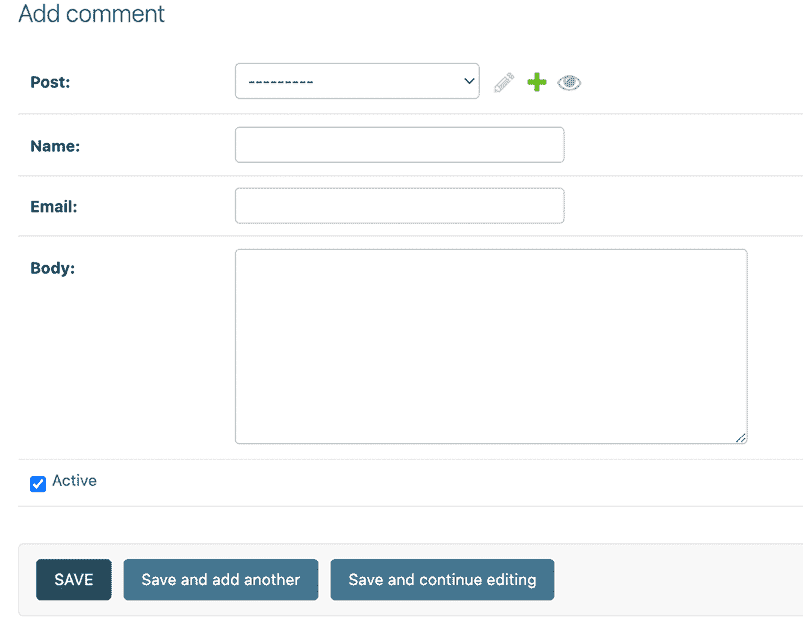

图 2.22：在 Django 管理站点添加新评论的表单

现在我们可以使用管理站点来管理 `Comment` 实例。

## 从模型创建表单

我们需要构建一个表单，让用户可以对博客帖子进行评论。记住，Django 有两个基类可以用来创建表单：`Form` 和 `ModelForm`。我们使用 `Form` 类允许用户通过电子邮件分享帖子。现在，我们将使用 `ModelForm` 来利用现有的 `Comment` 模型并为其动态构建一个表单。

编辑 `blog` 应用的 `forms.py` 文件并添加以下行：

```py
from .models import Comment
class CommentForm(forms.ModelForm):
    class Meta:
        model = Comment
        fields = ['name', 'email', 'body'] 
```

要从一个模型创建表单，我们只需在表单的 `Meta` 类中指定要为哪个模型构建表单。Django 将会反射模型并动态地构建相应的表单。

每个模型字段类型都有一个对应的默认表单字段类型。模型字段的属性会被考虑进表单验证中。默认情况下，Django 为模型中的每个字段创建一个表单字段。然而，我们可以通过使用 `fields` 属性显式地告诉 Django 哪些字段要包含在表单中，或者使用 `exclude` 属性定义哪些字段要排除。在 `CommentForm` 表单中，我们明确包含了 `name`、`email` 和 `body` 字段。这些是唯一会被包含在表单中的字段。

你可以在 [`docs.djangoproject.com/en/5.0/topics/forms/modelforms/`](https://docs.djangoproject.com/en/5.0/topics/forms/modelforms/) 找到更多关于从模型创建表单的信息。

## 在视图中处理 ModelForms

对于通过电子邮件分享帖子，我们使用了相同的视图来显示表单并管理其提交。我们使用 HTTP 方法来区分这两种情况：`GET` 用于显示表单，`POST` 用于提交。在这种情况下，我们将评论表单添加到帖子详情页，并且我们将构建一个单独的视图来处理表单提交。处理表单的新视图将允许用户在评论存储到数据库后返回到帖子详情视图。

编辑 `blog` 应用的 `views.py` 文件并添加以下代码：

```py
from django.core.mail import send_mail
from django.core.paginator import EmptyPage, PageNotAnInteger, Paginator
from django.shortcuts import get_object_or_404, render
**from** **django.views.decorators.http** **import** **require_POST**
from django.views.generic import ListView
from .forms import **CommentForm,** EmailPostForm
from .models import Post
# ...
**@require_POST**
**def****post_comment****(****request, post_id****):**
 **post = get_object_or_404(**
 **Post,**
**id****=post_id,**
 **status=Post.Status.PUBLISHED**
 **)**
 **comment =** **None**
**# A comment was posted**
 **form = CommentForm(data=request.POST)**
**if** **form.is_valid():**
**# Create a Comment object without saving it to the database**
 **comment = form.save(commit=****False****)**
**# Assign the post to the comment**
 **comment.post = post**
**# Save the comment to the database**
 **comment.save()**
**return** **render(**
 **request,**
**'blog/post/comment.html'****,**
 **{**
**'post'****: post,**
**'form'****: form,**
**'comment'****: comment**
 **}**
 **)** 
```

我们定义了一个 `post_comment` 视图，它接受 `request` 对象和 `post_id` 变量作为参数。我们将使用这个视图来管理帖子提交。我们期望表单将通过 HTTP `POST` 方法提交。我们使用 Django 提供的 `require_POST` 装饰器来仅允许对这个视图的 `POST` 请求。Django 允许你限制视图允许的 HTTP 方法。如果你尝试用任何其他 HTTP 方法访问视图，Django 将会抛出一个 HTTP `405`（方法不被允许）错误。

在这个视图中，我们实现了以下操作：

1.  我们使用 `get_object_or_404()` 快捷方式通过 `id` 获取一个已发布的帖子。

1.  我们定义了一个初始值为 `None` 的 `comment` 变量。当创建评论对象时，这个变量将用来存储评论对象。

1.  我们使用提交的 `POST` 数据实例化表单，并使用 `is_valid()` 方法进行验证。如果表单无效，模板将带有验证错误被渲染。

1.  如果表单有效，我们将通过调用表单的 `save()` 方法创建一个新的 `Comment` 对象，并将其分配给 `comment` 变量，如下所示：

    ```py
    comment = form.save(commit=False) 
    ```

1.  `save()` 方法创建与表单关联的模型实例并将其保存到数据库。如果您使用 `commit=False` 调用它，则模型实例将被创建但不会保存到数据库。这允许我们在最终保存之前修改对象。

    `save()` 方法对 `ModelForm` 实例可用，但对 `Form` 实例不可用，因为它们没有链接到任何模型。

1.  我们将帖子分配给创建的评论：

    ```py
    comment.post = post 
    ```

1.  我们通过调用其 `save()` 方法将新的评论保存到数据库：

    ```py
    comment.save() 
    ```

1.  我们渲染 `blog/post/comment.html` 模板，将 `post`、`form` 和 `comment` 对象传递到模板上下文中。此模板尚不存在；我们将在稍后创建它。

让我们为这个视图创建一个 URL 模式。

编辑 `blog` 应用的 `urls.py` 文件，并向其中添加以下 URL 模式：

```py
from django.urls import path
from . import views
app_name = 'blog'
urlpatterns = [
    # Post views
# path('', views.post_list, name='post_list'),
    path('', views.PostListView.as_view(), name='post_list'),
    path(
        '<int:year>/<int:month>/<int:day>/<slug:post>/',
        views.post_detail,
        name='post_detail'
 ),
    path('<int:post_id>/share/', views.post_share, name='post_share'),
    **path(**
**'<int:post_id>/comment/'****, views.post_comment, name=****'post_comment'**
 **),**
] 
```

我们已经实现了管理评论提交及其对应 URL 的视图。让我们创建必要的模板。

## 创建评论表单的模板

我们将创建一个用于评论表单的模板，我们将在两个地方使用它：

+   在与 `post_detail` 视图关联的帖子详情模板中，让用户发布评论。

+   在与 `post_comment` 视图关联的发表评论模板中，如果有任何表单错误，将再次显示表单。

我们将创建表单模板，并使用 `` 模板标签将其包含在另外两个模板中。

在 `templates/blog/post/` 目录中，创建一个新的 `includes/` 目录。在此目录内添加一个新文件，并将其命名为 `comment_form.html`。

文件结构应如下所示：

```py
templates/
  blog/
    post/
      includes/
        comment_form.html
      detail.html
      list.html
      share.html 
```

编辑新的 `blog/post/includes/comment_form.html` 模板，并添加以下代码：

```py
<h2>Add a new comment</h2>
<form action="" method="post">
  {{ form.as_p }}
  
  <p><input type="submit" value="Add comment"></p>
</form> 
```

在这个模板中，我们使用 `` 模板标签动态构建 HTML `<form>` 元素的 `action` URL。我们构建将处理表单的 `post_comment` 视图的 URL。我们显示以段落形式渲染的表单，并包含 `` 以实现 CSRF 保护，因为此表单将以 `POST` 方法提交。

在 `blog` 应用的 `templates/blog/post/` 目录中创建一个新文件，并将其命名为 `comment.html`。

文件结构现在应如下所示：

```py
templates/
  blog/
    post/
      includes/
        comment_form.html
      comment.html
      detail.html
      list.html
      share.html 
```

编辑新的 `blog/post/comment.html` 模板，并添加以下代码：

```py

Add a comment

  
    <h2>Your comment has been added.</h2>
<p><a href="{{ post.get_absolute_url }}">Back to the post</a></p>
  
    
  
 
```

这是帖子评论视图的模板。在这个视图中，我们期望表单通过 `POST` 方法提交。模板涵盖了两种不同的场景：

+   如果提交的表单数据有效，`comment` 变量将包含创建的 `comment` 对象，并将显示成功消息。

+   如果提交的表单数据无效，`comment` 变量将为 `None`。在这种情况下，我们将显示评论表单。我们使用 `` 模板标签来包含我们之前创建的 `comment_form.html` 模板。

## 在帖子详情视图中添加评论

为了完成评论功能，我们将添加评论列表和评论表单到 `post_detail` 视图中。

编辑 `blog` 应用程序的 `views.py` 文件并按照以下方式编辑 `post_detail` 视图：

```py
def post_detail(request, year, month, day, post):
    post = get_object_or_404(
        Post,
        status=Post.Status.PUBLISHED,
        slug=post,
        publish__year=year,
        publish__month=month,
        publish__day=day
    )
    **# List of active comments for this post**
 **comments = post.comments.****filter****(active=****True****)**
**# Form for users to comment**
 **form = CommentForm()**
return render(
        request,
        'blog/post/detail.html',
        {
            'post': post**,**
**'comments'****: comments,**
**'form'****: form**
        }
    ) 
```

让我们回顾一下我们添加到 `post_detail` 视图中的代码：

+   我们添加了一个查询集来检索帖子的所有活跃评论，如下所示：

    ```py
    comments = post.comments.filter(active=True) 
    ```

+   此查询集是通过使用 `post` 对象构建的。我们不是直接为 `Comment` 模型构建查询集，而是利用 `post` 对象来检索相关的 `Comment` 对象。我们使用在 `Comment` 模型中先前定义的 `comments` 管理器来处理相关的 `Comment` 对象，使用 `ForeignKey` 字段的 `related_name` 属性来关联 `Post` 模型。

+   我们还创建了一个评论表单的实例，`form = CommentForm()`。

## 在帖子详情模板中添加评论

我们需要编辑 `blog/post/detail.html` 模板以实施以下更改：

+   显示帖子的评论总数

+   显示评论列表

+   显示用户添加新评论的表单

我们将首先添加帖子的评论总数。

编辑 `blog/post/detail.html` 模板并按照以下方式更改：

```py

{{ post.title }}

  <h1>{{ post.title }}</h1>
<p class="date">
    Published {{ post.publish }} by {{ post.author }}
  </p>
  {{ post.body|linebreaks }}
  <p>
<a href="">
      Share this post
    </a>
</p>
****
**<****h2****>**
 **{{ total_comments }} comment{{ total_comments|pluralize }}**
**</****h2****>**
 ****
 
```

我们在模板中使用 Django **对象关系映射器**（**ORM**），执行 `comments.count()` 查询集。请注意，Django 模板语言在调用方法时不使用括号。`` 标签允许您将值分配给一个新变量，该变量将在模板中可用，直到遇到 `` 标签。

`` 模板标签对于避免多次访问数据库或调用昂贵的方法非常有用。

我们使用 `pluralize` 模板过滤器来根据 `total_comments` 值显示单词 “comment” 的复数后缀。模板过滤器将它们应用到的变量的值作为输入，并返回一个计算后的值。我们将在 *第三章*，*扩展您的博客应用程序* 中了解更多关于模板过滤器的内容。

`pluralize` 模板过滤器如果值不同于 `1`，则返回带有字母 “s” 的字符串。根据帖子的活跃评论数量，前面的文本将渲染为 *0 条评论*，*1 条评论* 或 *N 条评论*。

现在，让我们将活跃评论的列表添加到帖子详情模板中。

编辑 `blog/post/detail.html` 模板并实施以下更改：

```py

{{ post.title }}

  <h1>{{ post.title }}</h1>
<p class="date">
    Published {{ post.publish }} by {{ post.author }}
  </p>
  {{ post.body|linebreaks }}
  <p>
<a href="">
      Share this post
    </a>
</p>
  
    <h2>
      {{ total_comments }} comment{{ total_comments|pluralize }}
    </h2>
  
  ****
**<****div****class****=****"comment"****>**
**<****p****class****=****"info"****>**
 **Comment {{ forloop.counter }} by {{ comment.name }}**
 **{{ comment.created }}**
**</****p****>**
 **{{ comment.body|linebreaks }}**
**</****div****>**
 ****
**<****p****>****There are no comments.****</****p****>**
 ****
 
```

我们添加了一个 `` 模板标签来遍历帖子评论。如果 `comments` 列表为空，我们显示一条消息，告知用户此帖子没有评论。我们使用 `{{ forloop.counter }}` 变量来列举评论，该变量包含每次迭代的循环计数。对于每个帖子，我们显示发布者的名字、日期和评论内容。

最后，让我们将评论表单添加到模板中。

编辑 `blog/post/detail.html` 模板，并按照以下方式包含评论表单模板：

```py

{{ post.title }}

  <h1>{{ post.title }}</h1>
<p class="date">
    Published {{ post.publish }} by {{ post.author }}
  </p>
  {{ post.body|linebreaks }}
  <p>
<a href="">
      Share this post
    </a>
</p>
  
    <h2>
      {{ total_comments }} comment{{ total_comments|pluralize }}
    </h2>
  
  
    <div class="comment">
<p class="info">
        Comment {{ forloop.counter }} by {{ comment.name }}
        {{ comment.created }}
      </p>
      {{ comment.body|linebreaks }}
    </div>
  
    <p>There are no comments.</p>
  
  ****
 
```

在你的浏览器中打开 `http://127.0.0.1:8000/blog/` 并点击帖子标题以查看帖子详情页面。你会看到类似 *图 2.23* 的内容：

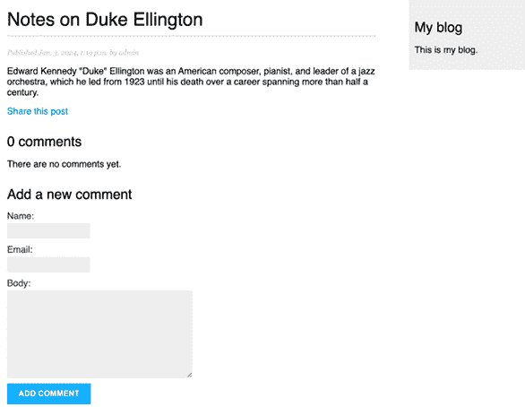

图 2.23：帖子详情页面，包括添加评论的表单

使用有效数据填写评论表单并点击 **添加评论**。你应该看到以下页面：

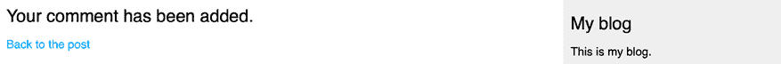

图 2.24：添加评论成功页面

点击 **返回帖子** 链接。你应该被重定向回帖子详情页面，你应该能够看到你刚刚添加的评论，如下所示：

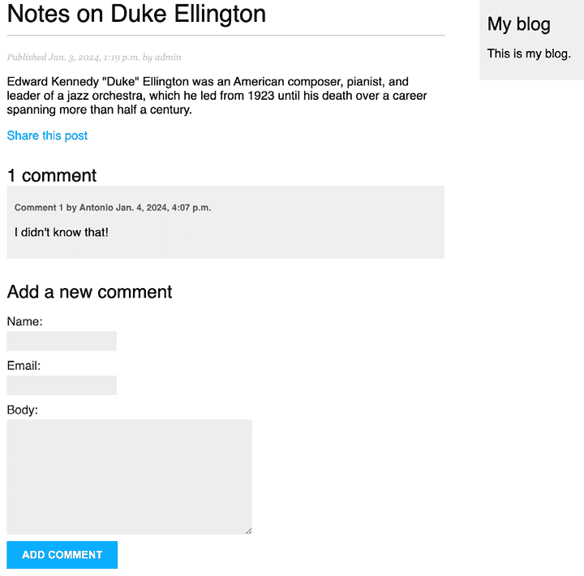

图 2.25：帖子详情页面，包括评论

向帖子添加一条评论。评论应按时间顺序显示在帖子内容下方，如下所示：

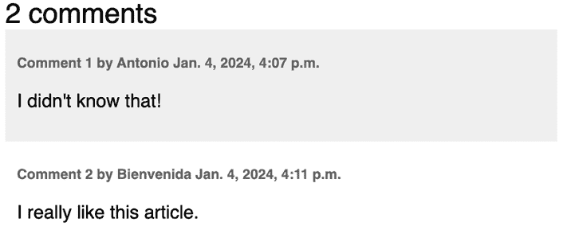

图 2.26：帖子详情页面上的评论列表

在你的浏览器中打开 `http://127.0.0.1:8000/admin/blog/comment/`。你会看到包含你创建的评论列表的管理页面，如下所示：

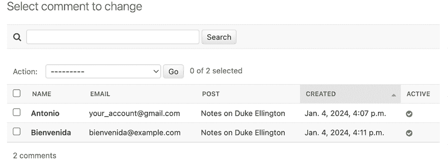

图 2.27：管理站点上的评论列表

点击其中一个帖子的名称来编辑它。按照以下方式取消选择 **活动** 复选框，然后点击 **保存** 按钮：

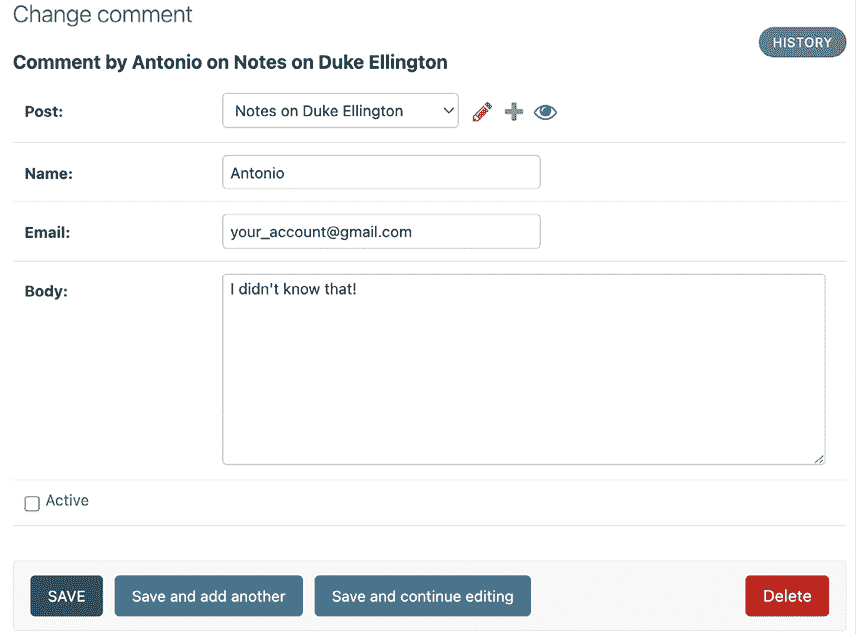

图 2.28：在管理站点上编辑评论

你将被重定向到评论列表。**活动**列将显示非活动图标，如图 *图 2.29* 所示：

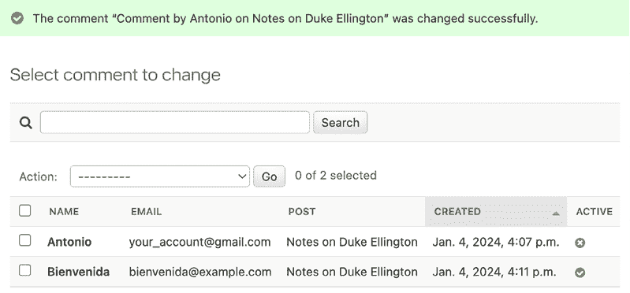

图 2.29：管理站点上的活动/非活动评论

如果你返回到帖子详情视图，你会注意到不再显示非活动评论，它也不会计入帖子的总活动评论数：

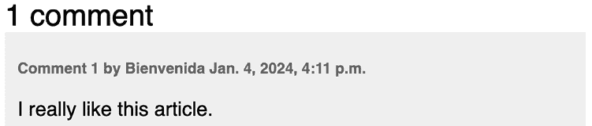

图 2.30：在帖子详情页面上显示的单个活动评论

多亏了 `active` 字段，你可以停用不适当的评论，并避免在帖子中显示它们。

## 使用简化的模板进行表单渲染

你使用了 `{{ form.as_p }}` 来使用 HTML 段落渲染表单。这是一个渲染表单的非常直接的方法，但可能有时你需要使用自定义 HTML 标记来渲染表单。

要使用自定义 HTML 渲染表单字段，你可以直接访问每个表单字段，或者遍历表单字段，如下例所示：

```py

  <div class="my-div">
    {{ field.errors }}
    {{ field.label_tag }} {{ field }}
    <div class="help-text">{{ field.help_text|safe }}</div>
</div>
 
```

在此代码中，我们使用`{{ field.errors }}`来渲染表单的任何字段错误，`{{ field.label_tag }}`来渲染表单 HTML 标签，`{{ field }}`来渲染实际字段，以及`{{ field.help_text|safe }}`来渲染字段的帮助文本 HTML。

此方法有助于自定义表单的渲染方式，但你可能需要为特定字段添加某些 HTML 元素或将某些字段包含在容器中。Django 5.0 引入了字段组和字段组模板。字段组简化了标签、小部件、帮助文本和字段错误的渲染。让我们使用这个新功能来自定义评论表单。

我们将使用自定义 HTML 标记来重新定位`name`和`email`表单字段，使用额外的 HTML 元素。

编辑`blog/post/includes/comment_form.html`模板，并按以下方式修改。新的代码以粗体显示：

```py
<h2>Add a new comment</h2>
<form action="" method="post">
**<****div****class****=****"left"****>**
 **{{ form.name.as_field_group }}**
**</****div****>**
**<****div****class****=****"left"****>**
 **{{ form.email.as_field_group }}**
**</****div****>**
 **{{ form.body.as_field_group }}**
  
  <p><input type="submit" value="Add comment"></p>
</form> 
```

我们为`name`和`email`字段添加了带有自定义 CSS 类的`<div>`容器，使两个字段都浮动到左边。`as_field_group`方法渲染每个字段，包括帮助文本和错误。此方法默认使用`django/forms/field.html`模板。你可以在[`github.com/django/django/blob/stable/5.0.x/django/forms/templates/django/forms/field.html`](https://github.com/django/django/blob/stable/5.0.x/django/forms/templates/django/forms/field.html)中查看此模板的内容。你还可以创建自定义字段模板，并通过将`template_name`属性添加到任何表单字段来重复使用它们。你可以在[`docs.djangoproject.com/en/5.0/topics/forms/#reusable-field-group-templates`](https://docs.djangoproject.com/en/5.0/topics/forms/#reusable-field-group-templates)上了解更多关于可重复使用的表单模板的信息。

打开一篇博客文章，查看评论表单。现在表单应该看起来像*图 2.31*：

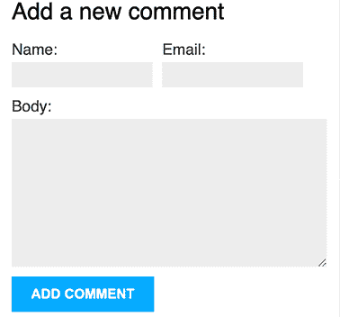

图 2.31：带有新 HTML 标记的评论表单

`name`和`email`字段现在并排显示。字段组允许你轻松自定义表单渲染。

# 摘要

在本章中，你学习了如何为模型定义规范 URL。你为博客文章创建了 SEO 友好的 URL，并为你的文章列表实现了对象分页。你还学习了如何使用 Django 表单和模型表单。你创建了一个通过电子邮件推荐文章的系统，并为你的博客创建了一个评论系统。

在下一章中，你将为博客创建一个标签系统。你将学习如何构建复杂的查询集以通过相似性检索对象。你将学习如何创建自定义模板标签和过滤器。你还将为你的博客文章构建自定义的网站地图和源，并为你的文章实现全文搜索功能。

# 其他资源

以下资源提供了与本章所涵盖主题相关的额外信息：

+   本章源代码：[`github.com/PacktPublishing/Django-5-by-example/tree/main/Chapter02`](https://github.com/PacktPublishing/Django-5-by-example/tree/main/Chapter02)

+   URL 实用函数：[`docs.djangoproject.com/en/5.0/ref/urlresolvers/`](https://docs.djangoproject.com/en/5.0/ref/urlresolvers/)

+   URL 路径转换器：[`docs.djangoproject.com/en/5.0/topics/http/urls/#path-converters`](https://docs.djangoproject.com/en/5.0/topics/http/urls/#path-converters)

+   Django 分页器类：[`docs.djangoproject.com/en/5.0/ref/paginator/`](https://docs.djangoproject.com/en/5.0/ref/paginator/)

+   基于类的视图介绍 – [`docs.djangoproject.com/en/5.0/topics/class-based-views/intro/`](https://docs.djangoproject.com/en/5.0/topics/class-based-views/intro/)

+   使用 Django 发送电子邮件：[`docs.djangoproject.com/en/5.0/topics/email/`](https://docs.djangoproject.com/en/5.0/topics/email/)

+   `python-decouple`库：[`github.com/HBNetwork/python-decouple`](https://github.com/HBNetwork/python-decouple)

+   `django-anymail`库：[`anymail.dev/en/stable/installation/`](https://anymail.dev/en/stable/installation/)

+   `django-anymail`支持的电子邮件服务提供商：[`anymail.dev/en/stable/esps/`](https://anymail.dev/en/stable/esps/)

+   Django 表单字段类型：[`docs.djangoproject.com/en/5.0/ref/forms/fields/`](https://docs.djangoproject.com/en/5.0/ref/forms/fields/)

+   与表单一起工作：[`docs.djangoproject.com/en/5.0/topics/forms/`](https://docs.djangoproject.com/en/5.0/topics/forms/)

+   从模型创建表单：[`docs.djangoproject.com/en/5.0/topics/forms/modelforms/`](https://docs.djangoproject.com/en/5.0/topics/forms/modelforms/)

+   多对一模型关系：[`docs.djangoproject.com/en/5.0/topics/db/examples/many_to_one/`](https://docs.djangoproject.com/en/5.0/topics/db/examples/many_to_one/)

+   默认表单字段模板：[`github.com/django/django/blob/stable/5.0.x/django/forms/templates/django/forms/field.html`](https://github.com/django/django/blob/stable/5.0.x/django/forms/templates/django/forms/field.html)

+   可重用字段组模板：[`docs.djangoproject.com/en/5.0/topics/forms/#reusable-field-group-templates`](https://docs.djangoproject.com/en/5.0/topics/forms/#reusable-field-group-templates)
