# 第十三章：创建一个内容管理系统

在上一章中，你为在线学习平台创建了应用程序模型，并学习了如何为模型创建和应用数据固定值。你创建了一个自定义模型字段来排序对象，并实现了用户认证。

在本章中，你将学习如何以灵活和高效的方式为讲师构建创建课程和管理课程内容的功能。

你将介绍基于类的视图，与你在前例中构建的基于函数的视图相比，它为你构建应用程序提供了新的视角。你还将通过使用混合类来探索代码的可重用性和模块化，这些是你可以应用于未来项目的技术。

在本章中，你将学习如何：

+   使用基于类的视图和混合类创建一个 **内容管理系统**（**CMS**）

+   构建表单集和模型表单集以编辑课程模块和模块内容

+   管理组和权限

+   实现一个拖放功能以重新排序模块和内容

# 功能概述

*图 13.1* 展示了本章将构建的视图、模板和功能：

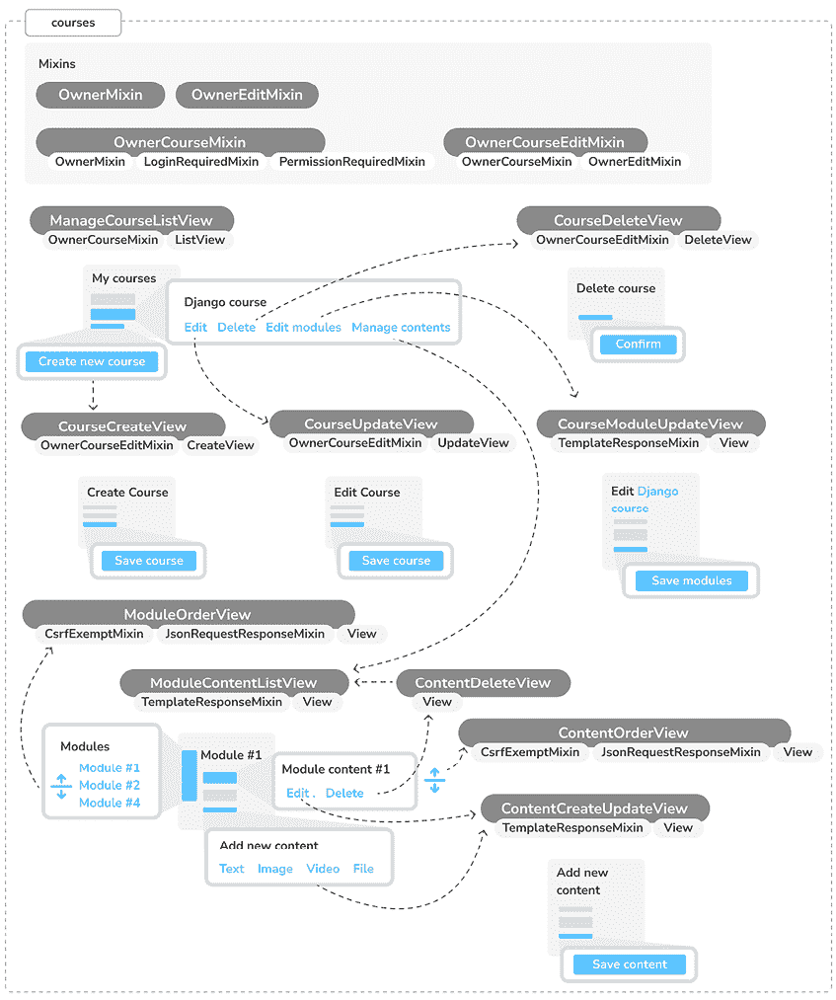

图 13.1：第十三章构建的功能图

在本章中，你将实现不同的基于类的视图。你将创建混合类 `OwnerMixin`、`OwnerEditMixin` 和 `OwnerCourseMixin`，这些类将包含你将在其他类中重用的常见功能。你将通过实现 `ManageCourseListView` 来列出课程、`CourseCreateView` 来创建课程、`CourseUpdateView` 来更新课程和 `CourseDeleteView` 来删除课程，为 `Course` 模型创建 **CRUD**（**创建**、**读取**、**更新**、**删除**）视图。你将构建 `CourseModuleUpdateView` 视图来添加/编辑/删除课程模块，以及 `ModuleContentListView` 来列出模块的内容。你还将实现 `ContentCreateUpdateView` 来创建和更新课程内容，以及 `ContentDeleteView` 来删除内容。你最终将通过使用 `ModuleOrderView` 和 `ContentOrderView` 视图来实现拖放功能，分别重新排序课程模块和内容。

注意，所有继承自混合类 `OwnerCourseMixin` 的视图在成功执行操作后都会将用户重定向回 `ManageCourseListView` 视图。为了简化，这些重定向并未添加到图中。

本章的源代码可以在 [`github.com/PacktPublishing/Django-5-by-example/tree/main/Chapter13`](https://github.com/PacktPublishing/Django-5-by-example/tree/main/Chapter13) 找到。

本章中使用的所有 Python 模块都包含在本章源代码中的 `requirements.txt` 文件中。你可以按照以下说明安装每个 Python 模块，或者你可以使用命令 `python -m pip install -r requirements.txt` 一次性安装所有依赖。

# 创建一个 CMS

现在你已经创建了一个通用的数据模型，你将构建 CMS。CMS 将允许讲师创建课程并管理其内容。你需要提供以下功能：

+   列出讲师创建的课程

+   创建、编辑和删除课程

+   向课程添加模块并重新排序它们

+   向每个模块添加不同类型的内容

+   重新排序课程模块和内容

让我们从基本的 CRUD 视图开始。

## 创建基于类的视图

你将构建视图来创建、编辑和删除课程。你将使用基于类的视图来完成这项工作。编辑`courses`应用的`views.py`文件，并添加以下代码：

```py
from django.views.generic.list import ListView
from .models import Course
class ManageCourseListView(ListView):
    model = Course
    template_name = 'courses/manage/course/list.html'
def get_queryset(self):
        qs = super().get_queryset()
        return qs.filter(owner=self.request.user) 
```

这是`ManageCourseListView`视图。它继承自 Django 的通用`ListView`。你将覆盖视图的`get_queryset()`方法，以检索由当前用户创建的课程。为了防止用户编辑、更新或删除他们未创建的课程，你还需要在创建、更新和删除视图中覆盖`get_queryset()`方法。当你需要为多个基于类的视图提供特定行为时，建议使用*mixins*。

## 使用*mixins*为基于类的视图

Mixins 是一种特殊的类多重继承。如果你对 Python 中的 mixins 还不熟悉，你需要了解的是，它们是一种旨在为其他类提供方法但不是为了独立使用的类。这允许你通过让这些类从 mixins 继承来以模块化的方式开发共享功能。这个概念类似于基类，但你可以使用多个 mixins 来扩展给定类的功能。

使用 mixins 主要有两种情况：

+   你想为类提供多个可选功能

+   你想在几个类中使用特定的功能

Django 附带了一些 mixins，它们为你的基于类的视图提供了额外的功能。你可以在[`docs.djangoproject.com/en/5.0/topics/class-based-views/mixins/`](https://docs.djangoproject.com/en/5.0/topics/class-based-views/mixins/)了解更多关于 mixins 的信息。

你将在混合类中实现多个视图的通用行为，并将其用于课程视图。编辑`courses`应用的`views.py`文件，并按以下方式修改它：

```py
**from** **django.urls** **import** **reverse_lazy**
**from** **django.views.generic.edit** **import** **CreateView, DeleteView, UpdateView**
from django.views.generic.list import ListView
from .models import Course
**class****OwnerMixin****:**
**def****get_queryset****(****self****):**
 **qs =** **super****().get_queryset()**
**return** **qs.****filter****(owner=self.request.user)**
**class****OwnerEditMixin****:**
**def****form_valid****(****self, form****):**
 **form.instance.owner = self.request.user**
**return****super****().form_valid(form)**
**class****OwnerCourseMixin****(****OwnerMixin****):**
 **model = Course**
 **fields = [****'subject'****,** **'title'****,** **'slug'****,** **'overview'****]**
 **success_url = reverse_lazy(****'manage_course_list'****)**
**class****OwnerCourseEditMixin****(OwnerCourseMixin, OwnerEditMixin):**
 **template_name =** **'courses/manage/course/form.html'**
class ManageCourseListView(**OwnerCourseMixin,** ListView):
    template_name = 'courses/manage/course/list.html'
**class****CourseCreateView****(OwnerCourseEditMixin, CreateView):**
**pass**
**class****CourseUpdateView****(OwnerCourseEditMixin, UpdateView):**
**pass**
**class****CourseDeleteView****(OwnerCourseMixin, DeleteView):**
 **template_name =** **'courses/manage/course/delete.html'** 
```

在此代码中，你创建了`OwnerMixin`和`OwnerEditMixin`混合类。你将使用这些混合类与 Django 提供的`ListView`、`CreateView`、`UpdateView`和`DeleteView`视图一起使用。`OwnerMixin`实现了`get_queryset()`方法，该方法由视图用于获取基础 QuerySet。你的混合类将覆盖此方法，通过`owner`属性过滤对象以检索属于当前用户（`request.user`）的对象。

`OwnerEditMixin`实现了`form_valid()`方法，该方法由使用 Django 的`ModelFormMixin`混合类（即具有表单或模型表单的视图，如`CreateView`和`UpdateView`）使用的视图调用。当提交的表单有效时执行`form_valid()`。

此方法的默认行为是保存实例（对于模型表单）并将用户重定向到`success_url`。您重写此方法来自动设置正在保存的对象的`owner`属性中的当前用户。通过这样做，您在对象保存时自动设置对象的拥有者。

您的`OwnerMixin`类可用于与任何包含`owner`属性的模型交互的视图。

您还定义了一个继承自`OwnerMixin`的`OwnerCourseMixin`类，为子视图提供了以下属性：

+   `model`：用于查询集的模型；它被所有视图使用。

+   `fields`：用于构建`CreateView`和`UpdateView`视图模型表单的模型字段。

+   `success_url`：由`CreateView`、`UpdateView`和`DeleteView`使用，在表单成功提交或对象被删除后将用户重定向到。您使用一个名为`manage_course_list`的 URL，您将在稍后创建。

您可以使用以下属性定义一个`OwnerCourseEditMixin`混合类：

+   `template_name`：您将用于`CreateView`和`UpdateView`视图的模板。

最后，您创建了以下继承自`OwnerCourseMixin`的视图：

+   `ManageCourseListView`：列出用户创建的课程。它继承自`OwnerCourseMixin`和`ListView`，并为列出课程定义了特定的`template_name`属性。

+   `CourseCreateView`：使用模型表单创建新的`Course`对象。它使用在`OwnerCourseMixin`中定义的字段来构建模型表单，并且继承自`CreateView`。它使用`OwnerCourseEditMixin`中定义的模板。

+   `CourseUpdateView`：允许编辑现有的`Course`对象。它使用在`OwnerCourseMixin`中定义的字段来构建模型表单，并且继承自`UpdateView`。它使用`OwnerCourseEditMixin`中定义的模板。

+   `CourseDeleteView`：继承自`OwnerCourseMixin`和通用`DeleteView`，并为确认课程删除定义了特定的`template_name`属性。

您已创建了管理课程的基本视图。虽然您已经实现了自己的 CRUD 视图，但第三方应用程序 Neapolitan 允许您在单个视图中实现标准列表、详情、创建和删除视图。您可以在[`github.com/carltongibson/neapolitan`](https://github.com/carltongibson/neapolitan)了解更多关于 Neapolitan 的信息。

接下来，您将使用 Django 认证组和权限来限制对这些视图的访问。

## 与组和权限一起工作

目前，任何用户都可以访问管理课程的视图。您希望限制这些视图，以便只有讲师才有权创建和管理课程。

Django 的认证框架包括一个权限系统。默认情况下，Django 为安装的应用程序中的每个模型生成四个权限：`add`、`view`、`change`和`delete`。这些权限对应于创建新实例、查看现有实例、编辑和删除模型实例的操作。

权限可以直接分配给单个用户或用户组。这种方法通过分组权限简化了用户管理，并增强了您应用程序的安全性。

你将创建一个用于讲师用户的组，并分配创建、更新和删除课程的权限。

使用以下命令运行开发服务器：

```py
python manage.py runserver 
```

在浏览器中打开`http://127.0.0.1:8000/admin/auth/group/add/`以创建一个新的`Group`对象。添加名称`Instructors`并选择`courses`应用的所有权限，除了`Subject`模型的权限，如下所示：

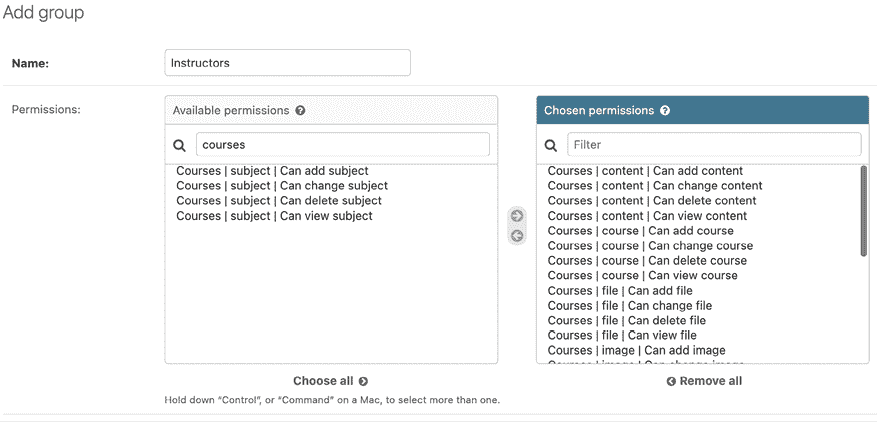

图 13.2：讲师组权限

如您所见，每个模型都有四种不同的权限：*可以查看*、*可以添加*、*可以更改*和*可以删除*。在选择此组的权限后，点击**保存**按钮。

Django 会自动为模型创建权限，但您也可以创建自定义权限。您将在第十五章“构建 API”中学习如何创建自定义权限。您可以在[`docs.djangoproject.com/en/5.0/topics/auth/customizing/#custom-permissions`](https://docs.djangoproject.com/en/5.0/topics/auth/customizing/#custom-permissions)了解更多关于添加自定义权限的信息。

打开`http://127.0.0.1:8000/admin/auth/user/add/`并在浏览器中创建一个新用户。编辑用户并将其添加到**讲师**组，如下所示：

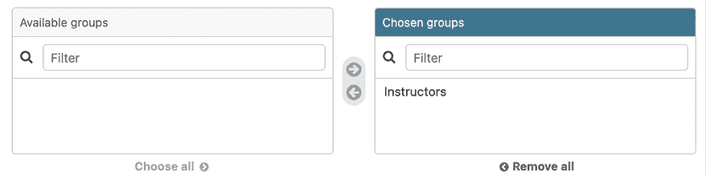

图 13.3：用户组选择

用户继承他们所属组的权限，但您也可以使用管理站点为单个用户添加单独的权限。将`is_superuser`设置为`True`的用户将自动拥有所有权限。

接下来，您将通过将它们整合到我们的视图中来实际应用权限。

### 限制基于类的视图的访问

您将限制对视图的访问，以便只有具有适当权限的用户才能添加、更改或删除`Course`对象。您将使用`django.contrib.auth`提供的以下两个 mixins 来限制对视图的访问：

+   `LoginRequiredMixin`：复制`login_required`装饰器的功能。

+   `PermissionRequiredMixin`：授予具有特定权限的用户访问视图的权限。请记住，超级用户自动拥有所有权限。

编辑`courses`应用的`views.py`文件，并添加以下导入：

```py
from django.contrib.auth.mixins import (
    LoginRequiredMixin,
    PermissionRequiredMixin
) 
```

让`OwnerCourseMixin`继承`LoginRequiredMixin`和`PermissionRequiredMixin`，如下所示：

```py
class OwnerCourseMixin(
    OwnerMixin**, LoginRequiredMixin, PermissionRequiredMixin**
):
    model = Course
    fields = ['subject', 'title', 'slug', 'overview']
    success_url = reverse_lazy('manage_course_list') 
```

然后，将`permission_required`属性添加到课程视图中，如下所示：

```py
class ManageCourseListView(OwnerCourseMixin, ListView):
    template_name = 'courses/manage/course/list.html'
 **permission_required =** **'courses.view_course'**
class CourseCreateView(OwnerCourseEditMixin, CreateView):
 **permission_required =** **'courses.add_course'**
class CourseUpdateView(OwnerCourseEditMixin, UpdateView):
 **permission_required =** **'courses.change_course'**
class CourseDeleteView(OwnerCourseMixin, DeleteView):
    template_name = 'courses/manage/course/delete.html'
 **permission_required =** **'courses.delete_course'** 
```

`PermissionRequiredMixin`检查访问视图的用户是否具有`permission_required`属性中指定的权限。您的视图现在仅对具有适当权限的用户可访问。

让我们为这些视图创建 URL。在`courses`应用程序目录内创建一个新文件，并将其命名为`urls.py`。向其中添加以下代码：

```py
from django.urls import path
from . import views
urlpatterns = [
    path(
        'mine/',
        views.ManageCourseListView.as_view(),
        name='manage_course_list'
    ),
    path(
        'create/',
        views.CourseCreateView.as_view(),
        name='course_create'
    ),
    path(
        '<pk>/edit/',
        views.CourseUpdateView.as_view(),
        name='course_edit'
    ),
    path(
        '<pk>/delete/',
        views.CourseDeleteView.as_view(),
        name='course_delete'
    ),
] 
```

这些是列表、创建、编辑和删除课程视图的 URL 模式。`pk`参数指的是主键字段。请记住，**pk 是主键的缩写**。每个 Django 模型都有一个作为其主键的字段。默认情况下，主键是自动生成的`id`字段。Django 的单个对象通用视图通过其`pk`字段检索对象。编辑`educa`项目的主体`urls.py`文件，并包含`courses`应用程序的 URL 模式，如下所示。

新代码以粗体突出显示：

```py
from django.conf import settings
from django.conf.urls.static import static
from django.contrib import admin
from django.contrib.auth import views as auth_views
from django.urls import **include,** path
urlpatterns = [
    path(
        'accounts/login/', auth_views.LoginView.as_view(), name='login'
    ),
    path(
        'accounts/logout/',
        auth_views.LogoutView.as_view(),
        name='logout'
    ),
    path('admin/', admin.site.urls),
 **path(****'course/'****, include(****'courses.urls'****)),**
]
if settings.DEBUG:
    urlpatterns += static(
        settings.MEDIA_URL, document_root=settings.MEDIA_ROOT
    ) 
```

您需要为这些视图创建模板。在`courses`应用程序的`templates/`目录内创建以下目录和文件：

```py
courses/
    manage/
        course/
            list.html
            form.html
            delete.html 
```

编辑`courses/manage/course/list.html`模板并向其中添加以下代码：

```py

My courses

  <h1>My courses</h1>
<div class="module">
    
      <div class="course-info">
<h3>{{ course.title }}</h3>
<p>
<a href="">Edit</a>
<a href="">Delete</a>
</p>
</div>
    
      <p>You haven't created any courses yet.</p>
    
    <p>
<a href="" class="button">Create new course</a>
</p>
</div>
 
```

这是`ManageCourseListView`视图的模板。在这个模板中，您列出当前用户创建的课程。您包括编辑或删除每个课程的链接以及创建新课程的链接。

使用以下命令运行开发服务器：

```py
python manage.py runserver 
```

在您的浏览器中打开`http://127.0.0.1:8000/accounts/login/?next=/course/mine/`并使用属于`Instructors`组的用户登录。登录后，您将被重定向到`http://127.0.0.1:8000/course/mine/` URL，并且您应该看到以下页面：

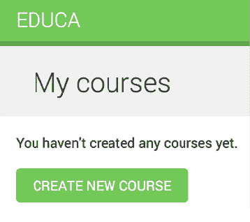

图 13.4：没有课程的讲师课程页面

此页面将显示当前用户创建的所有课程。

让我们创建用于创建和更新课程视图的模板。编辑`courses/manage/course/form.html`模板并写入以下代码：

```py


  
    Edit course "{{ object.title }}"
  
    Create a new course
  


  <h1>
    
      Edit course "{{ object.title }}"
    
      Create a new course
    
  </h1>
<div class="module">
<h2>Course info</h2>
<form method="post">
      {{ form.as_p }}
      
      <p><input type="submit" value="Save course"></p>
</form>
</div>
 
```

`form.html`模板用于`CourseCreateView`和`CourseUpdateView`视图。在这个模板中，您检查上下文中是否存在`object`变量。如果`object`存在于上下文中，您知道您正在更新现有课程，并在页面标题中使用它。否则，您正在创建一个新的`Course`对象。

在您的浏览器中打开`http://127.0.0.1:8000/course/mine/`并点击**创建新课程**按钮。您将看到以下页面：

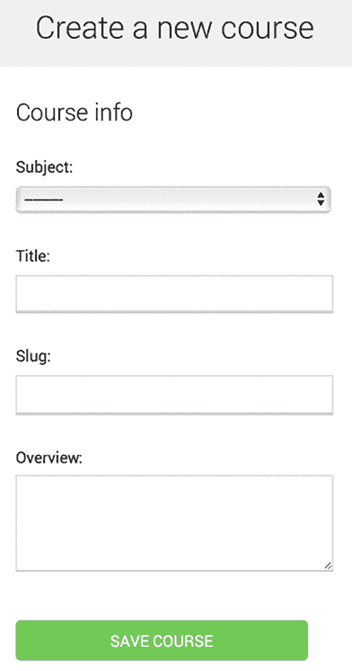

图 13.5：创建新课程的表单

填写表格并点击**保存课程**按钮。课程将被保存，并将您重定向到课程列表页面。它应该看起来如下所示：

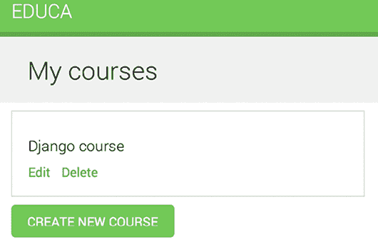

图 13.6：包含一个课程的教师课程页面

然后，点击你刚刚创建的课程**编辑**链接。你将再次看到表单，但这次，你是在编辑现有的`Course`对象，而不是创建一个新对象。

最后，编辑`courses/manage/course/delete.html`模板，并添加以下代码：

```py

Delete course

  <h1>Delete course "{{ object.title }}"</h1>
<div class="module">
<form action="" method="post">
      
      <p>Are you sure you want to delete "{{ object }}"?</p>
<input type="submit" value="Confirm">
</form>
</div>
 
```

这是`CourseDeleteView`视图的模板。这个视图继承自 Django 提供的`DeleteView`，它期望用户确认以删除对象。

在浏览器中打开课程列表，点击你课程的**删除**链接。你应该看到以下确认页面：

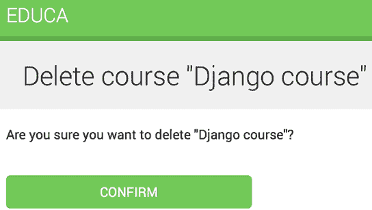

图 13.7：删除课程确认页面

点击**确认**按钮。课程将被删除，你将被重定向回课程列表页面。

现在，教师可以创建、编辑和删除课程。接下来，你需要为他们提供一个 CMS 来添加课程模块及其内容。你将首先管理课程模块。

# 管理课程模块及其内容

你将构建一个系统来管理课程模块及其内容。你需要构建可以用于管理每个课程中的多个模块以及每个模块的不同类型内容的表单。模块及其内容都需要遵循特定的顺序，并且你应该能够使用 CMS 重新排序它们。

## 使用表单集管理课程模块

Django 提供了一个抽象层，用于在同一页面上处理多个表单。这些表单组被称为*表单集*。表单集管理特定`Form`或`ModelForm`的多个实例。所有表单都会一次性提交，表单集负责显示表单的初始数量，限制可以提交的最大表单数量，并验证所有表单。

表单集包含一个`is_valid()`方法，可以一次性验证所有表单。你也可以为表单提供初始数据，并指定要显示的额外空表单的数量。你可以在[`docs.djangoproject.com/en/5.0/topics/forms/formsets/`](https://docs.djangoproject.com/en/5.0/topics/forms/formsets/)了解更多关于表单集的信息，以及在[`docs.djangoproject.com/en/5.0/topics/forms/modelforms/#model-formsets`](https://docs.djangoproject.com/en/5.0/topics/forms/modelforms/#model-formsets)了解更多关于模型表单集的信息。

由于课程被划分为可变数量的模块，因此使用表单集来管理它们是有意义的。在`courses`应用程序目录中创建一个`forms.py`文件，并将以下代码添加到其中：

```py
from django.forms.models import inlineformset_factory
from .models import Course, Module
ModuleFormSet = inlineformset_factory(
    Course,
    Module,
    fields=['title', 'description'],
    extra=2,
    can_delete=True
) 
```

这是 `ModuleFormSet` 表单集。你使用 Django 提供的 `inlineformset_factory()` 函数构建它。内联表单集是在表单集之上的一小部分抽象，它简化了与相关对象一起工作。此函数允许你动态地为与 `Course` 对象相关的 `Module` 对象构建模型表单集。

使用以下参数来构建表单集：

+   `fields`：将包含在表单集中的每个表单中的字段。

+   `extra`：允许你设置在表单集中显示的空额外表单的数量。

+   `can_delete`：如果你将其设置为 `True`，Django 将为每个表单包含一个布尔字段，该字段将渲染为复选框输入。它允许你标记你想要删除的对象。

编辑 `courses` 应用程序的 `views.py` 文件，并向其中添加以下代码：

```py
from django.shortcuts import get_object_or_404, redirect
from django.views.generic.base import TemplateResponseMixin, View
from .forms import ModuleFormSet
class CourseModuleUpdateView(TemplateResponseMixin, View):
    template_name = 'courses/manage/module/formset.html'
    course = None
def get_formset(self, data=None):
        return ModuleFormSet(instance=self.course, data=data)
    def dispatch(self, request, pk):
        self.course = get_object_or_404(
            Course, id=pk, owner=request.user
        )
        return super().dispatch(request, pk)
    def get(self, request, *args, **kwargs):
        formset = self.get_formset()
        return self.render_to_response(
            {'course': self.course, 'formset': formset}
        )
    def post(self, request, *args, **kwargs):
        formset = self.get_formset(data=request.POST)
        if formset.is_valid():
            formset.save()
            return redirect('manage_course_list')
        return self.render_to_response(
            {'course': self.course, 'formset': formset}
        ) 
```

`CourseModuleUpdateView` 视图处理表单集，为特定课程添加、更新和删除模块。此视图继承以下混合类和视图：

+   `TemplateResponseMixin`：此混合类负责渲染模板并返回 HTTP 响应。它需要一个 `template_name` 属性，该属性指示要渲染的模板，并提供 `render_to_response()` 方法，将上下文传递给它并渲染模板。

+   `View`：Django 提供的基本基于类的视图。

在此视图中，你实现以下方法：

+   `get_formset()`：你定义此方法以避免重复构建表单集的代码。你为给定的 `Course` 对象使用可选数据创建一个 `ModuleFormSet` 对象。

+   `dispatch()`：此方法由 `View` 类提供。它接受 HTTP 请求及其参数，并尝试将请求委派给与 HTTP 方法匹配的小写方法。`GET` 请求委派给 `get()` 方法，`POST` 请求委派给 `post()`，分别。在此方法中，你使用 `get_object_or_404()` 快捷函数获取属于当前用户的给定 `id` 参数的 `Course` 对象。你将此代码包含在 `dispatch()` 方法中，因为你需要为 `GET` 和 `POST` 请求检索课程。你将其保存到视图的 `course` 属性中，以便其他方法可以访问它。

+   `get()`：用于 `GET` 请求。你使用 `TemplateResponseMixin` 提供的 `render_to_response()` 方法构建一个空的 `ModuleFormSet` 表单集，并将其与当前 `Course` 对象一起渲染到模板中。

+   `post()`：用于 `POST` 请求。在此方法中，你执行以下操作：

    1.  使用提交的数据创建一个 `ModuleFormSet` 实例。

    1.  你执行表单集的 `is_valid()` 方法来验证其所有表单。

    1.  如果表单集有效，您通过调用`save()`方法来保存它。此时，任何更改，如添加、更新或标记模块为删除，都将应用到数据库中。然后，您将用户重定向到`manage_course_list` URL。如果表单集无效，您将渲染模板以显示任何错误。

编辑`courses`应用的`urls.py`文件，并向其中添加以下 URL 模式：

```py
path(
    '<pk>/module/',
    views.CourseModuleUpdateView.as_view(),
    name='course_module_update'
), 
```

在`courses/manage/`模板目录内创建一个新目录，命名为`module`。创建一个`courses/manage/module/formset.html`模板，并向其中添加以下代码：

```py


  Edit "{{ course.title }}"


  <h1>Edit "{{ course.title }}"</h1>
<div class="module">
<h2>Course modules</h2>
<form method="post">
      {{ formset }}
      {{ formset.management_form }}
      
      <input type="submit" value="Save modules">
</form>
</div>
 
```

在此模板中，您创建一个包含`formset`的`<form>` HTML 元素。您还包含表单集的管理表单，变量为`{{ formset.management_form }}`。管理表单包括隐藏字段，用于控制表单的初始、总数、最小和最大数量。

编辑`courses/manage/course/list.html`模板，并在课程**编辑**和**删除**链接下方添加以下链接到`course_module_update` URL：

```py
<a href="">Edit</a>
<a href="">Delete</a>
**<a href=****""****>Edit modules</a>** 
```

您已包含编辑课程模块的链接。

在您的浏览器中打开`http://127.0.0.1:8000/course/mine/`。创建一个课程并点击其**编辑模块**链接。您应该看到一个表单集，如下所示：

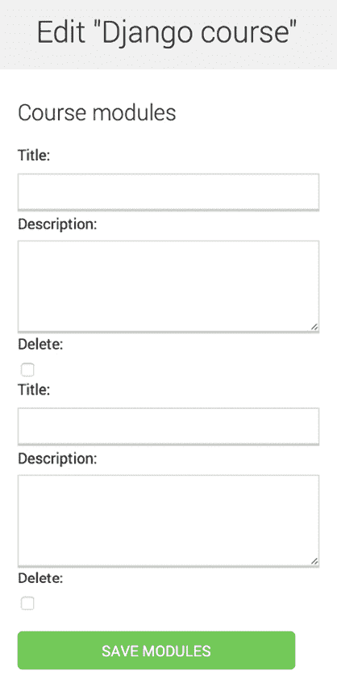

图 13.8：课程编辑页面，包括课程模块的表单集

表单集包含课程中每个`Module`对象对应的表单。之后，会显示两个额外的空表单，因为您为`ModuleFormSet`设置了`extra=2`。当您保存表单集时，Django 会包含另外两个额外的字段来添加新模块。

您可以看到，表单集对于在单个页面上管理多个表单实例来说非常有用。表单集简化了从类似表单集中收集和验证数据的过程。

在了解表单集的工作原理后，您将通过创建动态表单来探索高级表单功能，这些表单可以适应将要添加到课程模块的各种内容类型。

## 添加课程模块内容

现在，您需要一种方法来添加课程模块的内容。您有四种不同类型的内容：文本、视频、图像和文件。您可以考虑创建四个不同的视图来创建内容，每个模型一个表单。然而，您将采取更灵活的方法，创建一个可以处理任何内容模型对象的创建或更新视图。您将根据讲师想要添加到课程中的内容类型（`Text`、`Video`、`Image`或`File`）动态构建此视图的表单。

编辑`courses`应用的`views.py`文件，并向其中添加以下代码：

```py
from django.apps import apps
from django.forms.models import modelform_factory
from .models import Module, Content
class ContentCreateUpdateView(TemplateResponseMixin, View):
    module = None
    model = None
    obj = None
    template_name = 'courses/manage/content/form.html'
def get_model(self, model_name):
        if model_name in ['text', 'video', 'image', 'file']:
            return apps.get_model(
                app_label='courses', model_name=model_name
            )
        return None
def get_form(self, model, *args, **kwargs):
        Form = modelform_factory(
            model, exclude=['owner', 'order', 'created', 'updated']
        )
        return Form(*args, **kwargs)
    def dispatch(self, request, module_id, model_name, id=None):
        self.module = get_object_or_404(
            Module, id=module_id, course__owner=request.user
        )
        self.model = self.get_model(model_name)
        if id:
            self.obj = get_object_or_404(
                self.model, id=id, owner=request.user
            )
        return super().dispatch(request, module_id, model_name, id) 
```

这是`ContentCreateUpdateView`的第一部分。它将允许您创建和更新不同模型的内 容。此视图定义了以下方法：

+   `get_model()`: 在这里，你检查给定的模型名称是否是以下四种内容模型之一：`Text`、`Video`、`Image` 或 `File`。然后，你使用 Django 的 `apps` 模块来获取给定模型名称的实际类。如果给定的模型名称不是有效的之一，你返回 `None`。

+   `get_form()`: 你使用表单框架的 `modelform_factory()` 函数构建一个动态表单。由于你将构建 `Text`、`Video`、`Image` 和 `File` 模型的表单，你使用 `exclude` 参数指定要排除的公共字段，并让所有其他属性自动包含。这样做，你不必知道根据模型要包含哪些字段。

+   `dispatch()`: 这接收以下 URL 参数并将相应的模块、模型和内容对象存储为类属性：

    +   `module_id`: 与内容关联的模块的 ID。

    +   `model_name`: 要创建/更新的内容的模型名称。

    +   `id`: 正在更新的对象的 ID。创建新对象时为 `None`。

将以下 `get()` 和 `post()` 方法添加到 `ContentCreateUpdateView`：

```py
def get(self, request, module_id, model_name, id=None):
    form = self.get_form(self.model, instance=self.obj)
    return self.render_to_response(
        {'form': form, 'object': self.obj}
    )
def post(self, request, module_id, model_name, id=None):
    form = self.get_form(
        self.model,
        instance=self.obj,
        data=request.POST,
        files=request.FILES
    )
    if form.is_valid():
        obj = form.save(commit=False)
        obj.owner = request.user
        obj.save()
        if not id:
            # new content
            Content.objects.create(module=self.module, item=obj)
        return redirect('module_content_list', self.module.id)
    return self.render_to_response(
        {'form': form, 'object': self.obj}
    ) 
```

这些方法如下：

+   `get()`: 当接收到 `GET` 请求时执行。你为正在更新的 `Text`、`Video`、`Image` 或 `File` 实例构建模型表单。否则，由于没有提供 ID，`self.obj` 为 `None`，因此不传递任何实例以创建新对象。

+   `post()`: 当接收到 `POST` 请求时执行。你构建模型表单，将任何提交的数据和文件传递给它。然后，你验证它。如果表单有效，你创建一个新的对象，并将 `request.user` 分配为其所有者，然后将其保存到数据库中。你检查 `id` 参数。如果没有提供 ID，你知道用户正在创建一个新的对象而不是更新现有的一个。如果是新对象，你为给定的模块创建一个 `content` 对象，并将新的内容与之关联。

编辑 `courses` 应用程序的 `urls.py` 文件，并向其中添加以下 URL 模式：

```py
path(
    'module/<int:module_id>/content/<model_name>/create/',
    views.ContentCreateUpdateView.as_view(),
    name='module_content_create'
),
path(
    'module/<int:module_id>/content/<model_name>/<id>/',
    views.ContentCreateUpdateView.as_view(),
    name='module_content_update'
), 
```

新的 URL 模式如下：

+   `module_content_create`: 创建新的文本、视频、图像或文件对象并将它们添加到模块中。它包括 `module_id` 和 `model_name` 参数。前者允许你将新的内容对象链接到给定的模块。后者指定要构建表单的内容模型。

+   `module_content_update`: 更新现有的文本、视频、图像或文件对象。它包括 `module_id` 和 `model_name` 参数以及一个 `id` 参数来标识正在更新的内容。

在 `courses/manage/` 模板目录内创建一个新的目录，并命名为 `content`。创建模板 `courses/manage/content/form.html` 并向其中添加以下代码：

```py


  
    Edit content "{{ object.title }}"
  
    Add new content
  


  <h1>
    
      Edit content "{{ object.title }}"
    
      Add new content
    
  </h1>
<div class="module">
<h2>Course info</h2>
<form action="" method="post" enctype="multipart/form-data">
      {{ form.as_p }}
      
      <p><input type="submit" value="Save content"></p>
</form>
</div>
 
```

这是 `ContentCreateUpdateView` 视图的模板。在此模板中，你检查 `object` 变量是否存在于上下文中。如果 `object` 存在于上下文中，你正在更新现有对象。否则，你正在创建一个新对象。

你在 `<form>` HTML 元素中包含 `enctype="multipart/form-data"`，因为表单包含用于 `File` 和 `Image` 内容模型的文件上传。

运行开发服务器，打开 `http://127.0.0.1:8000/course/mine/`，点击现有课程的 **编辑模块**，创建一个模块。

然后，使用以下命令打开 Python shell：

```py
python manage.py shell 
```

按照以下方式获取最近创建的模块的 ID：

```py
>>> from courses.models import Module
>>> Module.objects.latest('id').id
6 
```

运行开发服务器，并在浏览器中打开 `http://127.0.0.1:8000/course/module/6/content/image/create/`，将模块 ID 替换为你之前获得的 ID。你将看到创建 `Image` 对象的表单，如下所示：

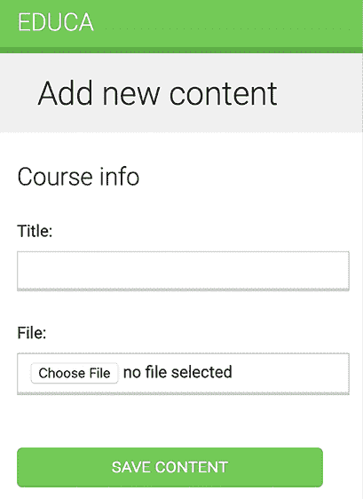

图 13.9：课程添加新内容表单

还未提交表单。如果你这样做，它将失败，因为你还没有定义 `module_content_list` URL。你将在稍后创建它。

你还需要一个用于删除内容的视图。编辑 `courses` 应用程序的 `views.py` 文件，并向其中添加以下代码：

```py
class ContentDeleteView(View):
    def post(self, request, id):
        content = get_object_or_404(
            Content, id=id, module__course__owner=request.user
        )
        module = content.module
        content.item.delete()
        content.delete()
        return redirect('module_content_list', module.id) 
```

`ContentDeleteView` 类通过给定的 ID 获取 `content` 对象。它删除相关的 `Text`、`Video`、`Image` 或 `File` 对象。最后，它删除 `content` 对象并将用户重定向到 `module_content_list` URL 以列出模块的其他内容。

编辑 `courses` 应用程序的 `urls.py` 文件，并向其中添加以下 URL 模式：

```py
path(
    'content/<int:id>/delete/',
    views.ContentDeleteView.as_view(),
    name='module_content_delete'
), 
```

现在，讲师可以轻松地创建、更新和删除内容。在本节中学到的这种方法对于以通用方式管理具有多种数据的形式非常有用。此方法可以应用于需要灵活解决方案来处理数据输入的其他情况。

在下一节中，我们将创建用于显示课程模块和内容的视图和模板。

## 管理模块及其内容

你已经创建了用于创建、编辑和删除课程模块及其内容的视图。接下来，你需要一个视图来显示课程的所有模块并列出特定模块的内容。

编辑 `courses` 应用程序的 `views.py` 文件，并向其中添加以下代码：

```py
class ModuleContentListView(TemplateResponseMixin, View):
    template_name = 'courses/manage/module/content_list.html'
def get(self, request, module_id):
        module = get_object_or_404(
            Module, id=module_id, course__owner=request.user
        )
        return self.render_to_response({'module': module}) 
```

这是 `ModuleContentListView` 视图。此视图获取属于当前用户的给定 ID 的 `Module` 对象，并渲染一个包含给定模块的模板。

编辑 `courses` 应用程序的 `urls.py` 文件，并向其中添加以下 URL 模式：

```py
path(
    'module/<int:module_id>/',
    views.ModuleContentListView.as_view(),
    name='module_content_list'
), 
```

在 `templates/courses/manage/module/` 目录中创建一个新的模板，并将其命名为 `content_list.html`。向其中添加以下代码：

```py


  Module {{ module.order|add:1 }}: {{ module.title }}



  <h1>Course "{{ course.title }}"</h1>
<div class="contents">
<h3>Modules</h3>
<ul id="modules">
      
        <li data-id="{{ m.id }}" 
 class="selected">
<a href="">
<span>
              Module <span class="order">{{ m.order|add:1 }}</span>
</span>
<br>
            {{ m.title }}
          </a>
</li>
      
        <li>No modules yet.</li>
      
    </ul>
<p><a href="">
    Edit modules</a></p>
</div>
<div class="module">
<h2>Module {{ module.order|add:1 }}: {{ module.title }}</h2>
<h3>Module contents:</h3>
<div id="module-contents">
      
        <div data-id="{{ content.id }}">
          
            <p>{{ item }}</p>
<a href="#">Edit</a>
<form action=""
 method="post">
<input type="submit" value="Delete">
              
            </form>
          
        </div>
      
        <p>This module has no contents yet.</p>
      
    </div>
<h3>Add new content:</h3>
<ul class="content-types">
<li>
<a href="">
          Text
        </a>
</li>
<li>
<a href="">
          Image
        </a>
</li>
<li>
<a href="">
          Video
        </a>
</li>
<li>
<a href="">
          File
        </a>
</li>
</ul>
</div>

 
```

确保没有模板标签被拆分到多行；Django 模板引擎期望标签被明确定义且不间断。

这是显示课程所有模块及其所选模块内容的模板。你遍历课程模块以在侧边栏中显示它们。你遍历模块的内容并访问`content.item`以获取相关的`Text`、`Video`、`Image`或`File`对象。你还可以包括创建新的文本、视频、图像或文件内容的链接。

你想知道每个`item`对象是哪种类型：`Text`、`Video`、`Image`或`File`。你需要模型名称来构建编辑对象的 URL。除此之外，你还可以根据内容类型在模板中不同地显示每个项目。你可以从模型的`Meta`类通过访问对象的后缀`_meta`属性来获取对象的模型名称。然而，Django 不允许你在模板中访问以下划线开头的变量或属性，以防止检索私有属性或调用私有方法。你可以通过编写自定义模板过滤器来解决这个问题。

在`courses`应用程序目录内创建以下文件结构：

```py
templatetags/
    __init__.py
    course.py 
```

编辑`course.py`模块并向其中添加以下代码：

```py
from django import template
register = template.Library()
@register.filter
def model_name(obj):
    try:
        return obj._meta.model_name
    except AttributeError:
        return None 
```

这是`model_name`模板过滤器。你可以在模板中将其应用为`object|model_name`以获取对象的模型名称。

编辑`templates/courses/manage/module/content_list.html`模板并在``模板标签下方添加以下行：

```py
 
```

这将加载`course`模板标签。然后，找到以下行：

```py
<p>{{ item }}</p>
<a href="#">Edit</a> 
```

将它们替换为以下内容：

```py
<p>{{ item }} **({{ item|model_name }})**</p>
<a href="****">
  Edit
</a> 
```

在前面的代码中，你在模板中显示项目模型名称，并使用模型名称来构建编辑对象的链接。

编辑`courses/manage/course/list.html`模板并添加对`module_content_list` URL 的链接，如下所示：

```py
<a href="">Edit modules</a>
****
**<****a****href****=****""****>**
 **Manage contents**
**</****a****>**
**** 
```

新的链接允许用户访问课程的第一个模块内容（如果有）。

停止开发服务器并使用以下命令重新运行它：

```py
python manage.py runserver 
```

通过停止并运行开发服务器，你可以确保`course`模板标签文件被加载。

打开`http://127.0.0.1:8000/course/mine/`并点击包含至少一个模块的课程中的**管理内容**链接。你会看到一个如下所示的页面：

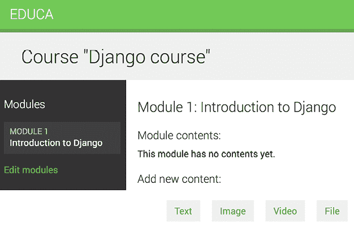

图 13.10：管理课程模块内容页面

当你在左侧侧边栏中点击一个模块时，其内容将在主区域中显示。模板还包括为显示的模块添加新的文本、视频、图像或文件内容的链接。

向模块添加几种不同类型的内容并查看结果。模块内容将出现在**模块内容**下方：

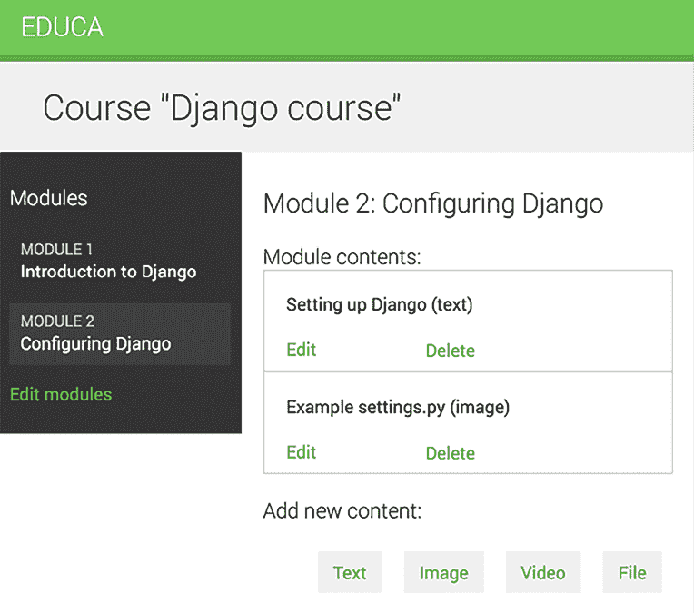

图 13.11：管理不同的模块内容

接下来，我们将允许课程讲师通过简单的拖放功能重新排序模块和模块内容。

# 重新排序模块及其内容

我们将实现一个 JavaScript 拖放功能，允许课程讲师通过拖动来重新排序课程模块。拖放功能增强了用户界面，提供了一种比使用数字或点击按钮更直观的自然排序元素方式。它也是课程讲师的省时工具，使他们能够轻松重新组织课程模块及其内容。

为了实现这个功能，我们将使用 HTML5 Sortable 库，它简化了使用原生 HTML5 拖放 API 创建可排序列表的过程。

当用户完成拖动模块后，您将使用 JavaScript Fetch API 向存储新模块顺序的服务器发送异步 HTTP 请求。

您可以在[`www.w3schools.com/html/html5_draganddrop.asp`](https://www.w3schools.com/html/html5_draganddrop.asp)上阅读有关 HTML5 拖放 API 的更多信息。您可以在[`lukasoppermann.github.io/html5sortable/`](https://lukasoppermann.github.io/html5sortable/)找到使用 HTML5 Sortable 库构建的示例。HTML5 Sortable 库的文档可在[`github.com/lukasoppermann/html5sortable`](https://github.com/lukasoppermann/html5sortable)找到。

让我们实现更新课程模块和模块内容顺序的视图。

## 使用`django-braces`的混入类

`django-braces`是一个第三方模块，其中包含了一组 Django 通用的混入类。这些混入类为基于类的视图提供了额外的功能，这些功能在多种常见场景中非常有用。您可以在[`django-braces.readthedocs.io/`](https://django-braces.readthedocs.io/)查看`django-braces`提供的所有混入类的列表。

您将使用以下`django-braces`的混入类：

+   `CsrfExemptMixin`：用于避免在`POST`请求中检查**跨站请求伪造**（**CSRF**）令牌。您需要这个混入类来执行不需要传递`csrf_token`的 AJAX `POST`请求。

+   `JsonRequestResponseMixin`：将请求数据解析为 JSON，并将响应序列化为 JSON，并返回一个带有`application/json`内容类型的 HTTP 响应。

使用以下命令通过`pip`安装`django-braces`：

```py
python -m pip install django-braces==1.15.0 
```

您需要一个视图来接收编码为 JSON 的模块 ID 的新顺序，并相应地更新顺序。编辑`courses`应用的`views.py`文件，并向其中添加以下代码：

```py
from braces.views import CsrfExemptMixin, JsonRequestResponseMixin
class ModuleOrderView(CsrfExemptMixin, JsonRequestResponseMixin, View):
    def post(self, request):
        for id, order in self.request_json.items():
            Module.objects.filter(
                id=id, course__owner=request.user
            ).update(order=order)
        return self.render_json_response({'saved': 'OK'}) 
```

这是`ModuleOrderView`视图，它允许您更新课程模块的顺序。

您可以构建一个类似的视图来排序模块的内容。将以下代码添加到`views.py`文件中：

```py
class ContentOrderView(CsrfExemptMixin, JsonRequestResponseMixin, View):
    def post(self, request):
        for id, order in self.request_json.items():
            Content.objects.filter(
                id=id, module__course__owner=request.user
            ).update(order=order)
        return self.render_json_response({'saved': 'OK'}) 
```

现在，编辑`courses`应用的`urls.py`文件，并向其中添加以下 URL 模式：

```py
path(
    'module/order/',
    views.ModuleOrderView.as_view(),
    name='module_order'
),
path(
    'content/order/',
    views.ContentOrderView.as_view(),
    name='content_order'
), 
```

最后，你需要在模板中实现拖放功能。我们将使用 HTML5 Sortable 库，它简化了使用标准 HTML 拖放 API 创建可排序元素。还有其他 JavaScript 库可以实现相同的功能，但我们选择了 HTML5 Sortable，因为它轻量级且利用了原生的 HTML5 拖放 API。

编辑位于 `courses` 应用程序 `templates/` 目录中的 `base.html` 模板，并添加以下加粗显示的块：

```py

<!DOCTYPE html>
<html>
<head>
    # ...
  </head>
<body>
<div id="header">
      # ...
    </div>
<div id="content">
      
      
    </div>
 ****
 ****
<script>
 document.addEventListener('DOMContentLoaded', (event) => {
 // DOM loaded
        
        
      })
 </script>
</body>
</html> 
```

这个名为 `include_js` 的新块将允许你在扩展 `base.html` 模板的任何模板中插入 JavaScript 文件。

接下来，编辑 `courses/manage/module/content_list.html` 模板，并将以下加粗显示的代码添加到模板底部：

```py
# ...

  # ...

****
**<****script****src****=****"https://cdnjs.cloudflare.com/ajax/libs/html5sortable/0.13.3/html5sortable.min.js"****></****script****>**
**** 
```

在此代码中，你从公共 **内容分发网络**（**CDN**）加载了 HTML5 Sortable 库。记住，你在 *第六章*，*在您的网站上共享内容* 中之前已经从一个 CDN 加载了一个 JavaScript 库。

现在将以下加粗显示的 `domready` 块添加到 `courses/manage/module/content_list.html` 模板中：

```py
# ...

  # ...


  <script src="img/html5sortable.min.js"></script>

****
 **var options = {**
 **method: 'POST',**
 **mode: 'same-origin'**
 **}**
 **const moduleOrderUrl = '';**
**** 
```

在这些新行中，你向在 `base.html` 模板中 `DOMContentLoaded` 事件监听器中定义的 `` 块中添加 JavaScript 代码。这保证了你的 JavaScript 代码将在页面加载后执行。使用此代码，你定义了将实现模块排序的 HTTP 请求的选项。你将使用 Fetch API 发送 `POST` 请求来更新模块顺序。`module_order` URL 路径由 JavaScript 常量 `moduleOrderUrl` 构建。

将以下加粗显示的代码添加到 `domready` 块中：

```py

  var options = {
      method: 'POST',
      mode: 'same-origin'
  }
  const moduleOrderUrl = '';
 **sortable('#modules', {**
 **forcePlaceholderSize: true,**
 **placeholderClass: 'placeholder'**
 **});**
 
```

在新代码中，你为具有 `id="modules"` 的 HTML 元素定义了一个 `sortable` 元素，这是侧边栏中的模块列表。记住，你使用 CSS 选择器 `#` 来选择具有给定 `id` 的元素。当你开始拖动一个项目时，HTML5 Sortable 库创建一个占位符项目，这样你可以轻松地看到元素将被放置的位置。

你将 `forcePlacehoderSize` 选项设置为 `true`，以强制占位符元素具有高度，并使用 `placeholderClass` 来定义占位符元素的 CSS 类。你使用在 `base.html` 模板中加载的 `css/base.css` 静态文件中定义的名为 `placeholder` 的类。

在你的浏览器中打开 `http://127.0.0.1:8000/course/mine/`，然后点击任何课程的 **管理内容**。现在，你可以将课程模块拖放到左侧边栏中，如图 *13.12* 所示：

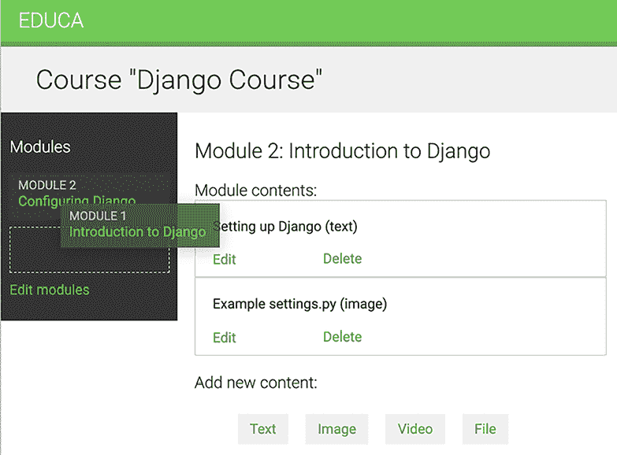

图 13.12：使用拖放功能重新排序模块

当你拖动元素时，你会看到 Sortable 库创建的占位符项，它有一个虚线边框。占位符元素允许你识别拖动元素将要放置的位置。

当你将模块拖动到不同的位置时，你需要向服务器发送一个 HTTP 请求来存储新的顺序。这可以通过将事件处理器附加到可排序元素，并使用 JavaScript Fetch API 向服务器发送请求来实现。

编辑 `courses/manage/module/content_list.html` 模板的 `domready` 块，并添加以下加粗代码：

```py

  var options = {
      method: 'POST',
      mode: 'same-origin'
  }
  const moduleOrderUrl = '';
  sortable('#modules', {
    forcePlaceholderSize: true,
    placeholderClass: 'placeholder'
  })**[0].addEventListener('sortupdate', function(e) {**
 **modulesOrder = {};**
 **var modules = document.querySelectorAll('#modules li');**
 **modules.forEach(function (module, index) {**
 **// update module index**
 **modulesOrder[module.dataset.id] = index;**
 **// update index in HTML element**
 **module.querySelector('.order').innerHTML = index + 1;**
 **});**
 **// add new order to the HTTP request options**
 **options['body'] = JSON.stringify(modulesOrder);**
 **// send HTTP request**
 **fetch(moduleOrderUrl, options)**
 **});**
 
```

在新代码中，为可排序元素的 `sortupdate` 事件创建了一个事件监听器。当元素被拖放到不同的位置时，会触发 `sortupdate` 事件。在事件函数中执行以下任务：

1.  创建一个空的 `modulesOrder` 字典。这个字典的键将是模块 ID，值将包含每个模块的索引。

1.  使用 `document.querySelectorAll()` 选择 `#modules` HTML 元素的列表项，使用 `#modules li` CSS 选择器。

1.  `forEach()` 用于遍历列表中的每个元素。

1.  将每个模块的新索引存储在 `modulesOrder` 字典中。通过访问 `module.dataset.id` 从 HTML 的 `data-id` 属性中检索每个模块的 ID。你使用 ID 作为 `modulesOrder` 字典的键，并将模块的新索引作为值。

1.  通过选择具有 `order` CSS 类的元素来更新每个模块显示的顺序。由于索引是从零开始的，而我们想显示基于一的索引，所以我们向 `index` 添加 `1`。

1.  在 `options` 字典中添加一个名为 `body` 的键，其中包含 `modulesOrder` 中的新顺序。`JSON.stringify()` 方法将 JavaScript 对象转换为 JSON 字符串。这是更新模块顺序的 HTTP 请求的正文。

1.  通过创建一个 `fetch()` HTTP 请求来更新模块顺序。与 `module_order` URL 对应的 `ModuleOrderView` 视图负责更新模块的顺序。

你现在可以拖放模块。当你完成模块的拖动后，会向 `module_order` URL 发送一个 HTTP 请求来更新模块的顺序。如果你刷新页面，最新的模块顺序将被保留，因为它已在数据库中更新。*图 13.13* 展示了使用拖放排序后侧边栏中模块的不同顺序：

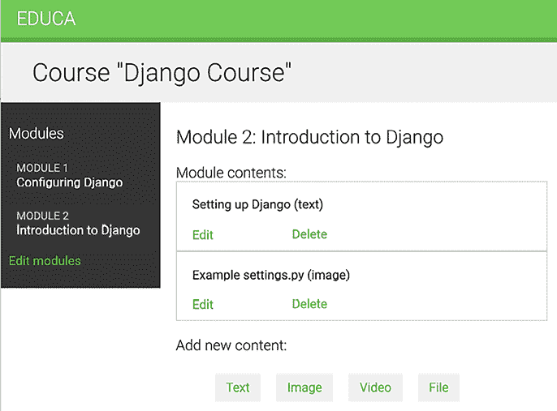

图 13.13：重新排列模块后的新顺序

如果遇到任何问题，请记住使用浏览器开发者工具来调试 JavaScript 和 HTTP 请求。通常，你可以在网站上任何地方右键单击以打开上下文菜单，然后单击 **Inspect** 或 **Inspect Element** 以访问浏览器的网络开发者工具。

让我们添加相同的拖放功能，以便课程讲师可以排序模块内容。

编辑`courses/manage/module/content_list.html`模板中的`domready`块，并添加以下加粗的代码：

```py

  // ...
 **const contentOrderUrl = '';**
 **sortable('#module-contents', {**
 **forcePlaceholderSize: true,**
 **placeholderClass: 'placeholder'**
 **})[0].addEventListener('sortupdate', function(e) {**
 **contentOrder = {};**
 **var contents = document.querySelectorAll('#module-contents div');**
 **contents.forEach(function (content, index) {**
 **// update content index**
 **contentOrder[content.dataset.id] = index;**
 **});**
 **// add new order to the HTTP request options**
 **options['body'] = JSON.stringify(contentOrder);**
 **// send HTTP request**
 **fetch(contentOrderUrl, options)**
 **});**
 
```

在这种情况下，您使用`content_order` URL 而不是`module_order`，并在具有 ID `module-contents`的 HTML 元素上构建`sortable`功能。该功能与排序课程模块的功能基本相同。在这种情况下，您不需要更新内容的编号，因为它们不包含任何可见的索引。

现在，您可以拖放模块和模块内容，如图 13.14 所示：

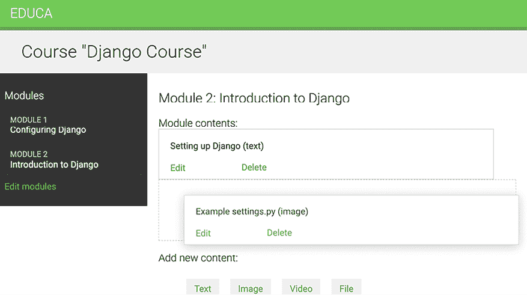

图 13.14：使用拖放功能重新排序模块内容

太棒了！您为课程讲师构建了一个非常通用的 CMS。

# 摘要

在本章中，您学习了如何使用基于类的视图和混入创建 CMS。您获得了可重用性和模块化知识，这些知识可以应用于您未来的应用程序。您还与组和权限一起工作，以限制对视图的访问，深入了解安全性和如何控制数据上的操作。您学习了如何使用表单集和模型表单集以灵活的方式管理课程模块及其内容。您还使用 JavaScript 构建了拖放功能，以改进用户界面重新排序课程模块及其内容。

在下一章中，您将创建学生注册系统并管理学生课程的注册。您还将学习如何渲染不同类型的内容，并通过使用 Django 的缓存框架缓存内容来提高应用程序的性能。

# 其他资源

以下资源提供了与本章涵盖主题相关的额外信息：

+   本章源代码：[`github.com/PacktPublishing/Django-5-by-example/tree/main/Chapter13`](https://github.com/PacktPublishing/Django-5-by-example/tree/main/Chapter13)

+   Django 混入文档：[`docs.djangoproject.com/en/5.0/topics/class-based-views/mixins/`](https://docs.djangoproject.com/en/5.0/topics/class-based-views/mixins/)

+   Neapolitan 包用于创建 CRUD 视图：[`github.com/carltongibson/neapolitan`](https://github.com/carltongibson/neapolitan)

+   创建自定义权限：[`docs.djangoproject.com/en/5.0/topics/auth/customizing/#custom-permissions`](https://docs.djangoproject.com/en/5.0/topics/auth/customizing/#custom-permissions)

+   Django 表单集：[`docs.djangoproject.com/en/5.0/topics/forms/formsets/`](https://docs.djangoproject.com/en/5.0/topics/forms/formsets/)

+   Django 模型表单集：[`docs.djangoproject.com/en/5.0/topics/forms/modelforms/#model-formsets`](https://docs.djangoproject.com/en/5.0/topics/forms/modelforms/#model-formsets)

+   HTML5 拖放 API：[`www.w3schools.com/html/html5_draganddrop.asp`](https://www.w3schools.com/html/html5_draganddrop.asp)

+   HTML5 可排序库文档：[`github.com/lukasoppermann/html5sortable`](https://github.com/lukasoppermann/html5sortable)

+   HTML5 可排序库示例：[`lukasoppermann.github.io/html5sortable`](https://lukasoppermann.github.io/html5sortable)/

+   `django-braces` 文档：[`django-braces.readthedocs.io/`](https://django-braces.readthedocs.io/)
