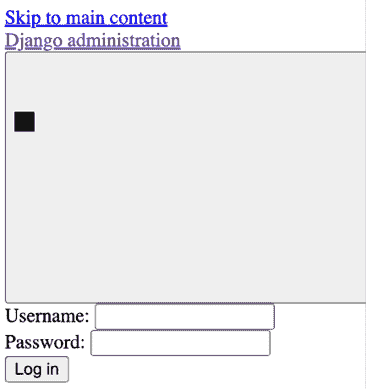
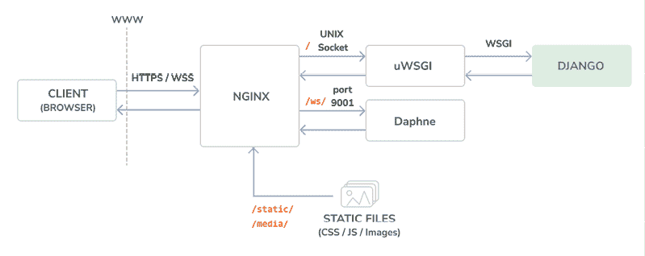
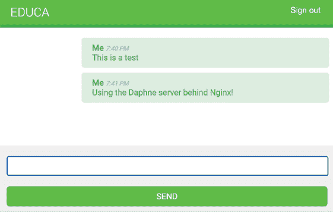
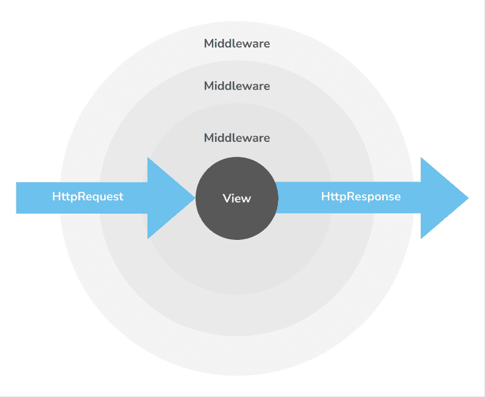

# 第十七章：上线

在上一章中，您使用 Django Channels 为学生们构建了一个实时聊天服务器。现在，您已经创建了一个功能齐全的在线学习平台，您需要设置一个生产环境，以便它可以通过互联网访问。到目前为止，您一直在开发环境中工作，使用 Django 开发服务器运行您的网站。在本章中，您将学习如何设置一个能够以安全高效的方式服务 Django 项目的生产环境。

本章将涵盖以下主题：

+   为多个环境配置 Django 设置

+   使用 Docker Compose 运行多个服务

+   使用 uWSGI 和 Django 设置 Web 服务器

+   使用 Docker Compose 服务 PostgreSQL 和 Redis

+   使用 Django 系统检查框架

+   使用 Docker 服务 NGINX

+   通过 NGINX 服务静态资源

+   通过**传输层安全性**（**TLS**）/ **安全套接字层**（**SSL**）来保护连接

+   使用 Daphne **异步服务器网关接口**（**ASGI**）服务器为 Django Channels 服务

+   创建自定义 Django 中间件

+   实现自定义 Django 管理命令

在前面的章节中，开头的图表代表了视图、模板和端到端功能。然而，本章的重点转向了设置生产环境。相反，您将在本章中找到特定的图表来展示环境设置。

本章的源代码可以在[`github.com/PacktPublishing/Django-5-by-example/tree/main/Chapter17`](https://github.com/PacktPublishing/Django-5-by-example/tree/main/Chapter17)找到。

本章中使用的所有 Python 模块都包含在本章源代码中的`requirements.txt`文件中。您可以根据以下说明安装每个 Python 模块，或者可以使用`python -m pip install -r requirements.txt`命令一次性安装所有依赖。

# 创建生产环境

是时候在生产环境中部署您的 Django 项目了。您将首先为多个环境配置 Django 设置，然后设置一个生产环境。

## 管理多个环境的设置

在现实世界的项目中，您将不得不处理多个环境。您通常至少需要一个用于开发的本地环境和一个用于服务应用程序的生产环境。您还可以有其他环境，例如测试或预发布环境。

一些项目设置将适用于所有环境，但其他设置将针对每个环境特定。通常，您将使用一个定义通用设置的基文件，以及每个环境的设置文件，该文件覆盖必要的设置并定义额外的设置。

我们将管理以下环境：

+   `local`：在您的机器上运行项目的本地环境

+   `prod`：将您的项目部署到生产服务器的环境

在`educa`项目的`settings.py`文件旁边创建一个`settings/`目录。将`settings.py`文件重命名为`base.py`并将其移动到新的`settings/`目录中。

在`settings/`文件夹内创建以下附加文件，以便新的目录看起来如下：

```py
settings/
    __init__.py
    base.py
    local.py
    prod.py 
```

这些文件如下：

+   `base.py`：基础设置文件，其中包含常用设置（之前为`settings.py`）

+   `local.py`：本地环境的自定义设置

+   `prod.py`：生产环境的自定义设置

您已将设置文件移动到一级以下的目录，因此您需要更新`settings/base.py`文件中的`BASE_DIR`设置以指向主项目目录。

在处理多个环境时，创建一个基础设置文件和每个环境的设置文件。环境设置文件应继承常用设置并覆盖特定环境的设置。

编辑`settings/base.py`文件并替换以下行：

```py
BASE_DIR = Path(__file__).resolve().parent.parent 
```

将前面的行替换为以下一行：

```py
BASE_DIR = Path(__file__).resolve().parent.parent**.parent** 
```

您通过在`BASE_DIR`路径中添加`.parent`来指向一个目录以上。让我们配置本地环境的设置。

### 本地环境设置

对于`DEBUG`和`DATABASES`设置，您将明确为每个环境定义它们，而不是使用默认配置。这些设置将针对特定环境。编辑`educa/settings/local.py`文件并添加以下行：

```py
from .base import *
DEBUG = True
DATABASES = {
    'default': {
        'ENGINE': 'django.db.backends.sqlite3',
        'NAME': BASE_DIR / 'db.sqlite3',
    }
} 
```

这是您本地环境的设置文件。在此文件中，您导入在`base.py`文件中定义的所有设置，并为该环境定义`DEBUG`和`DATABASES`设置。`DEBUG`和`DATABASES`设置与您用于开发的设置相同。

现在，从`base.py`设置文件中删除`DATABASES`和`DEBUG`设置。

Django 管理命令不会自动检测要使用的设置文件，因为项目设置文件不是默认的`settings.py`文件。在运行管理命令时，您需要通过添加`--settings`选项来指明您想要使用的设置模块，如下所示：

```py
python manage.py runserver --settings=educa.settings.local 
```

接下来，我们将验证项目和本地环境配置。

### 运行本地环境

让我们使用新的设置结构运行本地环境。请确保 Redis 正在运行或使用以下命令在 shell 中启动 Redis Docker 容器：

```py
docker run -it --rm --name redis -p 6379:6379 redis:7.2.4 
```

在另一个 shell 中，从项目目录运行以下管理命令：

```py
python manage.py runserver --settings=educa.settings.local 
```

在您的浏览器中打开`http://127.0.0.1:8000/`并检查网站是否正确加载。您现在正在使用`local`环境的设置来提供您的网站。

如果您不想每次运行管理命令时都传递`--settings`选项，您可以定义`DJANGO_SETTINGS_MODULE`环境变量。Django 将使用它来识别要使用的设置模块。如果您使用 Linux 或 macOS，您可以在 shell 中执行以下命令来定义环境变量：

```py
export DJANGO_SETTINGS_MODULE=educa.settings.local 
```

如果你使用的是 Windows，你可以在 shell 中执行以下命令：

```py
set DJANGO_SETTINGS_MODULE=educa.settings.local 
```

在此之后执行的任何管理命令都将使用在 `DJANGO_SETTINGS_MODULE` 环境变量中定义的设置。

通过按 *Ctrl* + *C* 键从 shell 中停止 Django 开发服务器，并按同样方式按 *Ctrl* + *C* 键停止 Redis Docker 容器。

本地环境运行良好。让我们为生产环境准备设置。

### 生产环境设置

让我们从为生产环境添加初始设置开始。编辑 `educa/settings/prod.py` 文件，使其看起来如下所示：

```py
from .base import *
DEBUG = False
ADMINS = [
    ('Antonio M', 'email@mydomain.com'),
]
ALLOWED_HOSTS = ['*']
DATABASES = {
    'default': {
        'ENGINE': 'django.db.backends.sqlite3',
        NAME: BASE_DIR / 'db.sqlite3',
    }
} 
```

这些是生产环境的设置：

+   `DEBUG`: 对于任何生产环境，将 `DEBUG` 设置为 `False` 是必要的。未能这样做会导致跟踪信息以及敏感的配置数据暴露给每个人。

+   `ADMINS`: 当 `DEBUG` 为 `False` 并且一个视图引发异常时，所有信息将通过电子邮件发送到 `ADMINS` 设置中列出的人员。请确保用你自己的信息替换名称/电子邮件元组。

+   `ALLOWED_HOSTS`: 由于安全原因，Django 将只允许包含在此列表中的主机来服务项目。目前，你通过使用星号符号 `*` 允许所有主机。你将在稍后限制可用于服务项目的宿主机的数量。

+   `DATABASES`: 你保留 `default` 数据库设置，指向本地环境的 SQLite 数据库。你将在稍后配置生产数据库。

在本章接下来的部分，你将完成生产环境的设置文件。

你已经成功组织了处理多个环境的设置。现在，你将通过使用 Docker 设置不同的服务来构建一个完整的生产环境。

# 使用 Docker Compose

你最初在 *第三章*，*扩展你的博客应用程序* 中使用了 Docker，并且你一直在使用 Docker 在这本书中运行不同服务的容器，例如 PostgreSQL、Redis 和 RabbitMQ。

每个 Docker 容器将应用程序源代码与运行应用程序所需的操作系统库和依赖项结合起来。通过使用应用程序容器，你可以提高应用程序的可移植性。对于生产环境，我们将使用 Docker Compose 来构建和运行多个 Docker 容器。

Docker Compose 是一个用于定义和运行多容器应用程序的工具。你可以创建一个配置文件来定义不同的服务，并使用单个命令从你的配置中启动所有服务。你可以在 [`docs.docker.com/compose/`](https://docs.docker.com/compose/) 找到有关 Docker Compose 的信息。

对于生产环境，你将创建一个在多个 Docker 容器中运行的分发应用程序。每个 Docker 容器将运行不同的服务。你将最初定义以下三个服务，你将在下一节中添加更多服务：

+   **Web 服务**：用于服务 Django 项目的 Web 服务器

+   **数据库服务**：运行 PostgreSQL 的数据库服务

+   **缓存服务**：运行 Redis 的服务

让我们从安装 Docker Compose 开始。

## 通过 Docker Desktop 安装 Docker Compose

你可以在 macOS、64 位 Linux 和 Windows 上运行 Docker Compose。安装 Docker Compose 最快的方式是通过安装 Docker Desktop。安装包括 Docker Engine、命令行界面和 Docker Compose。

按照以下[`docs.docker.com/compose/install/compose-desktop/`](https://docs.docker.com/compose/install/compose-desktop/)中的说明安装 Docker Desktop。

打开 Docker Desktop 应用程序，点击**容器**。它看起来如下：


图 17.1：Docker Desktop 界面

安装 Docker Compose 后，你需要为你的 Django 项目创建一个 Docker 镜像。

## 创建 Dockerfile

你需要创建一个 Docker 镜像来运行 Django 项目。`Dockerfile`是一个包含 Docker 构建镜像命令的文本文件。你将准备一个包含构建 Django 项目 Docker 镜像命令的`Dockerfile`。

在`educa`项目目录旁边，创建一个新文件并命名为`Dockerfile`。将以下代码添加到新文件中：

```py
# Pull official base Python Docker image
FROM python:3.12.3
# Set environment variables
ENV PYTHONDONTWRITEBYTECODE=1
ENV PYTHONUNBUFFERED=1
# Set work directory
WORKDIR /code
# Install dependencies
RUN pip install --upgrade pip
COPY requirements.txt .
RUN pip install -r requirements.txt
# Copy the Django project
COPY . . 
```

此代码执行以下任务：

1.  使用 Python `3.12.3`父级 Docker 镜像。你可以在[`hub.docker.com/_/python`](https://hub.docker.com/_/python)找到官方 Python Docker 镜像。

1.  以下环境变量已设置：

    1.  `PYTHONDONTWRITEBYTECODE`：这防止 Python 写入`pyc`文件。

    1.  `PYTHONUNBUFFERED`：这确保 Python 的`stdout`和`stderr`流直接发送到终端，而无需先进行缓冲。

1.  使用`WORKDIR`命令来定义镜像的工作目录。

1.  镜像中的`pip`包已升级。

1.  将`requirements.txt`文件复制到父级 Python 镜像的工作目录（`.`）。

1.  使用`pip`在镜像中安装`requirements.txt`中的 Python 包。

1.  将 Django 项目源代码从本地目录复制到镜像的工作目录（`.`）。

通过这个`Dockerfile`，你已经定义了将用于服务 Django 的 Docker 镜像的构建方式。你可以在[`docs.docker.com/reference/dockerfile/`](https://docs.docker.com/reference/dockerfile/)找到`Dockerfile`的参考。

## 添加 Python 需求

在你创建的`Dockerfile`中使用`requirements.txt`文件来安装项目所需的所有 Python 包。

在 `educa` 项目目录旁边，创建一个新文件并命名为 `requirements.txt`。你可能已经创建了此文件，并从 [`github.com/PacktPublishing/Django-5-by-example/blob/main/Chapter17/requirements.txt`](https://github.com/PacktPublishing/Django-5-by-example/blob/main/Chapter17/requirements.txt) 复制了 `requirements.txt` 文件的内容。如果没有这样做，请将以下行添加到新创建的 `requirements.txt` 文件中：

```py
asgiref==3.8.1
Django~=5.0.4
Pillow==10.3.0
sqlparse==0.5.0
django-braces==1.15.0
django-embed-video==1.4.9
pymemcache==4.0.0
django-debug-toolbar==4.3.0
redis==5.0.4
django-redisboard==8.4.0
djangorestframework==3.15.1
requests==2.31.0
channels[daphne]==4.1.0
channels-redis==4.2.0
psycopg==3.1.18
uwsgi==2.0.25.1
python-decouple==3.8 
```

除了你在前几章中安装的 Python 包之外，`requirements.txt` 文件还包括以下包：

+   `psycopg`: 这是 PostgreSQL 适配器。你将在生产环境中使用 PostgreSQL。

+   `uwsgi`: 一个 WSGI 网络服务器。你将在稍后配置这个网络服务器以在生产环境中提供 Django 服务。

+   `python-decouple`: 一个用于轻松加载环境变量的包。

让我们从设置 Docker Compose 中的 Docker 应用程序开始。我们将创建一个 Docker Compose 文件，其中包含网络服务器、数据库和 Redis 服务的定义。

## 创建 Docker Compose 文件

为了定义将在不同的 Docker 容器中运行的服务，我们将使用 Docker Compose 文件。Compose 文件是一个 YAML 格式的文本文件，定义了 Docker 应用程序的服务、网络和数据卷。YAML 是一种人类可读的数据序列化语言。你可以在 [`yaml.org/`](https://yaml.org/) 看到一个 YAML 文件的示例。

在 `educa` 项目目录旁边，创建一个新文件并命名为 `docker-compose.yml`。向其中添加以下代码：

```py
services:
  web:
    build: .
    command: python /code/educa/manage.py runserver 0.0.0.0:8000
    restart: always
    volumes:
      - .:/code
    ports:
      - "8000:8000"
    environment:
      - DJANGO_SETTINGS_MODULE=educa.settings.prod 
```

在此文件中，你定义了一个 `web` 服务。定义此服务的部分如下：

+   `build`: 这定义了服务容器镜像的构建要求。这可以是一个定义上下文路径的单个字符串，或者一个详细的构建定义。你提供一个以单个点 (`.`) 为相对路径，指向与 Compose 文件相同的目录。Docker Compose 将在此位置查找 `Dockerfile`。你可以在 [`docs.docker.com/compose/compose-file/build/`](https://docs.docker.com/compose/compose-file/build/) 了解更多关于 `build` 部分的信息。

+   `command`: 这将覆盖容器的默认命令。你可以使用 `runserver` 管理命令来运行 Django 开发服务器。项目在主机 `0.0.0.0` 上提供服务，这是默认的 Docker IP，端口为 `8000`。

+   `restart`: 这定义了容器的重启策略。使用 `always`，如果容器停止，它将始终重启。这在需要最小化停机时间的生产环境中非常有用。你可以在 [`docs.docker.com/config/containers/start-containers-automatically/`](https://docs.docker.com/config/containers/start-containers-automatically/) 了解更多关于重启策略的信息。

+   `卷`：Docker 容器中的数据不是永久的。每个 Docker 容器都有一个虚拟文件系统，其中包含图像的文件，并在容器停止时被销毁。卷是持久化 Docker 容器生成和使用的数据的首选方法。在本节中，您将本地`.`目录挂载到图像的`/code`目录。您可以在[`docs.docker.com/storage/volumes/`](https://docs.docker.com/storage/volumes/)了解更多关于 Docker 卷的信息。

+   `端口`：这公开了容器端口。主机端口`8000`映射到容器端口`8000`，Django 开发服务器正在该端口上运行。

+   `环境变量`：这定义了环境变量。您将`DJANGO_SETTINGS_MODULE`环境变量设置为使用生产 Django 设置文件`educa.settings.prod`。

注意，在 Docker Compose 文件定义中，您正在使用 Django 开发服务器来提供应用程序。Django 开发服务器不适合生产使用，因此您稍后将用 WSGI Python 网络服务器替换它。

您可以在[`docs.docker.com/compose/compose-file/`](https://docs.docker.com/compose/compose-file/)找到有关 Docker Compose 规范的信息。

在这一点上，假设您的父目录名为`Chapter17`，文件结构应如下所示：

```py
Chapter17/
    Dockerfile
    docker-compose.yml
    educa/
        manage.py
        ...
    requirements.txt 
```

在父目录中打开一个 shell，其中包含`docker-compose.yml`文件，并运行以下命令：

```py
docker compose up 
```

这将启动 Docker Compose 文件中定义的 Docker 应用程序。您将看到包括以下行的输出：

```py
chapter17-web-1  | Performing system checks...
chapter17-web-1  |
chapter17-web-1  | System check identified no issues (0 silenced).
chapter17-web-1  | March 10, 2024 - 12:03:28
chapter17-web-1  | Django version 5.0.4, using settings 'educa.settings.prod'
chapter17-web-1  | Starting ASGI/Daphne version 4.1.0 development server at http://0.0.0.0:8000/
chapter17-web-1  | Quit the server with CONTROL-C. 
```

您的 Django 项目容器正在运行！

使用您的浏览器打开`http://0.0.0.0:8000/admin/`。您应该看到 Django 管理网站的登录表单。它应该看起来像*图 17.2*：



图 17.2：未应用 CSS 样式的 Django 管理网站登录表单

CSS 样式未加载。您正在使用`DEBUG=False`，因此 URL 模式未包含在项目的默认`urls.py`文件中。请记住，Django 开发服务器不适合提供静态文件。您将在本章稍后配置一个用于提供静态文件的服务器。

如果您访问您站点的任何其他 URL，您可能会遇到 HTTP `500`错误，因为您尚未为生产环境配置数据库。

查看 Docker Desktop 应用程序。您将看到以下容器：


图 17.3：Docker Desktop 中的 chapter17 应用程序和 web-1 容器

`chapter17` Docker 应用程序正在运行，并且它有一个名为`web-1`的单个容器，该容器正在端口`8000`上运行。Docker 应用程序的名称是动态生成的，使用 Docker Compose 文件所在的目录名称，在本例中为`chapter17`。

在**图像**部分，您将看到为`web`服务构建的图像，如图*图 17.4*所示：


图 17.4：Docker Desktop 中的 chapter17 应用程序和 web-1 容器

`chapter17-web` 镜像是使用您之前定义的 `Dockerfile` 构建的，并由 `web-1` 容器使用。

接下来，您将向您的 Docker 应用程序添加一个 PostgreSQL 服务和一个 Redis 服务。

## 配置 PostgreSQL 服务

在整本书中，您主要使用了 SQLite 数据库。SQLite 简单且快速设置，但对于生产环境，您将需要一个更强大的数据库，例如 PostgreSQL、MySQL 或 Oracle。您在 *第三章*，*扩展您的博客应用程序* 中使用了 Docker 安装 PostgreSQL。您可以在 [`hub.docker.com/_/postgres`](https://hub.docker.com/_/postgres) 找到有关官方 PostgreSQL Docker 镜像的信息。

编辑 `docker-compose.yml` 文件，并添加以下加粗的行：

```py
services:
 **db:**
 **image: postgres:****16.2**
 **restart: always**
 **volumes:**
 **- ./data/db:/var/lib/postgresql/data**
 **environment:**
 **- POSTGRES_DB=postgres**
 **- POSTGRES_USER=postgres**
 **- POSTGRES_PASSWORD=postgres**
  web:
    build: .
    command: python /code/educa/manage.py runserver 0.0.0.0:8000
    restart: always
    volumes:
      - .:/code
    ports:
      - "8000:8000"
    environment:
      - DJANGO_SETTINGS_MODULE=educa.settings.prod
 **- POSTGRES_DB=postgres**
 **- POSTGRES_USER=postgres**
 **- POSTGRES_PASSWORD=postgres**
 **depends_on:**
 **- db** 
```

通过这些更改，您定义了一个名为 `db` 的服务，以下是其子部分：

+   `image`: 服务使用基于 `postgres` 的 Docker 镜像。

+   `restart`: 重启策略设置为 `always`。

+   `volumes`: 您将 `./data/db` 目录挂载到镜像目录 `/var/lib/postgresql/data`，以持久化数据库，这样在 Docker 应用程序停止后，存储在数据库中的数据将得到保留。这将创建本地的 `data/db/` 路径。

+   `environment`: 您使用具有默认值的 `POSTGRES_DB`（数据库名称）、`POSTGRES_USER` 和 `POSTGRES_PASSWORD` 变量。

现在对于 `web` 服务的定义包括了 Django 的 PostgreSQL 环境变量。您使用 `depends_on` 创建服务依赖，以便在 `db` 服务启动后启动 `web` 服务。这将保证容器初始化的顺序，但不会保证在 Django 网络服务器启动之前 PostgreSQL 已经完全初始化。为了解决这个问题，您需要使用一个脚本等待数据库主机及其 TCP 端口的可用性。Docker 推荐您使用 `wait-for-it` 工具来控制容器初始化。

从 [`github.com/vishnubob/wait-for-it/blob/master/wait-for-it.sh`](https://github.com/vishnubob/wait-for-it/blob/master/wait-for-it.sh) 下载 `wait-for-it.sh` bash 脚本，并将其保存到 `docker-compose.yml` 文件旁边。然后，编辑 `docker-compose.yml` 文件，并按如下方式修改 `web` 服务定义。新的代码已加粗：

```py
web:
  build: .
  command: **[****"****./wait-for-it.sh"****,** **"db:5432"****,** **"--"****,**
**"python"****,** **"/code/educa/manage.py"****,** **"runserver"****,**
**"0.0.0.0:8000"****]**
  restart: always
  volumes:
      - .:/code
    environment:
      - DJANGO_SETTINGS_MODULE=educa.settings.prod
      - POSTGRES_DB=postgres
      - POSTGRES_USER=postgres
      - POSTGRES_PASSWORD=postgres
    depends_on:
      - db 
```

在这个服务定义中，您使用 `wait-for-it.sh` bash 脚本等待 `db` 主机准备好并接受端口 `5432` 的连接，这是 PostgreSQL 的默认端口，然后再启动 Django 开发服务器。您可以在 [`docs.docker.com/compose/startup-order/`](https://docs.docker.com/compose/startup-order/) 中了解更多关于服务启动顺序的信息。

让我们编辑 Django 设置。编辑 `educa/settings/prod.py` 文件，并添加以下加粗的代码：

```py
**from** **decouple** **import** **config**
from .base import *	
DEBUG = False
ADMINS = [
    ('Antonio M', 'email@mydomain.com'),
]
ALLOWED_HOSTS = ['*']
DATABASES = {
    'default': {
        'ENGINE': **'django.db.backends.postgresql'****,**
'NAME': **config(****'POSTGRES_DB'****),**
**'USER'****: config(****'POSTGRES_USER'****),**
**'PASSWORD'****: config(****'POSTGRES_PASSWORD'****),**
**'HOST'****:** **'db'****,**
**'PORT'****:** **5432****,**
    }
} 
```

在生产设置文件中，您使用以下设置：

+   `ENGINE`: 你使用 Django 数据库后端用于 PostgreSQL。

+   `NAME`, `USER`, 和 `PASSWORD`: 你使用 `python-decouple` 的 `config()` 函数检索 `POSTGRES_DB`（数据库名称）、`POSTGRES_USER` 和 `POSTGRES_PASSWORD` 环境变量。你已在 Docker Compose 文件中设置了这些环境变量。

+   `HOST`: 你使用 `db`，这是 Docker Compose 文件中定义的数据库服务的容器主机名。容器主机名默认为 Docker 中的容器 ID。这就是为什么你使用 `db` 主机名。

+   `PORT`: 你使用 `5432` 的值，这是 PostgreSQL 的默认端口。

通过按 *Ctrl* + *C* 键或在 Docker Desktop 应用中点击停止按钮从 shell 中停止 Docker 应用。然后，使用以下命令再次启动 Compose：

```py
docker compose up 
```

在将 `db` 服务添加到 Docker Compose 文件后的第一次执行将花费更长的时间，因为 PostgreSQL 需要初始化数据库。输出将包含以下两行：

```py
db-1   | ... database system is ready to accept connections
...
web-1  | Starting ASGI/Daphne version 4.1.0 development server at http://0.0.0.0:8000/ 
```

PostgreSQL 数据库和 Django 应用都已就绪。生产数据库为空，因此你需要应用数据库迁移。

## 应用数据库迁移并创建超级用户

在父目录中打开另一个 shell，其中包含 `docker-compose.yml` 文件，并运行以下命令：

```py
docker compose exec web python /code/educa/manage.py migrate 
```

`docker compose exec` 命令允许你在容器中执行命令。你使用此命令在 `web` Docker 容器中执行 `migrate` 管理命令。

最后，使用以下命令创建超级用户：

```py
docker compose exec web python /code/educa/manage.py createsuperuser 
```

数据库已应用迁移，并且你已创建了一个超级用户。你可以使用超级用户凭据访问 `http://localhost:8000/admin/`。CSS 样式仍然无法加载，因为你还没有配置静态文件的提供。 

你已经定义了使用 Docker Compose 服务的 Django 和 PostgreSQL。接下来，你将在生产环境中添加一个服务来提供 Redis。

## 配置 Redis 服务

让我们向 Docker Compose 文件中添加一个 Redis 服务。为此，你将使用官方的 Redis Docker 镜像。你可以在 [`hub.docker.com/_/redis`](https://hub.docker.com/_/redis) 找到有关官方 Redis Docker 镜像的信息。

编辑 `docker-compose.yml` 文件并添加以下加粗的行：

```py
services:
  db:
    # ...
 **cache:**
 **image: redis:****7.2.4**
 **restart: always**
 **volumes:**
 **- ./data/cache:/data**
  web:
    # ...
    depends_on:
      - db
 **- cache** 
```

在前面的代码中，你使用以下子部分定义了 `cache` 服务：

+   `image`: 该服务使用基于 `redis` 的 Docker 镜像。

+   `restart`: 重启策略设置为 `always`。

+   `volumes`: 你将 `./data/cache` 目录挂载到 `/data` 镜像目录，任何 Redis 写入都将持久化在这里。这将创建本地的 `data/cache/` 路径。

在 `web` 服务定义中，你添加了 `cache` 服务作为依赖项，这样 `web` 服务将在 `cache` 服务启动后启动。Redis 服务器初始化速度快，因此在这种情况下不需要使用 `wait-for-it` 工具。

编辑 `educa/settings/prod.py` 文件并添加以下行：

```py
REDIS_URL = 'redis://cache:6379'
CACHES['default']['LOCATION'] = REDIS_URL
CHANNEL_LAYERS['default']['CONFIG']['hosts'] = [REDIS_URL] 
```

在这些设置中，你使用 Docker Compose 自动生成的 `cache` 主机名，该主机名使用 `cache` 服务的名称和 Redis 使用的端口 `6379`。你修改 Django 的 `CACHE` 设置和 Channels 使用的 `CHANNEL_LAYERS` 设置，以使用生产 Redis URL。

通过按 *Ctrl* + *C* 键或在 Docker Desktop 应用程序中使用停止按钮从 shell 中停止 Docker 应用程序。然后，使用以下命令再次启动 Compose：

```py
docker compose up
cache-1   | ... Ready to accept connections tcp 
```

打开 Docker Desktop 应用程序。你现在应该能看到 `chapter17` Docker 应用程序正在运行，每个服务定义在 Docker Compose 文件中：`db`、`cache` 和 `web`，如 *图 17.4* 所示：


图 17.5：Docker Desktop 中的 chapter17 应用程序，包含 db-1、web-1 和 cache-1 容器

你仍然在使用 Django 开发服务器来服务 Django，正如你所知，它是为开发而设计的，并不针对生产使用进行优化。让我们用 WSGI Python Web 服务器来替换它。

# 通过 WSGI 和 NGINX 服务 Django

Django 的主要部署平台是 WSGI。**WSGI** 代表 **Web Server Gateway Interface**，它是用于在网络上服务 Python 应用程序的标准。

当你使用 `startproject` 命令生成一个新的项目时，Django 在你的项目目录中创建一个 `wsgi.py` 文件。这个文件包含一个可调用的 WSGI 应用程序，这是你应用程序的访问点。

WSGI 用于在 Django 开发服务器上运行项目以及在生产环境中使用你选择的任何服务器部署你的应用程序。你可以在 [`wsgi.readthedocs.io/en/latest/`](https://wsgi.readthedocs.io/en/latest/) 上了解更多关于 WSGI 的信息。

在接下来的章节中，我们将使用 **uWSGI**，这是一个开源的 Web 服务器，实现了 WSGI 规范。

## 使用 uWSGI

在整本书中，你一直在使用 Django 开发服务器在你的本地环境中运行项目。然而，开发服务器并不是为生产使用而设计的，并且在生产环境中部署你的应用程序将需要一个标准的 Web 服务器。

uWSGI 是一个极快的 Python 应用程序服务器。它使用 WSGI 规范与你的 Python 应用程序通信。uWSGI 将 Web 请求转换为你的 Django 项目可以处理的形式。

让我们配置 uWSGI 以服务 Django 项目。你已经在项目的 `requirements.txt` 文件中添加了 `uwsgi==2.0.20`，所以 uWSGI 已经在 `web` 服务的 Docker 镜像中安装。

编辑 `docker-compose.yml` 文件并修改 `web` 服务定义如下。新的代码以粗体显示：

```py
web:
    build: .
    command: **[****"./wait-for-it.sh"****,** **"db:5432"****,** **"--"****,**
**"uwsgi"****,** **"--ini"****,** **"/code/config/uwsgi/uwsgi.ini"****]**
    restart: always
    volumes:
      - .:/code
    environment:
      - DJANGO_SETTINGS_MODULE=educa.settings.prod
      - POSTGRES_DB=postgres
      - POSTGRES_USER=postgres
      - POSTGRES_PASSWORD=postgres
    depends_on:
      - db
      - cache 
```

确保删除 `ports` 部分。uWSGI 将通过套接字可访问，因此你不需要在容器中暴露端口。

新的镜像 `command` 运行 `uwsgi` 并将 `/code/config/uwsgi/uwsgi.ini` 配置文件传递给它。让我们为 uWSGI 创建配置文件。

## 配置 uWSGI

uWSGI 允许你在`.ini`文件中定义自定义配置。在`docker-compose.yml`文件旁边，创建`config/uwsgi/uwsgi.ini`文件路径。假设你的父目录名为`Chapter17`，文件结构应如下所示：

```py
Chapter17/
    config/
        uwsgi/
            uwsgi.ini
    Dockerfile
    docker-compose.yml
    educa/
        manage.py
        ...
    requirements.txt 
```

编辑`config/uwsgi/uwsgi.ini`文件，并向其中添加以下代码：

```py
[uwsgi]
socket=/code/educa/uwsgi_app.sock
chdir = /code/educa/
module=educa.wsgi:application
master=true
chmod-socket=666
uid=www-data
gid=www-data
vacuum=true 
```

在`uwsgi.ini`文件中，你定义以下选项：

+   `socket`：这是绑定服务器的 Unix/TCP 套接字。

+   `chdir`：这是你的项目目录的路径，这样 uWSGI 在加载 Python 应用程序之前会切换到该目录。

+   `module`：这是要使用的 WSGI 模块。你将此设置为你的项目`wsgi`模块中包含的`application`可调用对象。

+   `master`：这启用了主进程。

+   `chmod-socket`：这是应用于套接字文件的文件权限。在这种情况下，你使用`666`以便 NGINX 可以读写套接字。

+   `uid`：这是进程启动后的用户 ID。

+   `gid`：这是进程启动后的组 ID。

+   `vacuum`：使用`true`指示 uWSGI 清理它创建的任何临时文件或 UNIX 套接字。

`socket`选项旨在与某种第三方路由器（如 NGINX）进行通信。你将使用套接字运行 uWSGI，并将配置 NGINX 作为你的 Web 服务器，它将通过套接字与 uWSGI 通信。

你可以在[`uwsgi-docs.readthedocs.io/en/latest/Options.html`](https://uwsgi-docs.readthedocs.io/en/latest/Options.html)找到可用的 uWSGI 选项列表。

由于它通过套接字运行，你现在无法从浏览器访问你的 uWSGI 实例。为了完成环境，我们将使用 NGINX 在 uWSGI 前面，以管理 HTTP 请求并通过套接字将应用程序请求传递给 uWSGI。让我们完成生产环境。

## 使用 NGINX

当你托管一个网站时，你必须提供动态内容，但你还需要提供静态文件，例如 CSS 样式表、JavaScript 文件和图像。虽然 uWSGI 能够提供静态文件，但它会给 HTTP 请求增加不必要的开销，因此建议在它前面设置一个 Web 服务器，例如 NGINX。

NGINX 是一个专注于高并发、性能和低内存使用的 Web 服务器。NGINX 还充当反向代理，接收 HTTP 和 WebSocket 请求并将它们路由到不同的后端。

通常，你会在 uWSGI 前面使用 Web 服务器，如 NGINX，以有效地提供静态文件，并将动态请求转发到 uWSGI 工作进程。通过使用 NGINX，你还可以应用不同的规则并利用其反向代理功能。

我们将使用官方 NGINX Docker 镜像将 NGINX 服务添加到 Docker Compose 文件中。你可以在[`hub.docker.com/_/nginx`](https://hub.docker.com/_/nginx)找到有关官方 NGINX Docker 镜像的信息。

编辑`docker-compose.yml`文件，并添加以下加粗的行：

```py
services:
  db:
    # ...
  cache:
    # ...
  web:
    # ...
 **nginx:**
 **image: nginx:****1.25.5**
 **restart: always**
 **volumes:**
 **- ./config/nginx:/etc/nginx/templates**
 **- .:/code**
 **ports:**
 **-** **"80:80"** 
```

您已使用以下子部分添加了 `nginx` 服务的定义：

+   `image`：服务使用基于 `nginx` 的 Docker 镜像。

+   `restart`：重启策略设置为 `always`。

+   `volumes`：您将 `./config/nginx` 卷挂载到 Docker 镜像的 `/etc/nginx/templates` 目录。这是 NGINX 将查找默认配置模板的位置。您还将本地目录 `.` 挂载到镜像的 `/code` 目录，以便 NGINX 可以访问静态文件。

+   `ports`：您公开端口 `80`，该端口映射到容器端口 `80`。这是 HTTP 的默认端口。

让我们配置 NGINX 网络服务器。

## 配置 NGINX

在 `config/` 目录下创建以下加粗的文件路径：

```py
config/
    uwsgi/
      uwsgi.ini
    **nginx/**
**default.conf.template** 
```

编辑 `nginx/default.conf.template` 文件，并向其中添加以下代码：

```py
# upstream for uWSGI
upstream uwsgi_app {
    server unix:/code/educa/uwsgi_app.sock;
}
server {
    listen       80;
    server_name  www.educaproject.com educaproject.com;
    error_log    stderr warn;
    access_log   /dev/stdout main;
    location / {
        include      /etc/nginx/uwsgi_params;
        uwsgi_pass   uwsgi_app;
    }
} 
```

这是 NGINX 的基本配置。在这个配置中，您设置了一个名为 `uwsgi_app` 的 `upstream` 组件，它指向 uWSGI 创建的套接字。您使用以下配置的 `server` 块：

+   您告诉 NGINX 监听端口 `80`。

+   您将服务器名称设置为 `www.educaproject.com` 和 `educaproject.com`。NGINX 将为这两个域名提供传入请求。

+   您使用 `stderr` 为 `error_log` 指令，以便将错误日志写入标准错误文件。第二个参数确定日志级别。您使用 `warn` 来获取更高严重性的警告和错误。

+   您将 `access_log` 指向标准输出 `/dev/stdout`。

+   您指定任何在 `/` 路径下的请求都必须通过 `uwsgi_app` 套接字路由到 uWSGI。

+   您包括 NGINX 中的默认 uWSGI 配置参数。这些位于 `/etc/nginx/uwsgi_params`。

NGINX 现已配置。您可以在 [`nginx.org/en/docs/`](https://nginx.org/en/docs/) 找到 NGINX 文档。

通过按 *Ctrl* + *C* 键或在 Docker Desktop 应用程序中使用停止按钮从 shell 中停止 Docker 应用程序。然后，使用以下命令再次启动 Compose：

```py
docker compose up 
```

在您的浏览器中打开 `http://localhost/` URL。不需要在 URL 中添加端口，因为您是通过标准 HTTP 端口 `80` 访问主机的。您应该看到没有 CSS 样式的课程列表页面，就像 *图 17.6* 一样：


图 17.6：使用 NGINX 和 uWSGI 服务的课程列表页面

以下图表显示了您已设置的生成环境的请求/响应周期：


图 17.7：生产环境请求/响应周期

当客户端浏览器发送 HTTP 请求时，以下情况会发生：

1.  NGINX 接收 HTTP 请求。

1.  NGINX 通过套接字将请求委派给 uWSGI。

1.  uWSGI 将请求传递给 Django 进行处理。

1.  Django 返回一个 HTTP 响应，该响应被传递回 NGINX，然后 NGINX 将其传递回客户端浏览器。

如果您检查 Docker Desktop 应用程序，应该会看到有四个容器正在运行：

+   `db` 服务正在运行 PostgreSQL

+   `cache` 服务正在运行 Redis

+   `web` 服务正在运行 uWSGI 和 Django

+   `nginx` 服务正在运行 NGINX

让我们继续生产环境设置。我们不会使用 `localhost` 访问我们的项目，而是将项目配置为使用 `educaproject.com` 主机名。

## 使用主机名

你将使用 `educaproject.com` 主机名来访问你的网站。由于你使用的是示例域名，你需要将其重定向到你的本地主机。

如果你使用的是 Linux 或 macOS，编辑 `/etc/hosts` 文件并在其中添加以下行：

```py
127.0.0.1 educaproject.com www.educaproject.com 
```

如果你使用的是 Windows，编辑 `C:\Windows\System32\drivers\etc` 文件并添加相同的行。

通过这样做，你将 `educaproject.com` 和 `www.educaproject.com` 主机名路由到你的本地服务器。在生产服务器上，你不需要这样做，因为你将有一个固定的 IP 地址，你将在你域名的 DNS 配置中将主机名指向你的服务器。

在你的浏览器中打开 `http://educaproject.com/`。你应该能看到你的网站，仍然没有加载任何静态资产。你的生产环境几乎准备好了。

现在，你可以限制可以为你提供 Django 项目的宿主。编辑你的项目的生产设置文件 `educa/settings/prod.py` 并更改 `ALLOWED_HOSTS` 设置，如下所示：

```py
ALLOWED_HOSTS = [**'educaproject.com'****,** **'www.educaproject.com'**] 
```

Django 只会在以下主机名之一运行时提供你的应用程序。你可以在 [`docs.djangoproject.com/en/5.0/ref/settings/#allowed-hosts`](https://docs.djangoproject.com/en/5.0/ref/settings/#allowed-hosts) 阅读更多关于 `ALLOWED_HOSTS` 设置的信息。

生产环境几乎准备好了。让我们继续配置 NGINX 来提供静态文件。

## 提供静态和媒体资产

uWSGI 能够完美地提供静态文件，但它不如 NGINX 快速和有效。为了最佳性能，你将在生产环境中使用 NGINX 来提供静态文件。你将设置 NGINX 来提供你的应用程序的静态文件（CSS 样式表、JavaScript 文件和图像）以及由讲师上传的课程内容的媒体文件。

编辑 `settings/base.py` 文件并在 `STATIC_URL` 设置下方添加以下行：

```py
STATIC_ROOT = BASE_DIR / 'static' 
```

这是项目所有静态文件的主目录。接下来，你将从不同的 Django 应用程序中收集静态文件到公共目录中。

### 收集静态文件

你的 Django 项目中的每个应用程序可能都包含在 `static/` 目录中的静态文件。Django 提供了一个命令来从所有应用程序中收集静态文件到一个单一的位置。这简化了在生产环境中提供静态文件的设置。`collectstatic` 命令从项目的所有应用程序中收集静态文件到由 `STATIC_ROOT` 设置定义的路径。

通过按*Ctrl* + *C*键或在 Docker Desktop 应用中的停止按钮来从 shell 停止 Docker 应用。然后，使用以下命令再次启动 Compose：

```py
docker compose up 
```

在父目录中打开另一个 shell，其中包含`docker-compose.yml`文件，并运行以下命令：

```py
docker compose exec web python /code/educa/manage.py collectstatic 
```

注意，你还可以在 shell 中从`educa/`项目目录运行以下命令：

```py
python manage.py collectstatic --settings=educa.settings.local 
```

由于基本本地目录已挂载到 Docker 镜像中，这两个命令将产生相同的效果。Django 将询问你是否要覆盖根目录中现有的任何文件。键入`yes`并按*Enter*键。你将看到以下输出：

```py
171 static files copied to '/code/educa/static'. 
```

位于`INSTALLED_APPS`设置中每个应用程序的`static/`目录下的文件已复制到全局`/educa/static/`项目目录。

### 使用 NGINX 提供静态文件

编辑`config/nginx/default.conf.template`文件，并在`server`块中添加以下加粗的行：

```py
server {
    # ...
    location / {
        include      /etc/nginx/uwsgi_params;
        uwsgi_pass   uwsgi_app;
    }
 **location /static/ {**
 **alias /code/educa/static/;**
 **}**
 **location /media/ {**
 **alias /code/educa/media/;**
 **}**
} 
```

这些指令告诉 NGINX 直接提供位于`/static/`和`/media/`路径下的静态文件。这些路径如下：

+   `/static/`：这对应于`STATIC_URL`设置的路径。目标路径对应于`STATIC_ROOT`设置的值。你使用它来从挂载到 NGINX Docker 镜像的目录中提供你应用程序的静态文件。

+   `/media/`：这对应于`MEDIA_URL`设置的路径，其目标路径对应于`MEDIA_ROOT`设置的值。你使用它来从挂载到 NGINX Docker 镜像的目录中提供课程内容上传的媒体文件。

*图 17.8* 展示了生产环境的当前设置：


图 17.8：生产环境请求/响应周期，包括静态文件

`/static/`和`/media/`路径下的文件现在直接由 NGINX 提供服务，而不是转发到 uWSGI。对任何其他路径的请求仍然通过 UNIX 套接字由 NGINX 转发到 uWSGI。

通过按*Ctrl* + *C*键或在 Docker Desktop 应用中的停止按钮来从 shell 停止 Docker 应用。然后，使用以下命令再次启动 Compose：

```py
docker compose up 
```

在你的浏览器中打开`http://educaproject.com/`。你应该看到以下屏幕：


图 17.9：使用 NGINX 和 uWSGI 提供课程列表页面

静态资源，例如 CSS 样式表和图像，现在被正确加载。对于静态文件的 HTTP 请求现在直接由 NGINX 提供服务，而不是转发到 uWSGI。

你已成功配置 NGINX 以提供静态文件。接下来，你将对你的 Django 项目进行一些检查，以验证其在生产环境中的有效性，并且你将在 HTTPS 下提供你的网站。

# 使用 SSL/TLS 保护你的网站

**TLS**协议是通过安全连接提供网站的标准。TLS 的前身是 SSL。尽管 SSL 现在已弃用，但在多个库和在线文档中，您将找到对 TLS 和 SSL 两个术语的引用。强烈建议您通过 HTTPS 提供网站。

在本节中，您将检查您的 Django 项目是否存在任何问题，并验证其用于生产部署。您还将准备项目以通过 HTTPS 提供服务。然后，您将配置 NGINX 中的 SSL/TLS 证书以安全地提供您的网站。

## 检查您的项目以用于生产

Django 包含一个系统检查框架，用于在任何时候验证您的项目。检查框架检查您的 Django 项目中安装的应用程序并检测常见问题。当您运行`runserver`和`migrate`等管理命令时，检查会隐式触发。然而，您可以使用`check`管理命令显式触发检查。

您可以在[`docs.djangoproject.com/en/5.0/topics/checks/`](https://docs.djangoproject.com/en/5.0/topics/checks/)上了解更多关于 Django 系统检查框架的信息。

让我们确认检查框架不会为您的项目引发任何问题。在`educa`项目目录中打开 shell 并运行以下命令以检查您的项目：

```py
python manage.py check --settings=educa.settings.prod 
```

您将看到以下输出：

```py
System check identified no issues (0 silenced). 
```

系统检查框架没有识别出任何问题。如果您使用`--deploy`选项，系统检查框架将执行与生产部署相关的附加检查。

从`educa`项目目录运行以下命令：

```py
python manage.py check --deploy --settings=educa.settings.prod 
```

您将看到以下输出：

```py
System check identified some issues:
WARNINGS:
(security.W004) You have not set a value for the SECURE_HSTS_SECONDS setting. ...
(security.W008) Your SECURE_SSL_REDIRECT setting is not set to True...
(security.W009) Your SECRET_KEY has less than 50 characters, less than 5 unique characters, or it's prefixed with 'django-insecure-'...
(security.W012) SESSION_COOKIE_SECURE is not set to True. ...
(security.W016) You have 'django.middleware.csrf.CsrfViewMiddleware' in your MIDDLEWARE, but you have not set CSRF_COOKIE_SECURE ...
System check identified 5 issues (0 silenced). 
```

检查框架已识别出五个问题（零个错误和五个警告）。所有警告都与安全相关设置有关。

让我们解决`security.W009`问题。编辑`educa/settings/base.py`文件并修改`SECRET_KEY`设置，通过移除`django-insecure-`前缀并添加额外的随机字符来生成至少 50 个字符的字符串。

再次运行`check`命令并验证`security.W009`问题不再出现。其余的警告与 SSL/TLS 配置有关。我们将在下一节中解决它们。

## 配置您的 Django 项目以使用 SSL/TLS

Django 为 SSL/TLS 支持提供了特定的设置。您将编辑生产设置以通过 HTTPS 提供您的网站。

编辑`educa/settings/prod.py`设置文件并向其中添加以下设置：

```py
# Security
CSRF_COOKIE_SECURE = True
SESSION_COOKIE_SECURE = True
SECURE_SSL_REDIRECT = True 
```

这些设置如下：

+   `CSRF_COOKIE_SECURE`: 使用安全的 cookie 来保护**跨站请求伪造**（**CSRF**）。当设置为`True`时，浏览器将仅在 HTTPS 上传输 cookie。

+   `SESSION_COOKIE_SECURE`: 使用安全的会话 cookie。当设置为`True`时，浏览器将仅在 HTTPS 上传输 cookie。

+   `SECURE_SSL_REDIRECT`: 这表示是否必须将 HTTP 请求重定向到 HTTPS。

Django 现在将重定向 HTTP 请求到 HTTPS；会话和 CSRF cookies 只会在 HTTPS 上发送。

从您项目的根目录运行以下命令：

```py
python manage.py check --deploy --settings=educa.settings.prod 
```

只剩下一条警告，`security.W004`：

```py
(security.W004) You have not set a value for the SECURE_HSTS_SECONDS setting. ... 
```

此警告与**HTTP 严格传输安全**（**HSTS**）策略相关。HSTS 策略阻止用户绕过警告并连接到具有过期、自签名或无效 SSL 证书的网站。在下一节中，我们将为我们自己的网站使用自签名证书，因此我们将忽略此警告。

当您拥有真实域名时，您可以申请一个受信任的**证书颁发机构**（**CA**）为其颁发 SSL/TLS 证书，以便浏览器可以验证其身份。在这种情况下，您可以为`SECURE_HSTS_SECONDS`赋予一个大于`0`的值，这是默认值。您可以在[`docs.djangoproject.com/en/5.0/ref/middleware/#http-strict-transport-security`](https://docs.djangoproject.com/en/5.0/ref/middleware/#http-strict-transport-security)上了解更多关于 HSTS 策略的信息。

您已成功修复检查框架提出的其余问题。您可以在[`docs.djangoproject.com/en/5.0/howto/deployment/checklist/`](https://docs.djangoproject.com/en/5.0/howto/deployment/checklist/)上了解更多关于 Django 部署清单的信息。

## 创建 SSL/TLS 证书

在`educa`项目目录内创建一个新的目录，并将其命名为`ssl`。然后，使用以下命令从命令行生成 SSL/TLS 证书：

```py
openssl req -x509 -newkey rsa:2048 -sha256 -days 3650 -nodes \
  -keyout ssl/educa.key -out ssl/educa.crt \
  -subj '/CN=*.educaproject.com' \
  -addext 'subjectAltName=DNS:*.educaproject.com' 
```

这将生成一个私钥和一个有效的 10 年的 2048 位 SSL/TLS 证书。此证书是为`*.educaproject.com`主机名签发的。这是一个通配符证书；通过在域名中使用*通配符字符，该证书可以用于`educaproject.com`的任何子域名，例如`www.educaproject.com`或`django.educaproject.com`。生成证书后，`educa/ssl/`目录将包含两个文件：`educa.key`（私钥）和`educa.crt`（证书）。

您至少需要 OpenSSL 1.1.1 或 LibreSSL 3.1.0 才能使用`-addext`选项。您可以使用`which openssl`命令检查您机器上的 OpenSSL 位置，并使用`openssl version`命令检查版本。

或者，您可以使用本章源代码中提供的 SSL/TLS 证书。您可以在[`github.com/PacktPublishing/Django-5-by-example/blob/main/Chapter17/educa/ssl/`](https://github.com/PacktPublishing/Django-5-by-example/blob/main/Chapter17/educa/ssl/)找到证书。请注意，您应该生成一个私钥，不要在生产中使用此证书。

## 配置 NGINX 以使用 SSL/TLS

编辑`docker-compose.yml`文件，并添加以下加粗的行：

```py
services:
  # ...
  nginx:
    #...
    ports:
      - "80:80"
 **-** **"443:443"** 
```

NGINX 容器宿主将通过端口`80`（HTTP）和端口`443`（HTTPS）访问。宿主端口`443`映射到容器端口`443`。

编辑`educa`项目的`config/nginx/default.conf.template`文件，并编辑`server`块以包含 SSL/TLS，如下所示：

```py
server {
   listen               80;
 **listen** **443** **ssl;**
 **ssl_certificate      /code/educa/ssl/educa.crt;**
 **ssl_certificate_key  /code/educa/ssl/educa.key;**
   server_name          www.educaproject.com educaproject.com;
   # ...
} 
```

使用前面的代码，NGINX 现在同时监听 HTTP 端口`80`和 HTTPS 端口`443`。您使用`ssl_certificate`指示 SSL/TLS 证书的路径，并使用`ssl_certificate_key`指示证书密钥。

通过按*Ctrl* + *C*键或在 Docker Desktop 应用中点击停止按钮从 shell 停止 Docker 应用。然后，使用以下命令再次启动 Compose：

```py
docker compose up 
```

使用您的浏览器打开`https://educaproject.com/`。您应该看到类似于以下的一个警告信息：


图 17.10：无效证书警告

这个屏幕可能因您的浏览器而异。它会提醒您您的网站没有使用受信任或有效的证书；浏览器无法验证您网站的身份。这是因为您签发了自己的证书而不是从受信任的 CA 获取证书。当您拥有真实域名时，您可以申请受信任的 CA 为其颁发 SSL/TLS 证书，以便浏览器可以验证其身份。如果您想为真实域名获取受信任的证书，可以参考由 Linux 基金会创建的 Let’s Encrypt 项目。它是一个非营利性 CA，简化了免费获取和更新受信任 SSL/TLS 证书的过程。更多信息请访问[`letsencrypt.org`](https://letsencrypt.org)。

点击提供额外信息的链接或按钮，并选择忽略警告访问网站。浏览器可能会要求您为该证书添加例外或验证您是否信任它。如果您使用 Chrome，您可能看不到继续访问网站的选择。如果是这种情况，请在 Chrome 的警告页面上直接输入`thisisunsafe`并按*Enter*。Chrome 将随后加载网站。请注意，您这样做时使用的是您自己的颁发的证书；不要信任任何未知的证书或绕过其他域的浏览器 SSL/TLS 证书检查。

当您访问网站时，浏览器将在 URL 旁边显示一个锁形图标，如*图 17.11*：


图 17.11：浏览器地址栏，包括安全连接锁形图标

其他浏览器可能会显示一个警告，表明证书不受信任，如*图 17.12*：


图 17.12：浏览器地址栏，包括警告信息

您的浏览器可能会将证书标记为不安全，但您仅用于测试目的。现在您正在通过 HTTPS 安全地提供您的网站。

## 将 HTTP 流量重定向到 HTTPS

您正在使用 Django 的`SECURE_SSL_REDIRECT`设置将 HTTP 请求重定向到 HTTPS。任何使用`http://`的请求都会被重定向到使用`https://`的相同 URL。然而，这可以通过使用 NGINX 以更高效的方式处理。

编辑`config/nginx/default.conf.template`文件，并添加以下加粗的行：

```py
# upstream for uWSGI
upstream uwsgi_app {
    server unix:/code/educa/uwsgi_app.sock;
}
server {
    listen      80;
    **server_name www.educaproject.com educaproject.com;**
**return****301** **https://$host$request_uri;**
**}**
**server {**
    listen               443 ssl;
    ssl_certificate      /code/educa/ssl/educa.crt;
    ssl_certificate_key  /code/educa/ssl/educa.key;
    server_name   www.educaproject.com educaproject.com;
    # ...
} 
```

在此代码中，您从原始的`server`块中删除了指令`listen 80;`，因此平台现在仅通过 HTTPS（端口`443`）可用。在原始的`server`块之上，您添加了一个额外的`server`块，该块仅在端口`80`上监听，并将所有 HTTP 请求重定向到 HTTPS。为此，您返回 HTTP 响应代码`301`（永久重定向），使用`$host`和`$request_uri`变量将请求重定向到`https://`版本的请求 URL。

在包含`docker-compose.yml`文件的父目录中打开一个 shell，并运行以下命令以重新加载 NGINX：

```py
docker compose exec nginx nginx -s reload 
```

这将在`nginx`容器中运行`nginx -s reload`命令。您现在正使用 NGINX 将所有 HTTP 流量重定向到 HTTPS。

您的环境现在已通过 TLS/SSL 进行安全保护。为了完成生产环境的设置，唯一剩下的步骤是将 Daphne 集成以处理异步请求，并使我们的课程聊天室在生产环境中运行。

# 配置 Daphne 以用于 Django Channels

在第十六章*构建聊天服务器*中，您使用了 Django Channels 来构建一个使用 WebSocket 的聊天服务器，并且您使用 Daphne 通过替换标准的 Django `runserver`命令来服务异步请求。我们将把 Daphne 添加到我们的生产环境中。

让我们在 Docker Compose 文件中创建一个新的服务来运行 Daphne 网络服务器。

编辑`docker-compose.yml`文件，并在`services`块内添加以下行：

```py
daphne:
    build: .
    working_dir: /code/educa/
    command: ["../wait-for-it.sh", "db:5432", "--",
              "daphne", "-b", "0.0.0.0", "-p", "9001",
              "educa.asgi:application"]
    restart: always
    volumes:
      - .:/code
    environment:
      - DJANGO_SETTINGS_MODULE=educa.settings.prod
      - POSTGRES_DB=postgres
      - POSTGRES_USER=postgres
      - POSTGRES_PASSWORD=postgres
    depends_on:
      - db
      - cache 
```

`daphne`服务定义与`web`服务非常相似。`daphne`服务的镜像也是使用您之前为`web`服务创建的`Dockerfile`构建的。主要区别如下：

+   `working_dir`将镜像的工作目录更改为`/code/educa/`。

+   `command`运行在`educa/asgi.py`文件中定义的`educa.asgi:application`应用程序，使用`daphne`在`0.0.0.0`主机名和端口`9001`上运行。它还使用`wait-for-it`bash 脚本来等待 PostgreSQL 数据库准备好，然后再初始化网络服务器。

由于您在生产环境中运行 Django，Django 在接收 HTTP 请求时检查`ALLOWED_HOSTS`。我们将为 WebSocket 连接实现相同的验证。

编辑您项目的`educa/asgi.py`文件，并添加以下加粗的行：

```py
import os
from django.core.asgi import get_asgi_application
from channels.routing import ProtocolTypeRouter, URLRouter
**from** **channels.security.websocket** **import** **AllowedHostsOriginValidator**
from channels.auth import AuthMiddlewareStack
os.environ.setdefault('DJANGO_SETTINGS_MODULE', 'educa.settings')
django_asgi_app = get_asgi_application()
from chat.routing import websocket_urlpatterns
application = ProtocolTypeRouter({
    'http': django_asgi_app,
    'websocket': **AllowedHostsOriginValidator(**
        AuthMiddlewareStack(
            URLRouter(websocket_urlpatterns)
        )
    **)**,
}) 
```

Channels 配置现在已准备好投入生产。

## 使用安全的 WebSocket 连接

您已配置 NGINX 使用 SSL/TLS 进行安全连接。您现在需要将`ws`（WebSocket）连接更改为使用`wss`（WebSocket Secure）协议，就像 HTTP 连接现在正通过 HTTPS 提供服务一样。

编辑`chat/room.html`模板中的`chat`应用程序，并在`domready`块中找到以下行：

```py
const url = 'ws://' + window.location.host + 
```

将该行替换为以下一行：

```py
const url = 'ws**s**://' + window.location.host + 
```

通过使用`wss://`而不是`ws://`，您明确地连接到一个安全的 WebSocket。

## 在 NGINX 配置中包含 Daphne

在您的生产设置中，您将在 UNIX 套接字上运行 Daphne，并在其前面使用 NGINX。NGINX 将根据请求的路径将请求传递给 Daphne。您将通过 UNIX 套接字接口将 Daphne 暴露给 NGINX，就像 uWSGI 设置一样。

编辑 `config/nginx/default.conf.template` 文件，使其看起来如下：

```py
# upstream for uWSGI
upstream uwsgi_app {
    server unix:/code/educa/uwsgi_app.sock;
}
**# upstream for Daphne**
**upstream daphne {**
 **server daphne:****9001****;**
**}**
server {
    listen       80;
    server_name www.educaproject.com educaproject.com;
    return 301 https://$host$request_uri;
}
server {
    listen               443 ssl;
    ssl_certificate      /code/educa/ssl/educa.crt;
    ssl_certificate_key  /code/educa/ssl/educa.key;
    server_name  www.educaproject.com educaproject.com;
    error_log    stderr warn;
    access_log   /dev/stdout main;
    location / {
        include      /etc/nginx/uwsgi_params;
        uwsgi_pass   uwsgi_app;
    }
 **location /ws/ {**
 **proxy_pass          http://daphne;**
 **proxy_http_version** **1.1****;**
 **proxy_set_header    Upgrade $http_upgrade;**
 **proxy_set_header    Connection** **"upgrade"****;**
 **proxy_redirect      off;**
 **}**
    location /static/ {
        alias /code/educa/static/;
    }
    location /media/ {
        alias /code/educa/media/;
    }
} 
```

在此配置中，您设置了一个名为 `daphne` 的新上游，它指向 `daphne` 主机和端口 `9001`。在 `server` 块中，您配置了 `/ws/` 位置以将请求转发到 Daphne。您使用 `proxy_pass` 指令将请求传递到 Daphne，并包含了一些额外的代理指令。

在此配置中，NGINX 将将任何以 `/ws/` 前缀开始的 URL 请求传递给 Daphne，其余的请求传递给 uWSGI，除了 `/static/` 或 `/media/` 路径下的文件，这些文件将由 NGINX 直接服务。

*图 17.13* 展示了最终的最终生产设置，包括 Daphne 服务器：



图 17.13：包括 Daphne 的生产环境请求/响应周期

NGINX 作为反向代理服务器运行在 uWSGI 和 Daphne 之前。NGINX 面向 Web，根据它们的路径前缀将请求传递给应用程序服务器（uWSGI 或 Daphne）。除此之外，NGINX 还负责服务静态文件并将非安全请求重定向到安全请求。这种设置减少了停机时间，消耗更少的服务器资源，并提供了更高的性能和安全性。

通过按 *Ctrl* + *C* 键或在 Docker Desktop 应用中点击停止按钮来从 shell 中停止 Docker 应用程序。然后，使用以下命令再次启动 Compose：

```py
docker compose up 
```

使用您的浏览器创建一个带有讲师用户的示例课程，用注册课程的用户登录，并在浏览器中打开 `https://educaproject.com/chat/room/1/`。您应该能够发送和接收如下示例的消息：



图 17.14：使用 NGINX 和 Daphne 服务的课程聊天室消息

Daphne 正在正常工作，NGINX 正在将其 WebSocket 请求传递给它。所有连接都通过 SSL/TLS 加密。

恭喜！您已使用 NGINX、uWSGI 和 Daphne 构建了一个自定义的生产就绪堆栈。您可以通过在 NGINX、uWSGI 和 Daphne 中的配置设置进行进一步优化，以实现额外的性能提升和安全性增强。然而，这个生产设置是一个很好的起点！

您已使用 Docker Compose 在多个容器中定义和运行服务。请注意，您可以在本地开发环境和生产环境中都使用 Docker Compose。您可以在 [`docs.docker.com/compose/production/`](https://docs.docker.com/compose/production/) 找到有关在生产环境中使用 Docker Compose 的更多信息。

对于更高级的生产环境，您需要在多台机器上动态分配容器。为此，您将需要像 Docker Swarm 模式或 Kubernetes 这样的编排器。您可以在 [`docs.docker.com/engine/swarm/`](https://docs.docker.com/engine/swarm/) 找到有关 Docker Swarm 模式的信息，以及 [`kubernetes.io/docs/home/`](https://kubernetes.io/docs/home/) 找到有关 Kubernetes 的信息。

注意，管理和云基础设施需要配置、优化和安全方面的专业知识。为了确保安全高效的生产环境，考虑聘请系统/DevOps 专家或增强自己在这些领域的专业知识。

现在我们已经拥有了一个能够高效处理 HTTP 请求的完整环境，现在是时候深入了解跨我们应用程序的请求/响应处理中间件了。

# 创建自定义中间件

您已经了解了 `MIDDLEWARE` 设置，它包含您项目的中间件。您可以将其视为一个低级插件系统，允许您实现请求/响应过程中执行的钩子。每个中间件都负责执行一些特定操作，这些操作将针对所有 HTTP 请求或响应执行。

由于中间件在每次请求中都会执行，因此您应该避免在中间件中添加昂贵的处理。

*图 17.15* 展示了 Django 中的中间件执行：



图 17.15：Django 中的中间件执行

当接收到 HTTP 请求时，中间件将按照 `MIDDLEWARE` 设置中出现的顺序执行。当 Django 生成 HTTP 响应后，响应将通过所有中间件，并按相反的顺序返回。

*图 17.16* 展示了使用 `startproject` 管理命令创建项目时，`MIDDLEWARE` 设置中包含的中间件组件的执行顺序：


图 17.16：默认中间件组件的执行顺序

中间件可以编写为一个函数，如下所示：

```py
def my_middleware(get_response):
    def middleware(request):
        # Code executed for each request before
# the view (and later middleware) are called.
        response = get_response(request)
        # Code executed for each request/response after
# the view is called.
return response
    return middleware 
```

中间件工厂是一个可调用对象，它接受一个 `get_response` 可调用对象并返回中间件。`middleware` 可调用对象接受一个请求并返回一个响应，就像视图一样。`get_response` 可调用对象可能是链中的下一个中间件，或者是在最后列出的中间件的情况下的实际视图。

如果任何中间件在未调用其 `get_response` 可调用之前返回响应，则会短路该过程；没有其他中间件会执行（视图也不会执行），响应将通过请求通过的相同层返回。

`MIDDLEWARE` 设置中中间件组件的顺序非常重要，因为每个组件可能依赖于先前执行的中间件组件中的请求数据集。

当向 `MIDDLEWARE` 设置添加新的中间件时，请确保将其放置在正确的位置。

您可以在[`docs.djangoproject.com/en/5.0/topics/http/middleware/`](https://docs.djangoproject.com/en/5.0/topics/http/middleware/)找到有关中间件的更多信息。

## 创建子域名中间件

您将创建自定义中间件，以允许通过自定义子域名访问课程。每个课程详情 URL，看起来像`https://educaproject.com/course/django/`，也将可以通过使用课程 slug 的子域名访问，例如`https://django.educaproject.com/`。用户可以使用子域名作为访问课程详情的快捷方式。任何对子域名的请求都将重定向到相应的课程详情 URL。

中间件可以位于您的项目中的任何位置。然而，建议您在应用程序目录中创建一个`middleware.py`文件。

在`courses`应用程序目录中创建一个新文件，并将其命名为`middleware.py`。向其中添加以下代码：

```py
from django.urls import reverse
from django.shortcuts import get_object_or_404, redirect
from .models import Course
def subdomain_course_middleware(get_response):
    """
    Subdomains for courses
    """
def middleware(request):
        host_parts = request.get_host().split('.')
        if len(host_parts) > 2 and host_parts[0] != 'www':
            # get course for the given subdomain
            course = get_object_or_404(Course, slug=host_parts[0])
            course_url = reverse('course_detail', args=[course.slug])
            # redirect current request to the course_detail view
            url = '{}://{}{}'.format(
                request.scheme, '.'.join(host_parts[1:]), course_url
            )
            return redirect(url)
        response = get_response(request)
        return response
    return middleware 
```

当接收到 HTTP 请求时，您将执行以下任务：

1.  您将获取请求中正在使用的域名，并将其分割成部分。例如，如果用户正在访问`mycourse.educaproject.com`，您将生成`['mycourse', 'educaproject', 'com']`列表。

1.  您通过检查分割生成的元素是否超过两个来检查主机名是否包含子域名。如果主机名包含子域名，并且这不是`www`，您将尝试获取子域名中提供的 slug 对应的课程。

1.  如果找不到课程，您将引发 HTTP `404`异常。否则，您将浏览器重定向到课程详情 URL。

编辑项目的`settings/base.py`文件，并在`MIDDLEWARE`列表的底部添加`'courses.middleware.subdomain_course_middleware'`，如下所示：

```py
MIDDLEWARE = [
    # ...
**'courses.middleware.subdomain_course_middleware'****,**
] 
```

中间件现在将在每个请求中执行。

记住允许为您的 Django 项目提供服务的域名是在`ALLOWED_HOSTS`设置中指定的。让我们更改此设置，以便允许`educaproject.com`的任何可能的子域名提供您的应用程序。

编辑`educa/settings/prod.py`文件，并修改`ALLOWED_HOSTS`设置，如下所示：

```py
ALLOWED_HOSTS = [**'****.educaproject.com'**] 
```

以点开头的值用作子域名通配符；`'.educaproject.com'`将匹配`educaproject.com`及其任何子域名，例如，`course.educaproject.com`和`django.educaproject.com`。

### 使用 NGINX 提供多个子域名服务

您需要 NGINX 才能使用任何可能的子域名来提供您的网站服务。编辑`config/nginx/default.conf.template`文件，在这些两个出现的地方进行修改：

```py
server_name  www.educaproject.com educaproject.com; 
```

将上一行的出现替换为以下一行：

```py
server_name  *****.educaproject.com educaproject.com; 
```

通过使用星号，此规则适用于`educaproject.com`的所有子域名。为了在本地测试您的中间件，您需要将您想要测试的任何子域名添加到`/etc/hosts`文件中。为了使用具有 slug `django`的`Course`对象测试中间件，请将以下行添加到您的`/etc/hosts`文件中：

```py
127.0.0.1  django.educaproject.com 
```

通过按 *Ctrl* + *C* 键或在 Docker Desktop 应用程序中使用停止按钮从 shell 中停止 Docker 应用程序。然后，使用以下命令再次启动 Compose：

```py
docker compose up 
```

然后，在您的浏览器中打开 `https://django.educaproject.com/`。中间件将通过子域名找到课程，并将您的浏览器重定向到 `https://educaproject.com/course/django/`。

您的自定义子域名中间件正在工作！

现在，我们将深入探讨一个对项目极其有用的最终主题：自动化任务并将它们作为命令提供。

# 实现自定义管理命令

Django 允许您的应用程序为 `manage.py` 工具注册自定义管理命令。例如，您在 *第十一章*，*将国际化添加到您的商店* 中使用了 `makemessages` 和 `compilemessages` 管理命令来创建和编译翻译文件。

管理命令由一个包含继承自 `django.core.management.base.BaseCommand` 或其子类的 `Command` 类的 Python 模块组成。您可以创建简单的命令或使它们接受位置参数和可选参数作为输入。

Django 在 `INSTALLED_APPS` 设置中每个活动的应用程序的 `management/commands/` 目录中查找管理命令。每个找到的模块都注册为以它命名的管理命令。

您可以在 [`docs.djangoproject.com/en/5.0/howto/custom-management-commands/`](https://docs.djangoproject.com/en/5.0/howto/custom-management-commands/) 了解更多关于自定义管理命令的信息。

您将创建一个自定义管理命令来提醒学生至少报名一个课程。该命令将向注册时间超过指定期限且尚未报名任何课程的用户发送电子邮件提醒。

在 `students` 应用程序目录内创建以下文件结构：

```py
management/
    __init__.py
    commands/
        __init__.py
        enroll_reminder.py 
```

编辑 `enroll_reminder.py` 文件，并向其中添加以下代码：

```py
import datetime
from django.conf import settings
from django.contrib.auth.models import User
from django.core.mail import send_mass_mail
from django.core.management.base import BaseCommand
from django.db.models import Count
from django.utils import timezone
class Command(BaseCommand):
    help = 'Sends an e-mail reminder to users registered more' \
           'than N days that are not enrolled into any courses yet'
def add_arguments(self, parser):
        parser.add_argument('--days', dest='days', type=int)
    def handle(self, *args, **options):
        emails = []
        subject = 'Enroll in a course'
        date_joined = timezone.now().today() - datetime.timedelta(
            days=options['days'] or 0
        )
        users = User.objects.annotate(
            course_count=Count('courses_joined')
        ).filter(course_count=0, date_joined__date__lte=date_joined)
        for user in users:
            message = f"""Dear {user.first_name},
            We noticed that you didn't enroll in any courses yet.
            What are you waiting for?"""
            emails.append(
                (
                    subject,
                    message,
                    settings.DEFAULT_FROM_EMAIL,
                    [user.email]
                )
            )
        send_mass_mail(emails)
        self.stdout.write(f'Sent {len(emails)} reminders') 
```

这就是您的 `enroll_reminder` 命令。前面的代码如下：

+   `Command` 类继承自 `BaseCommand`。

+   您包含一个 `help` 属性。此属性提供了当您运行 `python manage.py help enroll_reminder` 命令时打印的命令的简短描述。

+   您使用 `add_arguments()` 方法添加名为 `--days` 的命名参数。此参数用于指定用户必须注册的最少天数，且未报名任何课程，以便接收提醒。

+   `handle()` 命令包含实际命令。你从命令行解析出 `days` 属性。如果没有设置，你使用 `0`，这样就会向所有尚未报名课程的用户发送提醒，无论他们何时注册。你使用 Django 提供的 `timezone` 工具通过 `timezone.now().date()` 获取当前的时区感知日期。（你可以通过 `TIME_ZONE` 设置为你的项目设置时区。）你检索出注册天数超过指定天数且尚未报名任何课程的用户。你通过为每个用户的已报名课程总数注释 QuerySet 来实现这一点。你为每个用户生成提醒邮件并将其附加到 `emails` 列表中。最后，你使用 `send_mass_mail()` 函数发送邮件，该函数优化为打开单个 SMTP 连接以发送所有邮件，而不是为每封邮件打开一个连接。

你已经创建了你的第一个管理命令。打开 shell 并运行你的命令：

```py
docker compose exec web python /code/educa/manage.py \
  enroll_reminder --days=20 --settings=educa.settings.prod 
```

如果你没有运行本地的 SMTP 服务器，你可以查看*第二章*，*通过高级功能增强你的博客*，在那里你为你的第一个 Django 项目配置了 SMTP 设置。或者，你可以将以下设置添加到 `base.py` 文件中，以便在开发期间 Django 将电子邮件输出到标准输出：

```py
EMAIL_BACKEND = 'django.core.mail.backends.console.EmailBackend' 
```

Django 还包括一个用于使用 Python 调用管理命令的实用工具。你可以如下从你的代码中运行管理命令：

```py
from django.core import management
management.call_command('enroll_reminder', days=20) 
```

恭喜！你现在可以为你的应用程序创建自定义管理命令了。

Django 管理命令可以使用 cron 或 Celery Beat 等工具自动安排运行。cron 是类 Unix 操作系统中基于时间的作业调度器，它允许用户安排脚本或命令在指定的时间和间隔运行。你可以在[`en.wikipedia.org/wiki/Cron`](https://en.wikipedia.org/wiki/Cron)上了解更多关于 cron 的信息。另一方面，Celery Beat 是与 Celery 一起工作的调度器，可以在指定的时间间隔运行函数。你可以在[`docs.celeryq.dev/en/stable/userguide/periodic-tasks.html`](https://docs.celeryq.dev/en/stable/userguide/periodic-tasks.html)上了解更多关于 Celery Beat 的信息。通过使用 cron 或 Celery Beat，你可以确保你的任务定期执行，无需手动干预。

# 摘要

在本章中，你使用 Docker Compose 创建了一个生产环境。你配置了 NGINX、uWSGI 和 Daphne 以在生产环境中提供你的应用程序服务。你使用 SSL/TLS 保护了你的环境。你还实现了自定义中间件，并学习了如何创建自定义管理命令。

你已经到达了这本书的结尾。恭喜！你已经学会了使用 Django 构建成功 Web 应用所需的技能。这本书已经引导你通过开发真实项目并将 Django 与其他技术集成的过程。现在，你准备好创建自己的 Django 项目了，无论是简单的原型还是大型 Web 应用。

祝你在下一个 Django 冒险中好运！

# 使用 AI 扩展你的项目

在本节中，你将面临一个扩展项目的任务，并附有 ChatGPT 的示例提示以协助你。要参与 ChatGPT，请访问 [`chat.openai.com/`](https://chat.openai.com/)。如果你是第一次与 ChatGPT 互动，你可以回顾*第三章，扩展你的博客应用*中的*使用 AI 扩展你的项目*部分。

我们已经开发了一个全面的在线学习平台。然而，当学生注册了多个课程，每个课程包含多个模块时，他们可能难以记住上次停止的地方。为了解决这个问题，让我们结合使用 ChatGPT 和 Redis 来存储和检索每个学生在课程中的进度。有关指导，请参考提供的提示 [`github.com/PacktPublishing/Django-5-by-example/blob/main/Chapter17/prompts/task.md`](https://github.com/PacktPublishing/Django-5-by-example/blob/main/Chapter17/prompts/task.md)。

当你在优化你的 Python 代码时，ChatGPT 可以帮助你探索不同的重构策略。讨论你的当前方法，ChatGPT 可以就如何使你的代码更 Pythonic，利用如**不要重复自己**（DRY）和模块化设计等原则提供建议。

# 其他资源

以下资源提供了与本章涵盖主题相关的额外信息：

+   本章的源代码：[`github.com/PacktPublishing/Django-5-by-example/tree/main/Chapter17`](https://github.com/PacktPublishing/Django-5-by-example/tree/main/Chapter17)

+   Docker Compose 概述：[`docs.docker.com/compose/`](https://docs.docker.com/compose/)

+   安装 Docker Compose：[`docs.docker.com/compose/install/compose-desktop/`](https://docs.docker.com/compose/install/compose-desktop/)

+   官方 Python Docker 镜像：[`hub.docker.com/_/python`](https://hub.docker.com/_/python)

+   Dockerfile 参考：[`docs.docker.com/reference/dockerfile/`](https://docs.docker.com/reference/dockerfile/)

+   本章的`requirements.txt`文件：[`github.com/PacktPublishing/Django-5-by-example/blob/main/Chapter17/requirements.txt`](https://github.com/PacktPublishing/Django-5-by-example/blob/main/Chapter17/requirements.txt)

+   YAML 文件示例：[`yaml.org/`](https://yaml.org/)

+   `Dockerfile build` 部分：[`docs.docker.com/compose/compose-file/build/`](https://docs.docker.com/compose/compose-file/build/)

+   Docker 重启策略：[`docs.docker.com/config/containers/start-containers-automatically/`](https://docs.docker.com/config/containers/start-containers-automatically/)

+   Docker 卷：[`docs.docker.com/storage/volumes/`](https://docs.docker.com/storage/volumes/)

+   Docker Compose 规范：[`docs.docker.com/compose/compose-file/`](https://docs.docker.com/compose/compose-file/)

+   官方的 PostgreSQL Docker 镜像：[`hub.docker.com/_/postgres`](https://hub.docker.com/_/postgres)

+   Docker 的 `wait-for-it.sh` bash 脚本：[`github.com/vishnubob/wait-for-it/blob/master/wait-for-it.sh`](https://github.com/vishnubob/wait-for-it/blob/master/wait-for-it.sh)

+   在 Compose 中的服务启动顺序：[`docs.docker.com/compose/startup-order/`](https://docs.docker.com/compose/startup-order/)

+   官方的 Redis Docker 镜像：[`hub.docker.com/_/redis`](https://hub.docker.com/_/redis)

+   WSGI 文档：[`wsgi.readthedocs.io/en/latest/`](https://wsgi.readthedocs.io/en/latest/)

+   uWSGI 选项列表：[`uwsgi-docs.readthedocs.io/en/latest/Options.html`](https://uwsgi-docs.readthedocs.io/en/latest/Options.html)

+   官方的 NGINX Docker 镜像：[`hub.docker.com/_/nginx`](https://hub.docker.com/_/nginx)

+   NGINX 文档：[`nginx.org/en/docs/`](https://nginx.org/en/docs/)

+   `ALLOWED_HOSTS` 设置：[`docs.djangoproject.com/en/5.0/ref/settings/#allowed-hosts`](https://docs.djangoproject.com/en/5.0/ref/settings/#allowed-hosts)

+   Django 的系统检查框架：[`docs.djangoproject.com/en/5.0/topics/checks/`](https://docs.djangoproject.com/en/5.0/topics/checks/)

+   使用 Django 的 HTTP 严格传输安全策略：[`docs.djangoproject.com/en/5.0/ref/middleware/#http-strict-transport-security`](https://docs.djangoproject.com/en/5.0/ref/middleware/#http-strict-transport-security)

+   Django 部署清单：[`docs.djangoproject.com/en/5.0/howto/deployment/checklist/`](https://docs.djangoproject.com/en/5.0/howto/deployment/checklist/)

+   自生成的 SSL/TLS 证书目录：[`github.com/PacktPublishing/Django-5-by-example/blob/main/Chapter17/educa/ssl/`](https://github.com/PacktPublishing/Django-5-by-example/blob/main/Chapter17/educa/ssl/)

+   Let’s Encrypt 证书授权机构：[`letsencrypt.org/`](https://letsencrypt.org/)

+   在生产中使用 Docker Compose：[`docs.docker.com/compose/production/`](https://docs.docker.com/compose/production/)

+   Docker Swarm 模式：[`docs.docker.com/engine/swarm/`](https://docs.docker.com/engine/swarm/)

+   Kubernetes：[`kubernetes.io/docs/home/`](https://kubernetes.io/docs/home/)

+   Django 中间件：[`docs.djangoproject.com/en/5.0/topics/http/middleware/`](https://docs.djangoproject.com/en/5.0/topics/http/middleware/)

+   创建自定义管理命令：[`docs.djangoproject.com/en/5.0/howto/custom-management-commands/`](https://docs.djangoproject.com/en/5.0/howto/custom-management-commands/)

+   `cron`: [`en.wikipedia.org/wiki/Cron`](https://en.wikipedia.org/wiki/Cron).

+   `celery beat`: [`docs.celeryq.dev/en/stable/userguide/periodic-tasks.html`](https://docs.celeryq.dev/en/stable/userguide/periodic-tasks.html)

# 加入我们吧，在 Discord 上！

与其他用户、Django 开发专家以及作者本人一起阅读这本书。提问，为其他读者提供解决方案，通过 Ask Me Anything 会话与作者聊天，等等。扫描二维码或访问链接加入社区。

[`packt.link/Django5ByExample`](https://packt.link/Django5ByExample)


