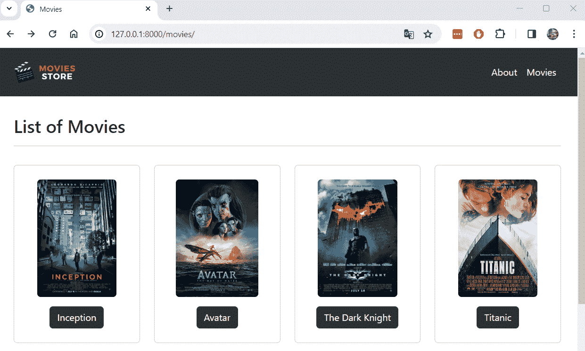
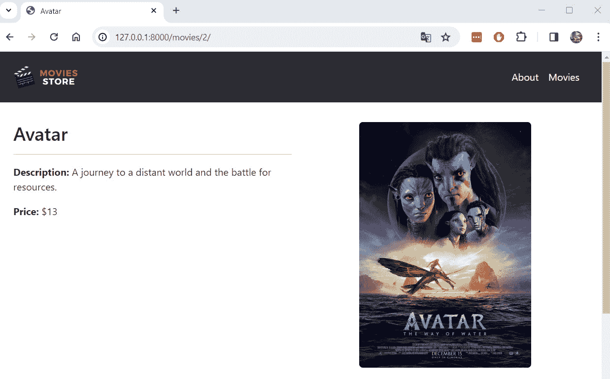
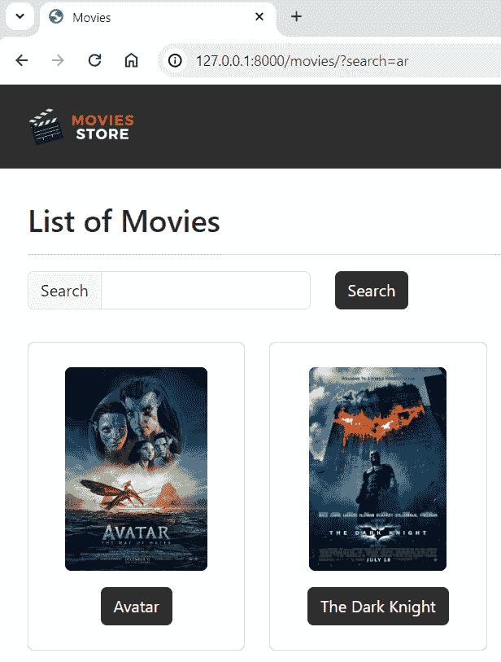

# 第七章：<st c="0">6</st>

# <st c="2">从数据库收集和展示数据</st>

<st c="50">在前几章中，我们使用 Python 列表中的虚拟数据来收集电影信息。</st> <st c="159">虽然这种方法作为展示电影信息的一个良好初始尝试是有效的，但它并不具有良好的可扩展性。</st> <st c="265">如果我们想添加一部新电影或编辑现有的电影，我们需要修改我们的 Python 代码。</st> <st c="360">本章重点介绍重构电影和单个电影页面以直接从数据库检索和展示信息的过程。</st> <st c="518">使用这种方法，如果我们需要添加新电影或修改现有电影，我们可以直接访问管理面板，而无需修改 Python 代码。</st> <st c="673">此外，我们还将实现一个新的电影</st> <st c="717">搜索功能。</st>

<st c="738">在本章中，我们将涵盖以下主题：</st> <st c="774">以下内容：</st>

+   <st c="791">删除电影的</st> <st c="813">虚拟数据</st>

+   <st c="823">更新电影</st> <st c="843">列表页面</st>

+   <st c="856">更新单个</st> <st c="895">电影页面的列表</st>

+   <st c="905">实现搜索</st> <st c="928">电影功能</st>

<st c="947">在本章结束时，你将了解如何从</st> <st c="1034">数据库中收集和展示信息。</st>

# <st c="1047">技术要求</st>

<st c="1070">在本章中，我们将使用 Python 3.10+。</st> <st c="1114">此外，我们将在本书中使用</st> **<st c="1144">VS Code</st>** <st c="1151">编辑器，你可以从</st> <st c="1196">以下链接</st> <st c="1201">[`code.visualstudio.com/`](https://code.visualstudio.com/)<st c="1231">](https://code.visualstudio.com/)下载。</st>

<st c="1232">本章的代码位于</st> <st c="1270">以下链接</st> <st c="1273">[`github.com/PacktPublishing/Django-5-for-the-Impatient-Second-Edition/tree/main/Chapter06/moviesstore`](https://github.com/PacktPublishing/Django-5-for-the-Impatient-Second-Edition/tree/main/Chapter06/moviesstore)<st c="1381">。</st>

<st c="1382">本章的 CiA 视频可以在以下链接找到</st> <st c="1427">[`packt.link/mZUvA`](https://packt.link/mZUvA)

# <st c="1454">删除电影的虚拟数据</st>

<st c="1486">提取数据库</st> <st c="1521">数据的第一个步骤是删除电影的虚拟数据。</st> <st c="1564">在</st> `<st c="1567">/movies/views.py</st>`<st c="1583">中，删除</st> `<st c="1596">movies</st>` <st c="1602">变量，如下所示</st> <st c="1639">在</st> **<st c="1642">粗体</st>**<st c="1646">中：</st>

```py
 from django.shortcuts import render <st c="1685">movies = [</st>
 <st c="1695">{</st>
 <st c="1697">'id': 1, 'name': 'Inception', 'price': 12,</st>
 <st c="1740">'description': 'A mind-bending heist thriller.'</st>
 <st c="1788">},</st>
 <st c="1791">{</st>
 <st c="1793">'id': 2, 'name': 'Avatar', 'price': 13,</st>
 <st c="1833">'description': 'A journey to a distant world and the battle for resources.'</st>
**<st c="1909">},</st>**
 **<st c="1912">{</st>**
 **<st c="1914">'id': 3, 'name': 'The Dark Knight', 'price': 14,</st>**
 **<st c="1963">'description': 'Gothams vigilante faces the Joker.'</st>**
 **<st c="2015">},</st>**
 **<st c="2018">{</st>**
 **<st c="2020">'id': 4, 'name': 'Titanic', 'price': 11,</st>**
 **<st c="2061">'description': 'A love story set against the backdrop of the sinking Titanic.',</st>**
 **<st c="2141">},</st>**
**<st c="2144">]</st>** <st c="2146">…</st>
```

**<st c="2147">我们不再需要这个变量，因为我们将从数据库中提取电影信息。</st> <st c="2244">此外，请记住访问管理面板并创建几个</st> <st c="2262">电影对象。</st>

<st c="2316">现在我们已经移除了虚拟数据，让我们更新我们</st> <st c="2382">列出电影的方式。</st>

# <st c="2394">更新电影列表页面</st>

<st c="2427">现在，让我们更新</st> <st c="2449">代码以从数据库中提取电影信息。</st> <st c="2503">我们</st> <st c="2506">首先需要更新</st> `<st c="2538">index</st>` <st c="2543">函数；其次，更新</st> `<st c="2573">movies.index</st>` <st c="2585">模板；最后，添加一个自定义</st> <st c="2620">CSS 类。</st>

## <st c="2630">更新索引函数</st>

<st c="2654">在</st> `<st c="2658">/movies/views.py</st>`<st c="2674">中，添加以下</st> <st c="2694">加粗内容：</st>

```py
 from django.shortcuts import render <st c="2739">from .models import Movie</st> def index(request):
    template_data = {}
    template_data['title'] = 'Movies'
    template_data['movies'] = <st c="2864">Movie.objects.all()</st> return render(request, 'movies/index.html',
                  {'template_data': template_data})
…
```

<st c="2963">让我们解释一下</st> <st c="2982">之前的代码：</st>

+   <st c="2996">我们从</st> `<st c="3011">Movie</st>` <st c="3016">模型中导入</st> `<st c="3032">models</st>` <st c="3038">文件。</st> <st c="3045">我们将使用此模型来访问</st> <st c="3078">数据库信息。</st>

+   <st c="3099">我们通过使用</st> `<st c="3153">Movie.objects.all()</st>` <st c="3172">方法从数据库中收集所有电影。</st> `<st c="3181">Movie.objects</st>` <st c="3194">是 Django 中的一个管理器，作为查询与模型关联的数据库表的默认接口。</st> <st c="3310">它提供了执行数据库操作（如创建、更新、删除和检索对象）的各种方法。</st> <st c="3431">`<st c="3435">all()</st>` <st c="3440">方法从模型表示的数据库表获取所有对象。</st> <st c="3518">记住，我们之前通过使用</st> `<st c="3591">movies</st>` <st c="3597">变量收集了电影信息；现在，我们使用</st> `<st c="3624">Movie</st>` <st c="3629">Django 模型。</st>

<st c="3643">注意</st>

<st c="3648">Django 提供了几种操作和访问数据库信息的方法。</st> <st c="3726">您可以在以下位置找到更多这些方法：</st> [<st c="3767">https://docs.djangoproject.com/en/5.0/topics/db/queries/</st>](https://docs.djangoproject.com/en/5.0/topics/db/queries/)<st c="3823">。</st>

## <st c="3824">更新 movies.index 模板</st>

<st c="3859">在</st> `<st c="3863">/movies/templates/movies/index.html</st>`<st c="3898">中，添加以下</st> <st c="3908">加粗内容：</st>

```py
 …
      
      <div class="col-md-4 col-lg-3 mb-2">
        <div class="p-2 card align-items-center pt-4">
          **<st c="4062">{{ movie.image.url }}</st>**<st c="4084">"
            class="card-img-top rounded</st> **<st c="4115">img-card-200</st>**<st c="4127">">
          <div class="card-body text-center">
            <a href=""
              class="btn bg-dark text-white">
              {{ movie.name }}
            </a>
          </div>
        </div>
      </div>
      
      …</st>
```

<st c="4302">我们已经移除了默认图片，现在我们将展示每部电影的特定图片。</st> <st c="4394">因此，我们将包含</st> <st c="4421">一个自定义 CSS 类来以相同的比例显示图片。</st> <st c="4488">我们将添加这个 CSS</st> <st c="4509">类。</st>

## <st c="4520">添加自定义 CSS 类</st>

<st c="4546">在</st> `<st c="4550">/moviesstore/static/css/style.css</st>`<st c="4583">的末尾添加以下</st> <st c="4592">加粗内容：</st>

```py
 … <st c="4636">.img-card-200 {</st>
 <st c="4651">width: fit-content;</st>
 <st c="4671">max-height: 200px;</st>
<st c="4690">}</st>
```

<st c="4692">现在，保存这些文件，运行服务器，并访问</st> [<st c="4741">http://localhost:8000/movies</st>](http://localhost:8000/movies)<st c="4769">；你应该看到电影页面，该页面从数据库中提取信息（</st>*<st c="4850">图 6</st>**<st c="4859">.1</st>*<st c="4861">）。</st>



<st c="4979">图 6.1 – 电影页面</st>

<st c="5007">电影页面现在列出了数据库中的电影；让我们通过修改单个</st> <st c="5116">电影页面来完成这个过程。</st>

# <st c="5128">更新单个电影页面的列表</st>

<st c="5177">现在，让我们更新代码以</st> <st c="5207">从数据库中提取单个电影信息。</st> <st c="5264">我们首先需要更新 show 函数；其次，更新</st> `<st c="5333">movies.show</st>` <st c="5344">模板；最后，添加一个自定义</st> <st c="5379">CSS 类。</st>

## <st c="5389">更新显示函数</st>

在 `<st c="5416">/movies/views.py</st>`<st c="5432"> 中，添加以下内容并以粗体显示：

```py
 …
def show(request, id):
    movie = <st c="5493">Movie.objects.get(id=id)</st> template_data = {}
    template_data['title'] = <st c="5562">movie.name</st> template_data['movie'] = movie
    return render(request, 'movies/show.html',
                  {'template_data': template_data})
```

<st c="5680">让我们解释一下</st> <st c="5699">之前的代码：</st>

+   <st c="5713">我们使用</st> `<st c="5725">Movie.objects.get(id=id)</st>` <st c="5749">方法根据其</st> `<st c="5799">id</st>`<st c="5801">检索一个特定的电影。记住</st> `<st c="5817">id</st>` <st c="5819">是通过 URL 传递的，并在</st> `<st c="5876">show</st>` <st c="5880">函数中作为参数接收的。</st>

+   <st c="5890">我们现在将</st> `<st c="5905">movie.name</st>` <st c="5915">作为对象属性访问。</st> <st c="5940">之前，我们通过键（</st>`<st c="5983">movie['name']</st>`<st c="5997">）访问名称，因为虚拟数据变量</st> <st c="6031">存储字典。</st>

## <st c="6051">更新 movies.show 模板</st>

在 `<st c="6085">/movies/templates/movies/show.html</st>`<st c="6123"> 中，添加以下内容并以粗体显示：

```py
 …
      <div class="col-md-6 mx-auto mb-3">
        <h2>{{ template_data.movie.name }}</h2>
        <hr />
        <p><b>Description:</b> {{
          template_data.movie.description }}</p>
        <p><b>Price:</b> ${{
          template_data.movie.price }}</p>
      </div>
      <div class="col-md-6 mx-auto mb-3 text-center">
        **<st c="6420">{{ template_data.movie.image.url }}</st>**<st c="6456">"
          class="rounded</st> **<st c="6474">img-card-400</st>**<st c="6486">" />
      </div>
      …</st>
```

<st c="6500">与之前的</st> <st c="6524">代码类似，我们现在显示特定的电影图片，并使用自定义 CSS 类以相同的比例显示电影图片。</st>

## <st c="6644">添加自定义 CSS 类</st>

<st c="6670">在</st> `<st c="6674">/moviesstore/static/css/style.css</st>`<st c="6707"> 中，在文件末尾添加以下内容并以粗体显示：</st>

```py
 … <st c="6760">.img-card-400 {</st>
 <st c="6775">width: fit-content;</st>
 <st c="6795">max-height: 400px;</st>
<st c="6814">}</st>
```

现在保存这些文件，运行服务器，并访问特定电影在 [<st c="6885">http://localhost:8000/movies/1</st>](http://localhost:8000/movies/1)<st c="6915">；你应该看到单个电影页面，该页面从数据库中提取电影信息（</st>*<st c="7012">图 6.2</st>**<st c="7021">.2</st>*<st c="7023">）。</st>



<st c="7199">图 6.2 – 单个电影页面</st>

<st c="7236">我们现在正在列出电影和</st> <st c="7266">数据库中的单个电影。</st> <st c="7304">最后，让我们添加一个新功能，以便能够</st> <st c="7361">搜索电影。</st>

# <st c="7375">实现搜索电影功能</st>

<st c="7417">让我们通过实现一个</st> <st c="7463">搜索电影功能来结束这一章。</st> <st c="7492">首先，我们需要更新</st> `<st c="7527">movies.index</st>` <st c="7539">模板，其次，更新</st> `<st c="7573">index</st>` <st c="7578">函数。</st>

## <st c="7588">更新 movies.index 模板</st>

<st c="7623">在</st> `<st c="7627">/movies/templates/movies/index.html</st>`<st c="7662">中，添加以下</st> <st c="7668">以下内容，并加粗：</st>

```py
 …
      <div class="col mx-auto mb-3">
        <h2>List of Movies</h2>
        <hr /> <st c="7754"><p class="card-text"></st>
 <st c="7775"><form method="GET"></st>
**<st c="7795"><div class="row"></st>**
 **<st c="7813"><div class="col-auto"></st>**
 **<st c="7836"><div class="input-group col-auto"></st>**
 **<st c="7871"><div class="input-group-text"></st>**
 **<st c="7902">Search</div></st>**
 **<st c="7915"><input type="text" class="form-control"</st>**
 **<st c="7955">name="search"></st>**
 **<st c="7970"></div></st>**
 **<st c="7977"></div></st>**
 **<st c="7984"><div class="col-auto"></st>**
****<st c="8007"><button class="btn bg-dark text-white"</st>**
 **<st c="8046">type="submit">Search</button></st>**
 **<st c="8076"></div></st>**
 **<st c="8083"></div></st>**
 **<st c="8090"></form></st>**
 **<st c="8098"></p></st>** <st c="8103"></div>
    </div>
    …</st>**
```

****<st c="8118">我们创建了一个 HTML 表单，允许用户执行搜索操作。</st> <st c="8153">此表单将重定向到当前 URL 路由，并通过 URL 发送</st> `<st c="8257">search</st>` <st c="8263">信息。</st> <st c="8288">例如，如果我们搜索</st> `<st c="8318">Avatar</st>`<st c="8324">，它将重定向我们到</st> `<st c="8347">http://localhost:8000/movies/?search=Avatar</st>`<st c="8390">。</st>

## <st c="8391">更新 index 函数</st>

<st c="8415">在</st> `<st c="8419">/movies/views.py</st>`<st c="8435">中，添加以下</st> <st c="8445">以下内容，并加粗：</st>

```py
 …
def index(request): <st c="8485">search_term = request.GET.get('search')</st>
 <st c="8524">if search_term:</st>
 <st c="8540">movies =</st>
 <st c="8549">Movie.objects.filter(name__icontains=search_term)</st>
 <st c="8599">else:</st>
 <st c="8605">movies = Movie.objects.all()</st> template_data = {}
    template_data['title'] = 'Movies'
    template_data['movies'] = <st c="8714">movies</st> return render(request, 'movies/index.html',
                  {'template_data': template_data})
```

<st c="8798">`<st c="8803">index</st>` <st c="8808">函数已更改。</st> <st c="8831">现在，如果当前请求中没有发送</st> `<st c="8871">search</st>` <st c="8877">参数，它将检索所有电影，或者根据</st> `<st c="8973">search</st>` <st c="8979">参数检索特定电影。</st> <st c="8991">让我们解释一下</st> `<st c="9009">之前的代码。</st>

+   <st c="9023">我们通过使用</st> `<st c="9053">search</st>` <st c="9059">参数的</st> `<st c="9083">request.GET.get('search')</st>` <st c="9108">方法来检索该值，并将其分配给</st> `<st c="9145">search_term</st>` <st c="9156">变量。</st> <st c="9167">在这里，我们捕获了</st> `<st c="9188">search</st>` <st c="9194">输入值，该值是通过上一节中定义的表单提交的。</st>

+   <st c="9266">如果</st> `<st c="9270">search_term</st>` <st c="9281">不为空，我们将过滤包含</st> `<st c="9337">search_term</st>`<st c="9348">名称的电影。我们使用</st> `<st c="9354">__icontains</st>` <st c="9365">查找进行不区分大小写的</st> <st c="9404">包含搜索。</st>

+   <st c="9423">如果</st> `<st c="9427">search_term</st>` <st c="9438">为空，我们将从数据库中检索所有电影，而不应用</st> `<st c="9507">任何过滤器。</st>

+   <st c="9519">最后，我们将提取的</st> `<st c="9551">movies</st>` <st c="9557">传递给</st> `<st c="9565">template_data</st>` <st c="9578">字典。</st>

<st c="9590">现在，保存这些文件，运行服务器，转到</st> `<st c="9636">http://localhost:8000/movies</st>`<st c="9664">，输入搜索词，提交表单；你应该能看到与搜索词匹配的电影（</st>*<st c="9762">图 6</st>**<st c="9771">.3</st>*<st c="9773">）。</st>



<st c="9876">图 6.3 – 带自定义搜索的电影页面</st>

我们已经重构了我们的<st c="9925">代码，使其与数据库而不是虚拟数据一起工作。</st> <st c="9949">电影商店</st> <st c="9961">代码现在可以通过修改 Python 代码来包括新的电影或编辑现有的电影。</st> <st c="10016">此外，搜索功能的添加帮助我们理解如何在 Django 中过滤不同的数据，并增强了项目的功能。</st>

# <st c="10275">摘要</st>

<st c="10283">在本章中，我们学习了如何从数据库中提取信息。</st> <st c="10358">我们学习了不同的 Django 模型方法，例如</st> `<st c="10409">all</st>`<st c="10412">,</st> `<st c="10414">get</st>`<st c="10417">, 和</st> `<st c="10423">filter</st>`<st c="10429">，以及它们如何用于检索不同类型的信息。</st> <st c="10500">我们重构了电影和单个电影页面，以从数据库中收集信息，并学习了如何实现搜索功能。</st>

<st c="10643">在下一章中，我们将更深入地了解数据库是如何工作的。</st>******
