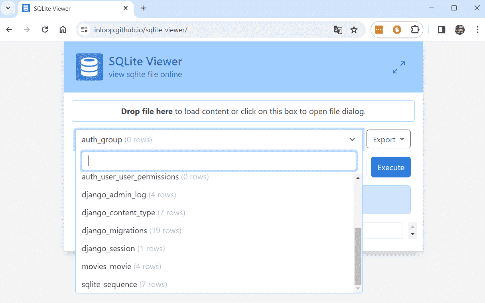
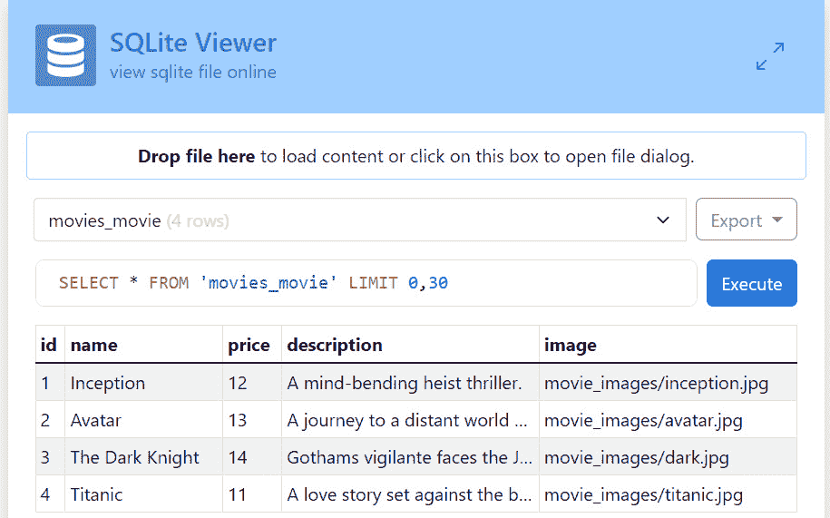
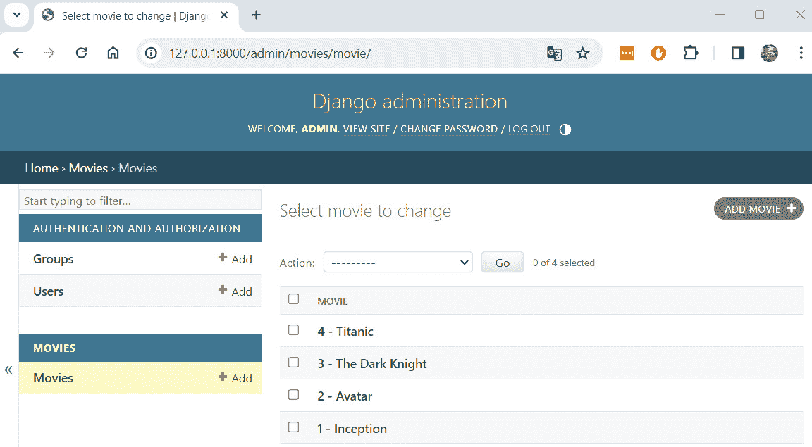
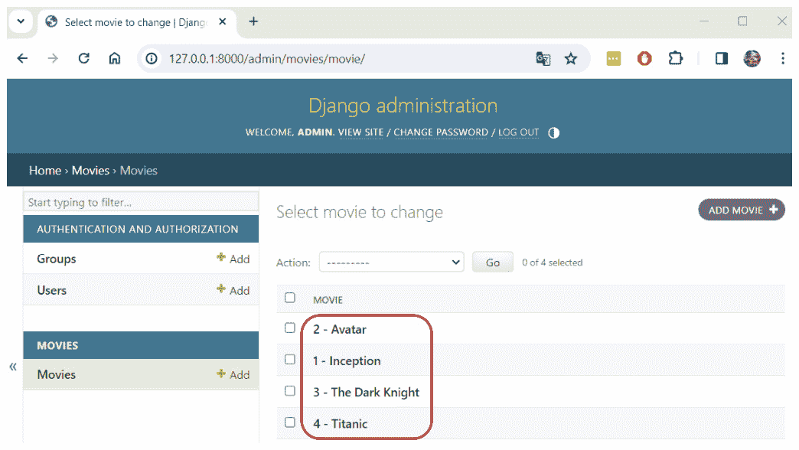
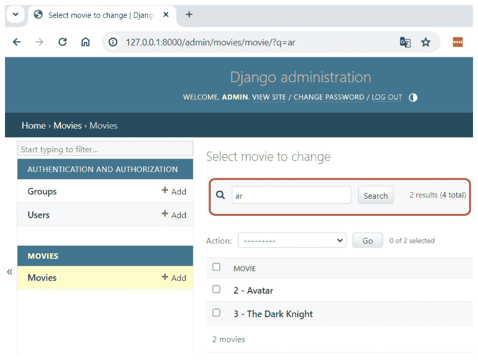
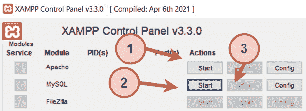
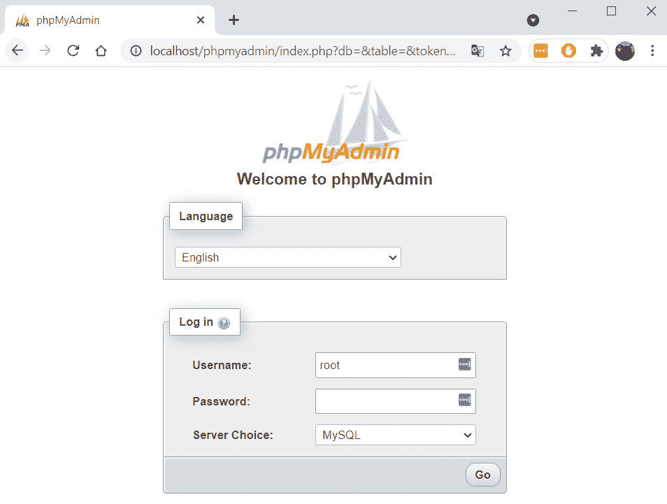
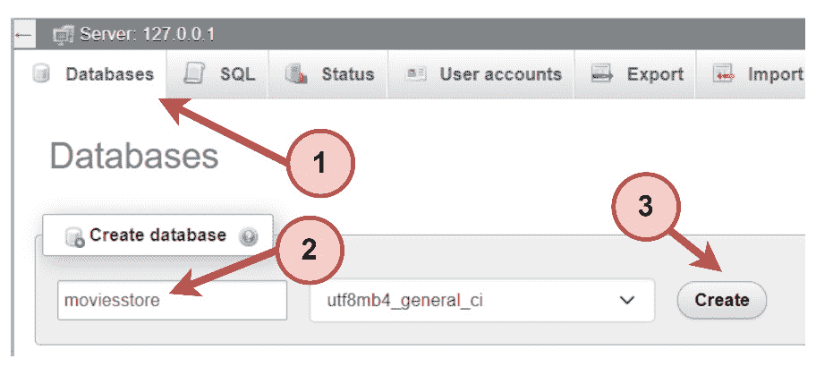
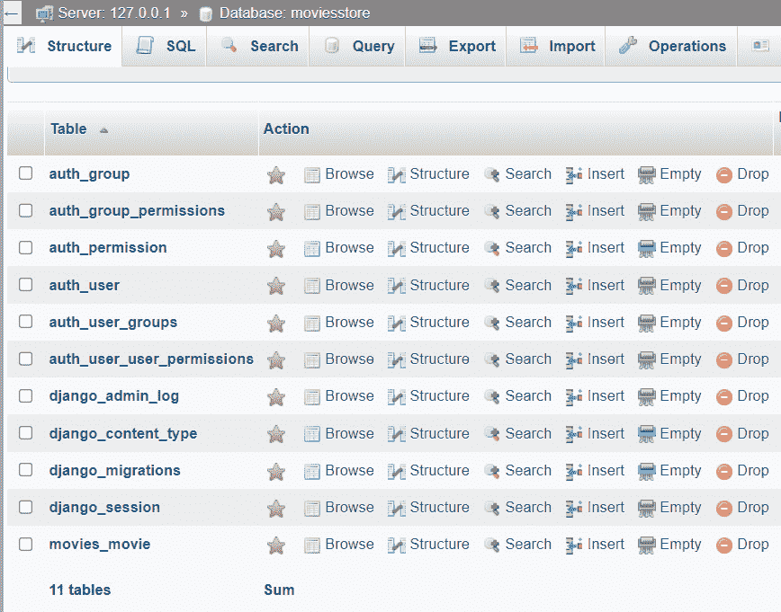

# 第八章：<st c="0">7</st>

# <st c="2">理解数据库</st>

<st c="28">前几章向我们展示了如何使用 Django 模型将数据持久化并从数据库中检索数据。</st> <st c="132">在本章中，我们将探讨 Django 中数据库的工作方式。</st> <st c="195">我们将利用数据库查看器来检查 Django 如何管理各种信息和存储它。</st> <st c="294">此外，我们还将学习如何自定义 Django 管理面板并在不同</st> <st c="381">数据库引擎之间切换。</st>

<st c="398">在本章中，我们将介绍以下主题：</st> <st c="434">以下主题：</st>

+   <st c="451">理解数据库查看器</st>

+   <st c="485">自定义 Django</st> <st c="509">管理面板</st>

+   <st c="520">切换到 MySQL 数据库</st>

<st c="550">在本章结束时，您将了解数据库的工作方式，如何可视化数据库信息，以及如何切换到不同的</st> <st c="695">数据库引擎。</st>

# <st c="711">技术要求</st>

<st c="734">在本章中，我们将使用 Python 3.10+。</st> <st c="778">此外，我们还将使用本书中使用的</st> **<st c="808">VS Code</st>** <st c="815">编辑器，您可以从</st> <st c="860">以下链接</st> <st c="865">[`code.visualstudio.com/`](https://code.visualstudio.com/)<st c="895">下载。</st>

<st c="896">本章的代码位于</st> <st c="934">以下链接</st> <st c="937">[`github.com/PacktPublishing/Django-5-for-the-Impatient-Second-Edition/tree/main/Chapter07/moviesstore`](https://github.com/PacktPublishing/Django-5-for-the-Impatient-Second-Edition/tree/main/Chapter07/moviesstore)<st c="1045">。</st>

<st c="1046">本章的 CiA 视频可在</st> <st c="1091">以下链接</st> <st c="1094">[`packt.link/wD2bK`](https://packt.link/wD2bK)</st> <st c="1045">找到。</st>

# <st c="1118">理解数据库查看器</st>

<st c="1152">让我们花些时间来了解数据库的工作方式。</st> <st c="1164">对象存储在</st> `<st c="1242">db.sqlite3</st>` <st c="1252">文件中。</st> <st c="1259">如果您点击它，它不太容易阅读。</st> <st c="1304">然而，您可以使用 SQLite 查看器查看此类 SQLite 文件；只需在谷歌上搜索</st> `<st c="1378">SQLite 查看器</st>` <st c="1391">即可找到它们的列表。</st> <st c="1412">一个</st> <st c="1415">例子</st> <st c="1424">是</st> [<st c="1427">https://inloop.github.io/sqlite-viewer/](https://inloop.github.io/sqlite-viewer/)<st c="1466">。</st>

<st c="1467">将您的</st> `<st c="1487">db.sqlite3</st>` <st c="1497">文件拖放到前面的链接（在 SQLite 查看器上），您将看到数据库中的不同表（如图</st> *<st c="1619">图 7</st>**<st c="1627">.1</st>*<st c="1629">）所示：</st>



<st c="2012">图 7.1 – 在 SQLite 查看器中打开 db.sqlite3</st>

<st c="2060">您可以看到我们创建的模型表 – 那就是说，</st> `<st c="2123">电影</st>`<st c="2128">。请注意，表的实际名称是由应用程序的名称和模型的名称组合而成的。</st> <st c="2244">例如，如果您的应用程序名称为</st> `<st c="2278">movies</st>` <st c="2284">并且您的模型名称为</st> `<st c="2309">Movie</st>`<st c="2314">，相应的表名将是</st> `<st c="2354">movies_movie</st>`<st c="2366">。这种命名约定有助于 Django 区分不同应用程序和模型中的表。</st>

<st c="2490">还有其他表，例如</st> `<st c="2528">django_session</st>`<st c="2542">，因为安装了用于会话</st> <st c="2624">和身份验证等功能的不同应用程序。</st>

<st c="2644">选择一个表（例如，</st> `<st c="2674">movies_movie</st>`<st c="2686">），您应该能够看到其行（</st>*<st c="2730">图 7</st>**<st c="2739">.2</st>*<st c="2741">）。</st>



<st c="3238">图 7.2 – 在 SQLite 查看器中选择表</st>

<st c="3285">希望如此，</st> <st c="3297">这能让您欣赏到 Django 数据库幕后发生的事情。</st> <st c="3375">目前，我们正在使用 SQLite 数据库。</st> <st c="3419">然而，如果我们想切换到其他数据库引擎怎么办呢？</st> <st c="3486">Django 官方支持以下数据库 – PostgreSQL、MariaDB、MySQL、Oracle、</st> <st c="3575">和 SQLite。</st>

<st c="3586">注意</st>

<st c="3591">除了官方支持的数据库之外，还有第三方提供的后端，允许您使用其他数据库与 Django 一起使用，例如 CockroachDB、Firebird、Google Cloud Spanner、Microsoft SQL Server、Snowflake、TiDB 和 YugabyteDB。</st> <st c="3847">您可以在</st> <st c="3877">这里</st> <st c="3883">找到更多信息：</st> [<st c="3883">https://docs.djangoproject.com/en/5.0/ref/databases/#third-party-notes</st>](https://docs.djangoproject.com/en/5.0/ref/databases/#third-party-notes)<st c="3953">。</st>

<st c="3954">要切换到另一个数据库引擎，请转到</st> `<st c="3999">/moviereviews/settings.py</st>` <st c="4024">并修改</st> <st c="4055">以下</st> **<st c="4058">粗体</st>**<st c="4062">行：</st>

```py
 …
DATABASES = {
    'default': { <st c="4093">'ENGINE': 'django.db.backends.sqlite3',</st>
 <st c="4132">'NAME': BASE_DIR / 'db.sqlite3',</st> }
}
…
```

<st c="4171">您仍然可以像平常一样创建</st> <st c="4192">您的模型，并且更改将由 Django 在幕后处理。</st>

<st c="4272">在书中，我们使用 SQLite</st> <st c="4299">因为它是最简单的。</st> <st c="4328">Django 默认使用 SQLite，这对于小型项目来说是一个很好的选择。</st> <st c="4403">它运行在一个单独的文件上，不需要复杂的安装。</st> <st c="4471">相比之下，其他选项配置起来有些复杂。</st> <st c="4554">在本章末尾，我们将看到如何配置一个更</st> <st c="4617">健壮的数据库。</st>

# <st c="4633">自定义 Django 管理面板</st>

<st c="4668">Django 管理面板是 Django 的一个强大内置功能，它自动生成一个用户友好的界面来管理我们的应用程序的数据模型。</st> <st c="4697">这是 Django 的一个很好的功能，许多其他框架</st> <st c="4890">都不提供。</st>

*<st c="4902">图 7</st>**<st c="4911">.3</st>* <st c="4913">显示了当前的电影</st> <st c="4939">管理页面。</st>



<st c="5321">图 7.3 – 电影管理页面</st>

<st c="5355">管理面板可能看起来非常僵化，但幸运的是，Django 允许我们根据我们的需求进行自定义。</st> <st c="5467">让我们将两个自定义应用到电影管理页面 – 首先，按名称排序电影，以及</st> <st c="5561">其次，允许按名称搜索</st> <st c="5587">。</st>

## <st c="5595">按名称排序电影</st>

<st c="5619">在</st> `<st c="5623">/movies/admin.py</st>`<st c="5639">中，添加以下</st> <st c="5648">以下内容（加粗）：</st>

```py
 from django.contrib import admin
from .models import Movie <st c="5727">class MovieAdmin(admin.ModelAdmin):</st>
 <st c="5762">ordering = ['name']</st> admin.site.register(Movie<st c="5808">, MovieAdmin</st>)
```

<st c="5822">让我们解释一下</st> <st c="5840">之前的代码：</st>

+   <st c="5854">我们创建了一个</st> `<st c="5868">MovieAdmin</st>` <st c="5878">类，它继承自</st> `<st c="5904">admin.ModelAdmin</st>`<st c="5920">。这定义了一个自定义管理类，允许您自定义电影</st> `<st c="6029">模型</st>` <st c="6034">的管理界面。</st>

+   <st c="6041">我们设置了一个</st> `<st c="6052">排序</st>` <st c="6060">属性。</st> <st c="6072">此属性设置管理界面中电影对象的默认排序。</st> <st c="6146">在我们的例子中，它指定电影应按其</st> `<st c="6227">名称</st>` <st c="6231">字段排序。</st>

+   <st c="6238">最后，我们将</st> `<st c="6266">Movie</st>` <st c="6271">模型与自定义管理类</st> `<st c="6307">MovieAdmin</st>`<st c="6317">注册。</st> <st c="6348">这告诉 Django 使用</st> `<st c="6348">MovieAdmin</st>` <st c="6358">类来自定义电影</st> `<st c="6406">模型</st>` <st c="6411">的管理界面。</st>

<st c="6418">现在，保存你的文件，返回到</st> `<st c="6451">/admin</st>`<st c="6457">，并导航到电影页面。</st> <st c="6492">您将看到按名称排序的电影对象（如图</st> *<st c="6552">图 7</st>**<st c="6560">.4</st>*<st c="6562">）：</st>



<st c="6839">图 7.4 – 电影管理页面</st>

## <st c="6873">允许按名称搜索</st>

<st c="6899">在</st> `<st c="6903">/movies/admin.py</st>`<st c="6919">中，添加以下</st> <st c="6928">以下内容，并以粗体显示：</st>

```py
 from django.contrib import admin
from .models import Movie
class MovieAdmin(admin.ModelAdmin):
    ordering = ['name'] <st c="7063">search_fields = ['name']</st> admin.site.register(Movie, MovieAdmin)
```

<st c="7126">我们添加了一个</st> `<st c="7138">search_fields</st>` <st c="7151">属性，指定只有</st> `<st c="7191">name</st>` <st c="7195">字段中的</st> `<st c="7209">Movie</st>` <st c="7214">模型可以在管理界面中搜索。</st> <st c="7259">这意味着用户可以在管理界面提供的搜索框中输入关键词，Django 将根据输入的关键词是否与电影名称的任何部分匹配来过滤电影对象列表。</st>

<st c="7472">现在，保存你的文件，回到</st> `<st c="7505">/admin</st>`<st c="7511">，并导航到电影页面。</st> <st c="7546">你将看到可用的新搜索框（如图</st> *<st c="7601">图 7</st>**<st c="7609">.5</st>*<st c="7611">）：</st>



<st c="7972">图 7.5 – 带有搜索框的电影管理页面</st>

<st c="8024">注意</st>

<st c="8029">正如你所看到的，使用很少的代码行就可以轻松应用一些自定义。</st> <st c="8116">如果你想探索一些额外的自定义，请查看这个</st> <st c="8185">链接：</st> [<st c="8191">https://docs.djangoproject.com/en/5.0/ref/contrib/admin/</st>](https://docs.djangoproject.com/en/5.0/ref/contrib/admin/)<st c="8247">。</st>

<st c="8248">让我们通过</st> <st c="8279">了解如何切换到</st> <st c="8313">不同的数据库</st>来结束这一章。

# <st c="8332">切换到 MySQL 数据库</st>

<st c="8362">正如我们之前提到的，我们在这本书中一直使用 SQLite，因为它是最简单的。</st> <st c="8451">然而，我们将解释如何切换到</st> <st c="8495">一个更健壮的数据库引擎</st> <st c="8523">，称为</st> <st c="8529">MySQL。</st>

<st c="8536">注意</st>

<st c="8541">本书的代码基于 SQLite，因此本节中的更改是可选的，并且不会反映在 GitHub 书籍仓库或即将到来的章节中。</st>

**<st c="8704">MySQL</st>** <st c="8710">是由 Oracle 开发的流行的开源 SQL 数据库管理系统。</st> <st c="8788">有几种不同的方式可以安装 MySQL。</st> <st c="8839">在本节中，我们将安装 MySQL 和一个名为</st> <st c="8890">phpMyAdmin</st> <st c="8928">的 MySQL 管理工具。这两个工具都可以在名为 XAMPP 的开发环境中找到，所以让我们</st> <st c="8947">安装它。</st>

**<st c="9019">XAMPP</st>** <st c="9025">是一个流行的 PHP 开发环境。</st> <st c="9029">它是一个包含 MySQL、PHP 和 Perl 的免费 Apache 发行版。</st> <st c="9068">如前所述，XAMPP 还包括</st> *<st c="9179">phpMyAdmin</st>*<st c="9189">。如果您还没有安装 XAMPP，请访问</st> [<st c="9232">https://www.apachefriends.org/download.html</st>](https://www.apachefriends.org/download.html)<st c="9275">，下载它，并</st> <st c="9294">安装它。</st>

<st c="9305">要切换到 MySQL 数据库，我们需要遵循</st> <st c="9360">以下步骤：</st>

1.  <st c="9372">配置</st> <st c="9389">MySQL 数据库。</st>

1.  <st c="9404">配置我们的项目以使用</st> <st c="9440">MySQL 数据库。</st>

1.  <st c="9455">运行</st> <st c="9464">迁移。</st>

## <st c="9479">配置 MySQL 数据库</st>

<st c="9510">执行 XAMPP，然后启动</st> <st c="9541">Apache 模块（</st>**<st c="9560">1</st>**<st c="9562">），启动 MySQL 模块（</st>**<st c="9589">2</st>**<st c="9591">），然后点击 MySQL</st> **<st c="9614">管理员</st>** <st c="9619">按钮（在 MySQL 模块中）（</st>**<st c="9650">3</st>**<st c="9652">），这将带我们到</st> *<st c="9681">phpMyAdmin</st>* <st c="9691">应用程序（如图 7.6 所示）。</st>



<st c="9882">图 7.6 – 在 XAMPP 中启动 MySQL 模块</st>

<st c="9929">在</st> *<st c="9937">phpMyAdmin</st>* <st c="9947">应用程序中，输入您的用户名和密码。</st> <st c="9995">默认值是</st> `<st c="10018">root</st>` <st c="10022">(用户名) 和空密码 (</st>*<st c="10065">图 7</st>**<st c="10074">.7</st>*<st c="10076">):</st>



<st c="10258">图 7.7 – XAMPP phpMyAdmin 应用程序</st>

<st c="10299">一旦您登录到</st> <st c="10320">*<st c="10327">phpMyAdmin</st>*<st c="10337">*，点击数据库标签页（</st>`<st c="10393">moviesstore</st>` <st c="10404">(</st>**<st c="10406">2</st>**<st c="10407">)，然后点击</st> **<st c="10424">创建</st>** <st c="10430">按钮（</st>**<st c="10439">3</st>**<st c="10441">）（如图 7.8 所示）。</st>



<st c="10626">图 7.8 – 数据库创建</st>

## <st c="10656">配置我们的项目以使用 MySQL 数据库</st>

<st c="10706">首先，我们需要安装一个名为 PyMySQL 的包。</st> <st c="10717">PyMySQL 是从 Python 连接到 MySQL 数据库的接口。</st> <st c="10759">在终端中运行以下命令：</st>

+   <st c="10877">对于 macOS，运行以下命令：</st>

    ```py
    <st c="10898">pip3 install pymysql</st>
    ```

+   <st c="10919">对于 Windows 系统，</st> <st c="10933">请运行以下命令：</st>

    ```py
    <st c="10942">pip install pymysql</st>
    ```

<st c="10962">然后，我们需要将以下加粗行添加到</st> `<st c="11016">moviesstore/__init__.py</st>` <st c="11039">文件中：</st>

```py
<st c="11045">import pymysql</st>
<st c="11095">__init__.py</st> file will be executed when we run the Django project, and the previous two lines import the PyMySQL package into the project.
			<st c="11232">Finally, we need to modify the database settings to switch to MySQL.</st> <st c="11302">In</st> `<st c="11305">/moviesstore/settings.py</st>`<st c="11329">, modify the</st> `<st c="11342">DATABASES</st>` <st c="11351">variable to the following</st> <st c="11378">in bold:</st>

```

…

DATABASES = {

    'default': { <st c="11415">'ENGINE': 'django.db.backends.mysql',</st>

<st c="11452">'NAME': 'moviesstore',</st>

<st c="11475">'USER': 'root',</st>

<st c="11491">'PASSWORD': '',</st>

<st c="11507">'HOST': 'localhost',</st>

<st c="11528">'PORT': '3306',</st> }

}

…

```py

			<st c="11550">Running the migrations</st>
			<st c="11573">Since we have switched</st> <st c="11596">the database, the new database is empty.</st> <st c="11638">So, we need to run</st> <st c="11657">the migrations:</st>

				*   <st c="11672">For macOS,</st> <st c="11684">run this:</st>

    ```

    <st c="11693">python3 manage.py migrate</st>

    ```py

    				*   <st c="11719">For Windows,</st> <st c="11733">run this:</st>

    ```

    <st c="11742">python manage.py migrate</st>

    ```py

			<st c="11767">Then, we should</st> <st c="11784">see the tables in our</st> *<st c="11806">phpMyAdmin</st>* <st c="11816">application (as shown in</st> *<st c="11842">Figure 7</st>**<st c="11850">.9</st>*<st c="11852">).</st>
			

			<st c="12825">Figure 7.9 – The MySQL database</st>
			<st c="12856">Finally, we</st> <st c="12869">repeat the process of creating a superuser and accessing the admin panel to create</st> <st c="12952">some movies.</st>
			<st c="12964">Summary</st>
			<st c="12972">We hope that you now better understand how SQLite databases work, how Django supports database management, and how you can customize the Django admin panel.</st> <st c="13130">In the next chapter, we will learn how to allow a user to sign up and</st> <st c="13200">log in.</st>

```
