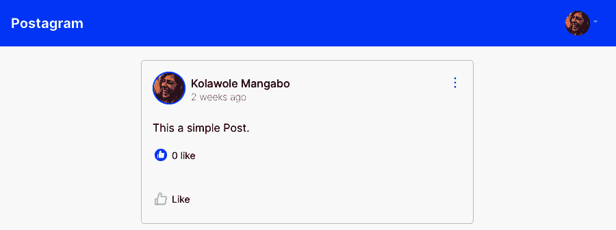
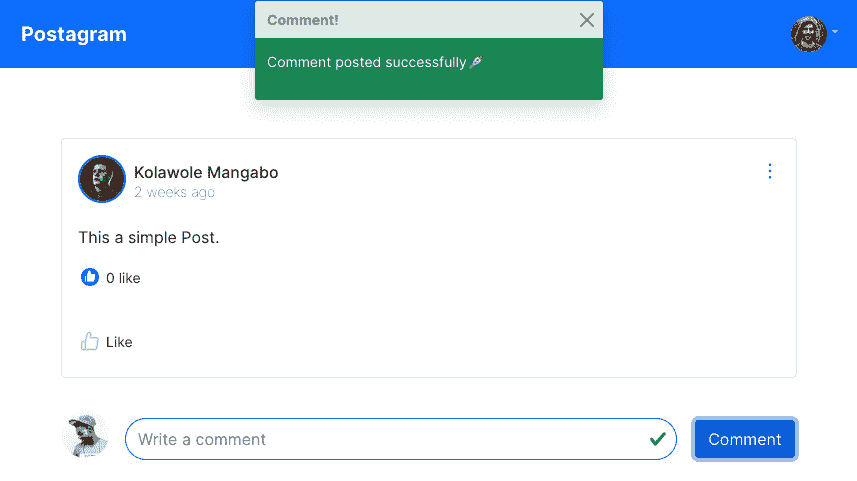
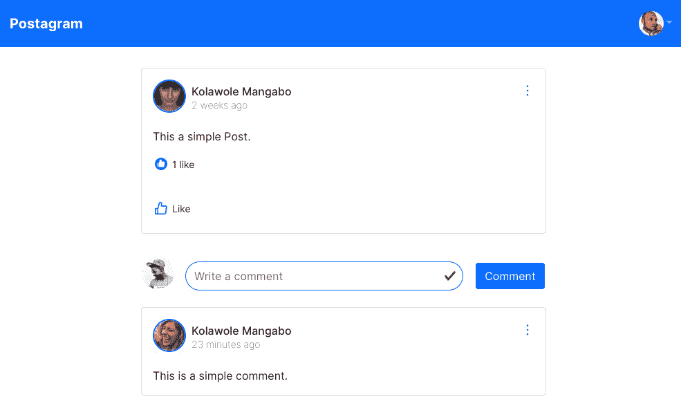
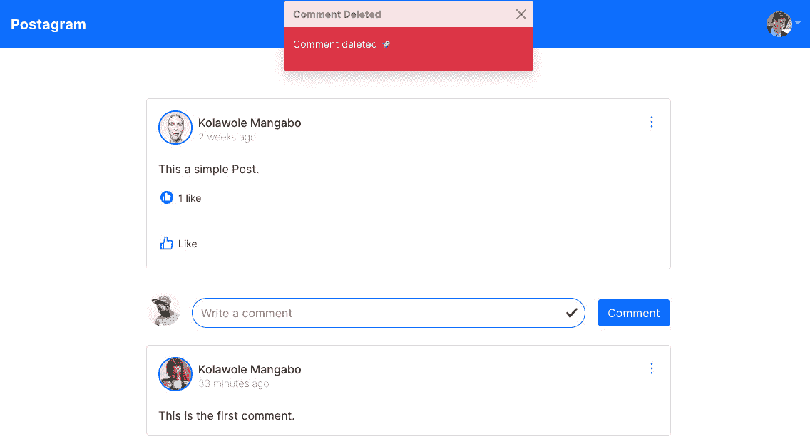
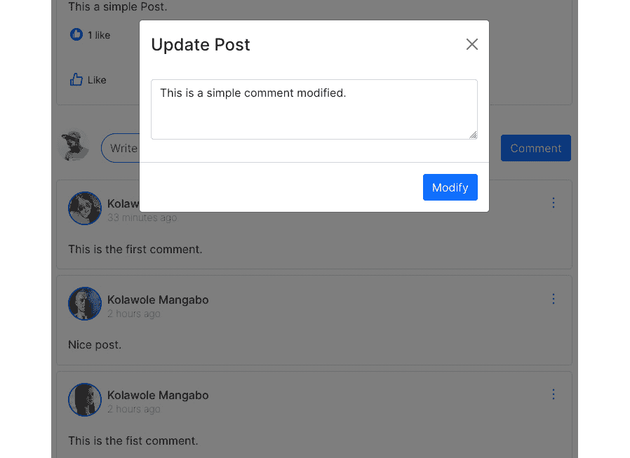
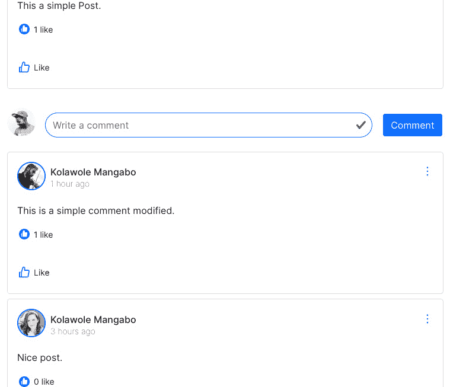

# 第九章：帖子评论

每个社交媒体平台的一个令人兴奋的部分是评论功能。在前一章中，我们已经添加了帖子创建、列出、更新和删除功能。本章将涵盖评论的创建、列出、更新和删除。我们将创建一个页面来显示关于帖子的信息，添加组件来列出评论，添加一个模态来显示创建评论的表单，并添加一个下拉菜单以允许用户删除或修改评论。在本章结束时，你将学习如何使用 React 和 React Router 通过 URL 参数导航到单个页面。

在本章中，我们将涵盖以下主题：

+   在帖子页面上列出评论

+   使用表单创建评论

+   编辑和删除评论

+   更新评论

# 技术要求

确保在您的机器上安装并配置了 VS Code 和更新的浏览器。您可以在[`github.com/PacktPublishing/Full-stack-Django-and-React/tree/chap9`](https://github.com/PacktPublishing/Full-stack-Django-and-React/tree/chap9)找到本章的代码。

# 创建 UI

在接下来的段落中，我们将修改`Post`组件以确保在显示单个帖子时的一致性，并添加一个`Post`组件。在列出评论之前，我们需要确保用户可以创建评论。这需要构建一个名为`SinglePost`的页面，该页面将显示关于帖子和评论的详细信息。

让我们看看以下图中的页面 UI：


图 9.1 – SinglePost 页面的结果

前面的图中的 UI 给了我们一个好的结果。当页面构建完成，用户点击评论时，将出现一个模态，用户将能够创建评论。让我们先关注这个案例，稍后我们将探索其他 CRUD 操作。

注意，我们还在页面的左上角添加了一个返回按钮——这是要添加到`Layout`组件中的内容。我们首先将对`Post.jsx`组件进行一些调整。这是因为我们将重用`Post`组件，但我们将屏蔽如评论计数和**评论**图标等选项。修改组件后，我们将创建一个显示一篇文章及其评论的页面。

## 调整 Post 组件

`Post`组件将被简单地重用来显示更多关于帖子的信息。根据*图 9**.1*中的 UI，我们只需屏蔽帖子上的评论数量和**评论**图标。

在`Post.jsx`内部，我们将添加另一个名为`isSinglePost`的 prop。当这个 prop 为`true`时，意味着我们在`SinglePost`页面上显示组件：

src/components/posts/Post.jsx

```py
...
function Post(props) {
 const { post, refresh, isSinglePost } = props;
...
 return (
   <>
    ...
            {!isSinglePost && (
             <p className="ms-1 fs-6">
               <small>
                 <Link>
                   {post.comments_count} comments
                 </Link>
               </small>
             </p>
           )}
   ...
                {!isSinglePost && (
           <div className="d-flex flex-row">
             <CommentOutlined
               style={{
                 width: "24px",
                 height: "24px",
                 padding: "2px",
                 fontSize: "20px",
                 color: "#C4C4C4",
               }}
             />
             <p className="ms-1 mb-0">
               <small>Comment</small>
             </p>
           </div>
         )}
...
```

在对`Post`组件进行修改后，我们现在可以向`Layout`组件添加返回按钮。

## 向 Layout 组件添加返回按钮

返回按钮的作用是在动作被发起时将用户导航到上一页。关于如何实现这一点的一个有趣的想法是将实际路径添加到可以发生返回动作的组件中。然而，这将需要很多代码，并引入一些复杂性。

幸运的是，`react-router`库提供了一种简单的方法，只需一行代码就可以导航到上一页：

**navigate(-1)**

是的！让我们把这个函数添加到`Layout.jsx`组件中：

src/components/Layout.jsx

```py
import { ArrowLeftOutlined } from "@ant-design/icons";
import { useNavigate } from "react-router-dom";
function Layout(props) {
 const { hasNavigationBack } = props;
 const navigate = useNavigate();
...
  return (
     <div>
       <Navigationbar />
       {hasNavigationBack && (
         <ArrowLeftOutlined
           style={{
             color: "#0D6EFD",
             fontSize: "24px",
             marginLeft: "5%",
             marginTop: "1%",
           }}
           onClick={() => navigate(-1)}
         />
       )}
       <div className="container my-2">
           {props.children}
       </div>
...
```

在前面的代码中，我们添加了一个名为`hasNavigationBack`的属性。这个属性将告诉 React 是否应该渲染导航到上一页的图标。渲染过程是在 JSX 代码中完成的，使用条件。如果`hasNavigationBack`为`true`，我们显示**返回**图标，用户可以导航。

添加了返回选项后，我们现在可以开始编写`SinglePost.jsx`页面。

## 创建 SinglePost 组件

在`src/pages`目录中，创建一个名为`SinglePost.jsx`的新文件。这个文件将包含显示帖子信息和，最重要的是，评论的代码。以下图显示了页面的简单线框，这样我们就可以对组件的布局有一个概念：


图 9.2 – SinglePost 页面的线框

让我们移动文件并开始编码。在下面的代码片段中，我们将创建`SinglePost`页面，添加导入，并定义页面上将使用的函数和状态：

src/pages/SinglePost.jsx

```py
import React from "react";
import Layout from "../components/Layout";
import { Row, Col } from "react-bootstrap";
import { useParams } from "react-router-dom";
import useSWR from "swr";
import { fetcher } from "../helpers/axios";
import { Post } from "../components/posts";
import CreateComment from "../components/comments/CreateComment";
import Comment from "../components/comments/Comment";
function SinglePost() {
 let { postId } = useParams();
 const post = useSWR(`/post/${postId}/`, fetcher);
 const comments = useSWR(`/post/${postId}/comment/`, fetcher);
 return (
   <Layout hasNavigationBack>
     {post.data ? (
       <Row className="justify-content-center">
         <Col sm={8}>
           <Post post={post.data} refresh={post.mutate}              isSinglePost />
           // Adding CreateComment form and list all comments               here
         </Col>
       </Row>
     ) : (
       <div>Loading...</div>
     )}
   </Layout>
 );
}
export default SinglePost;
```

我们再次使用了来自`react-bootstrap`的`Row`和`Col`功能。这种结构将帮助我们有一个占布局 8/12 的一列，并且对象居中。接下来，我们需要一个用于创建评论的表单。

我们还在使用一个新的钩子，`useParams`。正如官方文档所述，`useParams`钩子返回一个`<Route path>`的对象。子路由继承其父路由的所有参数。

稍微有点难以理解，但让我们注册这个页面并在浏览器中加载它。在`App.jsx`文件中，添加一个新的路由：

src/App.jsx

```py
...
function App() {
 return (
   <Routes>
     <Route
       path="/"
       element={
         <ProtectedRoute>
           <Home />
         </ProtectedRoute>
       }
     />
     <Route
       path="/post/:postId/"
       element={
         <ProtectedRoute>
           <SinglePost />
         </ProtectedRoute>
       }
     />
...
```

新增路由的路径有一个有趣的模式，随着`postId`的添加。我们可以告诉`react-router`期待一个将要传递的参数，然后这个参数将在`useParams`钩子中可用。

让我们在`Post`组件中添加重定向到`SinglePost`页面的功能：

src/components/posts/CreatePost.jsx

```py
return (
   <>
    ...
            {!isSinglePost && (
             <p className="ms-1 fs-6">
               <small>
                 <Link to={`/post/${post.id}/`}>
                   {post.comments_count} comments
                 </Link>
               </small>
             </p>
           )}
    ...
```

在`SinglePost.jsx`文件中，添加`useParams()`的`console`日志：

src/pages/SinglePost.jsx

```py
...
function SinglePost() {
 console.log(useParams())
 let { postId } = useParams();
...
```

进入浏览器并点击一个帖子以访问`SinglePost`页面。你将得到类似的结果：



图 9.3 – 帖子页面

检查浏览器控制台以查看`useParams()`的内容：


图 9.4 – useParams()的内容

我们有一个包含`postId`值的对象。使用已解释的`useParams()`，让我们继续添加`CreateComment`表单。

## 创建评论

在`src/components`目录内，创建一个名为`comments`的新目录。这个目录将包含`comments`功能组件的代码。在新建的目录内，创建一个名为`CreateComment.jsx`的新文件。这个组件代表用户将用来添加评论到帖子的表单。

文件创建完成后，添加所需的导入：

src/components/comments/CreateComment.jsx

```py
import React, { useState, useContext } from "react";
import { Button, Form, Image } from "react-bootstrap";
import axiosService from "../../helpers/axios";
import { getUser } from "../../hooks/user.actions";
import { randomAvatar } from "../../utils";
import { Context } from "../Layout";
function CreateComment(props) {
 const { postId, refresh } = props;
 return (
   <Form>
   </Form>
 );
}
export default CreateComment;
```

在`CreateComment`页面上，当进行 CRUD 操作时，我们将显示 toast 通知。这意味着我们将再次使用`Context`方法。

让我们先定义 props 并创建`handleSubmit`。这个过程将与我们在`CreatePost`组件中做的非常相似：

src/components/comments/CreateComment

```py
...
function CreateComment(props) {
 const { postId, refresh } = props;
 const [avatar, setAvatar] = useState(randomAvatar());
 const [validated, setValidated] = useState(false);
 const [form, setForm] = useState({});
 const { toaster, setToaster } = useContext(Context);
 const user = getUser();
 const handleSubmit = (event) => {
   // Logic to handle form submission
 };
...
```

现在让我们添加`Form` UI：

src/component/comments/CreateComment.jsx

```py
...
return (
   <Form
     className="d-flex flex-row justify-content-between"
     noValidate
     validated={validated}
     onSubmit={handleSubmit}
   >
     <Image
       src={avatar}
       roundedCircle
       width={48}
       height={48}
       className="my-2"
     />
     <Form.Group className="m-3 w-75">
       <Form.Control
         className="py-2 rounded-pill border-primary"
         type="text"
         placeholder="Write a comment"
         value={form.body}
         name="body"
         onChange={(e) => setForm({ ...form,
                                   body: e.target.value })}
       />
     </Form.Group>
     <div className="m-auto">
       <Button
         variant="primary"
         onClick={handleSubmit}
         disabled={form.body === undefined}
         size="small"
       >
         Comment
       </Button>
     </div>
   </Form>
 );
...
```

UI 添加后，我们可以编写`handeSubmit`方法：

src/component/comments/CreateComment.jsx

```py
...
 const handleSubmit = (event) => {
   event.preventDefault();
   const createCommentForm = event.currentTarget;
   if (createCommentForm.checkValidity() === false) {
     event.stopPropagation();
   }
   setValidated(true);
   const data = {
     author: user.id,
     body: form.body,
     post: postId,
   };
   axiosService
     .post(`/post/${postId}/comment/`, data)
     .then(() => {
       setForm({ ...form, body: "" });
       setToaster({
         type: "success",
         message: "Comment posted successfully🚀",
         show: true,
         title: "Comment!",
       });
       refresh();
     })
     .catch(() => {
       setToaster({
         type: "danger",
         message: "",
         show: true,
         title: "An error occurred.!",
       });
     });
 };
...
```

与`CreatePost`组件类似，我们在表单的有效性检查上做了工作，同时也向`/post/${postId}/comment/`端点发送请求。然后，根据响应，我们显示 toast 并清理表单。让我们测试表单并使用 React 添加第一条评论：

src/pages/SinglePost.jsx

```py
...
 return (
   <Layout hasNavigationBack>
     {post.data ? (
       <Row className="justify-content-center">
         <Col sm={8}>
           <Post post={post.data} refresh={post.mutate}
             isSinglePost />
           <CreateComment postId={post.data.id}
             refresh={comments.mutate} />
         </Col>
       </Row>
     ) : (
       <div>Loading...</div>
     )}
   </Layout>
 );
...
```

你应该得到类似的结果：



图 9.5 – 创建评论

在前面的段落中，我们创建了一个页面来显示关于帖子的信息，从而允许我们添加一个显示表单的模态，用于创建与该帖子相关的新的评论。

现在，我们需要显示创建的评论。

# 列出评论

我们可以创建评论，但看不到它们。在`src/components/comments`中创建一个名为`CreateComment.jsx`的新文件。这个文件将包含用于显示评论详细信息的`Comment`组件的代码。以下是`Comment`组件的线框图：


图 9.6 – 评论组件的线框图

让我们继续编写代码。让我们首先添加`CreateComment`函数和导入，并定义我们将在这个组件中使用的状态：

src/components/comments/CreateComment.jsx

```py
import React, { useState, useContext } from "react";
import { format } from "timeago.js";
import { Image, Card, Dropdown } from "react-bootstrap";
import { randomAvatar } from "../../utils";
import axiosService from "../../helpers/axios";
import { getUser } from "../../hooks/user.actions";
import UpdateComment from "./UpdateComment";
import { Context } from "../Layout";
import MoreToggleIcon from "../MoreToggleIcon";
function Comment(props) {
 const { postId, comment, refresh } = props;
 const { toaster, setToaster } = useContext(Context);
 const user = getUser();
 const handleDelete = () => {
    // Handle the deletion of a comment
 };
 return (
   <Card className="rounded-3 my-2">
    // Code for the comment card
   </Card>
 );
}
export default Comment;
```

我们有必要的导入。让我们先从 UI 开始。它的结构有点像`Post`组件：

src/components/comments/CreateComment.jsx

```py
...
 return (
   <Card className="rounded-3 my-2">
     <Card.Body>
       <Card.Title className="d-flex flex-row
         justify-content-between">
         <div className="d-flex flex-row">
           <Image
             src={randomAvatar()}
             roundedCircle
             width={48}
             height={48}
             className="me-2 border border-primary
                        border-2"
           />
           <div className="d-flex flex-column
               justify-content-start
               align-self-center mt-2">
             <p className="fs-6 m-0">{comment.author.name}
             </p>
             <p className="fs-6 fw-lighter">
               <small>{format(comment.created)}</small>
             </p>
           </div>
         </div>
         {user.name === comment.author.name && (
           <div>
             <Dropdown>
               <Dropdown.Toggle
                 as={MoreToggleIcon}></Dropdown.Toggle>
               <Dropdown.Menu>
                 <Dropdown.Item>
                   Modify
                 </Dropdown.Item>
                 <Dropdown.Item onClick={handleDelete}
                   className="text-danger">
                   Delete
                 </Dropdown.Item>
               </Dropdown.Menu>
             </Dropdown>
           </div>
         )}
       </Card.Title>
       <Card.Text>{comment.body}</Card.Text>
     </Card.Body>
   </Card>
 );
...
```

`Comment`组件的 UI 已经准备好了。让我们看看在帖子页面上的结果：



图 9.7 – 帖子上的评论列表

我们还在每个组件的右上角有**更多**的点，这意味着我们需要实现删除和修改评论的功能。让我们添加删除功能。

# 删除评论

**更多**点菜单提供了两个选项：删除和修改评论。让我们先添加代码和操作以删除评论。函数已经声明，我们只需要添加逻辑：

Src/components/comments/CreateComment.jsx

```py
...
 const handleDelete = () => {
   axiosService
     .delete(`/post/${postId}/comment/${comment.id}/`)
     .then(() => {
       setToaster({
         type: "danger",
         message: "Comment deleted 🚀",
         show: true,
         title: "Comment Deleted",
       });
       refresh();
     })
     .catch((err) => {
       setToaster({
         type: "warning",
         message: "Comment deleted 🚀",
         show: true,
         title: "Comment Deleted",
       });
     });
 };
...
```

在`handleDelete`函数中，我们使用`axios`向`/post/${postId}/comment/${comment.id}/`发送请求以删除评论。根据 HTTP 请求的结果，我们显示带有正确信息的吐司。一旦你添加完代码，让我们测试结果：



图 9.8 – 删除评论

在我们的 React 应用程序中，现在可以删除评论了。让我们继续添加修改评论的功能。

# 更新评论

更新评论将与在`UpdatePost.jsx`文件中所做的工作类似。然而，我将协助你编写这个评论功能的特性。我们还要为我们的评论添加一个令人兴奋的元素：点赞和取消点赞评论，但作为一个练习。让我们专注于评论的修改。为此，我们需要创建一个模态框。

## 添加更新评论的模态框

在`src/components/comments`目录内，创建一个名为`UpdateComment.jsx`的文件。此文件将包含模态框和允许用户更新评论的表单：

src/components/comments/UpdateComment.jsx

```py
import React, { useState, useContext } from "react";
import { Button, Modal, Form, Dropdown } from "react-bootstrap";
import axiosService from "../../helpers/axios";
import { Context } from "../Layout";
function UpdateComment(props) {
 const { postId, comment, refresh } = props;
 const [show, setShow] = useState(false);
 const [validated, setValidated] = useState(false);
 const [form, setForm] = useState({
   author: comment.author.id,
   body: comment.body,
   post: postId
 });
 const { toaster, setToaster } = useContext(Context);
 const handleSubmit = (event) => {
   // handle the modification of a comment
 };
 return (
   <>
     <Dropdown.Item
       onClick={handleShow}>Modify</Dropdown.Item>
     // Adding the Modal here
   </>
 );
}
export default UpdateComment;
```

我们正在进行所需的导入，并定义在修改触发时将使用和更新的状态。请注意，我们还传递了`postId`和`comment`对象作为**props**。第一个是用于端点的；第二个也是用于端点的，但最重要的是，为了有一个默认值，我们需要在表单中显示它，以便用户进行修改。

让我们添加模态 UI：

src/components/comments/UpdateComment.jsx

```py
…
 return (
   <>
     <Dropdown.Item onClick={handleShow}>Modify
     </Dropdown.Item>
     <Modal show={show} onHide={handleClose}>
       <Modal.Header closeButton className="border-0">
         <Modal.Title>Update Post</Modal.Title>
       </Modal.Header>
       <Modal.Body className="border-0">
         <Form noValidate validated={validated}
           onSubmit={handleSubmit}>
           <Form.Group className="mb-3">
             <Form.Control
               name="body"
               value={form.body}
               onChange={(e) => setForm({ ...form,
                 body: e.target.value })}
               as="textarea"
               rows={3}
             />
           </Form.Group>
         </Form>
       </Modal.Body>
       <Modal.Footer>
         <Button variant="primary" onClick={handleSubmit}>
           Modify
         </Button>
       </Modal.Footer>
     </Modal>
   </>
 );
…
```

UI 准备就绪后，我们现在可以编写`handleSubmit`函数：

src/components/comments/UpdateComment.jsx

```py
…
 const handleSubmit = (event) => {
   event.preventDefault();
   const updateCommentForm = event.currentTarget;
   if (updateCommentForm.checkValidity() === false) {
     event.stopPropagation();
   }
   setValidated(true);
   const data = {
     author: form.author,
     body: form.body,
     post: postId
   };
   axiosService
     .put(`/post/${postId}/comment/${comment.id}/`, data)
     .then(() => {
       handleClose();
       setToaster({
         type: "success",
         message: "Comment updated 🚀",
         show: true,
         title: "Success!",
       });
       refresh();
     })
     .catch((error) => {
       setToaster({
         type: "danger",
         message: "An error occurred.",
         show: true,
         title: "Comment Error",
       });
     });
 };
...
```

让我们将此组件导入并添加到`Comment.jsx`文件中：

src/components/comments/Comment.jsx

```py
…
         {user.name === comment.author.name && (
           <div>
             <Dropdown>
               <Dropdown.Toggle as={MoreToggleIcon}>
               </Dropdown.Toggle>
               <Dropdown.Menu>
                 <UpdateComment
                   comment={comment}
                   refresh={refresh}
                   postId={postId}
                 />
                 <Dropdown.Item onClick={handleDelete}
                   className="text-danger">
                   Delete
                 </Dropdown.Item>
               </Dropdown.Menu>
             </Dropdown>
           </div>
         )}
       </Card.Title>
       <Card.Text>{comment.body}</Card.Text>
     </Card.Body>
   </Card>
…
```

添加此段代码后，当你点击**更多**菜单中的**修改**选项时，会出现一个模态框，如下图所示：



图 9.9 – 修改评论模态框

如果修改提交成功，页面上方将出现一个吐司：


图 9.10 – 显示成功修改评论的吐司

太好了！我们已经完成了对评论功能的 CRUD 操作。对于评论来说，一个令人兴奋的功能是能够点赞。这与我们对帖子所做的工作类似。这是本章的下一步，也是一个练习。

# 点赞评论

将**点赞**功能添加到**评论**功能需要修改 Django API 和一些需要添加到 React 应用程序中的代码。首先，让我提供最终结果：



图 9.11 – 带有点赞功能和点赞计数的评论

这里是此功能要求列表：

+   用户可以看到评论上的点赞数量

+   用户可以点赞一条评论

+   用户可以从评论中移除点赞

这将需要对 Django API 进行一些调整。请随意从我们为帖子功能所做的工作中获取灵感。

祝你练习顺利。你可以在 [`github.com/PacktPublishing/Full-stack-Django-and-React/blob/main/social-media-react/src/components/comments/Comment.jsx`](https://github.com/PacktPublishing/Full-stack-Django-and-React/blob/main/social-media-react/src/components/comments/Comment.jsx) 找到解决方案。

在将 **点赞** 功能添加到评论后，我们现在终于可以给 React 应用的个人资料添加 CRUD 操作了。我们将创建一个个人资料页面，并允许用户编辑他们个人资料中的信息。我们还将启用用户更新他们的头像，并为用户设置默认头像图片。

# 摘要

在本章中，我们专注于为评论功能添加 CRUD 操作。我们学习了如何使用 `react-router` Hooks 来检索参数并在代码中使用它们。我们还添加了 `useState` 和 `useContext` Hooks 以及它们如何影响 React 中的状态。我们还学习了如何创建下拉组件，如何使用自定义的吐司组件，以及如何调整组件以满足某些要求。

在下一章中，我们将专注于对用户个人资料的 CRUD 操作，并且我们还将学习如何上传个人资料图片。

# 问题

1.  `useParams` 的用法是什么？

1.  你如何在 React 中编写一个支持参数传递的路由？

1.  `useContext` Hook 的用途是什么？
