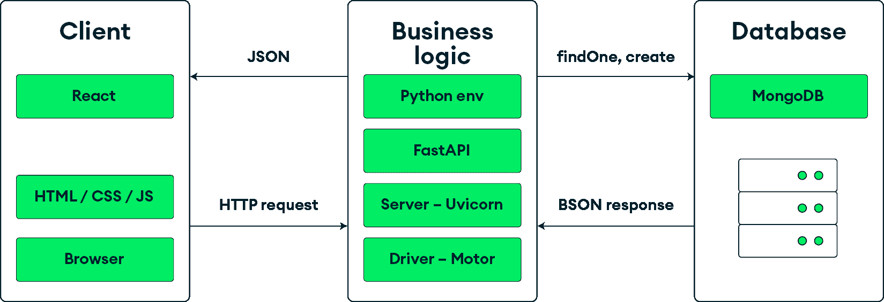

# 第一章：Web 开发与 FARM 栈

网站是使用一组被称为**栈**的技术构建的。栈的每个组件都负责应用的一层。虽然在理论上，你可以将任何类型的 frontend 技术与任何类型的 backend 技术结合，从而最终得到一个自定义栈，但一些栈在敏捷性和减少开发时间方面已经证明了自己的价值。如果你是一位需要不时将一些数据上线到网上的 Web 开发者或分析师，或者你只是想拓宽你的开发者视野，那么这一章应该会给你一些关于这组工具的视角，以及它们与替代技术的比较。

本章从可用技术和需求的角度概述了当今的 Web 开发格局，并在本章末尾，我们将论证使用**FARM**栈的必要性——这是一个结合了**FastAPI**用于 REST API 层、**React**用于前端和**MongoDB**作为数据库的栈。

本书专注于构成 FARM 栈的技术的高层次概念。通过学习这些概念，你将能够以快速的速度和现代的能力开发你的下一个 Web 开发项目。目前，我们不会深入细节或具体示例，而是将选定的栈组件（MongoDB、FastAPI 和 React）与它们的可能对应物进行比较。

到本章结束时，你将很好地理解 FARM 栈各个组件为开发项目带来的好处，它们之间的关系，以及为什么这一套技术非常适合具有灵活规格的 Web 应用——无论是从处理的数据还是期望的功能性来看。

本章将涵盖以下主题：

+   FARM 栈是什么以及组件是如何相互配合的？

+   为什么使用 MongoDB 进行数据存储？

+   什么是 FastAPI？

+   前端——React

# 技术要求

对于这本书，你需要一些东西来帮助你完成你的旅程。以下是一些建议：

+   Python 的最新版本

+   FastAPI ([`pypi.org/project/fastapi/`](https://pypi.org/project/fastapi/))

+   在你的笔记本电脑/台式机上为你的应用服务器创建一个本地开发环境

+   一个 MongoDB Atlas 云账户来托管你的数据库([`www.mongodb.com/cloud/atlas/register`](https://www.mongodb.com/cloud/atlas/register))

+   Visual Studio Code 或你选择的 IDE

让我们从对 FARM 栈的基本理解开始。

# FARM 栈是什么？

栈是一组覆盖现代 Web 应用不同部分的技术，混合并良好集成。正确的栈将使你在构建 Web 应用时能够满足某些标准，而所需的工作量和时间将比从头开始构建要少得多。

首先，让我们看看你需要构建一个功能性的 Web 应用需要什么：

+   **操作系统**：通常，这是基于 Unix/Linux 的。

+   **存储层**：一个 SQL 或 NoSQL 数据库。在这本书中，我们将使用 MongoDB。

+   **Web 服务器**：Apache 和 NGINX 相当受欢迎，但我们将讨论 FastAPI 的 Python 解决方案，如 Uvicorn 或 Hypercorn。

+   **开发环境**：Node.js/JavaScript、.NET、Java 或 Python。

可选的，并且通常是，你还可以添加一个前端库或框架（例如 Vue.js、Angular、React 或 Svelte），因为绝大多数的 Web 开发公司从采用一个框架中受益匪浅，无论是在一致性、开发速度还是符合标准方面。此外，用户期望随着时间的推移而改变。对于登录、按钮、菜单和其他网站元素应该是什么样子，以及它们应该如何工作，存在一些未言明的标准。使用框架将使你的应用程序与现代 Web 更加一致，并且对用户满意度大有裨益。

最著名的堆栈如下：

+   **MERN**：**MongoDB + Express.js + React + Node.js**（**MERN**）可能是当今最受欢迎的堆栈之一。开发者可以舒适地使用 JavaScript，除非他们需要编写一些样式表。随着 React Native 用于移动应用和 Electron.js 用于桌面应用，一个产品几乎可以涵盖每一个平台，同时仅依赖于 JavaScript。

+   **MEAN**：**MongoDB + Express.js + Angular.js + Node.js**（**MEAN**）与之前提到的 MERN 类似，Angular.js 以前端以更结构化的**模型-视图-控制器**（**MVC**）方式管理。

+   **LAMP**：**Linux + Apache + MySQL + PHP**（**LAMP**）可能是第一个流行起来的堆栈缩写，也是过去 20 年中使用最广泛的之一。它至今仍然非常受欢迎。

前两个堆栈运行在 Node.js 平台上（一个服务器端运行的 JavaScript V8 引擎），并且有一个共同的 Web 框架。尽管 Express.js 是最受欢迎的，但在 Node.js 宇宙中还有许多优秀的替代品，例如 Koa.js、Fastify.js，或者一些更结构化的，如 Nest.js。

由于这是一本 Python 书，我们还将介绍一些重要的 Python 框架。对于 Python 开发者来说，最受欢迎的前三个框架是**Django**、**Flask**和**FastAPI**。使用 Django Web 框架和优秀的**Django REST Framework**（**DRF**）以现代和逻辑的方式构建 REST API 非常流行。Django 本身在 Python 开发者中非常成熟且广为人知。它还包含一个管理站点，可以自定义和序列化 REST 响应，可以选择功能性和基于类的视图，等等。

另一方面，FastAPI 是一个相对较新的框架。首次发布于 2018 年 12 月，这个替代的轻量级框架迅速获得了支持者。几乎立即，这些支持者就在技术堆栈中为 FastAPI 创造了一个新的缩写——**FARM**。

让我们了解 FARM 代表什么：

+   **FA**代表 FastAPI——在技术年数中，一个全新的 Python Web 框架

+   **R** 代表 React，这是最受欢迎的 UI 库

+   **M** 代表数据层——MongoDB，这是目前最流行的 NoSQL 数据库

*图 1.1* 提供了 FARM 栈中各个组成部分之间集成的高级概述：



图 1.1：FARM 栈及其组件

如前图所示，FARM 栈由三层组成：

1.  用户通过客户端执行操作，在我们的案例中，这将是基于 React 的——这最终创建了一个包含 HTML、层叠样式表（CSS）和 JavaScript 的包。

1.  此用户操作（如鼠标点击、表单提交或其他事件）随后触发一个 HTTP 请求（如 `GET`、`POST`、`PUT` 或带有有效负载的其他 HTTP 动词）。

1.  最后，此请求由 REST API 服务（FastAPI）处理。

Python 部分以 FastAPI 和可选依赖为中心，并由 `findOne`、`find`、`create`、`update` 等操作以及 MongoDB 聚合框架提供服务。从数据库中获得的结果通过 FastAPI 的 Python 驱动（Motor）进行解释，从 BSON 转换为适当的 Python 数据结构，并最终以纯 JSON 的形式从 REST API 服务器输出。如果你使用 **Motor**，这是一个 MongoDB 的异步 Python 驱动程序，这些调用将以异步方式处理。

最后，回到 *图 1.1* 中的图和标有 **JSON** 的箭头，数据被输入到 UI 中，由 React 处理，并用于更新界面、渲染必要的组件以及将 UI 与 React 的虚拟 DOM 树同步。

接下来的几节将讨论 FARM 栈诞生的动机。为什么选择这些技术，更重要的是，为什么选择这些技术组合？你将详细了解每个组件及其使其成为现代 Web 开发工作流程良好匹配的功能。在简要介绍整个栈的好处之后，这些章节将提供每个选择的概述，并强调它可以为现代 Web 开发工作流程提供的优势。

# 为什么选择 FARM 栈？

栈的灵活性和简单性，以及其组件，在开发速度、可扩展性和可维护性方面提供了真正的提升，同时允许未来的可扩展性（由于 MongoDB 的分布式特性以及 FastAPI 的异步特性），如果您的产品需要发展并变得比最初预期的更大，这可能至关重要。理想的情况可能是一个可以实验的小到中型规模的 Web 应用程序。

开发人员和分析师都可以从 Python 的生态系统和扩展性中受益，这个生态系统包含几乎涵盖所有包含某种类型计算的人类活动的丰富模块。

# 为什么使用 MongoDB？

MongoDB 是一个免费、快速且可扩展的数据库，具有 JSON 格式和简单语法。它支持灵活的模式，从而实现迭代和快速开发。MongoDB 能够适应各种复杂性的数据结构。此外，其查询和聚合方法使其成为像 FastAPI 这样的灵活 REST API 框架的绝佳选择，结合官方 Python 驱动程序如 Motor。它具有高度的采用率和成熟度，并且是十年前席卷 Web 开发世界的 NoSQL 数据存储运动支柱之一。

以下是一些将在本书中详细说明的其他功能：

+   **复杂的嵌套结构**：MongoDB 文档允许嵌入其他文档和文档数组，这自然地转化为现代数据网络应用程序的数据流（例如，可以将所有评论嵌入到它们所响应的博客文章中）。鼓励去规范化。

+   **简单直观的语法**：执行基本 **创建**、**读取**、**更新**、**删除**（**CRUD**）操作的方法，结合强大的聚合框架和投影，通过使用驱动程序，几乎可以轻松实现所有数据读取。对于有 SQL 经验的人来说，这些命令应该是直观的。

+   **社区和文档**：MongoDB 由一家成熟的公司和一个强大的社区支持，并提供各种工具以促进开发和原型设计过程。例如，**Compass** 是一个桌面应用程序，它允许用户管理和维护数据库。无服务器函数的框架正在不断更新和升级，并且几乎为每种编程语言都提供了优秀的驱动程序。

当然，MongoDB 不是一个万能的解决方案，一些挑战在开始时就值得注意。一方面，无模式设计和将任何类型的数据插入数据库的能力可能会引起一些恐慌，但这转化为后端需要更强的数据完整性验证。你将看到 **Pydantic**——一个优秀的 Python 验证和类型强制库——如何帮助你实现更强的数据完整性。在 SQL 世界中存在的复杂连接的缺失，可能是一些应用程序的致命缺陷。

现在你已经了解了 MongoDB 在可扩展性和灵活性方面的优势，以及其无模式的方法，那么请看看你选择的 REST API 框架 FastAPI，并学习它是如何帮助你实现无模式方法并简化与数据的交互的。

# 为什么使用 FastAPI？

FastAPI 是一个现代且性能卓越的 Web 框架，用于构建 API。由 Sebastian Ramirez 构建，它使用了 Python 编程语言的新特性，如类型提示和注解、*async – await* 语法、Pydantic 模型、WebSocket 支持，等等。

如果你不太熟悉 API，让我们深入了解，通过了解 API 是什么来开始。**应用程序编程接口**（**API**）用于实现不同软件组件之间的某种交互，它们通过请求和响应的周期使用**超文本传输协议**（**HTTP**）进行通信。因此，API 如其名所示，是一个接口。通过这个接口，人类或机器与应用程序或服务进行交互。每个 API 提供商都应该有一个适合他们提供的数据类型的接口；例如，一个天气预报站提供的 API 会列出某个地点的温度和湿度水平。体育网站提供正在进行的比赛的统计数据。一个比萨饼配送 API 会提供所选配料、价格和预计送达时间。

API 涉及到你生活的方方面面，例如，传输医疗数据、实现应用程序之间的快速通信，甚至在田野中的拖拉机上使用。API 是使今天的网络运行的原因，简单来说，是信息交换的最佳形式。

本章不会详细讲解 REST API 的严格定义，而是列出它们的一些最重要的特性：

+   **无状态**：据说 REST API 是无状态的，这意味着客户端和服务器之间不存储任何状态。所有请求和响应都由 API 服务器独立处理，且不涉及会话本身的信息。

+   **分层结构**：为了保持 API 可扩展性和可理解性，RESTful 架构意味着一个分层结构。不同的层形成一个层次结构，相互通信但不与每个组件通信，从而提高了整体安全性。

+   **客户端-服务器架构**：API 应该能够连接不同的系统/软件组件，而不限制它们自身的功能——服务器和客户端必须保持相互独立。

虽然与其他 Python 框架相比较新，但 MongoDB 选择 FastAPI 作为他们的 REST API 层有许多原因。以下是其中的一些原因：

+   **高性能**：FastAPI 可以实现非常高的性能，尤其是与其他基于 Python 的解决方案相比。通过底层使用 Starlette，FastAPI 的性能达到了通常只属于 Node.js 和 Go 的水平。

+   **数据验证和简洁性**：由于 Pydantic 极度依赖 Python 类型，这带来了许多好处。由于 Pydantic 结构只是开发者定义的类的实例，你可以使用复杂的数据验证、深度嵌套的 JSON 对象和分层模型（使用 Python 列表和字典），这与 MongoDB 的本质非常契合。

+   **快速开发**：有了强大的**集成开发环境**（**IDE**）支持，开发变得更加直观，这导致开发时间更短，错误更少。

+   **标准兼容性**：FastAPI 基于标准，完全兼容用于构建 API 的开放标准——如 OpenAPI 和 JSON 模式。

+   **应用逻辑结构化**：该框架允许将 API 和应用程序结构化为多个路由器，允许对请求和响应进行细粒度定制，并轻松访问 HTTP 周期的每个部分。

+   将`asyncio`模块集成到 Python 中。

+   **依赖注入**：FastAPI 中的依赖注入系统是其最大的卖点之一。它使得创建复杂的功能变得容易重用，这些功能可以在你的 API 中轻松使用。这是一件大事，可能是使 FastAPI 成为混合 Web 应用理想的特性——它为开发者提供了将不同功能轻松附加到 REST 端点的机会。

+   **优秀的文档**：该框架本身的文档非常出色，无与伦比。它既易于遵循，又内容丰富。

+   **自动文档生成**：基于 OpenAPI，FastAPI 能够实现自动文档的创建，这本质上意味着你可以免费使用 Swagger 来获取你的 API 文档。

此外，入门相对简单：

```py
pip install fastapi
```

为了至少对使用 FastAPI 进行编码有一个基本的概念，让我们看看一个最小化的 API：

```py
# main.py
from fastapi import FastAPI
app = FastAPI()
@app.get(“/”)
async def root():
    return {“message”: “Hello World”}
```

前几行代码定义了一个具有单个端点（`/`）的最小 API，该端点对`GET`请求返回消息`Hello world`。你可以实例化一个 FastAPI 类，并使用装饰器告诉服务器哪些 HTTP 方法应该触发哪个函数以进行响应。

# Python 和 REST API

Python 已经用于构建 REST API 很长时间了。尽管有许多选项和解决方案，**DRF**和**Flask**似乎是最受欢迎的，至少直到最近。如果你喜欢冒险，你可以通过 Google 搜索不那么流行或较旧的框架，例如**bottle.py**和**CherryPy**。

DRF 是 Django Web 框架的插件系统，它使 Django 系统能够创建高度定制的 REST API 响应，并基于定义的模型生成端点。DRF 是一个非常成熟且经过实战检验的系统。它定期更新，其文档非常详细。

Flask，Python 的轻量级微框架，是网络构建 Python 工具中的瑰宝，并且可以用多种方式创建 REST API。你可以使用纯 Flask 并输出适当的格式（即，JSON 而不是 HTML），或者使用一些开发出来的扩展，使创建 REST API 尽可能简单。这两种解决方案在本质上都是同步的，尽管似乎有积极的发展方向，旨在启用异步支持。

此外，还有一些非常强大和成熟的工具，例如 Tornado，它是一个异步网络库（和服务器），能够扩展到数万个开放连接。最后，在过去的几年里，已经创建了几个基于 Python 的新解决方案。

这些解决方案中的一种，并且可以说是最快的，是 Starlette。被称为轻量级的 ASGI 框架/工具包，它非常适合构建高性能的异步服务。

塞巴斯蒂安·拉米雷斯（Sebastian Ramirez）在 Starlette 和 Pydantic 的基础上构建了 FastAPI，同时通过使用最新的 Python 特性（如类型提示和异步支持）添加了众多功能和优点。根据一些最近的开发者调查 1，FastAPI 正迅速成为最受欢迎和最受欢迎的 Web 框架之一。

1 [`www.jetbrains.com/lp/devecosystem-2023/python/#python_web_libs_two_years`](https://www.jetbrains.com/lp/devecosystem-2023/python/#python_web_libs_two_years)

在本书的后续章节中，您将了解 FastAPI 最重要的功能，但在此阶段，我们将强调拥有一个真正异步的 Python 框架作为系统最多样化组件的粘合剂的重要性。实际上，除了执行通常的 Web 框架任务，如与数据库通信、向前端输出数据、管理身份验证和授权之外，这个 Python 管道还使您能够通过依赖注入系统快速集成并轻松执行频繁需要的任务，如后台作业、头部和正文操作、响应和请求验证等。

本书将尝试涵盖您构建简单 FastAPI 系统所需的绝对最小必要条件，但在过程中，它将考虑各种网络服务器解决方案和部署选项（如 Deta、Heroku 和 DigitalOcean）为您基于 FastAPI 的 Python 后端，同时尝试选择免费解决方案。

因此，简而言之，您应该考虑选择 FastAPI，因为您理想上希望拥有异步处理请求的能力和速度，就像使用 Node.js 服务器一样，同时又能访问 Python 生态系统。此外，您还希望拥有一个框架的简单性和开发速度，该框架可以自动为您生成文档。

在审查了后端组件之后，现在是时候确定你的技术栈并着手前端工作了。下一节将为您简要介绍 React，并讨论它与其他（同样有效）解决方案的区别。

# 前端——React

当谈到前端——即面向用户的网站部分时，网络世界的变化最为明显。蒂姆·伯纳斯-李（Tim Berners-Lee）于 1991 年首次公开了第一个 HTML 规范，它由文本和不到 20 个标签组成。1994 年，CSS 被引入，网络开始看起来更加美观。传说中，名为 Mocha 的新浏览器脚本语言在短短 10 天内被创造出来——那是在 1995 年。后来，这种语言经历了多次变化，成为了我们今天所熟知的 JavaScript——一种强大且快速的编程语言，随着 Node.js 的出现，它也能够征服服务器。

2013 年 5 月，React 在美国推出，整个 Web 开发界得以见证虚拟 DOM、单向数据流、Flux 模式等。

这只是一点历史，旨在尝试提供一些背景和连贯性，因为 Web 开发，就像任何其他创造性的人类活动一样，很少会跳跃式发展。通常，它是通过一系列步骤发展的，使用户能够解决他们面临的问题。不提 Vue.js 就是不公平的，它是一个构建前端的好选择，同时也拥有一个完整的库生态系统，而 Svelte.js 则在构建 UI 方面提供了一个根本性的转变，即 UI 是编译的，捆绑的大小显著减小。

## 为什么使用 React？

对于任何面向公众的 Web 应用程序来说，交互式、吸引人、快速且直观的 UI 是必需的。虽然非常困难，但仅使用纯 JavaScript 就可以实现大多数甚至所有简单 Web 应用程序预期提供的功能。FastAPI 能够使用任何兼容的模板引擎（在 Python 世界中，最广泛使用的大概是 Jinja2）来服务 HTML（以及静态文件，如 JavaScript 或 CSS），但我们和用户想要的更多。

与其他框架相比，React 较小。它甚至不被视为框架，而是一个库——实际上，是几个库。尽管如此，它是一个经过超过 10 年开发、为 Facebook 的需求而创建、并由像 Uber、X（前身为 Twitter）和 Airbnb 这样的最大公司使用的成熟产品。

本书没有深入探讨 React，因为我们想专注于 FARM 栈的所有不同部分是如何连接并融入更大图景中的。此外，81% 的开发者已经使用 React2 并且熟悉其功能，因此我们假设我们的读者已经对这一框架有一定程度的了解。

2 [`2022.stateofjs.com/en-US/libraries/front-end-frameworks/`](https://2022.stateofjs.com/en-US/libraries/front-end-frameworks/)

大多数开发者希望有一个简化和结构化的方式来构建 UI。React 通过依赖 JSX——JavaScript 和 XML 的混合体，具有直观的基于标签的语法，并为开发者提供了一种将应用程序视为组件的方式，这些组件进而形成其他更复杂的组件，从而将构建复杂 UI 和交互的过程分解为更小、更易于管理的步骤，使开发者能够以更简单的方式创建动态应用程序。

使用 React 作为前端解决方案的主要好处可以总结如下：

+   **性能**：通过使用在内存中运行的 React 虚拟 DOM，React 应用提供了平滑且快速的性能。

+   **可复用性**：由于该应用是通过使用具有自身属性和逻辑的组件构建的，因此您可以一次性编写组件，然后根据需要多次复用它们，从而减少开发时间和复杂性。

+   **易用性**：这始终有点主观，但 React 入门很容易。高级概念和模式需要一定程度的熟练度，但即使是新手开发者也能从将应用程序前端拆分为组件并像乐高积木一样使用它们的可能性中立即获得好处。

React 和基于 React 的框架使你作为开发者能够创建具有桌面级外观和感觉的单页应用程序，同时还有对搜索引擎优化有益的服务器端渲染。了解 React 的使用方法使你能够从今天最强大的前端 Web 框架中受益，例如 Next.js、静态站点生成器（如 Gatsby.js）或令人兴奋且充满希望的新来者（如 React Remix）。

在*版本 16.8*中，React 库引入了**钩子**，使开发者能够在不使用类的情况下使用和操作组件的状态，以及一些 React 的其他功能。这是一个重大的变化，成功地解决了不同的问题——它使得在组件之间重用状态逻辑成为可能，并简化了复杂组件的理解和管理。

最简单的 React 钩子可能是`useState`钩子。这个钩子使你能够在组件的生命周期内拥有并维护一个状态值（如对象、数组或变量），而无需求助于老式的基于类的组件。

例如，一个可能用于用户尝试找到合适的汽车时过滤搜索结果的非常简单的组件可能包含所需的品牌、型号和生产年份范围。这种功能非常适合作为单独的组件——一个需要维护不同输入控件状态（可能实现为一系列下拉菜单）的搜索组件。让我们看看这种实现的 simplest 可能版本。

以下代码块创建了一个简单的函数组件，它具有单个状态字符串值——一个 HTML `select`元素，它将更新名为`brand`的状态变量：

```py
import { useState } from “react”;
const Search = () => {
const [brand, setBrand] = useState(“”);
return (
<div>
<div>Selected brand: {brand}</div>
<select onChange={(ev) => setBrand(ev.target.value)}>
<option value=””>All brands</option>
<option value=”Fiat”>Fiat</option>
<option value=”Ford”>Ford</option>
<option value=”Renault”>Renault</option>
<option value=”Opel”>Opel</option>
</select>
</div>
);
};
export default Search;
```

粗体行是钩子魔法发生的地方，它必须位于函数体内部。该语句仅仅创建了一个新的状态变量，称为`brand`，并为你提供了一个 setter 函数，可以在组件内部使用它来设置所需的值。

有许多钩子可以解决不同的问题，本书将介绍以下基本钩子：

+   **声明式视图**：在 React 中，你不必担心 DOM 的过渡或突变。React 处理一切，你唯一需要做的就是声明视图的外观和反应。

+   **无模板语言**：React 实际上使用 JavaScript 作为模板语言（通过 JSX），因此为了能够有效地使用它，你只需要了解一些 JavaScript，例如数组操作和迭代。

+   **丰富的生态系统**：有众多优秀的库可以补充 React 的基本功能——从路由器到自定义钩子、外部库集成、CSS 框架适配等等。

最终，钩子为 React 提供了一种新的方式，在组件之间添加和共享状态逻辑，甚至可以在简单情况下取代 Redux 或其他外部状态管理库的需求。本书中展示的大部分示例都使用了上下文 API——这是一个 React 特性，它允许在不通过不需要它的组件传递 props 的情况下将对象和函数传递到组件树中。结合钩子——`useContext`钩子——它提供了一种简单直接的方式，在应用的每个部分传递和维护状态值。

React 使用（尽管不是强制性的）功能 JavaScript 的最新特性，ES6 和 ES7，尤其是在数组方面。使用 React 可以提高对 JavaScript 的理解，类似的情况也可以说关于 FastAPI 和现代 Python。

最后一部分将是选择 CSS 库或框架。截至 2024 年，有数十个 CSS 库与 React 兼容，包括 Bootstrap、Material UI、Bulma 等等。许多这些库与 React 合并，成为预构建的自定义和参数化组件的有意义框架。我们将使用 Tailwind CSS，因为它易于设置——并且一旦你掌握了它，它就非常直观。

将 React 部分保持到最基本，应该能让你更多地关注故事中的真正主角——FastAPI 和 MongoDB。如果你愿意，可以轻松地替换 React，无论是 Svelte.js、Vue.js 还是纯手工打造的 ECMAScript。然而，通过学习 React（及其钩子）的基础知识，你将踏上一次美妙的网络开发之旅，这将使你能够使用和理解建立在 React 之上的许多工具和框架。

争议性地，Next.js 是功能最丰富的服务器端渲染 React 框架，它支持快速开发、基于文件系统的路由等等。

# 摘要

本章为 FARM 堆栈奠定了基础，从描述每个组件的角色到它们的优点。现在，你将自信地选择 FARM 堆栈，并且知道如何在灵活和流动的网络开发项目中实现它。既然你在阅读，我会假设我的案例是有说服力的——你对它仍然感兴趣，并准备好探索 FARM 堆栈。

下一章将提供一个快速、简洁、可操作的 MongoDB 概述，然后为你的 FARM 应用程序设置数据存储层。随着你的进展，我们相信你会发现 FastAPI、React 和 MongoDB 的组合是你下一个网络应用程序的最佳选择。
