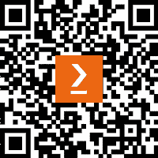

# 前言

《全栈 Flask 和 React》旨在成为你掌握使用动态组合——React 和 Flask——进行全栈式网页开发艺术的终极指南。

不论你是想同时学习前端和后端开发的求知欲旺盛的学习者，还是想扩展技能集的经验丰富的开发者，这本书的结构旨在带你踏上构建现代网页应用的旅程。

在当今这个数字时代，构建能够与用户交互、动态响应且无缝适应用户交互的网页应用至关重要。Flask 是一个用 Python 编写的开源微型网页框架，它促进了快速开发并采用了干净且实用的设计方法。另一方面，React 是一个用于构建用户界面的 JavaScript 库，它提供了一种高效且灵活的方式来创建交互式 UI。通过结合 React 和轻量级的 Flask 框架的力量，你将能够轻松地创建现代全栈式网页应用。

在这本书中，我们将首先探讨以组件驱动的开发模式 React，并探索 React 的基础知识。我们将探讨诸如组件、属性和状态、JSX、使用 React Hooks 管理状态、React 中的数据获取、显示列表、事件处理、使用 React Router 进行路由以及使用 Jest 进行单元测试等概念。然后，我们将继续使用 Flask 进行全栈应用开发。

我们将涵盖从 SQL 和数据建模到创建 RESTful API、将 React 客户端与 Flask 后端集成、身份验证和授权、使用 Blueprint 构建模块化和可重用 Flask 应用、错误处理、Flask 中的单元测试，以及了解你的网页应用如何部署到云端的各个方面。我们将把复杂的概念分解成小块，提供清晰的解释，并提供实用的示例，以确保你在学习过程中掌握每个主题。无论你更喜欢通过实践学习，还是喜欢深入研究这些技术的内部工作原理，我们都为你提供了相应的支持。

# 这本书面向的对象

这本书非常适合对全栈式网页开发技能和知识感兴趣的开发者。无论你是想学习 React 进行前端开发的后端开发者，还是想学习 Flask 进行服务器端开发的前端开发者，这本书都将为你提供必要的指导和实用的示例，帮助你精通全栈式开发。

为了从这本书中获得益处，需要具备基本的 HTML、CSS、JavaScript 和 Python 知识。

为了从这本书中获得益处，需要具备基本的 HTML、CSS、JavaScript 和 Python 知识。

# 本书涵盖的内容

本书分为 16 章，每章都专注于你需要掌握的、成为精通全栈 Flask 网页开发与 React 所必需的基本概念和实践技巧。

让我们更深入地看看这些章节：

*第一章*，*使用 React 和 Flask 准备全栈开发*，为你全栈开发之旅奠定基础。我们将讨论使用 React 和 Flask 开发 Web 应用程序的原因。你将学习如何设置你的开发环境、安装 React 和 Flask。你还将学习 Git 的源代码版本控制和本书中我们将构建的项目。

*第二章*，*React 入门*，介绍了 React 的基础知识，包括探索 React 项目结构、组件、props 和状态。我们将讨论在 React 中经常使用的 JavaScript 概念，如解构、箭头函数和默认及命名导出。你将为创建 React 应用程序打下坚实的基础。

*第三章*，*使用 React Hooks 管理状态*，深入探讨了 React Hooks 的强大功能，如`useState`、`useEffect`、`useContext`、`useRef`、`useMemo`、`useCallback`和`useReducer`。你将发现 Hooks 如何简化状态管理，并使你能够创建更可重用和可扩展的代码。

*第四章*，*使用 React API 获取数据*，专注于在 React 应用程序中获取数据。你将探索使用 React Query、async/await 语法、Fetch API 和 Axios 的不同技术；处理加载和错误状态；并实现缓存以高效检索数据。

*第五章*，*JSX 和 React 中的列表显示*，涵盖了在 React 中显示动态列表。你将学习如何使用 JSX 作为连接 JavaScript 和 HTML 的桥梁，在 JSX 中实现嵌套列表，在 JSX 中遍历对象，并高效地处理 React 中的事件。

*第六章*，*使用 React Router 和表单*，指导你处理表单输入和验证、表单提交，以及使用 React Router 实现客户端路由的过程。

*第七章*，*React 单元测试*，教你如何使用 Jest 和 React Testing Library 为 React 组件编写全面的单元测试。你将对你代码的质量和可靠性充满信心。

*第八章*，*SQL 和数据建模*，向你介绍 SQL 和数据库建模。你将学习如何设置数据库、执行 CRUD 操作，并为你的应用程序设计高效的数据模型。

*第九章*，*API 开发和文档*，深入 Flask API 开发的领域。你将理解 RESTful API 概念，实现 CRUD 操作，并有效地记录你的 API。

*第十章*，*将 React 前端与 Flask 后端集成*，专注于建立 React 客户端与 Flask 后端之间的通信。你将学习如何无缝处理 API 调用和请求。

*第十一章*，*在 React-Flask 应用程序中获取和显示数据*，探讨了在全栈 React-Flask 应用程序中获取和显示数据的过程。你将学习如何在 Flask-React 应用程序中处理 CRUD 操作。你还将学习如何在 Flask 应用程序中处理分页。

*第十二章*，*身份验证和授权*，涵盖了用户身份验证和授权的基本主题。你将实现安全的登录和注册功能，识别系统用户并管理他们的信息，了解会话管理，创建受密码保护的资源，在 Flask 中实现闪存消息，并确保你应用程序的安全性。

*第十三章*，*错误处理*，深入探讨了 Flask 应用程序中的有效错误处理技术。你将了解不同类型的错误以及如何使用 Flask 调试器，创建错误处理器，创建自定义错误页面，跟踪应用程序中的事件，并向管理员发送错误邮件。

*第十四章*，*模块化架构 – 蓝图的威力*，介绍了 Flask 中的模块化架构和蓝图的概念。你将学习如何将你的代码库组织成可重用的模块，并创建可扩展的应用程序结构。

*第十五章*，*Flask 单元测试*，探讨了单元测试在 Flask 应用程序中的重要性。你将发现为你的 Flask 组件编写全面测试的技术，确保你后端的健壮性。

*第十六章*，*容器化和 Flask 应用程序部署*，通过涵盖 Flask 应用的部署和容器化来结束本书。你将学习如何在服务器上部署你的应用程序，并利用容器化技术进行高效的部署。

每一章都精心设计，以提供清晰的解释，以开发交互性强且高效的快速企业级网络应用程序。你将深入理解 React 和 Flask，并成为开发全栈网络应用程序的专家。

我们希望这本书能成为你在成为熟练的全栈网络开发者旅程中的必备 definitive 指南。不要犹豫去尝试、提问，并探索我们涵盖主题的边界之外。这本书是一个起点，但可能性是无限的。让我们深入其中，解锁 *全栈 Flask Web 开发* *与 React* 的无限潜力！

# 为了充分利用这本书

我们建议使用 Python 的最新版本。Flask 支持 Python 3.8+，React，以及 Node.js 16+，并且需要安装 Docker 23+。本书中的所有代码和示例都使用 Flask 2.3.2 和 React 18.2 进行测试。

| **本书涵盖的软件/硬件** | **操作系统要求** |
| --- | --- |
| Python | Windows, macOS, 或 Linux |
| React | Windows, macOS, 或 Linux |
| Flask | Windows, macOS, 或 Linux |
| PostgreSQL | Windows, macOS, 或 Linux |
| Docker | Windows, macOS, 或 Linux |
| JavaScript | Windows, macOS, 或 Linux |

**如果您正在使用本书的数字版，我们建议您亲自输入代码或从书的 GitHub 仓库（下一节中提供链接）获取代码。这样做将帮助您避免与代码的复制和粘贴相关的任何潜在错误。**

# 下载示例代码文件

您可以从 GitHub 下载本书的示例代码文件：[`github.com/PacktPublishing/Full-Stack-Flask-and-React`](https://github.com/PacktPublishing/Full-Stack-Flask-and-React)。如果代码有更新，它将在 GitHub 仓库中更新。

我们还有其他丰富的图书和视频的代码包，可在[`github.com/PacktPublishing/`](https://github.com/PacktPublishing/)找到。查看它们吧！

使用的约定

本书使用了多种文本约定。

`文本中的代码`：表示文本中的代码单词、数据库表名、文件夹名、文件名、文件扩展名、路径名、虚拟 URL、用户输入和 Twitter 账号。以下是一个示例：“设置完成后，导航到 `Bizza` 文件夹。”

代码块设置如下：

```py
bizza/--node_modules/
--public/
----index.html
----manifest.json
```

当我们希望您注意代码块中的特定部分时，相关的行或项目将以粗体显示：

```py
function App() {  return (
    <div className="App">
      <header className="App-header">
        
        <p>
          Edit <code>src/App.js</code> and save to reload.
```

任何命令行输入或输出应如下所示：

```py
$ node -v$ npm -v
```

**粗体**：表示新术语、重要单词或您在屏幕上看到的单词。例如，菜单或对话框中的单词以粗体显示。以下是一个示例：“登录并点击 **仓库**。”

小贴士或重要提示

看起来是这样的。

# 联系我们

我们始终欢迎读者的反馈。

**一般反馈**：如果您对本书的任何方面有疑问，请通过 customercare@packtpub.com 给我们发邮件，并在邮件主题中提及书名。

**勘误**：尽管我们已经尽一切努力确保内容的准确性，但错误仍然可能发生。如果您在这本书中发现了错误，我们将不胜感激，如果您能向我们报告，我们将非常感谢。请访问[www.packtpub.com/support/errata](http://www.packtpub.com/support/errata)并填写表格。

**盗版**：如果您在互联网上以任何形式遇到我们作品的非法副本，如果您能提供位置地址或网站名称，我们将不胜感激。请通过版权@packt.com 与我们联系，并提供材料的链接。

**如果您有兴趣成为作者**：如果您在某个主题上具有专业知识，并且您有兴趣撰写或为本书做出贡献，请访问[authors.packtpub.com](http://authors.packtpub.com)。

# 分享您的想法

一旦您阅读完*全栈 Flask 和 React*，我们非常乐意听到您的想法！请[点击此处直接进入该书的亚马逊评论页面](https://packt.link/r/1803248440)并分享您的反馈。

您的评论对我们和科技社区非常重要，并将帮助我们确保我们提供高质量的内容。

# 下载此书的免费 PDF 副本

感谢您购买此书！

您喜欢在路上阅读，但无法携带您的印刷书籍到处走？您的电子书购买是否与您选择的设备不兼容？

别担心，现在每购买一本 Packt 书籍，您都可以免费获得该书的 DRM 免费 PDF 版本。

在任何地方、任何地点、任何设备上阅读。从您最喜欢的技术书籍中搜索、复制和粘贴代码直接到您的应用程序中。

优惠不仅限于此，您还可以获得独家折扣、时事通讯和丰富的免费内容，每天直接发送到您的收件箱

按照以下简单步骤获取这些好处：

1.  扫描二维码或访问以下链接



[`packt.link/free-ebook/9781803248448`](https://packt.link/free-ebook/9781803248448)

1.  提交您的购买证明

1.  就这些！我们将直接将免费 PDF 和其他优惠发送到您的电子邮件

# 第一部分 – 使用 React 进行前端开发

欢迎来到本书的第一部分。在本部分中，我们将开始一段激动人心的旅程，探索 React 前端开发的世界。在本节中，我们将深入研究构成现代 Web 开发 React 库核心概念和技术的基本概念。

您将学习到关键原则和最佳实践，这将使您能够构建动态和交互式的用户界面。我们将涵盖核心概念，从设置您的开发环境到创建可重用组件以及在 React 中管理状态。 

本部分包含以下章节：

+   *第一章*, *使用 React 和 Flask 准备全栈*

+   *第二章*, *React 入门*

+   *第三章*, *使用 React Hooks 管理状态*

+   *第四章*, *使用 React API 获取数据*

+   *第五章*, *JSX 和 React 中的列表显示*

+   *第六章*, *使用 React Router 和表单进行工作*

+   *第七章*, *React 单元测试*
