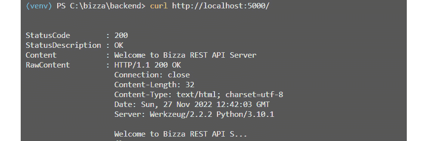
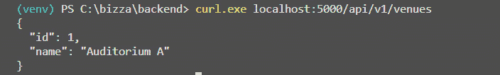
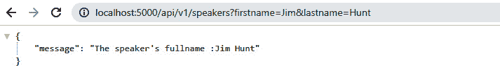
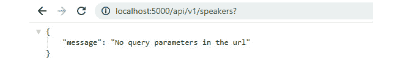
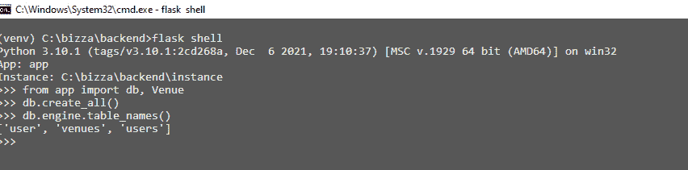
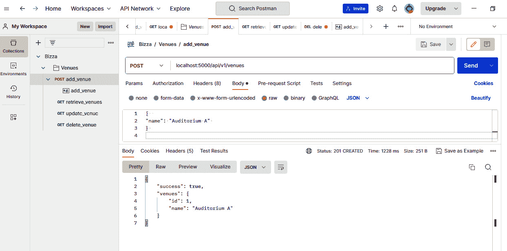
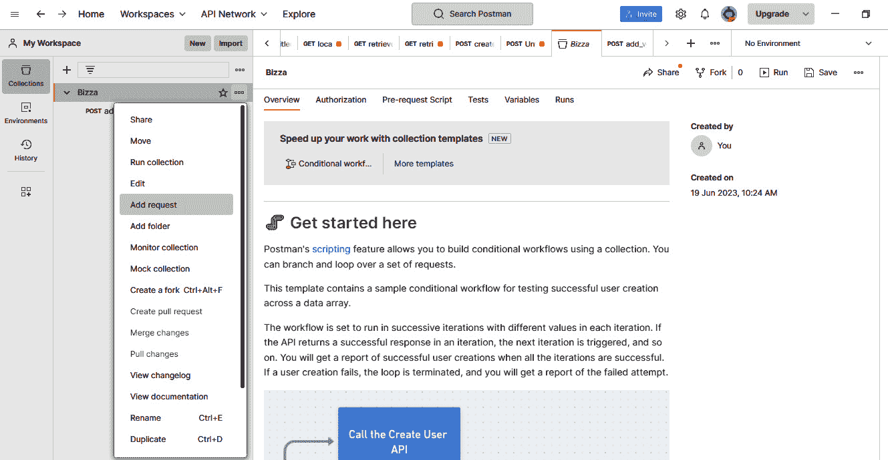
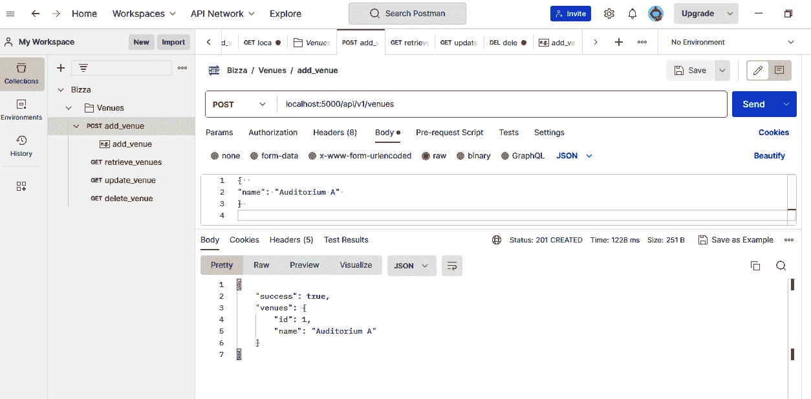
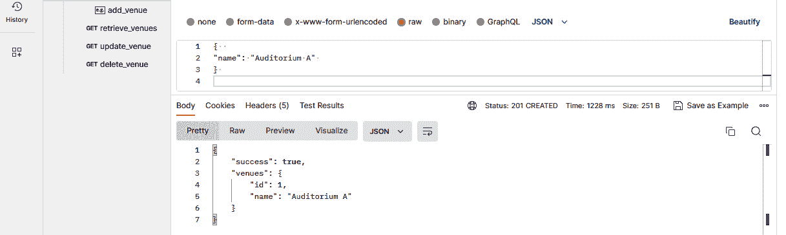
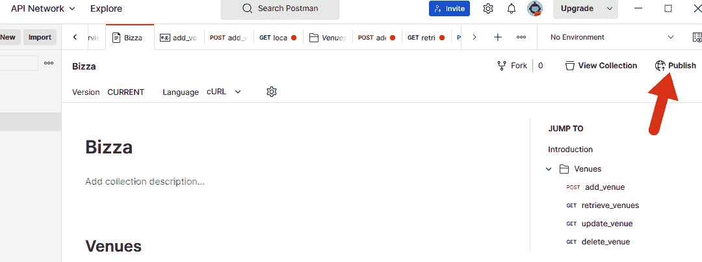

# 第九章：API 开发和文档

**应用程序编程接口**（**API**）是许多开发者用来处理数据和促进不同系统间通信的技术核心。API 启用的数字商业模式正在快速发展。对有经验的开发者来说，构建创新企业解决方案的需求也在不断上升。

API 经济正在演变成为一种新的可持续业务增长商业模式，为商业主和明智的执行者提供了大量机会。如果曾经有成为开发者的时机，那就是现在，因为公共 API 和有价值的商业 API 如此之多，它们可以使得应用开发和部署变得更容易实现。

在本书的前面部分，我们讨论了如何使用数据库和数据建模来有效地存储和检索所需的应用数据。本章提供了深入后端开发的机会，利用 API 技术实现各种客户端应用程序和后端服务之间的无缝通信。

你将学习在 Flask Web 应用程序中进行 API 设计和开发。我们将涉及常见的 API 术语，以提升你对 API 设计的理解水平。你将学习 REST API 最佳实践以及如何在 Flask 和 SQLAlchemy 中实现数据库 CRUD 操作。

到我们结束本章时，你将更好地理解 RESTful API 架构以及如何在 Flask Web 应用程序中设计和实现 RESTful API。你将获得对端点和有效载荷结构的改进理解，以便有效地处理数据。

最终，你将能够构建能够处理 HTTP 请求和响应的 Flask Web 应用程序。你将能够使用 Flask 的 SQLAlchemy 扩展与数据库交互并执行 CRUD 操作。

最后，你将测试一些 API 端点，并使用 Postman 编写清晰简洁的实现 API 端点的文档。

在本章中，我们将涵盖以下主题：

+   什么是 API？

+   为什么在 Web 开发中使用 API

+   端点和有效载荷结构

+   理解 HTTP 请求/响应

+   理解 HTTP 状态码

+   REST API 设计原则

+   在 Flask 应用程序中实现 REST API

+   通过 CRUD 操作与数据库进行 API 交互

+   API 文档

# 技术要求

本章的完整代码可在 GitHub 上找到：[`github.com/PacktPublishing/Full-Stack-Flask-and-React/tree/main/Chapter09`](https://github.com/PacktPublishing/Full-Stack-Flask-and-React/tree/main/Chapter09).

# 什么是 API？

**API** 代表 **应用程序编程接口**。表面上，API 似乎是一种新的技术术语，旨在使学习应用开发变得困难。事实并非如此。API 的核心目的是根据一套约定的规则、方法和协议，促进不同系统之间的通信。

在 Web 应用程序的背景下，API 帮助全渠道前端应用程序与后端服务进行通信。对数字服务的不断需求正在推动企业组织产生创新想法，通过设计和实现 API 使他们的数字资产可用。

作为一名开发者，你将花费大量时间开发以 API 驱动的解决方案。了解如何设计和实现 API 解决方案可以增加你的技能资本和对你雇主的价值。总的来说，有两种类型的 API：**私有 API**和**公共 API**。

私有 API 有时被称为内部 API。私有 API 描述了一个开放架构接口，允许组织内部的开发者访问关键组织数据。有了 API，自动化业务流程和管理各个业务单位之间的信息流变得容易。

私有 API 允许企业利用现有的可重用平台高效地开发内部解决方案。例如，你可以通过利用相同的后端服务，将你的前端应用程序的范围从 Web 应用程序扩展到移动应用程序。

另一方面，公共 API 描述了一个标准化的接口，允许组织外部的开发者以编程方式访问组织的数据和服务，这些数据和服务是为公众消费而设计的。这一套接口允许开发者构建新的应用程序或为他们的应用程序添加更多功能，而无需重新发明轮子。在这个时代，大量的公共 API 可供开发者学习，并且是开发创新解决方案的明智方式。

以下 GitHub 链接描述了一些你可以利用的公共 API：[`github.com/public-apis/public-apis`](https://github.com/public-apis/public-apis)。例如，Google、Twitter、Facebook 和 Spotify 等平台允许开发者通过 API 访问平台的数据。有了这个，开发者能够构建按需服务和产品。

此外，其他形式的 API 包括**简单对象访问协议**（**SOAP**）、**JavaScript 对象表示法-远程过程调用**（**JSON-RPC**）、**可扩展标记语言-远程过程调用**（**XML-RPC**）和**表征状态转移**（**REST**）。这些规则、协议和规范描述了不同的系统如何通过网络进行通信。虽然 JSON-RPC 和 REST 可以一起使用，但探索这种集成超出了本书的范围。

本书下一部分将探讨为什么 API 已成为企业和开发者关键技术的关键，以及它们是如何改变软件、工具和数字服务的构建和消费方式的。

# 为什么在 Web 开发中使用 API

API 是现代网络应用开发的一个组成部分。你很少会遇到一个没有某种形式 API 实现的以数据驱动的网络应用。API 之所以如此受欢迎，原因并不难理解。API 通过提供标准化的方式，促进了跨不同应用和系统之间高效资源共享的集成、协作和创新。以下是使用 API 进行网络开发的一些好处：

+   API 允许不同的系统进行交互，弥合网络应用不同组件之间的通信差距

+   以 API 驱动的开发可以访问第三方数据和服务的，促进创新解决方案并减少开发时间

+   API 为开发人员和最终用户提供了安全且可扩展的信息共享方式

+   以 API 为中心的开发通过利用现有 API 并避免重复造轮子来减少软件开发时间

+   API 具有巨大的财务潜力，正如谷歌地图和 Twilio 通过 API 访问产生的显著收入所证明的那样

+   在医疗保健领域，以 API 驱动的网络应用促进了关键健康数据的访问和管理

+   API 在旅游和旅游业中非常有价值，可以获取实时航班预订信息并找到最佳价格

+   API 通过集成支付解决方案并实现无缝交易在电子商务中发挥着至关重要的作用

+   API 抽象允许开发者构建具有受控数据暴露和安全的架构设计的网络应用

接下来，我们将简要探讨端点和有效载荷结构，以了解如何在 API 设计中定义清晰和逻辑的路径来访问资源，并确保客户端和服务器之间有效信息交流的数据结构。

# 端点和有效载荷解剖

端点和有效载荷是任何 API 组件的关键部分。端点通过使用定义良好的路由或 URL 来促进服务器上资源的访问。在客户端-服务器环境中，端点通常充当两个不同应用之间数据交换的实际点。有效载荷允许我们在请求或响应中发送数据。我们将在稍后讨论更多关于有效载荷的内容。

让我们从检查端点结构以及指导 REST API 中端点设置的规则开始。

## 理解端点结构

端点结构允许你逻辑地组织应用程序的资源。我们将从探索端点结构中的`venue`资源开始。在 REST API 中，数据通常表示为资源。你可以定义一个`venues`集合的端点，使用`collection/resource`路径约定后跟随一个`venue`资源。

注意

`venue`资源代表一个可以通过唯一的 URL 端点访问的对象或数据结构，允许客户端检索、创建、更新或删除有关场所的信息。

API 设计者的一个主要目标是将数据清晰建模为资源，其他开发者可以在他们的应用程序中使用。

例如，`https://example.com:5000/api/v1/venues` 是一个完整的路径，它指向 API 服务器上的 `venue` 资源。

让我们通过路径的结构来了解：

+   `https`: 安全协议

+   `example.com`：域名

+   `500`：端口号

+   `/api/v1/venues`：端点

    `/api/` 代表 API 端点的入口点，`/v1/` 代表 API 的版本号，`/venues` 代表资源

我们可以根据 HTTP 方法在端点上执行以下 API 操作：

+   `GET` `/api/v1/venues`：返回所有场所的列表

+   `GET` `/api/v1/venues/id`：检索由 `id` 标识的单个场所

+   `POST` `/api/v1/venues/`：创建场所资源

+   `UPDATE` `/api/v1/venues/id`：更新由 `id` 标识的单个场所

+   `DELETE` `/api/v1/venues/id`：删除由 `id` 标识的单个场所

让我们使用适当的 HTTP 方法检索有关场所的信息。`/api/v1/venues` URL 端点用于从数据源获取所有可用场所及其相关信息的概述。响应将以 JSON 格式提供，以结构化的方式表示场所数据。

例如，让我们检查一个场所资源请求和预期的 JSON 格式响应。

使用 `GET` `/api/v1/venues`，预期的 JSON 格式响应将是一个所有可用场所的列表：

```py
[{
"id":1
"name": "Auditorium A"
},
{
"id":2
"name": "Auditorium B"
},
]
```

使用 `GET` `/api/v1/venues/2`，预期的 JSON 格式响应将是一个具有 `id` `2` 的特定场所资源：

```py
[{
"id":2
"name": "Auditorium B"
}]
```

使用 `POST` `/api/v1/venues`，预期的 JSON 格式响应将是一个添加的场所资源，其返回的 `id` 为 `3`：

```py
[{
"id":3
"name": "Auditorium C"
}]
```

使用 `UPDATE` `/api/v1/venues/3`，预期的 JSON 格式响应将是一个更新后的场所资源，其 `id` 为 `3`；`name` 属性的新值现在是 `Conference Hall`：

```py
[{
"id":3
"name": "Conference Hall"
}
]
```

使用 `DELETE` `/api/v1/venues/3`，预期的 JSON 格式响应将是一个已删除的资源场所，其 `id` 为 `3`：

```py
[{
"id":3
}
]
```

前面的 JSON 响应消息描述了基于对服务器的请求的端点数据表示。使用 `GET` 的 `/api/v1/venues` RESTful API 端点将返回可用场所的列表，`GET /api/v1/venues/2` 将返回具有 `id` `2` 的特定场所，`POST /api/v1/venues` 将添加一个新的场所并返回其 `id`，`UPDATE /api/v1/venues/3` 将更新 `id 3` 的场所并返回更新后的资源，而 `DELETE /api/v1/venues/3` 将删除 `id` `3` 的场所。

接下来，我们将检查在设计端点时需要遵守的一些黄金法则。有了这些原则，您将能够设计出更直观、用户友好的 RESTful API，这将减少开发和使用 API 的应用程序所需的时间和精力。

### API 端点最佳实践

设计一个好的 API 端点有指导原则，这些原则也适用于 API 开发。我们将简要探讨以下设计 API 端点的黄金法则，这些法则可以让团队成员或其他开发者产生共鸣：

+   `/venues`端点，名词`venues`解释了资源的相关内容：

    +   `https://example.com/api/v1/venues`

    +   `https://example.com/api/v1/get_all_venues`

+   在`venues`案例中，您可以看到我们使用了`/venues`来描述集合，例如，`https://example.com/api/v1/venues/2`，其中`id=2`，指的是集合中的特定资源：

    +   `https://example.com/api/v1/venues`

    +   `https://example.com/api/v1/venue`

+   `collection/resource/collection`结构中，端点 URL 以集合名称开头，接着是资源名称，如果适用，然后是另一个集合名称。

    例如，对于一个可能包含一系列论文的`speaker`资源，推荐的端点 URL 可能类似于`/speakers/2/papers`，其中`speakers`是集合名称，`2`是特定演讲者资源的 ID，而`papers`是与该特定演讲者关联的论文集合：

    +   `https://example.com/api/v1/speakers/2/papers`

    +   `https://example.com/api/v1/speakers/2/papers/8/reviews`

`https://example.com/api/v1/speakers/2/papers/8/reviews`违反了推荐的结构，在`papers`之后包含了另一个集合名称`reviews`。这种结构暗示`reviews`是`papers`的子集合，这与`collection/resource/collection`模式的规则相矛盾。相反，我们可以将它们视为具有自己端点的独立资源。

以下是一个示例：

+   `GET /api/v1/speakers/2/papers`

+   `GET /api/v1/papers/8/reviews`

通过分离端点，可以更清楚地看出评论与论文相关，而不是嵌套在`papers`集合中。

接下来，我们将探讨负载数据的结构，并检查其在当前上下文中的作用。

## 理解负载数据结构

负载数据包含 API 设计用于处理的实际数据。在本节中，您将了解 API 发送和接收的数据格式。您将学习如何构建负载数据，包括用于表示数据的键和值。

通过理解负载数据结构，您将能够处理更复杂的 API 并处理更大的数据量。如前所述，API 提供了在 Web 服务之间交换数据的方式。在交互、通信或共享数据时，所涉及的数据是负载数据。

负载数据是希望交换信息的各种 Web 应用程序之间的数据。技术上讲，这是客户端-服务器通信中 HTTP 请求和响应的主体。在 API 生态系统中，当客户端发起请求时，请求的主体中包含数据，这本质上由两部分组成：头部/开销和负载数据。

标头用于描述传输中的数据源或目的地。有效负载有不同的风味：JSON 或 XML。有效负载通过使用花括号`{}`来识别。在这本书中，我们将重点关注有效负载的 JSON 格式。

我们选择 JSON 格式，因为 JSON 易于阅读和理解，在大多数编程语言中易于解析，支持复杂的数据结构，是平台无关的，并且使用最少的语法。

让我们通过示例描述一个典型有效负载的结构。

以下是一个客户端发送给服务器的有效负载（*API* *请求*有效负载）：

```py
POST /venues  HTTP/1.1Host: example.com
Accept: application/json
Content-Type: application/json
Content-Length: 10
{
"id":3
"name": "Conference Hall"
}
```

注意以下代码中的内容：

+   有效负载由花括号内的数据表示，并解释了我们要使用`POST`HTTP 方法发送到`/venues`API 端点的信息。

+   `"Content-Type: application/json"`请求头描述了请求体的 JSON 数据类型。

+   客户端还使用`Accept: application/json`描述它从服务器期望接收的响应格式。

    对于服务器返回的有效负载（来自服务器的*OK 响应*有效负载），我们有以下内容：

    ```py
    HTTP/1.1 200 OKContent-Type: application/jsonContent-Length: 10{"responseType": "OK","data": {"id":3"name": "Conference Hall"}}
    ```

注意以下代码片段中的内容：

+   `OK`和花括号内的内容数据是有效负载。

+   您可以看到服务器遵守了客户端期望接收的`Content-Type: application/json`。

+   JSON 有效负载用花括号`{}`括起来，由两个键值对组成：

    +   `"responseType": "Ok"`：这个键值对表示 API 成功处理了请求并返回了响应。`"responseType"`键的值是`"Ok"`。

    +   `"data": { "id": 3, "name": "Conference Hall" }`：这个键值对包含 API 实际返回的实际数据。`"data"`键的值是一个包含有关 ID 为`3`的场所信息的对象。在这种情况下，场所名称是`"Conference Hall"`。

    ```py
    HTTP/1.1 404 Not foundContent-Type: application/jsonContent-Length: 0{"responseType": "Failed","message": "Not found"}
    ```

    上述代码中的有效负载是`"responseType": "Failed"`和`"message": "``Not found"`。

端点和有效负载是 API 开发的重要组成部分。您需要设计简洁直观的 API 端点，以便清楚地传达您的意图给可能希望与您的 API 数据服务交互的开发者。

现在，我们将深化知识体系，快速浏览 HTTP 请求/响应。在构建 Web 应用时，了解 HTTP 请求和响应的工作方式至关重要。

这些是客户端和服务器之间通信的构建块，了解如何使用它们对于构建有效和高效的 Web 应用至关重要。

# 理解 HTTP 请求/响应

要成功与 API 一起工作，您需要了解 HTTP 请求/响应。因此，让我们揭开 HTTP 请求和响应的结构。

## 请求行

每个 HTTP 请求都以请求行开始。这包括 HTTP 方法、请求的资源以及 HTTP 协议版本：

```py
GET /api/v1/venues  HTTP/1.1
```

在这种情况下，`GET` 是 HTTP 方法，`/api/v1/venues` 是请求资源的路径，`HTTP 1.1` 是使用的协议和版本。

让我们进一步深入了解 HTTP 方法，以了解开发人员如何使用不同的 HTTP 方法来指定他们在向 Web 服务器发出请求时想要执行的操作类型。

### HTTP 方法

HTTP 方法指示客户端打算在 Web 服务器资源上执行的操作。常用的 HTTP 方法如下：

+   `GET`：客户端请求 Web 服务器上的资源

+   `POST`：客户端向 Web 服务器上的资源提交数据

+   `PUT`：客户端替换 Web 服务器上的资源

+   `DELETE`：客户端删除 Web 服务器上的资源

让我们快速浏览一下请求头。

### HTTP 请求头部

HTTP 头部在 HTTP 请求或响应期间促进客户端和服务器之间的通信中起着关键作用。它们允许双方在传输主要数据的同时包含附加信息，例如元数据、身份验证凭据或缓存指令。

头部充当有效载荷的占位符，并为客户端和服务器提供关键上下文和元数据。例如，它们可以传达有关正在传输的数据的内容类型、语言、编码和大小等信息。

此外，头信息还可以提供有关客户端能力和偏好的详细信息，例如正在使用的浏览器类型或内容交付的首选语言。HTTP 请求头紧随请求行之后。

常见的头部如下：

+   `www.packtpub.com/`

    `Host` 头部指定服务器的主机，并指示从哪里请求资源。

+   `"Mozilla/5.0 (Windows NT 10.0; Win64; x64; rv:107.0)` `Gecko/20100101 Firefox/107.0"`

    `User-Agent` 头部告诉 Web 服务器正在发出 HTTP 请求的应用程序。它通常由操作系统（如 Windows、Mac 或 Linux）、版本和应用供应商组成。

+   `"text/html,application/xhtml+xml,application/xml;q=0.9,ima` `ge/avif,image/webp,*/*;q=0.8"`

    `Accept` 头部告诉 Web 服务器客户端可以接受哪种类型的内容作为响应。

+   `en-US,en;q=0.5`

    `Accept-Language` 头部指示语言。

+   `text/html; charset=UTF-8`

    `Content-type` 头部指示请求体中传输的内容类型。

接下来，我们将检查请求体。

### HTTP 请求体

在 HTTP 中，请求体指的是与 HTTP 请求消息一起发送的附加数据，通常以有效载荷的形式。与提供请求或响应元数据的 HTTP 头部不同，请求体包含客户端发送给服务器的实际数据。请求体可以包含各种类型的数据，包括表单数据、JSON、XML、二进制数据或文本。

例如，当提交网页表单时，用户输入的数据通常作为请求体的一部分发送。同样，当上传文件或发送 API 请求时，正在传输的数据通常包含在请求体中。请求体的格式和结构取决于请求头中指定的内容类型。

例如，如果内容类型设置为`application/json`，则请求体必须是一个有效的 JSON 对象。如果内容类型为`multipart/form-data`，则请求体可能包含多个部分，每个部分包含不同类型的数据。

以下是一个使用`POST`方法向 Web 服务器提交数据的 HTTP 请求示例：

```py
POST /users HTTP/1.1Host: example.com
{
"key":"value",
"array":["value3","value4"]
}
```

请求包含一个 JSON 格式的请求体，其中包含一个键值对和一个数组。键的值为`"value"`，数组包含两个字符串值，`"value3"`和`"value4"`。

以下是一个使用`PUT`方法更新 Web 服务器上数据的 HTTP 请求示例：

```py
PUT /authors/1 HTTP/1.1Host:example.com
Content-type: text/json
{"key":"value"}
```

请求包含一个 JSON 格式的请求体，其中包含一个键值对。键的值为`"value"`，这些数据旨在更新指定端点的资源。

接下来，我们将考虑 HTTP 响应。HTTP 响应是服务器对 HTTP 请求的响应方式。

## HTTP 响应

理解各种 HTTP 状态码和 HTTP 响应中包含的信息对于构建健壮和有效的 Web 应用至关重要。在 Web 服务器处理完 HTTP 请求后，它应向客户端发送 HTTP 响应。

响应的第一行包含状态，它指示请求是否成功或由于错误而失败。此状态行向客户端提供了关于请求结果的宝贵反馈：

```py
HTTP/1.1 200 OK
```

HTTP 响应以 HTTP 协议版本开始，接着是状态码，然后是原因消息。原因消息是状态码的文本表示。在即将到来的*理解 HTTP 状态码*部分，我们将详细探讨状态码的主题。

我们现在将开始讨论响应头。

### HTTP 响应头

在 HTTP 中，响应头提供了关于服务器发送的响应消息的额外信息。虽然 HTTP 响应初始行中的状态码提供了关于请求结果的基本信息，但响应头可以提供关于响应的额外元数据，例如内容类型、缓存设置和服务器类型。

响应头通常用于向客户端提供有助于优化响应渲染和处理的信息，例如指定字符编码或内容长度。响应头还可以用于控制客户端的行为，例如设置缓存参数或为 API 请求启用**跨源资源共享**（**CORS**）。

HTTP 响应头由服务器在响应消息中发送，紧随状态行之后。头由一行或多行组成，每行包含一个头字段名和一个值，由冒号分隔。一些常见的响应头包括 `Content-Type`、`Content-Length`、`Cache-Control`、`Server` 和 `Set-Cookie`。

下面是一个 HTTP 响应头的示例：

```py
Date: Sun, 27 Nov 2022 02:38:57 GMTServer: Cloudflare
Content-Type: text/html
```

考虑到前面的代码块，我们有以下内容：

+   `Date` 头指定了 HTTP 响应生成的日期和时间

+   `Server` 头描述了用于生成响应的 Web 服务器软件

+   `Content-Type` 头描述了返回资源的媒体类型：在这种情况下，HTML

接下来，我们将讨论 HTTP 响应体。

### HTTP 响应体

响应体指的是服务器在响应 HTTP 请求时发送的数据。虽然响应头提供了关于响应的元数据，但响应体包含客户端请求的实际数据，例如 HTML、JSON、XML 或二进制数据。

响应体的结构和内容取决于请求的性质和请求数据的格式。例如，对网页的请求可能会收到包含页面标记和内容的 HTML 响应体，而对 API 数据的请求可能会收到包含请求数据的 JSON 响应体。

在 HTTP 中，响应体可能在某些情况下包含内容，例如当服务器以状态码 `200` 响应时，这表示请求成功，服务器正在返回内容。在其他情况下，当服务器以状态码 `204` 响应时，它表示请求成功，但没有内容返回，因此响应体可能为空：

```py
HTTP/2 200 OKDate: Sun, 27 Nov 2022 02:38:57 GMT
Server: Cloudflare
Content-Type: text/html
<html>
    <head><title>Test</title></head>
    <body>Test HTML page.</body>
</html>
```

在讨论了 HTTP 请求和响应之后，我们现在将开始讨论各种常用的 HTTP 状态码。

# 理解 HTTP 状态码

HTTP 状态码是服务器在响应 HTTP 请求时发送的三位数。这些代码向客户端提供有关请求结果的反馈，并帮助识别在事务过程中可能发生的任何问题。HTTP 状态码的第一个数字表示响应的类别，可能是 `Informational`、`Successful`、`Redirection`、`Client Error` 或 `Server Error`。

每个类别中你可能会遇到的常见状态码如下所示：

`1XX 信息性`

| **状态码** | **描述** | **原因** |
| --- | --- | --- |
| `100` | 此代码表示 Web 服务器向客户端发送的临时响应，告知客户端继续请求或如果请求已被处理则忽略响应。 | `继续` |

`2XX 成功`

| **状态码** | **描述** | **原因** |
| --- | --- | --- |
| `200` | 此代码表示服务器成功处理了请求。 | `OK` |
| `201` | 此代码表示服务器成功处理了请求并创建了资源。 | `已创建` |
| `202` | 此代码表示请求已接收，但处理尚未完成。 | `已接受` |
| `204` | 此代码表示服务器成功处理了请求，但没有返回任何内容。 | `无内容` |

`3XX 重定向`

| **状态码** | **描述** | **原因** |
| --- | --- | --- |
| `301` | 此代码表示请求以及所有未来的请求都应该发送到响应头中的新位置。 | `永久移动` |
| `302` | 此代码表示请求应暂时发送到响应头中的新位置。 | `找到` |

`4XX` `客户端错误`

| **状态码** | **描述** | **原因** |
| --- | --- | --- |
| `400` | 此代码表示服务器无法处理请求，因为客户端存在错误。 | `错误请求` |
| `401` | 此代码表示发起请求的客户端未经授权，应进行认证。 | `未经授权` |
| `403` | 此代码表示发起请求的客户端没有访问内容的权限；他们未经授权，应获得访问资源的权限。 | `禁止访问` |
| `404` | 此代码表示网络服务器未找到请求的资源。 | `未找到` |
| `405` | 此代码表示网络服务器知道方法，但目标资源不支持使用的 HTTP 方法。 | `方法不允许` |

`5XX` `服务器错误`

| **状态码** | **描述** | **原因** |
| --- | --- | --- |
| `500` | 此代码表示在处理请求时，网络服务器遇到了意外错误。 | `内部服务器错误` |
| `502` | 此代码表示在作为获取响应的网关时，网络服务器从应用程序服务器接收到了无效的响应。 | `不良网关` |
| `503` | 此代码表示网络服务器无法处理请求。 | `服务不可用` |

在我们探讨如何在 Flask 网络应用程序中实现 REST API 之前，理解 RESTful API 设计的基本原则非常重要。通过理解这些基本原则，我们可以确保我们的 API 设计得直观、用户友好且高效。因此，让我们更深入地了解支撑 RESTful API 设计的关键原则。

# REST API 设计原则

REST API，或 RESTful API，描述了一个符合 REST 架构风格的 API，它使用基于 HTTP 的接口进行网络通信。API 在其最简单的形式中定义了一组规则，不同的系统或应用程序需要遵守这些规则以交换数据。

罗伊·菲尔丁博士在 2000 年提出了一篇论文([`www.ics.uci.edu/~fielding/pubs/dissertation/rest_arch_style.htm`](https://www.ics.uci.edu/~fielding/pubs/dissertation/rest_arch_style.htm))，描述了一种新颖的设计方法，API 设计者预期在构建能够经受时间考验且安全的应用程序时遵循。为了开发 RESTful 系统，有一些值得注意的架构约束。

我们将检查那些 REST 原则，例如*客户端-服务器*、*无状态性*、*缓存*、*统一接口*、*分层系统*和*按需代码*，以符合 REST 风格指南。

## 客户端-服务器

REST API 架构鼓励客户端和服务器之间的通信。客户端向服务器发送网络请求，而服务器只能向客户端发送响应。RESTful API 确保所有通信都从客户端开始，然后客户端等待服务器的响应。

RESTful API 强制执行客户端应用程序和服务器之间的关注点分离，从而使得交互流畅且独立。由于关注点分离，Web 应用程序设计不是紧密耦合的，因为客户端和服务器可以独立扩展，而不会无意中影响整体应用程序架构。

注意

关注点分离是一种设计原则，旨在将系统划分为不同的、独立的部分，每个部分负责特定的任务或功能。这个设计原则在软件工程和编程中普遍应用，包括 REST API 的设计。

## 无状态性

符合 REST API 设计约束要求所有网络请求都必须是无状态的。无状态性意味着服务器不期望记住过去的网络请求。技术上，网络请求的无状态性鼓励客户端和服务器之间独立的交互。

每个客户端向服务器发出的请求都应包含理解并满足该请求所需的所有重要信息。无状态性总是能提高性能，因为服务器不需要存储或记住之前的请求。此外，在 RESTful 应用程序设计中，无状态状态使得架构简单易设，可扩展且可靠。

## 缓存

RESTful API 在设计时考虑了缓存。缓存是将频繁使用的数据存储在临时位置的过程，以减少访问它所需的时间和资源。REST API 中的缓存原则确保对请求的响应中包含的网络信息被隐式或显式地声明为可缓存或不可缓存。

例如，如果响应是可缓存的，客户端将重用缓存的响应数据来处理类似的后续请求。缓存提高了服务器资源的效率，减少了带宽使用，同时降低了网站页面的加载时间。

## 统一接口

统一接口是 REST API 设计者需要实现的设计约束之一。REST API 架构风格指出，REST API 应具有单一的通信协议和标准化的数据格式。无论系统环境如何，应用程序和服务器，统一接口都便于顺畅的交互。

统一接口鼓励每个系统组件的易于可扩展性，并为任何客户端应用程序与 REST API 通信提供了一个通用框架。

REST API 采用 HTTP 作为客户端-服务器交互的通信协议。使用 HTTP，客户端以特定格式发送请求，如 JSON 或 XML。让我们看看一个示例请求：

```py
GET https://localhost:5000/api/v1/venues
```

此 REST API 请求包含两个主要组件——`GET`和 URL：

+   `GET`是 HTTP 方法之一。`GET`方法指定客户端想要在服务器资源上执行的操作。客户端通常使用四种常用的 HTTP 请求来发起请求：

    +   `GET`：用于检索资源

    +   `POST`：用于创建新资源

    +   `PUT`/`PATCH`：用于更新或编辑现有资源

    +   `DELETE`：用于删除资源

+   URL 部分包含统一资源标识符，指定了感兴趣的资源。在这种情况下，我们感兴趣的是`venues`资源。因此，我们发出一个 HTTP `GET`请求来查找该资源的位置。

此外，URL 有时也被称为端点。端点表示 API 实际与客户端交互的位置，数据交换发生的地方。

客户端-服务器交互从主机接收和验证`GET`请求开始。响应数据从目标资源（`/api/v1/venues`）返回。返回的数据格式通常是 JSON 或客户端指定的预期响应格式。JSON 允许我们拥有标准化的结构化数据来显示目标资源的内容。

## 分层系统

现代 Web 应用程序由分层架构组成。客户端-服务器系统可能包含多个层的服务器/服务，每个都有自己的责任，例如负载均衡、安全和缓存层。REST API 设计原则鼓励实现，其中可能存在的系统层不会改变客户端-服务器交互的自然行为。

在此约束下，内部系统/服务器中的任何更改或修改都不会对基于 HTTP 的请求和响应模型的格式产生影响。分层系统强制执行关注点的清晰分离，并随着客户端和服务器的高度独立性和可扩展性而提高。

## 需求代码（可选）

需求代码是 RESTful API 设计中的一个可选约束，允许服务器在响应请求时向客户端发送可执行代码。这些代码可以是脚本、小程序或其他可执行文件，并可用于扩展客户端的功能。

按需提供代码的约束是可选的，因为并非总是有必要或期望 API 向客户端提供可执行代码。在许多情况下，RESTful API 仅提供数据或资源，这些数据或资源可以被客户端应用程序消费，而不需要可执行代码。

然而，在某些情况下，按需提供代码对于向客户端提供额外功能是有用的，例如数据处理、过滤或可视化。例如，用于数据分析的 RESTful API 可以向客户端提供可执行代码，以执行复杂计算或基于数据生成可视化。

REST API 可以发送代码，如 JavaScript 代码，到客户端应用程序执行。这种按需提供代码的可选功能允许 API 设计者通过增加 API 交付所需业务解决方案的灵活性来进一步定制 API 的功能。

之前提到的 REST API 设计原则确保开发者能够基于在软件开发行业中广泛接受的架构风格构建解决方案。

最后，Roy Fielding 博士曾如下总结 RESTful API 设计原则和软件开发的整体目标：

“REST 是数十年的软件设计：每个细节都是为了促进软件的长期性和独立进化。”

许多约束直接与短期效率相矛盾。遗憾的是，人们通常擅长短期设计，而通常在长期设计方面表现糟糕。大多数人认为他们不需要设计超出当前版本。有许多软件开发方法将任何长期思考描绘为错误的方向，或者是不切实际的象牙塔设计（如果它不是由真实需求驱动的，它确实可以是）。”

[`roy.gbiv.com/untangled/2008/rest-apis-must-be-hypertext-driven`](https://roy.gbiv.com/untangled/2008/rest-apis-must-be-hypertext-driven)

接下来，我们将深入探讨在 Flask Web 应用程序中实现 REST API 的实际操作。

学习如何在 Flask 应用程序中实现 REST API 是希望构建可以被其他应用程序或服务访问和消费的 Web 应用程序的开发者的一项宝贵技能。

# 在 Flask 应用程序中实现 REST API

Flask 作为流行的 Python 网络框架，为开发者提供了构建 Web 应用程序的灵活和轻量级解决方案。使用 Flask，你可以轻松创建和管理 RESTful API。在 Flask 应用程序中实现 REST API 的过程很简单。

在 Flask 应用程序中实现 REST API 涉及定义 API 端点、请求处理程序和数据模型，以及可能连接到数据库。在本节中，我们将使用 Flask 设计一个 REST API 服务，该服务可以被 React 前端应用程序消费。

我们将遵循一个简单的定义资源的过程，在*Bizza*应用程序中预期的资源，然后定义用于访问资源的 URL（端点）。此外，我们将使用 Flask 的路由系统将每个端点映射到应用程序中的特定函数。

每个函数应处理 HTTP 请求，与数据库（如有必要）交互，并返回适当的响应。最后，我们将实现数据序列化，以在 Python 对象和 JSON 之间进行序列化和反序列化。这确保了 API 可以使用标准格式与客户端建立通信。

接下来，我们将开始讨论使用定义应用程序资源的概念来实现 REST API。

## 定义应用程序资源

我们将首先定义创建一个能够处理活动所有方面的会议 Web 应用程序所需的资源，从安排和注册到赞助管理。因此，以下资源被定义：

+   `Attendees`: 参加会议的人

+   `Speakers`: 在会议上进行演讲的人

+   `Schedules`: 会议的日程安排，包括每个会议的开始和结束时间

+   `Presentations`: 会议演讲者的兴趣领域和主题

+   `Users`: 事件管理系统中的用户，包括与会者、演讲者和组织者

+   `Userextras`: 关于参加活动的用户的附加信息，例如饮食偏好或无障碍需求

+   `Venues`: 活动或会议的举办地点，包括位置、容量和设施信息

+   `Sessions`: 会议中的单个会议或演讲，包括演讲者、主题和时间

+   `Sponsors`: 赞助该活动的组织或公司，包括其赞助级别、标志和联系信息

接下来，我们将定义 API 端点。为了实现一个功能性的 REST API，有必要明确地定义 API 端点。

## 定义 API 端点

定义 API 端点是实现 REST API 的关键步骤。这些端点允许您对会议 Web 应用程序的资源执行各种操作，例如创建、读取、更新和删除记录。我们根据前述章节中指定的资源来定义端点。

现在，具体端点和使用的 HTTP 方法如下所示：

+   `Users`:

    +   `GET` `/users`: 获取所有用户的列表

    +   `GET` `/users/{id}`: 获取特定用户的信息

    +   `POST` `/users`: 创建新用户

    +   `PUT` `/users/{id}`: 更新特定用户的信息

    +   `DELETE` `/users/{id}`: 删除特定用户

+   `Userextras`: 关于参加活动的用户的附加信息，例如饮食偏好或无障碍需求

    +   `GET` `/userextras`: 获取所有`userextras`的列表

    +   `GET` `/userextras/{id}`: 获取特定`userextra`的信息

    +   `POST` `/userextras`: 创建新的`userextra`

    +   `PUT` `/userextras/{id}`: 更新特定 `userextra` 的信息

    +   `DELETE` `/userextras/{id}`: 删除特定 `userextra`

+   `Attendees`:

    +   `GET` `/attendees`: 获取所有参会者的列表

    +   `GET` `/attendees/{id}`: 获取特定参会者的信息

    +   `POST` `/attendees`: 创建新的参会者

    +   `PUT` `/attendees/{id}`: 更新特定参会者的信息

    +   `DELETE` `/attendees/{id}`: 删除特定参会者

+   `Speakers`:

    +   `GET` `/speakers`: 获取所有演讲者的列表

    +   `GET` `/speakers/{id}`: 获取特定演讲者的信息

    +   `POST` `/speakers`: 创建新的演讲者

    +   `PUT` `/speakers/{id}`: 更新特定演讲者的信息

    +   `DELETE` `/speakers/{id}`: 删除特定演讲者

+   `Schedules`:

    +   `GET` `/schedules`: 获取所有日程的列表

    +   `GET` `/schedules/{id}`: 获取特定日程的信息

    +   `POST` `/schedules`: 创建新的日程

    +   `PUT` `/schedules/{id}`: 更新特定日程的信息

    +   `DELETE` `/schedules/{id}`: 删除特定日程

+   `Presentations`:

    +   `GET` `/presentations`: 获取所有演示文稿的列表

    +   `GET` `/presentations/{id}`: 获取特定演示文稿的信息

    +   `POST` `/presentations`: 创建新的演示文稿

    +   `PUT` `/presentations/{id}`: 更新特定演示文稿的信息

    +   `DELETE` `/presentations/{id}`: 删除特定演示文稿

+   `Venues`:

    +   `GET` `/venues`: 获取所有场馆的列表

    +   `GET` `/venues/{id}`: 获取特定场馆的信息

    +   `POST` `/venues`: 创建新的场馆

    +   `PUT` `/venues/{id}`: 更新特定场馆的信息

    +   `DELETE` `/venues/{id}`: 删除特定场馆

+   `Sessions`:

    +   `GET` `/sessions`: 获取所有会议的列表

    +   `GET` `/sessions/{id}`: 获取特定会议的信息

    +   `POST` `/sessions`: 创建新的会议

    +   `PUT` `/sessions/{id}`: 更新特定会议的信息

    +   `DELETE` `/sessions/{id}`: 删除特定会议

+   `Sponsors`:

    +   `GET` `/sponsors`: 获取所有赞助商的列表

    +   `GET` `/sponsors/{id}`: 获取特定赞助商的信息

    +   `POST` `/sponsors`: 创建新的赞助商

    +   `PUT` `/sponsors/{id}`: 更新特定赞助商的信息

    +   `DELETE` `/sponsors/{id}`: 删除特定赞助商

一旦定义了 API 端点，下一步就是在 Flask 应用程序中实现它们。

让我们开始挖掘吧！

## 实现 API 端点

实现 API 端点是开发 RESTful API 的关键步骤。这是所有精彩的部分汇聚在一起，形成您 REST API 的核心和灵魂。API 端点定义了 API 的功能和行为，指定了可以用来访问 API 资源的各种方法。

在 Flask 应用程序中，实现 API 端点涉及将 URL 映射到相关函数，定义 HTTP 方法，并编写将处理请求并生成响应的 Flask 视图函数。此外，还需要指定用于与 API 通信的请求和响应格式。

在本节中，我们将探讨在 Flask 应用程序中实现 API 端点的过程。让我们从创建一个简单的端点开始，该端点从 API 服务器返回基于文本的欢迎消息。

在后端开发环境中，在`bizza/backend/`内部，在终端中激活虚拟环境：

+   **在 Windows 上使用以下内容**：

    ```py
    venv/Scripts/activate
    ```

+   **在 Mac/Linux 上使用以下内容**：

    ```py
    source ./venv/bin/activate
    ```

如果你在激活虚拟环境时遇到问题，请检查*第一章*中的*使用 Flask 设置开发环境*。

现在，使用以下代码更新`app.py`：

```py
from flask import Flaskapp = Flask(__name__)
@app.route("/")
def index():
    return "Welcome to Bizza REST API Server"
if __name__ == "__main__":
    app.run()
```

这就是前面代码片段中发生的事情：

+   我们从`flask`包中导入`Flask`类。

+   然后，我们创建`Flask`类的实例，并将其命名为`app`。然后，我们将一个`__name__`变量作为参数传递，该变量引用当前模块名称。这是 Flask 内部工作所需的，用于路径发现。

+   使用`@route()` Flask 装饰器告诉 Flask，当用户访问 URL`"/"`（索引 URL）时，实现`index()`视图函数。Python 中的装饰器简单地说是一种向函数添加额外功能的方法，而无需显式更改方法行为。

+   这个视图函数向浏览器返回消息`欢迎使用 Bizza REST API 服务器`。因此，本质上，装饰器能够修改`index()`视图函数，以返回 HTTP 响应形式的价值，然后客户端可以使用所需的数据表示格式显示它。在这种情况下，返回了`text/html`。

+   如果代码的条件部分变为真，即`app.py`是主程序，那么它将运行该模块。这样，Python 可以防止意外或无意中运行导入的模块。

我们可以通过输入以下命令使用`curl`测试端点：

```py
curl http://localhost:5000/
```

我们得到以下输出：



图 9.1 – 展示来自 localhost 的 HTTP 响应的屏幕截图

## JSON 化响应数据

JSON 化响应数据是指将 Python 数据结构转换为 JSON 字符串的过程，该字符串可以作为 API 端点的响应返回。JSON 是一种轻量级的数据交换格式，易于阅读和编写，因此它是 Web API 的流行选择。

通过将响应数据 JSON 化，数据可以轻松地通过 HTTP 传输并被其他系统和编程语言使用。这是因为 JSON 是一种语言无关的数据格式，许多编程语言都可以解析和生成它。

JSON 还支持复杂的数据结构，如数组和对象，使其成为系统间传输数据的灵活格式。在 Flask 应用程序中，可以使用 `jsonify` 函数将 Python 数据结构转换为 JSON 格式。

此函数接受数据作为参数，并返回一个包含 JSON 数据和适当的 `Content-Type` 标头的 Flask 响应对象，指示数据为 JSON 格式。通过从 API 端点返回 JSON 格式的响应，客户端可以轻松地消费和使用数据。

你可以看到，前面的代码中的 `content-type` 是 `text/html`；现在，让我们返回一个序列化的 JSON 格式，因为从现在开始，那将是首选的数据交换格式：

```py
from flask import Flask,jsonifyapp = Flask(__name__)
@app.route("/")
def index():
    return "Welcome to Bizza REST API Server"
@app.route("/api/v1/venues")
def venues():
    return jsonify({"id":1,"name":"Auditorium A"}), 404
if __name__ == "__main__":
    app.run()
```

在前面的代码中，我们添加了另一个端点，并用 `@route("/api/v1/venues")` 装饰它。因此，我们告诉 Flask 实现装饰器附加的视图函数的功能。

为了检索 JSON 格式的响应，我们使用 `from flask import Flask, jsonify` 在 `Flask` 包中调用 `jsonify()`，并将 Python 字典数据传递给它，然后它被转换成可序列化的 JSON 格式。

我们可以使用 `curl` 测试端点，通过输入以下命令：

```py
curl.exe http://localhost:5000/api/v1/venues
```

我们得到以下输出：



图 9.2 – 展示正在测试的端点

接下来，我们将通过结合查询参数来增强端点功能。

## 向端点添加查询参数

查询参数是我们可以与请求一起传递到服务器以允许某些请求处理的附加信息。有了查询参数，我们能够向应用程序用户展示动态内容。

例如，这是一个没有查询参数的普通 URL 端点：

```py
http://localhost:5000/
```

现在，你可以在 URL 的末尾添加一个 `?` 符号，后面跟着一个键值对，来向 URL 添加一个查询参数。让我们向前面的 URL 添加一个查询参数：

```py
http://localhost:5000/?firstname=Jim&lastname=Hunt
```

让我们在 Flask 应用程序中实现一个简单的查询参数，以更好地说明。

将以下片段添加到 `app.py` 文件中：

```py
Import flask, jsonify, request@app.route("/api/v1/speakers/")
def speakers():
    firstname = request.args.get("firstname")
    lastname = request.args.get("lastname")
    if firstname is not None and lastname is not None:
        return jsonify(message="The speaker's fullname :" +
            firstname+" "+lastname)
    else:
        return jsonify(message="No query parameters in the
            url")
```

注意以下代码中的以下几点：

+   我们正在创建一个新的端点，其 URL 为 `/api/v1/speakers/` 资源。

+   我们使用 Flask 包中的 `request` 对象。

+   我们定义了一个视图函数 `speakers()` 来处理对端点的请求。

+   `request` 对象用于允许客户端向服务器发送数据以及执行其他端点请求操作。我们使用 `request.args` 来处理 URL 数据，`request.form` 来提取表单数据，以及 `request.json` 来处理 JSON 数据。在这里，我们将使用 `request.args` 来提取 URL 中的键值对，以便在服务器端处理 URL 数据。

+   `firstname` 和 `lastname` 变量存储从 URL 中提取的数据值。

+   然后，我们执行一个简单的检查，以确定 URL 中是否存在查询参数。在生产代码中，你预计将对用户发送到服务器的数据进行全面检查。这只是为了演示目的。如果存在查询参数，我们返回 JSON 化的数据。否则，输出消息为 `"No query parameters in the url"`。

测试带有查询参数的端点，例如，`http://localhost:5000/api/v1/speakers?firstname=Jim&lastname=Hunt`，会得到以下输出：



图 9.3 – 带查询参数的测试截图

在不提供查询参数的情况下测试 `http://localhost:5000/api/v1/speakers?` 端点，会得到以下输出：



图 9.4 – 不带查询参数的测试截图

现在，让我们检查如何将变量传递到端点。这也有助于在应用程序中动态修改服务器端处理。

## 将变量传递到端点

向端点提供输入的一种方法是通过在 API 端点的 URL 路径中传递变量，从而提供特定信息。当需要输入来识别特定资源或对象时，例如 ID 号或用户名，这种技术通常被使用。

在 Flask 应用程序中，可以通过在端点 URL 定义中将变量括在尖括号 (`<>`) 中来将变量包含在 URL 路径中。例如，为了定义一个接受演讲者 ID 作为输入的端点，URL 可以定义如下：

```py
from flask import Flask, jsonifyapp = Flask(__name__)
@app.route('/api/v1/speakers/<int:speaker_id>')
def get_speaker(speaker_id):
    # Use the speaker ID to fetch the appropriate speaker
      data
    # ...
    # Return the speaker data as a JSON response
    return jsonify(speaker_data)
if __name__ == '__main__':
    app.run()
```

在前面的示例中，`get_speaker` 函数接受一个 `speaker_id` 参数，它对应于 URL 路径中包含的变量。当请求 `/speakers/123` 端点时，`get_speaker` 函数会以 `speaker_id=123` 被调用。

将变量传递到端点是一种向 API 端点提供输入的有用技术，并且在 RESTful API 设计中常用。

接下来，我们将进一步扩展我们的 Flask 应用程序中的 REST API。我们将使用 PostgreSQL 数据库执行 CRUD 操作。

# 通过 CRUD 操作与数据库进行 API 交互

在大多数 Web 应用程序项目中，为了持久化数据存储，通常需要与数据库一起工作。你不会将纯文本硬编码到你的 REST API 中，除非你是那个试图煮海的人。

`GET`、`POST`、`PUT/PATCH` 和 `DELETE` – 这些进一步描述并简化了与数据库的交互。

在一个全栈 Web 应用程序中，你期望你的用户能够创建一个资源（如果是现有资源，则为 `POST` 或 `PUT`），读取一个资源（`GET`），更新一个资源（`PUT`/`PATCH`），以及删除一个资源（`DELETE`）。在本节中，我们将使用一个简单的 `venue` 资源，以下是其端点，以及我们将对其执行的 HTTP 操作是 CRUD。

端点实现的所有代码都将托管在这本书的 GitHub 仓库中。

让我们通过描述我们使用的端点来启动 CRUD 操作：

+   `POST` `/api/v1/venues/`：创建一个 `venue` 资源

+   `GET` `/api/v1/venues`：返回所有场馆的列表

+   `GET` `/api/v1/venues/id`：检索由 `id` 标识的单个场馆

+   `PUT` `/api/v1/venues/id`：更新由 `id` 标识的单个场馆

+   `DELETE` `/api/v1/venues/id`：删除由 `id` 标识的单个场馆

前面的端点在意图上很清晰。但在我们开始具体化端点之前，让我们讨论必要的依赖项并确保我们可以连接到数据库。

激活虚拟环境：始终记住你在一个虚拟环境中工作以包含你的项目依赖项。然后，在 `bizza/backend` 内部，使用以下代码更新 `app.py` 文件：

```py
from flask import Flaskfrom flask_sqlalchemy import SQLAlchemy
app = Flask(__name__)
app.config['SQLALCHEMY_DATABASE_URI'] = 'postgresql://<username>:<password>@localhost:5432/<database_name>'
app.config['SQLALCHEMY_TRACK_MODIFICATIONS'] = False
db = SQLAlchemy(app)
```

在前面的代码片段中，我们导入了 `Flask` 和 `SQLAlchemy` 模块。然后，`app = Flask(__name__)` 行创建了一个 Flask 应用程序实例。`__name__` 参数代表当前模块的名称。

`Flask` API 随带一些我们可以修改的配置设置。`config` 对象是以 Python 字典的形式存在的。我们可以使用 `app.config['SQLALCHEMY_DATABASE_URI']` 来设置数据库 URI，并使用 `app.config['SQLALCHEMY_TRACK_MODIFICATIONS'] = False` 来禁用 SQLAlchemy 操作通知设置。

注意

在 `app.config['SQLALCHEMY_DATABASE_URI'] = 'postgresql://<username>:<password>@localhost:5432/<database_name>'` 中，将 `<username>` 和 `<password>` 更改为您适当的数据库凭据。

使用 `db = SQLAlchemy(app)`，我们创建了 `SQLAlchemy` 实例，它接受 `Flask` 实例作为参数。

设置完成后，让我们定义模型类并在数据库中创建 venue 表。

创建 `Venue` 类模型，如下所示：

```py
class Venue(db.Model):__tablename__ = 'venues'
id = db.Column(db.Integer, primary_key=True)
name = db.Column(db.String(100))
    def format(self):
        return {
            'id': self.id,
            'name': self.name
    }
```

打开命令终端并输入以下内容：

```py
flask shell
```

然后，输入以下内容：

```py
from app import db, Venue
```

前面的命令将 `db`，一个 `SQLAlchmy` 实例，以及 `Venue` 类模型引入作用域。

现在，输入以下内容：

```py
db.create_all()
```

前面的命令从 `Venue` 类模型创建了 `venues` 表。或者，你可以像之前那样运行迁移命令来创建表。

最后，使用以下内容验证表创建：

```py
db.engine.table_names()
```

以下屏幕截图显示了终端命令以显示 `venues` 表的创建。



图 9.5 – 显示 Flask shell 中命令的屏幕截图

现在我们已经有了数据库和 venues 表，让我们开始定义端点。

## 创建场馆资源

让我们在 `app.py` 中定义 `/venues` 端点并使用它向数据库中发布条目。

创建新场馆的端点如下：

```py
from flask import Flask, request, jsonify@app.route("/api/v1/venues", methods=['POST'])
def add_venues():
    if request.method == 'POST':
        name = request.get_json().get('name')
        all_venues =
            Venue.query.filter_by(name=name).first()
        if all_venues:
            return jsonify(message="Venue name already
                exist!"), 409
        else:
            venue = Venue(name=name)
            db.session.add(venue)
            db.session.commit()
            return jsonify({
                'success': True,
                'venues': venue.format()
            }), 201
```

在前面的代码中，我们有以下内容：

+   `jsonify` 和 `request` 方法是从 Flask 导入的。

+   `@app.route()` 装饰器具有指向 `'/api/v1/venues'` 端点的 URL，并使用 HTTP `POST` 方法。

+   当有 `POST` 请求时，会调用 `add_venue()` 函数。

+   我们测试以确保 `request.method == 'POST'`。

+   我们进行测试以确保新的场馆名称尚未存在于数据库中。如果添加的名称已在数据库中，则返回包含状态码 `409-` `content conflict` 的 `"Venue name already exist"` 消息作为 `json` 消息。

+   如果前面的步骤失败，我们使用 `db.session.add(new_venue)` 将其添加到数据库会话中。此时，条目尚未完全添加到数据库，而是添加到数据库会话中。我们需要再进行一步提交到数据库，即 `db.session.commit()`。

+   `Jsonify()` 是 Flask 内置的函数，它返回一个 JSON 序列化的响应对象。

## 返回场馆列表

以下是从数据库中检索所有场馆的端点：

```py
# retrieve all venues endpoint@app.route("/api/v1/venues", methods=['GET'])
def retrieve_venues():
    if request.method == 'GET':
        all_venues = Venue.query.all()
        if all_venues:
            return jsonify({
                'success': True,
                'venues': [venue.format() for venue in
                    all_venues]
            }), 200
        return jsonify(message="No venue record found"),
            404
```

在前面的代码中，我们有以下内容：

+   调用 `GET` 请求方法

+   `Venue.query.all()` 是从 `SQLAlchemy` 查询以检索所有场馆

+   `jsonify` 响应对象输出结果为 `200` 状态码，如果失败，则显示 `"No venue record found"` 消息，状态码为 `404`

## 返回单个场馆资源

以下是一个用于返回单个场馆的端点：

```py
@app.route("/api/v1/venues/<int:id>", methods=['GET'])def retrieve_venue(id):
    if request.method == 'GET':
        venue = Venue.query.filter(Venue.id == id).first()
        if venue:
            return jsonify({
                'success': True,
                'venue': venue.format()
            }), 200
        return jsonify(message="Record id not found"), 404
```

在前面的代码中，我们执行以下操作：

+   调用 `GET` 请求方法

+   `Venue.query.filter(Venue.id == id).first()` 使用 `retrieve_venue()` 函数提供的参数检索具有指定 ID 的第一条记录

+   如果 ID 存在，`jsonify` 响应对象输出结果为 `200` 状态码，如果失败，则显示 `"Record id not found"` 消息，状态码为 `404`

## 更新单个场馆资源

以下是一个用于修改场馆信息的端点：

```py
@app.route("/api/v1/venues/<int:id>", methods=['PUT'])def update_venue(id):
    if request.method == 'PUT':
        name = request.get_json().get('name')
        venue = Venue.query.get(id)
        if not venue:
            return jsonify(message='Venue record not
                found'), 404
        venue.name = name
        db.session.commit()
    return jsonify({
        'success': True,
        'updated venue': venue.format()
    }), 200
```

在前面的代码中，我们执行以下操作：

+   使用 `PUT` 请求方法调用以更新单个资源

+   我们尝试检查记录 `id` 的存在性

+   如果记录存在，我们使用 `venue.name = name` 更新它，然后提交会话

+   如果 ID 信息已更新，`jsonify` 响应对象输出结果为 `200` 状态码，如果失败，则显示 `"Venue record not found"` 消息，状态码为 `404`

## 删除单个场馆资源

以下是一个用于删除场馆的端点：

```py
@app.route('/venues/<int:id>', methods=['DELETE'])def remove_venue(id):
    venue = Venue.query.filter_by(id=id).first()
    if venue:
        db.session.delete(venue)
        db.session.commit()
        return jsonify(
            {'success': True,
            'message': 'You deleted a venue',
            'deleted': venue.format()
            }
        ), 202
    else:
        return jsonify(message="That venue does not
            exist"), 404
```

在前面的代码中，我们执行以下操作：

+   使用 `DELETE` 请求方法调用以删除单个资源

+   我们尝试检查记录 `id` 的存在性

+   如果记录存在，我们删除它，然后提交会话

+   如果删除了 ID 信息，`jsonify` 响应对象输出结果为 `202` 状态码，如果失败，则显示 `"That venue does not exist"` 消息，状态码为 `404`

以下 GitHub 链接包含了`app.py`中`venue` CRUD 操作的完整代码 - [`github.com/PacktPublishing/Full-Stack-Flask-and-React/blob/main/Chapter09/05/bizza/backend/app.py`](https://github.com/PacktPublishing/Full-Stack-Flask-and-React/blob/main/Chapter09/05/bizza/backend/app.py)。

接下来，我们将探讨 API 文档的概念，并深入探讨其重要性以及如何使用 Postman 工具来记录您的 API 端点。

# API 文档

您是否曾经尝试过在没有查看说明书的情况下组装从商店购买的设备？有很大可能性您是故意这样做的。您聪明地认为这会很容易组装，而大多数时候，您在这个过程中会经历试错，最终弄糟事情。

说明书是一种很好的资源，旨在帮助您了解产品的功能和特性。API 文档与说明书在指导方面并无不同，它是一套指令、参考资料，甚至是教程材料，可以增强开发者对您的 API 的理解。

为什么 API 文档是您 API 的一个关键组成部分？我们将探讨几个原因，并深入探讨如何使用 Postman 客户端工具来记录您的 API，以便其他开发者可以理解其全部内容以及如何使用它。我们将使用前一个部分中我们考察的`venues` CRUD 操作作为一个非常简单的案例研究。

在一个生产就绪的 API 产品中，您预计在文档中提供更多关于您的 API 的详细信息。您需要编写一份技术指导手册，使使用您的 API 服务变得轻而易举。您还希望包括教程、清晰的参考和示例代码，以帮助开发者轻松集成。

让我们考察一下您为什么想要为您的 API 制定清晰的文档：

+   **增强开发者体验**：API 文档为提供快速入门指南、参考资料和案例研究开辟了途径，这些指南和资料可以帮助开发者提高生产力，并使用第三方数据来改善他们的软件产品。因此，精心设计的 API 文档有助于开发者了解实现您的 API 数据点的最佳方法，以解决他们的问题。

    高质量和有用的 API 文档意味着开发者将很容易理解如何实现您的 API，从而增加他们对您的 API 产品的整体情感依恋。Stripe、PayPal、Spotify、Twilio 和 Paystack 是具有出色文档的流行商业 API 的例子。

+   **缩短入职时间**：全面的文档允许即使是初级开发者也能快速了解如何实现您的 API 端点和方法，以及如何无缝处理请求和响应，而无需其他开发者的协助。这将节省业务的时间和成本，并提高 API 的采用率。

+   **遵守 API 目标**：文档允许 API 设计者和消费者在 API 规范及其旨在解决的问题上有一个共同的基础，避免歧义。

接下来，我们将使用 Postman 来测试和记录 RESTful API。

# 使用 Postman 进行测试和记录

Postman 是一个高级 API 平台，提供了一系列功能来简化 API 的开发、测试和利用。Postman 提供了一个用户友好的界面来测试 API 端点、生成 API 文档以及协作进行 API 相关操作。

要开始使用 Postman，您可以在本地计算机上下载并安装应用程序。访问 Postman 官方网站[`www.postman.com/downloads`](https://www.postman.com/downloads)以访问下载页面。从那里，您可以选择适合您操作系统的适当版本并遵循安装说明。

在您安装了 Postman 之后，您可以利用 Postman 的力量来记录 RESTful API 端点、执行请求、分析响应以及进行全面的测试。

让我们利用集合中的`venues`生成 API 文档，告诉其他开发者如何进行请求以及预期的响应描述：

1.  在您的计算机上启动 Postman 并创建一个集合。点击 Postman 界面上左侧侧边栏的**集合**标签；如果不可见，您可以在界面左上角点击三个水平线以展开侧边栏。在对话框中，输入您的集合名称。



图 9.6 – 展示在 Postman 中创建集合的屏幕截图

1.  在创建集合后，创建一个新的请求。在集合内，点击界面左上角的**新建**按钮。将出现一个下拉菜单：



图 9.7 – 展示如何添加 HTTP 请求的屏幕截图

1.  从下拉菜单中选择请求类型。要将数据发布到服务器，选择`localhost:5000/api/v1/venues`。

1.  选择**主体**标签，然后选择**原始**，最后从下拉菜单中选择**JSON**标签。这将允许您以 JSON 格式将数据发送到服务器。在这种情况下，我们将以下数据发送到后端服务器：

    ```py
    {''name": "Auditorium A"}
    ```

    以下屏幕截图显示了如何使用 Postman 测试端点。



图 9.8 – 展示向后端发送数据的屏幕截图

1.  在配置请求后发送请求。点击`POST`请求将失败。

    发送请求后，Postman 将显示从服务器收到的响应。您可以在响应面板中看到响应内容、状态码、头部和其他相关信息。以下屏幕截图显示了响应数据。



图 9.9 – 展示服务器对 POST 请求的响应的屏幕截图

对您集合中的每个请求重复前面的步骤，选择适当的请求类型，并提供描述、参数细节、请求负载和响应格式（如有需要）。

1.  一旦您测试了所有端点，右键单击集合名称，然后单击**查看文档**。

    这将带您进入可以进一步自定义 API 文档的地方。您可以添加有关 API 的详细信息，例如，说明 API 的简要概述，包括其目的、功能以及任何相关的背景信息。

    此外，您还可以指定 API 的基本 URL，包括协议（HTTP/HTTPS）和域名。如果 API 需要身份验证，请解释支持的认证机制（例如，API 密钥、OAuth 或 JWT）并提供如何进行身份验证的说明。

    根据您 API 的要求，您可以记录 API 公开的每个端点。对于每个端点，您可能包括以下信息：

    +   **端点 URL**：提供端点的 URL 模式，包括任何必需的路径参数。

    +   `GET`、`POST`、`PUT`、`DELETE`等）。

    +   **请求参数**：指定端点所需的任何查询参数、请求头或请求体参数。包括参数名称、类型、描述以及是否为必需或可选。

    +   **响应格式**：描述端点返回的响应格式（例如，JSON 或 XML）。

    +   `200 OK`、`400 Bad Request`或`401 Unauthorized`）。

    +   **响应体**：提供端点返回的响应体的示例，包括所有相关字段及其描述。

    +   **错误处理**：解释 API 如何处理错误，并提供错误响应的示例。

1.  最后，您现在可以将 API 文档发布到公共领域。



图 9.10 – 展示如何发布 API 文档的屏幕截图

您可以在 Postman 文档中了解有关发布文档的进一步自定义，因为您可以将其转换为 HTML 并在自己的服务器上托管。生成的 API 文档链接为 https://documenter.getpostman.com/view/4242057/2s93sjUoYX。

# 摘要

在本章中，我们探讨了 Flask 应用程序中的 API 开发。我们首先了解 API 是什么以及为什么企业和开发者创建和消费 API 来驱动他们的数据访问。我们通过快速浏览开发者实现 API 设计模式时遇到的常见术语来进一步探讨。

然后，我们揭示了端点和负载的结构，认识到设计路由和交换数据是 API 开发的基础元素。此外，我们批判性地审视了指导 RESTful API 开发的原理。我们讨论了理解 REST API 设计原理如何提升 API 设计和开发中的最佳实践。同时，我们还讨论了 REST API 的实现以及如何在 Flask 应用程序中将 API 后端服务与数据库连接起来。

最后，我们讨论了使用 Postman 进行 API 测试和文档。在 API 设计和开发中，我们认识到测试和记录端点对于构建稳定且可用的 Web 应用至关重要。

在下一章中，我们将连接前端和后端功能，体验 React 和 Flask 的全栈特性。
