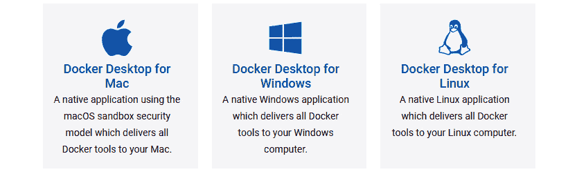
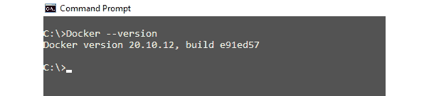
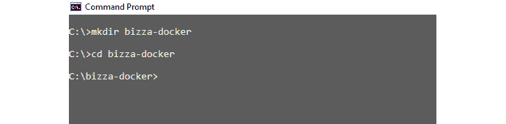
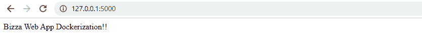
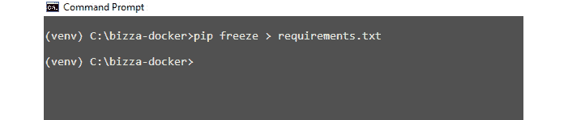
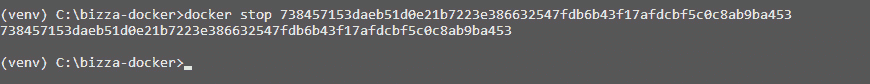
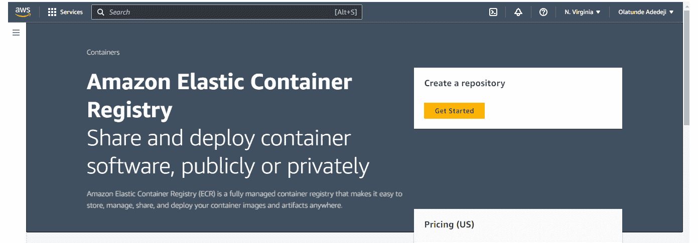
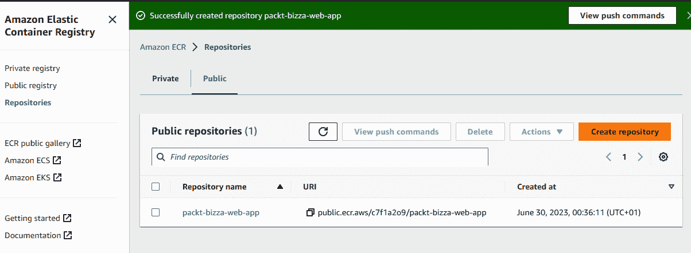

# 第十六章：容器化与 Flask 应用程序部署

经过漫长的旅程，我们终于到达了最后一章！我们兴奋得无法用言语表达！现在，我们即将开始展示我们的全栈 Web 应用程序给世界的最后一圈。在当今的软件开发生态中，容器化采用的步伐正在迅速加快。

根据 Gartner 的预测，生产中容器化应用程序的采用将显著增加，预计到 2022 年，全球超过 75%的组织将使用它们，这一比例从 2020 年报告的不到 30%有显著增长 ([`www.gartner.com/en/documents/3985796`](https://www.gartner.com/en/documents/3985796))。

容器化与软件应用程序的部署已成为开发者保持现代性和需求所必需的技能。那些拥有容器化和部署软件应用程序技能和知识的开发者，将更好地满足现代软件开发实践的需求，跟上行业趋势，并在就业市场上保持竞争力。

容器化允许开发者将应用程序及其所需依赖打包成一个标准化的、可移植的容器，该容器可以在不同的计算环境中一致运行。当然，部署确保了你的应用程序能够到达生产环境，在那里最终用户可以使用它。

在本章中，我们将讨论容器化作为改变信息技术行业的革命。我们将探讨容器化在软件开发中的重要性及其带来的好处，以及它所解决的问题。

此外，我们将深入探讨软件开发行业中的一种容器化平台，称为**Docker**。我们将介绍 Docker，并使用它来容器化 React 前端和 Flask 后端。我们将讨论 Docker 的优势以及为什么它在开发者中如此受欢迎。

到本章结束时，你将了解容器化在现代软件开发中的重要性，你将能够将 React 和 Flask 应用程序打包成可以运输和共享的容器。

最后，你将学习如何使用**亚马逊网络服务**（**AWS**）Elastic Beanstalk 来部署利用 AWS 完全托管云平台的 React-Flask 应用程序，这使得开发者可以轻松地部署、管理和扩展他们的 Web 应用程序和服务。

在本章中，我们将涵盖以下主题：

+   什么是容器化？

+   介绍 Docker

+   容器化 React 和 Flask 应用程序

+   理解 AWS 弹性容器注册

+   使用`docker-compose`

+   将 React 和 Flask 应用程序部署到 AWS Elastic Beanstalk

# 技术要求

本章的完整代码可在 GitHub 上找到：[`github.com/PacktPublishing/Full-Stack-Flask-and-React/tree/main/Chapter16`](https://github.com/PacktPublishing/Full-Stack-Flask-and-React/tree/main/Chapter16)。

由于页面数量限制，一些较长的代码块已被缩短。请参考 GitHub 获取完整代码。

# 什么是容器化？

**容器化**是一种软件开发实践，涉及将应用程序及其所需依赖项打包到一个称为**容器**的自包含单元中。容器是一个隔离和轻量级的运行时环境，提供了一种在不同计算环境中一致和可重复运行应用程序的方式。

假设你在运行 MacOS 的本地机器上使用 Flask 框架开发了一个 Web 应用程序。你希望将这个应用程序部署到运行 Ubuntu Linux 的服务器上，以生产环境运行。然而，操作系统版本、依赖项或其他系统配置可能存在差异，这些差异可能会影响应用程序的行为。

通过将你的 Flask 应用程序及其所有必需的依赖项打包到容器中，你可以确保应用程序在不同计算环境中的一致性和可靠性运行。容器将提供一个隔离和轻量级的运行时环境，封装应用程序和相关依赖项，确保它在底层系统配置变化的情况下也能一致运行。

容器类似于**虚拟机（VMs**），因为它们提供了一种将应用程序与底层主机操作系统隔离的方法。然而，虽然 VMs 需要主机操作系统的完整副本才能运行，但容器只需要运行应用程序所需的最小运行时组件。

容器利用一种称为容器化的技术，该技术使用操作系统的虚拟化。容器化允许在同一主机操作系统上运行多个容器，每个容器都有自己的独立文件系统、网络和进程空间。通过容器化，开发者可以降低部署时间和成本。

让我们来看看容器化的其他一些好处：

+   容器提供了一种标准化的打包应用程序及其所需依赖项的方式，这减少了配置和设置所需的时间和精力。

+   容器可以在不同的计算环境中移动，允许在任何具有相同容器运行时系统的系统上部署。这种可移植性方法消除了为不同环境创建和维护单独部署配置的需要。

+   容器共享相同的操作系统内核，与传统的虚拟化相比，这能更有效地使用系统资源。

+   容器在应用程序及其伴随的依赖项之间提供隔离，使得在共享基础设施上运行应用程序时可能出现的冲突和错误变得过时。

简而言之，容器是轻量级的、自包含的运行应用程序，可移植的，高效的，并且可以根据需要轻松复制和扩展。

尽管有几种容器化技术可供选择，我们将在下一节具体讨论 Docker。在深入探讨 Docker 之前，让我们简要地看看软件行业中可用的其他容器化工具和平台：

+   **Kubernetes**：一个开源的容器编排系统，用于自动化部署、扩展和管理容器化应用程序

+   **Apache Mesos**：一个开源平台，用于管理和部署容器化应用程序和大数据服务

+   **LXC/LXD**：一种使用轻量级虚拟机提供隔离和资源管理的容器化解决方案

+   **CoreOS rkt**：一个为容器环境提供安全、简单和速度的容器运行时

+   **OpenVZ**：一个开源的容器化平台，为 Linux 提供基于容器的虚拟化

+   **AWS 弹性容器服务 (ECS)**: AWS 提供的一项完全管理的容器编排服务

+   **Google Kubernetes Engine (GKE)**：由 Google Cloud Platform 提供的一项完全管理的 Kubernetes 服务

随着对可扩展和高效软件部署的需求不断增长，越来越多的开发者将转向 Docker 作为解决方案。在下一节中，我们将探讨 Docker 的基础知识以及它如何帮助您简化开发工作流程。

# 介绍 Docker

**Docker**是一个流行的平台，用于在容器中开发、打包和部署应用程序。在 Docker 发明之前，软件开发者必须处理软件依赖性问题，这意味着软件在一个电脑上运行良好，但在另一个系统上可能无法工作。

软件开发者会在他们的电脑上创建程序，但当他们试图与他人分享时，事情常常出错。在某一台电脑上运行完美的程序可能在另一台电脑上无法运行，这是因为操作系统、软件版本、配置文件或其他系统相关因素的不同。

为了解决这个问题，2013 年一群开发者发布了一个名为 Docker 的工具。Docker 允许开发者将程序及其所有必要的依赖项打包成一个称为**Docker 镜像**的东西。Docker 镜像是一个只读模板，包含创建 Docker 容器的指令。Docker 镜像包括运行应用程序所需的应用程序代码、运行时、库、依赖项和配置。

使用 Docker，开发者可以为他们的程序创建 Docker 镜像并与他人共享。Docker 容器是 Docker 镜像的可运行实例。Docker 容器是一个轻量级、隔离和可移植的环境，可以在支持 Docker 的任何系统上运行。这意味着程序将在每台电脑上以相同的方式运行，这使得共享和部署变得更加容易。

开发者可以通过编写**Dockerfile**来创建 Docker 镜像，这是一个包含构建 Docker 镜像指令的文本文件。Dockerfile 指定了基础镜像，添加了必要的包和文件，并设置了应用程序的配置选项。

一旦你构建了你的应用程序 Docker 镜像，你可能希望将其部署到生产环境或发送给其他开发者。为了实现这一点，你可以使用 Docker 仓库，这是一个用于存储和分发 Docker 镜像的中心仓库。Docker Hub 是最受欢迎的公共仓库，但你也可以为你的组织设置自己的私有仓库。在本章的过程中，我们将存储本书项目的 Docker 镜像到 AWS **弹性容器** **注册** **（ECR**）。

Docker Compose 是 Docker 生态系统中的另一个有趣工具。Docker Compose 是一个用于定义和运行多容器 Docker 应用程序的工具。Docker Compose 使用 YAML 文件来定义运行应用程序所需的服务、网络和卷。在下一节中，我们将详细讨论 Docker Compose。接下来，我们将探讨如何将一个简单的 Flask 应用程序容器化。

## 创建 Flask 应用程序

现在，让我们通过一个简单的 Flask 应用程序演示使用 Docker 进行容器化的过程：

1.  从[`docs.docker.com/get-docker/`](https://docs.docker.com/get-docker/)下载 Docker 并在你的系统上安装 Docker。



图 16.1 – Docker 的下载页面

1.  选择适合你的 Docker 平台的适当计算机操作系统。

1.  Docker 安装完成后，使用以下命令在终端中测试它：

    ```py
    Docker version and you will get the following output:
    ```




1.  现在 Docker 已安装在你的计算机上，运行`mkdir bizza-docker`命令来创建一个新的工作目录，用于使用 Docker 容器部署 Flask 应用程序。然后，输入`cd bizza-docker`：



图 16.3 – 创建 Docker 工作目录

让我们为新的 Flask Docker 应用程序创建一个虚拟环境。

1.  在终端中运行`python –m venv venv`来安装虚拟环境。

1.  使用以下命令激活虚拟环境：

    +   `venv\Scripts\activate`

    +   `source venv/bin/activate`

1.  在 Docker 项目目录`bizza-docker/`内部，创建一个`app.py`文件，并添加以下代码片段以运行一个简单的 Flask 应用程序：

    ```py
    from flask import Flaskapp = Flask(__name__)@app.route('/')def index():    return "Bizza Web App Dockerization!"if __name__ == "__main__":    app.run(host='0.0.0.0', port=5001, debug=True)
    ```

    前面的代码运行了一个简单的 Flask 应用程序，在浏览器中显示**Bizza Web App Docker 化**！

1.  在`bizza-docker/`内部创建一个`.flaskenv`文件，并添加以下代码片段：

    ```py
    FLASK_APP = app.pyFLASK_DEBUG = True
    ```

1.  现在，在终端中使用`flask run`运行 Flask 应用程序，你将得到以下输出：



图 16.4 – 测试 Flask 应用程序

现在 Flask 应用已经运行正常，让我们创建一个 Flask 应用程序`requirements.txt`文件，以便能够重现此简单应用程序的依赖关系。

1.  运行`pip freeze > requirements.txt`命令，你将得到以下输出：



图 16.5 – Flask 依赖的 requirements.txt 文件

下面的块显示了`requirements.txt`文件的内容：

```py
blinker==1.6.2click==8.1.3
colorama==0.4.6
Flask==2.3.2
itsdangerous==2.1.2
Jinja2==3.1.2
MarkupSafe==2.1.2
python-dotenv==1.0.0
Werkzeug==2.3.3
```

我们现在拥有了构建 Docker 镜像所需的所有资源。

## 创建 Dockerfile

Dockerfile 定义了 Flask 应用程序的容器镜像。我们将创建一个 Dockerfile，它使用官方的 Python 3.8 镜像作为基础镜像，安装 Flask 及其依赖项，并将 Flask 应用程序代码复制到容器中。

在`bizza-docker`目录中，创建一个 Dockerfile 文件 – 确保在创建 Dockerfile 文件时使用大写字母*D*。不用担心为什么；这是一个约定：

```py
FROM python:3.8.2-alpineWORKDIR /packt-bizza-docker
ADD . /packt-bizza-docker
COPY requirements.txt .
RUN pip install --no-cache-dir -r requirements.txt
RUN pip3 install -r requirements.txt
COPY . .
ENV FLASK_APP=app.py
ENV FLASK_ENV=development
EXPOSE 5001
CMD ["python3", "app.py"]
```

为了简化部署过程并确保在不同开发、测试和生产阶段之间保持环境的一致性，让我们检查前面 Dockerfile 的结构。

上述代码是一个用于构建 Python Flask Web 应用程序 Docker 镜像的 Dockerfile：

+   `FROM python:3.8.2-alpine`: 这指定了构建 Docker 镜像时要使用的基镜像。在这种情况下，基镜像为`python:3.8.2-alpine`，这是 Python 3.8.2 的一个轻量级版本，针对在 Alpine Linux 上运行进行了优化。

+   `WORKDIR /packt-bizza-docker`: 这将 Docker 容器的当前工作目录设置为`/packt-bizza-docker`。Dockerfile 中的所有后续命令都将相对于此目录执行。

+   `ADD . /packt-bizza-docker`: 这一行将当前目录中的所有文件和目录复制到 Docker 容器中的`/packt-bizza-docker`目录。

+   `COPY requirements.txt .`: 这将当前目录中的`requirements.txt`文件复制到 Docker 容器的根目录。

+   `RUN pip install --no-cache-dir -r requirements.txt`: 这使用`pip`安装`requirements.txt`文件中指定的 Python 依赖项。`--no-cache-dir`选项确保`pip`不会缓存下载的包。

+   `RUN pip install -r requirements.txt`: 这一行使用`pip3`安装`requirements.txt`文件中指定的 Python 依赖项。

+   `COPY . .`: 这将当前目录中的所有文件和目录复制到 Docker 容器的根目录。这包括 Flask 应用程序代码。

+   `ENV FLASK_APP=app.py, ENV FLASK_ENV=development`: 这设置了 Flask 应用程序的环境变量。`FLASK_APP`指定了主 Flask 应用程序文件的名称（在本例中为`app.py`）。`FLASK_ENV`将 Flask 环境设置为开发模式。

+   `EXPOSE 5001`: 这将 Docker 容器的`5001`端口暴露出来。

+   `CMD ["python3", "app.py"]`：这指定了在 Docker 容器启动时要运行的命令。在这种情况下，它使用 Python 3 运行 `app.py` 文件。

接下来，我们将从先前定义的 `Dockerfile` 构建 Docker 镜像。

## 构建 Docker 镜像

定义了 Dockerfile 后，您可以构建 Flask 应用程序的 Docker 镜像。此镜像包含运行应用程序所需的全部依赖项和配置文件。

要构建 Docker 镜像，请在包含 Dockerfile 的 `bizza-docker` 目录中从终端执行以下命令：

```py
docker build -t packt-bizza-docker .
```

我们将得到以下输出：


图 16.6 – `docker build` 命令的输出

上述命令将使用当前目录中存在的 Dockerfile 构建 Docker 镜像。生成的镜像将被标记为 `packt-bizza-docker`。现在，让我们继续下一步并启动容器以使简单的 Flask 应用程序生效。

## 运行 Docker 容器

构建 Docker 镜像后，您可以从镜像运行 Docker 容器。此容器为运行 Flask 应用程序提供了一个轻量级、隔离和可移植的环境。

要运行 Docker 容器，请使用以下命令：

```py
docker run -d -p 5001:5001 packt-bizza-docker .
```

我们将得到以下输出：


图 16.7 – 分离模式下的 `docker run` 输出

上述命令将以分离模式（`-d`）运行容器，并通过将主机端口 `5001` 映射到容器端口 `5001` 来执行端口映射（`-p`）。容器将基于 `packt-bizza-docker` 镜像。或者，您也可以不使用 `-d` 标志来以非分离模式启动容器，如下面的图所示：


图 16.8 – 非分离模式下的 `docker run` 输出

上述 `docker run` 命令使我们能够访问 Docker 容器内运行的 Flask 应用程序。您需要使用 `-p` `5001:5001` 将容器上的端口暴露给主机机器。

现在我们已经运行了 Docker 容器，我们可以通过网页浏览器或使用 `curl` 命令行工具（如 `http://127.0.0.1:5001`）来测试 Flask 应用程序。请确保应用程序按预期运行，并且所有依赖项都正常工作。

最后，您可以将 Docker 镜像推送到 Docker 仓库，如 Docker Hub 或 AWS ECS。这使得与其他开发者共享镜像或部署到生产环境变得容易。

要停止正在运行的 Docker 容器，您可以使用 `docker stop` 命令后跟 *容器 ID* 或 *名称*。

例如，如果容器 ID 是 `c2d8f8a4b5e3`，您可以使用 `docker stop c2d8f8a4b5e3` 命令停止容器，如下面的图所示：



图 16.9 – docker stop 命令的输出

如果你不知道容器 ID 或名称，你可以使用 `docker ps` 命令列出所有正在运行的容器及其详细信息，包括 ID 和名称。一旦你确定了想要停止的容器，你可以使用前面描述的 `docker stop` 命令。

让我们快速看一下另一个重要的 Docker 命令：`docker` `container prune`。

`docker container prune` 命令用于删除已停止的容器并释放磁盘空间。当你运行 Docker 容器时，容器会消耗系统资源，如内存和 CPU 周期。当你停止容器时，这些资源会被释放，但容器仍然存在于你的系统中。随着时间的推移，如果你运行多个容器，你可能会拥有许多已停止的容器，这可能会占用你系统上大量的磁盘空间。

运行 `docker container prune` 命令是一种简单的方法来删除所有已停止的容器并回收磁盘空间。在继续之前，此 `docker container prune` 命令将提示你确认是否要删除容器，因此请在确认之前仔细检查容器列表。

重要的是要注意，`docker container prune` 命令只会删除已停止的容器。如果你有任何正在运行的容器，它们将不会受到此命令的影响。

接下来，我们将讨论 Docker 化 React 和 Flask 应用程序的过程。我们将使用全栈 Bizza 网络应用程序作为案例研究。

# Docker 化 React 和 Flask 应用程序

Docker 化网络应用程序允许开发者在不同的机器上设置一致的开发环境。Docker 化工具减少了设置新开发环境所需的时间和精力。使用 Docker，开发者可以轻松地在本地机器上复制生产环境，测试他们的代码，并在部署之前调试任何问题。

在本节中，我们将对 React 和 Flask 的工作应用程序进行 Docker 化，并使其准备好用于生产。

让我们从 React 开始。

## 使用 React 的 Bizza 前端应用程序

一旦你创建了你的 React 应用程序，使其对互联网用户可访问的第一步就是构建该应用程序。构建 React 应用程序是开发过程中的一个关键步骤，以确保应用程序针对生产进行了优化，并按预期运行。

构建过程将 React 项目的源代码转换成可用于部署和向用户提供的生产就绪格式：

1.  让我们从 GitHub 仓库下载 *Bizza* 应用程序目录 – [`github.com/PacktPublishing/Full-Stack-Flask-and-React/tree/main/Chapter16/bizza/frontend`](https://github.com/PacktPublishing/Full-Stack-Flask-and-React/tree/main/Chapter16/bizza/frontend)。

1.  要安装应用程序所需的依赖项，请导航到 `bizza/frontend` 目录，并在终端中执行 `npm install` 命令。

1.  要运行前端应用程序，请在终端中执行 `npm start` 命令。

1.  现在，让我们使用 `npm run build` 命令构建应用程序。

现在，随着 *bizza* React 应用程序的构建完成，生成的文件可以部署到 Web 服务器或云平台，并向用户提供服务。最终的构建目录位于 `bizza/frontend/src/build` 内。

在构建过程中，采取了以下步骤：

1.  **转换 JavaScript 和 JSX 代码**：React 应用程序通常用 JavaScript 和 JSX 编写，JSX 是 JavaScript 的语法扩展。然而，现代网络浏览器只能执行 JavaScript 代码。因此，在部署 React 应用程序之前，需要使用像 Babel 这样的工具将 JavaScript 和 JSX 代码转换为纯 JavaScript。

1.  **打包代码和资源**：React 应用程序通常由多个组件、模块以及如图像、CSS 文件和字体等资源组成。打包涉及将所有必需的代码和资源组合成一个文件或一组文件，以便向用户提供服务。

1.  **优化代码和资源**：为了提高性能，打包的代码和资源可以通过压缩、压缩或删除不必要的代码进行优化。

1.  `build` 或 `dist`。

现在，通常在这个阶段，`build` 目录的内容会被部署到 Web 服务器或云平台，供最终用户使用。然而，对于本书中概述的部署过程，您将利用 Docker 的一项功能，称为 **多阶段构建**。多阶段构建是 Docker 的一项功能，允许您创建一个由多个阶段组成的 Docker 镜像，其中每个阶段都是一个具有特定用途的自包含 Docker 镜像。

多阶段构建的目的是优化 Docker 镜像的大小和效率。使用多阶段构建，您可以通过仅包含必要的文件和依赖项来减小最终 Docker 镜像的大小。这导致构建更快、镜像尺寸更小，以及资源使用更高效。

多阶段构建过程涉及创建多个 Docker 镜像，每个镜像都有特定的用途。构建的第一阶段通常包含源代码、依赖项、库和其他必要的文件。

构建的最后阶段通常只包含运行应用程序所需的必要文件和依赖项，从而生成一个更小、更高效的 Docker 镜像。多阶段构建的本质是确保中间阶段用于构建和编译应用程序，但不包含在最终镜像中。

现在，让我们检查一个使用多阶段构建的 React 前端应用的 `Dockerfile`：

```py
# Build stageFROM node:14.17.0-alpine3.13 as build-stage
WORKDIR /frontend
COPY package*.json ./
RUN npm install --production
COPY . .
RUN npm run build
# Production stage
FROM nginx:1.21.0-alpine
COPY --from=build-stage /frontend/build /usr/share/nginx/html
EXPOSE 80
CMD ["nginx", "-g", "daemon off;"]
# Clean up unnecessary files
RUN rm -rf /var/cache/apk/* \
          /tmp/* \
          /var/tmp/* \
          /frontend/node_modules \
          /frontend/.npm \
          /frontend/.npmrc \
          /frontend/package*.json \
          /frontend/tsconfig*.json \
          /frontend/yarn.lock
```

让我们分解前面的 `Dockerfile` 镜像构建指令：

+   `Dockerfile` 使用 Node.js `14.17.0-alpine3.13` 镜像作为基础创建一个构建阶段。Dockerfile 设置工作目录为 `/frontend`，并将本地目录中的 `package*.json` 文件复制到镜像中。然后运行 `npm install --production` 命令来安装生产依赖项。接下来，Dockerfile 将整个项目目录复制到镜像中，并运行 `npm run build` 命令来构建 React 应用程序。

+   `Dockerfile` 使用较小的 `nginx:1.21.0-alpine` 镜像作为基础创建一个生产阶段。Dockerfile 将构建阶段位于 `/frontend/build` 的构建好的 React 应用程序复制到 `nginx` 的 HTML 目录 `/usr/share/nginx/html`。

+   `EXPOSE` 命令暴露端口 `80` 以允许与容器进行通信。

+   `CMD` 命令设置容器启动时默认运行的命令。在这种情况下，`Dockerfile` 使用 `nginx -g 'daemon off;'` 命令在前台启动 `nginx` 服务器。

+   `Dockerfile` 使用 `rm` 命令和 `RUN` 命令清理不必要的文件，例如 `node_modules` 目录和其他配置文件，从而减少镜像的整体大小，使其部署更快。

现在我们已经有了 bizza 前端 React 应用的 Docker 镜像。让我们创建 Flask 后端 Docker 镜像。

## 使用 Flask 的 Bizza 后端应用程序

在 Flask 后端，我们将创建两个 Docker 镜像。在此处下载完整的 Flask 后端应用程序：[`github.com/PacktPublishing/Full-Stack-Flask-and-React/tree/main/Chapter16/bizza/backend`](https://github.com/PacktPublishing/Full-Stack-Flask-and-React/tree/main/Chapter16/bizza/backend)。

我们将为 Flask 应用程序创建一个 Docker 镜像，并为 PostgreSQL 创建另一个 Docker 镜像。虽然将这两个镜像融合成一个单独的 Docker 镜像是可能的，但为了可扩展性和减小镜像大小，将它们分开是最佳实践。

让我们回顾 Flask 应用程序多阶段构建 Dockerfile 的定义。

Flask 应用程序的 Dockerfile 将存储在项目 `root` 目录中，而名为 `postgres` 的子目录将包含 PostgreSQL 的 Dockerfile：

```py
# Build StageFROM python:3.8.12-slim-buster AS build
WORKDIR /app
COPY requirements.txt .
RUN pip install --no-cache-dir -U pip==21.3.1 && \
    pip install --no-cache-dir --user -r requirements.txt
COPY . .
# Run Stage
FROM python:3.8.12-slim-buster AS run
WORKDIR /app
COPY --from=build /root/.local /root/.local
COPY --from=build /app .
ENV PATH=/root/.local/bin:$PATH
ENV FLASK_APP=app.py
ENV FLASK_ENV=production
EXPOSE 5001
CMD ["python3", "app.py"]
```

让我们分解前面的 Dockerfile。

这个 Dockerfile 定义了一个 Flask 应用程序的多阶段构建。Dockerfile 有两个阶段：`build` 和 `run`。

第一个阶段 `build` 负责构建应用程序并安装所需的依赖项。现在，让我们检查构建阶段每一行的作用：

+   `FROM python:3.8.12-slim-buster AS build`：这一行将构建阶段的基镜像设置为 `python:3.8.12-slim-buster`。

+   `WORKDIR /app`：这一行设置工作目录为 `/app`。

+   `COPY requirements.txt .`：这一行将主机机器上的 `requirements.txt` 文件复制到容器中的 `/app` 目录。

+   `RUN pip install --no-cache-dir -U pip==21.3.1 && \ pip install --no-cache-dir --user -r requirements.txt`: 这些行将 `pip` 更新到版本 `21.3.1` 并安装 `requirements.txt` 文件中指定的 Python 包。

    使用 `--no-cache-dir` 选项是为了防止安装过程中使用之前运行中缓存的任何数据，这有助于确保安装的包是最新的，并且与 `requirements.txt` 中指定的版本相匹配。使用 `--user` 选项将包安装到用户的家目录中，这有助于避免权限问题。

+   `COPY . .`: 这行将整个应用程序目录从主机机器复制到容器的 `/app` 目录。

+   `FROM python:3.8.12-slim-buster AS run`: 这表示第二阶段的开始。

第二阶段，`run`，负责在生产环境中运行应用程序。这行将 `run` 阶段的基镜像设置为 `python:3.8.12-slim-buster`：

+   `WORKDIR /app`: 这行设置工作目录为 `/app`。

+   `COPY --from=build /root/.local /root/.local` 和 `COPY --from=build /app .`: 这两行将应用程序目录和已安装的包从构建阶段复制到 `run` 阶段。第一行将已安装的包从构建阶段复制到运行阶段的 `/root/.local` 目录。第二行将应用程序目录从构建阶段复制到运行阶段的 `/app` 目录。

+   `ENV PATH=/root/.local/bin:$PATH`, `ENV FLASK_APP=app.py`, 和 `ENV FLASK_ENV=production`: 这三行设置了应用程序的环境变量。`PATH` 环境变量被更新以包含 `/root/.local/bin` 目录，该目录包含已安装的包。

    这确保了安装的包在系统的 `PATH` 中可用。`FLASK_APP` 环境变量被设置为 `app.py`，这指定了 Flask 运行的主应用程序文件。`FLASK_ENV` 环境变量被设置为 `production`，这启用了诸如更好的错误处理和改进的性能等特性。

+   `EXPOSE 5001`: 这行暴露端口 `5001`，这是 Flask 应用程序将监听的端口。

+   `CMD ["python3", "app.py"]`: 这行指定了容器启动时默认运行的命令。它使用 `python3` 命令运行 `app.py` 文件。

在讨论了主 Flask 应用程序的 Dockerfile 之后，让我们检查 PostgreSQL 的 Dockerfile。

这里是用于创建数据库镜像的 Postgres Dockerfile：

```py
FROM postgres:13-alpineENV POSTGRES_DB=<databse_name>
ENV POSTGRES_USER= <databse_user>
ENV POSTGRES_PASSWORD= <databse_password>
RUN apk add --no-cache --update bash
COPY init.sql /docker-entrypoint-initdb.d/
EXPOSE 5432
```

让我们通过 Postgres Dockerfile 来了解：

+   `FROM postgres:13-alpine`: 这行指定了我们的 Docker 容器的基镜像，即 `postgres:13-alpine`。这个镜像基于 Alpine Linux 发行版，并包含 PostgreSQL 版本 13。

+   `ENV POSTGRES_DB=<database_name>`, `ENV POSTGRES_USER=<database_user>`, 和 `ENV POSTGRES_PASSWORD=<database_password>`：这三行设置了 Postgres 容器的环境变量。`POSTGRES_DB`变量指定要创建的数据库的名称。`POSTGRES_USER`变量指定为数据库创建的用户名，而`POSTGRES_PASSWORD`变量指定该用户的密码。

+   `RUN apk add --no-cache --update bash`：这一行将`init.sql`文件复制到容器中的`/docker-entrypoint-initdb.d/`目录。这个目录用于 Postgres 镜像在容器首次启动时运行初始化脚本。在这种情况下，`init.sql`文件是一个脚本，将创建数据库和任何必要的表。

+   `EXPOSE 5432`：这一行暴露了默认由 PostgreSQL 使用的端口`5432`，以便允许从容器外部建立连接。然而，这实际上并没有发布端口，因为这需要在运行时使用`docker run`或`docker-compose`命令来完成。

这个 Postgres Dockerfile 可以用来构建 Postgres 数据库的 Docker 镜像，它可以与 React 和 Flask 应用的 Docker 容器一起使用，以构建一个完整的 Web 应用堆栈。

在 Flask 应用和 Postgres 镜像定义良好后，我们将把创建的 Docker 镜像推送到 AWS ECR 以进行在线存储。

# 理解 AWS ECR

Amazon ECR 是一个完全托管的 Docker 注册服务，它使得存储、管理和部署 Docker 镜像变得容易。Amazon ECR 与 Amazon ECS 集成，以提供构建、部署和管理大规模容器化应用的无缝体验。Amazon ECR 旨在扩展以满足甚至最苛刻的容器化应用的需求。Amazon ECR 具有安全功能来保护您的容器镜像，包括静态和传输中的加密，以及**基于角色的访问控制**（RBAC）。

要开始使用 Amazon ECR，第一步是创建一个 ECR 仓库。请参考以下 Amazon ECR 界面的截图。

点击**开始使用**按钮以启动仓库创建过程。这将允许您为存储 Docker 镜像创建一个专用位置。



图 16.10 – AWS ECR

接下来，我们有一个截图展示了在 Amazon ECR 中名为`packt-bizza-web-app`的公共仓库：



图 16.11 – 公共仓库

**仓库**是存储您的 Docker 镜像的逻辑容器。一旦创建了仓库，您就可以将 Docker 镜像推送到仓库。然后，您可以从仓库拉取镜像以部署到您的 ECS 集群。

Amazon ECR 是一个强大的工具，可以帮助您简化容器镜像的管理。有趣的是，Amazon ECR 在存储和管理容器镜像方面非常经济高效。

使用 ECR 是免费的；您只需为使用的存储和带宽付费。接下来，我们将使用 Docker Compose 来定义和运行 React、Flask 和 Postgres 容器。

# 使用 Docker Compose

**Docker Compose** 是一个用于定义和运行多容器 Docker 应用的工具。Docker Compose 提供了一个工具来定义一组容器及其相互之间的关系，然后通过单个命令运行它们所有。

使用 Docker Compose，开发者可以定义应用程序容器的确切配置，包括镜像、环境变量和网络设置。这确保了应用程序在不同环境中的一致运行，并且可以轻松地复制。

在深入了解配置定义的细节之前，我们需要了解 Docker Compose 的以下几个组件：

+   **YAML 文件**: YAML 文件用于定义应用程序容器的配置。YAML 文件指定了要使用的镜像、要公开的端口、环境变量以及任何其他所需的设置。

+   **服务（Services）**: 您应用程序中的每个容器都在 YAML 文件中定义为服务。服务可以相互依赖，并且可以一起启动和停止。

+   **网络（Networks）**: Docker Compose 为您的应用程序创建一个网络，允许容器之间相互通信。

+   **卷（Volumes）**: 卷用于在容器运行之间持久化数据。

+   **命令（Commands）**: Docker Compose 提供了一套命令来启动、停止和管理您的应用程序。

现在，让我们创建一个 Docker Compose 文件来管理 React 前端、Flask 后端和 PostgreSQL 数据库容器之间的关系：

1.  在主项目目录 `bizza/` 内，创建 `docker-compose.yaml`。

1.  为每个容器定义服务。在 `docker-compose.yaml` 文件中，为每个容器定义一个独立的服务：

    ```py
    version: '3'services:  frontend:    image: <your-ecr-repository>/bizza-frontend-react-      app    ports:      - "3000:3000"  backend:    image: <your-ecr-repository>/bizza-backend-flask-      app    ports:      - "5000:5000"    depends_on:      - db  db:    image: <your-ecr-repository>/bizza-postgresql    environment:      POSTGRES_USER: <your-db-username>      POSTGRES_PASSWORD: <your-db-password>      POSTGRES_DB: <your-db-name>    ports:      - "5432:5432"
    ```

在前面的代码中，我们定义了三个服务：`frontend`、`backend` 和 `db`。`frontend` 服务运行 *Bizza* 前端 React 应用，`backend` 服务运行 *Bizza* 后端 Flask 应用，而 `db` 服务运行 PostgreSQL 数据库。

现在，让我们配置网络和依赖关系。使用 `ports` 和 `depend_on` 选项配置服务之间的网络连接。例如，前端服务在端口 `3000` 上公开，后端服务在端口 `5000` 上公开，而 `db` 服务在端口 `5432` 上公开。后端服务还依赖于 `db` 服务，因此后端将在 `db` 服务启动后启动。

一旦我们在 `docker-compose.yaml` 文件中定义了服务，我们就可以使用 `docker-compose up` 命令启动容器。这将启动容器并将它们连接到适当的网络。

通过 Docker Compose 管理应用的容器，我们可以简化启动和停止应用的过程，同时确保所有必需的组件都在正确运行并相互通信。

有趣的是，Docker Compose 是一个用于管理容器的有用工具；然而，Docker Compose 更适合小规模部署和开发环境。Docker Compose 适用于 *bizza* 项目，这是一个用于学习目的的小规模应用。

然而，AWS Elastic Beanstalk 是设计来处理生产级工作负载的，并提供许多功能和好处，可以帮助简化 Web 应用管理和扩展。无论如何，我们将把 *bizza* 应用的最终部署转向 AWS Elastic Beanstalk。

在下一节中，我们将探讨 AWS Elastic Beanstalk，这是一个用于在云端部署和管理应用的服务。

# 将 React 和 Flask 应用部署到 AWS Elastic Beanstalk

**AWS Elastic Beanstalk** 是一种完全托管的 AWS 云服务，允许开发者轻松地在 AWS 上部署和管理 Web 应用和服务。AWS Elastic Beanstalk 提供了一个平台，通过自动处理基础设施配置、负载均衡和应用扩展，简化了在 AWS 上部署和管理 Web 应用的过程。

你可以在包括 Node.js、Python、Ruby 和 Go 在内的多种编程语言和 Web 框架上部署 Elastic Beanstalk。Elastic Beanstalk 还与 Amazon RDS、Amazon DynamoDB 和 Amazon SNS 等其他 AWS 服务集成，以提供构建和扩展 Web 应用的完整解决方案。

使用 Elastic Beanstalk，开发者可以轻松地专注于编码。一旦你准备好部署你的应用，你可以简单地上传你的应用包或链接到一个仓库，然后选择适合你应用的适当平台和环境。Elastic Beanstalk 会自动配置所需资源并设置环境，还可以根据需求自动扩展应用。

此外，AWS Elastic Beanstalk 还提供了一系列功能和工具，帮助开发者简化他们的开发工作流程，例如 **持续集成和持续交付**（**CI/CD**）管道、监控和日志工具，以及与流行的开发工具如 Git 和 Jenkins 的集成。

现在，让我们开始使用 Elastic Beanstalk 部署我们的应用。本指南假设你已经创建了一个 AWS 账户。如果没有，请访问 [`aws.amazon.com/free/`](https://aws.amazon.com/free/) 并按照说明创建一个 AWS 账户。AWS 免费层足以部署这个项目：

1.  登录到你的 AWS 账户，并访问 Amazon ECR 控制台 [`console.aws.amazon.com/ecr/`](https://console.aws.amazon.com/ecr/)。

1.  要创建一个 Amazon ECR 仓库，你可以按照以下步骤操作：

    1.  访问 Amazon ECR 控制台。

    1.  在导航面板中，选择**存储库**。

    1.  选择**创建存储库**。

    1.  在**存储库名称**字段中，输入您的存储库名称。

    1.  在**存储库类型**字段中，选择**公共**或**私有**。

    1.  选择**创建**。

1.  或者，您可以使用以下 AWS CLI 命令创建 Amazon ECR 存储库：

    ```py
    aws ecr create-repository --repository-name nameofyourrepository
    ```

    然而，要成功运行前面的命令，您需要以下内容已排序：

    +   拥有一个 AWS 账户和一个具有创建 ECR 存储库权限的 IAM 用户。您可以在 GitHub 上找到权限 JSON 文件的链接：`github.com/PacktPublishing/Full-Stack-Flask-and-React/blob/main/Chapter16/bizza/Deployment/ecr-permissions.json`

    +   已安装并配置 AWS CLI，并使用您的 AWS 凭证。

1.  接下来，我们需要将 Docker 镜像推送到 Amazon ECR 存储库。要将 bizza 应用程序的 Docker 镜像推送到 Amazon ECR 存储库，请按照以下步骤操作：

    1.  在命令行中，导航到包含每个应用程序 Dockerfile 的目录。使用以下命令构建 Docker 镜像：

        ```py
        docker build -t <image-name> .
        ```

    1.  然后，使用以下命令标记您的镜像：

        ```py
        docker tag <docker_image_name>:<tag_name> <AWS_ACCOUNT_ID>.dkr.ecr.<region>.amazonaws.com/<AWS_REPOSITORY_NAME>:<tag_name>
        ```

    1.  将每个 Docker 镜像推送到 Amazon ECR 存储库。在您的项目目录中，运行`docker login`并输入 docker 登录凭证。完成后，运行`aws configure`命令以登录 AWS。

    1.  一旦您在终端中登录了 Docker 和 AWS，请运行以下命令：

        ```py
        aws ecr get-login-password --region <region> | docker login --username AWS --password-stdin AWS_ACCOUNT_ID.dkr.ecr.<region>.amazonaws.com
        ```

    让我们回顾一下前面命令的各个方面：

    +   `aws ecr get-login-password`：此命令从 ECR 检索认证令牌。

    +   `--region <region>`：这指定了 ECR 注册表所在的区域。如果您不知道您的 ECR 存储库在哪里，请运行以下命令：`aws ecr describe-repositories –``repository-names nameofyourrepository`。

    +   `|`：这是管道操作符。它告诉 shell 将第一个命令的输出作为输入传递给第二个命令。

    +   `docker login`：此命令将您登录到 Docker 注册表。

    +   `--username AWS`：这指定了登录注册表时使用的用户名。

    +   `--password-stdin`：这告诉 Docker CLI 从标准输入读取密码。

    +   `<AWS_ACCOUNT_ID>.dkr.ecr.<region>.amazonaws.com`：这是您想要登录的 ECR 注册表的注册 ID。

    1.  在每个项目组件目录中输入`docker push <account-id>.dkr.ecr.<region>.amazonaws.com/<nameof yourrepository:<tag_name>>`。

1.  要创建 Elastic Beanstalk 环境，您可以按照以下步骤操作：

    1.  前往 Elastic Beanstalk 控制台：[`console.aws.amazon.com/elasticbeanstalk`](https://console.aws.amazon.com/elasticbeanstalk)。

    1.  在导航面板中，选择**创建环境**。

    1.  在**平台**部分，选择**Docker**。

    1.  在**应用程序**代码部分，选择**使用现有的应用程序**。

    1.  在**应用程序代码存储库**字段中，输入您的 Docker 镜像存储库的 URL。

    1.  在**应用程序名称**字段中，输入您环境的名称。

    1.  选择**创建环境**。

1.  要配置 Elastic Beanstalk 环境以使用 Amazon ECR 存储库，您可以按照以下步骤操作：

    1.  在 Elastic Beanstalk 控制台中，选择您环境的名称。

    1.  在导航面板中，选择**配置**。

    1.  在**软件**部分，选择**Docker**。

    1.  在**存储库 URL**字段中，输入您的 Amazon ECR 存储库的 URL。

    1.  选择**保存**。

1.  要将应用程序部署到 Elastic Beanstalk 环境，您可以按照以下步骤操作：

    1.  在 Elastic Beanstalk 控制台中，选择您环境的名称。

    1.  在导航面板中，选择**部署**。

    1.  在**部署方法**部分，选择**一键部署**。

    1.  选择**部署**。

    现在，应用程序已部署到 Elastic Beanstalk 环境。您可以通过 Elastic Beanstalk 控制台中显示的 URL 访问应用程序。

AWS Elastic Beanstalk 无疑是那些希望专注于构建应用程序和服务而不是管理基础设施的开发者的绝佳选择。AWS Elastic Beanstalk 提供了一个简单、可扩展和灵活的平台，可以帮助开发者快速轻松地将应用程序部署到 AWS 云平台。

# 摘要

在本章中，我们探讨了容器化和部署的世界。我们首先讨论了什么是容器化以及为什么它对现代软件开发有用。然后，我们介绍了最受欢迎的容器化技术 Docker，并学习了如何使用它来打包和部署 React 和 Flask 应用程序。

接下来，我们探讨了 Docker Compose 的使用，这是一个用于定义和运行多容器 Docker 应用程序的工具。我们学习了如何使用 Docker Compose 在多个容器中编排应用程序的部署。

我们还深入探讨了 AWS ECR，这是一个完全托管的容器注册服务，允许开发者安全、可靠地存储、管理和部署 Docker 容器镜像。最后，我们了解了 AWS Elastic Beanstalk，这是一个简化部署、管理和扩展 Web 应用程序流程的服务。我们学习了如何将我们的 Docker 化 React 和 Flask 应用程序部署到 Elastic Beanstalk，并具备所有安全性和可扩展性功能。

简而言之，容器化和部署是现代软件开发的关键组成部分，而像 Docker 这样的工具以及 AWS 的 Elastic Container Registry 和 Elastic Beanstalk 这样的服务对于管理和扩展基于容器的应用程序至关重要。

我们衷心感谢您选择这本书作为您掌握全栈开发艺术的指南。您的选择反映了您踏上结合现代网络技术力量的变革性旅程的决心。能陪伴您在这条探索和学习之路上，我们深感荣幸。

在这本书的每一页中，我们都精心制作了一份全面的路线图，旨在为你提供征服前端和后端开发领域所需的所有技能集。我们深入 React 的深处，揭示了其基于组件的架构、状态管理和动态用户界面。同时，我们也探讨了 Flask 的复杂性，赋予你构建强大的 API、管理数据库以及优雅地处理服务器端操作的能力。

当你翻到这本书的最后一页时，请花一点时间来欣赏你所获得的知识和所磨练的技能。你现在拥有了打造令人惊叹的用户界面、利用服务器端应用的力量以及无缝连接前端和后端功能所需的工具。作为全栈开发者的旅程已经开启，可能性无限。

但是等等，你的探险还没有结束！当你关闭这一章时，新的天地在等待着你。技术世界是不断演变的，你对掌握全栈开发的执着完美地与未来的机遇相吻合。无论你选择构建复杂的 Web 应用、设计直观的用户体验，还是为创新项目做出贡献，你的专业知识都将成为成功的基石。

因此，随着你在 React 和 Flask 方面的新技能，接下来是什么？也许你会探索高级的 React 框架，如`Next.js`，深入微服务领域使用 Flask，甚至开始创建你自己的开创性应用。前方的道路铺满了无限的可能，你塑造数字体验的能力从未如此重要。

再次感谢您选择*使用 Flask 和 React 的全栈开发*作为您的指南。您对学习和成长的承诺令人鼓舞，我们热切期待您为不断发展的技术世界做出的卓越贡献。
