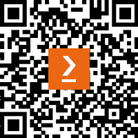

# 前言

外汇交易在过去 20 年里一直很受欢迎，其受欢迎程度还在不断增长。这个市场主要吸引新交易者，主要是因为巨大的潜在利润和能够用相对较少的初始资金开始交易的能力。然而，与此同时，它也被称为最危险的市场之一，因为根据大多数监管机构的统计数据，超过 75%的外汇交易者完全损失了他们的资金。

这种情况发生的原因有很多。一些新进入外汇市场的交易者倾向于将其视为与股票交易相同，试图投资一个没有内在上涨潜力的市场。其他人则想利用高杠杆，受到多本“快速致富”书籍的启发，追求传奇般的利润，错误地计算他们的风险敞口，然后迅速损失掉全部存款。

但所有外汇交易新手面临的主要问题是缺乏交易想法和对市场为何可能这样做或那样做的理解，何时进行交易是合理的，何时可能有问题，以及何时应完全远离市场以避免几乎不可避免的损失。

算法交易可以解决这个问题，因为它基于可以在投入任何真实资金之前进行测试的规则。除此之外，交易自动化有助于降低操作风险，并提供了对执行的全权控制，这是手动下单无法实现的。

本书填补了众多零售经纪商宣传的“简单外汇”与真实外汇市场之间的差距，从专业算法交易者的角度出发，涵盖了所有其警告和陷阱。它引导读者通过开发自动化交易策略的所有必要步骤，这些策略在这个有争议的市场中至少有生存的机会。这不是为你提供复制、粘贴和运行的现成食谱的集合：市场不断变化，你必须适应并重新适应你的策略以应对变化。

本书的主要目标是提供对算法交易在外汇市场中可能实现、不可能实现以及可以合理预期的清晰理解。到本书结束时，你将具备专业交易员水平的外汇市场基本知识。同时，你将掌握在 Python 中实施交易算法的实用技能。尽管这本书只是外汇交易新手进入这个领域的第一步，但它不仅能帮助你作为一个零售交易员开始，还能最终在这个行业中找到工作。

# 这本书面向的对象

这本书是为那些熟悉 Python 编程并想尝试算法交易的人准备的。这不是一本 Python 教程：我假设你对这种语言和面向对象编程非常熟悉。虽然不需要特殊的编程知识，但每当使用到新的对象或结构时，都会进行详细解释。

不需要关于市场和交易的知识，也不需要任何先前的交易经验。我试图用最简单的术语解释内容，但又不简化主题本身，以帮助你扩展交易词汇并清楚地理解最基本术语的含义。

同时，Python 仅用于提供书中考虑的概念的工作示例。没有使用特定于 Python 的特殊编程技术。这意味着你可以轻松地将代码移植到其他语言中，或者自行开发，因此这本书对于使用其他平台（如 MetaTrader）的交易者来说也非常有用。

# 本书涵盖的内容

*第一章*，*开发交易策略——为什么它们不同*，介绍了交易策略和自动交易的概念，并强调了交易应用的主要组件，如接收市场数据、做出交易决策和执行订单。

*第二章*，*使用 Python 进行交易策略*，专注于使用 Python 进行市场分析、建模和实际交易。

*第三章*，*从开发者的角度看外汇市场概述*，解释了市场是如何运作的，重点关注不同类型的市场参与者及其对价格的影响，并介绍了任何进一步研究所必需的核心术语。

*第四章*，*交易应用——内部结构是什么？*，扩展了在*第一章*中提出的交易应用架构的初稿，并提供了其主要组件的更详细视图。

*第五章*，*使用 Python 检索和处理市场数据*，提供了操作 tick 数据和订单簿数据的实际示例，解释了数据压缩的使用，并介绍了通用数据连接器的概念。

*第六章*，*基本面分析的基础及其在外汇交易中的可能用途*，解释了基本面分析与技术分析之间的区别，并展示了最重要的基本面事件及其对市场价格的影响。

*第七章*，*技术分析及其在 Python 中的实现*，考虑了多个最著名和典型的技术分析，解释了它们与基础价格时间序列的关系，并建议了在 Python 中的可能实现方法。

*第八章*，*使用 Python 进行外汇交易中的数据可视化*，介绍了基本的绘图方法，这些方法用于可视化价格时间序列和其他图形对象，例如股票曲线和回撤。

*第九章*，*交易策略及其核心要素*，介绍了 alpha 和 beta 作为关键性能指标，解释了资本管理中的基准测试，并讨论了最受欢迎的 alpha 生成交易策略。

*第十章*，*订单类型及其在 Python 中的模拟*，介绍了交易订单的概念，解释了主要订单类型，并强调了与每种类型相关的风险。

*第十一章*，*回测和理论表现*，讨论了回测作为任何交易策略开发的核心，回顾了交易应用架构，介绍了多线程，并提供了一个详细的用例来组织应用各部分之间的通信，解释了涉及的逻辑，并为使用实时市场数据进行回测的交易应用提出了工作代码解决方案。

*第十二章*，*样本策略 – 趋势跟踪*，仔细考虑了从头开始开发简单交易策略所需的全部步骤，并提供了一些可工作的 Python 代码。

*第十三章*，*交易还是不交易 – 性能分析*，介绍了评估交易策略性能所使用的非常基本的指标，并给出了使用*第十二章*中开发的策略的理论性能的实用示例。

*第十四章*，*接下来去哪里？*，提供了一系列交易想法、技术设置和代码片段，您可以用它们来开发自己的内容。

# 为了充分利用这本书

请记住，书中打印的代码与解释交织在一起：这是有意为之，以便注释大多数行，确保没有重要的操作未被解释。因此，建议首先阅读带有解释的整个代码，遵循逻辑，理解其工作原理，然后再从书中或 GitHub 复制代码并运行。否则，您可能会尝试仅运行代码的一部分，这可能在没有上下文的情况下无法工作。

| **本书涵盖的软件/硬件** | **操作系统要求** |
| --- | --- |
| Python 3.10 或更高版本 | Windows、macOS 或 Linux |

**如果您正在使用这本书的数字版，我们建议您亲自输入代码或从书的 GitHub 仓库（下一节中有一个链接）获取代码。这样做将帮助您避免与代码复制和粘贴相关的任何潜在错误**。

# 下载示例代码文件

您可以从 GitHub 下载本书的示例代码文件，网址为[`github.com/PacktPublishing/Getting-Started-with-Forex-Trading-Using-Python`](https://github.com/PacktPublishing/Getting-Started-with-Forex-Trading-Using-Python)。如果代码有更新，它将在 GitHub 仓库中更新。

我们还有其他丰富的图书和视频资源中的代码包可供在[`github.com/PacktPublishing/`](https://github.com/PacktPublishing/)获取。查看它们吧！

# 使用的约定

本书使用了多种文本约定。

`文本中的代码`：表示文本中的代码单词、数据库表名、文件夹名、文件名、文件扩展名、路径名、虚拟 URL、用户输入和 Twitter 昵称。以下是一个示例：“将下载的`WebStorm-10*.dmg`磁盘映像文件作为系统中的另一个磁盘挂载。”

代码块设置如下：

```py
html, body, #map {
 height: 100%;
 margin: 0;
 padding: 0
}
```

当我们希望您注意代码块中的特定部分时，相关的行或项目将以粗体显示：

```py
[default]
exten => s,1,Dial(Zap/1|30)
exten => s,2,Voicemail(u100)
exten => s,102,Voicemail(b100)
exten => i,1,Voicemail(s0)
```

**粗体**：表示新术语、重要单词或屏幕上看到的单词。例如，菜单或对话框中的单词以**粗体**显示。以下是一个示例：“从**管理**面板中选择**系统信息**。”

小贴士或重要提示

它看起来像这样。

# 联系我们

我们始终欢迎读者的反馈。

**一般反馈**：如果您对本书的任何方面有疑问，请通过 customercare@packtpub.com 给我们发邮件，并在邮件主题中提及书名。

**勘误**：尽管我们已经尽一切努力确保内容的准确性，但错误仍然可能发生。如果您在这本书中发现了错误，如果您能向我们报告，我们将不胜感激。请访问[www.packtpub.com/support/errata](https://www.packtpub.com/support/errata)并填写表格。

**盗版**：如果您在互联网上以任何形式遇到我们作品的非法副本，如果您能提供位置地址或网站名称，我们将不胜感激。请通过版权@packt.com 与我们联系，并提供材料的链接。

**如果您有兴趣成为作者**：如果您在某个领域有专业知识，并且您有兴趣撰写或为书籍做出贡献，请访问[authors.packtpub.com](http://authors.packtpub.com)。

# 分享您的想法

一旦您阅读了《使用 Python 开始外汇交易》，我们很乐意听听您的想法！请[点击此处直接进入此书的亚马逊评论页面](https://packt.link/r/1-804-61685-0)并分享您的反馈。

您的评论对我们和科技社区非常重要，并将帮助我们确保我们提供高质量的内容。

# 下载本书的免费 PDF 副本

感谢您购买本书！

如果您喜欢在路上阅读，但无法携带您的印刷书籍到处走？

您的电子书购买是否与您选择的设备不兼容？

别担心，现在每本 Packt 书籍都免费提供该书的 DRM 免费 PDF 版本。

在任何地方、任何设备上阅读。直接从您最喜欢的技术书籍中搜索、复制和粘贴代码到您的应用中。

优惠不止于此，您还可以获得独家折扣、时事通讯和每日免费内容的每日访问权限。

按照以下简单步骤获取优惠：

1.  扫描二维码或访问以下链接



https://packt.link/free-ebook/9781804616857

1.  提交您的购买证明

1.  就这样！我们将直接将您的免费 PDF 和其他优惠发送到您的邮箱

# 第一部分：外汇交易策略开发简介

任何软件开发项目的成功取决于两个主要因素 – 您对技术的熟练程度以及您在主题领域的熟练程度。

*第一部分* 提供了当今外汇市场的必要概述，重点关注其独特性，这些独特性决定了在开发实际代码时使用的解决方案的选择。在*第一部分*结束时，您将获得对市场结构、其运作和关键风险的概念性理解，同时，您还将了解设计交易应用架构的方法，这些方法针对特定的市场相关问题。

本部分包含以下章节：

+   *第一章*，*开发交易策略 – 为什么它们不同*

+   *第二章*，*使用 Python 进行交易策略*

+   *第三章*，*从开发者的角度概述外汇市场*
