# 第三章：自定义解释器和虚拟环境

上一章重点介绍了配置选项。配置选项旨在帮助您根据项目定制工作环境，同时也允许根据个人喜好进行定制。这些选项是 PyCharm 成为一款优秀工具的许多原因之一。PyCharm 的另一个优秀特性是解释器和虚拟环境的定制。

本章将涵盖以下主题：

+   在 Python 中使用虚拟环境的重要性

+   如何使用`virtualenv`手动创建虚拟环境

+   如何使用 PyCharm 创建虚拟环境

+   如何在 PyCharm 中处理现有的虚拟环境

+   如何使用 PyCharm 添加和删除第三方库

+   如何导入 PyCharm 外创建的项目

+   如何在运行配置中处理虚拟环境设置

到目前为止，你们中的许多人至少安装了一个 Python 解释器。它可能随系统一起提供，例如在 macOS 或 Linux 中，或者你自己在 Windows 上安装了它。Python 是一种**解释型语言**——这意味着编写的代码只有在运行时才会真正被评估。让我们花一点时间来描述这意味着什么，通过将 Python 与其他一些语言进行比较，以及它们是如何执行的。

在你的计算机上执行编写好的代码有三种常见方式，如下所示：

+   编译

+   解释

+   带运行时的中间编译

在我们深入探讨这些之前，让我们短暂地回顾一下历史。我知道这是历史，但请跟我来。在 1522 年，整个西欧占主导地位的宗教是罗马天主教。这是该教会历史上动荡不安的时期，但我们将暂时将其放在一边。相反，我们将关注一位名叫马丁·路德的德国牧师。在当时，德国人民完全依赖于教会机构来满足他们的精神需求。在 1522 年，《圣经》只提供希腊语和拉丁语版本。当时被监禁的路德将旧约从希腊语翻译成了德语的通俗拉丁语。这对德国人来说是一个转折点。当时的印刷商抢购了它，并印刷了数百份，以便每个家庭都能阅读。我将用它做一个类比。

执行书面代码的第一种方法是*编译*。这类似于马丁·路德将希腊语翻译成德语的过程。大多数无法编写代码的人看到编程语言时会挠头，心想：“对我来说这是希腊语！”同样的事情也发生在计算机上，因为计算机也无法理解你的代码语言。计算机不会说 C 或 C++或 Java。相反，程序员用一种与人类语言相比简单且易于翻译的语言编写了某些内容。编译指的是将你的文本代码文件翻译成一次性的二进制格式，这种格式是计算机可以理解的。编译语言的例子包括 C 和 C++。代码文件会通过编译器运行，编译器将代码翻译成一种新的格式，只进行一次。这个过程产生了一个新文件，与代码分开，对计算机来说是有用的。为了完成我们的类比，在将希腊语翻译成德语之后，印刷的书籍就是编译步骤的结果。阅读圣经的能力对德国人来说是有用的。

与第二种代码执行形式相对比的是*解释型语言*。在路德翻译之前，圣经在教堂中被即时翻译。牧师打开圣经，在朗读的同时将文本翻译成德语。这就是解释型语言，包括 Python 的工作方式。当你运行`python main.py`时，Python 解释器会打开代码文件，读取代码，将其翻译（编译），并在逐行读取的同时执行指令。

对于那些对编译理论非常熟悉的人来说，这可能是一种过于简化的说法，但对于我们大多数人来说，这个类比是成立的。Python 在过程中通过缓存和优化一些翻译工作，以便可以再次使用。总的来说，每次程序运行都呈现一个新的解释。解释型语言的例子包括 Python、JavaScript 和 Lua。

最后一种代码执行类别介于其他两种之间。例如 C#和 Java 这样的语言使用*编译*步骤。与常规编译器不同，结果并不是一个可以在电脑裸机上独立运行的文件。相反，它产生了一种中间格式，可以被**运行时**读取。

回想一下你在学校的时候。一个常见的做法是教授或老师向全班授课，而学生们做笔记。一个好的学生可以从笔记中复述讲座的内容。这些笔记是讲座的简略形式。在这个类比中，老师是程序员，学生是中间编译器。编译器的输出，希望是一套出色的笔记，这将使学生能够在考试中取得好成绩。你的代码文件（讲座）被转换成代码的紧凑、二进制版本（你的笔记）。当这个中间文件执行时，运行时基本上“查看笔记”，并使代码能够在计算机上运行。这种方法的好处是中间编译可以在各种平台上运行，而无需重新编译。用 C 语言编写的程序可以在各种平台上运行，从英特尔和 ARM 到旧平台如大型机。然而，为了实现这一点，你必须在该平台上重新编译程序。可执行文件只能在编译它们的平台上运行。在运行时系统中，运行时被转换并使其能够在不同的平台上运行。中间编译随后在任何支持运行时的平台上运行。你可以编译一次，然后分发到任何地方。

对于我们的目的，Python 是一种解释型语言，我们需要一个解释器。此外，PyCharm 需要了解一些关于解释器的情况。本章全部关于你如何进行介绍的方法。PyCharm，认识解释器。解释器，认识 PyCharm。

# 技术要求

为了继续阅读本章，以及本书的其余部分，你需要以下内容：

+   安装并运行良好的 Python 解释器。我将使用来自[`python.org`](https://python.org)的最新版本。

+   安装了`pip`和`virtualenv`。当你在 Windows 上安装 Python 时，这些会自动安装，macOS 系统上默认包含它们。如果你使用 Linux，你需要单独安装包管理器，如`pip`，以及虚拟环境工具，如`virtualenv`。我们的示例将使用`pip`和`virtualenv`。

+   安装并运行良好的 PyCharm 副本。安装过程在*第二章*，“安装和配置”中已有介绍，以防你在书中间开始阅读。

+   本书从 GitHub 提供的示例源代码。我们在*第二章*，“安装和配置”中介绍了如何克隆代码。你可以在[`github.com/PacktPublishing/Hands-On-Application-Development-with-PyCharm---Second-Edition/tree/main/chapter-03`](https://github.com/PacktPublishing/Hands-On-Application-Development-with-PyCharm---Second-Edition/tree/main/chapter-03)找到本章的相关代码。

Python 有多种版本。我使用并参考了来自[`www.python.org`](https://www.python.org)的 Python 3。记住——因为它是一个开源项目，所以有可能创建 Python 的替代版本。这已经多次尝试过，并且成功程度各不相同。以下是一些这些变体的例子：

+   安装中包含`numpy`、`matplotlib`和`pandas`。缺点是这种更大的安装会消耗你驱动器上的空间，但考虑到现在的存储价格，这可能不是什么大问题。如果你打算进行数据科学工作，这些库可能是需要考虑的最重要变体。

+   **IronPython**——这是一个为在 Microsoft .NET 运行时中运行而设计的 Python 变体。其影响超出了本书的范围。然而，IronPython 很有趣，因为它除了在.NET 环境中运行外，这个实现并没有受到全局解释器锁（GIL）的限制。GIL 阻止了代码中的高效多线程。如果你不了解 Python 中的这个限制，我将在本章的*进一步阅读*部分留下一个链接。

+   **Jython**——这个变体允许你的 Python 代码在 Java 虚拟机（JVM）中执行。

+   **MicroPython**——这个变体用于在物联网（IoT）和潜在的嵌入式项目中运行 Python 代码。

+   **ActiveState ActivePython**——这是一个商业支持的 Python 实现，特别关注 Windows 兼容性和执行。传统上，Python 的设计假设它将在 Unix 或 Linux 环境中运行。如果你打算在 Windows 服务器上运行你的 Python 代码，你可能需要考虑这个变体。

你可以在[`www.python.org/download/alternatives/`](https://www.python.org/download/alternatives/)上官方找到这些文档。虽然这些变体中的任何一个都应该在 PyCharm 中工作，但大多数使用 IDE 的开发者都在使用纯 Python（来自[python.org](http://python.org)）或 Anaconda。随着你在 Python 中使用虚拟环境，你无疑会看到这些替代实现的不同选项。一般来说，我总是使用 Python 3 的纯版本。

# 虚拟环境

我们在*第二章*，“安装和配置”中定位了项目创建；然而，我们只是简要地提到了创建或设置`matplotlib`的细节，它只在 Mac 上的 Python 3.6 上运行，但在 Windows 上，它在 Python 3.9 上稳定。当这个项目在进行时，另一个需要 Python 3.10 的项目开始了。

如果你严格使用 Python 的全局或系统级安装，在两个项目之间切换会非常困难。你将不得不调整环境变量并修复你电脑的 `PATH` 环境变量。然后，你还得尝试记住哪些第三方库是全局安装的，并希望这些库的要求不会在独立项目之间发生冲突。真糟糕。

虚拟环境允许你轻松地管理这些问题。虽然使用它们完全是可选的，但为每个项目创建一个虚拟环境被认为是最佳实践。在我们回到 PyCharm 之前，我想手动创建一个虚拟环境，这会很有趣。如果你想跳过这个步骤，也可以，但如果你之前没有这样做过，我认为这将让你对 PyCharm 在新项目开始时为你分担的一些工作有所欣赏。

## 手动创建虚拟环境

打开你的电脑终端，在你的驱动器上找到一个可以进行一些临时工作的地方。我们不会保留这个文件夹以供以后使用；我们只是会走一遍这个过程。然后我们将切换到 PyCharm，以便我们可以看到同一工作流程的更自动化版本。

我使用的是 Windows，并在我的主文件夹中有一个专门存放项目的位置；一个简单地叫做 *Projects* 的文件夹。打开电脑的终端程序后，在这个例子中是运行 **PowerShell** 的 **Windows Terminal**，我可以输入这个实验的命令。你不必使用 Windows，也不必使用 PowerShell。macOS 或 Linux 上的正常 **zshell** （**zsh**） 终端提示符或 **Bourne Again Shell** （**Bash**） 提示符工作方式相同。大多数命令在所有终端和操作系统上都是相同的。我将首先创建一个新文件夹，如下所示：

```py
mkdir python-environment-demo
```

这将创建一个名为 `python-environment-demo` 的新文件夹。接下来，我需要更改目录（`cd`）进入它，如下所示：

```py
cd python-environment-demo
```

现在我已经在这个文件夹里了，我将创建我的虚拟环境。如果你使用的是 macOS 或 Linux，你很可能同时安装了 Python 2 和 3，而我们想确保基于 Python 3 创建虚拟环境。为了区分，你需要输入以下内容：

```py
python3 -m venv venv
```

如果你使用的是 Windows，你可能只安装了 Python 3，所以命令是这样的：

```py
python -m venv venv
```

这里，我们运行 `python3` 命令，并传递一个开关（`-m`），这将执行 `venv` 包来在名为 `venv` 的新文件夹中创建一个基于 Python 3 的新虚拟环境。一旦命令执行完毕，我可以用以下方式确保它在 Windows 上工作：

```py
dir
```

或者，在 macOS/Linux 上，我可以使用以下命令：

```py
ls -a
```

你应该能看到你系统的输出。我使用的是 Windows，所以我的输出如 *图 3**.1* 所示：

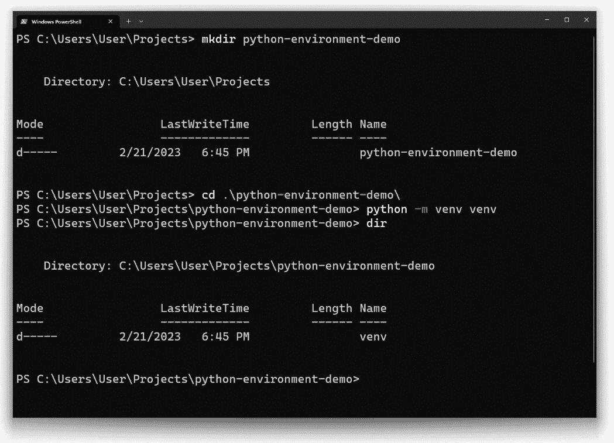

图 3.1：检查我的虚拟环境创建是否成功的终端输出

你的虚拟环境不需要与项目的其余部分放在同一个文件夹中，但我通常这样组织是为了让虚拟环境以后更容易找到。

如果我打算使用 Git 或其他版本控制系统，我最好让版本控制系统忽略这个文件夹。你不应该将这个文件夹检入到你的仓库中。

使用虚拟环境的最后一步是激活它。在 Windows、macOS 和 Linux 中，命令略有不同。在 Windows 中激活虚拟环境的命令如下：

```py
.\venv\Scripts\activate
```

在 macOS 和 Linux 中，它会是这样的：

```py
source ./venv/bin/activate
```

如果你成功激活了虚拟环境，提示符应该会改变以显示当前激活的虚拟环境名称。请注意，如果你已经自定义了终端以防止这种情况发生，它可能不会工作。你可以在*图 3.2*中看到，对我来说一切正常，因为我的提示符前出现了`(venv)`。上面的例子显示了 Windows 11 中的激活，而下面的例子显示了 Linux 中的激活命令，它与 macOS 中的相同：

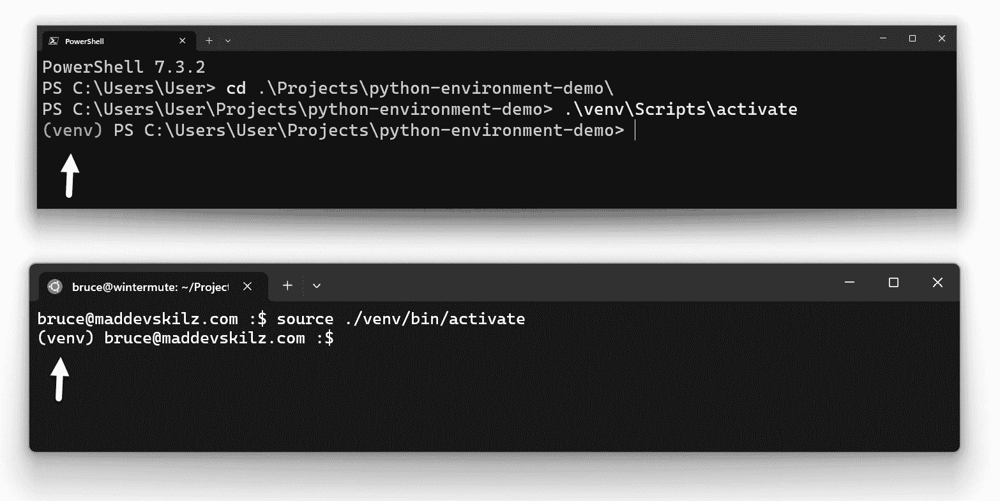

图 3.2：我的虚拟环境已激活

当我准备好停止在虚拟环境中工作时，我可以在终端中输入以下命令来停用它：

```py
deactivate
```

这需要一点工作。如果你已经这样做了一段时间，这并不是太糟糕——可能只是几分钟。然而，如果你不经常这样做，你将不得不查找所有内容，这可能会花费时间。你实际上只在新的项目开始时做这件事。有些人可能一年只做几次。现在，让我们回到 PyCharm，看看这一步是如何集成到新项目创建工作流程中的。

# 在 PyCharm 中创建项目（重新审视）

如果我们回到 PyCharm 并创建一个新的纯 Python 项目，你会看到创建虚拟环境的过程。在 PyCharm 中，让我们通过点击**文件** | **新建项目…**来创建一个新项目，如图 3.3 所示：

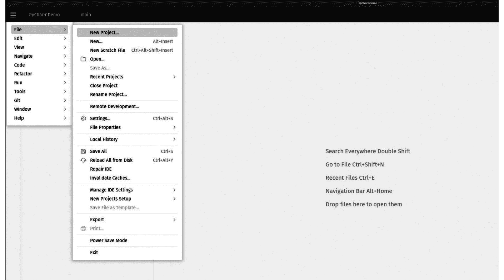

图 3.3：在 PyCharm 中创建新项目

这将是一个纯 Python 项目。不需要专业版来跟随。新项目对话框是我们之前在*第二章*，“安装和配置”中看到的，但这次我们将关注一些我们跳过的细节。*图 3.4*显示了 PyCharm 专业版的新项目窗口在左侧。PyCharm 社区版缺少项目类型菜单，因为它只能创建“纯 Python”项目：

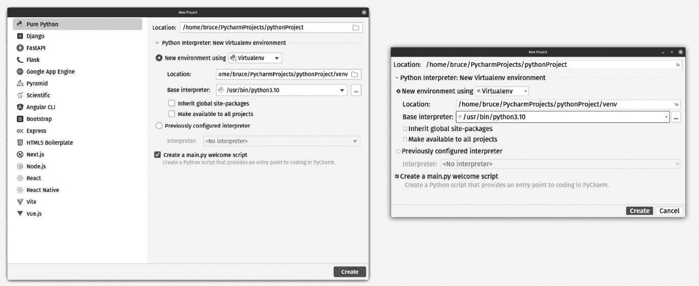

图 3.4：专业版（左）和社区版（右）的新项目窗口的并排比较

我希望您关注的**新项目**对话框部分在*图 3*.*5*中被突出显示。这是屏幕上的这部分允许您设置您的虚拟环境。在*第二章*，*安装和配置*中，我们迅速跳过这部分并接受了默认设置。实际上，默认设置几乎与我们在上一节中完成的手动过程相匹配：

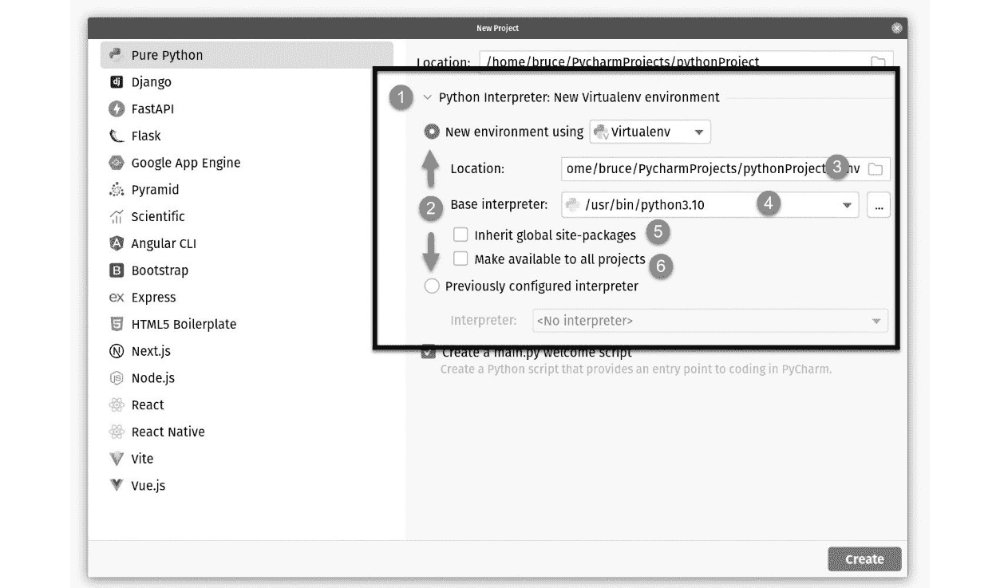

图 3.5：为说明目的而列举的 PyCharm 的虚拟环境设置

让我们考虑*图 3*.*5*中的编号标签：

1.  这是**新项目**窗口中的 Python 解释器设置部分。如果您喜欢，可以通过旋转部分标签旁边的三角形来隐藏它，尽管如果我们这样做，我们就无法继续谈论接下来会发生什么。

1.  这里有两个选项在起作用。您可以选择创建一个新的虚拟环境或指向您已经创建的一个。让我们专注于创建一个新的。`virtualenv`虚拟环境功能。通过下拉列表更改机制将更改屏幕内容以匹配您选择的虚拟环境脚本的设置。目前，让我们将其保留在**Virtualenv**，因为这是最古老的可能也是使用最广泛的。

1.  项目文件夹内的`venv`。您可以在计算机上的任何位置设置位置；它不必在项目文件夹中。如果您有多个项目共享虚拟环境，因为它们共享依赖项，那么创建一个中央位置来保存环境是有意义的。大多数时候，我更喜欢将虚拟环境与项目文件夹放在同一位置，这样就不会对其位置产生疑问。

1.  **基本解释器**字段允许您选择用于创建虚拟环境的 Python 安装。如果您在计算机上安装了多个 Python 版本，PyCharm 可能已经自动找到它。选择以 PyCharm 找到 Python 安装的位置的下拉列表形式呈现。如果它遗漏了某个安装，您可以点击省略号按钮（**…**）并导航到您想要使用的 Python 安装。如果您这样做，您需要导航到 Python 可执行文件并双击它。

1.  **继承全局站点包**复选框处理您可能全局安装的任何第三方库。勾选此复选框将它们复制到您的虚拟环境中，以便在您的项目中本地使用。

1.  **对所有项目可用**复选框允许您轻松在其他项目中找到并重用此虚拟环境。

# 使用现有的虚拟环境

有时候，你可能需要使用与另一个项目完全相同的精确要求来制作一个项目。在 PyCharm 中，你可以轻松地共享或重用虚拟环境。*图 3**.5* 展示了 PyCharm 中的 **新建项目** 对话框。

要使用现有的虚拟环境，你需要将默认设置从 **新建环境** 更改为 **先前配置的解释器**，如 *图 3**.6* 所示：

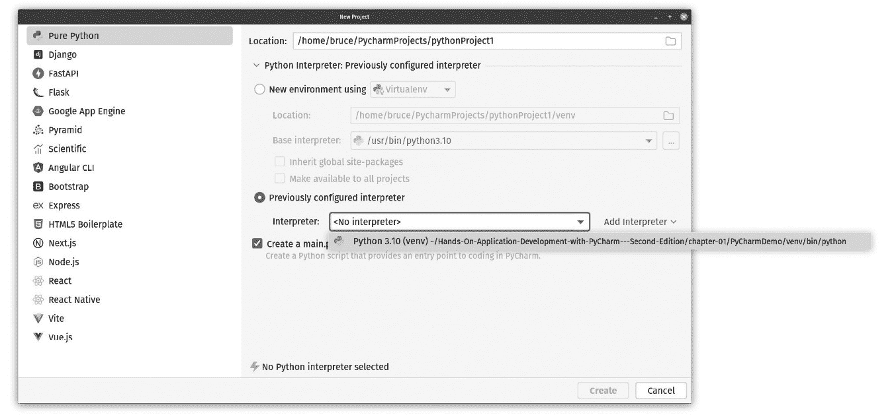

图 3.6：你可以通过更改项目的设置来将项目指向现有的虚拟环境

一旦你这样做，选择现有环境的选项就会变得活跃。有一个下拉列表可供选择解释器。它的工作方式与我们之前在创建新虚拟环境时看到的 **基本解释器** 下拉列表相同。如果你在 PyCharm 中创建了现有环境，IDE 会记住它。在这种情况下，我在创建 *第一章* 的演示项目代码时，使用了 PyCharm 创建了一个虚拟环境，*《PyCharm 简介 – 最受欢迎的 Python IDE》*。PyCharm 会记住使用 PyCharm 创建的虚拟环境，并将它们列出来。

如果你使用的是手动方法或其他工具，你需要使用 **添加解释器** 按钮将解释器添加到列表中。当你点击按钮时，你会注意到一些可能性，如 *图 3**.7* 所示：

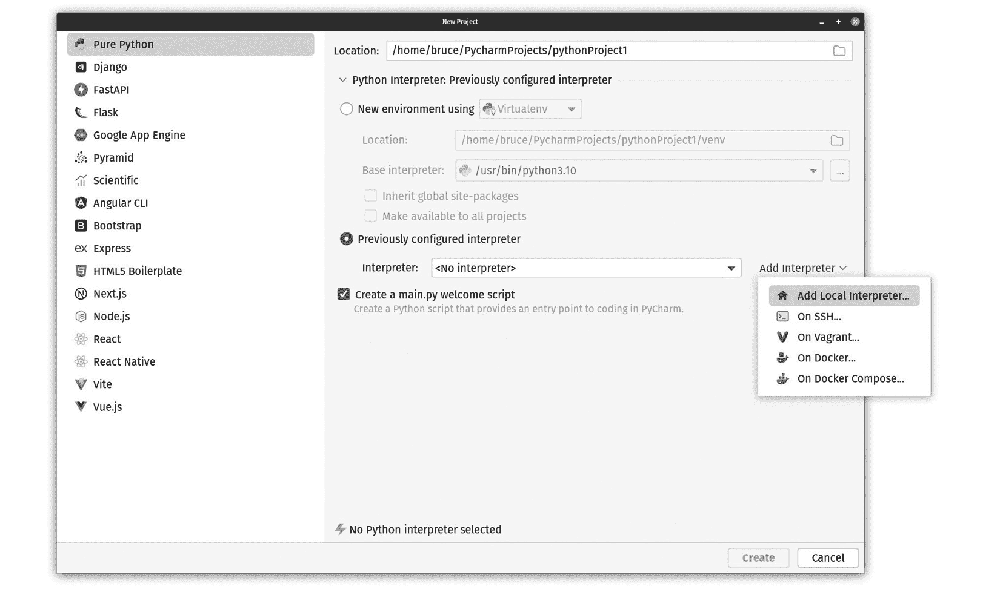

图 3.7：当你点击添加解释器时，你有很多选择来添加你想要添加的环境的来源

到目前为止，我们严格限制讨论的范围仅限于添加存在于你本地计算机上的虚拟环境。有可能添加远程计算机、**虚拟机**（**VM**）、**Windows Subsystem for Linux**（**WSL**，它是一个虚拟机）或 **Docker** 容器上的环境。我们将在本书的后面部分详细讨论这些选项。

一旦你选择了包含 Python 可执行文件的 `bin` 文件夹。在 Windows 中，虚拟环境有一个 `Scripts` 文件夹，它将包含一个指向 Python 可执行文件的文件。在任何情况下，你的目标都是选择可执行文件：

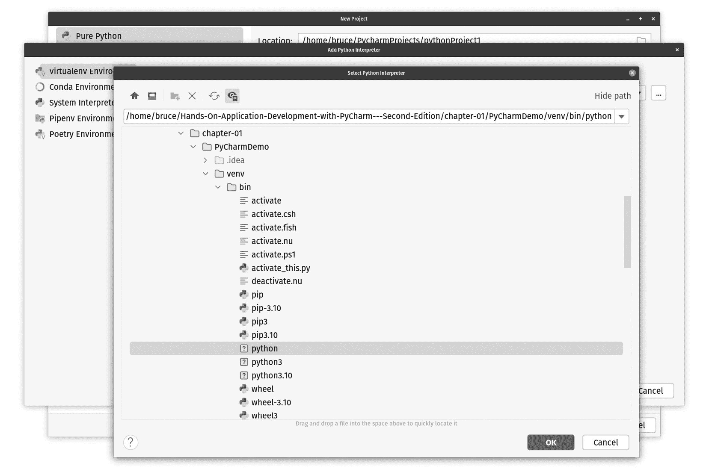

图 3.8：你需要选择你想要使用的虚拟环境文件夹内的 Python 可执行文件

# 更改项目的解释器

当我处理一个持续了 6 个月或更长时间的项目时，我会使用的一个技巧是创建一个带有完全更新包的新虚拟环境。这样，我可以在不破坏我的生产就绪虚拟环境的情况下测试带有更新依赖关系的程序。我们将在本章稍后介绍包管理。现在，我想向您展示您的项目解释器设置在哪里独立于项目创建过程。我发现这有点不直观。它在 **设置** 中。您用于在所有项目中全局配置 IDE 的相同 **设置** 选项也用于设置特定于项目的设置，例如解释器设置。

无论您的理由是什么，您都可以更改解释器，以及由此扩展的项目中使用的虚拟环境。您可以通过点击 UI 左上角的齿轮图标找到项目设置，如图 *图 3.9* 所示：

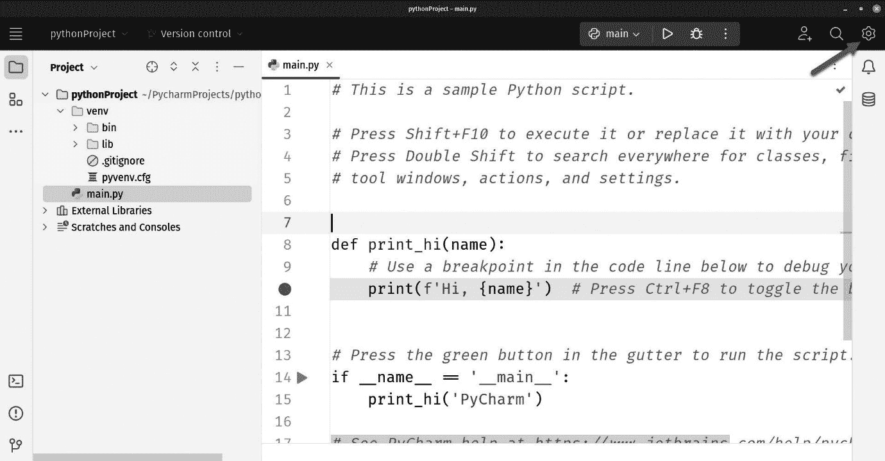

图 3.9：通过点击齿轮图标，您可以找到全局和项目设置

一旦您选择 **设置**，您将被带到我们在 *第二章* 中研究的全局设置屏幕，即 *安装和配置*。项目属性也存储在这里，如图 *图 3.10* 所示：

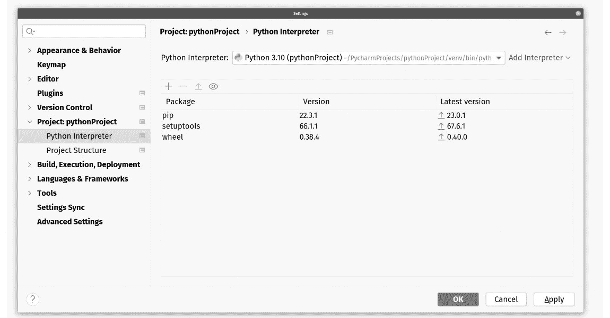

图 3.10：项目设置位于列表中间

在屏幕左侧选择解释器设置，并使用我们第一次设置虚拟环境时使用的相同机制更改解释器。您可以创建一个新的环境或浏览到一个新的环境。别忘了，当您浏览到一个新的环境时，您需要选择 Python 可执行文件，而不是 Python 安装所在的文件夹。我有时会忘记这一点，然后我会 wonder 为什么选择对话框不会消失。它正在寻找一个文件，即 Python 可执行文件，而不是一个文件夹。

# 激活 virtualenv

在本章前面的手动练习中，我们使用 `virtualenv` 从头开始创建了一个虚拟环境。一旦环境创建完成，您必须激活它才能使用它。一个可能的问题可能是“*我该如何激活环境？*”这是一个美丽的答案：您不必这样做。当您在 IDE 中时，环境设置始终存在，并且始终得到尊重。当您从 **Python 包索引**（**PyPI**）添加新的第三方包，我们将在稍后介绍，它们会根据您的环境设置自动放置到正确的位置。

当我们运行我们的程序时，我们可以覆盖 **运行配置**，但默认情况下，它使用项目的环境设置。坦白说，在运行配置中覆盖的情况很少有用。话虽如此，我将在本章后面向您展示如何覆盖运行配置。

## 使用集成终端

另一个需要担心虚拟环境是否激活的地方是在**终端**内部。诚然，PyCharm 无法帮助你处理系统终端。然而，PyCharm 确实有自己的终端窗口标签页。如果你使用 PyCharm 的终端，项目的解释器设置会自动应用。你不需要手动激活任何内容。既然我们提到了它，让我们看看 PyCharm 中的集成终端。你可以在**视图**菜单中找到显示终端的菜单项，如图*图 3.11*所示。我个人在终端上花费了很多时间，所以我将键盘快捷键记在了肌肉记忆中：

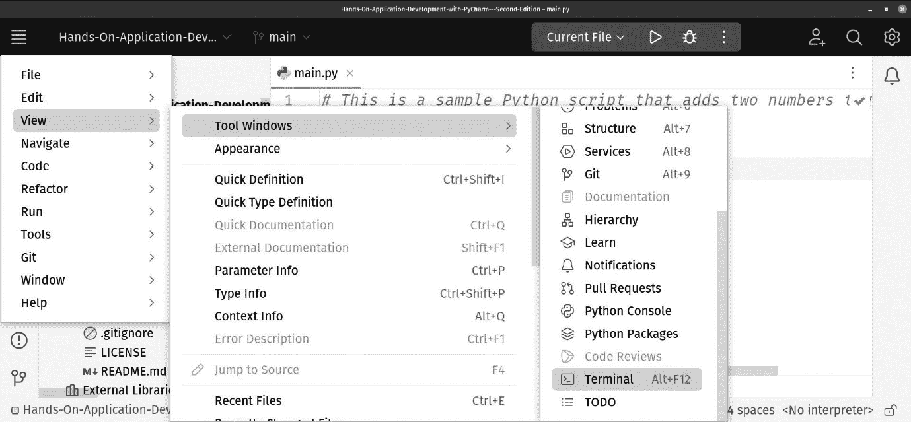

图 3.11：PyCharm 的集成终端可以在视图菜单中找到

调用菜单选项会弹出终端，正如承诺的那样，你可以在*图 3.12*中看到它尊重我们项目的虚拟环境设置：

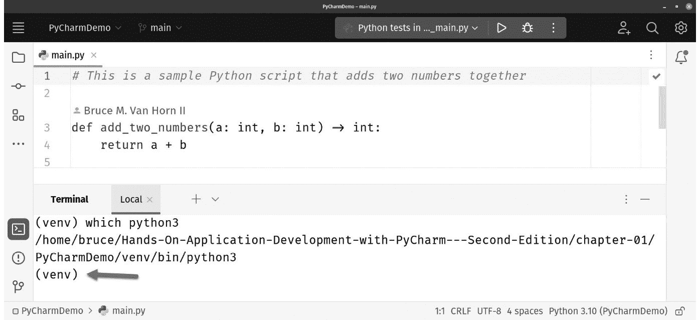

图 3.12：你可以看到终端已经激活了你的虚拟环境

如果提示符中`(venv)`的存在不足以证明它已经工作，我在*图 3.12*中提供了更多内容。如果你使用 macOS 或 Linux，你可以使用`which`命令找到任何可执行文件的路径。抱歉，Windows 用户：在您的操作系统上没有等效的命令。`which`命令的结果是，它显示当我运行`python3`时，它使用的是指定路径上的那个，而不是系统范围内的安装，通常在`/usr/bin/python3`。

## 在控制窗口中与 REPL 一起工作

PyCharm 中一个可能让你怀疑环境设置是否被尊重的最终工具是单独的`python3`。PyCharm 为你提供了一个集成工具，因此你不必这样做。要进入控制台，使用你用来进入终端的相同菜单。我在*图 3.13*中向你展示了它。 

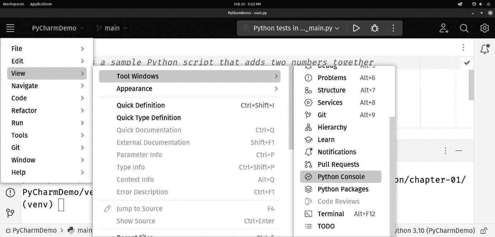

图 3.13：可以通过视图菜单调用 Python 控制台

你的控制台不仅了解你的解释器设置，而且还了解你项目的内容。你可以在控制台中直接导入和测试项目中的任何内容。我发现这在追踪我们有时遇到的可怕的“*模块未找到？你什么意思它没找到？！它就在那里！我正看着它!*”问题时很有用。它也适用于实验 Python 中我们发现的一些更简洁的语法，例如**正则表达式**（**regexes**）或列表推导式。*图 3.14*中有一个小例子：

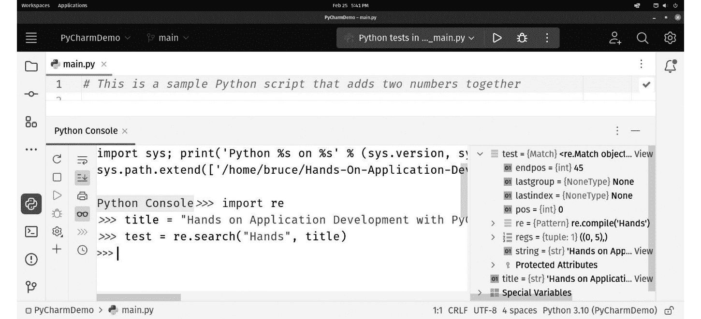

图 3.14：正在使用的控制窗口来测试一个简单的正则表达式

我在*图 3**.14*中尝试的代码不会在谷歌的 Python 面试中给人留下深刻印象：

```py
import re
title = "Hands on Application Development with PyCharm"
test = re.search("Hands", title)
```

我将每一行都输入到控制台中。记住——这是一个实时编码视图，而不是一个你可以执行的文件。每次我按下*Enter*，我刚才输入的表达式就会被评估，并且当适当的时候，结果会出现在右侧的调试窗口中。把它想象成一个调试会话，其中你有一个右侧的监视窗口，而你输入到`>>>`提示符旁边的每一行都成为了一个即时断点。

在评估了第三行后按下*Enter*，我可以看到`test`变量有一个`re.Match`对象作为其值。多看一会儿窗口，你可以看到字符位于位置（0，5），或者字符 0 到 5 表示为一个单一的元组（`regs`）。

在控制台中尝试复杂的代码片段比通常的过程节省时间，通常的过程包括运行程序、阅读`print`语句、进行更改，然后再次尝试，这占用了我们作为开发者的大部分时间。然后，你忘记移除`print`语句，你应该这样做，因为它们可能会严重减慢长时间运行的脚本。

控制台立即执行所有操作并将结果反馈给你。它比`print`语句详细得多，因为你可以使用调试窗口查看任何对象的内部结构，而不仅仅是看到字符串。在控制台窗口中做一些调整后，你可以回到你的代码中并直接使用那些有效的工作。

# 与第三方包库一起工作

Python 以其“内置电池”哲学而闻名，这与许多其他语言相矛盾。Python 的创造者 Guido van Rossum 认为，一个强大而完整的标准库非常重要，并且语言应该能够几乎完成任何任务，而无需使用任何第三方依赖。

我所说的第三方依赖是指那些设计用于执行 Python “开箱即用”未实现的专业功能的、外部于 Python 的库。换句话说，Python 为自己设定了一个非常崇高的目标。它应该能够仅使用所谓的 Python 标准库就完成任何事情。

自然，这个目标永远无法完全实现。Python 的标准库非常完整。然而，最终你会发现标准库要么无法完成某些功能，要么其实现方式不如预期那么易于使用。让我们看看几个广泛使用的第三方库的快速示例，并讨论为什么你可能想要使用它们。

让我们从`requests`库开始。这是一个你可以在 PyPI 上找到的第三方库，网址是[`pypi.org/project/requests/`](https://pypi.org/project/requests/)。每种现代语言都有类似的东西。JavaScript 有**Node 包管理器**（**NPM**），网址是[`npmjs.com`](https://npmjs.com)。**PHP**使用**Composer**从[`packagist.org/`](https://packagist.org/)安装包。.NET 语言使用**NuGet**，包注册在[`nuget.org`](https://nuget.org)。Python 有[`pypi.org`](https://pypi.org)。这是一个集中列出的第三方模块和库，你可以将其添加到项目中，通常免费。从比喻的角度来说，这个想法是为了防止我们每次想要建造一辆新车时都要重新发明轮子。由于我在我的日常工作是从事**软件即服务**（**SaaS**）项目，我发现自己需要一种简单的方法来发送**超文本传输协议**（**HTTP**）请求。我的 Python 脚本能够调用某个网络服务并处理结果的能力至关重要，这是一个非常常见的任务。

Python 的标准库提供了一些完成此任务的方法。我认为最明显的是标准库中的`urllib`。以下是从`urllib2`文档中的示例代码[`docs.python.org/3/howto/urllib2.html`](https://docs.python.org/3/howto/urllib2.html)：

```py
import urllib.parse
import urllib.request
url = 'http://www.someserver.com/cgi-bin/register.cgi'
values = {'name' : 'Michael Ford',
     'location' : 'Northampton',
     'language' : 'Python' }
data = urllib.parse.urlencode(values)
data = data.encode('ascii') # data should be bytes
req = urllib.request.Request(url, data)
with urllib.request.urlopen(req) as response:
  the_page = response.read()
```

首先，我们导入`urllib`包的两个部分，记住它实际上是`urllib2`。然后，我们创建一个`url`变量。如果你在样本中想知道`cgi`引用是什么，那是在地址中的`cgi-bin`。这种开发风格很久以前就被**PHP**、经典**活动服务器页面**（**ASP**）、**Java 服务器页面**（**JSP**）和 ColdFusion 等所取代。即使是这些，也随后演变成了使用更复杂但更容易编码的路由库的现代系统，这些库非常灵活。我们将在本书后面讨论 PyCharm Professional 中的 Web 应用程序开发功能时介绍这些内容。

一旦我们建立了`url`变量，我们需要一些数据。在这个例子中，我们使用 HTTP `POST`将数据发送到我们的 Web 服务器进行处理。这是通过`values`变量完成的，它包含一个字典，模拟了你在**超文本标记语言**（**HTML**）表单中可能找到的字段和值。

一旦我们设置好，我们必须将那个字典解析成适合传输的格式。这是通过`urllib.parse.urlencode`完成的。接下来，我们需要进一步将数据编码为**美国信息交换标准代码**（**ASCII**）。这是文档中的另一个时代错误。现代系统使用 8 位通用文本格式（UTF-8），因为 ASCII 只编码来自罗曼语系的语言，如英语、法语、德语、意大利语或葡萄牙语。世界上其他地方的人就不那么幸运了。UTF-8 处理今天全球普遍使用的所有字母表；这样，只有古埃及人被忽视，因为 UTF-8 不支持象形文字——至少，据我所知。

在我们对文本进行编码后，我们需要创建一个`request`对象。我们将`url`变量和数据传递给`urllib.request.Request`构造函数。只有在那时，我们才准备好在示例的最后两行发送请求。

我们已经确定在 Python 的标准库中存在一种发送`POST`请求的方法。然而，到目前为止，我们只处理了一个非常基本的需求。如果我需要发送一个经过身份验证的请求怎么办？我该如何处理会话或 cookies？我们能否使这个过程更加简单？我们可以使用`requests`库。以下是一些示例代码：

```py
import requests
requests.post('https://httpbin.org/post', data={'key':'value'})
```

我们之前的`urllib`代码可以用`requests`库表达为一个单行代码！像会话、cookies 等更高级的需求同样简单。文档是现代的，并包含有用的示例。像`requests`这样的流行 PyPI 库有很好的文档，例如在[`realpython.com`](https://realpython.com)网站上。我从[`realpython.com/python-requests/`](https://realpython.com/python-requests/)借用了前面的示例，这是关于使用这个强大库的庞大而完整的教程的一部分。

所有这些的目的是指出，在 Python 的背景下，一个第三方代码库系统是必要的，或者至少是有用的——Python 是一种力求包含你所需一切的语言，但永远不会包含你想要的一切。标准库可能很接近，但永远不会包含我可能想要的每一件事。

另一个必要的第三方库的重要例子是关于科学和金融工作。Python 中的标准数学功能与其他任何语言相比大致相同。大多数语言在处理浮点计算方面并不非常精确。它们在处理数值数据的矩阵方面也不太细腻，而这是一种常见的需求。幸运的是，像`numpy`和`pandas`这样的第三方库存在，以填补这一空白。这些库为 Python 开发者打开了新的可能性，也是 Python 继续吸引新用户的主要原因之一。

## 在 PyCharm 中添加第三方库

PyCharm 包含一个 UI 屏幕，允许您管理当前项目的包。然而，如果您没有使用 IDE，您可以使用包管理器手动完成。例如，要将 `numpy` 安装到您的项目中，您可以使用以下命令的 `pip` 包管理器：

```py
pip install numpy
```

您应该确保已激活项目的虚拟环境，以便正确执行此操作。否则，`numpy` 将全局安装。`pip` 安装程序并非唯一的安装程序。还有 `easy_install`、`pipenv`、`poetry`，当然还有 `conda`。我不会就它们的相对优点进行辩论，因为这取决于个人喜好。PyCharm 支持它们所有。

PyCharm 的包管理器调用您环境设置中设置的包管理器。它提供了一个图形界面，您可以在其中搜索包，查看它们的描述，并在项目中安装、更新和卸载任何包。让我们看看。

回到 PyCharm，让我们回到我们的项目设置。点击**Python 解释器**，如图 3.15 所示：

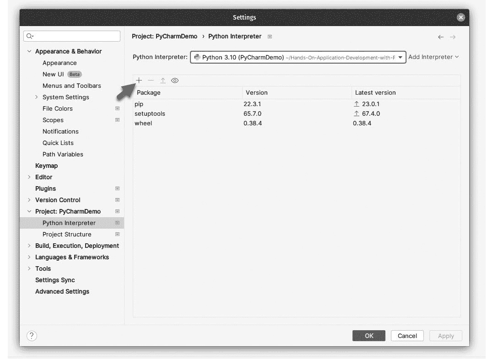

图 3.15：解释器设置不仅显示了您的解释器，还显示了可用于该解释器的包列表

屏幕显示了当前项目正在使用的解释器。我们之前看到我们可以随时更改此环境。现在，我们将关注占据屏幕大部分空间的空包列表。这就是我们在安装包后能够与之交互的地方。

让我们安装 `numpy` 包。首先点击 `numpy`。随着您输入，您将看到来自 PyPI 的满足您搜索条件的包列表。点击 `numpy` 条目并查看描述。这是一个很好的主意，仔细检查描述，因为如果您拼写搜索词错误，您可能会得到错误的包。这确实是 `numpy` 库，所以我会通过点击对话框底部的**安装包**按钮来安装它。稍等片刻，我会看到一个消息，如*图 3.16*（位于灰色**安装包**按钮上方），表明包已成功安装：

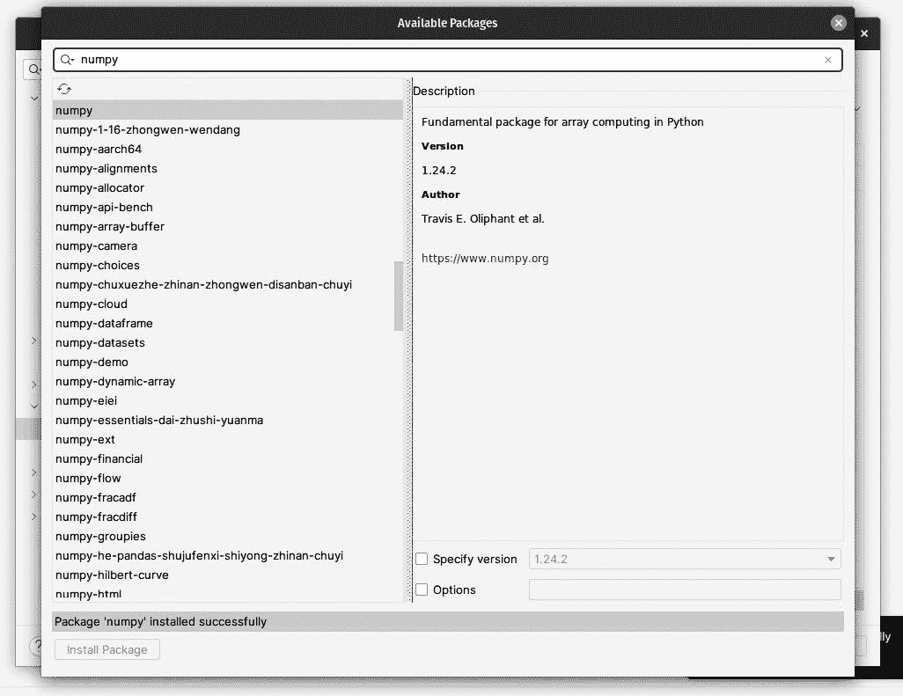

图 3.16：底部的显示指示包已成功安装

继续关闭对话框以返回到项目设置。

## 在 PyCharm 中移除第三方库

在图 3.17 中的箭头旁边，`numpy` 包旁边有几个按钮：

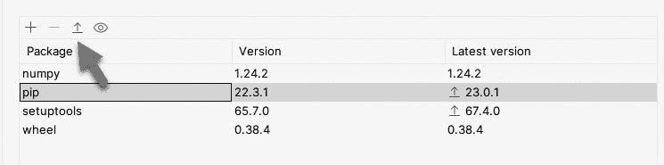

图 3.17：管理您的包安装的工具

您可能可以猜到它们的作用。`pip`可以升级到版本 23.0.1。点击向上箭头即可完成此操作。眼睛按钮会显示预发布包版本，如果您想尝试包的最新版本。

现在我们已经了解了包管理 UI 的功能，我想暂时偏离一下话题，谈谈它做得不好的地方。在我看来，PyCharm 当前版本没有很好的方法来处理`requirements.txt`文件。

## 使用 requirements.txt 文件

在使用 Python 项目时，一个最佳实践是使用名为`requirements.txt`的文件来列出项目的第三方库依赖。如果您是从零开始创建项目，您可以使用终端中的`pip`生成`requirements.txt`文件，命令如下：

```py
pip freeze > requirements.txt
```

*图 3.18*显示了刚刚生成的`requirements.txt`文件的内容示例。您可能需要仔细查看才能看到它，因为它只有一行长。您可以看到包名以及`numpy==1.24.2`的版本要求。如果您使用的是不同的包管理器，请查看生成您的`requirements.txt`文件的具体过程：

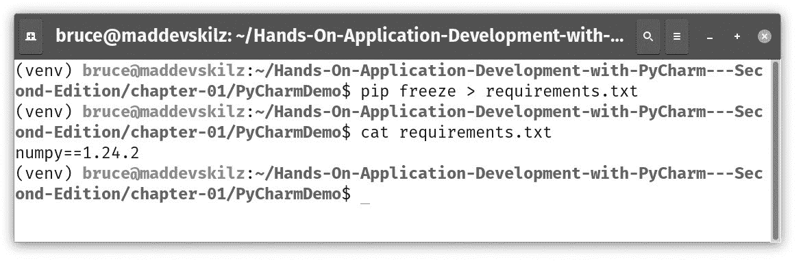

图 3.18：显示我们项目第三方依赖关系的示例 requirements.txt 文件内容

如果您已克隆现有项目并且它包含`requirements.txt`文件，当您打开项目时，PyCharm 将识别它，并建议将内容安装到您的虚拟环境中。PyCharm 还会在您工作时监控您的项目。如果您添加了新的依赖项，无论是通过我们讨论的 GUI 还是从终端手动添加，PyCharm 都会自动建议将这些依赖项添加到您的`requirements.txt`文件中。

## 新的 Python 包窗口

对于使用最新版本 PyCharm（该版本使用新的 UI）的用户来说，新增了一个**Python 包**窗口。它在不同的位置和布局中添加了与解释器设置窗口类似的功能。显然，他们在我之前提到 Python 环境设置在通用设置窗口中不够直观时，是在我的肩膀后面阅读的。虽然我怀疑我无法因此获得认可，但您可以在**更多工具窗口**的省略号中找到新的**Python 包**窗口，如图*3.19*所示：

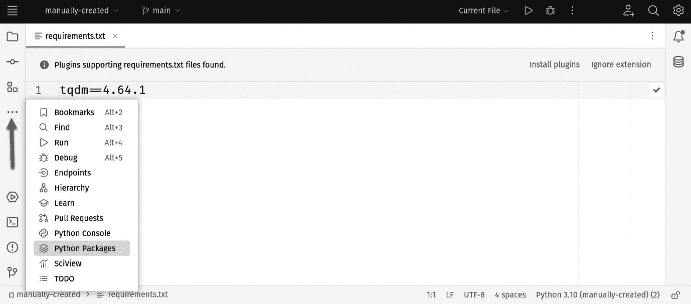

图 3.19：更多工具菜单包含新的 Python 包窗口

当您点击**Python 包**图标时，将出现一个新窗口，如图*3.20*所示：

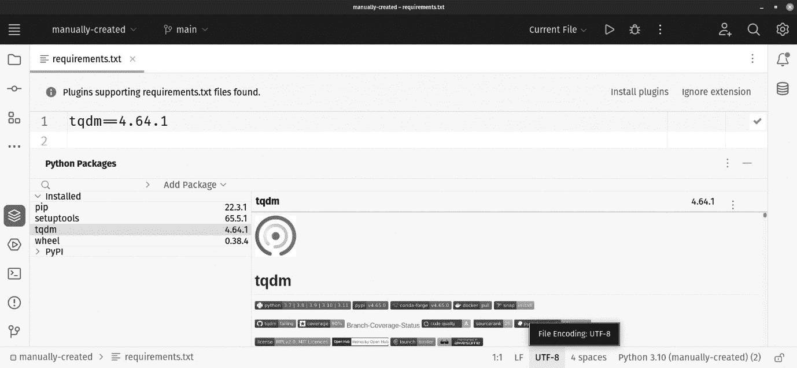

图 3.20：PyCharm 中的新 Python 包窗口

与“环境设置”窗口类似，“Python 包”窗口显示了在虚拟环境中安装的包列表，以及相应的版本号。有一个“添加包”按钮，允许您从 PyPI 或从存储库添加包。您可以使用搜索对话框搜索包，该对话框显示匹配的包列表。点击其中一个将显示该包的文档。这比“环境设置”窗口更进了一步，因为该窗口显示了项目的 Markdown 文档。您可以在*图 3.21*中看到一个示例：

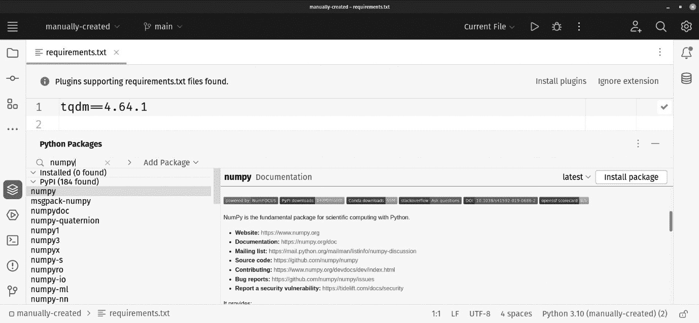

图 3.21：在新的 Python 包管理器窗口中搜索 numpy 包

如您所见，我搜索了一个在 PyPI 上有 184 个匹配项的包。我选择了 `numpy` 包，PyCharm 显示了该项目的文档。有一个漂亮的“安装包”按钮和一个选择器，可以挑选我想要安装的版本。

我可以通过点击列表中的已安装包来删除已安装的包。版本号会与包的文档一起显示。在已安装版本号旁边的省略号下是“删除包”按钮，如*图 3.22*所示：

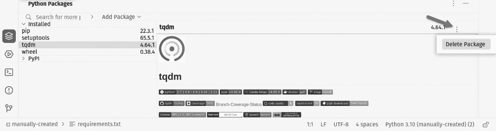

图 3.22：在 Python 包管理器窗口中，可以通过点击版本号旁边的省略号菜单选项来删除包

当我写这篇文章的时候，这个功能是如此新，以至于它几乎没能在这一章中体现出来。那天我在工作时偶然注意到了它。在我看来，它提供了一个不那么令人困惑且更方便的方式来处理 Python 包。

# 对虚拟环境重要的专业功能

PyCharm 专业版的一个主要特点是项目创建的便捷性，与更手动的方法相比。考虑一下 PyCharm 专业版的新项目窗口，它包含一系列项目类型，如*图 3.23*所示：

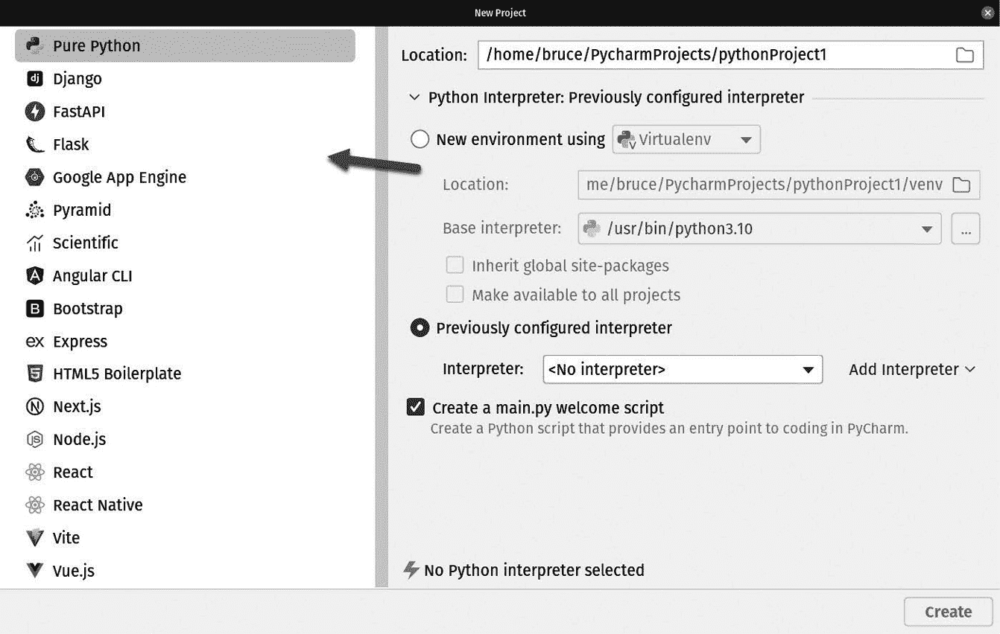

图 3.23：在新建项目对话框中，专业版列出了许多项目模板

Python 社区版没有这些项目选项。您只能创建纯 Python 项目，但公平地说，您仍然可以使用社区版创建 Flask 项目或其他列出的项目类型。然而，集成开发环境（IDE）不会帮助您完成这项工作。

让我们看看创建 Flask 项目的步骤。Flask 是一个库，它使我们能够轻松地创建动态网络应用程序。我们将在 *第八章* 中对其进行广泛介绍，*使用 Flask 构建动态网络应用程序*。现在，我们将比较在没有专业版（即没有任何 IDE）的情况下完成这项工作所需的工作量。

这些是手动设置项目的步骤：

1.  为你的项目创建一个新的文件夹。

1.  为你的项目创建一个新的虚拟环境。

1.  激活虚拟环境。

1.  使用你喜欢的包管理器安装 Flask 库及其依赖项。

1.  创建一个 Python 文件来保存你的起始代码。

1.  在网络上进行研究，找到一个简单的“Hello world”示例，并将其放入你的 Python 文件中。

1.  创建一个脚本，可以设置任何必要的环境变量，例如 `PYTHONPATH`，然后运行你的程序。

我敢打赌，你们中的许多人可以在 20-30 分钟内完成这项工作。我的问题是：你在什么时候对你的新项目想法最兴奋？是在项目的开始阶段！你准备好大干一场，但随后必须停下来花 30 分钟做这个繁琐的设置。这不是很多时间，但它是一个干扰。有可能遇到一些意外的障碍，这可能会耗尽你的热情。在极端情况下，有时，意外的障碍会延迟你几个小时或几天。PyCharm 自动化整个流程。你只需通过几个对话框屏幕，通常接受默认设置，你的项目在 30 秒内就准备好了。你可以立即通过修改 IDE 生成的起始模板来开始用代码实现你的想法。

专业版将帮助你在几乎不费吹灰之力的情况下生成更复杂的项目。IDE 将创建你的文件夹结构，一组基本的文件，带有编辑提示以开始，以及一个虚拟环境。PyCharm 甚至会为你安装需求。

# 将项目导入 PyCharm

可能不用说，但我还是要说。你可以将使用手动创建或使用其他 IDE 创建的现有项目导入 PyCharm。这看起来很明显，因为毕竟，这只是打开你电脑上的一个文件夹的问题。导入过程实际上就像在 PyCharm 中打开一个文件夹一样简单。然而，故事还有更多。当涉及到在没有 PyCharm 的情况下在其他机器上运行在 PyCharm 中开始或完全编写的项目时，PyCharm 是你的智能盟友。让我们看看这个实际操作。

在本书末尾克隆的源代码中，在 *第二章* *安装和配置* 和 `chapter-03` 文件夹中，有一个我完全从命令行创建的项目。你可以在 *图 3**.24* 中看到我使用的流程：

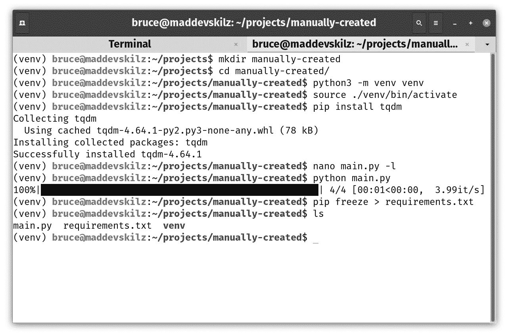

图 3.24：我用来在 PyCharm 之外完全创建 Python 项目的终端窗口

我遵循的过程在这里描述得很清楚：

1.  在一个名为`manually-created`的新项目文件夹中，我使用`python3 -m venv`命令创建了一个新的虚拟环境。

1.  我使用`source venv/bin/activate`命令激活了虚拟环境。在这种情况下，我在 Linux 上工作。这个命令在 Mac 上同样适用。如果我在使用 Windows，它将是`.\venv\Scripts\activate`。

1.  接下来，我安装了一个名为`tqdm`的第三方模块。你可以在[`pypi.org/project/tqdm/`](https://pypi.org/project/tqdm/)了解更多信息。这个模块的简短版本用于轻松格式化程序的终端输出，包括一个看起来很棒的进度条。你可以在*图 3.24*中看到我运行程序后稍低处的一个块状进度条。我有点跑题了。

1.  我使用`nano`向一个名为`main.py`的新文件中添加了一些代码。我稍后会展示其内容，但我所做的只是从之前链接的[`pypi.org`](https://pypi.org)页面上的`tqdm`文档中复制粘贴了一个示例。如果你想知道`-l`开关的作用，它会在`nano`编辑器中显示行号，这使得`nano`成为一个快速、易于使用的代码编辑器。

1.  我使用`python main.py`命令运行了程序。

1.  在确认一切工作正常后，我创建了一个`requirements.txt`文件来记录我的程序对`tqdm`模块的依赖。`pip freeze`命令会将依赖关系图输出到屏幕上。为了将其转换成我可以包含在 Git 仓库中的文本文件，我使用`>`将输出重定向到`requirements.txt`，使得完整的命令看起来是这样的：

    ```py
    pip freeze > requirements.txt.
    ```

这种命令行设置工作对我们来说微不足道。事实上，我建议你通过为自己买一条新的工装裤并带着新的自信姿态来庆祝这一点！如果你自认为是非工装裤穿着的有感知的生物，我希望你能发挥想象力来翻译我的意图。转念一想，为了避免泛化，你可能不应该从我这儿得到关于着装或社交行为的建议。传统上，*着装建议*并不是我的*强项*。

警告

如果你是我写的第一本书的读者，我坚持的一个基本规则是，所有的双关语都是有意为之。

幸运的是，使用 PyCharm 之外创建的项目是 PyCharm 的一个强项。由于项目已经在 PyCharm 之外创建，让我们看看 PyCharm 对此有何看法。让我们在 PyCharm 中打开`chapter-03/manually-created`文件夹。为了使事情更加清晰，我在*图 3.25*中展示了项目的打开对话框。25*：

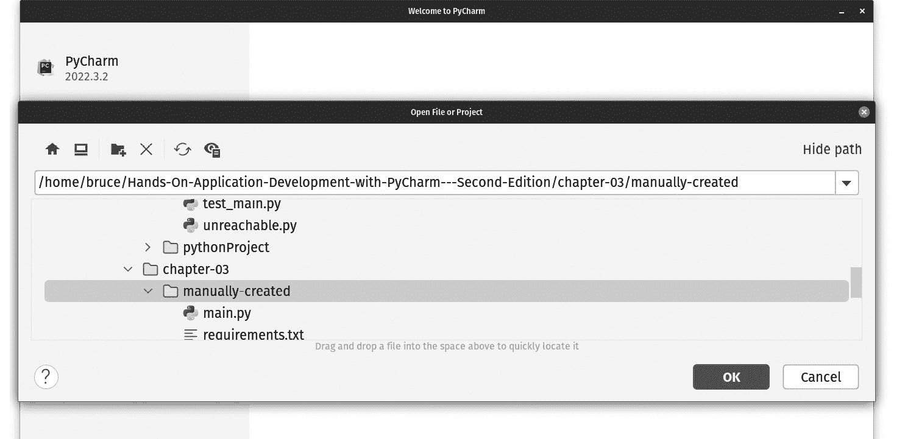

图 3.25：打开在 PyCharm 之外创建的手动创建的项目

对于这个项目，我做了我通常不会做的事情。虚拟环境（`venv`）文件夹包含在 git 存储库中。通常情况下，它不应该在那里，但为了您能看到接下来的小魔法，它需要在那里。

打开项目文件夹并观察会发生什么。如果您在寻找软件赋能的震撼展示，可能会觉得有点令人失望。甚至不值得截图。项目打开了，它就静静地在那里。这就是酷的地方。PyCharm 可以看到您的虚拟环境文件夹，因此它会自动为您设置项目。您可以在项目设置中验证所有这些，如*图 3**.26*所示：

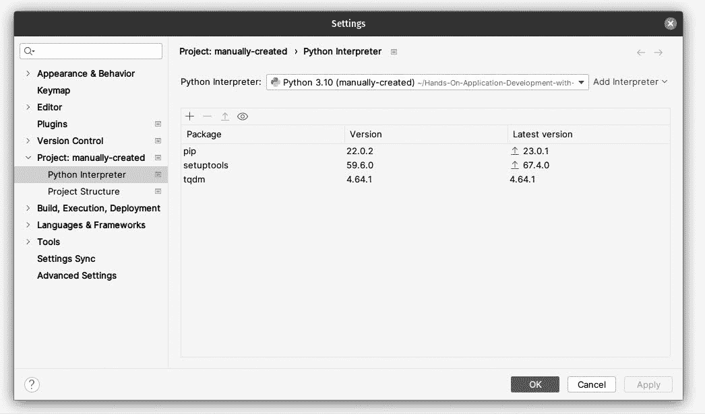

图 3.26：导入的项目无需我们任何努力就具有正确的解释器设置

## 从存储库导入克隆的项目

我们之前的示例展示了手动在电脑上创建的项目导入。更有可能的是，您将导入从 GitHub 或其他存储库克隆的项目。这些克隆的项目将不会包含虚拟环境文件夹。因此，您需要做更多的工作来设置项目。

我将重用同一个项目，但我会删除一些文件，这样 PyCharm 就不会记住关于项目的任何信息。

首先，如*图 3**.27*所示，在 PyCharm 中关闭项目：

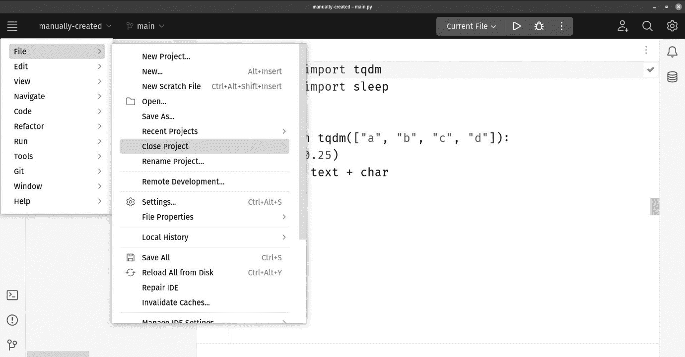

图 3.27：关闭项目

接下来，使用您的操作系统删除*图 3**.28*中显示的文件夹。

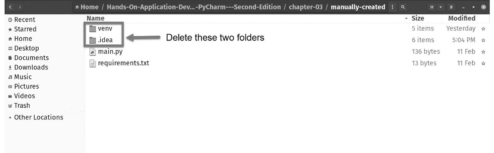

图 3.28：删除 venv 和 .idea 文件夹以模拟从版本控制系统（VCS）克隆的项目

我们将删除 `venv` 文件夹和 `.idea` 文件夹。后者在 macOS 和 Linux 系统上将被隐藏，所以请确保您打开了查看隐藏文件夹的能力。`.idea` 文件夹是 PyCharm 项目文件夹，当您打开项目文件夹时自动创建。这两个文件夹删除后，PyCharm 现在几乎不知道曾经打开过项目。文件夹仍然会出现在您的**最近**项目文件夹中，但这没关系。再次用 PyCharm 打开文件夹。在 PyCharm 中打开项目的结果如*图 3**.29*所示：

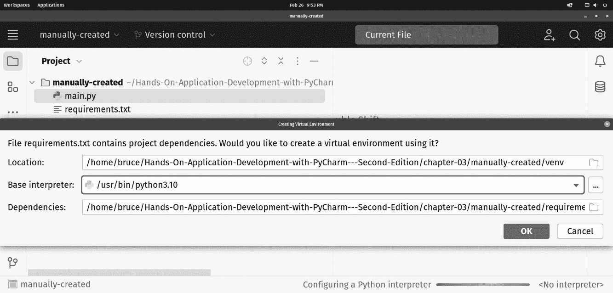

图 3.29：导入 PyCharm 外部创建的项目会提示创建虚拟环境

PyCharm 看到了`requirements.txt`文件，但它找不到合适的虚拟环境，因为项目中没有包含 Python 可执行文件的子文件夹。PyCharm 会提示你为项目创建一个环境。在我的情况下，默认是本地文件夹`venv`。它将使用在`/usr/bin/python3.10`找到的 Python 3.10 可执行文件作为虚拟环境的基础，并且它看到了`requirements.txt`文件。如果点击**确定**，PyCharm 将设置虚拟环境并为我安装依赖项。

## 处理无效的解释器

没有 IDE 是完美的。有时，PyCharm 可能会对使用哪个虚拟环境感到困惑。这通常只在你使用 PyCharm 未创建的代码设置新项目时发生。这是一个边缘情况，但迟早你会遇到它，所以我想要花一分钟来谈谈这个场景。也许你正在准备写一本关于 PyCharm 的书。好吧——这很可能主要发生在我身上。假设你正在准备一个演示。也许你正在设置一个培训课程，并且你对事情做了一些调整或者调整了太多次。如果你像我一样，你喜欢事情完美。你已经努力设置了一个项目，你看到了无效环境的列表，例如**图 3.30**中的：

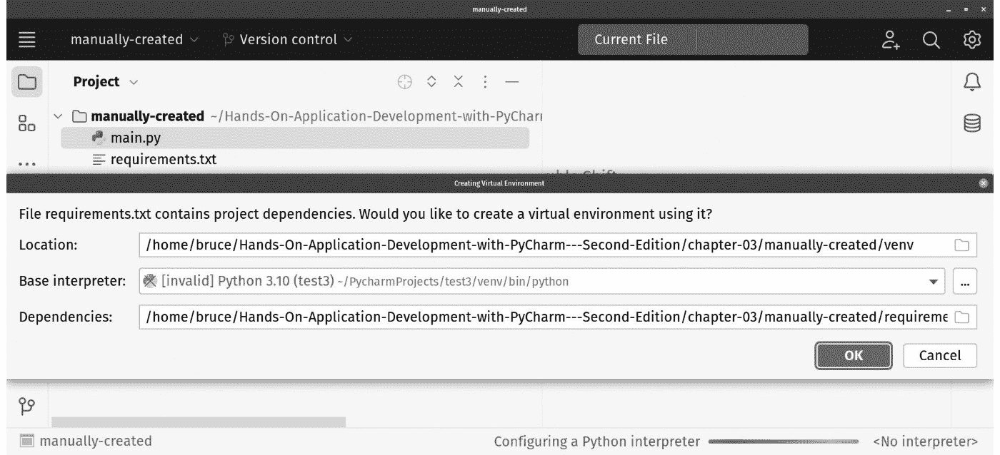

图 3.30：无效解释器错误会发生在我们所有人身上

太糟糕了！有一个难看的红色消息说基本解释器无效。我们需要解决这个问题。好消息是，你知道该怎么做！首先，让我们解决你的 immediate 问题。你需要设置基本解释器，以便 PyCharm 可以完成导入你的项目。首先尝试的是基本解释器的下拉列表。在所有可能性中，你的全局 Python 安装将出现在列表中。如果它确实如此，选择它然后点击**确定**，PyCharm 会做它的事情。

如果找不到，你仍然可以创建一个有效的环境。你只需以我们从头开始创建项目时的相同方式创建一个虚拟环境。你需要取消你看到的**图 3.32**中的对话框，并使用项目设置添加一个新环境。

点击**文件** | **设置**进入**设置**对话框，找到项目设置，如图**图 3.31**所示：

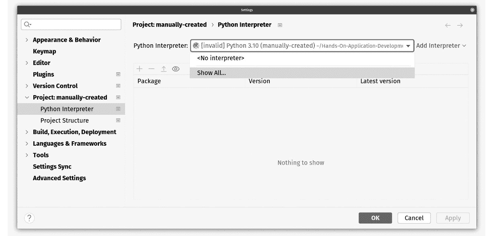

图 3.31：最坏的情况（这种情况不常发生，但确实会发生）

这是最坏的情况！列表没有显示基本解释器，唯一的选择是我们的无效虚拟环境。诚然，你必须努力工作才能让 PyCharm 这样做，但这种情况通常在你需要 PyCharm 在很多人面前工作时正好 5 分钟前发生。我在这里为你服务。

在下拉菜单的底部是**显示所有…**选项。这将允许我们修复一切！点击它！您将看到一个非常有用的对话框，如图 3**.32**所示：

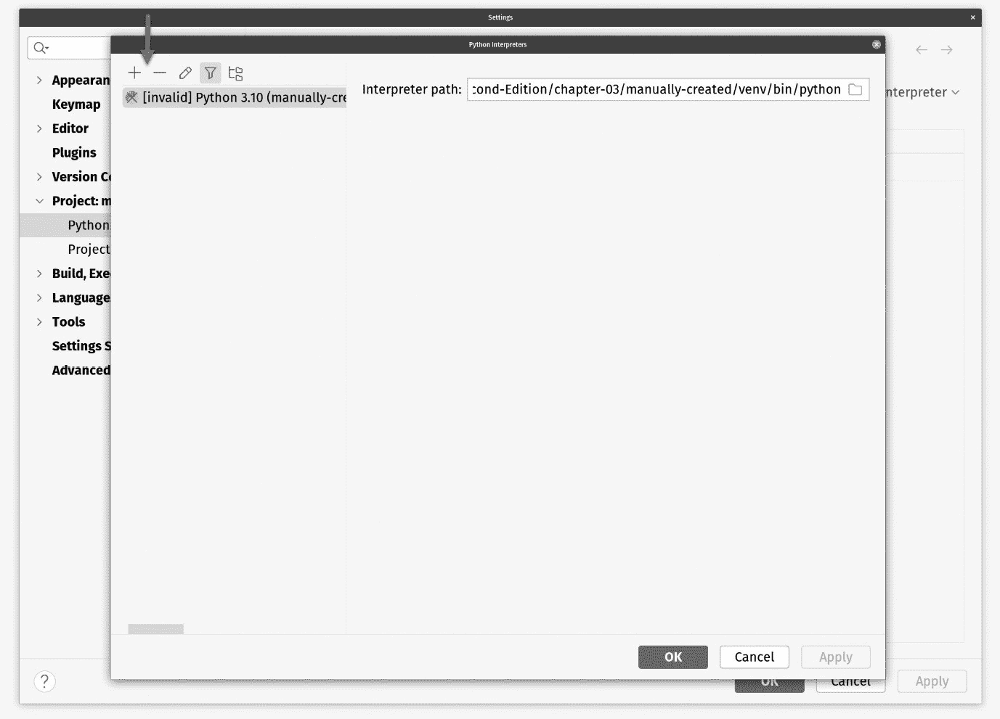

图 3.32：Python 解释器对话框允许您在一个地方管理所有 Python 环境

注意图 3**.32**中的箭头。您可以使用**+**和**–**图标来添加和移除环境。您可以选择无效的环境，并用**–**图标将其移除。接下来，您可以使用**+**图标添加一个新的、有效的环境。添加新解释器的流程与我们在创建新项目时从头开始创建的流程相同。我们已经覆盖了该过程，所以不会再重复了。

# 使用运行配置

PyCharm 中的运行配置允许您从 IDE 中设置不同的程序运行方式。运行配置的核心是在主窗口顶部的一组蓝色按钮。按照图 3**.33**中的箭头操作：

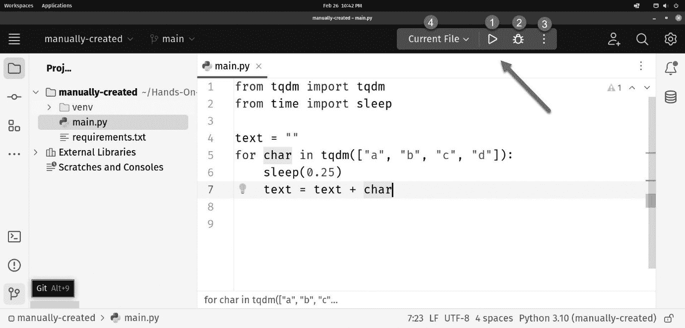

图 3.33：屏幕顶部有几个运行按钮，以及一个下拉列表，允许您处理各种运行配置

由于我们已经在之前打开了`手动创建`的项目，为什么不继续使用该项目进行探索呢？我在图 3**.33**中指出的那一组按钮包括一个**运行**按钮、一个**调试**按钮和一个下拉菜单，允许您设置和管理运行配置。当我们导入项目时，它生成了一个名为**当前文件**的运行配置。

在下拉菜单中设置此选项后，当您点击运行或调试按钮时，**聚焦**标签页中的文件将被执行：

1.  这是因为当前聚焦的标签页中是`main.py`脚本。

1.  这是**运行**（调试）按钮。点击此按钮将运行您选择的运行配置，并附加调试器。我们将在*第六章*中看到这一功能，*无缝测试、调试和性能分析*。

1.  省略号按钮包含更多运行分析器和检查测试覆盖率的选项。我们将在后面的章节中介绍这些内容。

1.  **运行配置**下拉菜单允许您选择运行配置。您可以选择创建和编辑现有配置以及创建新的配置。

现在，让我们专注于运行配置本身，因为这些配置有自己的环境设置，与项目中的其他部分独立。

点击显示**当前文件**的下拉菜单，然后点击**编辑配置…**，如图**3.34**所示。这将弹出一个用于管理您的运行配置的对话框。您可以在这里添加、编辑和删除您的配置。请注意，专业版在此窗口中提供的工具将比社区版更多。我将专注于专业版：

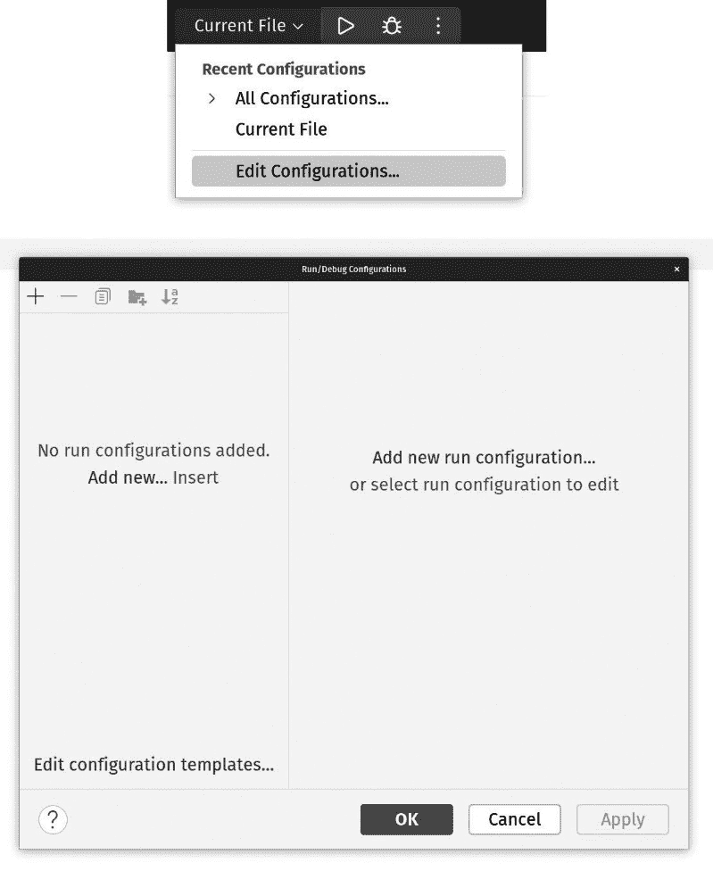

图 3.34：为手动创建的项目添加新的运行配置

对话框中有很多提示，允许您创建新的运行配置。让我们忽略那些，因为一旦添加一个，那些选项就会消失。如图**3.35**所示，点击对话框顶部的**+**图标：

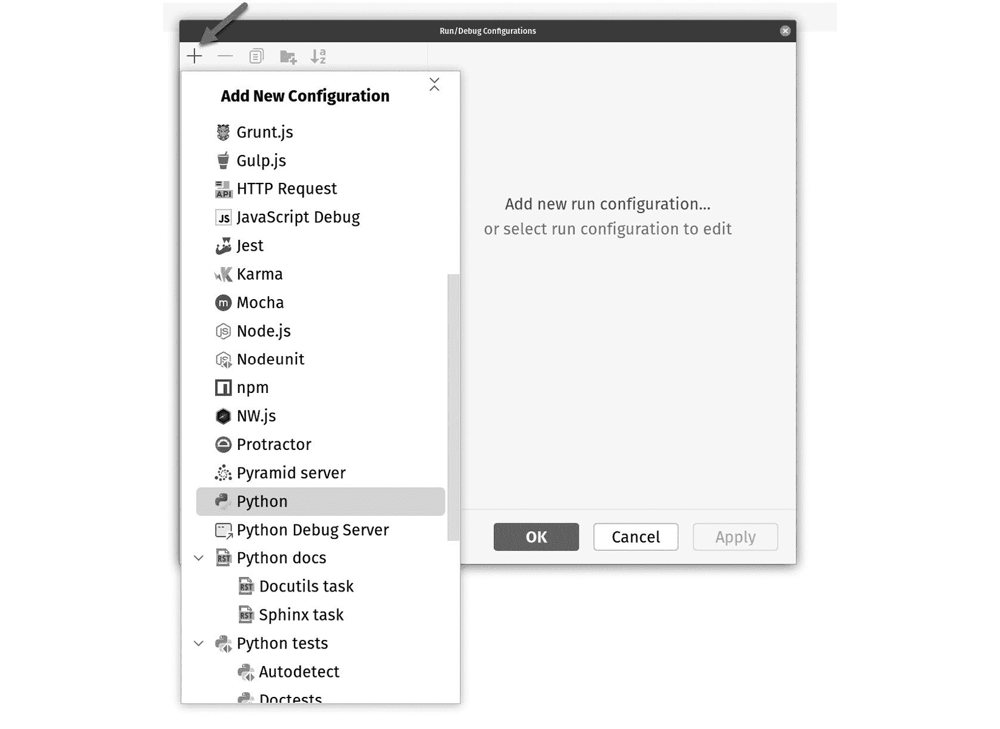

图 3.35：点击+按钮添加新的运行配置（显示的列表为专业版，您需要向下滚动以找到显示的 Python 项）

如果您正在运行专业版，您将看到一个长长的选项列表，如图**3.35**所示。社区版的列表要短得多，因为它只为纯 Python 项目提供工具。

我将选择纯 Python 项目类型，因为这是我们都可以使用的。每个选项都可能根据您的选择显示不同的对话框，并具有不同的设置。纯 Python 选项看起来如图**3.36**所示：

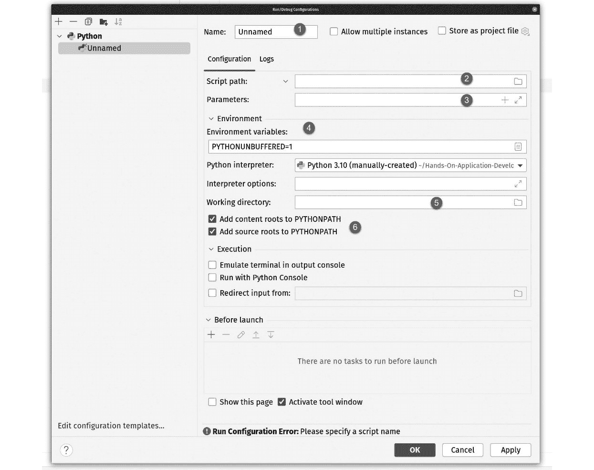

图 3.36：使用纯 Python 模板的运行配置选项

这里有很多设置。让我们根据图**3.36**中提供的数字来回顾最重要的设置：

1.  您应该给运行配置起一个名字。如果您不这样做，它将默认为脚本的名称。您可以使用一个用户友好的名称在这里；它不必以任何方式与运行文件相关。

1.  这个设置可能是最明显的。它允许您选择要运行的脚本。您可以浏览到它或输入路径。您还可以通过点击脚本路径文本输入框旁边的三角形将此设置从脚本文件更改为模块名称。如果您将设置更改为运行模块，文件夹**浏览**按钮将变为省略号，您将能够浏览程序中的模块以找到您想要运行的模块。

1.  `argparse`，您可以将它们传递到这里。这个文本框相当交互式。注意**+**图标。点击它允许您调用工具中可用的某些宏。例如，如果您需要当前目录的路径，您将在宏列表中找到一个选项。

1.  这些是环境设置。默认情况下使用项目设置。如果您需要在不同环境中测试运行软件，可以为您的运行配置设置不同的虚拟环境。您还可以在此处设置环境变量，而无需跳转到操作系统。如果您依赖环境变量来设置程序设置，这将很有用。如果您使用操作系统级别的环境变量来存储敏感数据，如密码或连接字符串，我建议不要在此处设置它们。这些设置可能会出现在项目配置文件中，这意味着它们可能会进入您的源代码库。没有什么比意识到您的黑客马拉松项目文件包含您的个人密码或您最喜欢的云提供商的访问令牌更糟糕的了。`SuperH4xr1337@some-evil-hacker-org.darkweb.net`（*注意*：希望这不是一个真实的地址）喜欢您这样做。有一些机器人会在 GitHub 上搜索这类东西，所以请小心。我个人使用配置文件来处理这个问题，使用许多`env`库中的一个。如果您对此感兴趣，我将在*进一步阅读*部分提供链接。

1.  如果您的脚本中的任何部分依赖于相对文件路径，您可以设置一个工作目录。

1.  此复选框控制当您运行程序时，您的项目内容根是否注入到`PYTHONPATH`环境变量中。`PYTHONPATH`环境变量控制 Python 解释器搜索模块的位置。内容根指的是项目结构设置，您在其中定义内容文件夹。这通常仅用于 Web 项目。内容文件夹可能包含图像或其他静态内容。`PYTHONPATH`环境变量。我在微服务架构项目中工作过，那里这个功能很有用。有时，您可能有一个在其他项目中需要利用的模块，但它属于它自己的独立项目，而不是直接在当前项目中管理。您可以设置源根以包含具有依赖关系的其他项目，并勾选此框将使这些项目对您的运行程序可用。

如您所见，PyCharm 提供了许多选项和方式，您可以自定义程序运行的配置。如果您的应用程序有多个可执行脚本，您可以分别为每个脚本设置其自己的运行配置。

# PyCharm 的项目文件

大多数集成开发环境（IDE）都有某种项目文件，用于包含项目级别的设置。如果你曾经使用过微软的任何 IDE，你可能还记得 Visual Studio Code 中的 `.vscode` 文件夹或 Visual Studio 项目中的 `.vs` 文件夹。NetBeans 和 Eclipse 等 Java IDE 也使用一组文件来包含它们的项目设置。PyCharm 同样在每个项目的文件夹中存储一组文件，称为 `.idea`。这个名字可能看起来有些奇怪，直到你记得 JetBrains 是从只有一个 IDE 项目，即 IntelliJ IDEA 开始的。IntelliJ IDEA 以其作为 Java 开发的最佳 IDE 而闻名，无与伦比。它如此之好，以至于谷歌与 JetBrains 签订合同创建 Android Studio；鉴于 Android 应用程序完全用 Java 编写，这是一个自然的匹配。JetBrains 的所有 IDE 都有相同的血统。它们都是 IntelliJ IDEA 的后代，这就是为什么项目文件夹被称为 `.idea`。记住——Windows 用户会清楚地看到这个文件夹，而在 Linux 和 Mac 上，任何以点（`.`）开头的文件夹名都是隐藏的。

默认情况下，如果你试图编辑这些文件夹，里面并没有什么特别有趣的东西。事实上，如果你删除它们，PyCharm 会在你重新打开项目时简单地重新创建它们。

话虽如此，PyCharm 中有一些选项允许你将这些运行配置存储在这些文件中，如图 *图 3.37* 所示：

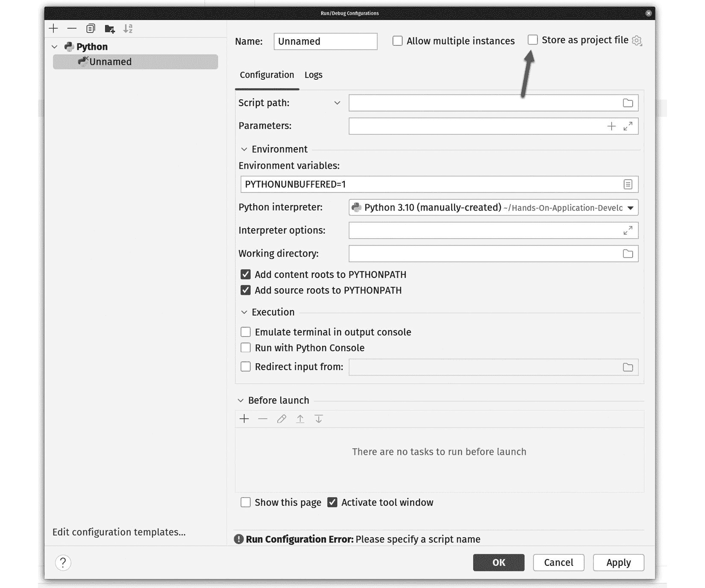

图 3.37：你可以选择将运行配置作为项目文件的一部分存储在 .idea 文件夹中

如果你选择这样做，你就有能力将 `.idea` 文件检入你的版本控制系统（VCS）仓库，并与你的团队共享。这意味着每个人都会有相同的配置，所以你可能想要召开一个会议，标准化你的项目结构，这样你就不会相互干扰。

# 摘要

本章全部关于为 Python 项目设置虚拟环境。每个项目通常都有自己的虚拟环境。我们使用虚拟环境来隔离我们的项目，防止其他项目的需求影响，并防止我们的全局 Python 安装被仅用于一个项目的许多全局包污染。

虚拟环境是 Python 解释器的副本，以及所有支持工具，例如包管理器和项目所需的第三方库。PyCharm 内置了创建和管理虚拟环境的功能。

我们第一次看到这些工具是在创建新项目时。PyCharm 会提示我们每次都创建一个新的虚拟环境。如果合适，我们也可以选择现有的环境。PyCharm 给我们提供了在任何时候更改项目虚拟环境的能力。

我们的虚拟环境还包含了我们项目所需的所有第三方库。你可以在[`pypi.org`](https://pypi.org)找到数千个现成的模块。这些模块可以通过包管理器安装并用于你的项目中。最常用的包管理器是`pip`，但还有其他，如`conda`、`pipenv`和`poetry`。PyCharm 支持所有这些工具，当你创建虚拟环境时，你可以选择你喜欢的工具。

在选择了你的包管理器后，PyCharm 有一个 GUI，允许你查看、添加、删除和更新你的 PyPI 库依赖项。你可以在 PyCharm 本身的一般设置中找到这个 GUI，它包含在你的项目设置中。

PyCharm 可以轻松导入在 PyCharm 外部创建的项目。你需要做的就是打开代码所在的文件夹。PyCharm 会在该文件夹内创建一组名为`.idea`的项目文件，然后提示你设置解释器，如果它无法在项目文件夹内找到解释器。PyCharm 还会寻找`requirements.txt`文件，并为你安装依赖项。

当你准备好在 IDE 中运行一些代码时，PyCharm 提供了一个强大的运行系统，该系统使用在 GUI 中创建的运行配置。PyCharm Professional 附带许多项目类型，每种类型都有自己的运行配置设置。我们介绍了纯 Python 项目中发现的广泛设置，因为这是社区版用户可用的。运行配置可以管理——在某些情况下可以模拟——你通常需要在操作系统级别手动设置的广泛设置。

总的来说，PyCharm 为你提供了一套非常完整的工具，用于管理虚拟环境以进行开发和运行你的代码。在下一章中，我们将把重点转向你每天都会使用的核心工具，用于管理、编写和编辑你的代码。

# 问题

1.  虚拟环境是什么？为什么它们很重要？

1.  Python 社区使用哪些工具来创建虚拟环境？

1.  PyCharm 支持哪些虚拟环境工具？

1.  运行配置可以使用与主项目不同的虚拟环境吗？这可能会怎样有用？

1.  PyCharm 将项目配置文件保存在哪里？

# 进一步阅读

+   *替代 Python* *实现*: [`www.python.org/download/alternatives/`](https://www.python.org/download/alternatives/)

+   `The env`库：[`pypi.org/project/env/`](https://pypi.org/project/env/)

+   *Ajitsaria*, *A.* *什么是 Python 的全局解释器锁（GIL）？*: [`realpython.com/python-gil/`](https://realpython.com/python-gil/)

+   一定要查看这本书的配套网站[`www.pycharm-book.com.`](https://www.pycharm-book.com.)
