# 第十一章：在 PyCharm 中理解数据库管理

马蹄蟹、肺鱼、鳄鱼和关系数据库有什么共同之处？我等你查一下*肺鱼*。这四种生物都存在了数百万年，但进化很小。好吧，数据库没有存在数百万年，但它们已经存在了数百万个互联网年。众所周知，互联网年是短暂的。JavaScript 开发者经常开玩笑说，在午餐时间之前，世界上任何地方都会发明数十个新的框架，它们会崭露头角，失去青睐，然后在你吃完面条之前就被遗弃。

在 20 世纪 70 年代初，一位名叫 E. F. Codd 的研究员在加利福尼亚州 IBM 的圣何塞研究实验室工作。他开发了一种革命性的概念，称为**数据关系模型**。在他的开创性论文《大型共享数据银行的关系数据模型》中，发表于 1970 年，Codd 概述了这种新方法组织数据的原则和基础。

Codd 的关系模型提出了一种将数据表示为关系集合的方法，即关系，每个表由行和列组成。他引入了**关系代数**的概念，这是一种用于在这些表中操作和查询数据的数学框架。该模型强调了使用数学**集合论**和逻辑来定义关系和执行数据操作。

Codd 的思想挑战了当时盛行的层次结构和网络数据库模型，这些模型更复杂且灵活性较差。关系模型提供了一种更简单、更直观的方式来管理数据，为**结构化查询语言**（**SQL**）和其他在关系数据库中使用的工具奠定了基础。

1974 年，IBM 发布了第一个商业可用的**关系数据库管理系统**（**RDBMS**），名为*System R*，基于 Codd 的工作。System R 实现了 Codd 研究中概述的许多概念，并成为后续关系数据库系统的一个有影响力的先驱。1974 年，IBM 基于 Codd 的工作发布了 System R，但由于 IBM 高管担心会损害公司其他数据库系统的销售，该产品并没有积极地进行市场推广或销售。在那个时期，另一家初创数据库公司诞生了：**Oracle**。Oracle 的最初版本是由拉里·埃利森、鲍勃·米纳和埃德·奥茨开发的。1983 年发布的 Oracle 通常被认为是第一个商业上的成功，尽管 IBM 有明显的先发优势。

关系数据库技术在 20 世纪 80 年代和 90 年代不断发展，在这个过程中，它成为了全球每个角落每个行业中企业 IT 的必备技术。1986 年，SQL 语言实现了标准化。随着时间的推移，标准也在不断发展，但说实话，在 SQL 发明 49 年后，大多数开发工作都是使用最简单、最古老的语句集完成的。

刚才，我说过 Codd 的想法挑战了当时盛行的层次化和网络数据库模型，这些模型更加复杂且灵活性较低。值得注意的是，在 2000 年代初，人们开始从关系型数据库技术转向我们所说的**NoSQL 数据库**。IT 界常常像摆钟一样，永远在来回摇摆。我们曾经有过相对低功耗的 PC，能够在邮票大小的窗口中以每秒 12 帧的速度播放视频文件。技术得到了改进，我们可以全速在 PC 上观看 4K 高清视频，但随后我们发明了小型手持设备，如 iPod，我们又回到了低端处理和粗糙的视频。最终，这些改进成了 iPhone，它能够以高清和高帧率播放视频。有些 iPhone 比我在大学时拥有的电视还要大。

同样，在数据库领域，有一天世界正在使用层次化和面向网络的数据库。第二天，一切又转向了一个新事物，称为*关系型*。如今，我们看到又回到了另一个方向。越来越多的项目今天倾向于非关系型数据库，其中许多支持层次化数据。无论你偏爱哪种技术，可以说，你几乎构建的任何项目，尤其是在企业 IT 领域，都将以某种方式与数据库交互。

2015 年，JetBrains 推出了一款新产品，旨在成为数据库开发人员流行的 IDE。**DataGrip**的创建是为了提供用于处理各种数据库的统一界面和强大的工具集。它提供智能代码补全、高级 SQL 编辑功能、模式导航、数据分析以及与版本控制系统的集成。与 JetBrains 的 Web 开发产品 WebStorm 一样，DataGrip 产品通过其插件系统集成到 PyCharm 的专业版中。考虑到你在 PyCharm 专业版上的 99 美元投资，你得到了一个 Python IDE、一个 JavaScript IDE、一个用于 HTML 和 CSS 前端工作的 IDE，现在还有一个用于数据库工作的完整 IDE，你会发现这是一个非常划算的交易！

在本章中，我们将介绍 PyCharm 与数据库相关的功能。到本章结束时，你将学习以下内容：

+   一些数据库历史和一些基础知识，以确保我们在术语方面处于同一页。如果你已经开发软件一段时间了，这可能是一次复习。如果你是新手，我将努力为你提供数据库技术的最佳可能介绍。

+   如何导航到 PyCharm 中的数据库工具，这些工具隐藏在界面右侧的一个标签页中。我遇到过许多使用 PyCharm 多年的开发者，但他们甚至不知道这些工具的存在。

+   如何连接到不同的数据库，包括如何在 PyCharm 中添加必要的连接驱动程序。JetBrains 使这一过程变得非常简单！

+   如何为单个项目和全局配置 SQL 方言。

+   如何使用 SQL 生成模板来帮助你更快地编写 SQL 查询。

+   如何生成**实体关系图**（**ERD**）。

+   如何使用图形设计器轻松构建表格。

+   如何使用控制台创建和运行针对任何数据库的即席查询。

顺便说一句，除了 12 岁时学习 BASIC 编程之外，关系技术是我 30 多年前进入 IT 领域时掌握的第一项技能。这是一个一直有需求，并且可能在未来许多年里仍将有需求的技能集。这是我有着丰富经验的一个主题，我很高兴能在本章与你分享这些经验。那么，让我们开始吧！

# 技术要求

为了继续本章，以及本书的其余部分，你需要以下内容：

安装并运行 Python 解释器。我将使用来自[`python.org`](https://python.org)的最新版本。

安装并运行 PyCharm 的副本。安装已在*第二章*，*安装和配置*中介绍，以防你是在书的中途开始阅读。

在本章中，数据库服务器是一个不错的选择，这样你就可以在实际数据库上练习。有数十种流行的关系型数据库可供选择，因此对我来说涵盖所有这些并不实际。我将使用**MySQL**和**Docker Desktop**运行。如果你打算跟随，你需要在你的计算机上安装 Docker Desktop。你可以在[`www.docker.com/products/docker-desktop/`](https://www.docker.com/products/docker-desktop/)找到安装说明。

本书提供的示例源代码来自 GitHub。我们已在*第二章*，*安装和配置*中介绍了代码克隆。你可以在[`github.com/PacktPublishing/Hands-On-Application-Development-with-PyCharm---Second-Edition/tree/main/chapter-11`](https://github.com/PacktPublishing/Hands-On-Application-Development-with-PyCharm---Second-Edition/tree/main/chapter-11)找到本章的相关代码。

# 简要介绍关系数据库

E. F. Codd 提出的关于关系数据的概念基于几个简单的原则。首先，数据可以用称为*表*的集合来表示。一个`books`。`books`表将包含定义这些列内数据的列——可能像这样：

| **标题** | **ISBN** | **页数** | **作者** | **价格** |
| --- | --- | --- | --- | --- |
| 资治通鉴 | 1599869772 | 68 | 孙子 | 4.99 |
| 五轮书 | 8387743849 | 43 | 宫本武藏 | 4.50 |

此表有五个列，用于结构化关于书籍的数据。我们有两本书，它们作为行存储在表中。

# 结构化查询语言

E. F. Codd 的关于关系代数的论文是 SQL 的基础。SQL 与您将使用的任何其他编程语言都不同，因为它仅是少数几种使用声明性范式的语言之一。您使用的多数语言，包括 Python，都使用命令式范式。简而言之，这种语言作为一个句法框架，向计算机提供指令，告诉它您希望它做什么。您基本上是一个微观管理者。您必须指定每个输入、每个输出以及程序在处理过程中将采取的每个步骤，以将输入转换为输出。您必须非常细致，因为计算机将严格地执行您的指令。如果您遗漏了任何细节，您就是在设置系统出现故障。

另一方面，**声明性编程**仅仅涉及指定您希望从隐含输入中获得的输出。您对从输入中推导出输出的操作几乎没有控制权。考虑以下设计用于从您的书店数据库中获取一些行的 SQL 语句：

```py
SELECT title AS Title, isbn AS ISBN, author AS Author, price AS Price FROM books ORDER BY price DESC
```

这个查询将产生一些输出，包括一个表格，其中包含您原始数据库中的一些列，这些列作为隐含输入。您将得到以下列：

`标题`

`ISBN`

`作者`

`价格`

但您不会得到页数，因为您在查询中没有要求。输入数据源隐含在查询的`FROM books`部分中。最后，我们有一个按价格降序排序结果的要求（`DESC`），这将使我们的结果表格从最贵到最便宜排列。

## SQL 的两个部分

SQL 本身分为两个独立的语法集合：前面提到的`SELECT`语句是一个读操作的例子。SQL 有`INSERT`、`UPDATE`和`DELETE`操作的关键字，这些操作对于记录来说是直接的，所以我想专注于 DDL，因为这将是你 PyCharm 工作中的一大部分。

我们之前在书店应用程序中使用的表格示例中有一个名为`books`的表。这个表包含了一组列，我们将使用 DDL（数据定义语言）如下定义这些列：

```py
CREATE TABLE books (
  title VARCHAR(255),
  isbn VARCHAR(255) UNIQUE,
  price DECIMAL(10, 2),
  author VARCHAR(255),
  page_count INT
);
```

如果您是 SQL 的新手，您可能已经注意到关键字都是大写的。实际上，我敢打赌您正确地假设那些大写的单词是关键字。虽然关键字大写不是强制性的，但这是一个好的实践——尤其是如果您的项目数据库负责人是一位从美国海军陆战队退休的大个子，他对*他*的数据库中的句法细节非常讲究的话！在这种情况下，好的实践可能成为生存的关键。

在表的 DDL 中，你读到的内容大部分都很容易理解。我们正在创建一个名为`books`的表。我们已经知道了列名。SQL 使用强类型系统，这意味着你必须定义将要放入列中的数据类型，违反这个约束可能会带来后果。我以前说过很多次，开发者的工作就是保护程序不进入无效状态。同样，数据库开发者的工作也是如此，以及`VARCHAR`指的是一组可变长度的字符。程序员称之为*字符串*。类型后面的数字（`255`）指的是`VARCHAR`的最大长度。数据库中所有的`VARCHAR`（字符串）字段长度都被限制在 255 个字符以内。数字 255 非常常见，因为我们这些老一辈的人都是在 8 位计算的世界中长大的。数字 255 是 8 位无符号整数的最大值，因此是字段长度的常见最大值。当我们不确定数据可能有多长时，我们会将其设置为这个值。

自然地，今天，我们通常在 32 位甚至 64 位架构上工作，所以最大值可以更高。将我们限制在旧的最大值是正常的，因为 255 个字符通常足够用于大多数事情。指定合理的最大值有助于保持你的数据库存储和内存需求合理。

看一下`price`字段。它被指定为`DECIMAL`类型，这显然类似于浮点数。数据库系统对它们的类型有不同的命名，所以你应该始终查阅你的数据库系统文档以获取确切的命名。`DECIMAL`确实是一个浮点数，但我们还指定了精度级别为`(10,2)`。这意味着我们可以有一个 10 位数字，有 2 位小数。这通常用于指定价格。一些数据库系统有专门针对货币的类型。SQL Server 就是这样一个例子，它们有`MONEY`和`SMALLMONEY`类型。再次提醒，检查你的数据库系统文档以获取适当类型，因为这些专用类型不是标准 SQL 的一部分。

## 关系

考虑到我们的书店自然会增长规模和复杂性。假设我们添加了一些不同的字段，并删除了一些我们没有使用的字段。我们新的表结构看起来像这样：

| **标题** | **作者姓名** | **作者邮箱** | **页数** | **价格** |
| --- | --- | --- | --- | --- |
| C 程序设计语言（第 2 版） | 布莱恩·肯尼根和丹尼斯·里奇 | bkernigan@notrealaddress.com | 272 | 53.60 |
| C#设计模式实战应用 | 布鲁斯·范·霍恩 | bvanhorn@notrealaddress.com | 442 | 44.99 |
| 使用 PyCharm 进行实战应用开发 | 阮文 | qnguyen@notrealaddress.com | 785 | 35.45 |
| 使用 PyCharm 进行实战应用开发（第 2 版） | 布鲁斯·范·霍恩 | bvanhorn@notrealaddress.com | 840 | 44.99 |

除了来自更多记录的复杂性之外，我们在设计方面也引入了一些复杂性。在某个时候，对我们来说，跟踪任何给定书籍作者的更多信息变得很重要。我们添加了姓名和电子邮件地址字段，起初这似乎解决了我们的问题，但最终导致了更多问题。

C 语言书籍有两个作者，但我们只有一个字段。虽然将两位作者都存储起来可能没问题，但我们还有一个电子邮件地址字段，而这个字段只能容纳一个地址。这并不理想，因为我们的目标可能是向作者发送版税声明或销售报告。一个地址就是一个问题。

如果我们存储了两本同一作者的书籍，电子邮件地址将会重复。如果作者更改了电子邮件地址，所有记录都必须更新。这相当于在程序中多个地方硬编码的值。你必须记住在许多地方更改它。如果这个电子邮件地址数据在几个不同的表中重复，问题会更加复杂。

这个问题的解决方案由 SQL 和关系代数背后的思想规定。你需要一个作者数据的单一来源，而不是将其与其他表混合。因此，我们为作者创建了一个新表：

```py
CREATE TABLE authors (
  id SERIAL PRIMARY KEY,
  first_name VARCHAR(255),
  last_name VARCHAR(255),
  email_address VARCHAR(255)
);
```

这个表格有姓名、姓氏以及电子邮件地址字段。还有一个名为`id`的字段，它作为主键发送到服务器。主键是一个可以唯一标识该行信息的字段。这里的想法是每个作者只得到一个行来存储他们的信息。我们需要一些数据来唯一标识该行。以我自己的记录为例。我的姓名和姓氏在数据库中作为唯一定义我的记录的选择很糟糕。我知道至少有其他三个人叫布鲁斯·范·霍恩。一个是我的父亲，他在医学领域发表作品。一个是励志演讲者，在那个文学领域出版书籍。我在领英上找到了另一个布鲁斯·范·霍恩，信不信由你，他也是一个软件开发者！所以，名字作为唯一标识符是一个糟糕的选择。

电子邮件地址可能可行，但我们已经发现电子邮件地址可能会更改。我至少有五个电子邮件地址，其中至少有一个被垃圾邮件淹没得如此严重，以至于我甚至不再检查它。电子邮件是不可行的。

最佳实践是使用一些独特但随机的数据，它与记录中的其他数据没有任何关联。有两种方法可以做到这一点。最常见的是使用数据库序列。序列是一个自动递增的整数源。每次将记录插入到表中时，序列生成器都会生成一个顺序号，该顺序号保证是唯一的。

另一种方法是使用`6f35e0e7-d99a-4437-b894-f73ff35bd3ad`这样的记录与具有`id`值为`16`的记录相比。你更愿意在查询中输入哪一个？

现在我们有一个字段可以唯一标识作者的记录，我们可以调整我们的书籍表结构如下：

| **Title** | **pages** | **price** | **author_id** |
| --- | --- | --- | --- |
| Real-World Implementation of C# Design Patterns | 442 | 44.99 | 2 |
| Hands-On Application Development with PyCharm | 785 | 35.45 | 1 |
| Hands-On Application Development with PyCharm, 2nd Edition | 840 | 44.99 | 2 |

我们的 `authors` 表看起来是这样的：

| **author_id** | **first_name** | **last_name** | **email** |
| --- | --- | --- | --- |
| 1 | Quan | Nguyen | qnugyen@notrealaddress.com |
| 2 | Bruce | Van Horn | bvanhorn@notrealaddress.com |

`authors` 表中的作者 ID 在 `books` 表中用作相关列，通过一对一关系。每个作者将有一个记录，该记录与 `books` 表中的多个记录相关联。

## 更多关系结构

我们使用一对一的表结构解决了一个大问题。我们不再在多个记录中为作者重复数据。然而，我们并没有解决所有问题。例如，C 语言书籍有多个作者。我们如何以允许每本书支持多个作者的方式存储作者？

我恐怕我们已经到了这样一个地步，我告诉你这既不是一本关于 SQL 的书，也不是一本关于关系理论的书籍。如果我让你对这本书产生了兴趣，我可以推荐一些我学习这些知识时用过的优秀书籍。我们已经提供了足够的数据库关系词汇，以帮助你理解 PyCharm 工具中看到的内容，那才是我的真正目标。

由于我并不是一个彻底的堕落者，无论你在 Stack Overflow 上读到关于我的什么，我都会快速地给你解决方案，而不会用很多页的解释。

你会使用我们所说的映射表来解决这个问题。你的结构需要添加一个名为 `books_authors_map` 的表：

| **Id** | **Book_id** | **Author_id** |
| --- | --- | --- |
| 1 | 1 | 1 |
| 2 | 1 | 2 |

你的 `books` 表将如下所示：

| **Book_id** | **Title** | **Pages** | **Price** |
| --- | --- | --- | --- |
| 1 | The C Programming Language | 442 | 44.99 |

我们移除了 `author_id` 字段，并添加了一个 `book_id` 字段，这个字段本来就应该在那里。`authors` 表看起来会相同：

| **Author_id** | **First_name** | **Last_name** | **Email** |
| --- | --- | --- | --- |
| 1 | Brian | Kernighan | bkernigan@notrealaddress.com |
| 2 | Dennis | Ritchie | dritche@noterealaddress.com |

映射表可以将 `books` 和 `authors` 进行映射！如果任何作者独立出版书籍而没有合作者，那也是可以的！`books` 表的记录将在映射中有一个相关记录，该记录在 `authors` 表中有一个相关记录。

如果一本书有 10 位作者，它将有一个书记录，10 个作者记录和 10 个映射条目。关系代数非常酷！它是当今**对象关系映射器**（**ORMs**）世界中被低估的技能，ORMs 将所有这些抽象成常规对象结构。今天的开发者往往失去了这种技能。如果你失去了它，你将失去很多。你可以在 DDL 中进行精细的修改，这将为你的应用程序带来巨大的性能提升。

说到这个，让我们来了解一下 PyCharm 的数据库开发工具。

## 数据库术语使用简单的英语复数形式

随着我们讨论数据库讨论中使用的术语，我感到有必要指出困扰我很久的一件事。在讨论数据库时使用的许多术语都源自拉丁语根词。例如，**索引**是表格的一个附加项，可以加快数据检索速度，但会牺牲插入新数据的速度。它也是一个指代**指针、指示器或路标**的拉丁语单词。**模式**指的是在数据库中将表和其他结构划分开来的方式。单词**模式**起源于希腊语单词σχῆμα (*skema*)，在两种语言中均意为**形状、形式**或**计划**。

当谈到复数形式时，如果你像我一样接受了传统教育，你可能会发现单词的复数形式并不像你预期的那么简单。如果你来自一个以拉丁语为基础的语言国家，你也可能会注意到这个问题。

我原本预期 *schema* 的复数形式应该是 *schemata*，而 *index* 的复数形式应该是 *indices*。如果你预期这样，你总会感到失望。该行业已经标准化了简单的复数形式，如 *schemas* 和 *indexes*。

# PyCharm 中的数据库工具

PyCharm 中的数据库工具功能全面但通用。我的意思是，PyCharm 试图支持所有数据库，因此它通常支持所有数据库共有的功能。你可能会发现自己有时会依赖更具体的工具，例如用于 SQL Server 的 **SQL Server Management Studio**（**SSMS**）。然而，对于一般开发工作，PyCharm 中的工具已经足够。在 PyCharm 中处理数据库的起点是打开数据库工具并创建一个连接。为此，你还需要一个数据库。PyCharm 支持数十种最受欢迎的数据库服务器。由于这个原因，我无法预测你更喜欢哪一个，所以我将退而求其次，选择我熟悉的：MySQL。无论你更喜欢哪一个，PyCharm 中的工具都是通用的，只要你选择一个符合标准的关联数据库，过程都是相同的。

# 使用 Docker 设置 MySQL 数据库服务器

尝试任何数据库系统，或者几乎所有服务器技术的最简单方法就是使用 Docker。我在本书的后面部分还有更多关于 Docker 的计划，我将使用 Docker Desktop 和命令行。我喜欢桌面版的图形用户界面来查看正在运行的内容，但你应该掌握 Docker 命令行技能，以便保持竞争力。如果你没有安装 Docker Desktop，你可以在 [`www.docker.com/products/docker-desktop/`](https://www.docker.com/products/docker-desktop/) 找到安装说明。当然，还有其他选项，比如在你的电脑上安装数据库服务器。我个人反对这样做，因为数据库服务器非常复杂。安装像 SQL Server 或 Oracle 这样的东西会在操作系统级别进行修改，使得这些软件包难以卸载。过去有一个规则，如果你在安装数据库服务器时犯了错误，最明智的选择是擦除操作系统并重新开始。我相对确信这不再是规则，但我仍然因为你的解决方案中所有移动部件，这个是最复杂的。你最不希望的事情就是在开发史诗级项目的过程中，你的笔记本电脑上的数据库服务器出了问题。所以，我推荐使用 Docker。如果出了问题，你可以删除容器并创建一个新的。

同样，你可以使用 **VMware Workstation** 或 **Oracle VirtualBox** 等产品创建虚拟机。这是另一种很好的工作方式，尽管它比 Docker 占用更多的空间和资源，你必须记住保持你的虚拟机更新。

另一个很好的选择是在你最喜欢的云中启动你选择的数据库服务器。我推荐 **DigitalOcean**，因为他们的定价和设置都极其容易理解。我用这个服务来托管这本书的配套网站。如果你的电脑无法运行数据库服务器、VMware 或 Docker，使用云服务提供商是你的最佳选择。

所有这些选项都很好，但我需要选择一个，所以我将使用 Docker。记住，这不是一本关于 Docker 的书。我的介绍将是隐晦的。你的目标是让数据库服务器运行起来，以便你可以进行实践。如果你可以用除了 Docker 之外的东西做到这一点，请直接跳到下一节。

## 安装和运行 MySQL 容器

我假设你在你的电脑上运行了 Docker，并且你的 Docker 命令在你的 `PATH` 中可用。我们可以通过打开我们的终端并输入以下命令来确认：

```py
docker ps -a
```

此命令将列出当前正在运行或已停止的所有容器。如果你刚刚安装了 Docker，你应该看到一个空列表，也就是说，什么都没有。这个测试实际上是为了确保命令可以运行并且不会抛出任何错误。如果它没有，你就可以使用以下命令来获取 MySQL：

```py
docker pull mysql
```

您将看到安装的动画显示，如图 *图 11.1* 所示。

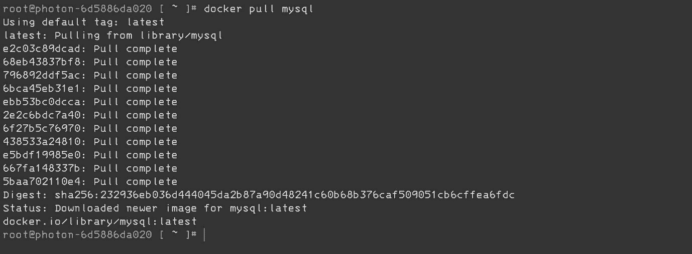

图 11.1：用于拉取 MySQL 所需镜像的 Docker 命令

此命令拉取了运行一个或多个 MySQL 容器所需的所有要求。接下来，我们需要使用以下命令创建并运行一个容器：

```py
docker run --name pycharm-mysql -e MYSQL_ROOT_PASSWORD=P@ssw0rd –p 3306:3306 -d mysql
```

此命令将创建并运行一个名为 `pycharm-mysql` 的容器。它将 MySQL 数据库的根密码设置为 `P@ssw0rd`。`-p` 标志将端口 `3306`（MySQL 的标准端口）映射到容器和主机之间的相同值。这将使您感觉就像是在计算机上直接运行 MySQL 服务器一样。`-d` 标志告诉 Docker 以后台进程的方式运行 MySQL，而不是等待其退出。这对于服务器软件来说是常见的。我希望我不需要提醒您，*这并不是生产就绪的*。如果您在一个小团队中，开发者负责建立生产环境，不要简单地将您的开发环境复制到对互联网开放的服务器上。您至少应该将数据库映射到更健壮的永久存储，以及加固 MySQL，为您的应用程序使用非特权账户，并使用一个不明显的主机密码。

我们现在正在运行 MySQL 服务器。当您运行 Docker 命令时，您的输出有些晦涩且令人不满意。您可以在 *图 11.2* 中看到我的输出。

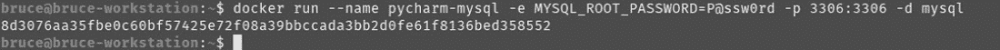

图 11.2：一串看似随机的字母和数字是 Docker 表示“我爱你”的方式，或者至少表明您的容器正在运行

有句老话说，*告诉一个人银河系中有万亿颗星星，他会相信你。告诉他他的容器在 Docker 中成功运行，他会运行* `docker ps -a` *来确认。实际上，我可能只是编造了这个。无论如何，让我们确保：

```py
docker ps -a
```

您应该看到像我一样的证据，在 *图 11.3* 中。`CONTAINER ID` 的值对于每次运行都会不同，所以不要期望您的与我的匹配。

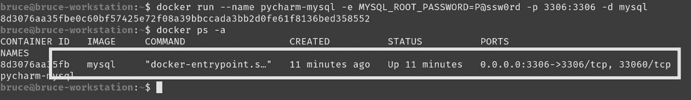

图 11.3：我可以看到名为 pycharm-mysql 的容器正在运行，并已暴露端口 3306

## 停止和启动容器

当您准备好退休时，您可能想停止容器：

```py
docker stop pycharm-mysql
```

这将停止容器。您可以使用我们一直在使用的相同的 `docker ps -a` 命令来确认状态已从 *Up* 更改为 *Stopped*。明天早上，当您回来时，键入以下内容：

```py
docker start pycharm-mysql
```

这将启动一切，以便您可以从上次离开的地方继续。

# 使用 PyCharm 连接到数据源

打开 PyCharm 专业版并创建一个名为 `database_fun` 的新 Python 项目。现在，定位数据库工具。您可以在右侧工具栏中通过看起来像三层蛋糕（美味！）的数据库图标找到它们。或者，您可以通过点击**视图** | **工具窗口** | **数据库**的汉堡菜单（美味！）来找到它。两种选项都在*图 11.4*中显示。

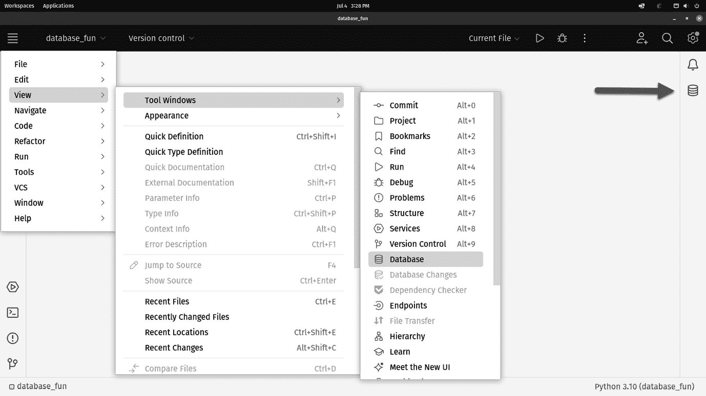

图 11.4：打开数据库工具的两种选项 – 一种来自菜单，另一种通过点击数据库工具图标

在打开数据库工具后，您需要创建一个新的**数据源**。注意这个术语的通用性。PyCharm 支持关系型数据库以及非关系型数据库，所以“数据源”这个术语只是一个通用的方式来指出这一点。点击*图 11.5*中显示的**+**图标，然后悬停在**数据源**上。您将看到一个支持的数据源的长列表。找到**MySQL**并点击它。

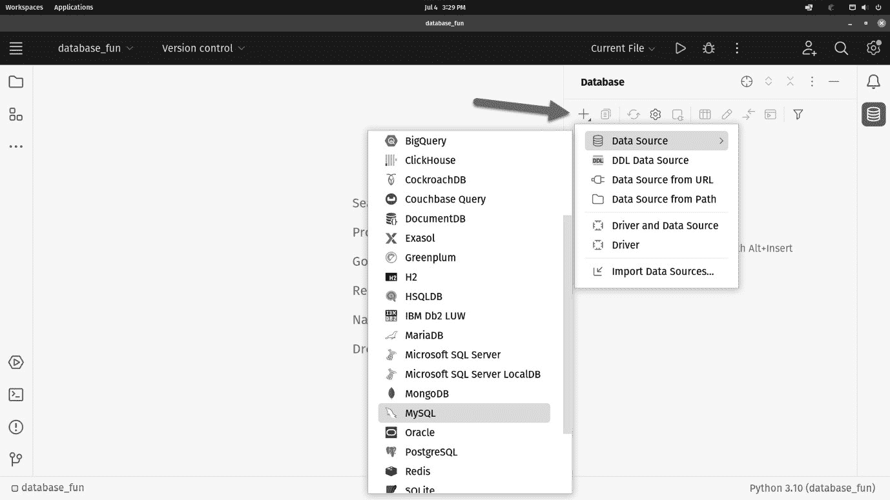

图 11.5：PyCharm 支持的数据源

您将看到*图 11.6*中像我一样的配置窗口。

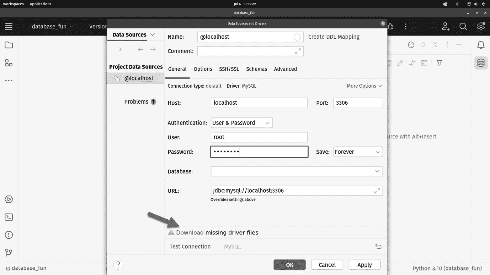

图 11.6：MySQL 数据库的配置窗口

每个数据库服务器可能有略微不同的设置，但本质上它们归结为 IP 地址（或 DNS 名称）、端口、安全凭证，以及非常常见的是默认数据库，这可能还不存在。我们为我们的 MySQL 服务器定义了根密码为 `P@ssw0rd`，并且我们知道由于我们在 Docker 中运行，我们的 IP 地址将是 `localhost`。您可能也记得我们之前运行的 `docker ps -a` 命令中显示的端口是 `3306`。前一个图中的箭头指向 PyCharm 数据库工具的一个重要方面。

PyCharm，就像大多数 JetBrains IDE 一样，是用 Java 编写的。因此，PyCharm 需要依赖**Java 数据库连接**（**JDBC**）驱动程序才能工作。大多数 JDBC 驱动程序是由发布数据库的同一公司或团队编写的，这意味着如果没有律师介入，JetBrains 通常不能将那些驱动程序捆绑到 PyCharm 中。没有人想那样做！JetBrains 做了下一件最好的事情。IDE 可以自动下载和安装驱动程序，但您必须通过点击此屏幕上的**下载缺失的驱动文件**链接来启动此操作。这只需要在您第一次使用数据库驱动程序时完成。一旦安装了驱动程序，*图 11.6*中箭头所示的选项就不再出现。您可以通过点击**测试连接**链接来测试您的连接。如果一切正常，您将收到一条确认消息，表明您的数据库连接成功。点击**确定**以关闭连接对话框。

关闭连接对话框后，您将在**数据库**面板中看到您项目的数据源连接列表。数据库面板顶部有一个可见的小工具栏，如图 11.7 所示。

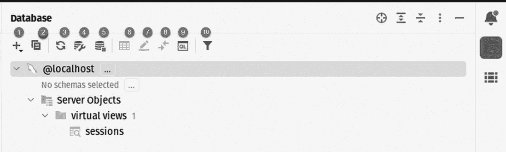

图 11.7：数据库面板顶部有一个小菜单栏

与往常一样，我在图中对选项进行了编号。让我们回顾一下：

1.  我们已经看到的**添加数据源**按钮允许您将新的数据源添加到您的项目中。

1.  **复制**按钮允许您快速复制，可能进行一些小的调整。我的许多项目涉及一个服务器上的多个数据库。我只需设置第一个数据库，然后复制连接并更改数据库名称。此选项使这个过程变得快速且简单。

1.  **刷新**按钮用于重新加载您连接的元数据。请记住这一点。PyCharm 不会自动跟踪您所有的数据库更改，尤其是如果您在 PyCharm 之外进行更改。您需要定期点击**刷新**按钮，以确保您查看的是数据源的最新信息。

1.  **数据源属性**按钮将显示一个对话框，允许您更改数据源配置的设置。

1.  **断开连接**按钮将使您从数据库服务器断开连接。

1.  **编辑数据**按钮允许您使用图形化、类似电子表格的用户界面直接在数据库中的表中编辑数据。这对于快速添加或更改测试数据来说很方便。

1.  **转到 DDL**按钮将带您到当前所选内容的 SQL 定义。您需要有一个 DDL 映射才能正确工作。

1.  **比较结构**允许我们比较两个数据库结构。这通常用于在正常开发过程中进行更改后，帮助将一个数据库结构迁移到另一个数据库。PyCharm 2023 的迁移技术仅部分完成，因此这个功能在你阅读这本书的时候可能已经有所变化。

1.  **跳转到查询控制台**基本上是您在命令行与数据库交互的常用工具。当您第一次连接到数据库时，会自动打开查询控制台，但如果您已关闭它，此按钮将打开它并将其置于焦点。

1.  **过滤器**按钮允许您过滤您在已定义的数据源中看到的内容。默认情况下，所有选项都处于开启状态，这可能对大多数不习惯如此明确地看到数据库所有细节的开发者来说有点多。

除了这些工具之外，还有一些与设置您如何查看和使用数据源相关的其他工具。一旦我们有一个数据库可以操作，这些工具的解释将会更容易。让我们花点时间创建一个数据库。

## 创建新的数据库

在我们做任何事情之前，我们需要一个新的数据库。大多数数据库服务器只是将这个称为“一个新的数据库”。MySQL 稍有不同。他们将一个新的数据库称为新的 `@localhost`) 并点击 **新** | **模式**，如图 *图 11.8* 所示。

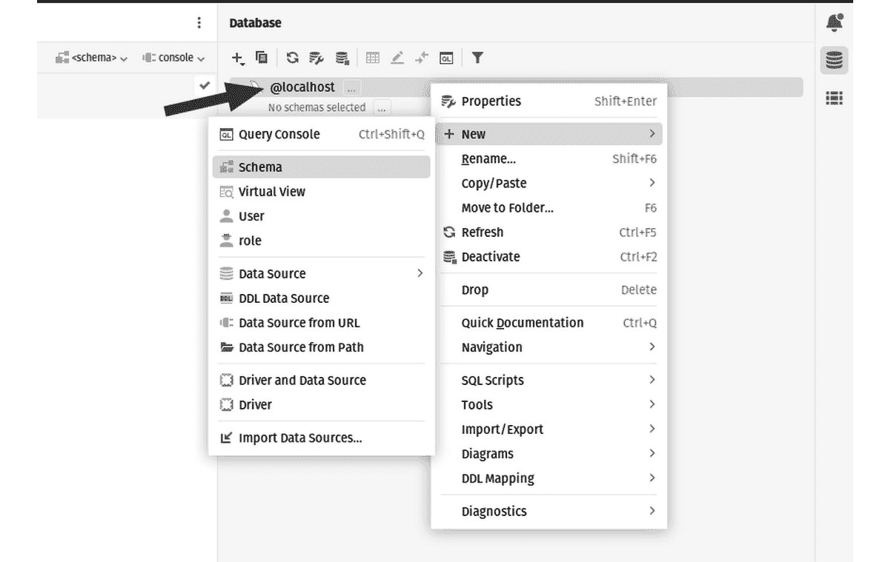

图 11.8：通过右键单击服务器（箭头所示），然后选择“新”|“模式”来创建一个新的数据库

当您这样做时，系统会提示您命名模式，如图 *图 11.9* 所示。我将我的模式命名为与 PyCharm 中的项目匹配。我将它命名为 `database_fun`。

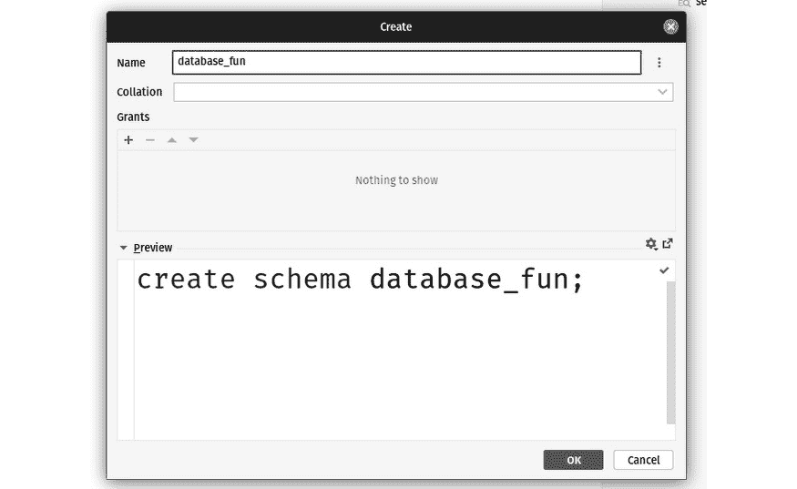

图 11.9：使用此对话框命名您的模式

在幕后，PyCharm 正在生成和执行 DDL 语句。这就是它能够对许多数据库选项保持如此无差别的理由。您可以在 *图 11.9* 中看到它将运行的命令预览。点击 **确定** 执行命令，数据库窗口将更新以显示新的模式。

您刚刚创建了一个新的数据库！使用 PyCharm 支持的任何其他数据库服务器软件同样简单。

在我们开始处理数据库结构之前，还有一些其他设置选项需要考虑。

## 设置 SQL 方言（这是至关重要的）

由于 PyCharm 支持数十种不同的数据库，每种数据库都有自己的 SQL 方言，因此可以理解您可能需要告诉 PyCharm 您打算使用哪种 SQL 方言。您不会忘记这样做，因为 PyCharm 会一直催促您，直到您填写设置。

在您的项目窗口中，右键单击项目并创建一个名为 `test.sql` 的新文件。这与我们一直在使用的 Python 文件的过程相同，只是列表中没有模板。右键单击项目，然后点击 **新建文件**，如图 *图 11.10* 所示。

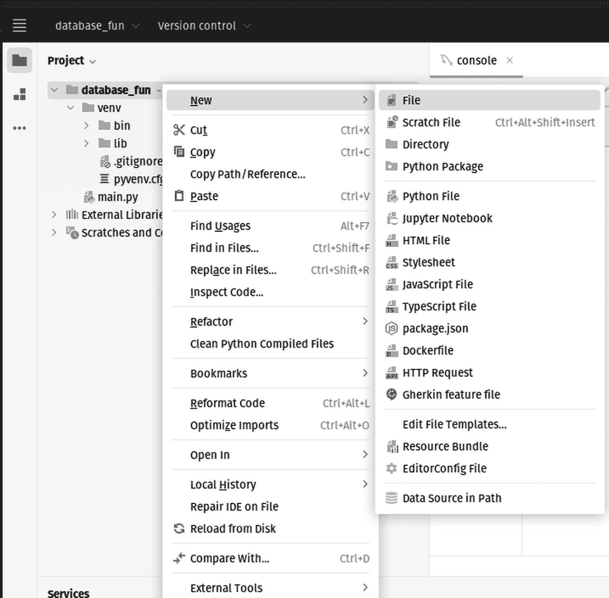

图 11.10：没有特定的 SQL 文件列表，所以只需右键单击并选择“新”|“文件”

将会弹出一个小的对话框。将文件的名称键入为 `test.sql`。您这样做的时候，就会开始催促。您会看到一个消息指出 SQL 方言尚未配置，如图 *图 11.11* 所示。

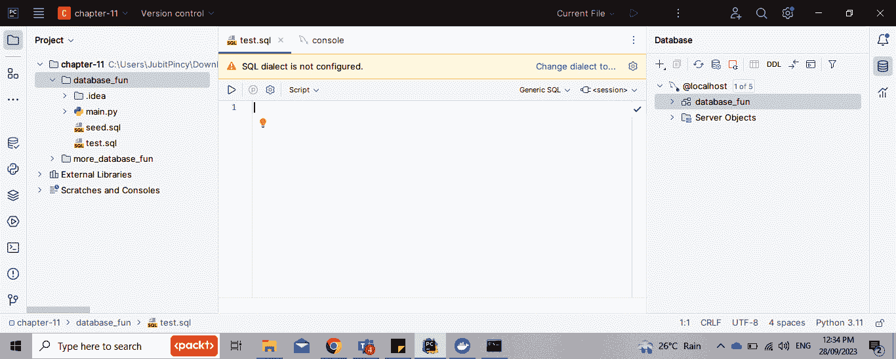

图 11.11：PyCharm 会一直催促您，直到您配置 SQL 方言

如果 PyCharm 是我，而 PyCharm 的用户是我的 13 岁女儿，那么会有很多翻白眼，一个沮丧的哼声，然后说，“好吧！我会设置 SQL 对话框！但我的朋友们都没有这么做！”然后我会说，“如果你的朋友们都在他们的电脑上安装了 Windows 7，你会跟随他们的例子吗？”然后她会垂下头来说，“不，当然不会。”

没有人想看到这个对话框播放出来，所以我们最好让我们的 IDE 君主开心。点击 *图 11.11* 中的链接来设置方言。你需要本地和全局地设置它。配置如 *图 11.12* 所示。

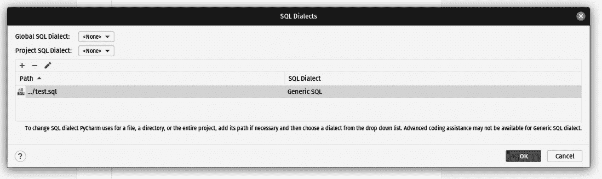

图 11.12：全局和本地设置 SQL 方言

全局设置适用于所有项目，所以如果你像我一样，你只使用一种数据库服务器类型，你可以在全局这里设置它，它将为所有你的项目设置。项目方言稍微复杂一些。如果你重视你的理智，你真的需要为你的 SQL 文件创建一个文件夹，然后为文件夹设置方言。在这里，我只是向你展示设置在哪里。请先选择 **MySQL** 作为你的全局和本地方言，我们稍后再讨论整个文件夹的想法。

## 对数据源进行分组和颜色编码

我的工作是创建我雇主销售的服务软件产品。这意味着在项目的头七年里，我只处理一个数据库。随着产品功能的增长，我们向项目中添加了两个额外的 SQL 数据库、一个 MongoDB 数据库和几个 Redis 数据缓存。与我所参与的一些项目相比，我的项目仍然相当温和。如果你要处理很多数据库，PyCharm 允许你以几种不同的方式组织它们。

### 通过文件夹组织

你可以通过将数据源分组到文件夹中来组织你的数据源。我们只有一个，但我们仍然会通过这个过程。点击 *图 11.8* 中箭头所示的数据源。上次我们是右键点击；这次，只需点击数据源并在键盘上按 *F6* 键。这将弹出一个对话框，如 *图 11.13* 所示。

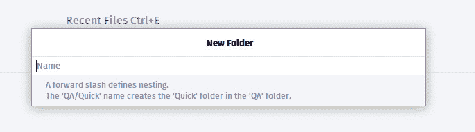

图 11.13：为你的数据源创建一个新文件夹

通过文件夹组织可以很有用，如果你在项目中有很多数据库，或者你可能为开发、**用户验收测试**（**UAT**）和生产有单独的连接集。

### 使用颜色编码数据库

我很喜欢这个功能，因为我有四个环境：

+   一个本地数据库，就像我们现在这样

+   一个中央开发测试数据库，在产品团队被允许看到我们的更改之前，开发人员会验证他们的设计

+   一个用于 UAT 的与我们的应用程序预发布版本连接的预发布数据库

+   一个生产数据库

我总是对一切进行颜色编码！你可以通过打开 **数据源属性** 窗口来为数据源设置颜色。为此，请点击工具栏上的 **数据源属性** 按钮。我之前在 *图 11.7*（4）中展示了这个。点击此按钮将弹出一个与之前创建数据源时使用的对话框相似的对话框。看看我的 *图 11.14*。

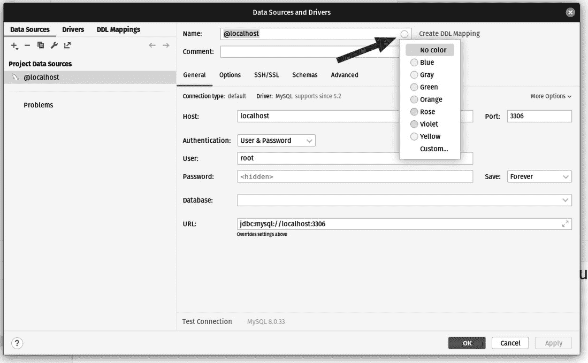

图 11.14：在属性窗口中点击数据源名称旁边的无害点，为您的数据源设置颜色

您可能从这里就能理解。一旦关闭对话框，您在 IDE 中的数据库元素就会变得五彩斑斓。我个人将我的本地开发环境设置为紫色，开发环境设置为绿色，预发布设置为黄色，生产设置为红色。不是从选择中选出的玫瑰色，而是一种鲜艳、刺眼、过分、像消防车一样的红色，我从列表底部的自定义对话框中挑选出来的。作为项目开发负责人，有时我需要查看生产环境中的项目。我想确保我能记住我在哪里！颜色编码有助于！

### 在项目之间共享数据源

如果您有多个使用相同数据源的项目，每次都要为每个项目重复设置相同的内容将会很繁琐。幸运的是，您不必这样做。PyCharm 允许您将数据源设置为全局，这意味着它可以在 PyCharm 的所有项目中使用。在 *图 11.15* 展示的数据源属性窗口中，找到箭头指示的按钮。

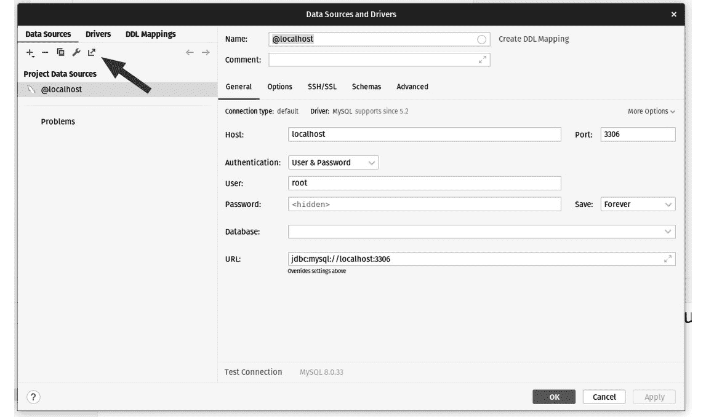

图 11.15：您可以将数据源配置设置为全局，这样它就可以在所有项目中使用

如果您点击它，对话框会非常微妙地改变，以表明数据源现在是全局的。如果您想检查，只需创建一个新项目，就像我们之前做的那样。打开数据库工具，您会发现数据源已经在那里了。我创建了一个名为 `more_database_fun` 的项目，如图 11.16 所示，数据源确实被继承了下来。

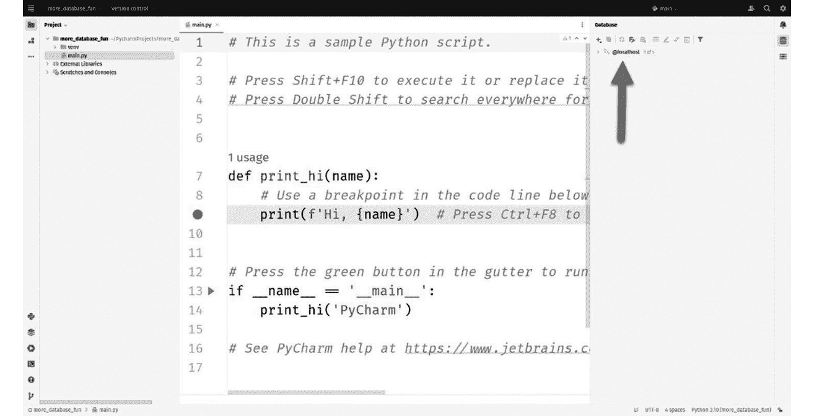

图 11.16：我创建了一个新项目并打开了数据库工具。全局数据源就在那里

由于这个第二个项目中没有代码，我没有将其包含在章节源代码中。

另一个有趣的功能是，当您导出 IDE 设置时，全局数据源也会被导出。如果您需要复习导入和导出设置，请参考 *第二章*，*安装和配置*，但我将在这里指出 *图 11.17* 中提到的导出设置。

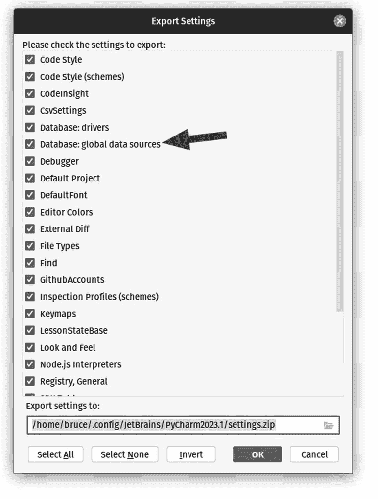

图 11.17：您可以将全局数据源导出到设置导出 ZIP 文件中，允许其他人简单地导入相关设置

如果你是一名开发主管，你可能考虑创建一个不包含颜色和字体大小等个人偏好的 IDE 设置导出。这些可能更适合在笔记本电脑和工作站之间复制设置时使用。但是，导出更多与工作相关的设置，如数据源，以便你的团队能够轻松导入它们是有意义的。如果你这样做，请记住你也在复制凭证！你应该只将开发数据源作为全局导出，以免你的`settings.zip`文件落入错误的手中。在越来越多的人使用云数据库服务器而不是本地安装的服务器的时代，这一点尤为重要。

如果你需要严格控制凭证，PyCharm 可以与名为*KeePass*的产品集成。由于这相当专业，我这里不会介绍，但我会在这个章节的*进一步阅读*部分留下一个包含更多详细信息的链接。

### 使用 SSL 和 SSH 选项进行连接

为了获得更高的安全性，特别是针对云数据源，PyCharm 支持 SSL 和 SSH 配置选项。请参阅*图 11.18*以获取你的数据源安全设置选项。

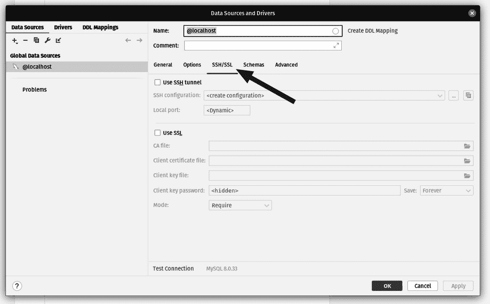

图 11.18：SSH 和 SSL 安全选项可以在 SSH/SSL 选项卡的数据源设置中找到

我在这里不会深入探讨，但你需要知道这些设置在 IDE 中的位置，因为你在使用像 Microsoft Azure 这样的云服务提供商时需要它们。

# 数据库设计和操作

让我们继续到你可能一直在等待的部分：构建数据库的部分！我们已经创建了架构，但到目前为止，我们还没有任何表。让我们先解决这个问题！

## 创建一个表

右键单击我们之前创建的**database_fun**架构，然后点击**新建** | **表**，如图*图 11.19*所示。

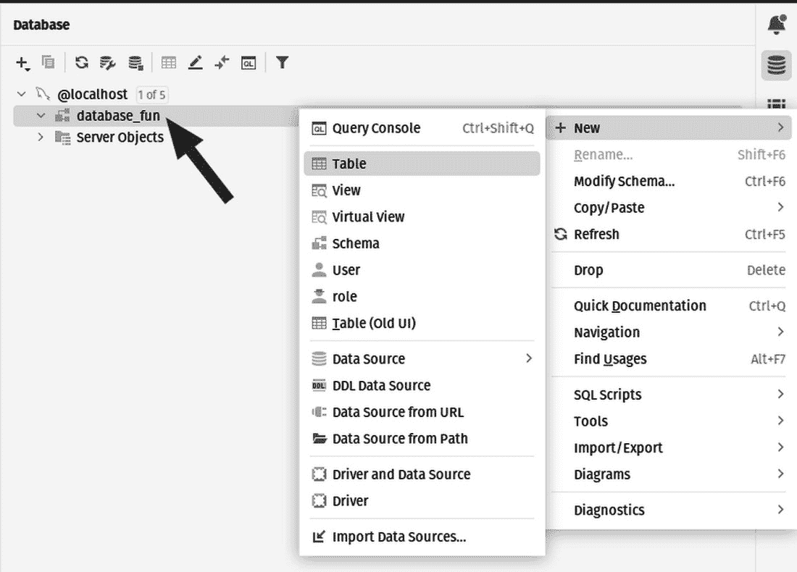

图 11.19：右键单击箭头指示的架构，然后点击新建 | 表

你将得到一个新窗口，如图*图 11.20*所示。

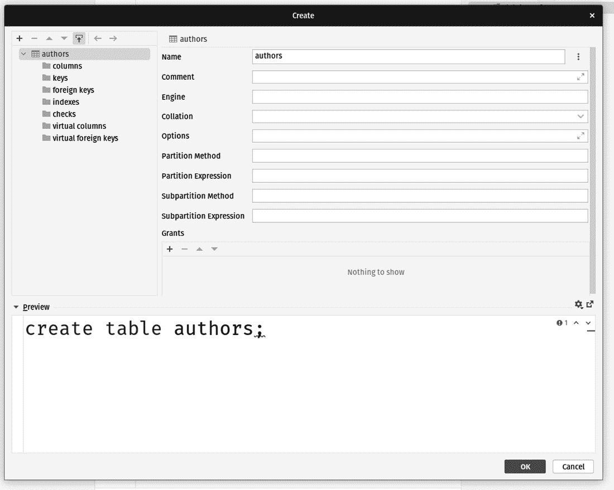

图 11.20：新窗口

我不得不稍微拉伸一下才能看到全部内容，如图所示。接下来的几个步骤将构建我们的表。我在顶部的**名称**字段中输入了表名。你可以看到这里发生了什么。和之前一样，在架构创建 DDL 中，PyCharm 正在窗口底部的预览中构建 DDL 脚本。目前，我们在分号下有一个红色的波浪线，因为我们还没有添加任何字段，所以这个 DDL 是无效的。

在窗口的左上角有一个带有**+**图标的按钮。点击它以查看可以添加到表中的元素列表，如图*图 11.21*所示。

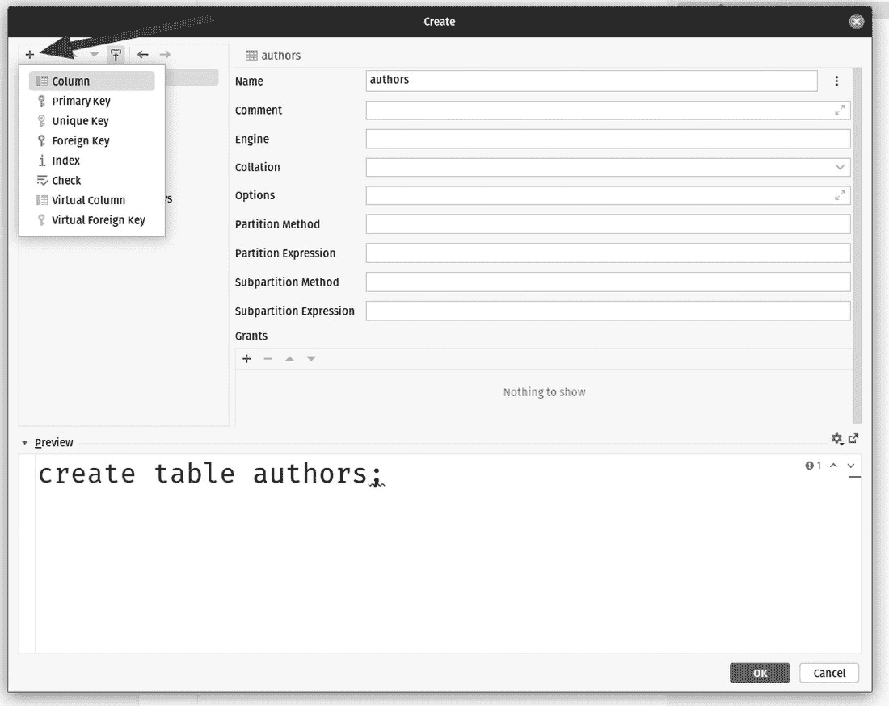

图 11.21：你可以通过点击+按钮向表中添加内容

从这里，你可以选择你需要添加的任何内容。我们将首先添加我们的主键字段。如果你是关系数据库设计的新手，并且需要一个好的入门书籍，Michael Hernandez 的《Database Design for Mere Mortals》是必读之作。我已经在我的课堂上使用了 20 多年！Hernandez 还有一本关于 SQL 查询同样有影响力的书，另一位作者 Ben Forta 也是如此。我将细节留在本章的“进一步阅读”部分。

简而言之，我们创建的每个表都应该有一个字段可以唯一标识单个记录。它不应由与表中包含的数据域相关的数据组成。我的意思是，我们正在创建一个表来存储关于图书作者的信息。我们不应使用与作者相关的任何字段作为主键，即记录的唯一标识符。相反，我们应该使用一些无关的东西。在 MySQL 中，通常使用自动增长的整数字段。

自动增长的整数字段指的是一个字段，它将自动填充一个从 1 开始的序列号，并在每次记录插入时自动增加。这个增加不是你应该在代码中做的事情。这是数据库本身的一个特性。这很重要。关系数据库被设计成原子的，这意味着所有事务都是隔离的。这很重要，因为它意味着即使两个记录插入在彼此微秒之内发生，数据库也不会为自动增长的键生成相同的值。这是你不能通过自己的代码保证的事情。你需要依赖服务器来做这件事。

使用图 11.21 中所示的菜单，添加一个列并设置如图 11.22 所示。

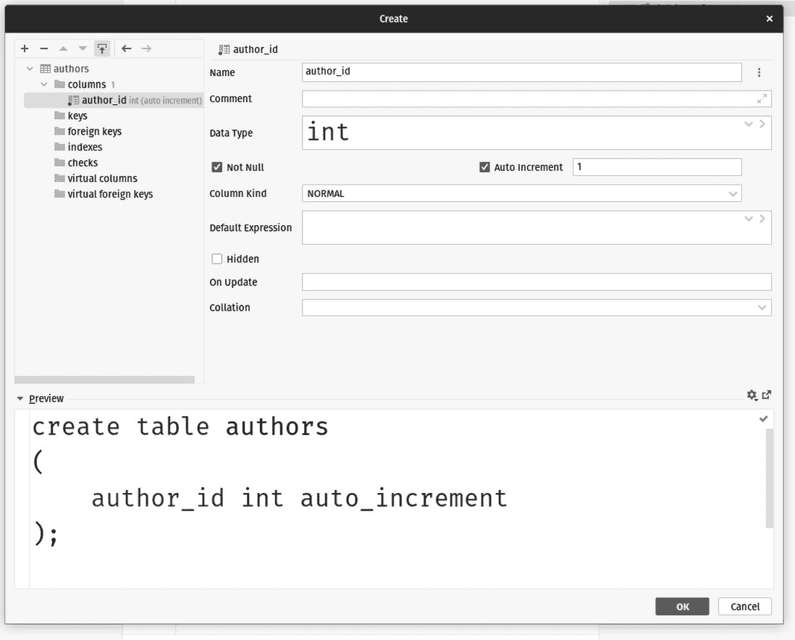

图 11.22：添加具有此处所示设置的第一个列

在这里，我们创建了一个名为`author_id`的自动增长的整数字段。我在这里使用的是蛇形命名法，但这不是必需的。使用你项目需要的任何命名约定。注意，我还没有正式将其设为主键。那即将到来。首先，让我们完成其余的列。

如果你选中`author_id`字段，然后点击加号按钮三次，这可以快速完成。当你选中一个列，或者甚至当你在窗口中选中`columns`文件夹时，PyCharm 会假设当你点击**+**按钮时，你想要一个列。同样，你也可以选择其他文件夹，比如主键、外键和索引。PyCharm 会简单地创建它，而不会让你使用我们之前看到的菜单。

按如下方式配置三个字段：

+   `first_name`: `varchar(30)`

+   `last_name`: `varchar(30)`

+   `email`: `varchar(255)` `not null`

*图 11**.23*显示了最后一个字段配置。我给这个字段添加了`not null`约束，这将防止在`email`字段留空时记录插入完成。这是通过点击标题为**非空**的复选框来完成的，如图*图 11**.22*所示。


图 11.23：按图所示配置电子邮件字段

它开始看起来像一张表，不是吗？我们还需要几样东西。让我们继续配置`author_id`字段，使其成为一个合适的主键。

### 设置主键

点击`keys`文件夹，然后点击**+**按钮。你会被问是否要创建主键或唯一键，如图*图 11**.24*所示。

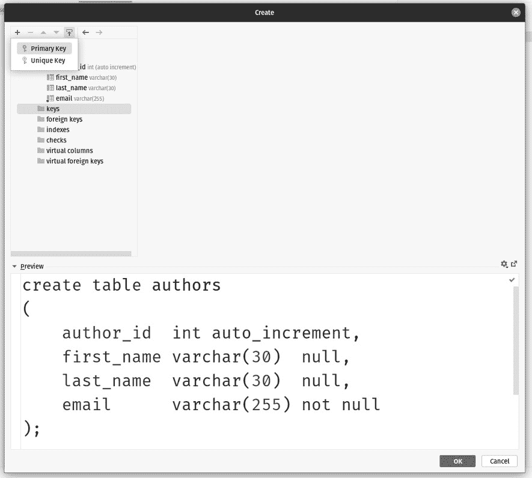

图 11.24：确保已选择 keys 文件夹，如图所示，然后点击+图标并选择主键

这将弹出一个不同的窗口，如图*图 11**.25*所示。

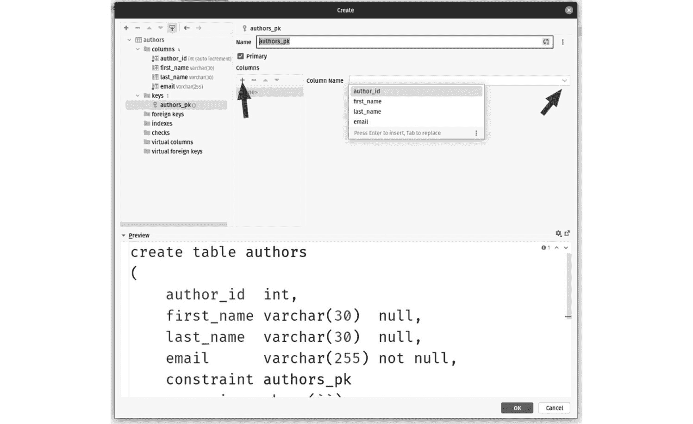

图 11.25：添加主键需要点击+图标，然后从下拉菜单中选择字段名

要添加键，点击`author_id`字段将其添加为主键。关系理论允许创建复合键，这就是为什么你可以添加多个字段。在一般实践中并不常用，因为如果你为键使用自增整数，创建复合主键就不必要了。实际上，我认为复合键是一个代码异味。

### 添加唯一键约束

接下来，让我们约束`email`字段，以确保任何插入的记录的值必须是唯一的。这可以防止由随意插入引起的数据毒性问题。每个电子邮件地址应该只有一个记录。让我们通过唯一键正式实施它。

这个过程与设置主键相同，只是这次我们将选择唯一键而不是主键，并指定`email`字段。但是有一个技巧。这次，你需要右键点击`keys`文件夹来选择**唯一键**。如果你只点击**+**图标，它将添加另一个主键字段，这不是我们想要的。*图 11**.26*显示了你要做什么。

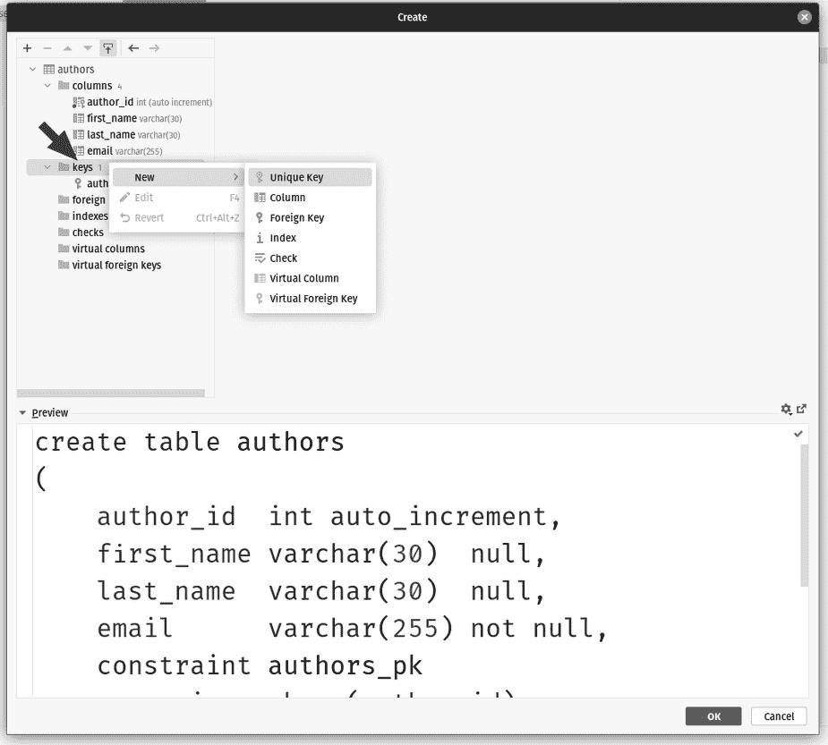

图 11.26：右键点击 keys，然后点击新建 | 唯一键以避免创建第二个主键

右键点击前一个图中的箭头所指的`keys`文件夹，然后点击`email`字段。我还会将名称从生成的`authors_pk2`值更改为`authors_uq`。这将让你一眼就能在 DDL 中知道它是一个唯一字段约束。

### 添加索引

向表中添加索引将使过滤读取操作更高效。预期应用程序允许用户通过电子邮件地址搜索作者是一个合理的要求。将索引添加到 `email` 字段将使此搜索更快，但会稍微减慢新记录的插入速度。插入性能的损失很小，但如果您要将索引添加到每个字段，这将变得明显，所以请仔细选择要索引的字段。

创建键的过程与此相同。请参阅 *图 11.27*。

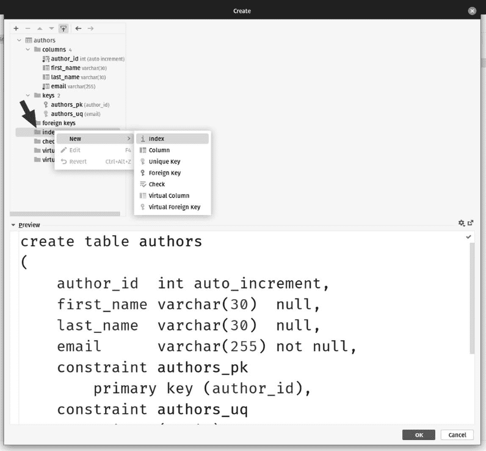

图 11.27：右键点击索引文件夹并添加如图所示的索引

这次，我们右键点击 `indexes` 文件夹，然后点击 **新建** | **索引**。从这里，对话框看起来很熟悉，如图 *图 11.28* 所示。

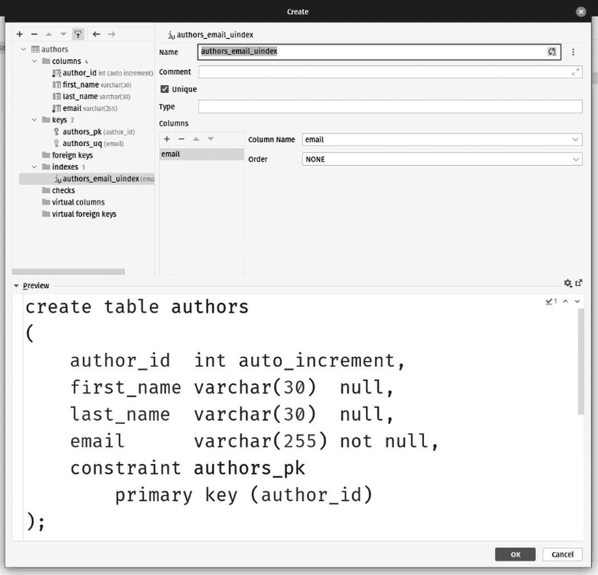

图 11.28：我们已经为电子邮件字段添加了一个索引

到目前为止，我们的表代码无法放入屏幕截图，所以这里是我们的内容：

```py
create table authors
(
  author_id int auto_increment,
  first_name varchar(30) null,
  last_name varchar(30) null,
  email   varchar(255) not null,
  constraint authors_pk
    primary key (author_id)
);
create unique index authors_email_uindex
  on authors (email);
alter table authors
  add constraint authors_uq
    unique (email);
```

当您对表结构满意时，点击 **确定**，PyCharm 将将生成的 DDL 代码应用到数据库中。您可以在数据源中查看结果。我的结果如图 *图 11.29* 所示。

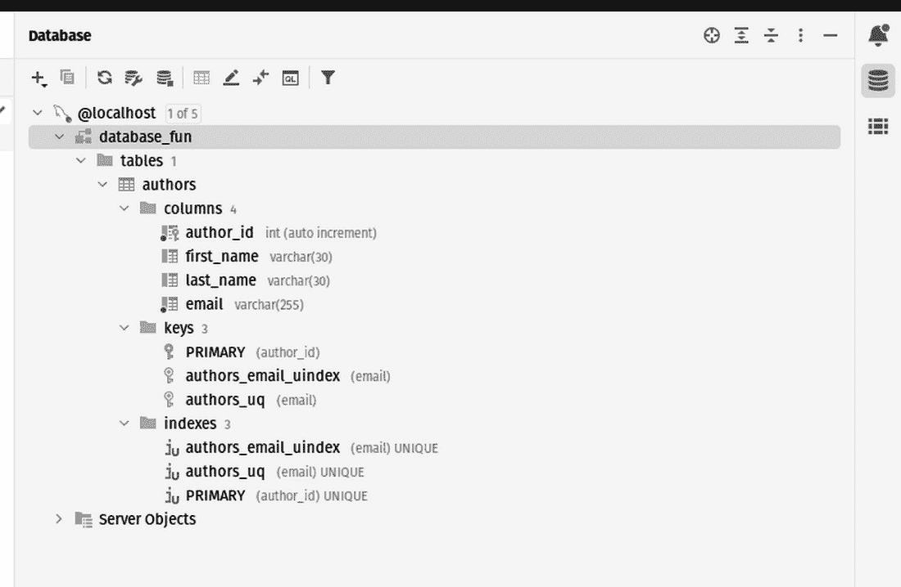

图 11.29：我们的辛勤工作成果显示在数据源面板中

## 更改现有结构

这些年来，我见过很多工具擅长让您图形化地创建数据库结构，但当涉及到更改现有结构时，它们却无能为力。微软 SSMS 就是一个例子！它让您愉快地设计，但当您尝试提交更改时，它会告诉您无法执行。

PyCharm 并非如此。PyCharm 处理变更的方式与您公司数据库管理员（DBA）希望您执行的方式一致。如果您是新手，DBA 负责数据库管理。他们是老板。如果您有幸获得在他们的数据库中创建任何内容的**特权**，您将遵循他们的规则。他们希望您使用 SQL 的 `alter` 语句来更改结构。

右键点击 `authors` 表，然后点击 **修改表…**，如图 *图 11.30* 所示。

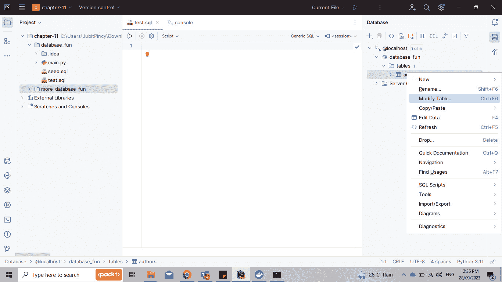

图 11.30：您可以通过右键点击表来更改现有表

当您这样做时，您会看到一个如图 *图 11.31* 所示的窗口。

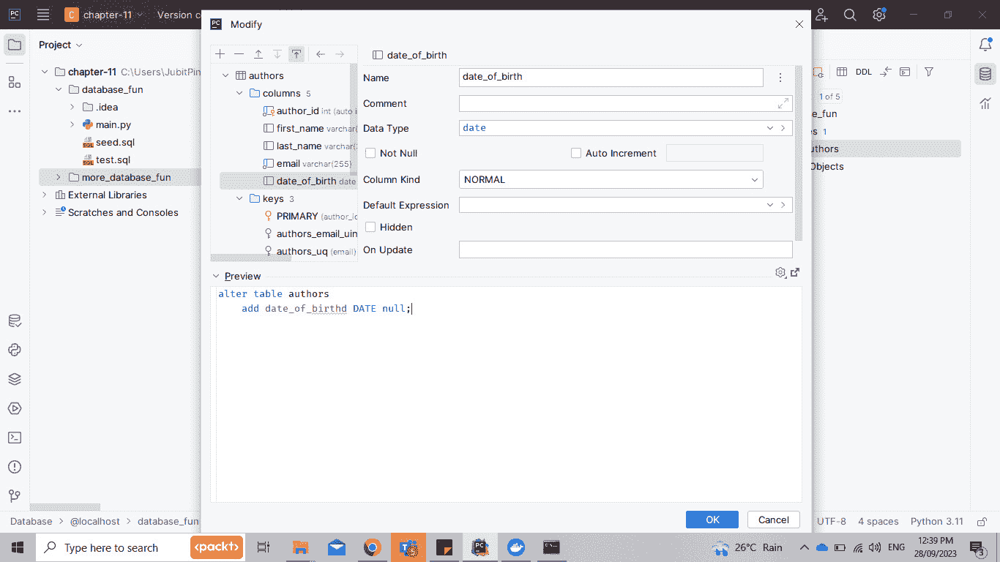

图 11.31：您在这里所做的更改将生成一个 alter 语句，这是数据库开发中的最佳实践

在**图 11.31**中，我添加了一个名为`date_of_birthd`的列，其类型为日期。正如你在预览窗口中可以看到的，PyCharm 正在生成一个`alter`语句，而不是像许多数据库编辑器那样尝试删除并重新创建表。如果你想要删除表，菜单中有一个选项，如**图 11.30**所示。

## 生成脚本

PyCharm 有一个非常强大的工具，可以生成各种 SQL 脚本。由于我们在这里讨论的是 DDL，因此学习如何生成创建我们一直在工作的表的完整 SQL 脚本是有意义的。

右键单击数据库，如**图 11.32**所示，然后点击**SQL 脚本** | **SQL 生成器…**菜单项。

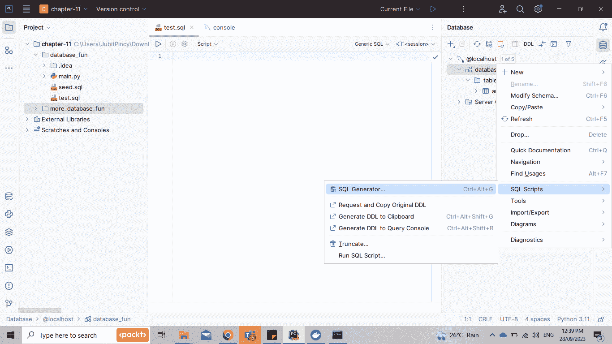

图 11.32：SQL 生成器生成数据库的创建脚本

左侧的面板允许你设置一些有趣选项。当你点击它们时，如果适用，生成的 SQL 将会改变。我说“如果适用”，因为并非每个数据库平台都支持列表中的每个语法选项。我们使用的是 MySQL，它支持`Use CREATE IF NOT EXISTS`语法，但不支持在 Postgres 或 Oracle 中找到的`CREATE OR REPLACE`语法。点击不支持的语言不会改变预览窗口中的语法。

当 DDL 脚本满足你的需求时，你可以使用最右侧的按钮（如**图 11.32**中圆圈所示）来复制、保存或在查询窗口中运行脚本。

### 生成数据库图表

非常传统的数据库实践通常包括一个设计文档，如数据库模式图。在那些美好的日子里，我们会使用专门的工具来绘制图表。PyCharm 内置了一个图表工具，最好的部分是图表是根据数据库的结构生成的，而不是从头开始绘制。

要生成一个图表，只需右键单击你的数据库，找到**图表**菜单项，然后选择**图 11.33**中显示的任一选项。

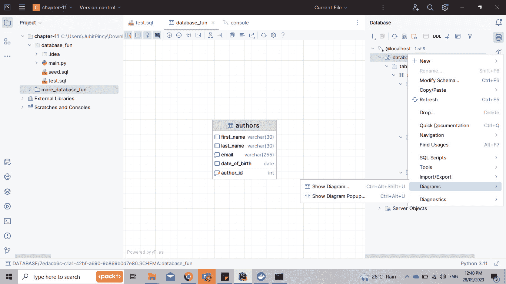

图 11.33：显示生成的图表的菜单项

这两个选项之间的唯一区别是一个直接在 IDE 的内容区域绘制图表，而另一个在弹出窗口中生成它。弹出窗口对于在另一个显示器上查看图表很有用。你可以使用缩放工具导航图表，以及通过在图表内右键单击并拖动来平移。

你也会在顶部工具栏上找到导出选项，可以将你的图表导出为图像文件，以及可以导入到专用图表工具中的数据文件。

# 使用 SQL 查询数据源

查询数据库可能是将数据库工具直接构建到 IDE 中的第二大有用功能。与 PyCharm 中的许多功能一样，这个功能确保你永远不需要离开 PyCharm 来完成工作。

有几个地方允许你运行查询。你可以在查询控制台中运行临时查询，或者你可以直接从`.sql`文件中运行查询。

## 临时查询

临时查询只是针对即时目的的查询。临时查询有几个特点：

+   **非计划性**：临时查询不是预定义查询集的一部分。它们是即兴编写的，以解决特定的需求。

+   **临时性**：它们用于检索特定任务或情况的数据，并且不会保存供将来使用。尽管经过一些实验和调整后，你可能会在代码中将它们正式化，但它们不是你应用程序的一部分。

+   **无优化**：临时查询可能没有针对效率进行优化，因为它们是迅速组合而成的，没有时间进行细致调整。

+   **可变性**：临时查询的语法和结构可能因用户的知识和经验而异。

+   **不存储**：与存储过程或视图不同，临时查询不会像视图或存储过程一样存储在数据库中。这意味着除非你稍后将其保存到文件中，否则它们不能被再次调用或执行。

临时查询是在数据库控制台中执行的。当你完成与数据源的连接时，会自动出现控制台窗口，但在界面的许多地方你都可以创建一个新的控制台视图。看看*图 11.34*，你会看到数据源窗口。一个标记为**QL**（查询语言）的按钮被圈出。它没有说*SQL*，因为，记住，PyCharm 也支持 NoSQL 数据库，如 MongoDB、Apache Cassandra 和 Redis。

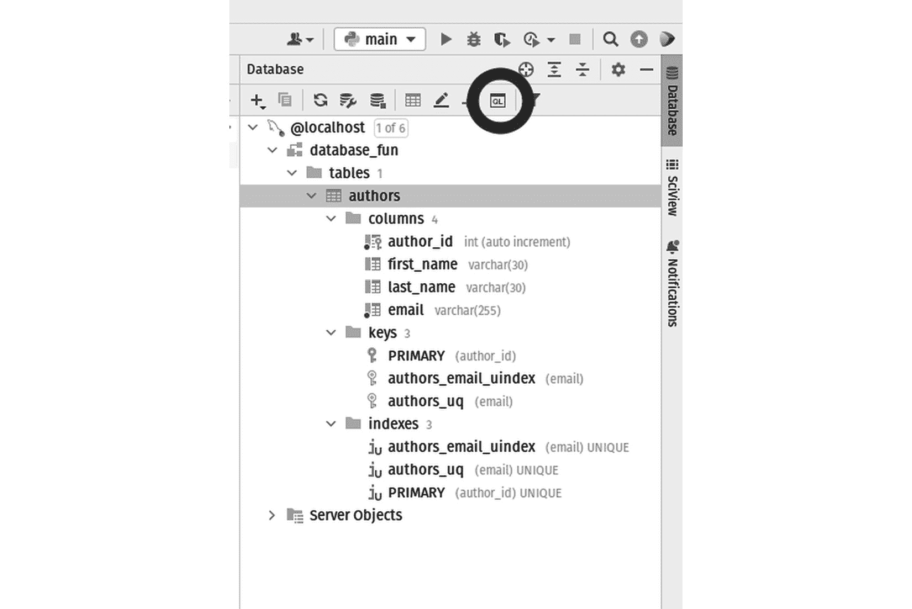

图 11.34：在任何地方看到这样的 QL 图标，你都可以启动控制台窗口并使用临时查询查询数据源

**QL**按钮对数据源窗口中选择的数据库敏感，所以如果你有多个数据源，你可以通过在数据源窗口中选择它们并点击**QL**按钮来为任何一个打开查询源。实际上，我在创建数据源时自动启动的控制台已经关闭了。要创建一个新的控制台，我会点击**QL**按钮并选择**新控制台**。

你首先打开的控制台将成为**默认控制台**。PyCharm 在**Scratches and Consoles**文件夹中跟踪你的控制台，如图*图 11.35*所示。

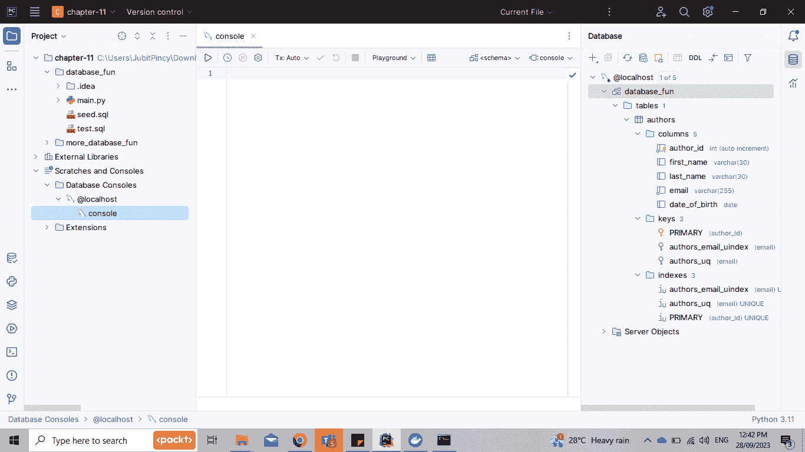

图 11.35：PyCharm 在 IDE 中一个专门的文件夹中跟踪控制台和临时文件

如果你已经在控制台中输入了任何 SQL，PyCharm 将在会话之间保持内容不变。当你退出 PyCharm 时，空的控制台将消失。这对于跟踪你的临时工作非常有用。

## 生成 SQL 语句

我们需要创建一些种子记录，这些记录最终将被保存为一个种子脚本。种子脚本是一个可以用来通过在数据库中填充一些初始测试数据来测试应用程序的脚本。我们正在远离我们迄今为止使用的严格 DDL 语句。我们将使用更多的 DML，这些是用于处理数据而不是数据库结构的语句。种子脚本对于填充很少改变的数据表中的静态数据也非常有用。

我们将使用 PyCharm 为我们的 `authors` 表生成一些记录，但我们将让 PyCharm 为我们生成大量的 SQL。如果你还没有打开控制台，请先创建一个。右键单击 `authors` 表，将鼠标悬停在 **SQL 脚本** 上，然后找到 **向表中插入行**。查看 *图 11.36* 以了解其操作。

s

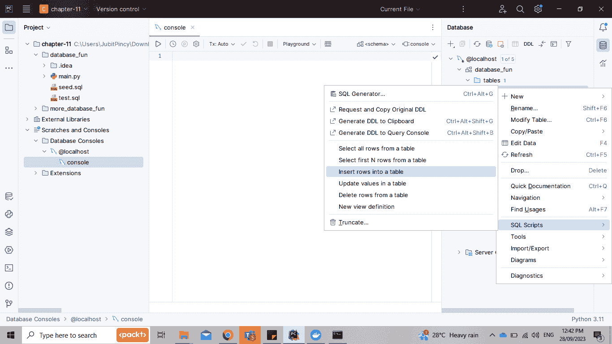

图 11.36：PyCharm 将会自动为您生成 DML 查询！

一旦你点击了选项，你就会发现一个 `insert` 语句已经被直接插入到控制台（哦，是的！）中。你可以在 *图 11.37* 中看到我的示例。

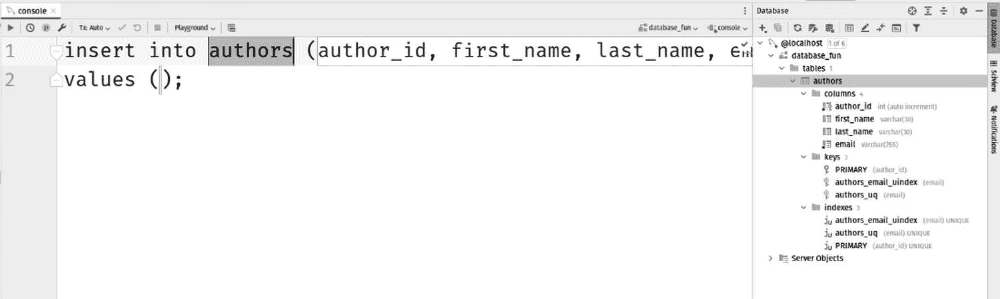

图 11.37：PyCharm 为我们选定的表生成了一个 insert 语句

注意文本周围的边界框。我们之前见过这个。你正在看一个模板！这意味着我们可以从模板文本的一个地方跳到另一个地方，这就是为什么你不应该像我一样乱动文本。

复制粘贴警告！

如果你有这本书的电子版，允许你从电子书本身复制粘贴，请注意任何依赖于单引号的代码。编辑书籍的过程常常将它们转换为特殊字符，这些字符在粘贴到控制台时将无法正常工作。请确保单引号确实是单引号！

`insert` 语句可以分为两部分：

```py
insert into authors (first_name, last_name, email)
values ('Bruce', 'Van Horn', 'bruce@test.com');
```

我所说的两部分是指语句中不是模板的部分——两对括号中的部分。第一部分指定了你将填充哪些字段，第二部分是值。当你为每个字段输入值时，你必须匹配第一部分中字段的数量和类型。如果你按下 *Tab* 键，你将在 `insert` 语句的两部分之间移动，允许你根据需要修改它。

非常规生成的 SQL

PyCharm 默认不会将 SQL 关键字全部大写，这是常规做法。你可能注意到我输入的语句都是大写的，但生成的语句不是。我不得不抵制修改它的诱惑，为了这本书，但我也需要解释为什么存在不一致性。

PyCharm 为主键生成了一个占位符，这是一个你通常不会填充的字段，因为数据库会自动填充它。按照我在前面代码中所做的那样，将第一个字段从第一个括号中的字段集中移除。

接下来，切换到 `values` 部分，并开始填写值。记住，在 SQL 中，`varchar (字符串)` 值必须用单引号括起来。Python 允许你使用单引号或双引号，但 SQL 不允许。当你输入值时，PyCharm 会给你关于你正在匹配的字段的提示。它是通过在编辑器中的文本上显示工具提示来做的，但它也在语句的上半部分对当前字段进行着色。参见 *图 11*.*38* 了解我的意思。

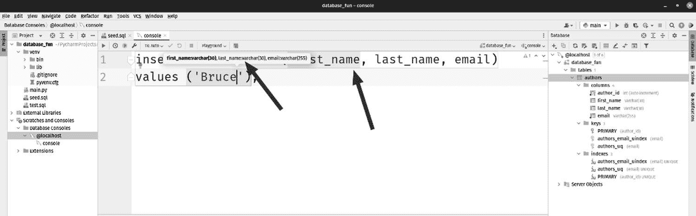

图 11.38：PyCharm 为你在查询的第二部分中正在填写的字段和类型提供工具提示

这太棒了！你有多少次写了一个长的 `insert` 语句，结果发现你有的值比字段多？或者更糟糕的是，你发现你颠倒了几个字段，你错误地输入了一堆垃圾数据？PyCharm 通过显示包含字段和类型的工具提示来给你一个视觉指示，确保你知道你正在输入哪个字段。它还在 SQL 语句的上半部分对字段进行着色。

## 运行查询

你可能不需要我告诉你这一点，因为在这个时候，你可能已经习惯了在适当运行的地方看到绿色的运行箭头。你可以通过点击 IDE 中控制台标签页顶部的绿色箭头来运行控制台的内容。你也可以突出显示控制台内容的一部分，并运行查询的一部分。

将你的控制台内容更改为与此代码匹配：

```py
insert into authors (first_name, last_name, email)
values ('Bruce', 'Van Horn', 'bruce@test.com');
insert into authors (first_name, last_name, email)
values ('Kinnari', 'Chohan', 'kinnari@test.com');
insert into authors (first_name, last_name, email)
values ('Prajakta', 'Naik', 'prajakta@test.com');
insert into authors (first_name, last_name, email)
values ('Jubit', 'Pincy', 'jubit@test.com');
```

我所做的只是将相同的 SQL 重复四次，然后我更改了名称以增加一些变化，并向我的 Packt 团队致敬（嗨！）。接下来，突出显示第一个语句并运行查询。**服务**面板将打开以显示查询结果。如图 *11*.*39* 所示，只插入了一条记录。

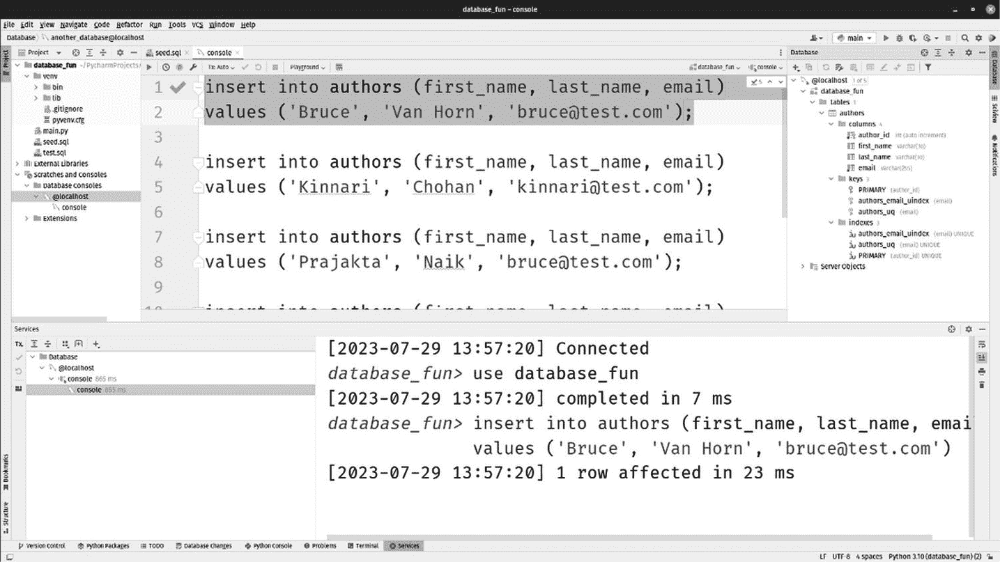

图 11.39：你可以通过选择语句并点击运行按钮来执行单个语句

如果你选择剩余部分并再次运行，你会找到三个插入点。

现在我们有一些数据了，让我们用 `SELECT` 语句进行查询。将以下代码添加到你的控制台：

```py
SELECT * FROM authors;
```

我本可以生成 `select` 语句，但这个查询很短。我想向您展示 PyCharm 如何显示结果。请看 *图 11.40*。

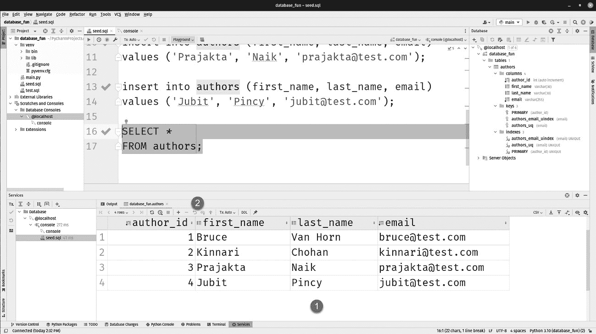

图 11.40：默认情况下，选择语句产生一个很好的表格输出

这是一个密集的面板！您在这里可以做很多事情。默认情况下，您会看到数据的表格视图（**1**）。您可以双击单元格并就地编辑数据。您还可以使用此 UI 添加和删除行（**2**）。在您编辑完数据后，您可以使用工具栏（**2**）中的小绿色向上箭头提交您的更改 *图 11.40*。

如果您想将输出视图从表格视图更改为纯文本或树视图（这对于查询层次数据更有意义），您可以在 *图 11.41* 中的工具栏（**2**）中点击眼睛图标。

## 导出查询结果

您可以使用导出按钮导出 `select` 语句的结果 *图 11.41*。*图 11.41* 展示了其外观。

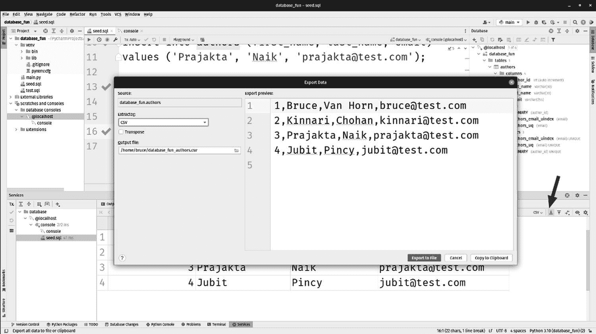

图 11.41：在 PyCharm 中导出数据非常简单

默认的导出格式是 **逗号分隔值**（**CSV**），这是一种常见的表格数据交换格式。PyCharm 支持数十种其他有用的格式，您将在 **提取器** 下拉列表中找到。将输出文件更改为您喜欢的名称，然后点击 **导出到** **文件** 按钮。

## 与 SQL 文件一起工作

PyCharm 支持具有 `.sql` 或 `.ddl` 文件扩展名的文件。与其他已识别的文件类型一样，您将获得自动完成、语法高亮等功能。您还可以直接在 SQL 文件中运行语句，就像我们在控制台中一样。

让我们将到目前为止的控制台工作保存为一个合适的脚本。在 PyCharm 中创建一个名为 `seed.sql` 的新文件。接下来，将此行添加到脚本文件顶部：

```py
USE database_fun;
TRUNCATE TABLE authors;
```

`USE` 语句是 MySQL 特有的，确保在执行 SQL 语句之前已经选择了 `database_fun` 数据库。`TRUNCATE` 语句将删除 `authors` 表中的所有记录，并将表上的自增序列重置为其初始值。这对于开发测试很有用，因为现在种子脚本可以重置到一组干净的测试值。只是要小心，永远不要在生产环境中运行种子脚本！

接下来，将控制台的内容剪切并粘贴到 `TRUNCATE` 语句下方。注意，我说的是剪切。您想要控制台为空。脚本应该看起来像这样：

```py
USE database_fun;
TRUNCATE TABLE authors;
insert into authors (first_name, last_name, email)
values ('Bruce', 'Van Horn', 'bruce@test.com');
insert into authors (first_name, last_name, email)
values ('Kinnari', 'Chohan', 'kinnari@test.com');
insert into authors (first_name, last_name, email)
values ('Prajakta', 'Naik', 'prajakta@test.com');
insert into authors (first_name, last_name, email)
values ('Jubit', 'Pincy', 'jubit@test.com');
SELECT * FROM authors;
```

保存您的种子脚本并运行它。它应该会成功执行。

# 摘要

我有一种可怕的感觉，觉得自己没有涵盖到所有内容。这是因为我没有。我可以写一本关于 PyCharm 数据库特性的整本书，但如果我这样做，我可能不如给它起个类似 *使用 DataGrip 进行数据库编程实践* 的标题。别忘了，我们看到了 PyCharm 中挤满了另一个 IDE，就像我们在 *第七章*，*使用 JavaScript、HTML 和 CSS 进行 Web 开发* 中所做的那样。功能集真正令人印象深刻，我没有涵盖一些真正有趣的功能，要么是因为这本书的空间有限，要么是因为一些真正酷的功能仍在开发中。

例如，你可以将代码设置为数据源，并将代码同步到数据库的结构中。目前，它还不是 100% 完成，这就是为什么我将其排除在外。作为一名数据库开发者，我期望能够有一个往返体验，即代码的更改反映在数据库中，数据库的更改复制回代码。我认为我们已经走上了正轨。

尽管如此，我们所涵盖的内容对于全栈 Web 开发或需要访问多个数据库平台和数据存储范式的数据科学从业者来说是非常全面的。

我们从一点历史开始。我喜欢在本章和前几章中介绍历史，因为我有丰富的职业生涯作为后盾。我见证了所描述的大部分内容，并且是第一排的观众。当我上一年级时，E. F. Codd 正式化了关系代数。我的一部分希望我能吹嘘使用他的早期工作，但事实上，我更热衷于穿着睡衣在周六早上观看电视节目 *拉西和救援小队*，而不是 `SELECT` 语句。当我长大后，我开始在 IBM 主机上工作，所以我最终赶上了。

进入更实际的问题，我们了解到 PyCharm 可以通过单独安装的 JDBC 驱动程序连接到数十种不同的数据库平台。我们了解到它不仅支持关系数据库，还支持 NoSQL。在我们学会了如何打开数据库工具并连接我们的数据源之后，我们学会了如何使用一系列为我们生成 DDL 的工具来设计数据库。

然后我们转向使用 PyCharm 生成 DML，一旦我们在表中获取了一些数据，它就能为我们的工作提供动力。最后，在控制台中创建我们的初步工作后，我们将 SQL 保存到了一个 `.sql` 文件中。

这本书中这一章节的位置是非常有意的。我克制自己没有在上一章中涵盖的完整栈框架中进行大量编码。在现实生活中，你肯定会将这些数据库附加到这样的项目上。虽然许多开发者依赖 ORM 来处理他们的数据库工作，但至少能够直接使用控制台检查数据库及其内容是有益的。

如果你像我一样，完全放弃了 ORM，你现在有了拼图缺失的一块。你可以在不离开 PyCharm 的情况下，使用一套出色的工具来创建你的数据库代码。

本章也进行了逻辑划分，因为接下来的几章开始介绍 PyCharm Professional 的强大数据科学功能集。在介绍这些最普遍的数据存储和检索引擎之前进行概述是有意义的。

在下一章中，我们将开启*科学模式*！去干洗店取回你的白大褂，给自己倒一大杯 C8H10N4O2（可能是指某种化学物质），我们下一章见！

# 进一步阅读

请务必查看本书的配套网站：[`www.pycharm-book.com`](https://www.pycharm-book.com)。

+   Docker Desktop 安装说明：[`www.docker.com/products/docker-desktop/`](https://www.docker.com/products/docker-desktop/)。

+   在 PyCharm 中使用 KeePass：[`www.jetbrains.com/help/pycharm/reference-ide-settings-password-safe.html`](https://www.jetbrains.com/help/pycharm/reference-ide-settings-password-safe.html)。

+   Codd, E. F. (1983). 大型共享数据库的关系数据模型。*ACM 通讯*, *26*(1), 64-69。

+   Forta, B. (2013). *10 分钟学会 SQL*. Pearson Education。

+   Hernandez, M. J. (2013). *数据库设计入门：关系型数据库设计实战指南*. Pearson Education.

+   Pettit, T. 和 Cossetino, S. (2022). *MySQL 实战*. Packt Publishing.

+   Poulton, N. (2023). *Docker 深度探索 – 第二版*. Packt Publishing。

+   Viescas, J. L. 和 Hernandez, M. J. (2014). *SQL 入门：SQL 数据操作实战指南*. Pearson Education.

# 第四部分：使用 PyCharm 进行数据科学

与前一部分类似，本书的这一部分专注于 Python 编程的特定应用，这次是数据分析与数据科学。读者将能够使用 PyCharm 及其功能高效地处理他们的数据科学和科学计算项目。

本部分包含以下章节：

+   *第十二章*, *开启科学模式*

+   *第十三章*, *使用 SciView 和 Jupyter 动态数据查看*

+   *第十四章*, *在 PyCharm 中构建数据管道*
