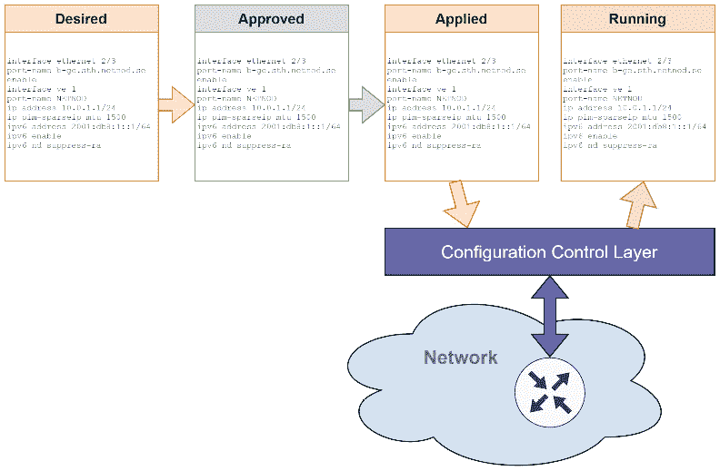
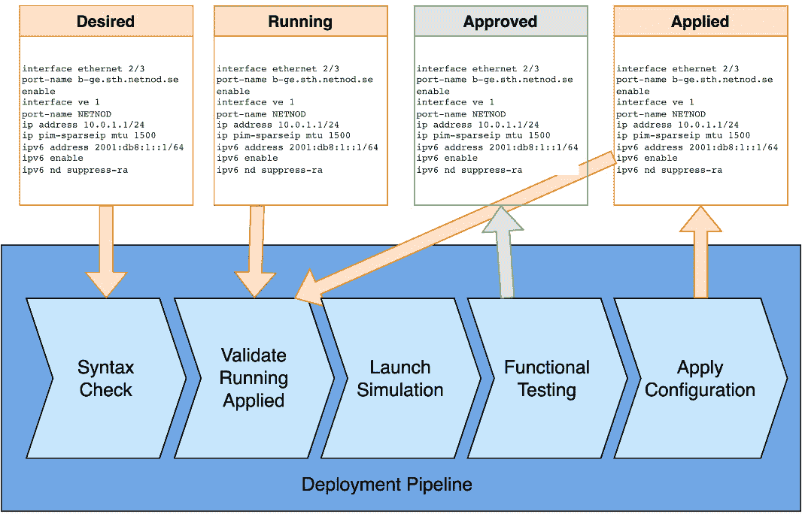
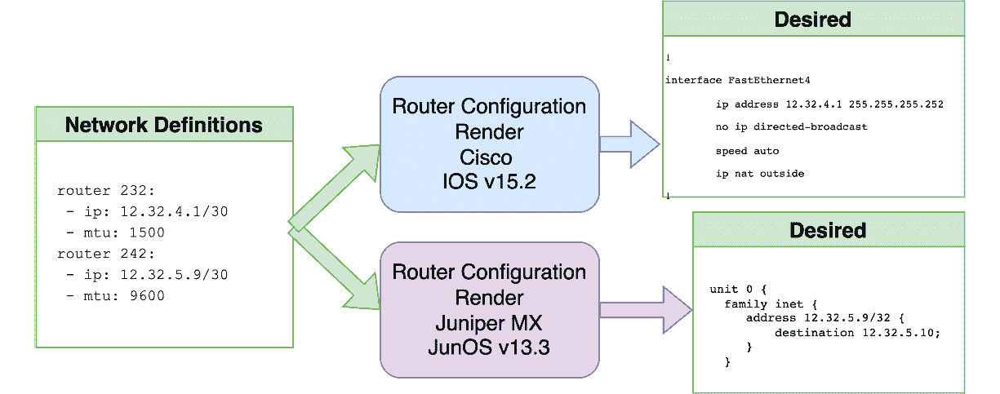
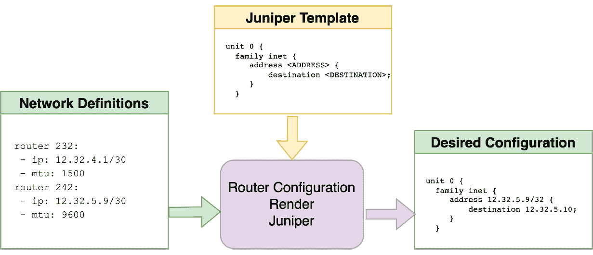

# 第四章：与网络配置和定义一起工作

网络自动化中的一个重要点是配置的组织方式以及我们如何以可扩展的方式自动化我们的网络。在本章中，我们将探讨如何处理网络配置以及如何定义它以有效地用于网络自动化。我们希望构建可扩展且面向未来的解决方案。

我们为什么关心配置和网络定义？为什么使用哪个文件很重要？我们如何创建终身定义？我们如何利用这一点来帮助网络自动化？让我们在本章中探讨这些问题的答案。

我们将探讨以下内容：

+   描述配置问题

+   使用定义帮助网络自动化

+   创建网络定义

+   探索不同的文件类型

# 技术要求

本章中描述的源代码存储在 GitHub 仓库中，网址为[`github.com/PacktPublishing/Network-Programming-and-Automation-Essentials/tree/main/Chapter04`](https://github.com/PacktPublishing/Network-Programming-and-Automation-Essentials/tree/main/Chapter04)。

# 描述配置问题

一些生产网络在将配置应用于网络设备时没有进行任何额外的外部定义。其中一些有网络图描述网络，但大多数都有过时或不完整的图。因此，在大多数情况下，你可能需要阅读运行设备配置来了解网络操作的细节。

在一些网络提供商中，图用于对网络或整体概述的初步理解。一旦工程师对他们的网络有足够的信心，这些图就会被忽略或不再使用。有些人会更新他们的图，但对于大多数工程师来说，这项任务不是优先事项，通常会被推迟。

对于一些工程师来说，将配置修复直接应用于生产设备以解决灾难性或紧急故障也是常见的。在其他情况下，额外的配置临时应用于故障排除，但从未被移除。在某些情况下，这些配置更改被遗忘，网络运行时配置差异未被察觉，直到需要软件更新。

让我们在以下子节中进一步讨论这些问题。

## 真相来源

**真相来源**是计算机网络中用来描述定义所在位置以及当咨询或使用该信息创建进一步定义时，所有其他系统必须依赖的术语。真相来源可以是文件、路由器配置、数据库、内存空间或网络图。

我们希望将真相来源尽可能稳定地定义；它不应在短时间内发生变化，并且应作为任何其他定义的参考。

大多数网络工程师依赖于路由器配置作为真相来源，因为路由器经常更新，并且有正确的定义来运行网络；然而，这并不帮助我们的网络自动化。

理想情况下，我们希望真相来源位于数据库中或存储在安全且未来可靠的环境中，以便任何系统都可以快速读取。

## 启动配置和运行配置

网络设备有两种配置状态，**运行配置**和**启动配置**。运行配置是设备内存中当前正在使用的配置，用于在当前时刻操作。启动配置用于将设备从**关闭**状态启动到**开启**状态。区别在于一个是易失性的，一旦设备关闭或失去电源，就会被删除，而另一个是永久的，无论是否有电源，它都会始终存在。

启动配置通常存储在非易失性存储器中，如 SSD、闪存驱动器或硬盘驱动器。

对于我们的自动化，我们希望运行配置与启动配置相同。当它们不同时，如果没有良好记录，可能会引起自动化问题。

## 配置状态和历史记录

一个好的网络自动化设计应该旨在拥有多个配置状态和历史记录，这将有助于确定网络当前是如何运行的，未来应该如何运行，以及过去是如何运行的。

对于部署和自动化，将配置分离成至少四个阶段非常有用：**期望的**、**批准的**、**应用的**和**运行的**，如图 *4.1* 所示：



图 4.1 – 配置阶段和控制层

我们将在以下子节中讨论这些内容。

### 想要的配置

**期望配置**用于记录即将应用在不久的将来的配置。它用于检查不一致性，并在测试网络（或网络模拟）中应用，以评估未来的部署、可能的语法错误和其他功能问题。

现代网络使用期望配置来向配置管道提供数据，该管道将执行一系列测试，包括模拟以验证和预测错误。它还用于测试部署顺序，并评估哪些设备可以并行部署，哪些设备需要等待某些设备完成部署。

### 批准配置

**批准配置**是已经通过配置管道中所有审批阶段的配置，无论是自动化审批阶段，如语法检查，还是人工审批阶段。

为了增强信心，一些配置管道会在网络模拟中应用所需的配置进行进一步的功能测试，如果一切顺利，配置管道将批准配置。

在所有配置阶段中，审批配置是耗时最长的，因为大型网络有成千上万的路由器，其中一些需要顺序功能测试而不是并行测试。完成所有工作后，配置就绪，可以部署。

### 应用的配置

**应用的配置**是保存在设备非易失性配置或启动配置中的配置。在这个阶段结束时，我们自信地知道配置已经保存在所有路由器中。

这个阶段也可能需要很长时间，因为部署不一定能并行进行。

### 运行配置

这个阶段用作未来部署和审批流程的安全保障。**运行配置**必须与应用配置相同；然而，它可能不是相同的配置，尤其是在需要配置干预的灾难性事件之后。

运行配置由触发点不断更新，如对设备的特权访问、故障硬件或任何配置更改。

使用配置管道要求只有管道能够更改路由器的启动配置。这意味着网络工程师无法在设备上保存配置更改，以避免这种情况发生。

对于需要快速更改配置的灾难性场景，通常绕过配置管道，由网络工程师手动干预进行配置更新。这些更改通常应用于运行配置，并且不会保存到设备中。如果运行配置审计，它将显示运行配置和应用的配置之间的差异。

### 配置历史

对于每个设备的所有配置阶段，都希望有一个配置历史记录。配置历史记录帮助我们通过比较旧配置与新配置来了解可能的故障或改进。它还用于在模拟中构建整个网络，以在配置更新期间解决部署中的故障。配置历史记录也可能对其他团队有益，例如安全审计和容量规划师。

## 部署管道

**部署管道**用于需要快速和可靠更改的大型网络。该管道使用现代的模拟和测试技术构建，包括广泛使用网络自动化编码。

网络部署管道的一个示例如下：



图 4.2 – 配置部署管道示例

在前面的图中，我们可以看到我们如何在部署管道中使用配置状态。管道的输入是生成的期望配置，而批准的配置只有在最终测试完成后才会更新。使用此工作流程，可以实现自动化部署，减少错误，并允许更快的并行部署。让我们描述管道过程每一步：

1.  第一，自动检查配置语法。如果通过，则进入下一步。如果失败，管道过程停止，等待有效的配置出现。

1.  第二，管道验证运行配置和应用的配置之间的任何差异，在某些情况下可能是由于紧急配置修复引起的。如果配置不同，则需要手动批准才能进入下一步。

1.  第三，管道在配置更改范围内对路由器进行模拟，并将新配置部署到模拟网络中。

1.  第四，管道在模拟中运行功能测试，以确认新配置不会破坏已存在的任何功能。如果通过，则进入下一步。如果失败，管道停止并等待拒绝或接受。

1.  第五，该管道将新配置应用于网络，遵循所有并行依赖关系和时间限制。

## 网络图和自动化

网络图是网络的可视化、人性化的可读表示，但它们对机器来说并不容易阅读。大多数情况下，它们是由人类使用 Visio、Lucid Chart 和 Draw.io 等图形工具生成的。当由人类生成时，为了反映当前状态，图表的更新通常会被遗漏，导致图表上的信息过时。

要有一个准确的网络图，我们需要有一种图表生成器，它可以读取来自路由器配置或网络定义文件的数据。

在我们之前的部署管道示例中，图表生成器可以读取任何配置阶段的配置，并为运行配置和期望配置阶段生成不同的图表。

通过自动生成图表，可以为管道的任何阶段生成最新的图表。这些图表可以帮助网络工程师解决问题，或帮助网络设计师了解如何改进当前的网络功能。

在本节中，我们讨论了多个配置阶段如何帮助部署解决方案，以及当真相来源未定义或更新时可能发生的问题。接下来，我们将探讨如何从设备配置创建抽象定义，以创建更好的真相来源。

# 使用网络定义来辅助自动化

上一节探讨了配置阶段以及我们如何依赖它们来构建更好的网络部署管道。另一方面，我们没有涵盖另一个与路由器配置相关的问题，即与路由器软件版本和供应商相关。

如果您的网络不会更新、增长或更改供应商，使用路由器配置作为真相源具有优势。如果您的网络不打算更改，您可能根本不需要定义。然而，由于大多数网络都需要升级或增长，因此考虑摆脱特定供应商的解决方案并创建无供应商定义的网络是很重要的。

路由器供应商有不同的配置默认值，这意味着某些配置行可能在一个供应商中不是必需的，但在另一个供应商中却是必需的。对于网络自动化，我们希望避免这样的陷阱，并有一个明确说明配置所需内容的网络真相源。然后我们必须添加一个翻译层，以生成针对该供应商的特定路由器配置。

另一点是，一些供应商在相同操作系统的不同版本之间更改默认配置。一个版本可能包含其他版本中不存在的额外行。这也可能对我们的网络自动化造成问题。同样，我们希望添加一个供应商和版本特定的翻译层，因此生成适当的配置。

## 路由器配置渲染

路由器配置渲染是一个位于我们无差别的定义和之前描述的部署管道中所需配置之间的软件层。它的工作方式就像一个翻译者，需要了解供应商和路由器的版本以生成适当的配置。以下图显示了两个不同的配置渲染示例，一个用于 Juniper，一个用于 Cisco：



图 4.3 – Cisco 和 Juniper 的配置渲染示例

在为同一供应商生成配置行时，配置渲染可以是灵活的，但它必须了解每个供应商及其操作系统版本的配置默认值和差异。通常，一个渲染器可以覆盖同一供应商的一系列版本和平台。

## 使用配置模板

生成路由器配置的一个简单方法是使用**配置模板**。有了这些模板，可以轻松构建一个通用配置，然后通过添加关键文本词到需要更改的配置文本中来进行修改。

在我们的情况下，路由器配置渲染器将从文件中读取定义，然后读取一个配置模板以生成如以下图所示的路由器配置。它展示了 Juniper 路由器的示例，但也可以用于任何其他路由器：



图 4.4 – 使用模板进行路由器配置渲染

创建模板并不困难，它只需要你生成所需的路由器配置平台的样本；你只需用键字符串替换你想要的元素。前一个图中的示例使用了 `{{ADDRESS}}` 和 `{{DESTINATION}}`。

## 使用 Python 引擎模板

**Jinja** 是一个用于 Python 的模板引擎库，也常被称为 **Jinja2** 以反映最新发布版本。Jinja 用于创建 HTML、XML，以及对我们来说，路由器配置。它由 Armin Ronacher 创建，是开源的，采用 BSD 许可证。Jinja 与 Django 模板引擎类似，但具有使用 Python 表达式的优势。它使用文本模板，因此可以用于生成任何文本、标记，甚至源代码，在我们的情况下是路由器配置。

对于路由器配置，Jinja 很有用，因为它有一个一致的模板标签语法，并且路由器模板配置被提取为一个独立源，因此它可以作为其他代码库的依赖项使用。

以下是一个用于 Cisco 路由器的输入 Jinja 模板文件的示例（一个名为 `cisco_template.txt` 的文件）：

```py
hostname {{name}}
!
interface Loopback100
description {{name}} router loopback
ip address 100.100.100.{{id}} 255.255.255.255
!
interface GigabitEthernet1/0
description Connection to {{to_name}} router G0/1
!
interface GigabitEthernet1/0.1{{id}}
description Access to {{to_name}}
encapsulation dot1Q 1{{id}}
ip address 100.0.1{{id}}.2 255.255.255.252
ip ospf network point-to-point
ip ospf cost 100
!
router ospf 100
router-id 100.100.100.{{id}}
network 100.0.0.0 0.255.255.255 area 0
!
```

以下是用作向配置渲染提供输入的定义文件（一个名为 `router_definitions.yaml` 的文件）：

```py
- id: 11
  name: Sydney
  to_name: Melbourne
- id: 12
  name: Brisbane
  to_name: Melbourne
- id: 13
  name: Adelaide
  to_name: Melbourne
```

以下是用以生成路由器配置的 Python 代码：

```py
from jinja2 import Environment, FileSystemLoader
import yaml
env = Environment(loader=FileSystemLoader('templates'))
template = env.get_template('cisco_template_python.txt')
with open('router_definitions.yaml') as f:
    routers = yaml.safe_load(f)
for router in routers:
    router_conf = router['name'] + '_router_config.txt'
    with open(router_conf, 'w') as f:
        f.write(template.render(router))
```

运行前面的 Python 脚本后，它将为悉尼、布里斯班和阿德莱德生成三个具有不同配置的文件。

这里是 `Sydney_router_config.txt` 输出文件的内容：

```py
hostname Sydney
!
interface Loopback100
description Sydney router loopback
ip address 100.100.100.11 255.255.255.255
!
interface GigabitEthernet1/0
description Connection to Melbourne router G0/1
!
interface GigabitEthernet1/0.111
description Access to Melbourne
encapsulation dot1Q 111
ip address 100.0.111.2 255.255.255.252
ip ospf network point-to-point
ip ospf cost 100
!
router ospf 100
router-id 100.100.100.11
network 100.0.0.0 0.255.255.255 area 0
!
```

以下是为 `Brisbane_router_config.txt` 输出文件的内容，仅为了展示文件之间的细微差异：

```py
hostname Brisbane
!
interface Loopback100
description Brisbane router loopback
ip address 100.100.100.12 255.255.255.255
!
interface GigabitEthernet1/0
description Connection to Melbourne router G0/1
!
interface GigabitEthernet1/0.112
description Access to Melbourne
encapsulation dot1Q 112
ip address 100.0.112.2 255.255.255.252
ip ospf network point-to-point
ip ospf cost 100
!
router ospf 100
router-id 100.100.100.12
network 100.0.0.0 0.255.255.255 area 0
!
```

与悉尼和布里斯班一样，阿德莱德的文件将创建所需字段已更改。前面的示例相当简单，只有三个键需要修改：`{{id}}`、`{{name}}` 和 `{{to_name}}`。更复杂的示例可以在 Jinja 文档中找到，链接为 [`jinja.palletsprojects.com/`](https://jinja.palletsprojects.com/)。

## 使用 Go 引擎模板

由于 Jinja 仅限于 Python，**Go** 有一个本地的文本模板引擎，可以用来生成路由器配置。

与 Python 不同，Go 模板通过将数据结构应用于模板文本来执行。模板有注释，这些注释引用数据结构，这通常是 Go 中 `Struct` 或 `Map` 的字段。

对于我们使用 Go 的示例，让我们使用与前面示例中 Jinja 使用的 Cisco 配置相似的模板，但进行一些小的修改以适应 Go 标准。让我们使用名为 `cisco_template_go.txt` 的文件：

```py
hostname {{.Name}}
!
interface Loopback100
description {{.Name}} router loopback
ip address 100.100.100.{{.Id}} 255.255.255.255
!
interface GigabitEthernet1/0
description Connection to {{.Toname}} router G0/1
!
interface GigabitEthernet1/0.1{{.Id}}
description Access to {{.Toname}}
encapsulation dot1Q 1{{.Id}}
ip address 100.0.1{{.Id}}.2 255.255.255.252
ip ospf network point-to-point
ip ospf cost 100
!
router ospf 100
router-id 100.100.100.{{.Id}}
network 100.0.0.0 0.255.255.255 area 0
!
```

而对于路由器定义，`router_definitions.yaml` 文件与 Python 示例中使用的相同。

以下是用 Go 语言编写的生成与 Python 中创建的相同路由器配置的代码：

```py
package main
import (
    "io/ioutil"
    "os"
    "text/template"
    "gopkg.in/yaml.v3"
)
type Router struct {
    Id     int    `yaml:"id"`
    Name   string `yaml:"name"`
    Toname string `yaml:"to_name"`
}
type RouterList []Router
func check(e error) {
    if e != nil {
        panic(e)
    }
}
func main() {
    var routers RouterList
    yamlFile, err := ioutil.ReadFile("router_definitions.yaml")
    check(err)
    err = yaml.Unmarshal(yamlFile, &routers)
    check(err)
    templateFile, err := ioutil.ReadFile("cisco_template_go.txt")
    check(err)
    for _, router := range routers {
        outFile, err := os.Create(router.Name + "_router_config.txt")
        check(err)
        tmpl, err := template.New("render").Parse(string(templateFile))
        check(err)
        err = tmpl.Execute(outFile, router)
        check(err)
    }
}
```

Go 语言中的代码与 Python 类似，但请注意，在 Go 语言中，你必须明确描述你将要从`router_definitions.yaml`文件中读取的所有字段。这通过代码中的`Router`和`RouterList`类型（前述代码的第 11 行和第 17 行）来完成。

在本节中，我们探讨了如何通过路由器配置渲染来提高网络自动化。我们还探讨了 Python 和 Go 中一些非常有用的库，用于路由器配置渲染。接下来，我们将探讨创建网络定义的细微差别。

# 创建网络定义

我们已经看到，模板引擎在通过网络自动化创建路由器配置方面极为有用。定义一个好的路由器定义也同样重要，这样我们就可以有更通用的模板，允许路由器定义文件决定路由器应该如何配置。此外，如果路由器定义创建得当，在需要更换供应商或升级路由器时，通常不需要更改它们。唯一需要更改的是路由器配置模板。

那么，我们如何创建一个可以持久存在并作为整个网络自动化真实来源的网络定义呢？让我们探讨一些有助于实现这一点的要点。

## 嵌套和分层定义

网络定义不一定要是一个扁平的唯一文件定义，而可以使用一组嵌套设置中的文件。原因是某些定义文件可能特定于所有设备中存在的特定特征，例如供应商、设备类型、设备规则、ACL 或设备功能。后续的文件可以包含更具体的细节，例如位置、名称、容量限制或大小。

使用嵌套或分层网络定义将有助于避免为每个设备创建大型定义文件，最重要的是，避免在不同文件中重复定义。

例如，假设你想控制一个允许登录你网络中所有路由器的 IP 地址列表。如果你不使用嵌套定义，你可能需要将 IP 列表添加到所有路由器定义中。但是，如果你有嵌套定义，你可能只需使用一个文件定义即可。

要使用层次结构和组，你必须创建一个自定义库，通过查看属于该路由器的所有分层定义文件来编译一个特定路由器的最终定义。然后，可以在这个路由器配置渲染中使用最终编译的定义来完成路由器模板并输出正确的路由器配置。

## IP 分配考虑因素

在定义中需要注意的一个重要点是与网络设备上每个接口或协议关联的 IP 地址。除非使用**网络地址转换器**（**NAT**），否则 IP 地址通常是网络特有的，但大多数 IP 地址范围在每个地区和每个设备中都是唯一的。

为了创建更灵活且具有未来性的解决方案，IP 分配必须尽可能不固定，并且可以采用规则来配置渲染，以允许更好地使用 IP 分配。

结合使用 IP 分配引擎和嵌套定义，可以预留用于设备标识的基本 IP 地址，例如回环地址，并将其他 IP 地址范围留给网络接口关联。

当 IP 地址不固定时，可以进行的改进之一是拥有一个将 IP 地址转换为与网络定义文件关联的名称的服务。例如，可以使用 DNS 来完成这项工作。

在定义中使用较少固定的 IP 地址将允许更灵活的解决方案，并避免网络定义文件中的复杂性。

## 使用文件进行定义

在创建定义时，最佳实践是使用纯文本文件，而不是数据库或其他存储方法。这将允许工程师拥有一个完整的真实来源，而不依赖于任何系统或应用程序，因此即使在发生多系统故障的灾难性事件后，文件也可以被读取。

## 文件格式

网络自动化应跨所有网络定义仅使用一种文件格式。文件应该是基于文本的，但应使用一种众所周知且强制执行（包括但不限于）输入的格式。如果文件结构标准化且易于阅读，则在必要时将有助于工程师进行审查。

## 名称

在将名称与网络定义关联时，应避免使用缩写或任何形式的缩写。虽然缩短名称可以帮助工程师更快地输入，但可能会造成混淆，并在人类需要调查时引发问题。请记住，您始终可以在本地环境中创建快捷键或别名来更快地输入设备名称。

一些设备对名称的字符串大小有限制，因此请明智地使用名称，并尽可能详细地描述您命名的设备，以避免节省空间。

本节已展示了在创建网络定义时检查一些细节的重要性。现在，我们将回顾我们网络定义中最常见的几种数据表示类型。

# 探索不同的文件类型

我们在本章中看到的示例具有以`.yaml`结尾的文件，这是它们处于 YAML 格式的指示。但为什么是 YAML 而不是 XML 或 JSON 格式呢？让我们来探讨最常用文件格式的优缺点。

对于我们的网络定义，我们希望选择一种既易于人类阅读又易于系统解析，且存储空间小的格式。这样我们就可以在文件中编写大量内容，而不用担心性能、阅读难度或存储问题。

## XML 文件

**可扩展标记语言**或**XML**是本节中描述的最古老的标记语言，其首次实现日期为 1996 年。其第一个标准发布是由万维网联盟在 1998 年创建的 1.0 规范。

初始 XML 设计的主要目标是创建一种简单、能覆盖通用情况且易于在互联网上使用的标记语言。尽管最初的想法是使用 XML 创建文档，但该语言已被用于客户端和服务器交互中的任意数据结构。

由于其模式系统，XML 可以使用多种媒体类型。2001 年，IETF 发布了 RFC3023，描述了所有可能的媒体类型，包括`application/xml`和`text/xml`。2014 年，IETF 发布了 RFC7303，细化了媒体类型的标准，使 RFC3023 过时。

这里有一个例子：

```py
<router>
  <interface>
    <ip>
       <unicast>
       10.2.2.3
       </unicast>
    </ip>
  </interface>
  <loopback>
    <ip>
       <unicast>
       100.1.1.1
       </unicast>
    </ip>
  </loopback>
</router>
```

注意，在示例中，我们只有两个数据值（突出显示的 IP 地址）；其余的都是标记开销。

这里是优缺点：

+   优点：

    +   更灵活地表示通用数据

+   缺点：

    +   由于其复杂性，处理速度慢

    +   使用许多重复的结构标记带来的开销很大

    +   不太易读

    +   结构容易出现冗余

## JSON 文件

**JavaScript 对象表示法**，或**JSON**，与 XML 相比，是一种较新的数据交换表示方法，原始规范由道格拉斯·克罗克福德在 21 世纪初制定。2004 年，IETF 发布了信息性 RFC4627，但直到 2014 年，IETF 才创建了 RFC7159 标准。现在最新的标准是 RFC8259。

JSON，就像 JavaScript 中的对象一样，具有原始类型，如字符串、布尔值、数字和 null。JSON 的结构由一对花括号包围的键名和值组成，如`{"key": <value>}`。键名始终是字符串。以下是一个例子：

```py
{
  "router": {
    "interface": {
      "ip": {
        "unicast": "10.2.2.3"
      },
    "loopback": {
      "ip": {
        "unicast": "100.1.1.1"
    }
  }
}
```

注意，JSON 的开销比 XML 小得多。

上述表示也可以写在一行中，但不易阅读：

```py
{"router": {"interface": {"ip": {"unicast": "10.2.2.3"}}, "loopback": {"ip": {"unicast": "100.1.1.1"}}}
```

这里是优缺点：

+   优点：

    +   比 XML 简单且更快

    +   更好的解析性能

    +   避免加载截断的文件

+   缺点：

    +   不支持注释

    +   不允许别名

    +   比其他格式有更多的开销

    +   不可读，取决于格式

## YAML 文件

**YAML** 最初是 **Yet Another Markup Language** 的缩写，因为它是在 1990 年代末 XML 和 HTML 等标记语言大量涌现之后创建的。创建者 Clark Evans 希望 YAML 听起来不同，因此将名称改为 **YAML Ain’t Markup Language**，这是一个递归缩写，用以区分 YAML 与其他标记语言的目的。标准版本 1.0 于 2004 年发布，最新版本 1.2.2 于 2021 年发布。

YAML 旨在易于人类阅读，其数据表示需要使用缩进和新行，这些用于界定和分组数据；这与 JSON 不同，JSON 实际上不需要新行或缩进。

YAML 还支持其他数据表示语言不支持的高级功能，例如锚点和引用，这对于避免重复和数据错误非常有用。YAML 本地编码标量（如字符串、整数和浮点数）、字典（或映射）和列表。

这里有一个例子：

```py
router:
  interface:
    ip:
      unicast: 10.2.2.3
  loopback:
    ip:
      unicast: 100.1.1.1
```

如你所见，YAML 有更简短的表现形式，并且非常易于阅读。然而，与 JSON 不同，它不能仅用一行表示，因为格式改变了数据表示。

这里是优缺点：

+   优点：

    +   更简单、更小

    +   易于阅读

    +   允许别名和锚点

    +   允许注释

+   缺点：

    +   不如 JSON 解析快

还有其他格式，例如 **TOML**、**HOCON** 和 **HCL**。每个都有其优缺点，但就我们的网络自动化和大多数网络定义而言，YAML 仍然是迄今为止的最佳选择。它也是网络定义中最常见的格式。

# 摘要

在本章中，我们探讨了网络自动化和工程师如何从拥有适当的配置和网络定义解决方案中受益。在没有最小化人工交互和降低对网络供应商和操作系统版本的依赖的情况下，增长网络并不容易。

你现在熟悉了网络配置问题及其解决方法。你能够区分部署管道的阶段。你也能够创建一个健壮的网络定义，以供自动路由器配置渲染，并选择最佳文件类型来表示网络定义。

下一章将通过网络编程的视角，探讨在编写网络代码时我们应该做什么和不应该做什么。

# 第二部分：自动化网络编程

书的第二部分更侧重于网络自动化的编程方面。这包括对流行库、运行时性能、扩展性、错误处理、日志记录等的描述。使用了 Go 和 Python，在某些情况下，还提供了类似示例来展示如何使用这两种语言进行更好的网络自动化工作。

本部分包含以下章节：

+   *第五章*，*网络编程的做与不做*

+   *第六章*, *使用 Go 和 Python 进行网络编程*

+   *第七章*, *错误处理和日志记录*

+   *第八章*, *代码扩展*
