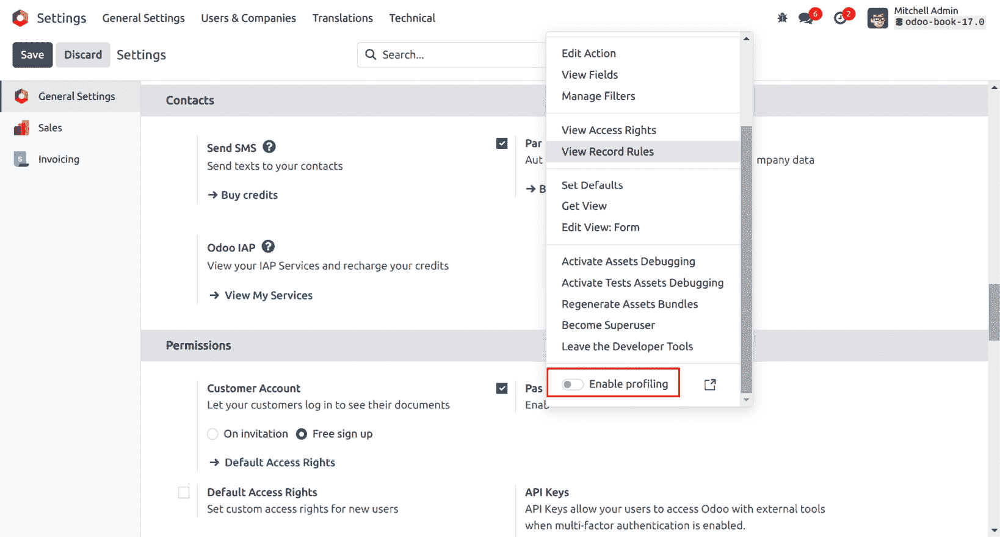
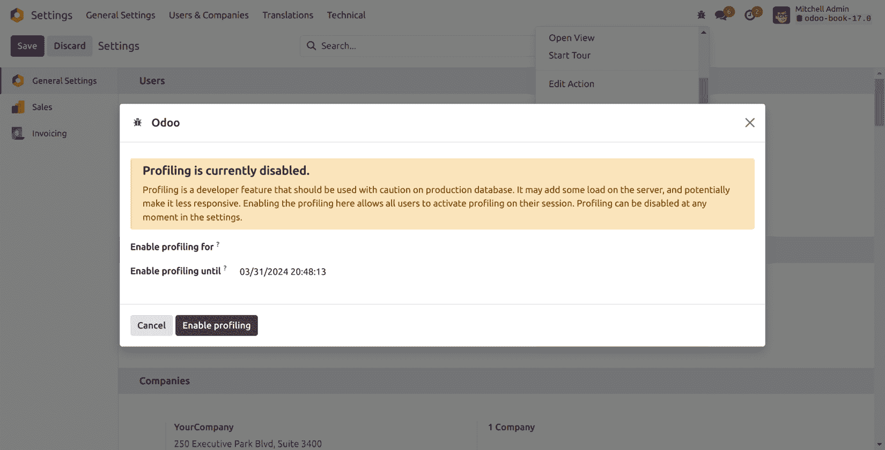
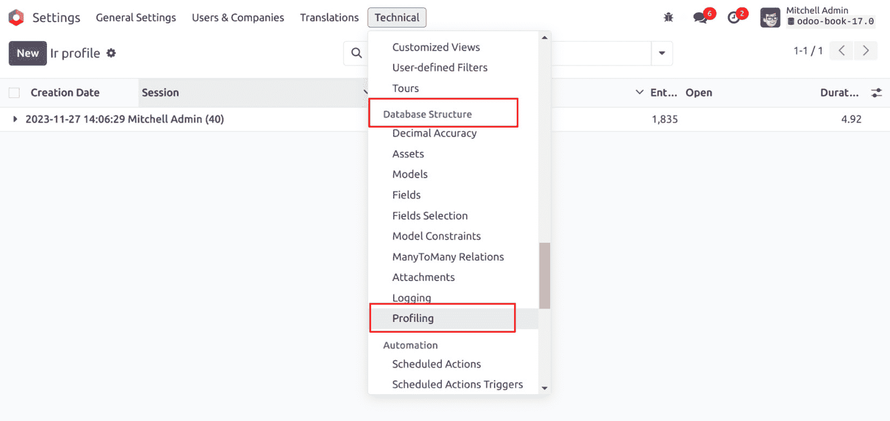
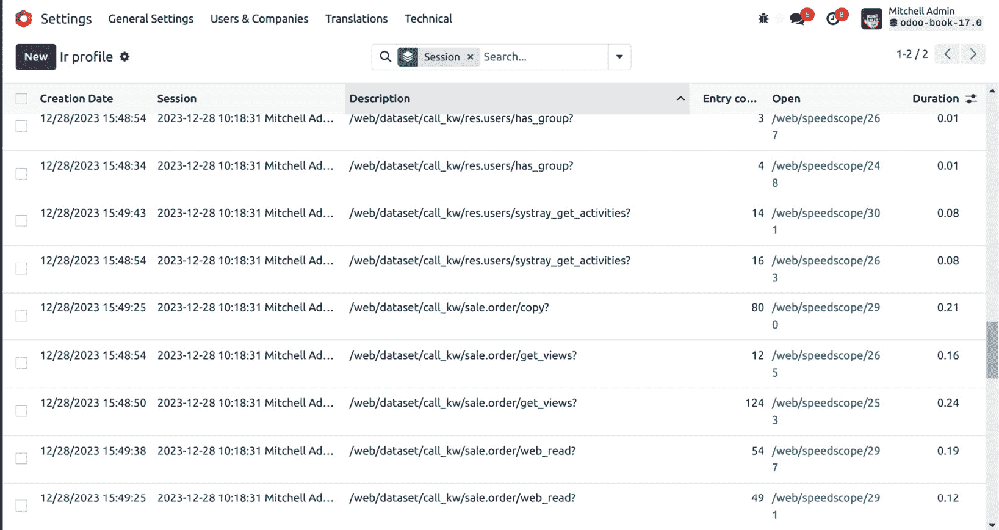
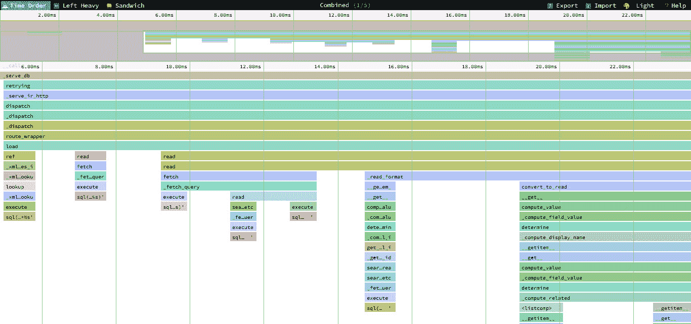
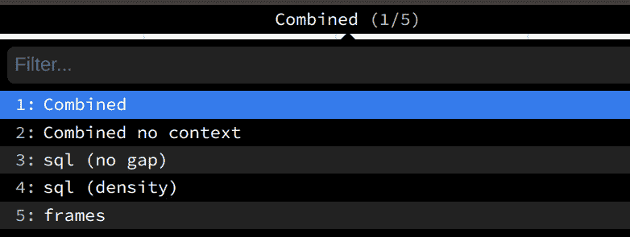

# 第二十一章：性能优化

在 Odoo 框架的帮助下，你可以开发大型且复杂的应用程序。良好的性能是任何项目成功的关键。在本章中，我们将探讨你需要用于优化性能的模式和工具。你还将了解用于找到性能问题根本原因的调试技术。

在本章中，我们将涵盖以下食谱：

+   记录集的预取模式

+   内存缓存 – `ormcache`

+   生成不同大小的图像

+   访问分组数据

+   创建或写入多个记录

+   通过数据库查询访问记录

+   分析 Python 代码

# 记录集的预取模式

当你从记录集中访问数据时，它会在数据库中执行一个查询。如果你有一个包含多个记录的记录集，对其上的记录进行检索可能会因为多个 SQL 查询而使系统变慢。在本食谱中，我们将探讨如何使用预取模式来解决这个问题。通过遵循预取模式，你可以减少所需的查询数量，这将提高性能并使你的系统更快。

## 如何做到这一点...

看看下面的代码；这是一个正常的`compute`方法。在这个方法中，`self`是一个包含多个记录的记录集。当你直接在记录集上迭代时，预取将完美地工作：

```py
# Correct prefetching
def compute_method(self):
    for rec in self:
        print(rec.name)
```

然而，在某些情况下，预取变得更为复杂，例如使用`browse`方法获取数据。在下面的示例中，我们在`for`循环中逐个浏览记录。这将无法有效地使用预取，并且将执行比通常更多的查询：

```py
# Incorrect prefetching
def some_action(self):
    record_ids = []
    self.env.cr.execute("some query to fetch record id")
    for rec in self.env.cr.fetchall():
        record = self.env['res.partner'].browse(rec[0])
        print(record.name)
```

通过向`browse`方法传递一个 ID 列表，你可以创建一个包含多个记录的记录集。如果你对这个记录集执行操作，预取将完美地工作：

```py
# Correct prefetching
def some_action(self):
    record_ids = []
    self.env.cr.execute("some query to fetch record id")
    record_ids = [ rec[0] for rec in self.env.cr.fetchall() ]
    recordset = self.env['res.partner'].browse(record_ids)
    for record_id in recordset:
        print(record.name)
```

这样，你将不会失去预取功能，并且数据将通过单个 SQL 查询进行获取。

## 它是如何工作的...

当你与多个记录集一起工作时，预取可以帮助减少 SQL 查询的数量。它是通过一次性获取所有数据来实现的。通常，在 Odoo 中预取是自动工作的，但在某些情况下，例如当你分割记录时，你会失去这个功能，如下面的示例所示：

```py
recs = [r for r in recordset r.id not in [1,2,4,10]]
```

上述代码会将记录集分割成部分，因此你无法利用预取。

正确使用预取可以显著提高**对象关系映射**（**ORM**）的性能。让我们探索预取在底层是如何工作的。

当你通过`for`循环迭代记录集并访问第一次迭代的字段值时，预取过程开始发挥作用。预取不会为迭代中的当前记录获取数据，而是会获取所有记录的数据。背后的逻辑是，如果你在`for`循环中访问一个字段，你很可能还会在迭代中的下一个记录中获取该数据。在`for`循环的第一次迭代中，预取将获取所有记录集的数据并将其保存在缓存中。在`for`循环的下一个迭代中，数据将从这个缓存中提供，而不是执行新的 SQL 查询。这将把查询次数从`O(n)`减少到`O(1)`。

假设记录集有 10 条记录。当你处于第一个循环并访问记录的`name`字段时，它将获取所有 10 条记录的数据。这不仅适用于`name`字段；它还将获取这 10 条记录的所有字段。在随后的`for`循环迭代中，数据将从缓存中提供。这将把查询次数从 10 次减少到 1 次：

```py
for record in recordset: # recordset with 10 records
    record.name # Prefetch data of all 10 records in the first loop
    record.email # data of email will be served from the cache.
```

注意，预取将获取所有字段的价值（除了`*2many`字段），即使这些字段在`for`循环的主体中没有被使用。这是因为额外的列与每个列的额外查询相比，对性能的影响较小。

注意

有时，预取字段可能会降低性能。在这些情况下，你可以通过将`False`传递给`prefetch_fields`上下文来禁用预取，如下所示：`recordset.with_context(prefetch_fields=False)`。

预取机制使用环境缓存来存储和检索记录值。这意味着一旦记录从数据库中获取，后续对字段的调用都将从环境缓存中提供。你可以使用`env.cache`属性来访问环境缓存。要使缓存失效，你可以使用环境的`invalidate_cache()`方法。

## 还有更多...

如果你拆分记录集，ORM 将生成一个新的记录集，并带有新的预取上下文。对这样的记录集执行操作将只预取相应记录的数据。如果你想在预取后预取所有记录，可以通过将预取记录 ID 传递给`with_prefetch()`方法来实现。在下面的示例中，我们将记录集拆分为两部分。在这里，我们在两个记录集中传递了共同的预取上下文，所以当你从其中一个中获取数据时，ORM 将获取另一个的数据并将其保存在缓存中以供将来使用：

```py
recordset = ... # assume recordset has 10 records.
recordset1 = recordset[:5].with_prefetch(recordset._ids)
recordset2 = recordset[5:].with_prefetch(recordset._ids)
self.env.cr.execute("select id from sale_order limit 10")
record_ids = [rec[0] for rec in self.env.cr.fetchall()]
recordset = self.env['sale.order'].browse(record_ids)
recordset1 = recordset[:5]
for rec in recordset1:
   print(rec.name)  # Prefetch name of all 5 records in the first loop
   print(rec.attention)  # Prefetch attention of all 5 records in the first loop
recordset2 = recordset[5:].with_prefetch(recordset._ids)
for rec in recordset1:
   print(rec.name)  # Prefetch name of all 10 records in the first loop
   print(rec.attention)  # Prefetch attention of all 10 records in the first loop
```

预取上下文不仅限于拆分记录集。你还可以使用`with_prefetch()`方法在多个记录集之间有一个共同的预取上下文。这意味着当你从一个记录中获取数据时，它也会获取其他所有记录集的数据。

# 内存缓存 – ormcache

Odoo 框架提供了`ormcache`装饰器来管理内存缓存。在这个菜谱中，我们将探讨如何管理你函数的缓存。

## 如何做到这一点...

这个 ORM 缓存的类可以在`/odoo/tools/cache.py`中找到。为了在任何文件中使用这些类，你需要按照以下方式导入它们：

```py
from odoo import tools
```

导入类后，你可以使用 ORM 缓存装饰器。Odoo 提供了不同类型的内存缓存装饰器。在接下来的小节中，我们将逐一查看这些装饰器。

### ormcache

这是最简单也是最常用的缓存装饰器。你需要传递一个参数名称，该参数名称决定了方法的输出。以下是一个带有`ormcache`装饰器的方法示例：

```py
@tools.ormcache('mode')
def fetch_mode_data(self, mode):
    # some calculations
    return result
```

当你第一次调用这个方法时，它将被执行，并返回结果。`ormcache`将根据`mode`参数的值存储这个结果。当你再次以相同的`mode`值调用该方法时，结果将从缓存中提供，而无需实际执行该方法。

有时，你的方法的结果依赖于环境属性。在这些情况下，你可以这样声明方法：

```py
@tools.ormcache('self.env.uid', 'mode')
def fetch_data(self, mode):
    # some calculations
    return result
```

在这个例子中给出的方法将根据环境用户和`mode`参数的值来存储缓存。

### ormcache_context

这个缓存的工作方式与`ormcache`类似，但它在参数的基础上还依赖于上下文中的值。在这个缓存的装饰器中，你需要传递参数名称和上下文键的列表。例如，如果你的方法输出依赖于上下文中的`lang`和`website_id`键，你可以使用`ormcache_context`：

```py
@tools.ormcache_context('mode', keys=('website_id','lang'))
def fetch_data(self, mode):
    # some calculations
    return result
```

在前面的例子中，这个缓存将依赖于`mode`参数和`context`的值。

### ormcache_multi

一些方法对多个记录或 ID 执行操作。如果你想给这类方法添加缓存，你可以使用`ormcache_multi`装饰器。你需要传递`multi`参数，在方法调用期间，ORM 将通过迭代这个参数来生成缓存键。在这个方法中，你需要以字典格式返回结果，其中`multi`参数的一个元素作为键。看看以下示例：

```py
@tools.ormcache_multi('mode', multi='ids')
def fetch_data(self, mode, ids):
    result = {}
    for i in ids:
        data = ... # some calculation based on ids
        result[i] = data
    return result
```

假设我们用`[1,2,3]`作为 ID 调用前面的方法。该方法将以`{1:... , 2:..., 3:... }`的格式返回一个结果。ORM 将根据这些键缓存结果。如果你再次调用该方法，并使用`[1,2,3,4,5]`作为 ID，你的方法将接收到`[4, 5]`作为`ID`参数，因此该方法将执行`4`和`5` ID 的操作，其余的结果将从缓存中提供。

## 它是如何工作的...

ORM 缓存以字典格式（缓存查找）保持缓存。此缓存的关键字将基于装饰方法的签名生成，值将是结果。简单来说，当你用`x, y`参数调用方法，且方法的结果是`x+y`时，缓存查找将是`{(x, y): x+y}`。这意味着下次你用相同的参数调用此方法时，结果将直接从缓存中提供。这节省了计算时间并使响应更快。

ORM 缓存是内存缓存，因此它存储在 RAM 中并占用内存。不要使用`ormcache`来服务大型数据，如图片或文件。

警告

使用此装饰器的方法永远不应该返回一个记录集。如果它们这样做，将生成`psycopg2.OperationalError`，因为记录集的底层游标已关闭。

你应该在纯函数上使用 ORM 缓存。纯函数是一个总是对相同的参数返回相同结果的方法。这些方法的输出只依赖于参数，因此它们返回相同的结果。如果情况不是这样，当你执行使缓存状态无效的操作时，你需要手动清除缓存。要清除缓存，请调用`clear_caches()`方法：

```py
self.env[model_name].clear_caches()
```

清除缓存后，下一次调用该方法将执行该方法并将结果存储在缓存中，所有后续具有相同参数的方法调用都将从缓存中提供服务。

## 还有更多...

ORM 缓存是发送给 Odoo 进程的`SIGUSR1`信号：

```py
kill -SIGUSR1 <pid>
kill -SIGUSR1 496
```

在这里，`496`是进程 ID。执行命令后，你将在日志中看到 ORM 缓存的状况：

```py
> 2023-10-18 09:22:49,350 496 INFO odoo-book-17.0 odoo.tools.cache:      1 entries,     31 hit,      1 miss,      0 err, 96.9% ratio, for ir.actions.act_window._existing
> 2023-10-18 09:22:49,350 496 INFO odoo-book-17.0 odoo.tools.cache:      1 entries,      1 hit,      1 miss,      0 err, 50.0% ratio, for ir.actions.actions.get_bindings
> 2023-10-18 09:22:49,350 496 INFO odoo-book-17.0 odoo.tools.cache:      4 entries,      1 hit,      9 miss,      0 err, 10.0% ratio, for ir.config_parameter._get_param
```

缓存中的百分比是命中-未命中比率。它是结果在缓存中找到的成功比率。如果缓存的命中-未命中比率太低，你应该从方法中移除 ORM 缓存。

# 生成不同尺寸的图片

大图片对任何网站都可能造成麻烦。它们增加了网页的大小，从而使得网页加载速度变慢。这会导致 SEO 排名下降和访客流失。在这个菜谱中，我们将探讨如何创建不同尺寸的图片；通过使用正确的图片，你可以减小网页大小并提高页面加载时间。

## 如何做...

你需要在你的模型中继承`image.mixin`。以下是向你的模型添加`image.mixin`的方法：

```py
class HostelStudent(models.Model):
    _name = "hostel.student"
    _description = "Hostel Student Information"
    _inherit = ["image.mixin"]
```

混合模型将自动为宿舍学生模型添加五个新字段以存储不同尺寸的图片。请参阅*如何工作…*部分了解所有五个字段。

## 如何工作...

`image.mixin`实例将自动为模型添加五个新的二进制字段。每个字段存储具有不同分辨率的图片。以下是字段及其分辨率的列表：

+   `image_1920`: 1,920x1,920

+   `image_1024`: 1,024x1,024

+   `image_512`: 512x1,512

+   `image_256`: 256x256

+   `image_128`: 128x128

在这里给出的所有字段中，只有 `image_1920` 是可编辑的。其他图像字段是只读的，并在您更改 `image_1920` 字段时自动更新。因此，在您模型的表单视图后端，您需要使用 `image_1920` 字段以允许用户上传图像。然而，这样做会在表单视图中加载大型的 `image_1920` 图像。但是，有一种方法可以通过在表单视图中使用 `image_1920` 图像来提高性能，同时显示较小的图像。例如，我们可以利用 `image_1920` 字段，但显示 `image_128` 字段。为此，您可以使用以下语法：

```py
<field name="image_1920" widget="image"
       options="{'preview_image': 'image_128'}" />
```

一旦您将图像保存到字段中，Odoo 将自动调整图像大小并将其存储在相应的字段中。表单视图将显示转换后的 `image_128`，因为我们将其用作 `preview_image`。

注意

`image.mixin` 模型是 `AbstractModel`，因此它的表不在数据库中。您需要在您的模型中继承它才能使用它。

使用此 `image.mixin`，您可以存储最大分辨率为 1,920x1,920 的图像。如果您保存的图像分辨率高于 1,920x1,920，Odoo 将将其减少到 1,920x1,920。在此过程中，Odoo 还将保留图像的分辨率，避免任何扭曲。例如，如果您上传分辨率为 2,400x1,600 的图像，`image_1920` 字段将具有 1,920x1,280 的分辨率。

## 还有更多...

使用 `image.mixin`，您可以获取具有特定分辨率的图像，但您想使用具有其他分辨率的图像怎么办？为此，您可以使用二进制包装器字段图像，如下例所示：

```py
image_1500 = fields.Image("Image 1500", max_width=1500, max_height=1500)
```

这将创建一个新的 `image_1500` 字段，存储图像时将调整其分辨率为 1,500x1,500。请注意，这并不是 `image.mixin` 的一部分。它只是将图像减少到 1,500x1,500，因此您需要在表单视图中添加此字段；编辑它不会更改 `image.mixin` 中的其他图像字段。如果您想将其与现有的 `image.mixin` 字段链接，请将 `related="image_1920"` 属性添加到字段定义中。

# 访问分组数据

当您需要统计数据时，您通常需要以分组的形式获取数据，例如月度销售报告，或按客户显示销售情况的报告。手动搜索记录并分组是耗时的工作。在这个菜谱中，我们将探讨您如何使用 `read_group()` 方法来访问分组数据。

## 如何做到这一点...

执行以下步骤。

注意

`read_group()` 方法在统计和智能统计按钮中广泛使用。

1.  假设您想在合作伙伴表单上显示销售订单的数量。这可以通过搜索客户的销售订单然后计数长度来完成：

    ```py
    # in res.partner model
    so_count = fields.Integer(compute='_compute_so_count', string='Sale order count')
    def _compute_so_count(self):
        sale_orders = self.env['sale.order'].search(domain=[('partner_id', 'in', self.ids)])
        for partner in self:
            partner.so_count = len(sale_orders.filtered(lambda so: so.partner_id.id == partner.id))
    ```

    之前的示例将工作，但不是最优的。当您在树视图中显示 `so_count` 字段时，它将获取并过滤列表中所有合作伙伴的销售订单。对于这么少量的数据，`read_group()` 方法不会带来太大的差异，但随着数据量的增长，可能会成为问题。为了解决这个问题，您可以使用 `read_group` 方法。

1.  以下示例将执行与上一个示例相同的功能，但对于大量数据集，它只消耗一个 SQL 查询：

    ```py
    # in res.partner model
    so_count = fields.Integer(compute='_compute_so_count', string='Sale order count')
    def _compute_so_count(self):
        sale_data = self.env['sale.order'].read_group(
            domain=[('partner_id', 'in', self.ids)],
            fields=['partner_id'], groupby=['partner_id'])
        mapped_data = dict([(m['partner_id'][0], m['partner_id_count']) for m in sale_data])
        for partner in self:
            partner.so_count = mapped_data[partner.id]
    ```

之前的代码片段已经优化，因为它直接通过 SQL 的 `GROUP BY` 功能获取销售订单的数量。

## 它是如何工作的...

`read_group()` 方法在内部使用 SQL 的 `GROUP BY` 功能。这使得 `read_group` 方法即使在拥有大量数据集的情况下也能更快地执行。内部，Odoo 网页客户端在图表和分组树视图中使用此方法。您可以通过使用不同的参数来调整 `read_group` 方法的行为。

让我们探索 `read_group` 方法的签名：

```py
def read_group(self, domain, fields, groupby, offset=0, limit=None, orderby=False, lazy=True):
```

可用于 `read_group` 方法的不同参数如下：

+   `domain`：此参数用于过滤记录。这将作为 `read_group` 方法的搜索条件。

+   `fields`：这是一个要分组获取的字段列表。请注意，这里提到的字段应包含在 `groupby` 参数中，除非您使用某些聚合函数。`read_group` 方法支持 SQL 聚合函数。假设您想获取每个客户的平均订单金额。如果是这样，您可以使用以下 `read_group`：

    ```py
    self.env['sale.order'].read_group([], ['partner_id', 'amount_total:avg'], ['partner_id'])
    ```

    如果您想访问同一字段两次但使用不同的聚合函数，语法略有不同。您需要将字段名作为 `alias:agg(field_name)` 传递。此示例将为您提供每个客户的订单总数和平均数：

    ```py
    self.env['sale.order'].read_group([], ['partner_id', 'total:sum(amount_total)', 'avg_total:avg(amount_total)'], ['partner_id'])
    ```

+   `groupby`：此参数将是一个字段列表，记录将根据这些字段进行分组。它允许您根据多个字段对记录进行分组。为此，您需要传递一个字段列表。例如，如果您想按客户和订单状态对销售订单进行分组，您可以在该参数中传递 `['partner_id', 'state']`。

+   `offset`：此参数用于分页。如果您想跳过一些记录，可以使用此参数。

+   `limit`：此参数用于分页；它表示要获取的最大记录数。

+   `lazy`：此参数接受布尔值。默认情况下，其值为 `True`。如果此参数为 `True`，则结果仅按 `groupby` 参数中的第一个字段进行分组。您将在结果的 `__context` 和 `__domain` 键中获取剩余的 `groupby` 参数和域。如果此参数的值设置为 `False`，则将按 `groupby` 参数中的所有字段对数据进行分组。

## 还有更多...

按日期字段分组可能很复杂，因为可以根据天、周、季度、月或年对记录进行分组。你可以通过在 `groupby` 参数中的 `:` 后传递 `groupby_function` 来更改日期字段的分组行为。如果你想按月分组销售订单的总数，你可以使用 `read_group` 方法：

```py
self.env['sale.order'].read_group([], ['total:sum(amount_total)'], ['order_date:month'])
```

日期分组的可能选项有 `day`、`week`、`month`、`quarter` 和 `year`。

## 参考以下内容

如果你想了解更多关于 PostgreSQL 聚合函数的信息，请参阅文档：[`www.postgresql.org/docs/current/functions-aggregate.html`](https://www.postgresql.org/docs/current/functions-aggregate.html)。

# 创建或写入多个记录

如果你刚开始接触 Odoo 开发，你可能会执行多个查询来写入或创建多个记录。在本配方中，我们将探讨如何批量创建和写入记录。

## 如何操作...

在底层，创建多个记录和在多个记录上写入操作的工作方式不同。让我们逐一查看这些记录。

### 创建多个记录

Odoo 支持批量创建记录。如果你正在创建单个记录，只需传递一个包含字段值的字典。要批量创建记录，你只需传递这些字典的列表而不是单个字典。以下示例在单个 `create` 调用中创建三个房间记录：

```py
vals = [{
    'name': "Room A-101",
    'room_no': 101,
    'floor_no': 1,
    'student_per_room': 2,
}, {
    'name': "Room A-102",
    'room_no': 102,
    'floor_no': 1,
    'student_per_room': 3,
}, {
    'name': "Room B-201",
    'room_no': 201,
    'floor_no': 2,
    'student_per_room': 3,
}]
self.env['hostel.room'].create(vals)
```

此代码片段将创建三本新书的记录。

### 在多个记录上写入

当与多个版本的 Odoo 一起工作时，了解写入方法的行为方式很重要。在这种情况下，它采用延迟更新的方法，这意味着它不会立即将数据写入数据库。相反，Odoo 只在必要时或当调用 `flush()` 方法时将数据写入数据库。

这里是 `write` 方法的两个示例：

```py
# Example 1
data = {...}
for record in recordset:
    record.write(data)
# Example 2
data = {...}
recordset.write(data)
```

如果你使用 Odoo v13 或更高版本，那么将不会有任何关于性能的问题。然而，如果你使用较旧版本，第二个示例将比第一个示例快得多，因为第一个示例将在每个迭代中执行一个 SQL 查询。

## 它是如何工作的...

为了批量创建多个记录，你需要以列表的形式传递包含值的字典来创建新记录。这将自动管理批量创建记录。当你批量创建记录时，内部操作将为每个记录插入一个查询。这意味着批量创建记录不是在一个查询中完成的。然而，这并不意味着批量创建记录不会提高性能。性能的提升是通过批量计算计算字段实现的。

对于 `write` 方法，操作方式不同。大多数事情都由框架自动处理。例如，如果你在所有记录上写入相同的数据，数据库将只通过一个 `UPDATE` 查询进行更新。如果框架在同一个事务中反复更新相同的记录，它也会处理这种情况，如下所示：

```py
recordset.name= 'Admin'
recordset.email= 'admin@example.com'
recordset.name= 'Administrator'
recordset.email= 'admin-2@example.com'
```

在之前的代码片段中，对于`write`操作，只会执行一个查询，最终`name=Administrator`和`email=admin-2@example.com`的值。这不会对性能产生负面影响，因为分配的值在缓存中，并且稍后在一个查询中写入。

如果你在这之间使用`flush()`方法，情况会有所不同，如下面的示例所示：

```py
recordset.name= 'Admin'
recordset.email= 'admin@example.com'
recordset.flush()
recordset.name= 'Administrator'
recordset.email= 'admin-2@example.com'
```

`flush()`方法将缓存中的值更新到数据库。因此，在前面的例子中，将执行两个`UPDATE`查询——一个是在刷新之前的数据，另一个是在刷新之后的数据。

## 还有更多...

如果你使用的是较旧版本，那么写入单个值将立即执行`UPDATE`查询。请查看以下示例以探索旧版 Odoo 中`write`操作的正确用法：

```py
# incorrect usage
recordset.name= 'Admin'
recordset.email= 'admin@example.com'
# correct usage
recordset.write({'name': 'Admin', 'email'= 'admin@example.com'})
```

在这里，在第一个例子中，我们有两次`UPDATE`查询，而第二个例子将只执行一次`UPDATE`查询。

# 通过数据库查询访问记录

Odoo ORM 方法有限，有时从 ORM 中获取某些数据可能很困难。在这些情况下，你可以以所需格式获取数据，并需要对数据进行操作以获得特定结果。因此，这会变慢。为了处理这些特殊情况，你可以在数据库中执行 SQL 查询。在本食谱中，我们将探讨如何从 Odoo 运行 SQL 查询。

## 如何做到这一点...

你可以使用`self._cr.execute`方法执行数据库查询：

1.  添加以下代码：

    ```py
    self.flush()
    self._cr.execute("SELECT id, name, room_no, floor_no  FROM hostel_room WHERE name ilike %s", ('%Room A-%',))
    data = self._cr.fetchall()
    print(data)
    ```

    这是输出：

    ```py
    dictfetchall() method. Take a look at the following example:

    ```

    self.flush()

    self._cr.execute("SELECT id, name, room_no, floor_no FROM hostel_room WHERE name ilike %s", ('%Room A-%',))

    data = self._cr.dictfetchall()

    print(data)

    ```py

    Here is the output:

    ```

    [{'id': 4, 'name': 'Room A-101', 'room_no': 101, 'floor_no': 1}, {'id': 5, 'name': 'Room A-103', 'room_no': 103, 'floor_no': 1}, {'id': 6, 'name': 'Room A-201', 'room_no': 201, 'floor_no': 2}]

    ```py

    ```

如果你只想获取单个记录，可以使用`fetchone()`和`dictfetchone()`方法。这些方法与`fetchall()`和`dictfetchall()`类似，但它们只返回单个记录，如果你想获取多个记录，需要多次调用`fetchone()`和`dictfetchone()`方法。

## 它是如何工作的...

有两种方式从记录集访问数据库游标——一种是从记录集本身，例如`self._cr`，另一种是从环境（特别是`self.env.cr`）。这个游标用于执行数据库查询。在前面的例子中，我们看到了如何通过原始查询获取数据。表名是模型名称，将`.`替换为`_`后的名称，因此`hostel.room`模型变为`hostel_room`。

注意，我们在执行查询之前使用了`self.flush()`。这样做的原因是 Odoo 过度使用缓存，数据库可能没有正确的值。`self.flush()`会将所有延迟的更新推送到数据库，并执行所有相关的计算，然后你将从数据库中获得正确的值。`flush()`方法还支持一些参数，可以帮助你控制要刷新到数据库中的内容。参数如下：

+   `fname`参数需要一个你想要刷新到数据库的字段列表

+   `records`参数需要一个记录集，如果你只想刷新某些记录，则使用它

如果你正在执行`INSERT`或`UPDATE`查询，在执行查询后也需要执行`flush()`，因为 ORM 可能不知道你做出的更改，并且它可能已经缓存了记录。

在执行原始查询之前，你需要考虑一些事情。只有在你没有其他选择时才使用原始查询。通过执行原始查询，你绕过了 ORM 层。因此，你也绕过了安全规则和 ORM 的性能优势。有时，错误构建的查询可能会引入 SQL 注入漏洞。考虑以下示例，其中的查询可能会允许攻击者执行 SQL 注入：

```py
# very bad, SQL injection possible
self.env.cr.execute('SELECT id, name FROM hostel_room WHERE name ilike + search_keyword + ';')
# good
self.env.cr.execute('SELECT id, name FROM hostel_room WHERE name ilike %s ';', (search_keyword,))
```

也不要使用字符串格式化函数；它也会允许攻击者执行 SQL 注入。使用 SQL 查询会使你的代码对其他开发者来说更难阅读和理解，所以尽可能避免使用它们。

信息

许多 Odoo 开发者认为执行 SQL 查询可以使操作更快，因为它绕过了 ORM 层。然而，这并不完全正确；它取决于用例。在大多数操作中，ORM 的性能和速度都比`RAW`查询要好，因为数据是从记录集缓存中提供的。

## 还有更多...

在一个事务中进行的操作只在事务结束时提交。如果在 ORM 中发生错误，事务将被回滚。如果你已经执行了`INSERT`或`UPDATE`查询并希望使其永久，可以使用`self._cr.commit()`来提交更改。

注意

注意，使用`commit()`可能很危险，因为它可能会使记录处于不一致的状态。ORM 中的错误可能导致不完整的回滚，所以只有在你完全确定你在做什么的情况下才使用`commit()`。

如果你使用`commit()`方法，那么之后就没有必要使用`flush()`了。`commit()`方法会在内部刷新环境。

# 性能分析

有时，你将无法确定问题的原因。这尤其适用于性能问题。Odoo 提供了一些内置的性能分析工具，可以帮助你找到问题的真正原因。

性能分析是关于分析程序执行并测量汇总数据的过程。这些数据可以是每个函数的执行时间、执行的 SQL 查询等等。

虽然性能分析本身并不能提高程序的性能，但它可以非常有帮助，在寻找性能问题和确定程序中哪些部分负责这些问题时。

在 Odoo 中进行代码性能分析可以帮助您识别性能问题并优化您的代码。这是一种分析代码执行时间、程序复杂性和应用程序内存使用的技术。

通过在 Odoo 中使用性能分析技术，您可以提高应用程序的整体性能和用户体验，使其更快、更高效。

## 启用性能分析器

性能分析器可以通过用户界面启用，这是最简单的方法，但只能用于分析 Web 请求，或者从 Python 代码中启用：

1.  启用开发者模式。

1.  性能分析器必须在数据库上全局启用。这可以通过两种方式完成：

    +   打开开发者模式工具，然后切换**启用性能分析**按钮。向导建议一组性能分析的有效期时间。单击**启用性能分析**以全局启用性能分析器。



图 21.1 – 启用性能分析



图 21.2 – 禁用性能分析

+   前往**设置** | **常规设置** | **性能**，并设置启用性能分析字段所需的时间。

### 分析结果

要浏览性能分析结果，请确保性能分析器在数据库上全局启用，然后打开开发者模式工具，并单击性能分析部分右上角的按钮。将打开按性能分析会话分组的`ir.profile`记录的列表视图。



每条记录都有一个可点击的链接，该链接在新标签页中打开速度分析结果。



Speedscope 超出了本文档的范围，但有很多工具可以尝试 – 搜索、突出显示类似帧、放大帧、时间线、左侧重、三明治视图等等。

根据激活的配置选项，Odoo 会生成不同的视图模式，您可以从顶部菜单访问它们。



+   **组合**：**组合**视图显示所有已整合的 SQL 查询和跟踪。

+   **无上下文组合**：**无上下文组合**视图产生相同的结果，但忽略了存储的执行上下文、性能/分析/启用>。

+   **sql (无间隔)**：**sql (无间隔)**视图显示所有 SQL 查询，就像它们是顺序执行的一样，没有任何 Python 逻辑。这仅对 SQL 优化有益。

+   **sql (密度)**：**sql (密度)**视图中仅显示 SQL 查询，它们之间有空格。这可以帮助您发现可以批量处理的多个小查询的区域，并确定问题是否出在 Python 或 SQL 代码上。

+   **帧**：**帧**视图中仅显示周期性收集器的结果。

注意

尽管分析器设计轻量级，但它仍然可能影响性能，尤其是在使用`Sync`收集器时。记住这一点，当你检查速度范围数据时。

### 收集器

每个收集器都有独特的格式和方法来收集分析数据。通过开发模式工具中的特定切换按钮，或使用 Python 代码通过它们的键或类，每个都可以从用户界面独立启用。

目前 Odoo 中有四个收集器可用：

+   `SQLCollector`

+   `PeriodicCollector`

+   `QwebCollector`

+   `SyncCollector`

### SQL 收集器

当前线程（对于所有游标）对数据库进行的所有 SQL 查询都由`SQL`收集器保存，包括堆栈跟踪。在大量小查询上使用收集器可能会影响执行时间和其他分析器，因为收集器的开销被添加到每个查询检查的线程上。

在组合速度范围视图中调试查询计数并向`Periodic`收集器添加数据是两个特别有用的用途：

```py
class SQLCollector(Collector):
   """
   Saves all executed queries in the current thread with the call stack.
   """
   name = 'sql'
```

#### 周期性收集器

此收集器在单独的线程中运行，并在每个间隔保存分析线程的堆栈跟踪。间隔（默认为 10 毫秒）可以通过用户界面中的**间隔**选项或 Python 代码中的间隔参数定义。

注意

如果间隔设置得非常低，在分析长时间查询时会出现内存问题。如果间隔设置得非常高，它将失去对短暂函数执行的详细信息。

由于它具有独特的线程，它应该对执行时间的影响相对较小，这使得它成为评估性能的最佳方式之一：

```py
class PeriodicCollector(Collector):
   """
   Record execution frames asynchronously at most every `interval` seconds.
   :param interval (float): time to wait in seconds between two samples.
   """
   name = 'traces_async'
```

#### Qweb 收集器

该收集器减少了每个指令的 Python 执行时间和查询。在执行大量小指令时，使用 SQL 收集器可能会产生显著的开销。就收集的数据而言，结果与其他收集器不同，可以使用自定义小部件从`ir.profile`表单视图检查它们。

在尝试最大化观看次数时，这非常有帮助：

```py
class QwebCollector(Collector):
   """
   Record qweb execution with directive trace.
   """
   name = 'qweb'
```

#### 同步收集器

由于这个收集器在单个线程上操作并为每个函数调用和返回保存堆栈，因此它对性能的影响很大。

调试和理解复杂的流程，以及跟踪它们在代码中的执行情况，可能会有所帮助。然而，由于显著的开销，不建议使用性能分析：

```py
class SyncCollector(Collector):
   """
   Record complete execution synchronously.
   Note that --limit-memory-hard may need to be increased when launching Odoo.
   """
   name = 'traces_sync'
```

### 性能陷阱

+   注意随机性。多次执行可能会导致不同的结果——例如，在执行过程中触发垃圾回收器。

+   注意阻塞调用。在某些情况下，外部的`c_call`可能需要一些时间才能释放 GIL，从而导致周期性收集器出现意外的长帧。分析器应该检测到这一点并给出警告。如果需要，可以在这样的调用之前手动触发分析器。

+   注意缓存。在视图/资源/...进入缓存之前进行分析可能会导致不同的结果。

+   注意分析器的开销。当执行许多小查询时，SQL 收集器的开销可能很重要。分析是发现问题的实用方法，但你可能希望禁用分析器来测量代码更改的实际影响。

+   分析结果可能占用大量内存。在某些情况下（例如，分析安装或长时间请求），你可能会达到内存限制，尤其是在渲染 speedscope 结果时，这可能导致 HTTP 500 错误。在这种情况下，你可能需要以更高的内存限制启动服务器 - `--limit-memory-hard $((8*1024**3)).`
