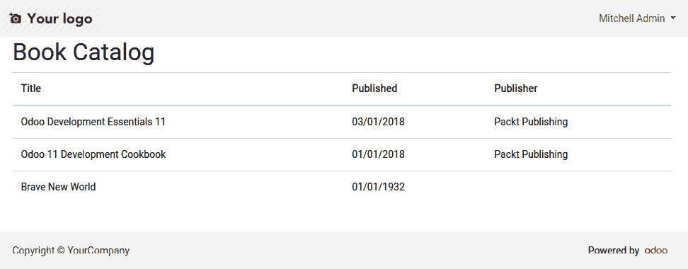
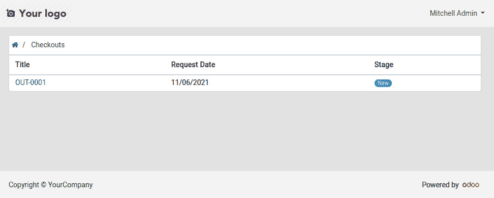

# 第十一章：*第十三章*：创建 Web 和门户前端功能

Odoo 是一个业务应用程序框架，提供快速构建应用程序所需的所有工具。统一的 Web 客户端提供了业务用户界面。但组织不能与世界隔离。能够与外部用户交互以支持高效流程是必要的。为此，Odoo 支持 Web 界面。

内部用户 Web 客户端有时被称为 **后端**，外部用户界面被称为 **前端**。前端提供 **门户功能**，可供门户用户登录访问。它还提供公共功能，无需登录即可访问，称为 **网站功能**。

门户补充了后端应用程序，为外部用户提供自助服务功能，例如查看和支付他们的订单，或提交支持工单。

网站功能建立在 Odoo **内容管理系统**（**CMS**）之上，该系统允许您构建网页，包括易于使用的 *拖放* 网页设计工具。此外，网站功能还提供作为 **模块** 的附加功能，例如博客、在线招聘或电子商务。

在本章中，您将学习如何开发前端附加模块，利用 Odoo 提供的网站功能，同时讨论以下主题：

+   介绍图书馆门户学习项目

+   创建前端网页

+   了解 Web 控制器

+   添加门户功能

到本章结束时，您将学会如何使用 Web 控制器和 QWeb 模板创建动态网页，并将其集成到 Odoo 前端。此外，您还将学习如何利用 Odoo 门户模块，将其功能添加到其中。

# 技术要求

本章中的工作需要`library_checkout`附加模块，最后编辑于*第十一章*，*看板视图和客户端 QWeb*。附加模块及其依赖代码可以在 Git 仓库 https://github.com/PacktPublishing/Odoo-15-Development-Essentials 中找到。本章中的代码可以在同一仓库中找到。

# 介绍图书馆门户学习项目

为了了解 Odoo 网页开发，将使用一个新的项目。图书馆应用程序可以使用自助服务功能为图书馆会员提供服务。会员可以被分配一个用户登录名以访问他们的图书借阅请求。

将为这些门户自助服务功能创建名为`library_portal`的附加模块。

首先要添加的文件是清单文件，`library_portal/__manifest__.py`，您可以使用以下代码创建它：

```py
{
  "name": "Library Portal",
  "description": "Portal for library members",
  "author": "Daniel Reis",
  "license": "AGPL-3",
  "depends": [
      "library_checkout", "portal"
  ],
  "data": [
    "security/library_security.xml",
    "security/ir.model.access.csv",
    "views/checkout_portal_templates.xml",
  ],
}
```

该模块依赖于 `library_checkout` 来扩展其功能。它还依赖于 `portal` 模块，为门户功能提供基础。`website` 模块提供 CMS 功能，也可以用于网页开发。然而，`portal` 模块可以在不安装 *Website* 应用程序的情况下提供必要的前端功能。

`data` 键列出了三个要使用的 XML 文件。前两个与安全相关，为门户用户提供查看借阅请求所需的访问权限。最后一个 XML 文件将包含门户用户界面的 QWeb 模板。

为了使模块目录成为一个有效的 Python 模块，根据 Odoo 框架的要求，还需要一个空的 `library_portal/__init__.py` 文件。

现在新模块已经包含了必要的文件，下一步是添加使网页能够正常运行的必备组件。

# 创建前端网页

要开始学习 Odoo 网络开发的基础，将创建一个简单的网页。为此，需要两个组件：一个 **网页控制器**，当访问特定的 URL 时被触发，以及一个 **QWeb 模板**，用于生成由该 URL 展示的 HTML。

展示这个功能的网页是一个图书目录，是图书馆中图书的简单列表。图书目录页面将在 `http://localhost:8069/library/catalog` 可访问。

以下截图提供了一个示例，展示了应该看到的内容：



图 13.1 – 图书目录前端网页

第一步是添加网页控制器，我们将在下一节中完成。

## 添加网页控制器

网页控制器是 Python 对象，用于实现网页功能。它们可以将 URL 路径链接到对象方法，这样当访问该 URL 时，就会执行该方法。

例如，对于 `http://localhost:8069/library/catalog` URL，访问的路径是 `/library/catalog`。

一个 URL 路径，有时也称为 `http.Controller` 对象中的 `@http.route` 方法装饰器。

要为 `/library/catalog` 创建路由，执行以下步骤：

1.  控制器 Python 代码将被添加到 `controllers` 子目录中。在 `library_portal` 模块目录中，编辑 `__init__.py` 文件以导入该子目录：

    ```py
    from . import controllers
    ```

1.  将 `controllers/__init__.py` 文件添加到导入包含控制器代码的 Python 文件中，该文件将位于 `main.py` 文件中：

    ```py
    from . import main
    ```

1.  添加实际的控制器文件，`controllers/main.py`，包含以下代码：

    ```py
    from odoo import http
    class Main(http.Controller): 
        @http.route("/library/catalog", 
          auth="public", website=True)
        def catalog(self, **kwargs):
            Book = http.request.env["library.book"]
            books = Book.sudo().search([])
            return http.request.render(
                "library_portal.book_catalog",
                  {"books": books},
            )
    ```

完成这些步骤后，控制器组件就完成了，并且能够处理 `/library/catalog` 路由的请求。

`odoo.http` 模块提供了 Odoo 网络相关的功能。负责页面渲染的网页控制器应该是继承自 `odoo.http.Controller` 类的对象。类名实际上并不重要。在之前的代码中，控制器类名为 `Main()`。

`Main()` 类中的 `catalog()` 方法用 `@http.route` 装饰，将其绑定到一个或多个 URL 路由。在这里，`catalog()` 方法由 `/library/catalog` 路由触发。它还使用了 `auth="public"` 参数，这意味着此路由无需身份验证即可访问。`website=true` 参数意味着此页面将使用网页前端布局，并确保提供一些需要的附加变量。

注意

使用 `website=True` 不需要安装 *网站* 应用。它也适用于基本的 Odoo 前端网页。

这些 `catalog()` 路由方法预期会进行一些处理，然后返回 HTML 页面给用户的网络浏览器。

`http.request` 对象会自动设置与网络请求，并具有 `.env` 属性，用于访问 Odoo 环境。这可以用来实例化 Odoo 模型。示例代码就是这样来访问 `library.book` 模型，然后构建包含所有可用图书的记录集。

路由方法以登录用户或作为未登录时的公共特殊用户运行。由于公共用户访问权限非常有限，可能需要 `sudo()` 来确保可以检索要展示的数据。

最后一行返回 `http.request.render()` 的结果。这准备了一个要渲染的 QWeb 模板。两个参数是模板 XML ID，在本例中为 `library_portal.book_catalog`，以及一个字典，包含要提供给 QWeb 渲染上下文的变量。在这种情况下，一个 `books` 变量被提供，并设置为图书记录集。

注意

`http.request.render()` 函数返回一个 Odoo `http.response` 对象，包含有关如何渲染的指令。实际的 QWeb 模板到 HTML 的处理会延迟到所有网络控制器代码运行且响应准备好发送给客户端时。这允许扩展路由方法，例如，修改 `qcontext` 属性，该属性持有用于 QWeb 渲染的字典。

控制器已就绪，但所使用的 QWeb 模板需要在它能够工作之前创建。下一节将处理这一点。

## 添加 QWeb 模板

QWeb 模板是包含 HTML 代码和 QWeb 指令的 XML 片段，可以根据条件动态修改输出。图书目录网页需要一个 QWeb 模板来渲染要展示的 HTML。

要添加 `library_portal.book_catalog` QWeb 模板，执行以下步骤：

1.  将使用一个新的 XML 数据文件，`views/main_templates.xml`，来声明模板。将其添加到 `__manifest__.py` 模块文件中的 `data` 键：

    ```py
      "data": [
        "views/main_templates.xml",
      ]
    ```

1.  添加包含 QWeb 模板的 XML 数据文件，`views/main_templates.xml`：

    ```py
    <odoo>
    <template id="book_catalog" name="Book List">
      <t t-call="web.frontend_layout">
        <t t-set="title">Book Catalog</t>
          <div class="oe_structure">
            <div class="container">
              <h1 class="h1-book-catalog">
                Book Catalog</h1>
              <table class="table">
                <thead>
                  <tr>
                    <th scope="col">Title</th>
                    <th scope="col">Published</th>
                    <th scope="col">Publisher</th>
                  </tr>
                </thead>
                <tbody>
          <t t-foreach="books" t-as="book">
            <tr scope="row">
              <td><span t-field="book.name" /></td>
              <td><span t-field="book.date_published" 
                  /></td>
              <td><span t-field="book.publisher_id" 
                  /></td>
            </tr>
          </t>
                </tbody>
              </table>
          </div>
        </div>
      </t>
    </template>
    </odoo>
    ```

这完成了使 QWeb 模板准备就绪所需的步骤。

之前的代码声明了`book_catalog`模板。它是一个 Bootstrap 表格，有三列。`<thead>`部分声明了列标题，而`<t t-foreach>` QWeb 指令为`books`记录集中的每本书渲染一个表格行。

注意

QWeb 模板是 XML。XML 语言比常规 HTML 有更严格的规则，例如，HTML 可以容忍未关闭的打开标签。在 XML 中，以及在 QWeb 模板中，这是不允许的。更准确地说，QWeb 模板遵循 XHTML 的要求。

在此模板中重要的是第一个指令`<t t-call="web.frontend_layout">`。这使得模板 HTML 被渲染为 Odoo 前端网页，包括页眉和页脚。为此布局被使用，控制器路由必须包含`website=True`参数。

提示

传入 QWeb 评估上下文的网站数据是由`ir.ui.view`模型的`_prepare_qcontext`方法设置的。例如，`website`模块在`models/ir_ui_view.py`文件中向其中添加变量。

`<t t-set="title">`也值得关注。它被前端布局用于设置浏览器标签页标题。

当我们有了控制器和 QWeb 模板，一旦`library_portal`模块安装或升级，使用 Web 浏览器打开`http://localhost:8069/library/catalog`应该会显示图书馆的书籍表格。

这些是实现前端网页的关键组件。请注意，*网站*应用程序可以用来提供更多前端功能，但不是必需的。

作为网页，它可能还需要使用额外的资产。下一节将解释这一点。

## 添加 CSS 和 JavaScript 资产

在设计网页时，HTML 代码通常辅以 CSS 或 JavaScript，这些最好作为额外的资产提供。

需要加载的资产在页面的头部部分声明。Odoo 有负责加载资产的特定 QWeb 模板。特别是，`web.assets_backend`和`web.assets_frontend`提供了专门用于后端 Web 客户端和前端网页的资产。`web.assets_common`提供了两者共有的资产。

要加载额外的资产，需要扩展适当的模板。

例如，在图书目录页面上，标题可以使用更大的字体大小来呈现。这可以通过在 CSS 文件中声明一个样式，然后在`<h1>`元素中使用它来实现。事实上，图书目录 QWeb 模板已经使用了`<h1 class="h1-book-catalog">`，应用了自定义样式。

要添加此自定义样式，请执行以下步骤：

1.  使用以下内容创建`static/src/css/library.css`文件：

    ```py
    .h1-book-catalog {
        font-size: 62px;
    }
    ```

1.  此 CSS 必须由前端网页加载。为此，应扩展`web.assets_frontend`模板。在`__manifest__.py`文件中添加以下代码：

    ```py
        "assets": {
            "web.assets_backend": {
                "library_portal/static/src/css/
                  library.css",
            }
        }
    ```

这描述了模块如何添加 Web 资产。这些资产通常是`.js`、`.css`或`.scss`文件。

Odoo 15 中的更改

Web 资源之前是通过 XML 文件添加的，扩展 QWeb 模板，如`web.assets_backend`或`web.assets_frontend`。在*第十一章*，“看板视图和客户端 QWeb”，在“添加 CSS 和 JavaScript 资源”部分提供了一个示例。

创建前端网页的基本方法已描述，涉及三个关键组件：Web 控制器、QWeb 模板和 Web 资源。

QWeb 模板及其语法已在*第十一章*，“看板视图和客户端 QWeb”，和*第十二章*，“使用服务器端 QWeb 创建可打印的 PDF 报告”中进行了详细描述。

但 Web 控制器值得更多关注，并且需要更深入地描述其功能。下一节将提供这些信息。

# 理解 Web 控制器

Web 控制器是服务器端组件，负责在访问 Odoo 网络路径时做出响应，通常触发网页的渲染。

网络路径，例如`/library/catalog`，被分配给一个路由，触发一个`request`对象，结果是一个包含返回给客户端的详细信息的`response`对象。

## 声明路由

使用`http.route`装饰器将方法分配给网络路径。以下是可用的参数：

+   `route`通常作为位置参数提供，是一个字符串，或字符串列表，包含映射的路径。方法参数可以从路径中提取。这些参数的表达式语法将在下一节中详细说明。

+   `type`，用于指定请求类型。默认为`http`，也可以设置为`json`。

+   `auth`是所需的认证类型。它可以是一组中的`user`、`public`或`none`。`user`选项需要登录才能允许访问，`public`允许通过公共用户匿名访问，而`none`在特殊情况下很有用，例如不需要 Odoo 数据库的认证端点。

这些是可以在`route`装饰器上使用的参数。下一节将解释从主要参数中提取值以传递给装饰方法的语法。

## 从路由字符串中提取参数值

`<type:name>`。例如，`<int:partner_id>`提取一个整数值，并将其作为`partner_id`关键字参数传递给方法。也支持记录实例，使用`model(<模型名称>)`语法。例如，`<model('res.partner'):partner>`提取一个合作伙伴记录，并将其作为`partner`关键字参数传递给方法。

注意

更多关于路由路径格式的信息可以在官方 Werkzeug 文档中找到，网址为[`werkzeug.palletsprojects.com/routing/`](https://werkzeug.palletsprojects.com/routing/)。

URL 参数作为关键字参数传递给装饰方法。这些参数位于`GET`请求中的`?`字符之后，或通过`POST`请求提交。例如，将`http://localhost:8069/mypage`中的`x`设置为`1`和`y`设置为`2`。

小贴士

在路由方法中添加`**kw`通用关键字参数捕获可以防止在 URL 中添加意外参数时出错。例如，如果没有它，在方法参数中访问`http://localhost:8069/library/catalog`**kw**，它将被捕获在`kw`变量中，并且可以被方法代码忽略。

路由方法返回值可以是以下任何一种：

+   一个**假值**，导致返回*204 No Content* HTTP 代码响应。

+   一个文本字符串，用于返回包含该文本作为 HTML 内容的响应。

+   `response`对象通常使用`render()`方法创建。

接下来，让我们学习如何在路由方法中使用`request`对象。

## 使用请求对象

当客户端向 Odoo 服务器发出 Web 请求时，会自动实例化一个`request`对象。它通过导入`odoo.http.request`来提供。

以下是由此对象提供的最重要的属性：

+   `env`是 Odoo`Environment`对象，类似于常规模型方法中的`self.env`提供的内容。

+   `context`是一个具有执行上下文的字典样式的`Mapping`对象，类似于模型方法上下文。

+   `cr`是 Odoo 数据库的 PostgreSQL 游标对象。

+   `db`是数据库名称。

+   `session`是一个存储会话详情的对象，包括身份验证。

+   `params`存储请求参数。通常它没有用，因为参数已经作为方法的参数提供。

+   `csrf_token(time_limit=None)`是一个用于生成当前会话 CSRF 令牌的方法。`time_limit`是令牌有效期的秒数。默认值`None`使其在整个会话期间有效。此属性用于设置 HTML 表单的 CSRF 令牌。

对于`http`类型请求，以下方法也是可用的：

+   `make_response(data, headers=None, cookies=None)`可以用来制作非 HTML 响应。

+   `not_found(description=None)`返回一个*404 Not Found* HTTP 代码。

+   `render(template, qcontext=None, lazy=True, **kw)`返回一个用于渲染的 QWeb 模板。实际的模板渲染被延迟到最终发送给客户端，因此可以通过继承方法进行修改。

请求对象提供了一种访问 Odoo 环境和客户端请求的所有信息的方式。接下来需要理解的相关对象是`response`，它将被发送回发起请求的客户端。

## 使用响应对象

`response`对象用于将最终的 HTTP 消息发送给客户端。当扩展路由方法时，可能需要修改由父`super()`方法返回的`response`。

以下是在`response`对象上可用的内容：

+   `template`是用于渲染的模板名称。

+   `qcontext`是一个字典，包含用于模板渲染的数据。

+   `uid`是一个包含渲染模板的用户 ID 的整数。如果没有设置，则使用运行方法代码的当前用户。

+   `render()`是也在`request`对象中可用的相同渲染方法。

+   `flatten()`强制渲染模板。

响应对象也支持由父库`werkzeug.wrappers.Response`提供的参数。相应的文档可以在[`werkzeug.palletsprojects.com/wrappers/#werkzeug.wrappers.Response`](https://werkzeug.palletsprojects.com/wrappers/#werkzeug.wrappers.Response)找到。

您现在对 Web 开发组件有了很好的了解。Odoo 还提供了一个用于与外部用户交互的门户，下一节将解释如何向其中添加功能。

# 添加门户功能

Odoo 门户功能使信息可供与外部用户交互。不同的应用程序可以为门户添加功能。例如，**销售**应用程序为顾客提供了检查订单甚至支付订单的能力。

需要创建门户用户，以提供对门户的访问权限。这可以在相应的联系记录的**操作**上下文菜单中完成，使用**授予门户访问权限**选项，如图*图 13.2*所示：

![图 13.2 – 联系记录上的“授予门户访问权限”选项]

![img/Figure_13.2_B16119.jpg]

图 13.2 – 联系记录上的“授予门户访问权限”选项

用户完成注册过程后，他们可以登录到 Odoo，并在点击右上角的用户名时看到**我的账户**选项。此选项打开门户主页，展示用户可用的所有文档的摘要。

可用的文档取决于已安装的应用程序。*图 13.3*显示了门户主页的示例外观：

![图 13.3 – 具有图书借阅功能的门户页面]

![img/Figure_13.3_B16119.jpg]

图 13.3 – 具有图书借阅功能的门户页面

`library_portal`模块将**图书借阅**项目添加到门户**文档**中，如图*图 13.3*所示。这是本节将要实施的结果。

这项工作将分为三个部分：访问安全、控制器和 QWeb 模板。以下每个部分都将解决这些步骤中的一个。您将首先设置门户访问安全配置。

## 配置门户用户的访问安全

在门户用户可以访问应用程序数据之前，必须向门户用户组`base.group_portal group`授予必要的访问权限。

在图书馆应用程序的情况下，门户用户应被授予对图书、成员、借阅和阶段模型的只读访问权限。此外，每个门户用户只能看到他们自己的成员记录和借阅。为此，需要添加访问权限和记录规则。

要配置门户用户的访问安全，请执行以下步骤：

1.  创建`security/ir.model.access.csv`文件，向库模型添加读取访问权限，内容如下：

    ```py
    id,name,model_id:id,group_id:id,perm_read,perm_write,perm_create,perm_unlink
    access_book_portal,Book Portal Access,library_app.model_library_book,base.group_portal,1,0,0,0
    access_member_portal,Member Portal Access,library_member.model_library_member,base.group_portal,1,0,0,0
    access_stage_portal,Checkout Stage Portal Access,library_checkout.model_library_checkout_stage,base.group_portal,1,0,0,0
    access_checkout_portal,Checkout Portal Access,library_checkout.model_library_checkout,base.group_portal,1,0,0,0
    access_checkout_portal_line,Checkout Portal Line Access,library_checkout.model_library_checkout_line,base.group_portal,1,0,0,0
    ```

1.  创建`security/library_security.xml`文件，使用**记录规则**限制用户可以访问的记录，内容如下：

    ```py
    <odoo>
      <data noupdate="1">
        <record id="member_portal_rule" model="ir.rule">
          <field name="name">
            Library Member Portal Access</field>
          <field name="model_id" 
                 ref=
                   "library_member.model_library_member"/>
          <field name="domain_force"
            >[('partner_id', '=', 
             user.partner_id.id)]</field>
          <field name="groups" 
            eval="[(4,ref('base.group_portal'))]"/>
        </record>
        <record id="checkout_portal_rule" model="ir.rule">
          <field name="name">
            Library Checkout Portal Access</field>
          <field name="model_id"
             ref=
               "library_checkout.model_library_checkout"/>
          <field name="domain_force"
            >[('member_id.partner_id', '=', 
               user.partner_id.id)]</field>
          <field name="groups"
                 eval="[(4,ref('base.group_portal'))]"/>
        </record>
      </data>
    </odoo>
    ```

1.  最后，将这些数据文件添加到模块`__manifest__.py`文件中的`data`键下：

    ```py
      "data": [
        "security/ir.model.access.csv",
        "security/library_security.xml",
        "views/assets.xml",
        "views/main_templates.xml",
      ],
    ```

创建的记录规则根据当前用户合作伙伴记录`user.partner_id.id`应用过滤器。成员使用`partner_id`字段进行过滤，借阅使用`member_id.partner_id`字段进行过滤。

之后，以及模块升级后，门户用户将拥有使用图书馆门户页面的所需访问权限。

小贴士

通常情况下，Web 控制器通过使用`sudo()`来获取提升权限，从而避免添加访问权限的需求，这肯定能访问到数据。虽然方便，但`sudo()`的使用应谨慎考虑，并在可能的情况下避免使用。在模型层上实现访问安全，使用 ACLs 和记录规则，而不是依赖于控制器逻辑，更为安全。

配置必要的访问权限后，下一步是将结账项目添加到门户主列表中。

## 添加门户文档类型到主列表

访问“我的账户”页面会显示几种可用的文档类型，例如**销售订单**和**发票**，以及每种类型的物品数量。

`library_portal`模块应将**图书借阅**选项添加到**我的账户**页面。为此，请执行以下步骤：

1.  编辑`controllers/__init__.py`文件以导入包含控制器代码的 Python 文件，该文件位于`portal.py`文件中：

    ```py
    from . import main
    from . import portal
    ```

1.  添加控制器文件`controllers/portal.py`，包含以下代码：

    ```py
    from odoo.http import route, request
    from odoo.addons.portal.controllers import portal
    class CustomerPortal(portal.CustomerPortal):
        def _prepare_home_portal_values(self, counters):
            values = super()
              ._prepare_home_portal_values(counters)
            if "book_checkout_count" in counters:
                count = 
               request.env[
                "library.checkout"].search_count([])
                values["book_checkout_count"] = count
            return values
    ```

    这扩展了由`portal` Odoo 模块提供的`CustomerPortal`控制器。之前的代码扩展了`_prepare_home_portal_values()`方法，负责计算文档计数器。它向结果值中添加了`book_checkout_count`键，并设置为结账计数。

1.  添加 QWeb 模板文件`views/portal_templates.py`，包含以下代码：

    ```py
    <odoo>
        <template id="portal_my_home" 
          inherit_id="portal.portal_my_home"
            name="Show Book Checkouts" priority="100"
            customize_show="True">
            <xpath expr="//div[hasclass('o_portal_docs')]"
                position="inside">
                <t t-call="portal.portal_docs_entry">
                    <t t-set="title">Book Checkouts</t>
                    <t t-set="url" 
                      t-value="'/my/book-checkouts'"/>
                    <t t-set="placeholder_count"
                       t-value="'book_checkout_count'"/>
                </t>
            </xpath>
        </template>
    </odoo>
    ```

    这扩展了`portal.portal_my_home`模板，负责渲染`portal.portal_docs_entry`模板，应使用以渲染每个文档项。它使用三个变量：`title`（标题），点击时导航到的`url`，以及`placeholder_count`（占位符计数），由`_prepare_home_portal_values`函数提供的计数器标识符。

1.  最后，将新的数据文件添加到`__manifest__.py`：

    ```py
      "data": [
        "security/library_security.xml",
        "security/ir.model.access.csv",
        "views/assets.xml",
        "views/main_templates.xml",
        "views/portal_templates.xml",
      ],
    ```

之前的步骤添加了`/my/book-checkouts`页面，但尚未实现。下一节将以门户友好的方式完成此操作。

## 添加门户文档列表页面

“我的账户”主页列出了可用的各种文档类型。点击文档类型链接应打开可用的文档列表。

*Figure 13.4*展示了文档列表页面应该的样子：




Figure 13.4 – Portal document list page for book checkouts

门户提供了用于这些文档列表页面的基础功能，例如记录分页、过滤器以及排序选项。

之前的示例展示了如何在门户主页上添加文档类型。接下来，需要实现文档列表。继续使用上一节中的代码，需要进行以下两个步骤：

1.  编辑控制器文件`controllers/portal.py`，添加`/my/book-checkouts`路由的代码，这将渲染`my_book_checkouts`模板。

1.  编辑 QWeb 模板文件`views/portal_templates.py`，为图书借阅列表页面添加`my_book_checkouts`模板。

要添加到`controllers/portal.py`的代码如下：

```py
    @route(
      ["/my/book-checkouts", "/my/book-checkouts/
          page/<int:page>"],
      auth="user",
      website=True,
    )
    def my_book_checkouts(self, page=1, **kw):
        Checkout = request.env["library.checkout"]
        domain = []
        # Prepare pager data
        checkout_count = Checkout.search_count(domain)
        pager_data = portal.pager(
            url="/my/book_checkouts",
            total=checkout_count,
            page=page,
            step=self._items_per_page,
        )
        # Recordset according to pager and domain filter
        checkouts = Checkout.search(
            domain,
            limit=self._items_per_page,
            offset=pager_data["offset"],
        )
        # Prepare template values and render
        values = self._prepare_portal_layout_values()
        values.update(
            {
                "checkouts": checkouts,
                "page_name": "book-checkouts",
                "default_url": "/my/book-checkouts",
                "pager": pager_data,
            }
        )
        return request.render(
            "library_portal.my_book_checkouts",
            values
        )
```

之前的代码为`/my/book-checkouts`和`/my/book-checkouts/page/`路径添加了路由。第一个是默认使用的路由，第二个允许通过记录页面进行导航。

方法代码分为三个部分：

+   第一段代码准备`pager_data`变量，该变量由模板用于渲染页面导航链接。它使用来自门户模块的`pager()`函数，负责准备这些数据。

+   第二段代码创建了一个要使用的记录集，名为`checkouts`。它是通过使用之前定义的域过滤器和数据集来实现的。

+   第三和最后一个代码部分准备`values`字典并渲染 QWeb 模板。值使用门户提供的`_prepare_portal_layout_values()`函数初始化，然后设置额外的数据键，包括分页数据。在`checkouts`数据键中设置要使用的记录集。

    提示

    门户页面也可以支持用户选择的排序顺序和过滤器。一个很好的例子是*项目*应用中实现的门户**任务**。检查相应的控制器和 QWeb 模板可以提供进一步指导，以将此功能添加到其他门户页面。

您已经添加了控制器代码，现在让我们添加以下代码的 QWeb 模板：

```py
    <template id="my_book_checkouts" name=
      "My Book Checkouts">
      <t t-call="portal.portal_layout">
        <t t-if="checkouts" t-call="portal.portal_table">
          <thead>
            <tr>
              <th>Title</th>
              <th>Request Date</th>
              <th>Stage</th>
            </tr>
          </thead>
          <tbody>
            <tr t-foreach="checkouts" t-as="doc">
              <td>
                <a t-attf-href=
                  "/my/book-checkout/{{slug(doc)}}">
                  <span t-field="doc.name"/>
                </a>
              </td>
              <td>
                <span t-field="doc.request_date"/>
              </td>
              <td>
                <span t-field="doc.stage_id.name"
                      class="badge badge-pill badge-info"/>
              </td>
            </tr>
          </tbody>
        </t>
        <t t-else="">
          <div class="alert alert-warning" role="alert">
            There are no book checkouts.
          </div>
        </t>
      </t>
    </template>
```

之前的代码声明了`my_book_checkouts` QWeb 模板。它首先调用门户页面模板`portal.portal_layout`。

然后，如果有记录需要渲染，它将准备一个 HTML 表格，调用`portal.portal_table`模板。

接下来，模板添加了表格的表头和主体。表格主体使用`checkouts`记录集的 for 循环来渲染每一行。

值得注意的是，每个记录名称上的`<a>`链接。在渲染借阅标题时，使用`t-attf`指令生成打开相应详情的链接。特殊的`slug()`函数用于为每个记录生成一个可读的标识符。

由于文档详情页面尚未实现，链接目前无法使用。下一节将完成这一工作。

## 添加门户文档详情页面

门户有一个主页，用户可以从主页导航到文档列表，然后打开特定的文档。可以通过`/my/book-checkout/<id>`路径访问特定的书籍借阅。

之前的章节实现了主页和文档列表功能。为了完成门户，应该实现文档详情页面。继续使用上一节的代码，需要两个步骤：

1.  编辑控制器文件`controllers/portal.py`，为`/my/book-checkout`路由添加代码，渲染`book_checkout`模板。

1.  编辑 QWeb 模板文件`views/portal_templates.py`，为书籍借阅列表页面添加`book_checkout`模板。

书籍借阅页面控制器的代码简单直接，没有带来任何新内容。如下所示：

```py
    @route(
        ["/my/book-checkout/
           <model('library.checkout'):doc>"],
        auth="user",
        website=True,
    )
    def portal_my_project(self, doc=None, **kw):
        return request.render(
            "library_portal.book_checkout",
            {"doc": doc},
        )
```

之前的代码为`/my/book-checkout/<id>`路径添加了一个路由，该路由将`<id>`转换为`library.checkout`记录。此记录用作方法参数，通过`doc`变量名称捕获。

由于`doc`变量包含要使用的借阅记录，因此该方法只需要为它渲染 QWeb 模板，`library_portal.book_checkout`。

用于 QWeb 模板的代码如下：

```py
    <template id="book_checkout" name="Checkout Form">
      <t t-call="portal.portal_layout">
        <t t-call="portal.portal_record_layout">
          <t t-set="card_header">
            <div class="row">
              <div class="col">
                <h5 class="text-truncate" 
                  t-field="doc.name" />
              </div>
              <div class="col text-right">
                <span t-field="doc.stage_id.name"
                      class="badge badge-pill badge-info"
                      title="Current stage"/>
              </div>
            </div>
          </t>
          <t t-set="card_body">
            <!-- Member details -->
            <div class="row">
              <strong>Member</strong>
            </div>
            <div class="row">
              <div t-if="doc.member_id.image_1024"
                   class="col flex-grow-0">

              </div>
              <div class="col pl-sm-0">
                <address t-field="doc.member_id"
                         t-options='{
                           "widget": "contact",
                           "fields": ["name", "email", 
                             "phone"]
                         }' />
              </div>
            </div>
            <!-- Checkout books -->
            <div class="row">
              <strong>Borrowed books</strong>
            </div>
            <div class="row">
              <div class="col">
                <ul>
                  <li t-foreach="doc.line_ids" t-as="line">
                    <span t-field=
                      "line.book_id.display_name" />
                  </li>
                </ul>
              </div>
            </div>
          </t>
        </t>
      </t>
    </template>
```

之前的代码创建了`book_checkout` QWeb 模板。再次强调，它首先调用门户页面模板，`portal.portal_layout`。

然后，调用文档详细信息模板`portal.portal_record_layout`来准备详细内容。它使用以下两个 QWeb 变量，这些变量应该被设置：

+   `card_header` 设置用于页眉的 HTML。

+   `card_body` 设置用于文档详细信息的 HTML。

这个 HTML 添加了带有内容的行。有两个特别元素值得关注：

+   ``元素，从数据字段添加图片

+   `<address>`元素，用于渲染合作伙伴记录的地址

当前实现缺少一个良好的可用性功能，即**面包屑**，允许用户通过链接导航回门户主页。下一节将展示如何添加此功能。

## 添加门户面包屑

门户页面支持面包屑，位于页面的顶部区域。默认情况下，有一个主页图标，允许用户快速导航回主页。当用户导航到文档列表，然后到特定文档时，这些选择可以添加到面包屑中。

Odoo 门户面包屑是通过`portal.portal_breadcrumbs`模板添加的。它应该扩展以添加特定文档类型的特定导航步骤。

要添加书籍借阅面包屑，编辑`views/portal_templates.py`文件，添加以下模板：

```py
    <template id="portal_layout"
              name="Portal breadcrumb: book checkout"
              inherit_id="portal.portal_breadcrumbs">
      <xpath expr="//ol[hasclass('o_portal_submenu')]"
             position="inside">
        <li t-if="page_name == 'book-checkouts' or doc"
            class="col-lg-2"
            t-attf-class="breadcrumb-item
                         #{'active ' if not doc else ''}">
          <a t-if="doc"
             t-attf-href="/my/book-checkouts?{{ 
               keep_query() }}">
             Checkouts
           </a>
           <t t-else="">Checkouts</t>
        </li>
        <li t-if="doc" class="breadcrumb-item 
          active text-truncate
                              col-8 col-lg-10">
          <t t-esc="doc.name"/>
        </li>
      </xpath>
    </template>
```

之前的代码中的模板扩展了`portal.portal_breadcrumbs`模板。它通过添加带有`o_portal_submenu`类的`<ol>`元素，向其中添加面包屑`<li>`元素。

扩展添加了两个可能元素：一个用于**结账**文档列表，另一个用于特定的书籍结账。面包屑包含在所有门户页面上，这些添加的元素应该有条件地渲染，只有当它们对当前页面有意义时才渲染。

前面的章节指导你完成了向 Odoo 门户添加新功能的各个步骤，使外部用户能够与 Odoo 交互。

# 摘要

前端网页允许 Odoo 也为外部用户提供功能。这可以用来向公众展示通用信息，或者向门户用户提供个性化信息。前端网页特性是 Odoo CMS 的基础，由*网站*应用程序提供，以及用于电子商务等前端特性。

在本章中，你了解了构成前端网页特性、网页控制器和 QWeb 模板的核心技术组件。网页控制器实现路由，当访问特定 URL 路径（称为路由）时触发，并运行任何特定的业务逻辑。QWeb 模板接收由网页控制器准备的数据，并在 QWeb 模板引擎的帮助下渲染 HTML 输出。

你现在知道如何使用这些组件来实现一个与 Odoo 前端集成的公共网页，包括使用你自己的网页资源。你还知道如何利用 Odoo 门户的基本要素为外部用户提供自助服务功能。

本章完成了你在 Odoo 框架中各个组件的旅程。模型是其他组件围绕构建的中心元素。Odoo 基础模块提供了一些开发人员应该熟悉的必要模型。下一章将承担提供这些模型概述的任务。

# 进一步阅读

这些是补充本章讨论主题的额外参考资料，可在官方 Odoo 文档中找到：

+   网页控制器：[`www.odoo.com/documentation/15.0/developer/reference/backend/http.html`](https://www.odoo.com/documentation/15.0/developer/reference/backend/http.html)

+   QWeb 语言：[`www.odoo.com/documentation/15.0/developer/reference/frontend/qweb.html`](https://www.odoo.com/documentation/15.0/developer/reference/frontend/qweb.html)

+   JavaScript API 参考：[`www.odoo.com/documentation/15.0/developer/reference/frontend/javascript_reference.html`](https://www.odoo.com/documentation/15.0/developer/reference/frontend/javascript_reference.html)

+   Bootstrap 文档：[`getbootstrap.com/docs/4.1/getting-started/introduction`](https://getbootstrap.com/docs/4.1/getting-started/introduction)

你可以在 Packt Publishing 技术页面上找到额外的 Bootstrap 学习资源：[`www.packtpub.com/tech/Bootstrap`](https://www.packtpub.com/tech/Bootstrap)。
