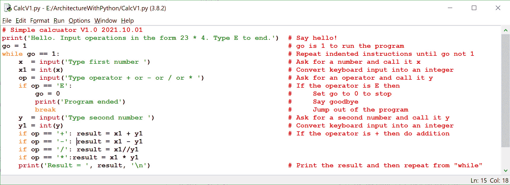
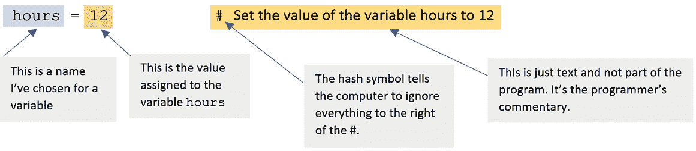
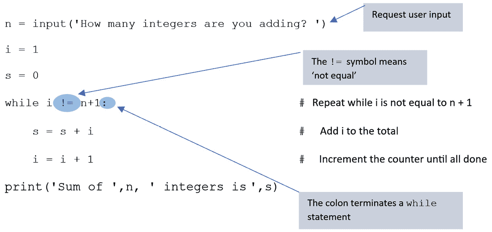
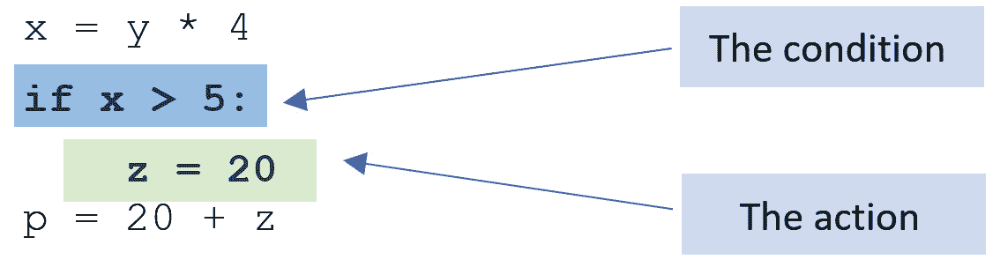
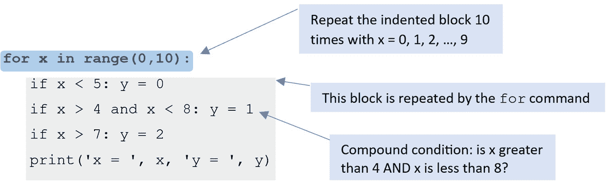
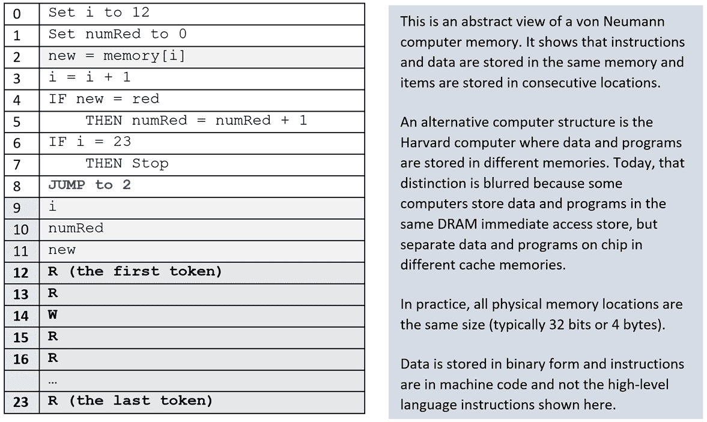
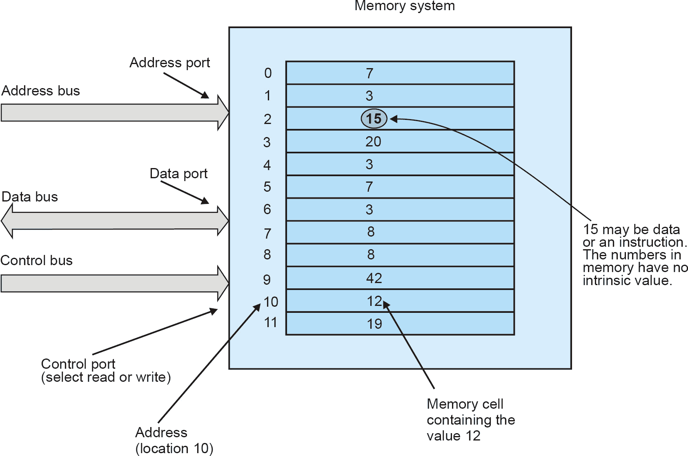
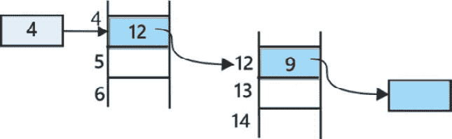
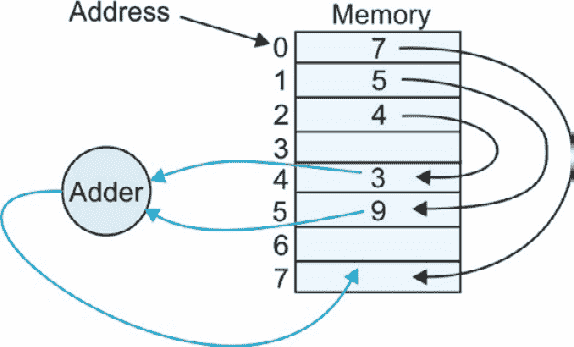

# 第二章：高速 Python 简介

本章介绍了 Python，并演示了如何编写 Python 程序来解决我们在 *第一章* 中描述的问题类型。在本章中，我们不会深入探讨 Python，但我们会足够地介绍 Python，以便您能够模拟和修改计算机以融入您自己的想法。

传统上，计算机程序被比作烹饪菜谱，因为它们是相似的。严格来说，这个陈述只适用于像 Python、Java 和 C 这样的过程式语言。像 Lisp 这样的函数式语言不符合这种严格的顺序范式，并且超出了本文的范围。

菜谱是一系列 *操作*（即动作或步骤）的序列，按照顺序在菜谱中使用的 *原料* 上执行。程序也是如此；它是一系列按照顺序执行的操作（指令）的序列。程序中的指令是按顺序、从上到下逐个执行的，排列得就像一页打印文本。也可以重复执行一组或指令块多次，甚至可以跳过或忽略指令块。

菜谱和程序之间的类比惊人地准确。在菜谱中，您可以有 *条件* 指令，例如，“*如果酱太稠，则添加更多水。*” 在编程中，您可以有条件指令，例如，“*如果 x 为 0，则将 1 加到 y 上。*” 同样，在烹饪中，您可以通过表达式如，“*搅拌混合物直到变硬。*” 来表达重复动作。在计算中，重复可以通过如，“*从 z 中减去 1，直到 z =* *0。*” 这样的结构来表示。

本章我们将涵盖以下主题：

+   阅读程序

+   Python 入门

+   Python 的数据类型

+   数学运算符

+   名称、值和变量

+   注释

+   列表 - Python 的一种关键数据结构

+   Python 中的函数

+   条件操作和决策

+   从文件中读取数据

+   将令牌检测算法转换为 Python

+   计算机内存

+   寄存器传输语言

# 技术要求

您可以在 GitHub 上找到本章使用的程序，链接为 [`github.com/PacktPublishing/Practical-Computer-Architecture-with-Python-and-ARM/tree/main/Chapter02`](https://github.com/PacktPublishing/Practical-Computer-Architecture-with-Python-and-ARM/tree/main/Chapter02)。

编写 Python 程序并运行它的要求非常少。Python 是一种开源语言，可以在 PC、Mac 和 Linux 平台上免费使用。您需要设置计算机系统上的 Python 环境的所有信息都可以在主页 [`www.python.org`](https://www.python.org) 上找到。

令人惊讶的是，您不需要任何其他软件就可以在 Python 中构建计算机模拟器。Python 包自带 Python 的 **集成学习与开发环境**（**IDLE**），它允许您编辑 Python 程序、保存它、运行它和调试它。

除了 IDLE，还有其他替代方案可以让您创建受 Python 平台支持的 Python 源文件。这些替代方案通常更复杂，针对的是专业开发者。在本章中，IDLE 已经足够使用，而且本书中的几乎所有 Python 程序都是使用 IDLE 开发的。

替代 IDE 包括微软的 Visual Studio Code、Thonny 和 Geany。所有这些 IDE 都是免费提供的。Thonny 是为 Raspberry Pi 开发的，我们将在后续章节中使用它：

+   Visual Studio Code:[`code.visualstudio.com/download`](https://code.visualstudio.com/download)

+   Geany:[`www.geany.org/`](https://www.geany.org/)

+   Thonny:[`thonny.org`](https://thonny.org)

对于初学者来说，阅读程序并不容易，因为你不知道如何解释你所看到的内容。以下部分将描述我们在本章中将要使用的一些排版和布局约定，以使程序的意义更加清晰，并突出程序的特点。

# 阅读程序

为了帮助您跟踪程序，我们采用了两种不同的字体——一种变宽字体（其中字母有不同的宽度，如这里的大部分文本）和一种单倍间距字体，如旧式机械打字机上的 Courier 字体 `看起来` `像这样`。

使用单倍间距字体表示代码的原因有两个。首先，它告诉读者这个词是计算机代码，而不仅仅是叙述文本的一部分。其次，在计算机程序中，间距对于可读性很重要，单倍间距字体能够整齐地排列相邻行中的字母和数字，形成列。以下是从后续章节中摘取的代码示例，以说明这一点。右侧带有 # 前缀的按比例间距文本表示该文本不是代码，而是一段普通语言的注释：

```py

elif litV[0]   == '%': literal = int(litV[1:],2)     # If first % convert binary to integer
elif litV[0:2] == '0B':literal = int(litV[2:],2)     # If prefix 0B convert binary to integer
elif litV[0:1] == '$': literal = int(litV[1:],16)    # If $, convert hex string to integer
elif litV[0:2] == '0X':literal = int(litV[2:],16)    # If 0x convert hex string to integer
```

我们偶尔会使用阴影或粗体字体来区分代码片段的不同功能。例如，`x = y.`split('.') 使用粗体字体来强调 `split` 函数。

考虑以下示例。灰色文本表示 Python 中必要的保留词和符号，用于指定此结构。粗体黑体中的数字是程序员提供的值。# 后面的文本使用非单倍间距字体，是计算机忽略的注释：

for i in range (0,6):# 重复六次

在这个例子中，我们使用阴影来强调一个功能——例如，`rS1 = int(inst[2][1])` 将你的注意力引向第一个参数 `[2]`。

# Python 入门

在我们更详细地了解 Python 之前，我们将简要介绍如何开始使用 Python，并演示一个简短的程序。尽管我们还没有介绍语言的基础，Python 程序却非常容易理解。

Python 是一种类似于 C 或 Java 的计算机语言，就像每一种计算机语言一样，它都有其优点和缺点。我们选择使用 Python，因为它免费且通用，有关它的信息量很大，最重要的是，它的学习曲线非常平缓。实际上，Python 已经成为计算机科学教育中最受欢迎的语言之一。

Python 是由荷兰计算机科学家 Guido van Rossum 构思的，稳定的 Python 2.0 版本于 2000 年发布。今天，Python 由 Python 软件基金会推广，这是一个志愿者的组织，其目标是将其作为公共服务来发展语言。

文本中的高级语言程序是在 PC 上用 Python 编写的。要安装 Python，您需要访问其主页[`www.python.org`](https://www.python.org)并遵循说明。由于 Python 不断增长，因此有多个版本。两个主要分支是 Python 2 和 Python 3；我将使用后者。Python 不断更新，并引入了新版本。我最初使用 Python 3.6，在撰写本文时，我们已达到 Python 3.11。然而，新的增量版本并没有带来根本性的变化，而且许多新特性在本书的 Python 版本中并未使用。

加载 Python 包为您提供了 Python 文档库、Python 解释器和名为 IDLE 的 Python 编辑器。所有这些都是免费提供的。IDLE 允许您进行一个循环，*编辑程序、运行它并进行调试*，直到您对结果满意。我还使用了免费提供的 Thonny IDE，我发现它甚至更容易使用。使用 IDE 可以让您开发程序、运行它，然后修改它，而无需在单独的编辑器、编译器和运行时环境之间切换。

在本书写作的后期，Graeme Harker 向我介绍了**Visual Studio Code**（**VS Code**）。这是一个由微软开发的流行的集成开发系统，支持包括 Python 在内的多种语言，并在包括 Windows、Linux 和 macOS 在内的多个平台上运行。VS Code 确实是一个非常强大的 IDE，并包括超越 IDLE 的功能。

考虑到*图 2**.1*中的 IDE（在这种情况下，IDLE）的例子。假设我们想要创建一个四功能计算器，它可以执行简单的运算，如 23 x 46 或 58 - 32。我选择这个例子，因为它实际上是一个非常简单的计算机模拟器。*图 2**.1*是在使用`file`函数加载 Python 程序后所截取的屏幕截图。您也可以直接从键盘输入 Python 程序。

如果我们点击`+`、`-`、`/`或`*`，它将终止执行并打印一条消息。

与大多数高性能 IDE 系统一样，IDLE 使用颜色来帮助你阅读程序。Python 允许你在程序中添加注释，因为代码并不总是容易理解。任何跟随 # 符号的文本都会被忽略。在这种情况下，代码是可理解的，这些注释是不必要的。

在运行程序之前，你必须保存它。从 `IDLE` 保存程序会自动追加 `.py` 扩展名，因此名为 `calc1` 的文件将被保存为 `calc1.py`。



图 2.1 —— IDLE 中 Python 程序的截图

*图 2.1* 展示了 Python 编程的布局，包括至关重要的 *缩进*，这是 Python 的一个关键特性，它指示哪些操作属于特定的命令。

下面是这个程序的简要描述。我们将在稍后更详细地介绍这些内容。`while` 关键字引导一组缩进的指令，这些指令会一直重复执行，直到某个条件不再为真。在这种情况下，只要 `go` 变量是 `1`，指令就会执行。

`if` 语句定义了一个或多个在 `if` 为真时执行的运算。在这种情况下，如果输入是 `'E'`，则 `go` 变量被设置为 `0`，并且 `while` 后面的缩进操作不再执行。

`break` 指令会跳出 `while` 循环（即，执行会继续到循环的末尾——它是一种短路机制）。

最后，`int(x)` 函数将键盘字符转换为整数——例如，`int('27')` 将两个键，`2` 和 `7`，转换为整数 `27`。我们将在稍后更详细地讨论这些内容。

要运行程序，你选择 `F5` 键。以下演示了运行此程序的效果。粗体的文本是我使用键盘输入的：

```py

Hello. Input operations in the form 23 * 4\. Type E to end.
Type first number 12
Type operator + or - or / or * +
Type second number 7
Result =  19
Type first number 15
Type operator + or - or / or * -
Type second number 8
Result =  7
Type first number 55
Type operator + or - or / or * /
Type second number 5
Result =  11
Type first number 2
Type operator + or - or / or * E
Program ended
```

这个简短演示的目的是展示如何输入和执行 Python 程序。实际上，没有程序员会编写前面的代码。这是低效的。它没有处理错误（如果你输入 `@` 而不是 `*`，或者 `$` 而不是 `4` 会发生什么？）。更糟糕的是，为了停止程序，你必须在输入 `E` 结束程序之前输入一个虚拟数字。我将这个任务留给你，将这个程序转换为更用户友好的版本。

我们已经演示了一个简单的 Python 程序。下一步是介绍 Python 操作的数据——也就是说，我们展示 Python 如何处理数字和文本。

# Python 的数据类型

一个食谱使用的是属于不同组分的 *原料*（水果、蔬菜、坚果、奶酪、香料等）。计算机程序使用的是称为 *类型* 的数据。Python 使用的某些主要数据类型如下：

+   **整数**：这使用的是整数，例如 0、1、2 等等。整数还包括负数 -1、-2、-3 等等。正整数也被称为自然数。

+   **浮点数**：这些是带有小数点的数字（例如，23.5 和-0.87）。这些也被称为*实数*。令人惊讶的是，我们在这篇文本中不会使用实数。

+   **字符**：字符是计算机键盘上的一个键——例如，*Q*、*Z*、*a*、*$*和*@*。计算机语言通常通过将字符放在引号中来表示它——例如，`'R'`。实际上，Python 没有显式的字符类型。

+   `'This'`或`'my program'`。Python 没有字符类型，因为它将字符视为长度为 1 的字符串。Python 允许你单引号或双引号互换使用——例如，`x = 'this'`和`x = "this"`在 Python 中是相同的。这种机制允许你输入`x = ''The boy’s books''`（即，你可以使用撇号而不会被当作引号处理）。在计算机科学中，术语*字符串*类似于英语中的*单词*。字符串是任何字符序列——例如，`'time'`和`'!££??'`是合法的 Python 字符串。回想一下，长度为 1 的字符串是一个单个字符——例如，`'Q'`。你可以有一个长度为零的字符串——也就是说，`''`。这里，你有两个引号之间没有任何内容。这表示一个空字符串。

+   `True`和`False`。布尔类型用于布尔逻辑表达式。它也用于比较——例如，英语表达式，“*x*是否大于*y*？”有两个可能的结果——True 或 False。如果你在 Python 中输入`print(5 == 5)`，它将打印 True，因为`==`意味着“*是否相同？*”，结果是 True。

在程序中使用的每个数据元素都会被赋予一个*名称*，这样我们就可以访问它。程序员为变量选择名称，一个好的程序员会选择有意义的名称来表示变量的含义。没有人会称一个变量为`qZz3yT`。名称必须以字母开头，然后可以跟任何字母和数字的序列——例如，`alan`、`alan123`和`a123lan`是合法的 Python 名称，而`2Alan`或`Al@n`则不是合法的。然而，名称中可以使用下划线——例如，`time_one`。按照惯例，Python 使用小写字母作为变量和函数名称的第一个字符。大写字母开头保留用于类名称（在本文本中我们将不会使用）。这种限制是一种编程约定——也就是说，如果你给变量起一个以大写字母开头的名称，不会发生错误。

现在我们已经介绍了数据元素，接下来我们将描述一些可以应用于数值数据的操作。这些操作本质上是我们高中时遇到的算术运算符，除了除法，它有三种变体。

# 数学运算符

计算机可以执行四种标准的算术运算——加法、减法、乘法和除法。例如，我们可以写出以下内容：

```py

X1 = a + b    Addition
X2 = a – b    Subtraction
X3 = a * b    Multiplication
X4 = a / b    Division
```

乘号的符号是***（星号）*，而不是传统的*x*。使用字母*x*来表示乘法会导致字母*x*和乘法运算符*x*之间的混淆。

除法比乘法更复杂，因为表达 x ÷ y 的结果有三种方式。例如，15/5 等于 3，结果是一个整数。17/5 可以有两种表达方式——作为一个分数值（即浮点数）3.4，或者作为 3 余 2。在 Python 中，如果结果不是整数，除法运算符会提供一个浮点数结果（例如，100/8 = 12.5）。

除了除法运算符 / 之外，Python 还有两个其他除法运算符——`//` 和 `%`。

Python 的 `//` 是一个*地板整数*除法，通过向下取整生成一个整数结果。例如，操作 `x = 17//5` 得到的结果是 `3`，小数部分（余数）被舍弃。注意，`x = 19//5` 得到的结果是 `3`，因为它*向下取整*，尽管 4 是最接近的整数。如果你执行 `x = -19//5`，那么结果将是 `-4`，因为它*向下取整*到最接近的整数。

% 符号是*模数*运算符，提供除法后的余数。例如，`x = 17%5` 得到的结果是 `2`。假设，周一有人说他将在 425 天后拜访你。那将是星期几？425%7 是 5，这表示星期六。我们可以使用 % 来测试一个数字是奇数还是偶数。如果你写 `y = x%2`，那么如果数字是偶数，`y` 是 `0`，如果是奇数，`y` 是 `1`。

# 名称、值和变量

计算机在它们的内存中存储数据。每个数据元素都与两个值相关联——**它在哪**，以及**它是什么**。在计算机术语中，“在哪”对应于数据在内存中的位置（地址），而“它是什么”对应于该数据的值。这并不是什么火箭科学，这与日常生活相符——例如，我可能有一个账号编号为 111023024，里面有 890 美元。在这里，111023024 是“在哪”，而 890 美元是“它是什么”。

现在，假设我写 111023024 + 1。我究竟是什么意思？我是想将 1 加到账号编号上得到 111023025（这是一个不同的账号），还是想将 1 美元加到编号为 111023024 的这个账号中，得到 891 美元？在日常生活中，这是如此明显，以至于我们甚至没有考虑过。在计算机中，我们必须更加小心，并清楚地思考我们在做什么。

数据元素被称为**变量**，因为它们的值可以改变。变量在内存中有一个地址（位置）。程序员不必担心数据的实际位置；操作系统会自动为他们处理。他们只需要为变量想一个名字。例如，让我们看看以下：

```py

totalPopulation = 8024
```

当你写下这段代码时，你定义了一个名为`totalPopulation`的新变量，并告诉计算机在该位置存储数字`8024`。你不必担心完成此操作所涉及的所有动作；那是操作系统和编译器的工作。

让我们总结一下。变量是一个名称，它指向存储在内存中的某个值。假设你写下以下内容：

```py

totalPopulation = totalPopulation + 24
```

这里，计算机读取分配给名称`totalPopulation`的内存位置中的当前值。然后，它将 24 加到这个值上，最后将结果存储在`totalPopulation`中。

在下一节中，我们将更详细地探讨用户注释和程序布局。

# 注释

由于计算机语言可能对人类读者来说既简短又令人困惑，它们允许你添加计算机忽略的注释（即，它们不是程序的一部分）。在 Python 中，同一行中跟随`#`符号的任何文本都会被忽略。在以下示例中，我们将该文本放在不同的字体中以强调它不是程序的一部分。首先，考虑以下 Python 表达式：

```py

hours = 12           # Set the value of the variable hours to 12
```

这段代码创建了一个名为`hours`的新数据元素，并给它赋了整数值`12`。*图 2**.2*展示了这一行的结构。



图 2.2 – 带注释的语句结构

假设你随后写下以下内容：

```py
allTime = hours + 3    # Add 3 to the hours and assign a result to a new variable, allTime
```

然后，计算机将读取表达式右侧名称（即`hours`）的值，并用 12 替换其值。然后，它会加 3 得到 12 + 3 = 15，并将这个新值存储在名为`allTime`的内存位置中。`#`后面的文本被计算机忽略，仅用于帮助人类理解程序。

许多计算机语言使用`=`符号的方式与我们高中所学的方式不同。在学校代数中，`=`表示“*等于,*”，所以*x* = *y* + 2 意味着*x*和(*y* + 2)的值是相同的。如果*y*的值是 12，那么*x*的值就是 14。

在编程中，语句`x = y + 2`表示计算*y* + 2 的值并将其*转移*到*x*。如果一个程序员写下`x = x + 2`，这意味着要将 2 加到*x*上。如果这是一个数学方程式，我们可以写成*x* – *x* = *x* – *x* + 2，这简化为无意义的表达式 0 = 2。在 Python 中，`=`符号并不表示等于！

在 Python 中，`=`符号表示“*赋值*”。一个更好的符号是`←`，这样*x* `←` *y* + 2 就能清楚地表达我们所做的操作。一些语言，如 Pascal，使用符号对`:=`来表示赋值。遗憾的是，回箭头不在键盘上，我们只能坚持使用`=`。请注意，在 Python 中，一个*语句*是一个命令，如`print(`)或一个赋值，如`x = 4.`。一个*表达式*是由变量或值和操作组合而成，返回一个结果。

正如我们所见，Python 有一个特殊的符号表示“*等于*”，这个符号是‘==’。永远不要混淆=和==。很容易写成`if x = 5`而不是`if x == 5`，然后 wonder 为什么你的程序给出了错误的结果。

考虑以下简单的 Python 程序示例，其中我们计算圆的面积。名称`radius`、`pi`和`area`都是由程序员选择的。我们也可以使用其他名称，但这些对读者来说更直观：

```py

radius = 2.5                # Define the radius as 2.5
pi = 3.142                  # Define the value of pi
area = pi*radius*radius     # Calculate the area of a circle
print(area)                 # The print function prints the value of the area on the display
```

回想一下，Python 的名称由字母和（可选的）数字以及下划线组成，但名称中的第一个字符必须是字母而不是数字。在 Python 中，大写和小写字母被视为不同——也就是说，`tesT22`和`test22`是不同的名称。选择有意义的名称是一种良好的实践，因为这使得阅读程序更加容易。考虑以下示例：

```py

wagesFred = hoursWorkedFred*12 + hourOvertimeFred*18
```

前面的表达式对人类读者来说可能有些冗长，但很清晰。这是一个*骆驼命名法*的例子，这是一种用于没有空格连接的单词的流行术语，使用大写字母来表示链中的每个单词，例如`asWeAreDoingNow`。记住，Python 的变量和标签不以大写字母开头（这是一个约定而不是要求）。

数据元素分为两类——常量和变量。一个**常量**在首次命名时被赋予一个值，并且该值不能被更改——例如，如果你在 C 语言等语言中将`x = 2`定义为常量，则*x*的值是固定的（例如，表达式`x = 3`将是非法的）。一个**变量**是可以被修改的元素。Python 不支持常量。

让我们计算前*n*个整数的和，*s* = 1 + 2 + 3 + … + *n*。代数告诉我们，*n*个整数的和是*n*(*n* + 1)/2。我们可以将其转换为以下 Python 程序：

```py

n = int(input("How many integers are you adding? "))
s = n * (n + 1)/2
print("Sum of ",n, " integers is",s)    # We used double quotes " instead of single
```

这三个 Python 程序行请求一个整数，执行计算，并打印结果。假设我们不知道前*n*个整数的和的公式。我们可以通过逐个相加来硬算。完成这个任务的 Python 代码在*列表 2.3*中给出。

我们还没有详细涵盖这个程序的所有方面。这里给出是为了展示 Python 的基本简单性。然而，请注意，Python 允许你同时从键盘请求输入并提供提示。



图 2.3 - 一个用于计算前 n 个整数的 Python 程序

我们接下来要介绍 Python 的关键元素之一——一个功能强大且灵活的特性，这使得 Python 成为一门流行的语言，尤其是对于初学者。我们将描述列表。

## 列表——Python 的关键数据结构

现在我们介绍 Python 的*列表*，它将一系列元素组合在一起。我们展示了如何访问列表的元素。由于列表是一个关键特性，我们将多次回到它，每次都介绍新的特性。

数据结构是有序数据元素的集合。术语*有序*表示数据元素的位置很重要——例如，在日常生活中，一周是有序的，因为天数的顺序是固定的。*表格*、*栈*、*队列*、*列表*、*堆*、*堆叠*、*文件*和*数组*都体现了数据结构的概念。在英语中，*一袋*书意味着一个*无序*的物品集合。Python 确实有一个专门用于无序项的特殊数据结构，称为集合。在本章中，我们不会使用集合。

就像任何其他对象一样，程序员会给列表赋予一个名称。以下 Python 列表给出了一个学生连续八次考试成绩的结果，以百分比表示：

```py

myTest = [63, 67, 70, 90, 71, 83, 70, 76]
```

我们已经给列表起了一个有意义的名称，`myTest`。在 Python 中，列表用方括号括起来，项目之间用逗号分隔。列表可以增长（向其中添加项目）和缩小（从中删除项目）。你可以有一个空列表——例如，`abc = []`。

列表的全部意义在于能够访问单个项目并对其进行操作——例如，我们可能想要找到最高分或最低分，或者在`myTest`列表中找到平均值。因此，我们需要指定一个项目的位置。数学家使用*下标*来完成这项任务——例如，他们可能会写`myTest`5。不幸的是，计算机科学是在机械信使打字机脚本黑暗时代出现的，当时没有不同的字体、颜色、斜体样式和下标。因此，我们必须使用所有键盘上都有符号来表示列表中的位置。

Python 通过*括号*来表示列表（或其他数据结构）中一个项目的位置——例如，`myTest`中的第 3 个元素表示为`myTest[3]`。列表的第一个元素位置是 0，因为计算机从 0 开始计数。`myTest`中的第一个值是`myTest[0]`，即 63。同样，最后一个结果是`myTest[7]`，即 76。我们共有 8 个结果，编号从 0 到 7。

Python 比某些语言更灵活。在 Python 中，列表是一个“*通用的*”数据结构。如果你想在列表中放置不同类型的项，你可以这样做。其他计算机语言要求列表中的项必须是相同的（例如，所有整数、所有浮点数或所有字符串）。以下示例展示了 Python 中一些合法的列表。正如你所见，你甚至可以有一个列表的列表：

```py

roomTemps = [15,17,14,23,22,19]                       # A list of six integers
words     = ['this', 'that', 'then']                  # A list of three strings
x47       = [x21,timeSlot,oldValue]                   # A list of three variables
opCodes   = [['add',3,4],['jmp',12,1],['stop',0,0]]   # A list of three lists
mixedUp   = [15,time,'test',x[4]]                     # A list of mixed elements
```

```py
inputs    = []                                        # An empty list
```

注意，我们在左边列中对*等号*进行了对齐。这不是 Python 的特性，也不是必需的。我们这样做是为了使代码更容易阅读，并使调试更容易。

让我们回到购物清单的例子，并将这个列表命名为`veg1`。我们可以用以下方式设置这个列表：

```py

veg1 = ['potatoes', 'onions', 'tomatoes']         # A list of three strings
```

这个列表中的各个项目都在引号中。为什么？因为它们是字符串——即文本。如果没有引号，项目将引用之前定义的变量，如下所示：

```py

opClass = 4                      # Define opClass
addOp   = ['add', opClass]       # A list with an instruction name and its class
```

## 切片列表和字符串

在这里，我们将演示如何从一个字符串或列表中提取数据元素（即切片）。字符串的各个字符可以访问——例如，如果 `y = 'absde'`，那么 `y[0] = 'a'，y[1]= 'b'，y[2]= 's'`，以此类推。

Python 允许您使用 -1 *索引* 选择字符串或列表中的最后一个元素——例如，如果您写 `x = y[-1]`，则 `x = 'e'`。同样，`y[-2]` 是 `'d'`（即倒数第二个）。

您可以使用 `list[start:end]` 符号选择字符串或列表的切片。由 `[start:end]` 指定的切片选择从 `start` 到 `end - 1` 的元素，即，您指定的结束是所需最后一个元素之后的元素。如果 `q = 'abcdefg'`，那么 `r = q[2:5]` 切片将 `r` 赋值为 `'cde'`。

表达式 `z = q[3:]` 指的是从 3 到列表末尾的所有元素，并将 `'defg'` 赋值给 `z`。这是一个非常实用的特性，因为它允许我们从文本字符串，例如 `s='R14'` 中提取寄存器的数值，使用 `t=int(s[1:])`。表达式 `s[1:]` 返回从第二个字符到末尾的子字符串——即，"`R14`" 变成 "`14`"。这个值是一个字符串类型。`int('`14`')` 操作将字符串类型转换为整数类型并返回 14。

`len` 函数返回字符串的长度。如果 `y='absde'`，则 `p=len(y)` 返回 5，因为字符串中有 5 个字符。

考虑一个汇编语言指令列表 `– ops=['ADD',` `'MUL',` `'BNE',` `'LDRL']`。如果我们写 `len(ops)`，我们得到结果 `4`，因为 `ops` 列表中有 4 个字符串。假设我们写 `x=ops[3][2]`。`ops[3]` 的值是 `'LDRL'`，而 `LDRL[2]` 的值是 '`R`'。换句话说，我们可以从字符串列表中提取一个或多个字符。`x[a][b]` 的表示法意味着取列表 `x` 中的项目 `a`，然后取该元素的项 `b`。

我们已经使用了 `print()` 和 `len()` 这样的函数。现在我们将更详细地讨论函数。稍后，我们将向您展示如何定义自己的函数以及如何使用 Python 的内置函数。

# Python 中的函数

在继续之前，我们需要介绍高级语言中函数的概念。在高中数学中，我们遇到像 *sqrt(x)* 这样的函数，它是 *square root* 的缩写，并返回 *x* 的平方根——例如，*sqrt(9) = 3*。计算机语言借鉴了同样的概念。

Python 提供了语言内置的函数。你调用一个函数来执行特定的操作（这在现实世界中有点像分包）——例如，`len()`操作字符串和列表。如果你用列表`x`调用`len(x)`，它将返回该列表中的项目数量。考虑以下情况：

```py

toBuy = len(veg1)    # Determine the length of list veg1 (number of items in it)
```

这将我们称为`veg1`的列表中的项目数量取出来，并将该值复制到`toBuy`变量中。执行此操作后，`toBuy`的值将是整数 3，因为`veg1`中有 3 个项目。

假设你写下以下内容：

```py

q = 'abcdefgh'
print(len(q))
```

然后，打印的数字是 8，因为字符串`q`中有八个字符。

假设我们还有另一个食物项目的列表：

```py

fruit1 = ['apples', 'oranges', 'grapes', 'bananas']
```

让我们把两个列表中的项目数量加起来。我们可以用以下方法做到：

```py

totalShopping = len(veg1) + len(fruit1)
```

这个表达式计算两个列表的长度（分别得到整数`3`和`4`），将它们相加，并将值`7`赋给`totalShopping`变量。你可以通过使用`print()`函数在屏幕上打印这个值：

```py

print('Number of things to buy ', totalShopping)
```

这个表达式由 Python 单词`print`组成，它在屏幕上显示某些内容。`print`使用的参数被括号包围，并用逗号分隔。用引号括起来的参数是一个字符串，并且按原样打印。记住，Python 允许你使用单引号或双引号。变量参数按其值打印。在这种情况下，`totalShopping`参数的值是`7`。这个表达式将显示以下内容：

```py
Things to buy 7
```

考虑以下表达式（我们已用阴影标出要打印的文本）。将要打印的变量值用粗体表示以增强理解：

`print('`Total items to buy`',` totalShopping`, '`These are: `',` fruit1`)`

这会打印什么？输出将是以下内容：

```py

Total items to buy 7 These are: ['apples', 'oranges', 'grapes', 'bananas']
```

这就是你预期的结果吗？你可能期望看到一个按苹果、橙子、葡萄顺序排列的列表。但你所要求的是`fruit1` Python 列表，这正是你得到的结果（这就是为什么有括号，列表中每个项目周围都有引号）。如果我们想以`apples, oranges, grapes, bananas`的形式打印列表，我们首先必须将字符串列表转换成一个单独的字符串项（我们稍后会讨论）。然而，对于你们中间的急躁者，这里是如何使用`join()`函数完成的：

```py

fruit1 = ['apples', 'oranges', 'grapes', 'bananas']
print('Fruit1 as list = ', fruit1)
fruit1 = (' ').join(fruit1)                # This function joins the individual strings
print('Fruit1 as string = ', fruit1)
```

这段代码的输出如下：

```py

Fruit1 as list =  ['apples', 'oranges', 'grapes', 'bananas']
Fruit1 as string =  apples oranges grapes bananas
```

接下来，我们将讨论使计算机成为计算机的非常项目——根据测试结果选择两个或更多可能行动路线的条件操作。

# 条件操作和决策

现在是时候讨论大问题——条件操作。让我们考虑以下食谱：

1.  拿两个鸡蛋。

1.  分离蛋白。

1.  加入糖。

1.  打发至发硬。

这些动作是按顺序执行的。前三个动作是简单的操作。第四个动作与前三个非常不同，正是这个动作赋予了计算机其力量。这是一个根据测试结果执行两种动作之一的操作。在这种情况下，鸡蛋被搅拌，然后测试。如果它们不够硬，搅拌会继续，然后重新测试，依此类推。

计算机之所以强大，是因为它具有做出决策的能力。如果没有 *决策能力*，计算机就无法对其环境做出反应；它只能反复执行相同的计算。人类智能的基础也是决策。如果你下棋，你会根据当前的棋盘位置做出决策，选择下一步棋。你所做的选择是给你从当前情况下赢得最佳机会的那一步。

计算机也是如此。在任何程序点，计算机都可以被赋予两种不同的行动方案。根据测试的结果，计算机选择其中一种行动方案，然后执行相应的操作。

典型的条件操作是 `if` 语句。在 Python 中，这可以表示为以下：

```py

z = 9                        # Set z to 9
if x > 5: z = 20           # If x is greater than 5, then make the value of z equal to 20.
```

我们将条件加粗，动作被阴影覆盖。如果条件为真，则执行动作；如果条件不为真，则忽略动作。例如，如果 *x* 是 6，则 *z* 的值将是 20。如果 *x* 是 4，则 *z* 的值将保持为 9。

计算机执行简单的测试，其结果为两个布尔值之一，`True` 或 `False`。通常，测试会问，“*这个变量是否等于零？*”

在 Python 中，`if` 语句具有以下形式：

```py

if condition: action         # The colon is mandatory, and indicates the end of the condition
```

Python 中只有两个保留元素，即 `if` 和冒号。术语 `condition` 是任何返回 `True` 或 `False` 值的 Python 表达式，而 `action` 是计算机在条件为 `True` 时将执行的一组指令。一些程序员将动作放在新的一行上。在这种情况下，动作**必须**缩进，如下所示 *图 2**.4*：



图 2.4 – 一个用于计算前 n 个整数的 Python 程序

虽然 Python 允许你使用任何缩进，但良好的实践建议使用四个空格进行缩进。

条件是 `x > 5`，动作是 `z = 20`。条件是一个布尔逻辑表达式，它产生两种结果之一——如果 *x* 大于 5 则为 True，如果 *x* 不大于 5 则为 False。

## 在 Python 中使用条件表达式

一个用于控制房间温度的 Python 程序可能看起来像这样：

```py

cold = 15                        # Define the temperature at which we turn on the heater
hot = 25                         # The temperature at which we turn on the cooler
nowTemp = getTemp()              # getTemp() is a function that reads the thermometer
if nowTemp < cold: heat(on)      # If too cold, then turn on the heater
if nowTemp > hot:  cool(on)      # If too hot, then turn on the cooler
if nowTemp > cold: heat(off)     # If not cold, then turn off the heater
if nowTemp < hot:  cool(off)     # If not hot, then turn off the cooler
```

常见的布尔条件如下：

```py

x == y
x != y
x >  y
x <  y
```

这四个条件分别是等于、不等于、大于和小于。记住，表达式*x == y*读作“*x 等于 y 吗？*”考虑以下示例（使用 Python IDLE 解释器）：

```py

>>> x = 3
>>> y = 4
>>> x == y
False
>>> x + 1 == y
True
```

### `if`语句的示例

变量*x*在 0 到 9 之间变化。假设我们想如果*x*小于 5，则*y*为 0；如果*x*大于 4 且小于 8，则*y*为 1；如果*x*大于 7，则*y*为 2。我们可以这样表示：

```py

if x < 5: y = 0
if x > 4 and x < 8: y = 1    # A compound test. Is x greater than 4 AND x is less than 8
if x > 7: y = 2
```

第二个`if`语句通过使用`and`运算符同时测试两个条件。只有当两个条件`x > 4`和`x < 8`都为真时，整个表达式才为真。

我们还可以使用 Python 的`or`运算符，这意味着如果任何条件为真。你可以编写如下复杂条件：

```py
if (x > 4 and x < 8) or (z == 5): y = 1
```

正如传统的算术一样，必须使用括号来确保操作按适当的顺序执行。

我们可以通过生成*x*的连续值并打印相应的*y*值来测试此代码，正如*图 2.5*中所示。第一条语句执行缩进的块，当*x*为 0 到 9（比给定的范围少一个）时：



图 2.5 – 迭代演示

此代码的输出如下：

```py

x =  0 y =  0
x =  1 y =  0
x =  2 y =  0
x =  3 y =  0
x =  4 y =  0
x =  5 y =  1
x =  6 y =  1
x =  7 y =  1
x =  8 y =  2
x =  9 y =  2
```

## Python 的 if … else

前面的代码是正确的，但效率不高。如果第一个`if`的结果为真，其他`if`语句就不可能为真，但它们仍然被测试。我们需要的是一个测试，如果它是真的，我们就执行相应的操作。如果不是真的，我们就执行不同的操作。在英语中，我们有一个词来表示这个——它被称为“else”：

考虑以下内容：

```py

if   x < 5:          # Is x less than 5?
     y = 0           # If x is less than 5, then y = 0
else:
```

```py
     y = 3           # otherwise, y is 3
```

Python 有一个`elif`（else if）语句，允许进行多个测试。我们可以使用`elif`在第一个`if`的结果为假时执行另一个`if`。考虑使用`elif`的前面代码：

```py

if   x < 5:                # Is x less than 5?
     y = 0                 # If x is less than 5, then y = 0
elif x > 4 and x < 8:      # If x is not less than 5, test whether it's between 5 and 7
     y = 1                 # If x is between 5 and 7, then set y to 1
elif x > 7:                # If both previous tests fail, then test whether x is 8 or more
     y = 2
print('x and y ', x, y)
```

在这种情况下，计算机一旦其中一个条件测试为真，就会退出这个结构。它与使用`if`语句的前一个示例完全一样，但更高效，因为它一旦满足条件就终止。也就是说，一旦任何测试结果为真，就执行其关联的操作，然后控制传递到`if … elif`序列之后的下一个语句（在这种情况下，`print`）。

编程的伟大之处在于，做同样的事情有很多种方法。假设我们知道一个变量*x*始终在 0 到 10 的范围内，并且我们想知道每个*x*对应的*y*值（使用前面的算法）。我们可以通过使用条件语句和编程来像以前一样计算*y*的值。

我们可以通过创建一个提供任何*x*的*y*值的*查找表*来实现算法，而不使用`if`语句。让我们称这个表为`lookupY`，并为其加载从 0 到 10 的*x*输入的*y*值。*表 2.1*给出了每个可能的*x*的*y*值。

| **输入 x** | **输出 y** |
| --- | --- |
| 0 | 0 |
| 1 | 0 |
| 2 | 0 |
| 3 | 0 |
| 4 | 0 |
| 5 | 1 |
| 6 | 1 |
| 7 | 1 |
| 8 | 2 |
| 9 | 2 |
| 10 | 2 |

表 2.1 – 使用查找表执行布尔运算

我们可以在 Python 中用两行代码来编写这个 `lookup` 操作：

```py

lookup  = [0,0,0,0,0,1,1,1,2,2,2]      # Create a lookup table
y = lookup[x]                          # Read the value of y from the lookup table
```

当我们模拟计算机时，我们需要加载要模拟的程序。下一节将描述我们如何从内存中读取源文件（文本格式）到模拟器中。

## 从文件中读取数据

在测试汇编器或模拟器时，你需要输入测试数据（源程序）。这可以通过三种方式完成。

+   在程序中包含数据 - 例如，`myProg = ['add r1,r2', 'inc r1', '``beq 7']`

+   从键盘获取文本 - 例如，`myProg = input('Type` `program ')`

+   在内存中创建一个文本文件并从你的程序中读取它

前两种技术非常适合测试非常短的程序，但对于长源程序来说则不太适用。第三种技术意味着你使用你喜欢的文本编辑器编写源代码，将其保存为 `.txt` 文件，然后在汇编器中读取该文件。

在开发工作中，我经常在我的汇编器中放置测试程序的名称，以避免输入名称（因为我大部分时间都在处理相同的源文件）。假设我的文件名为 `c.txt`：

```py

myFile = 'E:/simPython/c.txt'          # This is my source text file on my computer
with open(myFile,'r') as sFile:        # Open the file for reading (indicated by 'r')
    newFile = sFile.readlines()        # Read the code and copy to newFile.
```

在前面的代码中，`myFile` 变量提供了源文件名称作为字符串。然后，`with open` 操作打开并读取 `myFile`。此操作在使用后也会关闭文件。前面的代码以读取模式打开 `c.txt` 并创建一个新的文件 `sFile`。

`open` 函数可以用以下三种方式使用：

```py

open('thisFile')                       # Open a file
open('thatFile', 'r')                  # Open a file for reading
open('thatFile', 'w')                  # Open a file for writing
```

在使用文件后关闭文件是一个好习惯，使用 `filename`.`close()`。因为 `with open` 操作在操作结束时自动关闭文件，所以不需要调用 `close()` 函数。

`readlines()` 函数对 `sFile` 进行操作以创建一个包含我的源代码行列表的文件，`newFile`。以下代码片段演示了从磁盘读取文件并清理文本文件中的行尾序列。这是因为文本文件是以每行末尾的 `'\n'` 序列存储的，而这个序列必须被移除，因为它不是源程序的一部分。我们将在稍后回到字符串处理：

```py

#                                               # Test reading a file
with open("E:\simPython.txt",'r') as example:   # Open the file for reading
    theText = example.readlines()               # Read the file example
print('The source file ',theText)               # Display the file
for i in range(0,len(theText)):                 # This loop scans the file
    theText[i] = theText[i].rstrip()            # rstrip() removes end-of-file markers
print('The source file ',theText)
```

以下是从该代码输出的内容。你可以看到 `‘*`\n`’*` 序列已经被移除：

```py

%Run testRead.py
The source file  ['# test file\n', 'NOP\n', ' LDRL 5\n', ' NOP\n', 'STOP']
The source file  ['# test file', 'NOP', ' LDRL 5', ' NOP', 'STOP']
```

我们已经提供了足够的信息来演示一个简单的 Python 程序，该程序实现了我们之前描述的简单序列检测器。

### 将令牌检测算法翻译成 Python

我们可以轻松地将我们的伪代码转换为检测读/写令牌流中的红色令牌序列，如下所示。在这个 Python 片段中，你被邀请首先输入要检测的红色令牌的数量，然后输入 `r` 或 `w` 以指示每个令牌的颜色。一旦检测到适当的令牌数量，程序就会终止：

```py

# Simple algorithm to detect consecutive tokens
maxRed = int(input("How many red tokens are you looking for? "))
go = 1
numRed = 0
while go == 1:
    y = input("Which token is it? Red or white? ")
    if y == 'w': numRed = 0
    else:        numRed = numRed + 1
    if numRed == maxRed: go = 0
```

```py
print(maxRed, "Reds found")
```

这个程序对我输入的序列输出的结果是以下内容：

```py

How many red tokens are you looking for? 3
Which token is it? Red or white? r
Which token is it? Red or white? r
Which token is it? Red or white? w
Which token is it? Red or white? r
Which token is it? Red or white? w
Which token is it? Red or white? w
Which token is it? Red or white? w
Which token is it? Red or white? r
Which token is it? Red or white? r
Which token is it? Red or white? r
3 Reds found
```

计算机有三个基本元素——一个执行所有算术和逻辑运算的**算术逻辑单元**（**ALU**），一个存储程序和数据的内存，以及一个从内存读取指令并执行它们的控制单元。在下一节中，我们将介绍一些内存的基本概念。

# 计算机内存

现在，我们将介绍**内存的概念**，即存储程序和数据的机制。实际或**物理**内存以 DRAM、闪存和硬盘驱动器实现。这部分内存是计算机硬件的一部分。本书不涉及物理内存。相反，我们将讨论**抽象内存**以及它是如何由 Python 建模的。这是程序员的内存视图。

所有数据都存储在物理内存中，程序员设计的所有数据结构都必须映射到物理内存上。映射过程是操作系统的任务，本书不涉及将抽象内存地址转换为实际内存地址的转换。

考虑以下 Python 列表：

```py

friends = ['John', 'Jenny', 'Rumpelstiltskin']
```

这三个字符串在`friends`列表中分别有`[0]`、`[1]`和`[2]`地址。操作系统将这些元素映射到物理内存存储位置。这些字符串各自需要不同数量的物理内存位置，因为它们的长度不同。幸运的是，计算机用户不必担心这些。这是操作系统的任务。

现在，我们将简要地看一下内存的概念，因为您必须理解内存的本质，才能理解计算机是如何工作的，以及如何编写汇编语言程序。

首先，考虑我们自己的记忆。人类的记忆是一种奇怪且**不精确**的东西。一个**事件**会触发我们回忆或**检索**一个我们称之为**记忆**的数据元素。这个事件可能是一个某人问你的问题，或者可能是一件提醒你过去发生的事件。通常，我们只部分地记住信息，甚至可能记错。

人类的记忆似乎是通过将事件与存储的信息进行匹配来访问的。也就是说，我们的记忆是**关联的**，因为我们把一个记忆与另一个记忆联系起来。计算机的内存以非常不同的方式运行，最好将其视为一个**表**或**列表**的存储项。您需要知道列表上（其地址）项的位置才能访问它。我们很快就会遇到 Python 内存，它是一种关联的，被称为**字典**的数据结构。您不是用地址访问字典，而是用与所需数据元素相关联的**键**来访问。

*图 2.6* 展示了查找字符串中红色标记数量的程序是如何存储在一个假设的内存中的。我必须强调，这个程序是概念性的，而不是实际的，因为实际的计算机指令使用比这些更原始的机器级指令。这个被称为*内存映射*的图显示了内存中信息的位置。它是一个*快照*，因为它代表了内存在一个特定时刻的状态。内存映射还包括程序使用的*变量*和一串数字。存储程序计算机将指令、变量和常量存储在相同的内存中。

*图 2.6* 证明了内存中的每个位置都包含一个*指令*或一个*数据元素*。第一列中的数字 0 到 23 是*地址*，表示数据元素和指令在内存中的位置（地址从 0 开始而不是 1，因为 0 是一个有效的标识符）。

程序位于 0 到 8 的位置，变量位于 9、10 和 11 的位置，数据（标记）位于 12 到 23 的位置。您可以将计算机的内存视为一个*项目*表，每个项目的位置就是其地址——例如，内存位置 1 包含指令`Set numRed to 0`，位置 10 包含`numRed`元素的值，位置 11 包含当前数据元素的值（`R`或`W`）。从位置 12 开始使用粗体字体表示它们包含我们操作的标记序列的值。



图 2.6 – 内存映射

*图 2.6* 是为了教学目的对计算机内存的抽象视图。实际的内存是一个位置数组，每个位置大小相同（通常是 16、32 或 64 位）。单个指令可能占用一个、两个或多个连续的位置，具体取决于数据的实际大小。

尽管我们不会详细描述物理内存，但一些评论将有助于区分它与抽象内存。*图 2.7*展示了实际计算机*内存*（例如，DRAM）的组织结构。处理器通过*地址总线*向内存提供一个地址，并通过一个控制信号选择是进行*读取*还是*写入*周期。在*读取周期*中，内存将数据放置到*数据总线*上供 CPU 读取。在*写入周期*中，CPU 的数据被存储在内存中。信息通过端口进入或离开内存（或计算机系统的任何其他功能部分）。一台真正的计算机具有不同技术实现的内存系统层次结构——例如，DRAM 用于主存储器，SSD 用于较慢的二级存储，高速缓存用于频繁使用的数据和指令。在这本书中，我们只处理用 Python 实现的抽象内存，而不是真实的物理内存。操作系统的任务是整合程序员使用的抽象内存地址与内存中数据的真实物理地址。

计算机的主存储器由高速**随机存取存储器**（**RAM**）组成，可以对其进行写入或读取。它通常由*动态*半导体存储器 DRAM（如今是 DDR4 和 DDR5 技术）组成，典型 PC 的 RAM 大小通常从平板电脑的 4GB 到高性能系统的 64GB 不等。RAM 是易失性的，这意味着当你关闭它时（与保留数据的闪存相比），其数据会丢失。

DRAM 缩写中的*动态*一词描述了其存储机制（作为电容器上的电荷，它会泄漏并需要定期写回）。从用户的角度来看，DRAM 提供了非常便宜、大量存储。从设计者的角度来看，DRAM 由于其操作特性而带来了特定的设计问题。DRAM 的替代品是**静态 RAM**（**SRAM**），它比 DRAM 更容易使用且速度更快，但价格昂贵得多，这阻止了它在 PC 上的使用，除了缓存内存等特殊应用。缓存内存是一种特殊的高速内存，包含频繁使用的数据。

二级（物理）存储器是**硬盘驱动器**（**HDD**）或**固态驱动器**（**SSD**）。这两种存储器都存储大量数据，比主存储器的 DRAM 慢得多。计算机不能直接访问二级存储器。操作系统将数据，一次一页，从 SSD/HDD 传输到计算机的主存储器。这对用户来说是不可见的。

描述抽象内存的下一步是引入一种称为 RTL 的符号，它常用于描述或定义内存事务。 



图 2.7 – 内存系统

## 寄存器传输语言

用文字描述计算机操作通常很繁琐。在这里，我们将介绍**寄存器传输语言**(**RTL**)，它使得定义计算机操作变得容易。RTL 既不是汇编语言也不是编程语言。它是一种表示法。

区分内存位置和其内容是很重要的。寄存器传输语言使用方括号`[ ]`来表示内存位置的内容。表达式`[15] = maxRed`被解释为*内存位置 15 的内容包含 maxRed 的值*。如果我们想给内存命名，我们可以写，例如，`dram[15]`而不是仅仅`[15]`。

←符号表示*数据传输*。例如，表达式[15] ← [15] `+ 1`被解释为*内存位置 15 的内容增加 1，并将结果放回内存位置 15*。考虑以下 RTL 表达式：

```py

a.    [20] = 5
b.    [20] ← 6
c.    [20] ← [6]
d.    [12] ← [3] + 4
e.    [19] ← [7] + [8]
f.    [4] ← [[2]]
```

表达式(a)说明内存位置 20 的内容等于数字 5。表达式(b)说明数字 6 被放入(复制或加载到)内存位置 20。表达式(c)表示内存位置 6 的内容被复制到内存位置 20。

表达式(d)表示将 4 加到位置 3 的内容上，并将和放入位置 12。表达式(e)表示位置 7 和 8 的内容之和被放入位置 19。

表达式(f)表示使用位置 2 的内容来访问内存以读取一个值，即一个地址。那个第二个地址的内容被放入位置 4。这个表达式是最有趣的，因为它引入了*指针*的概念。内存位置 2 的值`[2]`是一个指针，它指向另一个内存位置。如果我们执行`[2] ← [2] + 1`，指针现在指向内存中的下一个位置。当我们讨论间接寻址（也称为基于指针的寻址或索引寻址）时，我们将回到这一点。

“←”RTL 符号等同于某些高级语言中使用的传统赋值符号“=”。RTL 不是计算机语言；它是一种用于定义计算机操作的表示法。

嵌套的方括号，如`[[4]]`，表示地址由内存位置 4 的内容给出的内存位置的内容。这被称为间接寻址。图 2.8 演示了位置 4 指向位置 12，其中包含所需数据的价值——即 9。



图 2.8 – 基于指针的寻址

### RTL 应用的示例

让我们看看 RTL 如何被应用的示例。*图 2.9*展示了一个小型的抽象内存，有 12 个位置。

| 地址 | 数据 |
| --- | --- |
| 0 | 6 |
| 1 | 2 |
| 2 | 3 |
| 3 | 4 |
| 4 | 5 |
| 5 | 2 |
| 6 | 8 |
| 7 | 1 |
| 8 | 5 |
| 9 | 2 |
| 10 | 1 |
| 11 | 5 |

图 2.9 – 抽象内存映射的示例

我们希望评估表达式 `X = 3 + [4] + [1+[3]] + [[10]] + [[9]*3]`。这个表达式可以通过求和其组成部分来评估，如下所示：

+   序列中的第一个元素是字面量 3

+   表达式 [4] 表示内存位置 4 的内容——即，5。

+   表达式 [1+[3]] 表示 [1 + 4] = [5] = 2

+   表达式 [[10]] 表示 [1]，即 2

+   表达式 [[9]*3] 表示 [2*3] = [6] = 8

最终的值是 3 + 5 + 2 + 2 + 8 = 20。

下一步是在 Python 中模拟抽象内存。

### 在 Python 中模拟内存

现在我们演示如何在 Python 程序中模拟计算机内存。为了模拟计算机的主内存（即时访问存储器，通常称为 DRAM），我们只需创建一个 Python 列表。典型的 PC 有超过 4G 的内存位置（2 的 22 次方）。在这里，我们将创建易于模拟的小型内存。如果我们称这个内存为`mem`，我们可以创建一个包含八个位置的内存，并用以下方式将其初始化为零：

```py

mem = [0,0,0,0,0,0,0,0]         # Create 8-location memory. All locations set to zero
```

如果你有更大的内存，这种初始化机制就不方便了。如果是这样，你可以使用 Python 提供的一种功能，允许你创建一个列表并用相同的元素填充它。让我们考虑以下内容：

```py

mem = [0]*128                   # Create memory with 128 locations, all set to 0
```

为了演示对内存的简单操作，我们将两个数字加载到模拟内存中，检索它们，将它们相加，并使用 RTL 符号将结果存储在内存中：

```py

mem[3] ← 4                      # Load location 3 with 4\. Note this is RTL not Python
mem[5] ← 9                      # Load location 5 with 9
sum    ← mem[3] + mem[5]        # Add contents of locations 3 and  5, and put result in sum
mem[6] ← sum                    # Store sum in location 6
```

我们可以将这个表达式翻译成 Python，并打印位置 6 的内容，如下所示：

```py

mem = [0]*8                     # Create memory with 8 locations, all set to 0\. This is Python
mem[3] = 4                      # Load location 3 with 4
mem[5] = 9                      # Load location 5 with 9
sum    = mem[3] + mem[5]        # Add locations 3 and 5 and assign result to sum
mem[6] = sum                    # Store sum in location 6
print('mem[6] =', mem[6])       # Print contents of location 6
print('Memory =', mem)          # Print all memory locations
```

如您所见，Python 与 RTL 符号非常接近。现在，让我们使用内存中的数据作为指针。回想一下，指针是一个指向内存中另一个位置的值。*图 2.10*显示了一个包含五个整数存储的八个位置的内存映射。



图 2.10 – 加法操作的内存映射

我们将执行以下操作，首先在 RTL 中，然后在 Python 中：

```py

mem[mem[0]]← mem[mem[1]] + mem[mem[2]]
```

或者，如果我们使用简化后的 RTL，其中“`mem`”是已知的，我们可以这样写：

```py

[[0]]← [[1]] + [[2]]
```

这个操作将位置 1 的内容指向的内存位置的值与位置 2 的内容指向的内存位置的值相加，并将结果放入位置 0 指向的内存位置中。我们可以用 Python 表示如下：

```py

mem = [7,5,4,0,3,9,0,0]           # Preset the memory. Unspecified locations are set to 0
pointer0 = mem[0]                 # Get pointer 0 to result
pointer1 = mem[1]                 # Get pointer 1 to source 1
pointer2 = mem[2]                 # Get pointer 2 to source 2
source1  = mem[pointer1]          # Get source data 1
source2  = mem[pointer2]          # Get source data 2
result   = source1 + source2      # Do the addition
mem[pointer0] = result            # Store result at the location pointed at by pointer 0
print('Memory =', mem)            # Print all memory locations
```

这个程序将打印内存的内容，Memory `= [7, 5, 4, 0, 3, 9, 0, 12]`。如您所见，内存位置 7 已从其初始值 0 变为值 12——即，位置 5 和 4 的内容之和。

# 摘要

本书的一个主要主题是编写一个程序来模拟计算机，以便你可以在自己设计的计算机上运行程序。为此，有必要用一种合适的高级语言编写模拟器。我们选择 Python 是因为它的可用性、简单性和强大功能。

本章通过介绍你需要设计计算机模拟器的数据结构和流程控制功能，简要概述了 Python。我们已经详细介绍了 Python 的基础知识，以便你能够跟随不使用 Python 任何更神秘特性的简单程序。

Python 的两个重要且非常基本的功能是字符串（由于模拟涉及文本处理，因此很重要）和列表。列表简单地说就是由逗号分隔并由方括号包围的元素序列。Python 列表的特殊之处在于，元素可以是任何数据元素，并且它们很容易访问——例如，列表`x`的第 10 个元素简单地表示为`x[10]`。同样，字符串`x = 'a test'`的第 5 个字符表示为`[5]`，其值为`'i'`。像所有计算机语言一样，Python 从 0 开始编号元素。

我们还探讨了函数，这是一段可以从程序中的任何位置调用来执行某些操作的代码。你不需要函数。然而，如果你经常做同样的事情，调用一段代码来完成任务可以使程序更容易阅读和调试。

我们演示了一个非常简单的 Python 程序来模拟内存，并迈出了通往模拟器道路的第一步。

然而，Python 的强大之处（简单性）也是其弱点。更复杂的语言通过提供严格的规则来确保正确性——例如，强类型要求你必须声明每个变量的类型，然后相应地使用它。Python 中一个非常常见的陷阱是错误的缩进。循环或`if`结构中的代码缩进是为了显示它属于保护它的任何结构。如果你在编辑程序时出错缩进，程序可能会崩溃或表现出与预期完全不同的行为。

在*第三章*中，我们探讨了**中央处理单元**（**CPU**）的基本结构，并演示了如何从内存中读取指令、解码和执行。
