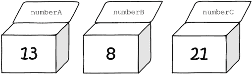
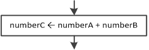
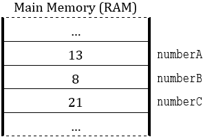
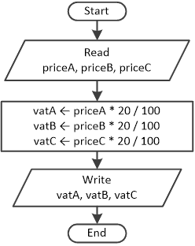
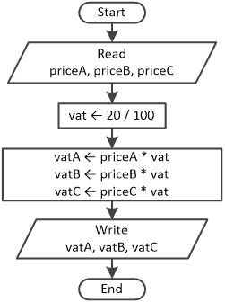
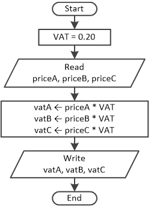

## 第五章

变量和常量

### 5.1 什么是变量？

在计算机科学中，变量是计算机主内存（RAM）中的一个位置，程序可以在此处存储一个值，并在程序执行过程中更改它。

将变量想象成一个透明的盒子，你可以一次插入并保存一个东西。因为盒子是透明的，所以你还可以看到它里面有什么。此外，如果你有两个或更多的盒子，你可以给每个盒子一个独特的名字。例如，你可以有三个盒子，每个盒子包含不同的数字，你可以将这些盒子命名为 numberA、numberB 和 numberC。

示例中名为 numberA、numberB 和 numberC 的框分别包含数字 13、8 和 4。当然，你可以在任何时候检查或甚至更改这些框中包含的值。

现在，假设有人要求你找出前两个框中值的总和，然后将结果存储在最后一个框中。你必须遵循以下步骤：

1)查看前两个框，并检查它们包含的值。

2)使用你的 CPU（这是你的大脑）来计算总和（结果）。

3)将结果（即 21 的值）插入最后一个框中。然而，由于每个框一次只能包含一个单一值，因此值 4 实际上被数字 21 所替换。

现在框看起来是这样的。

在流程图中，将值存储在变量中的动作用左箭头表示

.

这个动作通常表示为“将值或表达式的结果赋给变量”。左箭头被称为值赋值运算符。

请注意，这个箭头始终指向左边。不允许使用右箭头。此外，箭头的左边只能存在一个单一变量。

在实际的计算机科学中，这三个盒子实际上是主内存（RAM）中的三个独立区域，分别命名为 numberA、numberB 和 numberC。

当程序指示 CPU 执行以下语句时

numberC ← numberA + numberB

它遵循与上一个示例相同的三个步骤过程。

1)数字 13 和 8 从名为 numberA 和 numberB 的 RAM 区域转移到 CPU。

（这是第一步，你在其中检查了前两个框中的值）。

2)CPU 计算 13 + 8 的和。

（这是第二步，你在其中使用你的大脑来计算总和或结果）。

3)结果 21 从 CPU 转移到 RAM 的名为 numberC 的区域，替换了现有的数字 4。

（这是第三步，你在其中将结果插入最后一个框）。

执行后，RAM 看起来是这样的。

.

当 Python 程序运行时，一个变量可以持有各种值，但一次只能持有一个值。当你将一个值赋给一个变量时，这个值会一直存储，直到你分配一个新的值来替换旧的值。

变量的内容可以改变为不同的值，但它的名称将始终相同，因为名称只是内存中位置的标识符。

变量是计算机科学中最重要元素之一，因为它帮助你与存储在主内存（RAM）中的数据进行交互。很快，你将学习如何在 Python 中使用变量。

### 5.2 什么是常量？

有时候，你可能需要使用在程序运行期间不能改变的价值。这样的值被称为常量。简单来说，常量可以被视为一个锁定的变量。这意味着当程序开始运行时，一个值被分配给常量，之后，在程序运行过程中，没有任何东西可以改变这个值。例如，在一个金融程序中，利率可以被声明为一个常量。

一个常量的描述性名称也可以提高你程序的可读性，并帮助你避免一些错误。例如，假设你在程序中的许多地方都使用了值 3.14159265（但不是作为常量）。如果你在输入这个数字时犯了打字错误，这将产生错误的结果。但是，如果这个值被赋予一个名称，任何在名称上的打字错误都会被编译器检测到，并且你会收到一个错误信息。

不幸的是，Python 不支持常量。你可以用一个变量来代替常量，但要注意不要在程序中使用这个变量时意外地改变它的初始值。

在流程图中，你可以用等号（=）表示将常量设置为值的动作。

这本书使用大写字母来区分常量和变量。

考虑一个算法，允许用户输入三个不同产品的价格，然后计算并显示每个产品的 20%增值税（简称 VAT）。图 5-1 展示了在没有使用常量的情况下这个过程。

图 5-1 不使用常量计算三个产品的 20%增值税

尽管这个算法绝对正确，但问题是作者使用了 20%的增值税率（20/100）三次。如果这是一个实际的计算机程序，CPU 将被迫三次单独计算除法的结果（20/100）。

一般来说，除法和乘法是消耗 CPU 时间的操作，在可能的情况下应避免。

使用变量是一个更好的解决方案，如图 5-2 所示。这减少了除法操作的次数，也减少了打字错误的潜在可能性。

图 5-2 使用变量 vat 计算三个产品的 20%增值税

这次只计算一次除法（20/100），然后使用其结果来计算每个产品的增值税。但即使现在，算法（可能后来成为计算机程序）并不完美；vat 是一个变量，任何程序员都可能不小心在程序中将其值更改到以下内容。

理想解决方案是将变量 vat 更改为常量 VAT，如图 5–3 所示。

.

图 5–3 使用常量 VAT 计算三个产品的 20%增值税

注意，在流程图中声明常量时，使用等号（=）而不是左箭头。

这个最后的解决方案是许多原因的最佳选择。

►没有人，包括程序员，可以通过在程序中的任何位置不小心编写 VAT ← 0.60 之类的语句来仅通过偶然的方式更改常量增值税的值。

►减少打印错误的可能性。

►将算术运算的数量保持在尽可能低。

►如果有一天财政部长决定将增值税率从 20%提高到 22%，程序员只需更改一行代码！

### 5.3 存在多少种变量和常量类型？

大多数计算机语言中存在许多不同类型的变量和常量。这种多样性的原因是每个变量或常量可以存储不同类型的数据。大多数情况下，变量和常量存储以下类型的数据。

►整数：整数值是一个没有小数部分的正数或负数，例如 5、100、135、−25 和−5123。

►实数：实数是一个包含小数部分的正数或负数，例如 5.1、7.23、5.0、3.14 和−23.78976。实数也被称为浮点数。

►布尔值^([[7]](footnotes.html#Endnote_7))：布尔变量（或常量）只能存储两个值之一：True 或 False。

►字符：字符是一个字母数字值（一个字母、一个符号或一个数字），通常用单引号或双引号括起来，例如“a”，'c'或“@”。在计算机科学中，字符序列被称为字符串!!! 可能“字符串”这个词会让你联想到可穿戴的东西，但不幸的是，它不是。请保持你的脏脏的宝贵思维专注于计算机科学！字符串的例子有“Hello Zeus”、“I am 25 years old”或“Peter Loves Jane For Ever”。

在 Python 中，字符串可以用单引号或双引号括起来。

### 5.4 Python 中变量和常量的命名规则和约定

选择变量或常量的名称时必须遵循某些规则。

►变量或常量名称应仅由拉丁字符（英语大写或小写字母）、数字和下划线字符（_）组成。特别是对于常量，尽管允许使用小写字母，但建议只使用大写字母。这种约定有助于在视觉上区分常量和变量。变量名称的例子有 firstName、lastName1 和 age，而常量名称的例子有 VAT 和 COMPUTER_NAME。

►变量和常量名称是区分大小写的，这意味着大写和小写字符之间有明显的区别。例如，myVAR、myvar、MYVAR 和 MyVar 实际上是四个不同的名称。

►不允许有空格字符。如果变量或常量名称由多个单词组成，你可以在单词之间使用下划线字符（_）或在每个单词（除了第一个）的首字母大写（骆驼式命名约定）。例如，变量名称 student first name 是不正确的。相反，你可能使用 student_first_name，或者更好的是 studentFirstName。

►有效的变量或常量名称可以以字母或下划线开头。数字是被允许的，但不能用于名称的开头。例如，变量名称 1studentName 的写法是不正确的。相反，你可能使用类似 studentName1 或 student1Name 的名称。

►变量或常量名称通常选择的方式可以描述它所包含数据的含义和作用。例如，一个存储温度值的变量可能被命名为 temperature、temp 或甚至 t。

►不要使用 Python 的任何保留字作为变量或常量名称。例如，名称 While 不能作为有效的变量或常量名称，因为在 Python 中它是一个保留字。

不幸的是，Python 不支持常量，就像某些其他计算机语言（如 C#或 C++）所做的那样。你可以使用变量代替，但要注意不要在程序中使用这个变量时意外地改变其初始值。

"骆驼式命名约定"是计算机编程中命名标识符（变量、子程序、类等）的一种风格。之所以称为"骆驼式"，是因为名称中间的大写字母类似于骆驼的驼峰。骆驼式命名主要有两种变体：a) 小驼峰式（或骆驼式），其中标识符的第一个字母以小写字母开头，每个后续单词的第一个字母也以大写字母开头；b) 大驼峰式（或帕斯卡式），与大驼峰式类似，但标识符的第一个字母也以大写字母开头。

小驼峰式命名约定通常用于命名变量和子程序，而大驼峰式用于命名类。你将在相应的第七部分 Part VII 和第八部分 Part VIII 中了解更多关于子程序和类的内容。

### 5.5 “声明变量”这个短语是什么意思？

声明是为主存储器（RAM）中存储变量内容预留部分的过程。在许多高级计算机语言中，程序员必须在变量可以使用之前编写一个特定的语句来预留该部分在 RAM 中的空间。在大多数情况下，他们甚至需要指定变量类型，以便编译器或解释器知道需要预留多少空间。

下面是一些示例，展示了如何在不同的高级计算机语言中声明一个变量。

| 声明语句 | 高级计算机语言 |
| --- | --- |
| Dim sum As Integer | Visual Basic |
| int sum; | C#, C, C++, Java, 以及更多 |
| sum: Integer; | Pascal, Delphi |
| var sum; | Javascript |

### 5.6 如何在 Python 中声明变量

在 Python 中，不需要像在 C# 或 C++ 中那样声明变量。变量是在首次使用时声明的。

下面是一些示例，展示了在 Python 中声明一些变量（用作常量）。它们的名称遵循小驼峰命名法以及 第 5.4 节 中提到的所有变量命名规则。

number1 = 0

found = False

firstName = "Hera"

在 Python 中，使用等号（=）给变量赋值。这个操作与流程图中的左箭头等效。

在 Python 中，使用双引号（" "）给字符串类型的变量赋值。

### 5.7 如何在 Python 中声明常量

你必须接受它！在 Python 中无法声明常量，没有这样的选项！然而，你仍然可以使用变量（最好是使用大写字母）代替，并且在使用这些变量时要注意不要改变它们的初始值。

以下示例在 Python 中声明了一些变量（用作常量）。它们遵循 第 5.4 节 中提到的所有常量命名规则和约定。

VAT = 0.22

NUMBER_OF_PLAYERS = 25

FAVORITE_SONG = "We are the world"

FAVORITE_CHARACTER = "w"

在计算机编程中，一旦定义了常量，在程序运行期间其值不能改变。不幸的是，Python 并不是这样。由于你使用变量代替常量，你必须小心不要在程序中意外地改变它们的初始值。

### 5.8 复习问题：真/假

对于以下每个陈述，选择真或假。

1)变量是计算机二级存储设备中的一个位置。

2)在流程图中，对于赋值操作符，你可以使用左箭头或右箭头。

3)在程序执行过程中，变量的内容可以改变。

4)在 Python 之外的语言中，常量的内容在程序执行过程中可以改变。

5)值 10.0 是一个整数。

6)布尔变量只能存储两个值中的一个。

7)双引号括起来的值“10.0”是一个实数。

8)在计算机科学中，字符串是你能佩戴的东西！

9)变量的名称可以包含数字。

10)变量可以在程序执行时更改其名称。

11)变量的名称不能是数字。

12)常量的名称必须始终是描述性的。

13)student name 不是一个有效的变量名。

14)STUDENT_NAME 是一个有效的常量名。

15)在 Python 中，变量的名称可以包含大写和小写字母。

16)在 Python 中，不需要声明变量。

17)在 Python 程序中，你必须始终至少使用一个变量。

### 5.9 复习问题：多项选择题

为以下每个陈述选择正确的答案。

1)变量是一个存储

a)一个硬盘。

b)一个 DVD 光盘。

c)一个 U 盘。

d)所有这些

e)以上都不是

2)变量可以持有

a)一次一个值。

b)一次多个值。

c)所有这些

d)以上都不是

3)通常，在程序中使用常量

a)帮助程序员完全避免拼写错误。

b)帮助程序员避免使用除法和乘法。

c)所有这些

d)以上都不是

4)以下哪一个是整数？

a)5.0

b)−5

c)“5”

d)以上都不是整数。

5)布尔变量可以持有值

a)一个。

b)“True”。

c)True。

d)以上都不是

6)在 Python 中，字符串可以是

a)用单引号括起来。

b)用双引号括起来。

c)两者都是

7)以下哪项不是有效的 Python 变量？

a)city_name

b)cityName

c)cityname

d)city-name

### 5.10 复习练习

完成以下练习。

1)将第一列中的每个元素与第二列中的一个元素匹配。

| 值 | 数据类型 |
| --- | --- |
| 1\. “True” | a. 布尔 |
| 2\. 123 | b. 实数 |
| 3\. 假 | c. 字符串 |
| 4\. 10.0 | d. 整数 |

2)将第一列中的每个元素与第二列中的一个元素匹配。

| 值 | 数据类型 |
| --- | --- |
| 1\. 人的名字 | a. 布尔 |
| 2\. 人的年龄 | b. 实数 |
| 3\. 5.0/2.0 的除法结果 | c. 整数 |
| 4\. 是黑色还是白色？ | d. 字符串 |

3)完成以下表格

| 值 | 数据类型 | 声明和初始化 |
| --- | --- | --- |
| 我朋友的名字 | 字符串 | name = "Mark" |
| 我的地址 |   | address = "254 Lookout Rd. Wilson, NY 27893" |
| 平均每日气温 |   |   |
| 一个电话号码 |   | phoneNumber = "1‑891‑764‑2410" |
| 我的社保号码（SSN） |   |   |
| 汽车的速度 |   |   |
| 家庭中的孩子数量 |   |   |
