## 第六章

处理输入和输出

### 6.1 如何将消息和结果输出到用户的屏幕？

流程图使用斜平行四边形和保留词“Write”来显示消息或最终结果到用户的屏幕上。

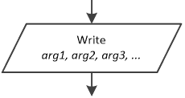

其中 arg1、arg2 和 arg3 可以是变量、表达式、常量值或双引号括起来的字母数字值。

你刚才看到的斜平行四边形等价于以下流程图片段。

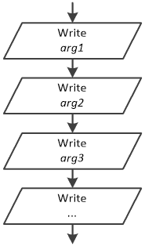

在 Python 中，你可以通过使用 print 语句来实现相同的结果。其一般形式是

print(arg1, arg2, arg3, …  [, sep = " "] [, end = "\n"])

其中

►arg1、arg2、arg3、… 是要打印的参数（值）。它们可以是变量、表达式、常量值或单引号或双引号括起来的字符串。

►sep 是插入在参数之间的字符串。它是可选的，默认值是一个空格字符。

►end 是附加在最后一个参数之后的字符串。它是可选的，默认值是一个“换行符”。

以下代码片段：

a = 5

b = 6

c = a + b

print("5 和 6 的和是", c)

显示图 6–1 中所示的消息。

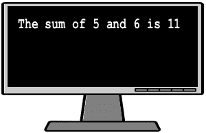

图 6–1 屏幕上显示的字符串和整数

在 Python 中，如果你想将字符串显示在屏幕上，该字符串必须用单引号或双引号括起来。

注意屏幕上在第一个字符串和变量 c 的值（就在“是”这个词之后）之间自动插入的空格。

数学表达式的结果也可以直接在 print 语句中计算。以下代码片段显示的正是图 6–1 中的相同消息。

a = 5

b = 6

print("5 和 6 的和是", a + b)

### 6.2 如何修改 print 语句的默认行为？

如前所述，Python 自动在参数之间输出一个空格。以下示例

print("Morning", "Evening", "Night")

显示

图 6–2 输出结果显示参数之间有一个空格

还要注意，以下三个语句无论逗号（,）分隔符之后有多少空格字符，都会产生相同的输出结果：

print("Morning","Evening","Night")

print("Morning", "Evening", "Night")

print("Morning", "Evening", "Night")

如图 6–3 所示。

图 6–3 输出结果始终在参数之间显示一个空格

如果你想自定义分隔符字符，你需要像这里一样为参数 sep 使用一个值：

print("Morning", "Evening", "Night", sep = "#")

并且输出结果现在如图 6–4 所示。

图 6–4 带有自定义分隔符的输出结果

现在，仔细看看以下示例。

a = "Ares"

print("Hello", a)

print("Halo", a)

print("Salut", a)

Python 中的 print 语句在最后一个参数（变量 a）之后自动添加一个“换行符”；因此，这三个消息像图 6–5 所示的那样一个接一个地显示。

.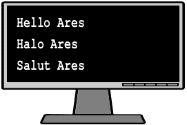

图 6–5 输出结果显示在三条线上

你可以自定义 end 参数的值，如下所示：

a = "Ares"

print("Hello", a, end = " - ")

print("Halo", a, end = " - ")

print("Salut", a)

输出结果现在如图 6–6 所示。

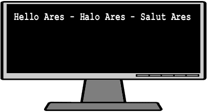

图 6–6 输出结果显示在一行上

一个有趣的字符序列是 \n，它可以用来创建一个自定义的“换行符”。你可以像下面这样输出一个“换行符”：

a = "Ares"

print("Hello", a, "\nHalo", a, "\nSalut", a)

并且输出结果如图 6–7 所示。

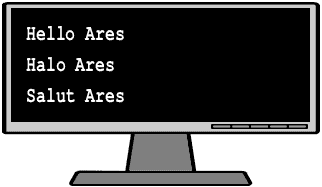

图 6–7 输出结果显示在三条线上

另一个有用的字符序列是 \t，它可以用来创建一个“制表位”。制表符（\t）对于对齐输出很有用。

print("John\tGeorge")

print("Sofia\tMary")

输出结果如图 6–8 所示。

.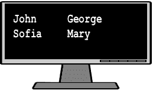

图 6–8 输出结果显示制表符

当然，同样的结果可以用一个单独的语句实现。

print("John\tGeorge\nSofia\tMary")

### 6.3 如何提示用户输入数据？

你还记得创建算法或计算机程序涉及的主要三个阶段吗？第一个阶段是“数据输入”阶段，在这个阶段，计算机允许用户输入数据，如数字、他们的名字、他们的地址或他们的出生年份。

流程图使用斜平行四边形和保留词“Read”来让用户输入他们的数据。

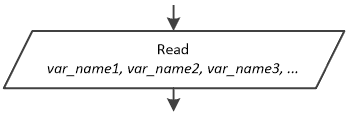

其中 var_name1、var_name2 和 var_name3 必须是变量。

你刚才看到的斜平行四边形等价于以下流程图片段。

.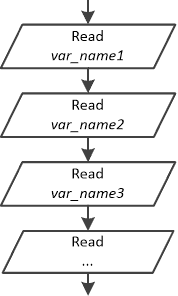

当执行 Read 语句时，执行流程会中断，直到用户输入所有数据。当数据输入完成后，执行流程继续到下一个语句。通常数据是从键盘输入的。

在 Python 中，数据输入是通过以下语句之一完成的：

# 从键盘读取字符串

var_name_str = input([prompt])

# 从键盘读取整数

var_name_int = int(input([prompt]))

# 从键盘读取实际数据

var_name_float = float(input([prompt]))

其中

►prompt 是要显示的提示信息。它可以是变量或用单引号或双引号括起来的字符串。prompt 参数是可选的。

►var_name_str 可以是任何类型为字符串的变量。

►var_name_int 可以是任何类型为整数的变量。

►var_name_float 可以是任何类型为 float（实数）的变量。

函数 int() 和 float() 将在本书的后面讨论。

让我们通过以下示例来研究 input() 语句。

name = input("What is your name? ")

print("你好", name)

当此示例中的 input()语句执行时，会显示消息“你叫什么名字？”（不带双引号），执行流程会停止，等待用户输入他们的名字。print()语句尚未执行！只要用户没有输入任何内容，计算机就会等待，如图 6–9 所示。

.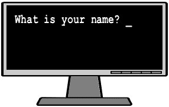

Figure 6–9 当 input()语句执行时，计算机等待数据输入。

当用户最终输入他们的名字并按下“Enter 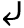”键时，执行流程随后继续到下一个 print()语句，如图 6–10 所示。

.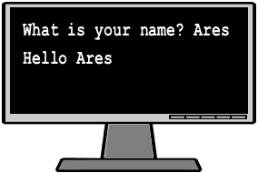

Figure 6–10 当用户按下“Enter ”键时，执行流程继续。

以下代码片段提示用户输入一个字符串和一个浮点数，即包含小数部分的数字。

productName = input("输入产品名称: ")

productPrice = float(input("输入产品价格: "))

以下程序提示用户输入一个字符串和一个整数，即不带小数部分的数字，然后显示一条消息。

name = input("你叫什么名字？ ")

age = int(input("你多大了？ "))

print("哇，你已经", age, "岁了，", name, "！")

在 Python 中（尽管不常用），你可以只用一行代码读取两个或更多值，如下所示。

name, age = input("你叫什么名字？ "), int(input("你多大了？ "))

print("哇，你已经", age, "岁了，", name, "！")

然而，相应的流程图片段必须看起来像这样

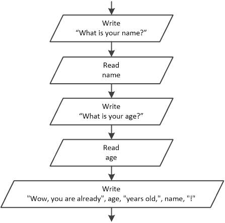

在 Python 中，建议使用 input()语句来显示提示信息。以下示例是正确的，但并不常用。

print("你叫什么名字？ ", end = "")

name = input()

print("你多大了？ ", end = "")

age = int(input())

print("哇，你已经", age, "岁了，", name, "！")

在这本书中，“提示”和“允许”这两个词之间有一点区别。当一个练习说“编写一个 Python 程序，提示用户输入...”这意味着你必须包含一个提示信息。然而，当一个练习说“编写一个 Python 程序，允许用户输入...”这意味着实际上并不要求包含提示信息；也就是说，包含它是没有错的，但你不必这么做！以下示例允许用户输入他们的名字和年龄（但不提示他们）。

name = input()

age = int(input())

当程序执行时，这里发生的情况是计算机显示一个文本光标而没有任何提示信息，等待用户输入两个值——一个用于名字，一个用于年龄。然而，用户必须是一个先知，猜测要输入什么！他们必须先输入名字然后输入年龄，还是相反？所以，显然需要一个提示信息，因为它会使你的程序更加用户友好。

### 6.4 复习问题：判断题

对以下每个陈述选择正确或错误。

1)在 Python 中，单词 print 是一个保留字。

2)可以使用 print()语句显示消息或变量的内容。

3)当执行 input()语句时，执行流程会中断，直到用户输入一个值。

4)一个单独的 input()语句可以用来输入多个数据值。

5)在数据输入之前，必须始终显示提示信息。

### 6.5 复习问题：多项选择题

选择以下每个陈述的正确答案。

1)语句 print(hello)显示

a)单词“hello”（不使用双引号）。

b)单词“hello”（包括双引号）。

c)变量 hello 的内容。

d)以上都不是

2)语句 print("HELLO")显示

a)单词“HELLO”（不使用双引号）。

b)单词“HELLO”（包括双引号）。

c)变量 HELLO 的内容。

d)以上都不是

3)语句 print("Hello\nHermes")显示

a)输入消息“Hello Hermes”（不使用双引号）。

b)在第一行输入单词“Hello”，在下一行输入单词“Hermes”（不使用双引号）。

c)消息“HelloHermes”（不使用双引号）。

d)消息“Hello\nHermes”（不使用双引号）。

e)以上都不是

4)语句  data1data2 = input()

a)允许用户输入一个值并将其分配给变量 data1\. 变量 data2 保持为空。

b)允许用户输入一个值并将其分配给变量 data1data2。

c)允许用户输入两个值并将它们分配给变量 data1 和 data2。

d)以上都不是
