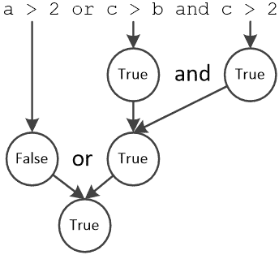
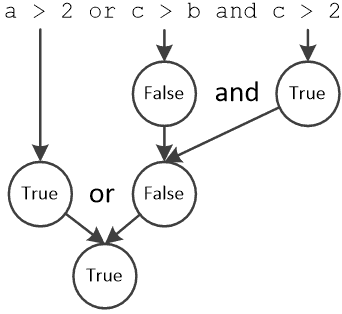
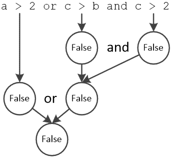
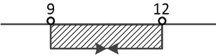
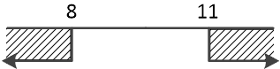
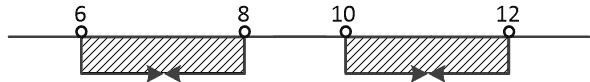
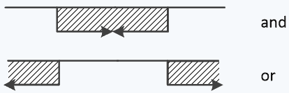

## 第十五章

提出问题

### 15.1 简介

到目前为止，你已经学到了顺序控制结构，其中语句是按顺序执行的，与它们在程序中出现的顺序相同。然而，在严肃的 Python 编程中，很少希望语句按顺序执行。很多时候，你希望在一情况下执行一组语句，而在另一情况下执行完全不同的语句块。

### 15.2 什么是布尔表达式？

假设变量 x 包含值为 5。这意味着如果你问“x 是否大于 2？”答案显然是“是”。对于计算机来说，这些问题被称为布尔表达式。例如，如果你写 x > 2，这是一个布尔表达式，计算机必须检查表达式 x > 2 是否为 True 或 False。

布尔表达式是一个结果为布尔值（即 True 或 False）的表达式。

布尔表达式是问题，应该读作“某物是否等于/大于/小于另一物？”答案只是一个“是”或“否”（True 或 False）。

决策控制结构可以评估布尔表达式或一组布尔表达式，然后决定执行哪个语句块。

### 15.3 如何编写简单的布尔表达式

一个简单的布尔表达式写法如下

操作数 1  比较运算符  操作数 2

其中

►操作数 1 和操作数 2 可以是值、变量或数学表达式

►比较运算符可以是表 15-1 中显示的其中之一。

| 比较运算符 | 描述 |
| --- | --- |
| == | 等于（非赋值） |
| != | 不等于 |
| > | 大于 |
| < | 小于 |
| >= | 大于或等于 |
| <= | 小于或等于 |

表 15-1 Python 中的比较运算符

这里有一些布尔表达式的例子：

►x > y。这个布尔表达式是对计算机的一个问题，可以读作“x 是否大于 y？”

►x <= y。这个布尔表达式也是对计算机的一个问题，可以读作“x 是否小于或等于 y？”

►x != 3 * y + 4。这可以读作“x 是否不等于表达式 3 * y + 4 的结果？”

►s == "Hello"。这可以读作“s 是否等于单词'Hello'？”换句话说，这个问题可以读作“s 是否包含单词'Hello'？”

►x == 5。这可以读作“x 是否等于 5？”

新手程序员在编写 Python 程序时经常犯的一个非常常见的错误是将值赋值运算符与等于运算符混淆。他们经常犯的错误是在实际上想表达 x == 5 时写成 x = 5。

#### 练习 15.3-1 填写表格

根据变量 a、b 和 c 的值，用“True”或“False”填写以下表格。

| a | b | c | a == 10 | b <= a | c > 3 * a − b |
| --- | --- | --- | --- | --- | --- |
| 3 | −5 | 7 |   |   |   |
| 10 | 10 | 21 |   |   |   |
| −4 | −2 | −9 |   |   |   |

解答

前两个布尔表达式很简单，不需要进一步解释。

关于布尔表达式 c > 3 * a − b，请注意 b 为负数的情况。例如，在第一行中，a 等于 3，b 等于−5。表达式 3 * a - b 的结果是 3 * 3 − (−5) = 3 * 3 + 5 = 14。由于变量 c（在第一行中的）的内容不大于 14，布尔表达式 c > 3 * a − b 的结果是 False。

经过一点工作，表格变为

| a | b | c | a == 10 | b <= a | c > 3 * a − b |
| --- | --- | --- | --- | --- | --- |
| 3 | −5 | 7 | False | True | False |
| 10 | 10 | 21 | True | True | True |
| −4 | −2 | −9 | False | False | True |

### 15.4 逻辑运算符和复杂布尔表达式

一个复杂布尔表达式可以由更简单的布尔表达式组成，可以写成

BE1 Logical_Operator BE2

where

►BE1 和 BE2 可以是任何布尔表达式。

►逻辑运算符可以是表 15-2 中显示的其中之一。

| 逻辑运算符 | 描述 |
| --- | --- |
| and | 也称为逻辑合取 |
| or | 也称为逻辑析取 |
| not | 也称为否定或逻辑补码 |

表 15-2 Python 中的逻辑运算符

当你将简单的布尔表达式与逻辑运算符结合时，整个布尔表达式称为“复杂布尔表达式”。例如，表达式 x == 3 and y > 5 是一个复杂布尔表达式。

and 运算符

当你在两个布尔表达式（BE1 和 BE2）之间使用 and 运算符时，这意味着整个复杂布尔表达式的结果是 True，只有当两个布尔表达式（BE1 和 BE2）都是 True 时。

你可以将这些信息组织成一种称为真值表的东西。真值表显示了两个或多个布尔表达式之间逻辑运算的结果，以及它们所有可能值的组合。and 运算符的真值表如下所示。

| BE1（布尔表达式 1） | BE2（布尔表达式 2） | BE1 and BE2 |
| --- | --- | --- |
| False | False | False |
| False | True | False |
| True | False | False |
| True | True | True |

你还感到困惑吗？你不应该感到困惑！这很简单！让我们看看一个例子。复杂布尔表达式

name == "John" and age > 5

只有当变量 name 包含单词“John”（不带双引号）且变量 age 包含一个大于 5 的值时，结果才是 True。两个布尔表达式都必须为 True。如果至少有一个为 False，例如，变量 age 包含一个值为 3，那么整个复杂布尔表达式就是 False。

or 运算符

当你在两个布尔表达式（BE1 或 BE2）之间使用 or 运算符时，这意味着整个复杂布尔表达式的结果是 True，当第一个（BE1）或第二个（BE2）布尔表达式为 True（至少一个）时。

or 运算符的真值表如下所示。

| BE1（布尔表达式 1） | BE2（布尔表达式 2） | BE1 or BE2 |
| --- | --- | --- |
| False | False | False |
| False | True | True |
| True | False | True |
| True | True | True |

让我们看看一个例子。复杂布尔表达式

name == "John" 或 name == "George"

当变量名包含单词“John”或单词“George”（不带引号）时为真。至少有一个布尔表达式必须为真。如果两个布尔表达式都为假，例如，变量名包含单词“Maria”，那么整个复杂布尔表达式为假。

非运算符

当你在布尔表达式（BE）前使用非运算符（not BE）时，意味着当布尔表达式 BE 为假时，整个复杂布尔表达式的结果是真，反之亦然。

非运算符的真值表如下所示。

| BE (布尔表达式) | not BE |
| --- | --- |
| False | True |
| True | False |

例如，复杂布尔表达式

not age > 5

当变量 age 包含的值小于或等于 5 时为真。例如，如果变量 age 包含的值为 6，那么整个复杂布尔表达式为假。

逻辑运算符非（not）会反转布尔表达式的结果。

#### 练习 15.4-1 计算复杂布尔表达式的结果

当变量 a、b、c 和 d 分别包含值 5、2、7 和 -3 时，计算以下复杂布尔表达式的结果。

i)(3 * a + b / 47 - c * b / a > 23) 且 (b != 2)

ii)(a * b - c / 2 + 21 * c / 3) 或 (a >= 5)

解答

别害怕！结果很容易找到。你只需要回忆一下与和或运算符相关的规则。

i)当两个布尔表达式都为真时，与运算符的结果为真。如果你仔细观察，右边的布尔表达式（b != 2）的结果是假的。所以，你不必浪费时间计算左边布尔表达式的结果。最终结果一定是假的。

ii)当至少有一个布尔表达式为真时，或运算符的结果为真。如果你仔细观察，右边的布尔表达式（a >= 5）的结果实际上是真。所以，不必计算左边布尔表达式的结果。最终结果一定是真的。

### 15.5 Python 的成员运算符

在 Python 中，成员运算符用于判断操作数是否存在于指定的序列中。有两个成员运算符，如表 15-3 所示。

| 成员运算符 | 描述 |
| --- | --- |
| in | 如果在指定的序列中找到值，则返回真；否则返回假。 |
| not in | 如果在指定的序列中找不到值，则返回真；否则返回假。 |

表 15-3 Python 中的成员运算符

接下来是一些使用成员运算符的布尔表达式的例子。

►x 在 [3, 5, 9] 范围内。这可以读作“x 是否等于 3，或者等于 5，或者等于 9？”

它也可以写成

x == 3 或 x == 5 或 x == 9

►3 在 [x, y, z] 范围内。这可以读作“3 是否等于 x，或者等于 y，或者等于 z？”

它也可以写成

3 == x 或 3 == y 或 3 == z

►s 在 "ace" 中。这可以读作 '变量 s 的内容是否出现在单词 “ace” 中'，或者换句话说，'s 是否等于字母 “a”，或等于字母 “c”，或等于字母 “e”，或等于单词 “ac”，或等于单词 “ce”，或等于单词 “ace”？'

它可以写成等价的形式

s == "a" or s == "c" or s == "e" or s == "ac" or s == "ce" or s == "ace"

布尔表达式 s 在 "ace" 中检查字符串 s 是否可以作为连续字符序列在字符串 "ace" 中找到。换句话说，它将 s 作为 "ace" 中的连续子串来查找。这就是为什么它不会检查子串 "ae"；因为字母 “a” 和 “e” 不是连续的。

►s 在 ["a", "c", "e"] 中。这可以读作 's 是否等于字母 “a”，或等于字母 “c”，或等于字母 “e”？'

它也可以写成

s == "a" or s == "c" or s == "e"

►s 不在 ["a", "c", "e"] 中。这可以读作 's 是否不等于字母 “a”，也不等于字母 “c”，也不等于字母 “e”？'

它也可以写成

not(s == "a" or s == "c" or s == "e")

或者作为

s != "a" and s != "c" and s != "e"

### 15.6 将布尔表达式的结果赋给变量

由于布尔表达式实际上返回一个值（True 或 False），这个值可以直接赋给一个变量。例如，以下语句

a = x > y

将 True 或 False 的值赋给布尔变量 a。它可以读作“如果变量 x 的内容大于变量 y 的内容，将 True 赋值给变量 a；否则，将 False 赋值”。下一个示例将在屏幕上显示 True 值。

 file_15.6

x, y = 8, 5

a = x > y

print(a)

### 15.7 逻辑运算符的优先级顺序是什么？

一个更复杂的布尔表达式可能使用多个逻辑运算符，如这里所示的表达式

name == "Peter" or age > 10 and not name == "Maria"

因此，一个合理的问题是“哪种逻辑运算首先执行？”

Python 中的逻辑运算符遵循大多数编程语言中适用的相同优先级规则。优先级顺序是：首先执行逻辑补码（not），然后执行逻辑合取（and），最后执行逻辑析取（or）。

| 高优先级 

低优先级 | 逻辑运算符 |

| 非 |
| --- |
| 和 |
| 或 |

表 15-4 逻辑运算符的优先级顺序

你可以始终使用括号来改变默认的优先级。

#### 练习 15.7-1 填写真值表

根据变量 a、b 和 c 的值，在下面的表格中填写“True”或“False”。

| a | b | c | a > 2 or c > b and c > 2 | not(a > 2 or c > b and c > 2) |
| --- | --- | --- | --- | --- |
| 1 | −5 | 7 |   |   |
| 10 | 10 | 3 |   |   |
| −4 | −2 | −9 |   |   |

解答

要计算复杂布尔表达式的结果，你可以使用以下图形方法。

对于 a = 1，b = −5，c = 7，最终结果如这里所示为 True。

与操作具有更高的优先级，并且在与操作之前执行。

对于 a = 10, b = 10, c = 3，最终结果为 True，如下所示。

对于 a = −4, b = −2, c = −9，最终结果为 False，如下所示。

表格第五列的值可以非常容易地计算出来，因为其列标题中的布尔表达式几乎与第四列中的相同。唯一的区别是表达式前面的 not 运算符。因此，第五列的值可以通过简单地否定第四列的结果来计算！

最终的真值表如下所示。

| a | b | c | a > 2 或 c > b 且 c > 2 | not(a > 2 或 c > b 且 c > 2) |
| --- | --- | --- | --- | --- |
| 1 | −5 | 7 | True | False |
| 10 | 10 | 3 | True | False |
| −4 | −2 | −9 | False | True |

#### 练习 15.7-2 将英语句子转换为布尔表达式

一位班主任要求学生根据他们的年龄举手。他想找到那些

i) 9 至 12 岁之间。

ii) 8 岁以下且 11 岁以上。

iii) 8 岁、10 岁和 12 岁。

iv) 6 至 8 岁之间，以及 10 至 12 岁之间。

v) 既不是 10 岁也不是 12 岁。

解决方案

为了编写所需的布尔表达式，使用了一个变量 age。

i) 句子“9 至 12 岁之间”可以如图所示图形化表示。

但是要注意！在数学中以及在 Python 中，可以写成 9 ≤ age ≤ 12 是有效的

9 <= age <= 12

然而，在大多数计算机语言中，这并不是一个有效的布尔表达式。你可以做的是将表达式分成两部分，如下所示

age >= 9 and age <= 12

这个最后的表达式在大多数计算机语言中都是有效的，包括 Python！

为了确认，你可以在“感兴趣区域”内和区域外（你指定的数据范围）测试这个布尔表达式。例如，对于年龄值 7、8、13 和 17，表达式的结果是 False。相反，对于年龄值 9、10、11 和 12，结果是 True。

ii) 句子“8 岁以下且 11 岁以上”可以如图所示图形化表示。

注意与解决方案(i)中看到的两个圆圈不同。这意味着 8 和 11 这两个值不包括在感兴趣的区域内。

注意句子“8 岁以下且 11 岁以上”。这是一个陷阱！不要犯下写

age < 8 and age > 11

地球上没有一个人可以同时 8 岁以下且 11 岁以上！

陷阱在于单词“和”。尝试重新措辞句子，使其变为“孩子们！如果你 8 岁以下或 11 岁以上，请举手”。现在它更好，正确的布尔表达式变为

age < 8 or age > 11

为了确认，您可以在感兴趣区域内部和外部测试这个表达式。例如，对于年龄值为 8、9、10 和 11 的表达式结果是 False。相反，对于年龄值为 6、7、12 和 15 的表达式结果是 True。

在 Python 中，然而，不要犯这样的错误

8 > age > 11

因为，如果你将表达式分成两部分，它等同于

age < 8 and age > 11

这，正如已经提到的，是错误的！

iii)哎呀！在句子“8, 10, 和 12 岁”中，再次出现了“和”这个词！显然，下一个布尔表达式是错误的。

age == 8 and age == 10 and age == 12

如前所述，没有学生同时是 8、10 和 12 岁！再次强调，正确的布尔表达式必须使用或运算符。

age == 8 or age == 10 or age == 12

为了确认，您可以测试这个表达式的几个值。例如，对于年龄值为 7、9、11 和 13 的表达式结果是 False。对于年龄值为 8、10 和 12 的表达式结果是 True。

在 Python 中，这个复杂的布尔表达式也可以写成

age in [8, 10, 12]

iv)句子“在 6 到 8 岁之间，以及在 10 到 12 岁之间”可以如图所示图形化表示。

布尔表达式是

age >= 6 and age <= 8 or age >= 10 and age <= 12

为了确认，对于年龄值为 5、9、13 和 16 的表达式结果是 False。对于年龄值为 6、7、8、10、11 和 12 的表达式结果是 True。

在 Python 中，这个复杂的布尔表达式也可以写成

6 <= age <= 8 or 10 <= age <= 12

v)句子“既不是 10 岁也不是 12 岁”的布尔表达式可以写成

age != 10 and age != 12

或者也可以写成

not(age == 10 or age == 12)

在 Python 中，这个复杂的布尔表达式也可以写成

age not in [10, 12]

当感兴趣区域的箭头指向彼此时，使用逻辑运算符和。否则，当箭头指向相反方向时，使用或。

### 15.8 算术、比较、成员和逻辑运算符的优先级顺序是什么？

在许多情况下，一个表达式可能包含不同类型的运算符，如这里所示。

a * b + 2 > 21 or not(c == b / 2) and c > 13

在这种情况下，首先执行算术运算，然后执行比较和成员运算，最后执行逻辑运算，如下表所示。

| 高优先级 

低优先级 | 算术运算符 | ** |

| *, /, //, % |
| --- |
| +, − |
| 比较和成员运算符 | <, <=, >, >=, ==, !=, in, not in |
| 逻辑运算符 | 非 |
| 和 |
| 或 |

表 15-5 算术、比较、成员和逻辑运算符的优先级顺序

### 15.9 如何否定布尔表达式

否定是将布尔表达式的意义反转的过程。否定布尔表达式有两种方法。

第一种方法

第一种方法是最简单的一种。只需在原始布尔表达式前加上 not 运算符，你的否定布尔表达式就准备好了！例如，如果原始布尔表达式是

x > 5 且 y == 3

否定后的布尔表达式变为

not(x > 5 and y == 3)

注意，整个表达式必须用括号括起来。如果你没有括号就写下这个表达式，那就完全错误了，就像 not x > 5 and y == 3 这样的写法。在这种情况下，not 运算符只会否定第一个布尔表达式，x > 5。

第二种方法

第二种方法稍微复杂一些，但并不难学。你只需要根据以下表格对每个算子进行否定。

| 原始运算符 | 否定运算符 |
| --- | --- |
| == | != |
| != | == |
| > | <= |
| < | >= |
| <= | > |
| >= | < |
| in | not in |
| not in | in |
| and | or |
| or | and |
| not | not |

注意，not 运算符保持不变。

例如，如果原始布尔表达式是

x > 5 且 y == 3

否定后的布尔表达式变为

x <= 5 或 y != 3

然而，有一个小细节需要注意。如果一个复杂的布尔表达式中同时存在 and 和 or 运算符，那么在否定布尔表达式中使用 or 运算符的表达式必须用括号括起来，以保持初始的优先级顺序。例如，如果原始布尔表达式是

x >= 5 且 x <= 10 或 y == 3

否定后的布尔表达式必须是

(x < 5 或 x > 10) 且 y != 3

如果你忘记将表达式 x < 5 或 x > 10 用括号括起来，因为 and 运算符的优先级高于 or 运算符，所以表达式 x > 10 and y != 3 会被首先评估，这当然是错误的！

#### 练习 15.9-1 否定布尔表达式

使用两种方法否定以下布尔表达式。

i)b != 4

ii)a * 3 + 2 > 0

iii)not(a == 5 and b >= 7)

iv)a == True

v)b > 7 且 not(x > 4)

vi)a == 4 或 b != 2

解答

第一种方法

i)not(b != 4)

ii)not(a * 3 + 2 > 0)

iii)not(not(a == 5 and b >= 7))，或等价的表达式 a == 5 and b >= 7

两次否定结果为肯定。也就是说，连续两个 not 算子会相互抵消。

iv)not(a == True)

v)not(b > 7 and not(x > 4))

vi)not(a == 4 或 b != 2)

第二种方法

i)b == 4

ii)a * 3 + 2 <= 0

注意，算术运算符不会被“否定”。永远不要用减号(−)替换加号(+)等运算符！

iii)not(a != 5 or b < 7)

注意，not 运算符保持不变。

iv)a != True

v)b <= 7 或 not(x <= 4)

vi)a != 4 且 b == 2

### 15.10 复习问题：判断对错

对以下每个陈述选择正确或错误。

1)布尔表达式是一个总是产生两个值之一的表达式。

2)布尔表达式至少包含一个逻辑运算符。

3)在 Python 中，表达式 x = 5 检查变量 x 是否等于 5。

4)语句 a = b == c 不是一个有效的 Python 语句。

5)布尔表达式 b < 5 检查变量 b 是否小于或等于 5。

6)与运算符也称为逻辑析取运算符。

7)或运算符也称为逻辑补运算符。

8)如果两个布尔表达式都为 True，则两个布尔表达式的逻辑合取等于它们的逻辑析取的结果。

9)如果两个布尔表达式具有不同的值，则两个布尔表达式的逻辑析取的结果一定是 True。

10)表达式 c == 3 and d > 7 被认为是复杂的布尔表达式。

11)当两个操作数（布尔表达式）都为 True 时，逻辑运算符或的结果为 True。

12)当变量 x 包含除 5 以外的任何值时，布尔表达式 not(x == 5) 的结果为 True。

13)非运算符在逻辑运算符中优先级最高。

14)或运算符在逻辑运算符中优先级最低。

15)在布尔表达式 (x > y or x == 5) and x <= z 中，与运算先于或运算执行。

16)在布尔表达式 a * b + c > 21 or c == b / 2 中，程序首先检查 c 是否大于 21。

17)当老师想要找到年龄在 8 岁以下且超过 11 岁的学生时，相应的布尔表达式是 8 > age > 11。

18)对于任何 x 的值，布尔表达式 x < 0 and x > 100 总是 False。

19)对于任何 x 的值，布尔表达式 x > 0 or x < 100 总是 True。

20)布尔表达式 x > 5 等价于 not(x < 5)。

21)布尔表达式 not(x > 5 and y == 5) 不等价于 not(x > 5) and y == 5。

22)在威廉·莎士比亚^([[13]](footnotes.html#Endnote_13))的《哈姆雷特》（第三幕，第一场）中，主要角色说“生存，还是毁灭：这是一个问题：……”。如果你将其写成布尔表达式 toBe or not toBe，这个“Shakesboolean”表达式的结果在以下代码片段中为 True。

toBe = 1 > 0

thatIsTheQuestion = toBe or not toBe

23)布尔表达式 not(not(x > 5)) 等价于 x > 5。

### 15.11 复习问题：多项选择题

选择以下每个陈述的正确答案。

1)以下哪个不是比较运算符？

a)>=

b)=<

c)<

d)所有这些都是比较运算符。

2)以下哪个不是 Python 逻辑运算符？

a)nor

b)not

c)所有这些都是逻辑运算符。

d)以上都不是逻辑运算符。

3)如果变量 x 包含值为 5，那么语句 y = x % 2 == 1 将把什么值赋给变量 y？

a)正确

b)False

c)1

d)以上都不是

4)如果变量 x 包含值为 5，那么语句 y = x % 2 == 0 or int(x / 2.0) == 2 将把什么值赋给变量 y？

a)正确

b)False

c)以上都不是

5)实验室的温度必须在 50 到 80 华氏度之间。以下哪个布尔表达式用于测试这个条件？

a)t >= 50 or t <= 80

b)50 >= t >= 80

c)t >= 50 and t <= 80

d)t > 50 或 t < 80

e)以上皆非

6)以下哪个与布尔表达式 t == 3 或 t > 30 等价？

a)t == 3 且 not(t <= 30)

b)t == 3 and not(t < 30)

c)not(t != 3) 或 not(t < 30)

d)not(t != 3 and t <= 30)

e)以上皆非

### 15.12 复习练习

完成以下练习。

1)将第一列的每个元素与第二列的一个或多个元素匹配。

| 描述 | 运算符 |
| --- | --- |
| i) 逻辑运算符 | a) % |
| ii) 算术运算符 | b) += |
| iii) 比较运算符 | c) and |
| ii) 赋值运算符（一般） | d) == |
|   | e) 或 |
|   | f) >= |
|   | g) not |
|   | h) = |
|   | i) *= |
|   | j) / |

2)根据变量 a、b 和 c 的值，用“True”或“False”填写以下表格。

| a | b | c | a != 1 | b > a | c / 2 > 2 * a |
| --- | --- | --- | --- | --- | --- |
| 3 | −5 | 8 |   |   |   |
| 1 | 10 | 20 |   |   |   |
| −4 | −2 | −9 |   |   |   |

3)根据布尔表达式 BE1 和 BE2 的值，用“True”或“False”填写以下表格。

| BE1 (布尔表达式 1) | BE2 (布尔表达式 2) | BE1 或 BE2 | BE1 且 BE2 | 非(BE2) |
| --- | --- | --- | --- | --- |
| False | False |   |   |   |
| False | True |   |   |   |
| True | False |   |   |   |
| True | True |   |   |   |

4)根据变量 a、b 和 c 的值，用“True”或“False”填写以下表格。

| a | b | c | a > 3 或 c > b 且 c > 1 | a > 3 且 c > b 或 c > 1 |
| --- | --- | --- | --- | --- |
| 4 | −6 | 2 |   |   |   |
| −3 | 2 | −4 |   |   |   |
| 2 | 5 | 5 |   |   |   |

5)对于 x = 4，y = −2 和 flag = True，用相应的值填写以下表格。

| 表达式 | 值 |
| --- | --- |
| (x + y) ** 3 |   |
| (x + y) / (x ** 2 − 14) |   |
| x − 1 == y + 5 |   |
| x > 2 and y == 1 |   |
| x == 1 or y == −2 and not(flag == False) |   |
| not(x >= 3) and (x % 2 > 1) |   |

6)当变量 a、b、c 和 d 分别包含值 6、−3、4 和 7 时，计算以下每个复杂布尔表达式的结果。

i)(3 * a + b / 5 - c * b / a > 4) and (b != -3)

ii)(a * b - c / 2 + 21 * c / 3 != 8) 或 (a >= 5)

提示：从表达式的简单部分开始评估。

7)班主任要求学生根据年龄举手。他想找到的是：

i)小于 12 岁，但不是 8 岁的人。

ii)在 6 到 9 岁之间，也是 11 岁的人。

iii)超过 7 岁，但不是 10 或 12 岁的那些人。

iv)6 岁、9 岁和 11 岁。

v)在 6 到 12 岁之间，但不是 8 岁的人。

vi)既不是 7 岁也不是 10 岁。

要编写所需的布尔表达式，请使用名为 age 的变量。

8)在不给表达式前面添加 not 运算符的情况下，否定以下布尔表达式。

i)x == 4 且 y != 3

ii)x + 4 <= 0

iii)not(x > 5) 或 y == 4

iv)x != False

v)not(x >= 4 or z > 4)

vi)x != 2 and x >= −5

9) 如您所知，两次否定会产生肯定。通过两次否定（应用两种方法）写出以下布尔表达式的等价形式。

i)x >= 4 and y != 10

ii)x - 2 >= 9

iii)not(x >= 2) or y != 4

iv)x != False or y == 3

v)not(x >= 2 and y >= 2)

vi)x != −2 and x <= 2
