## 第二十章

关于带有决策控制结构的流程图的更多信息

### 20.1 简介

通过学习前面的章节，你已经熟悉了所有的决策控制结构。由于流程图是学习“算法思维”和帮助你更好地理解特定控制结构的理想方式，本章致力于教你如何将 Python 程序转换为流程图，或将流程图转换为 Python 程序。

### 20.2 将 Python 程序转换为流程图

要将 Python 程序转换为相应的流程图，你需要回忆所有的决策控制结构和它们对应的流程图片段。它们都总结在这里。

单一选择决策结构

双重选择决策结构

多重选择决策结构

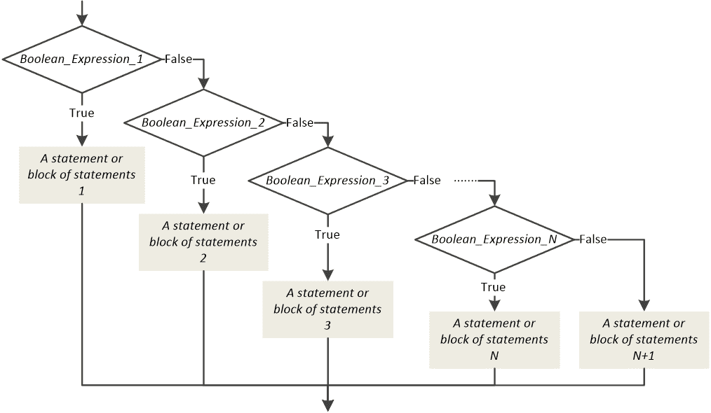

#### 练习 20.2-1 设计流程图

设计与以下 Python 程序相对应的流程图。

x = float(input())

z = x ** 3

w = (z - 4) * (x - 3) / 7 + 36

if z >= w and x < z:

y = 2 * x

if y > 0:    #这是一个嵌套的单一选择决策结构

> y += 1

else:

y = 4 * x

a += 1

print(y)

解决方案

在这个 Python 程序中，有一个单一选择决策结构嵌套在双重选择决策结构中。其相应的流程图如下。

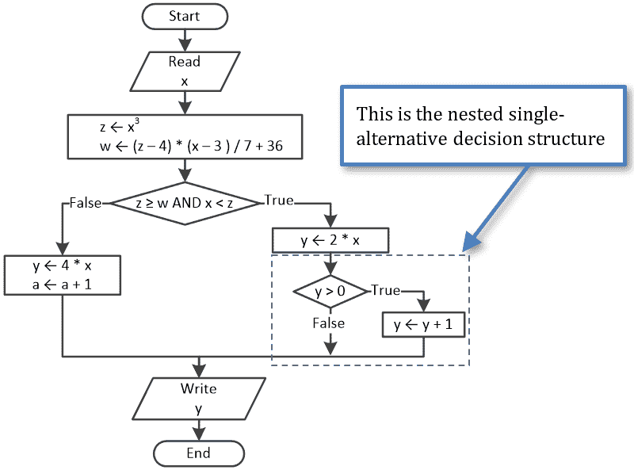

流程图是表示算法的一种非常宽松的方法。因此，写 x³或甚至使用 Python 运算符（**）都是完全可以接受的。做你想做的任何事情；只要任何熟悉流程图的人都能清楚地理解你想表达的意思即可！

#### 练习 20.2-2 设计流程图

设计与以下一般形式给出的代码片段相对应的流程图。

if Boolean_Expression_A:

语句块 A1

if Boolean_Expression_B:

> 语句块 B1

语句块 A2

else:

语句块 A3

if Boolean_Expression_C:

> 语句块 C1

else:

> 语句块 C2

解决方案

为了更好地观察，初始代码片段再次呈现，所有嵌套的决策控制结构都包含在矩形内。

if Boolean_Expression_A:

语句块 A1

if Boolean_Expression_B:       [[更多…]](more.html#more_20_2_2_1)

> 语句块 B1

语句块 A2

else:

语句块 A3

if Boolean_Expression_C:       [[更多…]](more.html#more_20_2_2_2)

> 语句块 C1

else:

> 语句块 C2

并且一般形式的流程图片段如下所示。

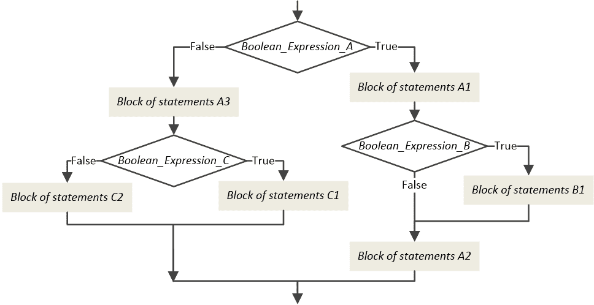

#### 练习 20.2-3 设计流程图

设计与以下 Python 程序相对应的流程图。

a = float(input())

if a < 0:

y = a * 2

elif a < 10:

y = a / 2

elif a < 100:

y = a + 2

else:

b = float(input())

y = a * b

if y > 0:    #这是一个嵌套的双重选择决策结构

> y -= 1   #

else:        #

> y += 1   #

print(y)

解决方案

在这个 Python 程序中，一个双选决策结构嵌套在一个多选决策结构中。

流程图如下所示。

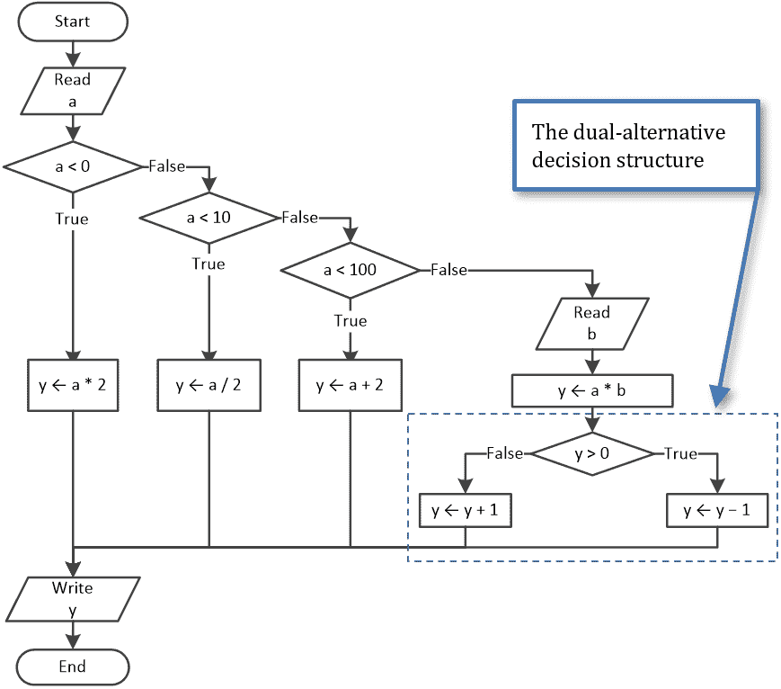

### 20.3 你可能会犯的一个错误！

在流程图中，新手程序员常见的错误是留下一些路径未连接，如下面的流程图所示。

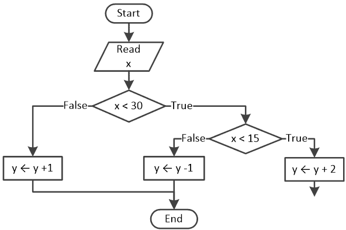

请记住，每个路径都试图达到算法的末尾，因此你不能让任何一个路径未连接。

另一方面，尽量避免使用许多结束符号的流程图，如下所示，因为这些算法难以阅读和理解。

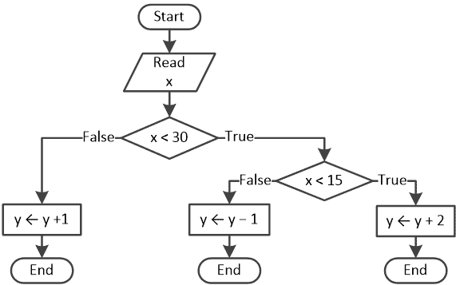

假设你正在设计一个流程图（见下方的流程图），并且你想要开始关闭其所有的决策控制结构。

只需记住，最后打开的决策控制结构必须是第一个关闭的！在这个例子中，最后一个决策控制结构是评估表达式 a < 30 的那个。这是你需要首先关闭的，如下所示。

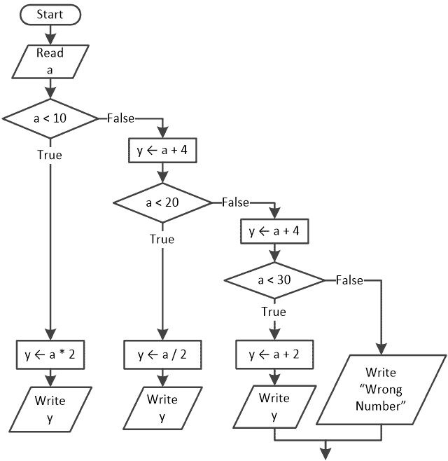

接下来，你需要关闭第二个到最后一个决策控制结构，如下所示。

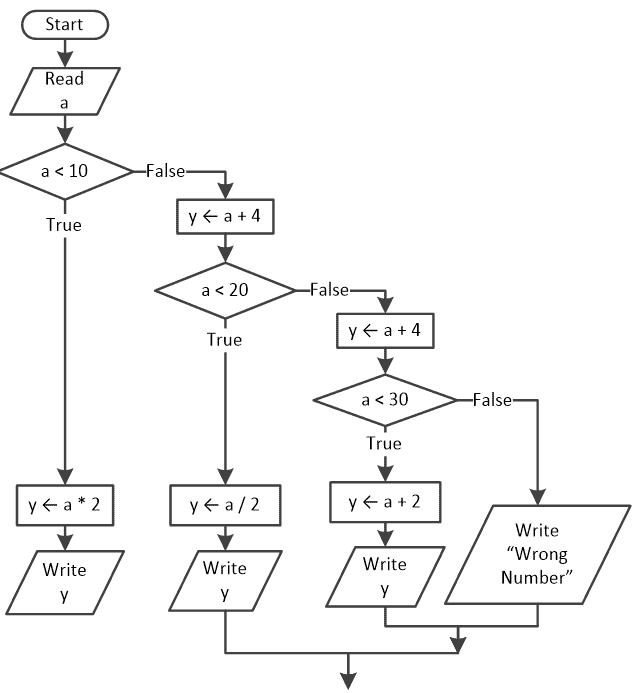

最后，你需要关闭第三个到最后一个决策控制结构，如下所示。

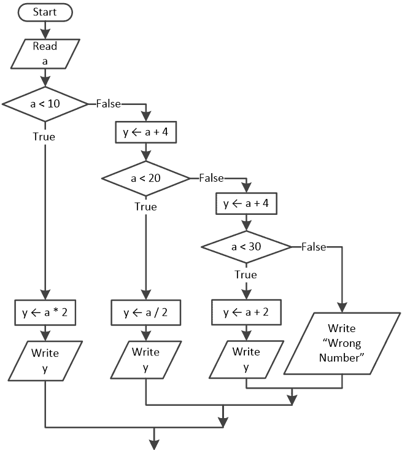

最后一个流程图可以被重新排列成如下所示的样式。

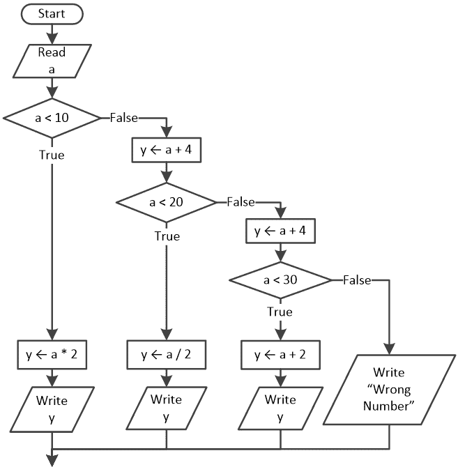

### 20.4 将流程图转换为 Python 程序

这种转换并不总是容易的。有些情况下，流程图设计者没有遵循特定的规则，因此初始流程图可能需要一些修改，才能将其转换为 Python 程序。以下是一个这样的例子。

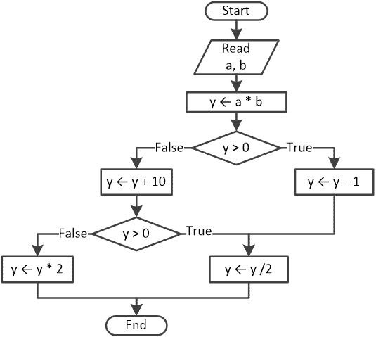

如你所见，这个流程图片段中包含的决策控制结构与你已经学过的任何决策控制结构都不匹配。因此，你只有一个选择，那就是通过添加额外的语句或删除现有的语句来修改流程图，直到出现已知的决策控制结构。以下是一些需要修改初始流程图的练习。

#### 练习 20.4-1 编写 Python 程序

编写与以下流程图相对应的 Python 程序。

.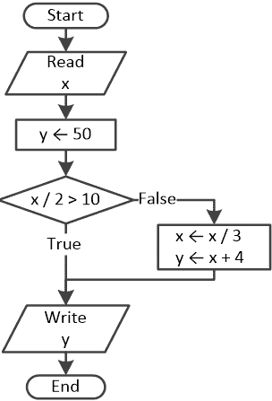

解答

这相当简单。你必须克服的唯一障碍是真实和虚假路径并不完全在正确的位置。你需要使用真实路径，而不是虚假路径，来实际上包含单选决策结构中的语句。

有可能交换这两条路径，但你还需要否定相应的布尔表达式。以下两个流程图片段是等价的。

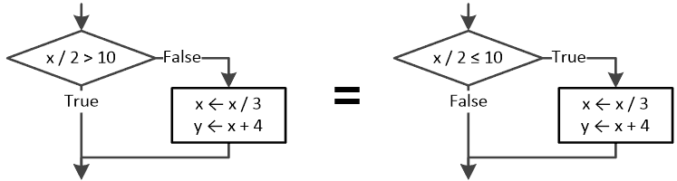

因此，流程图可以修改并看起来像这样。

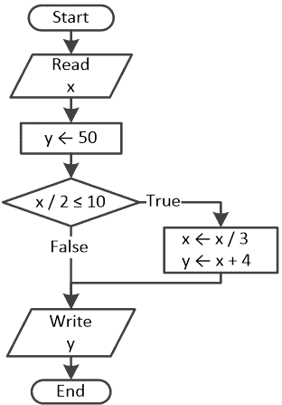

相应的 Python 程序如下所示。

x = float(input())

y = 50

if x / 2 <= 10:

x = x / 3

y = x + 4

print(y)

#### 练习 20.4-2 编写 Python 程序

编写与以下流程图相对应的 Python 程序。

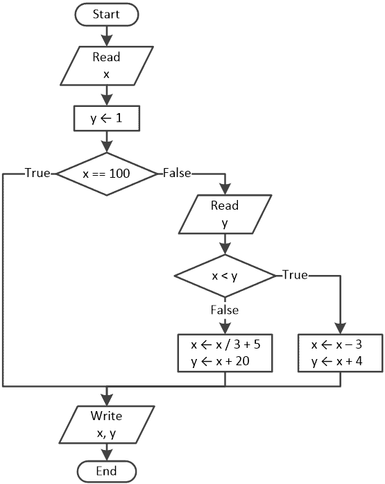

解答

在这个练习中，有一个双分支决策结构嵌套在单分支决策结构中。你只需要否定布尔表达式 x == 100 并切换真/假路径。Python 程序如下所示。

x = float(input())

y = 1

if x != 100:   # 这是一个单分支决策结构

y = float(input())

if x < y:     # 这是一个嵌套的双分支决策结构

> x = x - 3
> 
> y = x + 4

else:

> x = x / 3 + 5
> 
> y = x + 20

print(x, y)

#### 练习 20.4-3 编写 Python 程序

编写与以下流程图相对应的 Python 程序。

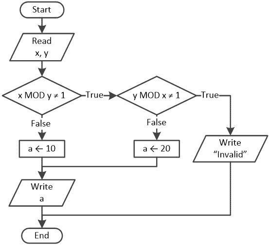

解答

在这个流程图中，决策控制结构不匹配你学过的任何决策控制结构。因此，你必须通过添加额外的语句或删除现有的语句来修改流程图，直到出现已知的决策控制结构！

在这个练习中你必须克服的障碍是评估 y MOD x ≠ 1 布尔表达式的决策控制结构。注意，当执行流程遵循假路径时，它会执行语句 a ← 20，然后在其到达算法末尾之前执行语句 Write a。因此，如果你在它的假路径中简单地添加一个新的语句 Write a，你可以保持执行流程的完整性。以下流程图与初始流程图等价。

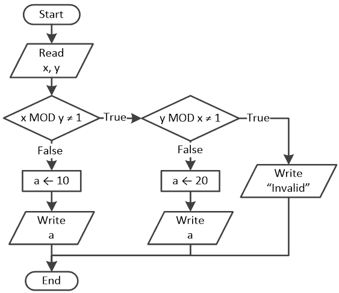

现在，流程图包括已知的决策控制结构；也就是说，一个双分支决策结构嵌套在另一个双分支决策结构中。相应的 Python 程序如下。

x = int(input())

y = int(input())

if x % y != 1:

if y % x != 1:

> print("无效")

else:

> a = 20
> 
> print(a)

else:

a = 10

print(a)

然而，你可以做更好的事情！如果你否定所有的布尔表达式并切换它们的真/假路径，你可以得到一个多分支决策结构，这在 Python 中比嵌套决策控制结构更方便。修改后的流程图如下所示。

相应的 Python 程序如下。

x = int(input())

y = int(input())

if x % y == 1:

a = 10

print(a)

elif y % x == 1:

a = 20

print(a)

else:

print("无效")

### 20.5 复习练习

完成以下练习。

1) 设计与以下 Python 程序相对应的流程图。

a = int(input())

if a % 10 == 0:

a += 1

print("消息 #1")

if a % 3 == 1:

a += 5

print("消息 #2")

if a % 3 == 2:

a += 10

print("消息 #3")

print(a)

2) 设计与以下 Python 程序相对应的流程图。

a = int(input())

if a % 10 == 0:

a += 1

print("消息 #1")

if a % 3 == 1:

a += 5

print("消息 #2")

else:

a += 7

print(a)

3) 设计与以下 Python 程序相对应的流程图。

a = float(input())

if a < 0:

y = a * 2

if y > 0:

> y +=2

elif y == 0:

> y *= 6

else:

> y /= 7

elif a < 22:

y = a / 3

elif a < 32:

y = a - 7

else:

b = float(input())

y = a - b

print(y)

4) 设计与以下通用形式代码片段相对应的流程图。

if Boolean_Expression_A:

if Boolean_Expression_B:

> Block of statements B1

else:

> Block of statements B2

Block of statements A1

else:

Block of statements A2

if Boolean_Expression_C:

> Block of statements C1

elif Boolean_Expression_D:

> Block of statements D1

else:

> Block of statements E1

Block of statements A3

5) 设计与以下 Python 程序相对应的流程图。

a = int(input())

y = 0

if a == 1:

y = a * 2

elif a == 2:

y = a - 3

elif a == 3:

y = a + 3

if y % 2 == 1:

> y += 2

elif y == 0:

> y *= 6

else:

> y /= 7

elif a == 4:

b = float(input())

y = a + b + 2

print(y)

6) 编写与以下流程图相对应的 Python 程序。

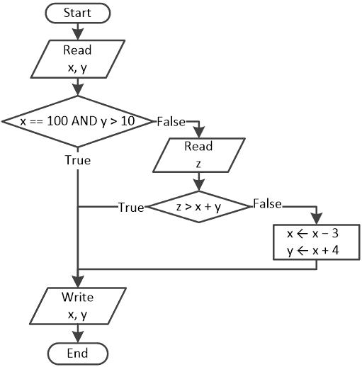

7) 编写与以下流程图相对应的 Python 程序。

8) 编写与以下流程图相对应的 Python 程序。

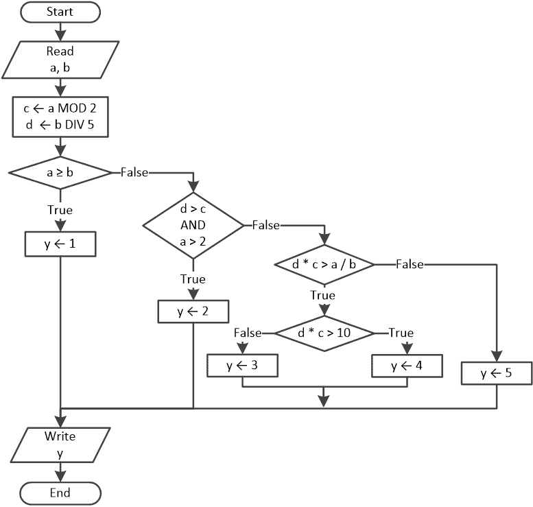

9) 编写与以下流程图相对应的 Python 程序。

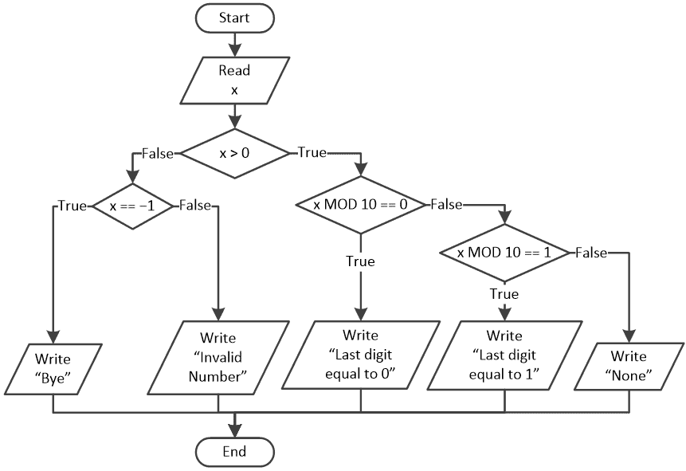

10) 编写与以下流程图相对应的 Python 程序。

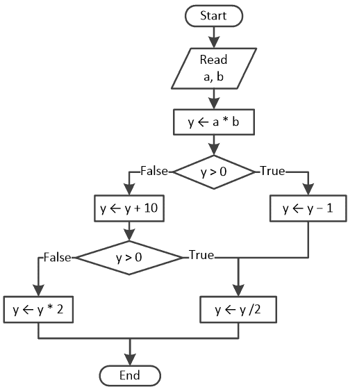

11) 编写与以下流程图相对应的 Python 程序。

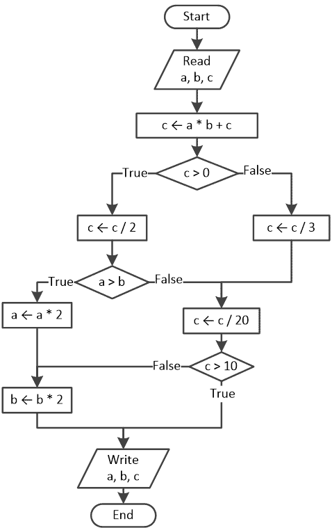
