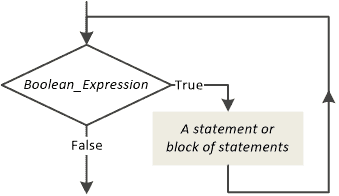
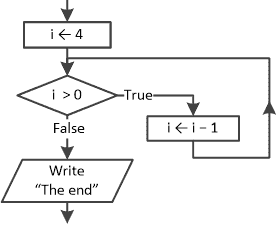
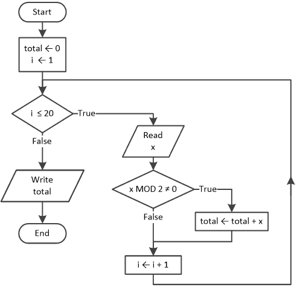
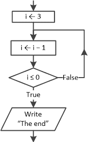
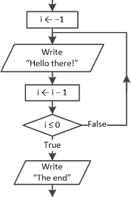
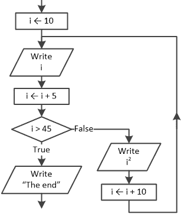

## 第二十四章

预测试、中测试和后测试循环结构

### 24.1 预测试循环结构

预测试循环结构如图所示。

让我们看看当执行流程达到预测试循环结构时会发生什么。如果布尔表达式评估为真，则执行该结构中的语句或语句块，并且执行流程会再次检查布尔表达式。如果布尔表达式再次评估为真，则过程会重复。当布尔表达式在某个时刻评估为假时，执行流程将退出循环。

决策符号（菱形或菱形）在决策控制结构和循环控制结构中都使用。然而，在循环控制结构中，菱形的一个出口总是向上方向。

“预测试循环结构”之所以被这样命名，是因为首先评估布尔表达式，然后执行该结构中的语句或语句块。

由于布尔表达式在进入循环之前被评估，预测试循环可能执行零次到多次迭代。

每次执行循环控制结构中的语句或语句块时，计算机科学中使用的术语是“循环迭代”或“循环执行迭代”。

Python 语句的一般形式是

while 布尔表达式:

一个语句或语句块

以下示例显示了从 1 到 10 的数字。

 file_24.1

i = 1

while i <= 10:

打印(i)

i += 1

就像在决策控制结构中一样，循环控制结构内的语句必须缩进。

在 Python 中，while 循环也可以与 else 关键字结合使用，如下所示。

while 布尔表达式:

一个语句或语句块 1

else:

一个语句或语句块 2

然而，这个不寻常的特性在实践中很少使用，因此本书将不再进一步讨论。

#### 练习 24.1-1 设计流程图并计算总迭代次数

设计以下代码片段的相应流程图。这段 Python 代码执行了多少次迭代？

i = 4

while i > 0:

i -= 1

打印("结束")

解答

相应的流程图片段如下。

.

接下来，一个跟踪表可以帮助你观察执行流程。

| 步骤 | 语句 | 备注 | i |
| --- | --- | --- | --- |
| 1 | i = 4 |   | 4 |
| 2 | while i > 0: | 这评估为真 | 第 1 次 | 迭代 |
| 3 | i = i - 1 |   | 3 |
| 4 | while i > 0: | 这评估为真 | 第 2 次 | 迭代 |
| 5 | i = i - 1 |   | 2 |
| 6 | while i > 0: | 这评估为真 | 第 3 次 | 迭代 |
| 7 | i = i - 1 |   | 1 |
| 8 | while i > 0: | 这评估为真 | 第 4 次 | 迭代 |
| 9 | i = i - 1 |   | 0 |
| 10 | while i > 0: | 这评估为假 |
| 11 | print("The end") | 它显示：The end |

如您从跟踪表中可以看出，总迭代次数是四次。

当预测试循环结构的语句或语句块执行 N 次时，布尔表达式将被评估 N+1 次。因此，为了确定总迭代次数，应计算语句或语句块执行的次数，而不是布尔表达式评估的次数。

#### 练习 24.1-2 计算总迭代次数

这个 Python 程序执行了多少次迭代？

i = 4

while i >= 0:

print(i)

i -= 1

print("The end")

解决方案

这个练习几乎与上一个练习相同。主要区别在于这里的布尔表达式即使在 i = 0 时也保持为真，因此它执行了一个额外的迭代，即五次迭代。

#### 练习 24.1-3 计算总迭代次数

这个 Python 程序执行了多少次迭代？

i = 1

while i != 6:

i += 2

print("The end")

解决方案

让我们创建一个跟踪表来观察执行流程。

| 步骤 | 语句 | 备注 | i |
| --- | --- | --- | --- |
| 1 | i = 1 |   | 1 |
| 2 | while i != 6: | 这将评估为真 | 1^(st) | 迭代 |
| 3 | i += 2 |   | 3 |
| 4 | while i != 6: | 这将评估为真 | 2^(nd) | 迭代 |
| 5 | i += 2 |   | 5 |
| 6 | while i != 6: | 这将评估为真 | 3^(rd) | 迭代 |
| 7 | i += 2 |   | 7 |
| 8 | while i != 6: | 这将评估为真 | … |   |
| 9 | … | … |

如您从跟踪表中可以看出，由于变量 i 从未被赋予值 6，这个代码片段将无限次迭代！显然，这个代码不满足有限性的属性。

#### 练习 24.1-4 计算总迭代次数

这个 Python 程序执行了多少次迭代？

i = -10

while i > 0:

print(i)

i -= 1

print("The end")

解决方案

初始时，变量 i 被赋予值-10。布尔表达式直接评估为假，执行流程直接跳转到 print("The end")语句。因此，这个代码片段执行了零次迭代。

#### 练习 24.1-5 找到四个数字的和

使用预测试循环结构，编写一个 Python 程序，允许用户输入四个数字，然后计算并显示它们的和。

解决方案

你还记得第 23.2 节中计算四个数字之和的例子吗？在稍作工作后，提出的代码片段变成了

total = 0

execute_these_statements_4_times:

x = float(input())

total = total + x

print(total)

现在，你需要一种方法来“呈现”execute_these_statements_4_times 语句的真实 Python 语句。while 语句可以实现这一点，但你需要一个额外的变量来计算总迭代次数。这样，当执行了所需的迭代次数后，执行流程将退出循环。

以下是一个通用的代码片段，它根据指定的总迭代次数进行迭代，

i = 1

while i <= total_number_of_iterations:

一个语句或语句块

i += 1

其中 total_number_of_iterations 可以是常量值，也可以是变量或表达式。

将此代码片段与前面的代码片段合并后，最终程序变为

 file_24.1-5

total = 0

i = 1

while i <= 4:

x = float(input())     [[更多…]](more.html#more_24_1_5_1)

total = total + x

i += 1

print(total)

变量 i 的名称不是绑定性的。你可以使用任何你想要的变量名，例如 counter、count、k 等。

#### 练习 24.1-6 求奇数和

设计一个流程图并编写相应的 Python 程序，允许用户输入 20 个整数，然后计算并显示奇数的和。

解答

这相当简单。程序在循环中必须执行的操作是检查用户提供的数字是否为奇数，如果是，则该数字必须累加到变量 total 中；偶数必须忽略。流程图如下。它包括一个嵌套在预测试循环结构中的单分支决策结构。

相应的 Python 程序如下。

 file_24.1-6

total = 0

i = 1

while i <= 20:

x = int(input())

if x % 2 != 0:

> total += x   # 这等价于 total = total + x

i += 1

print(total)

只要保持它们在语法和逻辑上的正确性，你可以在任何循环控制结构内部嵌套任何决策控制结构。

#### 练习 24.1-7 求 N 个数字的和

编写一个 Python 程序，允许用户输入 N 个数字，然后计算并显示它们的和。N 的值必须在程序开始时由用户提供。

解答

在这个练习中，总迭代次数取决于用户必须输入的值。以下是一个通用的代码片段，它迭代 N 次，其中 N 由用户提供。

n = int(input())

i = 1

while i <= n:

一个语句或语句块

i += 1

根据你所学到的知识，最终程序如下

 file_24.1-7

total = 0

n = int(input())

i = 1

while i <= n:

x = float(input())

total += x

i += 1

print(total)

#### 练习 24.1-8 求未知数量数字的和

编写一个 Python 程序，允许用户重复输入整数值，直到输入值是-1。当数据输入完成后，必须显示输入数字的总和。（-1 的值不得包含在最终的总和中）。接下来，创建一个跟踪表来检查你的程序是否使用 10、20、5 和-1 作为输入值正确运行。

解答

在这个练习中，总迭代次数是未知的。如果你使用决策控制结构，你的程序将类似于下面的代码片段。

total = 0

x = int(input())

if x != -1:     #检查变量 x           [[更多…]](more.html#more_24_1_8_1)

total += x           #并执行此语句

x = int(input())     #并执行此语句

if x != -1:     #检查变量 x

> total += x           #并执行此语句
> 
> x = int(input())     #并执行此语句
> 
> if x != -1:     #检查变量 x
> 
> > total += x           #并执行此语句
> > 
> > x = int(input())     #并执行此语句
> > 
> > …
> > 
> > …

print(total)

现在我们将使用循环控制结构重写此程序。最终的程序如下所示。如果您尝试跟随执行流程，您会发现它与之前的程序等效。

 file_24.1-8

total = 0

x = int(input())

while x != -1:     #检查变量 x

total += x           #并执行此语句

x = int(input())     #并执行此语句

print(total)

现在我们创建一个跟踪表，以确定使用 10、20、5 和 −1 作为输入值时，此程序是否正常工作。

| 步骤 | 语句 | 备注 | x | total |
| --- | --- | --- | --- | --- |
| 1 | total = 0 |   | ? | 0 |
| 2 | x = int(input()) |   | 10 | 0 |
| 3 | while x != ‑1: | 这将评估为 True |
| 4 | total += x |   | 10 | 10 |
| 5 | x = int(input()) |   | 20 | 10 |
| 6 | while x != ‑1: | 这将评估为 True |
| 7 | total += x |   | 20 | 30 |
| 8 | x = int(input()) |   | 5 | 30 |
| 9 | while x != ‑1: | 这将评估为 True |
| 10 | total += x |   | 5 | 35 |
| 11 | x = int(input()) |   | −1 | 35 |
| 12 | while x != −1: | 这将评估为 False |
| 13 | print(total) | 它显示：35 |

如您所见，最终，变量 total 包含的值是 35，这确实是 10 + 20 + 5 的和。此外，最终用户提供的值 −1 并未参与最终的总和。

当在循环开始迭代之前已知迭代次数时，循环通常被称为“确定循环”。然而，在这个练习中，在循环开始迭代之前并不知道迭代次数，它取决于某个条件。这种类型的循环通常被称为“不确定循环”。

#### 练习 24.1-9 求解 20 个数的乘积

编写一个 Python 程序，让用户输入 20 个数字，然后计算并显示它们的乘积。

解答

如果您要使用一个序列控制结构，它将类似于以下代码片段。

p = 1

x = float(input())     [[更多…]](more.html#more_24_1_9_1)

p = p * x

x = float(input())

p = p * x

…

…

x = float(input())

p = p * x

注意变量 p 被初始化为 1 而不是 0。这是为了使语句 p = p * x 正确运行；否则最终乘积将是零。

使用之前练习中的知识，最终程序如下所示

 file_24.1-9

p = 1

i = 1

当 i <= 20 时：

x = float(input())

p = p * x

i += 1

print(p)

### 24.2 后测试循环结构

后测试循环结构在以下流程图中显示。

.

在循环控制结构中，菱形的一个出口总是向上方向。

让我们看看当执行流程达到后测试循环结构时会发生什么。结构中的语句或语句块直接执行，如果布尔表达式评估为 False，则执行流程返回到结构语句或语句块之上的点。语句或语句块再次执行，如果布尔表达式再次评估为 False，则过程重复。当布尔表达式在某个时刻评估为 True 时，执行流程退出循环。

后测试循环与先测试循环的不同之处在于，首先执行结构中的语句或语句块，然后评估布尔表达式。因此，后测试循环至少执行一次迭代！

每次执行循环控制结构的语句或语句块时，计算机科学中使用的术语是“循环正在迭代”或“循环执行迭代”。

尽管大多数计算机语言（如 C、C++、C#、Java、PHP 和 Visual Basic 等）直接支持后测试循环结构，但不幸的是，Python 并不支持这种结构，因为没有直接的表达式。所以现在的问题是：“如果你仍然想在 Python 程序中使用后测试循环结构，你能做什么？”

在 Python 中，您仍然可以使用 while 语句以及 if 和 break 语句间接地编写后测试循环。主要思想是创建一个无限循环（也称为无限循环），当结构语句块末尾的布尔表达式评估为 True 时跳出循环。这个想法在以下代码片段中给出，以一般形式表示。

while True:

一个语句或语句块

if 布尔表达式: break

您可以使用 break 语句在循环实际完成所有迭代之前跳出循环。

以下示例显示从 1 到 10 的数字。

 file_24.2

i = 1

while True:

print(i)

i += 1

if i > 10: break

#### 练习 24.2-1 设计流程图和计算总迭代次数

设计以下 Python 程序的相应流程图。这个 Python 程序执行了多少次迭代？

i = 3

while True:

i = i - 1

if i <= 0: break

print("结束")

解决方案

对应的流程图如下。

.

现在，让我们创建一个跟踪表来观察执行流程。

| 步骤 | 语句 | 备注 | i |
| --- | --- | --- | --- |
| 1 | i = 3 |   | 3 |
| 2 | i = i - 1 |   | 2 | 1^(st) | 迭代 |
| 3 | if i <= 0: break | 这评估为 False |
| 4 | i = i - 1 |   | 1 | 2^(nd) | 迭代 |
| 5 | if i <= 0: break | 这评估为 False |
| 6 | i = i - 1 |   | 0 | 第 3 次 | 迭代 |
| 7 | if i <= 0: break | 这将评估为 True |
| 8 | 打印("结束") | 它显示：结束 |

如从跟踪表所示，总迭代次数为三次。

后测试循环结构的语句或语句块执行 N 次，布尔表达式评估 N 次。因此，要确定总迭代次数，可以计算语句或语句块执行的次数，或者布尔表达式评估的次数。这两个计数是相等的！

#### 练习 24.2-2 计算总迭代次数

这个 Python 程序执行了多少次迭代？

i = 3

while True:

打印(i)

i -= 1

if i < 0: break

打印("结束")

解答

这个练习几乎与上一个练习相同。主要区别在于这里的布尔表达式即使在 i = 0 时也保持为 False，因此它执行了一个额外的迭代，即四次迭代。

#### 练习 24.2-3 设计流程图和计算总迭代次数

设计以下代码片段对应的流程图。这段代码执行了多少次迭代？

i = -1

while True:

打印("你好！")

i -= 1

if i <= 0: break

打印("结束")

解答

对应的流程图如下。

.

初始时，变量 i 被赋予值-1。在循环内部，显示消息“你好！”，并将变量 i 减一（结果为-2）。布尔表达式 i ≤ 0 评估为 True，执行流程直接跳转到 Write ("The end")语句。因此，这个算法执行了一次迭代！

#### 练习 24.2-4 计算总迭代次数

这个代码片段程序执行了多少次迭代？

i = 1

while True:

i = i + 2

if i == 4: break

打印("结束")

解答

让我们创建一个跟踪表来观察执行流程。

| 步骤 | 语句 | 备注 | i |
| --- | --- | --- | --- |
| 1 | i = 1 |   | 1 |
| 2 | i = i + 2 |   | 3 | 第 1 次 | 迭代 |
| 3 | if i == 4: break | 这将评估为 False |
| 4 | i = i + 2 |   | 5 | 第 2 次 | 迭代 |
| 5 | if i == 4: break | 这将评估为 False |
| 6 | i = i + 2 |   | 7 | 第 3 次 | 迭代 |
| 7 | if i == 4: break | 这将评估为 False |
| 8 | … | … | … |   |
| 9 | … | … |

如从跟踪表所示，由于从未将值 4 赋给变量 i，这个代码片段将无限次迭代！显然，这个代码不满足有限性的属性。

#### 练习 24.2-5 求 N 个数的乘积

编写一个 Python 程序，允许用户输入 N 个数字，然后计算并显示它们的乘积。N 的值必须在程序开始时由用户提供。如果你将后测试循环结构与先测试循环结构交换，会发生什么？对于 N 的所有可能的输入值，这两个程序是否以完全相同的方式运行？

解答

以下两个程序都允许用户输入 N 个数字，计算并显示它们的乘积。左边的一个使用预测试，而右边的一个使用后测试循环结构。如果您尝试执行它们并输入 N 的任何大于零的值，这两个程序将完全以相同的方式运行！

 file_24.2-5a

n = int(input())

p = i = 1

while i <= n:

x = float(input())

p = p * x

i += 1

print(p)

 file_24.2-5b

n = int(input())

p = i = 1

while True:

x = float(input())

p = p * x

i += 1

if i > n: break

print(p)

然而，当用户为 N 输入非正值^([[18]](footnotes.html#Endnote_18))时，这两个 Python 程序的操作方式却不同。例如，如果输入值为 0，则左边的程序执行零次迭代，而右边的程序执行一次迭代。显然，左边的程序是解决这个练习的正确选择！

与后测试循环结构不同，预测试循环结构可能执行零次迭代！

### 24.3 中测试循环结构

中测试循环结构在以下流程图中显示。

让我们看看当执行流程达到中测试循环结构时会发生什么。结构中的语句或语句块 1 直接执行，如果布尔表达式评估为假，则执行语句或语句块 2，执行流程回到结构中语句或语句块 1 的上方。语句或语句块 1 再次执行，如果布尔表达式再次评估为假，则过程重复。当布尔表达式在某个时刻评估为真时，执行流程退出循环。

尽管这种循环控制结构在某些计算机语言（如 Ada）中得到直接支持，但不幸的是，Python 并不支持。然而，您仍然可以使用 while 语句以及 if 和 break 语句来编写中测试循环。主要思想是创建一个无限循环，并在两个语句（或语句块）之间的布尔表达式评估为真时跳出循环。这种思想在以下一般形式的代码片段中给出。

while True:

语句或语句块 1

if Boolean_Expression: break

语句或语句块 2

您可以使用 break 语句在循环实际完成所有迭代之前跳出循环。

以下示例显示数字 1 到 10。

 file_24.3

i = 1

while True:

print(i)

if i >= 10: break

i += 1

#### 练习 24.3-1 设计流程图和计算迭代总数

设计以下代码片段对应的流程图，并创建一个跟踪表以确定变量 i 在每一步的值。

i = 10

while True:

print(i)

i += 5

if i > 45: break

print(i ** 2)

i += 10

print("The end")

解决方案

相应的流程图片段如下。

现在，让我们创建一个跟踪表来观察执行流程。

| 步骤 | 语句 | 备注 | i |
| --- | --- | --- | --- |
| 1 | i = 10 |   | 10 |
| 2 | print(i) | 它显示：10 |
| 3 | i += 5 |   | 15 |
| 4 | if i > 45: break | 这评估为 False |
| 5 | print(i ** 2) | 它显示：225 |
| 6 | i += 10 |   | 25 |
| 7 | print(i) | 它显示：25 |
| 8 | i += 5 |   | 30 |
| 9 | if i > 45: break | 这评估为 False |
| 10 | print(i ** 2) | 它显示：900 |
| 11 | i += 10 |   | 40 |
| 12 | print(i) | 它显示：40 |
| 13 | i += 5 |   | 45 |
| 14 | if i > 45: break | 这评估为 False |
| 15 | print(i ** 2) | 它显示：2025 |
| 16 | i += 10 |   | 55 |
| 17 | print(i) | 它显示：55 |
| 18 | i += 5 |   | 60 |
| 19 | if i > 45: break | 这评估为 True |
| 20 | print("The end") | 它显示：The end |

### 24.4 复习问题：真/假

对以下每个陈述选择真或假。

1)前测试循环可能执行零次迭代。

2)在流程图中，前测试循环结构中菱形符号的两个出口都向上。

3)前测试循环结构的语句或语句块至少执行一次。

4)while 语句在其布尔表达式评估为 True 时停止迭代

5)在前测试循环结构中，当结构中的语句或语句块执行 N 次时，布尔表达式被评估 N-1 次。

6)后测试循环可能执行零次迭代。

7)在后测试循环结构中，当结构中的语句或语句块执行 N 次时，其布尔表达式也被评估 N 次。

8)您不能在后测试循环结构内部嵌套决策控制结构。

9)在中测试循环结构中，语句或语句块 1 被执行的次数与语句或语句块 2 相同。

10)在以下代码片段中，单词“Hello”被显示 10 次。

i = 1

while i <= 10:

print("Hello")

i += 1

11)以下 Python 程序不满足有限性的属性。

i = 1

while i != 10:

print("Hello")

i += 2

12)在以下代码片段中，单词“Hello”被显示无限次。

i = 1

while True:

print("Hello")

if i < 10: break

13)以下 Python 程序（不是代码片段）满足有效性的属性。

while True:

print("Hello")

i -= 2

if i <= 10: break

14)以下 Python 程序不满足确定性的属性。

b = int(input())

if b != 1:

while True:

> a = 1 / (b - 1)
> 
> b += 1
> 
> if b > 10: break

15)在以下代码片段中，单词“Zeus”被显示 10 次。

i = 1

while True:

print("Zeus")

if i > 10: break

i += 1

### 24.5 复习问题：多项选择题

选择以下每个陈述的正确答案。

1)在流程图中，菱形符号正在被使用

a)在决策控制结构中。

b)在循环控制结构中。

c)所有以上选项

2)后测试循环结构

a)比预测试循环结构多执行一次迭代。

b)与预测试循环结构的迭代次数相同。

c)取决于

3)在后测试循环结构中，结构的语句或语句块

a)在循环的布尔表达式评估之前执行。

b)在循环的布尔表达式评估后执行。

c)以上都不是

4)在以下代码片段

i = 1

while i < 10:

打印("Hello Hermes")

i += 1

显示消息“Hello Hermes”

a)10 次。

b)9 次。

c)1 次。

d)0 次。

e)以上都不是

5)在以下代码片段

i = 1

while i < 10:

打印("Hi!")

打印("Hello Ares")

i += 1

显示消息“Hello Ares”

a)10 次。

b)11 次。

c)1 次。

d)0 次。

e)以上都不是

6)在以下代码片段

i = 1

while i < 10:

i += 1

打印("Hi!")

打印("Hello Aphrodite")

显示消息“Hello Aphrodite”

a)10 次。

b)1 次。

c)0 次。

d)以上都不是

7)在以下代码片段

i = 1

while i >= 10:

打印("Hi!")

打印("Hello Apollo")

i += 1

显示消息“Hello Apollo”

a)10 次。

b)1 次。

c)0 次。

d)以上都不是

8)以下 Python 程序

n = int(input())

s = 0

i = 1

while i < n:

a = float(input())

s = s + a

i += 1

打印(s)

计算并显示总和

a)与变量 n 的值表示的数字一样多。

b)与表达式 n - 1 的结果表示的数字一样多。

c)与变量 i 的值表示的数字一样多。

d)以上都不是

9)在以下代码片段

i = 1

while True:

打印("Hello Poseidon")

i += 1

if i <= 5: break

显示消息“Hello Poseidon”

a)5 次。

b)1 次。

c)0 次。

d)以上都不是

10)在以下代码片段

i = 1

while True:

打印("Hello Athena")

i += 5

if i == 50: break

显示消息“Hello Athena”

a)至少一次。

b)至少 10 次。

c)无限次数。

d)所有以上选项

11)在以下代码片段

i = 0

while True:

打印("Hello Apollo")

if i <= 10: break

显示消息“Hello Apollo”

a)至少一次。

b)无限次数。

c)以上都不是

12)在以下代码片段

i = 10

while True:

i -= 1

if i > 0: break

打印("Hello Aphrodite")

显示消息“Hello Aphrodite”

a)至少一次。

b)无限次数。

c)十次

d)以上都不是

### 24.6 复习练习

完成以下练习。

1)识别以下 Python 程序中的错误（错误）。它必须显示数字 3、2、1 和消息“The end”。

i = 3

while True

打印(i)

i -= 1

if i < 0 break

打印(The end)

2)创建一个跟踪表以确定下一个 Python 程序每一步中变量的值。这个 Python 程序执行了多少次迭代？

i = 3

x = 0

while i >= 0:

i -= 1

x += i

打印(x)

3)设计相应的流程图并创建一个跟踪表以确定下一个 Python 程序中每个步骤中变量的值。这个 Python 程序执行了多少次迭代？

i = -5

while i < 10:

i -= 1

print(i)

4)创建一个跟踪表以确定下一个 Python 程序中每个步骤中变量的值。这个 Python 程序执行了多少次迭代？

a = 2

while a <= 10:

b = a + 1

c = b * 2

d = c - b + 1

if d == 4:

> print(b, ",", c)

elif d == 5:

> print(c)

elif d == 8:

> print(a, ",", b)

else:

> print(a, ",", b, ",", d)

a += 4

5)创建一个跟踪表以确定下一个 Python 程序中每个步骤中变量的值。这个 Python 程序执行了多少次迭代？

a = 1

b = 1

c = 0

d = 0

while b < 2:

x = a + b

if x % 2 != 0:

> c = c + 1

else:

> d = d + 1

a = b

b = c

c = d

6)在以下代码片段中填入空缺，以便所有循环都恰好执行四次迭代。

i)

a = 3

while a > …… :

print(a)

a -= 1

ii)

a = 5

while a < …… :

print(a)

a += 1

iii)

a = 9

while a != 10:

print(a)

a = a + …… 

iv)

a = 1

while a != …… :

print(a)

a -= 2

v)

a = 2

while a < …… :

print(a)

a = 2 * a

vi)

a = 1

while a < …… :

print(a)

a = a + 0.1

7)创建一个跟踪表以确定下一个 Python 程序中每个步骤中变量的值。这个 Python 程序执行了多少次迭代？

y = 5

x = 38

while True:

y *= 2

x += 1

print(y)

if y >= x: break

8)创建一个跟踪表以确定下一个 Python 程序中每个步骤中变量的值。这个 Python 程序执行了多少次迭代？

x = 1

while True:

if x % 2 == 0:

> x += 1

else:

> x += 3

print(x)

if x >= 12: break

9)创建一个跟踪表以确定下一个 Python 程序中每个步骤中变量的值。这个 Python 程序执行了多少次迭代？

y = 2

x = 0

while True:

y = y ** 2

if x < 256:

> x = x + y

print(x, ",", y)

if y >= 65535: break

10)创建一个跟踪表以确定下一个 Python 程序中每个步骤中变量的值。这个 Python 程序执行了多少次迭代？

a = 2

b = 4

c = 0

d = 0

while True:

x = a + b

if x % 2 != 0:

> c = c + 5

elif d % 2 == 0:

> d = d + 5

else:

> c = c + 3

a = b

b = d

if c >= 11: break

11)在以下代码片段中填入空缺，以便所有循环都恰好执行六次迭代。

i)

a = 5

while True:

print(a)

a -= 1

if a <= …… : break

ii)

a = 12

while True:

print(a)

a += 1

if a >= …… : break

iii)

a = 20

while True:

print(a)

a = a + …… 

if a == 23: break

iv)

a = 100

while True:

print(a)

a -= 20

if a == …… : break

v)

a = 2

while True:

print(a)

a = 2 * a

if a == …… : break

vi)

a = 10

while True:

print(a)

a = a + 0.25

if a > …… : break

12)在以下代码片段中填入空缺，以便所有代码在最后都显示值 10。

i)

x = 0

y = 0

while True:

x += 1

y += 2

if x > …… : break

print(y)

ii)

x = 1

y = 20

while True:

x -= 1

y -= 2.5

if x < …… : break

print(y)

iii)

x = 3

y = 2.5

while True:

x -= 1

y *= 2

if x < …… : break

print(y)

iv)

x = 30

y = 101532

while True:

x -= ……

y = y // 10

if x < 0: break

print(y)

13)使用预测试循环结构，编写一个 Python 程序，让用户输入 N 个数字，然后计算并显示它们的总和和平均值。N 的值必须在程序开始时由用户提供。

14)使用预测试循环结构，编写一个 Python 程序，让用户输入 N 个整数，然后计算并显示偶数的乘积。N 的值必须在程序开始时由用户提供。此外，如果用户提供的所有整数都是奇数，则必须显示消息“你没有输入任何偶数整数”。

15)使用预测试循环结构，编写一个 Python 程序，让用户输入 100 个整数，然后计算并显示以 0 结尾的整数的总和。例如，10、2130 和 500 都是这样的数。

提示：您可以使用取模 10 操作来隔离任何整数的最后一位。

16)使用预测试循环结构，编写一个 Python 程序，让用户输入 20 个整数，然后计算并显示由三位数组成的总和。

提示：所有三位整数都在 100 到 999 之间。

17)使用预测试循环结构，编写一个 Python 程序，让用户重复输入数值，直到输入值为 0。当数据输入完成后，必须显示输入的数的乘积。（最后输入的 0 必须不包括在最终乘积中）。接下来，创建一个跟踪表来检查程序是否使用 3、2、9 和 0 作为输入值正确运行。

18)一个城镇的人口现在为 30000，每年增长率为 3%。使用预测试循环结构，编写一个 Python 程序来确定人口超过 100000 需要多少年。

19)使用后测试循环结构，设计一个流程图并编写相应的 Python 程序，让用户输入 50 个整数，然后计算并显示奇数的总和和偶数的总和。

20)使用后测试循环结构，编写一个 Python 程序，让用户输入 N 个整数，然后计算并显示负数的乘积。N 的值必须在程序开始时由用户提供，并且最终乘积必须始终以正值显示。假设用户为 N 输入的值大于 0。

21)使用后测试循环结构，编写一个 Python 程序，提示用户输入五个整数，然后计算并显示所有以 5 开头的三位整数的乘积。例如，512、555 和 593 都是这样的数。

提示：所有以 5 开头的三位整数都在 500 到 599 之间。

22) 蜂箱当前的人口为 50,000。每年，蜂箱因新生而经历 5%的增长，但也因环境原因面临 15%的死亡率。使用后测试循环结构，编写一个 Python 程序来确定人口下降到 20,000 以下需要多少年。
