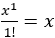

## 第二十九章

更多关于循环控制结构的练习

### 29.1 使用循环控制结构的简单练习

#### 练习 29.1-1 根据哪个更大来计数

编写一个 Python 程序，提示用户输入 10 对数字，然后计算并显示第一个用户提供的数字大于第二个数字的次数和第二个数字大于第一个数字的次数。

解决方案

Python 程序如下。它使用变量 countA 来计数第一个用户提供的数字大于第二个数字的次数，并使用变量 countB 来计数第二个数字大于第一个数字的次数。

 file_29.1-1

countA = 0

countB = 0

for i in range(10):

a = int(input("输入数字 A: "))

b = int(input("输入数字 B: "))

if a > b:

> countA += 1

elif b > a:

> countB += 1

print(countA, countB)

可能有人会问一个合理的问题：“为什么使用多决策控制结构？为什么不使用双分支决策结构？”

假设，确实，使用了以下的双分支决策结构。

if a > b:

countA += 1

else:

countB += 1

在这个决策控制结构中，当变量 b 大于变量 a 时（这是期望的），变量 countB 会增加，但当变量 b 等于变量 a 时（这是不期望的），变量 countB 也会增加。使用多决策控制结构可以确保只有当变量 b 大于（而不是等于）变量 a 时，变量 countB 才会增加。

#### 练习 29.1-2 根据它们的位数来计数

编写一个 Python 程序，提示用户输入 20 个整数，然后计算并显示一位数、两位数和三位数的总数。假设用户输入的值在 1 到 999 之间。

解决方案

使用练习 18.1-3 中的知识，Python 程序如下所示。

 file_29.1-2

count1 = count2 = count3 = 0

for i in range(20):

a = int(input("输入一个数字: "))

if a <= 9:

> count1 += 1

elif a <= 99:

> count2 += 1

else:

> count3 += 1

print(count1, count2, count3)

#### 练习 29.1-3 在一个和中可以放入多少个数

编写一个 Python 程序，让用户重复输入数值，直到它们的总和超过 1000。最后，程序必须显示输入的总数。

解决方案

在这种情况下，由于迭代的确切次数未知，不能使用确定循环；需要使用不确定循环。让我们使用预测试循环来创建这个循环。然而，为了确保程序没有逻辑错误，必须遵守在第 28.3 节中讨论的“终极”规则。根据此规则，预测试循环的结构应如下所示，以一般形式给出。

初始化总数

while total <= 1000 :

一个语句或语句块

更新/修改总数

由于循环的布尔表达式依赖于变量 total，因此必须在循环开始之前初始化该变量，并在循环内部更新（修改）。更具体地说，更新/修改变量 total 的语句必须是循环的最后一个语句。遵循此规则后，Python 程序变为

 file_29.1-3

count = 0

total = 0   # total 的初始化

while total <= 1000:   # 依赖于 total 的布尔表达式

x = float(input())

count += 1

total += x   # 总数的更新/修改

print(count)

#### 练习 29.1-4 求正整数的总数

编写一个 Python 程序，提示用户重复输入整数，直到输入一个实数为止。最后，程序必须显示输入的正整数总数。

解答

再次强调，你不知道确切的迭代次数，因此不能使用 for 循环。

根据“终极”规则，预测试循环结构应如下所示，以一般形式给出。

x = float(input("输入一个数字: "))   # x 的初始化

while int(x) == x:   # 依赖于 x 的布尔表达式

一个语句或语句块

x = float(input("输入一个数字: "))   # x 的更新/修改

最终的 Python 程序如下。

 file_29.1-4

count = 0

x = float(input("输入一个数字: "))

while int(x) == x:

if x > 0:

> count += 1

x = float(input("输入一个数字: "))

print(count)

注意，即使第一个用户提供的数字是实数（浮点数），程序也能正常工作；预测试循环结构确保执行流程永远不会进入循环以处理任何实数！

#### 练习 29.1-5 用户希望迭代多少次

编写一个 Python 程序，提示用户输入两个数字，然后计算并显示第一个数字的第二个数字次幂。程序必须根据用户的意愿迭代多次。每次计算结束后，程序必须提示用户是否希望再次计算。如果答案是“yes”，程序必须重复；否则必须结束。程序应接受所有可能的答案形式，如“yes”、“YES”、“Yes”、“YeS”。

解答

根据“终极”规则，预测试循环结构应如下所示，以一般形式给出。

answer = "yes"   # answer 的初始化

while answer.upper() != "YES":

提示用户输入两个数字，然后计算并显示第一个数字的第二个数字次幂。

# 更新/修改 answer

answer = input("你想重复吗？ ")

upper() 方法确保程序对任何用户提供的答案（“yes”、“YES”、“Yes”、“YeS”或“yEs”）都能正确运行！

然而，这次我们不是使用预测试循环结构，而是使用后测试循环结构。这是一个更好的方法，因为可以在循环外部省略答案变量的初始化。与预测试循环结构不同，执行流程无论哪种方式都会进入循环，答案的初始化将在后测试循环内部完成，如下面的代码片段（以一般形式给出）所示。

while True:

提示用户输入两个数字，然后计算并显示第一个数字的第二个数字次幂。

# 初始化和答案的更新/修改

answer = input("你想重复吗？")

if answer.upper() != "YES": break

这个练习的解决方案变为

 file_29.1-5

while True:

print("请输入两个数字：")

a = int(input())

b = int(input())

result = a ** b

print("结果是：", result)

answer = input("你想重复吗？")

if answer.upper() != "YES": break

#### 练习 29.1-6 求各位数字之和

编写一个 Python 程序，允许用户输入一个整数，然后计算其各位数字之和。

解答

在练习 13.1-2 中，你学习了如何在知道整数总位数的情况下分割整数的数字。然而，在这个练习中，用户可以输入任何值，无论大小。因此，数字的总数是一个未知量。

为了解决这个练习，可以使用循环控制结构。然而，您可以使用两种方法。

第一种方法

在这种方法中，主要思想是在每次迭代中隔离一个数字。然而，挑战在于确定所需的迭代总数，因为它取决于用户提供的整数的大小。那么，这会成为一个障碍吗？当然不会！

在循环中，用户提供的整数应该在每个迭代中连续减少，直到最终达到零。这个零值可以作为停止循环控制结构迭代的条件。例如，如果用户提供的数字是 4753，它应该在第一次迭代中变为 475，在第二次迭代中变为 47，然后变为 4，最终变为 0。一旦它达到 0，迭代必须停止。

让我们尝试使用以下流程图来理解所提出的解决方案。其中一些语句是以一般形式编写的。

语句

digit ← 隔离变量 x 的最后一位数字。

可以使用众所周知的 MOD 10 运算符，如下所示。

digit ← x MOD 10

然而，整个概念依赖于以下语句

x ← 保留变量 x 的所有数字，除了最后一位。

这是最终将变量 x 的值置零的语句，然后执行流程退出循环。要编写此语句，您可以使用如下所示的 DIV 10 运算符。

x ← x DIV 10

因此，Python 程序变为

 file_29.1-6a

x = int(input())

s = 0

while x != 0:

digit = x % 10     #这是 x MOD 10 操作

s = s + digit

x = x // 10        #这是 x DIV 10 操作

print(s)

让我们为输入值 4753 创建一个跟踪表，以更好地理解实际发生的情况。

| 步骤 | 语句 | 备注 | x | digit | s |
| --- | --- | --- | --- | --- | --- |
| 1 | x = int(input()) | 用户输入的值为 4753 | 4753 | ? | ? |
| 2 | s = 0 |   | 4753 | ? | 0 |
| 3 | while x != 0: | 这将评估为 True |
| 4 | digit = x % 10 |   | 4753 | 3 | 0 |
| 5 | s = s + digit |   | 4753 | 3 | 3 |
| 6 | x = x // 10 |   | 475 | 3 | 3 |
| 7 | while x != 0: | 这将评估为 True |
| 8 | digit = x % 10 |   | 475 | 5 | 3 |
| 9 | s = s + digit |   | 475 | 5 | 8 |
| 10 | x = x // 10 |   | 47 | 5 | 8 |
| 11 | while x != 0: | 这将评估为 True |
| 12 | digit = x % 10 |   | 47 | 7 | 8 |
| 13 | s = s + digit |   | 47 | 7 | 15 |
| 14 | x = x // 10 |   | 4 | 7 | 15 |
| 15 | while x != 0: | 这将评估为 True |
| 16 | digit = x % 10 |   | 4 | 4 | 15 |
| 17 | s = s + digit |   | 4 | 4 | 19 |
| 18 | x = x // 10 |   | 0 | 4 | 19 |
| 19 | while x != 0: | 这将评估为 False |
| 20 | print(s) | 显示：19 |

第二种方法

在这种方法中，主要思想是将用户提供的整数转换为字符串，然后使用 for 循环遍历其所有字符（数字）。然而，在 for 循环中，在将每个数字累积到变量 s 之前，需要将每个数字从字符串类型转换回整数类型。Python 程序如下。

 file_29.1-6b

x = int(input())

s = 0

for digit in str(x):

s += int(digit)

print(s)

### 29.2 使用嵌套循环控制结构的练习

#### 练习 29.2-1 显示包含给定数字的所有三位数

编写一个 Python 程序，提示用户输入一个数字（0 到 9），然后显示所有包含该用户提供的数字至少一次的三位数。例如，对于用户提供的值 7，357、771 和 700 都是这样的整数。

解决方案

有三种不同的方法！第一种只使用一个 for 循环，第二种使用三个 for 循环，嵌套一个在另一个中，最后一种使用 Python 的魔法力量。让我们分析它们所有！

首种方法 – 使用 for 循环和决策控制结构

主要思想是使用一个 for 循环，其中变量 counter 的值从 100 到 999。在循环中，将 counter 变量分解为其各个数字（digit[3]、digit[2]、digit[1]），并使用决策控制结构检查其数字中至少有一个等于提供的数字。Python 程序如下。

 file_29.2-1a

x = int(input("输入一个数字 0 - 9: "))

for i in range(100, 1000):

digit3 = i // 100

r = i % 100

digit2 = r // 10

digit1 = r % 10

if digit3 == x or digit2 == x or digit1 == x:

> print(i)

经过一些改进后，程序可以如下改进

 file_29.2-1b

x = int(input("输入一个数字 0 - 9: "))

for i in range(100, 1000):

digit3, r = divmod(i, 100)

digit2, digit1 = divmod(r, 10)

if x in [digit1, digit2, digit3]:

> print(i)

第二种方法 - 使用嵌套循环控制结构和决策控制结构

这里的主要思想是使用三个嵌套的 for 循环。在这种情况下，有三个计数器变量（digit3、digit2 和 digit1），每个变量对应三位整数的一个数字。Python 程序如下。

 file_29.2-1c

x = int(input("Enter a digit 0 - 9: "))

for digit3 in range(1, 10):

for digit2 in range(10):

> for digit1 in range(10):
> 
> > if x in [digit1, digit2, digit3]:
> > 
> > > print(digit3 * 100 + digit2 * 10 + digit1)

如果您遵循执行流程，100 是第一个“整数”评估的值（digit3 = 1，digit2 = 0，digit1 = 0）。然后，最内层的循环控制结构将变量 digit1 加一，下一个评估的值是“整数”101。这个过程一直持续到 digit1 达到 9 的值；即，“整数”达到 109 的值。执行流程然后退出最内层的循环控制结构，变量 digit2 加一，最内层的循环控制结构重新开始，因此评估的值是“整数”110、111、112、… 119。这个过程一直持续到评估所有值直到 999 的整数。

注意变量 digit3 从 1 开始，而变量 digit2 和 digit1 从 0 开始。这是必要的，因为三位数的范围从 100 开始，而不是从 000 开始。

注意打印语句如何组合三位整数。

第三种方法 - Python 风格（版本 1.0）

在这种方法中，for 循环的计数器变量被转换为字符串，并像下面这样解包成三个单独的变量。

 file_29.2-1d

x = input("Enter a digit 0 - 9: ")

for i in range(100, 1000):

digit3, digit2, digit1 = str(i)

if x in [digit3, digit2, digit1]:

> print(i)

注意变量 x，以及变量 digit1、digit2 和 digit3，都是字符串类型。

第四种方法 - Python 风格（版本 2.0）

在这种方法中，for 循环的计数器变量被转换为字符串，并且 in 操作符检查用户提供的“数字”是否存在于字符串中。Python 程序如下。

 file_29.2-1e

x = input("Enter a digit 0 - 9: ")

for i in range(100, 1000):

if x in str(i):

> print(i)

注意变量 x 是字符串类型。

#### 练习 29.2-2 显示指定条件的所有实例

编写一个 Python 程序，显示所有三位整数，其中第一位数字小于第二位数字，第二位数字小于第三位数字。例如，357、456 和 159 是这样的整数。

解答

利用上一练习（练习 29.2-1）的知识，有三种不同的方法！让我们分析一下所有的方法！

第一种方法 – 使用 for 循环和决策控制结构

使用 for 循环和决策控制结构，Python 程序如下。

 file_29.2-2a

for i in range(100, 1000):

digit3, r = divmod(i, 100)

digit2, digit1 = divmod(r, 10)

if digit3 < digit2 and digit2 < digit1:

> print(i)

第二种方法 – 使用嵌套循环控制结构和决策控制结构

使用嵌套循环控制结构和决策控制结构，Python 程序如下。

 file_29.2-2b

for digit3 in range(1, 10):

for digit2 in range(10):

> for digit1 in range(10):
> 
> > if digit3 < digit2 and digit2 < digit1:
> > 
> > > print(digit3 * 100 + digit2 * 10 + digit1)

第三种方法 – 仅使用嵌套循环控制结构

这种方法基于第二种方法。它们之间的主要区别在于，在这种情况下，变量 digit1 始终从大于 digit2 的值开始，而变量 digit2 始终从大于 digit3 的值开始。这样，第一个将显示的整数是 123。

没有小于 123 和大于 789 的整数可以验证布尔表达式 digit3 < digit2 和 digit2 < digit1 为真。

以下是一个 Python 程序。

 file_29.2-2c

for digit3 in range(1, 8):

for digit2 in range(digit3 + 1, 9):

> for digit1 in range(digit2 + 1, 10):
> 
> > print(digit3 * 100 + digit2 * 10 + digit1)

这种解决方案是最有效的，因为它没有使用任何决策控制结构，而且迭代次数保持在最小！

如您所见，一个问题可以有多个解决方案。取决于您找到最优解！

### 29.3 使用循环控制结构进行数据验证

正如您已经知道的，数据验证是限制数据输入的过程，这迫使用户只能输入有效的值。您已经遇到了一种使用决策控制结构的数据验证方法。让我们回顾一个例子。

from math import sqrt

x = float(input("Enter a non-negative number: "))

if x < 0:

print("Error: Negative number entered!")

else:

print(sqrt(x))

然而，这种方法可能对用户来说并不方便。如果他们输入了一个无效的数字，程序会显示错误信息，执行流程不可避免地达到末尾。然后，用户必须重新启动程序以重新输入一个有效的数字。

接下来，您将找到三种使用循环控制结构验证数据输入的一般形式的解决方案。在用户输入无效值的情况下，主要目标是反复提示他们，直到他们最终提供一个有效的值。当然，如果用户最初输入了一个有效的值，执行流程将简单地继续到程序的下一部分。

你选择哪种方法取决于你是否希望显示错误信息，以及你是否希望为每种输入错误显示不同的错误信息，或者只是显示一个通用的错误信息来处理任何类型的错误。

第一种方法 – 无错误信息的验证数据输入

要在没有显示任何错误信息的情况下验证数据输入，你可以使用以下代码片段，以通用形式给出。

while True:

input_data = input("提示信息")

if input_data 测试 1 成功且

input_data 测试 2 成功且

…

input_data 测试 N 成功：break

第二种方法 – 使用通用错误信息验证数据输入

要验证数据输入并显示一个通用的错误信息（即，对于任何类型的输入错误都是相同的错误信息），你可以使用以下代码片段，以通用形式给出。

input_data = input("提示信息")

while input_data 测试 1 失败或

input_data 测试 2 失败或

…

input_data 测试 N 失败：

print("错误信息")

input_data = input("提示信息")

第三种方法 – 使用不同的错误信息验证数据输入

要验证数据输入并显示每种输入错误的特定错误信息，你可以使用以下代码片段，以通用形式给出。

while True:

input_data = input("提示信息")

failure = False

if input_data 测试 1 失败：

> print("错误信息 1")
> 
> failure = True

elif input_data 测试 2 失败：

> print("错误信息 2")
> 
> failure = True

elif …

…

elif input_data 测试 N 失败：

> print("错误信息 N")
> 
> failure = True

if not failure: break

if not failure 等价于 if failure == False

#### 练习 29.3-1 寻找奇偶数 - 无错误信息的验证

编写一个 Python 程序，提示用户输入一个非负整数，然后显示一条消息，指出该数字是偶数；如果不是，则显示“Odd”。使用循环控制结构，程序还必须验证数据输入，允许用户只能输入一个非负整数。

解答

在 第 29.3 节 中学习到的所有三种验证数据输入的方法都将在此处展示。但首先，让我们在不进行数据验证的情况下解决这个练习。

x = float(input("输入一个非负整数: "))   [[更多…]](more.html#more_29_3_1_1)

if x % 2 == 0:

print("Even")

else:

print("Odd")

无错误信息的验证

要在没有显示任何错误信息的情况下验证数据输入，请使用 第 29.3 节 中的第一种方法。只需将带有虚线框的语句替换为以下代码片段。

while True:

x = float(input("输入一个非负整数: "))

if x >= 0 and int(x) == x: break

在数据输入阶段，使用的是 float() 函数而不是 int() 函数。这是为了允许用户输入整数或浮点数。

最终的 Python 程序变为

 file_29.3-1a

while True:                                   [[更多…]](more.html#more_29_3_1_2)

x = float(input("Enter a non-negative integer: "))

if x >= 0 and int(x) == x: break

if x % 2 == 0:

print("Even")

else:

print("Odd")

Validation with a Generic Error Message

为了验证数据输入并显示一个通用的错误信息，将带有虚线矩形的语句替换为基于第 29.3 节的第二种方法的代码片段。Python 程序如下。

 file_29.3-1b

x = float(input("Enter a non-negative integer: "))    [[更多…]](more.html#more_29_3_1_3)

while x < 0 or x != int(x):

print("Error! A negative value or a float entered.")

x = float(input("Enter a non-negative integer: "))

if x % 2 == 0:

print("Even")

else:

print("Odd")

Validation with Different Error Messages

在这里，替换的代码片段基于第 29.3 节的第三种方法。为了验证数据输入并针对每种输入错误显示不同的错误信息，Python 程序如下。

 file_29.3-1c

while True:                                    [[更多…]](more.html#more_29_3_1_4)

x = float(input("Enter a non-negative integer: "))

failure = False

if x < 0:

> print("Error! You entered a negative value")
> 
> failure = True

elif x != int(x):

> print("Error! You entered a float")
> 
> failure = True

if not failure: break

if x % 2 == 0:

print("Even")

else:

print("Odd")

#### Exercise 29.3-2 Finding the Sum of Four Numbers

编写一个 Python 程序，提示用户输入四个正数，然后计算并显示它们的总和。使用循环控制结构，程序必须验证数据输入，并在用户输入任何非正值时显示错误信息。

Solution

这个练习已经在练习 25.1-4 中讨论过了。这里唯一的区别是，这个程序必须验证数据输入，并在用户输入无效值时显示错误信息。为了方便起见，该练习中提出的解决方案如下。

total = 0

for i in range(4):

x = float(input("Enter a number: "))   [[更多…]](more.html#more_29_3_2_1)

total = total + x

print(total)

本练习的主要目的是演示如何将验证数据输入的循环控制结构嵌套到其他现有的循环控制结构中。在这个练习中，你应该将带有虚线矩形的语句替换为以下代码片段

x = float(input("Enter a number: "))

while x <= 0:

print("Please enter a positive value!")

x = float(input("Enter a number: "))

最终的 Python 程序变为

 file_29.3-2

total = 0

for i in range(4):

x = float(input("Enter a number: "))   [[更多…]](more.html#more_29_3_2_2)

while x <= 0:

> print("Please enter a positive value!")
> 
> x = float(input("Enter a number: "))

total = total + x

print(total)

注意，替换的代码片段完全嵌套在这个外层 for 循环中。

### 29.4 使用循环控制结构查找最小和最大值

在第 22.2 节中，你学习了如何使用单选择决策结构在四个值中查找最小和最大值。现在，以下代码片段实现了相同的结果，但只使用了一个变量 w，用于用户提供的值。

w = int(input())     #用户输入第 1 个值

最大值 = w

w = int(input())     #用户输入第 2 个值

if w > maximum:

最大值 = w

w = int(input())     #用户输入第 3 个值

if w > maximum:

最大值 = w

w = int(input())     #用户输入第 4 个值

if w > maximum:

最大值 = w

除了第一对语句外，所有其他语句块都是相同的。因此，你可以保留这些对中的一对，并将其包含在一个执行三次迭代的循环控制结构中，如下所示。

w = int(input())     #用户输入第 1 个值

最大值 = w

for i in range(3):

w = int(input())     #用户输入第 2 个、第 3 个和第 4 个值

if w > maximum:

> 最大值 = w

当然，如果你想允许用户输入更多的值，你可以简单地增加 for 循环的 final_value。

因此，下面展示了一个程序，该程序查找并显示 10 个人中体重最重的人。

 file_29.4a

w = int(input("输入体重（以磅为单位）："))

最大值 = w

for i in range(9):

w = int(input("输入体重（以磅为单位）："))

if w > maximum:

> 最大值 = w

print(maximum)

注意，for 循环迭代的次数比用户提供的值的总数少一次。

尽管这个 Python 程序运行良好，但让我们做一些稍微不同的事情。而不是在循环之前提示用户输入第一个值，然后在循环中输入剩余的九个值，让我们在循环中提示他们输入所有值。

然而，这里出现的问题是，无论如何，在循环开始迭代之前，必须始终给变量最大值分配一个初始值。但是，这个值不能随意选择；它取决于给定的问题。因此，选择一个“几乎随意的”初始值需要仔细考虑，因为错误的选择可能会导致不准确的结果。

在这个练习中，所有用户提供的值都与人们的体重有关。由于在地球上不可能找到任何体重为负的人（至少不是在地球上），你可以安全地将初始值-1 分配给变量最大值，如下所示。

 file_29.4b

最大值 = -1

for i in range(10):

w = int(input("输入体重（以磅为单位）："))

if w > maximum:

> 最大值 = w

print(maximum)

一旦执行流程进入循环，用户输入第一个值，决策控制结构评估为 True。然后，变量 maximum 中的初始值-1 被这个第一个用户提供的值覆盖，之后执行流程正常进行。

请注意，这种方法可能不适用于所有情况。如果练习要求提示用户输入任何数字（不仅限于正数），则不能应用此方法，因为用户可能会只输入负值。如果发生这种情况，初始值-1 将永远不会被用户提供的任何值替换。当用户提供的值的下限已知时，可以使用此方法找到最大值；或者当用户提供的值的上限已知时，可以找到最小值。例如，如果练习要求找到最轻的人，可以将变量 minimum 的初始值设置为+1500，因为地球上没有人能重达如此之多！为了参考，乔恩·布朗·米诺奇是一位美国人，在他体重最高的时候，被记录为有史以来最重的人类，体重约为 1400 磅!!!!!

#### 练习 29.4-1 验证并找到最小值和最大值

编写一个 Python 程序，提示用户输入 10 个人的体重，然后找出最轻和最重的体重。使用循环控制结构，程序还必须验证数据输入，并在用户输入任何非正值或任何大于 1500 的值时显示错误信息。

解答

使用上一个练习作为指导，你现在应该能够闭着眼睛完成这个任务！

为了验证数据输入，你只需要替换上一个练习中的以下代码行，

w = int(input("请输入一个体重（以磅为单位）："))

使用以下代码片段：

w = int(input("请输入一个介于 1 到 1500（以磅为单位）之间的重量："))

while w < 1 or x > 1500:

w = int(input("无效值！请输入一个介于 1 到 1500（以磅为单位）之间的重量："))

以下是一个找到最轻和最重体重的最终程序。

 file_29.4-1

minimum = 1500

maximum = 0

for i in range(10):

w = int(input("请输入一个介于 1 到 1500（以磅为单位）之间的重量："))          [[更多…]](more.html#more_29_4_1_1)

while w < 1 or w > 1500:

> w = int(input("无效值！请输入一个介于 1 到 1500（以磅为单位）之间的重量："))

if w < minimum:

> minimum = w

if w > maximum:

> maximum = w

print(minimum, maximum)

#### 练习 29.4-2 验证并找到最热的行星

编写一个 Python 程序，提示用户反复输入来自太空的行星名称和平均温度，直到输入“STOP”（用作名称）为止。最后，程序必须显示最热行星的名称。此外，由于-459.67^o（华氏温度）是可能达到的最低温度（称为绝对零度），程序还必须验证数据输入（使用循环控制结构），并在用户输入低于绝对零度的温度值时显示错误信息。

解决方案

首先，让我们编写一个不使用数据验证的 Python 程序。根据“终极”规则，预测试循环结构应如下所示，以一般形式给出：

name = input("输入行星名称: ")  #名称初始化

while name.upper() != "STOP":

一个语句或语句块

name = input("输入行星名称: ")   #名称更新/修改

现在，让我们添加其余的语句，仍然不进行数据输入验证。请注意，由于值-459.67^o 是温度尺度的下限，你可以使用低于这个值的值作为变量 maximum 的初始值。

maximum = -460

mName = ""

name = input("输入行星名称: ")

while name.upper() != "STOP":

t = float(input("输入其平均温度: "))

if t > maximum:

> maximum = t
> 
> mName = name

name = input("输入行星名称: ")

if maximum != -460:

print("最热的行星是:", mName)

else:

print("未输入任何内容！")

需要 if maximum != -460 语句，因为用户有可能从一开始就输入“STOP”这个词。

为了验证数据输入，你只需替换以下代码行：

t = float(input("输入其平均温度: "))

with the following code fragment:

t = float(input("输入其平均温度: "))

while t < -459.67:

t = float(input("无效值！输入其平均温度: "))

最终程序如下。

 file_29.4-2

maximum = -460

mName = ""

name = input("输入行星名称: ")

while name.upper() != "STOP":

t = float(input("输入其平均温度: "))

while t < -459.67:

> t = float(input("无效值！输入其平均温度: "))

if t > maximum:

> maximum = t
> 
> mName = name

name = input("输入行星名称: ")

if maximum != -460:

print("最热的行星是:", mName)

else:

print("未输入任何内容！")

#### 练习 29.4-3 “获得高分”

在教室里，有 20 名学生。编写一个 Python 程序，提示教师输入学生在数学考试中获得的分数（0 至 100 分），然后显示最高分以及获得“A”（即 90 至 100 分）的学生人数。此外，程序必须验证数据输入。用户提供的值必须在 0 至 100 分的范围内。

解决方案

首先，我们先编写一个没有数据验证的程序。由于学生人数已知，可以使用 for 循环。对于变量 maximum 的初始值，可以使用值-1，因为没有低于 0 的分数。

maximum = -1

count = 0

for i in range(20):

grade = int(input("学生编号" + str(i + 1) + "的分数: "))

if grade > maximum:

> maximum = grade

if grade >= 90:

> count += 1

print(maximum, count)

现在，你可以处理数据验证。根据练习的措辞，不需要显示任何错误信息。所以，你需要做的就是替换以下代码行：

grade = int(input("学生编号" + str(i + 1) + "的分数: "))

使用以下代码片段：

while True:

grade = int(input("学生编号" + str(i + 1) + "的分数: "))

if 0 <= grade <= 100: break

最终程序变为

 file_29.4-3

maximum = -1

count = 0

for i in range(20):

while True:

> grade = int(input("学生编号" + str(i + 1) + "的分数: "))
> 
> if 0 <= grade <= 100: break

if grade > maximum:

> maximum = grade

if grade >= 90:

> count += 1

print(maximum, count)

### 29.5 使用循环控制结构解决数学问题

#### 练习 29.5-1 计算用户想要的任意多个三角形的面积

编写一个 Python 程序，提示用户输入三角形的三边长度 A、B 和 C，然后计算并显示其面积。你可以使用海伦公式，

.

其中 S 是半周长

.

程序必须根据用户的意愿迭代多次。每次面积计算结束后，程序必须询问用户是否想要计算另一个三角形的面积。如果答案是“是”，程序必须重复；否则必须结束。程序应接受所有可能的答案形式，如“是”、“YES”、“Yes”或甚至“YeS”。

此外，使用循环控制结构，程序必须验证数据输入，并在用户输入任何非正值时显示错误信息。

解决方案

根据“终极”规则，后测试循环结构应如下所示，以一般形式给出。

answer = "yes"   #答案的初始化（冗余）。

while True:

提示用户输入三角形的三边长度 A、B、C，然后计算并显示其面积。

#答案的更新/修改

answer = input("你想重复吗？")

if answer.upper() != "YES": break

upper()方法确保程序对用户提供的任何答案“是”、“yes”、“YES”或甚至“YeS”或“yEs”都能正常工作！

本练习的解决方案如下。

 file_29.5-1

from math import sqrt

while True:

#提示用户输入边长 A 的长度

a = float(input("输入边长 A: "))

while a <= 0:

> a = float(input("无效的边长。请输入边长 A: "))

#提示用户输入边长 B 的长度

b = float(input("输入边长 B: "))

while b <= 0:

> b = float(input("无效的边长。请输入边长 B: "))

#提示用户输入边长 C 的长度

c = float(input("输入边长 C: "))

while c <= 0:

> c = float(input("无效的边长。请输入边长 C: "))

#计算并显示三角形的面积

s = (a + b + c) / 2

area = sqrt(s * (s - a) * (s - b) * (s - c))

print("面积是:", area)

answer = input("你想重复吗？")

if answer.upper() 不等于 "YES": break

#### 练习 29.5-2 求解 x 和 y

编写一个 Python 程序，显示在范围 -20 到 +20 内所有可能的整数 x 和 y 值，这些值验证以下公式：

3x² − 6y² = 6

解答

如果你只想显示变量 x 和 y 的所有可能组合，你可以使用以下 Python 程序。

for x in range(-20, 21):

for y in range(-20, 21):

> print(x, y)

然而，从所有这些组合中，你只需要那些验证表达式 3x² − 6y² = 6 的组合。决策控制结构非常适合这个目的！最终的 Python 程序如下。

 file_29.5-2

for x in range(-20, 21):

for y in range(-20, 21):

> if 3 * x ** 2 - 6 * y ** 2 == 6:
> 
> > print(x, y)

#### 练习 29.5-3 俄罗斯乘法算法

你可以使用“俄罗斯乘法算法”乘以两个正整数，该算法在以下流程图中展示。

编写相应的 Python 程序并创建跟踪表以确定输入值 5 和 13 时每一步的变量值。

解答

在给定的流程图中，一个单分支决策结构嵌套在一个预测试循环结构中。相应的 Python 程序如下。

 file_29.5-3

m1 = int(input())

m2 = int(input())

s = 0

当 m2 不等于 0 时：

if m2 % 2 不等于 0:

> s += m1

m1 *= 2

m2 //= 2

print(s)

对于输入值 5 和 13，跟踪表如下所示。

| 步骤 | 语句 | 备注 | m1 | m2 | s |
| --- | --- | --- | --- | --- | --- |
| 1 | m1 = int(input()) | 用户输入值 5 | 5 | ? | ? |
| 2 | m2 = int(input()) | 用户输入值 13 | 5 | 13 | ? |
| 3 | s = 0 |   | 5 | 13 | 0 |
| 4 | while m2 不等于 0: | 这将评估为 True |
| 5 | if m2 % 2 不等于 0: | 这将评估为 True |
| 6 | s += m1 |   | 5 | 13 | 5 |
| 7 | m1 *= 2 |   | 10 | 13 | 5 |
| 8 | m2 //= 2 |   | 10 | 6 | 5 |
| 9 | while m2 不等于 0: | 这将评估为 True |
| 10 | if m2 % 2 不等于 0: | 这将评估为 False |
| 11 | m1 *= 2 |   | 20 | 6 | 5 |
| 12 | m2 //= 2 |   | 20 | 3 | 5 |
| 13 | while m2 不等于 0: | 这将评估为 True |
| 14 | if m2 % 2 不等于 0: | 这将评估为 True |
| 15 | s += m1 |   | 20 | 3 | 25 |
| 16 | m1 *= 2 |   | 40 | 3 | 25 |
| 17 | m2 //= 2 |   | 40 | 1 | 25 |
| 18 | while m2 不等于 0: | 这将评估为 True |
| 19 | if m2 % 2 不等于 0: | 这将评估为 True |
| 20 | s += m1 |   | 40 | 1 | 65 |
| 21 | m1 *= 2 |   | 80 | 1 | 65 |
| 22 | m2 //= 2 |   | 80 | 0 | 65 |
| 23 | while m2 不等于 0: | 这将评估为 False |
| 24 | print(s) | 显示值 65，这是当然的，是 5 乘以 13 的结果 |

#### 练习 29.5-4 求一个数的因数个数

编写一个 Python 程序，允许用户输入一个正整数，然后显示它的因数总数。

解答

让我们看看一些例子。

►值 12 的因数是数字 1，2，3，4，6，12。

►值 15 的因数是数字 1，3，5，15。

►值 20 的因数是数字 1，2，4，5，10，20。

►值 50 的因数是数字 1，2，5，10，25，50。

如果变量 x 包含用户提供的整数，x 的所有可能的因数都在 1 到 x 之间。因此，这里只需要一个 for 循环，变量 counter 的值从 1 到 x，在每次迭代中，一个简单的选择结构检查 counter 的值是否是 x 的因数。以下是一个 Python 程序。

 file_29.5-4a

x = int(input())

numberOfDivisors = 0

for i in range(1, x + 1):

if x % i == 0:

> numberOfDivisors += 1

print(numberOfDivisors)

这个程序对于输入值 20，执行了 20 次迭代。然而，如果它能够执行少于一半的迭代并达到相同的结果会更好！当然，这样会更好！所以，让我们让它更高效！

如你所知，对于任何用户提供的整数（变量 x）

►值 1 总是因数。

►用户提供的整数总是它自己的因数。

►除了用户提供的整数外，在 1 到 x 的范围中间没有其他因数。

因此，对于任何整数，肯定有 2 个因数，值 1 和用户提供的整数本身。因此，程序必须从值 2 开始检查其他可能的因数，直到 1 到 x 的范围中间。改进后的 Python 程序如下。

 file_29.5-4b

x = int(input())

numberOfDivisors = 2

for i in range(2, x // 2 + 1):

if x % i == 0:

> numberOfDivisors += 1

print(numberOfDivisors)

这个 Python 程序执行的迭代次数比上一个程序少！例如，对于输入值 20，这个 Python 程序只执行了(20 - 2) DIV 2 = 9 次迭代！

#### 练习 29.5-5 判断一个数是否为素数？

编写一个 Python 程序，提示用户输入一个大于 1 的整数，然后显示一条消息，指出该数是否为素数。素数是任何大于 1 的整数，它除了 1 和它本身外没有其他因数。数字 7，11 和 13 都是这样的数。

解答

这个练习基于上一个练习。它非常简单！如果用户提供的整数只有两个因数（1 和它本身），则该数是素数。以下是一个 Python 程序。

 file_29.5-5a

x = int(input("请输入一个大于 1 的整数："))

numberOfDivisors = 2

for i in range(2, x // 2 + 1):

if x % i == 0:

> numberOfDivisors += 1

if numberOfDivisors == 2:

print("数字", x, "是素数")

现在让我们使程序更高效。当找到第三个除数时，执行流程可以跳出循环，因为这意味着用户提供的整数肯定不是素数。Python 程序如下。

 file_29.5-5b

x = int(input("Enter an integer greater than 1: "))

numberOfDivisors = 2

for i in range(2, x // 2 + 1):

if x % i == 0:

> numberOfDivisors += 1
> 
> break

if numberOfDivisors == 2:

print("Number", x, "is prime")

#### 练习 29.5-6 从 1 到 N 找到所有素数

编写一个 Python 程序，提示用户输入一个大于 1 的整数，然后显示从 1 到该用户提供的整数的所有素数。使用循环控制结构，程序必须验证数据输入，并在用户输入任何小于 1 的值时显示错误信息。

解答

以下 Python 程序以一般形式给出，解决了这个练习。

 主代码

N = int(input("Enter an integer greater than 1: "))

while N <= 1:

N = int(input("Wrong number. Enter an integer greater than 1: "))

for x in range(1, N + 1):

代码片段 1：检查变量 x 是否包含一个素数

代码片段 1，如下所示，取自之前的练习（练习 29.5-5）。它检查变量 x 是否包含一个素数。

 代码片段 1

numberOfDivisors = 2

for i in range(2, x // 2 + 1):

if x % i == 0:

> numberOfDivisors += 1
> 
> break

if numberOfDivisors == 2:

print("Number", x, "is prime")

在将代码片段 1 嵌入主代码后，最终的 Python 程序如下

 file_29.5-6

N = int(input("Enter an integer greater than 1: "))

while N <= 1:

N = int(input("Wrong number. Enter an integer greater than 1: "))

for x in range(1, N + 1):

numberOfDivisors = 2     [[更多…]](more.html#more_29_5_6_1)

for i in range(2, x // 2 + 1):

> if x % i == 0:
> 
> > numberOfDivisors += 1
> > 
> > break

if numberOfDivisors == 2:

> print("Number", x, "is prime")

#### 练习 29.5-7 赫伦平方根

编写一个 Python 程序，提示用户输入一个非负值，然后使用赫伦公式计算其平方根，如下所示。

.

其中

►y 是你想要找到平方根的数

►x[n] 是 y 的平方根的第 n 次迭代值

此外，使用循环控制结构，程序必须验证数据输入，并在用户输入任何负值时显示错误信息。

解答

你现在可能有点困惑，正在挠头。不要被所有这些数学东西吓到！你可以通过以下流程图来尝试理解赫伦公式！

仍然感到困惑？让我们通过一个例子来解释。让我们尝试找到 25 的平方根：

►提出一个猜测。假设 8 作为你的第一个猜测。

►8 的平方是 64。

►由于 64 不够接近 25，通过计算表达式来制定一个新的猜测

►5.56 的平方大约是 30.91

►由于 30.91 不够接近 25，通过计算表达式来制定一个新的猜测

.

►5.02 的平方是 25.2

►如果你认为 25.2 足够接近 25，那么你可以停止整个过程，并得出结论，25 的近似平方根是 5.02。

显然，如果需要更高的精度，你可以继续这个过程，直到找到一个被认为是更接近 25 平方根的值。

现在，让我们看看相应的 Python 程序。

 file_29.5-7

from random import randrange

ACCURACY = 0.0000000000001

y = float(input("请输入一个非负数："))

while y < 0:

y = float(input("无效值。请输入一个非负数："))

guess = randrange(1, y + 1)      #在 1 和用户提供的值之间生成一个随机初始猜测

while abs(guess ** 2 - y) > ACCURACY:    #它“足够接近”了吗？

guess = (guess + y / guess) / 2    #不，创建一个新的“猜测”！

print(guess)

注意检查“它足够接近”的方式。当差的绝对值 |guess² - y| 变得小于 0.0000000000001（其中 y 是用户提供的值）时，执行流程退出循环。

#### 练习 29.5-8 计算π

编写一个 Python 程序，使用以下 Madhava–Leibniz 级数计算π，精度为 0.00001。

.

解答

Madhava–Leibniz 级数可以解出π，并变为

.

分数越多，精度越好！因此，为了计算这个公式，程序需要执行多次迭代，以便尽可能多地使用分数。但是，当然，它不能无限迭代！循环必须在当前计算出的π值和前一次迭代计算出的π值“足够接近”时停止迭代，这意味着它们之间的差的绝对值已经变得非常小。常量 ACCURACY 定义了这种差异必须有多小。Python 程序如下所示。

 file_29.5-8

精度 = 0.00001

pi = 0

sign = 1    #这是第一个分数的符号

denom = 1    #这是第一个分数的分母

while True:

piPrevious = pi    #保留前一个 pi 值

pi += sign * 4 / denom    #通过添加一个分数（项）来计算新的π

sign = -sign    #为下一个分数准备符号

denom += 2    #为下一个分数准备分母

if abs(pi - piPrevious) <= ACCURACY: break    #它“足够接近”了吗？

print("π ~=", pi)

注意变量 sign 在每次迭代之间在-1 和+1 之间切换的方式。

如果你降低常数 ACCURACY 的值，π 将会计算得越来越精确。根据你的计算机速度，你可以相当快地计算出 π 的前五个数字。然而，计算 π 的后续每一位所需的时间会呈指数级增长。使用这种方法在现代计算机上计算 40 位 π 可能需要数年！

#### 练习 29.5-9 使用分数逼近实数

编写一个 Python 程序，提示用户输入一个介于 0 和 100 之间的实数，然后尝试找到更好的近似该实数的分数 ，其中 N 是介于 0 和 100 之间的整数，M 是介于 1 和 100 之间的整数。使用循环控制结构，程序还必须验证数据输入，只允许用户输入介于 0 和 100 之间的值。无需显示任何错误消息。

解答

解答很简单。你所需要做的就是迭代所有可能的 n 和 m 的组合，并检查哪一个更好地逼近用户提供的实数。

要迭代 n 和 m 所有可能的组合，你可以使用嵌套循环控制结构，即两个嵌套的 for 循环，如下所示。

for n in range(101):

for m in range(1, 101):

> …

总迭代次数为 101 × 100 = 10100。这是一个相当大的数字，但对于现代计算机来说，这只是小菜一碟！

变量 m 代表分数的分母，分母不能为零。这就是为什么它从 1 开始，而不是从 0 开始。

以下标准

.

可以评估近似的好坏。

感到困惑？让我们尝试用分数逼近值 0.333，通过迭代 N 和 M 所有可能的组合。

►对于 N = 1，M = 1 时，标准等于  = 0.6670

►对于 N = 1，M = 2 时，标准等于  = 0.1670

►对于 N = 1，M = 3 时，标准等于  = 0.0003

►对于 N = 1，M = 4 时，标准等于  = 0.0830

►…

►对于 N = 100，M = 99 时，标准等于  = 0.6771

►对于 N = 100，M = 100 时，标准等于  = 0.6670

显然，0.0003 是所有可能结果中的最小值。因此，N = 1 和 M = 3（对应于分数 1/3）的组合被认为是 0.333 的最佳近似。

现在的 Python 程序：

 file_29.5-9

while True:

x = float(input("Enter a real between 0 and 100: "))

if 0 <= x <= 100: break

minimum = 100

for n in range(101):

for m in range(1, 101):

> y = abs(n / m - x)
> 
> if y < minimum:
> 
> > minimum = y
> > 
> > bestN = n
> > 
> > bestM = m

print("The fraction is:", bestN, "/", bestM)

### 29.6 使用循环控制结构的通用练习

#### 练习 29.6-1 华氏度到开尔文，从 0 到 100

编写一个 Python 程序，显示从 0 到 100 华氏度的所有华氏度和它们对应的开氏度。使用增量值为 0.5。已知

1.8 · 开氏度 = 华氏度 + 459.67

解决方案

将公式解为开氏度，得到

.

这里你需要一个 while-loop，它使用步长 0.5 将变量 fahrenheit 从 0 增加到 100。解决方案如下。

 file_29.6-1a

fahrenheit = 0

while fahrenheit <= 100:

kelvin = (fahrenheit + 459.67) / 1.8

print("Fahrenheit:", fahrenheit, "Kelvin:", kelvin)

fahrenheit += 0.5

当然，你现在可能想知道这个练习是否可以用 for-loop 解决。有人可能会说“不，这是不可能的！range() 函数的步长必须是整数！”然而，有一个简单的技巧可以帮助你使用 for-loop 解决这个练习，如下所示。

 file_29.6-1b

for f in range(0, 1001, 5):

fahrenheit = f / 10

kelvin = (fahrenheit + 459.67) / 1.8

print("Fahrenheit:", fahrenheit, "Kelvin:", kelvin)

一般来说，除法和乘法是占用 CPU 时间的操作。尽管第二种方法效果不错，但并不是最佳选择。for-loop 中包含的语句 fahrenheit = f / 10 可能看起来无害，但实际上并非如此，因为除法 f / 10 被执行了 1001 次！这就像有一个包含 1001 个语句的序列控制结构，每个语句执行 1001 次除法！尽可能避免在循环中执行除法和乘法操作！

#### 练习 29.6-2 棋盘上的米粒

关于一个发明了国际象棋的穷人的传说。印度的国王对这款新游戏非常满意，以至于他提出给这个穷人任何他想要的。这个贫穷但聪明的男人告诉他的国王，他想要棋盘第一格一粒米，第二格两粒，第三格四粒，以此类推，每个棋盘的 64 个方格都是翻倍。国王认为这是一个适度的要求，于是命令他的仆人带来大米。

编写一个 Python 程序，计算并显示棋盘上最终会有多少粒米，以及多少磅米。假设一磅米含有大约 30,000 粒米。

解决方案

假设一个只有 2 × 2 = 4 个方格的国际象棋棋盘，以及一个变量 grains 被赋予初始值 1（这是第 1 个方格的米粒数量）。一个循环三次的 for-loop 可以在每次迭代中将变量 grains 的值翻倍，如下代码片段所示。

grains = 1

for i in range(3):

grains = 2 * grains

每次迭代结束时变量 grains 的值如下表所示。

| 迭代 | grains 的值 |
| --- | --- |
| 第 1 次迭代 | 2 × 1 = 2 |
| 第 2 次迭代 | 2 × 2 = 4 |
| 第 3 次迭代 | 2 × 4 = 8 |

在第 3 次迭代的末尾，变量 grains 的值为 8。这个值不是棋盘上的总米粒数，而只是第 4 个方格上的米粒数。如果你需要找到棋盘上的总米粒数，你可以将所有方格上的米粒数相加，即 1 + 2 + 4 + 8 = 15。

在现实世界中，一个真正的棋盘包含 8 × 8 = 64 个方格，因此你需要迭代 63 次。以下是一个 Python 程序。

 file_29.6-2

grains = 1

total = 1

for i in range(63):

grains = 2 * grains

total += grains  # 这相当于 total = total + grains

weight = total / 30000

print(total, weight)

如果你想知道这些数字有多大，这里就是答案：在棋盘上将有 18,446,744,073,709,551,615 粒米；即 614,891,469,123,651.8 磅！

#### Exercise 29.6-3 Just a Poll

一家民意调查公司询问 1000 名公民他们是否在早上吃早餐。编写一个 Python 程序，提示公民输入他们的性别（M 代表男性，F 代表女性，O 代表其他）以及他们对问题的回答（Y 代表是，N 代表否，S 代表有时），然后计算并显示回答“是”的公民数量，以及回答“否”的女性公民的百分比。使用循环控制结构，程序还必须验证数据输入，并且只接受性别为 M、F 或 O，以及回答为 Y、N 或 S 的值。

Solution

以下是一个 Python 程序。

 file_29.6-3a

CITIZENS = 1000

totalYes = 0

femaleNo = 0

for i in range(CITIZENS):

while True:

> gender = input("Enter gender: ").lower()
> 
> if gender == "m" or gender == "f" or gender == "o": break

while True:

> answer = input("Do you eat breakfast in the morning? ").lower()
> 
> if answer == "y" or answer == "n" or answer == "s": break

if answer == "y":

> totalYes += 1

if gender == "f" and answer == "n":

> femaleNo += 1

print(totalYes)

print(femaleNo * 100 / CITIZENS, "%", sep = "")

注意 Python 如何将用户的输入转换为小写。

当然，经过一点改进，这个程序可以变成

 file_29.6-3b

CITIZENS = 1000

totalYes = 0

femaleNo = 0

for i in range(CITIZENS):

while True:

> gender = input("Enter gender: ").lower()
> 
> if gender in ["m", "f", "o"]: break

while True:

> answer = input("Do you eat breakfast in the morning? ").lower()
> 
> if answer in ["y", "n", "s"]: break

if answer == "y":

> totalYes += 1

elif gender == "f":

> femaleNo += 1

print(totalYes)

print(femaleNo * 100 / CITIZENS, "%", sep = "")

#### Exercise 29.6-4 Is the Message a Palindrome?

回文是一个既可以正向读也可以反向读的单词或句子。（你可能还记得，从练习 22.5-4 中，一个数字也可以是回文）。编写一个 Python 程序，提示用户输入一个单词或句子，然后显示一条消息，说明用户提供的单词或句子是否是回文。以下是一些回文单词和消息。

Anna

Radar

Madam

一颗坚果换一罐金枪鱼罐头。

Dennis 和 Edna 犯了罪。

借一罐红酒换命。

借还是抢？

我们不是被吸引向前，我们这些人，被吸引向前进入新时代？

解决方案

在开始逐个比较字母并检查第一个字母是否与最后一个字母相同，第二个字母是否与倒数第二个字母相同等等之前，有一些事情你应该记住。

在给定的句子或单词中，一些字母可能是大写，一些可能是小写。例如，在句子“A nut for a jar of tuna”中，尽管第一个和最后一个字母相同，但它们不被认为是相等的。因此，程序必须首先将所有字母（例如，转换为小写）进行比较，然后才能开始比较它们。

删除空格、句号、问号和逗号等字符对于程序准确比较字母至关重要。例如，如果不进行此步骤，在句子“借还是抢？”中，程序会错误地假设它不是一个回文，因为它会尝试将初始字母“B”与最后的问号“？”进行比较。

假设要检查的句子是“借还是抢？”。在将所有字母转换为小写并删除所有不需要的空格和问号之后，句子变为“borroworrob”。这些字母及其在字符串中的对应位置如下：

你在这里应该意识到的是，for 循环应该只遍历字母的一半。你能想出为什么吗？

程序应该开始迭代，并将位置 0 的字母与位置 10 的字母进行比较。然后它应该将位置 1 的字母与位置 9 的字母进行比较，以此类推。最后一次迭代应该是比较位置 4 和 6 的字母。在此之后继续检查将是徒劳的，因为所有字母都已经比较过了。

这个问题有多个解决方案。下面介绍其中一些。程序中的注释可以帮助你完全理解它们的工作方式。然而，如果你仍然对它们的工作方式有疑问，可以使用 IDE（IDLE 或 Visual Studio Code）逐步执行它们并观察每一步的变量值。

第一种方法

解决方案在此处展示。

 file_29.6-4a

message = input("输入一条消息: ").lower()

#创建一个新的字符串，其中包含除空格、逗号、句号和问号之外的所有内容

messageClean = ""

for letter in message:

if letter != " " and letter != "," and letter != "." and letter != "?":

> messageClean += letter

j = len(messageClean) – 1  # 这是 messageClean 的最后一个位置

middlePos = j // 2         # 这是 messageClean 的中间位置

palindrome = True  # 开始时，假设句子是回文

# 此循环逐个比较字母。

for i in range(middlePos + 1):

leftLetter = messageClean[i]

rightLetter = messageClean[j]

# 如果至少有一对字母未能通过验证，将变量 palindrome 设置为 False

if leftLetter != rightLetter:

> palindrome = False

j -= 1

# 如果变量 palindrome 仍然为 True

if palindrome:

print("信息是回文")

第二种方法

前一种方法效果良好，但假设用户输入一个非常长的句子，它不是回文；例如，它的第二个字母与倒数第二个字母不同。不幸的是，在前一种方法中，最后一个 for 循环即使在变量 palindrome 被设置为 False 后，仍然继续迭代到句子的中间。所以，让我们尝试使这个程序更加完善。如您所知，您可以使用 break 语句在循环完成所有迭代之前跳出循环。

此外，您可以通过两种方式改进前一种方法：

►您可以使用 not in 成员运算符从变量 message 中移除空格、逗号、句号和问号。

►而不是使用变量 j 访问 messageClean 变量右侧的字母，你可以使用负索引。

解决方案在此处展示。

 file_29.6-4b

message = input("输入一条信息: ").lower()

# 使用 "not in" 成员运算符移除空格、逗号、句号和问号

messageClean = ""

for letter in message:

if letter not in " ,.?":

> messageClean += letter

middlePos = (len(messageClean) - 1) // 2

palindrome = True

for i in range(middlePos + 1):

if messageClean[i] != messageClean[-i - 1]:  # 正确的字母使用负索引

> palindrome = False
> 
> break

if palindrome:

print("信息是回文")

第三种方法

一种更 Pythonic 和复杂的方法是使用 replace() 方法移除空格、逗号、句号和问号，然后只需比较 messageClean 与其反转值。

解决方案在此处展示。

 file_29.6-4c

message = input("输入一条信息: ").lower()

# 创建一个新的字符串，其中包含不带空格、逗号、句号或问号的字母

messageClean = message

for c in " ,.?":

messageClean = messageClean.replace(c, "")

if messageClean == messageClean[::-1]:

print("信息是回文")

此外，由于只需移除四种不同的字符（空格、逗号、句号和问号），您可以通过链式四个 replace() 方法来避免第一个循环，就像下面的 Python 程序所示。

 file_29.6-4d

message = input("输入一条消息：").lower()

#创建一个不包含空格、逗号、句号或问号的新字符串

messageClean = message.replace(" ", "").replace(",", "").replace(".", "").replace("?", "")

if messageClean == messageClean[::-1]:

print("该消息是回文")

很明显，一个问题可以有多个解决方案。取决于你找到最优解！

如果你希望删除所有不需要的字符（空格、逗号、句号、问号、和号等），你可以使用以下代码片段代替。它只保留变量 messageClean 中的字母。

#创建一个只包含字母的新字符串

messageClean = ""

有效字符 = "abcdefghijklmnopqrstuvwxyz"

for 字符 in 消息：

if 字符 in 有效字符：

> messageClean += 字符   #连接

### 29.7 复习问题：对/错

对以下每个陈述选择对/错。

1)数据验证是限制数据输入的过程，强制用户只输入有效值。

2)你可以使用确定循环来验证数据输入。

3)为了强制用户只输入正数，而不显示任何错误信息，你可以使用以下代码片段。

while True：

x = float(input("输入一个正数："))

if x > 0: break

4)为了强制用户输入介于 1 和 10 之间的数字，你可以使用以下代码片段。

x = float(input("输入一个介于 1 和 10 之间的数字："))

while x 大于等于 1 且 x 小于等于 10：

print("错误的数字")

x = float(input("输入一个介于 1 和 10 之间的数字："))

5)为了找到 10 个用户提供的数字中的最小数，你可以使用以下代码片段。

最小值 = 0

for i in range(10):

w = float(input())

if w < 最小值：最小值 = w

6)为了找到 10 个用户提供的数字中的最大数，你可以使用以下代码片段。

最大值 = 0

for i in range(10):

w = float(input())

if w > 最大值：最大值 = w

7)为了找到 10 个用户提供的正数中的最大数，你可以使用以下代码片段。

最大值 = 0

for i in range(10):

w = float(input())

如果 w 大于最大值：最大值 = w

### 29.8 复习练习

完成以下练习。

1)设计一个流程图并编写相应的 Python 程序，提示用户反复输入非负值，直到它们的平均值超过 3000。最后，程序必须显示输入的总零数。

2)编写一个 Python 程序，提示用户输入一个介于 1 和 20 之间的整数，然后显示所有四位数，其各位数字之和小于用户提供的整数。例如，如果用户输入 15，则 9301 是这样的数字，因为

9 + 3 + 0 + 1 < 15

3)编写一个 Python 程序，显示所有满足以下条件的四位数：

►该数字的第一个数字大于第二个数字

►该数字的第二个数字等于第三个数字

►该数字的第三个数字小于第四个数字

例如，7559、3112 和 9889 是这样的数字。

4)编写一个 Python 程序，提示用户输入一个整数，然后显示其位数。

5)一名学生编写了以下代码片段，目的是验证数据输入，强制用户只能输入 0 和 1 的值。请识别代码片段中的任何错误。

while x != 1 or x != 0:

print("Error")

x = int(input())

6)使用循环控制结构，编写验证数据输入的代码片段，强制用户输入有效的性别（M 代表男性，F 代表女性，O 代表其他）。此外，它必须正确验证小写和大写字母。

7)编写一个 Python 程序，提示用户输入一个非负数，然后计算其平方根。使用循环控制结构，程序还必须验证数据输入，并在用户输入任何负值时显示错误信息。此外，用户有两次重试的机会。如果用户输入超过三个负值，必须显示消息“Dude, you are dumb!”，并且程序执行必须结束。

8)圆的面积可以使用以下公式计算：

面积 = π∙半径²

编写一个 Python 程序，提示用户输入圆的半径长度，然后计算并显示其面积。程序必须根据用户的意愿迭代执行。在每次面积计算结束后，程序必须询问用户是否希望计算另一个圆的面积。如果答案是“是”，程序必须重复执行；否则必须结束。程序应接受所有可能的答案形式，如“是”、“YES”、“Yes”或甚至“YeS”。

此外，使用循环控制结构，程序必须验证数据输入，并在用户输入任何非正值作为半径时显示错误信息。

提示：使用 math 模块中的 pi 获取π的值。

9)编写一个 Python 程序，提示用户输入 8 月份每天同一小时记录的温度（华氏度），然后计算并显示平均值以及最高温度。

由于-459.67°F（华氏温度）是可能达到的最低温度（称为绝对零度），使用循环控制结构，程序还必须验证数据输入，并在用户输入低于绝对零度的值时显示错误信息。

10)一名科学家需要一个软件应用程序来根据特定时间（HH:MM）记录的海平面值来记录海平面，以便提取一些有用的信息。编写一个 Python 程序，让科学家可以重复输入海平面值，包括小时和分钟，直到输入海平面值为 9999。然后，程序必须显示记录的最高和最低海平面值，以及记录这些水平值对应的小时和分钟。

11)在一些国家，当有人打喷嚏时，另一个人会大声说出一个数字（一个整数）。打喷嚏的人然后将这个数字的各位数相加，直到得到一个介于 1 到 26 之间的数字。这个数字对应的字母（1 对应“A”，2 对应“B”，依此类推）代表可能正在想他们的人的名字的第一个字母。

编写一个 Python 程序，提示用户输入打喷嚏后所说的数字。然后必须将这个数字的各位数相加，直到得到一个介于 1 到 26 之间的数字，并显示对应的英文字母。

12)编写一个 Python 程序，显示所有在范围-100 到+100 之间满足以下公式的整数 x 和 y 的值：

5x + 3y² = 0

13)编写一个 Python 程序，显示所有在范围-10 到+10 之间满足以下公式的整数 x、y 和 z 的值：

14)编写一个 Python 程序，让用户输入三个正整数，然后使用俄罗斯乘法算法找到它们的乘积。

15)将练习 29.5-4 的 Python 程序重写，使用循环控制结构验证数据输入。如果用户输入非正整数，必须显示错误信息。

16)将练习 29.5-5 的 Python 程序重写，使用循环控制结构验证数据输入。如果用户输入小于或等于 1 的整数，必须显示错误信息。

17)编写一个 Python 程序，提示用户将两个正整数输入到变量 start 和 finish 中。然后程序必须找到并显示所有满足 x² + y² = z²的毕达哥拉斯三元组（x, y, z），其中 x、y 和 z 是介于 start 和 finish 之间的整数。

提示：为了使程序正确运行，独立于用户提供的哪个整数是最低的，你可以（如果需要）交换它们的值，使它们始终处于正确的顺序。

18)编写一个 Python 程序，提示用户输入两个正整数，然后显示它们之间所有的质整数。使用循环控制结构，程序还必须验证数据输入，并在用户输入小于+2 的值时显示错误信息。

提示：为了使程序正确运行，独立于用户提供的哪个整数是最低的，你可以（如果需要）交换它们的值，使它们始终处于正确的顺序。

19)完美数是一个正整数，它等于其所有正除数之和（不包括该数本身）。例如，6 的除数是 1、2 和 3（不包括 6 本身），且 1 + 2 + 3 = 6，使 6 成为一个完美数。编写一个 Python 程序，提示用户输入一个正整数，并显示一条消息，指出该数是否为完美数。使用循环控制结构，程序还必须验证数据输入，并在用户输入非正整数时显示错误信息。

20)编写一个 Python 程序，提示用户输入两个正整数，然后显示它们之间的所有完全数。使用循环控制结构，程序还必须验证数据输入，并在用户输入非正整数时显示错误信息。

提示：为了使你的程序正确运行，独立于用户提供的最低整数是哪个，你可以（如果需要）交换它们的值，使它们始终处于正确的顺序。

21)编写一个 Python 程序，提示用户输入两个正四位数整数，然后显示它们之间所有是回文的整数。使用循环控制结构，程序还必须验证数据输入，并在用户输入任何非四位数时显示错误信息。

提示：为了使你的 Python 程序正确运行，独立于用户提供的最低整数是哪个，你可以（如果需要）交换它们的值，使它们始终处于正确的顺序。

22)编写一个 Python 程序，显示从 1 字节到 1GByte 之间所有可能的 RAM 大小，例如 1, 2, 4, 8, 16, 32, 64, 128，等等。

提示：1GByte 等于 2³⁰字节，或 1073741824 字节

23)编写一个 Python 程序，显示以下数字序列：

1, 11, 23, 37, 53, 71, 91, 113, 137, … 401

24)编写一个 Python 程序，显示以下数字序列：

−1, 1, −2, 2, −3, 3, −4, 4, … −100, 100

25)编写一个 Python 程序，显示以下数字序列：

1, 11, 111, 1111, 11111, … 11111111

26)斐波那契数列是一个以下序列的数字序列：

0, 1, 1, 2, 3, 5, 8, 13, 21, 34, 55, …

根据定义，前两项是 0 和 1，每一项都是前两项的和。

编写一个 Python 程序，允许用户输入一个正整数，然后显示与该用户提供的整数一样多的斐波那契数列项。

27)编写一个 Python 程序，允许用户输入一个正整数，然后显示所有小于该用户提供的整数的斐波那契数列项。

28)编写一个 Python 程序，提示用户输入一个正整数 N，然后根据以下公式找到并显示 y 的值：

.

此外，使用循环控制结构，当用户输入小于 1 的值时，程序必须验证数据输入并显示错误信息。

29)编写一个 Python 程序，提示用户输入一个正整数 N，然后根据以下公式找到并显示 y 的值

.

此外，使用循环控制结构，当用户输入非正值时，程序必须验证数据输入并显示错误信息。

30)编写一个 Python 程序，提示用户输入一个大于 2 的整数 N，然后根据以下公式找到并显示 y 的值：

.

此外，使用循环控制结构，程序必须验证数据输入，并在用户输入小于或等于 2 的值时显示错误信息。

提示：注意，在 1/3 的项之后，后续的分母递增 2。

31)编写一个 Python 程序，提示用户输入一个正整数 N，然后根据以下公式找到并显示 y 的值：

.

此外，使用循环控制结构，程序必须验证数据输入，并在用户输入非正值时显示错误信息。

32)在数学中，非负整数 N 的阶乘是所有小于或等于 N 的正整数的乘积，用 N!表示。0 的阶乘定义为等于 1。在数学中，你可以写成

.

例如，5 的阶乘写作 5!，等于 1 × 2 × 3 × 4 × 5 = 120。

编写一个 Python 程序，提示用户输入一个非负整数 N，然后计算它的阶乘。

33)编写一个 Python 程序，允许用户输入一个 x 的值，然后使用以下所示的泰勒级数（Taylor^([[22]](footnotes.html#Endnote_22))）计算并显示指数函数 e^x，精度为 0.00001。

.

提示：记住。

34)编写一个 Python 程序，允许用户输入一个 x 的值，然后使用以下所示的泰勒级数计算并显示 x 的正弦值，精度为 0.00001。

.

提示：记住 x 是以弧度为单位的，并且。

35)编写一个 Python 程序，允许用户输入一个 x 的值，然后使用以下所示的泰勒级数计算并显示 x 的余弦值，精度为 0.00001。

.

提示：记住 x 是以弧度为单位的，并且。

36)假设字母 A 对应数字 1，字母 B 对应数字 2，依此类推。编写一个 Python 程序，提示用户输入两个整数，然后显示它们之间存在的所有字母。例如，如果用户输入 3 和 6，程序必须显示 C、D、E、F。使用循环控制结构，程序还必须验证数据输入，并在用户输入任何负数或任何大于 26 的值时显示不同的错误信息。

提示：为了使你的 Python 程序正确运行，独立于用户提供的整数哪个是最小的，你可以（如果需要）交换它们的值，使它们始终处于正确的顺序。

37) 编写一个 Python 程序，随机选择一个介于 1 到 100 之间的整数并将其分配给一个变量。然后程序必须提示用户猜测这个数字。如果用户的猜测小于秘密数字，必须显示消息“你的猜测比我秘密数字小。再试一次！”如果用户的猜测大于秘密数字，必须显示消息“你的猜测比我秘密数字大。再试一次！”这个过程必须重复，直到用户正确猜出秘密数字。一旦用户猜对了，必须显示消息“你找到了！”以及用户所进行的总尝试次数。

38) 通过使游戏适用于两位玩家来扩展之前的练习/游戏。获胜者是找到随机秘密数字尝试次数更少的玩家。

39) 电视屏幕的大小始终指其对角线测量值。例如，一个 40 英寸的电视屏幕对角线长度为 40 英寸，从顶部的一个角到底部的另一个角。旧电视屏幕的宽高比为 4:3，这意味着对于电视屏幕高度中的每 3 英寸，电视屏幕宽度中有 4 英寸。如今，大多数电视屏幕的宽高比为 16:9，这意味着对于电视屏幕高度中的每 9 英寸，电视屏幕宽度中有 16 英寸。使用这些宽高比和勾股定理，你可以轻松地确定：

►对于所有 4:3 电视屏幕

宽度 = 对角线 × 0.8

高度 = 对角线 × 0.6

►对于所有 16:9 电视屏幕

宽度 = 对角线 × 0.87

高度 = 对角线 × 0.49

编写一个 Python 程序，显示以下菜单：

1) 4/3 电视屏幕

2) 16/9 电视屏幕

3) 退出

并提示用户输入一个选择（1、2 或 3）以及英寸的屏幕对角线尺寸。然后，Python 程序必须显示电视屏幕的宽度和高度。这个过程必须反复进行，直到用户从菜单中选择 3（退出）。

40) 编写一个 Python 程序，提示教师输入学生总数、他们的成绩和他们的性别（M 代表男性，F 代表女性，O 代表其他），然后计算并显示以下内容：

a) 获得“A”（90-100 分）的人的平均分

b) 获得“B”（80-89 分）的人的平均分

c) 获得“A”（90-100 分）的男生的平均分

d) 获得“B”以下成绩的女生的总数

e) 最高和最低成绩

f) 全班平均成绩

添加所有必要的检查，以确保程序满足确定性属性。此外，使用循环控制结构，程序必须验证数据输入，并在教师输入以下任何内容时显示错误消息：

►学生总数为非正数

►学生成绩为负数或大于 100 的值

►性别为除 M、F 或 O 之外的值

41) 编写一个 Python 程序，根据以下表格计算并显示客户根据订单金额获得的折扣。

| 金额 | 折扣 |
| --- | --- |
| 0 < 金额 < 20 美元 | 0% |
| 20 美元 ≤ 金额 < 50 美元 | 3% |
| 50 美元 ≤ 金额 < 100 美元 | 5% |
| 100 美元 ≤ 金额 | 10% |

在每次折扣计算结束后，程序必须询问用户是否希望计算另一个金额的折扣。如果答案是“是”，程序必须重复；否则必须结束。程序应接受所有可能的形式的答案，如“是”、“YES”、“Yes”或甚至“YeS”。

此外，使用循环控制结构，程序必须验证数据输入，并在用户输入任何非正金额值时显示错误信息。

42) LAV 电力公司根据以下表格（家庭账户的月度费率）向用户收取电费。

| 千瓦时 (kWh) | 每千瓦时 (kWh) 美元 |
| --- | --- |
| 0 ≤ 千瓦时 (kWh) ≤ 400 | 每千瓦时 (kWh) 0.11 美元 |
| 401 ≤ 千瓦时 (kWh) ≤ 1500 | 每千瓦时 (kWh) 0.22 美元 |
| 1501 ≤ 千瓦时 (kWh) ≤ 3500 | 每千瓦时 (kWh) 0.25 美元 |
| 3501 ≤ 千瓦时 (kWh) | 每千瓦时 (kWh) 0.50 美元 |

编写一个 Python 程序，提示用户输入用户消耗的总千瓦时 (kWh)，然后计算并显示应付总额。此过程必须重复进行，直到输入的千瓦时值为 -1。

此外，使用循环控制结构，程序必须验证数据输入，并在用户输入任何负千瓦时 (kWh) 值时显示错误信息。对于值 -1 必须做出例外。

传输服务费和配电费，以及联邦、州和地方税，总计为每张账单增加 25%。 

请注意，费率是累进制的。
