## 第三十一章

二维列表

### 31.1 在 Python 中创建二维列表

二维列表是一种可以存储按行和列组织的数据的结构。它允许您有效地表示和操作表格数据。例如，可以存储三个学生四个课程成绩的列表如下。

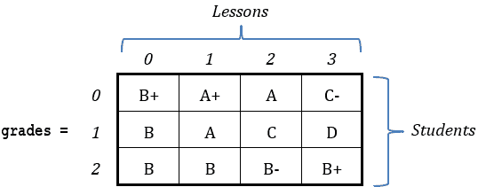

二维列表有行和列。在这个特定的例子中，列表 grades 有 3 行和 4 列。

与一些其他编程语言不同，Python 不直接支持二维列表。Python 主要支持一维列表，但您可以使用一个技巧来解决这个问题并创建多维列表：您可以创建一个列表的列表！将 grades 列表想象成一个单列列表，有三个元素（每个学生一个），每个元素都包含一个完全新的列表，有四个元素（每个课程一个），如下所示。

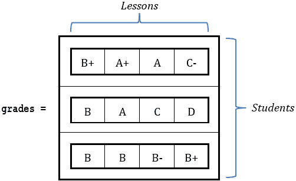

在 Python 中，二维列表是列表的列表，三维列表是列表的列表的列表，依此类推。

与一维列表一样，有四种方法可以创建和向二维列表添加元素（及其值）。让我们尝试使用这些方法中的每一种来创建列表 grades。

首种方法

您可以使用以下一般形式的语句在 Python 中创建二维列表，

list_name = [None] * number_of_rows

其中

►list_name 是列表的名称。

►number_of_rows 可以是任何正整数。

然后，您可以使用以下一般形式的语句将完全新的列表分配给其每个元素

list_name[index] = [value0, value1, value2, …, valueM]

其中

►index 是列表中元素的索引位置。

►value0-0, value0-1, value0-2, …, valueN-M 是列表元素的值。

下面的代码片段创建了列表 grades，并将其元素分配了三个列表（及其值）。

grades = [None] * 3

grades[0] = ["B+", "A+", "A", "C-"]

grades[1] = ["B", "A", "C", "D"]

grades[2] = ["B", "B", "B-", "B+"]

第二种方法

您可以创建一个完全空的列表，并无需使用索引即可向其中添加新列表，如下面的代码片段所示，以一般形式给出。

list_name = []

list_name.append([value0-0, value0-1, value0-2, …, value0-M])

list_name.append([value1-0, value1-1, value1-2, …, value1-M])

list_name.append([value2-0, value2-1, value2-2, …, value2-M])

…

list_name.append([valueN-0, valueN-1, valueN-2, …, valueN-M])

下面的代码片段创建了列表 grades，并向其中添加了三个列表（及其值）。

grades = []

grades.append(["B+", "A+", "A", "C-"])

grades.append(["B", "A", "C", "D"])

grades.append(["B", "B", "B-", "B+"])

请注意，在此方法中，默认情况下索引编号从零开始。

第三种方法

您可以创建一个列表并直接向其中添加值，如下面的 Python 语句所示，以一般形式给出。

list_name = [

[value0-0, value0-1, value0-2, …, value0-M],

[value1-0, value1-1, value1-2, …, value1-M],

[value2-0, value2-1, value2-2, …, value2-M],

…

[valueN-0, valueN-1, valueN-2, …, valueN-M]

]

因此，可以使用以下语句创建列表 grades。

grades = [

["B+", "A+", "A", "C-"],

["B", "A", "C", "D"],

["B", "B", "B-", "B+"]

]

这也可以写成一行，如下所示：

grades = [["B+", "A+", "A", "C-"], ["B", "A", "C", "D"], ["B", "B", "B-", "B+"]]

第四种方法

最后但同样重要的是，你可以使用以下语句在 Python 中创建二维列表，以下为一般形式：

list_name = [[None] * number_of_columns for i in range(number_of_rows)]

其中 number_of_rows 和 number_of_columns 可以是任何正整数。

然后，你可以使用以下语句为列表元素赋值，以下为一般形式：

list_name[row_index][column_index] = value

其中 row_index 和 column_index 分别是列表中元素的行索引和列索引位置。

以下代码片段创建了列表 grades 并为其元素赋值。

grades = [[None] * 4 for i in range(3)]

grades[0][0] = "B+"

grades[0][1] = "A+"

grades[0][2] = "A"

grades[0][3] = "C-"

grades[1][0] = "B"

grades[1][1] = "A"

grades[1][2] = "C"

grades[1][3] = "D"

grades[2][0] = "B"

grades[2][1] = "B"

grades[2][2] = "B-"

grades[2][3] = "B+"

### 31.2 如何从二维列表中获取值

二维列表由行和列组成。以下示例展示了具有三行四列的二维列表。

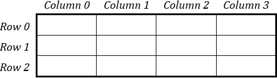

二维列表的每个元素都可以使用一对索引唯一标识：行索引和列索引，如下所示。

list_name[row_index][column_index]

以下 Python 程序创建了一个具有三行四列的二维列表 grades，并显示了一些其元素。

grades = [

["B+", "A+", "A", "C-"],

["B", "A", "C", "D"],

["B", "B", "B-", "B+"]

]

print(grades[1][2])        #它显示：C

print(grades[2][2])        #它显示：B-

print(grades[0][0])        #它显示：B+

#### 练习 31.2-1 创建跟踪表

为以下代码片段创建跟踪表。

a = [

[0, 0],

[0, 0],

[0, 0]

]

a[1][0] = 9

a[0][1] = 1

a[0][0] = a[0][1] + 6

x = 2

a[x][1] = a[0][0] + 4

a[x - 1][1] = a[0][1] * 3

a[x][0] = a[x - 1][1] - 3

解答

此代码片段使用一个 3×2 的列表，即一个有 3 行 2 列的列表。跟踪表如下。

| 步骤 | 语句 | 备注 | x | a |
| --- | --- | --- | --- | --- |

| 1 | a = [    [0, 0],

[0, 0],

[0, 0]

] | 这将创建一个包含零值的列表 a。 | ? |

&#124; 0 &#124; 0 &#124;

&#124; 0 &#124; 0 &#124;

&#124; 0 &#124; 0 &#124;

|

| 2 | a[1][0] = 9 |   | ? |
| --- | --- | --- | --- |

&#124; 0 &#124; 0 &#124;

&#124; 9 &#124; 0 &#124;

&#124; 0 &#124; 0 &#124;

|

| 3 | a[0][1] = 1 |   | ? |
| --- | --- | --- | --- |

&#124; 0 &#124; 1 &#124;

&#124; 9 &#124; 0 &#124;

&#124; 0 &#124; 0 &#124;

|

| 4 | a[0][0] = a[0][1] + 6 |   | ? |
| --- | --- | --- | --- |

&#124; 7 &#124; 1 &#124;

&#124; 9 &#124; 0 &#124;

| 0 | 0 |

|

| 5 | x = 2 | | 2 |
| --- | --- | --- | --- |

| 7 | 1 |

| 9 | 0 |

| 0 | 0 |

|

| 6 | a[x][1] = a[0][0] + 4 | | 2 |
| --- | --- | --- | --- |

| 7 | 1 |

| 9 | 0 |

| 0 | 11 |

|

| 7 | a[x − 1][1] = a[0][1] * 3 | | 2 |
| --- | --- | --- | --- |

| 7 | 1 |

| 9 | 3 |

| 0 | 11 |

|

| 8 | a[x][0] = a[x − 1][1] - 3 | | 2 |
| --- | --- | --- | --- |

| 7 | 1 |

| 9 | 3 |

| 0 | 11 |

|

### 31.3 如何遍历二维列表

由于二维列表由行和列组成，程序可以遍历行或列。

遍历行

遍历行意味着首先处理行 0，然后是行 1，接着是行 2，依此类推。下面是一个 3 × 4 列表的例子。箭头显示了在遍历行时遵循的“路径”，换句话说，它们显示了处理元素时的顺序。

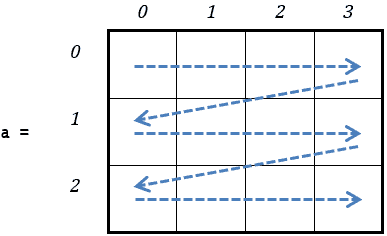

3 × 4 列表是一个二维列表，有 3 行和 4 列。在 Y × X 的表示法中，第一个数字（Y）始终代表总行数，第二个数字（X）始终代表总列数。

当遍历行时，列表的元素按以下顺序处理：

►行 0 的元素按以下顺序处理

a[0][0] → a[0][1] → a[0][2] → a[0][3]

►行 1 的元素按以下顺序处理

a[1][0] → a[1][1] → a[1][2] → a[1][3]

►行 2 的元素按以下顺序处理

a[2][0] → a[2][1] → a[2][2] → a[2][3]

第一种方法

使用 Python 语句，让我们尝试通过遍历行来处理 3 × 4 列表（3 行 × 4 列）的所有元素。

i = 0 # 变量 i 指向行 0。

for j in range(4): # 这个循环控制结构处理行 0 的所有元素

process a[i][j]

i = 1 # 变量 i 指向行 1。

for j in range(4): # 这个循环控制结构处理行 1 的所有元素

process a[i][j]

i = 2 # 变量 i 指向行 2。

for j in range(4): # 这个循环控制结构处理行 2 的所有元素

process a[i][j]

当然，可以使用下面的嵌套循环控制结构达到相同的结果。

for i in range(3):

for j in range(4):

> process a[i][j]

让我们看看一些例子。以下代码片段允许用户将 10 × 10 = 100 个值输入到列表 b 中。

for i in range(10):

for j in range(10):

> b[i][j] = input()

以下代码片段将列表 b 的所有值减一。

for i in range(10):

for j in range(10):

> b[i][j] -= 1 # 等价于：b[i][j] = b[i][j] − 1

以下代码片段显示了列表 b 的所有元素。

for i in range(10):

for j in range(10):

> print(b[i][j], end = "\t")

print()

print()语句用于在行之间“显示”换行符。

第二种方法

也有另一种非常简单但不如前一种灵活的方法。在某些情况下，它不能使用，您将在下面看到。以下是一个通用形式的代码片段

for row in list_name:

for element in row:

> process element

其中 process 是每次迭代处理列表中一个元素的任何 Python 语句或语句块。

以下 Python 程序，在每次迭代中显示列表 b 的所有元素。

for row in b:

for element in row:

> print(element, end = "\t")

print()

请记住，这种方法不能用来改变列表中元素的价值。例如，如果你想将列表 numbers 中所有元素的价值加倍，你不能这样做：

numbers = [

[5, 10, 3, 2],

[2, 4, 1, 6]

]

for x in numbers:

for number in x:

> number = number * 2

遍历列

遍历列意味着首先处理列 0，然后是列 1，接着是列 2，依此类推。以下是一个 3 × 4 列表的例子。箭头显示了处理元素的顺序。

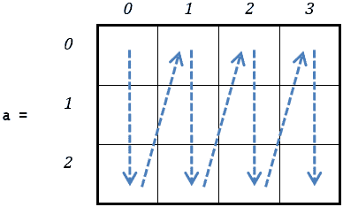

当遍历列时，列表的元素按以下顺序处理：

►第 0 列的元素按以下顺序处理

a[0][0] → a[1][0] → a[2][0]

►第 1 列的元素按以下顺序处理

a[0][1] → a[1][1] → a[2][1]

►第 2 列的元素按以下顺序处理

a[0][2] → a[1][2] → a[2][2]

►第 3 列的元素按以下顺序处理

a[0][3] → a[1][3] → a[2][3]

使用 Python 语句，让我们尝试通过遍历列来处理一个 3 × 4 的列表（3 行 × 4 列）的所有元素。

j = 0                   # 变量 j 指代第 0 列。

for i in range(3):      # 这个循环控制结构处理第 0 列的所有元素

process a[i][j]

j = 1                   # 变量 j 指代第 1 列。

for i in range(3):      # 这个循环控制结构处理第 1 列的所有元素

process a[i][j]

j = 2                   # 变量 j 指代第 2 列。

for i in range(3):      # 这个循环控制结构处理第 2 列的所有元素

process a[i][j]

j = 3                   # 变量 j 指代第 3 列。

for i in range(3):      # 这个循环控制结构处理第 3 列的所有元素

process a[i][j]

当然，可以使用嵌套循环控制结构达到相同的结果，如下所示。

for j in range(4):

for i in range(3):

> process a[i][j]

如您所见，这段代码片段与遍历行的代码片段只有一个不同点：两个 for 循环的位置互换了。但请注意。在 process a[i][j] 的语句中，永远不要互换索引变量 i 和 j 的位置。以下是一个例子。它试图遍历一个 3 × 4 的列表（3 行 × 4 列），但它不满足确定性的性质。你能找出原因吗？

for j in range(4):

for i in range(3):

> 处理 process a[j][i]

问题出现在变量 j 等于 3 时。语句 process a[j][i] 尝试处理第 3 行的元素（这是第四行），当然，这是不存在的！还是不明白？别担心！在 3 × 4 的列表中根本不存在第 3 行索引！由于行索引编号从 0 开始，实际上只有行 0、1 和 2 存在！

### 31.4 如何将用户输入的值添加到二维列表中

正如在单维列表中一样，您可以直接将键盘输入的值直接赋给特定的列表元素，而不仅仅是读取一个值并将其赋给一个变量。以下代码片段创建了一个二维列表 names，提示用户输入六个值，并将这些值赋给列表的元素。

names = [[None] * 2 for i in range(3)]

names[0][0] = input("为第 0 行第 0 列输入名称: ")

names[0][1] = input("为第 0 行第 1 列输入名称: ")

names[1][0] = input("为第 1 行第 0 列输入名称: ")

names[1][1] = input("为第 1 行第 1 列输入名称: ")

names[2][0] = input("为第 2 行第 0 列输入名称: ")

names[2][1] = input("为第 2 行第 1 列输入名称: ")

使用嵌套循环，此代码片段可以等效地写成

ROWS = 3

COLUMNS = 2

names = [[None] * COLUMNS for i in range(ROWS)]

for i in range(ROWS):

for j in range(COLUMNS):

> names[i][j] = input("为第 " + str(i) + " 行第 " + str(j) + " 列输入名称: ")

当然，您也可以使用 append() 方法完成同样的操作，如下面的代码片段所示。

ROWS = 3

COLUMNS = 2

names = []   # 创建一个完全空的列表

for i in range(ROWS):

names.append([])  # 在列表 names 中添加一个完全空的列表

for j in range(COLUMNS):

> name = input("为第 " + str(i) + " 行第 " + str(j) + " 列输入名称: ")
> 
> names[i].append(name)

#### 练习 31.4-1 仅显示实数

编写一个 Python 程序，提示用户在一个 5 × 7 的列表中输入数值，然后显示包含实数的元素索引。

Solution

遍历行是最常用的方法，所以让我们使用它。解决方案如下。

 file_31.4-1

ROWS = 5

COLUMNS = 7

a = [[None] * COLUMNS for i in range(ROWS)]

for i in range(ROWS):

for j in range(COLUMNS):

> a[i][j] = float(input("为元素 " + str(i) + ", " + str(j) + " 输入值: "))

for i in range(ROWS):

for j in range(COLUMNS):

> if a[i][j] != int(a[i][j]):  # 检查是否为实数（浮点数）
> 
> > print("在位置找到实数：", i , ",", j)

#### 练习 31.4-2 仅显示奇数列

编写一个 Python 程序，提示用户在一个 5 × 7 的列表中输入数值，然后显示具有奇数索引的列的元素（即列索引 1、3 和 5）。

Solution

下面的 Python 程序展示了如何使用 append() 方法将用户输入的值添加到列表 b 中。

 file_31.4-2

ROWS = 5

COLUMNS = 7

b = []

for i in range(ROWS):

b.append([])

for j in range(COLUMNS):

> b[i].append(float(input("Enter a value for element " + str(i) + ", " + str(j) + ": ")))

#遍历列

for j in range(1, COLUMNS, 2):     #从 1 开始，每次增加 2

for i in range(ROWS):

> print(b[i][j])

这本书尽可能地使用变量 i 作为行索引，变量 j 作为列索引。当然，你也可以使用其他变量名，例如 row、r 作为行索引，或 column、c 作为列索引，但 i 和 j 是大多数程序员广泛使用的变量。使用了一段时间之后，你的大脑就会将 i 与行联系起来，将 j 与列联系起来。因此，每个使用这些变量名作为二维列表索引的算法或程序都将更容易理解。

### 31.5 变量 i 和 j 的故事是什么？

许多程序员认为变量 i 的名字代表“索引”，而 j 被使用仅仅是因为它跟在 i 的后面。其他人认为 i 的名字代表“整数”。可能真相就在中间某个地方。

在计算机出现之前，数学家就已经使用 i、j 和 k 来表示整数。后来，在 FORTRAN 中，作为第一种高级计算机语言之一，变量 i、j、k、l、m 和 n 默认为整数。因此，最初的程序员在他们的程序中开始使用变量 i 和 j，这成为了大多数计算机语言中的惯例。

### 31.6 方阵

在数学中，具有相同行数和列数的矩阵称为方阵。以下是一些方阵的示例。

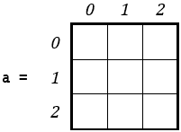

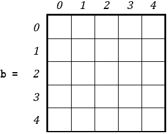

#### 练习 31.6-1 查找主对角线上元素的总和

编写一个 Python 程序，允许用户输入数值到一个 10 × 10 的列表中，然后计算其主对角线上元素的总和。

解决方案

在数学中，一个方阵的主对角线是从左上角到右下角运行的那些元素的集合。以下是一些带有主对角线以深色背景突出显示的方阵示例。

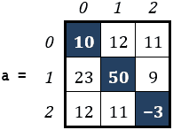

注意，主对角线上的元素其行索引等于其列索引。

你可以使用两种不同的方法来计算主对角线上元素的总和。让我们来研究这两种方法。

第一种方法 – 遍历所有元素

在这种方法中，程序遍历行并检查行索引是否等于列索引。对于表示为 N × N 的方阵（在这种情况下，列表），行数和列数相等，因此你可以定义一个常数 N。解决方案如下。

 file_31.6-1a

N = 10

a = [[None] * N for i in range(N)]

for i in range(N):

for j in range(N):

> a[i][j] = float(input())

#计算总和

total = 0

for i in range(N):

for j in range(N):

> if i == j:
> 
> > total += a[i][j]    # 这等价于：total = total + a[i][j]

print("Sum =", total)

请注意，程序遍历行并检查行索引是否等于列索引。或者，可以通过遍历列得到相同的结果。

在这种方法中，负责计算总和的嵌套循环结构执行了 10 × 10 = 100 次迭代。

第二种方法 – 直接遍历主对角线

在这种方法中，单个循环控制结构直接遍历主对角线。解答如下。

 file_31.6-1b

N = 10

a = []

for i in range(N):

a.append([])

for j in range(N):

> a[i].append(float(input()))

# 计算总和

total = 0

for k in range(N):

total += a[k][k]

print("Sum =", total)

这种方法比第一种方法更高效，因为负责计算总和的 for 循环只执行了 10 次迭代。

#### 练习 31.6-2 计算反对角线上元素的总和

编写一个 Python 程序，允许用户在一个 5 × 5 列表中输入数值，然后计算其反对角线上元素的总和。

解答

在数学中，方阵的反对角线是从列表的右上角到左下角的元素集合。接下来，你可以找到一个 5 × 5 方阵的例子，其反对角线通过深色背景突出显示。

.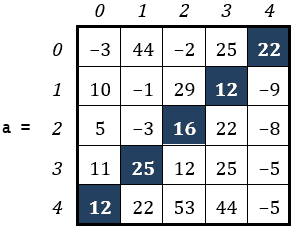

N × N 列表中任何反对角线元素的索引满足以下方程：

i + j = N - 1

其中变量 i 和 j 分别对应行和列索引。

如果解出 j，方程变为：

j = N - i - 1

使用这个公式，你可以计算出反对角线上任何元素的索引；也就是说，对于变量 i 的任何值，你可以找到变量 j 的对应值。例如，在之前的 5 × 5 方阵列表中，N 等于 5，当 i 为 3 时，变量 j 的值为：

j = N - i - 1 ⟺ j = 5 − 3 − 1 ⟺ j = 1

Using all this knowledge, let's now write the corresponding Python program.

 file_31.6-2

N = 5

a = [[None] * N for i in range(N)]

for i in range(N):

for j in range(N):

> a[i][j] = float(input())

# 计算总和

total = 0

for i in range(N):

j = N - i - 1       # 等价于：

total += a[i][j]    # total += a[i][N - i - 1]

print("Sum =", total)

请注意，负责寻找反对角线上元素总和的 for 循环直接遍历反对角线。

#### 练习 31.6-3 填充列表

编写一个 Python 程序，创建并显示以下列表。

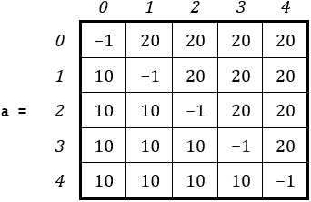

解答

正如你所见，主对角线上有-1 的值。你已经知道，方阵主对角线上的元素的一个共同特点是它们的行索引等于它们的列索引。现在，你还需要找到包含值 10 的所有元素之间的一个共同特点，以及包含值 20 的所有元素之间的另一个这样的共同特点。实际上，确实存在这样的特点！任何包含值 10 的元素的行索引在所有情况下都大于其对应的列索引，同样，任何包含值 20 的元素的行索引在所有情况下都小于其对应的列索引。

因此，Python 程序如下所示。

 file_31.6-3

N = 5

a = [[None] * N for i in range(N)]

for i in range(N):

for j in range(N):

> if i == j:
> 
> > a[i][j] = -1
> > 
> elif i > j:
> 
> > a[i][j] = 10
> > 
> else:
> 
> > a[i][j] = 20

for i in range(N):

for j in range(N):

> print(a[i][j], end = "\t")

print()

### 31.7 复习问题：对/错

对以下每个陈述选择对或错。

1)二维列表的所有元素必须包含不同的值。

2)为了引用二维列表中的元素，你需要两个索引。

3)二维列表的两个索引必须是两个变量，或者两个常量值。

4)一个 5×6 的列表是一个具有五列和六行的二维列表。

5)要引用列表 b 中第二行第三列的元素，你会写 b[2][3]。

6)遍历行意味着二维列表的第一行首先被处理，然后是第二行，依此类推。

7)你不能使用除了 i 和 j 之外的变量来遍历二维列表。

8)以下 Python 语句创建了一个二维列表。

names = [[None] * 2 for i in range(6)]

9)以下代码片段创建了一个包含四个元素的二维列表，并给它们赋值。

names = [[None] * 2 for i in range(2)]

names[0][0] = "John"

names[0][1] = "George"

names[1][0] = "Sally"

names[1][1] = "Angelina"

10)以下代码片段将值 10 赋给索引为 0 的行中的元素。

values[0][0] = 7

values[0][values[0][0]] = 10

11)以下语句将“Sally”这个名字添加到索引为 1 的行中的元素。

names = [["John", "George"], ["Sally", "Angelina"]]

12)以下代码片段在屏幕上显示“Sally”这个名字。

names = [[None] * 2 for i in range(2)]

k = 0

names[0][k] = "John"

k += 1

names[0][k] = "George"

names[1][k] = "Sally"

k -= 1

names[1][k] = "Angelina"

print(names[1][1])

13)以下代码片段满足确定性的特性。

grades = [["B+", "A+"], ["A", "C-"]]

print(grades[2][2])

14)以下代码片段满足确定性的特性。

values = [[1, 0], [2, 0]]

print(values[values[0][0]][values[0][1]])

15)以下代码片段在屏幕上显示值 2。

values = [[0, 1], [2, 0]]

print(values[values[0][1]][values[0][0]])

16)以下代码片段显示了一个 3 × 4 列表的所有元素。

for k in range(12):

i, j = divmod(k, 4)

print(names[i][j])

17)以下代码片段允许用户将 100 个值输入到列表 b 中。

for i in range(10):

for j in range(10):

> b[i][j] = input()

18)如果列表 b 包含 10 × 20 个元素，以下代码片段将所有元素值加倍。

for i in range(9, -1, -1):

for j in range(19, -1, -1):

> b[i][j] *= 2

19)如果列表 b 包含 10 × 20 个元素，以下代码片段显示其中的一些。

for i in range(0, 10, 2):

for j in range(20):

> print(b[i][j])

for i in range(1, 10, 2):

for j in range(20):

> print(b[i][j])

20)以下代码片段仅显示具有偶数索引的列。

for j in range(0, 12, 2):

for i in range(10):

> print(a[i][j])

21)一个 5 × 5 的列表是一个正方形列表。

22)在 N × N 列表的主对角线上，所有元素的行索引等于它们的列索引。

23)在数学中，一个正方形矩阵的反对角线是从列表的左上角到右下角的所有元素的集合。

24)一个 N × N 列表反对角线上的任何元素都满足方程 i + j = N − 1，其中变量 i 和 j 分别对应行和列索引。

25)以下代码片段计算了一个 N × N 列表主对角线上元素的总和。

total = 0

for k in range(N):

total += a[k][k]

26)以下代码片段显示了一个 N × N 列表反对角线上的所有元素。

for i in range(N - 1, -1, -1):

print(a[i][N - i - 1])

27)任何位于 N × N 列表主对角线下方的元素的列索引总是大于其对应的行索引。

### 31.8 复习题：多项选择题

选择以下每个语句的正确答案。

1)以下语句

lastNames = [None] * 5 for i in range(4)

a)包含逻辑错误。

b)包含语法错误。

c)是一个正确的语句。

d)以上皆非

2)以下代码片段

values = [[1, 0] [2, 0]]

print(values[values[0][0], values[0][1]])

a)包含逻辑错误。

b)包含语法错误。

c)以上皆非

3)以下代码片段

x = int(input())

y = int(input())

names[x][y] = 10

a)不满足有限性的属性。

b)不满足有效性的属性。

c)不满足确定性的属性。

d)以上皆非

4)如果变量 x 包含值 4，以下语句

names[x + 1][x] = 5

a)将值 5 赋给行索引为 5 和列索引为 4 的元素。

b)将值 5 赋给行索引为 4 和列索引为 5 的元素。

c)将值 5 赋给行索引为 5 和列索引为 5 的元素。

d)以上皆非

5)以下语句

names = [[3, 5, 2]]

a)将值 5 赋给行索引为 0 和列索引为 1 的元素。

b)将值 3 赋给行索引为 0 和列索引为 0 的元素。

c)将值 2 赋给行索引为 0，列索引为 2 的元素。

d)所有上述选项

e)以上皆非

6)以下语句

values = [[None] * 2 ]

a)创建一个 1 × 2 列表。

b)创建一个 2 × 1 列表。

c)创建一个一维列表。

d)以上皆非

7)你可以使用两个嵌套循环控制结构遍历二维列表，

a)变量 i 和 j 作为计数器。

b)变量 k 和 l 作为计数器。

c)变量 m 和 n 作为计数器。

d)使用任何变量作为计数器。

8)以下代码片段

names = [["John", "Sally"], ["George", "Maria"]]

for j in range(2):

for i in range(1, -1, -1):

> print(names[i][j])

a)按降序显示所有名称。

b)按降序显示一些名称。

c)按升序显示所有名称。

d)按升序显示一些名称。

e)以上皆非

9)如果列表 b 包含 30 × 40 个元素，以下代码片段

for i in range(30, 0, -1):

for j in range(40, 0, -1):

> b[i][j] *= 3

a)将一些元素值乘以 3。

b)将所有元素值乘以 3。

c)不满足确定性的性质。

d)以上皆非

10)如果列表 b 包含 30 × 40 个元素，以下代码片段

total = 0

for i in range(29, -1, -1):

for j in range(39, -1, -1):

> total += b[i][j]

average = total / 120

a)计算所有元素的总和。

b)计算所有元素的平均值。

c)所有上述选项

11)以下两个代码片段计算 N × N 列表主对角线上元素的总和，

total = 0

for i in range(N):

for j in range(N):

> if i == j:
> 
> > total += a[i][j]

total = 0

for k in range(N):

total += a[k][k]

a)但第一个更高效。

b)但第二个更高效。

c)以上皆非；两个代码片段执行效果相同

### 31.9 复习练习

Complete the following exercises.

1)为以下代码片段创建跟踪表。

a = [[None] * 3 for i in range(2)]

a[0][2] = 1

x = 0

a[0][x] = 9

a[0][x + a[0][2]] = 4

a[a[0][2]][2] = 19

a[a[0][2]][x + 1] = 13

a[a[0][2]][x] = 15

2)为以下代码片段创建跟踪表。

a = [[None] * 3 for i in range(2)]

for i in range(2):

for j in range(3):

> a[i][j] = (i + 1) * 5 + j

3)为以下代码片段创建跟踪表。

a = [[None] * 3 for i in range(3)]

for j in range(3):

for i in range(3):

> a[i][j] = (i + 1) * 2 + j * 4

4)尝试不使用跟踪表，确定在以下代码片段执行后列表将包含的值。为此进行三次不同的执行。相应的输入值是：(i) 5，(ii) 9，和 (iii) 3。

a = [[None] * 3 for i in range(2)]

x = int(input())

for i in range(2):

for j in range(3):

> a[i][j] = (x + i) * j

5)尝试不使用跟踪表，确定在以下代码片段执行后列表将包含的值。为此进行三次不同的执行。相应的输入值是：(i) 13，(ii) 10，和 (iii) 8。

a = [[None] * 3 for i in range(2)]

x = int(input())

for i in range(2):

for j in range(3):

> if j < x % 4:
> 
> > a[i][j] = (x + i) * j
> > 
> else:
> 
> > a[i][j] = (x + j) * i + 3

6)在不使用跟踪表的情况下，尝试确定以下代码片段执行后列表将包含的值。

a = [[18, 10, 35], [32, 12, 19]]

for j in range(3):

for i in range(2):

> if a[i][j] < 13:
> 
> > a[i][j] /= 2
> > 
> elif a[i][j] < 20:
> 
> > a[i][j] += 1
> > 
> else:
> 
> > a[i][j] -= 4

7)在不使用跟踪表的情况下，尝试确定以下代码片段执行后列表将包含的值。

a = [[11, 10], [15, 19], [22, 15]]

for j in range(2):

for i in range(3):

> if i == 2:
> 
> > a[i][j] += a[i - 1][j]
> > 
> else:
> 
> > a[i][j] += a[i + 1][j]

8)假设列表 a 包含以下值。

.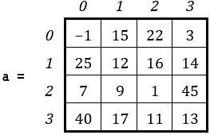

执行以下每个代码片段后，屏幕上显示什么？

i)

for i in range(3):

for j in range(3):

print(a[i][j], end = " ")

ii)

for i in range(2, -1, -1):

for j in range(3):

print(a[i][j], end = " ")

iii)

for i in range(3):

for j in range(2, -1, -1):

print(a[i][j], end = " ")

iv)

for i in range(2, -1, -1):

for j in range(2, -1, -1):

print(a[i][j], end = " ")

v)

for j in range(3):

for i in range(3):

print(a[i][j], end = " ")

vi)

for j in range(3):

for i in range(2, -1, -1):

print(a[i][j], end = " ")

vii)

for j in range(2, -1, -1):

for i in range(3):

print(a[i][j], end = " ")

viii)

for j in range(2, -1, -1):

for i in range(2, -1, -1):

print(a[i][j], end = " ")

9)编写一个 Python 程序，允许用户在一个 10 × 15 列表中输入整数，然后显示包含奇数的元素的索引。

10)编写一个 Python 程序，允许用户在一个 10 × 6 列表中输入数值，然后显示索引为偶数的列的元素（即列索引 0、2 和 4）。

11)编写一个 Python 程序，允许用户在一个 12 × 8 列表中输入数值，然后计算并显示具有偶数列索引和奇数行索引的元素的和。

12)编写一个 Python 程序，允许用户在一个 8 × 8 正方形列表中输入数值，然后计算主对角线和副对角线上元素的平均值。尝试在同一个循环控制结构中计算这两个平均值。

13)编写一个 Python 程序，创建并显示以下列表。

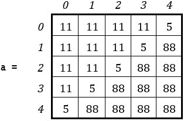

14)编写一个 Python 程序，创建并显示以下列表。

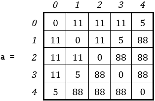

15)编写一个 Python 程序，允许用户在一个 5 × 4 列表中输入数值，然后显示包含整数的元素行和列索引。

16)编写一个 Python 程序，允许用户在一个 10 × 4 列表中输入数值，然后计算并显示负元素的总数。

17)编写一个 Python 程序，允许用户在一个 3 × 4 列表中输入单词，然后以空格字符显示它们。

18) 编写一个 Python 程序，允许用户在一个 20 × 14 的列表中输入单词，然后显示那些少于五个字符的单词。

提示：使用 len()函数。

19) 编写一个 Python 程序，允许用户在一个 20 × 14 的列表中输入单词，并显示那些少于 5 个字符的单词，然后是少于 10 个字符的单词，最后是少于 20 个字符的单词。

提示：尝试使用三个嵌套的循环来显示这些单词。
