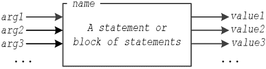
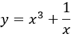
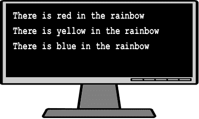
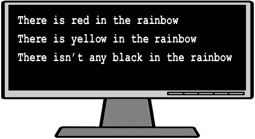

## 第三十五章

用户定义的子程序

### 35.1 返回值的子程序

在 Python 和许多其他计算机语言中，返回值的子程序称为函数。Python 中有两种函数类别。有内置函数，如 int()、float()，还有用户定义函数，即你可以亲自编写并在自己的程序中使用它们。

返回一个或多个值的 Python 函数的一般形式如下所示。

def name([arg1, arg2, arg3, …]):

一个语句或语句块

return value1 [, value2, value3, … ]

其中

►name 是函数的名称。

►arg1、arg2、arg3、… 是参数（变量、列表等）的列表，用于从调用者传递值到函数。可以有你需要那么多参数。

►value1, value2, value3, … 是返回给调用者的值。它们可以是常量值、变量、表达式，甚至是数据结构。

注意，参数是可选的；也就是说，一个函数可能不包含任何参数。

在第 5.4 节中，你学习了在给变量命名时必须遵循的规则。给子程序命名遵循完全相同的规则！

函数名称可以比作一个盒子（见图 35–1），其中包含一个语句或语句块。它接受 arg1、arg2、arg3、…作为输入值，并返回 value1、value2、value3、…作为输出值。

图 35–1 函数可以比作一个盒子

例如，下一个函数通过参数 num1 和 num2 接受两个数字，然后计算它们的和并返回结果。

def getSum(num1, num2):

result = num1 + num2

return result

当然，这也可以写成

def getSum(num1, num2):

return num1 + num2

下一个函数计算两个数字的和与差，并返回结果。

def getSumDif(num1, num2):

s = num1 + num2

d = num1 - num2

return s, d

### 35.2 如何调用函数

每次调用函数都是这样的：你写下函数的名称，后面跟着一个参数列表（如果需要），要么在一个将函数返回值分配给变量的语句中，要么直接在表达式中。

让我们看看一些例子。以下函数通过参数 num 接受一个数值，然后返回该数值的三次幂的结果。

def cube(num):

result = num ** 3

return result

现在，假设你想计算以下表达式的结果

.

你可以将函数 cube()返回的值分配给一个变量，如下所示

x = float(input())

cb = cube(x)            #将返回的值分配给变量

y = cb + 1 / x          #并使用该变量

print(y)

或者你可以在表达式中直接调用函数，

x = float(input())

y = cube(x) + 1 / x     #直接在表达式中调用函数

print(y)

或者你甚至可以直接在 print()语句中调用函数。

x = float(input())

print(立方(x) + 1 / x)  #直接在 print()语句中调用函数

用户定义的函数可以像 Python 的内置函数一样调用。

现在让我们看看另一个例子。下一个 Python 程序定义了函数 getMessage()，然后主代码调用它。返回值被分配给变量 a。

 file_35.2a

#定义函数

def 获取消息():

msg = "你好，宙斯"

返回消息

#主代码从这里开始

print("你好！")

a = 获取消息()

print(a)

如果你运行这个程序，将显示以下消息。

.

函数在程序开始运行时不会立即执行。在上一个例子中，实际执行的第一个语句是 print("你好！")。

你可以向函数传递（发送）值，只要函数的括号内至少有一个参数存在。在下一个例子中，函数 display()被调用了三次，但每次通过参数颜色传递了不同的值。

 file_35.2b

#定义函数

def 显示(颜色):

msg = "彩虹中有" + 颜色 + "的"

返回消息

#主代码从这里开始

print(显示("红色"))

print(显示("黄色"))

print(显示("蓝色"))

如果你运行这个程序，将显示以下消息。

在下一个例子中，必须向函数 display()传递两个值。

 file_35.2c

def 显示(颜色, exists):

neg = ""

if not exists:

> neg = "n't any"

return "There is" + neg + " " + 颜色 + " in the rainbow"

#主代码从这里开始

print(显示("红色", True))

print(显示("黄色", True))

print(显示("黑色", False))

如果你运行这个程序，将显示以下消息。

在 Python 中，你必须将你的子程序放在你的主代码之上。在其他计算机语言中，例如 Java 或 PHP，你可以将你的子程序放在主代码之上或之下。即使如此，然而，大多数程序员更喜欢将所有子程序放在顶部，以便更好地观察。

正如之前提到的，Python 中的函数可以返回多个值。下一个例子提示用户输入他们的名字和姓氏，然后显示它们。

 file_35.2d

#定义函数

def 获取全名():

firstName = input("输入名字: ")

lastName = input("输入姓氏: ")

return firstName, lastName

#主代码从这里开始

fname, lname = 获取全名()

print("名字:", fname)

print("姓氏:", lname)

### 35.3 不返回值的子程序

在计算机科学中，不返回值的子程序可以被称为过程、子过程、子程序、空函数、空方法等。在 Python 中，通常首选的术语是空函数。

Python 空函数的一般形式是

def name([arg1, arg2, arg3, …]):

一个语句或语句块

where

►name 是空函数的名称。

►arg1, arg2, arg3, … 是用于从调用者传递值到空函数的参数（变量、列表等）列表。可以有任意多的参数。

请注意，参数是可选的；也就是说，空函数可以不包含任何参数。

例如，下一个空函数通过参数 num1 和 num2 接收两个数字，然后计算它们的和，最后显示结果。

def displaySum(num1, num2):

result = num1 + num2

print(result)

### 35.4 如何调用空函数

您可以通过仅写出其名称来调用空函数。下一个示例定义了空函数 displayLine() 和主代码在需要显示水平线时调用空函数。

 file_35.4a

#定义空函数

def displayLine():

print("-----------------------------")

#主代码从这里开始

print("Hello there!")

displayLine()

print("How do you do?")

displayLine()

print("What is your name?")

displayLine()

您可以向空函数传递（发送）值，只要在空函数的括号内至少存在一个参数。在下一个示例中，空函数 displayLine() 被调用了三次，但每次通过变量 length 传递了不同的值，结果打印了三条不同长度的线条。

 file_35.4b

def displayLine(length):

print("-" * length)

#主代码从这里开始

print("Hello there!")

displayLine(12)

print("How do you do?")

displayLine(14)

print("What is your name?")

displayLine(18)

由于空函数 displayLine() 不返回任何值，以下代码行是错误的。您不能将空函数赋值给变量，因为没有返回值！

y = display_line(12)

此外，您不能在语句中调用它。以下代码行也是错误的。

print("Hello there!\n", display_line(12))

### 35.5 形式参数和实际参数

每个函数（或空函数）都包含一个称为形式参数列表的参数列表。如前所述，此列表中的参数是可选的；形式参数列表可以不包含任何参数，包含一个参数，或包含多个参数。

当调用子程序（函数或空函数）时，可以向子程序传递一个参数列表。此列表称为实际参数列表。

在下一个示例中，形式参数（变量）n1 和 n2 构成形式参数列表，而形式参数（变量）x 和 y，以及形式参数（表达式）x + y 和 y / 2，构成实际参数列表。

 file_35.5

#定义函数 multiply()。

#n1 和 n2 这两个参数被称为形式参数。

def multiply(  n1, n2  ):    [[更多…]](more.html#more_35_5_1)

result = n1 * n2

return result

#主代码从这里开始

x = float(input())

y = float(input())

#调用 multiply()函数。

#两个参数 x 和 y 被称为实际参数。

w = multiply( x, y )      [[更多…]](more.html#more_35_5_2)

print(w)

#调用 multiply()函数。

#两个参数 x + y 和 y / 2 被称为实际参数。

print(multiply( x + 2, y / 2 ))     [[更多…]](more.html#more_35_5_3)

注意形式参数和实际参数之间存在一对一的对应关系。在第一次调用中，实际参数 x 的值传递给形式参数 n1，实际参数 y 的值传递给形式参数 n2。在第二次调用中，实际参数（表达式结果）x + 2 的值传递给形式参数 n1，实际参数（表达式结果）y / 2 的值传递给形式参数 n2。

### 35.6 函数是如何执行的？

当主代码调用函数时，以下步骤被执行：

►主代码的语句执行被中断。

►变量值或实际参数列表中存在的表达式的结果被传递（分配）到形式参数列表中对应的参数（变量）中，执行流程转到函数定义的位置。

►函数的语句被执行。

►当执行流程到达返回语句时，一个或多个值从函数返回到主代码，执行流程从调用函数之前的位置继续。

在下一个 Python 程序中，函数 maximum()接受两个参数（数值）并返回两个值中较大的一个。

 file_35.6

def maximum(val1, val2):

m = val1

if val2 > m:

> m = val2

return m

#主代码从这里开始

a = float(input())

b = float(input())

maxim = maximum(a, b)

print(maxim)

当 Python 程序开始运行时，第一条执行的语句是 a = float(input())（这被认为是程序的第一条语句）。

下面是一个跟踪表，显示了执行流程的确切流程，变量 a 和 b 的值是如何从主代码传递到函数中，以及函数是如何返回其结果的。假设用户输入的值是 3 和 8。

| 步骤 | 主代码的语句 | a | b | maxim |
| --- | --- | --- | --- | --- |
| 1 | a = float(input()) | 3.0 | ? | ? |
| 2 | b = float(input()) | 3.0 | 8.0 | ? |
| 3 | maxim = maximum(a, b) |   |   |   |

当调用函数 maximum()时，主代码的语句执行被中断，变量 a 和 b 的值被传递（分配，如果你愿意）到相应的形式参数（变量）val1 和 val2，执行流程转到函数定义的位置。然后执行函数的语句。

| 步骤 | 函数 maximum()的语句 | val1 | val2 | m |
| --- | --- | --- | --- | --- |
| 4 | m = val1 | 3.0 | 8.0 | 3.0 |
| 5 | if val2 > m: | This evaluates to True |
| 6 | m = val2 | 3.0 | 8.0 | 8.0 |
| 7 | 返回 m |   |   |   |

当执行流程达到返回语句时，函数从函数返回值 8 到主代码（并分配给变量 maxim），然后执行流程从调用函数之前的地方继续。主代码在用户的屏幕上显示值 8。

| 步骤 | 主代码的语句 | a | b | maxim |
| --- | --- | --- | --- | --- |
| 8 | 打印(maxim) | 3.0 | 8.0 | 8.0 |

#### 练习 35.6-1 回归基础 - 计算两个数的和

执行以下操作：

i)编写一个名为 total 的子程序，它通过其形式参数列表接受两个数值，然后计算并返回它们的和。

ii)使用上述子程序，编写一个 Python 程序，允许用户输入两个数字，然后显示它们的和。接下来，创建一个跟踪表以确定 Python 程序每个步骤中变量的值，针对两次不同的执行。

两次执行的输入值分别是：(i) 2, 4；和(ii) 10, 20。

解答

在这个练习中，你需要编写一个函数，它接受调用者提供的两个值（这是主代码），然后计算并返回它们的和。解答在这里展示。

 file_35.6-1

def total(a, b):

s = a + b

return s

#主代码从这里开始

num1 = float(input())

num2 = float(input())

result = total(num1, num2)

print("The sum of", num1, "+", num2, "is", result)

现在，让我们创建相应的跟踪表。由于你已经更熟悉它们，所以已经移除了“备注”列。

i) 对于输入值 2 和 4，跟踪表看起来如下。

| 步骤 | 语句 | 主代码 | 函数 total() |
| --- | --- | --- | --- |
| num1 | num2 | 结果 | a | b | s |
| 1 | num1 = float(input()) | 2.0 | ? | ? |   |   |   |
| 2 | num2 = float(input()) | 2.0 | 4.0 | ? |   |   |   |
| 3 | result = total(num1, num2) |   |   |   | 2.0 | 4.0 | ? |
| 4 | s = a + b |   |   |   | 2.0 | 4.0 | 6.0 |
| 5 | 返回 s | 2.0 | 4.0 | 6.0 |   |   |   |
| 6 | 打印("The sum of… | 它显示：The sum of 2.0 + 4.0 is 6.0 |

ii)对于输入值 10 和 20，跟踪表如下。

| 步骤 | 语句 | 主代码 | 函数 total() |
| --- | --- | --- | --- |
| num1 | num2 | 结果 | a | b | s |
| 1 | num1 = float(input()) | 10.0 | ? | ? |   |   |   |
| 2 | num2 = float(input()) | 10.0 | 20.0 | ? |   |   |   |
| 3 | result = total(num1, num2) |   |   |   | 10.0 | 20.0 | ? |
| 4 | s = a + b |   |   |   | 10.0 | 20.0 | 30.0 |
| 5 | 返回 s | 10.0 | 20.0 | 30.0 |   |   |   |
| 6 | 打印("The sum of… | 它显示：The sum of 10.0 + 20.0 is 30.0 |

#### 练习 35.6-2 使用更少的代码行计算两个数的和！

使用更少的代码行重写上一个练习的 Python 程序。

解答

解答在这里展示。

 file_35.6-2

def total(a, b):

return a + b

#主代码从这里开始

num1 = float(input())

num2 = float(input())

print("The sum of", num1, "+", num2, "is", total(num1, num2))

与前一个练习的解决方案相反，在这个方法 total()中，总和不是分配给变量 s，而是直接计算并返回。此外，在这个主代码中，返回的值不是分配给变量，而是直接显示。

用户定义的函数可以像 Python 的内置函数一样调用。

### 35.7 如何执行空函数？

当主代码调用空函数时，执行以下步骤：

►主代码的语句执行被中断。

►实际参数列表中存在的变量值或表达式的结果被传递（分配）到形式参数列表中相应的参数（变量）中，执行流程转到空函数的编写处。

►空函数的语句被执行。

►当执行流程达到空函数的末尾时，执行流程从调用空函数之前的位置继续。

在下一个 Python 程序中，空函数 minimum()通过其形式参数列表接受三个参数（数值）并显示最小值。

 file_35.7

def minimum(val1, val2, val3):

minim = val1

if val2 < minim:

> minim = val2

if val3 < minim:

> minim = val3

print(minim)

#主代码从这里开始

a = float(input())

b = float(input())

c = float(input())

minimum(a, b, c)

print("The end")

当 Python 程序开始运行时，首先执行的是语句 a = float(input())（这被认为是程序的第一条语句）。假设用户输入的值是 9、6 和 8。

| 步骤 | 主代码的语句 | a | b | c |
| --- | --- | --- | --- | --- |
| 1 | a = float(input()) | 9.0 | ? | ? |
| 2 | b = float(input()) | 9.0 | 6.0 | ? |
| 3 | c = float(input()) | 9.0 | 6.0 | 8.0 |
| 4 | minimum(a, b, c) |   |   |   |

当调用空函数 minimum()时，主代码的语句执行被中断，变量 a、b 和 c 的值被传递（分配）到相应的形式参数（变量）val1、val2 和 val3，然后执行空函数的语句。

| 步骤 | 空函数 minimum()的语句 | val1 | val2 | val3 | minim |
| --- | --- | --- | --- | --- | --- |
| 5 | minim = val1 | 9.0 | 6.0 | 8.0 | 9.0 |
| 6 | if val2 < minim: | 这评估为 True |
| 7 | minim = val2 | 9.0 | 6.0 | 8.0 | 6.0 |
| 8 | if val3 < minim: | 这评估为 False |
| 9 | print(minim) | 它显示：6.0 |

当执行流程达到空函数的末尾时，执行流程简单地从调用空函数之前的位置继续。

| 步骤 | 主代码的语句 | a | b | c |
| --- | --- | --- | --- | --- |
| 10 | print("The end") | 它显示：The end |

注意在步骤 9 和步骤 10 之间，从空函数中没有返回任何值到主代码。

#### 练习 35.7-1 回归基础 – 显示一个数的绝对值

执行以下操作：

i)编写一个名为 displayAbs 的子程序，它通过形式参数列表接受一个数值，然后显示其绝对值。不要使用 Python 的内置 abs()函数。

ii)使用上述子程序，编写一个 Python 程序，允许用户输入一个数字，然后显示其绝对值，接着显示用户提供的值。接下来，创建跟踪表以确定 Python 程序两次不同执行中每个步骤的变量值。

两次执行的输入值分别为：(i) 5，和(ii) −5。

解决方案

在这个练习中，你需要编写一个无返回值函数，该函数接受调用者传递的值（这是主代码部分）然后计算并显示其绝对值。解决方案如下所示。

 file_35.7-1

def displayAbs(n):

if n < 0:

> n = (-1) * n

print(n)

# 主代码从这里开始

a = float(input())

displayAbs(a)      # 这显示用户提供的数字的绝对值。

print(a)           # 这显示用户提供的数字。

现在，让我们创建相应的跟踪表。

i)对于输入值 5，跟踪表如下所示。

| 9)以下语句是一个有效的 Python 语句。 |
| --- |
| a | n |
| 1 | a = float(input()) | 5.0 |   |
| 2 | displayAbs(a) |   | 5.0 |
| 3 | if n < 0: | 这评估为 False |
| 步骤 | 语句 | 主代码 | 无返回值函数 displayAbs() |
| 5 | print(a) | 它显示：5.0 |

ii)对于输入值−5，跟踪表如下所示。

| 步骤 | 语句 | 主代码 | 无返回值函数 displayAbs() |
| --- | --- | --- | --- |
| a | n |
| 1 | a = float(input()) | −5.0 |   |
| 2 | displayAbs(a) |   | −5.0 |
| 3 | if n < 0: | 这评估为 True |
| 4 | n = (−1) * n |   | 5.0 |
| 5 | print(n) | 它显示：5.0 |
| 6 | print(a) | 它显示：−5.0 |

注意，在第 5 步中，无返回值函数的变量 n 包含值 5.0，但当执行流程在第 6 步返回主代码时，主代码中的变量 a 仍然包含值−5.0。实际上，主代码中变量 a 的值从未改变过！

### 35.8 复习问题：对/错

对以下每个陈述选择对或错。

1)Python 中有两种子程序类别，它们返回值。

2)用于将值传递给函数的变量被称为参数。

3)int()函数是一个用户定义的函数。

4)对用户定义函数的每次调用都与对 Python 内置函数的调用方式相同。

5)函数的形式参数列表可以有任意多个参数。

6)在函数中，形式参数列表必须至少包含一个参数。

7)在函数中，形式参数列表是可选的。

8)函数不能返回一个列表。

| 步骤 | 语句 | 主代码 | 无返回值函数 displayAbs() |

return x + 1

10)形式参数可以是一个表达式。

11)实际参数可以是一个表达式。

12)在 Python 中，函数可以没有实际参数列表中的参数。

13)接下来的语句调用了三次 cubeRoot()函数。

cb = cubeRoot(x) + cubeRoot(x) / 2 + cubeRoot(x) / 3

14)下面的代码片段显示的值与语句 print(cubeRoot(x)+5)完全相同

cb = cubeRoot(x)

y = cb + 5

print(y)

15)一个函数必须始终包含一个返回语句，而 void 函数则不必。

16)play-the-guitar 可以是一个有效的函数名。

17)在 Python 中，你可以将你的函数放在主代码的上方或下方。

18)当主代码调用函数时，主代码的语句执行被中断。

19)一般来说，一个函数可以不向调用者返回任何值。

20)函数 abs()是 Python 的一个内置函数。

21)下面的代码片段显示的值是 0.5。

def divide(b, a):

return a / b

a = 10.0

b = 5.0

print(divide(a, b))

22)在计算机科学中，一个不返回结果的子程序被称为 void 函数。

23)在 Python 中，你可以通过写出其名称后跟一个开括号和一个闭括号来调用 void 函数。

24)在主代码中进行的 void 函数调用中，实际参数列表中使用的变量必须是主代码中的变量。

25)在 void 函数调用中，实际参数列表中只能使用变量。

26)在 void 函数中，所有形式参数必须有不同的名字。

27)一个 void 函数必须在其形式参数列表中至少包含一个参数。

28)形式参数和实际参数之间存在一一对应关系。

29)你可以在一个语句中调用一个 void 函数。

30)当执行流程到达 void 函数的末尾时，执行流程从调用 void 函数之前的位置继续。

31)一个 void 函数不会向调用者返回任何值。

32)void 函数可以不接受任何值从调用者那里。

33)调用 void 函数的方式与调用函数的方式不同。

34)在下面的 Python 程序中，首先执行的是打印语句 print("Hello Aphrodite!").

def message():

print("Hello Aphrodite!")

print("Hi there!")

message()

### 35.9 复习练习

完成以下练习。

1)以下函数包含一些错误。你能找出它们吗？

def findMax(a, b)

if a > b:

> maximum = a

else:

> maximum = b

2)创建一个跟踪表，以确定在以下 Python 程序每一步中变量的值。

def sumDigits(a):

d1 = a % 10

d2 = a // 10

return d1 + d2

s = 0

for i in range(25, 28):

s += sumDigits(i)

print(s)

3)创建一个跟踪表，以确定在以下 Python 程序每一步中变量的值。

def sss(a):

total = 0

for k in range(1, a + 1):

> total += k

return total

i = 1

s = 0

while i < 6:

if i % 2 == 1:

> s += 1

else:

> s += sss(i)

i += 1

print(s)

4)创建一个跟踪表，以确定在输入值为 12 时，以下 Python 程序每一步中变量的值。

def customDiv(b, d):

return (b + d) // 2

k = int(input())

m = 2

a = 1

while a < 6:

if k % m != 0:

> x = customDiv(a, m)

else:

> x = a + m + customDiv(m, a)

print(m, a, x)

a += 2

m += 1

5)创建一个跟踪表，以确定当输入值 3、7、9、2 和 4 时，以下 Python 程序每一步中变量的值。

def display(a):

if a % 2 == 0:

> print(a, "是偶数")

else:

> print(a, "是奇数")

for i in range(5):

x = int(input())

display(x)

6)创建一个跟踪表，以确定以下 Python 程序每一步中变量的值。

def division(a, b):

b = b // a

print(a * b)

x = 20

y = 30

while x % y < 30:

division(y, x)

x = 4 * y

y += 1

7)创建一个跟踪表，以确定当输入值 2、3 和 4 时，以下 Python 程序每一步中变量的值。

def calculate(n):

s = 0

for j in range(2, 2 * n + 2, 2):

> s = s + j ** 2

print(s)

for i in range(3):

m = int(input())

calculate(m)

8)编写一个子程序，它通过形式参数列表接受三个数字，然后返回它们的总和。

9)编写一个子程序，它通过形式参数列表接受四个数字，然后返回它们的平均值。

10)编写一个子程序，它通过形式参数列表接受三个数字，然后返回最大值。尽量不使用 Python 的 max()函数。

11)编写一个子程序，它通过形式参数列表接受五个数字，然后显示最大值。

12)编写一个名为 myRound 的子程序，它通过形式参数列表接受一个实数，并将其四舍五入到两位小数。尽量不使用 Python 的 round()函数。

13)执行以下操作：

i)编写一个名为 findMin 的子程序，它通过形式参数列表接受两个数字，并返回较小的一个。尽量不使用 Python 的 min()函数。

ii)使用上述子程序，编写一个 Python 程序，提示用户输入四个数字，然后显示最小的数字。

14)执行以下操作：

i)编写一个名为 KelvinToFahrenheit 的子程序，它通过形式参数列表接受开尔文温度，并返回其华氏度等效值。

ii)编写一个名为 KelvinToCelsius 的子程序，它通过形式参数列表接受开尔文温度，并返回其摄氏度等效值。

iii)使用上述子程序，编写一个 Python 程序，提示用户输入开尔文温度，然后显示其华氏度和摄氏度等效值。

已知

华氏度 = 1.8 ∙ 开尔文 − 459.67

和

摄氏度 = 开尔文 − 273.15

15)身体质量指数（BMI）常用于确定一个人的体重是否超重或偏轻。计算 BMI 使用的公式是

.

执行以下操作：

i)编写一个名为 bmi 的子程序，它通过形式参数列表接受体重和身高，然后根据以下表格返回一个动作（消息）。

| BMI | 动作 |
| --- | --- |
| BMI < 16 | 您必须增加体重。 |
| 16 ≤ BMI < 18.5 | 您应该增加一些体重。 |
| 18.5 ≤ BMI < 25 | 保持您的体重。 |
| 25 ≤ BMI < 30 | 您应该减掉一些体重。 |
| 30 ≤ BMI | 您必须减肥。 |

ii)使用上述子程序，编写一个 Python 程序，提示用户输入他们的体重（磅）、年龄（年）和身高（英寸），然后显示相应的消息。使用循环控制结构，程序还必须验证数据输入，并在用户输入

a)体重的任何负值

b)年龄小于 18 岁的任何值

c)身高的任何负值

16)执行以下操作：

i)编写一个名为 numOfDays 的子程序，该子程序通过其形式参数列表接受一个年份和一个月（1 - 12），然后显示该月的天数。当年份是闰年时，要特别注意；即二月有 29 天而不是 28 天。

提示：如果一个年份能被 4 整除但不能被 100 整除，或者能被 400 整除，那么这个年份就是闰年。

ii)使用上述子程序，编写一个 Python 程序，提示用户输入一个年份，然后显示该年每个月的天数。

17)执行以下操作：

i)编写一个名为 numOfDays 的子程序，该子程序通过其形式参数列表接受一个年份和一个月（1 - 12），然后返回该月的天数。当年份是闰年时，要特别注意，就像你在上一个练习中所做的那样。

ii)使用上述子程序，编写一个 Python 程序，提示用户输入一个年份和两个月（1 - 12）。然后程序必须计算并显示从第一个月的第一天到第二个月的最后一天之间的总天数。

18)执行以下操作：

i)编写一个名为 displayMenu 的子程序，显示以下菜单。

1)将米转换为英里

2)将英里转换为米

3)退出

ii)编写一个名为 metersToMiles 的子程序，该子程序通过其形式参数列表接受米值，然后显示消息“XX 米等于 YY 英里”，其中 XX 和 YY 必须替换为实际值。

iii)编写一个名为 milesToMeters 的子程序，该子程序通过其形式参数列表接受英里值，然后显示消息“YY 英里等于 XX 米”，其中 XX 和 YY 必须替换为实际值。

iv)使用上述子程序，编写一个 Python 程序，显示前面提到的菜单，并提示用户输入一个选择（1、2 或 3）和一个距离。然后程序必须计算并显示所需值。该过程必须根据用户的意愿重复进行。

已知 1 英里等于 1609.344 米。

19)LAV 手机公司每月向客户收取 10 美元的基本费用，并根据客户在一个月内使用手机通话的总秒数收取额外费用。使用以下表格中的费率。

| 客户在手机上通话的秒数 | 额外费用（每秒美元） |
| --- | --- |
| 1 - 600 | 免费 |
| 601 - 1200 | $0.01 |
| 1201 及以上 | $0.02 |

执行以下操作：

i) 编写一个名为 amountToPay 的子程序，它通过形式参数列表接受秒数，然后显示应付的总金额。请注意，费率是递增的。此外，联邦、州和地方税将总计 11%的税额加到每一张账单上

ii) 使用上述子程序，编写一个 Python 程序，提示用户输入他们在手机上通话的秒数，然后显示应付的总金额。
