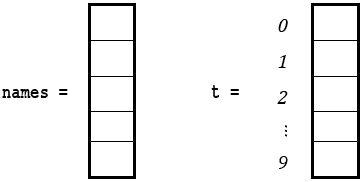
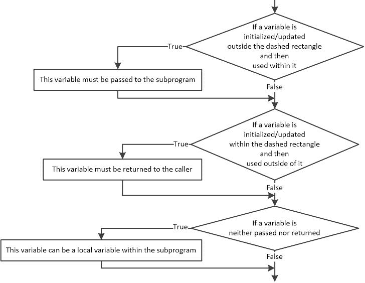
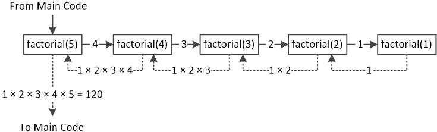
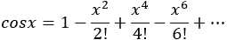

## 第三十六章

子程序的使用技巧和窍门

### 36.1 两个子程序能否使用相同名称的变量？

每个子程序都使用自己的内存空间来存储其变量的值。即使是主代码也有自己的内存空间！这意味着你可以在主代码中有一个名为 test 的变量，在子程序中有一个名为 test 的变量，在另一个子程序中还有一个名为 test 的变量。请注意！这三个变量是完全不同的变量，位于不同的内存位置，它们可以存储完全不同的值。

正如你在下面的程序中可以看到的，有三个名为 test 的变量位于三个不同的内存位置，每个变量都持有完全不同的值。下面的跟踪表可以帮助你理解实际发生了什么。

 file_36.1

def f1():

test = "Testing!"

print(test)

def f2(test):

print(test)

#主代码从这里开始

test = 5

print(test)

f1()

f2(10)

print(test)

跟踪表如下所示。

| 步骤 | 语句 | 备注 | 主代码 | 无返回值函数 f1() | 无返回值函数 f2() |
| --- | --- | --- | --- | --- | --- |
| test | test | test |
| 1 | test = 5 |   | 5 |   |   |
| 2 | print(test) | 它显示：5 | 5 |   |   |
| 3 | f1() | f1()被调用 |   | ? |   |
| 4 | test = "Testing!" |   |   | Testing! |   |
| 5 | print(test) | 它显示：Testing! |   | Testing! |   |
| 6 | f2(10) | f2()被调用 |   |   | 10 |
| 7 | print(test) | 它显示：10 |   |   | 10 |
| 8 | print(test) | 它显示：5 | 5 |   |   |

请注意，在子程序中使用的变量“存在”的时间与子程序执行的时间一样长。这意味着在调用子程序之前，它的任何变量（包括形式参数列表中的变量）都不存在于主内存（RAM）中。它们都是在子程序被调用时在主内存中定义的，当子程序完成并且执行流程返回调用者时，它们都会从主内存中移除。唯一“永远存在”或至少在 Python 程序执行期间存在的变量是主代码的变量和全局变量！你将在第 36.6 节中了解更多关于全局变量的内容。

### 36.2 子程序能否调用另一个子程序？

到目前为止，你可能会有这样的印象，只有主代码可以调用子程序。然而，这并不正确！一个子程序可以调用任何其他子程序，而这个被调用的子程序又可以调用另一个子程序，以此类推。你可以创建任何你想要的组合。例如，你可以编写一个调用无返回值函数的函数，一个无返回值函数调用一个函数，一个函数调用另一个函数，甚至是一个调用 Python 内置函数的函数。

下一个示例正好展示了这种情况。主代码调用无返回值函数 displaySum()，然后它又调用函数 add()。

 file_36.2

def add(number1, number2):

result = number1 + number2

return result

def displaySum(num1, num2):

打印(add(num1, num2))

#Main code starts here

a = int(input())

b = int(input())

displaySum(a, b)

When the flow of execution reaches the return statement of the function add(), it returns to its caller, that is to the void function displaySum(). Then, when the flow of execution reaches the end of the void function displaySum(), it returns to its caller, that is, to the main code.

Note that there is no restriction on the order in which the two subprograms should be written. It would have been exactly the same if the void function displaySum() had been written before the function add().

### 36.3 通过值和引用传递参数

In Python, variables are passed to subprograms by value. This means that if the value of an argument is changed within the subprogram, it does not get changed outside of it. Take a look at the following example.

 file_36.3a

def f1(b):

b += 1      #This is a variable of void function f1()

打印(b)       #It displays: 11

#Main code starts here

a = 10         #This is a variable of the main code

f1(a)

打印(a)        #It displays: 10

The value 10 of variable a is passed to void function f1() through argument b. However, although the content of variable b is altered within the void function, when the flow of execution returns to the main code this change does not affect the value of variable a.

In the previous example, the main code and the void function are using two variables with different names. Yet, the same would have happened if, for instance, both the main code and the void function had used two variables of the same name. The next example operates exactly the same way and displays exactly the same results as the previous example did.

 file_36.3b

def f1(a):

a += 1      #This is a variable of void function f1()

打印(a)         #It displays: 11

#Main code starts here

a = 10         #This is a variable of the main code

f1(a)

打印(a)         #It displays: 10

Passing a list to a subprogram as an argument is as easy as passing a simple variable. The next example passes list a to the void function display(), and the latter displays the list.

 file_36.3c

ELEMENTS = 10

def display(b):

for i in range(ELEMENTS):

> 打印(b[i], end = "\t")

#Main code starts here

a = [None] * ELEMENTS

for i in range(ELEMENTS):

a[i] = int(input())

display(a)

Contrary to variables, data structures in Python are, by default, passed by reference. This means that if you pass, for example, a list to a subprogram, and that subprogram changes the value of one or more elements of the list, these changes are also reflected outside the subprogram. Take a look at the following example.

 file_36.3d

def f1(x):

x[0] += 1

打印(x[0]) #It displays: 6

#Main code starts here

y = [5, 10, 15, 20]

打印(y[0])     #It displays: 5

f1(y)

打印(y[0])     #It displays: 6

将列表传递给子程序传递的是列表的引用，而不是列表的副本，这意味着 y 和 x 实际上是同一列表的别名。主内存（RAM）中只存在列表的一个副本。如果一个子程序更改了一个元素的值，这种更改也会反映在主程序中。

因此，正如你可能已经意识到的，通过引用传递列表可以为子程序提供一个间接的方式“返回”多个值。然而，请记住，在 Python 中，使用列表从子程序返回多个值是非常不寻常的，因为你已经学过，Python 提供了更方便的方式来完成这个任务。但是，让我们看看，尽管是形式上的，一个这样的例子。在下一个示例中，函数 myDivmod()将变量 a 除以变量 b，并找到它们的整数商和整数余数。如果一切顺利，它返回 True；否则，它返回 False。此外，通过列表 results，函数还间接返回计算出的商和余数。

 file_36.3e

def myDivmod(a, b, results):

returnValue = True

if b == 0:

> returnValue = False

else:

> results[0] = a // b
> 
> results[1] = a % b

return returnValue

#主代码从这里开始

res = [None] * 2

val1 = int(input())

val2 = int(input())

ret = myDivmod(val1, val2, res)

if ret:

print(res[0], res[1])

else:

print("对不起，输入了错误的值！")

关于形式参数列表中的参数的一个很好的策略是将所有通过值传递的参数写在通过引用传递的参数之前。

### 36.4 返回列表

在下一个示例中，Python 程序必须找到列表 t 中的三个最小值。为此，程序调用并传递列表 t 到通过其形式参数 x 调用的 void 函数 getList()，该函数随后使用插入排序算法对列表 x 进行排序。当执行流程返回主代码时，列表 t 也被排序。这是因为，如前所述，Python 中的列表是通过引用传递的。因此，主代码最终所做的只是显示列表的前三个元素的值。

 file_36.4a

ELEMENTS = 10

def getList(  x  ):     [[更多…]](more.html#more_36_4_1)

for m in range(1, ELEMENTS):

> element = x[m]
> 
> n = m
> 
> while n > 0 and x[n - 1] > element:
> 
> > x[n] = x[n - 1]
> > 
> > n -= 1
> > 
> x[n] = element

#主代码从这里开始

t = [75, 73, 78, 70, 71, 74, 72, 69, 79, 77]

getList(t)

print("三个最小值是：", t[0], t[1], t[2])

#在此步骤中，列表 t 被排序

for i in range(ELEMENTS):

print(t[i], end = "\t")

由于主代码中的列表 t 是通过引用传递给 void 函数的，因此在主内存（RAM）中只存在列表的一个副本，这意味着 t 和 x 实际上是同一列表的别名。当执行流程返回主代码时，列表 t 也被排序。

然而，很多时候通过引用传递列表可能会完全灾难性。假设您有两个列表。列表 names 包含 10 个城市的名称，列表 t 包含在特定一天特定时间记录的相应温度。

现在，假设您希望显示列表 t 的三个最低温度。如果您调用前一个 Python 程序中的 void 函数 getList()，您会遇到问题。尽管可以按要求显示三个最低温度，但列表 t 变得排序了；因此，其元素与列表 names 的元素之间的一一对应关系永远丢失了！

一种可能的解决方案是编写一个函数，其中将列表复制到一个辅助列表中，该函数将返回一个只包含三个最低值的较小列表。提出的解决方案如下所示。

 file_36.4b

ELEMENTS = 10

def getList(x):

#将列表 x 复制到列表 auxX

auxX = [None] * ELEMENTS

for m in range(ELEMENTS):

> auxX[m] = x[m]

#并对列表 auxX 进行排序

for m in range(1, ELEMENTS):

> element = auxX[m]
> 
> n = m
> 
> while n > 0 and auxX[n - 1] > element:
> 
> > auxX[n] = auxX[n - 1]
> > 
> > n -= 1
> > 
> auxX[n] = element

return auxX[:3]  #使用切片返回列表的前 3 个元素作为列表

#主代码从这里开始

names = ["City1", "City2", "City3", "City4", "City5",   \

> "City6", "City7", "City8", "City9", "City10"]

t = [75, 73, 78, 70, 71, 74, 72, 69, 79, 77]

low = getList(t)

print("三个最低值是: ", low[0], low[1], low[2])

在这一步，列表 t 未排序

for i in range(ELEMENTS):

print(t[i], "\t", names[i])

请注意，您不能使用类似于 auxX = x 这样的语句来复制列表 x 的元素到 auxX。这个语句只是创建了同一列表的两个别名。这就是为什么在前一个例子中使用 for 循环将列表 x 的元素复制到列表 auxX 的原因。

将一个列表的所有元素复制到另一个列表的更 Pythonic 的方法是使用切片机制。在前面的例子中，您可以使用语句 auxX = x[:] 来这样做。

这里展示了另一种更 Pythonic 的方法。

 file_36.4c

def getList(x):

return sorted(x)[:3]  #只返回排序列表的前 3 个元素

#主代码从这里开始

names = ["City1", "City2", "City3", "City4", "City5",   \

> "City6", "City7", "City8", "City9", "City10"]

t = [75, 73, 78, 70, 71, 74, 72, 69, 79, 77]

low = getList(t)

print("三个最低值是: ", low[0], low[1], low[2])

#在这一步，列表 t 未排序

for i in range(len(t)):

print(t[i], "\t", names[i])

函数 sorted(x) 返回一个新的排序列表，同时保持初始列表 x 完好无损（见第 32.7 节）。

### 36.5 默认参数值（可选参数）和关键字参数

如果在形式参数列表中为参数分配默认值，这意味着如果没有为该参数传递值，则使用默认值。在下一个例子中，函数 prependTitle()被设计为在名称之前添加（添加前缀）一个头衔。然而，如果没有为参数 title 传递值，则函数使用默认值“M”。

 file_36.5a

def prependTitle(name, title = "M"):

return title + " " + name

#主代码从这里开始

print(prependTitle("John King"))          #它显示：M John King

print(prependTitle("Maria Miller", "Ms")) #它显示：Ms Maria Miller

当在形式参数列表中为参数分配默认值时，该参数被称为“可选参数”。

在形式参数列表中，任何可选参数都必须位于任何非可选参数的右侧；否则，这种做法是不正确的。

此外，在 Python 中，可以使用关键字参数以如下形式调用子程序：

argument_name = value

Python 假设关键字参数是可选的。如果在子程序调用中未提供任何参数，则使用默认值。看看下面的 Python 程序。函数 prependTitle()被调用了四次。然而，在最后一次调用中，使用了关键字参数。

 file_36.5b

def prependTitle(firstName, lastName, title = "M", reverse = False):

if not reverse:

> returnValue = title + " " + firstName + " " + lastName

else:

> returnValue = title + " " + lastName + " " + firstName

return returnValue

#主代码从这里开始

print(prependTitle("John", "King"))          #它显示：M John King

print(prependTitle("Maria", "Miller", "Ms")) #它显示：Ms Maria Miller

print(prependTitle("Maria", "Miller", "Ms", True)) #它显示：Ms Miller Maria

#使用关键字参数调用函数

print(prependTitle("John", "King", reverse = True)) #它显示：M King John

请注意，参数 reverse 在形式参数列表中的顺序是第四位。但是，使用关键字参数可以绕过这个顺序。

与使用“关键字参数”这个术语不同，许多计算机语言，如 PHP、C#和 Visual Basic（仅举几个例子），更倾向于使用“命名参数”这个术语。

### 36.6 变量的作用域

变量的作用域指的是该变量的作用范围。在 Python 中，一个变量可以具有局部或全局作用域。在子程序内部声明的变量具有局部作用域，并且只能从该子程序内部访问。另一方面，在子程序外部声明的变量具有全局作用域，可以从任何子程序以及主代码中访问。

让我们看看一些例子。下一个例子声明了一个全局变量 test。然而，这个全局变量的值是在 void 函数内部访问和显示的。

 file_36.6a

def displayValue():

print(test)     #It displays: 10

#Main code starts here

test = 10           #This is a global variable

displayValue()

print(test)         #It displays: 10

现在的问题是，“如果你尝试在函数 displayValue()中更改变量 test 的值，会发生什么？这会影响全局变量 test 吗？”在下一个示例中，将显示值 20 和 10。

 file_36.6b

def displayValue():

test = 20       #This is a local variable

print(test)     #It displays: 20

#Main code starts here

test = 10         #This is a global variable

displayValue()

print(test)         #It displays: 10

This happens because Python declares two variables in main memory (RAM); that is, a global variable test and a local variable test.

Now let's combine the first example with the second one and see what happens. First the subprogram will access the variable test, and then it will assign a value to it, as shown in the code that follows.

 file_36.6c

def displayValue():

print(test)    #This statement throws an error

test = 20

print(test)

#Main code starts here

test = 10         #This is a global variable

displayValue()

print(test)

Unfortunately, this example throws the error message “local variable 'test' referenced before assignment”. This happens because Python “assumes” that you want a local variable due to the assignment statement test = 20 within function displayValue(). Therefore, the first print() statement inevitably throws this error message. Any variable that is defined or altered within a function is automatically declared as local, unless it has been forced to be a global variable. To force Python to use the global variable you have to use the keyword global, as you can see in the following example.

 file_36.6d

def displayValue():

global test    #Force Python to use the global variable test

print(test)    #It displays: 10

test = 20

print(test)    #It displays: 20

#Main code starts here

test = 10          #This is a global variable

displayValue()

print(test)     #It displays: 20

如果你希望在子程序中访问多个全局变量，你可以写下关键字 global，然后在其旁边，用逗号分隔所有变量，如下所示。

global a, b, c

If the value of a global variable is altered within a subprogram, this change is also reflected outside of the subprogram. Please note that the last print(test) statement of the main code displays the value of 20.

Any variable that is defined or altered within a function is local unless it is declared as a global variable using the keyword global.

下一个程序声明了一个全局变量 test，一个在无返回值函数 displayValueA()内的本地变量 test，以及另一个在无返回值函数 displayValueB()内的本地变量 test。请记住，全局变量 test 和这两个本地变量 test 是三个不同的变量！此外，第三个无返回值函数 displayValueC()使用并改变了全局变量 test 的值。

 file_36.6e

def displayValueA():

test = 7      # 本地变量 test

print(test)   # 显示：7

def displayValueB():

test = 9      # 本地变量 test

print(test)   # 显示：9

def displayValueC():

global test   # 使用全局变量 test 的值

print(test)   # 显示：10

test += 1     # 增加全局变量 test 的值

# 主代码从这里开始

test = 10         # 这是全局变量 test

print(test)     # 显示：10

displayValueA()

print(test)     # 显示：10

displayValueB()

print(test)     # 显示：10

displayValueC()

print(test)     # 显示：11

你可以在不同的子程序中拥有同名的局部作用域变量，因为它们只在其声明的子程序中被识别。

### 36.7 将代码部分转换为子程序

将大型程序不分割成更小的子程序会导致难以理解和维护的代码。假设你有一个大型程序，并且希望将其分割成更小的子程序。下一个程序是一个示例，解释必须遵循的步骤。程序中用虚线矩形标记的部分必须转换为子程序。

 file_36.7a

totalYes = 0

femaleNo = 0

for i in range(100):

while True:

> temp1 = input("为公民编号" + str(i + 1) + "输入性别：")
> 
> gender = temp1.lower()
> 
> if gender in ["male", "female", "other"]: break

while True:

> temp2 = input("你下午去慢跑吗？")
> 
> answer = temp2.lower()
> 
> if answer in ["yes", "no", "sometimes"]: break

if answer == "yes":

> totalYes += 1

if gender == "female" and answer == "no":

> femaleNo += 1

print("总肯定回答数：", totalYes)

print("女性的否定回答数：", femaleNo)

要将此程序的部分转换为子程序，你必须：

►对于每个虚线矩形，决定是否使用函数或无返回值函数。这取决于子程序是否会返回结果。

►确定每个虚线矩形中存在的变量及其在该虚线矩形中的作用。

下面的流程图可以帮助你决定每个变量的处理方式，无论是必须传递给子程序和/或从子程序返回，还是只需在子程序内部作为本地变量。

请记住，Python 中的函数可以返回多个结果！

因此，借助这个流程图，让我们逐个处理每个虚线矩形！未标记虚线矩形的部分将构成主代码。

第一部分

在第一个虚线矩形中，有三个变量：i、temp1 和 gender。然而，并非所有这些都必须包含在替换虚线矩形的子程序的形式参数列表中。让我们找出原因！

►变量 i：

►在虚线矩形外初始化/更新；因此，必须将其传递给子程序

►在虚线矩形内未更新；因此，不应将其返回给调用者

►变量 temp1：

►在虚线矩形外未初始化/更新；因此，不应将其传递给子程序

►在虚线矩形内初始化，但其值在矩形外未使用；因此，不应将其返回给调用者

根据流程图，由于变量 temp1 既不应传递也不应返回，因此这个变量可以是子程序内的局部变量。

►变量 gender：

►在虚线矩形外未初始化/更新；因此，不应将其传递给子程序

►在虚线矩形内初始化，然后其值在矩形外使用；因此，必须将其返回给调用者

因此，由于必须将一个值返回给主代码，可以使用如下所示的功能。

#第一部分

def getGender(i):

while True:

> temp1 = input("请输入公民编号" + str(i + 1) + "的性别：")
> 
> gender = temp1.lower()
> 
> if gender in ["male", "female", "other"]: break

return gender

第二部分

在第二个虚线矩形中有两个变量，temp2 和 answer，但它们并不都需要包含在替换虚线矩形的子程序的形式参数列表中。让我们找出原因！

►变量 temp2：

►在虚线矩形外未初始化/更新；因此，不应将其传递给子程序

►在虚线矩形内初始化/更新，但其值在矩形外未使用；因此，不应将其返回给调用者

根据流程图，由于变量 temp2 既不应传递也不应返回，因此这个变量可以是子程序内的局部变量。

►变量 answer：

►在虚线矩形外未初始化/更新；因此，不应将其传递给子程序

►在虚线矩形内初始化，然后其值在矩形外使用；因此，必须将其返回给调用者

因此，由于必须将一个值返回给主代码，可以使用功能，如下所示。

#第二部分

def getAnswer():

while True:

> temp2 = input("你下午去慢跑吗？ ")
> 
> answer = temp2.lower()
> 
> if answer in ["yes", "no", "sometimes"]: break

return answer

第三部分

在示例的第三个虚线矩形中，有四个变量：answer、totalYes、gender 和 femaleNo，它们都必须包含在替换虚线矩形的子程序的正式参数列表中。让我们找出原因！

►两个变量 answer 和 gender：

►在虚线矩形外部初始化/更新；因此，它们必须传递给子程序

►在虚线矩形内部没有更新；因此，它们不应该返回给调用者

►两个变量 totalYes 和 femaleNo：

►在虚线矩形外部初始化；因此，它们必须传递给子程序

►在虚线矩形内部更新并随后在矩形外部使用其值；因此，它们必须返回给调用者

因此，由于必须将两个值返回到主代码，可以使用如下所示的功能。

# 第三部分

def countResults(answer, gender, totalYes, femaleNo):

if answer == "yes":

> totalYes += 1

if gender == "female" and answer == "no":

> femaleNo += 1

return totalYes, femaleNo

第四部分

在示例的第四个虚线矩形中，有两个变量：totalYes 和 femaleNo。让我们看看你应该如何处理它们。

►两个变量 totalYes 和 femaleNo：

►在虚线矩形外部更新；因此，它们必须传递给子程序

►在虚线矩形内部没有更新；因此，它们不应该返回给调用者

因此，由于不应将任何值返回到主代码，可以使用如下所示的 void 函数。

# 第四部分

def displayResults(totalYes, femaleNo):

print("总肯定回答数：", totalYes)

print("女性的否定回答数：", femaleNo)

最后的程序

包含主代码和上述所有子程序的最后程序如下所示。

 file_36.7b

# 第一部分

def getGender(i):

while True:

> temp1 = input("为公民 No " + str(i + 1) + " 输入性别：")
> 
> gender = temp1.lower()
> 
> if gender in ["male", "female", "other"]: break

return gender

# 第二部分

def getAnswer():

while True:

> temp2 = input("你下午去慢跑吗？")
> 
> answer = temp2.lower()
> 
> if answer in ["yes", "no", "sometimes"]: break

return answer

# 第三部分

def countResults(answer, gender, totalYes, femaleNo):

if answer == "yes":

> totalYes += 1

if gender == "female" and answer == "no":

> femaleNo += 1

return totalYes, femaleNo

# 第四部分

def displayResults(totalYes, femaleNo):

print("总肯定回答数：", totalYes)

print("女性的否定回答数：", femaleNo)

# 主代码从这里开始

totalYes = 0

femaleNo = 0

for i in range(100):

gender = getGender(i)

answer = getAnswer()

totalYes, femaleNo = countResults(answer, gender, totalYes, femaleNo)

displayResults(totalYes, femaleNo)

### 36.8 递归

递归是一种编程技术，其中子程序调用自身。这最初可能看起来像是一个无限循环，但当然这不是真的；使用递归的子程序必须以明显满足有限性属性的方式编写。

想象一下下一个 Python 程序能帮助你找到回家的路。在这个程序中，由于 void 函数 find_your_way_home()在函数内部调用自身，因此发生了递归。

def find_your_way_home():

if you_are_already_at_home:

> stop_walking()

else:

> take_one_step_toward_home()
> 
> find_your_way_home()

#主代码从这里开始

find_your_way_home()

现在，让我们通过一个真实示例来尝试分析递归。下一个 Python 程序使用递归计算 5 的阶乘。

 file_36.8

def factorial(value):

if value == 1:

> return 1

else:

> return factorial(value - 1) * value

#主代码从这里开始

print(factorial(5)) #它显示：120

在数学中，非负整数 N 的阶乘是所有小于或等于 N 的正整数的乘积。它用 N!表示，0 的阶乘按定义等于 1。例如，5 的阶乘是 1 × 2 × 3 × 4 × 5 = 120。

递归发生是因为 factorial()函数在函数内部调用自身。

请注意，这里没有循环控制结构！

你现在可能感到困惑。没有使用循环控制结构，如何计算 1 × 2 × 3 × 4 × 5 的乘积呢？下一个图可能有助于你理解。它显示了当 factorial(5)函数通过一系列调用向后工作时执行的乘法操作。

让我们看看这个图是如何工作的。主代码调用 factorial(5)函数，该函数反过来调用 factorial(4)函数，然后 factorial(4)调用 factorial(3)，依此类推。最后一个调用(factorial(1))将其值 1 返回给调用者(factorial(2))，然后 factorial(2)将其值 1 × 2 = 2 返回给调用者(factorial(3))，依此类推。当 factorial(5)从最顶层的调用返回时，你就有了解决方案。

为了避免逻辑错误，所有递归子程序都必须遵循三个重要的规则：

1)它们必须调用自己。

2)它们必须有一个基本情况，这是告诉子程序停止递归的条件。基本情况通常是一个非常小的问题，可以直接解决。它是“最简单”可能问题的解决方案。在上一个示例中的 factorial()函数中，基本情况是 1 的阶乘。当调用 factorial(1)时，布尔表达式 value == 1 计算为 True，并标志着递归的结束。

3)它们必须改变它们的状态，并向基本情况移动。状态改变意味着子程序改变了一些数据。通常，数据以某种方式逐渐减小。在上一个示例中的 factorial()函数中，因为基本情况是 1 的阶乘，整个概念依赖于向那个基本情况移动的想法。

总之，递归有助于你编写更富有创意和更优雅的程序，但请记住，它并不总是最佳选择。递归的主要缺点是程序员难以理解其逻辑，因此包含递归子程序的代码难以调试。此外，递归算法可能比非递归算法更差，因为它可能消耗过多的 CPU 时间或过多的主内存（RAM）。因此，有时遵循 KISS 原则会更好，而不是使用递归，而是使用循环控制结构来解决算法。

对于不知道 KISS 原则的人来说，它是一个缩写，代表“Keep It Simple, Stupid”！它表明，大多数系统如果保持简单，则工作得最好，避免任何不必要的复杂性！

### 36.9 复习问题：正确/错误

对于以下每个陈述，选择正确或错误。

1)每个子程序都使用自己的内存空间来存储其变量的值。

2)在子程序中使用的变量只要子程序正在执行就会“存活”。

3)唯一在 Python 程序执行期间“存活”的变量是主代码的变量和全局变量。

4)子程序可以调用主代码。

5)如果通过值传递一个参数并在子程序中更改其值，则该值在外部不会改变。

6)实际参数的名称必须与相应的形式参数的名称相同。

7)实际参数的总数不能超过形式参数的总数。

8)表达式不能传递给子程序。

9)默认情况下，Python 中的列表是通过引用传递的。

10)你可以将列表传递给 void 函数，但 void 函数不能（直接或间接地）将列表返回给调用者。

11)函数可以通过其形式参数列表接受一个列表。

12)通常，void 函数可以调用任何函数。

13)通常，一个函数可以调用任何 void 函数。

14)在语句内部，一个函数只能调用一次。

15)void 函数可以通过其形式参数列表返回一个值。

16)子程序可以被另一个子程序或主代码调用。

17)如果你在形式参数列表中为参数分配了一个默认值，这意味着无论传递给该参数的值是什么，都将使用默认值。

18)当一个参数在实参列表中分配了默认值时，该参数被称为可选参数。

19)可选参数必须位于任何非可选参数的左侧。

20)参数的默认值不能是字符串。

21)变量的作用域指的是该变量的作用范围。

22)如果在子程序中更改了全局变量的值，这种更改也会在子程序外部反映出来。

23)你可以有两个同名的全局变量。

24)递归是一种编程技术，其中子程序会调用自身。

25)递归算法必须有一个基本情况。

26)使用递归解决问题并不总是最佳选择。

### 36.10 复习练习

完成以下练习。

1)在不使用跟踪表的情况下，你能找出下一个 Python 程序显示的内容吗？

def f1():

a = 22

def f2():

a = 33

a = 5

f1()

f2()

print(a)

2)在不使用跟踪表的情况下，你能找出下一个 Python 程序显示的内容吗？

def f1(number1):

return 2 * number1

def f2(number1, number2):

return f1(number1) + f1(number2)

a = 3

b = 4

print(f2(a, b))

3)在不使用跟踪表的情况下，你能找出下一个 Python 程序显示的内容吗？

def f1(number1):

return number1 * 2

def f2(number1, number2):

number1 = f1(number1)

number2 = f1(number2)

return number1 + number2

a = 2

b = 5

print(f2(a, b))

4)在不使用跟踪表的情况下，你能找出下一个 Python 程序显示的内容吗？

def display(s = "hello"):

s = s.replace("a", "e")

print(s, end = "")

display("hello")

display()

display("hallo")

5)在不使用跟踪表的情况下，你能找出下一个 Python 程序显示的内容吗？

def f1():

global a

a = a + b

a = 10

b = 5

f1()

b -= 1

print(a)

6)在不使用跟踪表的情况下，你能找出下一个 Python 程序显示的内容吗？

def f2():

global a

a = a + b

def f1():

global a

a = a + b

f2()

a = 3

b = 4

f1()

print(a, b)

7)在不使用跟踪表的情况下，你能找出下一个 Python 程序显示的内容吗？

def foo(a, b):

c = 0

for x in a:

> if x == b:
> 
> > c += 1

return c

print(foo([5, 9, 2, 5, 5], 5))

8)以下 Python 程序旨在提示用户将五个整数输入到列表中，然后显示每个元素的位数和整数本身。例如，如果用户输入的值是 35、13565、113、278955、9999，则程序应显示：

数字 35 中有 2 位

数字 13565 中有 5 位

3 digits in number 113

数字 278955 中有 6 位

4 digits in number 9999

不幸的是，程序显示

数字 0 中有 2 位

数字 0 中有 5 位

数字 0 中有 3 位

数字 0 中有 6 位

数字 0 中有 4 位

你能找出原因吗？

ELEMENTS = 5

def getNumOfDigits(x, index):

count = 0

while x[index] != 0:

> count += 1
> 
> x[index] = x[index] // 10

return count

#主代码从这里开始

val = [None] * ELEMENTS

for i in range(ELEMENTS):

val[i] = int(input())

for i in range(ELEMENTS):

print(getNumOfDigits(val, i), "digits in number", val[i])

9)对于以下 Python 程序，将标记为虚线矩形的部分转换为子程序。

STUDENTS = 10

LESSONS = 5

names = [None] * STUDENTS

grades = [[None] * LESSONS for i in range(STUDENTS)]

for i in range(STUDENTS):

names[i] = input("Enter name No. " + str(i + 1) + ": ")

for j in range(LESSONS):

> grades[i][j] = int(input("Enter grade for lesson No. " + str(j + 1) + ": "))

average = [None] * STUDENTS

for i in range(STUDENTS):

average[i] = 0

for j in range(LESSONS):

> average[i] += grades[i][j]

average[i] /= LESSONS

for m in range(1, STUDENTS):

for n in range(STUDENTS - 1, m - 1, -1):

> if average[n] > average[n - 1]:
> 
> > average[n], average[n - 1] = average[n - 1], average[n]
> > 
> > names[n], names[n - 1] = names[n - 1], names[n]
> > 
> elif average[n] == average[n - 1]:
> 
> > if names[n] < names[n - 1]:
> > 
> > > names[n], names[n - 1] = names[n - 1], names[n]

for i in range(STUDENTS):

print(names[i], "\t", average[i])

10)对于以下 Python 程序，将带有虚线矩形标记的部分转换为子程序。

message = input("Enter a message: ").lower()

messageClean = ""

for i in range(len(message)):

if message[i] not in " ,.?":

> messageClean += message[i]

middlePos = (len(messageClean) - 1) // 2

j = len(messageClean) - 1

palindrome = True

for i in range(middlePos + 1):

if messageClean[i] != messageClean[j]:

> palindrome = False
> 
> break

j -= 1

if palindrome:

print("The message is palindrome")

11)下一个 Python 程序在四个用户提供的值中找到最大值。重写该程序，不使用子程序。

def myMax(n, m):

if n > m:

> m = n

return m

a = int(input())

b = int(input())

c = int(input())

d = int(input())

maximum = a

maximum = myMax(b, maximum)

maximum = myMax(d, maximum)

maximum = myMax(c, maximum)

print(maximum)

12)编写两个子程序，一个函数和一个 void 函数。它们都必须通过其形式参数列表接受三个数字，然后返回它们的总和和平均值。

13)编写一个名为 myRound 的子程序，通过其形式参数列表接受一个实数（浮点数）和一个整数，然后返回实数四舍五入到整数指示的小数位数。此外，如果未传递整数值，则子程序必须默认将实数四舍五入到两位小数。尽量不使用 Python 的 round()函数。

14)执行以下操作：

i)编写一个名为 getInput 的子程序，提示用户输入“是”或“否”的答案，然后相应地返回 True 或 False 给调用者。该子程序应接受所有可能的答案形式，如“是”、“YES”、“Yes”、“No”、“NO”、“nO”等。

ii)编写一个名为 findArea 的子程序，通过其形式参数列表接受平行四边形的底和高，然后返回其面积。

iii)使用上述子程序，编写一个 Python 程序，提示用户输入平行四边形的底和高，然后计算并显示其面积。程序必须根据用户的意愿迭代多次。每次计算结束后，程序必须询问用户是否希望计算另一个平行四边形的面积。如果答案是“是”，则程序必须重复。

15)执行以下操作：

i)编写一个名为 getLists 的子程序，提示用户输入 100 名学生的成绩和姓名，分别存储在 grades 和 names 列表中。这两个列表必须返回给调用者。

ii)编写一个名为 getAverage 的子程序，通过其形式参数列表接受成绩列表 grades，并返回平均成绩。

iii)编写一个名为 sortLists 的子程序，该子程序通过其形式参数列表接受成绩和姓名列表，并使用插入排序算法按降序对成绩列表进行排序。该子程序必须保持两个列表元素的一对一对应关系。

iv)使用上述子程序，编写一个 Python 程序，提示用户输入 100 名学生的成绩和姓名，然后按成绩降序显示所有成绩低于平均成绩的学生姓名。

16)在一场歌唱比赛中，有一位艺术家由 10 位评委评分。然而，根据该比赛的规则，总分是在排除最高分和最低分之后计算的。执行以下操作：

i)编写一个名为 getList 的子程序，该子程序提示用户输入 10 位评委的分数到一个列表中，然后返回该列表给调用者。假设每个分数都是唯一的。

ii)编写一个名为 findMinMax 的子程序，该子程序通过其形式参数列表接受一个列表，然后返回最大值和最小值。

iii)使用上述子程序，编写一个 Python 程序，提示用户输入艺术家的姓名和每位评委给出的分数。然后程序必须显示消息“艺术家 NN 获得了 XX 分”，其中 NN 和 XX 必须替换为实际值。

17)执行以下操作：

i)编写一个名为 sumRecursive 的递归函数，该函数通过其形式参数列表接受一个整数，然后返回从 1 到该整数的数字之和。

ii)使用上述子程序，编写一个 Python 程序，允许用户输入一个正整数，然后显示从 1 到该用户提供的整数的所有数字之和。

18)在棋盘上，你必须在每个方格上放置麦粒，第一个方格放一粒，第二个方格放两粒，第三个方格放四粒，依此类推（每个后续方格上的麦粒数是前一个方格的两倍）。执行以下操作：

i)编写一个名为 woc 的递归函数，该函数接受一个方格的索引并返回该方格上的麦粒数量。由于棋盘包含 8 × 8 = 64 个方格，假设索引是一个介于 1 和 64 之间的整数。

ii)使用上述子程序，编写一个 Python 程序，计算并显示棋盘上最终的总麦粒数。

19)斐波那契数列是一系列数字，其顺序如下：

0, 1, 1, 2, 3, 5, 8, 13, 21, 34, 55, …

根据定义，前两项是 0 和 1，每一项后续都是前两项之和。

执行以下操作：

i)编写一个名为 fib 的递归函数，该函数通过其形式参数列表接受一个整数，然后返回斐波那契数列的第 N 项。

ii)使用上述子程序，编写一个 Python 程序，允许用户输入一个正整数 N，然后显示斐波那契数列的第 N 项。

20)三进制数列与斐波那契数列类似，但每个项是前三个项的和。编写一个名为 trib 的递归函数，该函数通过其形式参数列表接受一个整数，然后返回三进制数列的第 N 项。

21)编写一个名为 myPow 的递归函数，该函数接受一个实数和一个整数，然后返回第一个数以第二个数为指数的结果，不使用指数运算符（**）或甚至 Python 的内置 pow() 函数。确保该函数对于正指数值和负指数值都能正确工作。

22)执行以下操作：

i)编写一个名为 factorial 的递归函数，该函数通过其形式参数列表接受一个整数，然后返回其阶乘。

ii)使用上述引用的函数，编写一个名为 myCos 的递归函数，该函数使用泰勒级数计算并返回 x 的余弦值，如下所示。

.

提示：请记住 x 是以弧度为单位的，。

iii)使用上述引用的函数 myCos()，编写一个 Python 程序，计算并显示 45^o 的余弦值。

提示：为了验证结果，请注意 45^o 的余弦值大约为 0.7071067811865475。
