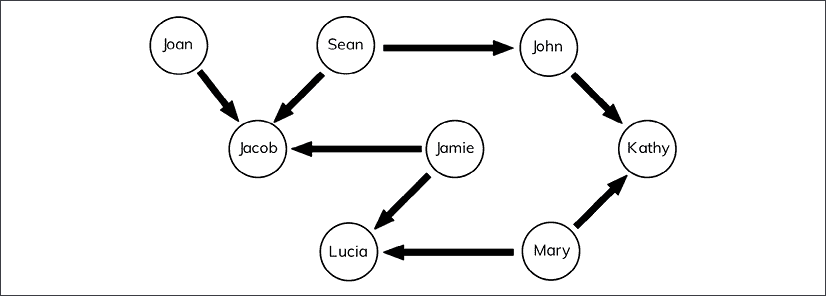
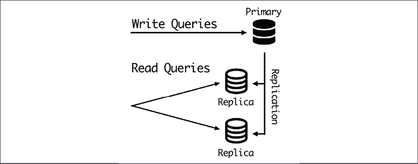
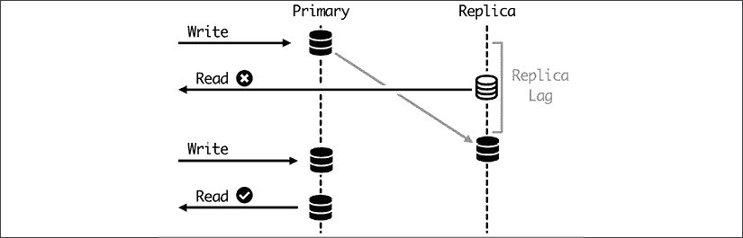
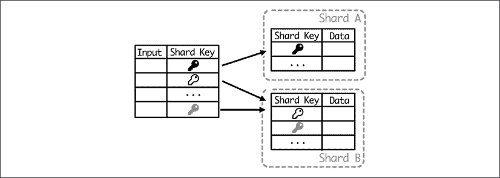
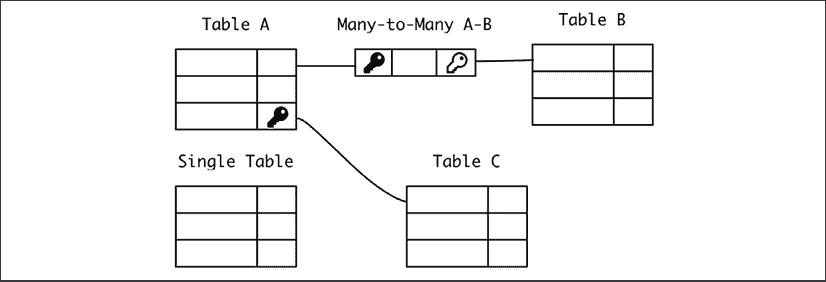
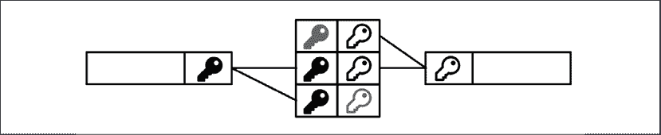

# 第三章：数据建模

任何应用程序的核心是其数据。在计算机应用程序的最底层，它是一个设计来处理信息、接收它、转换它并返回相同信息或从中提取的见解的系统。存储的数据是这个周期中的关键部分，因为它允许你使用之前已经传达的信息。

在本章中，我们将讨论如何对应用程序中存储的数据进行建模，以及存储和结构化要持久化的数据的不同选项。

我们将首先描述可用的不同数据库选项，这对于理解它们的不同应用至关重要，但在本章中，我们将主要关注关系数据库，因为它们是最常见的类型。我们将描述事务的概念，以确保不同的更改能够一次性应用。

我们将描述使用多个服务器来扩展关系数据库的不同方法，以及每个选项的使用案例。

之后，我们将描述在设计模式时不同的替代方案，以确保我们的数据以最佳方式结构化。我们将讨论如何通过使用索引来启用对数据的快速访问。

在本章中，我们将涵盖以下主题：

+   数据库类型

+   数据库事务

+   分布式关系数据库

+   模式设计

+   数据索引

让我们从介绍现有的不同数据库开始。

# 数据库类型

应用程序的所有持久数据都应该存储在数据库中。正如我们讨论的那样，数据是任何应用程序最关键的部分，正确处理它对于确保项目的可行性至关重要。

从技术角度来看，数据库本身就是数据的集合，并由数据库管理系统（**DBMS**）处理，该软件允许数据的输入和输出。通常，根据上下文，“数据库”一词用于集合和管理系统。大多数 DBMS 将允许访问同一类型的多个数据库，而无法在它们之间交叉数据，以允许数据的逻辑分离。

数据库在软件系统存在的大部分时间里都是一个关键工具。它们创建了一个抽象层，允许访问数据而无需过多担心硬件如何结构化数据。大多数数据库允许定义数据的结构，而无需担心幕后如何实现。

正如我们在*第二章*，*API 设计*中看到的，这种抽象并不完美，有时我们不得不了解数据库的内部结构，以提高性能或以“正确的方式”做事。

DBMS 是软件中最受投资和成熟的工程项目之一。每个 DBMS 都有其独特的特点，以至于有一个专门的职位是“数据库专家”：**数据库管理员**（**DBA**）。

数据库管理员（DBA）角色在很长时间内非常受欢迎，需要高度专业化的工程师，以至于 DBA 专门从事单个特定的 DBMS。DBA 将作为数据库的专家，既了解如何访问它，又确保对其所做的任何更改都能适当地工作。他们通常是唯一被允许在数据库中执行更改或维护任务的。

硬件和软件的性能改进以及处理数据库复杂性的外部工具使得这个角色不那么常见，尽管一些组织仍在使用它。在某种程度上，架构师角色接管了这一角色的部分，尽管更多的是监督角色而不是把关角色。

市场上有多款数据库管理系统（DBMS）可供选择，其中包括丰富的开源软件，可以覆盖大多数用例。粗略地说，我们可以将现有的 DBMS 替代品分为以下非详尽分类：

+   **关系型数据库**：数据库中的默认标准。使用 SQL 查询语言并具有定义的架构。例如，像 MySQL 或 PostgreSQL 这样的开源项目，或者像 Oracle 或 MS SQL Server 这样的商业产品。

+   **非关系型数据库**：传统数据库的新替代品。这是一个多样化的群体，有多种替代品，包括 MongoDB、Riak 或 Cassandra 等非常不同的选项。

+   **小型数据库**：这些数据库旨在嵌入到系统中。最著名的例子是 SQLite。

让我们更深入地了解一下它们。

## 关系型数据库

这些是最常见的数据库，当谈到数据库时，人们首先想到的想法。数据库的关系模型是在 20 世纪 70 年代开发的，它基于创建一系列可以相互关联的表。自 20 世纪 80 年代以来，它们变得极其流行。

每个定义的表都有一定数量的固定字段或列，数据被描述为记录或行。理论上，表是无限的，因此可以添加越来越多的行。其中一列被定义为*主键*，并唯一描述了该行。因此，它需要是唯一的。

如果有一个值既独特又足够描述性，它可以用作主键；这被称为*自然键*。自然键也可以是字段的组合，但这限制了它们的便利性。当没有自然键可用时，数据库可以直接处理递增计数器以确保每行都是唯一的。这被称为*代理键*。

当需要时，主键用于在其他表中引用该记录。这创建了数据库的关系方面。当表中的一列引用另一个表时，这被称为*外键*。

这些引用可以产生一对一的关系；一对一，当单行可以在另一个表中的多行中引用时；甚至多对多，这需要一个中间表来跨越数据。

所有这些信息都需要在模式中描述。模式描述了每个表，以及每个字段的类型，以及它们之间的关系。

关系型数据库中的关系实际上是约束。这意味着如果一个值在某处被引用，则不能删除它。关系型数据库来自严格的数学背景，尽管这种背景在不同程度上得到了实施。

需要注意的是，定义模式需要提前思考和意识到可以做出的更改。在拥有数据之前定义类型，也需要考虑到可能的改进。虽然模式可以更改，但这始终是一项严肃的操作，如果不妥善处理，可能会导致数据库在一段时间内不可用，或者在最坏的情况下，数据可能会被不一致地更改或处理。

也可以执行查询来搜索满足特定条件的数据。为此，可以根据它们之间的关系将表连接起来。

几乎所有关系型数据库都是通过结构化查询语言（SQL）进行交互的。这种语言已经成为与关系型数据库一起工作并遵循我们在这里描述的相同概念的标准。它描述了如何查询数据库以及如何添加或更改其中包含的数据。

SQL 最相关的特性是它是一种声明式语言。这意味着语句描述的是结果，而不是获取该结果的过程，这与命令式语言中的典型做法不同。这抽象了内部细节，从而关注于“什么”。

命令式语言描述控制流，是最常见的语言。命令式语言的例子包括 Python、JavaScript、C 和 Java。声明式语言通常限于特定的领域（领域特定语言，或 DSL），允许你用更简单的术语描述结果，而命令式语言则更加灵活。

这一特性使得 SQL 在不同系统之间具有可移植性，因为不同数据库的内部“如何”可能不同。使用特定的关系型数据库并适应另一个数据库相对容易。

这有时用于设置一个用于运行测试的本地数据库，该数据库与系统投入生产后将存在的最终数据库不同。这在某些 Web 框架中是可能的，但需要注意一些注意事项，因为复杂系统有时必须为特定数据库使用特定特性，这使得进行此类简单替换变得不可能。

虽然关系型数据库非常成熟且灵活，并且被用于非常不同的场景，但存在两个主要问题难以处理。一个是需要预定义的模式，正如我们上面所说的。另一个，在达到一定规模后更为严重，是处理扩展性问题。关系型数据库被认为是一个中心访问点，一旦达到垂直扩展的极限，就需要一些技术来扩展。

我们将在本章后面讨论处理此问题并提高关系型数据库可扩展性的具体技术。

## 非关系型数据库

非关系型数据库是一组多样化的数据库管理系统，它们不符合关系型范式。

非关系型数据库也被称为 NoSQL，强调 SQL 语言的关联性质，代表“非 SQL”或“不仅 SQL”，以更准确地反映增加可能性而不是移除它们。

在关系型数据库引入之前甚至与之并行，自 2000 年代以来，已经引入或恢复了旨在寻找替代方案的方法和设计。大多数它们旨在解决关系型数据库的两个主要弱点，即严格性和可扩展性问题。

它们非常多样，结构也各不相同，但最常见的非关系型系统类型如下几组：

+   键值存储

+   文档存储

+   宽列数据库

+   图数据库

让我们描述每一个。

### 键值存储

键值存储在功能上可以说是所有数据库中最简单的。它们定义了一个存储值的单一键。值对系统来说是完全透明的，无法以任何方式查询。在某些实现中，甚至没有查询系统中的键的方法；相反，它们需要成为任何操作的输入。

这与哈希表或字典非常相似，但规模更大。缓存系统通常基于这种类型的数据存储。

虽然该技术与数据库相似，但缓存和数据库之间存在一个重要的区别。缓存是一个存储已计算数据以加快检索速度的系统，而数据库存储原始数据。如果数据不在缓存中，可以从不同的系统检索，但如果数据不在数据库中，要么数据未存储，要么出现了大问题。

这就是为什么缓存系统倾向于仅在内存中存储信息，并且对重启或问题更具弹性，这使得它们更容易处理。如果缓存缺失，系统仍然可以工作，只是速度较慢。

信息最终不应存储在缺乏适当存储支持的缓存系统中，这是有时无意中犯下的错误，例如在处理时间数据时，但风险是在错误的时间遇到问题并丢失数据，因此要对此保持警觉。

该系统的主要优势在于其简单性，一方面允许快速存储和检索数据。它还允许你水平扩展到很大程度。由于每个键与其他键独立，它们甚至可以存储在不同的服务器上。系统还可以引入冗余，为每个键和值创建多个副本，尽管这会使信息检索变慢，因为需要比较多个副本以检测数据损坏。

一些键值数据库的例子是 **Riak** 和 **Redis**（如果启用了持久性）。

### 文档存储

文档存储围绕“文档”这一概念展开，这与关系数据库中的“记录”类似。然而，文档更加灵活，因为它们不需要遵循预定义的格式。它们通常还允许在子字段中嵌入更多数据，这是关系数据库通常不做的，而是通过创建关系并将数据存储在不同的表中。

例如，一个文档可以看起来像这样，这里以 JSON 格式表示：

```py
{

    "id": "ABCDEFG"

    "name": {

        "first": "Sherlock",

        "surname": "Holmes"

     }

    "address": {

        "country": "UK",

        "city": "London",

        "street": "Baker Street",

        "number": "221B",

        "postcode": "NW16XE"

    }

} 
```

文档通常按集合分组，类似于“表”。通常通过一个唯一的 ID 来检索文档，该 ID 作为主键，但也可以构建查询以搜索文档中创建的字段。

因此，在我们的情况下，我们可以检索键（ID）`ABCDEFG`，就像在键值存储中一样；或者进行更丰富的查询，例如“获取所有在`detectives`集合中且`address.country`等于`UK`的条目”，例如。

请记住，虽然从技术上讲，可以创建一个包含完全独立且格式不同的文档的集合，但在实践中，一个集合中的所有文档都将遵循某种*相似*的格式，包括可选字段或嵌入数据。

一个集合中的文档可以通过其 ID 与另一个集合中的文档相关联，创建一个引用，但通常这些数据库不允许你创建连接查询。相反，应用层应该允许你检索这些链接信息。

通常，文档倾向于嵌入信息而不是创建引用。这可能导致信息去规范化，在多个地方重复信息。我们将在本章后面更多地讨论去规范化。

一些文档存储的例子是 **MongoDB** ([`www.mongodb.com/`](https://www.mongodb.com/)) 和 **Elasticsearch** ([`www.elastic.co/elasticsearch/`](https://www.elastic.co/elasticsearch/))。

### 宽列数据库

宽列数据库通过列来组织数据。它们创建具有特定列的表，但这些列是可选的。它们也无法原生地将一个表中的记录与另一个表中的记录相关联。

它们比纯键值存储更易于查询，但需要对系统中的可能查询类型进行更多前期设计工作。这比在文档存储中更为限制性，在文档设计完成后，文档存储在这方面有更大的灵活性。

通常，列是相关的，并且只能按特定顺序查询，这意味着如果存在列 A、B 和 C，则一行可以基于 A、A 和 B 或 A、B 和 C 进行查询，但不能仅基于 C 或 B 和 C，例如。

它们旨在针对具有高可用性和复制数据的非常大的数据库部署。一些宽列数据库的例子包括**Apache Cassandra** ([`cassandra.apache.org/`](https://cassandra.apache.org/))和谷歌的**Bigtable** ([`cloud.google.com/bigtable`](https://cloud.google.com/bigtable))。

### 图数据库

虽然之前的非关系型数据库是基于放弃元素之间创建关系的能力以获得其他功能（如可扩展性或灵活性），但图数据库则走向了相反的方向。它们极大地增强了元素的关系方面，以创建复杂的图。

它们存储节点和边或节点之间的关系对象。边和节点都可以有属性来更好地描述它们。

图数据库的查询能力旨在根据关系检索信息。例如，给定一家公司及其供应商的列表，是否存在任何特定国家的特定公司的供应链中的供应商？达到多少层级？这些问题对于关系数据库的第一层级可能很容易回答（获取公司的供应商及其国家），但对于第三层级的关系来说则相当复杂且耗时。



图 3.1：图数据库中典型数据的示例

它们通常用于社交图，其中存在人与人或组织之间的连接。一些例子包括**Neo4j** ([`neo4j.com/`](https://neo4j.com/))或**ArangoDB** ([`www.arangodb.com/`](https://www.arangodb.com/))。

## 小型数据库

与其他数据库相比，这一组有点特别。它由不作为独立进程区分的数据库系统组成，作为独立的客户端-服务器结构运行。相反，它们嵌入到应用程序的代码中，直接从硬盘读取。它们通常用于作为单个进程运行且希望以结构化方式保存信息的简单应用程序。

表示此方法的一种粗略但有效的方式是将信息作为 JSON 对象保存到文件中，并在需要时恢复，例如智能手机应用程序的客户设置。设置文件在应用程序启动时从内存中加载，如果有任何更改则保存。

例如，在 Python 代码中，这可以表示如下：

```py
>>> import json

>>> with open('settings.json') as fp:

...   settings = json.load(fp)

...

>>> settings

{'custom_parameter': 5}

>>> settings['custom_parameter'] = 3

>>> with open('settings.json', 'w') as fp:

...   json.dump(settings, fp) 
```

对于少量数据，这种结构可能适用，但它有一个限制，那就是查询起来比较困难。最完整的替代方案是 SQLite，它是一个完整的 SQL 数据库，但它被嵌入到系统中，无需外部调用。数据库存储在一个二进制文件中。

SQLite 非常流行，以至于它甚至被许多标准库支持，无需外部模块，例如，在 Python 标准库中。

```py
>>> import sqlite3

>>> con = sqlite3.connect('database.db')

>>> cur = con.cursor()

>>> cur.execute('''CREATE TABLE pens (id INTEGER PRIMARY KEY DESC, name, color)''')

<sqlite3.Cursor object at 0x10c484c70>

>>> con.commit()

>>> cur.execute('''INSERT INTO pens VALUES (1, 'Waldorf', 'blue')''')

<sqlite3.Cursor object at 0x10c484c70>

>>> con.commit()

>>> cur.execute('SELECT * FROM pens');

<sqlite3.Cursor object at 0x10c484c70>

>>> cur.fetchall()

[(1, 'Waldorf', 'blue')] 
```

此模块遵循 DB-API 2.0 标准，这是连接到数据库的 Python 标准。它的目标是标准化对不同数据库后端的访问。这使得创建一个可以访问多个 SQL 数据库并可以最小化更改进行交换的高级模块变得容易。

您可以在 PEP-249 中查看完整的 DB-API 2.0 规范：[`www.python.org/dev/peps/pep-0249/`](https://www.python.org/dev/peps/pep-0249/)。

SQLite 实现了大部分 SQL 标准。

# 数据库事务

对于数据库来说，存储数据可能是一个复杂的内部操作。在某些情况下，它可能包括在单个位置更改数据，但有一些操作可以在单个操作中影响数百万条记录，例如，“更新在此时间戳之前创建的所有记录”。

这些操作的范围和可能性在很大程度上取决于数据库，但它们与关系数据库非常相似。在这种情况下，通常有*事务*的概念。

事务是一次性发生的操作。要么发生，要么不发生，但数据库不会处于中间的不一致状态。例如，如果之前描述的“更新在此时间戳之前创建的所有记录”的操作可能会产生一个效果，即通过错误，只有一半的记录被更改，那么它不是一个事务，而是多个独立的操作。

在事务中间可能会出现错误。在这种情况下，它将回滚到开始处，因此没有任何记录会更改。

在某些应用中，这种特性可能成为对数据库的强烈要求，这被称为*原子性*。这意味着当它被应用时，事务是原子的。这种特性是所谓的 ACID 属性的主要特性。

其他属性是一致性、隔离性和持久性。这四个属性是：

+   *原子性*，意味着事务作为一个单元应用。要么完全应用，要么不应用。

+   *一致性*，意味着事务在应用时考虑到数据库中定义的所有限制。例如，外键约束得到尊重，或者任何修改数据的存储触发器。

+   *隔离性*，意味着并行事务以相同的方式运行，就像它们一个接一个地运行一样，确保一个事务不会影响另一个。显然，它们的运行顺序可能会有影响。

+   *持久性*，这意味着在事务报告为完成后，即使在灾难性故障（如数据库进程崩溃）的情况下也不会丢失。

这些特性是处理数据的黄金标准。这意味着数据是安全和一致的。

大多数关系型数据库都有开始事务、执行多个操作，然后最终提交事务的概念，这样所有更改都可以一次性应用。如果出现问题，事务将失败，回滚到之前的状态。如果在执行操作期间检测到任何问题，如约束问题，事务也可以被中止。

这种操作方式允许创建额外的验证步骤，因为在事务内部，数据仍然可以被查询并在最终提交之前进行验证。

ACID 事务在性能方面有成本，尤其是在可扩展性方面。持久性的需求意味着数据需要在事务返回之前存储在磁盘或其他永久性支持上。隔离性的需求意味着每个打开的事务都需要以某种方式操作，使其无法看到新的更新，这可能需要存储临时数据直到事务完成。一致性还要求检查以确保所有约束都得到满足，这可能需要复杂的检查。

几乎所有关系型数据库都是完全 ACID 兼容的，这已经成为它们的定义特征。在非关系型世界中，事情更加灵活。

使用具有这些特性的多个服务器或节点扩展数据库很困难。这个系统创建了分布式事务，同时在多个服务器上运行。在具有多个服务器的数据库中维护完整的 ACID 事务非常困难，并且在性能方面有沉重的代价，因为理解其他节点所做的工作以及在它们中的任何一个出现故障时回滚事务的额外延迟。问题也会以非线性方式增加，某种程度上抵消了拥有多个服务器的优势。

虽然这是可能的，但许多应用程序可以绕过这些限制。我们将看到一些有用的模式。

# 分布式关系型数据库

正如我们之前讨论的，关系型数据库并不是为了可扩展性而设计的。它们在强制执行强大的数据保证方面很出色，包括 ACID 事务，但它们首选的操作方式是通过单个服务器。

这可能会对使用关系型数据库的应用程序的大小施加限制。

值得注意的是，数据库服务器可以垂直扩展，这意味着使用更好的硬件。增加服务器容量或用更大的服务器替换它，对于高需求来说，比应用这些技术要容易，但有一个限制。无论如何，请确保预期的尺寸足够大。如今，云服务提供商的某些服务器内存达到 1TB 或更多。这足以覆盖大量情况。

注意，这些技术在系统运行后扩展系统时很有用，并且可以添加到大多数关系型数据库的使用中。

ACID 属性的不利之处在于*最终一致性*。不是一次性处理的原子操作，系统逐渐转换为所需的系统。系统不是所有部分同时处于相同状态。相反，在系统传播这个变化的过程中会有一定的延迟。另一个大优点是我们可以提高可用性，因为它不会依赖于单个节点来做出更改，任何不可用的元素在恢复后会赶上。由于集群的分布式特性，这可能涉及咨询不同的来源并试图在它们之间达到共识。

在考虑是否放宽一些 ACID 属性是否值得做时，很大程度上取决于你心中的应用程序。对于延迟或数据损坏影响较大且可能不可接受的关键数据，可能不适合分布式数据库。

为了增加容量，首先要了解应用程序的数据访问方式。

## 主/副本

一个非常常见的例子是读取次数远高于写入次数。或者用 SQL 术语来说，`SELECT`语句的数量远高于`UPDATE`或`DELETE`语句的数量。这在信息访问远多于信息更新的应用程序中非常典型，例如，报纸，阅读新闻文章的访问量很大，但相比之下新文章不多。

对于这种情况，一个常见的模式是创建一个集群，添加一个或多个数据库只读副本，然后在这些副本之间分配读取，这种情况类似于以下：



图 3.2：处理多个读取查询

所有写入都发送到主节点，然后自动传播到副本节点。因为副本包含整个数据库，唯一的写入活动来自主节点，这增加了系统中可以同时运行的查询数量。

该系统由大多数关系型数据库原生支持，尤其是最常见的 MySQL 和 PostgreSQL。写入节点配置为主节点，副本节点指向主节点以开始复制数据。经过一段时间，它们将更新并同步到主节点。

主服务器上的每个新更改都会自动复制。然而，这有一个延迟，称为复制延迟。这意味着刚刚写入的数据在一段时间内不可读，通常不到一秒。

复制延迟是数据库健康状态的良好指标。如果延迟随时间增加，这表明集群无法处理当前流量水平，需要调整。这个时间将受到每个节点网络和总体性能的极大影响。

因此，要避免的操作是在外部操作中立即写入和读取相同或相关数据，因为这可能导致不一致的结果。这可以通过暂时保留数据以避免查询需求，或者通过使特定读取指向主节点以确保数据一致性来解决。

这些直接读取仅在必要时使用，因为它们违反了减少主服务器查询数量的理念。这正是设置多个服务器的原因！



图 3.3：对主节点上的特定读取查询

此系统还允许数据冗余，因为数据始终被复制到副本中。如果出现问题，可以将副本提升为新的主服务器。

副本服务器并不完全履行与备份相同的角色，尽管它可以用于类似的目的。副本旨在执行快速操作并保持系统的可用性。备份更容易且成本更低，允许您保留数据的历史记录。备份也可以位于与副本非常不同的位置，而副本需要与主服务器有良好的网络连接。

即使有副本可用，也不要跳过备份。备份可以在灾难性故障的情况下增加一层安全防护。

注意，这种数据库结构方式可能需要调整应用层以了解所有更改并访问不同的数据库服务器。存在一些现有工具，如 Pgpool（用于 PostgreSQL）或 ProxySQL（用于 MySQL），它们位于路径中间并重定向查询。应用将查询发送到代理，然后代理根据配置重定向它们。有些情况，如我们上面看到的读写模式，不容易覆盖，可能需要在应用代码中进行特定更改。在使用这些工具之前，请确保理解它们的工作原理并对其进行一些测试。

这种结构的简单案例是创建离线副本。这些副本可以从备份中创建，并且不更新来自实时系统。这些副本可以用于创建不需要最新信息的查询，在可能的情况下，每日快照就足够了。它们在统计分析或数据仓库等应用中很常见。

## 分片

如果应用程序的写入次数较多，主从结构可能不够好。太多的写入都指向同一个服务器，这会形成瓶颈。或者如果系统流量增长足够大，单个服务器可以接受的写入次数将有限。

一种可能的解决方案是将数据水平分区。这意味着根据特定的键将数据分割到不同的数据库中，这样所有相关数据都可以发送到同一个服务器。每个不同的分区被称为分片。

注意，“分区”和“分片”可以被认为是同义词，尽管在现实中，分片只有在分区是水平的时候才存在，即把单个表分割到不同的服务器上。分区可以更通用，比如把一个表分成两个，或者分割到不同的列，这通常不被称为分片。

分区键被称为分片键，根据其值，每一行都会被分配到特定的分片。


图 3.4：分片键

“分片”这个名字来源于电子游戏《Ultima Online》，在 20 世纪 90 年代末，该游戏使用这种策略创建了一个“多元宇宙”，不同的玩家可以在不同的服务器上玩同样的游戏。他们称之为“分片”，因为它们是同一现实的不同方面，但其中包含了不同的玩家。这个名字一直沿用至今，现在仍用来描述这种架构。

任何查询都需要能够确定要应用的正确分片。任何影响两个或更多分片的查询可能无法执行，或者只能依次执行。当然，这排除了在单个事务中执行这些查询的可能性。在任何情况下，这些操作都将非常昂贵，应尽可能避免。当数据自然分区时，分片是一个极好的想法，而当执行影响多个分片的查询时，分片就非常糟糕。

一些 NoSQL 数据库允许原生分片，这将自动处理所有这些选项。一个常见的例子是 MongoDB，它甚至能够在多个分片中透明地运行查询。无论如何，这些查询都会很慢。

选择分片键也非常关键。一个好的键应该遵循数据之间的自然分区，这样就不需要执行跨分片查询。例如，如果某个用户的数据与其他数据独立，这在照片分享应用中可能发生，那么用户标识符可以是一个好的分片键。

另一个重要的特性是，需要根据分片键确定要解决查询的分片。这意味着每个查询都需要有分片键可用。这意味着分片键应该是每个操作的输入。

分片键的另一个特性是，数据应该理想地分割成分片大小相同，或者至少相似到足够程度。如果一个分片比其他分片大得多，可能会导致数据不平衡的问题、查询分布不足，以及一个分片成为瓶颈。

### 纯分片

在纯分片中，数据全部分区在分片中，分片键是每个操作的输入。分片是根据分片键确定的。

为了确保分片平衡，每个键都通过一种方式散列，使得它们在分片数量之间均匀分布。一个典型的例子是使用取模操作，例如。如果我们有 8 个分片，我们根据一个均匀分布的数字来确定数据分区的分片。

| 用户 ID | 操作 | 分片 |
| --- | --- | --- |
| 1234 | 1234 mod 8 | 2 |
| 2347 | 2347 mod 8 | 3 |
| 7645 | 7645 mod 8 | 5 |
| 1235 | 1235 mod 8 | 3 |
| 4356 | 4356 mod 8 | 4 |
| 2345 | 2345 mod 8 | 1 |
| 2344 | 2344 mod 8 | 0 |

如果分片键不是一个数字，或者它分布不均匀，可以应用一个哈希函数。例如，在 Python 中：

```py
>>> import hashlib

>>> shard_key = 'ABCDEF'

>>> hashlib.md5(shard_key.encode()).hexdigest()[-6:]

'b9fcf6'

>>> int('b9fcf6', 16)  # Transform in number for base 16

12188918

>>> int('b9fcf6', 16) % 8

6 
```

这种策略仅在分片键**始终**作为每个操作的输入可用时才可行。当这不是一个选项时，我们需要考虑其他选项。

改变分片数量不是一个容易的任务，因为每个键的目的是由一个固定的公式决定的。然而，通过提前做一些准备，是有可能增加或减少分片数量的。

我们可以创建指向同一服务器的“虚拟分片”。例如，为了创建 100 个分片，并使用两个服务器，最初虚拟分片分布将如下所示：

| 虚拟分片 | 服务器 |
| --- | --- |
| 0-49 | 服务器 A |
| 50-99 | 服务器 B |

如果需要增加服务器数量，虚拟分片结构将按这种方式改变。

| 虚拟分片 | 服务器 |
| --- | --- |
| 0-24 | 服务器 A |
| 25-49 | 服务器 C |
| 50-74 | 服务器 B |
| 75-99 | 服务器 D |

这种更改对应于每个分片的具体服务器可能需要一些代码更改，但因为它不会改变分片键的计算，所以更容易处理。同样的操作可以反向应用，尽管它可能会造成不平衡，所以需要谨慎操作。

| 虚拟分片 | 服务器 |
| --- | --- |
| 0-24 | 服务器 A |
| 25-49 | 服务器 C |
| 50-99 | 服务器 B |

每个操作都需要根据分片键更改数据的位置。这是一个昂贵的操作，尤其是当需要交换大量数据时。

### 混合分片

有时无法创建纯分片，需要从输入进行转换以确定分片键。例如，当用户登录且分片键是用户 ID 时，就是这种情况。用户将使用他们的电子邮件登录，但需要将其转换为用户 ID，以便能够确定要搜索信息的分片。

在这种情况下，可以使用外部表纯粹地翻译特定查询的输入到分片键。



图 3.5：外部表用于翻译分片键的输入

这会形成一个情况，即单个分片负责这个翻译层。这个分片可以专门用于此，也可以作为任何其他分片。

请记住，这需要对每个可能的输入参数都添加一个翻译层，这些参数不是直接的分片键，并且需要在一个数据库中保留所有分片的信息。这需要受到控制，并尽可能存储最少的信息，以避免问题。

这种策略也可以用来直接存储哪个分片键对应哪个分片，并执行查询而不是直接操作，就像我们上面看到的。


图 3.6：将分片键存储到分片中

这的不便之处在于，根据键确定分片需要在一个数据库中进行查询，尤其是对于大型数据库。但它也允许以一致的方式更改数据分片，这可以用来调整分片数量，如增长或减少。而且可以在不要求停机的情况下完成。

如果在翻译表中存储了特定的分片（而不仅仅是分片键），则可以逐个、连续地更改分片到键的分配。这个过程将大致如下：

1.  分片键 X 在参考表中分配给服务器 A。这是初始状态。

1.  服务器 A 为分片键 X 的数据已复制到服务器 B。请注意，尚未将涉及分片键 X 的任何查询指向服务器 B。

1.  一旦所有数据都已复制，分片键 X 的参考表条目将更改为服务器 B。

1.  所有针对分片键 X 的查询都指向服务器 B。

1.  服务器 A 中分片键 X 的数据可以进行清理。

*第 3 步*是关键步骤，必须在所有数据复制后、任何新写入操作之前发生。确保这一点的办法是在参考表中创建一个标志，在操作进行时可以停止或延迟数据的写入。这个标志将在*第 2 步*之前设置，并在*第 3 步*完成后移除。

这个过程将在一段时间内产生平滑迁移，但它需要足够的空间来工作，并且可能需要相当长的时间。

扩容操作比缩容操作更复杂，因为空间增加提供了充足的空间。幸运的是，数据库集群需要缩容的情况很少，因为大多数应用程序会随着时间的推移而增长。

请留出足够的时间来完成迁移。根据数据集的大小和复杂性，迁移可能需要很长时间，极端情况下甚至可能需要数小时或数天。

### 表分片

对于较小的集群，可以通过服务器来分离表或集合，作为按分片键分片的一种替代方案。这意味着对表 X 的任何查询都会被导向特定的服务器，而其他查询则导向另一个服务器。这种策略仅适用于无关的表，因为不同服务器上的表之间无法执行连接操作。

注意，这可以被认为是一种过于拘泥于细节的做法，因为它并不真正地实现了分片，尽管结构相似。

这是一种较为简单的替代方案，但它的灵活性要低得多。它仅适用于相对较小的集群，其中一张或两张表与其他表的大小存在很大不均衡，例如，如果一张表存储的日志数据比数据库中的其他部分大得多，并且访问频率较低。

## 分片的优势和劣势

总结来说，分片的主要优势包括：

+   允许将写入分散到多个服务器上，从而提高系统的写入吞吐量。

+   数据存储在多个服务器上，因此可以存储大量数据，而不会限制单个服务器上可以存储的数据量。

从本质上讲，分片允许创建大型、可扩展的系统。但这也存在一些劣势：

+   分片系统运行起来更复杂，并且在配置不同服务器等方面有一些开销。虽然任何大型部署都会遇到问题，但与主从设置相比，分片需要更多的工作，因为维护和操作需要更加细致的计划，操作也会更加耗时。

+   原生支持分片仅在少数数据库中可用，例如 MongoDB，但关系型数据库并没有原生实现这一功能。这意味着需要用专门的代码来处理复杂性，这将需要投入开发成本。

+   一旦数据被分片，某些查询将变得不可能或几乎不可能执行。聚合和连接操作，取决于数据的分区方式，将无法执行。分片键需要仔细选择，因为它将对可能的查询产生重大影响。我们还会失去 ACID 属性，因为某些操作可能需要涉及多个分片。分片数据库的灵活性较低。

正如我们所见，设计、运营和维护分片数据库只适用于非常大的系统，当数据库中的操作数量需要如此复杂的系统时才有意义。

# 模式设计

对于需要定义模式的数据库，需要考虑使用特定的设计。

本节将具体讨论关系数据库，因为它们强制执行更严格的模式。其他数据库在更改方面更加灵活，但它们也受益于花时间思考其结构。

更改模式是一个重要的操作，需要规划，并且当然，需要对设计采取长期视角。

我们将在本章后面讨论如何更改数据库的模式。在此我们只需指出，更改数据库模式是构建系统过程中不可避免的一部分。尽管如此，这是一个需要尊重并理解可能问题的过程。确保模式设计足够合理，花时间思考和确保这一点绝对是个好主意。

设计模式的最好方式是绘制不同的表、字段及其关系，如果有外键指向其他表。



图 3.7：绘制模式

此数据的展示应允许你发现可能的盲点或元素的重复。如果表的数量太多，可能需要将其分成几个组。

虽然有工具可以帮助完成这项工作，但就我个人而言，手动绘制这些关系有助于我思考不同的关系，并在脑海中构建设计图。

每个表都可以与其他不同类型的表有外键关系：

+   **一对多**，其中为另一个表中的多个元素添加单个引用。例如，一位作者在其所有书籍中都有引用。在这种情况下，简单的外键关系就足够了，因为《书籍》表将有一个指向《作者》表中条目的外键。多个书籍行可以引用同一作者。


图 3.8：第一张表中的键引用了第二张表中的多行

+   **一对一或零一**是特定情况，其中一行只能与另一行相关联。例如，假设编辑可以处理一本书（并且一次只能处理一本书）。在《书籍》表中编辑的引用是一个外键，如果没有编辑过程，则可以将其设置为`null`。从编辑到书籍的另一个反向引用将确保关系的唯一性。这两个引用都需要在事务中更改。

严格的一对一关系，例如一本书和它的标题，两者总是相关联，通常最好将所有信息添加到单个表中。


图 3.9：关系仅使匹配两行成为可能

+   **多对多**，在两个方向上都可以有多个分配。例如，一本书可能被归类在不同的类型下。一个类型将被分配给多本书，一本书也可以被分配给多个类型。在关系型数据结构中，需要一个中间的额外表来建立这种关系，该表将指向书籍和类型。

这个额外表可能包含更多信息，例如，类型对书籍的准确性。这样，它可以描述 50%恐怖和 90%冒险的书籍。

在关系型数据世界之外，有时不需要迫切创建多对多关系，而可以直接将其作为标签集合添加。一些关系型数据库现在允许在允许字段为列表或 JSON 对象方面有更多的灵活性，这可以用来简化设计。



图 3.10：注意中间表允许多种组合。第一个表可以引用第二个表的多个行，第二个表也可以引用第一个表的多个行

在大多数情况下，每个表要存储的字段类型是直接的，尽管应该考虑某些细节：

+   **为未来的增长留出足够的空间**。一些字段，如字符串，需要定义一个最大存储大小。例如，存储表示电子邮件地址的字符串将需要最多 254 个字符。但有时大小并不明显，例如存储客户的名称。在这些情况下，最好选择安全的大小并增加限制。

+   限制不仅应该应用于数据库，还应该在此级别以上强制执行，以确保任何处理该字段的 API 或 UI 都能优雅地处理。

    在处理数字时，在大多数情况下，常规整数足以表示大多数使用的数字。尽管一些数据库接受像`smallint`（2 字节）或`tinyint`（1 字节）这样的类别，但并不建议使用它们。使用的空间差异将非常小。

+   **内部数据库表示不需要与外部可用的内容相同**。例如，数据库中存储的时间应始终为协调世界时（UTC），然后转换为用户的时区。

总是在 UTC 格式中存储时间，允许在服务器上使用一致的时间，特别是如果有不同时区的用户。通过应用用户的时区来存储时间会在数据库中产生不可比较的时间，而使用服务器默认的时区可能会根据服务器的位置产生不同的结果，或者更糟糕的是，如果涉及不同时区的多个服务器，可能会产生不一致的数据。确保所有时间都在数据库中以 UTC 格式存储。

另一个例子是如果存储价格，最好以分存储，以避免浮点数，然后以美元和分的形式展示。

例如，这意味着$99.95 的价格将被存储为整数`9995`。处理浮点算术可能会为价格带来问题，而价格可以转换为分以便于处理。

如果出于某种原因以不同的格式存储它们更好，内部表示不需要遵循相同的约定。

+   **同时，最好以自然的方式表示数据**。一个典型的例子是过度使用数字 ID 来表示具有自然键的行，或者使用`Enums`（分配给表示选项列表的小整数）而不是使用短字符串。虽然这些选择在过去某个时候是有意义的，当时空间和处理能力更加受限，但现在性能提升微乎其微，以可理解的方式存储数据在开发过程中有很大帮助。

    例如，与其使用整数字段来存储颜色，其中`1`代表`RED`，`2`代表`BLUE`，`3`代表`YELLOW`，不如使用短字符串字段，使用字符串`RED`、`BLUE`和`YELLOW`。即使有数百万条记录，存储差异也是微不足道的，而且导航数据库要容易得多。

我们稍后会看到关于规范化（Normalization）和反规范化（Denormalization）的内容，它们与这个概念相关。

+   **没有任何设计会是完美或完整的**。在一个正在开发中的系统中，模式总是会需要改变。这是完全正常和预期的，应该被接受为这样的。完美是好的敌人。设计应该尽可能地简单，以适应系统的当前需求。过度设计，试图推进每一个可能未来的需求，并使设计复杂化，这是一个真正的问题，可能会浪费为那些永远不会实现的需求奠定基础的努力。保持你的设计简单和灵活。

## 模式规范化

正如我们所看到的，在关系型数据库中，一个关键概念是外键。数据可以存储在一张表中，并与另一张表相链接。这种数据分割意味着一组有限的数据，而不是存储在单个表中，可以被分割成两部分。

例如，让我们看看这个表，最初字段`House`是一个字符串：

**角色**

| id | 名称 | 家族 |
| --- | --- | --- |
| 1 | 艾德·史塔克 | 史塔克 |
| 2 | 约恩·史塔克 | 史塔克 |
| 3 | 丹妮莉丝·坦格利安 | 坦格利安 |
| 4 | 詹姆·兰尼斯特 | 兰尼斯特 |

为了确保数据的一致性并且没有错误，字段`House`可以被规范化。这意味着它存储在不同的表中，并且通过这种方式强制执行`FOREIGN KEY`约束。

**角色** **家族**

| id | 名称 | 家族 Id (FK) |  | id | 名称 | 词语 |
| --- | --- | --- | --- | --- | --- | --- |
| 1 | 艾德·史塔克 | 1 |  | 1 | 史塔克 | 冬风将至 |
| 2 | 约恩·史塔克 | 1 |  | 2 | 兰尼斯特 | 听我咆哮 |
| 3 | 丹妮莉丝·坦格利安 | 3 |  | 3 | 坦格利安 | 火与血 |
| 4 | 詹姆·兰尼斯特 | 2 |  |  |  |  |

这种操作方式*标准化*了数据。除非首先在“家族”表中引入，否则不能添加带有新“家族”的新条目。同样，如果“角色”表中有一个条目引用了它，则不能删除“家族”表中的条目。这确保了数据非常一致，没有问题，例如，为新的条目引入一个像“家族”*兰尼斯特*（单 n）这样的打字错误，这可能会使后续查询复杂化。

它还有这样的优点：可以为“家族”表中的每个条目添加额外信息。在这种情况下，我们可以添加“家族”的“词语”。数据也更紧凑，因为重复信息存储在单个位置。

另一方面，这有几个问题。首先，任何需要知道“家族”信息的“角色”引用都需要执行一个`JOIN`查询。在第一个“角色”表中，我们可以这样生成查询：

```py
SELECT Name, House FROM Characters; 
```

而在第二个架构中，我们将需要这个：

```py
SELECT Characters.Name, Houses.Name 

FROM Characters JOIN Houses ON Characters.HouseId = Houses.id; 
```

这个查询将需要更长的时间来执行，因为需要从两个表中组合信息。对于大型表，这个时间可能会非常长。如果我们添加例如“首选武器”字段和每个“角色”的标准化“武器”表，这也可能需要从不同的表中执行`JOIN`。或者，随着“角色”表字段的增长，我们还可以添加更多的表。

插入和删除数据也会花费更长的时间，因为需要执行更多的检查。一般来说，操作会花费更长的时间。

标准化数据也难以分片。将每个元素描述保存在其自己的表中并从那里引用的概念本身就很难以分片，因为它使得分区变得非常困难。

另一个问题在于数据库更难以阅读和操作。删除需要按顺序进行，随着更多字段的添加，这变得更加难以跟踪。此外，对于简单的操作，需要执行复杂的`JOIN`查询。查询更长，更复杂。

虽然这种通过数值标识符创建外键的标准化结构相当典型，但并非唯一的选择。

为了提高数据库的清晰度，可以使用自然键来简化它们，以这种方式描述数据。而不是使用整数作为主键，我们在“家族”表上使用“名称”字段。

**角色** **家族**

| Id | 名称 | 家族（外键） |  | 名称（主键） | 词语 |
| --- | --- | --- | --- | --- | --- |
| 1 | 艾德·史塔克 | 史塔克家族 |  | 史塔克家族 | 冬风将至 |
| 2 | 约恩·雪诺 | 史塔克家族 |  | 兰尼斯特家族 | 听我咆哮 |
| 3 | 丹妮莉丝·坦格利安 | 坦格利安家族 |  | 坦格利安家族 | 火与血 |
| 4 | 詹姆·兰尼斯特 | 兰尼斯特家族 |  |  |  |

这不仅消除了使用额外字段的需求，还允许你使用描述性值进行引用。即使数据是标准化的，我们也能恢复原始查询。

正如我们之前所描述的，存储字符串而不是单个整数的额外空间是可以忽略不计的。一些开发者非常反对自然键，并更喜欢使用整数值，但如今并没有真正的技术理由来限制自己。

只有当我们想要获取`Words`字段中的信息时，我们才需要进行`JOIN`查询：

```py
SELECT Name, House FROM Characters; 
```

总之，这个技巧可能无法避免在正常操作中使用`JOIN`查询。也许有很多引用，系统在执行查询所需的时间上遇到了问题。在这种情况下，可能需要减少对`JOIN`表的需求。

## 反规范化

反规范化是规范化的对立面。规范化数据时，将其拆分到不同的表中以确保所有数据的一致性，而反规范化则将信息重新组合到一个表中，以避免必须`JOIN`表。

按照我们上面的例子，我们想要替换如下`JOIN`查询：

```py
SELECT Characters.Name, Houses.Name, House.Words 

FROM Characters JOIN Houses ON Characters.House = Houses.Name; 
```

它遵循以下模式：

**角色** **家族**

| Id | 姓名 | 家族（外键） |  | 姓名（主键） | 话语 |
| --- | --- | --- | --- | --- | --- |
| 1 | 艾德·史塔克 | 斯塔克 |  | 斯塔克 | 冬风将至 |
| 2 | 约恩·雪诺 | 斯塔克 |  | 兰尼斯特 | 听我咆哮 |
| 3 | 丹妮莉丝·坦格利安 | 坦格利安 |  | 坦格利安 | 火与血 |
| 4 | 詹姆·兰尼斯特 | 兰尼斯特 |  |  |  |

对于类似这样的查询，查询单个表，可以使用如下方法：

```py
SELECT Name, House, Words FROM Characters 
```

要做到这一点，数据需要在一个表中结构化。

**角色**

| id | 姓名 | 家族 | 话语 |
| --- | --- | --- | --- |
| 1 | 艾德·史塔克 | 斯塔克 | 冬风将至 |
| 2 | 约恩·雪诺 | 斯塔克 | 冬风将至 |
| 3 | 丹妮莉丝·坦格利安 | 坦格利安 | 火与血 |
| 4 | 詹姆·兰尼斯特 | 兰尼斯特 | 听我咆哮 |

注意，信息是重复的。每个`Character`都有一个`House`的`Words`的副本，这在之前是不必要的。这意味着反规范化使用更多的空间；在一个行数众多的表中，空间会更多。

反规范化也增加了数据不一致的风险，因为没有东西可以确保没有新的值是旧值的打字错误，或者错误地添加了不同的`House`中的`Words`。

但是，另一方面，我们现在可以摆脱`JOIN`表的需求。对于大型表，这可以大大加快读写处理速度。它还消除了分片的问题，因为现在表可以根据方便的任何分片键进行分区，并将包含所有信息。

反规范化是 NoSQL 数据库中常见的选择，这些数据库移除了执行`JOIN`查询的能力。例如，文档数据库将数据作为子字段嵌入到更大的实体中。虽然它确实有其缺点，但在某些操作中，这种权衡是有意义的。

# 数据索引

随着数据的增长，数据的访问开始变慢。从充满信息的大表中检索确切的数据需要执行更多内部操作来定位它。

尽管我们将描述与关系数据库相关的数据索引，但大多数基本原理也适用于其他数据库。

通过以易于搜索的方式智能地组织数据，可以大大加快这个过程。这导致创建索引，通过搜索它们可以非常快速地定位数据。索引的基本原理是创建一个指向数据库中每条记录的一个或多个字段的外部排序数据结构。这个索引结构始终保持排序状态，因为表中的数据发生变化。

例如，一个简短的表可能包含以下信息

| id | Name | Height (cm) |
| --- | --- | --- |
| 1 | Eddard | 178 |
| 2 | John | 173 |
| 3 | Daenerys | 157 |
| 4 | Jaime | 188 |

在没有索引的情况下，要查询具有最高身高的条目，数据库需要逐行检查并排序。这被称为**全表扫描**。如果表有数百万行，全表扫描可能会非常昂贵。

通过为`Height`字段创建索引，一个始终排序的数据结构会与数据保持同步。

| id | Name | Height (cm) |  | Height (cm) | id |
| --- | --- | --- | --- | --- | --- |
| 1 | Eddard | 178 |  | 188 | 4 |
| 2 | John | 173 |  | 178 | 1 |
| 3 | Daenerys | 157 |  | 173 | 5 |
| 4 | Jaime | 188 |  | 157 | 3 |

因为它总是排序的，所以任何与身高相关的查询都很容易完成。例如，获取最高的三个身高不需要任何检查，只需从索引中检索前三条记录，并且使用排序列表中的搜索方法，如二分搜索，来确定在 180 到 170 厘米之间的身高也很容易。再次强调，如果这个索引不存在，唯一找到这些查询的方法就是检查表中的每一条记录。

注意，索引并不涵盖所有字段。例如，`Name`字段没有索引。可能还需要其他索引来涵盖其他字段。相同的表可以接受多个索引。

表的主键总是索引的，因为它需要是一个唯一值。

索引可以组合，为两个或更多字段创建索引。这些组合索引根据两个字段的有序组合对数据进行排序，例如，一个`(Name, Height)`的组合索引将快速返回以`J`开头的`Names`的身高。一个`(Height, Name)`的组合索引将做相反的操作，首先对身高进行排序，然后对`Name`字段进行排序。

在组合索引中查询索引的第一部分是可能的。在我们的例子中，`(Height, Name)`的索引将始终用于查询`Height`。

使用或不使用索引来检索信息是由数据库自动完成的；SQL 查询本身没有任何变化。内部，数据库在运行查询之前会运行查询分析器。这部分数据库软件将确定如何检索数据，以及是否使用索引。

查询分析器需要快速运行，因为确定最佳搜索信息的方法可能比运行简单方法并返回数据花费的时间更长。这意味着有时它可能会出错，不会使用最佳组合。在另一个 SQL 语句之前使用的 SQL 命令`EXPLAIN`将显示查询将被如何解释和运行，这允许你理解和调整它以改善其执行时间。

请记住，在同一个查询中使用不同的独立索引可能不可行。有时数据库无法通过结合两个索引来执行更快的查询，因为数据需要在它们之间进行关联，这可能会是一项昂贵的操作。

索引可以极大地加快使用它们的查询速度，特别是对于有数千或数百万行的大表。它们也是自动使用的，因此不会给查询生成增加额外的复杂性。所以，如果它们如此之好，为什么不索引一切呢？嗯，索引也有一些问题：

+   每个索引都需要额外的空间。虽然这是优化的，但在单个表中添加大量索引将占用更多的空间，包括硬盘和 RAM。

+   每次表发生变化时，都需要调整表中的所有索引，以确保索引被正确排序。这在写入新数据时更为明显，例如添加记录或更新索引字段。索引是花费更多时间在写入上以加快读取速度的权衡。对于写入密集型的表，这种权衡可能不足，维护一个或多个索引可能适得其反。

+   小表实际上并不真正受益于索引。如果行数低于千行，全表扫描和索引搜索之间的差异很小。

按照经验法则，最好在检测到需求后尝试创建索引。一旦发现查询缓慢，分析索引是否可以改善情况，然后再创建它。

## 基数

每个索引的有用性的一个重要特征是其**基数**。这是索引包含的不同值的数量。

例如，此表中的`Height`索引具有 4 个基数。有四个不同的值。

| id | 身高 (cm) |
| --- | --- |
| 1 | 178 |
| 2 | 165 |
| 3 | 167 |
| 4 | 192 |

这样的表只有一个 2 的基数。

| id | 身高 (cm) |
| --- | --- |
| 1 | 178 |
| 2 | 165 |
| 3 | 178 |
| 4 | 165 |

卡尔达数低的索引质量较低，因为它无法像预期的那样加快搜索速度。可以将索引理解为一种过滤器，允许您减少要搜索的行数。如果在应用过滤器后，表中的行数没有显著减少，那么索引将没有用。让我们用一个极端的例子来描述它。

想象一个有百万行记录的表，这些记录通过一个字段索引，而这个字段在所有记录中都是相同的。现在想象一下，如果我们对一个未索引的不同字段进行查询以找到单个行，如果我们使用索引，我们将无法加快这个过程，因为索引将返回数据库中的每一行。


图 3.11：使用无用的索引从查询中返回每一行

现在想象有两个值的情况。首先返回表的一半行，然后我们需要查询它们。这比之前好，但与全表扫描相比，使用索引有一些开销，所以在实际应用中，这并不很有优势。


图 3.12：使用两个值的索引返回行

随着索引的卡尔达数增加，即添加越来越多的值，索引就越有用。


图 3.13：使用四个值的索引返回行

随着卡尔达数的提高，数据库能够更好地区分，并指向更小的值子集，这极大地加快了对正确数据的访问。

作为经验法则，确保索引的卡尔达数始终为 10 或更高。低于这个值可能不足以用作索引。查询分析器将考虑卡尔达数值，以确定是否使用索引。

请记住，只允许少量值的字段（如`布尔值`和`枚举`）的卡尔达数总是有限的，这使得它们不适合作为索引，至少单独使用时是这样。另一方面，唯一的值总是具有最高的可能卡尔达数，它们是索引的良好候选者。由于这个原因，主键总是自动索引。

# 摘要

在本章中，我们描述了处理存储层的方法和技术，既从数据库本身提供的不同容量和选项的角度，也从我们的应用程序代码如何交互以存储和检索信息的角度进行了描述。

我们描述了不同类型的数据库，包括关系型和非关系型，以及每种数据库的区别和用途，以及事务的概念，这是关系型数据库的基本特性之一，它如何允许符合 ACID 属性。由于一些非关系型数据库旨在处理大规模数据并且是分布式的，我们介绍了提高关系型系统扩展性的技术，因为这种类型的数据库最初并没有设计用来处理多个服务器。

我们继续描述了如何设计模式以及数据规范化与反规范化的优缺点。我们还解释了为什么我们需要索引字段以及何时这样做是适得其反的。

在*第四章*，*数据层*中，我们将了解如何设计数据层。
