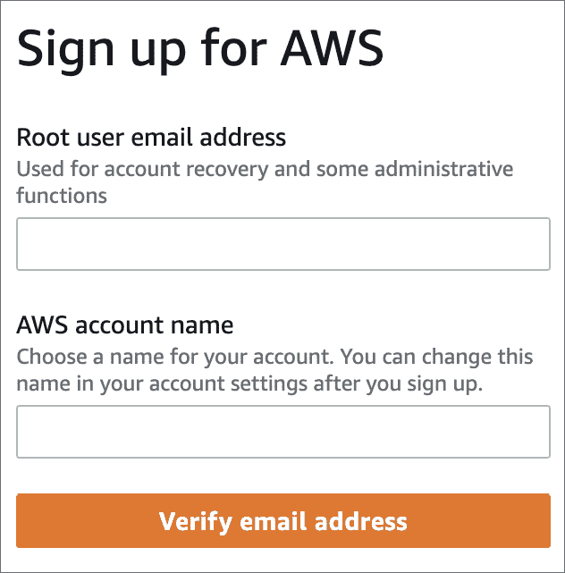
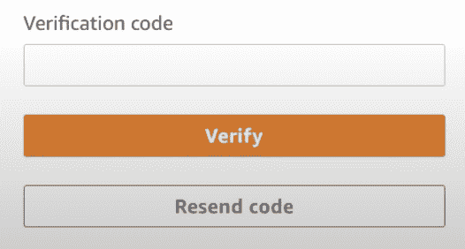
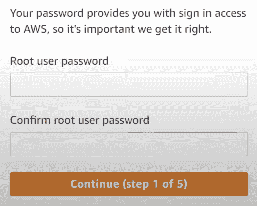
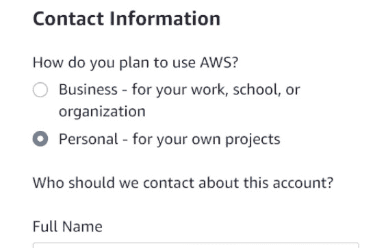
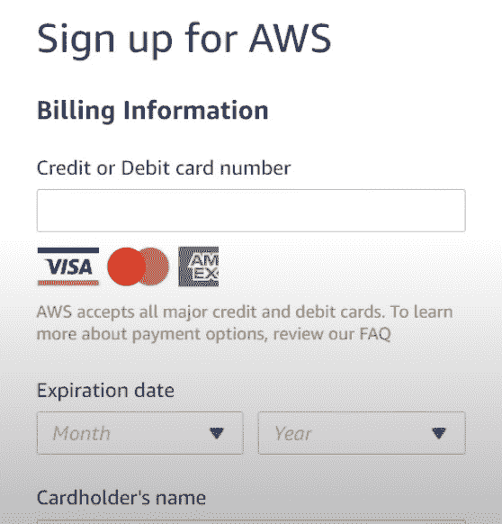
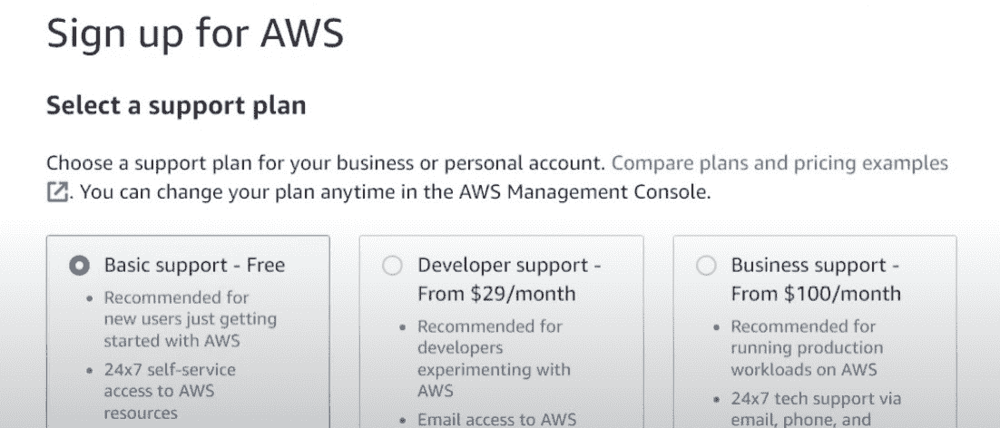

# 第二章：创建 AWS 账户

在本章中，我们将创建一个 AWS 账户。本书包含示例和多个用例，因此创建一个账户以便跟随后续章节中的 AWS 练习将很有用。让我们学习如何创建 AWS 账户。

本章涵盖了以下主题：

+   创建 AWS 账户

# 创建 AWS 账户

要创建 AWS 账户，请执行以下步骤：

1.  在 [`aws.amazon.com/`](https://aws.amazon.com/) 打开 AWS 网站，以创建账户。

1.  点击页面顶部右侧的 **创建 AWS 账户** 按钮。

**注册 AWS** 界面将打开。

1.  如 *图 2.2* 所示，有两个需要填写字段：

    1.  **根用户电子邮件地址**：根用户是所有子账户的所有者，能够访问所有资源并管理它们。您可以为根用户使用单个电子邮件地址。除此之外，根用户对所有服务都有完全访问权限。这是您在保护账户时需要考虑的事情。

    1.  **AWS 账户名称**：**AWS 账户名称**是一个非正式名称，它出现在账户 ID 旁边。您可以在创建 AWS 账户时命名它。您可以在根账户下拥有多个账户以实施不同的项目。在某些情况下，您需要将服务和成本分开。在这种情况下，创建多个账户可能是一个好办法。

点击 **验证电子邮件地址** 按钮。

1.  在填写 **根用户电子邮件地址** 和 **AWS 账户名称** 字段后，您将通过电子邮件收到一个验证码。应在 **验证码** 输入字段中填写此代码。点击 **验证**。

图 2.3 – 添加验证码

1.  下一步是定义访问密码。填写 **根用户密码** 和 **确认根用户密码** 字段，然后点击 **继续（第 1 步/5 步）**。

1.  填写所需个人信息。

1.  在填写个人信息后，填写信用卡信息。

重要提示

我建议使用预算有限的卡，因为如果你不小心打开了成本高昂或持续运行的 AWS 服务，这张有限额的卡可以防止你过度消费。

在您输入信用卡信息后，您可能会根据您的银行账户要求确认。

1.  确认后，您将被要求选择一个支持计划。出于学习目的，您可以使用 **基本支持 - 免费** 计划，因为它推荐给新用户。

图 2.7 – 支持计划

恭喜！在选择支持计划后，你将拥有一个 AWS 账户，以便开始使用云服务。

# 摘要

在本章中，我们探讨了 AWS 账户的创建。AWS 账户将帮助你进行云环境中的 Python 练习。需要注意的是，AWS 是一项付费服务，你必须考虑你将要使用的成本。在下一章中，我们将探讨 Lambda 等流行服务。

# 第二部分：使用 Python 深入探索 AWS

在本部分，你将深入探索 Python 编程中最常用的 AWS 服务，例如 Lambda、EC2 和 Elastic Beanstalk。然而，还会提到一些其他 AWS 服务，如 S3，以获得更广泛的知识。

本部分包含以下章节：

+   *第三章*，*使用 Lambda 进行云计算*

+   *第四章*，*在 EC2 上运行 Python 应用程序*

+   *第五章*，*使用 PyCharm 运行 Python 应用程序*

+   *第六章*，*在 Elastic Beanstalk 上部署 Python 应用程序*
