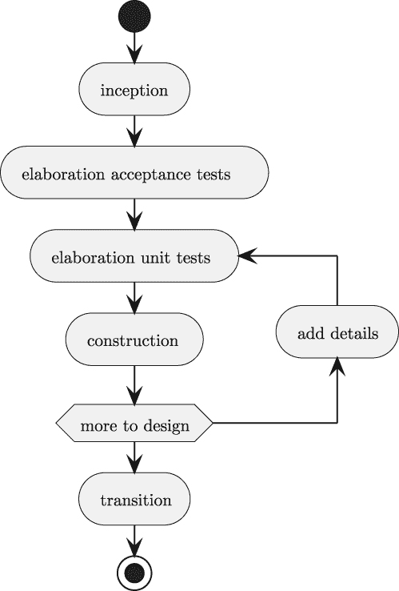

# 第一章

项目零：其他项目的模板

这是一本项目书。为了使每个项目成为一份优秀的投资组合作品，我们将每个项目视为一个企业级软件产品。你可以构建可以发布到公司（或组织）内部存储库的东西。

对于这本书，我们将定义一些标准，这些标准将适用于所有这些项目。这些标准将确定可交付成果为文件、模块、应用程序、笔记本和文档文件的组合。虽然每个企业都是独特的，但这里描述的标准与我在各种企业作为顾问的经验是一致的。

我们想划出一个非正式的界限，以避免发布到 PyPI 网站所需的一些步骤。我们的重点是具有测试用例和足够文档来解释其功能的产品。我们不希望完全创建一个 PyPI 项目。这使我们能够避免构建系统的复杂性以及相关的`pyproject.toml`文件。

这些项目不是为了产生通用、可重用的模块。它们是特定于问题域和数据集的应用程序。虽然这些都是特定解决方案，但我们不想阻止任何感到有动力将项目推广为通用和可重用的人。

本章将展示每个项目的总体概述。然后我们将查看可交付成果的集合。本章以项目零结束——一个作为其他项目模板的初始项目。我们将涵盖以下主题：

+   对我们将尝试强调的软件质量原则的概述。

+   完成项目作为一系列项目冲刺的建议方法。

+   每个项目可交付成果列表的一般概述。

+   一些建议的工具。这些不是必需的，一些读者可能有其他选择。

+   作为后续项目模板的样本项目。

我们将从高质量软件的一些特性概述开始。目的是为每个项目的可交付成果建立一些标准。

## 1.1 关于质量

有一个清晰的期望定义是有帮助的。对于这些期望，我们将依赖 ISO 25010 标准来定义每个项目的质量目标。更多详情，请参阅[`iso25000.com/index.php/en/iso-25000-standards/iso-25010`](https://iso25000.com/index.php/en/iso-25000-standards/iso-25010)。

ISO/IEC 25010:2011 标准描述了**系统和软件** **质量要求和评估**（**SQuaRE**）。本标准提供了软件的八个特性。这些特性如下：

+   **功能性适宜性**。它是否做了我们需要的？它是完整的、正确的，并且适合用户表达（和暗示）的需求？这是每个项目描述的重点。

+   **性能效率**. 它是否工作得快？它是否使用最少的资源？它是否有足够的容量来满足用户的需求？我们不会在这里深入讨论这个问题。我们将讨论编写性能测试和解决性能问题的方法。

+   **兼容性**. 它能否与其他软件共存？它是否能够正确地与其他应用程序交互？在一定程度上，Python 可以帮助确保应用程序与其他应用程序礼貌地交互。我们将强调我们在选择文件格式和通信协议时的兼容性问题。

+   **可用性**. 有许多子特性有助于我们理解可用性。本书中的许多项目都专注于命令行界面（CLI），以确保最低限度的可学习性、可操作性、错误保护和可访问性。一些项目将包括网络服务 API，而其他项目将利用 JupyterLab 的 GUI 界面提供交互式处理。

+   **可靠性**. 当用户需要时它是否可用？我们能否检测和修复问题？我们需要确保我们拥有所有必要的部件和组件，以便我们可以使用该软件。我们还需要确保我们有一套完整的测试来确认它将正常工作。

+   **安全性**. 就像可用性一样，这是一个深奥的话题。我们将在一个项目中讨论一些安全性的方面。其余的项目将使用命令行界面（CLI），这样我们就可以依赖操作系统的安全模型。

+   **可维护性**. 我们能否诊断问题？我们能否扩展它？我们将把文档和测试案例视为维护的关键。我们还将利用一些额外的项目文件，以确保我们的项目可以被他人下载和扩展。

+   **可移植性**. 我们能否迁移到新的 Python 版本？新的硬件？这非常重要。Python 生态系统正在快速发展。由于所有库和包都处于不断变化的状态，我们需要能够精确地定义我们的项目依赖于哪些包，并确认它与新候选包集兼容。

这两个特性（兼容性和可移植性）是 Python 的特性。明智的接口选择确保这些特性得到满足。这些有时被描述为架构决策，因为它们影响多个应用程序如何协同工作。

对于安全性，我们将依赖操作系统。同样，对于可用性，我们将限制自己使用命令行界面（CLI）应用程序，依赖长期的设计原则。

性能的概念在这里我们不会强调。我们将指出在处理大数据集时需要仔细设计的地方。数据结构和算法的选择是另一个独立的话题。本书的目标是向您展示可以激发对性能问题进行深入研究的项目。

这三个质量特性——功能性适宜性、可靠性和可维护性——是这些项目的真正焦点。这些似乎是良好软件设计的必要元素。这些是你可以展示你的 Python 编程技能的地方。

另一个视角来自**《十二要素应用》**（[`12factor.net`](https://12factor.net)）。这个视角主要关注 Web 应用程序。这些概念提供了对上述质量特性的更深入见解和更具体的技术指导：

1.  代码库。 “在一个代码库中进行版本控制，进行多次部署。” 我们将使用**Git**和**GitHub**或可能使用**sourceforge**支持的另一个版本管理器。

1.  依赖项。 “明确声明并隔离依赖项。” 传统上，Python 的`requirements.txt`文件用于此目的。在这本书中，我们将继续使用`pyproject.toml`文件。

1.  配置。 “将配置存储在环境中。” 我们不会强调这一点，但 Python 提供了多种处理配置文件的方法。

1.  后备服务。 “将后备服务视为附加资源。” 我们在几个地方提到了这一点。存储、消息、邮件或缓存的工作方式不是我们将深入研究的内容。

1.  构建、发布、运行。 “严格分离构建和运行阶段。” 对于命令行应用程序来说，这意味着我们应该将应用程序部署到“生产”环境以使用高价值数据并产生企业所需的结果。我们希望避免在我们的桌面开发环境中运行这些应用程序。

1.  进程。 “以一个或多个无状态进程执行应用程序。” CLI 应用程序通常无需额外努力就按这种方式构建。

1.  端口绑定。 “通过端口绑定导出服务。” 我们不会强调这一点；它非常特定于 Web 服务。

1.  并发。 “通过进程模型进行扩展。” 这是感兴趣读者想要处理非常大的数据集的主题。我们不会在正文中进行强调。我们将在某些章节的“额外内容”部分建议一些这些主题。

1.  可用性。 “通过快速启动和优雅关闭最大化鲁棒性。” CLI 应用程序也倾向于以这种方式构建。

1.  开发/生产一致性。 “尽可能保持开发、测试和生产环境的相似性。” 虽然我们不会深入强调这一点，但我们的 CLI 应用程序的意图是通过命令行参数、shell 环境变量和配置文件来揭示开发和生产之间的区别。

1.  日志。 “将日志视为事件流。” 我们将建议应用程序记录日志，但在这本书中不会提供更详细的指导。

1.  管理进程。 “将管理/管理任务作为一次性进程运行。” 一些项目将需要一些额外的管理编程。这些将作为可交付的 CLI 应用程序构建，包括完整的验收测试套件。

我们的目标是提供项目描述和交付物清单，这些清单试图符合这些质量标准。正如我们之前提到的，每个企业都是独特的，一些组织可能无法达到这些标准，而一些组织可能会超过它们。

### 1.1.1 关于质量的更多阅读

除了 ISO 标准之外，IEEE 1061 标准也涵盖了软件质量。虽然它自 2020 年以来一直处于不活跃状态，但它包含了一些好想法。该标准侧重于质量**指标**，深入分析了软件质量因素。

阅读以下链接以了解 ISO 标准的起源背景可能会有所帮助：[`en.wikipedia.org/wiki/ISO/IEC_9126`](https://en.wikipedia.org/wiki/ISO/IEC_9126)。

在深入研究这个主题时，识别以下三个术语可能会有所帮助：

+   **因素**是软件的外部视角。它们反映了用户的理解。一些基本的质量特性对用户来说可能并不直接可见。例如，可维护性可能看起来像是可靠性或可用性问题，因为软件难以修复或扩展。

+   **标准**来自软件的内部视角。质量标准是项目交付物的焦点。我们的项目代码应该反映上述列出的八个质量特性。

+   **指标**是我们如何控制用户所见因素的方法。我们不会强调质量指标。在某些情况下，像**pylint**这样的工具可以提供静态代码质量的实质性度量。这并不是一般软件质量的全面工具，但它为与复杂性和可维护性相关的几个关键指标提供了一个简单的起点。

在确定了高质量软件的标准之后，我们可以将注意力转向构建这些文件的步骤顺序。我们将建议一个你可以遵循的阶段顺序。

## 1.2 建议的项目冲刺

我们犹豫是否提供构建软件的详细分步过程。对于更有经验的开发者，我们的步骤顺序可能不符合他们的当前实践。对于经验较少的开发者，建议的过程可以通过提供一个合理的顺序来帮助构建交付物。

曾经有一段时间，一份包含详细具体任务列表的“工作说明书”是软件开发工作的一个核心部分。这通常是“瀑布”方法的一部分，其中需求流向分析师，他们编写规范，然后规范流向设计师，设计师编写高级设计，最后流向编码者。这不是构建软件的好方法，已经被敏捷方法在很大程度上取代。有关敏捷的更多信息，请参阅[`agilemanifesto.org`](https://agilemanifesto.org)。

敏捷方法让我们既能将项目视为一系列要完成的步骤，也能将其视为需要创建的一系列交付物。我们首先描述步骤，避免过多强调细节。我们将重新访问交付物，在这些部分中，我们将更深入地探讨最终产品需要是什么。

建议的方法遵循“敏捷统一流程”（[`www.methodsandtools.com/archive/archive.php?id=21`](https://www.methodsandtools.com/archive/archive.php?id=21)），它有四个一般阶段。我们将细分其中一个阶段以区分两种重要的交付物。

我们建议将每个项目分为以下五个阶段：

1.  启动阶段。准备工具。组织项目目录和虚拟环境。

1.  详细阐述，第一部分：定义完成。这通过验收测试用例来实现。

1.  详细阐述，第二部分：定义组件和一些测试。这通过为需要构建的组件实现单元测试用例来实现。

1.  构建。构建软件。

1.  过渡阶段。最终清理：确保所有测试通过，文档可读。

这些努力并不是以简单的线性方式进行。通常需要在详细阐述和构建之间迭代，以分别创建功能。

它通常如*图 1.1*所示。



图 1.1：开发阶段和周期

此图提供了一个非常粗略的概述，我们将讨论以下活动。重要概念是在详细阐述和构建阶段之间迭代。在构建所有代码之前，很难完全设计一个项目。设计一点，构建一点，根据需要重构，会更容易。

对于复杂项目，可能会有一系列过渡到生产的步骤。通常，会创建一个“最小可行产品”来展示一些概念。随后将会有更多功能或更专注于用户需求的产品。理想情况下，它将具有这两种改进：更多功能和更好地关注用户需求。

我们将更详细地查看这四个阶段，从启动阶段开始。

### 1.2.1 启动阶段

通过创建项目的父目录开始启动阶段，然后是一些常用的子目录（`docs`、`notebooks`、`src`、`tests`）。将有一些顶级文件（`README.md`、`pyproject.toml`和`tox.ini`）。预期目录和文件的列表在本书的交付物列表中描述得更详细。我们将在交付物部分查看这些文件和目录的内容。

在`README.md`文件中捕捉任何初始想法很有帮助。稍后，这将被重构为更正式的文档。最初，这是记录笔记和提醒的完美地方。

为项目构建一个全新的虚拟环境。每个项目都应该有自己的虚拟环境。环境基本上是免费的：最好构建它们以反映每个项目的独特方面。

这里有一个可以用来构建环境的**conda**命令。

```py
% conda create -n project0 --channel=conda-forge python=3.10
```

启动阶段的一个重要部分是为项目开始编写文档。这可以使用 Sphinx 工具完成。

虽然**Conda Forge**提供了 Sphinx，但这个版本落后于**PyPI**存储库中可用的版本。由于这个滞后，最好使用**PIP**安装 Sphinx：

```py
% python -m pip install sphinx
```

安装 Sphinx 后，初始化和发布项目的文档很有帮助。开始这个过程允许在工作的过程中发布和共享设计想法。在`docs`目录中，执行以下步骤：

1.  运行`sphinx-quickstart`命令以填充文档。请参阅[`www.sphinx-doc.org/en/master/usage/quickstart.html#setting-up-the-documentation-sources`](https://www.sphinx-doc.org/en/master/usage/quickstart.html#setting-up-the-documentation-sources)。

1.  更新`index.rst`的目录（TOC）以包含两个条目：“概述”和“API”。这些是将在单独的文件中出现的部分。

1.  编写一个`overview.rst`文档，其中包含完成的定义：将要完成什么。这应该涵盖项目的核心“谁-什么-何时-何地-为什么”。

1.  在 API 文档中添加一个标题，并添加一个`.. todo::`笔记给自己。随着你向项目中添加模块，你将添加到这份文档中。

1.  在详细说明阶段，你将更新`index.rst`以添加架构和设计决策的部分。

1.  在建设过程中，当你编写代码时，你将添加到 API 部分。

1.  在过渡阶段，你将在`index.rst`中添加一些“如何”部分：如何测试它，以及如何使用它。

以此为起点，`make html`命令将构建一个 HTML 格式的文档集。这可以与利益相关者共享，以确保对项目有一个清晰、共同的理解。

在有了骨架目录和一些记录想法和决策的初始位置后，开始详细阐述初始目标，并决定将构建什么，以及它将如何工作，是有意义的。

### 1.2.2 详细说明，第一部分：定义完成

有一个清晰的“完成”定义很有帮助。这有助于将建设努力引导到一个明确的目标。将“完成”的定义写成正式的、自动化的测试套件很有帮助。为此，Gherkin 语言很有用。**behave**工具可以执行 Gherkin 功能来评估应用程序软件。Gherkin 的替代方案是使用**pytest**工具与**pytest-bdd**插件来运行验收测试。

Gherkin 的两个主要优点是能够将功能描述结构化到场景中，并以英语（或任何其他自然语言）编写描述。将预期的行为框架化到离散的操作场景中，迫使我们清晰地思考应用程序或模块的使用方式。用英语（或其他自然语言）编写使得与其他人共享定义以确认我们的理解变得更容易。它还有助于将完成的定义集中在问题域上，而不会陷入技术考虑和编程。

每个场景可以有三个步骤：Given、When 和 Then。Given 步骤定义一个上下文。When 步骤定义一个动作或软件的请求。Then 步骤定义预期的结果。这些步骤定义可以像需要的那样复杂，通常涉及多个由`And`连接的子句。可以通过表格提供示例，以避免复制和粘贴具有不同值集的场景。一个单独的模块提供英语步骤文本的 Python 实现。

请参阅[`behave.readthedocs.io/en/stable/gherkin.html#gherkin-feature-testing-language`](https://behave.readthedocs.io/en/stable/gherkin.html#gherkin-feature-testing-language)，了解使用 Gherkin 编写的场景的多个示例。

通过创建一个基于概述描述的`tests/features/project.feature`文件来开始这一部分的详细阐述。不要使用像`project`这样的无聊名称。一个复杂的项目可能有多个功能，因此功能文件名称应反映功能。

要使用**pytest**，在`tests`目录中编写一个（或多个）验收测试脚本。

功能由**步骤**支持。这些步骤位于`tests/steps`目录中的模块中。一个`tests/steps/hw_cli.py`模块为功能文件中的步骤提供了必要的 Python 定义。模块的名称不重要；我们建议使用类似`hw_cli`的名称，因为它实现了 hello-world 命令行界面的步骤。

**Behave**工具使用的底层机制是函数装饰器。这些装饰器将功能文件中的文本与定义实现该步骤的函数相匹配。这些装饰器可以进行通配符匹配，以允许在措辞上具有灵活性。装饰器还可以从文本中解析出参数值。

需要一个`tests/environment.py`文件，但对于简单的测试来说，它可以保持为空。此文件提供测试上下文，并定义了**Behave**工具用于控制测试设置和拆卸的一些函数。

一旦编写了场景，运行**Behave**工具查看验收测试失败是有意义的。最初，这让你能够调试步骤定义。

对于这个应用程序，步骤必须正确执行应用程序程序并捕获输出文件。因为应用程序尚不存在，所以在这个阶段预期会出现测试失败。

包含应用程序场景的特征文件是完成工作的一个工作定义。当测试套件运行时，它将显示软件是否工作。从无法工作的特性开始意味着其余的构建阶段将是调试失败并修复软件，直到应用程序通过验收测试套件。

在*项目 0 – 带测试用例的 Hello World*中，我们将查看一个 Gherkin 语言特性的示例，匹配步骤定义，以及一个用于运行测试套件的`tox.ini`文件。

### 1.2.3 细化，第二部分：定义组件和测试

验收测试套件通常相对“粗糙”——测试会整个地锻炼应用程序，并避免内部错误条件或微妙的边缘情况。验收测试套件很少会锻炼所有单个软件组件。正因为如此，如果没有每个单元的详细单元测试，调试复杂应用程序中的问题可能会很困难——每个包、模块、类和函数。

在编写通用的验收测试套件之后，做两件事会有帮助。首先，开始编写一些可能解决问题的骨架代码。这个类或函数将包含一个文档字符串来解释想法。可选地，它可以包含一个`pass`语句的主体。编写这个骨架之后，第二步是通过编写组件的单元测试来扩展文档字符串中的想法。

假设我们已经编写了一个包含将执行名为`src/hello_world.py`的应用程序的步骤的场景。我们可以创建这个文件，并包含如下骨架类定义：

```py
class Greeting:
    """
    Created with a greeting text.
    Writes the text to stdout.

    ..  todo:: Finish this
    """
    pass
```

这个示例展示了一个具有设计想法的类。这需要通过一个明确的行为声明来扩展。这些期望应该以这个类的单元测试的形式出现。

一旦编写了一些骨架和测试，就可以使用**pytest**工具来执行这些测试。

单元测试可能会失败，因为骨架代码不完整或不工作。在测试完整但类不工作的情况下，你就可以开始构建阶段了。

在设计不完整或测试不完整的情况下，对于这些类、模块或函数，保持细化阶段是有意义的。一旦测试被理解，构建就有了一个清晰和可实现的目标。

我们并不总是第一次就能得到正确的测试用例，我们必须随着学习的深入而改变它们。我们很少第一次就能得到正确的代码。如果测试用例先出现，它们确保我们有明确的目标。

在某些情况下，如果没有先编写一些“试探性解决方案”来探索替代方案，可能难以清晰地表达设计。一旦试探性解决方案工作正常，编写测试来证明代码正常工作是有意义的。

更多关于创建试探性解决方案的信息，请参阅[`www.extremeprogramming.org/rules/spike.html`](http://www.extremeprogramming.org/rules/spike.html)。

到目前为止，您已经对软件的设计有了概念。测试用例是将设计形式化为目标的一种方式。现在是开始构建的时候了。

### 1.2.4 构建阶段

构建阶段完成了在细化阶段开始类和函数（以及模块和包）的定义。在某些情况下，随着定义的扩展，可能需要添加测试用例。

随着我们越来越接近解决问题，通过测试的数量将会增加。

测试的数量也可能增加。通常，我们会意识到类定义的草图是不完整的，需要额外的类来实现**状态**或**策略**设计模式。作为另一个例子，我们可能意识到需要子类来处理特殊情况。这种新的理解将改变测试套件。

当我们查看几天内的进展时，我们应该看到通过测试的数量接近总测试数量。

我们需要多少测试？这里有很多不同的意见。为了展示高质量的工作，测试覆盖 100%的代码是一个好的起点。对于某些行业，一个更严格的规则是覆盖代码中 100%的逻辑路径。这个更高的标准通常用于像机器人技术和医疗保健这样的应用，在这些应用中，软件故障的后果可能涉及伤害或死亡。

### 1.2.5 过渡

对于企业应用，从开发团队到正式运维有一个过渡。这通常意味着将部署到具有真实用户社区及其数据的实际生产环境中。

在拥有良好持续集成/持续部署（CI/CD）实践的组织中，将正式执行`tox`命令以确保一切正常：所有测试都通过。

在一些企业中，还会运行`make html`命令来创建文档。

通常，技术运维团队需要文档和`README.md`文件中的特定主题。运维人员可能需要诊断和解决数百个应用程序的问题，他们需要非常具体的建议，以便他们可以立即找到。我们在这本书中不会强调这一点，但当我们完成我们的项目时，重要的是要考虑我们的同事将使用这个软件，我们希望他们的工作生活愉快且富有成效。

最后一步是将您的项目发布到您选择的公共仓库。

您已经完成了您的一部分作品集。您希望潜在的商业伙伴、招聘经理或投资者看到这一点，并认识到您的技能水平。

我们可以将一个项目视为一系列步骤的序列。我们也可以将一个项目视为由这些步骤创建的文件集的交付成果。在下一节中，我们将更详细地查看这些交付成果。

## 1.3 交付成果清单

我们将再次审视项目，这次是从创建哪些文件的角度来看。这将与上一节中显示的活动概述相平行。

以下大纲展示了完成项目中的许多文件：

+   `docs`目录中的文档。那里将会有其他文件，但你的重点将放在以下文件上：

    +   Sphinx 的`index.rst`起始文件，其中包含对概述和 API 部分的引用。

    +   一个包含项目总结的`overview.rst`部分。

    +   一个包含`..`` automodule::`命令的`api.rst`部分，用于从应用程序中提取文档。

+   `tests`目录中的一组测试用例。

    +   针对 Behave（或 Gherkin 的**pytest-bdd**插件）的验收测试。当使用 Behave 时，将会有两个子目录：一个`features`目录和一个`steps`目录。此外，还将有一个`environment.py`文件。

    +   使用**pytest**框架编写的单元测试模块。这些模块的名称都以`test_`开头，以便**pytest**能够轻松找到它们。理想情况下，使用**Coverage**工具来确保 100%的代码被测试。

+   `src`目录中的最终代码。对于一些项目，一个模块就足够了。其他项目可能需要几个模块。（熟悉 Java 或 C++的开发者在这里通常会创建太多的模块。Python 中的*module*概念更接近 Java 中的*package*概念。将每个类定义放入单独的模块文件中并不是常见的 Python 实践。）

+   任何 JupyterLab 笔记本都可以放在`notebooks`文件夹中。并非所有项目都使用 JupyterLab 笔记本，因此如果没有笔记本，可以省略此文件夹。

+   一些其他项目文件位于顶级目录中。

    +   应该使用`tox.ini`文件来运行**pytest**和**behave**测试套件。

    +   `pyproject.toml`提供了有关项目的许多信息。这包括运行项目所需安装的详细包和版本列表，以及开发测试所需的包。有了这些信息，**tox**工具就可以使用`requirements.txt`或**pip-tools**工具来构建虚拟环境并测试项目。实际上，这也会被其他开发者用来创建他们的工作桌面环境。

    +   一个`environment.yml`文件可以帮助其他开发者使用**conda**创建他们的环境。这将重复`requirements-dev.txt`的内容。对于小型团队来说，这可能没有帮助。然而，在大型企业工作团队中，这可以帮助其他人加入你的项目。

    +   此外，一个包含总结的`README.md`（或`README.rst`）文件是必不可少的。在许多情况下，这是人们首先查看的内容；它需要为项目提供一个“电梯演讲”（见[`www.atlassian.com/team-playbook/plays/elevator-pitch`](https://www.atlassian.com/team-playbook/plays/elevator-pitch))）。

有关结构复杂项目的额外建议，请参阅[`github.com/cmawer/reproducible-model`](https://github.com/cmawer/reproducible-model)。

我们按照这个顺序呈现文件，是为了鼓励首先编写文档的方法。这之后是创建测试用例，以确保文档能够满足编程需求。

我们已经研究了开发活动和将要创建的产品审查。在下一节中，我们将探讨一些建议的开发工具。

## 1.4 开发工具安装

本书中的许多项目都专注于数据分析。数据分析的工具通常最容易通过 **conda** 工具安装。这不是必需的，熟悉 **PIP** 工具的读者通常能够在没有 **conda** 工具的帮助下构建他们的工作环境。

我们建议以下工具：

+   **Conda** 用于安装和配置每个项目的独特虚拟环境。

+   **Sphinx** 用于编写文档。

+   **Behave** 用于验收测试。

+   **Pytest** 用于单元测试。**pytest-cov** 插件可以帮助计算测试覆盖率。

+   **Pip-Tool** 用于从 `pyproject.toml` 项目定义中构建一些工作文件。

+   **Tox** 用于运行测试套件。

+   **Mypy** 用于类型注解的静态分析。

+   **Flake8** 用于代码的静态分析，以确保遵循一致的风格。

可交付成果之一是 `pyproject.toml` 文件。它将项目的所有元数据集中在一个地方。它列出了应用程序所需的包，以及用于开发和测试的工具。它有助于锁定确切的版本号，使得某人更容易重建虚拟环境。

一些 Python 工具（如 PIP）与从 `pyproject.toml` 文件派生出的文件一起工作。**pip-tools** 从 TOML 文件中的源信息创建这些派生文件。

例如，我们可能会使用以下输出从 `pyproject.toml` 中提取开发工具信息并将其写入 `requirements-dev.txt`。

```py
% conda install -c conda-forge pip-tools
% pip-compile --extra=dev --output-file=requirements-dev.txt
```

通常的做法是使用 `requirements-dev.txt` 安装类似这样的包：

```py
% conda install --file requirements-dev.txt --channel=conda-forge
```

这将尝试安装所有命名的包，从社区 `conda-forge` 频道拉取。

另一个替代方案是像这样使用 PIP：

```py
% python -m pip install --r requirements-dev.txt
```

这种环境准备是每个项目启动阶段的一个关键组成部分。这意味着 `pyproject.toml` 经常是第一个创建的可交付成果。从这个文件中，可以提取 `requirements-dev.txt` 来构建环境。

为了使前面的步骤和可交付成果更加具体，我们将通过一个初始项目进行讲解。这个项目将有助于展示剩余项目应该如何完成。

## 1.5 项目 0 – 带测试用例的“Hello World”

这是我们的第一个项目。这个项目将展示本书所有项目的模式。它将包括以下三个要素。

+   **描述**：描述部分将阐述一个问题，以及为什么用户需要软件来解决它。在某些项目中，描述将包含非常具体的信息。在其他项目中，可能需要更多的想象力来创造解决方案。

+   **方法**：方法部分将提供一些关于架构和设计选择的指导。对于某些项目，存在权衡，**额外**部分将探讨一些其他选择。

+   **可交付成果**：可交付成果部分列出了最终应用程序或模块的期望。它通常会提供一些 Gherkin 功能定义。

对于这个初步项目，描述不会很复杂。同样，这个第一个项目的“方法”部分也将简短。我们将对可交付成果进行一些额外的技术讨论。

### 1.5.1 描述

用户需要解决的问题是如何最好地将新开发者引入团队。一个良好的入职流程通过使新成员尽快变得高效来帮助我们的用户。此外，这样的项目还可以用于让经验丰富的成员了解新工具。

我们需要指导我们的团队成员安装核心开发工具集，创建一个可工作的模块，并在冲刺结束时展示他们的完成工作。这个第一个项目将使用最重要的工具，并确保每个人都对工具和可交付成果有一个共同的理解。

每个开发者都将构建一个项目来创建一个小型应用程序。这个应用程序将有一个命令行界面（CLI）来编写愉快的问候语。

以下示例显示了期望：

```py
% python src/hello_world.py --who "World"
Hello, World!
```

此示例展示了如何通过命令行参数`--who` "world"运行应用程序，在控制台上产生响应。

### 1.5.2 方法

对于这个项目，目标是创建一个 Python 应用程序模块。该模块需要几个内部函数。如果看起来更合适，可以将这些函数组合成一个类。这些函数包括：

+   一个用于解析命令行选项的函数。这将使用`argparse`模块。默认的命令行参数值可以在`sys.argv`中找到。

+   一个用于编写愉快问候语的函数。这可能只是一行代码。

+   一个具有明显名称（如`main()`）的整体函数，用于获取选项并编写问候语。

整个模块将包含函数（或类）定义。它还将包含一个`if __name__ == "__main__":`块。这个块将保护对表达式`main()`的评估，使模块更容易进行单元测试。

对于一个简单的问题来说，这需要相当多的工程。有些人可能会称之为过度设计。目的是创建一个足够复杂的系统，以至于需要多个单元测试用例。

### 1.5.3 可交付成果

如上所述在*可交付成果列表*，对于一般项目，有许多可交付成果文件。以下是本项目的建议文件：

+   `README.md` 总结了项目。

+   `pyproject.toml` 定义了项目，包括开发工具、测试工具和其他依赖项。

+   `docs` 包含文档。如上所述，这应由 `sphinx-quickstart` 工具构建，并应包含至少概述和 API 部分。

+   `tests` 包含测试用例；文件包括以下内容：

    +   `test_hw.py` 包含模块的函数或类的单元测试。

    +   `features/hello_world.feature` 包含作为场景集合的整体验收测试。

    +   `steps/hw_cli.py` 包含了场景中步骤的 Python 定义。

    +   `environment.py` 包含控制 **behave** 测试设置和拆卸的函数。对于简单的项目，它可能为空。

+   `tox.ini` 配置用于运行完整测试套件的 **tox** 工具。

+   `src` 包含 `hello_world.py` 模块。

我们将在以下子节中详细查看这些文件中的几个。

#### pyproject.toml 项目文件

`pyproject.toml` 文件在单个位置包含大量项目元数据。此文件的最小内容是用于构建和安装包的 “build-system” 描述。

对于本书的目的，我们可以使用以下两行来定义构建系统：

```py
[build-system]
requires = ["setuptools", "wheel"]  # PEP 508 specifications.
```

这指定了使用 `setuptools` 模块创建包含项目代码的 “wheel”。`pyproject.toml` 不需要进一步详细定义分发包。本书不强调创建分发包或使用 Python 包索引 PyPI 管理包。

此文件的其余部分应包含有关项目的信息。您可以包含以下类似的部分：

```py
[project]
name = "project_0"
version = "1.0.0"
authors = [
    {name = "Author", email = "author@email.com"},
]
description = "Real-World Python Projects -- Project 0."
readme = "README.md"
requires-python = ">=3.10"
```

显然，您将想要更新 `authors` 部分以包含您的信息。您可能正在使用较新的 Python 版本，可能需要更改 `requires-python` 字符串以指定您独特解决方案所需的最小版本。

`[project]` 部分需要其他三块信息：

+   执行您的应用程序所需的包。

+   任何测试您的应用程序所需的包或工具。

+   开发您的应用程序所需的任何包或工具。

这三个依赖项组织如下：

```py
dependencies = [
    # Packages required -- None for Project Zero.
]
[project.optional-dependencies]
dev = [
    # Development tools to work on this project
    "sphinx==7.0.1",
    "sphinxcontrib-plantuml==0.25",
    "pip-tools==6.13.0"
]
test = [
    # Testing tools to test this project
    "pytest==7.2.0",
    "tox==4.0.8",
    "behave==1.2.6"
]
```

`dependencies` 行列出了执行应用程序所需的依赖项。一些项目——比如这个项目——依赖于标准库，无需添加更多内容。`[project.optional-dependencies]` 部分包含两个额外的包列表：开发所需的包和测试所需的包。

注意，我们在该文件中放置了特定的版本号，以确保我们绝对确定将使用哪些包。随着这些包的发展，我们需要测试新版本并升级依赖项。

如果您在本书中看到的版本号落后于 PyPI 或 Conda-Forge 上的当前技术水平，请随意使用最新版本。

使用**pip-compile**命令很有帮助。该命令作为**pip-tools**的一部分安装。此命令从`pyproject.toml`文件中创建提取文件，供**pip**或**conda**使用。

对于开发者来说，我们通常希望安装所有的“额外”组件。这通常意味着执行以下命令以创建一个`requirements-dev.txt`文件，该文件可以用来构建开发环境。

```py
% pip-compile --all-extras -o requirements-dev.txt
```

为了运行**tox**工具，通常还会创建一个仅包含所需包和工具的测试子集。使用以下命令：

```py
% pip-compile --extra test -o requirements.txt
```

这将创建用于检测和管理**tox**测试所使用的虚拟环境的`requirements.txt`文件。

#### 文档目录

如上所述在*建议的项目冲刺*中，此目录应使用`sphinx-quickstart`构建。在创建初始文件集之后，进行以下更改：

+   添加一个`api.rst`文件作为 Sphinx 生成的 API 文档的占位符。这将使用`.. automodule::`指令从您的应用程序中提取文档。

+   添加一个`overview.rst`文件，概述项目。

+   将`index.rst`更新为在目录表中包含这两个新文件。

+   将`conf.py`更新为将`src`目录添加到`sys.path`中。此外，还需要将`sphinx.ext.autodoc`扩展添加到该文件中的`extensions`设置。

在`docs`目录中的`make html`命令可以用来构建文档。

#### `tests/features/hello_world.feature`文件

`features`目录将包含功能的 Gherkin 语言定义。每个功能文件将包含一个或多个场景。对于较大的项目，这些文件通常以从问题描述或架构概述中提取的语句开始，这些语句后来被细化成更详细的步骤来描述应用程序的行为。

对于此项目，其中一个功能文件应该是`features/hello_world.feature`。此文件的 内容应包括功能的描述和至少一个场景。它看起来像以下示例：

```py
Feature: The Cheerful Greeting CLI interface provides a greeting
    to a specific name.

Scenario: When requested, the application writes the greeting message.
  When we run command "python src/hello_world.py"
  Then output has "Hello, World!"
```

在此场景中没有`Given`步骤；没有初始化或准备要求。每个步骤只有一个子句，因此也没有`And`步骤。

此示例与描述中的示例不完全匹配。有两个可能的原因：两个示例中的一个可能是错误的，或者，更宽容地说，此示例暗示了第二个功能。

此示例所暗示的想法是，如果没有提供`--who`命令行选项，则存在默认行为。这表明应该为该功能添加第二个场景——一个带有`--who`选项的场景。

#### `tests/steps/hw_cli.py`模块

`steps`目录包含定义功能文件中自然语言短语的模块。在`hello_world.feature`文件中，`When`和`Then`步骤用纯英语写出了短语：

+   我们运行命令”`python src/hello_world.py`”

+   输出为”`Hello, World!`”

`steps/hw_cli.py`模块将步骤的短语映射到 Python 函数。它通过使用装饰器和模式匹配来指定步骤的类型（`@given`、`@when`或`@then`）以及要匹配的文本。文本中存在`{parameter}`将匹配文本并提供作为参数匹配到步骤函数的值。函数名称无关紧要，通常为`step_impl()`。

通常，`@given`步骤将在测试上下文对象中累积参数值。最佳实践建议只有一个`@when`步骤；这将执行所需操作。对于这个项目，它将运行应用程序并收集输出文件。`@then`步骤可以使用`assert`语句将实际结果与特征文件中显示的预期结果进行比较。

下面是`steps/hw_cli.py`模块可能的样子：

```py
import subprocess
import shlex
from pathlib import Path

@when(u’we run command "{command}"’)
def step_impl(context, command):
    output_path = Path("output.log")
    with output_path.open(’w’) as target:
        status = subprocess.run(
            shlex.split(command),
            check=True, text=True, stdout=target, stderr=subprocess.STDOUT)
    context.status = status
    context.output = output_path.read_text()
    output_path.unlink()

@then(u’output has "{expected_output}"’)
def step_impl(context, expected_output):
    assert context.status.returncode == 0
    assert expected_output in context.output
```

这假设有一个相对较小的输出文件，可以被收集到内存中。对于较大的文件，让`@when`步骤创建一个临时文件并将文件对象保存在上下文中是有意义的。`@then`步骤可以读取并关闭这个文件。`tempfile`模块对于创建在关闭时会被删除的文件很有用。

另一个选择是创建一个`Path`对象并将其保存在上下文中。`@when`步骤可以将输出写入此路径。`@then`步骤可以读取并检查由`Path`对象命名的文件的 内容。

当测试步骤检测到`assert`语句的问题时，它可能不会完全完成。使用`Path`对象的方法需要小心以确保临时文件被删除。`environment.py`模块可以定义一个`after_scenario(context, scenario)`函数来删除临时文件。

#### `tests/environment.py`文件

此模块将包含一些**behave**使用的函数定义。对于这个项目，它将是空的。模块必须存在；一个模块文档字符串适合解释它是空的。

对于这个示例，`tests/steps`模块将包含可以重构为两个可能可重用函数的示例，用于执行应用程序和检查应用程序输出的特定文本。这项额外的设计工作不包含在这个项目中。你可能会在完成几个这样的项目后找到这样做很有帮助。

一旦特性、步骤和环境就绪，就可以使用**behave**程序来测试应用程序。如果没有应用程序模块，测试将失败。在`src`目录中创建一个骨架应用程序模块将允许测试用例执行并失败，因为输出不是预期的。

#### `tests/test_hw.py`单元测试

单元测试可以作为使用`capsys`固定装置的**pytest**函数实现，该固定装置用于捕获系统输出。单元测试用例期望应用程序有一个解析命令行选项的`main()`函数。

下面是一个建议的单元测试函数：

```py
import hello_world

def test_hw(capsys):
        hello_world.main([])
        out, err = capsys.readouterr()
        assert "Hello, World!" in out
```

注意对`main()`函数的测试提供了一个显式的空参数值列表。在**pytest**运行时，覆盖任何可能存在的`sys.argv`值是必要的。

此测试导入`hello_world`模块。此导入有两个重要的后果：

+   `src/hello_world.py`模块必须有一个`if`` __name__`` ==`` "__main__":`部分。一个简单的 Python 脚本（没有这个部分）在导入时将完全执行。这可能会使测试变得困难。

+   `src`目录必须是`PYTHONPATH`环境变量的一部分。这由`tox.ini`文件处理。

此测试将容忍除所需的愉快问候语外的额外输出。使用类似`"Hello,`` World!"`` ==`` out.strip()``的东西可能是有意义的。

`main()`函数的实现细节对此测试来说是透明的。这个`main()`函数可以创建一个类的实例；它也可以使用类的静态方法。

#### The src/tox.ini file

现在测试已经存在，我们可以运行它们。**tox**（和**nox**）工具非常适合运行一系列测试。

这里是一个示例`tox.ini`文件：

```py
[tox]
min_version = 4.0
skipsdist = true

[testenv]
deps = pip-tools
    pytest
    behave
commands_pre = pip-sync requirements.txt
setenv =
    PYTHONPATH=src
commands =
    pytest tests
    behave tests
```

此文件列出了用于测试的工具：**pip-tools**、**pytest**和**behave**。它提供了`PYTHONPATH`的设置。`commands_pre`将使用**pip-tools**包中的**pip-sync**命令准备虚拟环境。给定的命令序列定义了测试套件。

#### The src/hello_world.py file

这是期望的应用模块。测试框架有助于确认它确实可以工作，并且——更重要的是——它符合`*.feature`文件中提供的完成定义。

正如我们上面提到的，单元测试将把这个应用作为模块导入。相比之下，验收测试将运行应用。这意味着`if`` __name__`` ==`` "__main__":`部分是必不可少的。

对于这样一个小型应用程序，应用程序的实际工作应该封装在一个`main()`函数中。这允许主模块以以下片段结束：

```py
if __name__ == "__main__":
    main()
```

这确保了模块在导入时不会起飞并开始运行。它只有在从命令行调用时才会执行有用的工作。

### 1.5.4 完成定义

此项目通过运行`tox`命令进行测试。

当所有测试执行完毕时，输出将如下所示：

```py
(projectbook) slott@MacBookPro-SLott project_0 % tox
py: commands[0]> pytest tests
...
py: commands[1]> behave tests
...
py: OK (0.96=setup[0.13]+cmd[0.53,0.30] seconds)
congratulations :) (1.55 seconds)
```

此输出省略了来自**pytest**和**behave**的详细信息。**tox**工具的输出是重要的总结`py:`` OK`。这告诉我们所有测试都通过了。

一旦完成，我们可以运行以下命令来创建 API 文档：

```py
% (cd docs; make html)
```

使用`()`将两个命令包裹起来可能会有所帮助，这样`cd`` docs`命令就不会离开`docs`目录的会话。一些开发者更喜欢打开两个窗口：一个在顶级目录中运行**tox**工具，另一个在`docs`子目录中运行**sphinx**工具的**make**命令。

## 1.6 总结

在本章中，我们探讨了以下主题：

+   我们将尝试强调的软件质量原则概述。

+   完成项目作为一系列项目冲刺的建议方法。

+   每个项目交付物列表的一般概述。

+   建议用于创建这些示例的工具。

+   一个作为后续项目模板的示例项目。

在创建这个初始项目之后，下一章将探讨一般的项目集合。目标是创建一个包含多个紧密相关项目的完整数据分析工具集。

## 1.7 额外内容

这里有一些想法供您添加到这个项目中。

### 1.7.1 静态分析 - mypy, flake8

有几种常见的静态分析工具，与自动化测试一样重要：

+   **mypy**检查类型注解，以确保函数和类将正确交互。

+   **flake8**执行其他语法检查，以确保代码避免了一些常见的 Python 错误。

+   **black**可用于检查格式，以确保其遵循推荐的风格。`black`应用程序还可以用于重新格式化新文件。

+   **isort**可用于将长序列的`import`语句放入一致的顺序。

一旦应用程序通过了`*.feature`文件中的功能测试，可以应用这些额外的非功能性测试。这些额外的测试通常有助于发现更细微的问题，这些问题可能会使程序难以适应或维护。

### 1.7.2 CLI 功能

命令语言界面允许一个选项，即`--who`选项，提供名称。

添加一个场景来练习此选项是有意义的。

如果没有提供`--who`的值，会发生什么？以下做法是否合适？

```py
(projectbook) slott@MacBookPro-SLott project_0 % python src/hello_world.py
  --who

usage: hello_world.py [-h] [--who WHO]
hello_world.py: error: argument --who/-w: expected one argument
```

是否应该扩展帮助说明以阐明所需内容？

考虑添加以下场景（及其实现代码）：

+   为`--help`选项添加一个场景，该选项由`argparse`模块自动提供。

+   为`--who`无值错误添加一个场景。

### 1.7.3 日志记录

考虑一个更复杂的应用程序，其中可能需要额外的调试输出。为此，通常会在`--verbose`选项中设置日志级别为`logging.DEBUG`，而不是默认的`logging.INFO`级别。

添加此选项需要添加日志功能。考虑对此模块进行以下更改：

+   导入`logging`模块并创建一个全局日志记录器用于应用程序。

+   更新`main()`函数，根据选项设置日志记录器的级别。

+   更新`__name__ == "__main__"`块，使其包含两行：`logging.basicConfig()`和`main()`。最好将日志配置与应用程序的其他处理部分隔离。

### 1.7.4 Cookiecutter

`cookiecutter` 项目（见 [`cookiecutter.readthedocs.io/en/stable/`](https://cookiecutter.readthedocs.io/en/stable/)）是一种构建模板项目的方法。这可以通过共享单个模板来帮助团队成员开始工作。随着工具版本或解决方案架构的变化，可以开发和使用额外的 cookie-cutter 模板。

可用的 cookie-cutter 模板有成千上万。找到适合的简单模板可能很困难。可能更好的做法是创建自己的模板，并在后续章节中引入新概念时不断添加到其中。
