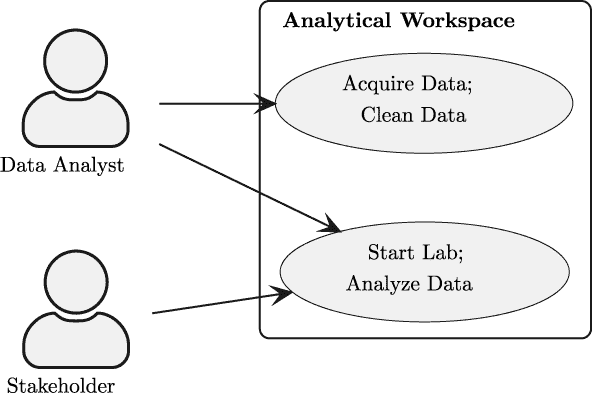

# 第十三章

项目 4.1：可视化分析技术

在进行**探索性数据分析**（**EDA**）时，一个常见的做法是使用图形技术来帮助理解数据分布的性质。美国**国家标准与技术研究院**（**NIST**）的*工程统计学手册*强烈强调了图形技术的重要性。参见[`doi.org/10.18434/M32189`](https://doi.org/10.18434/M32189)。

本章将创建一些额外的 Jupyter 笔记本来展示展示单变量和多变量分布的一些技术。

在本章中，我们将关注创建清理数据图表的一些重要技能：

+   额外的 Jupyter Notebook 技术

+   使用**PyPlot**展示数据

+   Jupyter Notebook 函数的单元测试

本章有一个项目，即构建一个更完整分析笔记本的开始。笔记本可以保存并导出为 PDF 文件，允许分析师分享初步结果以进行早期对话。在下一章中，我们将扩展笔记本以创建可以与同事分享的演示文稿。

看得更远一些，笔记本可以帮助识别需要持续监控的数据的重要方面。这里创建的计算通常将成为更全面自动化报告工具和通知的基础。这种分析活动是理解数据并设计数据模型的重要步骤。

我们将从分析笔记本的描述开始。

## 13.1 描述

在前面的章节中，创建的项目序列建立了一个获取并清理原始数据的管道。目的是构建自动化的数据收集作为 Python 应用程序。

我们指出，临时数据检查最好使用笔记本，而不是自动化的 CLI 工具。同样，为分析和展示创建命令行应用程序可能具有挑战性。分析工作似乎本质上就是探索性的，因此从查看结果中获得即时反馈是有帮助的。

此外，分析工作将原始数据转化为信息，甚至可能是洞察。分析结果需要共享以创造显著的价值。Jupyter 笔记本是一个探索环境，可以创建可读的、有帮助的演示文稿。

对原始数据进行的第一件事之一是创建图表来展示单变量数据的分布和多变量数据中变量之间的关系。我们将强调以下常见的图表类型：

+   **直方图**直方图总结了数据集中一个变量值的分布。直方图将在一个轴上有数据值，在另一个轴上有频率。

+   **散点图**散点图总结了数据集中两个变量值之间的关系。视觉聚类对普通观察者来说是显而易见的。

对于小数据集，散点图中的每个关系都可以用一个单独的点来表示。对于包含许多点且具有相似关系的较大数据集，创建“桶”来反映具有相同关系的点的数量可能是有帮助的。

有多种方法可以显示这些桶的大小。这包括使用颜色代码来表示更流行的组合。对于某些数据集，包围圆的大小可以显示类似值数据的相对浓度。鼓励读者查看替代方案，以帮助强调各种样本属性之间的有趣关系。

在处理图表时，使用**Seaborn**提供彩色样式也很重要。鼓励您探索各种调色板，以帮助强调有趣的数据。

## 13.2 总体方法

在审视我们的方法时，我们将借鉴 C4 模型（[`c4model.com`](https://c4model.com)）的一些指导原则：

+   **上下文**：对于这个项目，上下文图有两个用例：获取-清理过程和这个分析笔记本。

+   **容器**：有一个用于分析应用的容器：用户的个人电脑。

+   **组件**：软件组件包括现有的分析模型，这些模型为 Python 对象提供了便捷的定义。

+   **代码**：代码分散在两个地方：支持模块以及笔记本本身。

本应用的上下文图显示在*图 13.1*中。



图 13.1：上下文图

分析师通常会需要与利益相关者分享他们的分析结果。一个初步的笔记本可能提供确认，表明某些数据不符合零假设，暗示了一个值得深入探索的有趣关系。这可能是一部分，为基于初步结果进行更多分析的理由分配预算。另一种可能的场景是分享一个笔记本以确认零假设很可能为真，并且数据的变化有很大概率是某种测量噪声。这可以用来结束一项调查并专注于替代方案。

在*第六章*、*项目 2.1：数据检查笔记本*中，描述了数据检查笔记本。提到了使用单个获取模型模块来处理数据，但 Python 实现的细节并没有被强调。在检查时，原始数据模块通常不会为数据提供多少有用的结构。

在进入更复杂的项目时，我们将看到笔记本与定义数据模型的模块之间的关系变得更加重要。

对于这个分析笔记本，分析数据模型，在 *第九章*，*项目 3.1：数据清洗基础应用* 中创建，将成为笔记本进行分析的核心部分。这将在分析笔记本中导入和使用。分析过程可能会导致分析模型的变化，以反映学到的经验教训。

由于目录结构，出现了一个技术复杂性。数据采集和清理应用程序位于 `src` 目录中，而笔记本保存在单独的 `notebooks` 目录中。

当在 `notebooks` 目录中处理笔记本时，很难让 Python 的 `import` 语句查看相邻的 `src` 目录。`import` 语句会扫描由 `sys.path` 值定义的目录列表。这个值由一些定义的规则、当前工作目录以及 `PYTHONPATH` 环境变量的值初始化。

有两种方法可以使 `import` 语句从相邻的 `src` 目录加载模块：

1.  在启动 JupyterLab 之前，请将 `../src` 添加到 `PYTHONPATH` 环境变量中。

1.  在启动 JupyterLab 后，将 `../src` 的绝对路径添加到 `sys.path` 列表中。

这两种方法等价。第一种方法可以通过更新个人的 `~/.zshrc` 文件来实现，确保每次终端会话启动时都会设置 `PYTHONPATH` 环境变量。对于其他 shell，例如 `~/.bashrc` 或经典 `sh` shell 的 `./rc`，也有合适的文件。对于 Windows，有一个对话框允许用户编辑系统的环境变量。

另一种方法是更新 `sys.path`，使用如下示例中的代码单元格：

```py
import sys
from pathlib import Path

src_path = Path.cwd().parent / "src"
sys.path.append(str(src_path))
```

这个单元格将把对等 `../src` 目录添加到系统路径中。完成此操作后，`import` 语句将引入 `../src` 目录中的模块，以及内置标准库模块和用 **conda** 或 **pip** 安装的模块。

可以将初始化模块定义为 IPython 启动的一部分。该模块可以以一致的方式更改项目中多个相关笔记本的 `sys.path` 值。

虽然一些开发者反对在笔记本中篡改 `sys.path`，但它具有明确的优势。

在个人的 `~/.zshrc` 文件中设置 `PYTHONPATH` 是一个非常干净且可靠的解决方案。因此，在 `README` 文件中添加一个提醒变得很有必要，以便新团队成员也能将此更改应用到他们的个人主目录中。

当共享笔记本时，确保所有利益相关者都能访问笔记本所依赖的整个项目变得至关重要。这可能导致需要创建一个 Git 仓库，其中包含共享的笔记本、提醒、测试用例和所需的模块。

一旦我们正确定义了路径，笔记本就可以与其他应用程序共享类和函数。我们将继续查看分析笔记本的一种可能的组织结构。

### 13.2.1 笔记本的一般组织

分析笔记本通常是展示和共享结果的主要方法。它与“实验室”笔记本不同。实验室笔记本通常包含许多实验，其中一些是失败的，一些则提供了更有用的结果。与实验室笔记本不同，分析笔记本需要有一个整洁的组织，Markdown 单元格与数据处理单元格穿插其中。实际上，分析笔记本需要讲述一种故事。它需要展示角色、行动以及这些行动的后果。

笔记本中的单元格从开始到结束正确执行是至关重要的。作者应该能够在任何时间重新启动内核并运行所有单元格以重新进行计算。虽然这可能对于特别长时间运行的计算来说可能是不希望的，但这仍然是必须的。

笔记本可能有一些初步操作，这些操作对报告的大多数读者来说并不相关。一个具体的例子是将`sys.path`设置为从相邻的`../src`目录导入模块。利用 JupyterLab 折叠单元格的能力，将一些计算细节放在一边，以帮助读者关注关键概念，这可能是有帮助的。

使用 Markdown 单元格来正式化这些初步介绍似乎是合理的。本节剩余的单元格可以视觉上折叠，以最小化干扰。

初步介绍可以包括技术和相对不那么技术性的方面。例如，设置`sys.path`完全是技术性的，而且很少的利益相关者需要看到这一点。另一方面，从 ND JSON 格式文件中读取`SeriesSample`对象是相对更相关于利益相关者问题的初步步骤。

在初步介绍之后，笔记本的主要内容可以集中在两个主题上：

+   概述统计

+   可视化

我们将在下一节中查看概述统计。

### 13.2.2 用于总结的 Python 模块

对于初步报告，Python 的`statistics`模块提供了一些方便的统计函数。此模块提供`mean()`、`median()`、`mode()`、`stdev()`、`variance()`。还有许多其他函数，鼓励读者进行探索。

这些函数可以在单元格中评估，结果将显示在单元格下方。在许多情况下，这已经足够了。

然而，在少数情况下，需要截断结果以删除无意义的尾随数字。在其他情况下，使用 f-string 为结果提供标签可能会有所帮助。一个单元格可能看起来像以下这样：

```py
f"mean = {statistics.mean(data_values): .2f}"
```

这提供了一个标签，并将输出截断到小数点后两位。

在某些情况下，我们可能希望将计算值纳入 Markdown 单元格中。**Python Markdown**扩展提供了一种整洁的方式来将计算值纳入 Markdown 内容。

查看 [`jupyter-contrib-nbextensions.readthedocs.io/en/latest/nbextensions/python-markdown/readme.html`](https://jupyter-contrib-nbextensions.readthedocs.io/en/latest/nbextensions/python-markdown/readme.html)。

笔记本中最重要的一部分是数据的图形可视化，我们将在下一节中转向这一点。

### 13.2.3 PyPlot 图形

**matplotlib** 包非常适合创建图像和图表。在这个广泛而复杂的图形库中，有一个较小的库，`pyplot`，它专注于数据可视化。使用 `pyplot` 库允许用几行代码创建一个有用的数据显示。

该模块通常会被重命名以使其更容易输入。以下代码行显示了常见的约定：

```py
import matplotlib.pyplot as plt
```

这使我们能够使用 `plt` 作为命名空间来引用 `matplotlib` 包中 `pyplot` 模块定义的函数。

在某些情况下，JupyterLab 可能没有为交互式使用准备 `matplotlib` 库。（当绘制的图像不在笔记本中显示时，这将是明显的。）在这些情况下，需要启用 `matplotlib` 库的交互式使用。在笔记本的一个单元格中使用以下魔法命令来启用交互式使用：

```py
%matplotlib inline
%config InlineBackend.figure_formats = {’png’, ’retina’}
```

第一个命令使 `matplotlib` 库能够在笔记本中立即创建图形。它不会创建单独的文件或弹出窗口。第二个命令生成易于共享的 PNG 输出文件。它还帮助 **MAC OS X** 用户优化其高分辨率显示的图形。

这并不总是必需的。它仅适用于那些未在 Jupyter 笔记本中为交互式使用配置 `matplotlib` 库的安装。

在许多情况下，`pyplot` 库期望为各种绘图函数提供简单的值序列。例如，散点图的 *x* 和 *y* 值预期是相同长度的两个平行列表。这将导致需要一些额外的单元格来重新组织数据。

前几章中的数据清洗应用产生了一系列的复合样本对象。每个对象都是一个单独的样本，包含所有变量的相关值。我们需要将这种样本记录组织转换为单个变量的并行值序列。

这可能包括以下内容：

```py
x = [s.x for s in series_1]
y = [s.y for s in series_1]
```

另一个选择是使用 `operator.attrgetter()` 函数。它看起来如下：

```py
from operator import attrgetter

x = list(map(attrgetter(’x’), series_1))
y = list(map(attrgetter(’y’), series_1))
```

我们将从直方图开始，以展示单个变量的值分布。

#### 数据频率直方图

通常，一个文档——比如一本书——有单独的图形。一个图形可能包含一个单一的图表。或者，它可能在一个图形中包含多个“子图”。`pyplot` 库提供了创建包含多个子图的单一图形的支持。一个包含单个图表的图形可以被视为这种通用方法的一个特例。

可以使用如下语句准备包含单个图表的图形：

```py
fig, ax = plt.subplots()
```

`fig` 对象代表整个图形。`ax` 对象是图形内部子图的轴集合。虽然显式的 `ax` 对象可能看似不必要，但它是一个更通用方法的一部分，允许构建具有相关图表的图形。

更通用的情况是在一个图形中堆叠多个子图。`subplots()` 函数可以返回每个子图的轴。创建一个包含两个图表的图形的调用可能看起来像这样：

```py
fig, (ax_0, ax_1) = plt.subplots(1, 2)
```

在这里，我们声明我们将有 1 行，其中包含两个并排堆叠的子图。`fig` 对象代表整个图形。`ax_0` 和 `ax_1` 对象是图形中这两个子图的轴集合。

这里是一个从四个 Anscombe 的四重奏系列之一中的 `y` 值创建单个直方图的例子：

```py
fig, ax = plt.subplots()

# Labels and Title
ax.set_xlabel(’Y’)
ax.set_ylabel(’Counts’)
ax.set_title(’Series I’)

# Draw Histogram
_ = ax.hist(y, fill=False)
```

对于这个例子，`y` 变量必须是来自系列 I 的 *y* 属性值列表。系列数据必须从清理后的源文件中读取。

`_`` =`` ax.hist(...)` 语句将 `hist()` 函数的结果赋值给变量 `_`，作为抑制在此单元格中显示结果值的一种方式。如果没有这个赋值语句，笔记本将显示 `hist()` 函数的结果，这并不很有趣，并且会弄乱输出。由于每个系列都有 *x* 和 *y* 值，堆叠两个显示这些值分布的直方图是有帮助的。鼓励读者开发一个包含两个堆叠子图的图形。

直方图条的颜色和边框选项数量在复杂性上令人叹为观止。尝试在单个笔记本中尝试几个变体，然后删除那些没有帮助的选项是有帮助的。

值的比较通常通过显示每个 (*x,y*) 对的散点图来展示。我们接下来会看看这个。

#### X-Y 散点图

散点图是展示两个变量之间关系的方式之一。这里是一个从四个 Anscombe 的四重奏系列之一的 `x` 和 `y` 值创建单个图表的例子：

```py
fig, ax = plt.subplots()

# Labels and Title
ax.set_xlabel(’X’)
ax.set_ylabel(’Y’)
ax.set_title(’Series I’)

# Draw Scatter
_ = ax.scatter(x, y)
```

`_`` =`` ax.scatter(...)` 语句将 `scatter()` 函数的结果赋值给变量 `_`，作为抑制显示值的一种方式。这使输出聚焦于图形本身。

上述示例假设数据已经通过类似于以下代码的方式从一系列 `SeriesSample` 实例中提取出来：

```py
x = [s.x for s in series_1]
y = [s.y for s in series_1]
```

这反过来又假设 `series_1` 的值是从由 **acquire** 和 **clean** 应用程序创建的干净数据中读取的。

现在我们有了构建笔记本的方法，我们可以讨论笔记本通常会经历的发展方式。

### 13.2.4 迭代与演变

笔记本通常是迭代构建的。随着对数据的理解，单元格会被添加、删除和修改。

在纯技术层面上，单元格中的 Python 编程需要从好想法发展到可测试的软件。通常，通过将选定的单元格重写为函数来做这件事是最容易的。例如，定义一个函数来获取 ND JSON 数据。这可以通过`doctest`注释来补充，以确认函数按预期工作。

如果需要，可以将函数集合重构为单独的可测试模块。这可以允许在多个笔记本中更广泛地重用好的想法。

同样重要的是避免过度设计笔记本。仔细指定笔记本的内容并编写满足这些规范的代码通常不值得花费时间和精力。创建和改进笔记本要容易得多。

在一些大型组织中，高级分析师可能会指导初级分析师的工作。在这种企业中，为初级分析师提供指导可能是有帮助的。当需要正式方法时，设计指导可以采取带有 Markdown 单元格的笔记本形式来解释期望的目标。

现在我们有了构建笔记本的方法，我们可以列出这个项目的可交付成果。

## 13.3 可交付成果

这个项目有以下可交付成果：

+   一个`requirements-dev.txt`文件，用于标识使用的工具，通常是`jupyterlab==3.5.3`和`matplotlib==3.7.0`。

+   `docs`文件夹中的文档。

+   `tests`文件夹中任何新的应用模块的单元测试。

+   `src`文件夹中任何新的应用模块，其中包含用于检查笔记本的代码。

+   一个用于总结清洁数据的笔记本。在 Anscombe 的四重奏的情况下，显示均值和方差几乎相同，但散点图却截然不同。

我们将更详细地查看一些这些可交付成果。

### 13.3.1 单元测试

有两种不同的模块可能需要测试：

+   包含任何函数或类定义的笔记本。所有这些定义都需要单元测试。

+   如果函数从笔记本分解到支持模块中，这个模块将需要单元测试。许多先前项目都强调了这些测试。

带有计算单元的笔记本单元难以测试。`hist()`或`scatter()`函数的视觉输出似乎几乎无法以有意义的方式进行测试。

此外，还有许多无法自动化的可用性测试。例如，颜色选择不当可能会掩盖一个重要的关系。考虑以下问题：

1.  它是否具有信息性？

1.  它是否相关？

1.  是否有任何误导之处？

在许多情况下，这些问题难以量化且难以测试。因此，最好将自动化测试集中在 Python 编程上。

避免测试`matplotlib.pyplot`的内部结构是强制性的。

还剩下什么要测试的？

+   数据加载。

+   笔记本中作为一部分的任何临时变换。

数据加载应减少到单个函数，该函数从清洁数据的 ND JSON 文件的行中创建一系列 `SeriesSample` 实例。此加载函数可以包括一个测试用例。

我们可能将函数定义为如下：

```py
def load(source_file):
    """
    >>> from io import StringIO
    >>> file = StringIO(’’’{"x": 2.0, "y": 3.0}\\n{"x": 5.0, "y": 7.0}’’’)
    >>> d = load(file)
    >>> len(d)
    2
    >>> d[0]
    SeriesSample(x=2.0, y=3.0)
    """
    data = [
        SeriesSample(**json.loads(line)) for line in source_file if line
    ]
    return data
```

这允许通过在笔记本中添加以下内容来进行测试：

```py
import doctest
doctest.testmod()
```

此单元格将找到笔记本中定义的函数，从函数定义中的 docstrings 中提取任何 doctest 用例，并确认 doctest 用例通过。

对于更复杂的数值处理，**hypothesis** 库很有帮助。有关更多信息，请参阅 *第十章* 的 *数据清洗功能* 中的 *假设测试*。

### 13.3.2 验收测试

对于笔记本，自动验收测试难以定义。很难用 Gherkin 场景的简单语言来指定笔记本的有用性、意义或洞察力。

`jupyter execute <filename>` 命令将执行 `.ipynb` 笔记本文件。这种执行是完全自动化的，允许进行一种健全性检查，以确保笔记本运行到完成。如果有问题，命令将以返回码 1 退出，并将带有错误的单元格详细显示。这可以方便地确认笔记本没有简单损坏。

`.ipynb` 文件是一个 JSON 文档。一个应用程序（或 **Behave** 的步骤定义）可以读取该文件以确认其一些属性。例如，验收测试用例可能会查找错误消息，以查看笔记本是否未能正常工作。

`"type": "code"` 类型的单元格也将有 `"outputs"`。如果一个输出有 `"output_type": "error"`；则此单元格表示笔记本中存在问题。笔记本没有运行到完成，验收测试应被视为失败。

我们可以使用像 **Papermill** 这样的项目来自动化笔记本与新的数据刷新。此项目可以执行模板笔记本，并将结果保存为具有可用值和执行计算的最后输出笔记本。

有关更多信息，请参阅 [`papermill.readthedocs.io`](https://papermill.readthedocs.io)。

## 13.4 摘要

本项目开始对清洁数据进行深入分析工作。它强调了几项关键技能，包括：

+   更高级的 Jupyter Notebook 技巧。这包括设置 `PYTHONPATH` 以导入模块，并使用带有绘图的可视化创建图表。

+   使用 **PyPlot** 展示数据。该项目使用流行的可视化类型：直方图和散点图。

+   对 Jupyter Notebook 函数进行单元测试。

在下一章中，我们将把笔记本正式化成一个可以展示给一组利益相关者的“幻灯片演示文稿”。

## 13.5 额外内容

这里有一些想法供读者添加到这些项目中。

### 13.5.1 使用 Seaborn 进行绘图

**pyplot** 包的替代方案是 **Seaborn** 包。此包还提供了统计绘图功能。它提供了更广泛的外观选项，允许创建更多色彩丰富（也许更信息丰富）的图表。

更多信息请参阅 [`seaborn.pydata.org`](https://seaborn.pydata.org)。

此模块基于 `matplotlib`，使其与 JupyterLab 兼容。

注意，**Seaborn** 包可以直接与字典列表结构一起工作。这与用于获取和清理数据的 ND JSON 格式相匹配。

使用字典列表类型暗示可能最好避免分析模型结构，并坚持使用 **clean** 应用程序创建的字典。这样做可能会牺牲一些模型特定的处理和验证功能。

另一方面，`pydantic` 包提供了一个内置的 `dict()` 方法，可以将复杂的分析模型对象转换成一个单一的字典，便于与 **Seaborn** 包一起使用。这似乎是结合这些包的一个绝佳方式。我们鼓励读者探索这个技术栈。

### 13.5.2 调整颜色调色板以强调数据的关键点

**pyplot** 包和 **Seaborn** 包都提供了丰富的功能来为图表应用颜色。颜色选择有时可以帮助使区分变得明显，或者它可能会掩盖重要的细节。

您可以考虑替代样式，看看哪种看起来更有用。

在某些企业环境中，存在企业通信标准，包括广泛使用的颜色和字体。使用 Seaborn 的重要技巧之一是创建符合企业通信标准的样式。

许多网站提供网站配色方案和设计帮助。例如 [`paletton.com`](https://paletton.com) 或 [colordesigner.io](https://colordesigner.io) 提供互补的颜色调色板。通过一些努力，我们可以将这些类型的配色设计方案用于创建 Seaborn 样式，从而实现一致且独特的展示风格。
