# 第三章：创建您的扩展插件

扩展插件是扩展 Blender 功能的插件，可以在首选项中启用。其中一些，如在第*2 章*中遇到的 Math Vis，是作为可选功能分发的官方功能。其他的是第三方扩展，用户可以安装。

在本质上，扩展插件是包含 Blender 安装、启用和删除所需信息的 Python 模块，就像插件系统一样。

在本章中，你将学习如何在 Blender 中编写和安装扩展插件，以及如何在制作过程中启用扩展插件。我们还将实现一个新的命令，将对象分组到集合中，并将其作为对象上下文菜单的一部分。

本章将涵盖以下主题：

+   编写 Blender 扩展插件脚本

+   运行和更新我们的扩展插件

+   修复错误和改进我们的代码

# 技术需求

我们将使用 Blender 和**Visual Studio Code**（**VS Code**）。本章创建的示例可以在[`github.com/PacktPublishing/Python-Scripting-in-Blender/tree/main/ch3`](https://github.com/PacktPublishing/Python-Scripting-in-Blender/tree/main/ch3)找到。

# 在 Blender 中安装我们的扩展插件

我们可以使用 VS Code 编写一个非常简单的扩展插件。这个扩展插件实际上并没有做什么；它只是在扩展列表中显示。

首先，我们必须为本章的代码创建一个文件夹。我们可以使用文件管理器或大多数 IDE 附带的重定向侧边栏。在这个例子中，我们将使用我们在*第一章*的*外部编辑器*部分遇到的 VS Code：

1.  在 VS Code 中打开您的**PythonScriptingBlender**项目。

1.  点击**新建文件夹**图标创建一个新文件夹。

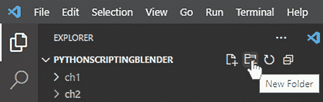

图 3.1：在 Visual Studio Code 中创建文件夹

1.  将新文件夹命名为`ch3`。

现在，我们可以为我们的扩展插件创建一个 Python 文件：

1.  确保在**VS Code**资源管理器中选择`ch3`文件夹，然后点击**新建文件**图标创建一个新文件。

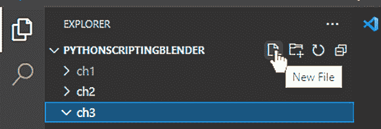

图 3.2：在 VS Code 中创建文件

1.  将新文件命名为`the_simplest_add_on.py`。

1.  双击打开文件。

我们准备好编写我们的扩展插件了；让我们看看需要什么。

## 扩展插件需求

要被视为扩展插件，我们的代码必须包含三样东西：

+   **脚本元信息**——即有关扩展插件的信息

+   一个用于启用扩展插件的`register()`函数

+   一个用于禁用扩展插件的`unregister()`函数

### 脚本元信息

首选项标签页中显示的信息来自`bl_info`变量，这是一个位于`.py`文件顶部的字典。该字典必须包含作者的姓名、扩展插件的简短描述以及为其编写的 Blender 版本。以下是我们的简单扩展插件的详细信息：

```py
bl_info = {
    "name": "The Simplest Add-on",
    "author": "John Doe",
    "version": (1, 0),
    "blender": (3, 00, 0),
    "description": "A very simple add-on",
    "warning": "This is just for Learning",
    "category": "Learning",
}
```

从空白开始！

在我们的代码开始和结束处留一个空行会更好——不以空行开始的`.py`文件可能无法注册为附加组件并导致`missing` `bl_info`错误。

### 注册

当附加组件启用时，会执行`register()`函数。目前并没有什么动作发生——只有一个`pass`语句，因为我们的函数没有做任何事情：

```py
def register():
    # this function is called when the add-on is enabled
    pass
```

当附加组件禁用时，会调用`unregister()`函数。与`register()`类似，它目前还没有做什么，但它是一个附加组件所必需的。

```py
def unregister():
    # this function is called when the add-on is disabled
    pass
```

## 安装

现在，是时候在 Blender 中安装我们的附加组件了：

1.  通过顶部菜单中的**编辑** | **首选项**打开首选项窗口。

1.  在左侧列中选择**附加组件**选项卡。

1.  在附加组件首选项的右上角点击**安装**按钮。

1.  在文件浏览器中导航到`PythonScriptingBlender\ch3`并选择`the_simplest_add_on.py`。

1.  在底部点击**安装附加组件**按钮。

我们的附加组件已经被复制并安装到 Blender 中；左上角的过滤器输入被填充，以便只显示新的附加组件。我们可以点击附加组件复选框来启用它。展开展开三角形可以显示更多来自`bl_info`的信息。

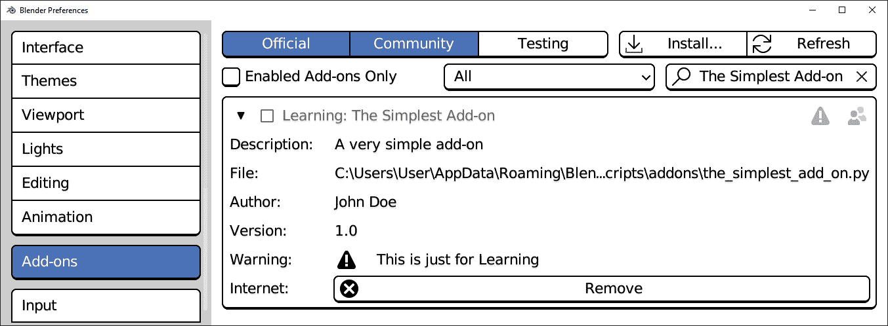

图 3.3：Blender 中列出的一个非常简单的附加组件

我们字典中的`warning`条目以三角形图标显示。这一行是为了警告用户可能不稳定的代码。

现在我们已经完成了附加组件的功能，是时候移除它了。

## 卸载

在附加组件首选项中点击大的**移除**按钮将显示一个确认对话框，询问是否可以删除附加组件。这个操作不能撤销，但在这个情况下，继续移除**最简单的附加组件**是可以的：

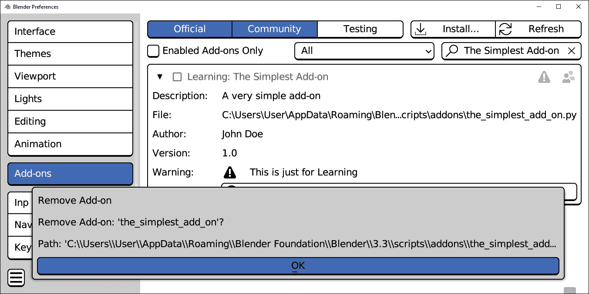

图 3.4：Blender 中附加组件的移除

**移除**对话框中显示的路径表明附加组件被安装在了 Blender 用户首选项中。这并不总是情况，正如我们将在下一段中看到如何将脚本路径指向我们的工作目录。

## 脚本路径

在开发过程中每次更改时重新安装附加组件将变得不切实际。程序员通常会为 Python 脚本设置一个**系统路径**并在那里工作附加组件。

系统路径可以在**Blender 首选项**中找到，通过在左侧列中选择**文件路径**选项卡。

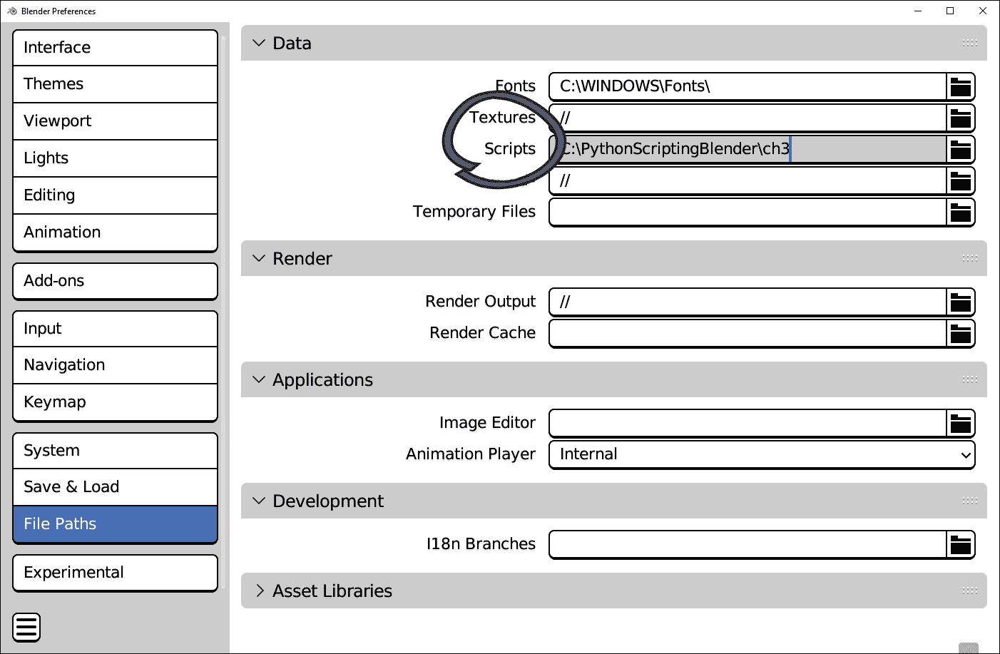

图 3.5：文件路径首选项窗口

我们可以将这个路径设置为我们将用于脚本处理的目录，例如托管本章代码的`PythonScriptingBlender/ch3`文件夹。

### 附加组件文件夹

现在 Blender 将查看我们的脚本文件夹，我们可以为我们的附加组件创建一个目录。我们可以从 VS Code 中这样做：

1.  在 VS Code 中选择`PythonScriptingBlender/ch3`。

1.  通过点击**新建** **文件夹**图标创建一个新的文件夹。

1.  将新文件夹命名为`addons`。

重要的是`addons`是这个文件夹的确切名称；否则，Blender 将不会寻找扩展。我们需要重新启动 Blender 以使**文件路径**设置生效，但一旦我们这样做，Blender 将能够加载我们正在工作的插件，无需安装。

现在，我们可以开始工作于一个新的插件，该插件为 Blender 添加功能。在下一节中，我们将编写一个插件，将场景中的对象分组到集合中。

# 创建我们的第一个插件 – 对象收集器

我们将编写一个插件，将场景中的对象分组到反映它们类型的集合中 – 一个集合用于所有网格，一个用于所有灯光，一个用于曲线，等等。

由于我们已经将`PythonScriptingBlender/ch3`设置为我们的插件目录，我们将在 VS Code 中继续操作：

1.  在 VS Code 中选择`PythonScriptingBlender/ch3/addons`。

1.  通过点击**新建****文件**图标创建一个新文件。

1.  将新文件命名为`object_collector.py`。

1.  通过双击打开文件。

这个 Python 脚本的名称以`object`开头，因为它影响对象数据。这是一个*软约定*，因为这个文件名方案是建议的，但不是强制的。

在这个阶段，插件与之前的非常相似 – 我们还没有添加任何代码。注意，除了明显的名称和描述差异之外，我们还没有添加`warning`条目 – 我们打算制作一个非实验性插件：

object_collector.py

```py
bl_info = {
    "name": "Collector",
    "author": "John Doe",
    "version": (1, 0),
    "blender": (3, 00, 0),
    "description": "Create collections for object types",
    "category": "Object",
}
def register():
    # this function is called when the add-on is enabled
    pass
def unregister():
    # this function is called when the add-on is disabled
    pass
```

请小心删除！

最好不要使用**删除**按钮删除从脚本路径加载的插件 – 我们可能会删除我们的工作（可能也是唯一的）副本！

Blender 将在首选项面板中显示此插件。为了添加功能，我们的插件必须包含一个**操作符**。操作符是执行代码的实体；我们现在将学习如何编写它们。

## 操作符

`Operator`类允许从图形界面调用函数。它们本质上是可以运行在 Blender 中的命令。

因此，我们通过子类化`bpy.types.Operator`类来使我们的代码对用户可用。

### 操作符要求

从`bpy.types.Operators`派生的类必须实现这些成员：

+   一个名为`bl_idname`的静态字符串，其中包含操作符在内部使用的唯一名称。

+   一个名为`bl_label`的静态字符串，其中包含操作符的显示名称。

+   一个`poll()`类方法，用于验证执行操作的条件是否满足，并返回`True`或`False`

+   一个`execute()`方法，当操作符执行时运行，返回一组可能的运行状态。

+   可选的，一个 docstring，Blender 将显示为附加信息。

我们将填写这些信息，以便我们的插件包含一个可以执行的操作符。

## 编写基本操作符

让我们开始创建我们的操作符类。遵循 Blender 指南，名称以`OBJECT_OT`开头。在可选的 docstring 之后，是`bl_idname`和`bl_label`，这两个属性分别是 Blender 用作操作符标识符和描述的属性：

```py
class OBJECT_OT_collector_types(bpy.types.Operator):
    """Create collections based on objects types"""
    bl_idname = "object.pckt_type_collector"
    bl_label = "Create Type Collections"
    @classmethod
    def poll(cls, context):
        return False
    def execute(self, context):
        # our code goes here
        return {'FINISHED'}
```

在这个阶段，`poll()`和`execute()`方法既不允许也不执行任何操作。我们将在接下来的几页中实现它们，使用我们在*第二章*中学习的内容，当处理 Blender 数据时。

### 实现 poll()方法

`poll()`验证运行操作符的条件是否满足。这限制了错误的可能性，并使操作符的预期用途更加明显。此方法使用`@classmethod`装饰器标记，允许我们在操作符运行之前验证条件。

由于我们的操作符收集场景中的对象，如果场景为空，我们不应能够使用它：

```py
    @classmethod
    def poll(cls, context):
        return len(context.scene.objects) > 0
```

### 实现 execute()方法

在操作符被调用后，Blender 运行其`execute()`方法。这个`execute()`函数包含我们的操作。将它们分解成单个步骤将有助于用 Python 编写代码。

#### 规划我们的执行过程

我们必须知道执行我们的操作符时预期会发生什么。例如，在默认场景上运行它，我们最终会得到三个新的集合——**网格**用于**立方体**对象，**相机**用于**相机**对象，**灯光**用于**灯光**对象。

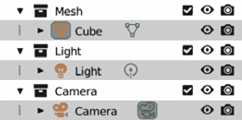

图 3.6：运行收集器后的预期结果

达到这个结果的方式不止一种，但要通过手工完成，我们需要创建**网格**、**灯光**和**相机**集合，并将每个对象置于每个集合之下。

现在，我们将这些操作转换为 Python 代码。

#### 编写执行代码

我们在*第二章*中看到了如何创建新的集合并将其链接到`scene.collection.children`：

```py
    def execute(self, context):
        mesh_cl = bpy.data.collections.new("Mesh")
        light_cl = bpy.data.collections.new("Light")
        cam_cl = bpy.data.collections.new("Camera")
        context.scene.collection.children.link(mesh_cl)
        context.scene.collection.children.link(light_cl)
        context.scene.collection.children.link(cam_cl)
```

然后，我们可以使用`for`循环来处理对象：

```py
        for ob in context.scene.objects:
            if ob.type == 'MESH':
                mesh_cl.objects.link(ob)
            elif ob.type == 'LIGHT':
                light_cl.objects.link(ob)
            elif ob.type == 'CAMERA':
                cam_cl.objects.link(ob)
```

最后，当我们退出函数时，我们总是返回一个操作状态：

```py
        return {'FINISHED'}
```

此操作符仍在开发中，需要进一步完善，但我们已经可以使用它。为此，我们必须使用`bpy.utils.register_class()`函数通知 Blender 其存在。

## 在我们的插件中加载操作符

当启用时，我们的插件向 Blender 添加一个操作符，并在禁用时将其移除。这是通过调用插件中的`register()`和`unregister()`函数内的`bpy.utils.register_class()`和`bpy.utils.unregister_class()`函数来完成的：

```py
def register():
    bpy.utils.register_class(OBJECT_OT_collector_types)
def unregister():
    bpy.utils.unregister_class(OBJECT_OT_collector_types)
```

启用**收集器**插件将**创建类型集合**添加到 Blender 中，并允许您从用户界面调用它。

# 运行我们的插件

即使我们还没有添加任何图形元素，我们的附加组件也准备好首次启动。我们可以使用两个技巧来运行尚未列出的附加组件，这在开发中相当常见。

## 刷新附加组件列表

由于我们已添加一个新的脚本文件夹并刚刚更改了其内容，我们需要重新启动 Blender 或刷新附加组件信息。为此，我们可以在 **附加组件** 预设窗口的右上角点击 **刷新** 按钮。

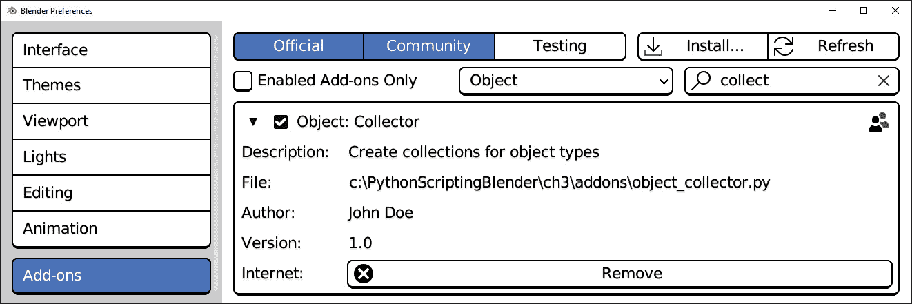

图 3.7：从项目文件夹加载的 Collector 附加组件

如果我们在过滤器栏中开始输入我们附加组件的名称，列表中的条目将缩小，直到 **收集器** 变得容易找到并启用。现在，是时候通过 **Blender** **源栏** 执行我们的操作符了。

## 从搜索工具栏运行

不属于任何图形元素的操作符是用于内部使用的 – 也就是说，可以被其他操作符调用，但不能被用户调用。

要使每个操作符可搜索，请确保在 **首选项** | **界面** 选项卡中启用了 **开发者额外**，就像我们在第二章中做的那样。如果此选项处于活动状态，以下是我们可以调用我们的操作符的方法：

1.  按下 *F3* 按钮。

1.  开始键入 `create type`，操作符将在搜索框中显示。

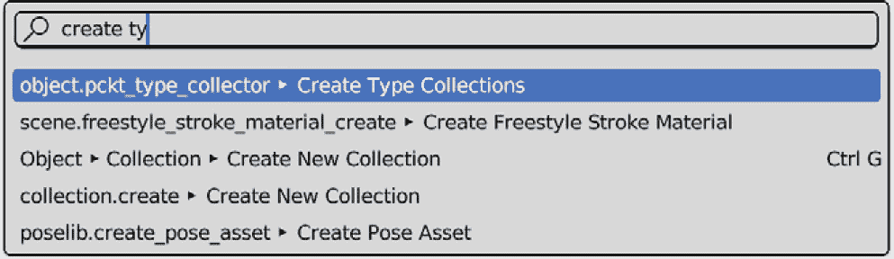

图 3.8：创建类型集合操作符，显示在搜索栏中

1.  点击操作符以执行它。

我们可以在大纲视图中看到我们的操作符已成功执行。

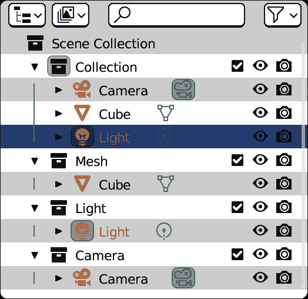

图 3.9：每个对象都按其类型集合分组

我们的附加组件处于早期阶段；它有一些错误和限制，我们将修复。例如，**网格**、**灯光**和**相机**集合在没有检查它们是否已经存在的情况下创建，这将创建重复项。此外，我们只处理这三个类别，完全跳过了**曲线**、**骨架**和所有其他对象类型。

尽管如此，如果我们为我们文件夹使用版本控制，如第一章中所示，我们可以提交我们的新文件。我们将在下一节中改进我们的附加组件。

# 优化我们的代码

在开发中，修复错误或从稍后阶段完成的行原型开始是常见做法。在本节中，我们将完成我们的附加组件，并在 Blender 中重新加载它，并处理脚本路径的版本控制。

## 自动保存我们的编辑

**自动保存** 选项将使 VS Code 自动将每个文件更改保存到磁盘。要激活此选项，请按照以下步骤操作：

1.  在 **Visual Studio Code** 菜单栏中打开 **文件** 菜单。

1.  点击 **自动保存** 以启用此条目。

有些开发者更喜欢手动保存以更好地控制他们的文件。哪种解决方案更好取决于个人品味和工作流程。一般来说，如果使用版本控制，**自动保存**的优势超过了不希望更改的危险。

在某些情况下，我们希望关闭特定文件的版本控制。例如，有些文件是 Python 在执行代码时生成的；我们对此没有兴趣跟踪。在接下来的段落中，我们将看到如何忽略特定文件。

## 忽略字节码文件（.pyc）

如果我们从开发文件夹中执行代码，`.pyc`文件，以及我们的`.py`文件。

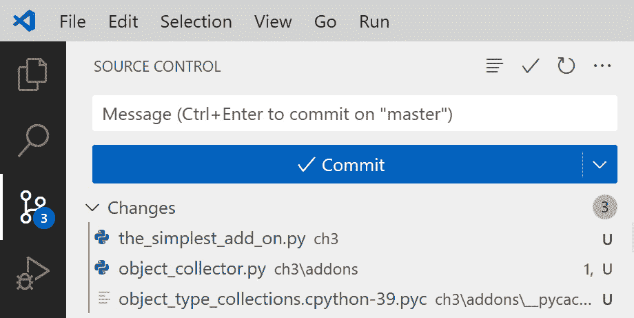

图 3.10：可以看到一个临时的.pyc 文件与我们的脚本并列

当一个`.py`文件被执行时，Python 将其转换为内部格式并保存为`.pyc`。我们不需要关心`.pyc`文件，通常我们也不需要跟踪它们。

### 创建.gitignore 文件

一个名为`.gitignore`的文本文件，包含我们不希望跟踪的文件和目录的名称，当放置在版本控制管理的文件夹中时将立即生效。我们可以手动创建它，或者遵循以下步骤在 VS Code 中操作：

1.  在**更改**下列出的`.pyc`文件中。

1.  从上下文菜单中选择**添加到 .gitignore**。

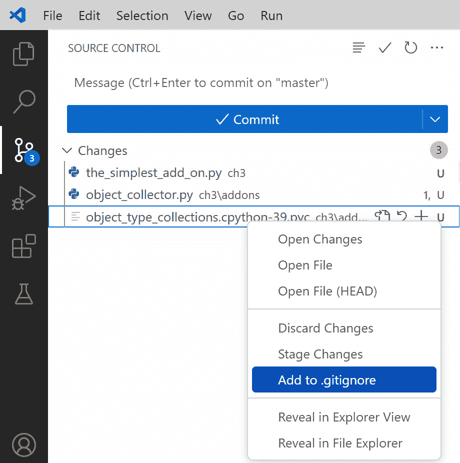

图 3.11：在 VS Code 中添加到 git 忽略列表

1.  一旦`.gitignore`文件创建，`.pyc`文件就不再显示在更改中。

1.  如果我们打开`.gitignore`文件，我们会看到它包含了`.pyc`文件的完整路径：

```py
ch3/addons/__pycache__/object_collector.cpython-39.pyc
```

1.  我们不需要忽略那个特定的文件；我们可以将所有名为`__pycache__`的目录列入黑名单。为此，我们采取以下代码：

    ```py
    ch3/addons/__pycache__/object_collector.cpython-39.pyc
    ```

然后将其更改为以下内容，然后保存：

```py
__pycache__
```

版本控制适用于`.gitignore`文件本身；我们必须将此文件与其他章节中做出的更改一起暂存和提交。

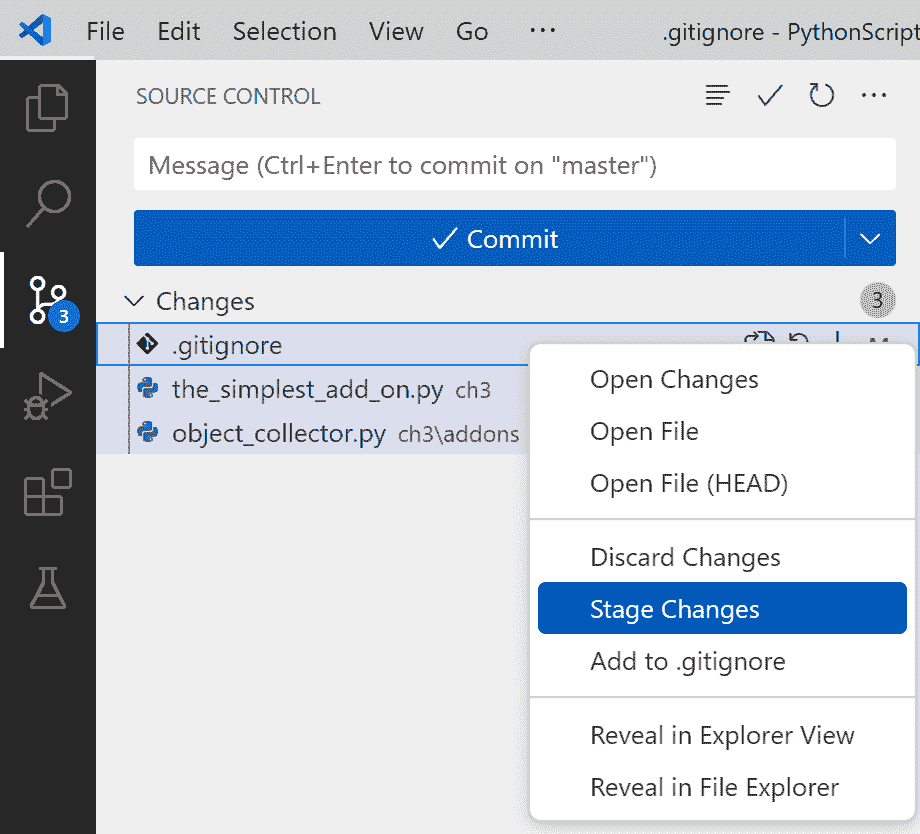

图 3.12：暂存本章当前更改

一旦我们提交了我们的更改，我们就可以回到我们的脚本工作，修复其流程，并扩展其功能。我们将看到简化脚本逻辑如何同时提高可读性、行为和功能。

## 修复操作符逻辑

我们操作符中最明显的流程是它试图重新创建现有的集合。连续运行两次会创建**Mesh.001**和**Light.001**集合，等等。

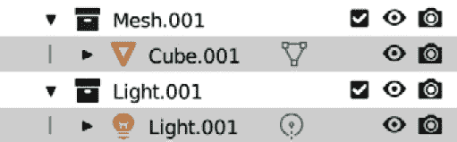

图 3.13：创建了不想要的集合

### 避免重复集合

我们应该只在它不存在的情况下创建网格集合。注意以下内容：

```py
mesh_cl = bpy.data.collections.new("Mesh")
```

而不是那样，我们应该创建一个新的，只有当查找它时才会引发`KeyError`错误：

```py
try:
    mesh_cl = bpy.data.collections.new['Mesh']
except KeyError:
    mesh_cl = bpy.data.collections.new("Mesh")
```

为了更通用，我们可以编写一个函数，该函数接受集合名称作为参数。

以下代码块中展示的函数以一个非常描述性的文档字符串开头，这有助于更好地了解函数应该做什么以及如何实现它：

```py
def get_collection(name):
    '''Returns the collection named after the given
    argument. If it doesn't exist, a new collection
    is created and linked to the scene'''
    try:
        return bpy.data.collections[name]
    except KeyError:
        cl = bpy.data.collections.new(name)
        bpy.context.scene.collection.children.link(cl)
        return cl
```

### 查询对象类型

我们可以使用前面的函数创建唯一的集合 - 例如，`get_collection("Mesh")` - 但我们不需要明确提及对象类型；`Object.type` 参数以字符串形式返回类型：

```py
>>> bpy.data.objects['Cube'].type
'MESH'
```

字符串也可以通过它们的 `.title()` 方法进行格式化：

```py
>>> bpy.data.objects['Cube'].type.title()
'Mesh'
```

这是重写后的操作符执行块：

```py
    @staticmethod
    def get_collection(name):
        '''Returns the collection named after the given
        argument. If it doesn't exist, a new collection
        is created and linked to the scene'''
        try:
            return bpy.data.collections[name]
        except KeyError:
            cl = bpy.data.collections.new(name)
            bpy.context.scene.collection.children.link(cl)
            return cl
    def execute(self, context):
        for ob in context.scene.objects:
            cl = self.get_collection(ob.type.title())
            cl.objects.link(ob)
    return {'FINISHED'}
```

这个版本更优雅，支持任何类型的对象。尽管如此，我们仍将很快修复一个错误。在我们到达那里之前，我们需要重新加载脚本以使用这个新版本。

## 重新加载脚本

Blender 和 Python 将使用的脚本存储在内存中；因此，对代码所做的更改不会立即生效。有一个 Blender 命令可以重新加载脚本，我们可以在搜索栏中查找：

1.  按下 *F3* 键进入搜索栏。

1.  在搜索字段中开始键入 `reload scr`。

1.  点击操作符，**script.reload ·** **重新加载脚本**。

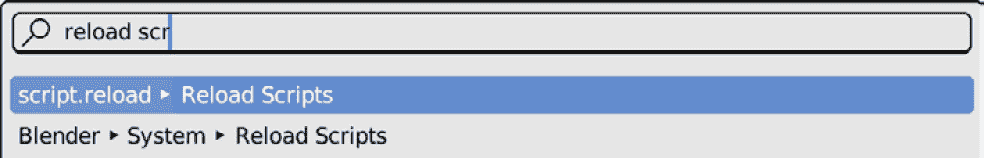

图 3.14：调用重新加载脚本操作符

这个命令重新加载所有脚本，并使我们免于每次都需要重新启动 Blender。我们的插件现在使用磁盘上的最新 `.py` 文件，并且我们可以验证我们的集合只创建一次。

## 避免重新赋值错误

在执行 `RuntimeError` 错误时。如果我们第二次运行我们的操作符，我们会看到这个错误出现：

```py
    cl.objects.link(ob)
RuntimeError: Object 'Cube' already in collection 'Mesh'
```

我们需要将对象链接放在 `try`/`catch` 语句中，以避免以下情况：

```py
            cl.objects.link(ob)
```

这应该替换为以下内容：

```py
            try:
                cl.objects.link(ob)
            except RuntimeError:
                continue
```

这样，对于已经收集的对象不会采取任何操作，操作符将继续处理场景中的其余部分。

不要太过努力！

我们应该始终确保 `try` 块内的操作尽可能少 - 这些语句不应轻易使用。没有明显的规则，但如果我们在一个块中尝试超过两行，我们可能需要重新思考我们的代码，使其更不容易出错。

## 我们最终的操作符

我们可以通过从视图中调用 **添加** 菜单或使用 *Shift* + *A* 快捷键来向场景添加更多对象。我们可以添加不同类型的对象，例如 **文本**、**说话者**、**空** | **平面坐标轴**，甚至一些新的网格，如 **圆柱体** 和 **球体**，然后再次运行 **创建类型集合**。我们可以看到每个对象都被分配给了以其类型命名的集合。

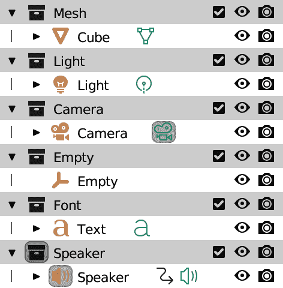

图 3.15：每个对象类型都有自己的集合

好处在于我们不必手动为所有对象类型进行计数——一旦程序化工作流程就位，它将适用于所有类型的对象，甚至包括 Blender 未来版本中添加的对象。

我们的操作符已经完整；缺少的是一种调用它的简单方法。我们将通过学习如何在界面菜单中显示操作符来结束本章。

## 扩展菜单

菜单具有许多优点——它们在应用程序中无处不在，它们涵盖了 3D 工作流程的特定方面，并且可以轻松添加新项目。我们将在我们的附加组件中处理新菜单项的添加和删除——我们的操作符只有在我们的附加组件启用时才会显示。

### 绘制函数

Blender 菜单以函数的形式接受新项目。这些函数描述了菜单应该如何绘制新条目；它们必须接受由菜单传递的`self`和`context`参数，并具有以下形式：

```py
def draw_menu_item(self, context):
    row = self.layout.row()
```

我们将在*第五章*中更好地掌握 UI 元素。现在，我们只会将我们的操作符添加到菜单行。我们的函数将如下所示：

```py
def draw_collector_item(self, context):
    row = self.layout.row()
    row.operator(OBJECT_OT_collector_types.bl_idname)
```

我们现在可以将这个函数添加到 Blender 菜单中，并让它显示我们的操作符。

### 添加菜单项

Blender 菜单存储在`bpy.types`命名空间中。按照惯例，菜单类型的名称遵循以下方案：

```py
bpy.types.[AREA]_MT_[NAME]
```

例如，3D 视图中的菜单以`bpy.types.VIEW3D_MT_`开头。在 Python 控制台中输入并按*Tab*键将显示视口中可用的菜单作为建议：

```py
>>> bpy.types.VIEW3D_MT_
                        add(
                        angle_control(
                        armature_add(
                        …
```

由于`bpy.types.VIEW3D_MT_object`菜单：

```py
>>> bpy.types.VIEW3D_MT_object
                              (
                              _animation(
                              _apply(
                              _asset(
                              …
                              _context_menu(
```

`bpy.types.VIEW3D_MT_object`是`VIEW3D_MT_pose_context_menu`。我们在我们的示例中使用这个，但我们可以非常容易地使用任何其他菜单。

`append()`和`remove()`方法将绘制函数添加到或从菜单中删除。这可以在我们的附加组件的`register()`/`unregister()`函数中完成，因此它变成了以下形式：

```py
def register():
    bpy.utils.register_class(OBJECT_OT_collector_types)
    menu = bpy.types.VIEW3D_MT_object_context_menu
    menu.append(draw_collector_item)
def unregister():
    bpy.utils.unregister_class(OBJECT_OT_collector_types)
    menu = bpy.types.VIEW3D_MT_object_context_menu
    menu.remove(draw_collector_item)
```

重新加载脚本，并在**对象模式**下右键单击菜单显示我们的选项在底部。现在，我们有了一种在 UI 中调用我们的操作符的方法，我们可以认为我们的附加组件已经完成，并提交我们的更改。

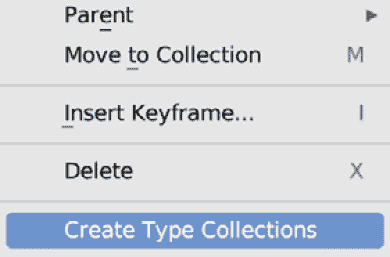

图 3.16：添加到上下文菜单中的我们的操作符

# 摘要

在本章中，我们编写了一个完整的附加组件，它扩展了 Blender 的功能，并无缝集成到应用程序中。我们还学习了如何在代码被使用的同时对其进行工作，并通过连续的细化步骤改进我们的工具。

在*第四章**中，我们将学习如何通过 Python 影响 Blender 对象的定位和旋转，并将交互式属性添加到我们的操作符中。

# 问题

1.  Python 脚本和 Blender 附加组件之间的区别是什么？

1.  使用附加组件相比稀疏代码有哪些优势？

1.  操作符有什么作用？

1.  我们如何定义操作符可以执行的条件？

1.  我们能否在插件被使用时进行修改？我们如何更新它？

1.  我们如何在 Git 版本控制中忽略字节码（`.pyc`）文件？

1.  我们如何避免创建重复项？
