# 第十一章：对象修饰符

创建 3D 内容的主要部分包括通过添加和删除模型的顶点、边和面，或移动现有的面来编辑几何形状。

**对象修饰符**可以通过非破坏性编辑执行这些操作，这些编辑会影响对象的外观，但不会影响其内部数据。它们可用于生成建模，没有它们，动画将无法进行，因为变形对象需要改变每一帧的几何数据。

对象修饰符类似于在*第八章*中处理的 F-修饰符，但它们在目的和属性上具有更大的多样性。

在本章中，我们将涵盖以下内容：

+   理解和使用对象修饰符

+   脚本变形修饰符

+   生成骨架和网格

# 技术要求

在本章中，我们将使用 Blender 和 Visual Studio Code。本章创建的示例可以在以下 URL 找到：[`github.com/PacktPublishing/Python-Scripting-in-Blender/tree/main/ch11`](https://github.com/PacktPublishing/Python-Scripting-in-Blender/tree/main/ch11)。

# 理解对象修饰符

对象修饰符改变对象的显示状态，而不改变其几何数据。我们在*第八章*中遇到了类似的情况，当时我们在不改变关键帧的情况下对动画 F-曲线应用了效果。

与 F-修饰符一样，它们可以堆叠在一起，并在 Python 中以集合属性的形式访问。

修饰符可以手动添加，但它们的创建和设置也可以通过脚本进行。在我们深入研究 API 之前，让我们看看如何在**修饰符**属性中创建它们。

## 添加修饰符

对象修饰符是在**属性**的**修饰符**选项卡中使用**添加修饰符**下拉按钮创建的。该选项卡带有扳手的图标。

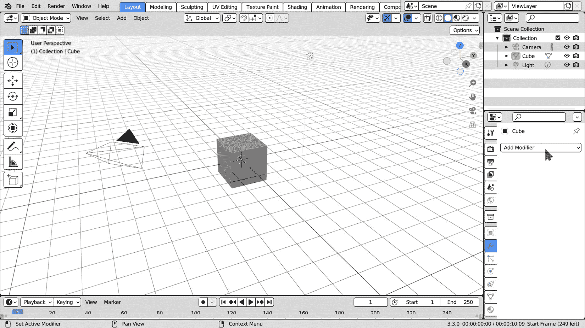

图 11.1：在 Blender 中添加修饰符

点击**添加修饰符**显示可用选项。它们根据对象类型而变化：曲线没有像网格那么多的修饰符，而像空或相机这样的非几何类型根本不能有任何修饰符。

尽管随着时间的推移它们的数量有所增加，但所有修饰符都被分为四个类别：

+   **修改** – 影响不会直接显示的数据，例如顶点组

+   **生成** – 向或从对象添加或删除几何形状

+   **变形** – 不添加或删除顶点、边或面，改变对象的形状

+   **物理** – 将物理模拟的结果应用于对象

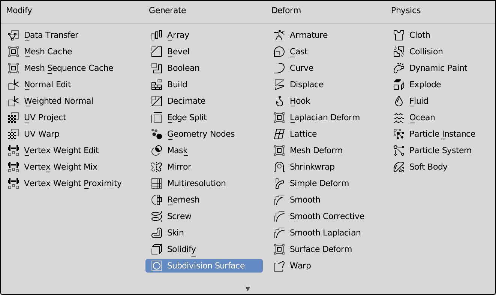

图 11.2：点击添加修饰符显示可用类型

界面显示每个类别一列，每个类别有四种修饰符类型。即使是同一类别的修饰符类型也彼此差异很大，并呈现不同的属性集。

为了更好地理解修改器的工作原理，我们可以在界面中创建一个修改器并查看它如何影响对象的几何形状。例如，向对象添加一个 **细分曲面** 修改器可以通过创建额外的多边形使其更加平滑。

## 细分对象

网格对象是多边形的；也就是说，它们由平面面和锐利的边缘组成。这对于像立方体这样的简单实体很好，但不适用于像球体或大多数现实生活中的物体这样的光滑表面。

为了产生平滑的错觉，我们细分网格的多边形，直到它们近似于连续的表面。

然而，过于密集的几何体是有问题的；它们需要更多的磁盘空间，并且不易于建模或编辑。因此，而不是存储额外的网格数据，我们使用 **细分** **曲面** 修改器生成平滑的几何形状。

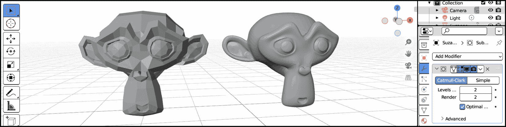

图 11.3：左侧的块状模型使用细分曲面进行了平滑

此修改器将每个边缘分成两个，从这些分割中生成新的多边形。默认情况下，一个名为 **Catmull-Clark** 的算法在保持整体形状的同时平滑结果。

我们可以通过以下步骤向模型添加细分：

1.  打开 Blender 或通过 **文件 | 新建 |** **通用** 返回默认场景。

1.  选择默认的 **Cube** 形状并将其激活。

1.  在 **修改器** 选项卡中，点击 **添加修改器** 并在 **生成** 列的底部选择 **细分曲面**。

1.  在 **修改器** 属性中出现了新的条目。我们可以看到 **细分** 修改器的参数。

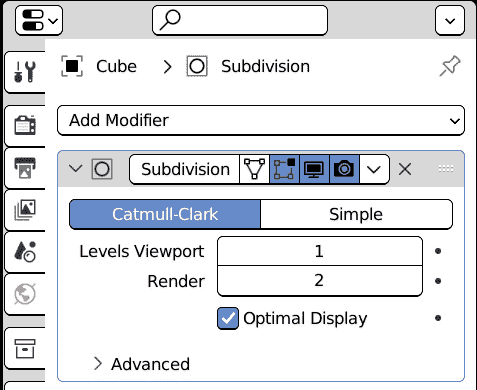

图 11.4：细分曲面属性

1.  将 `3` 中的数字增加会使我们的 **Cube** 看起来更像一个球体。

1.  点击 **简单** 按钮禁用平滑：对象仍然细分，但其形状不会改变。

即使启用 **简单** 不会改变其形状，我们的对象仍然是细分的。这对于在 **细分** 之后添加的其他修改器可能很有用，因为它们将有更多的几何形状可以变形。

现在我们已经对 **Cube** 进行了细分，我们将能够使用第二个修改器：**铸模** 来改变其形状。

## 使用铸模改变对象的形状

在我们的 **细分** 修改器仍然在位的情况下，我们可以添加一个新的修改器来改变对象的形状：

1.  在 **修改器** 选项卡中，点击 **添加修改器** 并在 **变形** 列的顶部选择 **铸模**。在 **细分** 下方出现另一个修改器。

1.  修改 `Cylinder` 和 `1.0`。现在我们的几何体是一个圆柱体。

这两个修改器是重叠显示的。从顶部开始，每个修改器都作为下一个修改器的输入。因此，修改器列也被称为 **修改器堆栈**。

使用修改器，我们已经使我们的原始对象看起来像圆柱体，但这种变化可以被撤销，甚至可以动画化。移动`0.0`和`1.0`，我们的对象从其原始形状过渡到**Cast**中设置的形状。

我们可以使用 Blender 的 API 在 Python 脚本中重复前面的步骤。

# 在 Python 中添加修改器

Blender 对象的 Python 类包含一个`modifiers`属性。像所有集合一样，`modifiers`提供了`new`方法，该方法创建并返回新项。通过使用`new`，我们可以使用 Python 自动化修改器的设置。

## 查找集合类型项

`Object.modifiers.new`接受两个参数：`name`和`type`。第一个将在界面中的修改器属性中显示，而`type`指定我们想要创建哪种类型的修改器。`type`参数必须属于可用类型的列表，否则将导致错误。可用类型在 API 文档中列出：

[`docs.blender.org/api/3.3/bpy_types_enum_items/object_modifier_type_items.xhtml`](https://docs.blender.org/api/3.3/bpy_types_enum_items/object_modifier_type_items.xhtml)

但我们也可以从 Blender 本身获取它们。这些命令将在 Blender 的 Python 控制台中列出修改器关键字：

```py
>>> import bpy
>>> mod_rna = bpy.types.ObjectModifiers.bl_rna
>>> mod_params = mod_rna.functions["new"].parameters
>>> mod_params["type"].enum_items.keys()
'DATA_TRANSFER', 'MESH_CACHE', 'MESH_SEQUENCE_CACHE', 'NORMAL_EDIT', 'WEIGHTED_NORMAL', 'UV_PROJECT', 'UV_WARP',
...
```

另一种获取修改器关键字的方法：

1.  使用界面中的**添加修改器**按钮。

1.  在**Info**日志中查找`modifier_add`操作符的参数。它属于**脚本**工作区，正如我们从[*第一章*所知。


图 11.5：添加细分表面后的 Blender 信息日志

例如，`'SUBSURF'`的关键字。

## 使用`modifiers.new`

由于`modifiers.new`返回创建的修改器，我们可以存储返回值并重复之前*理解对象* *修改器*部分的全部步骤。

我们将看到如何添加`bpy`并添加细分以增加可用的几何形状：

```py
import bpy
ob = bpy.context.object
subdiv = ob.modifiers.new('Subdivision', 'SUBSURF')
```

`subdiv`变量包含新`subdiv`的属性。

如果我们在界面上看到一个属性的 Python 对应物，我们可以求助于**Python 工具提示**和**开发者额外**，这两个选项在**编辑** > **首选项**从顶部菜单。我们在*第二章*的*有用的 Python 功能*部分了解过它们。

如果启用了工具提示，将鼠标悬停在`levels`上。

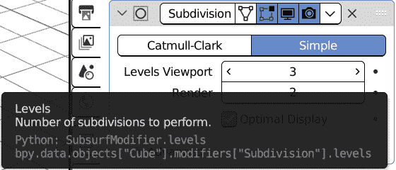

图 11.6：在工具提示中显示的细分属性路径

为了在不改变其形状的情况下增加对象的顶点数，我们将`subdiv.levels`设置为`3`并将`subdivision_type`设置为`'SIMPLE'`：

```py
subdiv.levels = 3
subdiv.subdivision_type = 'SIMPLE'
```

现在我们有足够的多边形来变形我们的对象。我们添加一个`'CAST'`修改器，将其重塑为圆柱体：

```py
cast = ob.modifiers.new('Cast', 'CAST')
cast.cast_type = 'CYLINDER'
cast.factor = 1.0
```

**细分曲面**和**投射**是自给自足的，因为它们不需要除了它们影响的对象之外的其他对象。其他修改器依赖于辅助对象的数据。

在下一节中，我们将设置一个依赖于变形器对象的修改器。

# 变形对象

许多变形器将一个对象的变化转换到另一个对象。这允许我们通过操作一个更简单的对象来变形一个复杂对象。以下是一些显著的例子：

+   **曲线** – 沿着曲线对象变形网格

+   **晶格** – 将常规网格的变化传递到网格

+   **骨架** – 将一个可动结构的姿态传递到网格

+   **表面变形** – 将一个网格的变形传递到另一个网格

可以使用`modifier.object`属性设置修改器使用的对象。

**骨架**修改器使用**骨骼**结构重现肢体运动，因此它需要一个可以摆姿势的特殊类型的对象。

另一方面，**晶格**修改器依赖于网格的内部坐标，这些坐标是特定于**晶格**对象类型的。

作为例子，我们将看到如何将晶格变形添加到对象中。

## 使用晶格修改器

要使用晶格变形，我们需要一个要变形的几何体和一个晶格类型的对象。我们可以使用 Blender 的吉祥物，猴子**Suzanne**：

1.  打开 Blender 或通过**文件** | **新建** | **通用**返回默认场景。

1.  通过按**取消**或**X** | **删除**删除默认的**立方体**形状。

1.  使用**添加** | **网格** | **猴子**将猴子头添加到场景中。

1.  使用**添加** | **晶格**将晶格添加到场景中。

已将晶格添加到场景中。默认情况下，它比 Suzanne 小，因此我们需要将其放大：

1.  在选择晶格后，按`S`键进行缩放。拖动鼠标或按`2`键将其大小加倍。

1.  选择 Suzanne 以添加修改器。在**修改器**选项卡中，使用**添加修改器** | **晶格**。

1.  在**晶格**修改器中，单击**对象**属性并从选项中选择**晶格**对象。

编辑晶格对象会改变 Suzanne 的形状：

1.  在**3D 视图**中选择**晶格**。

1.  按下*Tab*键切换到**编辑模式**。

1.  选择一个或多个晶格顶点。

1.  按下*G*键并拖动鼠标以移动选择：对 Suzanne 应用晶格变形。

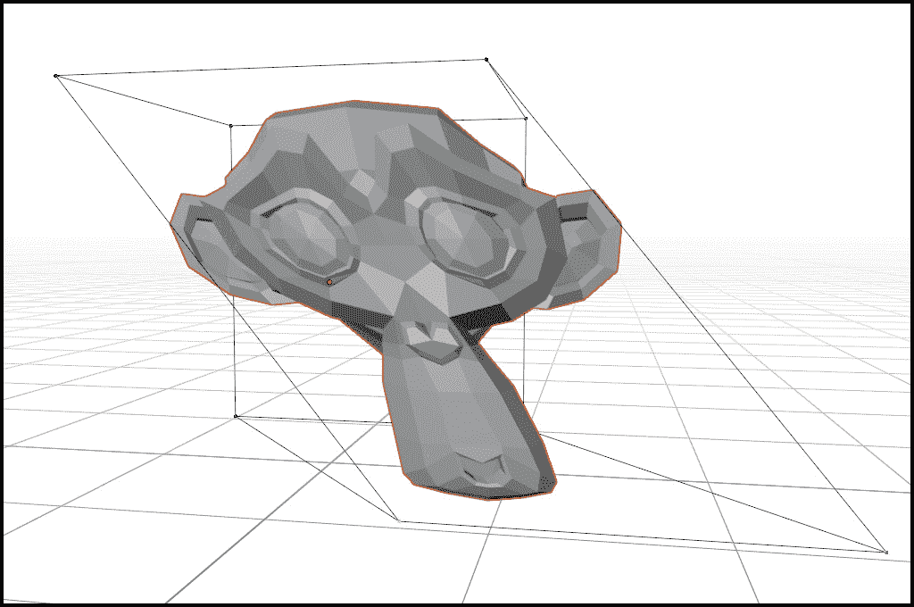

图 11.7：由晶格笼变形的网格

使用 Python 自动化这些步骤可以使过程更加简单。在下一节中，我们将编写一个一键设置晶格变形的操作符。

# 编写 Latte Express 附加组件

**Latte Express**附加组件在活动对象周围创建一个新的晶格并设置修改器。

它对于创建基本的卡通变形或风格化对象的骨架很有用。附加组件由一个操作符类和一个菜单项组成。

## 设置环境

我们为我们的附加组件创建一个 Python 脚本：

1.  在`PythonScriptingBlender/ch11/addons`文件夹中创建一个。我们可以使用文件管理器或我们的程序员编辑器的文件选项卡，例如，**VS Code**。

1.  在该文件夹中创建一个新文件，并将其命名为`lattice_express.py`。我们可以使用文件管理器或 IDE 中的**新建文件**按钮来完成此操作。

1.  在您选择的编辑器中打开该文件。

1.  在 Blender 的**文件路径**首选项中将`PythonScriptingBlender/ch11`设置为，并重新启动 Blender。

现在我们可以编写插件并将其加载到 Blender 中。

## 编写 Latte Express 信息

如同其他插件一样，Latte Express 从一个空行开始，后面跟着`bl_info`字典：

```py
bl_info = {
    "name": "Latte Express",
    "author": "Packt Man",
    "version": (1, 0),
    "blender": (3, 00, 0),
    "description": "Create a Lattice on the active object",
    "category": "Learning",
}
```

然后我们继续编写插件类和界面，在这种情况下，一个简单的操作符。

## 编写 Latte Express 操作符

我们需要导入`bpy`模块，这样我们才能创建一个新的操作符：

```py
import bpy
class LatteExpress(bpy.types.Operator):
    """Set up Lattice Deformation"""
    bl_idname = "object.latte_expresso"
    bl_label = "Create Lattice on active object"
```

操作符需要一个活动对象，因此`poll`中的条件如下：

```py
    @classmethod
    def poll(cls, context):
        return context.active_object
```

创建晶格对象首先需要晶格数据，因此在`execute`函数内部，我们调用`bpy.data.lattices.new`并使用其返回值在`bpy.data.objects.new`中。即使这不是必需的，我们也按照活动对象命名新的对象和数据。最后，我们将晶格通过链接到当前集合添加到场景中：

```py
    def execute(self, context):
        ob = context.object
        latt_data = bpy.data.lattices.new(f"LAT-{ob.name}")
        latt_obj = bpy.data.objects.new(
                                     name=latt_data.name,
                                     object_data=latt_data
                                    )
        context.collection.objects.link(latt_obj)
```

让我们调整晶格的大小，使其适合我们的对象。我们可以从`dimensions`属性中获取其大小：

```py
        latt_obj.scale = ob.dimensions
```

我们将晶格位置与活动几何中心匹配。我们可以从世界矩阵中获取对象位置，正如我们在*第四章*中学到的：

```py
        ob_translation = ob.matrix_world.to_translation()
```

仅此还不够，对于其变换枢轴远离几何中心的物体，这不会起作用，因此我们必须找到我们对象的实际中点。

## 寻找模型中心

要创建一个与对象位置和大小匹配的晶格，我们必须找到其顶点的中点，但不必查看所有组件。我们可以找到对象的**边界框**中心。

边界框是一个包含所有对象几何形状的想象中的平行六面体。我们可以通过在**对象**属性中激活**边界**来显示它。

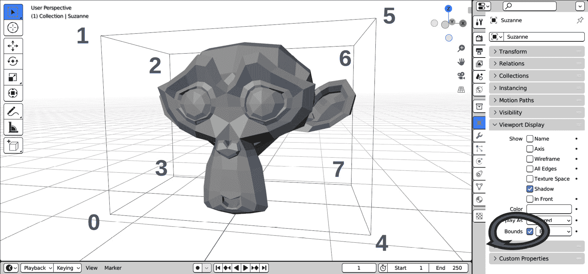

图 11.8：带有坐标索引的对象边界框

在 Python 中，边界框是通过`bound_box`属性找到的。它是一个包含八个坐标的列表，我们可以通过插值两个对角顶点来找到中心。

箱子的中心位于其对角线的中间，因此我们想要在左下后角和右上前角之间进行调解。我们知道这些点的索引来自**图 11**。8*。它们分别是`0`和`6`。

找到这两个角落的一个更好的方法是使用`min`和`max`函数。

两个极端之一具有最低的`x`、`y`、`z`值，另一个具有最高的。换句话说，较低角落的分量具有最低的总和，而较高角落的分量具有最高的总和。

在 Python 中，`min`和`max`返回列表中的最小和最大值，但我们可以提供不同的标准，在这种情况下，使用`sum`，通过`key`参数：

```py
        btm_left = min((c for c in ob.bound_box), key=sum)
        top_right = max((c for c in ob.bound_box), key=sum)
```

要找到两个向量之间的中点，我们可以使用`Vector`类中的线性插值方法（`lerp`）。在`import`部分，我们需要添加以下行：

```py
from mathutils import Vector
```

然后，在`execute`中，我们插值两个坐标。`lerp`的第一个参数可以是任何三元组，所以我们只将两个角中的一个转换为`Vector`类型。因为我们正在寻找位于两个角之间中点的点，所以我们提供一个因子`0.5`作为第二个参数：

```py
        btm_left = Vector(btm_left)
        ob_center = btm_left.lerp(top_right, 0.5)
```

我们将`ob_center`添加到`ob_translation`中，以便将晶格中心对齐到几何形状：

```py
        Ob_translation += ob_center
        latt_obj.location = ob_translation
```

我们的中心和缩放后的晶格现在可以用来变形物体。我们可以在新的修改器中使用它，并返回`{'FINISHED'}`以退出操作：

```py
        mod = ob.modifiers.new("Lattice", 'LATTICE')
        mod.object = latt_obj
        return {'FINISHED'}
```

现在操作器已完成，我们可以添加一个菜单项来使用它。

## 添加创建晶格菜单项

我们定义一个函数将`LatteExpress`添加到菜单中。使用`MOD_LATTICE`：

```py
def menu_func(self, context):
    self.layout.operator(LatteExpress.bl_idname,
                         icon="MOD_LATTICE")
```

当然，我们需要注册新的 Blender 类和函数：

```py
def register():
    bpy.utils.register_class(LatteExpress)
    ob_menu = bpy.types.VIEW3D_MT_object_context_menu
    ob_menu.append(menu_func)
def unregister():
    ob_menu = bpy.types.VIEW3D_MT_object_context_menu
    ob_menu.remove(menu_func)
    bpy.utils.unregister_class(LatteExpress)
```

我们可以刷新插件首选项并启用**Latte Express**。

## 使用 Latte Express 插件

一旦我们设置了`ch11`文件夹，我们就可以在**Add-ons**首选项中激活**Latte Express**。

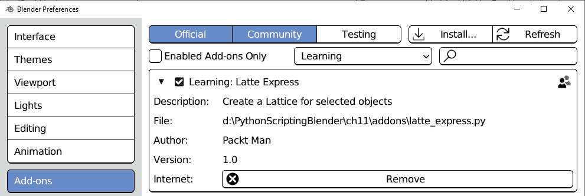

图 11.9：启用 Latte Express 插件

我们的插件使得设置晶格变形的任务变得更加容易。让我们看看上一节，*变形对象*的工作流程是如何改进的：

1.  通过**File** | **New** | **General**打开 Blender 或返回默认场景。

1.  通过按**Canc**或**X** | **Delete**删除默认的**Cube**形状。

1.  使用**Add** | **Mesh** | **Monkey**将猴子头添加到场景中。

1.  使用鼠标右键在**3D Viewport**中打开对象菜单。

1.  选择**在活动对象上创建晶格**。

晶格在活动物体上创建、居中并缩放，同时设置了一个修改器。除了自动化任务外，使用此插件还能提供更好的精度，因为晶格是根据物体的精确尺寸进行缩放的。

在下一节中，我们将添加更多对几何形状和晶格细分的控制。

# 改进 Latte Express 选项

一些物体可能没有足够的面数，使得晶格变形无法正常工作。我们在本章开头，在*理解对象修改器*部分遇到了类似的情况，当时我们在**Cube**形状上应用了一个**Subdivision Surface**修改器，然后才能使用**Cast**修改器将其重塑为圆柱体。

晶格物体的分辨率也可以增加，以获得对变形的更多控制。

由于这些原因，我们将向我们的操作员添加对象细分和晶格分辨率选项。

## 添加对象细分

我们向`BoolProperty`添加一个细分选项。由于我们还将设置`SUBSURF`修改器，我们添加`IntProperty`用于细分级别。

我们添加`bl_options = {'REGISTER', 'UNDO'}`以显示操作面板。**LatteExpress**的声明如下：

```py
class LatteExpress(bpy.types.Operator):
    """Set up Lattice Deformation"""
    bl_idname = "object.latte_expresso"
    bl_label = "Create Lattice on active object"
    bl_options = {'REGISTER', 'UNDO'}
    add_subsurf: bpy.props.BoolProperty(default=True)
    subd_levels: bpy.props.IntProperty(default=2)
```

`execute`方法考虑了这些选项，如果`add_subsurf`为`True`，则创建一个`SUBSURF`修改器：

```py
    def execute(self, context):
        ob = context.object
        if self.add_subsurf:
            subdiv = ob.modifiers.new("Subdivision",
                                      "SUBSURF")
            subdiv.levels = self.subd_levels
            subdiv.render_levels = self.subd_levels
            subdiv.subdivision_type = "SIMPLE"
```

**细分曲面**有一个额外的属性用于渲染细分级别。我们将这两个值都设置为相同的值，以确保视口和渲染图像看起来相同。

## 改变晶格分辨率

晶格没有多边形或细分修改器，但它们有三个轴的分辨率参数，可以添加更多的细分。

`points_u`、`points_v`和`points_w`属性设置了其在*x*、*y*和*z*轴上的细分数量。

我们添加一个属性以影响网格分辨率。我们使用`IntVectorProperty`为这三个属性，并将其子类型设置为`'XYZ'`，以便它们像坐标一样显示。分辨率坐标的最小值是`1`，而我们将默认值设置为`3`：

```py
    grid_levels: bpy.props.IntVectorProperty(
                                         default=(3, 3, 3),
                                         min=1,
                                         subtype='XYZ'
                                        )
```

由于晶格的实现方式，在创建晶格对象之前更改分辨率会改变晶格的起始尺寸。为了避免这种情况，我们只在`latt_obj`创建后设置`points_u`、`points_v`和`points_w`。

因此，晶格部分如下：

```py
        latt_data = bpy.data.lattices.new(f"LAT-{ob.name}")
        latt_obj = bpy.data.objects.new(
                                      name=latt_data.name,
                                      object_data=latt_data
                                     )
        latt_data.points_u = self.grid_levels[0]
        latt_data.points_v = self.grid_levels[1]
        latt_data.points_w = self.grid_levels[2]
```

现在我们正在添加细分，晶格网格将呈现内部顶点，即最终位于晶格内部的控制点。我们不希望这样，因为我们使用晶格作为外部笼子。

因此，我们将晶格数据的`use_outside`设置为`True`：

```py
        latt_data.use_outside = False
```

之后，`execute`方法继续执行，将`latt_obj`链接到`context.collection.objects`，设置其位置和缩放，并在返回`{'FINISHED'}`之前创建对象修改器。

如果我们保存脚本并使用*F3* -> **重新加载脚本**并启动**在活动对象上创建晶格**，我们将看到晶格分辨率的选项。

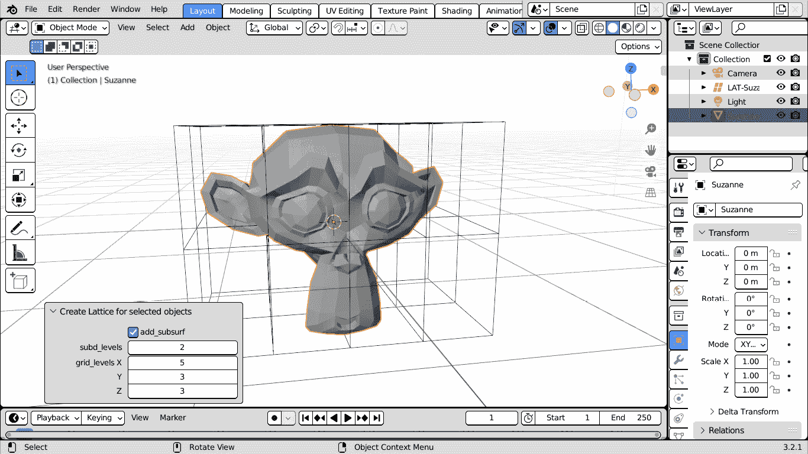

图 11.10：使用 Latte Express 创建的 5x3x3 晶格

晶格网格添加快速变形，而无需在变形对象中添加额外的数据。例如**骨骼**这样的变形器，用于关节人物的修改器，需要分配**顶点组**才能正常工作。

# 使用轴网变形器

轴网是类似于晶格的变形对象，但它们不是使用网格，而是依赖于称为**骨骼**的子对象的平移、旋转和缩放，这与人类的骨骼相似。

默认情况下，骨骼以八面体棒的形式表示。轴网可以切换到**姿态模式**，这是一种特殊的 Blender 模式，其中可以使用在*第七章*中学到的技术单独动画化骨骼。

设置 **骨架** 修改器可能需要一些额外的步骤，但与用于网格的步骤类似。

## 将骨架对象添加到场景中

为了熟悉骨骼，我们将为 **Suzanne** 的几何形状创建一个简单的骨架：

1.  打开 Blender 或通过 **文件** | **新建** | **通用** 返回默认场景。

1.  通过按 **取消** 或 **X** | **删除** 删除默认的 **立方体** 形状。

1.  使用 **添加** | **网格** | **猴子** 将猴子头添加到场景中。

1.  使用 **添加** | **骨架** | **单个骨骼** 将骨架添加到场景中。

到目前为止，我们应该在 **Suzanne** 的头上看到八面体骨骼的尖端。由于大部分骨骼都隐藏在模型内部，我们可以按 *Z* 键并切换到线框显示。

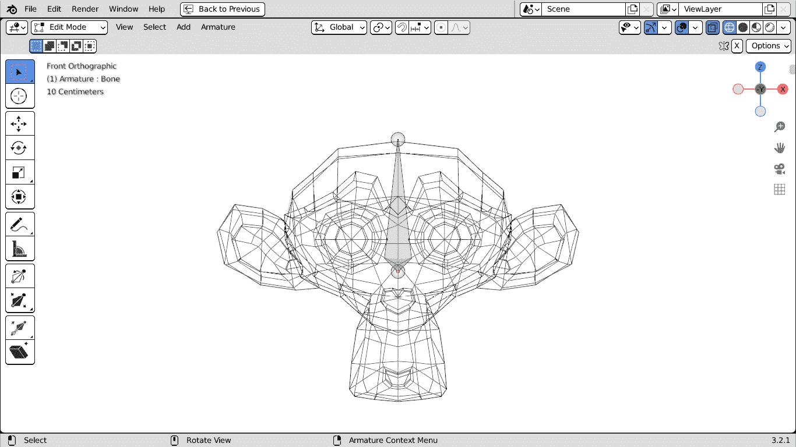

图 11.11：一个位于几何形状内部的骨架，带有线框显示

我们可以立即设置一个 **骨架** 修改器，但骨架通常不止一个骨骼。例如，我们可以向耳朵添加骨骼。

## 添加骨架骨骼

为了在创建新骨骼时获得更好的视图，我们可以按 *1* 键或从顶部菜单栏选择 **视图** | **视点** | **前视图**，然后按 *.* 键，或选择 **视图** | **选择框**，以将视图居中。

将骨架作为活动对象，我们通过按 *Tab* 键或使用左上角的下拉菜单切换到 **编辑模式**。然后，始终在前视图中，我们可以按照以下步骤向耳朵添加骨骼：

1.  使用 *Shift* + *A* 组合键或从顶部菜单栏选择 **添加** | **单个骨骼** 来添加一个新的骨骼。新骨骼被添加到现有骨骼的上方。

1.  点击骨骼以选择其中一个。

1.  按下 *R* 键，然后输入 `50`，再按 *Enter* 键将骨骼向屏幕右侧旋转。

1.  按 *G* 键，然后按 *X* 键水平移动它并输入 `1`。然后，按 *Enter* 键将骨骼移向 Suzanne 的左耳。

1.  按 *G* 键，然后按 *Z* 键垂直移动骨骼并输入 `0.2`。然后，按 *Enter* 键将骨骼稍微向下移动。

1.  Blender 为左右骨骼有一个命名约定。为了给左耳骨骼添加 `.L` 后缀，我们从顶部菜单栏选择 **骨架** | **名称** | **自动命名左右**。

1.  要为另一只耳朵创建骨骼，我们从顶部菜单栏选择 **骨架** | **对称化**。

生成的骨架应该类似于三叉戟。在这个例子中，骨骼的确切位置并不重要。

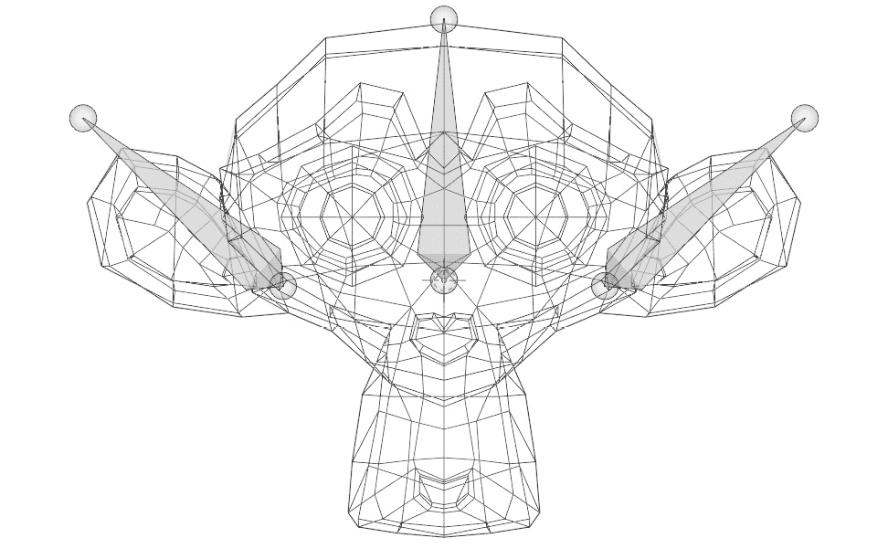

图 11.12：Blender 的 Suzanne 的耳骨

放置好三个骨骼后，我们可以通过按 *Tab* 键回到 **对象模式**，再按 *Z* 键回到 **实体** 视图。现在，我们可以将我们的几何形状绑定到骨架上。

## 将对象绑定到骨架上

如前所述，**轴网**变形器需要额外的信息：每个顶点都应该通过称为**权重绘制**的过程分配给一个或多个骨骼。对于绑定师来说这是一项手动任务，但我们可以使用 Blender 的自动权重来快速得到结果：

1.  在**对象模式**中，在**3D 视口**中选择 Suzanne 对象，然后按住*Shift*键并选择轴网。

1.  按*Ctrl* + *P*打开**设置父对象**菜单并选择**使用自动权重**。或者从顶部菜单选择**对象** | **父对象** | **使用自动权重**。

小心大纲视图

如果您使用**大纲视图**来选择对象，请注意其策略是不同的：

+   在**视口**中，多个对象中最后选择的对象是活动对象

+   在**大纲视图**中，多个对象中第一个选择的对象是活动对象

要将对象绑定到轴网上，我们可以在**视口**中先选择对象然后选择轴网，或者先在**大纲视图**中选择轴网然后选择对象。

现在我们可以通过摆动轴网骨骼来变形我们的网格：

1.  选择**轴网**并按*Ctrl* + *Tab*，或者使用屏幕左上角的下拉框切换到**姿态模式**。

1.  选择任何骨骼，然后使用*G*、*R*和*S*键移动、旋转或缩放它。

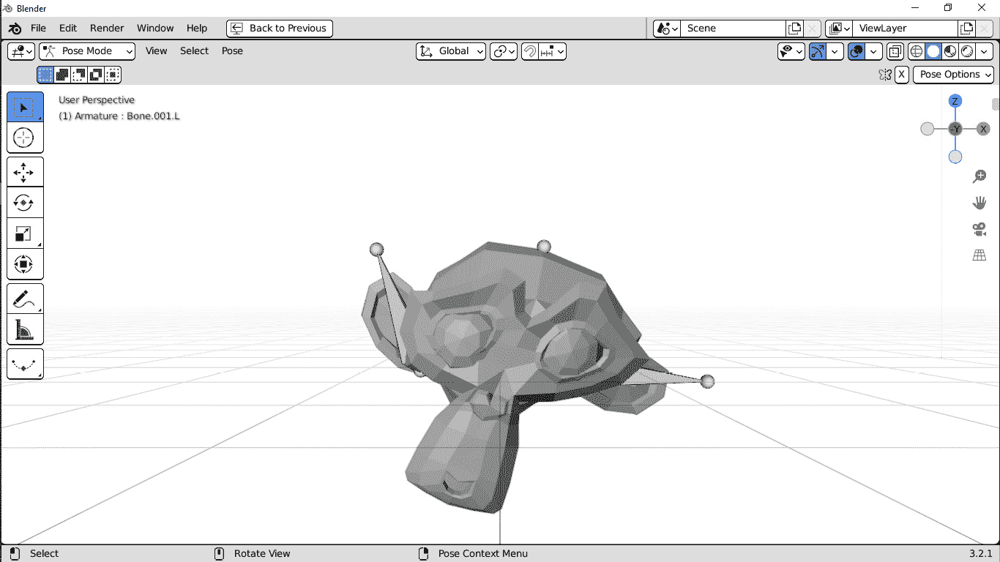

图 11.13：Blender 中的轴网变形

骨骼是变形模型的一种柔软、可控的方式。轴网网格也可以用轴网变形，因此我们可以在**Latte Express**中创建和设置轴网。

# 编写网格轴网脚本

轴网是 Blender 中动画推荐的途径，因为它们支持在不同`.blend`文件和其他高级动画功能之间进行链接。

将轴网绑定到轴网上可以使您在不切换到**编辑模式**编辑网格顶点的情况下进行变形动画。

## 添加轴网条件

我们希望轴网是一个可选功能，因此我们可以为它添加另一个属性。我们将其默认值设置为`True`，所以除非另行设置，否则将创建轴网：

```py
    add_armature: bpy.props.BoolProperty(default=True)
```

在`execute`方法内部，我们检查这个值并根据情况继续操作。

## 将轴网添加到场景中

轴网是以与轴网和其他对象相同的方式创建的：

1.  创建新数据。

1.  使用创建的数据创建新对象。

即使不是严格必需的，我们也将新轴网设置为轴网的父对象，以确保它们变换之间的一致性。

如果`add_armature`为`False`，我们立即设置轴网的位置。否则，我们创建一个新的轴网。底层代码在我们得到对象中点后不久接管：

```py
        # …
        ob_translation = ob.matrix_world.to_translation()
        ob_translation += ob_center
        if not self.add_armature:
            latt_obj.location = ob_translation
        else:
            arm_data = bpy.data.armatures.new(
                                           f"ARM-{ob.name}"
                                          )
            arm_obj = bpy.data.objects.new(
                                       name=arm_data.name,
                                       object_data=arm_data
                                      )
            context.collection.objects.link(arm_obj)
```

一旦轴网成为场景的一部分，我们可以将其父对象设置为轴网并将其移动到对象所在的位置：

```py
            latt_obj.parent = arm_obj
            arm_obj.location = ob_translation
```

通常情况下，骨架的变换枢轴位于受影响的几何体下方，因此当骨架处于其静止位置时，变形的角色将位于地面以上。因此，我们使用 `dimensions` 的第三个坐标将骨架移动到中心下方对象高度的一半：

```py
            half_height = ob.dimensions[2]/2
            arm_obj.location[2] -= half_height
```

另一方面，晶格应该位于几何体中心，因此我们将其提升相同的量：

```py
            latt_obj.location[2] += half_height
```

现在骨架和晶格已经放置好了，我们需要创建一些骨骼。

## 创建编辑骨骼

为了手动创建骨骼，我们选择骨架并切换到 **编辑模式**。在 Python 中，执行相同的步骤如下：

```py
            context.view_layer.objects.active = arm_obj
            bpy.ops.object.mode_set(mode='EDIT',
                                    toggle=False)
```

我们将 `False` 传递给 `mode_set` 函数的 `toggle` 参数，因为我们不是在模式之间来回切换。

我们将添加与晶格垂直部分数量相同的骨骼。例如，具有 `3` 个垂直分辨率的晶格可以用三根骨骼绑定。

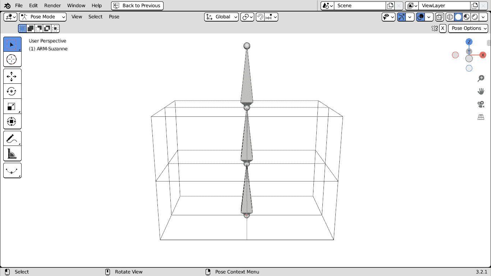

图 11.14：使用骨架骨骼绑定晶格

我们从 `grid_levels` 属性中获取级别的数量。每个骨骼从下部分开始，到下一部分结束。最后一根骨骼会超出晶格。

为了获得最佳长度，我们将对象高度除以内部骨骼的数量，即 `grid_levels` 减去一个骨骼：

```py
            grid_levels = self.grid_levels[2]
            height = ob.dimensions[2]
            bone_length = height / (grid_levels – 1)
```

我们使用一个 `for` 循环来添加一个 `range` 函数。我们给每个骨骼名称添加一个两位数的后缀：

```py
            for i in range(grid_levels):
                eb = arm_data.edit_bones.new(f"LAT_{i:02}")
```

每个骨骼都有一个起点（`头`）和一个终点（`尾`）。由于骨架的起点与晶格的第一部分相匹配，第一根骨骼的坐标为 `0,` `0, 0`。

第二根骨骼应该有更高的位置以留出前一根骨骼的长度，依此类推，因此每个骨骼头的表达式如下：

```py
                eb.head = (0, 0, i * bone_length)
```

骨骼的 `尾` 部分将 `head[2]` 坐标增加一个 `bone_length`：

```py
                eb.tail = (0, 0, eb.head[2] + bone_length)
```

为了将晶格顶点分配给骨骼，我们必须根据它们的 `Z` 坐标收集属于当前级别的顶点。

## 分配顶点到骨骼

对于每个晶格点，我们比较第三个坐标（`co[2]`）与当前部分的相对高度。*相对* 意味着第一部分的高度为 `0.0`，最后一部分为 `1.0`，中间的部分为 `0.5`，依此类推。

Python 索引从 `0` 开始，所以最后一部分的索引是部分数量减 `1`。考虑到这一点，以下是获取每个级别的相对高度的方法：

```py
                rel_height = i / (grid_levels–- 1)
```

晶格点相对于中心，晶格的一边大小为 `1.0`，所以最低点的垂直坐标为 `-0.5`。因此，我们将 `rel_height` 降低 `0.5` 单位：

```py
                rel_height -= 0.5
```

为了分配顶点，我们需要一个包含它们索引的列表，我们将它存储在 `vert_ids` 列表中：

```py
                vert_ids = []
```

在这个列表中，我们需要存储晶格点的标识符编号，而不是它们的坐标。

晶格数据点是按顺序排列的，因此它们的标识符是它们的序号索引；也就是说，第一个点由索引`1`标识，第二个点有索引`2`，依此类推。

在 Python 中，我们可以使用`enumerate`来获取迭代项的序号：

```py
                for id, v in enumerate(latt_data.points):
                    if v.co[2] == rel_height:
                        vert_ids.append(id)
```

我们可以为每个骨骼创建一个以骨骼命名的顶点组，并使用`add`方法分配顶点。我们还提供一个`1.0`的权重，因为我们不是在两个组之间混合分配，并将`'REPLACE'`作为条件，因为我们不是从先前的分配中添加或减去：

```py
                vg = latt_obj.vertex_groups.new(
                                               name=eb.name
                                              )
                vg.add(vert_ids, 1.0,'REPLACE')
```

创建骨骼并分配它们的影响是这个过程中的难点。现在我们可以创建修改器。

## 创建骨架修改器

我们通过`modifiers.new`方法向`latt_obj`添加一个新的骨架修改器，并使用`arm_obj`作为其变形对象：

```py
            arm_mod = latt_obj.modifiers.new("Armature",
                                            "ARMATURE")
            arm_mod.object = arm_obj
```

最后，我们保留`'POSE'`，这样用户就可以进行动画制作：

```py
            bpy.ops.object.mode_set(mode='POSE',
                                    toggle=False)
```

在这一点上，`LattExpress`一键创建晶格变形器和动画骨骼。作为一个可选步骤，我们可以为显示骨骼创建自定义形状。

# 添加自定义骨骼形状

骨架骨骼是有效的变形器，但在*使用骨架变形器*部分，我们为自己体验到了一个主要的缺点：骨骼往往被变形几何体隐藏。

有几种解决方案，例如在**骨架**属性中激活**在前**属性，并使用**X-Ray**或**线框**视图。

另一个技巧是通过将网格对象分配给骨骼的**自定义** **形状**属性来显示特殊的小部件。

## 在 Python 中创建网格对象

首先，我们必须创建一个新的网格。一个网格由顶点坐标组成，以及连接顶点的边或面。

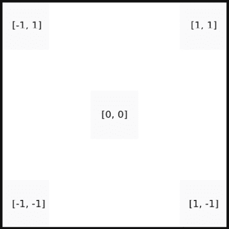

图 11.15：2D 正方形的顶点坐标

在这个例子中，我们创建一个线框正方形并将其用作骨骼小部件。Blender 骨骼在`Y`轴上扩展，所以放置垂直的骨骼的水平坐标是`X`和`Z`。

我们构建我们的顶点列表。我们希望边长为`1.0`，这是一个易于缩放的度量。因此，每一边将从`-0.5`到`0.5`的坐标，或者反过来。如果`X`和`Z`是第一个和最后一个坐标，这就是我们的顶点列表：

```py
            v_cos = [
                [-0.5, 0.0, -0.5],
                [-0.5, 0.0, 0.5],
                [0.5, 0.0, 0.5],
                [0.5, 0.0, -0.5]
            ]
```

接下来，我们需要一个边的列表。边是一对顶点索引，每个索引代表将要连接的两个顶点。正方形的四条边将顶点`0`连接到`1`，`1`连接到`2`，顶点`2`连接到`3`，`3`连接到`0`：

```py
            edges = [
                [0, 1], [1, 2], [2, 3], [3, 0]
            ]
```

我们可以使用`from_pydata`方法从 Python 列表创建新的网格数据。由于我们不需要控制小部件中的面，第三个参数是一个空列表：

```py
            mesh = bpy.data.meshes.new("WDG-square")
            mesh.from_pydata(coords, edges, [])
```

我们将网格添加到场景中：

```py
            wdg_obj = bpy.data.objects.new(mesh.name, mesh)
            context.collection.objects.link(wdg_obj)
```

现在，我们可以将小部件形状分配给我们的骨架的**姿态骨骼**：

```py
            for pb in arm_obj.pose.bones:
                pb.custom_shape = wdg_obj
```

以`1.0`的边长，我们的小部件也可以被隐藏，所以我们将其缩放以匹配`dimensions`对象。

考虑到骨骼的向上方向是 `Y` 轴，而 Blender 的向上方向是 `Z`，我们将 `Z` 自定义形状比例设置为 `Y` 维度：

```py
                pb_scale = pb.custom_shape_scale_xyz
                pb_scale[0] = ob.dimensions[0]
                pb_scale[2] = ob.dimensions[1]
```

Blender 通过骨骼的长度来缩放显示的自定义形状，所以我们通过骨骼长度来除以缩放：

```py
                pb_scale[0] /= bone_length
                pb_scale[2] /= bone_length
```

我们脚本中创建的骨架已经准备好了。我们将整理场景并退出操作员。

存储骨骼对你的变量有害！

骨架骨骼由不同的 Python 实体表示，具体取决于当前模式。当骨架处于 `EditBone` 模式时，使用骨架数据的 `edit_bones` 集合。当骨架处于 `PoseBone` 模式时，使用 `pose.bones` 对象的 `is`。

这些集合每次骨架更新时都会重建，在它们改变时存储在变量中可能会导致崩溃。

## 完成设置

如果创建了骨架，我们将隐藏小部件网格和晶格：

```py
            wdg.hide_set(True)
            latt_obj.hide_set(True)
```

`execute` 的最后步骤与之前相同：我们为变形对象创建晶格修改器，取消选择几何体，并完成：

```py
        mod = ob.modifiers.new("Lattice", "LATTICE")
        mod.object = latt_obj
        ob.select_set(False)
        return {'FINISHED'}
```

重新加载脚本并启动 **在活动对象上创建晶格** 将创建一个完整的动画设置，包括骨架和骨骼形状。

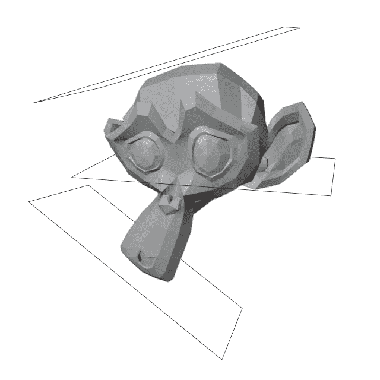

图 11.16：通过动画控制变形的 Suzanne

此插件仍然可以改进。例如，我们可以为我们的动画控制构建椭圆形形状，或者通过将一些代码移动到特定函数中来整理 `execute` 方法，但既然它满足了其初始目的，我们可以认为它是完成的。

# 摘要

我们已经学习了如何使用修改器改变对象，以及如何将修改器绑定到动画对象。我们还对对象数据的工作原理以及不同类型的对象是如何创建、链接到场景和集成的有了更深入的了解。

使用这些知识，我们已经编写了一个可以用来变形任何对象的制作工具。

在本书的下一章和最后一章 *第十二章*，我们将探索 3D 管道的最后一步。

# 问题

1.  修改器是否会改变对象的数据？

1.  我们如何向对象添加修改器？

1.  修改器是否依赖于除了它们变形之外的其他对象？

1.  对或错：我们可以在创建晶格对象之前或之后更改晶格数据的分辨率，而不会产生任何后果。

1.  我们如何在 Python 中向骨架添加骨骼？

1.  对或错：只有一个骨骼集合属性。

1.  对或错：只有网格类型的对象可以通过骨架变形。

1.  Blender 有模式。当前模式是否会影响我们是否能在脚本中添加或删除数据？

1.  我们如何使用 Python 创建网格？
