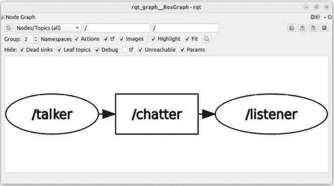
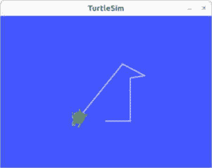
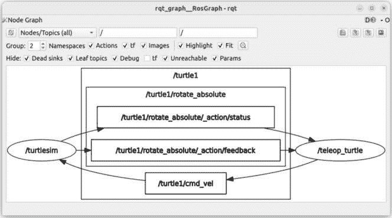
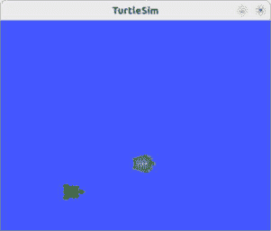

# 第三章：揭示 ROS 2 核心概念

现在，你将开始你的第一个 ROS 2 程序。正如你将看到的，一个 ROS 2 程序被称为 **节点**。

节点内部有什么，它做什么，节点之间是如何通信的？你如何配置节点并同时启动多个节点？

这就是我们将在本章中关注的内容。我们不会编写任何代码，而是通过实际实验来探索概念，使用与 ROS 2 一起安装的现有演示。

到本章结束时，你将对 ROS 2 的主要核心概念有一个全局的理解。你还将熟悉你将在所有项目中使用的最重要的 ROS 2 工具。

重要注意事项

在本章中，我不会解释所有内容。我们将开始一个探索阶段，在这个阶段中，我们将使用不同的核心概念并猜测它们是如何工作的。现在不是所有东西都必须有意义，如果你对某些概念仍然有些模糊，请不要过于担心。只需尝试通过运行所有命令来通过本章。

这里的目标不是获得完整的理解或记住所有命令，而是获得对事物工作方式的*直观感受*。这将极大地帮助你理解第二部分，当我们更详细地介绍每个概念并与之一起开发时。

在本章中，我们将涵盖以下主题：

+   运行你的第一个节点

+   主题

+   服务

+   动作

+   参数

+   启动文件

# 运行你的第一个节点

要理解节点是什么，我们将简单地运行一个节点并使用一些最有用的 ROS 2 工具进行一些观察。

对于本章，我建议打开几个终端。你可以启动几个终端窗口并将它们排列在你的屏幕上，或者使用 Terminator（见*第二章*中的*ROS 开发额外工具*）并至少打开三个标签页。为了在运行命令时消除任何混淆，我还会告诉你应该在哪个终端运行该命令（终端 1、终端 2 等）。

## 使用 ros2 run 从终端启动节点

让我们探索你的第一个 ROS 2 工具，可能是最重要的一个：**ros2** 命令行工具。你将在未来的项目中一直使用这个工具。

**ros2** 包含了许多功能。在本章中，我们将探索其中的一些，在后续章节中还将介绍更多。没有必要记住所有命令：现在只需使用它们来建立理解，以后你将能够轻松地从终端中检索它们。

要启动一个节点，你必须遵循以下模板：**ros2 run <包名> <可执行文件>**。

正如我们稍后将要看到的，节点组织在包内部。这就是为什么你首先需要指定节点所在的包名以及该节点的可执行文件名。由于我们安装了 ROS 桌面，许多演示包已经包含在内，例如，**demo_nodes_cpp**。

在终端 1 中，从 **demo_nodes_cpp** 包启动 talker 节点：

```py
$ ros2 run demo_nodes_cpp talker
[INFO] [1710223859.331462978] [talker]: Publishing: 'Hello World: 1'
[INFO] [1710223860.332262491] [talker]: Publishing: 'Hello World: 2'
[INFO] [1710223861.333233619] [talker]: Publishing: 'Hello World: 3'
^C[INFO] [1710223862.456938986] [rclcpp]: signal_handler(signum=2)
```

在你运行此命令后，节点开始。要停止它，只需在节点运行的终端中按 *Ctrl* + *C*。

那么，这里发生了什么？从我们能观察到的来看，这个节点只是一个程序，它会在终端每秒打印一条日志。

现在，保持节点存活，或者如果你停止了它，再次启动它。在另一个终端（终端 2）中，让我们启动一个不同的节点，即来自同一包的监听节点：

```py
$ ros2 run demo_nodes_cpp listener
[INFO] [1710224252.496221751] [listener]: I heard: [Hello World: 9]
[INFO] [1710224253.497121609] [listener]: I heard: [Hello World: 10]
[INFO] [1710224254.495878769] [listener]: I heard: [Hello World: 11]
```

这个节点也是一个简单的程序，将在终端打印一些日志。然而，正如你所看到的，当两个节点运行时（说话者和监听者），在说话者上打印的任何内容似乎也会被监听者接收，然后打印出来。

在这个例子中，我们有两个节点正在运行，我们可以清楚地看到它们正在相互通信。如果你停止了说话节点，你会看到监听节点也会停止打印日志。当你重新启动说话节点时，监听节点开始打印说话节点“发送”的内容。

注意

这里有一些在使用 `ros2` 命令行工具时的提示：

尽可能多地使用自动补全。这将使你更快地输入命令，但更重要的是，你可以确保你输入了正确的命令、包名、节点名等等。

如果你对一个命令或子命令有疑问，你可以在命令中添加 `-h` 来从终端获取帮助。例如，使用 `ros2 -h` 获取全局帮助，或者使用 `ros2 run -h` 获取针对运行子命令的帮助。如果你知道在哪里找到信息，就没有必要记住所有的命令。

## 使用 rqt_graph 检查节点

在这里，我们将发现另一个非常有用的工具，它是命令行的良好补充：**rqt_graph**。这个工具将用漂亮的视觉效果显示所有正在运行的节点。

保持两个节点（终端 1 和 2）存活，并在终端 3 中启动 **rqt_graph**。命令与工具名称相同：

```py
$ rqt_graph
```

这将打开一个新的图形窗口，你应该能看到两个节点。如果你什么都没有看到，确保两个节点都在运行，并通过点击左上角带有刷新图标的按钮来刷新视图。你还可以从左上角的下拉菜单中选择 **Nodes/Topics (all)**。然后，你应该会得到类似以下的内容：



图 3.1 – 带有两个节点的 rqt_graph

在这里，我们可以看到两个节点都在运行（目前没有新的内容），但我们还看到从说话节点到一个方框的箭头，以及从那个方框到监听节点的另一个箭头。这是 ROS 2 通信，允许说话节点向监听节点发送一些数据——在这里，是一些文本。我们将在本章的下一节中讨论这种通信。

我们现在可以得出的结论是，我们在两个不同的终端中使用了 **ros2 run** 命令启动了两个不同的 ROS 程序（节点）。看起来这两个程序正在相互通信，我们可以用 **rqt_graph** 来确认这一点。

在我们进一步了解 ROS 通信的类型之前，让我们运行另一组节点。

## 运行 2D 机器人模拟

我们运行的前两个节点是非常简单的程序，它们在终端上打印日志并在彼此之间发送一些文本。

现在，停止所有现有的节点（在每个终端中按 *Ctrl* + *C*），然后让我们用一些其他节点重新开始。在终端 1 中运行以下命令：

```py
$ ros2 run turtlesim turtlesim_node
Warning: Ignoring XDG_SESSION_TYPE=wayland on Gnome. Use QT_QPA_PLATFORM=wayland to run on Wayland anyway.
[INFO] [1710229365.273668657] [turtlesim]: Starting turtlesim with node name /turtlesim
[INFO] [1710229365.288027379] [turtlesim]: Spawning turtle [turtle1] at x=[5.544445], y=[5.544445], theta=[0.000000]
```

你会看到一些日志，但更重要的是，你将得到一个带有蓝色背景和中间有海龟的新窗口。这个海龟代表一个（非常简化的）在 2D 空间中移动的模拟机器人。

在终端 2 中，启动这个第二个节点：

```py
$ ros2 run turtlesim turtle_teleop_key
Reading from keyboard
---------------------------
Use arrow keys to move the turtle.
Use G|B|V|C|D|E|R|T keys to rotate to absolute orientations. 'F' to cancel a rotation.
'Q' to quit.
```

看到这一点后，确保终端 2 已选中，并使用箭头键（上、下、左、右）。当你这样做的时候，你应该看到海龟机器人移动。



图 3.2 – 移动模拟海龟机器人（TurtleSim）

我们可以猜测，我们启动的第二个节点（使用 **turtle_teleop_key**）正在读取你按在键盘上的键，并将某种信息/命令发送到 **turtlesim** 节点，然后该节点使海龟机器人移动。为了确认这一点，请在终端 3 上再次启动 **rqt_graph**：

```py
$ rqt_graph
```

如果需要，刷新视图几次。选择 **节点/主题（全部）**，你会看到类似这样的内容：



图 3.3 – 带有 turtlesim 和 teleop_turtle 节点的 rqt_graph

我们可以找到一个名为 **turtlesim** 的节点和一个名为 **teleop_turtle** 的节点，我们可以清楚地看到这两个节点正在彼此通信。

注意

如你所见，我们用来启动节点的可执行文件名（`turtle_teleop_key`）不一定与节点名（`teleop_turtle`）相同。我们将在本书的后面回到这个问题。

## 回顾 – 节点

从这两个实验中我们能得到什么？正如你所见，ROS 2 节点可以是任何包含以下内容的计算机程序：

+   指令用于在终端打印日志

+   图形窗口（2D，也可以是 3D）

+   硬件驱动程序等

除了是一个计算机程序之外，节点还受益于 ROS 2 的功能：日志、与其他节点的通信以及本书中将发现的其它特性。

现在你已经看到了如何启动节点和使用 **ros2** 命令行工具，让我们关注它们是如何相互通信的。

# 主题

节点使用 ROS 2 通信功能相互通信。有三种类型的通信：主题、服务和动作。我们将发现所有三种，从 **主题** 开始。

在这里，我们将做一些基本的发现，以了解 ROS 2 主题是什么，你将了解更多关于它们的信息，包括如何为主题编写代码，在*第五章*中。

## 运行主题发布者和订阅者

停止所有正在运行的节点（*Ctrl* + *C*），然后让我们回到我们的第一个例子。

在终端 1 中，输入以下命令：

```py
$ ros2 run demo_nodes_cpp talker
```

在终端 2 中，输入以下命令：

```py
$ ros2 run demo_nodes_cpp listener
```

在终端 3 中，输入以下命令：

```py
$ rqt_graph
```

如果需要，刷新视图几次，选择**Nodes/Topics (all)**，你应该会得到与*图 3*相同的视觉效果。

在中间，你会看到一个**/chatter**框。这个框代表一个 ROS 2 主题。你还可以看到说话节点正在向**/chatter**主题发送信息，这些信息随后将被监听节点接收。

我们说说话节点是一个**发布者**，监听节点是一个**订阅者**。

一个重要的细节是，说话节点实际上并没有直接向监听节点发送数据。说话节点在**/chatter**主题上发布，监听节点订阅**/chatter**主题。正因为如此，数据从说话节点流向监听节点。

## 一个名称和一个接口（数据类型）

从**rqt_graph**中，我们已能看到一个节点可以通过主题向另一个节点发送数据。一个重要点是，主题是由名称定义的。发布者和订阅者使用相同的名称来确保通信成功。

不仅仅是名称。让我们回到终端，使用**ros2**命令行工具来发现更多信息。

你之前使用**ros2 run**来启动节点。我们还有**ros2 topic**来与主题交互。你可以使用**ros2 topic -h**获取所有可用主题命令的帮助。**ros2 topic list**命令将列出所有可用主题，这意味着所有运行节点之间的主题通信。

在终端 3（如果你停止了**rqt_graph**）或终端 4 中，运行以下命令：

```py
$ ros2 topic list
/chatter
/parameter_events
/rosout
```

对于你创建的任何节点，你总会看到**/rosout**和**/parameter_events**。这些目前并不重要，你可以忽略它们。重要的是**/chatter**主题。我们已经知道它用于说话节点和监听节点之间，但现在的问题是：正在发送什么类型的数据？

要获取这些信息，我们可以使用**ros2 topic info <topic_name>**：

```py
$ ros2 topic info /chatter
Type: std_msgs/msg/String
Publisher count: 1
Subscription count: 1
```

在这里，我们可以看到有多少节点正在发布和订阅这个主题。我们有一个发布者（说话节点）和一个订阅者（监听节点）。我们还可以看到正在发送的消息类型：**std_msgs/msg/String**。在 ROS 2 中，这种消息被称为**接口**。

要查看接口内部的内容，运行**ros2 interface show <interface_name>**：

```py
$ ros2 interface show std_msgs/msg/String
# Some comments
string data
```

可能有一堆注释（以**#**开头），你可以忽略。重要的是这一点：**字符串数据**。这告诉我们该主题上正在发送什么。在这里，它是一个名为**data**的字符串（字符链）。

因此，当说话节点想要向**/chatter**主题发送消息时，它需要发送一个类型为字符串的**data**字段。为了获取这些信息，监听节点需要订阅**/chatter**，并期望接收相同的数据类型。

这就是主题是如何定义的：一个名称和一个界面（数据类型）。发布者和订阅者都应该使用相同的名称和界面来进行通信。

这是有道理的：作为一个类比，想象你和我通过在线聊天进行交流。如果我们不在同一个聊天室（同一个主题名称），我们就找不到对方。此外，如果我用你不懂的语言和你说话，这对你来说就没有意义。为了交流，我们都需要同意使用什么语言（相同的界面）。

## 对主题进行更多实验

让我们通过一个挑战来练习一下。这次，我不会直接展示要运行的命令，而是给你一个挑战，这样你可以自己练习。

注意

我会在本书中有时给你一些挑战/活动，难度各不相同——这个第一个挑战相当小。然后我会给你解决方案（或其中一部分）。当然，我鼓励你在阅读说明后停止阅读，只使用前面的页面来解决挑战。然后，阅读解决方案，并与你所做的内容进行比较。

### 挑战

运行我们之前用 2D **turtlesim**机器人（两个节点）做的第二个例子。

我现在挑战你做的是找到**turtle_teleop**节点用来向**turtlesim**节点发送速度命令的主题名称和界面。使用本章前面的命令尝试获取这些信息。

### 解决方案

启动两个节点和**rqt_graph**。

在终端 1 中，输入以下内容：

```py
$ ros2 run turtlesim turtlesim_node
```

在终端 2 中，输入以下内容：

```py
$ ros2 run turtlesim turtle_teleop_key
```

在终端 3 中，输入以下内容：

```py
$ rqt_graph
```

确保你在**rqt_graph**上刷新视图并选择**节点/主题（全部）**。你将得到与之前相同的内容，如*图 3*。3*。

屏幕上还有一些其他内容，但我们只需要一条信息。正如你所见，有一个**/turtle1/cmd_vel**框，这里代表一个主题。**teleop_turtle**节点是一个发布者，而**turtlesim**节点是该主题的订阅者。

这很有逻辑性：**teleop_turtle**节点将读取你按下的键，然后在该主题上发布。在其末端，**turtlesim**节点将订阅该主题以获取机器人的最新速度命令。

我们可以从终端中获得大致相同的信息：

```py
$ ros2 topic list
/parameter_events
/rosout
/turtle1/cmd_vel
/turtle1/color_sensor
/turtle1/pose
```

从所有运行的主题列表中，我们可以找到**/****turtle1/cmd_vel**主题。

现在，为了获取该主题的界面（数据类型），请运行以下命令：

```py
$ ros2 topic info /turtle1/cmd_vel
Type: geometry_msgs/msg/Twist
Publisher count: 1
Subscription count: 1
```

要了解界面的详细信息，请运行以下命令：

```py
$ ros2 interface show geometry_msgs/msg/Twist
# This expresses velocity in free space broken into its linear and angular parts.
Vector3  linear
      float64 x
      float64 y
      float64 z
Vector3  angular
      float64 x
      float64 y
      float64 z
```

这个界面比我们之前用的要复杂一些。现在没有必要去理解所有这些内容，因为我们会在本书的后面部分深入探讨界面。这里的目的是仅仅找到主题名称和界面。

从这些信息中，假设我们想让机器人向前移动。我们可以猜测，我们需要在**linear**字段内设置**x**字段的值（因为在 ROS 中，**x**指向前方）。

## 概述 – 主题

通过这两个实验，你可以看到节点通过主题相互通信。一个节点可以发布或订阅一个主题。发布时，节点发送一些数据。订阅时，它接收数据。

主题由一个名称和数据类型定义。现在你需要记住的就是这些。让我们切换到第二种通信类型：服务。

# 服务

主题非常有用，可以从一个节点向另一个节点发送数据/命令流。然而，这并不是唯一的通信方式。你还可以在 ROS 2 中找到客户端/服务器通信。在这种情况下，**服务**将被使用。

正如我们对主题所做的那样，我们将运行两个节点通过服务相互通信，这次我们将尝试使用 ROS 2 工具分析正在发生的事情以及通信是如何工作的。

在 *第六章* 中，你将得到关于服务、何时使用它们与主题相比以及如何在代码中包含它们的更详细解释。现在，让我们继续我们的探索阶段。

## 运行服务服务器和客户端

停止所有正在运行的节点。这次，我们将从 **demo_nodes_cpp** 中启动另一个节点，它包含一个简单的服务服务器，用于添加两个整数。我们还将启动一个 **客户端** 节点，该节点将向 **服务器** 节点发送请求。

在终端 1 中，输入以下命令：

```py
$ ros2 run demo_nodes_cpp add_two_ints_server
```

在终端 2 中，输入以下命令：

```py
$ ros2 run demo_nodes_cpp add_two_ints_client
```

一旦运行客户端节点，你可以在终端 1（服务器）中看到这个日志：

```py
[INFO] [1710301834.789596504] [add_two_ints_server]: Incoming request
a: 2 b: 3
```

你也可以在终端 2（客户端）中看到这个日志：

```py
[INFO] [1710301834.790073100] [add_two_ints_client]: Result of add_two_ints: 5
```

从我们在这里观察到的来看，似乎服务器节点正在挂起并等待。客户端节点将向服务器发送一个请求，包含两个整数，在这个例子中是：**2** 和 **3**。服务器节点接收请求，相加数字，并返回结果：**5**。然后，客户端获取响应并打印结果。

这基本上是 ROS 2 中服务工作的方式。你运行一个包含服务器的节点，然后任何其他节点（客户端）都可以向该服务器发送请求。服务器处理请求并返回响应给客户端节点。

## 一个名称和一个接口（数据类型）

对于主题，服务由两个东西定义：一个名称和一个接口（数据类型）。唯一的区别是接口将包含两部分：一个 **请求** 和一个 **响应**。

不幸的是，**rqt_graph** 不支持服务内省——尽管有一些计划在未来 ROS 2 发行版中实现这一功能。

要找到服务的名称，我们可以再次使用 **ros2** 命令行工具，这次使用 **service** 命令，后面跟 **list**。正如你所见，如果你理解了如何列出所有主题，那么对于服务来说也是一样的。

到目前为止，你仍然在终端 1 上运行着服务节点，而终端 2 上没有运行任何东西（因为客户端在收到响应后停止了）。在终端 2 或 3 上，运行以下命令：

```py
$ ros2 service list
/add_two_ints
/add_two_ints_server/describe_parameters
/add_two_ints_server/get_parameter_types
/add_two_ints_server/get_parameters
/add_two_ints_server/list_parameters
/add_two_ints_server/set_parameters
/add_two_ints_server/set_parameters_atomically
```

这有很多服务。其中大部分都可以丢弃。对于每个节点，你都会自动获得六个额外的服务，它们都包含名称**parameter**。如果我们忽略它们，我们可以看到**/add_two_ints**服务，这是在**add_two_ints_server**节点上运行的服务器。

太好了，我们找到了名称。现在，为了获取数据类型，我们可以使用**ros2 service type <service_name>**，然后**ros2 interface** **show <interface_name>**：

```py
$ ros2 service type /add_two_ints
example_interfaces/srv/AddTwoInts
$ ros2 interface show example_interfaces/srv/AddTwoInts
int64 a
int64 b
---
int64 sum
```

你可以看到接口中有一条包含三个短横线（**---**）的行。这是请求和响应之间的分隔。有了这个，你知道作为客户端向服务器发送请求时，你需要发送一个名为**a**的整数和一个名为**b**的整数。然后，你将收到一个包含一个名为**sum**的整数数字的响应。

## 从终端发送请求

我们不仅可以运行**add_two_ints_client**节点，还可以直接从终端发送请求。我把它加在这里是因为这是一种非常有用的测试服务的方法，而不需要现有的客户端节点。

语法是**ros2 service call <service_name> <interface_name> "<request_in_json>"**。正如你所见，我们需要提供服务名称和接口。

这里是如何做到这一点的示例（确保服务器节点仍在运行）：

```py
$ ros2 service call /add_two_ints example_interfaces/srv/AddTwoInts "{a: 4, b: 7}"
waiting for service to become available...
requester: making request: example_interfaces.srv.AddTwoInts_Request(a=4, b=7)
response:
example_interfaces.srv.AddTwoInts_Response(sum=11)
```

使用这个命令，我们发送了一个包含**4**和**7**的请求。服务器节点将打印以下日志：

```py
[INFO] [1710302858.634838573] [add_two_ints_server]: Incoming request
a: 4 b: 7
```

最后，在客户端，我们得到了包含**sum=11**的响应。

## 更多关于服务的实验

这是你练习使用服务的另一个挑战。

### 挑战

启动**turtlesim**节点，列出现有服务，并找出如何在终端中生成新的海龟机器人，在 2D 屏幕上。

再次建议你花点时间自己尝试做这个。你可以随意回顾本章的所有先前命令。不需要记住所有这些命令，因为你可以很容易地在书中找到它们，使用*Tab*键进行自动完成，或者通过在任意命令后添加**-h**。

### 解决方案

停止所有正在运行的节点。

在终端 1 中，输入以下内容：

```py
$ ros2 run turtlesim turtlesim_node
```

在终端 2 中，输入以下内容：

```py
$ ros2 service list
/clear
/kill
/reset
/spawn
/turtle1/set_pen
/turtle1/teleport_absolute
/turtle1/teleport_relative
# There are more services containing "parameter" that we can ignore
```

这些是我们可以为**turtlesim**节点使用的所有服务。正如你所见，我们已经有相当多了。在这个挑战中，你必须生成一个海龟。太好了，我们可以找到一个**/****spawn**服务。

我们已经有了名称；现在，让我们找到接口（请求，响应）：

```py
$ ros2 service type /spawn
turtlesim/srv/Spawn
$ ros2 interface show turtlesim/srv/Spawn
float32 x
float32 y
float32 theta
string name # Optional.  A unique name will be created and returned if this is empty
---
string name
```

现在，我们有了所有需要的信息。要向服务器发送请求，我们必须使用**/spawn**服务和**turtlesim/srv/Spawn**接口。我们可以发送包含（**x**，**y**，**theta**）坐标的请求，以及一个可选的名称。实际上，请注意，请求中的所有字段都是可选的。如果你没有为字段提供值，数字的默认值将是**0**，字符串的默认值将是**""**。

现在，让我们从终端发送我们的请求：

```py
$ ros2 service call /spawn turtlesim/srv/Spawn "{x: 3.0, y: 4.0}"
waiting for service to become available...
requester: making request: turtlesim.srv.Spawn_Request(x=3.0, y=4.0, theta=0.0, name='')
response:
turtlesim.srv.Spawn_Response(name='turtle2')
```

如果你查看 2D 窗口，你会看到一个新海龟。



图 3.4 – 生成新海龟后的 TurtleSim 窗口

这个海龟已经在请求中提供的（**x**，**y**，**theta**）坐标处生成。您可以尝试再次运行 **ros2 service call** 命令几次，使用不同的坐标，这样您就可以在屏幕上生成更多的海龟。

## 回顾 – 服务

您已经成功在两个节点之间运行了客户端/服务器通信。再次强调，服务是由名称和接口（请求，响应）定义的。

关于何时使用主题与服务的更多细节，请继续阅读，因为这是我们将在本书的后面部分看到的，那时您将更了解每个概念。现在，您已经看到了节点之间的两种通信方式。每种通信都有一个名称和接口，我们已经在终端中可以与之互动。

现在还有一个需要发现的 ROS 2 通信：动作。

# 动作

ROS 2 的 **动作**基本上与服务（客户端/服务器通信）相同，但设计用于更长时间的任务，并且当您可能希望在执行过程中也获得一些反馈，能够取消执行等。

在机器人领域，我们使机器人移动。使机器人移动不是瞬间发生的事情。它可能只需要一秒钟的几分之一，但有时一个任务可能需要几秒钟/几分钟或更长时间。ROS 2 服务是为快速执行设计的，例如：计算，或者立即动作，比如在屏幕上生成海龟。当客户端/服务器通信可能需要更多时间，并且我们希望对其有更多控制时，就会使用动作。

我们将在 *第七章* 中更详细地探讨动作。动作是我认为的一个中级概念，而不是初级概念，所以现在我不会深入探讨。让我们只是通过一个非常简单的例子继续探索阶段，以便了解它是如何工作的。

## 运行动作服务器

停止所有正在运行的节点，并在终端 1 中再次启动 **turtlesim** 节点：

```py
$ ros2 run turtlesim turtlesim_node
```

正如您已经通过主题和服务实践过的，以下 **ros2** 命令将开始对您来说变得熟悉。在终端 2 中列出所有现有的动作：

```py
$ ros2 action list
/turtle1/rotate_absolute
```

从我们所观察到的来看，似乎 **turtlesim** 节点包含一个名为 **/turtle1/rotate_absolute** 的动作服务器。目前还没有为这个动作创建客户端节点，因此我们将尝试从终端与之交互。当然，我们需要两样东西：名称和接口。

## 名称和接口（数据类型）

关于主题和服务，一个动作将由一个名称和一个接口定义。这次，接口包含三个部分：**目标**、**结果**和**反馈**。

目标和结果类似于服务的请求和响应。反馈是服务器可以发送的附加数据，可以在目标执行期间提供一些反馈。

要获取动作接口，你可以运行 **ros2 action info <action_name> -t** 命令。别忘了添加 **-t**（表示类型），否则，你会看到一些细节，但不会有接口：

```py
$ ros2 action info /turtle1/rotate_absolute -t
Action: /turtle1/rotate_absolute
Action clients: 0
Action servers: 1
    /turtlesim [turtlesim/action/RotateAbsolute]
```

我们可以看到动作在一个服务器（**turtlesim** 节点）内部运行，我们还找到了接口：**turtlesim/action/RotateAbsolute**。

让我们看看这个接口内部是什么：

```py
$ ros2 interface show turtlesim/action/RotateAbsolute
# The desired heading in radians
float32 theta
---
# The angular displacement in radians to the starting position
float32 delta
---
# The remaining rotation in radians
float32 remaining
```

你可以看到由三个短横线（**---**）分隔的两个部分。第一部分是目标，第二部分是结果，第三部分是反馈。这个动作相当简单；我们每个接口部分只有一个浮点数。

作为客户端，我们发送旋转所需的期望角度。服务器节点将接收目标并处理它，同时可选地发送一些反馈。当目标完成时，服务器将结果发送给客户端。

## 从终端发送目标

作为动作客户端，我们首先对接口的目标部分感兴趣。在这里，我们需要发送一个浮点数，它对应于我们想要旋转海龟的角度（以弧度为单位）。

从终端发送目标的语法是 **ros2 action send_goal <action_name> <action_interface> "<goal_in_json>"**。再次强调，你需要提供名称和接口。

确保终端 2 中的 **turtlesim** 节点是活跃的，然后从终端 2 发送一个目标：

```py
$ ros2 action send_goal /turtle1/rotate_absolute turtlesim/action/RotateAbsolute "{theta: 1.0}"
Waiting for an action server to become available...
Sending goal:
     theta: 1.0
Goal accepted with ID: 3ba92096282a4053b552a161292afc8e
Result:
    delta: -0.9919999837875366
Goal finished with status: SUCCEEDED
```

在运行命令后，你应该看到海龟机器人在 2D 窗口中旋转。一旦达到期望的角度，动作将完成，你将收到结果。

## 概括 – 动作

你已经在 ROS 2 中运行了第一个动作通信。一个 **动作** 由两件事定义：一个名称和一个接口（目标、结果、反馈）。当需要客户端/服务器类型的通信，并且动作的持续时间可能需要一些时间——而不是立即执行时，使用动作。

通过这个，你已经看到了 ROS 2 中的三种通信类型：主题、服务和动作。每个都会在 *第二部分* 中有自己的章节，这样你可以详细地了解它们是如何工作的，如何在代码中使用它们，以及如何使用 ROS 2 工具完全内省它们。

# 参数

我们现在将回到节点本身，并讨论另一个重要的 ROS 2 概念：**参数**。

这次，不是关于通信，而是关于如何在启动节点时给它不同的设置。

让我们快速了解参数是如何工作的，你将在*第八章*中获得更详细的解释，包括更多示例和用例。

## 获取节点的参数

停止所有正在运行的节点，并在终端 1 中启动 **turtlesim** 节点：

```py
$ ros2 run turtlesim turtlesim_node
```

然后，要列出所有参数，相当简单，你可能能猜到命令。如果我们有 **ros2 topic list** 用于主题，**ros2 service list** 用于服务，**ros2 action list** 用于动作，那么，对于参数，我们就有 **ros2 param list**。唯一的特殊性是我们使用单词 **param** 而不是 **parameter**。在终端 2 中运行此命令：

```py
$ ros2 param list
/turtlesim:
  background_b
  background_g
  background_r
  holonomic
  qos_overrides./parameter_events.publisher.depth
  qos_overrides./parameter_events.publisher.durability
  qos_overrides./parameter_events.publisher.history
  qos_overrides./parameter_events.publisher.reliability
  start_type_description_service
  use_sim_time
```

注意

有时，`ros2` `param` `list`命令可能无法正常工作，你将看不到任何参数或不是所有参数。这种情况也可能发生在一些其他的`ros2`命令中。在这种情况下，只需再次运行命令，如果需要的话，多次运行，这应该会工作。这可能是`ros2`命令行工具本身的某种类型的错误，但无需担心：应用程序正在正常运行。

我们首先看到**turtlesim**节点（实际上写作**/turtlesim**，带有一个前置斜杠），然后是这个节点下的一个带有缩进的名称列表。这些名称是参数，它们属于该节点。这是 ROS 2 中参数的第一个特点：它们存在于节点内部。如果你停止这个**turtlesim**节点，那么参数也会被销毁。

有一些参数你可以忽略：**use_sim_time**、**start_type_description_service**以及包含**qos_overrides**的所有参数。那些将存在于你启动的任何节点中。如果我们去掉它们，我们剩下一些参数，包括**background_b**、**background_g**、**backgound_r**。

从这个观察结果来看，我们似乎可以在启动**turtlesim**节点时改变 2D 窗口的背景颜色。

现在，那些参数里面是什么？是什么类型的值？是一个整数，一个浮点数，还是一个字符串？让我们用**ros2 param get <node_name> <param_name>**来找出答案。在终端 2 中运行以下命令：

```py
$ ros2 param get /turtlesim background_b
Integer value is: 255
$ ros2 param get /turtlesim background_g
Integer value is: 86
$ ros2 param get /turtlesim background_r
Integer value is: 69
```

从这个观察结果中，我们可以推测背景的**红、绿、蓝**（**RGB**）值是（**69**，**86**，**255**）。看起来参数值是一个从**0**到**255**的整数。

## 为节点设置参数值

现在我们已经找到了每个参数的名称以及我们应该使用什么类型的值，让我们在启动节点时自己修改这些值。

为了做到这一点，我们需要重新启动节点，使用与之前相同的语法：**ros2 run <package_name> <executable_name>**。然后我们将添加**--ros-args**（只添加一次），并为每个要修改的参数添加**-p <param_name>:=value**。

在终端 1 上停止**turtlesim**节点，然后重新启动它，并为一些参数设置不同的值：

```py
$ ros2 run turtlesim turtlesim_node --ros-args -p background_b:=0 -p background_r:=0
```

在这里，我们决定蓝色和红色颜色都将是**0**。我们没有为**background_g**指定任何值，这意味着将使用默认值（如前所述：**86**）。

运行此命令后，你应该会看到 2D 屏幕出现，但这次背景是深绿色。

## 概括——参数

参数是可以在运行时提供的设置（这意味着当我们运行节点时）。它们允许我们轻松配置我们启动的不同节点，因此，它们使 ROS 2 应用程序更加动态。

参数存在于节点内部。你可以找到节点的所有参数并获取每个参数的值。在启动节点时，你可以为要修改的参数提供一个自定义值。

# 启动文件

让我们用启动文件来结束这个 ROS 2 概念的列表。

**启动文件**将允许你从一个文件中启动多个节点和参数，这意味着你可以通过一条命令行启动整个应用程序。

在 *第九章* 中，你将学习如何编写自己的启动文件，但现在，让我们先启动几个来看看它们的作用。

## 启动启动文件

要在终端中启动单个节点，你已经看到了 **ros2 run** 命令。对于启动文件，我们将使用 **ros2 launch <package_name> <launch_file>**。

停止所有正在运行的节点，并从 **demo_nodes_cpp** 包中启动 **talker_listener** 启动文件。在终端 1 中运行以下命令：

```py
$ ros2 launch demo_nodes_cpp talker_listener_launch.py
[INFO] [launch]: All log files can be found below /home/ed/.ros/log/2024-03-14-16-09-27-384050-ed-vm-2867
[INFO] [launch]: Default logging verbosity is set to INFO
[INFO] [talker-1]: process started with pid [2868]
[INFO] [listener-2]: process started with pid [2871]
[talker-1] [INFO] [1710403768.481156318] [talker]: Publishing: 'Hello World: 1'
[listener-2] [INFO] [1710403768.482142732] [listener]: I heard: [Hello World: 1]
```

如你所见，似乎说话者和监听节点都已经启动。你可以在终端 2 中轻松验证这一点：

```py
$ ros2 node list
/listener
/talker
```

使用 **rqt_graph**，你还可以检查节点之间是否相互通信。我们有日志证明这一点：在同一屏幕上，我们获取了说话者和监听节点双方的日志，看起来监听节点正在接收消息（使用我们之前看到的 **/chatter** 主题）。

最后，这和我们在两个终端上启动两个节点是一样的。启动文件将简单地在一个终端中启动这两个节点。

如果我们更仔细地阅读日志，我们可以看到每个节点将在不同的进程中启动。要停止启动文件，请按 *Ctrl* + *C*。这将停止所有进程（节点），并且你的应用程序将结束。

现在我们尝试从 **turtlesim** 包中启动另一个启动文件。在终端 1 中停止启动文件，并从 **turtlesim** 包中启动 **multisim** 启动文件：

```py
$ ros2 launch turtlesim multisim.launch.py
[INFO] [launch]: All log files can be found below /home/ed/.ros/log/2024-03-14-16-14-41-043618-ed-vm-2962
[INFO] [launch]: Default logging verbosity is set to INFO
[INFO] [turtlesim_node-1]: process started with pid [2963]
[INFO] [turtlesim_node-2]: process started with pid [2965]
```

这样，你将看到两个二维窗口，每个窗口中都有一个海龟机器人。正如日志所示，我们正在启动两个 **turtlesim** 节点（两个具有不同名称的相同节点）。

我们也可以从终端中检查：

```py
$ ros2 node list
/turtlesim1/turtlesim
/turtlesim2/turtlesim
```

节点已经被重命名。我们得到的不再是 **/turtlesim**，而是 **/turtlesim1/turtlesim** 和 **/turtlesim2/turtlesim**。这些名称是在启动文件内部选择的。

## 复习 – 启动文件

启动文件对于从一个文件中启动多个节点（以及这些节点的参数）非常有用。只需一条命令行（**ros2 launch**），你就可以启动整个 ROS 2 应用程序。

目前关于启动文件的讨论就这么多，因为这个概念相当简单（真正的挑战在于编写启动文件，而不是启动它）。我们现在已经完成了对 ROS 2 主要概念的探索。

# 概述

通过本章，你已经发现了 ROS 2 最重要的一些概念：节点、主题、服务、动作、参数和启动文件。

ROS 2 程序被称为节点。简单来说，它们是常规的软件程序，也可以从 ROS 2 功能中受益：日志、通信、参数等等。

有三种通信类型：主题、服务和动作。主题用于从一个或多个节点向另一个或多个其他节点发送数据/命令流。服务用于需要客户端/服务器通信的情况。动作基本上与服务相同，但对于可能需要一些时间的目标执行。

除了通信功能外，节点还可以使用参数来指定运行时的设置。参数允许节点在启动时轻松配置。

最后，我们可以通过一个启动文件从一条命令行启动所有节点和参数。

对于核心概念（目前是这样），你已经发现了**ros2**命令行工具和**rqt_graph**。这些工具是无价的，你将经常使用它们。我们使用这些工具进行的实验与你在未来的 ROS 2 项目中将要做的非常相似。

这一章节有点特别，因为它并没有从 A 到 Z 完整地解释一个概念。正如引言中所述，它更像是一个概念巡游，通过实际操作发现主要概念。你得到的不是完整的理解，而是对事物工作方式的直觉，一些工具的使用经验，以及对整体图景的认识。

随时可以回到这一章节，在你阅读本书的过程中再次运行实验。一切都会变得更加有意义。

现在，你已经准备好继续进行**第二部分**，在那里，你将从头开始创建一个完整的 ROS 2 应用程序，使用 Python 和 C++代码。你迄今为止看到的每个概念都将有自己的专属章节。在这里培养的直觉将非常有用。
