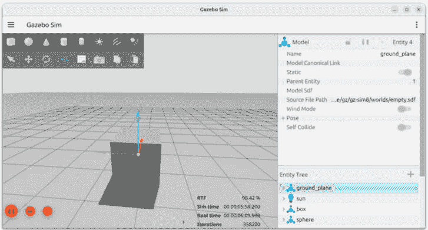
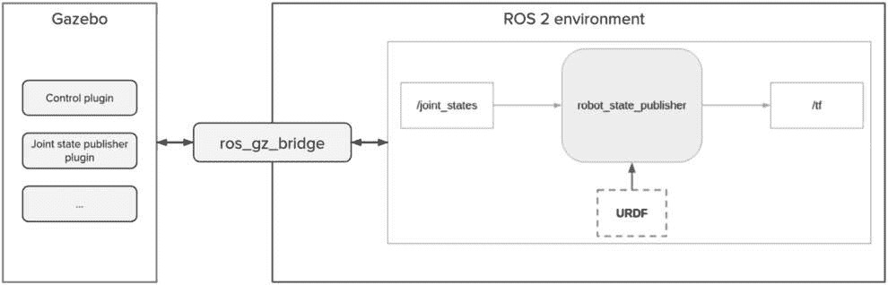
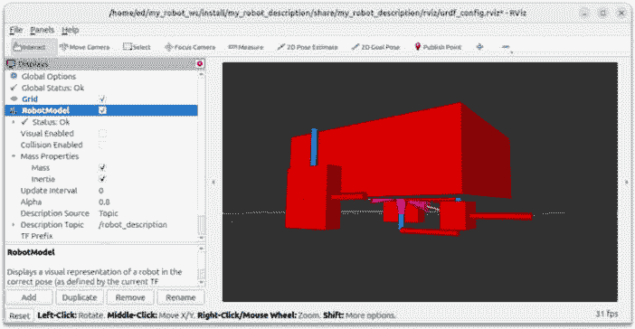
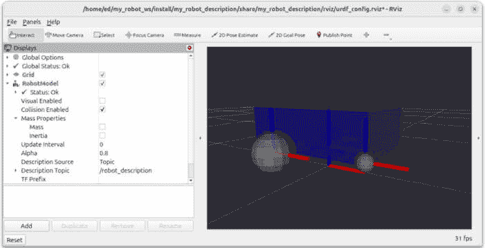
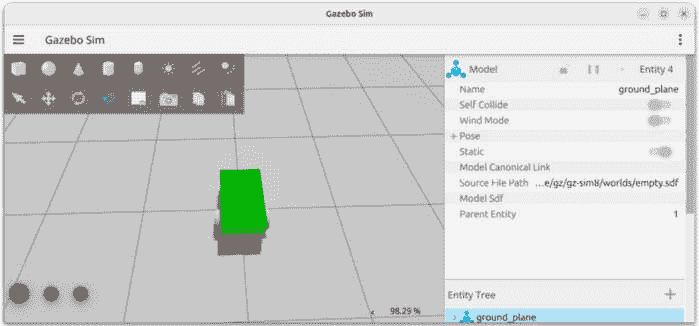
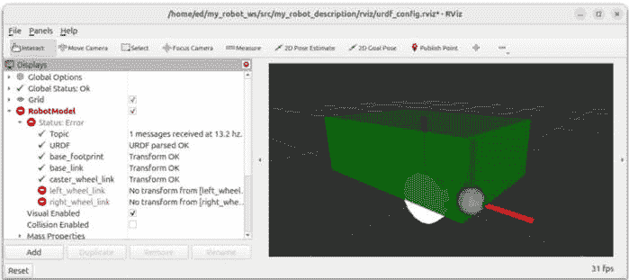

# 第十三章：在 Gazebo 中模拟机器人

在前面的章节中，你编写了一个 URDF 来描述机器人，发布了该机器人的 TFs，并将所有文件正确地组织到**my_robot_description**包中。

现在，你将要在 Gazebo 中模拟机器人。这将标志着*第三部分*项目的结束。目标是带着一个可工作的模拟完成这本书。之后，我将通过给你一些关于如何进一步使用 ROS 的建议来结束。

我们将首先了解 Gazebo 是什么，它是如何与 ROS 2 集成的，以及如何与之工作。这将使我们能够为 Gazebo 调整机器人 URDF，在模拟器中生成它，并使用插件来控制它。我们还将正确地打包应用程序，以便我们可以从一个单独的启动文件开始一切。

到本章结束时，你将能够模拟一个机器人在 Gazebo 中，并使用 ROS 2 与之交互。一旦你完成这个过程一次，模拟下一个机器人将变得容易得多。

本章的难度比我们之前所做的高。我们将达到一个文档缺乏很多信息的地方。通常，找到有用的信息意味着在 Google 上做大量的研究，以及找到可以使用的 GitHub 代码，作为灵感的来源。

为了完成本章，你还需要利用在这本书中学到的先前知识——例如，创建和组织包，处理主题和参数，以及编写启动文件。如果你有任何疑问，不要犹豫，参考前面的章节。

我们将使用**ch12**文件夹中的代码（位于[`github.com/PacktPublishing/ROS-2-from-Scratch`](https://github.com/PacktPublishing/ROS-2-from-Scratch)的 GitHub 仓库中）作为起点。你可以在**ch13**文件夹中找到最终代码。

在本章中，我们将涵盖以下主题：

+   Gazebo 的工作原理

+   为 Gazebo 调整 URDF

+   在 Gazebo 中生成机器人

+   在 Gazebo 中控制机器人

# 技术要求

如果你像书中开头用 VirtualBox 解释的那样在虚拟机（VM）中安装了 ROS 2，那么它可能对*第一部分*和*第二部分*的所有章节以及*第三部分*的前几章都工作得很好，即使是在运行 RViz 时也是如此。

然而，使用 Gazebo，虚拟机可能不够用。VirtualBox 与 3D 模拟工具配合得不好。从现在开始，我强烈建议你安装带有双启动的 Ubuntu。我知道有些人使用 VMware Workstation（使用个人使用的免费版本）或 Windows 上的 WSL 2 取得了更大的成功。如果你找到了对你有效的工作组合，那很好，但我仍然推荐双启动，这可能会带来更少的错误，并为你提供更好的整体体验。

因此，如果你目前正在运行虚拟机，请花时间设置双启动并安装 Ubuntu 24.04。然后，再次遵循*第二章*中的说明来安装 ROS Jazzy。这可能会在短期内占用你一些时间，但从长远来看，这将更加高效。

# Gazebo 是如何工作的

在我们开始我们的应用程序之前，了解 Gazebo 是什么以及它是如何工作的非常重要。

Gazebo 是一个 3D 仿真引擎。它包含一个物理引擎（具有重力、摩擦和其他物理约束），你可以用它来模拟一个机器人，就像它在真实世界中一样。

这也是 Gazebo 的一个优点。你可以主要使用 Gazebo 仿真来开发你的应用程序，然后与真实机器人一起工作。这带来了很多好处。例如，你可以工作在尚未存在的机器人上，测试极端用例而不会损坏真实机器人，创建你无法在日常环境中访问的定制环境，远程工作等等。

在本节中，我们将启动 Gazebo 并探索一些功能。我们还将了解如何将 Gazebo 与 ROS 2 连接，并理解我们需要采取的步骤来适应我们的机器人在 Gazebo 中的使用。在开始之前，很多人都会问的一个常见问题是，Gazebo 和 RViz 之间有什么区别？

## 阐明 - Gazebo 与 RViz 的区别

我们从这一点开始，因为我相信这是你可能会有的第一个困惑。我们之前已经使用了 RViz，我们可以在其中可视化机器人，以及很多其他信息。那么，为什么我们需要 Gazebo？

为了理解这一点，让我们首先回顾一下 RViz 是什么。RViz 是一个 3D 可视化工具。使用 RViz，你可以可视化 URDF、TFs 以及从 ROS 主题获取的数据。这是一个在开发时非常有用的工具，因为它可以帮助你检查你所做的是否正确。

现在，RViz**不是**一个仿真工具。你不会模拟任何东西；你**只可视化**已经存在的东西。所以，你在 RViz 中看到的机器人和所有数据只是外部发生的事情（在 RViz 外部）的表示。你不必在终端中查看和交互所有数据，你可以通过图形界面来做，并在 3D 中查看数据。这就是 RViz 为你带来的（非常简单地来说）。

例如，使用 TFs 时，RViz 将订阅**/tf**主题并在屏幕上显示 TFs。然而，RViz 并不控制 TFs；它只是显示它们。

相反，Gazebo 是一个仿真工具。它将模拟重力以及机器人的真实物理属性。它还有一些控制插件，这样你可以模拟硬件控制，甚至为你的机器人发布关节状态和 TFs。

那么，我们在这里使用的是 Gazebo 还是 RViz？最终，这并不是一场竞争；两者都是互补的。

如果您没有真实机器人，或者不想使用它，或者想要在不同的环境中测试机器人系统，例如，Gazebo 是可用的。使用 Gazebo，您可以复制您机器人的行为，使其非常接近现实生活中的表现。

在 Gazebo 之上，您可以使用 RViz 来可视化您的应用程序中的 TFs 和其他重要数据。RViz 在开发阶段仍然是一个非常有用的工具。因此，困境不是 *Gazebo 与 RViz* 的比较，而是 *真实机器人 与 Gazebo* 的比较。最终，您可以选择以下任一方式：

+   真实机器人与 RViz

+   Gazebo 模拟与 RViz

在本章中，我们将使用第二种组合。我们将在 Gazebo 中生成并控制我们的机器人。然后，我们还将使用 RViz 来可视化它。我们在 RViz 中看到的内容将是 Gazebo 中发生情况的反映。如果我们后来切换到真实机器人，我们将放弃 Gazebo，但仍然使用 RViz 来查看一切是否仍然运行良好。

现在我们已经澄清了这一点，我们可以开始使用 Gazebo。

## 启动 Gazebo

让我们运行 Gazebo 并熟悉界面。

首先，您需要安装 Gazebo。我们之前已经使用 **ros-<distro>-desktop** 安装了 ROS 2，它已经包含了很多软件包。为了获取 Gazebo 所需的一切，请安装此附加软件包：

```py
$ sudo apt install ros-<distro>-ros-gz
```

请确保将 **<distro>** 替换为您的当前 ROS 2 发行版，并在运行此命令后，source 您的环境。

注意

由于我们使用的是 Ubuntu 24.04，这将安装**Gazebo Harmonic**。对于其他 Ubuntu 版本，您可以在以下位置找到推荐的 Gazebo 版本：[`gazebosim.org/docs/latest/getstarted/`](https://gazebosim.org/docs/latest/getstarted/)。

需要注意的是，Gazebo 实际上与 ROS 2 独立。您可以在没有 ROS 2 的情况下运行 Gazebo。实际上，您甚至可以在没有任何 ROS 2 软件包的情况下安装 Gazebo。

Gazebo 被设计为一个独立的机器人仿真器，您可以使用它与 ROS 2 一起使用，以及其他机器人框架。在这里，我将只关注 ROS 2。我之所以提到这一点，只是为了让您明白 Gazebo 和 ROS 是独立的项目。

我们将首先单独运行 Gazebo。然后，我们将看到如何连接 Gazebo 和 ROS，这对于规划适应我们的项目和在 Gazebo 上模拟我们的 ROS 机器人非常有用。

因此，要启动 Gazebo（不使用 ROS），请在终端中运行此命令：

```py
$ gz sim
```

您将被带到 Gazebo 快速入门菜单。在那里，您可以点击**空**来加载一个空世界。您还有其他现有的世界（点击不同的图片或使用搜索栏），您可以在以后自己探索。警告——这些世界中的一些可能包含错误并且无法正常工作。

要停止模拟，请在启动 Gazebo 的终端中按 *Ctrl* + *C*。

当运行 Gazebo 命令时，你也可以直接指定你想要启动的世界。Gazebo 中的世界描述文件使用 SDF 格式（一个带有**.sdf**扩展名的文件），这与 URDF 非常相似。让我们用空世界启动 Gazebo：

```py
$ gz sim empty.sdf
```

现在，请花些时间使用鼠标控制移动空间。你也可以使用笔记本电脑的触摸板，但如果可能的话，我强烈建议你使用鼠标，这样会更容易进行下一步操作。

在屏幕的左下角，你会看到一个播放按钮。点击它以开始模拟。

在启动模拟后，你会在屏幕的右下角看到一个百分比，表示实时因子。基本上，这将立即告诉你你的计算机是否足够强大以运行 Gazebo。我个人有一个大约 98%的实时因子，这意味着在 Gazebo 中的模拟时间以 98%的速度与实时保持同步（即，在 100 个真实秒后，Gazebo 中过去了 98 秒）。如果你的百分比太低，这可能是一个你需要更好的性能的信号。如果你不确定，继续阅读本章，你将很快看到机器人模拟是否正常工作。

注意

Gazebo 可能会出现很多问题，所以如果你在某些时候看到它崩溃，甚至是在功能强大的计算机上，也不要感到惊讶。如果你无法正确关闭 Gazebo（在终端中使用*Ctrl* + *C*），当你再次启动它时可能会遇到一些麻烦。在这种情况下，你可以尝试停止所有可能仍在后台运行的 Gazebo 进程。为此，运行`ps aux | grep gz`以找到所有相关进程。对于每个`gz`进程（如果有），你将找到一个包含四个数字的`pid`。要停止一个进程，运行`kill –9 <pid>`。如果什么方法都不奏效，最好的办法是重新启动你的计算机。

让我们回到我们开始模拟的场景——在屏幕顶部，你可以点击不同的形状并将它们添加到空空间中。花些时间来实验一下。将一个盒子添加到空间中。找到平移模式和旋转模式。移动盒子（尤其是在*z*轴上）并看看会发生什么。如果你把盒子举起来，你应该看到盒子掉到地板上。这是因为重力和盒子的物理属性。



图 13.1：Gazebo 模拟器中空世界中的盒子

我们接下来可以探索 Gazebo 使用的通信。Gazebo 也使用主题和服务，但它们与 ROS 2 的主题和服务并不相同。

例如，你可以使用此命令列出所有 Gazebo 主题：

```py
$ gz topic -l
```

你将看到很多主题，但如果你在另一个终端中尝试运行**ros2 topic list**，这些主题将不会出现。同样，当运行**ros2 node list**时，你也不会看到任何节点。

通过这个，你可以看到 Gazebo 完全独立于 ROS 2，并且它们之间没有交互。

## Gazebo 如何与 ROS 2 协同工作

我们现在将探讨如何将 Gazebo 和 ROS 2 连接起来。

首先，你可以使用**ros_gz_sim**软件包中的 ROS 2 启动文件启动 Gazebo。这对我们来说将更加实用，因为当我们编写自己的启动文件时，我们可以包括这个文件：

```py
$ ros2 launch ros_gz_sim gz_sim.launch.py
```

这将以与**gz sim**命令相同的方式启动 Gazebo。你也可以使用**gz_args**参数指定要启动的世界：

```py
$ ros2 launch ros_gz_sim gz_sim.launch.py gz_args:=empty.sdf
```

然而，即使我们从 ROS 2 启动文件启动了 Gazebo，Gazebo 仍然是独立的。尝试在终端中列出所有节点和主题；你将看到与之前相同的结果。

要连接 Gazebo 和 ROS 2 的主题（或服务），你需要在这两者之间创建一个桥梁。**ros_gz_bridge**软件包为我们做了这件事，所以我们将使用这个软件包。我们只需要提供一些配置来指定我们想要桥接的主题；如何编写这个配置将在本章后面介绍。



图 13.2：使用 ros_gz_bridge 连接 Gazebo 和 ROS 2

在*图 13.2*中，你可以看到以下内容：

+   在右侧，我们的当前 ROS 2 应用程序与`robot_state_publisher`节点，发布在`/tf`主题上。

+   在左侧，`Gazebo`。在`Gazebo`内部，我们将添加插件（也称为系统）来模拟机器人的硬件行为。例如，你可以有一个插件来控制两个轮子，另一个插件来发布轮子的关节状态。这就是我们在本章中要实现的内容。

+   然后，为了使所有组件协同工作，我们将使用`ros_gz_bridge`软件包。在关节状态示例中，Gazebo 关节状态发布插件将使用 Gazebo 主题发布关节状态。通过使用`ros_gz_bridge`，我们将匹配此主题与 ROS 2 的`/joint_states`主题。

这里需要理解的重要一点是，Gazebo 和 ROS 2 存在于两个不同的环境中，但你可以使它们协同工作。无论你在 Gazebo 模拟还是真实机器人上工作，你的 ROS 2 应用程序都是一样的。如果你在真实机器人上工作，那么你将直接控制轮子，并从编码器获取关节状态数据。使用 Gazebo，你使用插件来模拟硬件。

现在，以下是我们在以下章节中将要采取的步骤来创建机器人的 Gazebo 模拟：

1.  为 Gazebo 适配 URDF。为了让机器人在 Gazebo 上工作，我们首先需要在 URDF 中提供惯性和碰撞属性。

1.  一旦 URDF 正确，我们将启动 Gazebo 并在其中生成 URDF。在这个时候，我们还将创建一个包含启动文件的软件包。

1.  然后，我们将添加一些插件（系统）来控制机器人，使用`ros_gz_bridge`软件包使这些插件与我们的 ROS 2 应用程序通信。

你可以遵循这个过程来模拟任何你想要在 Gazebo 中模拟的 ROS 2 机器人。如果某些事情仍然不清楚，继续阅读本章，进行实现工作，并在最后回到这一节。一切都会变得更有意义。

让我们从第一步开始。

# 适配 URDF 以用于 Gazebo

我们可以尝试直接在 Gazebo 中生成我们的机器人，但这是不可能的，因为 URDF 缺少两个关键元素——惯性和碰撞属性。Gazebo 需要这些来正确模拟机器人。

因此，在我们对 Gazebo 做任何事情之前，我们需要回到我们的 URDF 并添加这些属性。对于代表物理部分的每个机器人链接，我们将添加一个**<inertial>**标签和一个**<collision>**标签。在本节中，你将学习如何正确配置这些标签。

我们将修改在**my_robot_description**包中创建的 URDF。快速回顾一下，这个包包含 URDF、一个用于在 RViz 中显示机器人模型的启动文件和一个 RViz 配置文件。这个包中最重要的东西是 URDF。启动文件将帮助我们验证我们在 URDF 中设置的值是否正确。

让我们从惯性特性开始，然后添加碰撞特性。

## 惯量标签

没有惯性特性的 URDF 无法在 Gazebo 中加载。因此，这是你需要添加的第一件事。

一个**<inertial>**标签将包含几个元素，包括一个表示惯量张量的 3x3 矩阵。在这本书中，我们不会深入探讨理论上的惯量细节；如果你有兴趣，可以自己查阅，因为互联网上有相当好的文档。相反，我们将专注于找到正确的公式并应用它们，这样我们就可以生成机器人并快速进入下一步。

因此，目前我们的 URDF 被分成三个文件。我们将向这些文件添加一些代码：

+   `common_properties.xacro`：在这里，我们将添加一些宏来指定盒子、圆柱体和球体的惯性特性。这样，我们只需要为这些形状写一次惯性公式，你可以在任何项目中重复使用它们。

+   `mobile_robot.xacro`：在代表物理部分的每个链接内，我们将使用之前定义的相应惯性宏。

+   `my_robot.urdf.xacro`：这里没有变化；我们仍然导入前两个文件。

现在，我们如何为 URDF 中的形状编写惯性宏？

### 我们在**<inertial>**标签内写什么？

我们将创建三个包含**<inertial>**标签的 Xacro 宏——一个用于盒子，一个用于圆柱体，一个用于球体。在 URDF 的**<inertial>**标签内，你需要提供：

+   元素的质量（以千克为单位）。

+   惯性的起源（以米和弧度为单位）。

+   惯量张量或矩阵的九个元素（以千克每平方米为单位）。由于矩阵是对称的，我们只需要六个元素——`ixx`、`ixy`、`ixz`、`iyy`、`iyz`和`izz`（例如，`ixy`和`iyx`是相同的，所以我们省略第二个）。

由于我们在这个项目中没有物理机器人，我们将任意决定每个连杆的质量属性—当然，同时尽量使这些值有意义。

那么，我们如何计算惯性矩阵呢？这通常是编写 **<inertial>** 标签时最困难的部分。

如果你使用 CAD 软件设计你的机器人—例如，使用 **SolidWorks**—那么你可以直接从软件中导出每个属性并将它们添加到你的 URDF 中。由于我们没有这个软件，我们需要自己进行计算。

幸运的是，互联网上有一些有用的资源。你可以在维基百科上找到一个惯性矩的列表：[`en.wikipedia.org/wiki/List_of_moments_of_inertia`](https://en.wikipedia.org/wiki/List_of_moments_of_inertia)。在那里，你还可以找到我们拥有的每个简单形状的惯性矩，以及一个 3D 惯性张量列表，这基本上是我们为 URDF 需要的矩阵。需要注意的是，矩阵只有三个非零分量—**ixx**、**iyy** 和 **izz**。所有其他分量都设置为 **0**。

有了这个信息，我们可以开始编写 **<inertial>** 标签。

### 为基本形状添加惯性宏

由于基本形状的惯性宏可以被任何机器人使用，我们将在 **common_properties.xacro** 文件中添加所有宏。这样，如果你想为另一个机器人创建另一个 URDF，你只需重用这个 Xacro 文件即可。

第一个宏将是用于盒子的惯性。现在，如果你查看前面的维基百科链接，可能会有些困惑，因为它们使用 **width**、**depth** 和 **height**（*w*、*d* 和 *h*）。在 ROS 2 中，我们为 *x*、*y* 和 *z* 维度指定了长度、宽度和高度。哪一个对应哪一个？

正确编写这个矩阵的一个简单方法就是意识到一个维度的分量使用了其他两个维度。例如，为了计算 *w* 分量（矩阵中的 **ixx**），我们使用 *h*（z）和 *d*（y）。只有遵循这一点才能消除很多困惑，特别是与不同的命名约定有关。

这里是我们将使用的内容（左边是维基百科的值，右边是 ROS 2 的值）：

+   **w**: x 轴维度

+   **d**: y 轴维度

+   **h**: z 轴维度（这同时也是指向上的轴）

这里是盒子的 **<inertial>** 标签。你可以在 **<material>** 标签之后，在 **<robot>** 标签内添加这个标签：

```py
<xacro:macro name="box_inertia" params="m x y z o_xyz o_rpy">
    <inertial>
        <mass value="${m}" />
        <origin xyz="${o_xyz}" rpy="${o_rpy}" />
        <inertia ixx="${(m/12) * (z*z + y*y)}" ixy="0" ixz="0"
                 iyy="${(m/12) * (x*x + z*z)}" iyz="0"
                 izz="${(m/12) * (x*x + y*y)}" />
    </inertial>
</xacro:macro>
```

为了简化，我直接使用了 **x**、**y** 和 **z**（而不是 *w*、*d* 和 *h*），这样在我们需要使用链接中的宏时，会更容易，因为盒子的尺寸是用 **x**、**y** 和 **z** 定义的。当你开发 API/接口/宏/函数时，最佳实践是为 API 的客户端设计接口，而不是为编写 API 的开发者设计。

现在，让我们编写圆柱体的宏。这个稍微简单一些。我们有两个组件——半径和高度。这将与我们在 URDF 中定义的半径和长度相对应：

```py
<xacro:macro name="cylinder_inertia" params="m r l o_xyz o_rpy">
    <inertial>
        <mass value="${m}" />
        <origin xyz="${o_xyz}" rpy="${o_rpy}" />
        <inertia ixx="${(m/12) * (3*r*r + l*l)}" ixy="0" ixz="0"
                 iyy="${(m/12) * (3*r*r + l*l)}" iyz="0"
                 izz="${(m/2) * (r*r)}" />
    </inertial>
</xacro:macro>
```

最后，我们可以为（实心）球体编写宏。这是最简单的，我们只有一个组件——球体半径：

```py
<xacro:macro name="sphere_inertia" params="m r o_xyz o_rpy">
    <inertial>
        <mass value="${m}" />
        <origin xyz="${o_xyz}" rpy="${o_rpy}" />
        <inertia ixx="${(2/5) * m * r * r}" ixy="0" ixz="0"
                 iyy="${(2/5) * m * r * r}" iyz="0"
                 izz="${(2/5) * m * r * r}" />
    </inertial>
</xacro:macro>
```

通过这三个宏，我们拥有了所有基本 URDF 形状所需的一切。

### 包括链接中的惯性宏

我们现在可以使用这些宏为机器人的每个链接提供惯性属性。

由于 **base_footprint** 不代表一个物理部分（我们称之为虚拟链接），它不会有惯性。对于所有其他链接（基础、右轮、左轮和球体），我们将使用惯性宏。

打开 **mobile_base.xacro** 文件，这是我们继续编写代码的地方。

现在，要添加链接的惯性属性，你需要在 `<link>` 标签内添加一个 **<inertial>** 标签。为了添加这个标签，我们将使用之前创建的宏。

让我们从 **base_link** 开始。在 `<link name="base_link"></link>` 标签内，并在 `<visual>` 标签之后，添加 **box_inertia** 宏：

```py
<xacro:box_inertia m="5.0" x="${base_length}" y="${base_width}" z="${base_height}" o_xyz="0 0 ${base_height / 2.0}" o_rpy="0 0 0" />
```

注意

`<visual>` 和 `<inertial>` 标签都是 `<link>` 标签的子标签；不要在 `<visual>` 标签内添加 `<inertial>` 标签。

我们指定了宏所需的全部参数：

+   `5.0` kg。

+   `x`、`y` 和 `z` 维度（我们创建了宏以便可以使用 ROS 2 轴系约定）。

+   `<inertial>` 标签，我们将在 RViz 中验证惯性。在那里，你可以轻松地看到惯性是否放置正确。

现在，添加两个轮子的惯性。你需要在 `wheel_link` 宏内添加 **cylinder_inertia** 宏（在宏内使用另一个宏是完全可行的）。确保将其放置在 `<link>` 标签内，并在 `<visual>` 标签之后。这个惯性宏将应用于两个轮子：

```py
<xacro:cylinder_inertia m="1.0" r="${wheel_radius}" l="${wheel_length}" o_xyz="0 0 0" o_rpy="${pi / 2.0} 0 0" />
```

这里是我们指定的参数：

+   `1.0` kg。

+   **圆柱体属性**：圆柱体的半径和长度。

+   `z` 轴。轮子的视觉在 `x` 轴上已旋转 90°，以便旋转轴成为 `y` 轴。在这里，我们提供相同的旋转给原点。基本上，再次使用你在视觉原点中写的相同值。

最后，我们为 `caster_wheel_link` 添加了 **sphere_inertia** 宏：

```py
<xacro:sphere_inertia m="0.5" r="${wheel_radius / 2.0}"
    o_xyz="0 0 0" o_rpy="0 0 0" />
```

这个很简单。我们选择 **0.5** kg 的质量，然后提供 **半径**，这是唯一的球体属性。我们不需要指定原点的任何偏移量。

这就是 `<inertial>` 标签的全部内容。主要困难在于定义简单形状的宏（但你需要只做一次），然后正确使用宏并提供正确的原点。现在，让我们使用 RViz 验证我们提供的正确尺寸值和原点。

### 使用 RViz 验证惯性

为了确保每个链接的惯性属性是正确的，你可以使用 RViz。因为我们已经在**my_robot_description**包内部创建了一个启动文件，让我们使用它来在 RViz 中可视化 URDF。

在你开始 RViz 之前，不要忘记构建和源代码工作空间。然后，启动启动文件：

```py
$ ros2 launch my_robot_description display.launch.xml
```

你将看到与上一章相同的视图和配置。为了看到惯性，首先禁用视觉。在左侧菜单中，打开**RobotModel**并取消选中**Visual Enabled**。然后，仍然在**RobotModel**中，打开**Mass Properties**并勾选**Inertia**框。你应该看到类似这样的东西：



图 13.3：在 RViz 中可视化惯性

使用这个视图，你可以轻松地发现错误。例如，如果**base_link**惯性的偏移量不正确，那么盒子将不会正确放置。另一个常见的错误将是轮子惯性的旋转。在前面的图中，你可以看到惯性盒子大致位于轮子上方，方向正确。如果不是这样，你就知道你必须在代码中修复惯性。

一旦你完成了**<inertial>**标签，你就可以添加**<collision>**标签。

## 碰撞标签

到目前为止，在我们的 URDF 的每个链接内部，我们都有一个**<visual>**标签来查看链接，以及一个**<inertial>**标签来描述 Gazebo 的物理属性。

然而，还有一些东西是缺失的。视觉只是让你在 RViz 或 Gazebo 中可视化链接。然而，Gazebo 需要更多的东西来模拟机器人。你将不得不在链接中添加**<collision>**标签，以便 Gazebo 可以计算两个部分如何相互碰撞。

为了给你一个概念，如果你没有为你的机器人设置任何碰撞属性，那么机器人将会穿过地面并无限期地继续下落。有了碰撞属性，机器人将会与地面**碰撞**，因此不会下落。除此之外，该属性还将用于计算机器人不同部分之间的碰撞，或者与环境中其他机器人或元素的碰撞。例如，如果机器人与墙壁或物体碰撞，它将会撞击它而不会穿过它。再次强调，**<visual>**标签不会做任何这些事情。

在我们为我们的机器人编写**<collision>**标签之前，让我们了解如何定义碰撞。

### 如何定义碰撞元素

**<collision>**标签将包含与**<visual>**标签大致相同的内容：**<geometry>**和**<origin>**标签。你基本上定义一个形状。

作为一条一般规则，对于碰撞，你将使用比视觉（如果可能的话）更简单的形状。原因是简单的——形状越复杂，计算链接与其他元素之间碰撞所需的计算能力就越多。这可能会大大减慢仿真速度。因此，设计更简单的形状是一种最佳实践。

这里是关于定义碰撞元素的一些更多细节：

+   如果你正在使用复杂的 Collada 文件（几个 MB）进行视觉设计，那么对于碰撞，请使用更简单的 Collada 或甚至 STL 文件。你可以将这些文件添加到 `meshes` 文件夹中，并在 URDF 中包含它们。

+   如果形状接近基本形状（如盒子、圆柱体或球体），那么你可以使用基本形状进行碰撞。例如，如果你设计了一个移动机器人，机器人的底部看起来像一个盒子，那么你可以只使用盒子进行碰撞，而只使用复杂的 Collada 或 STL 文件进行视觉设计。对于一个轮子，你可以使用圆柱体、球体等等。

+   即使使用基本形状，你也可以减少复杂性——例如，当视觉是圆柱体或球体时，使用盒子进行碰撞（然而，我们将在本节稍后看到一个例外，以减少 Gazebo 中的摩擦）。

要找到这种形状简化的真实示例，你可以在 GitHub 上简单地搜索现有项目。找到一个由 ROS 2 驱动的机器人，并在 Google 中输入 **<机器人名称>** + **描述** + **github**——你可以尝试使用 *TurtleBot 3*（或更新的版本）机器人。你通常会找到一个类似于上一章中创建的包。在这个包中，搜索 URDF 或 Xacro 文件，并找到 `<collision>` 标签。你通常会看到碰撞使用了简化的 STL 文件或基本的 URDF 形状。

现在我们有了这种简化思维，让我们在 URDF 中添加 `<collision>` 标签。

### 为链接添加碰撞属性

你将在 `<link>` 标签内添加 `<collision>` 标签，在 `mobile_base.xacro` 文件中。

注意你添加这些标签的位置。它们应该与 `<visual>` 和 `<inertial>` 标签处于同一级别，而不是在它们内部。顺序并不重要，但为了保持整洁，我通常从 `<visual>` 开始，然后是 `<collision>`，最后是 `<inertial>`。

这里是 `<collision>` 标签的示例，用于 `base_link`：

```py
<collision>
    <geometry>
        <box size="${base_length} ${base_width} ${base_height}" />
    </geometry>
    <origin xyz="0 0 ${base_height / 2.0}" rpy="0 0 0" />
</collision>
```

盒子已经是你可以拥有的最简单形状了，所以我们只是使用另一个盒子。然后，我们设置与视觉相同的尺寸和原点。正如你所看到的，为这个连接添加碰撞基本上意味着复制和粘贴 `<visual>` 标签的内容（除了 `<material>`）。

现在，对于两个轮子，情况有点独特。它们是圆柱体，所以这是一个相当基本的形状。我们可以保持不变，甚至可以使用一个盒子，这会更简单。

然而，这些轮子将在 Gazebo 中直接接触地面。使用盒子不是一个好主意——想象一下一个车轮是方形的汽车；它可能不会很好地工作。

我们可以保留一个圆柱体，这是第二简单的形状，但如果你这样做，你可能会在 Gazebo 中遇到一些不必要的摩擦，这会导致机器人无法按照我们的预期移动。对于你控制并接触地面的轮子，最好使用球体进行碰撞，因为这减少了与地面的接触点数量（基本上，只有一个接触点）并，因此，减少了不必要的摩擦。

注意

这更像是一个 Gazebo 的*技巧*而不是真正的逻辑选择。让我们在这里明确一下——在这个阶段，你不可能得出这样的结论；这是你必须亲身体验并在 Gazebo 中修复的事情。我不是特别喜欢这样的技巧，但有时，你别无选择。此外，我提前给你正确的解决方案，以免使这一章节太长。

让我们在**wheel_link**宏内部为我们的轮子添加一个球体碰撞：

```py
<collision>
    <geometry>
        <sphere radius="${wheel_radius}" />
    </geometry>
    <origin xyz="0 0 0" rpy="0 0 0" />
</collision>
```

我们只使用轮子半径属性；这里不需要轮子长度。由于它是一个球体，因此不需要为原点添加任何旋转。

最后，我们为转向轮添加碰撞。正如之前所述，我们可以用一个盒子来简化球体，但由于转向轮直接接触地面，我们不希望添加不必要的摩擦。因此，我们使用相同的球体来处理视觉和碰撞：

```py
<collision>
    <geometry>
        <sphere radius="${wheel_radius / 2.0}" />
    </geometry>
    <origin xyz="0 0 0" rpy="0 0 0" />
</collision>
```

针对碰撞标签的说明就到这里。我们移动机器人的 URDF 现在已经完整。

### 使用 RViz 验证碰撞

就像我们在 URDF 中写的一切一样，你还可以在 RViz 中可视化碰撞属性。

构建你的工作空间，源代码环境，并再次启动**display.launch.xml**启动文件。

打开**RobotModel**菜单，取消勾选**Visual Enabled**复选框。然后，勾选**Collision** **Enabled**复选框。



图 13.4：在 RViz 中可视化碰撞

在那里，你可以看到碰撞属性是否正确。在**Links**菜单（在**RobotModel**内部），如果需要，你可以只启用一些链接，这样你可以获得更精确的视图。

如果你看到某些碰撞元素放置不正确，或者它们太大或太小，你可以回到你的 URDF 文件并修复它们。

如前图所示，机器人的碰撞视图几乎与视觉视图相同。区别在于轮子，现在它们是球体。你也可能想知道，如果轮子是球体，它们的一部分在盒子内部，因此它们会与盒子发生碰撞。这是真的，但 Gazebo 不会考虑相邻链接之间的这种碰撞。

现在你已经添加了**<inertial>**和**<collision>**标签，我们可以进行下一步，在 Gazebo 中生成机器人。

# 在 Gazebo 中生成机器人

适应 URDF 以适应 Gazebo 的第一步至关重要，因为没有这个，机器人要么不会出现在 Gazebo 中，要么表现不正确。

现在 URDF 已经完成（并在 RViz 中进行了验证），我们可以在 Gazebo 中生成机器人。在本节中，您将看到需要运行的命令，然后我们将创建另一个带有启动文件的包来启动一切。

这里是我们将要做的：

1.  使用 URDF 作为参数运行`robot_state_publisher`节点。

1.  启动 Gazebo 模拟器。

1.  在 Gazebo 中生成机器人。

让我们从终端命令开始。

## 从终端生成机器人

如同往常，在创建启动文件之前，我们将逐个在不同的终端中运行每个命令，这样我们可以清楚地了解需要运行的内容，以及所有必要的细节。

打开三个终端以启动所有命令。

首先要启动的是**robot_state_publisher**节点。这是我们第十二章中做的事情，这通常也是您在任何 ROS 2 应用程序中首先启动的内容。

在终端 1 中，运行以下命令：

```py
$ ros2 run robot_state_publisher robot_state_publisher --ros-args -p robot_description:="$(xacro /home/<user>/my_robot_ws/src/my_robot_description/urdf/my_robot.urdf.xacro)"
```

这与上一章中的内容相同。我们通过**robot_description**参数传递 URDF。

执行此命令后，**robot_state_publisher**节点启动并执行三项操作——订阅**/joint_states**，在**/tf**上发布，并也在**/robot_description**上发布 URDF。如果需要，您可以使用**rqt_graph**进行验证（在这种情况下，请确保取消选中**Dead sinks**和**Leaf** **topics**复选框）。

在第二个终端中，我们启动 Gazebo。实际上，您可以在启动**robot_state_publisher**之前启动 Gazebo；这两个步骤的顺序并不重要。

在终端 2 中，运行以下命令：

```py
$ ros2 launch ros_gz_sim gz_sim.launch.py gz_args:="empty.sdf -r"
```

使用这种方法，我们在 Gazebo 中启动一个空的世界。默认情况下，当你启动 Gazebo 时，时间会停止。我们添加了**-r**选项来直接启动时间，这样我们就不必点击播放按钮。

最后，一旦完成了前两个步骤，您就可以在 Gazebo 中生成机器人。为此，我们将使用来自**ros_gz_sim**包的**create**可执行文件。这将使用机器人的 URDF 在 Gazebo 中生成一个机器人，我们可以通过**-topic**选项将其作为主题传递。由于**robot_state_publisher**节点在**robot_description**主题上发布 URDF，我们可以使用这个主题。

在终端 3 中，运行以下命令：

```py
$ ros2 run ros_gz_sim create -topic robot_description
```

执行此命令后，您应该在 Gazebo 中看到机器人：



图 13.5：在 Gazebo 中生成的机器人

如果在任何终端中遇到任何错误，这通常意味着你的 URDF 文件不正确。在这种情况下，返回 Xacro 文件并仔细检查所有内容。

注意

要了解`<inertial>`和`<collision>`标签的重要性，请回到 URDF，注释掉轮子的惯性，然后再次运行命令。您会发现轮子没有在 Gazebo 中显示。然后，将惯性放回并注释掉轮子的碰撞。这次，轮子将显示出来，但由于它们不与地面碰撞，您会看到它们进入地面。

现在我们知道了要运行哪些命令，让我们编写一个启动文件。

## 从启动文件中启动机器人

我们现在将编写一个启动文件来启动这三个命令。这将是一个很好的基础，我们可以在此基础上添加更多内容。

让我们从在我们的工作空间中创建一个新的包开始。

### 创建一个**bringup**包

如果你记得我们在*第九章*中做了什么，最佳实践是创建一个专门的包用于启动文件和配置文件（我们目前还没有配置文件，但我们将在本章后面添加一个）。

我们对**display.launch.xml**文件做了例外，我们将它放在了**my_robot_description**包内。正如*第十二章*中解释的，这个启动文件仅在开发期间用于可视化 URDF。因此，将启动文件放在与 URDF 相同的包中是有意义的。在这里，以及在我们应用的任何未来的启动和配置文件中，我们将使用一个新的专用包。

按照此类包的命名约定，我们将以机器人或应用的名称开始，添加**_bringup**后缀。因此，我们将创建**my_robot_bringup**包。

注意

请注意不要将这个包与我们在书的*第二部分*中创建的`ros2_ws`中的`my_robot_bringup`包混淆。在这里，在*第三部分*中，我们使用另一个工作空间，名为`my_robot_ws`，因此`my_robot_bringup`包是完全不同的。

让我们创建这个包，删除不必要的文件夹，并添加一个**launch**文件夹。我们还将添加一个**config**文件夹，我们将在本章后面使用它：

```py
$ cd ~/my_robot_ws/src/
$ ros2 pkg create my_robot_bringup --build-type ament_cmake
$ cd my_robot_bringup/
$ rm -r include/ src/
$ mkdir launch config
```

现在，在**my_robot_bringup**包的**CMakeLists.txt**文件中，添加安装**launch**和**config**文件夹的指令：

```py
install(
  DIRECTORY launch config
  DESTINATION share/${PROJECT_NAME}/
)
```

包已经正确设置，因此我们现在可以添加和安装文件。

### 编写启动文件

让我们创建、编写并安装启动文件，以便在 Gazebo 中启动机器人。

首先，在启动文件夹内创建一个新文件。由于这个启动文件将是主要的，让我们简单地使用机器人的名称（或机器人应用），**my_robot.launch.xml**：

```py
$ cd ~/my_robot_ws/src/my_robot_bringup/launch/
$ touch my_robot.launch.xml
```

打开文件并编写 XML 启动文件的最小代码：

```py
<launch>
</launch>
```

然后，在这个**<launch>**标签内，让我们逐步添加我们需要的一切。

启动文件的开始部分将非常类似于我们在上一章中编写的**display.launch.xml**文件，因此我们可以基本上复制粘贴一些部分。我们首先添加一个用于 URDF 文件路径的变量：

```py
<let name="urdf_path" value="$(find-pkg-share my_robot_description)/urdf/my_robot.urdf.xacro" />
```

现在，我们可以启动**robot_state_publisher**节点：

```py
<node pkg="robot_state_publisher" exec="robot_state_publisher">
    <param name="robot_description"
           value="$(command 'xacro $(var urdf_path)')" />
</node>
```

然后，我们使用空世界启动 Gazebo，并且我们还使用**-r**选项自动启动时间：

```py
<include
    file="$(find-pkg-share ros_gz_sim)/launch/gz_sim.launch.py">
    <arg name="gz_args" value="empty.sdf -r" />
</include>
```

最后，我们在 Gazebo 中启动机器人：

```py
<node pkg="ros_gz_sim" exec="create" args="-topic robot_description" />
```

至此，启动文件的编写就完成了。稍后，我们将添加更多内容，并启动 RViz 来可视化 TFs。目前，我们只想在 Gazebo 中看到机器人。

我们可以做一些事情来使事情变得稍微干净一些——因为我们正在使用来自其他包的文件、节点和启动文件，让我们在**my_robot_bringup**包的**package.xml**文件中添加对它们的依赖。在**<buildtool_depend>**行之后，添加以下行：

```py
<exec_depend>my_robot_description</exec_depend>
<exec_depend>robot_state_publisher</exec_depend>
<exec_depend>ros_gz_sim</exec_depend>
```

我们使用较宽松的**<exec_depend>**标签而不是**<depend>**，因为我们只需要这些依赖来运行启动文件，而不是编译任何代码。有了这个，例如，如果你没有安装**ros_gz_sim**包，你尝试构建**my_robot_bringup**包，当运行**colcon build**时，你会得到错误，然后你可以立即修复问题。如果没有这些行，构建将工作，但当你启动启动文件时，你会得到错误，这可能会成为一个大问题，尤其是在生产环境中。因此，最佳实践是在**package.xml**文件中指定所有需要的依赖项。

现在，保存所有文件，构建工作空间，源环境，并启动启动文件（确保在这样做之前 Gazebo 没有在另一个终端中运行）：

```py
$ ros2 launch my_robot_bringup my_robot.launch.xml
```

你应该得到的结果应该和我们之前在终端中运行所有三个命令时的结果相同。

# 在 Gazebo 中控制机器人

我们的可移动机器人在 Gazebo 中模拟，具有物理属性。现在怎么办？机器人什么也没做。我们将通过添加控制插件来完成本章，这样我们就可以模拟机器人的硬件并执行以下操作：

+   发送命令使机器人在 Gazebo 中移动，就像它在现实世界中一样

+   从机器人读取所有必要的关节状态，以获取我们 ROS 2 应用程序中的所有 TF

在我们开始讨论 Gazebo 系统和桥接之前，让我们深入一点，了解缺少了什么以及我们需要添加什么。

## 我们需要做什么？

当你启动**my_robot.launch.xml**启动文件时，你会在 Gazebo 中看到机器人。然而，我们没有控制它的任何方法。在终端中，如果你列出所有节点、主题、服务或甚至动作，你将找不到我们可以使用的内容。

此外，在启动启动文件后，如果你打印 TF 树，你将看不到左右轮的 TF。你可以用 RViz 观察到相同的情况——为了简化问题，你可以使用我们之前保存的配置来启动 RViz：

```py
$ ros2 run rviz2 rviz2 -d ~/my_robot_ws/src/my_robot_description/rviz/urdf_config.rviz
```

你应该在**RobotModel**中看到一些错误，说**从[left_wheel_link]没有变换**和**没有变换** **from [right_wheel_link]**。



图 13.6：在 Gazebo 中启动机器人后的 RViz 中的 TF 错误

这种 TF 缺失是因为没有人发布在**/joint_states**主题上。在*第十二章*中，当我们只是可视化机器人模型时，我们使用了一个假的关节状态发布者。我们在这里不会这样做。

那么，我们需要做什么？

对于真实机器人，你需要创建一个硬件驱动程序来控制轮子。这个驱动程序将公开一个主题/服务/动作接口，这样你就可以使机器人移动。然后，你会从编码器读取位置/速度数据，并在**/joint_states**主题上发布这些数据。有了这个，循环就闭合了。

对于 Gazebo 模拟，我们将做同样的事情，但当然，没有硬件。我们将使用 Gazebo 插件（也称为系统）来模拟机器人的控制并获取关节状态。然后，我们将配置一个*桥*，使这些插件能够与我们的 ROS 2 应用程序通信。

让我们从 Gazebo 系统开始。

## 添加 Gazebo 系统

Gazebo 系统基本上是硬件组件的模拟。你可以有一个系统模拟摄像头并发布图像，另一个监控电池状态，等等。对于这本书，我们将使用两个系统——一个用于控制差速驱动机器人（两个平行轮），另一个用于发布关节状态。

现在，好消息是已经有很多现成的系统可供使用，包括我们需要的两个。

坏消息是，那些系统的文档几乎不存在（在撰写本文时），你将不得不深入研究代码本身以找到要包含在你自己的代码中的内容。不用担心这一点——我们将逐步进行这个过程，并且它适用于你使用的任何其他系统。

对于 Gazebo Harmonic 和 ROS 2 Jazzy，你可以在 GitHub 上找到所有可用的 Gazebo 系统：[`github.com/gazebosim/gz-sim/tree/gz-sim8/src/systems`](https://github.com/gazebosim/gz-sim/tree/gz-sim8/src/systems)（对于其他 Gazebo 版本，你可能需要使用不同的分支）。

注意

如果互联网上已经足够混乱，你经常会看到术语*插件*或*系统*；它们都指同一件事。即使应该首选单词*系统*，在实践中并不清楚应该使用哪一个；例如，为了在我们的代码中包含一个系统，我们需要使用一个`<plugin>`标签。因此，在本节中，我必须使用这两个术语。

现在，我们将在哪里添加我们想要模拟的机器人的系统？我们将在 URDF 中这样做。

### Gazebo 的 Xacro 文件

我们机器人的 Gazebo 系统将在 URDF 中指定。因此，我们需要回到**my_robot_description**包。

我们现在的 URDF 文件已经分为三个：一个包含通用属性，一个描述机器人（链接和关节），另一个用于包含前两个文件。

要添加 Gazebo 系统，我们将创建另一个 Xacro 文件，专门用于所有与 Gazebo 相关的内容。通过将此文件与其他文件分开，我们使事情更清晰。如果你稍后想在不使用 Gazebo 的情况下使用 URDF，你只需要删除包含 Gazebo 文件的引用。

在**my_robot_description**包的**urdf**文件夹中，添加一个第四个文件，命名为**mobile_base_gazebo.xacro**。

打开文件并添加最小的 Xacro 代码：

```py
<?xml version="1.0"?>
<robot >
</robot>
```

现在，在**my_robot.urdf.xacro**中，在另外两个文件之后包含该文件：

```py
<xacro:include filename="$(find my_robot_description)/urdf/mobile_base_gazebo.xacro" />
```

Xacro 文件已经准备好了，我们现在可以添加系统。

### 差速驱动控制器

我们将添加的第一个系统是一个**差速驱动控制器**。通过差速驱动，我们指的是由机器人两侧的两个车轮控制的机器人。

如果你浏览可用的系统（链接在上一页提供），你可以找到一个**diff_drive**文件夹——在 ROS 中，我们通常使用**diff drive**作为**differential drive**的缩写。

在这个文件夹中，你会看到一个**DiffDrive.hh**文件。打开这个文件，在开头附近，你会找到与系统相关的 XML 标签（这里可能缺少一些标签；对于某些系统，你可能需要阅读完整的源代码来找到所有可用的标签）。

这是将系统添加到我们的 Xacro 文件（**mobile_base_gazebo.xacro**）的方法：

```py
<gazebo>
    <plugin
        filename="gz-sim-diff-drive-system"
        name="gz::sim::systems::DiffDrive">
        <left_joint>base_left_wheel_joint</left_joint>
        <right_joint>base_right_wheel_joint</right_joint>
        <frame_id>odom</frame_id>
        <child_frame_id>base_footprint</child_frame_id>
        <wheel_separation>0.45</wheel_separation>
        <wheel_radius>0.1</wheel_radius>
    </plugin>
</gazebo>
```

我们从**<gazebo>**标签开始。与 Gazebo 相关的所有内容都将包含在这样的标签中。然后，我们使用**<plugin>**标签包含系统。我们还需要指定系统的文件名和名称。

注意

通常，文件名和名称将遵循以下语法：

`gz-sim-<name-with-dashes>-system`

`gz::sim::systems::<UpperCamelCaseName>`（你也可以在系统的`.cc`文件底部找到这个名称）

关于这个差速驱动系统的不同参数，这里有一些更多信息：

+   `left_joint`和`right_joint`：你需要提供你在 URDF 中为车轮定义的关节的确切名称。

+   `frame_id`: 当机器人移动时，我们将跟踪它相对于起始位置的位置。这个起始位置将被称为`odom`（里程计的简称）。

+   `child_frame_id`: 我们写入`base_footprint`，因为它是我们机器人的根链接，也是我们想要用于里程计跟踪的链接。

+   `wheel_separation`: 我们可以从 URDF 中计算出这个值。底座宽度是 0.4，每个车轮的起点都位于车轮中心。由于每个车轮长度是 0.05，我们需要加上 0.4 + 0.025 + 0.025，这使得`0.45`。

+   `wheel_radius`: 我们从这个值从 URDF 中获取，它被定义为`0.1`。

+   加速度和速度的最小值和最大值：你可以选择设置一些限制。这可以是一个好主意，这样控制器就不会接受一个会使机器人移动得太快并可能对自己或环境造成危险的命令。对于值，再次提醒，你应该使用公制系统和弧度来表示角度。

差速驱动系统就到这里。现在，除了这些，我们还需要为万向轮添加一个设置。如果你记得，万向轮是一个被动关节，所以我们将其定义为固定球体。

当车轮转动和机器人移动时，地面和万向轮之间会有一些摩擦。在 Gazebo 中你不会看到太多的摩擦，但它会稍微减慢机器人的速度，稍后，如果你在 RViz 中可视化机器人，你不会得到相同的结果。

因此，我们将减小转向轮的摩擦力。你可以在差速驱动系统的代码之前添加此代码：

```py
<gazebo reference="caster_wheel_link">
    <mu1 value="0.1" />
    <mu2 value="0.1" />
</gazebo>
```

有两个参数，**mu1** 和 **mu2**，你可以设置以获得对摩擦力的更多控制。我选择了值 **0.1**；稍后，你可以进一步减小这个值。

### 关节状态发布

我们已经添加了一个控制轮子的系统，但在测试它之前，让我们完成 Xacro 文件并添加我们需要的第二个系统。单独的差速驱动系统不会发布轮子的关节状态；我们需要添加一个关节状态发布系统。

返回 GitHub 上的系统页面，你将找到一个 **joint_state_publisher** 文件夹。在这个文件夹中，你可以获取 **JointStatePublisher.hh** 文件中 XML 标签的 *文档*。

让我们在上一个系统之后将系统添加到 Xacro 文件中：

```py
<gazebo>
    <plugin
        filename="gz-sim-joint-state-publisher-system"
        name="gz::sim::systems::JointStatePublisher">
    </plugin>
</gazebo>
```

关节状态发布系统更容易设置。此外，我们没有指定任何 **<joint_name>** 标签来发布所有可用的关节状态。如果你的机器人系统包含很多关节，只指定你想要使用的关节可能很有用。

我们现在完成的 **mobile_base_gazebo.xacro** 文件，我们不需要在 URDF 中修改任何其他内容。我们可以在 Gazebo 中再次启动机器人，看看它如何与那些系统交互。

## 桥接 Gazebo 和 ROS 2 的通信

为了使这个模拟完整，我们需要做的最后一件事是桥接 Gazebo 和 ROS 2 的通信。

让我们先了解缺少了什么。

### 我们需要桥接哪些主题？

如果你记得，我们在章节开头就讨论过这个问题。Gazebo 使用主题和服务，但这些与 ROS 2 是独立的。因此，我们刚刚添加的系统将工作，但它们将只有 Gazebo 接口。

你可以通过再次启动 **my_robot.launch.xml** 文件来验证这一点——确保在之前编译和源代码工作空间，以便获取更新的 URDF。

然后，在另一个终端中列出所有 Gazebo 主题。列表将包含很多东西；这里，我只包括我们将要使用的内容：

```py
$ gz topic -l
/model/my_robot/tf
/world/empty/model/my_robot/joint_state
/model/my_robot/cmd_vel
```

以 **/tf** 结尾的第一个主题将包含从 **odom** 帧到 **base_footprint** 的 TF。带有 **/joint_state** 的主题将包含两个轮子的关节状态，而带有 **/cmd_vel** 的主题将用于向机器人发送速度命令。

然而，如果你使用 **ros2 topic list** 检查 ROS 2 主题，你将看不到 **/cmd_vel** 主题。你会看到 **/joint_states** 和 **/tf**，但这只是因为 **robot_state_publisher** 节点为这些主题创建了一个订阅者和发布者。没有内容被发布；你可以使用 **ros2 topic echo <topic>** 来验证这一点。

因此，从 ROS 2 的角度来看，我们无法与 Gazebo 通信。我们需要使用 **ros_gz_bridge** 包（参见章节开头 *图 13.2*）在 ROS 2 和 Gazebo 之间创建一个桥梁。

为了做到这一点，我们将从 **ros_gz_bridge** 包中运行 **parameter_bridge** 节点，并使用我们想要桥接的接口配置。

### 添加配置文件以桥接主题

让我们从配置文件开始。在 **my_robot_bringup** 包中，在 **config** 文件夹内（我们之前已经创建过），创建一个名为 **gazebo_bridge.yaml** 的新文件。

打开此文件以编写配置。这是我们将要创建的第一个桥接器：

```py
- ros_topic_name: "/cmd_vel"
  gz_topic_name: "/model/my_robot/cmd_vel"
  ros_type_name: "geometry_msgs/msg/Twist"
  gz_type_name: "gz.msgs.Twist"
  direction: ROS_TO_GZ
```

这里是我们将要使用的不同字段：

+   `ros_topic_name`：ROS 2 端的主题名称。您可以选择主题名称（`/cmd_vel` 还不存在，因此我们创建它）或使其与现有主题匹配（对于下一个，我们将必须指定确切的 `/joint_states`）。

+   `gz_topic_name`：Gazebo 端的主题名称。我们使用 `gz` `topic -l` 找到它。

+   `ros_type_name`：ROS 2 的主题接口。

+   `gz_type_name`：Gazebo 的主题接口。您可以使用 `gz topic -i -``t <topic>` 找到它。

+   `direction`：可以是 `ROS_TO_GZ`、`GZ_TO_ROS` 或 `BIDIRECTIONAL`。例如，`/cmd_vel` 是我们在 ROS 2 中发布并订阅的主题，因此我们使用 `ROS_TO_GZ`。对于 `/joint_states`，我们在 Gazebo 中发布并在 ROS 2 中订阅，所以它将是 `GZ_TO_ROS`。如果您想在同一主题的两侧都有发布者和订阅者，可以使用 `BIDIRECTIONAL`。

如您所见，我们需要提供两边的主题名称和接口，并指定要使用的通信方向。有了这个，**ros_gz_bridge** 将创建连接。

使用这个第一个桥接器，我们将能够向机器人发送命令，使其通过差速驱动系统移动。现在，让我们添加 **/joint_states** 主题（由关节状态发布系统发布）的配置：

```py
- ros_topic_name: "/joint_states"
  gz_topic_name: "/world/empty/model/my_robot/joint_state"
  ros_type_name: "sensor_msgs/msg/JointState"
  gz_type_name: "gz.msgs.Model"
  direction: GZ_TO_ROS
```

这将使我们能够获取机器人的所有关节状态，从而在 RViz 中看到车轮 TF。最后，为了获取由差速驱动系统发布的 **odom** 到 **base_footprint** TF，我们还要添加这个桥接器：

```py
- ros_topic_name: "/tf"
  gz_topic_name: "/model/my_robot/tf"
  ros_type_name: "tf2_msgs/msg/TFMessage"
  gz_type_name: "gz.msgs.Pose_V"
  direction: GZ_TO_ROS
```

配置文件已完成。由于我们已经在 **CMakeLists.txt** 中添加了安装指令，因此无需做其他任何事情。

### 使用配置启动 Gazebo 桥接器

我们现在可以向我们的 **my_robot.launch.xml** 文件中添加一个新的节点来启动桥接器，使用我们刚刚创建的 YAML 配置文件。

首先，在文件的开头，让我们添加一个新变量来查找配置文件的路径：

```py
<let name="gazebo_config_path" value="$(find-pkg-share my_robot_bringup)/config/gazebo_bridge.yaml" />
```

然后，在 Gazebo 中使用来自 **ros_gz_sim** 的 **create** 可执行文件启动机器人后，启动 Gazebo 桥接器。您需要通过 **config_file** 参数传递配置文件：

```py
<node pkg="ros_gz_bridge" exec="parameter_bridge">
    <param name="config_file"
           value="$(var gazebo_config_path)" />
</node>
```

由于我们在 **my_robot_bringup** 中使用了 **ros_gz_bridge** 包，我们还将向 **package.xml** 文件中添加一个新的依赖项：

```py
<exec_depend>ros_gz_bridge</exec_depend>
```

Gazebo 桥接器现在已正确配置。当您启动应用程序时，ROS 2 和 Gazebo 将能够相互通信。

## 测试机器人

在本节最后，我们将通过测试机器人的行为以及可视化 RViz 中的机器人和 TF 来确保一切正常。

保存所有文件，构建并源代码工作区，然后再次启动**my_robot.launch.xml**文件。

在另一个终端中列出所有主题，您将看到我们之前配置的**/cmd_vel**主题。此主题的接口与我们在书籍的第二部分中使用的 Turtlesim 相同，因此您应该熟悉它。从终端发送速度命令：

```py
$ ros2 topic pub /cmd_vel geometry_msgs/msg/Twist "{linear: {x: 0.5}}"
```

机器人应该在 Gazebo 中开始移动（要停止，发送带有**{x: 0.0}**的相同命令）。如果您看到机器人移动，这意味着网桥配置正确，因为 ROS 2 主题可以到达 Gazebo 系统。这也意味着差速驱动系统工作正常。

为了实现更好的机器人控制和进行更多测试，您可以运行此节点：

```py
$ ros2 run teleop_twist_keyboard teleop_twist_keyboard
```

这将监听您的键盘并发布到**/cmd_vel**主题（如果您为该主题使用了不同的名称，只需使用**–-ros-args -r**添加重映射即可）。

现在，我们已经验证了当我们发送命令时，机器人在 Gazebo 中可以移动。

要检查 TF，您可以执行以下操作：

+   订阅到**/joint_states**主题，查看左右轮的状态

+   订阅到**/tf**主题，查看所有发布的 TF

+   打印 TF 树（`ros2 run tf2_tools view_frames`），它应包含所有 TF，包括轮子的两个 TF 以及`odom`和`base_footprint`之间的一个额外 TF。

注意

如果某些事情不起作用或某些主题数据缺失，那么系统或网桥中至少有一个配置不正确。为了解决这个问题，首先检查 Gazebo 侧的主题（`gz topic`命令行）。如果您看到正确数据，那么网桥配置错误；如果没有，从系统开始。

因此，我们可以控制机器人并在我们的 ROS 2 应用程序中获得正确的 TF。最后，让我们启动 RViz。您可以使用命令行，但您也可以根据需要将 RViz 直接添加到启动文件中。在这种情况下，我们首先创建一个变量来查找 RViz 配置路径：

```py
<let name="rviz_config_path" value="$(find-pkg-share my_robot_description)/rviz/urdf_config.rviz" />
```

我们将使用之前在**my_robot_description**中创建的文件。您也可以创建一个新的 RViz 配置文件并将其安装到**my_robot_bringup**中。然后，在启动所有其他节点之后，我们开始启动 RViz：

```py
<node pkg="rviz2" exec="rviz2" args="-d $(var rviz_config_path)" />
```

因此，当您启动启动文件时，您将同时拥有 Gazebo 和 RViz。我们之前在 RViz 中得到的 TF 错误（见*图 13**.6*）应该不再存在。

您可以做的事情之一是在**全局选项**中选择**odom**作为固定框架。使用此设置，当机器人在 Gazebo 中移动时，您也会在 RViz 中看到它从起始位置移动。

我们的应用程序现在已完成。Gazebo 系统正确工作，并且可以与 ROS 2 侧通信。循环已闭合。

# 摘要

在本章中，您学习了如何在 Gazebo 中模拟您的机器人。

你首先发现了 Gazebo 是如何工作的。Gazebo 是一个 3D 模拟工具，可以在环境中模拟重力以及你的机器人的物理属性——与仅作为开发调试有帮助的可视化工具 RViz 不同。

然后，你遵循了在 Gazebo 中模拟机器人的过程。以下是步骤的回顾：

1.  在你开始之前，确保你有一个正确描述你机器人所有链接和关节的 URDF（这是我们之前章节中做的事情）。

1.  通过为每个链接添加`<inertial>`和`<collision>`标签来调整 URDF 以适应 Gazebo。你可以使用 RViz 来可视化这些属性，并确保它们是正确的。

1.  在 Gazebo 中生成机器人。为此，你首先启动 Gazebo 模拟器和`robot_state_publisher`节点。然后，你可以生成机器人。

1.  使用插件（即系统）控制机器人。要使用一个系统，你需要在你的 URDF 中添加一个`<plugin>`标签。然后，为了能够将 Gazebo 系统与 ROS 2 连接，你可以使用`ros_gz_bridge`包，并在一个 YAML 文件中提供桥接配置。

在整个过程中，我们将应用程序组织成两个包：

+   `my_robot_description`：这包含 URDF，包括链接、关节、惯性和碰撞属性以及 Gazebo 系统。

+   `my_robot_bringup`：这包含启动应用程序的 launch 文件和 Gazebo 桥接的 YAML 配置文件。

我们在*第三部分*开始的项目现在已经完成。你有一个完整的 3D 机器人模拟，你可以将整个过程（不仅限于本章，还包括所有之前的章节）应用到任何你创建的定制机器人上。

当然，这并不是结束；你可能会想对你的机器人以及 ROS 2 做更多的事情。在下一章中，我们将结束本书，并提供额外的资源和技巧，帮助你更进一步。
