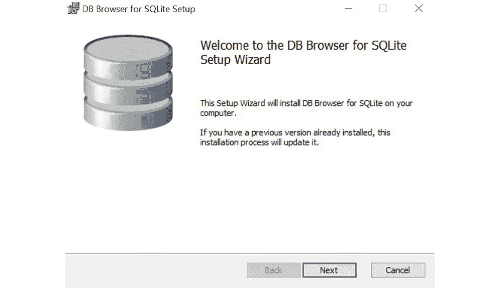
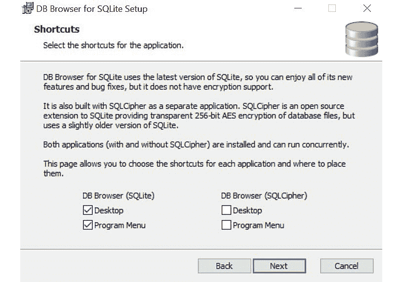
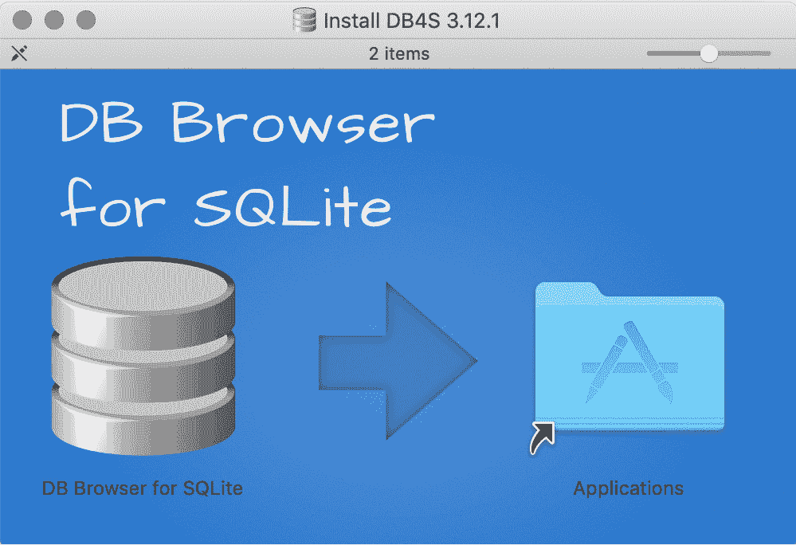
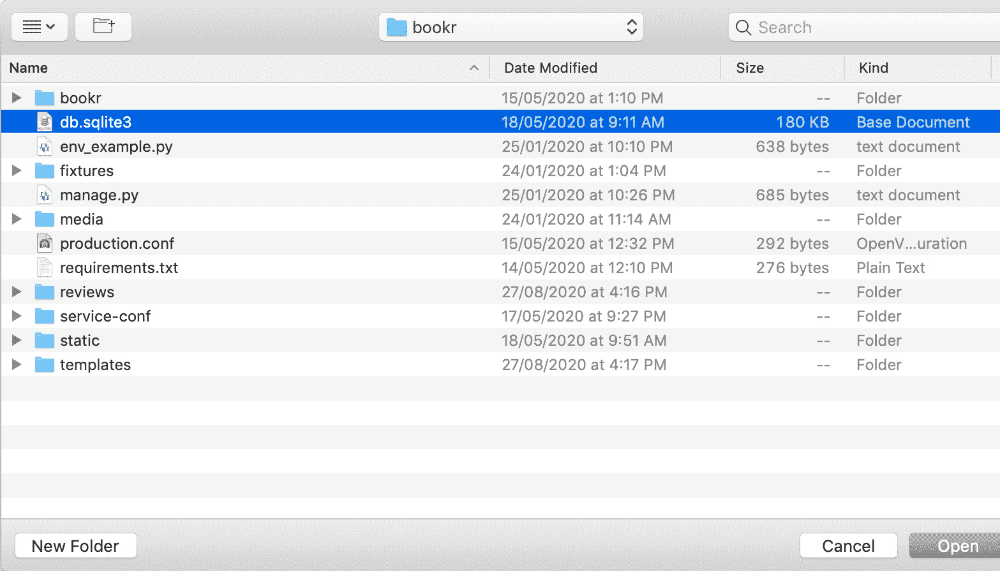
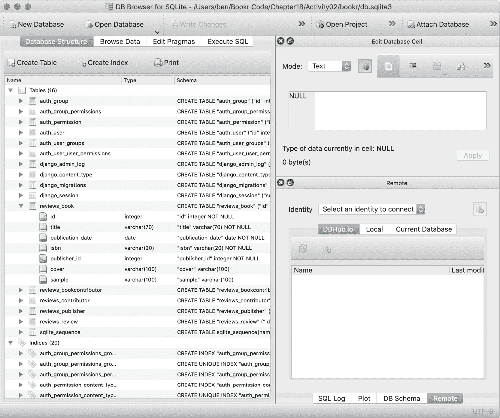
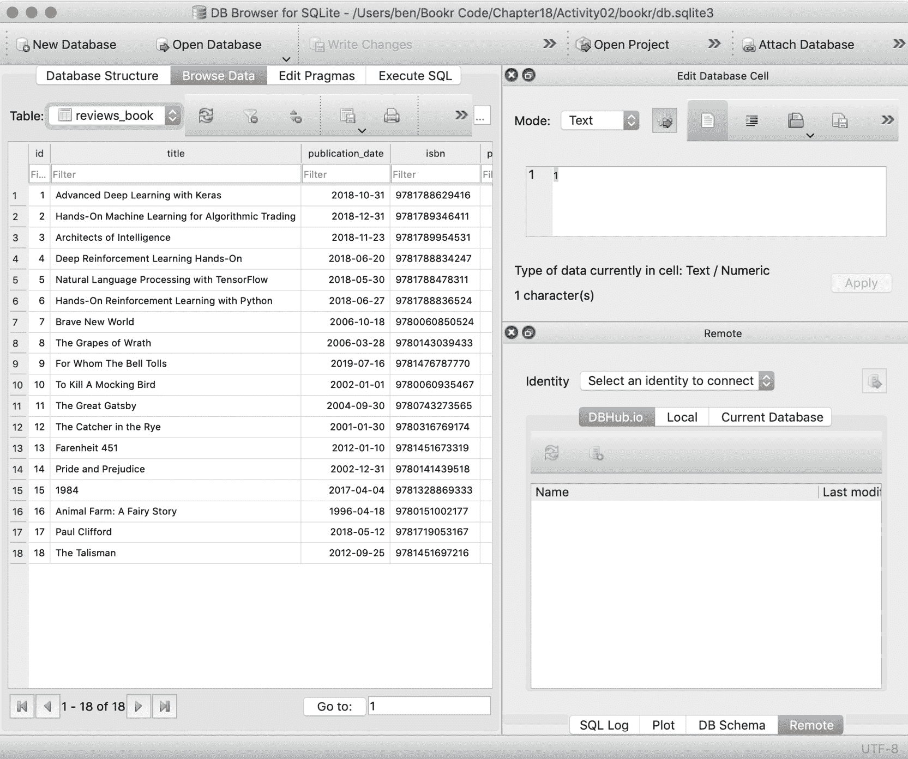
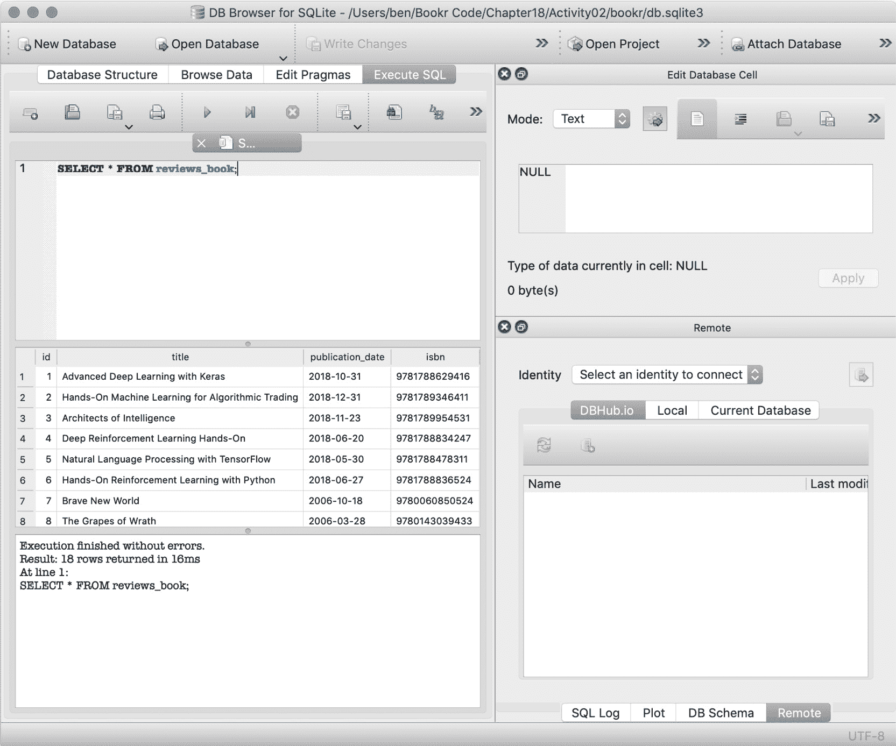
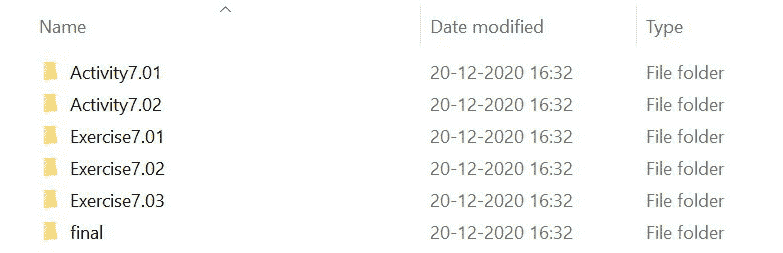
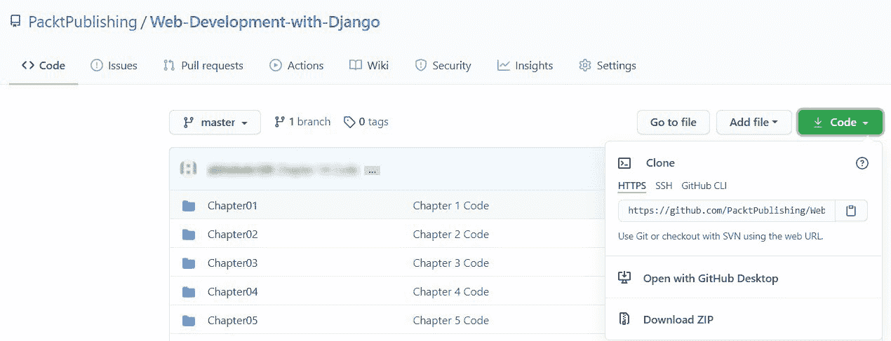

# 前言

# 关于本书

你是否想要开发可靠且安全的应用程序，脱颖而出，而不是花费数小时在样板代码上？如果是这样，Django 框架是你应该开始的地方。通常被称为“内置电池”的 Web 开发框架，Django 包含了构建独立应用程序所需的所有核心功能。

《使用 Django 进行 Web 开发》秉承这一理念，并为你提供所需的知识和信心，以便使用 Python 构建现实世界的应用程序。

从 Django 的基本概念开始，你将通过构建一个名为 Bookr 的网站来涵盖其主要功能——一个书评存储库。这个端到端的案例研究被分解成一系列小型的项目，以练习和活动的方式呈现，让你以愉快且可行的方式挑战自己。

随着你不断进步，你将学习各种实用技能，包括如何提供静态文件以添加 CSS、JavaScript 和图像到你的应用程序，如何实现表单以接受用户输入，以及如何管理会话以确保可靠的用户体验。在这本书中，你将涵盖现实世界 Web 应用程序开发周期中的关键日常任务。

在本书结束时，你将拥有技能和信心，以创造性地使用 Django 处理你自己的雄心勃勃的项目。

## 关于作者

*本·肖*是新西兰奥克兰的软件工程师。他作为一名开发者工作了超过 14 年，自 2007 年以来一直在使用 Django 构建网站。在这段时间里，他的经验帮助了许多不同类型的公司，从小型初创公司到大型企业。他还对机器学习、数据科学、自动化部署和 DevOps 感兴趣。在不编程的时候，本喜欢户外运动，并享受与他的伴侣和儿子共度时光。

*萨乌拉布·巴德瓦尔*是一位基础设施工程师，他致力于构建提高开发者生产力的工具和框架。他工作的很大一部分是使用 Python 开发能够扩展到数千个并发用户的服务。他目前在 LinkedIn 工作，负责基础设施性能工具和服务。

*安德鲁·伯德*是 Vesparum Capital 的数据和分析经理。他领导 Vesparum 的软件和数据科学团队，负责 Django/React 的全栈 Web 开发。他是一位澳大利亚精算师（FIAA，CERA），之前曾在金融服务领域的德勤咨询公司工作。安德鲁目前还在 Draftable Pvt. Ltd.担任全栈开发者，他自愿管理 Effective Altruism Australia 网站捐赠门户的持续开发。安德鲁还合著了我们最畅销的标题之一，“Python 研讨会”。

*巴拉特·查德拉·K·S* 住在澳大利亚悉尼，拥有超过 10 年的软件行业经验。他对使用 Python 栈进行软件开发非常热情，包括 Flask 和 Django 等框架。他既有与单体架构合作的经验，也有与微服务架构合作的经验，并构建了各种面向公众的应用程序和数据处理后端系统。当他不忙于编写软件应用程序时，他喜欢烹饪食物。

*克里斯·古斯特* 20 年前开始学习 Python 编程，那时它还是一门鲜为人知的学术语言。从那时起，他在出版、酒店、医疗和学术领域使用了他的 Python 知识。在他的职业生涯中，他与许多 Python 网络开发框架合作，包括 Zope、TurboGears、web2py 和 Flask，尽管他仍然更喜欢 Django。

## 本书面向对象

《使用 Django 进行 Web 开发》是为那些希望使用 Django 框架获得 Web 开发技能的程序员设计的。为了完全理解本书中解释的概念，你应该具备基本的 Python 编程知识，以及熟悉 JavaScript、HTML 和 CSS。

## 关于章节

第一章，*Django 简介*，首先立即设置 Django 项目。你将学习如何启动 Django 项目，响应 Web 请求，并使用 HTML 模板。

第二章，*模型和迁移*，介绍了 Django 数据模型，这是将数据持久化到 SQL 数据库的方法。

第三章，*URL 映射、视图和模板*，基于第一章，*Django 简介*中介绍的技术，更深入地解释了如何将 Web 请求路由到 Python 代码并渲染 HTML 模板。

第四章，*Django 管理器简介*，展示了如何使用 Django 内置的 Admin GUI 来创建、更新和删除由你的模型存储的数据。

第五章，*服务静态文件*，解释了如何通过添加样式和图像来增强你的网站，以及 Django 如何使管理这些文件变得更容易。

第六章，*表单*，展示了如何通过使用 Django 的表单模块在你的网站上收集用户输入。

第七章，*高级表单验证和模型表单*，在第六章，*表单*的基础上，增加了更高级的验证逻辑，使你的表单更强大。

第八章，*媒体服务和文件上传*，展示了如何通过允许用户上传文件并使用 Django 提供这些文件来进一步增强网站。

第九章，*会话和认证*，介绍了 Django 会话，并展示了如何使用它来存储用户数据并验证用户。

第十章，*高级 Django 管理器和定制*，从第四章，*Django 管理器简介*继续。现在你更了解 Django 了，你可以使用高级功能来定制 Django 管理器。

第十一章，*高级模板和基于类的视图*，让你看到如何通过使用 Django 的一些高级模板特性和类来减少你需要编写的代码量。

*第十二章*，*构建 REST API*，向您展示了如何将 REST API 添加到 Django 中，以便从不同的应用程序以编程方式访问您的数据。

*第十三章*，*生成 CSV、PDF 和其他二进制文件*，通过展示如何使用 Django 生成不仅仅是 HTML 的内容，进一步扩展了 Django 的功能。

*第十四章*，*测试*，是现实世界开发的一个重要部分。本章展示了如何使用 Django 和 Python 测试框架来验证您的代码。

*第十五章*，*Django 第三方库*，向您介绍了许多社区构建的 Django 库，展示了如何使用现有的第三方代码快速为您的项目添加功能。

*第十六章*，*在 Django 中使用前端 JavaScript 库*，通过集成 React 和在第十二章*构建 REST API*中创建的 REST API，为您的网站带来交互性。

*第十七章*，*Django 应用程序部署（第一部分 - 服务器设置*），通过设置您自己的服务器开始部署应用程序的过程。这也是一个附加章节，可以从本书的 GitHub 仓库中下载。

*第十八章*，*部署 Django 应用程序（第二部分 - 配置和代码部署*），通过向您展示如何将项目部署到虚拟服务器来结束项目。这也是一个附加章节，可以从本书的 GitHub 仓库中下载。

## 习惯用法

文本中的代码单词、数据库表名、文件夹名、文件名、文件扩展名、路径名、虚拟 URL 和用户输入如下所示：“它通过在命令行上运行带有`startproject`参数的`django-admin.py`命令来创建和构建。”

您在屏幕上看到的单词，例如在菜单或对话框中，也在文本中如下所示：“在左侧的`首选项列表`窗格中，打开`项目：Bookr`项，然后单击`项目解释器`。”

代码块设置如下：

```py
urlpatterns = [path('admin/', admin.site.urls),\
               path('', reviews.views.index)]
```

在输入和执行某些代码立即给出输出的情况下，这如下所示：

```py
>>> qd.getlist("k")
['a', 'b', 'c']
```

在前面的例子中，输入的代码是 `qd.getlist("k")`，输出是 `['a', 'b', 'c']`。

新术语和重要词汇如下所示：“Django 模型定义了您应用程序的数据，并通过**对象关系映射器**（**ORM**）提供对 SQL 数据库访问的抽象层。”

涵盖多行的代码行使用反斜杠（\）进行分割。当代码执行时，Python 将忽略反斜杠，并将下一行的代码视为当前行的直接延续。

例如：

```py
urlpatterns = [path('admin/', admin.site.urls), \ 
               path('', reviews.views.index)]
```

长代码片段将被截断，并在截断代码的顶部放置相应的 GitHub 代码文件名称。整个代码的永久链接放置在代码片段下方。它应该如下所示：

```py
settings.py
INSTALLED_APPS = ['django.contrib.admin',\
                  'django.contrib.auth',\
                  'django.contrib.contenttypes',\
                  'django.contrib.sessions',\
                  'django.contrib.messages',\
                  'django.contrib.staticfiles',\
                  'reviews']
The full code can be found at http://packt.live/2Kh58RE.
```

## 在开始之前

每一段伟大的旅程都始于一个谦卑的步伐。在我们能够使用 Django 做出令人惊叹的事情之前，我们需要准备好一个高效的环境。在本节中，我们将了解如何做到这一点。

## 安装 Python

在使用 Django 3 版本或更高版本之前，您需要在您的计算机上安装 Python 3。Mac 和 Linux 操作系统通常已经安装了某些版本的 Python，但最好确保您正在运行最新版本。在 Mac 上，对于 Homebrew 用户，您只需输入以下命令：

```py
$ brew install python
```

在基于 Debian 的 Linux 发行版中，您可以通过输入以下命令来检查哪个版本可用：

```py
$ apt search python3
```

根据输出，您可以输入类似以下的内容：

```py
$ sudo apt install python3 python3-pip
```

对于 Windows，您可以从这里下载 Python 3 安装程序：[`www.python.org/downloads/windows/`](https://www.python.org/downloads/windows/)。一旦您有了安装程序，点击它以运行，然后按照说明进行。务必选择 **将 Python 3.x 添加到 PATH** 选项。

安装完成后，从命令提示符中，您可以运行 `python` 来启动 Python 解释器。

注意，在 macOS 和 Linux 上，根据您的配置，`python` 命令可能会启动 Python 2 版本或 Python 3 版本。为了确保正确，请确保指定 `python3`。在 Windows 上，您只需运行 `python` 即可，因为这总是会启动 Python 3 版本。

类似地，使用 `pip` 命令。在 macOS 和 Linux 上，指定 `pip3`；在 Windows 上，只需 `pip`。

## 安装 PyCharm 社区版

在《使用 Django 进行 Web 开发》中，我们将使用 PyCharm **连续版**（**CE**）作为我们的 **集成开发环境**（**IDE**）来编辑我们的代码以及运行和调试它。它可以从 [`www.jetbrains.com/pycharm/download/`](https://www.jetbrains.com/pycharm/download/) 下载。一旦您有了安装程序，按照您操作系统的常规方法进行安装说明。

您可以在以下链接中找到 macOS、Linux 和 Windows 的详细安装说明：[`www.jetbrains.com/help/pycharm/installation-guide.html#standalone`](https://www.jetbrains.com/help/pycharm/installation-guide.html#standalone)。PyCharm 的系统要求可以在这里找到：[`www.jetbrains.com/help/pycharm/installation-guide.html#requirements`](https://www.jetbrains.com/help/pycharm/installation-guide.html#requirements)。有关安装后访问 PyCharm 的更多信息，您可以点击此链接：[`www.jetbrains.com/help/pycharm/run-for-the-first-time.html`](https://www.jetbrains.com/help/pycharm/run-for-the-first-time.html)。

## virtualenv

虽然不是必需的，但我们建议使用 Python 虚拟环境，这将使 *使用 Django 进行 Web 开发* 的 Python 包与您的系统包分开。

首先，我们将探讨如何在 macOS 和 Linux 上设置虚拟环境。需要安装 `virtualenv` Python 包，这可以通过 `pip3` 完成：

```py
$ pip3 install virtualenv
```

然后，我们可以在当前目录中创建一个虚拟环境：

```py
$ python3 -m virtualenv <virtualenvname>
```

一旦创建了虚拟环境，我们需要源码它，以便当前终端知道使用该环境的 Python 和包。这样做的方式如下：

```py
$ source <virtualenvname>/bin/activate
```

在 Windows 上，我们可以使用内置的`venv`库，它的工作方式类似。我们不需要安装任何东西。要创建当前目录中的虚拟环境，我们可以运行以下命令：

```py
> python -m venv <virtualenvname>
```

一旦创建，使用新虚拟环境中的`Scripts`目录内的激活脚本激活它：

```py
> <virtualenvname>\Scripts\activate
```

在 macOS、Linux 和 Windows 上，你会知道虚拟环境已经激活，因为它的名称（括号内）将出现在提示符之前。例如：

```py
(virtualenvname) $ 
```

## 安装 Django

激活你的虚拟环境后，使用`pip3`或`pip`（取决于你的操作系统）安装 Django：

```py
(virtualenvname)$ pip3 install django
```

只要你的虚拟环境已经激活，它将使用该环境中的`pip`版本，并在该环境中安装包。

## Django 3.0 和 Django 3.1

从 Django 3.1 开始，Django 的作者改变了在 Django 设置文件中连接路径的方法。我们将在*第一章*，*Django 简介*中深入解释设置文件，但你现在只需要知道这个文件叫做`settings.py`。

在早期版本中，`BASE_DIR`设置变量（你的项目在磁盘上的路径）被创建为一个字符串，如下所示：

```py
BASE_DIR = os.path.dirname(os.path.dirname(os.path.abspath(__file__)))
```

`os`包被导入到`settings.py`中，路径使用`os.path.join`函数连接。例如：

```py
STATIC_ROOT = os.path.join(BASE_DIR, "static")  # Django 3.0 and earlier
```

在 Django 3.1 中，`BASE_DIR`现在是一个`pathlib.Path`对象。它被这样分配：

```py
BASE_DIR = Path(__file__).resolve().parent.parent
```

可以使用`pathlib.Path`重载的`/`（除法）运算符将路径对象和字符串连接起来：

```py
STATIC_ROOT = BASE_DIR / "static"  # Django 3.1+
```

`os.path.join`函数也可以用来连接`pathlib.Path`对象，前提是它已经被导入到`settings.py`中。

由于今天大多数生产中的 Django 项目使用的是 3.1 之前的 Django 版本，我们选择在整个书中使用`os.path.join`函数来连接路径。当你创建一个新的 Django 项目时，它将使用 Django 的最新版本，这个版本将高于 3.1。因此，为了确保兼容性，你只需确保在`settings.py`的开头添加一行来导入`os`模块，如下所示：

```py
import os
```

一旦添加，你就可以按照书中的说明进行操作，无需修改。我们也会在你开始使用`settings.py`时提醒你进行此更改。

除了这个小的添加之外，无需对本书中的代码示例、练习和活动进行任何修改，以支持 Django 3.0 或 3.1。虽然我们永远不能 100%确定，但我们相信这段代码也会与 Django 的未来版本兼容。

## SQLite 数据库浏览器

本书在开发项目时使用 SQLite 作为磁盘数据库。Django 提供了一个命令行接口，使用文本命令访问其数据，但 GUI 应用程序也可供使用，使数据浏览更加友好。

我们推荐的工具是**DB Browser for SQLite**，或简称**DB Browser**。它是一个跨平台（Windows、macOS 和 Linux）的图形用户界面应用程序。

## 在 Windows 上安装

1.  从 [`sqlitebrowser.org/dl/`](https://sqlitebrowser.org/dl/) 下载适用于正确架构的 Windows（32 位或 64 位）的安装程序。

1.  运行下载的安装程序并遵循设置向导的说明：

    图 0.1：设置向导页面

1.  接受`最终用户许可协议`后，你将被要求选择应用程序的快捷方式。建议你为 DB Browser 启用`桌面`和`程序菜单`快捷方式，以便安装后更容易找到应用程序：

    图 0.2：可以在此选择应用程序快捷方式的页面

1.  在安装过程中，只需在每个屏幕上点击`下一步`即可遵循默认设置。

1.  如果你没有在*步骤 3*中添加`程序菜单`或`桌面`快捷方式，那么你需要在`C:\Program Files\DB Browser for SQLite`中找到 DB Browser。

## 在 macOS 上安装

1.  从 [`sqlitebrowser.org/dl/`](https://sqlitebrowser.org/dl/) 下载适用于 macOS 的应用程序磁盘镜像。

1.  下载完成后，打开磁盘镜像。你会看到一个像这样的窗口：

    图 0.3：磁盘镜像

    将`DB Browser for SQLite`应用程序拖放到`应用程序`文件夹中以安装它。

1.  安装完成后，您可以从`应用程序`文件夹中启动`DB Browser for SQLite`。

## 在 Linux 上安装

Linux 的安装说明将取决于你使用的发行版。你可以在 [`sqlitebrowser.org/dl/`](https://sqlitebrowser.org/dl/) 找到说明。

## 使用 DB Browser

这里有一些屏幕截图展示了 DB Browser 的几个功能。这些截图是在 macOS 上拍摄的，但在所有平台上行为相似。打开后的第一步是选择你的 SQLite 数据库文件：



图 0.4：数据库打开对话框

一旦打开数据库文件，我们就可以在`数据库结构`标签页中探索其结构。*图 0.5*展示了这一点：



图 0.5：展开一个表的数据库结构

在前面的屏幕截图中，`reviews_book`表已被展开，以便我们可以看到其表结构。我们还可以通过切换到`浏览数据`标签来浏览表内的数据：



图 0.6：reviews_book 表中的数据

我们可能想要做的最后一件事是执行 SQL 命令（你将在*第二章*，*模型和迁移*中了解这些）。这是在`执行 SQL`标签页中完成的：



图 0.7：执行 SQL 命令的结果

*图 0.7* 展示了执行 SQL 语句 `SELECT * FROM reviews_book` 的结果。

如果你现在还不确定这一切意味着什么（在这个阶段，你甚至还没有 SQLite 文件来尝试），等你开始学习 Django 模型、数据库和 SQL 查询时，一切就会更加清晰。*第二章*，*模型和迁移*，是你开始使用 DB Browser 的工作的地方。

## Bookr 项目

在整本书中，你将逐步构建一个名为 **Bookr** 的应用。它旨在让用户浏览和添加书评（以及书籍）。随着你完成每一章的练习和活动，你将为应用添加更多功能。本书的 GitHub 仓库包含练习和活动的单独文件夹。这些文件夹通常包括应用代码发生变化的文件。

## 最终目录

每一章的代码都将有一个名为 `final` 的目录。这个目录将包含从该章节开始到结束期间为应用编写的所有代码。例如，*第五章*，*服务静态文件* 的 `final` 文件夹将包含 Bookr 应用直到该章节结束的完整代码。这样，如果你丢失了进度，你可以使用 `final` 文件夹中的代码，比如 `第五章` 的，来开始 `第六章`。

以下截图显示了从 GitHub 仓库下载代码到磁盘后章节的目录结构将如何出现（有关如何从仓库下载代码的更多详细信息，请参阅 *安装代码包* 部分）：




图 0.8：Bookr 的章节级目录结构

## 填充数据

当你到达 *第二章*，*模型和迁移* 时，建议你使用我们提供的样本书籍列表填充你的数据库，以确保你的最终结果与我们的结果大致相似。确保你不会跳过 *第二章*，*模型和迁移* 中名为 *填充 Bookr 数据库* 的部分，其中我们提供了一个小脚本，让你可以快速填充数据库。

## 安装代码包

从 GitHub 在 [`packt.live/3nIWPvB`](http://packt.live/3nIWPvB) 下载代码文件。请参考这些代码文件以获取完整的代码包。这里的文件包含练习、活动、活动解决方案、额外章节以及每个章节的一些中间代码。

在 GitHub 仓库的页面上，你可以点击绿色的 `Code` 按钮，然后点击 `Download ZIP` 选项，将完整的代码作为 ZIP 文件下载到你的磁盘上（有关如何从仓库下载代码的更多详细信息，请参阅 *安装代码包* 部分）。然后，你可以将这些代码文件解压到你选择的文件夹中，例如，`C:\Code`：




图 0.9：下载 ZIP 选项

## 联系我们

欢迎读者反馈。

`customercare@packtpub.com`。

**勘误**: 尽管我们已经尽最大努力确保内容的准确性，但错误仍然可能发生。如果您在这本书中发现了错误，如果您能向我们报告，我们将不胜感激。请访问 [www.packtpub.com/support/errata](http://www.packtpub.com/support/errata) 并填写表格。

`copyright@packt.com` 并附上相关材料的链接。

**如果您有兴趣成为作者**: 如果您在某个领域有专业知识，并且您有兴趣撰写或为书籍做出贡献，请访问 [authors.packtpub.com](http://authors.packtpub.com)。

## 请留下评论

通过在亚马逊上留下详细、公正的评论来告诉我们您的想法。我们感谢所有反馈——它帮助我们继续制作优质产品并帮助有抱负的开发者提升技能。请抽出几分钟时间留下您的想法——这对我们来说意义重大。
