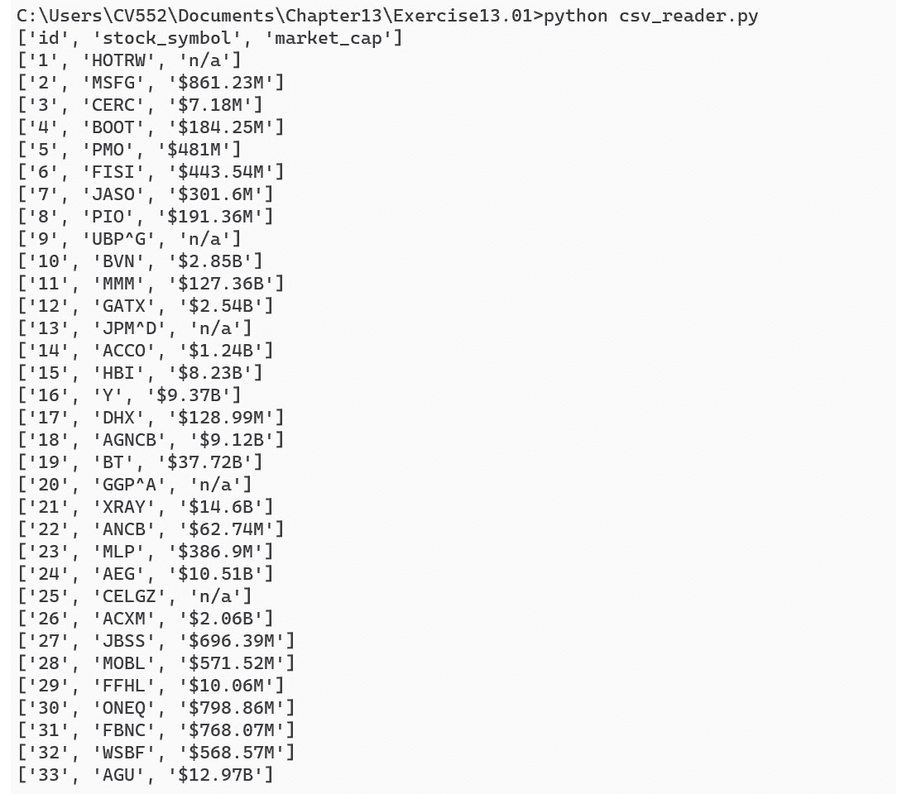
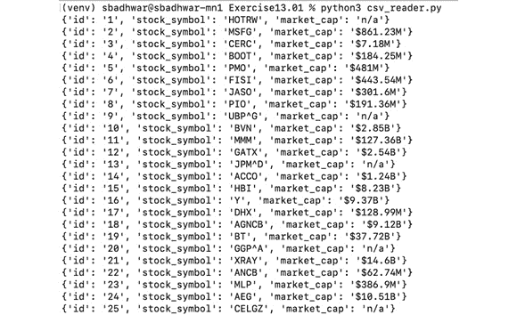
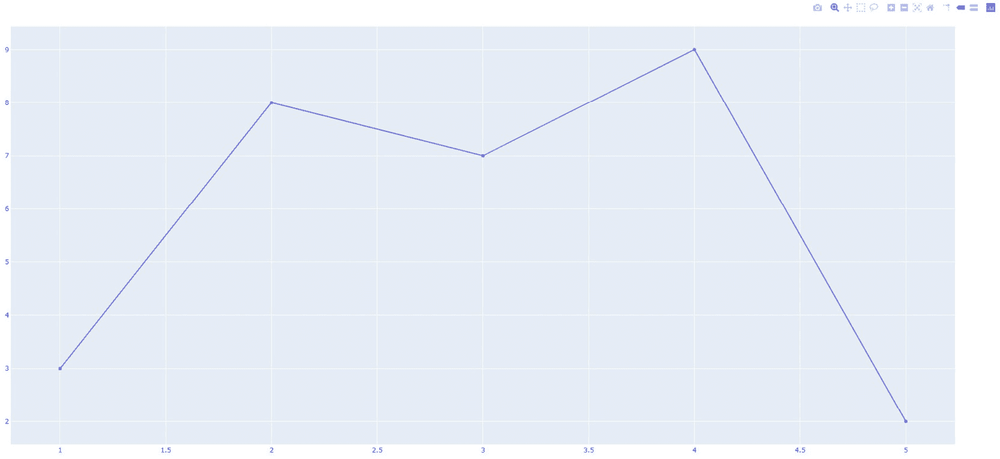

# 第十三章：13. 生成 CSV、PDF 以及其他二进制文件

概述

本章将教会你如何使用 Python 中的一些常用库生成不同数据格式的文件，例如 **CSV**、**PDF** 以及其他二进制文件格式（例如，兼容 Excel 的文件）。这些知识将帮助你构建允许用户将网站上的记录导出并下载到熟悉的 CSV 或 Excel 格式的 Web 项目。你还将学习如何在 Python 中生成图表，并将其渲染为 HTML，在 Web 应用程序中显示。此外，你将能够构建允许用户以 PDF 格式导出数据的特性。

# 简介

到目前为止，我们已经学习了 Django 框架的各个方面，并探讨了如何使用 Django 构建具有我们所需的所有功能和自定义的 Web 应用程序。

假设我们在构建 Web 应用程序时需要进行分析并准备一些报告。我们可能需要分析用户的人口统计信息，了解平台的使用情况，或者生成可以输入到机器学习系统中以寻找模式的数据。我们希望我们的网站能够以表格形式显示我们分析的一些结果，并以详细的图表和图形显示其他结果。此外，我们还希望允许我们的用户将报告导出，并在 Jupyter Notebook 和 Excel 等应用程序中进一步查看。

随着我们逐步学习本章内容，我们将了解如何将这些想法付诸实践，并在我们的 Web 应用程序中实现功能，使我们能够通过使用 **逗号分隔值**（**CSV**）文件或 Excel 文件将记录导出为结构化格式，如表格。我们还将学习如何允许我们的用户生成我们存储在 Web 应用程序中的数据的视觉表示，并将其导出为 PDF 格式，以便可以轻松分发以供快速参考。

让我们从学习如何在 Python 中处理 CSV 文件开始我们的旅程。掌握这项技能将帮助我们创建允许我们的读者将我们的数据导出以进行进一步分析的功能。

## 在 Python 中处理 CSV 文件

我们可能需要将应用程序中的数据导出出去，原因有很多。其中一个原因可能涉及对该数据进行分析——例如，我们可能需要了解在应用程序上注册的用户的人口统计信息或提取应用程序使用的模式。我们可能还需要了解我们的应用程序对用户的工作情况，以便设计未来的改进。这些用例需要数据以易于消费和分析的格式存在。在这里，CSV 文件格式就派上用场了。

CSV 是一种方便的文件格式，可以用于快速将数据从应用程序中以行和列的格式导出。CSV 文件通常使用简单的分隔符来分隔数据，这些分隔符用于区分一列与另一列，以及换行符，用于在表格内指示新记录（或行）的开始。

Python 的标准库通过`csv`模块提供了对 CSV 文件的良好支持。这种支持使得读取、解析和写入 CSV 文件成为可能。让我们看看我们如何利用 Python 提供的 CSV 模块来处理 CSV 文件，并从中读取和写入数据。

# 使用 Python 的 CSV 模块

Python 的`csv`模块为我们提供了与 CSV 格式文件交互的能力，CSV 格式实际上是一种文本文件格式。也就是说，存储在 CSV 文件中的数据是可读的。

`csv`模块要求在应用`csv`模块提供的方法之前打开文件。让我们看看我们如何从读取 CSV 文件的基本操作开始。

## 从 CSV 文件读取数据

从 CSV 文件读取数据相当简单，包括以下步骤：

1.  首先，我们打开文件：

    ```py
    csv_file = open('path to csv file')
    ```

    这里，我们使用 Python 的`open()`方法读取文件，然后将要读取数据的文件名传递给它。

1.  然后，我们使用`csv`模块的`reader`方法从`file`对象中读取数据：

    ```py
    import csv
    csv_data = csv.reader(csv_file)
    ```

    在第一行，我们导入了`csv`模块，它包含处理 CSV 文件所需的方法集：

    ```py
    import csv
    ```

    文件打开后，下一步是使用`csv`模块的`reader`方法创建一个 CSV`reader`对象。此方法接受由`open()`调用返回的`file`对象，并使用该`file`对象从 CSV 文件中读取数据：

    ```py
    csv_reader = csv.reader(csv_file)
    ```

    通过`reader()`方法读取的数据以列表的列表形式返回，其中每个子列表是一个新记录，列表中的每个值都是指定列的值。通常，列表中的第一个记录被称为标题，它表示 CSV 文件中存在的不同列，但 CSV 文件中不需要有`header`字段。

1.  一旦数据被`csv`模块读取，我们就可以遍历这些数据以执行我们可能需要的任何操作。这可以按照以下方式完成：

    ```py
    for csv_record in csv_data:
        # do something
    ```

1.  一旦处理完成，我们可以通过在 Python 的文件处理对象中调用`close()`方法简单地关闭 CSV 文件：

    ```py
    csv_file.close()
    ```

现在，让我们看看我们的第一个练习，我们将实现一个简单的模块，帮助我们读取 CSV 文件并将内容输出到屏幕上。

## 练习 13.01：使用 Python 读取 CSV 文件

在这个练习中，你将使用 Python 的内置`csv`模块在 Python 中读取并处理 CSV 文件。CSV 文件包含几家纳斯达克上市公司虚构的市场数据：

1.  首先，通过点击以下链接从本书的 GitHub 存储库下载`market_cap.csv`文件：[`packt.live/2MNWzOV`](http://packt.live/2MNWzOV)。

    注意

    CSV 文件由随机生成数据组成，并不对应任何历史市场趋势。

1.  一旦文件下载完成，打开它并查看其内容。您会发现文件包含一组以逗号分隔的值，每个不同的记录都在自己的行上：

    图 13.1：市值 CSV 文件内容

1.  一旦文件下载完成，您可以继续编写第一段代码。为此，在 CSV 文件下载的同一目录中创建一个名为 `csv_reader.py` 的新文件，并在其中添加以下代码：

    ```py
    import csv
    def read_csv(filename):
        """Read and output the details of CSV file."""
        try:
           with open(filename, newline='') as csv_file:
               csv_reader = csv.reader(csv_file)
               for record in csv_reader:
                   print(record)
        except (IOError, OSError) as file_read_error:
           print("Unable to open the csv file. Exception: {}".format(file_read_error))
    if __name__ == '__main__':
        read_csv('market_cap.csv')
    ```

    让我们尝试理解您在上面的代码片段中刚刚实现的内容。

    在导入 `csv` 模块后，为了使代码模块化，您创建了一个名为 `read_csv()` 的新方法，它接受一个参数，即从其中读取数据的文件名：

    ```py
    try:
           with open(filename, newline='') as csv_file:
    ```

    现在，如果您不熟悉前面代码片段中显示的文件打开方法，这也被称为 `with` 块将有权访问 `file` 对象，一旦代码退出 `with` 块的作用域，文件将自动关闭。

    ```py
    for record in csv_reader:
        print(record)
    ```

    完成此操作后，您需要编写入口点方法，您的代码将从该方法开始执行，通过调用 `read_csv()` 方法并传递要读取的 CSV 文件名：

    ```py
    if __name__ == '__main__':
        read_csv(market_cap.csv')
    ```

1.  使用这些步骤，您现在可以解析您的 CSV 文件了。您可以通过在终端或命令提示符中运行您的 Python 文件来完成此操作，如下所示：

    ```py
    python3 csv_reader.py
    ```

    注意

    或者，在 Windows 上，如 *图 13.2* 所示，使用 **python csv_reader.py**。

    代码执行后，您应该会看到以下输出：

    

图 13.2：CSV 读取程序输出

通过这种方式，现在您已经知道了如何读取 CSV 文件内容。同时，如您从 *练习 13.01* 的输出中看到，使用 Python 读取 CSV 文件，单个行的输出以列表的形式表示。

现在，让我们看看如何使用 Python 的 `csv` 模块创建新的 CSV 文件。

## 使用 Python 写入 CSV 文件

在上一节中，我们探讨了如何使用 Python 的 `csv` 模块读取 CSV 格式文件的 内容。现在，让我们学习如何将 CSV 数据写入文件。

写入 CSV 数据的方法与从 CSV 文件读取类似，但有细微差别。以下步骤概述了将数据写入 CSV 文件的过程：

1.  以写入模式打开文件：

    ```py
    csv_file = open('path to csv file', 'w')
    ```

1.  获取一个 CSV 写入器对象，这可以帮助我们写入正确格式化的 CSV 格式的数据。这是通过调用 `csv` 模块的 `writer()` 方法来完成的，它返回一个 `writer` 对象，可以用来将 CSV 格式兼容的数据写入 CSV 文件：

    ```py
    csv_writer = csv.writer(csv_file)
    ```

1.  一旦 `writer` 对象可用，我们就可以开始写入数据。这可以通过 `writer` 对象的 `write_row()` 方法来实现。`write_row()` 方法接收一个值列表，将其写入 CSV 文件。列表本身表示一行，列表内的值表示列的值：

    ```py
    record = ['value1', 'value2', 'value3']
    csv_writer.writerow(record)
    ```

    如果你想在单次调用中写入多个记录，你也可以使用 CSV 写入器的 `writerows()` 方法。`writerows()` 方法的行为类似于 `writerow()` 方法，但它接受一个列表的列表，可以一次写入多行：

    ```py
    records = [['value11', 'value12', 'value13'],\
               ['value21', 'value22', 'value23']]
    csv_writer.writerows(records)
    ```

1.  记录写入后，我们可以关闭 CSV 文件：

    ```py
    csv_file.close()
    ```

现在，让我们应用我们学到的知识，并实现一个程序，帮助我们向 CSV 文件写入值。

## 练习 13.02：使用 Python 的 csv 模块生成 CSV 文件

在这个练习中，你将使用 Python 的 `csv` 模块来创建新的 CSV 文件：

1.  创建一个名为 `csv_writer.py` 的新文件，在这个文件中，你需要编写 CSV 写入器的代码。在这个文件中，添加以下代码：

    ```py
    import csv
    def write_csv(filename, header, data):
        """Write the provided data to the CSV file.
        :param str filename: The name of the file \
            to which the data should be written
        :param list header: The header for the \
            columns in csv file
        :param list data: The list of list mapping \
            the values to the columns
        """
        try:
            with open(filename, 'w') as csv_file:
                csv_writer = csv.writer(csv_file)
                csv_writer.writerow(header)
                csv_writer.writerows(data)
        except (IOError, OSError) as csv_file_error:
            print\
            ("Unable to write the contents to csv file. Exception: {}"\
             .format(csv_file_error))
    ```

    使用这段代码，你现在应该能够轻松地创建新的 CSV 文件。现在，一步一步地，让我们理解你在这段代码中试图做什么：

    你定义了一个名为 `write_csv()` 的新方法，它接受三个参数：数据应写入的文件名（`filename`）、用作标题的列名列表（`header`），以及最后是一个列表，其中包含需要映射到各个列的数据（`data`）：

    ```py
     def write_csv(filename, header, data):
    ```

    现在，参数已经设置好了，下一步是打开需要写入数据的目标文件，并将其映射到一个对象：

    ```py
    with open(filename, 'w') as csv_file:
    ```

    文件打开后，你执行三个主要步骤：首先，使用 `csv` 模块的 `writer()` 方法获取一个新的 CSV 写入器对象，并将其传递给包含打开文件引用的文件处理器：

    ```py
    csv_writer = csv.writer(csv_file)
    ```

    下一步是使用 CSV 写入器的 `writerow()` 方法将数据集的标题字段写入文件：

    ```py
    csv_writer.writerow(header)
    ```

    在写入标题之后，最后一步是将数据写入 CSV 文件，针对现有的各个列。为此，使用 `csv` 模块的 `writerows()` 方法一次性写入多行：

    ```py
    csv_writer.writerows(data)
    ```

    注意

    我们也可以通过将标题和数据合并为数据列表的第一个元素，并使用数据列表作为参数调用 `writerows()` 方法，将写入标题和数据的一步合并为单行代码。

1.  当你创建了可以将提供的数据写入 CSV 文件的方法后，你编写入口点调用的代码，并在其中设置标题、数据和文件名字段的值，最后调用你之前定义的 `write_csv()` 方法：

    ```py
    if __name__ == '__main__':
        header = ['name', 'age', 'gender']
        data = [['Richard', 32, 'M'], \
                ['Mumzil', 21, 'F'], \
                ['Melinda', 25, 'F']]
        filename = 'sample_output.csv'
        write_csv(filename, header, data)
    ```

1.  现在代码已经就绪，执行你刚刚创建的文件，看看它是否创建了 CSV 文件。要执行，请运行以下命令：

    ```py
    python3 csv_writer.py
    ```

    执行完成后，你将看到在执行命令的同一目录下创建了一个新文件。当你打开文件时，内容应该类似于以下图示：

    

    

图 13.3：CSV 写入器示例输出 sample_output.csv

现在，你已经具备了读取和写入 CSV 文件内容的能力。

通过这个练习，我们学习了如何将数据写入 CSV 文件。现在，是时候看看一些增强功能，这些功能可以使作为开发者的您在读取和写入 CSV 文件时更加方便。

## 更好地读取和写入 CSV 文件的方法

现在，有一件重要的事情需要注意。如果您还记得，CSV 读取器读取的数据通常将值映射到列表。现在，如果您想访问单个列的值，您需要使用列表索引来访问它们。这种方式并不自然，并且会导致编写文件和读取文件之间的耦合度更高。例如，如果编写程序打乱了行的顺序怎么办？在这种情况下，您现在必须更新读取程序以确保它能够识别正确的行。因此，问题出现了，我们是否有更好的方法来读取和写入值，而不是使用列表索引，而是使用列名，同时保留上下文？

这个问题的答案是肯定的，解决方案由另一组名为`DictReader`和`DictWriter`的 CSV 模块提供，这些模块提供将 CSV 文件中的对象映射到`dict`的功能，而不是映射到列表。

此接口易于实现。让我们回顾一下您在*练习 13.01*，*使用 Python 读取 CSV 文件*中编写的代码。如果您想将代码解析为字典，`read_csv()`方法的实现需要按如下所示更改：

```py
def read_csv(filename):
    """Read and output the details of CSV file."""
    try:
       with open(filename, newline='') as csv_file:
           csv_reader = csv.DictReader(csv_file)
           for record in csv_reader:
               print(record)
    except (IOError, OSError) as file_read_error:
        print\
        ("Unable to open the csv file. Exception: {}"\
        .format(file_read_error))
```

您将注意到，我们做的唯一改变是将`csv.reader()`改为`csv.DictReader()`，这应该将 CSV 文件中的单独行表示为`OrderedDict`。您也可以通过进行此更改并执行以下命令来验证这一点：

```py
python3 csv_reader.py
```

这应该会产生以下输出：



图 13.4：使用 DictReader 的输出

如前图所示，单独的行被映射为字典中的键值对。要访问这些单独的行中的字段，我们可以使用以下方法：

```py
print(record.get('stock_symbol'))
```

这应该会给出我们单个记录中的`stock_symbol`字段的值。

同样，您也可以使用`DictWriter()`接口将 CSV 文件操作为字典。为了了解这一点，让我们看看*练习 13.02*，*使用 Python 的 csv 模块生成 CSV 文件*中的`write_csv()`方法，并按如下方式修改它：

```py
def write_csv(filename, header, data):
    """Write the provided data to the CSV file.
    :param str filename: The name of the file \
        to which the data should be written
    :param list header: The header for the \
        columns in csv file
    :param list data: The list of dicts mapping \
        the values to the columns
    """
    try:
        with open(filename, 'w') as csv_file:
            csv_writer = csv.DictWriter(csv_file, fieldnames=header)
            csv_writer.writeheader()
            csv_writer.writerows(data)
    except (IOError, OSError) as csv_file_error:
        print\
        ("Unable to write the contents to csv file. Exception: {}"\
        .format(csv_file_error))
```

在前面的代码中，我们将`csv.writer()`替换为`csv.DictWriter()`，它提供了一个类似字典的接口来与 CSV 文件交互。`DictWriter()`还接受一个`fieldnames`参数，该参数用于在写入之前将 CSV 文件中的单独列映射。

接下来，为了写入这个标题，调用`writeheader()`方法，它将`fieldname`标题写入 CSV 文件。

最后的调用涉及`writerows()`方法，它接受一个字典列表并将其写入 CSV 文件。为了使代码正确运行，您还需要修改数据列表，使其类似于以下所示：

```py
data = [{'name': Richard, 'age': 32, 'gender': 'M'}, \
        {'name': Mumzil', 'age': 21, 'gender':'F'}, \
        {'name': 'Melinda', 'age': 25, 'gender': 'F'}]
```

通过这样，你将拥有足够的知识来在 Python 中处理 CSV 文件。

由于我们正在讨论如何处理表格数据，特别是将其读取和写入文件，让我们看看最著名的文件格式之一，由最流行的表格数据编辑器之一——微软 Excel——所使用。

# 使用 Python 处理 Excel 文件

微软 Excel 是簿记和表格记录管理领域的世界知名软件。同样，随着 Excel 一起引入的 XLSX 文件格式也迅速得到广泛采用，并且现在所有主要产品供应商都支持它。

你会发现微软 Excel 和其 XLSX 格式在许多公司的市场和销售部门中被广泛使用。比如说，对于某家公司的市场部门，你正在使用 Django 构建一个跟踪用户购买产品的网络门户。它还显示了关于购买的数据，例如购买时间和购买地点。市场和销售团队计划使用这些数据来生成潜在客户或创建相关的广告。

由于市场和销售团队大量使用 Excel，我们可能希望将我们网络应用内部的数据导出为 XLSX 格式，这是 Excel 的原生格式。很快，我们将探讨如何使我们的网站与这种 XLSX 格式协同工作。但在那之前，让我们快速了解一下二进制文件格式的用法。

## 数据导出的二进制文件格式

到目前为止，我们主要处理的是文本数据以及如何从文本文件中读取和写入这些数据。但通常，基于文本的格式是不够的。例如，想象一下你想导出一张图片或一个图表。你将如何用文本表示一张图片或一个图表，以及你将如何读取和写入这些图片？

在这些情况下，二进制文件格式可以为我们提供帮助。它们可以帮助我们读取和写入丰富的数据集。所有商业操作系统都提供对文本和二进制文件格式的原生支持，Python 提供了最灵活的实现之一来处理二进制数据文件，这并不令人惊讶。一个简单的例子是 `open` 命令，你使用它来指定你想要打开的文件格式：

```py
file_handler = open('path to file', 'rb')
```

在这里，`b` 表示二进制。

从本节开始，我们现在将处理如何处理二进制文件，并使用它们来表示和从我们的 Django 网络应用中导出数据。我们将首先查看的是由微软 Excel 使之流行的 XLSX 文件格式。

因此，让我们深入探讨如何使用 Python 处理 XLSX 文件。

## 使用 XlsxWriter 包处理 XLSX 文件

在本节中，我们将更深入地了解 XLSX 文件格式，并了解我们如何使用 **XlsxWriter** 包来与之协同工作。

### XLSX 文件

XLSX 文件是用于存储表格数据的二进制文件。这些文件可以被任何实现对该格式支持支持的软件读取。XLSX 格式将数据安排为两个逻辑分区：

+   `Example_file.xlsx`是一个工作簿**（1）**：![图 13.5：Excel 中的工作簿和工作表

    ![img/B15509_13_05.jpg]

图 13.5：Excel 中的工作簿和工作表

+   `Sheet1`和`Sheet2`是两个工作表**（2）**。

当处理 XLSX 格式时，这两个是我们通常工作的单元。如果你了解关系数据库，你可以将工作簿视为数据库，将工作表视为表。

有了这些，让我们尝试理解如何在 Python 中开始处理 XLSX 文件。

### XlsxWriter Python 包

Python 的标准库没有提供对 XLSX 文件的原生支持。但是，多亏了 Python 生态系统中的庞大开发者社区，我们很容易找到许多可以帮助我们管理 XLSX 文件交互的包。在这个类别中，一个流行的包是**XlsxWriter**。

`XlsxWriter`是由开发者社区积极维护的包，提供与 XLSX 文件交互的支持。该包提供了许多有用的功能，并支持创建和管理工作簿以及单个工作簿中的工作表。您可以通过在终端或命令提示符中运行以下命令来安装它：

```py
pip install XlsxWriter
```

安装完成后，你可以按照以下方式导入`xlsxwriter`模块：

```py
import xlsxwriter
```

因此，让我们看看如何利用`XlsxWriter`包开始创建 XLSX 文件。

### 创建工作簿

要开始处理 XLSX 文件，我们首先需要创建它们。XLSX 文件也称为工作簿，可以通过从`xlsxwriter`模块调用`Workbook`类来创建，如下所示：

```py
workbook = xlsxwriter.Workbook(filename)
```

对`Workbook`类的调用打开一个由`filename`参数指定的二进制文件，并返回一个`workbook`实例，可以用来进一步创建工作表和写入数据。

### 创建工作表

在我们开始向 XLSX 文件写入数据之前，我们首先需要创建一个工作表。这可以通过调用我们在上一步中获得的工作簿对象的`add_worksheet()`方法轻松完成：

```py
worksheet = workbook.add_worksheet()
```

`add_worksheet()`方法创建一个新的工作表，将其添加到工作簿中，并返回一个将工作表映射到 Python 对象的映射对象，通过这个对象我们可以将数据写入工作表。

### 向工作表写入数据

一旦有了工作表的引用，我们可以通过调用`worksheet`对象的`write`方法开始向其写入数据，如下所示：

```py
worksheet.write(row_num, col_num, col_value)
```

如您所见，`write()`方法接受三个参数：行号（`row_num`）、列号（`col_num`）以及属于`[row_num, col_num]`对的`col_value`表示的数据。这个调用可以重复进行，以将多个数据项插入到工作表中。

### 将数据写入工作簿

一旦所有数据都写入，为了最终确定写入的数据集并干净地关闭 XLSX 文件，您需要在工作簿上调用`close()`方法：

```py
workbook.close()
```

此方法写入文件缓冲区中可能存在的任何数据，并最终关闭工作簿。现在，让我们利用这些知识来实现我们自己的代码，这将帮助我们向 XLSX 文件写入数据。

进一步阅读

在本章中，无法涵盖`XlsxWriter`包提供的所有方法和功能。更多信息，您可以阅读官方文档：[`xlsxwriter.readthedocs.io/contents.html`](https://xlsxwriter.readthedocs.io/contents.html)。

## 练习 13.03：在 Python 中创建 XLSX 文件

在这个练习中，您将使用`XlsxWriter`包创建一个新的 Excel（XLSX）文件，并从 Python 向其中添加数据：

1.  对于这个练习，您需要在系统中安装`XlsxWriter`包。您可以通过在终端应用程序或命令提示符中运行以下命令来安装它：

    ```py
    pip install XlsxWriter
    ```

    一旦命令执行完毕，您将在系统中安装上该包。

1.  在安装了包之后，您就可以开始编写创建 Excel 文件的代码了。创建一个名为`xlsx_demo.py`的新文件，并在其中添加以下代码：

    ```py
    import xlsxwriter
    def create_workbook(filename):
        """Create a new workbook on which we can work."""
        workbook = xlsxwriter.Workbook(filename)
        return workbook
    ```

    在前面的代码片段中，您已创建了一个新的函数，该函数将帮助您创建一个新的工作簿，您可以在其中存储数据。一旦创建了新的工作簿，下一步就是创建一个工作表，它为您提供了组织要存储在 XLSX 工作簿中的数据的表格格式。

1.  在创建工作簿后，通过在您的`xlsx_demo.py`文件中添加以下代码片段来创建一个新的工作表：

    ```py
    def create_worksheet(workbook):
        """Add a new worksheet in the workbook."""
        worksheet = workbook.add_worksheet()
        return worksheet
    ```

    在前面的代码片段中，您已使用`XlsxWriter`包提供的`workbook`对象中的`add_worksheet()`方法创建了一个新的工作表。然后，这个工作表将被用来写入对象的数据。

1.  下一步是创建一个辅助函数，它可以协助将数据以表格格式写入工作表，该表格格式由行和列编号定义。为此，将以下代码片段添加到您的`xlsx_writer.py`文件中：

    ```py
    def write_data(worksheet, data):
        """Write data to the worksheet."""
        for row in range(len(data)):
            for col in range(len(data[row])):
                worksheet.write(row, col, data[row][col])
    ```

    在前面的代码片段中，您已创建了一个名为`write_data()`的新函数，该函数接受两个参数：需要写入的`worksheet`对象和表示为列表的列表的`data`对象，这些列表需要写入工作表。该函数遍历传递给它的数据，然后将数据写入其所属的行和列。

1.  现在所有核心方法都已实现，您现在可以添加一个可以帮助干净地关闭`workbook`对象的方法，这样数据就可以写入文件而不会发生任何文件损坏。为此，在`xlsx_demo.py`文件中实现以下代码片段：

    ```py
    def close_workbook(workbook):
        """Close an opened workbook."""
        workbook.close()
    ```

1.  练习的最后一步是将你在前几步中实现的所有方法集成在一起。为此，在你的 `xlsx_demo.py` 文件中创建一个新的入口点方法，如下面的代码片段所示：

    ```py
    if __name__ == '__main__':
        data = [['John Doe', 38], \
                ['Adam Cuvver', 22], \
                ['Stacy Martin', 28], \
                ['Tom Harris', 42]]
        workbook = create_workbook('sample_workbook.xlsx')
        worksheet = create_worksheet(workbook)
        write_data(worksheet, data)
        close_workbook(workbook)
    ```

    在前面的代码片段中，你首先创建了一个数据集，你希望将其以列表的形式写入 XLSX 文件。一旦完成，你获得了一个新的 `workbook` 对象，该对象将用于创建 XLSX 文件。在这个 `workbook` 对象内部，你创建了一个工作表来以行列格式组织你的数据，然后将数据写入工作表，并关闭工作簿以将数据持久化到磁盘。

1.  现在，让我们看看你编写的代码是否按预期工作。为此，运行以下命令：

    ```py
    python3 xlsx_demo.py
    ```

    一旦命令执行完毕，你将在命令执行的目录中看到一个名为 `sample_workbook.xlsx` 的新文件被创建。为了验证它是否包含正确的结果，你可以用 Microsoft Excel 或 Google Sheets 打开此文件，查看内容。它应该看起来像这里所示：

    ![图 13.6：使用 xlsxwriter 生成的 Excel 表格]

    ![图片 B15509_13_06.jpg]

图 13.6：使用 xlsxwriter 生成的 Excel 表格

在 `xlsxwriter` 模块的帮助下，你还可以将公式应用到你的列上。例如，如果你想添加一行来显示电子表格中人们的平均年龄，你可以通过简单地修改如下的 `write_data()` 方法来实现：

```py
def write_data(worksheet, data):
    """Write data to the worksheet."""
    for row in range(len(data)):
        for col in range(len(data[row])):
            worksheet.write(row, col, data[row][col])
    worksheet.write(len(data), 0, "Avg. Age") 
    # len(data) will give the next index to write to
    avg_formula = "=AVERAGE(B{}:B{})".format(1, len(data))
    worksheet.write(len(data), 1, avg_formula)
```

在前面的代码片段中，你向工作表添加了一个额外的 `write` 调用，并使用了 Excel 提供的 `AVERAGE` 函数来计算工作表中人们的平均年龄。

通过这种方式，你现在知道了如何使用 Python 生成与 Microsoft Excel 兼容的 XLSX 文件，以及如何导出易于组织内部不同团队消费的表格内容。

现在，让我们来探讨另一个在全球范围内广泛使用的有趣文件格式。

# 在 Python 中处理 PDF 文件

**便携式文档格式**或**PDF**是世界上最常见的文件格式之一。你肯定在某些时候遇到过 PDF 文档。这些文档可以包括商业报告、数字书籍等等。

此外，你还记得曾经遇到过有“打印”页面“作为 PDF”按钮的网站吗？许多政府机构的网站都提供了这个选项，允许你直接将网页打印成 PDF。因此，问题来了，我们如何为我们的 Web 应用程序做这件事？我们应该如何添加导出某些内容为 PDF 的选项？

几年来，一个庞大的开发者社区为 Python 生态系统贡献了大量的有用包。其中之一可以帮助我们实现 PDF 文件生成。

## 将网页转换为 PDF

有时，我们可能会遇到想要将网页转换为 PDF 的情况。例如，我们可能想要打印网页以存储为本地副本。当尝试打印原生显示为网页的证书时，这也很有用。

为了帮助我们进行这样的努力，我们可以利用一个名为 `weasyprint` 的简单库，该库由一群 Python 开发者维护，并允许快速轻松地将网页转换为 PDF。那么，让我们看看我们如何生成网页的 PDF 版本。

## 练习 13.04：在 Python 中生成网页的 PDF 版本

在这个练习中，你将使用一个名为 `weasyprint` 的社区贡献的 Python 模块来生成 PDF 版本的网站。这个模块将帮助你生成 PDF：

1.  为了使接下来的步骤中的代码正确工作，请在你的系统上安装 `weasyprint` 模块。为此，运行以下命令：

    ```py
    pip install weasyprint
    ```

    注意

    `weasyprint` 依赖于 `cairo` 库。如果你还没有安装 `cairo` 库，使用 `weasyprint` 可能会引发错误，错误信息为：`libcairo-2.dll` `file` `not` `found`。如果你遇到这个问题或安装模块时遇到任何其他问题，请使用我们提供的位于 GitHub 仓库中的 `requirements.txt` 文件，网址为 [`packt.live/3btLoVV`](http://packt.live/3btLoVV)。将文件下载到你的磁盘上，然后在终端、shell 或命令提示符中输入以下命令（你需要 `cd` 到保存此文件的本地路径）：`pip install -r requirements.txt`。如果这还不行，请按照 `weasyprint` 文档中提到的步骤进行操作：[`weasyprint.readthedocs.io/en/stable/install.html`](https://weasyprint.readthedocs.io/en/stable/install.html)。

1.  现在包已经安装，创建一个名为 `pdf_demo.py` 的新文件，该文件将包含 PDF 生成逻辑。在这个文件中，编写以下代码：

    ```py
    from weasyprint import HTML
    def generate_pdf(url, pdf_file):
        """Generate PDF version of the provided URL."""
        print("Generating PDF...")
        HTML(url).write_pdf(pdf_file)
    ```

    现在，让我们尝试理解这段代码的作用。在第一行，你从 `weasyprint` 包中导入了 `HTML` 类，这是你在 *步骤 1* 中安装的：

    ```py
    from weasyprint import HTML
    ```

    这个 HTML 类为我们提供了一个机制，通过这个机制，如果我们有网站的 URL，我们可以读取网站的 HTML 内容。

    在下一步中，你创建了一个名为 `generate_pdf()` 的新方法，它接受两个参数，即用作生成 PDF 的源 URL 的 URL 和 `pdf_file` 参数，它接受要写入文档的文件名：

    ```py
    def generate_pdf(url, pdf_file):
    ```

    接下来，你将 URL 传递给了你之前导入的 `HTML` 类对象。这导致 URL 被由 `weasyprint` 库解析，并读取其 HTML 内容。完成此操作后，你调用了 `HTML` 类对象的 `write_pdf()` 方法，并提供了要写入内容的文件名：

    ```py
    HTML(url).write_pdf(pdf_file)
    ```

1.  然后，编写入口点代码来设置 URL（在这个练习中，我们将使用 `generate_pdf()` 方法的文本版本来生成内容）：

    ```py
    if __name__ == '__main__':
        url = 'http://text.npr.org'
        pdf_file = 'demo_page.pdf'
        generate_pdf(url, pdf_file)
    ```

1.  现在，要查看代码的实际效果，请运行以下命令：

    ```py
    python3 pdf_demo.py
    ```

    一旦命令执行完成，您将在执行命令的同一目录下获得一个名为`demo_page.pdf`的新 PDF 文件。当您打开文件时，它应该看起来像这里所示：

    ![图 13.7：使用 weasyprint 转换的网页

    ![图片 B15509_13_07.jpg]

图 13.7：使用 weasyprint 转换的网页

在生成的 PDF 文件中，我们可以看到内容似乎缺少了实际网站所具有的格式。这是因为`weasyprint`包读取了 HTML 内容，但没有解析页面附带的 CSS 样式表，因此页面格式丢失了。

`weasyprint`还使得更改页面格式变得非常简单。这可以通过向`write_pdf()`方法引入样式表参数来完成。接下来将描述对`generate_pdf()`方法的简单修改：

```py
from weasyprint import CSS, HTML
def generate_pdf(url, pdf_file):
    """Generate PDF version of the provided URL."""
    print("Generating PDF...")
    css = CSS(string='body{ font-size: 8px; }')
    HTML(url).write_pdf(pdf_file, stylesheets=[css])
```

现在，当执行前面的代码时，我们将看到页面的 HTML 内容体内的所有文本的字体大小在打印的 PDF 版本中为`8px`。

注意

`weasyprint`中的`HTML`类也能够接受任何本地文件以及原始 HTML 字符串内容，并可以使用这些文件生成 PDF。有关更多信息，请访问`weasyprint`文档，链接为[`weasyprint.readthedocs.io`](https://weasyprint.readthedocs.io)。

到目前为止，我们已经学习了如何使用 Python 生成不同类型的二进制文件，这可以帮助我们以结构化的方式导出我们的数据，或者帮助我们打印页面的 PDF 版本。接下来，我们将看到如何使用 Python 生成数据的图表表示。

# 在 Python 中玩转图表

图表是可视化特定维度内变化数据的绝佳方式。我们在日常生活中经常遇到图表，无论是每周的天气图表，股市走势，还是学生成绩报告单。

类似地，当我们在处理我们的 Web 应用程序时，图表也可以非常有用。对于 Bookr，我们可以使用图表作为视觉媒介来向用户展示他们每周阅读的书籍数量。或者，我们可以根据特定时间有多少读者在阅读指定的书籍来展示书籍随时间的变化趋势。现在，让我们看看我们如何使用 Python 生成图表，并在我们的网页上显示它们。

## 使用 plotly 生成图表

当尝试可视化我们应用程序维护的数据中的模式时，图表非常有用。有许多 Python 库可以帮助开发者生成静态或交互式图表。

对于这本书，我们将使用`plotly`，这是一个社区支持的 Python 库，它生成图表并在网页上渲染。`plotly`因其与 Django 集成的简便性而对我们特别有趣。

要在您的系统上安装它，您可以在命令行中输入以下命令：

```py
pip install plotly
```

现在已经完成了，让我们看看如何使用 `plotly` 生成图形可视化。

### 设置图形

在我们开始生成图形之前，首先需要初始化一个 `plotly` `Figure` 对象，它本质上是一个用于我们的图形的容器。`plotly` 的 `Figure` 对象初始化非常简单；可以通过以下代码片段完成：

```py
from plotly.graph_objs import graphs
figure = graphs.Figure()
```

`plotly` 库的 `graph_objs` 模块的 `Figure()` 构造函数返回 `Figure` 图形容器的实例，在其中可以生成图形。一旦 `Figure` 对象就位，下一步需要做的就是生成图形。

### 生成图形

图形是数据集的视觉表示。这个图形可以是散点图、折线图、图表等等。例如，要生成散点图，可以使用以下代码片段：

```py
scatter_plot = graphs.Scatter(x_axis_values, y_axis_values)
```

`Scatter` 构造函数接收 *X* 轴和 *Y* 轴的值，并返回一个可以用来构建散点图的对象。一旦生成了 `scatter_plot` 对象，下一步就是将其添加到我们的 `Figure` 中。这可以通过以下方式完成：

```py
figure.add_trace(scatter_plot)
```

`add_trace()` 方法负责将绘图对象添加到图形中，并在图形内生成其可视化。

### 在网页上渲染图形

一旦图形被添加到图形中，就可以通过调用 `plotly` 库的 `offline` 绘图模块中的 `plot` 方法在网页上渲染它。以下是一个代码片段示例：

```py
from plotly.offline import plot
visualization_html = plot(figure, output_type='div')
```

`plot` 方法接受两个主要参数：第一个是需要渲染的图形，第二个是包含图形 HTML 的容器的 HTML 标签。`plot` 方法返回可以嵌入任何网页或作为模板的一部分以渲染图形的完整集成 HTML。

现在，了解了图形绘图的工作原理后，让我们尝试一个动手练习来为我们的样本数据集生成图形。

## 练习 13.05：在 Python 中生成图形

在这个练习中，你将使用 Python 生成一个图形图。它将是一个散点图，用于表示二维数据：

1.  对于这个练习，你将使用 `plotly` 库。要使用这个库，首先需要在系统上安装它。为此，运行以下命令：

    ```py
    pip install plotly
    ```

    注意

    你可以使用我们提供的 GitHub 仓库中的 `requirements.txt` 文件安装 `plotly` 和其他依赖项：[`packt.live/38y5OLR`](http://packt.live/38y5OLR)。

1.  现在库已经安装，创建一个名为 `scatter_plot_demo.py` 的新文件，并在其中添加以下 `import` 语句：

    ```py
    from plotly.offline import plot
    import plotly.graph_objs as graphs
    ```

1.  在导入排序完成后，创建一个名为 `generate_scatter_plot()` 的方法，它接受两个参数，即 *X* 轴的值和 *Y* 轴的值：

    ```py
    def generate_scatter_plot(x_axis, y_axis):
    ```

1.  在这个方法中，首先创建一个作为图形容器的对象：

    ```py
        figure = graphs.Figure()
    ```

1.  一旦设置了图形的容器，创建一个新的 `Scatter` 对象，包含 *X* 轴和 *Y* 轴的值，并将其添加到图形 `Figure` 容器中：

    ```py
        scatter = graphs.Scatter(x=x_axis, y=y_axis)
        figure.add_trace(scatter)
    ```

1.  一旦散点图准备就绪并添加到图形中，最后一步是生成 HTML，这可以用来在网页中渲染此图形。为此，调用 `plot` 方法并将图形容器对象传递给它，然后在 HTML `div` 标签内渲染 HTML：

    ```py
        return plot(figure, output_type='div')
    ```

    完整的 `generate_scatter_plot()` 方法现在应该看起来像这样：

    ```py
    def generate_scatter_plot(x_axis, y_axis):
        figure = graphs.Figure()
        scatter = graphs.Scatter(x=x_axis, y=y_axis)
        figure.add_trace(scatter)
        return plot(figure, output_type='div')
    ```

1.  一旦生成了图形的 HTML，它需要被渲染到某个地方。为此，创建一个名为 `generate_html()` 的新方法，它将接受图形 HTML 作为其参数，并渲染一个包含图形的 HTML 文件：

    ```py
    def generate_html(plot_html):
        """Generate an HTML page for the provided plot."""
        html_content = "<html><head><title>Plot       Demo</title></head><body>{}</body></html>".format(plot_html)
        try:
            with open('plot_demo.html', 'w') as plot_file:
                plot_file.write(html_content)
        except (IOError, OSError) as file_io_error:
            print\
            ("Unable to generate plot file. Exception: {}"\
            .format(file_io_error))
    ```

1.  一旦设置了方法，最后一步是调用它。为此，创建一个脚本入口点，该入口点将设置 *X* 轴列表和 *Y* 轴列表的值，然后调用 `generate_scatter_plot()` 方法。使用方法返回的值，调用 `generate_html()` 方法，该方法将创建一个包含散点图的 HTML 页面：

    ```py
    if __name__ == '__main__':
        x = [1,2,3,4,5]
        y = [3,8,7,9,2]
        plot_html = generate_scatter_plot(x, y)
        generate_html(plot_html)
    ```

1.  在代码就绪后，运行文件并查看生成的输出。要运行代码，执行以下命令：

    ```py
    python3 scatter_plot_demo.py
    ```

    一旦执行完成，将在脚本执行的同一目录中创建一个新的 `plot_demo.html` 文件。打开文件后，你应该看到以下内容：

    

图 13.8：使用 plotly 在浏览器中生成的图形

通过这种方式，我们已经生成了第一个散点图，其中不同的点通过线条连接。

在这个练习中，你使用了 `plotly` 库来生成一个可以在浏览器中渲染的图形，以便你的读者可视化数据。

现在，你已经知道了如何在 Python 中处理图形以及如何从它们生成 HTML 页面。

但作为一个网页开发者，你如何在 Django 中使用这些图形呢？让我们来找出答案。

## 将 plotly 与 Django 集成

使用 `plotly` 生成的图形很容易嵌入到 Django 模板中。由于 `plot` 方法返回一个完整的 HTML，可以用来渲染图形，因此我们可以将返回的 HTML 作为 Django 模板变量传递，并保持原样。然后，Django 模板引擎将负责在浏览器显示之前将生成的 HTML 添加到最终的模板中。

下面展示了进行此操作的示例代码：

```py
def user_profile(request):
    username = request.user.get_username()
    scatter_plot_html = scatter_plot_books_read(username)
    return render(request, 'user_profile.html'),\
                 (context={'plt_div': scatter_plot_html})
```

以下代码将导致模板内使用的 `{{ plt_div }}` 内容被存储在 `scatter_plot_demo` 变量中的 HTML 替换，并渲染每周阅读书籍数量的散点图。

# 将可视化与 Django 集成

在前面的章节中，你已经学习了如何以不同的格式读取和写入数据，以满足用户的不同需求。但我们如何将所学知识与 Django 集成呢？

例如，在 Bookr 中，我们可能希望允许用户导出他们已阅读的书籍列表或可视化他们一年的阅读活动。这该如何实现？本章的下一个练习将专注于这个方面，你将学习如何将我们迄今为止看到的组件集成到 Django 网络应用程序中。

## 练习 13.06：在用户个人资料页面上可视化用户的阅读历史

在这个练习中，你的目标是修改用户的个人资料页面，以便用户在访问 Bookr 上的个人资料页面时可以可视化他们的阅读历史。

让我们看看如何实现这一点：

1.  要开始集成可视化用户阅读历史的功能，你首先需要安装 `plotly` 库。为此，请在您的终端中运行以下命令：

    ```py
    pip install plotly
    ```

    注意

    您可以使用我们提供的 GitHub 仓库中的 `requirements.txt` 文件安装 `plotly` 和其他依赖项：[`packt.live/3scIvPp`](http://packt.live/3scIvPp)。

1.  库安装完成后，下一步是编写代码，以获取用户阅读的总书籍数量以及按月阅读的书籍。为此，在 `bookr` 应用程序目录下创建一个名为 `utils.py` 的新文件，并添加所需的导入，这些导入将用于从 `reviews` 应用程序的 `Review` 模型中获取用户的阅读历史：

    ```py
    import datetime
    from django.db.models import Count
    from reviews.models import Review
    ```

1.  接下来，创建一个名为 `get_books_read_by_month()` 的新实用方法，该方法接收需要获取阅读历史的用户名。

1.  在该方法内部，我们查询 `Review` 模型，并按月返回用户阅读的书籍字典：

    ```py
    def get_books_read_by_month(username):
        """Get the books read by the user on per month basis.
        :param: str The username for which the books needs to be returned
        :return: dict of month wise books read
        """
        current_year = datetime.datetime.now().year
        books = Review.objects.filter\
                (creator__username__contains=username),\
                (date_created__year=current_year)\
                .values('date_created__month')\
                .annotate(book_count=Count('book__title'))
        return books
    ```

    现在，让我们检查以下查询，该查询负责按月获取今年阅读的书籍结果：

    ```py
    Review.objects.filter(creator__username__contains=username,date_created__year=current_year).values('date_created__month').annotate(book_count=Count('book__title'))
    ```

    此查询可以分解为以下组件：

    通过添加 `__year`，可以轻松访问我们的 `date_created` 字段中的 `year` 字段。

    使用 `values()` 调用来选择将要执行分组操作的 `Review` 模型的 `date_created` 属性中的 `month` 字段。

    将 `annotate` 方法应用于 `values()` 调用返回的 `QuerySet` 实例。

1.  一旦放置好实用文件，下一步就是编写视图函数，这将有助于在用户的个人资料页面上显示每月阅读的书籍图表。为此，打开 `bookr` 目录下的 `views.py` 文件，并首先添加以下导入：

    ```py
    from plotly.offline import plot
    import plotly.graph_objects as graphs
    from .utils import get_books_read_by_month
    ```

1.  完成这些导入后，接下来要做的就是修改渲染个人资料页面的视图函数。目前，个人资料页面是由 `views.py` 文件中的 `profile()` 方法处理的。修改该方法，使其类似于以下所示：

    ```py
    @login_required
    def profile(request):
        user = request.user
        permissions = user.get_all_permissions()
        # Get the books read in different months this year
        books_read_by_month = get_books_read_by_month(user.username)
        """
        Initialize the Axis for graphs, X-Axis is months, 
        Y-axis is books read
        """
        months = [i+1 for i in range(12)]
        books_read = [0 for _ in range(12)]
        # Set the value for books read per month on Y-Axis
        for num_books_read in books_read_by_month:
            list_index = num_books_read['date_created__month'] - 1
            books_read[list_index] = num_books_read['book_count']
        # Generate a scatter plot HTML
        figure = graphs.Figure()
        scatter = graphs.Scatter(x=months, y=books_read)
        figure.add_trace(scatter)
        figure.update_layout(xaxis_title="Month"),\
                            (yaxis_title="No. of books read")
        plot_html = plot(figure, output_type='div')
        # Add to template
          return render(request, 'profile.html'),\
                       ({'user': user, 'permissions': permissions,\
                       'books_read_plot': plot_html})
    ```

    在这个方法中，你做了几件事情。首先，你调用了`get_books_read_by_month()`方法，并提供了当前登录用户的用户名。该方法返回给定用户在当前年度按月阅读的书籍列表：

    ```py
    books_read_by_month = get_books_read_by_month(user.username)
    ```

    接下来，你预先初始化了图表的*X*轴和*Y*轴的一些默认值。对于这个可视化，使用*X*轴显示月份，使用*Y*轴显示阅读的书籍数量。

    现在，既然你已经知道一年只有 12 个月，预先初始化*X*轴的值在`1`和`12`之间：

    ```py
    months = [i+1 for i in range(12)]
    ```

    对于已阅读的书籍，将*Y*轴初始化为所有`12`个索引都设置为`0`，如下所示：

    ```py
    books_read = [0 for _ in range(12)]
    ```

    现在，在完成预初始化后，为每月阅读的书籍填充一些实际值。为此，遍历`get_books_read_by_month(user.username)`调用结果得到的列表，从中提取月份和该月的书籍数量。

    一旦提取了书籍数量和月份，下一步是将`book_count`值分配给`books_read`列表的月份索引：

    ```py
        for num_books_read in books_read_by_month:
            list_index = num_books_read['date_created__month'] - 1
            books_read[list_index] = num_books_read['book_count']
    ```

    现在，在设置了轴的值后，使用`plotly`库生成散点图：

    ```py
    figure = graphs.Figure()
    scatter = graphs.Scatter(x=months, y=books_read)
    figure.add_trace(scatter)
    figure.update_layout(xaxis_title="Month", \
                         yaxis_title="No. of books read")
    plot_html = plot(figure, output_type='div')
    ```

    一旦生成了绘图 HTML，请使用`render()`方法将其传递给模板，以便在个人资料页面上进行可视化：

    ```py
    return render(request, 'profile.html',
           {'user': user, 'permissions': permissions,\
            'books_read_plot': plot_html}
    ```

1.  视图函数完成后，下一步是修改模板以渲染此图表。为此，打开`templates`目录下的`profile.html`文件，并在最后一个``语句之前添加以下突出显示的代码：

    ```py
    
    Bookr
    Profile
    
      <ul>
          <li>Username: {{ user.username }} </li>
          <li>Name: {{ user.first_name }} {{ user.last_name }}</li>
          <li>Date Joined: {{ user.date_joined }} </li>
          <li>Email: {{ user.email }}</li>
          <li>Last Login: {{ user.last_login }}</li>
          <li>Groups: {{ groups }}None </li>
      </ul>
    books_read_plot variable passed in the view function to be used inside our HTML template. Also note that autoescape is set to off for this variable. This is required because this variable contains HTML generated by the plotly library and if you allow Django to escape the HTML, you will only see raw HTML in the profile page and not a graph visualization.With this, you have successfully integrated the plot into the application.
    ```

1.  要尝试可视化，运行以下命令，然后通过访问`http://localhost:8080`导航到您的用户个人资料：

    ```py
    python manage.py runserver localhost:8080
    ```

    你应该会看到一个类似于下面显示的页面：

    ![图 13.9：用户书籍阅读历史散点图]

    ![img/B15509_13_09.jpg]

图 13.9：用户书籍阅读历史散点图

在前面的练习中，你看到了如何将绘图库与 Django 集成以可视化用户的阅读历史。同样，Django 允许你将任何通用 Python 代码集成到 Web 应用程序中，唯一的限制是，集成产生的数据应转换为有效的 HTTP 响应，以便任何标准 HTTP 兼容的工具可以处理，例如 Web 浏览器或命令行工具，如 CURL。

## 活动 13.01：导出用户阅读的书籍为 XLSX 文件

在这个活动中，你将在 Bookr 中实现一个新的 API 端点，允许用户导出并下载他们已阅读的书籍列表作为 XLSX 文件：

1.  安装`XlsxWriter`库。

1.  在`bookr`应用程序下创建的`utils.py`文件中，创建一个新的函数，该函数将帮助获取用户已阅读的书籍列表。

1.  在`bookr`目录下的`views.py`文件中，创建一个新的视图函数，允许用户以 XLSX 文件格式下载他们的阅读历史。

1.  要在视图函数中创建 XLSX 文件，首先创建一个基于`BytesIO`的内存文件，该文件可以用来存储来自`XlsxWriter`库的数据。

1.  使用临时文件对象的`getvalue()`方法读取内存文件中存储的数据。

1.  最后，创建一个新的`HttpResponse`实例，并设置`'application/vnd.ms-excel'`内容类型头，然后将步骤 5 中获得的数据写入响应对象。

1.  准备好响应对象后，从视图函数返回响应对象。

1.  视图函数准备就绪后，将其映射到用户可以访问以下载他们的书籍阅读历史的 URL 端点。

一旦您已将 URL 端点映射，启动应用程序并使用您的用户账户登录。完成后，访问您刚刚创建的 URL 端点，如果在访问 URL 端点时您的浏览器开始下载 Excel 文件，则表示您已成功完成该活动。

注意

该活动的解决方案可在[`packt.live/2Nh1NTJ`](http://packt.live/2Nh1NTJ)找到。

# 摘要

在本章中，我们探讨了如何处理二进制文件，以及 Python 的标准库，它预装了必要的工具，可以让我们处理常用的文件格式，如 CSV。然后，我们学习了如何使用 Python 的 CSV 模块在 Python 中读取和写入 CSV 文件。后来，我们使用了`XlsxWriter`包，它为我们提供了在 Python 环境中直接生成与 Microsoft Excel 兼容的文件的能力，无需担心文件的内部格式。

本章的后半部分致力于学习如何使用`weasyprint`库生成 HTML 页面的 PDF 版本。当我们想为用户提供一个方便的选项，让他们打印带有我们选择的任何 CSS 样式的 HTML 页面时，这项技能会很有用。本章的最后部分讨论了如何使用`plotly`库在 Python 中生成交互式图表，并将它们渲染为可以在浏览器中查看的 HTML 页面。

在下一章中，我们将探讨如何测试我们在前几章中实现的不同组件，以确保代码更改不会破坏我们网站的 功能。
