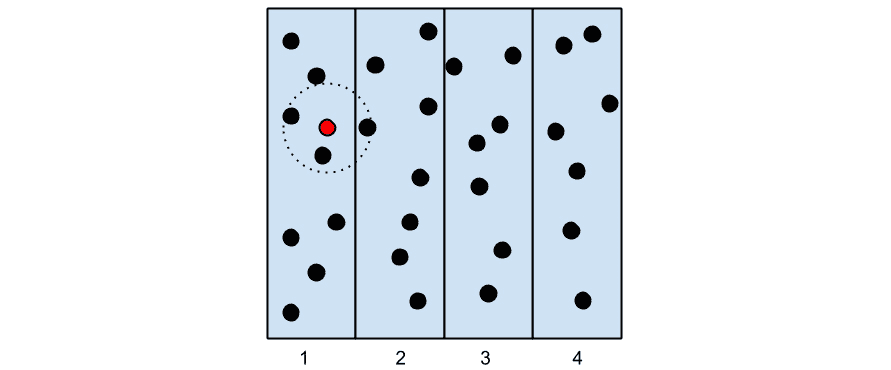
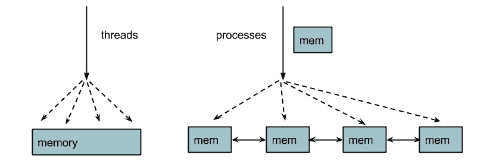
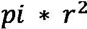
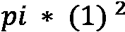
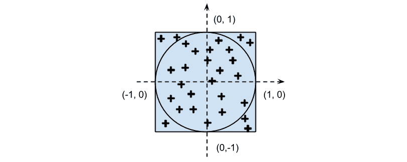
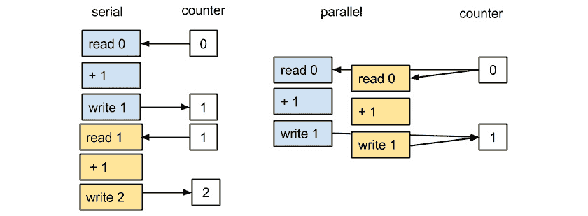

# 第八章：*第八章*: 并行处理

使用多核并行处理，你可以在不使用更快的处理器的情况下，在给定的时间框架内增加程序可以完成的计算数量。主要思想是将问题分解成独立的子单元，并使用多个核心并行解决这些子单元。

并行处理是解决大规模问题的必要手段。每天，公司都会产生大量的数据，需要存储在多台计算机上并进行分析。科学家和工程师在超级计算机上运行并行代码来模拟大规模系统。

并行处理允许你利用多核**中央处理器**（**CPUs**）以及与高度并行问题配合得非常好的**图形处理器**（**GPUs**）。

在本章中，我们将涵盖以下主题：

+   并行编程简介

+   使用多个进程

+   使用**Open Multi-Processing**（**OpenMP**）的并行 Cython

+   自动并行化

# 技术要求

本章的代码文件可以通过此链接访问：[`github.com/PacktPublishing/Advanced-Python-Programming-Second-Edition/tree/main/Chapter08`](https://github.com/PacktPublishing/Advanced-Python-Programming-Second-Edition/tree/main/Chapter08)。

# 并行编程简介

为了并行化一个程序，有必要将问题分解成可以独立（或几乎独立）运行的子单元。

当子单元之间完全独立时，这种问题被称为*令人尴尬的并行*。对数组进行元素级操作是一个典型的例子——操作只需要知道它现在处理的元素。另一个例子是我们的粒子模拟器。由于没有相互作用，每个粒子可以独立于其他粒子发展。令人尴尬的并行问题很容易实现，并且在并行架构上表现良好。

其他问题可能被划分为子单元，但必须共享一些数据以执行它们的计算。在这些情况下，实现方式不太直接，并且由于通信成本可能导致性能问题。

我们将通过一个例子来说明这个概念。想象一下，你有一个粒子模拟器，但这次，粒子在一定的距离内会吸引其他粒子（如下面的图所示）：



图 8.1 – 邻近区域的示意图

为了并行化这个问题，我们将模拟区域划分为区域，并将每个区域分配给不同的处理器。如果我们一次进化系统的一步，一些粒子将与相邻区域的粒子相互作用。为了执行下一次迭代，需要与相邻区域的新粒子位置进行通信。

进程间的通信成本高昂，可能会严重阻碍并行程序的性能。在并行程序中处理数据通信存在两种主要方式：共享内存和分布式内存。

在**共享内存**中，子单元可以访问相同的内存空间。这种方法的优点是，你不需要显式处理通信，因为从共享内存中写入或读取就足够了。然而，当多个进程同时尝试访问和更改相同的内存位置时，会出现问题。应谨慎使用同步技术来避免此类冲突。

在**分布式内存**模型中，每个进程与其他进程完全隔离，并拥有自己的内存空间。在这种情况下，进程间的通信是显式处理的。与共享内存相比，通信开销通常更昂贵，因为数据可能需要通过网络接口传输。

在共享内存模型中实现并行的一种常见方式是通过**线程**。线程是从进程派生出来的独立子任务，并共享资源，如内存。以下图表进一步说明了这一概念：



图 8.2 – 线程和进程之间的差异说明

线程产生多个执行上下文并共享相同的内存空间，而进程提供多个具有自己内存空间的执行上下文，并且通信必须显式处理。

Python 可以创建和处理线程，但它们不能用来提高性能；由于 Python 解释器的设计，一次只能允许执行一条 Python 指令——这种机制称为**全局解释器锁**（**GIL**）。发生的情况是，每次线程执行 Python 语句时，线程都会获取一个锁，当执行完成后，该锁被释放。由于锁一次只能被一个线程获取，因此当某个线程持有锁时，其他线程将无法执行 Python 语句。

尽管 GIL 阻止了 Python 指令的并行执行，但在可以释放锁的情况（如耗时的**输入/输出**（**I/O**）操作或在 C 扩展中）下，线程仍然可以用来提供并发性。

为什么不移除 GIL？

在过去几年中，已经进行了许多尝试，包括最近的*Gilectomy*实验。首先，移除 GIL 不是一项容易的任务，需要修改大多数 Python 数据结构。此外，这种细粒度的锁定可能成本高昂，并可能在单线程程序中引入显著的性能损失。尽管如此，一些 Python 实现（如 Jython 和 IronPython）并不使用 GIL。

可以通过使用进程而不是线程来完全绕过 GIL。进程不共享相同的内存区域，并且彼此独立——每个进程都有自己的解释器。进程有一些缺点：启动一个新的进程通常比启动一个新的线程慢，它们消耗更多的内存，并且**进程间通信**（**IPC**）可能很慢。另一方面，进程仍然非常灵活，并且随着它们可以在多台机器上分布而更好地扩展。

## GPU

GPU（图形处理器）是专为计算机图形应用设计的特殊处理器。这些应用通常需要处理**三维**（**3D**）场景的几何形状，并将像素数组输出到屏幕上。GPU 执行的操作涉及浮点数的数组和矩阵运算。

GPU 被设计成非常高效地运行与图形相关的操作，它们通过采用高度并行的架构来实现这一点。与 CPU 相比，GPU 拥有更多的（数千个）小型处理单元。GPU 旨在以大约每秒 60**帧**（**FPS**）的速度产生数据，这比具有更高时钟速度的 CPU 的典型响应时间慢得多。

GPU 的架构与标准 CPU 非常不同，专门用于计算浮点运算。因此，为了为 GPU 编译程序，需要利用特殊的编程平台，例如**统一计算设备架构**（**CUDA**）和**开放计算语言**（**OpenCL**）。

CUDA 是 NVIDIA 的专有技术。它提供了一个**应用程序编程接口**（**API**），可以从其他语言访问。CUDA 提供了**NVIDIA CUDA 编译器**（**NVCC**）工具，可用于编译用 C（CUDA C）等语言编写的 GPU 程序，以及实现高度优化的数学例程的众多库。

**OpenCL**是一种开放技术，具有编写可编译为各种目标设备（多个供应商的 CPU 和 GPU）的并行程序的能力，对于非 NVIDIA 设备来说是一个不错的选择。

GPU 编程在纸面上听起来很美妙。然而，不要扔掉你的 CPU。GPU 编程很复杂，只有特定的用例才能从 GPU 架构中受益。程序员需要意识到内存传输到和从主内存产生的成本，以及如何实现算法以利用 GPU 架构。

通常，GPU 擅长在单位时间内增加你可以执行的操作数量（也称为**吞吐量**）；然而，它们需要更多的时间来准备数据以进行处理。相比之下，CPU 在从头开始生成单个结果方面要快得多（也称为**延迟**）。

对于正确的问题，GPU 提供了极端（10 到 100 倍）的速度提升。因此，它们通常构成了一种非常经济的解决方案（相同的速度提升将需要数百个 CPU），以提高数值密集型应用程序的性能。我们将在 *自动并行化* 部分说明如何在 GPU 上执行一些算法。

话虽如此，我们将在下一节开始讨论使用标准进程的多进程。

# 使用多个进程

标准的 `multiprocessing` 模块可以通过在避免 GIL 问题的情况下启动多个进程来快速并行化简单任务。它的接口易于使用，包括几个用于处理任务提交和同步的实用工具。

## 进程和池类

你可以通过继承 `multiprocessing.Process` 来创建一个独立运行的进程。你可以扩展 `__init__` 方法来初始化资源，并通过实现 `Process.run` 方法来编写将在子进程中执行的代码的一部分。在以下代码片段中，我们定义了一个 `Process` 类，它将等待 1 秒并打印其分配的 `id` 值：

```py
    import multiprocessing 
    import time 
    class Process(multiprocessing.Process): 
        def __init__(self, id): 
            super(Process, self).__init__() 
            self.id = id 
        def run(self): 
            time.sleep(1) 
            print("I'm the process with id: 
              {}".format(self.id))
```

要启动进程，我们必须实例化 `Process` 类并调用 `Process.start` 方法。注意，你不会直接调用 `Process.run`；调用 `Process.start` 将创建一个新的进程，然后该进程将调用 `Process.run` 方法。我们可以在前面代码片段的末尾添加以下行来创建并启动新进程：

```py
    if __name__ == '__main__': 
        p = Process(0) 
        p.start()
```

特殊的 __name__ 变量

注意，我们需要将管理进程的任何代码放在 `if __name__ == '__main__'` 条件中，正如前面代码片段所示，以避免许多不希望的行为。本章中展示的所有代码都将假定遵循此惯例。

在调用 `Process.start` 之后，指令将立即执行，无需等待 `p` 进程完成。为了等待任务完成，你可以使用 `Process.join` 方法，如下所示：

```py
    if __name__ == '__main__': 
       p = Process(0) 
       p.start() 
       p.join()
```

我们可以启动四个不同的进程，它们将以相同的方式并行运行。在串行程序中，所需的总时间将是 4 秒。由于执行是并发的，因此结果的实际时钟时间将是 1 秒。在以下代码片段中，我们创建了四个将并发执行的进程：

```py
    if __name__ == '__main__': 
        processes = Process(1), Process(2), Process(3), 
          Process(4) 
        [p.start() for p in processes]
```

注意，并行进程的执行顺序是不可预测的，最终取决于 **操作系统**（**OS**）如何调度。你可以通过多次执行程序来验证此行为；运行之间的顺序可能会不同。

`multiprocessing` 模块提供了一个方便的接口，使得将任务分配和分配给 `multiprocessing.Pool` 类中驻留的一组进程变得容易。

`multiprocessing.Pool` 类启动一组进程——称为 *工作者*——并允许我们通过 `apply`/`apply_async` 和 `map`/`map_async` 方法提交任务。

`pool.map` 方法将一个函数应用于列表中的每个元素，并返回一个结果列表。它的用法与内置的（串行）`map` 相当。

要使用并行映射，你应该首先初始化一个 `multiprocessing.Pool` 对象，该对象将工作线程的数量作为其第一个参数；如果没有提供，该数字将等于系统中的核心数。你可以以下面的方式初始化一个 `multiprocessing.Pool` 对象：

```py
    pool = multiprocessing.Pool() 
    pool = multiprocessing.Pool(processes=4)
```

让我们看看 `pool.map` 的实际应用。如果你有一个计算数字平方的函数，你可以通过调用 `pool.map` 并将函数和输入列表作为参数传递来将该函数映射到列表上，如下所示：

```py
    def square(x): 
        return x * x 
    inputs = [0, 1, 2, 3, 4] 
    outputs = pool.map(square, inputs)
```

`pool.map_async` 函数与 `pool.map` 类似，但返回的是一个 `AsyncResult` 对象而不是实际的结果。当我们调用 `pool.map` 时，主程序的执行会停止，直到所有工作线程完成处理结果。使用 `map_async`，`AsyncResult` 对象会立即返回，而不会阻塞主程序，计算在后台进行。然后我们可以使用 `AsyncResult.get` 方法在任何时候检索结果，如下面的代码行所示：

```py
    outputs_async = pool.map_async(square, inputs) 
    outputs = outputs_async.get()
```

`pool.apply_async` 将一个由单个函数组成的任务分配给一个工作线程。它接受函数及其参数，并返回一个 `AsyncResult` 对象。我们可以使用 `apply_async` 来实现类似于 `map` 的效果，如下所示：

```py
    results_async = [pool.apply_async(square, i) for i in \
      range(100))] 
    results = [r.get() for r in results_async]
```

要使用这些进程计算并返回的结果，我们可以简单地访问存储在 `results` 中的数据。

## 执行器接口

从版本 3.2 开始，可以使用 `concurrent.futures` 模块中提供的 `Executor` 接口并行执行 Python 代码。我们已经在上一章中看到了 `Executor` 接口的应用，当时我们使用 `ThreadPoolExecutor` 来并发执行多个任务。在本小节中，我们将演示 `ProcessPoolExecutor` 类的用法。

`ProcessPoolExecutor` 提供了一个非常简洁的接口，至少与功能更丰富的 `multiprocessing.Pool` 相比是这样。可以通过使用 `max_workers` 参数（默认情况下，`max_workers` 将等于系统中的核心数）传递工作线程的数量来实例化一个 `ProcessPoolExecutor` 类，类似于 `ThreadPoolExecutor`。`ProcessPoolExecutor` 类的主要方法有 `submit` 和 `map`。

`submit` 方法将接受一个函数并返回一个 `Future` 实例，该实例将跟踪提交函数的执行。`map` 方法与 `pool.map` 函数类似，但返回的是一个迭代器而不是列表。代码在以下代码片段中展示：

```py
    from concurrent.futures import ProcessPoolExecutor
    executor = ProcessPoolExecutor(max_workers=4)
    fut = executor.submit(square, 2)
    # Result:
    # <Future at 0x7f5b5c030940 state=running>
    result = executor.map(square, [0, 1, 2, 3, 4])
    list(result)
    # Result:
    # [0, 1, 4, 9, 16]
```

要从一个或多个`Future`实例中提取结果，你可以使用`concurrent.futures.wait`和`concurrent.futures.as_completed`函数。`wait`函数接受一个`future`实例列表，并将阻塞程序的执行，直到所有未来都完成执行。然后可以使用`Future.result`方法提取结果。`as_completed`函数也接受一个函数，但它将返回一个结果迭代器。以下代码片段展示了代码示例：

```py
    from concurrent.futures import wait, as_completed
    fut1 = executor.submit(square, 2)
    fut2 = executor.submit(square, 3)
    wait([fut1, fut2])
    # Then you can extract the results using fut1.result() 
      and fut2.result()
    results = as_completed([fut1, fut2])
    list(results)
    # Result:
    # [4, 9]
```

或者，你可以使用`asyncio.run_in_executor`函数生成未来，并使用`asyncio`库提供的所有工具和语法来操作结果，这样你就可以同时实现并发和并行。

## Monte Carlo 近似π

作为示例，我们将实现一个典型的、明显并行的程序——**蒙特卡洛近似π**。想象一下，我们有一个边长为 2 个单位的正方形；其面积将是 4 个单位。现在，我们在正方形内画一个半径为 1 个单位的圆；圆的面积将是。通过在上一个方程中代入*r*的值，我们得到圆的面积数值为 *= π*。你可以参考以下截图来查看这个图形表示：



图 8.3 – 我们近似π的策略示意图

如果我们在上面随机射出很多点，一些点会落在圆内，我们将它们称为*命中*，而剩下的点，*未命中*，将位于圆外。圆的面积将与命中点的数量成正比，而正方形的面积将与射击总数成正比。为了得到π的值，只需将圆的面积（等于*π*）除以正方形的面积（等于 4），如下代码片段所示：

```py
    hits/total = area_circle/area_square = pi/4 
    pi = 4 * hits/total
```

我们将在程序中采用的策略如下：

+   在范围(-1, 1)内生成大量的均匀随机(*x*, *y*)数字。

+   通过检查*x**2 + y**2 <= 1*来测试这些数字是否位于圆内。

编写并行程序的第一步是编写一个串行版本并验证其是否工作。在现实场景中，你希望将并行化作为优化过程的最后一步——首先，因为我们需要识别出慢速部分，其次，并行化耗时且*最多只能将速度提升到处理器数量的水平*。串行程序的实现如下所示：

```py
    import random 
    samples = 1000000 
    hits = 0 
    for i in range(samples): 
        x = random.uniform(-1.0, 1.0) 
        y = random.uniform(-1.0, 1.0) 
        if x**2 + y**2 <= 1: 
            hits += 1 

    pi = 4.0 * hits/samples
```

随着样本数量的增加，我们的近似精度将提高。请注意，每个循环迭代都是独立的——这个问题是明显并行的。

为了并行化这段代码，我们可以编写一个名为 `sample` 的函数，它对应于单次命中-未命中检查。如果样本击中圆圈，该函数将返回 `1`；否则，它将返回 `0`。通过多次运行 `sample` 并汇总结果，我们将得到总命中数。我们可以使用 `apply_async` 在多个处理器上运行 `sample` 并以以下方式获取结果：

```py
    def sample(): 
        x = random.uniform(-1.0, 1.0) 
        y = random.uniform(-1.0, 1.0) 
        if x**2 + y**2 <= 1: 
            return 1 
        else: 
            return 0 
    pool = multiprocessing.Pool() 
    results_async = [pool.apply_async(sample) for i in \
      range(samples)] 
    hits = sum(r.get() for r in results_async)
```

我们可以将这两个版本包裹在 `pi_serial` 和 `pi_apply_async` 函数中（你可以在 `pi.py` 文件中找到它们的实现）并比较执行速度，如下所示：

```py
$ time python -c 'import pi; pi.pi_serial()'
real    0m0.734s
user    0m0.731s
sys     0m0.004s
$ time python -c 'import pi; pi.pi_apply_async()'
real    1m36.989s
user    1m55.984s
sys     0m50.386
```

如前所述的基准测试所示，我们的第一个并行版本实际上削弱了我们的代码，原因是实际计算所需的时间与发送和分配任务到工作进程所需的开销相比非常小。

为了解决这个问题，我们必须使开销与计算时间相比可以忽略不计。例如，我们可以要求每个工作进程一次处理多个样本，从而减少任务通信开销。我们可以编写一个 `sample_multiple` 函数，它处理多个命中，并通过将问题分成 10 份来修改我们的并行版本；更复杂的工作在以下代码片段中展示：

```py
    def sample_multiple(samples_partial): 
        return sum(sample() for i inrange(samples_partial)) 
    n_tasks = 10 
    chunk_size = samples/n_tasks 
    pool = multiprocessing.Pool() 
    results_async = [pool.apply_async(sample_multiple, \
      chunk_size) for i in range(n_tasks)] 
    hits = sum(r.get() for r in results_async)
```

我们可以将这个功能包裹在一个名为 `pi_apply_async_chunked` 的函数中，并按以下方式运行它：

```py
$ time python -c 'import pi; pi.pi_apply_async_chunked()'
real    0m0.325s
user    0m0.816s
sys     0m0.008s
```

结果要好得多；我们的程序速度提高了不止一倍。你也可以注意到 `user` 指标大于 `real`；总 CPU 时间大于总时间，因为同时使用了多个 CPU。如果你增加样本数量，你会注意到通信与计算的比率降低，从而提供更好的加速。

处理令人尴尬的并行问题时，一切都很简单明了。然而，有时你必须在进程之间共享数据。

## 同步和锁

即使 `multiprocessing` 使用进程（它们有自己独立的内存），它也允许你定义某些变量和数组作为共享内存。你可以使用 `multiprocessing.Value` 定义一个共享变量，并通过字符串传递其数据类型（`i` 表示整数，`d` 表示双精度，`f` 表示浮点等）。你可以通过 `value` 属性更新变量的内容，如下面的代码片段所示：

```py
    shared_variable = multiprocessing.Value('f') 
    shared_variable.value = 0
```

当使用共享内存时，你应该注意并发访问。想象一下，你有一个共享的整数变量，每个进程都会多次增加它的值。你将定义一个 `Process` 类，如下所示：

```py
    class Process(multiprocessing.Process): 
        def __init__(self, counter): 
            super(Process, self).__init__() 
            self.counter = counter 
        def run(self): 
            for i in range(1000): 
                self.counter.value += 1
```

你可以在主程序中初始化共享变量并将其传递给 `4` 个进程，如下面的代码片段所示：

```py
    def main(): 
        counter = multiprocessing.Value('i', lock=True) 
        counter.value = 0 
        processes = [Process(counter) for i in range(4)] 
        [p.start() for p in processes] 
        [p.join() for p in processes] # processes are done 
        print(counter.value)
```

如果你运行这个程序（代码目录中的 `shared.py`），你会注意到 `counter` 的最终值不是 `4000`，而是有随机值（在我的机器上，它们在 `2000` 和 `2500` 之间）。如果我们假设算术是正确的，我们可以得出结论，并行化存在问题。

发生的情况是多个进程同时尝试访问同一个共享变量。这种情况最好通过以下图表来解释。在串行执行中，第一个进程读取数字（`0`），增加它，并写入新值（`1`）；第二个进程读取新值（`1`），增加它，并再次写入（`2`）。

在并行执行中，两个进程同时读取数字（`0`），增加它，并写入值（`1`），导致错误答案：



图 8.4 – 多个进程访问同一变量，导致行为不正确

为了解决这个问题，我们需要同步对这个变量的访问，以确保一次只有一个进程可以访问、增加并写入共享变量的值。这个功能由`multiprocessing.Lock`类提供。可以通过`acquire`和`release`方法分别获取和释放锁，或者使用锁作为上下文管理器。由于锁一次只能被一个进程获取，这种方法可以防止多个进程同时执行受保护的代码段。

我们可以定义一个全局锁，并使用它作为上下文管理器来限制对计数器的访问，如下面的代码片段所示：

```py
    class Process(multiprocessing.Process): 
        def __init__(self, counter): 
            super(Process, self).__init__() 
            self.counter = counter 
        def run(self): 
            for i in range(1000): 
                with lock: # acquire the lock 
                    self.counter.value += 1 
                # release the lock
```

同步原语，如锁，对于解决许多问题是必不可少的，但应该将其保持到最小，以提高程序的性能。

提示

`multiprocessing`模块包括其他通信和同步工具；你可以参考官方文档[`docs.python.org/3/library/multiprocessing.html`](http://docs.python.org/3/library/multiprocessing.html)以获取完整的参考。

在*第四章* *使用 Cython 提高 C 性能*中，我们讨论了 Cython 作为加快我们程序的方法。Cython 本身也允许通过 OpenMP 进行并行处理，我们将在下一节中探讨。

# 带 OpenMP 的并行 Cython

Cython 通过*OpenMP*提供了一个方便的接口来执行共享内存并行处理。这让你可以直接在 Cython 中编写非常高效的并行代码，而无需创建 C 包装器。

OpenMP 是一个用于编写多线程、并行程序的规范和 API。OpenMP 规范包括一系列 C 预处理器指令来管理线程，并提供通信模式、负载均衡和其他同步功能。几个 C/C++和 Fortran 编译器（包括**GNU 编译器集合**（**GCC**））实现了 OpenMP API。

我们可以通过一个小示例引入 Cython 的并行功能。Cython 在`cython.parallel`模块中提供了一个基于 OpenMP 的简单 API。实现并行化的最简单方法是使用`prange`，这是一个自动在多个线程中分配循环操作的构造。

首先，我们可以在`hello_parallel.pyx`文件中编写一个程序的串行版本，该程序计算 NumPy 数组中每个元素的平方。我们定义一个函数`square_serial`，它接受一个缓冲区作为输入，并用输入数组元素的平方填充输出数组；`square_serial`在以下代码片段中显示：

```py
    import numpy as np 
    def square_serial(double[:] inp): 
        cdef int i, size 
        cdef double[:] out 
        size = inp.shape[0] 
        out_np = np.empty(size, 'double') 
        out = out_np 
        for i in range(size): 
            out[i] = inp[i]*inp[i] 
        return out_np
```

实现数组元素循环的并行版本涉及用`prange`替换`range`调用。有一个注意事项——要使用`prange`，循环体必须是解释器无关的。如前所述，我们需要释放 GIL，由于解释器调用通常获取 GIL，因此需要避免这些调用以利用线程。

在 Cython 中，您可以使用`nogil`上下文释放 GIL，如下所示：

```py
    with nogil: 
        for i in prange(size): 
            out[i] = inp[i]*inp[i]
```

或者，您可以使用`prange`的`nogil=True`选项，这将自动将循环体包装在一个`nogil`块中，如下所示：

```py
    for i in prange(size, nogil=True): 
        out[i] = inp[i]*inp[i]
```

在`prange`块中调用 Python 代码将产生错误。禁止的操作包括函数调用、对象初始化等。为了在`prange`块中启用此类操作（您可能希望为了调试目的这样做），您必须使用`with gil`语句重新启用 GIL，如下所示：

```py
    for i in prange(size, nogil=True): 
        out[i] = inp[i]*inp[i] 
        with gil:   
            x = 0 # Python assignment
```

我们现在可以通过将其编译为 Python 扩展模块来测试我们的代码。为了启用 OpenMP 支持，需要更改`setup.py`文件，使其包含`-fopenmp`编译选项。这可以通过在`distutils`中使用`distutils.extension.Extension`类并将其传递给`cythonize`来实现。完整的`setup.py`文件如下所示：

```py
    from distutils.core import setup 
    from distutils.extension import Extension 
    from Cython.Build import cythonize 
    hello_parallel = Extension(
        'hello_parallel', 
        ['hello_parallel.pyx'], 
        extra_compile_args=['-fopenmp'], 
        extra_link_args=['-fopenmp']) 
    setup( 
       name='Hello', 
       ext_modules = cythonize(['cevolve.pyx', 
         hello_parallel]), 
    )
```

使用`prange`，我们可以轻松地将`ParticleSimulator`类的 Cython 版本并行化。以下代码片段包含在*第四章*中编写的`cevolve.pyx` Cython 模块的`c_evolve`函数，*C 与 Cython 的性能*：

```py
    def c_evolve(double[:, :] r_i,double[:] ang_speed_i, \
                 double timestep,int nsteps): 
        # cdef declarations 
        for i in range(nsteps): 
            for j in range(nparticles): 
                # loop body
```

首先，我们将循环的顺序颠倒，以便最外层循环将并行执行（每个迭代与其他迭代独立）。由于粒子之间没有相互作用，我们可以安全地更改迭代的顺序，如下所示：

```py
        for j in range(nparticles): 
            for i in range(nsteps): 
                # loop body
```

接下来，我们将用`prange`替换外部循环的`range`调用，并移除获取 GIL 的调用。由于我们的代码已经通过静态类型进行了增强，因此可以安全地应用`nogil`选项，如下所示：

```py
    for j in prange(nparticles, nogil=True)
```

我们现在可以通过将它们包装在`benchmark`函数中来比较这些函数，以评估任何性能改进，如下所示：

```py
    In [3]: %timeit benchmark(10000, 'openmp') # Running on 
      4 processors
    1 loops, best of 3: 599 ms per loop 
    In [4]: %timeit benchmark(10000, 'cython') 
    1 loops, best of 3: 1.35 s per loop
```

有趣的是，我们通过编写使用`prange`的并行版本实现了两倍的速度提升。

如我们之前提到的，由于 GIL，常规的 Python 程序在实现线程并行化方面有困难。到目前为止，我们通过使用单独的进程来解决这个问题；然而，启动进程比启动线程花费更多的时间和内存。

我们还看到，绕过 Python 环境使我们能够在已经很快的 Cython 代码上实现两倍的速度提升。这种策略使我们能够实现轻量级并行化，但需要单独的编译步骤。在下一节中，我们将进一步探讨这种策略，使用能够自动将我们的代码转换为并行版本的专用库，以实现高效的执行。

# 自动并行化

实现自动并行化的包示例包括现在大家熟悉的 `numexpr` 和 Numba。其他包已被开发出来以自动优化和并行化数组密集型表达式，这在特定的数值和**机器学习**（**ML**）应用中至关重要。

**Theano** 是一个项目，允许您在数组（更一般地说，*张量*）上定义数学表达式，并将它们编译为快速语言，如 C 或 C++。Theano 实现的大多数操作都是可并行化的，并且可以在 CPU 和 GPU 上运行。

**TensorFlow** 是另一个库，与 Theano 类似，针对数组密集型数学表达式，但它不是将表达式转换为专门的 C 代码，而是在高效的 C++ 引擎上执行操作。

当手头的问题可以用矩阵和逐元素操作的链表达时（例如 *神经网络*），Theano 和 TensorFlow 都是理想的。

## Theano 入门

Theano 类似于一个编译器，但额外的好处是能够表达、操作和优化数学表达式，以及能够在 CPU 和 GPU 上运行代码。自 2010 年以来，Theano 在版本更新后不断改进，并被几个其他 Python 项目采用，作为自动生成高效计算模型的方法。

可以使用以下命令安装此包：

```py
$pip install Theano
```

在 Theano 中，您首先通过指定变量和使用纯 Python API 进行转换来定义您想要运行的函数。然后，此规范将被编译成机器代码以执行。

作为第一个例子，让我们看看如何实现一个计算数字平方的函数。输入将由一个标量变量 `a` 表示，然后我们将对其进行转换以获得其平方，表示为 `a_sq`。在下面的代码片段中，我们将使用 `T.scalar` 函数定义一个变量，并使用正常的 `**` 运算符来获取一个新的变量：

```py
    import theano.tensor as T
    import theano as th
    a = T.scalar('a')
    a_sq = a ** 2
    print(a_sq)
    # Output:
    # Elemwise{pow,no_inplace}.0
```

如您所见，没有计算特定的值，我们应用的是纯符号变换。为了使用这个变换，我们需要生成一个函数。要编译一个函数，您可以使用`th.function`实用程序，它将输入变量的列表作为其第一个参数，输出变换（在我们的情况下，`a_sq`）作为其第二个参数，如下所示：

```py
    compute_square = th.function([a], a_sq)
```

Theano 将花费一些时间将表达式转换为高效的 C 代码并编译它，所有这些都在后台完成！`th.function`的返回值将是一个可用的 Python 函数，其用法在下一行代码中演示：

```py
    compute_square(2)
    4.0
```

毫不奇怪，`compute_square`正确地返回了输入值的平方。然而，请注意，返回类型不是整数（如输入类型），而是一个浮点数。这是因为 Theano 默认变量类型是`float64`。您可以通过检查`a`变量的`dtype`属性来验证这一点，如下所示：

```py
    a.dtype
    # Result: 
    # float64
```

与我们之前看到的 Numba 相比，Theano 的行为非常不同。Theano 不编译通用的 Python 代码，也不进行任何类型的推断；定义 Theano 函数需要更精确地指定涉及的类型。

Theano 的真实力量来自于其对数组表达式的支持。定义一个`T.vector`函数；返回的变量支持与 NumPy 数组相同的广播操作语义。例如，我们可以取两个向量并计算它们平方的逐元素和，如下所示：

```py
    a = T.vector('a')
    b = T.vector('b')
    ab_sq = a**2 + b**2
    compute_square = th.function([a, b], ab_sq)
    compute_square([0, 1, 2], [3, 4, 5])
    # Result:
    # array([  9.,  17.,  29.])
```

这个想法再次是使用 Theano API 作为一个迷你语言来组合各种 NumPy 数组表达式，这些表达式将被编译成高效的机器代码。

注意

Theano 的一个卖点是其执行算术简化和自动梯度计算的能力。有关更多信息，请参阅官方文档([`theano-pymc.readthedocs.io/en/latest/`](https://theano-pymc.readthedocs.io/en/latest/))。

为了演示 Theano 在熟悉的使用场景中的功能，我们可以再次实现我们的并行计算`pi`。我们的函数将接受两个随机坐标的集合作为输入，并返回`pi`估计值。输入的随机数将被定义为名为`x`和`y`的向量，我们可以使用一个标准的逐元素操作来测试它们在圆内的位置，这个操作我们将存储在`hit_test`变量中，如下所示：

```py
    x = T.vector('x')
    y = T.vector('y')
    hit_test = x ** 2 + y ** 2 < 1
```

在这一点上，我们需要计算`hit_test`中`True`元素的数量，这可以通过取其和来完成（它将被隐式转换为整数）。为了获得`pi`估计值，我们最后需要计算击中次数与总试验次数的比率。计算过程在以下代码片段中展示：

```py
    hits = hit_test.sum()
    total = x.shape[0]
    pi_est = 4 * hits/total
```

我们可以使用`th.function`和`timeit`模块来基准测试 Theano 实现的执行。在我们的测试中，我们将传递两个大小为`30000`的数组，并使用`timeit.timeit`实用工具多次执行`calculate_pi`函数，如下面的代码片段所示：

```py
    calculate_pi = th.function([x, y], pi_est)
    x_val = np.random.uniform(-1, 1, 30000)
    y_val = np.random.uniform(-1, 1, 30000)
    import timeit
    res = timeit.timeit("calculate_pi(x_val, y_val)", \
    "from __main__ import x_val, y_val, calculate_pi", \
      number=100000)
    print(res)
    # Output:
    # 10.905971487998613
```

此函数的串行执行大约需要 10 秒。Theano 能够通过实现使用专用包（如 OpenMP 和**基本线性代数子程序**（**BLAS**）线性代数例程）的元素和矩阵操作来自动并行化代码。可以通过配置选项启用并行执行。

在 Theano 中，您可以通过在导入时修改`theano.config`对象中的变量来设置配置选项。例如，您可以使用以下命令来启用 OpenMP 支持：

```py
import theano
theano.config.openmp = True
theano.config.openmp_elemwise_minsize = 10
```

与 OpenMP 相关的参数在此概述：

+   `openmp_elemwise_minsize`：这是一个整数，表示应该启用元素并行化的数组的最小大小（对于小数组，并行化的开销可能会损害性能）。

+   `openmp`：这是一个布尔标志，用于控制 OpenMP 编译的激活（默认情况下应该被激活）。

通过在执行代码之前设置`OMP_NUM_THREADS`环境变量，可以控制分配给 OpenMP 执行的线程数。

现在，我们可以编写一个简单的基准测试来演示在实际中 OpenMP 的使用。在`test_theano.py`文件中，我们将放置`pi`估计示例的完整代码，如下所示：

```py
    # File: test_theano.py
    import numpy as np
    import theano.tensor as T
    import theano as th
    th.config.openmp_elemwise_minsize = 1000
    th.config.openmp = True
    x = T.vector('x')
    y = T.vector('y')
    hit_test = x ** 2 + y ** 2 <= 1
    hits = hit_test.sum()
    misses = x.shape[0]
    pi_est = 4 * hits/misses
    calculate_pi = th.function([x, y], pi_est)
    x_val = np.random.uniform(-1, 1, 30000)
    y_val = np.random.uniform(-1, 1, 30000)
    import timeit
    res = timeit.timeit("calculate_pi(x_val, y_val)", 
                        "from __main__ import x_val, y_val, 
                        calculate_pi", number=100000)
    print(res)
```

在这一点上，我们可以从命令行运行代码，并通过设置`OMP_NUM_THREADS`环境变量来评估随着线程数的增加而进行的扩展，如下所示：

```py
    $ OMP_NUM_THREADS=1 python test_theano.py
    10.905971487998613
    $ OMP_NUM_THREADS=2 python test_theano.py
    7.538279129999864
    $ OMP_NUM_THREADS=3 python test_theano.py
    9.405846934998408
    $ OMP_NUM_THREADS=4 python test_theano.py
    14.634153957000308
```

有趣的是，使用两个线程时，确实有轻微的加速，但随着线程数的增加，性能会迅速下降。这意味着对于这个输入大小，使用超过两个线程并不有利，因为启动新线程和同步它们共享数据的代价高于您可以从并行执行中获得的速度提升。

实现良好的并行性能可能很棘手，因为这将取决于特定的操作以及它们如何访问底层数据。一般来说，测量并行程序的性能至关重要，获得显著的加速是一个反复试验的过程。

例如，我们可以看到，使用稍微不同的代码，并行性能会迅速下降。在我们的击中测试中，我们直接使用了`sum`方法，并依赖于`hit_tests`布尔数组的显式转换。如果我们显式进行转换，Theano 将生成略微不同的代码，这从多个线程中获得的益处较少。我们可以修改`test_theano.py`文件来验证这一效果，如下所示：

```py
    # Older version
    # hits = hit_test.sum()
    hits = hit_test.astype('int32').sum()
```

如果我们重新运行我们的基准测试，我们会看到线程数对运行时间的影响并不显著，如下所示：

```py
    $ OMP_NUM_THREADS=1 python test_theano.py
    5.822126664999814
    $ OMP_NUM_THREADS=2 python test_theano.py
    5.697357518001809
    $ OMP_NUM_THREADS=3 python test_theano.py 
    5.636914656002773
    $ OMP_NUM_THREADS=4 python test_theano.py
    5.764030176000233
```

尽管如此，与原始版本相比，时间有所显著提高。

## 分析 Theano

考虑到测量和分析性能的重要性，Theano 提供了强大且信息丰富的性能分析工具。要生成性能分析数据，所需的唯一修改是在`th.function`中添加`profile=True`选项，如下面的代码片段所示：

```py
    calculate_pi = th.function([x, y], pi_est, 
      profile=True)
```

性能分析器将在函数运行时收集数据（例如，通过`timeit`或直接调用）。可以通过发出`summary`命令将性能分析摘要打印到输出中，如下所示：

```py
    calculate_pi.profile.summary()
```

要生成性能分析数据，我们可以在添加`profile=True`选项后重新运行我们的脚本（对于这个实验，我们将`OMP_NUM_THREADS`环境变量设置为`1`）。此外，我们将我们的脚本恢复到执行`hit_tests`隐式转换的版本。

注意

您也可以使用`config.profile`选项全局设置性能分析。

`calculate_pi.profile.summary()`打印的输出相当长且信息丰富。其中一部分在下一块代码中报告。输出由三个部分组成，分别按`Class`、`Ops`和`Apply`排序。在我们的例子中，我们关注的是`Ops`，它大致对应于 Theano 编译代码中使用的函数。正如你所看到的，大约 80%的时间用于计算两个数的元素级平方和，其余时间用于计算总和：

```py
Function profiling
==================
  Message: test_theano.py:15
... other output
   Time in 100000 calls to Function.__call__: 1.015549e+01s
... other output
Class
---
<% time> <sum %> <apply time> <time per call> <type> 
<#call> <#apply> <Class name>
.... timing info by class
Ops
---
<% time> <sum %> <apply time> <time per call> <type> <#call> 
<#apply> <Op name>
  80.0%    80.0%       6.722s       6.72e-
05s     C     100000        1   Elemwise{Composite{LT((sqr(
i0) + sqr(i1)), i2)}}
  19.4%    99.4%       1.634s       1.63e-
05s     C     100000        1   Sum{acc_dtype=int64}
   0.3%    99.8%       0.027s       2.66e-
07s     C     100000        1   Elemwise{Composite{((i0 * 
i1) / i2)}}
   0.2%   100.0%       0.020s       2.03e-
07s     C     100000        1   Shape_i{0}
   ... (remaining 0 Ops account for   0.00%(0.00s) of the 
     runtime)
Apply
------
<% time> <sum %> <apply time> <time per call> <#call> <id> 
<Apply name>
... timing info by apply
```

这个信息与我们第一次基准测试的结果一致。当使用两个线程时，代码从大约 11 秒减少到大约 8 秒。从这些数字中，我们可以分析时间是如何被花费的。

在这 11 秒中，80%的时间（大约 8.8 秒）用于执行元素级操作。这意味着，在完全并行的情况下，增加两个线程的速度提升将是 4.4 秒。在这种情况下，理论上的执行时间将是 6.6 秒。考虑到我们获得了大约 8 秒的时间，看起来线程使用存在一些额外的开销（1.4 秒）。

## TensorFlow

TensorFlow 是另一个为快速数值计算和自动并行化设计的库。它于 2015 年由谷歌作为开源项目发布。TensorFlow 通过构建类似于 Theano 的数学表达式来工作，不同之处在于计算不是编译成机器代码，而是在用 C++编写的外部引擎上执行。TensorFlow 支持在单个或多个 CPU 和 GPU 上执行和部署并行代码。

我们可以使用以下命令安装 TensorFlow：

```py
$pip install tensorflow
```

TensorFlow 版本兼容性

注意，默认情况下，TensorFlow 2.x 将不进行进一步指定而安装。然而，由于 TensorFlow 1.x 的用户数量仍然相当可观，我们接下来使用的代码将遵循 TensorFlow 1.x 的语法。你可以通过指定`pip install tensorflow==1.15`来安装版本 1，或者在使用库时使用`import tensorflow.compat.v1 as tf; tf.disable_v2_behavior()`来禁用版本 2 的行为，如下所示。

TensorFlow 的使用方式与 Theano 非常相似。要在 TensorFlow 中创建一个变量，你可以使用`tf.placeholder`函数，该函数接受一个数据类型作为输入，如下所示：

```py
    import tensorflow.compat.v1 as tf
    tf.disable_v2_behavior()
    a = tf.placeholder('float64')
```

TensorFlow 的数学表达式可以相当类似于 Theano，除了几个不同的命名约定以及更有限的 NumPy 语义支持。

TensorFlow 不会像 Theano 那样将函数编译成 C 和机器代码，而是序列化定义的数学函数（包含变量和转换的数据结构称为`tf.Session`对象）。

一旦定义了所需的表达式，就需要初始化一个`tf.Session`对象，并可以使用`Session.run`方法来执行计算图。在以下示例中，我们展示了如何使用 TensorFlow API 实现一个简单的逐元素平方和：

```py
    a = tf.placeholder('float64')
    b = tf.placeholder('float64')
    ab_sq = a**2 + b**2
    with tf.Session() as session:
        result = session.run(ab_sq, feed_dict={a: [0, 1, \
          2], b: [3, 4, 5]})
        print(result)
    # Output:
    # array([  9.,  17.,  29.])
```

TensorFlow 通过其智能执行引擎自动实现并行性，通常无需过多调整即可良好工作。然而，请注意，它主要适用于涉及定义复杂函数的**深度学习**（**DL**）工作负载，这些函数使用大量的矩阵乘法并计算它们的梯度。

我们现在可以使用 TensorFlow 的功能来复制估计π的示例，并对其执行速度和并行性进行基准测试，与 Theano 实现进行比较。我们将这样做：

+   定义我们的`x`和`y`变量，并使用广播操作执行碰撞测试。

+   使用`tf.reduce_sum`函数计算`hit_tests`的总和。

+   使用`inter_op_parallelism_threads`和`intra_op_parallelism_threads`配置选项初始化一个`Session`对象。这些选项控制不同类别的并行操作使用的线程数。请注意，使用这些选项创建的第一个`Session`实例将设置整个脚本（甚至未来的`Session`实例）的线程数。

我们现在可以编写一个名为`test_tensorflow.py`的脚本，其中包含以下代码。注意，线程数作为脚本的第一个参数传递（`sys.argv[1]`）：

```py
    import tensorflow.compat.v1 as tf
    tf.disable_v2_behavior()
    import numpy as np
    import time
    import sys
    NUM_THREADS = int(sys.argv[1])
    samples = 30000
    print('Num threads', NUM_THREADS)
    x_data = np.random.uniform(-1, 1, samples)
    y_data = np.random.uniform(-1, 1, samples)
    x = tf.placeholder('float64', name='x')
    y = tf.placeholder('float64', name='y')
    hit_tests = x ** 2 + y ** 2 <= 1.0
    hits = tf.reduce_sum(tf.cast(hit_tests, 'int32'))
    with tf.Session
        (config=tf.ConfigProto
            (inter_op_parallelism_threads=NUM_THREADS,
             intra_op_parallelism_threads=NUM_THREADS)) as \
               sess:
        start = time.time()
        for i in range(10000):
            sess.run(hits, {x: x_data, y: y_data})
        print(time.time() - start)
```

如果我们多次运行脚本并使用不同的`NUM_THREADS`值，我们会看到性能与 Theano 相当，并且通过并行化获得的速度提升相当适度，如下所示：

```py
    $ python test_tensorflow.py 1
    13.059704780578613
    $ python test_tensorflow.py 2
    11.938535928726196
    $ python test_tensorflow.py 3
    12.783955574035645
    $ python test_tensorflow.py 4
    12.158143043518066
```

使用如 TensorFlow 和 Theano 之类的软件包的主要优势是支持在机器学习算法中常用到的并行矩阵运算。这非常有效，因为这些操作可以在专为以高吞吐量执行这些操作而设计的 GPU 硬件上实现令人印象深刻的性能提升。

## 在 GPU 上运行代码

在本小节中，我们将展示如何使用 Theano 和 TensorFlow 来使用 GPU。作为一个例子，我们将测试在 GPU 上执行非常简单的矩阵乘法的执行时间，并将其与在 CPU 上的运行时间进行比较。

注意

本小节中的代码需要拥有 GPU。为了学习目的，可以使用 Amazon **弹性计算云**（**EC2**）服务（[`aws.amazon.com/ec2`](https://aws.amazon.com/ec2)）来请求一个启用 GPU 的实例。

以下代码使用 Theano 执行简单的矩阵乘法。我们使用`T.matrix`函数初始化一个`T.dot`方法来执行矩阵乘法：

```py
    from theano import function, config
    import theano.tensor as T
    import numpy as np
    import time
    N = 5000
    A_data = np.random.rand(N, N).astype('float32')
    B_data = np.random.rand(N, N).astype('float32')
    A = T.matrix('A')
    B = T.matrix('B')
    f = function([A, B], T.dot(A, B))
    start = time.time()
    f(A_data, B_data)
    print("Matrix multiply ({}) took {} seconds".format(N, \
      time.time() - start))
    print('Device used:', config.device)
```

可以通过设置`config.device=gpu`选项来让 Theano 在 GPU 上执行此代码。为了增加便利性，我们可以使用`THEANO_FLAGS`环境变量从命令行设置配置值，如下所示。将前面的代码复制到`test_theano_matmul.py`文件后，我们可以通过以下命令来测试执行时间：

```py
    $ THEANO_FLAGS=device=gpu python test_theano_gpu.py 
    Matrix multiply (5000) took 0.4182612895965576 seconds
    Device used: gpu
```

我们可以使用`device=cpu`配置选项类似地运行相同的代码在 CPU 上，如下所示：

```py
    $ THEANO_FLAGS=device=cpu python test_theano.py 
    Matrix multiply (5000) took 2.9623231887817383 seconds
    Device used: cpu
```

如您所见，对于这个例子，*GPU 比 CPU 版本快 7.2 倍*！

为了比较，我们可以使用 TensorFlow 来测试等效代码。TensorFlow 版本的实现将在下一个代码片段中展示。与 Theano 版本的主要区别如下：

+   使用`tf.device`配置管理器指定目标设备（`/cpu:0`或`/gpu:0`）。

+   矩阵乘法是通过`tf.matmul`运算符执行的。

这在下述代码片段中得到了说明：

```py
    import tensorflow as tf
    import time
    import numpy as np
    N = 5000
    A_data = np.random.rand(N, N)
    B_data = np.random.rand(N, N)
    # Creates a graph.
    with tf.device('/gpu:0'):
        A = tf.placeholder('float32')
        B = tf.placeholder('float32')
        C = tf.matmul(A, B)
    with tf.Session() as sess:
        start = time.time()
        sess.run(C, {A: A_data, B: B_data})
        print('Matrix multiply ({}) took: {}'.format(N, \
          time.time() - start))
```

如果我们使用适当的`tf.device`选项运行`test_tensorflow_matmul.py`脚本，我们将获得以下计时结果：

```py
    # Ran with tf.device('/gpu:0')
    Matrix multiply (5000) took: 1.417285680770874
    # Ran with tf.device('/cpu:0')
    Matrix multiply (5000) took: 2.9646761417388916 
```

如您所见，在这个简单案例中，性能提升是显著的（但不如 Theano 版本好）。

实现自动 GPU 计算的另一种方法是现在熟悉的 Numba。使用 Numba，可以将 Python 代码编译成可以在 GPU 上运行的程序。这种灵活性允许进行高级 GPU 编程以及更简化的接口。特别是，Numba 使得编写 GPU 就绪的通用函数变得极其简单。

在下一个示例中，我们将演示如何编写一个通用函数，该函数对两个数字应用指数函数并将结果相加。正如我们已经在*第五章*中看到的那样，*探索编译器*，这可以通过使用`nb.vectorize`函数（我们还将明确指定`cpu`目标）来实现。代码如下所示：

```py
    import numba as nb
    import math
    @nb.vectorize(target='cpu')
    def expon_cpu(x, y):
        return math.exp(x) + math.exp(y)
```

`expon_cpu`通用函数可以使用`target='cuda'`选项编译为 GPU 设备。此外，请注意，对于 CUDA 通用函数，有必要指定输入类型。`expon_gpu`的实现如下所示：

```py
    @nb.vectorize(['float32(float32, float32)'], 
      target='cuda')
    def expon_gpu(x, y):
        return math.exp(x) + math.exp(y)
```

我们现在可以通过在两个大小为`1000000`的数组上应用这两个函数来基准测试这两个函数的执行。同时，注意在下面的代码片段中，我们在测量时间之前执行了函数以触发 Numba JIT 编译：

```py
    import numpy as np
    import time
    N = 1000000
    niter = 100
    a = np.random.rand(N).astype('float32')
    b = np.random.rand(N).astype('float32')
    # Trigger compilation
    expon_cpu(a, b)
    expon_gpu(a, b)
    # Timing
    start = time.time()
    for i in range(niter):
       expon_cpu(a, b)
    print("CPU:", time.time() - start)
    start = time.time()
    for i in range(niter): 
        expon_gpu(a, b) 
    print("GPU:", time.time() - start) 
    # Output:
    # CPU: 2.4762887954711914
    # GPU: 0.8668839931488037
```

多亏了 GPU 执行，我们能够将 CPU 版本的速度提高了三倍。请注意，在 GPU 上传输数据相当昂贵；因此，GPU 执行仅在非常大的数组上才有优势。

何时使用哪个软件包

为了结束本章，我们将简要讨论我们迄今为止所考察的并行处理工具。首先，我们看到了如何使用`multiprocessing`在 Python 中本地管理多个进程。如果你使用 Cython，你可以求助于 OpenMP 来实现并行性，同时能够避免与 C 包装器一起工作。

最后，我们研究了 Theano 和 TensorFlow 这两个自动编译以数组为中心的代码并并行执行执行的软件包。虽然这两个软件包在自动并行化方面提供了类似的优势，但在撰写本文时，TensorFlow 已经获得了显著的流行度，尤其是在深度学习社区中，矩阵乘法的并行性已成为常态。

另一方面，Theano 的积极开发在 2018 年停止了。虽然这个软件包仍然可以用于自动并行化和深度学习用途，但不会再发布新版本。因此，现在 Python 程序员通常更倾向于使用 TensorFlow。

# 摘要

并行处理是提高大数据集性能的有效方法。令人尴尬的并行问题是非常适合并行执行的，可以轻松实现以实现良好的性能扩展。

在本章中，我们介绍了 Python 并行编程的基础。我们学习了如何使用 Python 标准库中的工具来生成进程以绕过 Python 线程的限制。我们还探讨了如何使用 Cython 和 OpenMP 实现多线程程序。

对于更复杂的问题，我们学习了如何使用 Theano、TensorFlow 和 Numba 软件包来自动编译针对 CPU 和 GPU 设备并行执行的密集数组表达式。

在下一章中，我们将学习如何应用并行编程技术来构建一个实际应用，该应用可以并发地创建和处理 Web 请求。

# 问题

1.  为什么在多个线程中运行 Python 代码不会带来任何速度提升？在本章中我们讨论的替代方法是什么？

1.  在`multiprocessing`模块中，就实现多进程而言，`Process`和`Pool`接口之间有什么区别？

1.  在高层次上，像 Theano 和 TensorFlow 这样的库是如何帮助并行化 Python 代码的？
