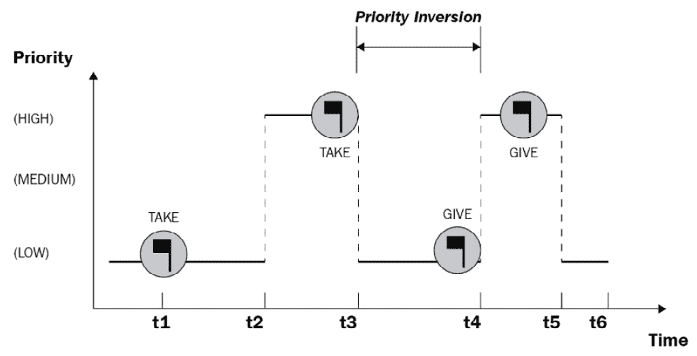
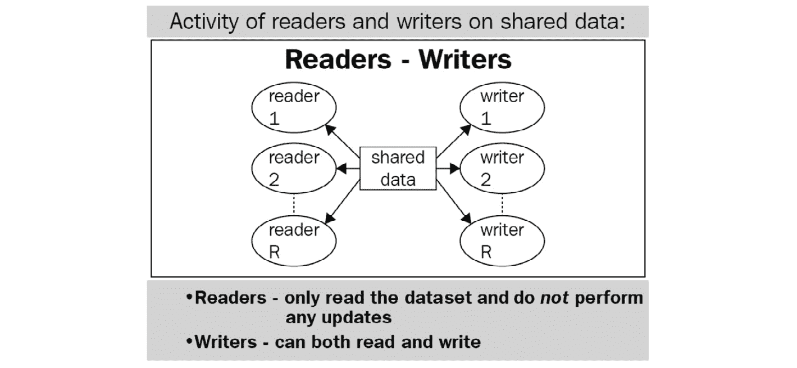

# 第十三章：*第十三章*：饥饿

在本章中，我们将讨论**饥饿**的概念及其在并发编程中的潜在原因。我们将涵盖**读者-写者问题**的多种变体，这些是饥饿的典型例子，并将使用示例 Python 代码来模拟它们。本章还将涵盖**死锁**和**饥饿**之间的关系，以及一些潜在的饥饿解决方案。

本章将涵盖以下主题：

+   理解饥饿

+   接近读者-写者问题

+   饥饿的解决方案

到本章结束时，你将深入理解饥饿，了解其成因，以及可以实施哪些实际解决方案来解决这个问题。

# 技术要求

本章的代码文件可以通过以下链接访问：[`github.com/PacktPublishing/Advanced-Python-Programming-Second-Edition/tree/main/Chapter13`](https://github.com/PacktPublishing/Advanced-Python-Programming-Second-Edition/tree/main/Chapter13)。

# 理解饥饿

**饥饿**是并发系统中的一个问题，其中进程（或线程）无法获取执行所需的必要资源，因此无法继续执行，因此无法取得任何进展。在本节中，我们将探讨饥饿情况的特征，分析其最常见的原因，并最终考虑一个示例程序，该程序展示了饥饿的情况。

## 什么是饥饿？

并发程序在执行过程中对不同的进程进行某种排序是很常见的。例如，考虑一个有三个独立进程的程序，如下所示：

+   一个负责处理极其紧急的指令，这些指令需要在必要的资源可用时立即运行。

+   另一个进程负责其他重要的执行任务，这些任务不如第一个进程的任务那么关键。

+   最后一个处理的是一些非常不常见的事务。

此外，这三个进程需要利用相同的资源来执行它们各自的指令。

直观地，我们有充分的理由实施一个规范，允许第一个进程具有最高的执行优先级和资源访问权，然后是第二个进程，最后是具有最低优先级的最后一个进程。然而，想象一下这样的情况：前两个进程（具有更高的优先级）运行得如此频繁，以至于第三个进程无法执行其指令；每当第三个进程需要运行时，它会检查资源是否可用，并发现其他一个高优先级的进程正在使用它们。

这是一个饥饿状态的情况——第三个进程没有执行的机会，因此无法在该进程中取得任何进展。在典型的并发程序中，拥有三个以上不同优先级级别的进程是很常见的，但情况本质上相似——一些进程被赋予更多的运行机会，因此它们会持续执行。而其他进程优先级较低，无法访问执行所需的必要资源。

## 调度

在接下来的几个小节中，我们将讨论可能导致饥饿状态的潜在候选者。大多数情况下，一组协调不佳的**调度指令**是饥饿状态的主要原因。例如，一个相当天真的算法处理三个独立任务时，可能会在第一个和第二个任务之间实施恒定的通信和交互。

这种设置导致算法的执行流程仅在第一个和第二个任务之间切换，而第三个任务发现自己处于空闲状态，无法在其执行上取得任何进展——在这种情况下，因为它缺乏 CPU 执行流程。直观地，我们可以将问题的根源识别为算法允许前两个任务始终主导 CPU，从而有效地阻止任何其他任务也利用 CPU。一个好的调度算法的特点是能够分配执行流程并公平、适当地分配资源。

如前所述，许多并发系统和程序在进程和线程执行方面实施特定的优先级顺序。这种有序调度的实现很可能导致低优先级进程和线程的饥饿，并可能导致称为**优先级反转**的状态。

假设在你的并发程序中，你有最高优先级的进程 A，中等优先级的进程 B，最后是最低优先级的进程 C；进程 C 很可能会处于饥饿状态。此外，如果优先级较高的进程 A 的执行依赖于已经处于饥饿状态的进程 C 的完成，那么即使进程 A 在并发程序中拥有最高的优先级，它也可能永远无法完成其执行。

以下图表进一步说明了优先级反转的概念——一个高优先级任务从时间**t2**到**t3**需要访问一些资源，而这些资源正被低优先级任务使用：



图 13.1 – 优先级反转的示意图

再次强调，饥饿和优先级反转的结合可能导致即使高优先级任务也无法执行其指令的情况。

## 饥饿的原因

考虑到设计调度算法的复杂性，让我们讨论导致饥饿的具体原因。我们前面描述的情况表明了一些可能导致饥饿状态的原因。然而，饥饿可能来自多个来源，如下所述：

+   具有高优先级的进程（或线程）在 CPU 中的执行流程中占主导地位，因此，低优先级的进程（或线程）没有机会执行它们自己的指令。

+   具有高优先级的进程（或线程）主导了对不可共享资源的使用，因此，低优先级的进程（或线程）没有机会执行它们自己的指令。这种情况与第一种情况类似，但解决的是访问资源的优先级，而不是执行本身的优先级。

+   低优先级的进程（或线程）正在等待资源以执行它们的指令，但一旦资源可用，具有更高优先级的其他进程（或线程）立即获得访问权限，因此低优先级的进程（或线程）无限期地等待。

还有其他导致饥饿的原因，但前面提到的是最常见的根本原因。

## 饥饿与死锁的关系

有趣的是，死锁情况也可能导致饥饿，因为饥饿的定义指出，如果一个进程（或线程）因为无法获得必要的资源而无法取得任何进展，那么该进程（或线程）正在经历饥饿。

回想我们之前关于死锁的例子，餐桌哲学家问题，如下所示：


图 13.2 – 餐桌哲学家问题的示意图

在这种情况下，当发生死锁时，没有哲学家能够获得执行指令所必需的资源（每个哲学家需要两把叉子才能开始吃饭）。因此，处于死锁状态的每个哲学家也处于饥饿状态。

读者-写者问题详细描述了各种类型的饥饿，我们将在下一节考虑。

# 解决读者-写者问题

读者-写者问题是并发编程中的经典用例之一，说明了在并发程序中可能发生的问题。在整个分析读者-写者问题的不同变体过程中，我们将揭示更多关于饥饿以及其常见原因的信息。我们还将使用 Python 模拟这个问题，以便更深入地理解问题。

## 问题陈述

在读者-作家问题中，首先，我们有一个共享资源，在大多数情况下，这是一个文本文件。不同的线程与该文本文件交互；每个线程要么是读者要么是作家。**读者**是一个简单地访问共享资源（文本文件）并读取该文件中包含的数据的线程，而**作家**是一个访问并可能修改文本文件内容的线程。

我们知道，由于如果一个线程正在向文件写入数据，则没有其他线程应该访问该文件以读取任何数据，因此作家和读者无法同时访问共享资源。因此，读者-作家问题的目标是找到一种正确且高效的方法来设计和协调这些读者和作家线程的调度。实现该目标不仅意味着程序整体以最优化方式执行，而且所有线程都有足够的机会执行它们的指令，并且不会发生饥饿。此外，共享资源（文本文件）需要得到适当的处理，以确保不会损坏数据。

下面的图进一步说明了读者-作家问题的设置：



图 13.3 – 读者-作家问题的示意图

在以下小节中，我们将探讨问题的不同变体，其复杂性逐渐增加。从那里，我们还将实现这些问题的示例解决方案，从而在防止并发应用程序中的饥饿中获得实践经验。

## 第一个读者-作家问题

正如我们提到的，这个问题要求我们提出一个调度算法，以便读者和作家可以适当且高效地访问文本文件，而不会处理或损坏包含的数据。对这个问题的简单解决方案是在文本文件上施加锁，使其成为不可共享的资源；这意味着在任何给定时间，只有一个线程（无论是读者还是作家）可以访问（并可能操作）文本文件。

然而，这种方法简单地等同于顺序程序——如果共享资源在任何给定时间只能由一个线程使用，那么不同线程之间的处理时间无法重叠，并且实际上执行变为顺序。因此，这不是一个最优解，因为它利用了并发编程。

关于读者线程的一个见解可以导致对这个问题的更优解决方案——由于读者只是读取文本文件而不改变其中的数据，因此可以允许多个读者同时访问文本文件。确实，即使有多个读者同时从文本文件中获取数据，数据本身也没有任何改变，因此数据的完整性和准确性得到保持。

按照这种方法，我们将实现一个规范，即当共享资源被另一个读者打开用于读取时，不会让任何读者等待。具体来说，除了对共享资源的锁之外，我们还将有一个当前访问资源的读者数量的计数器。如果在程序的任何时刻，该计数器从零变为一（换句话说，至少有一个读者开始访问资源），我们将锁定资源以防止写者访问；同样，每当计数器减少到零（换句话说，没有读者请求访问资源），我们将释放对资源的锁，以便写者可以访问它。

这个规范对读者来说效率很高，因为一旦第一个读者访问了资源并对其加锁，就没有写者可以访问它，后续的读者也不必在最后一个读者完成读取资源之前重新锁定它。

让我们尝试用 Python 实现这个解决方案。如果你已经从 GitHub 页面下载了这本书的代码，请继续导航到 `Chapter13` 文件夹。让我们看一下 `Chapter13/example1.py` 文件——特别是 `writer()` 和 `reader()` 函数，如下所示：

```py
def writer():
    global text
    while True:
        with resource:
            print(f'Writing being done by \
                   {threading.current_thread().name}.')
            text += f'Writing was done by \
                    {threading.current_thread().name}. '
def reader():
    global rcount
    while True:
        with rcounter:
            rcount += 1
            if rcount == 1:
                resource.acquire()
        print(f'Reading being done by \
               {threading.current_thread().name}:')
        print(text)
        with rcounter:
            rcount -= 1
            if rcount == 0:
                resource.release()
```

在前面的脚本中，`writer()` 函数（它将由一个 `threading.Thread` 实例调用，换句话说，一个单独的线程）指定了我们之前讨论的写线程的逻辑——访问共享资源（在这种情况下，全局变量 `text`，它只是一个 Python 字符串）并向资源写入一些数据。请注意，我们将所有指令都放在一个 `while` 循环中，以模拟应用程序的持续性质（写者和读者不断尝试访问共享资源）。

我们还可以在 `reader()` 函数中看到读者逻辑。在请求访问共享资源之前，每个读者都会增加一个当前活跃并尝试访问资源的读者数量的计数器。同样，在从文件读取数据之后，每个读者需要减少读者数量。在这个过程中，如果读者是第一个访问文件的读者（换句话说，当计数器为一时），它将锁定文件以防止写者访问；相反，当读者是最后一个读取文件的读者时，它必须释放那个锁。

关于处理那个读者计数器的注意事项——你可能已经注意到，我们在增加/减少计数变量（`rcount`）时使用了一个名为`rcounter`的锁对象。这是一种避免竞争条件的方法，竞争条件是另一个常见的并发相关问题；具体来说，如果没有锁，多个线程可以同时访问和修改计数变量，但确保数据完整性的唯一方法是将这个计数变量按顺序处理。我们将在下一章更详细地讨论竞争条件（以及避免它们的实践）。

回到我们当前的脚本——在主程序中，我们将设置`text`变量、读者计数器和两个锁对象（分别用于读者计数器和共享资源）。我们还在初始化和启动三个读者线程和两个写者线程，如下所示：

```py
text = 'This is some text. '
rcount = 0
rcounter = threading.Lock()
resource = threading.Lock()
threads = [threading.Thread(target=reader) for i in \
  range(3)] + [ \
    threading.Thread(target=writer) for i in \
      range(2)]
for thread in threads:
    thread.start()
```

需要注意的是，由于读者和写者线程的指令都被包裹在`while`循环中，脚本一旦启动，将会无限运行。你应该在产生足够输出，大约 3-4 秒后取消 Python 的执行，以便可以观察到程序的一般行为。

以下代码展示了我在运行脚本后获得的前几行输出：

```py
> python3 example1.py
Reading being done by Thread-1:
This is some text. 
Reading being done by Thread-2:
Reading being done by Thread-1:
This is some text. 
This is some text. 
Reading being done by Thread-2:
Reading being done by Thread-1:
This is some text. 
This is some text. 
Reading being done by Thread-3:
Reading being done by Thread-1:
This is some text. 
This is some text. 
...
```

如你所见，前述输出中有一个特定的模式——所有访问共享资源的线程都是读者。实际上，在我的整个输出中，没有写者能够访问文件，因此`text`变量只包含初始字符串`This is some text.`，并且没有被任何方式修改。你获得的输出也应该有相同的模式（共享资源没有被修改）。

在这种情况下，写者正在经历饥饿，因为他们都无法访问和使用资源。这是我们的调度算法的直接结果；由于允许多个读者同时访问文本文件，如果存在多个读者频繁地访问文本文件，它将创建一个连续的读者流通过文本文件，没有给写者留下尝试访问文件的空间。

这种调度算法无意中给读者赋予了比写者更高的优先级，因此被称为**读者优先**。所以，这种设计是不理想的。

## 第二个读者-写者问题

第一种方法的问题在于，当一个读者正在访问文本文件，而一个写者正在等待文件解锁时，如果另一个读者开始执行并想要访问文件，它将优先于已经等待的写者。此外，如果越来越多的读者持续请求访问文件，写者将无限期地等待，这正是我们在第一个代码示例中观察到的。

为了解决这个问题，我们将实施一个规范：一旦作者请求访问文件，任何读者都不应该能够插队并在该作者之前访问文件。为了做到这一点，我们将在程序中添加一个额外的锁对象，以指定是否有作者正在等待访问文件，以及因此，是否有读者线程可以尝试读取文件；我们将把这个锁称为`read_try`。

与第一个访问文本文件的读者总是锁定它以防止作者一样，我们现在将锁定等待访问`read_try`文件锁的第一个多个作者之一，这样读者就不能再次在这些先于它请求访问的作者之前插队。正如我们根据读者讨论的那样，由于我们正在跟踪等待文本文件的作者数量，我们将在程序中实现一个用于作者数量的计数器及其相应的锁。

`Chapter13/example2.py`文件包含这个实现的代码，如下所示（注意，文本中省略了`reader()`函数）：

```py
import threading
def writer():
    global text
    global wcount
    while True:
        with wcounter:
            wcount += 1
            if wcount == 1:
                read_try.acquire()
        with resource:
            print(f'Writing being done by \
                  {threading.current_thread().name}.')
            text += f'Writing was done by \
                  {threading.current_thread().name}. '
        with wcounter:
            wcount -= 1
            if wcount == 0:
                read_try.release()
def reader():
    ...
text = 'This is some text. '
wcount = 0
rcount = 0
wcounter = threading.Lock()
rcounter = threading.Lock()
resource = threading.Lock()
read_try = threading.Lock()
threads = [threading.Thread(target=reader) for i in \
  range(3)] + 
    [threading.Thread(target=writer) for i in \
      range(2)]
for thread in threads:
    thread.start()
```

与我们针对该问题的第一个解决方案相比，主程序相对保持不变（除了`read_try`锁的初始化、`wcount`计数器及其锁`wcounter`），但在我们的`writer()`函数中，一旦至少有一个作者等待访问文件，我们就会锁定`read_try`；当最后一个作者完成其执行后，它将释放锁，这样任何等待访问文件的读者现在都可以访问它。

再次，为了看到程序产生的输出，我们将让它运行 3-4 秒然后取消执行，否则程序将永远运行。以下是通过此脚本获得的输出：

```py
> python3 example2.py
Reading being done by Thread-1:
This is some text. 
Reading being done by Thread-1:
This is some text. 
Writing being done by Thread-4.
Writing being done by Thread-5.
Writing being done by Thread-4.
Writing being done by Thread-4.
Writing being done by Thread-4.
Writing being done by Thread-5.
Writing being done by Thread-4.
...
```

可以观察到，尽管一些读者能够访问文本文件（如我的输出中的前四行所示），但一旦作者获得了对共享资源的访问，任何读者都无法再访问它。我输出的其余部分包括关于写入指令的消息——`Writing being done by`等等。与我们在读者-作者问题的第一个解决方案中看到的情况相反，这个解决方案是在优先考虑作者，因此读者被饿死。因此，这被称为**作者优先级**。

作者相对于读者的优先级来源于这样一个事实：虽然只有第一个和最后一个作者分别需要获取和释放`read_try`锁，但每个想要访问文本文件的读者都必须单独与该锁对象交互。一旦`read_try`被作者锁定，任何读者甚至都无法尝试执行其指令，更不用说尝试访问文本文件。

有一些情况下，如果读者在作者之前初始化和执行（例如，在我们的程序中，读者是前三个元素，作者是最后两个，在我们的线程列表中），一些读者能够访问文本文件。然而，一旦一个作者能够访问文件并在其执行过程中获取`read_try`锁，读者很可能会发生饥饿。

这个解决方案也不可取，因为它在我们的程序中给作者线程更高的优先级。

## 第三个读者-作者问题

你已经看到，我们尝试实施的两种解决方案都可能因为不对不同的线程给予相同的优先级而导致饥饿；一种可能会使作者饥饿，另一种可能会使读者饥饿。这两种方法之间的平衡可能会给我们一个在读者和作者之间具有相同优先级的实现，从而解决饥饿问题。

回想一下——在我们的第二种方法中，我们对读者尝试访问文本文件的操作加锁，要求一旦开始等待文件，就不会让任何作者饥饿。在这个解决方案中，我们将实现一个利用这种逻辑的锁，但将其应用于读者和作者。然后，所有线程都将受到锁的约束，从而在各个线程之间实现平等优先级。

具体来说，这是一个指定在某一时刻线程是否能够访问文本文件的锁；我们将称之为**服务锁**。每个作者或读者在执行任何指令之前都必须尝试获取这个服务锁。一旦作者获得了这个服务锁，他也会尝试获取资源锁，并在之后立即释放服务锁。作者将在执行其写入逻辑后，在其执行结束时释放资源锁。

让我们看看`Chapter13/example3.py`文件中的`writer()`函数，以了解我们的 Python 实现，如下所示：

```py
def writer():
    global text
    while True:
        with service:
            resource.acquire()
        print(f'Writing being done by \
              {threading.current_thread().name}.')
        text += f'Writing was done by \
              {threading.current_thread().name}. '
        resource.release()
```

另一方面，读者也需要首先获取服务锁。由于我们仍然允许多个读者同时访问资源，我们正在实现读者计数器和相应的锁。

读者将获取服务锁和计数器锁，增加读者计数器（并可能锁定资源），然后依次释放服务锁和计数器锁。现在，它将实际上从文本文件中读取数据，最后，它将减少读者计数器，并在那时是最后访问文件的读者的情况下，可能释放资源锁。

`reader()`函数包含以下规范：

```py
def reader():
    global rcount
    while True:
        with service:
            rcounter.acquire()
            rcount += 1
            if rcount == 1:
                resource.acquire()
        rcounter.release()
        print(f'Reading being done by \
              {threading.current_thread().name}:')
        #print(text)
        with rcounter:
            rcount -= 1
            if rcount == 0:
                resource.release()
```

最后，在我们的主程序中，我们初始化文本字符串、读者计数器、所有必要的锁以及读者和作者线程，如下所示：

```py
text = 'This is some text. '
rcount = 0
rcounter = threading.Lock()
resource = threading.Lock()
service = threading.Lock()
threads = [threading.Thread(target=reader) for i in \
  range(3)] + [
    threading.Thread(target=writer) for i in range(2)]
for thread in threads:
    thread.start()
```

注意，我们正在对`reader()`函数中打印当前文本文件内容的代码进行注释，以便我们稍后输出的可读性。运行程序 3-4 秒后取消。以下是我个人电脑上获得的结果：

```py
> python3 example3.py
Reading being done by Thread-3:
Writing being done by Thread-4.
Reading being done by Thread-1:
Writing being done by Thread-5.
Reading being done by Thread-2:
Reading being done by Thread-3:
Writing being done by Thread-4.
...
```

我们目前这个输出模式的特点是读者和作者能够协作和高效地访问共享资源；所有的读者和作者都在执行他们的指令，没有任何线程因为这个调度算法而饿死。

注意，当你在你并发程序中处理读者-作者问题时，你不必重新发明轮子，关于我们刚才讨论的方法。PyPI 实际上有一个名为`readerwriterlock`的外部库，它包含 Python 中三种方法的实现，以及超时支持。访问[`pypi.org/project/readerwriterlock/`](https://pypi.org/project/readerwriterlock/)了解更多关于该库及其文档的信息。

# 饥死问题的解决方案

通过对不同读者-作者问题方法的比较分析，你已经看到了解决饿死问题的关键——由于某些线程如果没有被赋予高优先级访问共享资源，它们将会饿死，因此在所有线程的执行中实现公平性将防止饿死的发生。在这种情况下，公平性不需要程序放弃它对不同线程强加的任何顺序或优先级；但是为了实现公平性，程序需要确保所有线程都有足够的机会执行它们的指令。

有了这个想法，我们可以通过实施以下一种（或多种）方法来潜在地解决饿死问题：

+   **提高低优先级线程的优先级**：正如我们在第二方法中对作者线程和第三方法中对读者线程所做的那样，优先考虑那些在其他情况下没有机会访问共享资源的线程，可以成功地消除饿死现象。

+   **先进先出线程队列**：为了确保一个在另一个线程之前开始等待共享资源的线程能够在其他线程之前获得资源，我们可以通过一个先进先出队列跟踪请求访问的线程。

+   **其他方法**：还可以实现几种方法来平衡不同线程的选择频率——例如，一个优先队列，它也会逐渐增加在队列中等待时间较长的线程的优先级，或者如果一个线程多次能够访问共享资源，它将获得较低的优先级。

在你的并发程序中解决饥饿可能是一个相当复杂和复杂的过程，在过程中需要深入理解其调度算法，并结合对进程和线程如何与共享资源交互的理解。正如你在读者-写者问题的例子中所看到的，也可能需要多次实现和修改不同的方法，才能找到解决饥饿的良好方案。

# 摘要

在本章中，我们通过分析读者-写者问题的不同实例，已经涵盖了饥饿及其可能发生的具体情况。我们深入了解了如何通过不同的调度算法解决饥饿——通过确保在不同进程和线程之间适当地分配优先级，可以消除饥饿。这些讨论将作为解决现实生活实例中饥饿的指南。

在下一章中，我们将讨论并发编程的三个常见问题中的最后一个——**竞态条件**。我们将涵盖竞态条件的基本基础和原因，相关概念以及竞态条件与其他并发相关问题的联系。

# 问题

1.  什么是饥饿，为什么在并发程序中它是不理想的？

1.  饥饿的根本原因是什么？有哪些常见的高级原因可以从根本原因中表现出来，导致饥饿？

1.  死锁和饥饿之间有什么联系？

1.  什么是读者-写者问题？

1.  读者-写者问题的第一种方法是什么？为什么在这种情况下会出现饥饿？

1.  读者-写者问题的第二种方法是什么？为什么在这种情况下会出现饥饿？

1.  读者-写者问题的第三种方法是什么？为什么它成功地解决了饥饿问题？

1.  一些常见的解决饥饿的方法有哪些？

# 进一步阅读

+   *使用 Python 进行并行编程*，Jan Palach，Packt Publishing Ltd，2014

+   *Python 并行编程食谱*，Giancarlo Zaccone，Packt Publishing Ltd，2015

+   *饥饿与公平性*，Jakob Jenkov ([tutorials.jenkov.com/java-concurrency/starvation-and-fairness](http://tutorials.jenkov.com/java-concurrency/starvation-and-fairness))

+   *针对读者-写者问题的更快公平解决方案*，V. Popov 和 O. Mazonka
