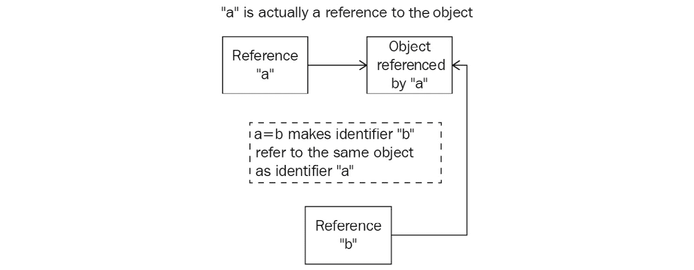

# 第十五章：*第十五章*: 全局解释器锁

Python 并发编程的主要参与者之一是**全局解释器锁**（**GIL**）。在本章中，我们将介绍 GIL 的定义和目的，以及它如何影响 Python 的并发应用程序。我们还将讨论 GIL 对 Python 并发系统造成的问题以及其实现周围的争议。最后，我们将提及一些关于 Python 程序员和开发者应该如何思考和与 GIL 互动的想法。

本章将涵盖以下主题：

+   引入 GIL

+   从 Python 中移除 GIL 的可能性

+   与 GIL 协同工作

虽然本章的讨论将主要侧重于理论，但我们仍能深入了解 Python 并发编程的生态系统。

# 技术要求

本章的代码可以在以下 GitHub 仓库中找到：

[`github.com/PacktPublishing/Advanced-Python-Programming-Second-Edition/tree/main/Chapter15`](https://github.com/PacktPublishing/Advanced-Python-Programming-Second-Edition/tree/main/Chapter15)

# 引入 GIL

GIL 在 Python 并发编程社区中相当流行。它被设计为一个锁，在任何给定时间只允许一个线程访问和控制 Python 解释器，Python 中的 GIL 通常被称为*臭名昭著的 GIL*，它阻止了多线程程序达到其完全优化的速度。

在本节中，我们将讨论 GIL 背后的概念，以及其目的：为什么它被设计和实现，以及它如何影响 Python 中的多线程编程。

## 分析 Python 中的内存管理

在我们深入探讨 GIL 及其影响的具体细节之前，让我们考虑一下 Python 核心开发者在 Python 早期遇到的问题，这些问题导致了 GIL 的需求。具体来说，在内存空间中管理对象方面，Python 编程与其他流行语言编程之间存在显著差异。

例如，在 C++编程语言中，一个变量实际上是在内存空间中的一个位置，值将被写入该位置。这种设置导致，当一个非指针变量被赋予一个特定的值时，编程语言将有效地将那个特定的值复制到内存位置（即，**变量**）。此外，当一个变量被赋予另一个变量（不是指针）时，后者的内存位置将被复制到前者；在赋值之后，这两个变量之间将不再保持任何进一步的连接。

另一方面，Python 将变量视为一个简单的名称，而其实际的变量值被隔离在内存空间中的另一个区域。当一个值被分配给变量时，变量实际上被赋予了指向该值在内存空间中位置的引用（即使术语*引用*在 C++引用的同一意义上并未使用）。因此，Python 的内存管理在本质上与我们在 C++中看到的将值放入内存空间的模型不同。

这意味着当执行赋值指令时，Python 只是与引用交互并交换它们——而不是实际的值本身。也因为如此，多个变量可以引用同一个值，一个变量的更改将反映在所有其他相关联的变量上。

让我们分析 Python 中的这一特性。如果您已经从 GitHub 页面下载了本书的代码，请继续导航到`Chapter15`文件夹。让我们在这里查看`Chapter15/example1.py`文件：

```py
import sys
print(f'Reference count when direct-referencing:  \
  {sys.getrefcount([7])}.')
a = [7]
print(f'Reference count when referenced once:  \
  {sys.getrefcount(a)}.')
b = a
print(f'Reference count when referenced twice:  \
  {sys.getrefcount(a)}.')
###########################################################
a[0] = 8
print(f'Variable a after a is changed: {a}.')
print(f'Variable b after a is changed: {b}.')
print('Finished.')
```

在这个例子中，我们正在查看值`[7]`（一个包含一个元素：整数`7`）的管理。我们提到 Python 中的值是独立于变量存储的，Python 中的值管理只是将变量引用到适当的值。Python 中的`sys.getrefcount()`方法接受一个对象，并返回与该对象相关联的值的所有引用计数器。在这里，我们三次调用`sys.getrefcount()`：在真实值`[7]`上；分配值的变量`a`；最后，分配变量的变量`b`。

此外，我们正在探索通过使用引用该变量的变量来更改值的过程以及所有与该值相关的变量的结果值。具体来说，我们通过变量`a`更改列表的第一个元素，并打印出`a`和`b`的值。运行脚本，您的输出应该类似于以下内容：

```py
> python3 example1.py
Reference count when direct-referencing: 1.
Reference count when referenced once: 2.
Reference count when referenced twice: 3.
Variable a after a is changed: [8].
Variable b after a is changed: [8].
Finished.
```

如您所见，这个输出与我们讨论的以下方式一致：

1.  对于第一个`sys.getrefcount()`函数调用，值`[7]`只有一个引用计数，这是当我们直接引用它时创建的。

1.  当我们将列表分配给变量`a`时，该值有两个引用，因为`a`现在与该值相关联。

1.  最后，当`a`被分配给`b`时，`[7]`被`b`额外引用，引用计数现在是`3`。

1.  在程序第二部分的输出中，我们可以看到当我们改变变量`a`所引用的值时，是`[7]`发生了变化，而不是变量`a`本身。因此，引用与`a`相同值的变量`b`的值也发生了改变。

以下图解说明了这一过程：



图 15.1 – Python 引用方案的示意图

总体来说，在 Python 程序中，变量只是对实际值（对象）的引用，两个变量之间的赋值语句使得这两个变量引用同一个对象，而不是像 C++那样将实际值复制到另一个内存位置。

## GIL 解决的问题

考虑到 Python 对内存和变量管理的实现，我们可以看到在 Python 程序中，对给定值的引用是不断变化的，因此跟踪值的引用计数非常重要。

现在，应用你在*第十四章*“竞争条件”中学到的知识，你应该知道在 Python 并发程序中，这个引用计数是一个共享资源，需要防止竞争条件。换句话说，这个引用计数是一个关键部分，如果处理不当，将导致对特定值引用的变量数量的错误解释。这会导致内存泄漏，使 Python 程序效率显著降低，甚至可能释放一些变量实际正在引用的内存，导致该值永远丢失。

正如你在上一章中学到的，确保特定共享资源不会发生竞争条件的一种解决方案是在该资源上放置一个锁，有效地允许在并发程序中最多只有一个线程在任何给定时间访问该资源。我们还讨论了，如果在并发程序中放置足够的锁，那么该程序将完全变为顺序执行，实现并发不会带来额外的速度提升。

GIL 是针对前两个问题的解决方案，它是对 Python 整个执行过程的一个单一锁。任何想要执行的 Python 指令（**中央处理器**（**CPU**）密集型任务）必须首先获取 GIL，以防止任何引用计数发生竞争条件。

在 Python 语言发展的早期，针对此处描述的问题也提出了其他解决方案，但 GIL（全局解释器锁）因其高效和易于实现而成为迄今为止最有效的方案。由于 GIL 是 Python 整个执行过程中的一个轻量级、全局的锁，因此无需实现其他锁来保证其他关键部分的完整性，从而将 Python 程序的性能开销保持在最低。

## GIL 引起的问题

直观地说，由于 Python 中所有 CPU 密集型任务都受到锁的保护，并发程序将无法完全多线程化。GIL 有效地防止了 CPU 密集型任务在多个线程之间并行执行。为了理解 GIL 这一特性的影响，让我们考虑一个 Python 的例子。导航到`Chapter15/example2.py`，该文件包含以下内容：

```py
import time
import threading
COUNT = 50000000
def countdown(n):
    while n > 0:
        n -= 1
###########################################################
start = time.time()
countdown(COUNT)
print('Sequential program finished.')
print(f'Took {time.time() - start : .2f} seconds.')
###########################################################
thread1 = threading.Thread(target=countdown, args=(  \
  COUNT // 2,))
thread2 = threading.Thread(target=countdown, args=(  \
  COUNT // 2,))
start = time.time()
thread1.start()
thread2.start()
thread1.join()
thread2.join()
print('Concurrent program finished.')
print(f'Took {time.time() - start : .2f} seconds.')
```

在这个例子中，我们正在比较在 Python 中顺序和并发执行特定程序的速度，通过多线程实现。具体来说，我们有一个名为`countdown()`的函数，它模拟了一个重 CPU 密集型任务，它接受一个数字`n`，并将其递减到零或负数。然后我们以顺序程序的方式调用`countdown()`一次`50,000,000`。最后，我们在`25,000,000`上调用该函数两次，每次在一个单独的线程中，这是`50,000,000`的一半；这是程序的并发版本。我们还在跟踪 Python 运行顺序程序和并发程序所需的时间。

从理论上讲，程序的并发版本应该比顺序版本快一半，因为任务实际上被分成两半，通过我们创建的两个线程并行运行。然而，程序产生的输出却表明了相反的情况。以下是通过运行脚本获得的输出：

```py
> python3 example2.py
Sequential program finished.
Took 2.80 seconds.
Concurrent program finished.
Took 2.74 seconds.
```

与我们的预测相反，并发版本的倒计时几乎与顺序版本一样长；多线程并没有为我们程序提供任何明显的加速。这是 GIL 保护 CPU 密集型任务的一个直接效果，因为不允许多个线程同时运行。有时，多线程程序甚至可能比其顺序版本完成执行所需的时间更长，因为还有获取和释放 GIL 的开销。

这无疑是多线程编程，尤其是 Python 中的并发编程的一个重大问题，因为只要程序包含 CPU 密集型指令，这些指令实际上在程序执行过程中将是顺序的。然而，非 CPU 密集型指令发生在 GIL 之外，因此它们不受 GIL 的影响（例如，**输入/输出**（**I/O**）密集型指令）。

在确定了这些问题之后，让我们接下来看看臭名昭著的 GIL 是什么。

# Python 中 GIL 的潜在移除

你已经了解到 GIL 对我们的 Python 多线程程序设置了一个重大的限制，特别是那些具有 CPU 密集型任务的程序。因此，许多 Python 开发者开始对 GIL 持负面看法，*臭名昭著的 GIL*这个术语也开始变得流行。因此，有些人甚至主张从 Python 语言中完全移除 GIL，这并不令人惊讶。

实际上，一些著名的 Python 用户已经尝试过多次移除 GIL。然而，GIL 已经深深地植根于语言的实现中，大多数不是线程安全的库和包的执行也极大地依赖于 GIL，因此移除 GIL 实际上会给你的 Python 程序带来错误以及向后不兼容的问题。一些 Python 开发者和研究人员试图完全从 Python 执行中省略 GIL，而大多数现有的依赖 GIL 功能的 C 扩展已经停止工作。

现在，还有其他可行的解决方案来解决我们讨论过的问题；换句话说，GIL 在任何方面都是可替代的。然而，这些解决方案中包含了许多复杂的指令，实际上会降低顺序和 I/O 密集型程序的性能，而这些程序不受 GIL 的影响。因此，这些解决方案会减慢单线程或多线程 I/O 程序的速度，而这实际上占到了现有 Python 应用程序的大比例。有趣的是，Python 的创造者 Guido van Rossum 在他的文章《移除 GIL 并不容易》中也对此进行了评论，如下所示：

“我欢迎将一系列补丁集成到 Py3k 中，前提是单线程程序（以及多线程但 I/O 密集型程序）的性能不会降低。”

不幸的是，这个请求还没有通过任何提出的 GIL 替代方案得到实现。GIL 仍然是 Python 语言的一个基本组成部分。

在这个基础上，现在让我们看看如何与 GIL 一起工作。

# 与 GIL 一起工作

在你的 Python 应用程序中处理 GIL 有几种方法，这些方法将在接下来的章节中讨论。

## 实现多进程，而不是多线程

这可能是绕过 GIL 并在并发程序中实现最佳速度的最流行和最简单的方法。因为 GIL 只阻止多个线程同时执行 CPU 密集型任务，而跨系统多个核心执行的过程，每个过程都有自己的内存空间，对 GIL 完全免疫。

具体来说，考虑到前面的倒计时示例，让我们比较一下当程序是顺序的、多线程的和多进程的时，这个 CPU 密集型程序的性能。导航到 `Chapter15/example3.py` 文件。程序的前一部分与之前看到的是一样的，但在最后，我们添加了一个针对从 50,000,000 开始倒计时的多进程解决方案的实现，使用两个独立的过程，如下所示：

```py
COUNT = 50000000
def countdown(n):
    while n > 0:
        n -= 1
if __name__ == '__main__':
    #######################################################
    # Sequential
    start = time.time()
    countdown(COUNT)
    #######################################################
    # Multithreading
    thread1 = threading.Thread(target=countdown,  \
      args=(COUNT // 2,))
    thread2 = threading.Thread(target=countdown,  \
      args=(COUNT // 2,))
    start = time.time()
    thread1.start()
    thread2.start()
    thread1.join()
    thread2.join()
    #######################################################
    # Multiprocessing
    pool = Pool(processes=2)
    start = time.time()
    pool.apply_async(countdown, args=(COUNT//2,))
    pool.apply_async(countdown, args=(COUNT//2,))
    pool.close()
    pool.join()
```

程序运行后，这是我的输出：

```py
> python3 example3.py
Sequential program finished.
Took 2.95 seconds.
Multithreading program finished.
Took 2.69 seconds.
Multiprocessing program finished.
Took 1.54 seconds.
```

程序的顺序和多线程版本之间仍然存在微小的速度差异。然而，多进程版本在执行过程中能够将速度降低近一半。正如前面章节所讨论的，由于进程相对较重，多进程指令包含显著的开销，这也是为什么多进程程序的速度并没有正好是顺序程序的一半。

## 使用原生扩展绕过 GIL

有一些用 C/C++编写的 Python 原生扩展，因此能够避免 GIL 设定的限制；一个例子是最受欢迎的 Python 科学计算包 NumPy。在这些扩展中，可以手动释放 GIL，以便执行可以简单地绕过锁。然而，这些释放需要谨慎实现，并在执行返回到主 Python 执行之前重新声明 GIL。

## 利用不同的 Python 解释器

GIL 只存在于 CPython 中，这是迄今为止语言最常用的解释器，是用 C 编写的。然而，还有其他 Python 解释器，如 Jython（用 Java 编写）和 IronPython（用 C++编写），可以用来避免 GIL 及其对多线程程序的影响。请记住，这些解释器不像 CPython 那样广泛使用，并且一些包和库可能不与 CPython 兼容，或者与两者都不兼容？请澄清。

# 摘要

虽然 Python 中的 GIL 为语言中更困难的问题之一提供了一个简单直观的解决方案，但它也引发了许多自身的问题，涉及在 Python 程序中运行多个线程以处理 CPU 密集型任务的能力。已经尝试过多次从 Python 的主要实现中移除 GIL，但没有任何一种方法能够在保持处理非 CPU 密集型任务有效性的同时实现这一点，这些任务受到 GIL 的影响。

总体而言，我们讨论了使与 GIL 一起工作变得更简单的实用方法。我们还了解到，尽管它在 Python 社区中相当有名，但 GIL 只影响生态系统的一部分。这应该更好地指导我们对 GIL 的看法。

在最后四章中，我们讨论了 Python 中并发编程的一些最常见和最著名的问题。在本书的剩余部分，我们将探讨一个不同的主题——Python 的高级设计模式。下一章，我们将从*工厂*模式开始。

# 问题

1.  Python 和 C++在内存管理方面的区别有哪些？

1.  GIL 为 Python 解决了哪些问题？

1.  GIL 为 Python 带来了哪些问题？

1.  在 Python 程序中绕过 GIL 有哪些方法？

# 进一步阅读

如需更多信息，您可以参考以下资源：

+   *Python 全局解释器锁（GIL）是什么？* ([realpython.com/python-gil/](http://realpython.com/python-gil/)), *Abhinav Ajitsaria*

+   *Python GIL 可视化* ([dabeaz.blogspot.com/2010/01/python-gil-visualized](http://dabeaz.blogspot.com/2010/01/python-gil-visualized)), *Dave Beazley*

+   *Python 中的复制操作* ([pythontic.com/modules/copy/introduction](http://pythontic.com/modules/copy/introduction))

+   *移除 GIL 并不容易* ([www.artima.com/weblogs/viewpost.jsp?thread=214235](http://www.artima.com/weblogs/viewpost.jsp?thread=214235)), *Guido van Rossum*

+   *使用 Python 进行并行编程*，由*Jan Palach*著，*Packt Publishing Ltd* (2014)

+   *在 Python 中学习并发：构建高效、健壮和并发的应用程序*，*Elliot Forbes* (2017)
