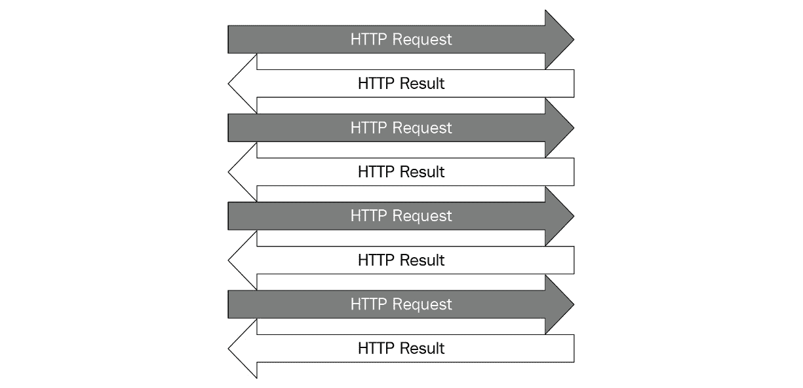
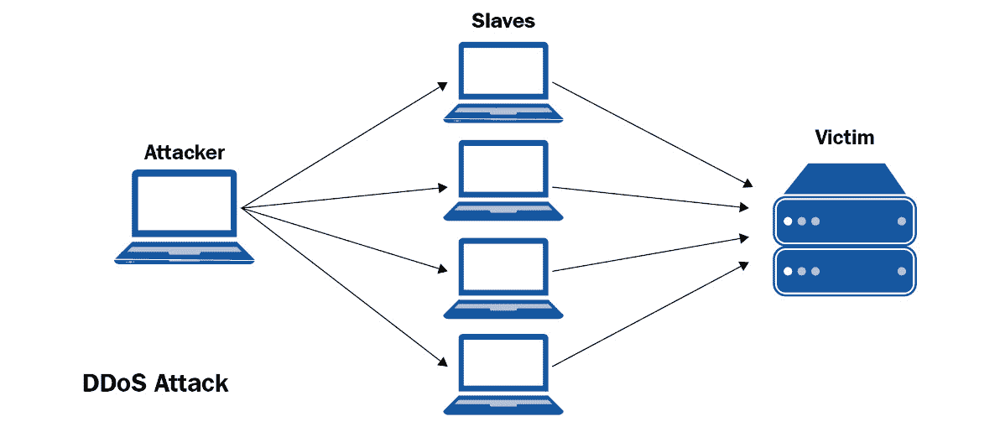

# 第九章：*第九章*：并发网络请求

本章将专注于并发地发起网络请求。直观地讲，向一个网页发送请求以收集其信息与将相同任务应用于另一个网页是独立的。这意味着并发，特别是这里的线程，可以是一个强大的工具，它能为这个过程提供显著的加速。在本章中，我们将学习网络请求的基本原理以及如何使用 Python 与网站交互。我们还将学习并发如何帮助我们高效地发起多个请求。最后，我们将探讨关于网络请求的几个良好实践。

总体而言，本章作为一个实际练习，旨在让我们更加熟悉 Python 中的并发，这将有助于你在未来的并发编程项目中更有信心地应对。

在本章中，我们将涵盖以下主题：

+   网络请求的基本原理

+   请求模块

+   并发网络请求

+   超时问题

+   发起网络请求的良好实践

# 网络请求的基本原理

全球数据生成能力预计每两年翻一番。尽管有一个名为**数据科学**的跨学科领域完全致力于研究数据，但软件开发中的几乎所有编程任务都与收集和分析数据有关。其中很大一部分当然是**数据收集**。然而，我们应用程序所需的数据有时并没有以整洁的方式存储在数据库中——有时，我们需要从网页中收集所需的数据。

例如，**网络爬虫**是一种数据提取方法，它自动向网页发送请求并下载特定信息。网络爬虫使我们能够系统地、持续地从众多网站中收集所需数据。收集到的数据可以在以后由我们的应用程序进行分析，或者简单地以各种格式保存在我们的计算机上。例如，谷歌就维护并运行了大量的网络爬虫，以寻找和索引其搜索引擎的网页。

Python 语言本身为这类应用提供了几个不错的选择。在本章中，我们将主要使用 `requests` 模块来从我们的 Python 程序中发起客户端网络请求。然而，在我们详细了解这个模块之前，我们需要了解一些网络术语，以便能够有效地设计我们的应用程序。

## HTML

`.html` 文件扩展名。在 HTML 文档中，文本被角括号内的标签包围和分隔；即 `<p>`、``、`<i>` 等等。这些标签通常由一对组成——一个开标签和一个闭标签——表示包含在其中的数据的样式或性质。

在 HTML 代码中也可以包含其他形式的媒体，例如图片或视频。在常见的 HTML 文档中使用了大量的其他标签。其中一些指定了一组具有某些共同特征的元素，如`<id></id>`和`<class></class>`。

以下是一个 HTML 代码的示例：


图 9.1 – 示例 HTML 代码

幸运的是，我们不需要详细了解每个 HTML 标签的功能，就能有效地进行网络请求。正如我们将在本章后面看到的那样，进行网络请求的更关键部分是能够有效地与网页交互。

## HTTP 请求

在网络上的典型通信过程中，HTML 文本是要保存和/或进一步处理的数据。这类数据需要从网页中收集，但我们如何进行操作呢？大部分的通信都是通过互联网进行的——更具体地说，是**万维网**（**WWW**）——并且它利用了**超文本传输协议**（**HTTP**）。在 HTTP 中，请求方法用于传达请求的数据信息，并应从服务器返回。

例如，当你在浏览器中输入`packtpub.com`时，浏览器通过 HTTP 向 Packt 网站的主服务器发送一个请求方法，请求网站的数据。现在，如果你的互联网连接和 Packt 的服务器都运行良好，那么你的浏览器将收到服务器的响应，如下面的图所示。此响应将以 HTML 文档的形式呈现，并由你的浏览器解释，你的浏览器将在屏幕上显示相应的 HTML 输出：


图 9.2 – HTTP 通信图

通常，请求方法被定义为动词，表示 HTTP 客户端（网页浏览器）和服务器之间通信时希望执行的操作：`GET`、`HEAD`、`POST`、`PUT`、`DELETE`等。在这些方法中，`GET`和`POST`是两种在网页抓取应用中最常见的请求方法；它们的功能在此处描述：

+   `GET`方法从服务器请求特定的数据。此方法仅检索数据，对服务器及其数据库没有其他影响。

+   `POST`方法以服务器接受的具体形式发送数据。这些数据可以是，例如，给公告板、邮件列表或新闻组的消息，要提交给网页表单的信息，或要添加到数据库的项目。

我们在互联网上常见到的所有通用目的 HTTP 服务器都必须实现至少`GET`（和`HEAD`）方法，而`POST`方法被认为是可选的。

## HTTP 状态码

并非每次向网络服务器发送网络请求时，服务器都会成功处理请求并返回所需数据。有时，服务器可能完全关闭或已经忙于与其他客户端交互，因此对新请求无响应；有时，客户端本身向服务器发送了不良请求（例如，格式不正确或恶意请求）。

作为对这些问题进行分类以及提供尽可能多的信息的一种方式，HTTP 要求服务器对来自其客户端的每个请求以 **HTTP 响应状态码** 进行响应。状态码通常是一个三位数，表示服务器发送回客户端的响应的具体特征。

总共有五个大类的 HTTP 响应状态码，由代码的第一位数字表示。它们如下所示：

+   **1xx (信息状态码)**: 请求已被接收，服务器正在处理它。例如，**100** 表示请求头已接收，服务器正在等待请求体；**102** 表示请求正在处理中（这用于大请求，以防止客户端超时）。

+   **2xx (成功状态码)**: 请求已被服务器成功接收、理解和处理。例如，**200** 表示请求已成功完成；**202** 表示请求已被接受处理，但处理本身尚未完成。

+   **3xx (重定向状态码)**: 需要采取额外操作才能成功处理请求。例如，**300** 表示有多个选项关于如何处理来自服务器的响应（例如，在下载视频文件时给客户端提供多个视频格式选项）；**301** 表示服务器已永久移动，所有请求应指向另一个地址（由服务器响应提供）。

+   **4xx (客户端错误状态码)**: 客户端格式错误，无法处理请求。例如，**400** 表示客户端发送了一个不良请求（例如，语法错误或请求大小过大）；**404**（可能是最著名的状态码）表示请求方法不受服务器支持。

+   **5xx (服务器错误状态码)**: 请求虽然有效，但服务器无法处理。例如，**500** 表示服务器内部出现意外条件导致内部服务器错误；**504**（网关超时）表示充当网关或代理的服务器未及时从最终服务器收到响应。

关于这些状态码还有很多可以说的，但当我们从 Python 进行网络请求时，已经足够我们记住之前提到的五大类别。如果你想找到更多关于这些或其他状态码的详细信息，**互联网数字分配机构**（**IANA**）维护着 HTTP 状态码的官方注册表。现在，让我们开始学习如何在 Python 中制作网络请求。

# `requests`模块

`requests`模块允许用户制作并发送 HTTP 请求方法。在我们将要考虑的应用中，它主要用于与我们要从中提取数据的网页的服务器建立联系，并获取服务器的响应。

注意

根据模块的官方文档，Python 3 的`requests`使用方式。

要在你的计算机上安装该模块，运行以下命令之一：

```py
pip install requests
conda install requests
```

如果你的系统还没有这些，这些命令应该会为你安装`requests`和任何其他必需的依赖项（`idna`、`certifi`、`urllib3`等）。在此之后，在 Python 解释器中运行`import requests`以确认模块已成功安装。接下来，我们将使用`requests`构建我们程序的顺序、非并发版本。

## 在 Python 中制作请求

让我们看看模块的一个示例用法，如下面的代码所示：

```py
import requests
url = 'http://www.google.com'
res = requests.get(url)
print(res.status_code)
print(res.headers)
with open('google.html', 'w') as f:
    f.write(res.text)
print('Done.')
```

在这个例子中，我们使用`requests`模块来下载网页的 HTML 代码；即`www.google.com`。`requests.get()`方法向`url`发送一个`GET`请求方法，并将响应存储在`res`变量中。通过打印输出检查响应的状态和头部信息后，我们创建一个名为`google.html`的文件，并将存储在响应文本中的 HTML 代码写入该文件。

在运行程序后（假设你的网络是正常的，并且 Google 服务器没有宕机），你应该得到以下输出：

```py
200
{'Date': 'Sat, 17 Nov 2018 23:08:58 GMT', 'Expires': '-1', 
'Cache-Control': 'private, max-age=0', 'Content-Type': 'text/
html; charset=ISO-8859-1', 'P3P': 'CP="This is not a P3P 
policy! See g.co/p3phelp for more info."', 'X-XSS-Protection': 
'1; mode=block', 'X-Frame-Options': 'SAMEORIGIN', 'Content-
Encoding': 'gzip', 'Server': 'gws', 'Content-Length': '4958', 
'Set-Cookie': '1P_JAR=2018-11-17-23; expires=Mon, 17-Dec-2018 
23:08:58 GMT; path=/; domain=.google.com, NID=146=NHT7fic3mjBO_
vdiFB3-gqnFPyGN1EGxyMkkNPnFMEVsqjGJ8S0EwrivDBWBgUS7hCPZGHbos
LE4uxz31shnr3X4adRpe7uICEiK8qh3Asu6LH_bIKSLWStAp8gMK1f9_GnQ0_
JKQoMvG-OLrT_fwV0hwTR5r2UVYsUJ6xHtX2s; expires=Sun, 19-May-2019 
23:08:58 GMT; path=/; domain=.google.com; HttpOnly'}
Done.
```

响应有一个`200`状态码，我们知道这意味着请求已经完成。存储在`res.headers`中的响应头部还包含有关响应的进一步具体信息。例如，我们可以看到请求的日期和时间，响应的内容是文本和 HTML，以及内容的总长度为`4958`。

从服务器发送的数据也被写入到`google.html`文件中。当你用文本编辑器打开这个文件时，你将能够看到我们使用`requests`下载的网页的 HTML 代码。另一方面，如果你使用网页浏览器打开这个文件，你将看到原始网页的大部分信息现在是通过下载的离线文件来显示的。

例如，以下是我系统上 Google Chrome 解释 HTML 文件的方式：


图 9.3 – 离线打开下载的 HTML

服务器上还存储了其他信息，这些信息由该服务器的网页引用。这意味着并非所有在线网页提供的信息都可以通过`GET`请求下载，这也是为什么离线 HTML 代码有时无法包含从其下载的在线网页上所有可用信息的原因。（例如，前面截图中的下载 HTML 代码无法正确显示 Google 图标。）

## 运行 ping 测试

拥有 HTTP 请求的基本知识和 Python 中的`requests`模块，在本章剩余部分，我们将解决运行**ping 测试**的核心问题。ping 测试是一种测试你系统与特定网站服务器之间通信的流程，只需请求每个相关服务器即可。通过考虑服务器返回的 HTTP 响应状态码（可能是），测试用于评估你系统的互联网连接或服务器的可用性。

Ping 测试在网站管理员中相当常见，他们通常需要同时管理大量网站。这是一个快速识别意外无响应或下线的页面的好工具。许多工具提供了关于 ping 测试的强大选项，在本章中，我们将设计一个可以同时并发发送多个网络请求的 ping 测试应用程序。

为了模拟发送回我们程序的不同的 HTTP 响应状态码，我们将使用[httpstat.us](http://httpstat.us)，这是一个可以生成各种状态码的网站，通常用于测试制作网络请求的应用程序如何处理不同的响应。具体来说，为了在程序中使用返回`200`状态码的请求，我们可以简单地发送请求[httpstat.us/200](http://httpstat.us/200)；对其他状态码也是如此。在我们的 ping 测试程序中，我们将有一个包含不同状态码的[httpstat.us](http://httpstat.us) URL 列表。

让我们看一下以下代码：

```py
import requests
def ping(url):
    res = requests.get(url)
    print(f'{url}: {res.text}')
urls = [
    'http://httpstat.us/200',
    'http://httpstat.us/400',
    'http://httpstat.us/404',
    'http://httpstat.us/408',
    'http://httpstat.us/500',
    'http://httpstat.us/511'
]
for url in urls:
    ping(url)
print('Done.')
```

在这个程序中，`ping()`函数接收一个 URL 并尝试对该网站发起一个`GET`请求。然后，它打印出服务器返回的响应内容。在我们的主程序中，我们有一个之前提到的不同状态码的列表，我们将逐一遍历并调用`ping()`函数。

运行前面的示例后，最终输出应该如下所示：

```py
http://httpstat.us/200: 200 OK
http://httpstat.us/400: 400 Bad Request
http://httpstat.us/404: 404 Not Found
http://httpstat.us/408: 408 Request Timeout
http://httpstat.us/500: 500 Internal Server Error
http://httpstat.us/511: 511 Network Authentication Required
Done.
```

在这里，我们可以看到我们的 ping 测试程序能够从服务器获取相应的响应。然而，我们当前的程序完全是顺序执行的，我们希望实现一个并发版本。我们将在下一节中这样做。

# 并发网络请求

在并发编程的背景下，我们可以看到向一个网络服务器发送请求并获取返回响应的过程与向不同网络服务器执行相同程序是独立的。这意味着我们可以将并发和并行性应用于我们的 ping 测试应用程序以加快我们的执行速度。

在我们设计的并发 ping 测试应用程序中，将同时向服务器发送多个 HTTP 请求，相应的响应将发送回我们的程序，如下所示：



图 9.4 – 并行 HTTP 请求

正如我们之前提到的，并发和并行性在 Web 开发中有重要的应用，并且如今的大多数服务器都可以同时处理大量的请求。

现在，让我们看看如何借助`threading`模块同时发送多个网络请求。

## 启动多个线程

要应用并发，我们可以简单地使用我们一直在讨论的`threading`模块来创建单独的线程来处理不同的网络请求。让我们看一下以下代码：

```py
import threading
import requests
import time
def ping(url):
    res = requests.get(url)
    print(f'{url}: {res.text}')
urls = [
    'http://httpstat.us/200',
    'http://httpstat.us/400',
    'http://httpstat.us/404',
    'http://httpstat.us/408',
    'http://httpstat.us/500',
    'http://httpstat.us/524'
]
start = time.time()
for url in urls:
    ping(url)
print(f'Sequential: {time.time() - start : .2f} seconds')
print()
start = time.time()
threads = []
for url in urls:
    thread = threading.Thread(target=ping, args=(url,))
    threads.append(thread)
    thread.start()
for thread in threads:
    thread.join()
print(f'Threading: {time.time() - start : .2f} seconds')
```

在这个例子中，我们包含了之前示例中的顺序逻辑来处理我们的 URL 列表，以便我们可以比较在将线程应用于我们的 ping 测试程序时速度的提升。我们还在使用`threading`模块创建一个线程来 ping 我们 URL 列表中的每个 URL；这些线程将独立执行。使用`time`模块的方法还跟踪了顺序和并发处理 URL 所需的时间。

如果你运行程序，你的输出应该类似于以下内容：

```py
http://httpstat.us/200: 200 OK
http://httpstat.us/400: 400 Bad Request
http://httpstat.us/404: 404 Not Found
http://httpstat.us/408: 408 Request Timeout
http://httpstat.us/500: 500 Internal Server Error
http://httpstat.us/524: 524 A timeout occurred
Sequential: 0.82 seconds
http://httpstat.us/404: 404 Not Found
http://httpstat.us/200: 200 OK
http://httpstat.us/400: 400 Bad Request
http://httpstat.us/500: 500 Internal Server Error
http://httpstat.us/524: 524 A timeout occurred
http://httpstat.us/408: 408 Request Timeout
Threading: 0.14 seconds
```

虽然顺序逻辑和线程逻辑处理所有 URL 所需的具体时间可能因系统而异，但两者之间应该仍然有明显的区别。具体来说，在这里，我们可以看到线程逻辑几乎比顺序逻辑快六倍（这对应于我们同时处理六个 URL 的六个线程）。因此，毫无疑问，并发可以为我们的 ping 测试应用程序以及一般网络请求过程提供显著的加速。

## 重构请求逻辑

我们当前的 ping 测试应用程序按预期工作，但我们可以通过重构线程类中我们进行网络请求的逻辑来提高其可读性。考虑以下`MyThread`类：

```py
import threading
import requests
class MyThread(threading.Thread):
    def __init__(self, url):
        threading.Thread.__init__(self)
        self.url = url
        self.result = None
    def run(self):
        res = requests.get(self.url)
        self.result = f'{self.url}: {res.text}'
```

在这个例子中，`MyThread`类继承自`threading.Thread`类，并包含两个额外的属性：`url`和`result`。`url`属性包含线程实例应处理的 URL；从网络服务器返回给该线程的响应将被写入`result`属性（在`run()`函数中）。

在这个类之外，我们可以简单地遍历 URL 列表并相应地创建和管理线程，而无需担心主程序中的请求逻辑：

```py
urls = [
    'http://httpstat.us/200',
    'http://httpstat.us/400',
    'http://httpstat.us/404',
    'http://httpstat.us/408',
    'http://httpstat.us/500',
    'http://httpstat.us/524'
]
start = time.time()
threads = [MyThread(url) for url in urls]
for thread in threads:
    thread.start()
for thread in threads:
    thread.join()
for thread in threads:
    print(thread.result)
print(f'Took {time.time() - start : .2f} seconds')
print('Done.')
```

注意，我们现在将响应存储在`MyThread`类的`result`属性中，而不是像之前示例中的旧`ping()`函数那样直接打印出来。这意味着，在确保所有线程都完成后，我们还需要再次遍历线程并打印出这些响应。

重构请求逻辑不应大大影响我们当前程序的性能；我们正在跟踪执行速度以查看这是否属实。如果您执行程序，您将获得类似于以下输出的结果：

```py
http://httpstat.us/200: 200 OK
http://httpstat.us/400: 400 Bad Request
http://httpstat.us/404: 404 Not Found
http://httpstat.us/408: 408 Request Timeout
http://httpstat.us/500: 500 Internal Server Error
http://httpstat.us/524: 524 A timeout occurred
Took 0.14 seconds
Done.
```

正如我们所预期的那样，通过这次重构的请求逻辑，我们仍然从程序的顺序版本中获得了显著的加速。再次强调，我们的主程序现在更加易于阅读，并且对请求逻辑的进一步调整（正如我们将在下一节中看到的）可以直接针对`MyThread`类进行，而不会影响程序的其余部分。

我们的程序现在可以同时对特定网站发起并发网络请求并显示返回的状态码。然而，处理网络请求时常见的一个问题，我们程序目前还无法处理：超时。我们将在下一节中学习如何解决这个问题。

# 超时的问题

在本节中，我们将探讨我们可以对 ping 测试应用程序进行的一个潜在改进：处理**超时**。超时通常发生在服务器处理特定请求的时间异常长时，服务器与其客户端之间的连接被终止。

在 ping 测试应用程序的上下文中，我们将实现一个针对超时的自定义阈值。回想一下，ping 测试用于确定特定服务器是否仍然响应，因此我们可以在程序中指定，如果请求超过服务器响应的超时阈值，我们将将该特定服务器分类为超时。

## 来自 httpstat.us 的支持和 Python 模拟

除了不同的状态码选项之外，[httpstat.us](http://httpstat.us)网站还为我们提供了一个在发送请求时模拟其响应延迟的方法。具体来说，我们可以通过`GET`请求中的查询参数自定义延迟时间（以毫秒为单位）。例如，[httpstat.us/200?sleep=5000](http://httpstat.us/200?sleep=5000)将在 5 秒延迟后返回响应。

现在，让我们看看这种延迟会如何影响我们程序的执行。考虑以下程序，它包含我们 ping 测试应用程序当前的请求逻辑，但具有不同的 URL 列表：

```py
import threading
import requests
class MyThread(threading.Thread):
    def __init__(self, url):
        threading.Thread.__init__(self)
        self.url = url
        self.result = None
    def run(self):
        res = requests.get(self.url)
        self.result = f'{self.url}: {res.text}'
urls = [
    'http://httpstat.us/200',
    'http://httpstat.us/200?sleep=20000',
    'http://httpstat.us/400'
]
threads = [MyThread(url) for url in urls]
for thread in threads:
    thread.start()
for thread in threads:
    thread.join()
for thread in threads:
    print(thread.result)
print('Done.')
```

在这里，我们有一个大约需要 20 秒才能返回响应的 URL。考虑到我们将使用`join()`方法阻塞主程序，直到所有线程完成它们的执行，我们的程序在打印出任何响应之前可能会看起来挂起 20 秒。

运行程序亲自体验一下。将出现 20 秒的延迟（这将使执行完成的时间显著更长），我们将获得以下输出：

```py
http://httpstat.us/200: 200 OK
http://httpstat.us/200?sleep=20000: 200 OK
http://httpstat.us/400: 400 Bad Request
Took 22.60 seconds
Done.
```

假设 20 秒的响应时间太长，我们无法承受等待这么长时间的请求。因此，我们希望实现一些逻辑来处理这种长时间的等待。

## 超时指定

总体而言，一个高效的 ping 测试应用程序不应该长时间等待其网站的响应；它应该有一个设定的超时阈值，如果服务器在该阈值下未能返回响应，应用程序将认为该服务器无响应。因此，我们需要实现一种方法来跟踪自请求发送到服务器以来已经过去的时间。我们将通过从超时阈值开始倒计时来实现这一点。一旦超过该阈值，所有响应（无论它们是否已经返回）都将被打印出来。

此外，我们还将跟踪有多少请求仍在等待，并且尚未收到它们的响应。我们将使用`threading.Thread`类中的`is_alive()`方法来间接确定是否为特定请求返回了响应。如果在某个时刻，处理特定请求的线程仍然存活，我们可以得出结论，该特定请求仍在等待。

让我们先考虑以下`process_requests()`函数：

```py
import time
UPDATE_INTERVAL = 0.01
def process_requests(threads, timeout=5):
    def alive_count():
        alive = [1 if thread.is_alive() else 0 for thread \
          in threads]
        return sum(alive)
    while alive_count() > 0 and timeout > 0:
        timeout -= UPDATE_INTERVAL
        time.sleep(UPDATE_INTERVAL)
    for thread in threads:
        print(thread.result)
```

此函数接受一个线程列表，这是我们之前示例中用来进行 Web 请求的，以及一个可选的参数，指定超时阈值。在这个函数内部，我们有一个内部函数`alive_count()`，它在函数调用时返回仍然存活的线程数量。

在`process_requests()`函数中，只要当前有线程正在存活并处理请求，我们将允许线程继续它们的执行（这是在`while`循环中通过双重条件完成的）。正如你所看到的，`UPDATE_INTERVAL`变量指定了我们检查此条件的时间间隔。如果任一条件失败（如果没有存活的线程或超时阈值已通过），那么我们将继续打印出响应（即使其中一些可能尚未返回）。

让我们把注意力转向新的`MyThread`类：

```py
import threading
import requests
class MyThread(threading.Thread):
    def __init__(self, url):
        threading.Thread.__init__(self)
        self.url = url
        self.result = f'{self.url}: Custom timeout'
    def run(self):
        res = requests.get(self.url)
        self.result = f'{self.url}: {res.text}'
```

这个类与我们之前考虑的几乎相同，只是`result`属性的初始值是一个表示超时的消息。在我们之前讨论的情况中，即`process_requests()`函数中指定的超时阈值被传递时，这个初始值将在打印响应时使用。

最后，让我们考虑一下我们的主程序`example6.py`：

```py
urls = [
    'http://httpstat.us/200',
    'http://httpstat.us/200?sleep=4000',
    'http://httpstat.us/200?sleep=20000',
    'http://httpstat.us/400'
]
start = time.time()
threads = [MyThread(url) for url in urls]
for thread in threads:
    thread.setDaemon(True)
    thread.start()
process_requests(threads)
print(f'Took {time.time() - start : .2f} seconds')
print('Done.')
```

在我们的 URL 列表中，有一个请求需要 4 秒，另一个需要 20 秒，除了那些可以立即响应的请求。由于我们使用的超时阈值是 5 秒，理论上，我们应该能够看到 4 秒延迟的请求将成功获得响应，而 20 秒延迟的那个则不会。

关于这个程序，还有另一点需要注意：如果`process_requests()`函数在仍有至少一个线程正在处理时传递了超时阈值，那么该函数将继续打印出每个线程的`result`属性：

```py
while alive_count() > 0 and timeout > 0:
    timeout -= UPDATE_INTERVAL
    time.sleep(UPDATE_INTERVAL)
for thread in threads:
    print(thread.result)
```

这意味着我们不是通过使用`join()`函数来阻塞程序，直到所有线程都完成执行，这意味着如果达到超时阈值，程序可以简单地继续前进。然而，这也意味着线程本身在这个点并没有终止。具体来说，20 秒延迟的请求，在程序退出`process_requests()`函数后，仍然很可能会继续运行。

如果处理这个请求的线程不是一个守护线程（正如我们所知，守护线程在后台执行且永远不会终止），它将阻塞主程序完成，直到线程本身完成。通过将这个线程以及任何其他线程变成守护线程，我们允许主程序在执行完最后一条指令后立即完成，即使还有线程正在运行。

让我们看看这个程序的实际运行情况。执行这段代码；你的输出应该类似于以下内容：

```py
http://httpstat.us/200: 200 OK
http://httpstat.us/200?sleep=4000: 200 OK
http://httpstat.us/200?sleep=20000: Custom timeout
http://httpstat.us/400: 400 Bad Request
Took 5.70 seconds
Done.
```

如你所见，我们的程序这次完成大约花了 5 秒钟。这是因为它花了 5 秒钟等待仍在运行的线程，一旦超过 5 秒的阈值，程序就打印出了结果。在这里，我们可以看到 20 秒延迟请求的结果只是`MyThread`类的`result`属性的默认值，而其他请求都能够从服务器获得正确的响应（包括 4 秒延迟请求，因为它有足够的时间获得响应）。

如果你想看到我们之前讨论的非守护线程的效果，只需在我们的主程序中注释掉相应的代码行，如下所示：

```py
threads = [MyThread(url) for url in urls]
for thread in threads:
    #thread.setDaemon(True)
    thread.start()
process_requests(threads)
```

你会看到主程序将挂起大约 20 秒，因为处理 20 秒延迟请求的非守护线程仍在运行，然后才能完成其执行（尽管产生的输出将是相同的）。

# 制作网络请求的良好实践

在制作并发网络请求时，有几个方面需要仔细考虑和实施。在本节中，我们将讨论这些方面以及你在开发应用程序时应使用的最佳实践。

## 考虑服务条款和数据收集政策

过去几年中，未经授权的数据收集一直是科技界的讨论话题，并且这种情况还将持续很长时间——而且有很好的理由。因此，对于在应用程序中制作自动化网络请求的开发者来说，查找网站关于数据收集的政策至关重要。你可以在他们的服务条款或类似文件中找到这些政策。如果有疑问，通常直接联系网站以获取更多详细信息是一个很好的规则。

## 错误处理

在编程领域，错误是任何人都难以轻易避免的，尤其是在进行网络请求时。这些程序中的错误可能包括发出不良请求（无效请求或甚至糟糕的互联网连接）、处理下载的 HTML 代码不当，或者解析 HTML 代码失败。因此，使用 Python 中的`try...except`块和其他错误处理工具来避免应用程序崩溃是非常重要的。如果你的代码/应用程序在生产环境中使用，或者用于更大的应用程序，避免崩溃尤为重要。

特别是，在并发网络爬取中，一些线程可能成功收集数据，而其他线程则失败。通过在程序的多线程部分实现错误处理功能，你可以确保失败的线程不会使整个程序崩溃，并确保成功的线程仍然可以返回其结果。

然而，需要注意的是，我们程序中的`try...except`块将捕获程序执行过程中发生的所有错误，并且无法获得有关错误的更多信息；这种做法也被称为错误吞没。强烈建议你在程序中添加一些特定的错误处理代码，这样不仅可以针对特定错误采取适当的行动，而且可能也会揭示出尚未考虑到的其他错误。

## 定期更新你的程序

网站定期更改其请求处理逻辑以及显示的数据是很常见的。如果一个向网站发送请求的程序在与网站服务器交互时逻辑相当不灵活（例如，以特定格式结构化其请求，只处理一种类型的响应等），那么如果网站更改了处理客户端请求的方式，该程序很可能会停止正确运行。这种情况在寻找特定 HTML 标签中的数据的网络爬虫程序中经常发生；当 HTML 标签更改时，这些程序将无法找到它们的数据。

实施这种做法是为了防止自动化数据收集程序运行。要继续使用最近更改了请求处理逻辑的网站，唯一的方法是分析更新的协议并相应地修改我们的程序。

## 避免大量请求

每次我们讨论的程序运行时，它都会向管理您想要提取数据的网站的服务器发送 HTTP 请求。在并发程序中，这个过程发生得更加频繁，并且时间更短，因为多个请求正在提交到该服务器。

如我们之前提到的，现在的服务器可以轻松地同时处理多个请求。然而，为了避免过度工作并过度消耗资源，服务器也被设计为停止回答过于频繁到来的请求。像亚马逊或 Twitter 这样的大科技公司网站会寻找来自同一 IP 地址的大量自动化请求，并实施不同的响应协议；一些请求可能会延迟，一些请求可能会被拒绝响应，或者 IP 地址甚至可能被禁止在一段时间内进一步发送请求。

有趣的是，向服务器发送重复的、大量请求是一种黑客攻击网站的方式。在**拒绝服务**（**DoS**）和**分布式拒绝服务**（**DDoS**）攻击中，同时向服务器发送大量请求，用流量淹没目标服务器的带宽。结果，来自其他客户端的正常、非恶意请求被拒绝，因为服务器正忙于处理并发请求，如下面的图所示：



图 9.5 – DDoS 攻击的示意图

因此，为避免应用程序被视为攻击者并可能被禁止或被视为恶意客户端，重要的是要分散应用程序对服务器发出的并发请求。这可以简单到限制程序中一次可以实施的最大线程/请求数量，或者在使用`time.sleep()`函数暂停一段时间（例如，在向服务器发送请求之前）。

# 摘要

在本章中，我们学习了 HTML 和网络请求的基础知识。最常用的两种网络请求是`GET`和`POST`请求。HTTP 响应状态码有五大类，每类都表示服务器与其客户端之间通信的不同概念。通过考虑从不同网站接收到的状态码，我们可以编写一个 ping 测试应用程序，有效地检查这些网站的响应性。

并发可以通过多线程同时制作多个网络请求，从而显著提高应用程序的速度。然而，在制作并发网络请求时，需要考虑几个因素。

总的来说，本章中我们刚刚进行的练习将有助于我们解决将顺序程序转换为并发版本的一般问题。我们构建的简单 ping 测试也可以扩展以具有更复杂的行为和功能。在下一章中，我们将考虑一个类似的过程来应用图像处理。

# 问题

1.  什么是 HTML？

1.  什么是 HTTP 请求？

1.  什么是 HTTP 响应状态码？

1.  `requests`模块是如何帮助制作网络请求的？

1.  什么是 ping 测试以及通常是如何设计的？

1.  为什么并发适用于制作网络请求？

1.  在开发制作并发网络请求的应用程序时，需要考虑哪些因素？

# 进一步阅读

+   *《用 Python 自动化无聊的事情：适合完全初学者的实用编程》*，艾尔·斯威加特，No Starch Press，2015

+   *《使用 Python 进行网络爬取》*，理查德·劳森，Packt Publishing Ltd，2015

+   *《Java 快速网络爬取》*，瑞安·米切尔，Packt Publishing Ltd，2013
