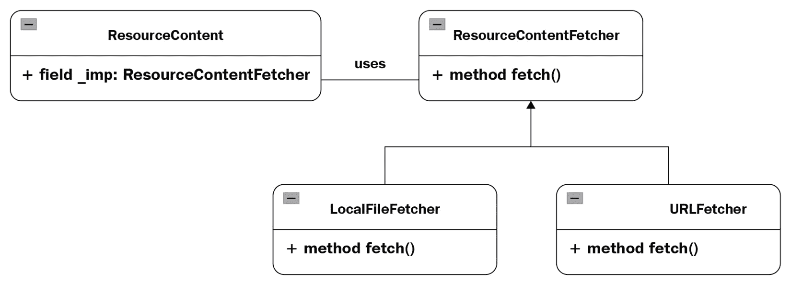

# 第二十一章：*第二十一章*：桥接模式

在前两章中，我们介绍了我们的第一个结构模式**适配器**，它用于使两个不兼容的接口兼容，以及**装饰器**，它允许我们以动态的方式向对象添加责任。还有更多类似的模式。让我们继续这个系列！

需要观察的第三种结构模式是**桥接模式**。我们可以通过观察它们的工作方式来比较**桥接模式**和**适配器模式**。虽然适配器用于使不相关的类协同工作（正如我们在第*第十九章*，*适配器模式*）中讨论的实现示例中所见），但桥接模式在设计之初就是为了解耦实现与其抽象，正如我们将在本章中看到的那样。

具体来说，我们将讨论以下主题：

+   现实世界示例

+   用例

+   实现

到本章结束时，我们将了解如何实现这种设计模式，并更好地理解与适配器模式上述的区别。

# 技术要求

本章的代码文件可以通过此链接访问：[`github.com/PacktPublishing/Advanced-Python-Programming-Second-Edition/tree/main/Chapter21`](https://github.com/PacktPublishing/Advanced-Python-Programming-Second-Edition/tree/main/Chapter21)。

# 现实世界示例

在我们现代的日常生活中，我能想到的一个桥接模式的例子是来自*数字经济*的**信息产品**。如今，信息产品，或**信息产品**是你可以在线找到的资源的一部分，用于培训、自我提升或你的想法和商业发展。在某个市场或供应商网站上找到的信息产品的目的是以易于访问和消费的方式提供特定主题的信息。提供的材料可以是 PDF 文档或电子书、电子书系列、视频、视频系列、在线课程、基于订阅的通讯或所有这些格式的组合。

在软件领域，**设备驱动程序**经常被引用为桥接模式的一个例子，当操作系统（**OS**）的开发者为设备供应商定义接口以实现它时。

接下来，让我们讨论何时应该使用这种设计模式。

# 用例

当你想要在多个对象之间共享实现时，使用桥接模式是个好主意。基本上，而不是实现几个专门的类，在每一个类中定义所有需要的内容，你可以定义以下特殊组件：

+   一个适用于所有类的抽象

+   为涉及的不同对象定义一个单独的接口

接下来，我们将看到一个实现示例，以说明这种方法。

# 实现

假设我们正在构建一个应用程序，用户将管理并交付从不同来源获取的内容，这些来源可能是以下内容：

+   一个基于其 URL 的网页

+   一个在 FTP 服务器上访问的资源

+   本地文件系统上的文件

+   一个数据库服务器

所以，这里的思想是：而不是实现几个内容类，每个类都包含负责获取内容片段、组装它们并在应用程序中显示的方法，我们可以定义 `Resource Content` 的抽象以及一个单独的接口，用于负责获取内容的对象。让我们试试看！

我们从定义我们的 `Resource Content` 抽象类 `ResourceContent` 开始，然后我们需要定义帮助获取内容的实现类接口，即 `ResourceContentFetcher` 类。这个概念被称为 **实现者**。

我们在这里使用的第一个技巧是在 `ResourceContent` 类上使用 `_imp` 属性来维护对对象的引用，该对象代表 *实现者*：

```py
class ResourceContent:
    """
    Define the abstraction's interface.
    Maintain a reference to an object which represents \
      the Implementor.
    """
    def __init__(self, imp):
        self._imp = imp
    def show_content(self, path):
        self._imp.fetch(path)
```

如您现在可能已经知道的，我们使用 Python 语言的两个特性来定义接口的等价物：`metaclass` 特性（它有助于定义 *类型的类型*），以及 **抽象基类**（**ABC**），如下所示：

```py
class ResourceContentFetcher(metaclass=abc.ABCMeta):
    """
    Define the interface for implementation classes that \ 
      fetch content.
    """

    @abc.abstractmethod
    def fetch(path):
        pass
```

现在，我们可以添加一个名为 `URLFetcher` 的实现类，用于从网页或资源获取内容：

```py
class URLFetcher(ResourceContentFetcher):
    """
    Implement the Implementor interface and define its \
      concrete
    implementation.
    """

    def fetch(self, path):
        # path is an URL
        req = urllib.request.Request(path)
        with urllib.request.urlopen(req) as response:
            if response.code == 200:
                the_page = response.read()
                print(the_page)
```

我们还可以添加一个名为 `LocalFileFecher` 的实现类，用于从本地文件系统中的文件获取内容：

```py
class LocalFileFetcher(ResourceContentFetcher):
    """
    Implement the Implementor interface and define its \ 
      concrete
    implementation.
    """
    def fetch(self, path):
        # path is the filepath to a text file
        with open(path) as f:
            print(r.read())
```

基于此，我们展示内容的 `main` 函数，使用两种 *内容获取器* 可能如下所示：

```py
def main():
    url_fetcher = URLFetcher()
    iface = ResourceContent(url_fetcher)
    iface.show_content('http://python.org')
    print('===================')

    localfs_fetcher = LocalFileFetcher()
    iface = ResourceContent(localfs_fetcher)
    iface.show_content('file.txt')
```

总体来说，我们的过程可以用以下 UML 图来概括，其中 `LocalFileFetcher` 和 `URLFetcher` 都继承自 `ResrouceContentFetcher`，而 `ResourceContent` 在其 `_imp` 字段中存储一个 `Fetcher` 对象：



图 21.1 — 内容获取应用程序的 UML 图

让我们看看我们示例（`bridge.py` 文件）的完整代码的总结：

1.  我们导入程序所需的三个模块（`abc`、`urllib.parse` 和 `urllib.request`）。

1.  我们定义了抽象的接口 `ResourceContent` 类。

1.  我们为实现者定义了 `ResourceContentFetcher` 类。

1.  我们定义了两个 `implementation` 类：

    +   `URLFetcher` 用于从 URL 获取内容

    +   `LocalFileFetcher` 用于从本地文件系统获取内容

1.  最后，我们添加了之前显示的 `main()` 函数，以及通常的调用它的技巧。

这里是执行 `python bridge.py` 命令时的部分输出示例：

```py
[output truncated]
des.js"></script>\n\n    <script type="text/javascript" 
src="img/main-min.dd72c1659644.js" charset="utf-
8"></script>\n    \n\n    <!--[if lte IE 7]>\n    <script 
type="text/javascript" src="/static/js/plugins/IE8-
min.8af6e26c7a3b.js" charset="utf-8"></script>\n    \n    
\n    <![endif]-->\n\n    <!--[if lte IE 8]>\n    <script 
type="text/javascript" 
src="/static/js/plugins/getComputedStyle-
min.d41d8cd98f00.js" charset="utf-8"></script>\n    \n    
\n    <![endif]-->\n\n    \n\n    \n    
\n\n</body>\n</html>\n'
===================
Lorem ipsum dolor sit amet, consectetur adipiscing elit. 
Proin in nibh in enim euismod mattis placerat in velit. 
Donec malesuada risus sed venenatis pharetra. Proin 
tincidunt porttitor euismod. Etiam non odio sodales, 
tincidunt elit ac, sodales nisi. Donec massa felis, 
pharetra ut libero nec, consectetur venenatis dui. 
Phasellus nec sem non erat ultricies finibus. Donec sed 
blandit arcu. Aliquam erat volutpat. Donec aliquam ipsum 
risus, et accumsan nibh faucibus non. Aenean faucibus 
feugiat diam vitae rutrum. Sed ullamcorper leo sed orci 
efficitur rhoncus.
Duis vitae dolor vestibulum nibh semper faucibus. Vivamus 
libero quam, ultrices quis sapien vel, blandit ultricies 
purus. Nunc nisl lorem, rutrum id aliquam nec, dictum non 
ligula. Duis ullamcorper, nulla quis luctus commodo, massa 
lorem tristique orci, quis aliquam diam est semper nisi. 
Maecenas tempor odio auctor nulla efficitur, non convallis 
tellus iaculis. Fusce quis purus nibh. Nulla tempor est vel 
metus sodales, in dapibus risus molestie. Donec tristique 
tellus in pretium pulvinar. Pellentesque ut vehicula 
mauris. Vivamus pellentesque, tellus in dictum vehicula, 
justo ex volutpat sem, at cursus nisl elit non ex. Sed sed 
leo eget eros lobortis laoreet. Sed ornare vitae mi a 
vestibulum. Suspendisse potenti. Donec sed ligula ac enim 
mattis posuere.
```

这就是如何使用设计中的桥接模式从不同来源提取内容并将结果集成到相同的数据处理系统或用户界面中的基本说明。

# 总结

在本章中，我们讨论了桥接模式。与适配器模式相似，桥接模式的不同之处在于它预先用来以解耦的方式定义抽象及其实现，这样两者都可以独立变化。

当编写用于操作系统、设备驱动程序、GUI 和网站构建器等问题的软件时，桥接模式非常有用，在这些领域中我们有多套主题，并且需要根据某些属性更改网站的主题。

为了帮助您理解这个模式，我们在内容提取和管理领域讨论了一个示例，其中我们定义了一个抽象的接口、一个实现者的接口以及两个实现。

在下一章中，我们将介绍外观模式。

# 问题

1.  桥接模式的主要动机是什么？

1.  桥接模式与适配器模式有何不同？

1.  我们考虑的内容提取的 Python 示例中，桥接模式是如何实现的？
