# 第一章：使用网络

你能想象一个没有互联网的生活吗？对于几乎所有的事情，从交换信息到订购食物，我们今天都严重依赖互联网。让我们深入了解万维网的世界，并探讨我们如何使用 Python 模块与之交互的多种方式。

在本章中，我们将涵盖以下食谱：

+   发送 HTTP 请求

+   简要了解网络爬虫

+   解析和提取网页内容

+   从网络下载内容

+   使用第三方 REST API 进行工作

+   Python 中的异步 HTTP 服务器

+   使用 selenium 绑定进行网络自动化

+   使用网络爬虫自动化生成潜在客户

# 简介

互联网使生活变得如此简单，有时您甚至没有意识到它的力量。查看朋友的动态，给父母打电话，回复重要的商务电子邮件，或玩游戏——我们今天几乎在所有事情上都依赖于**万维网**（**WWW**）。

幸运的是，Python 拥有一套丰富的模块，帮助我们执行网络上的各种任务。哇！您不仅可以发送简单的 HTTP 请求从网站检索数据或下载页面和图片，还可以解析页面内容以收集信息，并使用 Python 进行分析以生成有意义的见解。等等；我提到过您可以通过自动化方式启动浏览器来执行日常例行任务吗？

本章的食谱将主要关注在执行上述网络操作时可以作为首选工具的 Python 模块。具体来说，在本章中，我们将重点关注以下 Python 模块：

+   `requests` ([`docs.python-requests.org/en/master/`](http://docs.python-requests.org/en/master/))

+   `urllib2` ([`docs.python.org/2/library/urllib2.html`](https://docs.python.org/2/library/urllib2.html))

+   `lxml` ([`pypi.python.org/pypi/lxml`](https://pypi.python.org/pypi/lxml))

+   `BeautifulSoup4` ([`pypi.python.org/pypi/beautifulsoup4`](https://pypi.python.org/pypi/beautifulsoup4))

+   `selenium` ([`selenium-python.readthedocs.org/`](http://selenium-python.readthedocs.org/))

### 注意

尽管本章的食谱将为您概述如何使用 Python 模块与网络交互，但我鼓励您尝试并开发适用于多种用例的代码，这将使您个人以及您的项目在组织规模上受益。

# 发送 HTTP 请求

在本章接下来的食谱中，我们将使用 Python v2.7 和 Python 的 `requests` (v2.9.1) 模块。本食谱将向您展示如何向互联网上的网页发送 HTTP 请求。

但在深入之前，让我们简要了解**超文本传输协议**（**HTTP**）。HTTP 是一种无状态的应用协议，用于在 WWW 上进行数据通信。典型的 HTTP 会话涉及一系列请求或响应事务。客户端在专用的 IP 和端口上向服务器发起**TCP**连接；当服务器收到请求时，它会以响应代码和文本进行响应。HTTP 定义了请求方法（如`GET`、`POST`等 HTTP 动词），这些方法指示对给定 Web URL 要采取的操作。

在这个菜谱中，我们将学习如何使用 Python 的`requests`模块进行 HTTP `GET`/`POST`请求。我们还将学习如何 POST `json`数据并处理 HTTP 异常。太酷了，让我们开始吧。

## 准备工作

要逐步完成这个菜谱，你需要安装 Python v2.7。安装后，你需要安装 Python `pip`。**PIP**代表**Pip Installs Packages**，是一个可以用于在计算机上下载和安装所需 Python 包的程序。最后，我们需要`requests`模块来发送 HTTP 请求。

我们将首先安装`requests`模块（我将把 Python 和`pip`的安装留给你根据你的操作系统在你的机器上执行）。不需要其他先决条件。所以，快点，让我们开始吧！

## 如何操作...

1.  在你的 Linux/Mac 计算机上，转到终端并运行以下命令：

    ```py
            pip install -U requests

    ```

    只有在没有权限访问 Python 站点包时，你才需要使用`sudo`，否则不需要`sudo`。

1.  以下代码帮助你使用 Python 的`requests`模块进行 HTTP `GET`请求：

    ```py
            import requests r =
            requests.get('http://ip.jsontest.com/')
            print("Response object:", r)
            print("Response Text:", r.text)
    ```

1.  你将看到以下输出：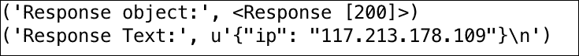

1.  使用 requests 创建带有数据负载的 HTTP `GET`请求也很简单。以下代码帮助你实现这一点。这就是你如何检查将要发送的 URL 请求：

    ```py
            payload = {'q': 'chetan'} r =
            requests.get('https://github.com/search', params=payload)
            print("Request URL:", r.url)
    ```

    

1.  现在我们使用`requests`模块进行 HTTP `POST`调用。这类似于在网站上填写并提交登录或注册表单：

    ```py
            payload = {'key1': 'value1'} r = 
            requests.post("http://httpbin.org/post", data=payload)
            print("Response text:", r.json())
    ```

    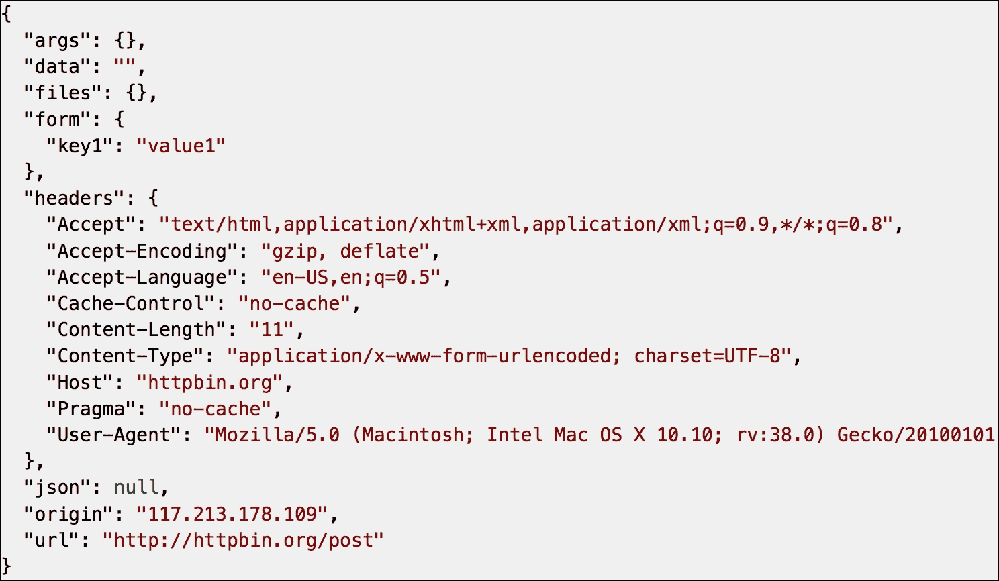

1.  使用 requests 处理错误和异常也非常方便。以下代码片段展示了错误处理的示例。如果你在没有网络连接的情况下运行此代码，它将引发异常。异常处理程序捕获异常并指出它未能建立新的连接，正如预期的那样：

    ```py
            try:
                r = requests.get("http://www.google.com/")
            except requests.exceptions.RequestException as e:
                print("Error Response:", e.message)
    ```

## 工作原理...

在这个菜谱中，我们探讨了如何使用 Python 的`requests`模块进行不同类型的 HTTP 请求。让我们看看这段代码是如何工作的：

+   在第一个示例中，我们向[`ip.jsontest.com`](http://ip.jsontest.com) 发起了`GET`请求并获得了响应代码和响应文本。它返回我们计算机在互联网上的当前 IP 地址。

+   在第二个例子中，我们使用带有有效载荷数据的 HTTP `GET`请求。看看请求 URL 中包含`?q=chetan`，它通过 GitHub 搜索所有名为 Chetan 的仓库。

+   接下来，我们使用有效载荷数据`{'key1', 'value1'}`进行了`POST`请求。这就像我们在*如何做*部分观察到的在线表单提交。

+   `requests`模块有一个`Response`对象`r`，它包含各种方法。这些方法有助于在处理网络时提取响应、状态码和其他所需信息：

    +   `r.status_code` - 返回响应代码

    +   `r.json()` - 将响应转换为`.json`格式

    +   `r.text` - 返回查询的响应数据

    +   `r.content` - 包含响应内容中的 HTML 和 XML 标签

    +   `r.url` - 定义请求的 Web URL

+   我们还探讨了使用`requests`模块的异常处理，如果没有互联网，则会发生异常，而`requests`模块可以轻松捕获这个异常。这是通过`requests`模块的`requests.exceptions`类实现的。

## 还有更多...

太棒了，这很简洁！在网络上进行 HTTP 请求只是开始。我们还可以在网络上做更多的事情，比如处理页面内容。那么，让我们看看接下来是什么。

# 网络抓取的简要概述

在我们学习如何进行**网络抓取**之前，让我们先了解什么是抓取。在互联网世界中，抓取是一种通过计算机程序筛选网站页面，以提取所需信息的方式，这些信息以特定的格式呈现。例如，如果我想获取一个博客上所有发布的文章的标题和日期，我可以编写一个程序来抓取博客，获取所需数据，并根据需要将其存储在数据库或平面文件中。

网络抓取经常与网络爬虫混淆。**网络爬虫**是一个机器人，它系统地浏览网络，目的是进行网页索引，并被搜索引擎用于索引网页，以便用户更有效地搜索网络。

但抓取并不容易。对我们来说有趣的数据可能以特定的格式存在于一个博客或网站上，比如说 XML 标签或嵌入在 HTML 标签中。因此，在我们开始提取所需数据之前，了解格式是很重要的。此外，网络抓取器应该知道提取的数据需要存储的格式，以便以后可以对其采取行动。还重要的是要理解，如果 HTML 或 XML 格式发生变化，即使浏览器显示相同，抓取代码也会失败。

## 网络抓取的合法性

从法律角度来看，网络抓取一直备受关注。你能进行网络抓取吗？这是否合法或道德？我们能从抓取中获得的数据中获利吗？

这个主题已经引起了大量讨论，但总的来说，如果你在爬取版权信息、违反计算机欺诈和滥用法或违反网站服务条款时进行网络爬虫，你可能会遇到问题。例如，如果你在爬取公共数据，你应该没问题。然而，这非常具体，你需要小心你正在爬取的内容以及你如何使用这些数据。

这里有一些关于网络数据抓取的要点：

+   [`en.wikipedia.org/wiki/Web_scraping#Legal_issues`](https://en.wikipedia.org/wiki/Web_scraping#Legal_issues)

+   [`www.quora.com/What-is-the-legality-of-web-scraping`](https://www.quora.com/What-is-the-legality-of-web-scraping)

## 准备工作

我们以 GitHub 网站的定价数据为例，用 Python 演示网络爬虫。这是一个非常简单的例子，但能让我们熟悉爬虫。让我们开始，用这个 Python 食谱抓取一些有趣的数据。

## 如何操作...

1.  在你的电脑上打开 Google Chrome 浏览器并打开[`github.com/pricing/`](https://github.com/pricing/)网页。在这个页面上，你会注意到多个定价计划，即**个人**、**组织**和**企业**。

1.  现在，在你的浏览器上，右键点击**个人**计划的定价，然后点击**检查**元素，如下截图所示：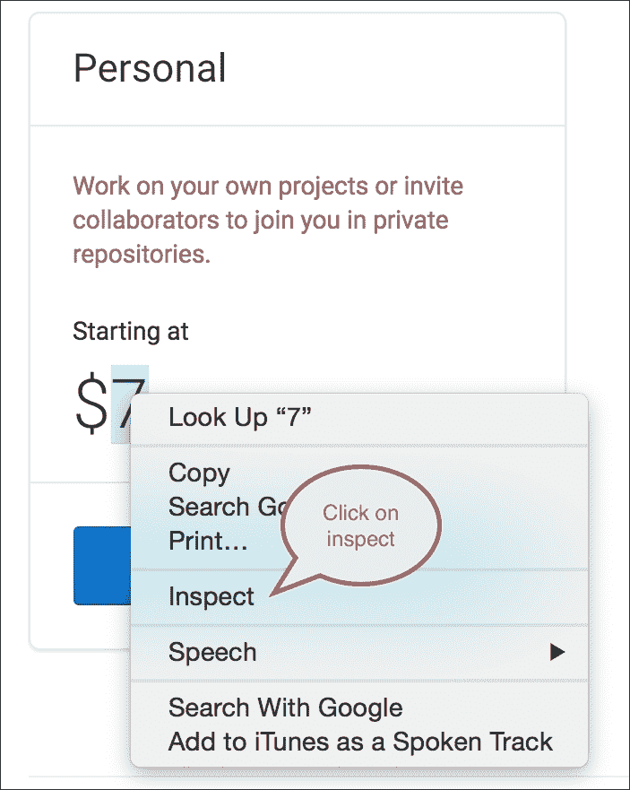

1.  一旦你点击**检查**，Chrome 浏览器的控制台日志就会打开，这将帮助你理解 GitHub 定价页面的 HTML 结构，如下所示：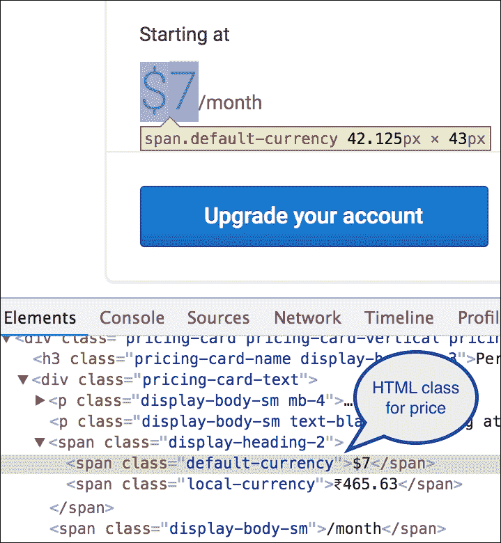

1.  如果你查看高亮的 HTML `span` - `<span class="default-currency">$7</span>`，你会知道这个网页使用`default-currency`类来列出计划的定价。现在我们将使用这个属性来提取多个 GitHub 计划的定价。

1.  在此之前，让我们安装 Python 模块`lxml`，它将用于从前面的 HTML 文档中提取内容。安装`lxml`和`requests`模块：

    ```py
     pip install lxml 
     pip install requests

    ```

1.  现在，打开你喜欢的编辑器并输入此代码片段：

    ```py
            from lxml import html 
            import requests 

            page = requests.get('https://github.com/pricing/') 
            tree = html.fromstring(page.content) 
            print("Page Object:", tree) 
            plans = tree.xpath('//h2[@class="pricing-card-name 
            alt-h3"]/text()') 
            pricing = tree.xpath('//span[@class="default-
            currency"]/text()') 
            print("Plans:", plans, "\nPricing:", pricing) 

    ```

1.  如果你查看前面的代码，我们使用了`default-currency`类和`pricing-card-name display-heading-3`来获取定价和定价计划。如果你运行代码片段，程序的输出将如下所示：

    ### 注意

    使用网络爬虫时，你会看到当网页内容的 HTML 标签发生变化时会出现问题。例如，如果 CSS 类名被更改或锚点被按钮替换，爬虫代码可能无法获取你所需的数据。因此，请确保你相应地更改你的 Python 代码。

## 它是如何工作的...

正如我们之前讨论的，我们需要找到一种合适的方法来提取信息。因此，在这个例子中，我们首先获取了[`github.com/pricing/`](https://github.com/pricing/)页面的 HTML 树。我们通过`fromstring()`方法获得了树，该方法将页面内容（字符串格式）转换为 HTML 格式。

然后，使用`lxml`模块和`tree_xpath()`方法，我们查找了`default-currency`类和`pricing-card-name display-heading-3`以获取定价和定价计划。

看看我们如何使用完整的 XPath，`h3[@class='class-name']`，来定位定价计划，以及`//span[@class="default-currency"]` XPath 来选择实际定价数据。一旦选择了元素，我们就打印出返回给我们的 Python 列表中的文本数据。

就这样；我们刮取了 GitHub 页面上的所需数据。简单又直接。

## 还有更多...

你学习了什么是网络爬虫，以及它们如何继续从网络中提取有趣的信息。你也理解了它们与网络爬虫的不同之处。但总有更多的事情！

网络爬取涉及提取，但在我们从网页解析 HTML 内容以获取对我们感兴趣的数据之前，这是不可能发生的。在下一个菜谱中，我们将详细了解如何解析 HTML 和 XML 内容。

# 解析和提取网络内容

好吧，现在我们对向多个 URL 发起 HTTP 请求有了信心。我们还查看了一个简单的网络爬取示例。

但万维网由多种数据格式的页面组成。如果我们想刮取网络并理解数据，我们还应该知道如何解析网络上的数据所采用的不同格式。

在这个菜谱中，我们将讨论如何...

## 准备工作

网络上的数据大多以 HTML 或 XML 格式存在。为了理解如何解析网络内容，我们将以一个 HTML 文件为例。我们将学习如何选择特定的 HTML 元素并提取所需的数据。为此菜谱，你需要安装 Python 的`BeautifulSoup`模块。`BeautifulSoup`模块是 Python 中最全面的模块之一，它将很好地解析 HTML 内容。所以，让我们开始吧。

## 如何做到这一点...

1.  我们首先在我们的 Python 实例上安装`BeautifulSoup`。以下命令将帮助我们安装模块。我们安装最新版本，即`beautifulsoup4`：

    ```py
     pip install beautifulsoup4

    ```

1.  现在，让我们看一下以下 HTML 文件，它将帮助我们了解如何解析 HTML 内容：

    ```py
            <html >
            <head>
                <title>Enjoy Facebook!</title> 
            </head>
            <body>
                <p>
                  <span>You know it's easy to get intouch with
                  your <strong>Friends</strong> on web!<br></span>
                  Click here <a href="https://facebook.com">here</a>
                  to sign up and enjoy<br>
                </p>
                <p class="wow"> Your gateway to social web! </p>
                <div id="inventor">Mark Zuckerberg</div>
                Facebook, a webapp used by millions
            </body>
            </html>
    ```

1.  让我们把这个文件命名为`python.html`。我们的 HTML 文件是手工制作的，这样我们就可以学习多种解析它的方法来获取所需的数据。`Python.html`提供了以下典型的 HTML 标签：

    +   `<head>` - 它是所有头元素（如`<title>`）的容器。

    +   `<body>` - 它定义了 HTML 文档的主体。

    +   `<p>` - 此元素在 HTML 中定义一个段落。

    +   `<span>` - 它用于在文档中分组内联元素。

    +   `<strong>` - 它用于给此标签下出现的文本应用粗体样式。

    +   `<a>` - 它代表一个超链接或锚点，并包含指向超链接的`<href>`。

    +   `<class>` - 它是一个指向样式表中类的属性。

    +   `<div id>` - 它是一个封装其他页面元素并将内容划分为不同部分的容器。每个部分都可以通过属性`id`来识别。

1.  如果我们在浏览器中打开这个 HTML，它将看起来像这样：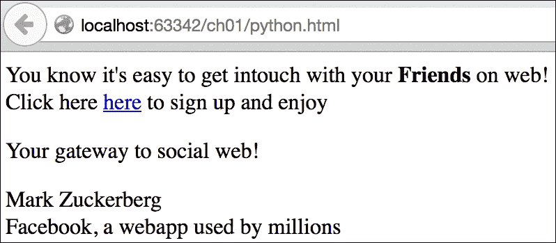

1.  现在我们来编写一些 Python 代码来解析这个 HTML 文件。我们首先创建一个`BeautifulSoup`对象。

    ### 提示

    我们总是需要定义解析器。在这种情况下，我们使用了`lxml`作为解析器。解析器帮助我们以指定的格式读取文件，这样查询数据就变得容易了。

    ```py
            import bs4
            myfile = open('python.html')
            soup = bs4.BeautifulSoup(myfile, "lxml")
            #Making the soup
            print "BeautifulSoup Object:", type(soup)
    ```

    前面代码的输出可以在以下屏幕截图看到：

    

1.  好的，这很整洁，但我们如何检索数据？在我们尝试检索数据之前，我们需要选择包含所需数据的 HTML 元素。

1.  我们可以通过不同的方式选择或查找 HTML 元素。我们可以通过 ID、CSS 或标签来选择元素。以下代码使用`python.html`来演示这个概念：

    ```py
            #Find Elements By tags
            print soup.find_all('a')
            print soup.find_all('strong')
            #Find Elements By id
            print soup.find('div', {"id":"inventor"})
            print soup.select('#inventor')
            #Find Elements by css print
            soup.select('.wow')
    ```

    前面代码的输出可以在以下屏幕截图查看：

    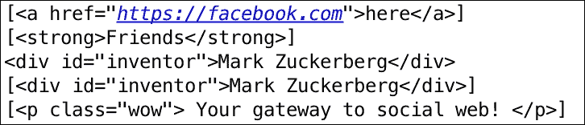

1.  现在我们继续前进，从 HTML 文件中获取实际内容。以下是我们可以提取感兴趣数据的一些方法：

```py
        print "Facebook URL:", soup.find_all('a')[0]['href']
        print "Inventor:", soup.find('div', {"id":"inventor"}).text 
        print "Span content:", soup.select('span')[0].getText()
```

前面代码片段的输出如下：


哇！看看我们是如何从 HTML 元素中获取所有我们想要的文本的。

## 它是如何工作的...

在这个菜谱中，你学会了根据 ID、CSS 或标签查找或选择不同 HTML 元素的技术。

在这个菜谱的第二个代码示例中，我们使用了`find_all(**'**a**'**)`来从 HTML 文件中获取所有锚元素。当我们使用`find_all()`方法时，我们得到了多个匹配项作为数组。`select()`方法可以帮助你直接到达元素。

我们还使用了`find(**'**div**'**, <divId>)`或`select(<divId>)`通过`div Id`选择 HTML 元素。注意我们如何使用`find()`和`select()`方法以两种方式选择了具有`div` ID `#inventor`的`inventor`元素。实际上，选择方法也可以用作`select(<class**-**name>)`来选择具有 CSS 类名的 HTML 元素。我们在示例中使用了这种方法来选择元素`wow`。

在第三个代码示例中，我们搜索了 HTML 页面中的所有锚元素，并使用`soup.find_all(**'**a**'**) [0]`查看第一个索引。请注意，由于我们只有一个锚标签，我们使用了索引 0 来选择该元素，但如果我们有多个锚标签，我们可以通过索引 1 来访问。像`getText()`这样的方法和像`text`这样的属性（如前例所示）有助于从元素中提取实际内容。

## 更多...

好的，所以我们理解了如何使用 Python 解析网页（或 HTML 页面）。你也学习了如何通过 ID、CSS 或标签选择或查找 HTML 元素。我们还看了如何从 HTML 中提取所需内容的示例。如果我们想从网络上下载页面或文件的内容呢？让我们看看我们是否能在下一个菜谱中实现这一点。

# 从网络下载内容

因此，在先前的菜谱中，我们看到了如何进行 HTTP 请求，你也学习了如何解析网络响应。现在是时候继续前进，从网络上下载内容了。你知道万维网不仅仅是 HTML 页面。它还包含其他资源，如文本文件、文档和图片，以及其他许多格式。在这个菜谱中，你将学习如何使用示例在 Python 中下载图片。

## 准备工作

要下载图片，我们需要两个 Python 模块，即`BeautifulSoup`和`urllib2`。我们可以使用`requests`模块代替`urllib2`，但这样做将帮助你了解`urllib2`作为 HTTP 请求的替代方案，这样你就可以炫耀一下了。

## 如何操作...

1.  在开始这个菜谱之前，我们需要回答两个问题。我们想下载什么类型的图片？我从网络上的哪个位置下载图片？在这个菜谱中，我们从谷歌([`google.com`](https://google.com))图片搜索下载《阿凡达》电影图片。我们下载符合搜索条件的顶部五张图片。为了做到这一点，让我们导入所需的 Python 模块并定义我们将需要的变量：

    ```py
            from bs4 import BeautifulSoup
            import re
            import urllib2
            import os 
            ## Download paramters
            image_type = "Project"
            movie = "Avatar"
            url = "https://www.google.com/search?q="+movie+"&source=lnms&tbm=isch"
    ```

1.  好的，那么我们现在就创建一个带有 URL 参数和适当头部的`BeautifulSoup`对象。看看在使用 Python 的`urllib`模块进行 HTTP 调用时`User-Agent`的使用情况。`requests`模块在执行`HTTP`调用时会使用它自己的`User-Agent`：

    ```py
            header = {'User-Agent': 'Mozilla/5.0'}
            soup = BeautifulSoup(urllib2.urlopen
            (urllib2.Request(url,headers=header)))
    ```

1.  谷歌图片托管在域名`http://www.gstatic.com/`下的静态内容中。因此，使用`BeautifulSoup`对象，我们现在尝试找到所有源 URL 包含`http://www.gstatic.com/`的图片。以下代码做了完全相同的事情：

    ```py
            images = [a['src'] for a in soup.find_all("img", {"src":
            re.compile("gstatic.com")})][:5]
            for img in images:
            print "Image Source:", img
    ```

    前面的代码片段的输出可以在下面的屏幕截图中看到。注意我们是如何获取网络上顶部五张图片的源 URL：

    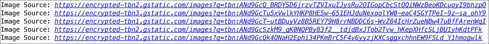

1.  现在我们已经得到了所有图片的源 URL，让我们开始下载它们。下面的 Python 代码使用`urlopen()`方法来`read()`图片并将其下载到本地文件系统：

    ```py
            for img in images:
              raw_img = urllib2.urlopen(img).read()
              cntr = len([i for i in os.listdir(".") if image_type in i]) + 1
            f = open(image_type + "_"+ str(cntr)+".jpg", 'wb') 
            f.write(raw_img)
            f.close()
    ```

1.  当图片下载完成后，我们可以在我们的编辑器中看到它们。以下快照显示了我们所下载的顶部五张图片以及`Project_3.jpg`的外观：

## 工作原理...

因此，在这个菜谱中，我们探讨了从网络下载内容。首先，我们定义了下载的参数。参数就像配置，定义了可下载资源的位置以及要下载的内容类型。在我们的例子中，我们定义了必须下载*阿凡达*电影图片，而且是从**Google**下载。

然后，我们创建了`BeautifulSoup`对象，它将使用`urllib2`模块进行 URL 请求。实际上，`urllib2.Request()`使用配置准备请求，例如头部和 URL 本身，而`urllib2.urlopen()`实际上执行请求。我们包装了`urlopen()`方法的 HTML 响应，并创建了一个`BeautifulSoup`对象，这样我们就可以解析 HTML 响应。

接下来，我们使用 soup 对象搜索 HTML 响应中存在的顶级五张图片。我们根据`img`标签使用`find_all()`方法搜索图片。正如我们所知，`find_all()`返回一个包含图片 URL 的列表，其中图片在**Google**上可用。

最后，我们遍历了所有 URL，并在 URL 上再次使用`urlopen()`方法来`read()`图片。`read()`以原始格式返回图片的二进制数据。然后我们使用这个原始图片将它们写入到我们的本地文件系统中。我们还添加了逻辑来命名图片（它们实际上是自动递增的），以便在本地文件系统中唯一标识它们。

真好！这正是我们想要达到的效果！现在让我们提高一下难度，看看在下一个菜谱中我们还能探索些什么。

# 与第三方 REST API 一起工作

现在我们已经涵盖了抓取、爬取和解析，是时候做另一件有趣的事情了，那就是使用 Python 与第三方 API 一起工作。我假设我们中的许多人可能已经了解并且可能对**REST API**有基本的了解。那么，让我们开始吧！

## 准备工作

为了展示理解，我们以 GitHub gists 为例。GitHub 中的 gists 是分享你工作的最佳方式，一个小代码片段可以帮助你的同事，或者一个包含多个文件的小应用程序，可以让人理解一个概念。GitHub 允许创建、列出、删除和更新 gists，并且它是使用 GitHub REST API 的一个经典案例。

因此，在本节中，我们使用我们自己的`requests`模块向 GitHub REST API 发送 HTTP 请求以创建、更新、列出或删除 gists。

以下步骤将向您展示如何使用 Python 操作 GitHub REST API。

## 如何操作...

1.  要使用 GitHub REST API，我们需要创建一个**个人访问令牌**。为此，请登录到[`github.com/`](https://github.com/)并浏览到[`github.com/settings/tokens`](https://github.com/settings/tokens)，然后点击**生成新令牌**：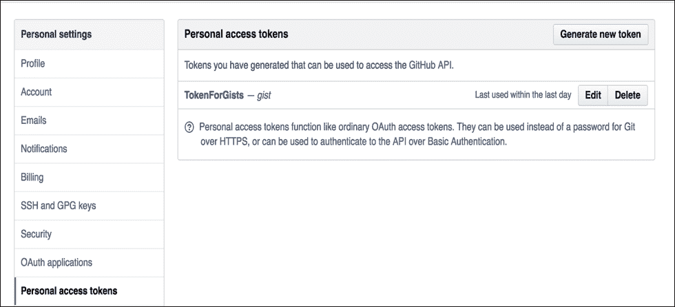

1.  你现在将被带到**新的个人访问令牌**页面。在页面顶部输入描述，并在提供的范围中选择**gists**选项。请注意，范围代表令牌的访问权限。例如，如果你只选择**gists**，你可以使用 GitHub API 来处理**gists**资源，但不能处理其他资源，如**repo**或用户。对于这个菜谱，**gists**范围正是我们所需要的：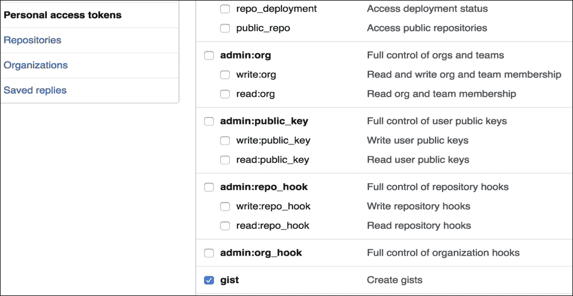

1.  一旦你点击**生成令牌**，你将看到一个包含你的个人访问令牌的屏幕。请将此令牌保密保存。

1.  在获得访问令牌后，让我们开始使用 API 并创建一个新的摘要。在创建过程中，我们添加一个新的资源，为此，我们在 GitHub API 上执行 HTTP`POST`请求，如下所示：

    ```py
            import requests
            import json
            BASE_URL = 'https://api.github.com'
            Link_URL = 'https://gist.github.com'
            username = '<username>' ## Fill in your github username
            api_token = '<api_token>'  ## Fill in your token
            header = {  'X-Github-Username': '%s' % username,
                        'Content-Type': 'application/json',
                        'Authorization': 'token %s' % api_token,
            }
            url = "/gists" 
            data ={
              "description": "the description for this gist",
              "public": True,
              "files": { 
                "file1.txt": { 
                  "content": "String file contents" 
                } 
              }
            }
            r = requests.post('%s%s' % (BASE_URL, url), 
                headers=header, 
               data=json.dumps(data))
           print r.json()['url']
    ```

1.  如果我现在去 GitHub 上的`gists`页面，我应该能看到新创建的摘要。哇，它可用！！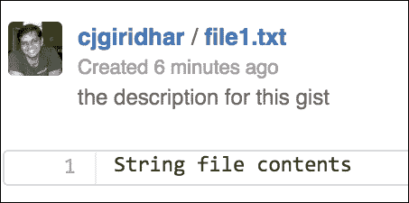

1.  嘿，我们使用 GitHub API 成功创建了摘要。这很酷，但我们现在可以查看这个`gist`吗？在上面的例子中，我们也打印了新创建的摘要的 URL。它将是以下格式：`https://gist.github.com/<username>/<gist_id>`。我们现在使用这个**gist_id**来获取摘要的详细信息，这意味着我们在**gist_id**上执行 HTTP`GET`请求：

    ```py
            import requests
            import json
            BASE_URL = 'https://api.github.com'
            Link_URL =
            'https://gist.github.com'

            username = '<username>'
            api_token = '<api_token>'
            gist_id = '<gist id>' 

            header = { 'X-Github-Username': '%s' % username,
                       'Content-Type': 'application/json',
                       'Authorization': 'token %s' % api_token,
            }
            url = "/gists/%s" % gist_id
            r = requests.get('%s%s' % (BASE_URL, url),
                              headers=header)
            print r.json()
    ```

1.  我们使用 HTTP`POST`请求创建了一个新的摘要，并在前面的步骤中用 HTTP`GET`请求获取了摘要的详细信息。现在，让我们使用 HTTP`PATCH`请求更新这个摘要。

    ### 注意

    许多第三方库选择使用`PUT`请求来更新资源，但 HTTP`PATCH`也可以用于此操作，正如 GitHub 所选择的那样。

1.  以下代码演示了更新摘要的过程：

    ```py
            import requests
            import json

            BASE_URL = 'https://api.github.com'
            Link_URL = 'https://gist.github.com'

            username = '<username>'
            api_token = '<api_token>'
            gist_id = '<gist_id>'

            header = { 'X-Github-Username': '%s' % username,
                       'Content-Type': 'application/json',
                       'Authorization': 'token %s' % api_token,
            }
            data = {   "description": "Updating the description
                       for this gist",
                       "files": {
                         "file1.txt": {
                           "content": "Updating file contents.."
                         }
                       } 
            }
            url = "/gists/%s" % gist_id
            r = requests.patch('%s%s' %(BASE_URL, url), 
                               headers=header,
                               data=json.dumps(data))
            print r.json()
    ```

1.  现在，如果我查看我的 GitHub 登录并浏览到这个摘要，摘要的内容已经更新了。太棒了！别忘了查看截图中的**修订版本**--它已经更新到修订版本**2**：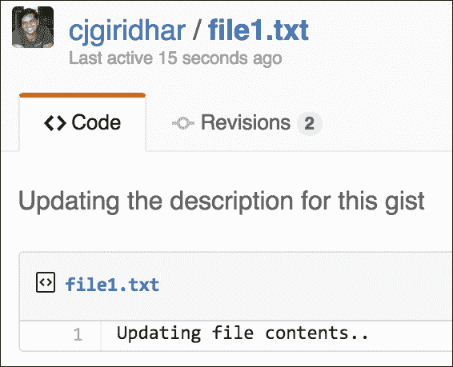

1.  现在是最具破坏性的 API 操作--是的，删除摘要。GitHub 通过在其`/gists/<gist_id>`资源上使用 HTTP**`DELETE`**操作提供删除摘要的 API。以下代码帮助我们删除`gist`：

    ```py
            import requests
            import json
            BASE_URL = 'https://api.github.com'
            Link_URL = 'https://gist.github.com'
            username = '<username>'
            api_token = '<api_token>'
            gist_id = '<gist_id>'

            header = {  'X-Github-Username': '%s' % username,
                        'Content-Type': 'application/json', 
                        'Authorization': 'token %s' % api_token,
            }
            url = "/gists/%s" % gist_id 
            r = requests.delete('%s%s' %(BASE_URL, url),
                                headers=header, )
    ```

1.  让我们快速查看摘要现在是否可在 GitHub 网站上找到？我们可以通过在任何网页浏览器上浏览摘要 URL 来完成此操作。浏览器说了什么？它说**404**资源未找到，所以我们已成功删除了摘要！请参考以下截图：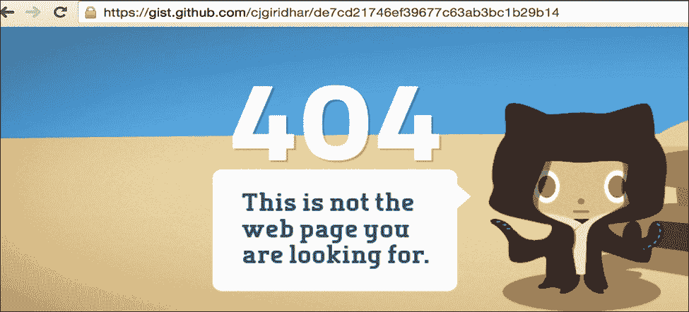

1.  最后，让我们列出你账户中的所有摘要。为此，我们在`/users/<username>/gists`资源上执行 HTTP`GET`API 调用：

```py
        import requests

        BASE_URL = 'https://api.github.com'
        Link_URL = 'https://gist.github.com'

        username = '<username>'      ## Fill in your github username 
        api_token = '<api_token>'  ## Fill in your token

        header = {  'X-Github-Username': '%s' % username, 
                    'Content-Type': 'application/json',
                    'Authorization': 'token %s' % api_token,
        }
        url = "/users/%s/gists" % username
        r = requests.get('%s%s' % (BASE_URL, url),
                          headers=header)
        gists = r.json()
        for gist in gists:
            data = gist['files'].values()[0]
            print data['filename'],
            data['raw_url'], data['language']
```

以下代码对我的账户的输出如下：

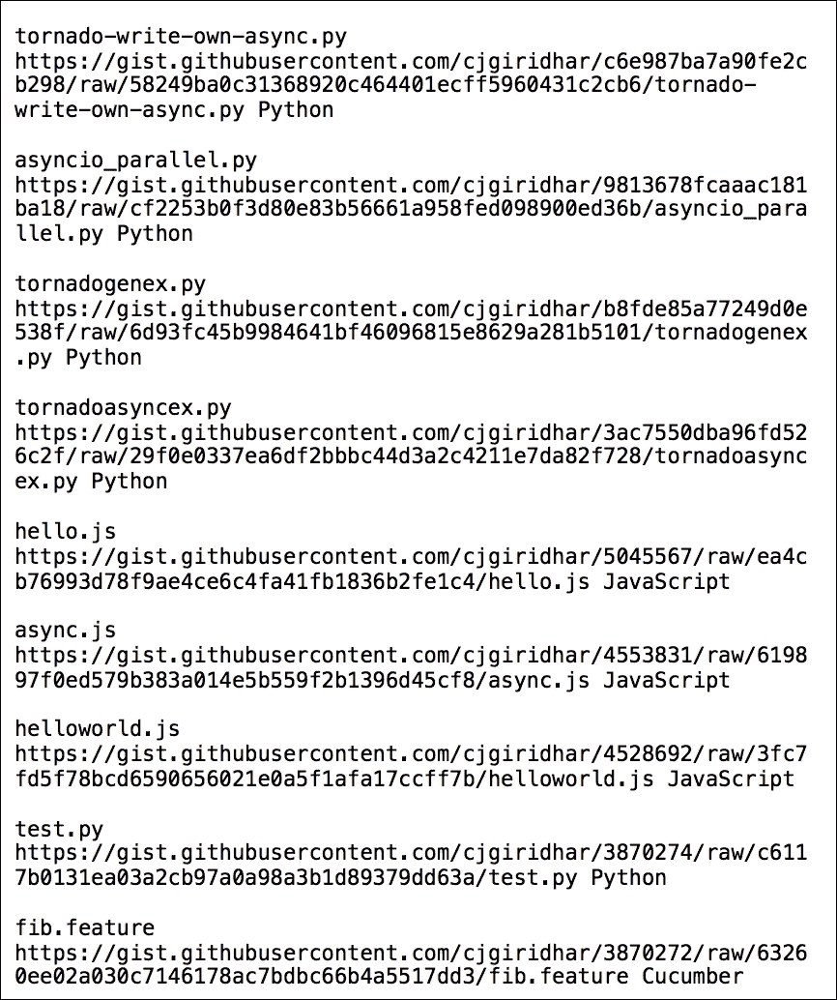

## 它是如何工作的...

Python 的`requests`模块有助于在 GitHub 资源上执行 HTTP `GET`/`POST`/`PUT`/`PATCH`和`DELETE` API 调用。这些操作，在 REST 术语中也称为 HTTP 动词，负责对 URL 资源执行某些操作。

正如我们在示例中所看到的，HTTP `GET` 请求有助于列出 gists，`POST` 创建新的 gists，`PATCH` 更新 gists，而`DELETE` 完全删除 gists。因此，在这个菜谱中，你学习了如何使用 Python 与第三方 REST APIs（今天 WWW 的必要部分）进行交互。

## 相关内容

有许多第三方应用程序被编写为 REST APIs。你可能想尝试它们，就像我们为 GitHub 所做的那样。例如，Twitter 和 Facebook 都有很好的 API，文档也易于理解和使用。当然，它们也有 Python 绑定。

# Python 中的异步 HTTP 服务器

如果你意识到，我们与之交互的许多 Web 应用程序默认是同步的。对于客户端发出的每个请求，都会建立客户端连接，并在服务器端调用一个可调用方法。服务器执行业务操作并将响应体写入客户端套接字。一旦响应耗尽，客户端连接就会关闭。所有这些操作都是按顺序一个接一个发生的——因此，是同步的。

但我们今天所看到的网络，不能仅仅依赖于同步操作模式。考虑这样一个网站，它从网络中查询数据并为您检索信息的情况。（例如，您的网站允许与**Facebook**集成，每次用户访问您网站上的某个页面时，您都会从他的**Facebook**账户中拉取数据。）现在，如果我们以同步方式开发这个网络应用程序，对于客户端发出的每个请求，服务器都会对数据库或网络进行 I/O 调用以检索信息，然后将信息呈现给客户端。如果这些 I/O 请求响应时间较长，服务器会阻塞等待响应。通常，Web 服务器维护一个线程池来处理来自客户端的多个请求。如果服务器等待足够长的时间来处理请求，线程池可能会很快耗尽，服务器将停滞不前。

解决方案？异步处理方式登场！

## 准备工作

对于这个菜谱，我们将使用 Tornado，这是一个在 Python 中开发的异步框架。它支持 Python 2 和 Python 3，最初是在 FriendFeed 开发的([`blog.friendfeed.com/`](http://blog.friendfeed.com/))。Tornado 使用非阻塞网络 I/O，解决了扩展到数万个实时连接的问题（`C10K 问题`）。我喜欢这个框架，并享受用它来编写代码。我希望你也会！在我们进入“如何做”部分之前，让我们首先通过执行以下命令来安装 tornado：

```py
 pip install -U tornado

```

## 如何做...

1.  我们现在准备好开发自己的基于异步哲学的 HTTP 服务器了。以下代码展示了在`tornado` Web 框架中开发的异步服务器：

    ```py
            import tornado.ioloop
            import tornado.web
            import httplib2

            class AsyncHandler(tornado.web.RequestHandler):
                @tornado.web.asynchronous
                def get(self):
                  http = httplib2.Http()
                  self.response, self.content = 
                    http.request("http://ip.jsontest.com/", "GET")
                  self._async_callback(self.response, self.content)

                def _async_callback(self, response, content): 
                print "Content:", content
                print "Response:\nStatusCode: %s Location: %s"
                  %(response['status'], response['content-location']) 
                self.finish()
                tornado.ioloop.IOLoop.instance().stop()
            application = tornado.web.Application([
                  (r"/", AsyncHandler)], debug=True)
           if __name__ == "__main__":
             application.listen(8888)
             tornado.ioloop.IOLoop.instance().start()
    ```

1.  以以下方式运行服务器：

    ```py
     python tornado_async.py

    ```

1.  服务器现在正在 8888 端口上运行，准备接收请求。

1.  现在，启动您选择的任何浏览器，并浏览到`http://localhost:8888/`。在服务器上，您将看到以下输出：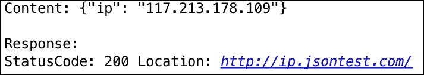

## 它是如何工作的...

我们异步 Web 服务器现在已启动并运行，正在 8888 端口上接受请求。但这是什么异步的呢？实际上，Tornado 基于单线程事件循环的哲学。这个事件循环持续轮询事件，并将其传递给相应的事件处理器。

在前面的例子中，当应用程序运行时，它首先运行`ioloop`。`ioloop`是一个单线程事件循环，负责接收来自客户端的请求。我们定义了`get()`方法，它被`@tornado.web.asynchronous`装饰，使其异步。当用户在`http://localhost:8888/`上发起 HTTP GET 请求时，会触发`get()`方法，它内部会对[`ip.jsontest.com`](http://ip.jsontest.com)发起 I/O 调用。

现在，一个典型的同步 Web 服务器会等待这个 I/O 调用的响应并阻塞请求线程。但 Tornado 作为一个异步框架，它会触发一个任务，将其添加到队列中，发起 I/O 调用，并将执行线程返回到事件循环。

事件循环现在持续监控任务队列，并轮询 I/O 调用的响应。当事件可用时，它执行事件处理器`async*_*callback()`，打印内容及其响应，然后停止事件循环。

## 还有更多...

事件驱动的 Web 服务器，如 tornado，使用内核级库来监控事件。这些库是`kqueue`、`epoll`等。如果你真的感兴趣，你应该做更多阅读。以下是一些资源：

+   [`linux.die.net/man/4/epoll`](https://linux.die.net/man/4/epoll)

+   [`www.freebsd.org/cgi/man.cgi?query=kqueue&sektion=2`](https://www.freebsd.org/cgi/man.cgi?query=kqueue&sektion=2)

# 使用 selenium 绑定的 Web 自动化

在迄今为止的所有食谱中，我们都有一个专门的 URL 来发起 HTTP 请求，无论是调用 REST API 还是从网络下载内容。但是，有些服务没有定义 API 资源，或者需要登录到网络才能执行操作。在这种情况下，你对请求的控制很少，因为同一个 URL 根据用户会话或 cookie 提供多种不同的内容。那么我们该怎么办呢？

那么，控制浏览器本身以在这样场景下完成任务怎么样？控制浏览器本身？有趣，不是吗？

## 准备工作

对于这个菜谱，我们将使用 Python 的 selenium 模块。Selenium ([`www.seleniumhq.org/`](http://www.seleniumhq.org/)) 是一个便携式软件框架，用于 Web 应用程序，并自动化浏览器操作。你可以使用 selenium 自动化一些日常任务。Selenium 会启动一个浏览器，并帮助你执行任务，就像有人在做一样。Selenium 支持一些最常用的浏览器，如 Firefox、Chrome、Safari 和 Internet Explorer 等。在这个菜谱中，我们将使用 Python 的 selenium 来举例说明如何登录 Facebook。

## 如何操作...

1.  我们首先安装 Python 的 selenium 绑定。可以使用以下命令安装 selenium：

    ```py
     pip install selenium

    ```

1.  让我们先创建一个浏览器对象。我们使用 Firefox 浏览器来生成浏览器实例：

    ```py
            from selenium import webdriver browser =
            webdriver.Firefox()
            print "WebDriver Object", browser
    ```

1.  以下截图显示了如何创建一个 selenium WebDriver 对象。它还有一个唯一的会话 ID：

1.  接下来，我们要求浏览器浏览到 Facebook 主页。以下代码帮助我们实现这一点：

    ```py
            browser.maximize_window()
            browser.get('https://facebook.com')
    ```

1.  一旦运行前面的代码，你将看到一个 Firefox 浏览器被打开，并且它连接到了 Facebook 登录页面，如下截图所示：

1.  对于下一步，我们定位电子邮件和密码元素并输入适当的数据：

    ```py
            email = browser.find_element_by_name('email')
            password = browser.find_element_by_name('pass')
            print "Html elements:"
            print "Email:", email, "\nPassword:", password
    ```

    前面代码的输出如下：

    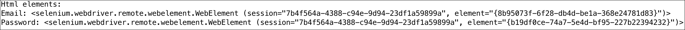

1.  一旦我们选择了**电子邮件**和**密码**文本输入框，我们现在用正确的**电子邮件**和**密码**填充它们。以下代码将启用输入**电子邮件**和**密码**：

    ```py
            email.send_keys('abc@gmail.com') *#Enter correct email
            address*password.send_keys('pass123') *#Enter correct password*

    ```

    

1.  现在我们已经输入了**电子邮件**和**密码**，最后一步是提交表单并点击**登录**按钮。我们通过通过 ID 找到元素并点击元素来完成这个操作：

    ```py
            browser.find_element_by_id('loginbutton').click()
    ```

    如果你已经输入了正确的电子邮件 ID 和密码，你将已经登录到 Facebook！

## 它是如何工作的...

对于这个菜谱，我们使用了 selenium WebDriver Python API。**WebDriver**是 selenium API 的最新加入，它能够像用户一样原生地驱动浏览器。它可以在本地或远程机器上使用 selenium 服务器进行驱动。在这个例子中，我们在本地机器上运行它。基本上，selenium 服务器在本地机器上默认端口 4444 上运行，selenium WebDriver API 与 selenium 服务器交互，在浏览器上执行操作。

在这个菜谱中，我们首先使用 Firefox 浏览器创建了一个 WebDriver 实例。然后我们使用 WebDriver API 浏览到 Facebook 主页。然后我们解析 HTML 页面并定位到**电子邮件**和**密码**输入元素。我们是如何找到这些元素的？是的，类似于我们在网络爬取示例中所做的。因为我们有 Chrome 的开发者控制台，我们可以在 Firefox 中安装 firebug 插件。使用这个插件，我们可以获取**电子邮件**和**密码**的 HTML 元素。请看以下截图：

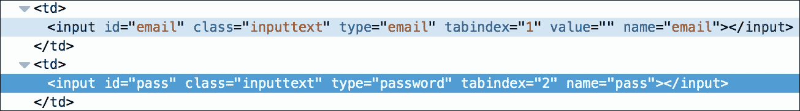

一旦我们确定了 HTML 元素名称，我们就使用 WebDriver 的`find_element_by_name()`方法程序性地创建了一个 HTML 元素对象。WebDriver API 有一个可以作用于元素对象并输入所需文本（在这种情况下是`email`和`password`）的`send_keys()`方法。最后一个操作是提交表单，我们通过找到**登录**对象并点击它来完成这个操作。

## 还有更多...

我们使用 selenium WebDriver Python 绑定查看了一个非常基础的例子。现在，就取决于你的想象力了，看看你可以用 selenium 实现什么，自动化日常任务。

# 使用网络爬取自动化线索生成

*莱恩*是 Dely Inc 公司的市场营销经理。Dely 是一家食品配送初创公司，正在努力在伦敦市建立自己的品牌。Dely 擅长物流，并希望在其平台上聚合餐厅，这样当消费者从这些餐厅订购食物时，Dely 将负责实际的配送。Dely 希望随着每一次配送，他们都能从餐厅那里获得一定的提成。作为回报，餐厅只需考虑他们的厨房，而不必考虑物流方面。如果你仔细思考，几乎每个大小餐厅都是他们的潜在客户。Dely 希望接触这些餐厅，并希望将它们添加到他们的平台上，以满足他们的配送需求。

莱恩负责与餐厅取得联系，并希望在所有目标餐厅上开展营销活动。但在他能够这样做之前，他需要创建一个包含伦敦所有餐厅的数据库。他需要诸如餐厅名称、街道地址和联系电话等详细信息，以便他能联系到这些餐厅。莱恩知道他的所有线索都列在 Yelp 上，但他不知道从哪里开始。此外，如果他手动查看所有餐厅，这将花费他大量的时间。凭借你在本章中获得的知识，你能帮助莱恩进行线索生成吗？

## 网络爬取的合法性

我们在本章的前部分讨论了网络爬取的法律方面。我想再次提醒大家注意这一点。本章中涵盖的例子，再次，是为了让您了解如何进行网络爬取。此外，在这里我们正在爬取 Yelp 的公共数据，这些数据通常都是公开的，就像在这个例子中，这些数据本身就可在餐厅的网站上找到。

## 准备工作

现在，如果你看看莱恩的问题，他需要一个自动化的方式来收集伦敦所有列出餐厅的数据库。是的，你猜对了。网络爬取可以帮助莱恩建立这个数据库。这能这么简单吗？让我们在本食谱中看看。

对于这个食谱，我们不需要任何额外的模块。我们将使用在本章之前食谱中使用的`BeautifulSoup`和`urllib`Python 模块。

## 如何做到这一点...

1.  我们首先访问 Yelp 网站([`yelp.com/`](https://yelp.com/))，并搜索伦敦市的所有餐厅。当你这样做时，你会得到伦敦市所有餐厅的列表。观察显示搜索条件的 URL。它是[`www.yelp.com/search?find_desc=Restaurants&find_loc=London`](https://www.yelp.com/search?find_desc=Restaurants&find_loc=London)。参见以下截图以供参考：

1.  现在，如果你点击搜索结果中出现的任何餐厅链接，我们应该能够获取 Ryan 需要的详细信息。参见以下截图，其中我们获取了*Ffiona's Restaurant*的详细信息。注意每个餐厅都有一个专属的 URL；在这种情况下，它是[`www.yelp.com/biz/ffionas-restaurant-london?osq=Restaurants`](https://www.yelp.com/biz/ffionas-restaurant-london?osq=Restaurants)。此外，注意在这个页面上，我们有餐厅的名称、街道地址，甚至还有联系电话。Ryan 为其活动所需的全部详细信息；这真酷！！如何操作...

1.  好的，那么我们现在知道了如何获取餐厅列表，并且也能获取餐厅的相关详细信息。但是，我们如何以自动化的方式实现这一点呢？正如我们在网络爬虫示例中所见，我们需要在网页上查找 HTML 元素，以便收集这些数据。

1.  让我们从搜索页面开始。在你的 Chrome 浏览器上打开搜索页面([`www.yelp.com/search?find_desc=Restaurants&find_loc=London`](https://www.yelp.com/search?find_desc=Restaurants&find_loc=London))。现在，右键点击第一个餐厅的 URL，并点击**检查**以获取 HTML 元素。如果你注意到，在以下截图中的搜索页面列出的所有餐厅都有一个共同的 CSS 类名，`biz-name`，这表示餐厅的名称。它还包含`href`标签，该标签指向餐厅的专属 URL。在我们的截图中，我们获取了名称，**Ffiona's Restaurant**，而`href`指向餐厅的 URL，[`yelp.com/biz/ffionas-restaurant-london?osq=Resturants`](https://yelp.com/biz/ffionas-restaurant-london?osq=Resturants)。

1.  现在，让我们看看餐厅的专属页面，看看我们如何使用 HTML 元素收集餐厅的街道地址和联系电话。我们执行相同的操作，右键点击，并**检查**以获取街道地址和联系电话的 HTML 元素。参见以下截图以供参考。注意，对于街道地址，我们有一个单独的 CSS 类，`street-address`，而联系电话则在一个名为**biz-phone**的 span 标签下可用。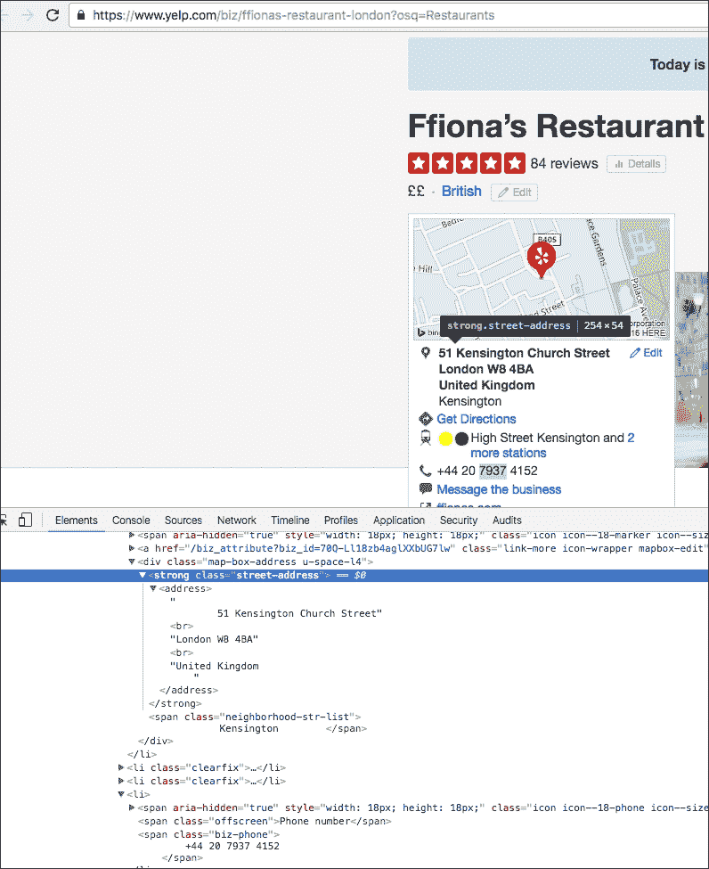

1.  太棒了！因此，我们现在拥有了所有可以用来自动抓取数据的 HTML 元素。现在让我们看看实现方法。以下 Python 代码以自动化的方式执行这些操作：

    ```py
            from bs4 import BeautifulSoup 
            from threading import Thread 
            import urllib 

            #Location of restaurants 
            home_url = "https://www.yelp.com" 
            find_what = "Restaurants" 
            location = "London" 

            #Get all restaurants that match the search criteria 
            search_url = "https://www.yelp.com/search?find_desc=" +
            find_what + "&find_loc=" + location 
            s_html = urllib.urlopen(search_url).read() 
            soup_s = BeautifulSoup(s_html, "lxml") 

            #Get URLs of top 10 Restaurants in London 
            s_urls = soup_s.select('.biz-name')[:10] 
            url = [] 
            for u in range(len(s_urls)): 
            url.append(home_url + s_urls[u]['href']) 

            #Function that will do actual scraping job 
            def scrape(ur): 
                    html = urllib.urlopen(ur).read() 
                    soup = BeautifulSoup(html, "lxml") 

                    title = soup.select('.biz-page-title') 
                    saddress = soup.select('.street-address') 
                    phone = soup.select('.biz-phone') 

                    if title: 
                         print "Title: ", title[0].getText().strip() 
                    if saddress: 
                         print "Street Address: ",
            saddress[0].getText().strip() 
                    if phone: 
                         print "Phone Number: ", phone[0].getText().strip() 
                    print "-------------------" 

            threadlist = [] 
            i=0 
            #Making threads to perform scraping 
            while i<len(url): 
                      t = Thread(target=scrape,args=(url[i],)) 
                      t.start() 
                      threadlist.append(t) 
                      i=i+1 

            for t in threadlist: 
                      t.join() 

    ```

1.  好的，太棒了！现在，如果我们运行前面的 Python 代码，我们将得到伦敦前 10 家餐厅的详细信息，包括它们的名称、街道地址和联系电话。请参考以下截图：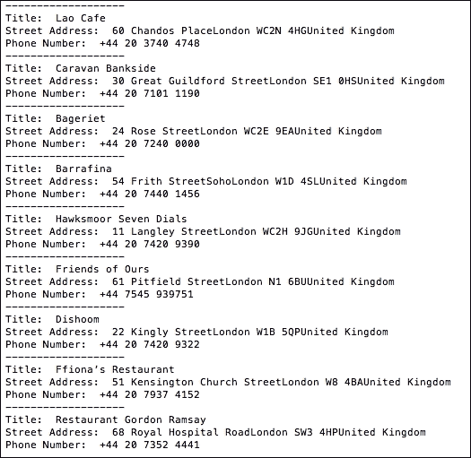

1.  在前面的截图中，我们获取了由 Yelp 提供的伦敦 10 家餐厅的记录。"**标题**"是餐厅的名称，**街道地址**和**电话号码**是显而易见的。太棒了！我们为 Ryan 完成了这个任务。

## 它是如何工作的...

在前面的代码片段中，我们构建了搜索条件。我们在[`yelp.com`](https://yelp.com)上搜索，并查找伦敦的餐厅。有了这些详细信息，我们在 Yelp 上获取了搜索 URL。

我们首先创建了一个`urllib`对象，并使用该对象的`urlopen()`方法对搜索 URL 进行`read()`操作，以获取 Yelp 提供的符合搜索条件的所有餐厅列表。所有餐厅的列表存储为一个 HTML 页面，该页面存储在变量`s_html`中。

使用`BeautifulSoup`模块，我们在 HTML 内容上创建了一个 soup 实例，这样我们就可以开始使用 CSS 元素提取所需的数据。

初始时，我们在 Yelp 上浏览了搜索结果的前 10 条，并获取了餐厅的 URL。我们将这些 URL 存储在 Python 的 URL 列表中。为了获取 URL，我们使用代码`soup_s.select(.biz-name)[:10]`选择了 CSS 类名`biz-name`。

我们还定义了一个方法`scrape()`，它接受餐厅 URL 作为参数。在这个方法中，我们使用 CSS 类名`biz-page-title`、`street-address`和`biz-phone`分别读取餐厅的详细信息，如名称、街道地址和联系电话。为了获取确切的数据，我们使用`title=soup.select`(`.biz-page-title`)选择 HTML 元素，并使用`title[0].getText().strip()`获取数据。请注意，`select()`方法返回找到的元素作为数组，因此我们需要查找索引`0`以获取实际的文本。

我们使用`while`循环遍历所有餐厅的 URL，并使用`scrape()`方法抓取每个餐厅的详细信息。它将在你的控制台上打印出每个餐厅的名称、街道地址和联系电话，正如我们在前面的截图中所看到的。

为了提高我们抓取程序的性能，我们对每个餐厅的数据提取都使用了独立的线程。我们使用`t = Thread(target=scrape,args=(url[i],))`创建了一个新线程，并通过`t.join()`调用从每个线程中获取结果。

就这样，各位！瑞恩对这个努力感到非常满意。在这个例子中，我们帮助瑞恩自动化了一个关键的业务任务。在这本书中，我们将探讨各种用例，展示 Python 如何被用来自动化业务流程并提高效率。想要了解更多？那么，我们下一章见。
