# 第二章. 使用 CSV 和 Excel 工作表

想象一个世界，你的重要文件存储在文件中，并在办公桌上进行管理。多亏了计算机和像 Excel 表这样的软件的出现，我们可以以有组织的方式管理我们的数据。实际上，你甚至可以用 Python 以自动化的方式管理工作表。

本章将涵盖以下食谱：

+   使用读取器对象读取 CSV 文件

+   将数据写入 CSV 文件

+   开发自己的 CSV 方言

+   以自动化的方式管理员工信息

+   读取 Excel 表

+   将数据写入工作表

+   格式化 Excel 单元格

+   玩转 Excel 公式

+   在 Excel 表中构建图表

+   自动比较公司财务

# 简介

在计算机成为我们日常生活的一部分之前，办公记录是在纸上创建并存储在柜子里的。今天，多亏了不断增长的计算领域，我们使用计算机应用程序在文本文件中存储这些记录。文本（`.txt`）文件非常适合保存大量数据；在文本文件中搜索信息也很容易，但数据从未以有组织的方式存储。随着时间的推移，信息量的增长也增加了存储信息的需求，从而导致了 CSV 和 Excel 表的诞生，其中数据不仅可以以结构化格式存储，而且可以轻松读取和处理。

CSV 文件包含由逗号分隔的数据；因此，它们被称为**逗号分隔值**（CSV）文件。CSV 允许以表格格式存储数据。CSV 文件在任何存储系统上导入都更容易，不受所使用的软件的影响。由于 CSV 文件是纯文本文件，它们可以轻松修改，因此用于数据的快速交换。

另一方面，Excel 表包含由制表符或其他分隔符分隔的数据。Excel 表以行列网格格式存储和检索数据。它们允许格式化数据，使用公式进行操作，并且能够在文件中托管多个工作表。Excel 非常适合输入、计算和分析公司数据，如销售额或佣金。

当 CSV 文件是用于存储和检索数据的文本文件时，Excel 文件是二进制文件，用于更高级的操作，如图表、计算，以及通常用于存储报告。

Python 有一套有用的模块来处理 CSV 和 Excel 文件。你可以读取/写入 CSV 和 Excel 文件，格式化 Excel 单元格，准备图表，并使用公式对数据进行计算。

本章中的食谱将专注于帮助我们执行 CSV 和 Excel 表前述操作的 Python 模块。具体来说，本章将重点关注以下 Python 模块：

+   `csv` ([`docs.python.org/2/library/csv.html`](https://docs.python.org/2/library/csv.html))

+   `openpyxl` ([`pypi.python.org/pypi/openpyxl`](https://pypi.python.org/pypi/openpyxl))

+   `XlsxWriter` ([`pypi.python.org/pypi/XlsxWriter`](https://pypi.python.org/pypi/XlsxWriter))

# 使用 reader 对象读取 CSV 文件

此配方将向您展示如何读取 CSV 文件，特别是如何创建和使用 reader 对象。

## 准备工作

要逐步执行此配方，您需要安装 Python v2.7。为了处理 CSV 文件，我们有一个很好的模块，`csv`，它是默认 Python 安装的一部分。因此，让我们开始吧！

## 如何做...

1.  在您的 Linux/Mac 计算机上，转到终端并使用 Vim，或选择您喜欢的编辑器。

1.  我们首先创建一个 CSV 文件。正如我们所知，CSV 文件具有结构化格式，其中数据由逗号分隔，因此创建一个应该很简单。以下截图是一个包含国家不同地区联系人详细信息的 CSV 文件。我们将其命名为`mylist.csv`：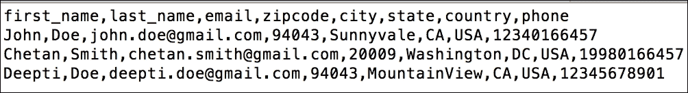

1.  现在，让我们编写 Python 代码来读取这个 CSV 文件并打印其中的数据：

    ```py
            import csv 
            fh = open("mylist.csv", 'rt') 
            try: 
                reader = csv.reader(fh) 
                print "Data from the CSV:", list(reader) 
                except Exception as e: 
                print "Exception is:", e 
            finally: 
                fh.close()
    ```

    前面代码片段的输出如下：

    

1.  哦！发生了什么？我们似乎遇到了一个错误。错误提示 CSV 读取器找不到新行字符。这发生在 Mac 平台上的 CSV 文件中。这是因为 Mac OS 使用**回车符**（**CR**）作为行结束字符。

1.  Python 有一个简单的解决方案来解决这个问题；我们以**rU**模式（即**通用换行**模式）打开文件。以下程序运行得很好，我们可以适当地读取文件内容：

    ```py
            try: 
                reader = csv.reader(open("mylist.csv", 'rU'), 
                                    dialect=csv.excel_tab) 
                print "Data from the CSV:" 
                d = list(reader) 
                print "\n".join("%-20s %s"%(d[i],d[i+len(d)/2]) for i in 
                                range(len(d)/2)) 

                except Exception as e: 
                print "Exception is:", e 
            finally: 
                fh.close()
    ```

    前面程序的输出如下：

    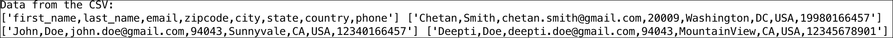

1.  非常好！对于我们在前面代码片段中观察到的那个问题，还有一个简单的解决方案。我们可以做的是，简单地将文件格式从 Mac CSV 更改为 Windows CSV。我们可以通过执行**打开**和**另存为**操作来完成此操作。在以下示例中，我已经将`mylist.csv`保存为`mylist_wincsv.csv`（Windows CSV 格式），并且读取文件内容不再有问题：

    ```py
            fh = open("mylist_wincsv.csv", 'rt') 
            reader = csv.reader(fh) 
            data = list(reader) 
            print "Data cells from CSV:" 
            print data[0][1], data[1][1] 
            print data[0][2], data[1][2] 
            print data[0][3], data[1][3] 

    ```

    在前面的代码示例中，我们打印了 CSV 文件的一部分数据。如果您意识到，CSV 文件也可以在 Python 中以 2D 列表的形式读取，其中第一个索引是行，第二个索引是列。在这里，我们打印了`row1`和`row2`的第二、第三和第四列：

    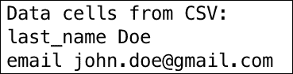

1.  使用 Python，使用有帮助的`DictReader(f)`方法在字典中读取 CSV 文件的内容也非常方便：

    ```py
            import csv 
            f = open("mylist_wincsv.csv", 'rt') 
            print "File Contents" 
            try: 
                reader = csv.DictReader(f) 
                for row in reader: 
                    print row['first_name'], row['last_name'], row['email'] 
            finally:
                f.close()
    ```

    在前面的代码片段中，我们使用文件句柄`f`打开文件。然后，这个文件句柄被用作`DictReader()`函数的参数，该函数将第一行的值视为列名。这些列名作为字典中的键，数据被存储在其中。因此，在前面的程序中，我们可以选择性地打印三个列的数据：**first_name**、**last_name**和**e-mail**，并像以下截图所示打印它们：

    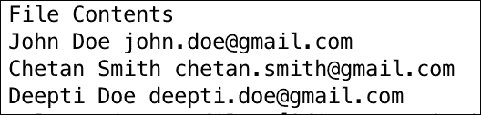

1.  `csv`模块的`DictReader()`有几个辅助方法和属性，使得读取 CSV 文件变得容易。这些也被称为**读取对象**：

    ```py
            import csv 
            f = open("mylist_wincsv.csv", 'rt') 
            reader = csv.DictReader(f) 
            print "Columns in CSV file:", reader.fieldnames 
            print "Dialect used in CSV file:", reader.dialect 
            print "Current line number in CSV file:", reader.line_num 
            print "Moving the reader to next line with reader.next()" 
            reader.next() 
            print "Reading line number:", reader.line_num f.close()
    ```

在此代码示例中，我们使用了以下属性和方法：

+   `fieldnames`：提供列名列表

+   `dialect`：CSV 文件格式（我们将在后面了解更多）

+   `line_num`：当前读取的行号

+   `next()`：带你到下一行

在下面的屏幕截图中，第一行包含我们 CSV 文件中的所有列名。在第二行中，我们打印了用于读取 CSV 文件的方言。在第三行中打印了当前正在读取的行号，屏幕截图的最后一行描述了读取对象在读取时将移动到的下一行：


## 还有更多...

Python 模块`csv`是一个辅助模块，完全可以通过使用`open()`方法打开文件，并用`readline()`方法读取文件内容来处理 CSV 文件。然后，你可以对文件的每一行执行`split()`操作，以获取文件内容。

阅读是件好事，但只有当有数据写入 CSV 文件时，你才会去阅读，对吧？ :) 让我们看看下一道菜谱中可用的将数据写入 CSV 文件的方法。

# 将数据写入 CSV 文件

再次强调，在本节中的菜谱，我们不需要除 Python 安装捆绑的模块之外的新模块，即`csv`模块。

## 如何操作...

1.  首先，以写入模式和文本格式打开一个文件。我们创建两个 Python 列表，包含要写入 CSV 文件的数据。以下代码将执行这些操作：

    ```py
            import csv 
            names = ["John", "Eve", "Fate", "Jadon"] 
            grades = ["C", "A+", "A", "B-"] 
            f = open("newlist.csv", 'wt') 

    ```

1.  现在让我们使用`write()`方法将数据添加到 CSV 文件中，如下所示：

    ```py
            try: 
                writer = csv.writer(f) 
                writer.writerow( ('Sr.', 'Names', 'Grades') ) 
                for i in range(4): 
                    writer.writerow( (i+1, names[i], grades[i]) ) 
            finally: 
                f.close() 

    ```

    在前面的代码中，我们使用标题初始化了 CSV 文件；使用的列名是：**Sr**.、**Names**和**Grades**。接下来，我们启动一个 Python `for`循环，运行四次，并将四行数据写入 CSV 文件。记住，我们有一个包含在 Python 列表`Names`和`Grades`中的数据。`writerow()`方法实际上是在`for`循环中逐行添加 CSV 文件中的内容。

    前面的代码片段的输出可以在下面的屏幕截图中看到：

    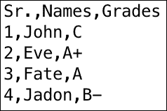

1.  很酷，这很简单直接。值得注意的是，默认情况下，当我们写入 CSV 文件时，行中的文件内容是用逗号分隔的。但如果我们想改变行为，使其用制表符（`\t`）分隔怎么办？`writer()`方法具有这种改变不仅分隔符，还有行终止符的功能。（注意：分隔符是用于在 CSV 文件中分隔行内数据的字符。终止字符用于标记 CSV 文件中行的结束。你将在下面的例子中理解这一点）：

    ```py
            import csv 
            f=open("write.csv", 'wt') 
            csvWriter = csv.writer(f, delimiter='\t', 
                                   lineterminator='\n\n') 
            csvWriter.writerow(['abc', 'pqr', 'xyz']) 
            csvWriter.writerow(['123', '456', '789']) 
            f.close() 

    ```

    当运行前面的代码片段时，在文件系统中会创建一个新的文件`write.csv`。文件内容可以在下面的屏幕截图中查看。如果你查看给定行中的内容，你会看到它们通过制表符分隔，而不是逗号。新行分隔符是回车键（按两次），这在下面的屏幕截图中也很明显。注意，两行之间有一个额外的换行符：

    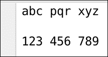

# 开发自己的 CSV 方言

为了更容易地读取和写入 CSV 文件，我们可以指定`csv`模块的`Dialect`类中的格式化参数。在这里，我们看看一些可用的方言，并学习如何编写我们自己的。

## 准备工作

对于这个食谱，我们将使用 Python 默认安装中存在的相同`csv`模块，因此不需要显式安装任何东西。

## 如何做...

1.  让我们先看看`Dialect`类中存在的一些属性：

    +   `Dialect.delimeter`：我们在之前的食谱中使用过这个属性，用来改变 CSV 文件行中内容写入的方式。它用于分隔两个字段。

    +   `Dialect.lineterminator`：这个属性用于表示 CSV 文件中行的终止。我们也在前面的部分中使用过它。

    +   `Dialect.skipinitialspace`：这将跳过分隔符之后的所有前导空格。它有助于避免人为错误。

    我们可以使用以下代码获取可用方言的列表：

    ```py
            print "Available Dialects:", csv.list_dialects() 

    ```

    可用的两个主要方言是`excel`和`excel-tab`。`excel`方言用于处理 Microsoft Excel 的默认导出格式中的数据，并且也适用于 OpenOffice 或 NeoOffice。

1.  现在我们创建一个我们选择的方言。例如，我们选择`-`符号来分隔 CSV 文件中的列：

    ```py
            import csv
            csv.register_dialect('pipes', delimiter='-')
            with open('pipes.csv', 'r') as f:
                reader = csv.reader(f, dialect='pipes')
                for row in reader:
                    print row
    ```

1.  我们创建了一个名为`pipes.csv`的文件，如下所示：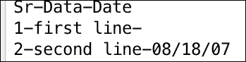

    如果我们在`pipes.csv`文件上运行前面的 Python 代码，它将返回每行作为一个数组，所有元素通过`-`字符分割。下面的屏幕截图显示了程序输出：

    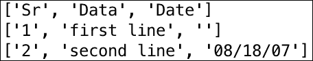

## 它是如何工作的...

在第二个代码片段中，我们使用`register_dialect()`方法注册了我们自己的方言。我们将其命名为`pipes`，与`pipes`关联的分隔符是符号`-`，正如我们打算做的。

我们现在使用我们自己的`read()`方法读取`pipes.csv`文件，并使用读取器对象获取 CSV 文件的内容。但是，你看到了`dialect='pipes'`的使用吗？这将确保读取器期望列通过`-`分隔，并相应地读取数据。

如果你观察，`reader`对象根据方言`pipes`定义的`-`分割行。

你学习了如何将你自己的数据读取和写入 CSV 文件。你也理解了方言的用法。现在是时候感受一下如何使用前面的概念与实际用例相结合了。

# 以自动化的方式管理员工信息

迈克是他的组织的 HR 经理，他正在尝试收集加利福尼亚州所有员工的联系信息。他希望将这些信息分类，以便他对加利福尼亚州的员工进行问卷调查。他不仅想要收集这些信息，还希望将其持久化到另一个 CSV 文件中，以便在以后的时间更容易地处理。

我们能帮助迈克吗？你如何应用你到目前为止学到的概念？在帮助迈克的过程中，你会学到更多吗？让我们看看实现方法。

## 准备工作

对于这个例子，我们不需要任何特殊的模块。之前作为食谱的一部分安装的所有模块对我们来说都足够了。对于这个例子，我们使用包含员工信息的相同`mylist.csv`文件。

## 如何做到这一点...

1.  让我们直接进入代码，打开这两个文件。一个文件句柄用于读取文件内容（读取员工数据），另一个用于写入`CA_Employees.csv`文件。注意文件打开模式的不同（`'rt'`和`'wt'`）。当然，员工 CSV 文件是以读取模式打开的，而`CA_Employees.csv`文件是以写入模式打开的。

    ```py
            import csv
            f = open("mylist.csv", 'rt')
            fw = open("CA_Employees.csv", 'wt')
    ```

1.  接下来，我们使用`DictReader()`方法从 CSV 文件中以字典的形式读取员工信息。我们还创建了一个`csvWriter`对象，我们将使用它将数据写入`CA_Employees.csv`文件。

1.  你可能会想象，当我们开始读取 CSV 文件的行时，我们也会读取第一行。我们应该跳过这一行，因为它只包含列名，对吧？是的，我们使用`reader`对象的`line_num`属性来跳过标题行（记住，我们之前在本章中学习了属性）。一旦跳过了标题行，我们就遍历所有行，筛选出属于`CA`州的员工，并获取这些员工的电子邮件和电话信息。然后，使用`csvWriter`对象将这些筛选后的数据写入`CA_Employees.csv`文件。请注意，一旦文件操作完成，关闭文件句柄非常重要，因为这可能会导致内存泄漏或数据不一致：

    ```py
            try:
                reader = csv.DictReader(f)
                csvWriter = csv.writer(fw)
                for row in reader:
                    if reader.line_num == 1:
                       continue
                    if row['state'] == 'CA':
                       csvWriter.writerow([row['email'], row['phone']]) 
            finally:
                f.close()
                fw.close()
    ```

## 如何工作...

当我们运行前面的程序时，我们将得到一个`CA_Employees.csv`文件，其外观如下所示：


如果你查看代码实现，我们使用`line_num`属性来跳过标题行，即`mylist.csv`文件的第一行。我们还使用`writerow()`方法将筛选后的数据写入新创建的`CA_Employees.csv`文件。做得好，我认为迈克已经对你很满意了。他的问题已经解决了。:)

我们结束了关于处理 CSV 文件的这一部分。CSV 文件本质上以纯文本格式存储数据。我们无法用这些文件做很多事情，因此 Excel 工作表的出现。在下一个菜谱中，我们将开始处理 Excel 工作表，并欣赏它们能提供什么！

# 读取 Excel 工作表

如你所知，Microsoft Office 已经开始为 Microsoft Excel 工作表提供一个新的扩展名`.xlsx`，从 Office 2007 开始。随着这一变化，Excel 工作表转向基于 XML 的文件格式（Office Open XML）并使用 ZIP 压缩。当商业社区要求一个可以帮助在不同应用程序之间传输数据的开放文件格式时，Microsoft 做出了这一改变。让我们开始并看看我们如何使用 Python 处理 Excel 工作表！

## 准备工作

在这个菜谱中，我们使用`openpyxl`模块来读取 Excel 工作表。`openpyxl`模块是一个全面的模块，它对 Excel 工作表执行读取和写入操作。`openpyxl`的另一个替代模块是`xlrd`。虽然`xlrd`自 1995 年以来一直擅长支持 Excel 格式，但该模块只能用于从 Excel 工作表中读取数据。`openpyxl`模块有助于执行更多操作，如修改数据、将数据写入文件以及复制，这些对于处理 Excel 文件至关重要。

让我们使用我们最喜欢的工具`pip`安装`openpyxl`模块：

```py
pip install openpyxl

```

## 如何做...

1.  我们首先创建自己的 Excel 工作表，内容如以下截图所示。你必须知道，Excel 文件被称为**工作簿**，包含一个或多个工作表，因此 Excel 文件也被称为**电子表格**。我们将文件保存为`myxlsx.xlsx`，在两个工作表**人员**和**物品**中：

    让我们看看**人员**工作表中的数据：

    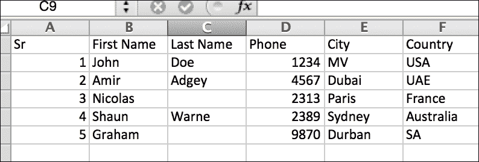

    现在，让我们看看**物品**工作表中的数据：

    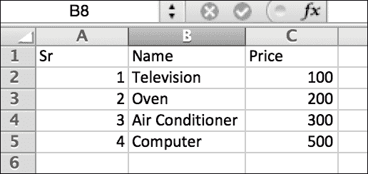

1.  现在让我们继续前进并读取 XLSX 文件。以下代码将帮助我们获取 Excel 工作簿中所有工作表的名称：

    ```py
            import openpyxl
            workbook = openpyxl.load_workbook('myxls.xlsx')
            print "Workbook Object:", workbook.get_sheet_names()
    ```

1.  现在，如果你想处理一个特定的工作表，你如何访问该对象？下面的代码片段将我们带到**人员**工作表：

    ```py
            people = workbook.get_sheet_by_name('People')
            print "People sheet object:", people
    ```

    哇，这太酷了！

1.  现在让我们继续前进，阅读单元格对象。我们可以通过名称或基于行/列位置来读取单元格。下面的代码片段展示了这一点：

    ```py
            import openpyxl
            workbook = openpyxl.load_workbook('myxls.xlsx')
            people = workbook.get_sheet_by_name('People')
            print "First cell Object:", people['A1']
            print "Other Cell Object:", people.cell(row=3, column=2)
    ```

1.  但我如何获取单元格中的值呢？很简单，`object.value`返回单元格中存在的值：

    ```py
            print "First Name:", people['B2'].value, 
            people['C2'].value 

    ```

    如果我们运行 Python 代码片段，我们将得到以下输出，如本截图所示：

    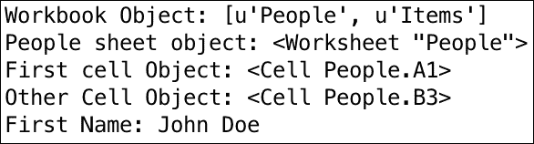

## 它是如何工作的...

在前面的例子中，我们导入了 `openpyxl` 模块。这个模块有一个方法，可以用来访问工作表对象及其中的单元格。`load_workbook()` 方法将整个 Excel 表格加载到内存中。`get_sheet_names()` 和 `get_sheet_by_name()` 方法有助于选择给定工作簿的工作表。因此，我们已经准备好了工作簿和工作表对象。

单元格对象可以通过 `cell()` 方法访问，而 `cell().value` 返回工作表单元格中实际存在的值。不错，看看用 Python 从 Excel 表格中读取数据是多么简单。但再次强调，读取数据只有在我们知道如何将数据写入 Excel 表格时才有用。所以，我们还在等什么呢？让我们继续学习如何在下一菜谱中做到这一点。

# 将数据写入工作表

使用 `openpyxl` 模块读取文件非常简单。现在，让我们将注意力转向写入 Excel 文件。在本节中，我们将对 Excel 文件执行多个操作。

## 准备工作

对于这个菜谱，我们将使用另一个非常棒的 Python 模块，即 `xlsxwriter`。正如其名所示，这个模块帮助我们执行 Excel 表格上的多个操作。有趣的是，`xlsxwriter` 不支持在 Excel 表格上执行读取操作（在撰写本书时）。我们使用以下方式安装 `xlsxwrite` 模块：

```py
pip install xlsxwriter

```

## 如何操作...

1.  我们从一个非常基础的创建 XLSX 文件并添加新工作表的操作开始。以下代码执行了这个操作：

    ```py
            import xlsxwriter
            workbook = xlsxwriter.Workbook('add_sheet.xlsx')
            worksheet = workbook.add_worksheet(name='New Sheet 2') 
            workbook.close()
    ```

1.  让我们继续前进，并在工作表上执行 `write` 操作，存储一些有用的信息：

    ```py
            import xlsxwriter
            workbook = xlsxwriter.Workbook('Expenses01.xlsx')
            worksheet = workbook.add_worksheet()
            expenses = (
                ['Rent', 1000],
                ['Gas',   100],
                ['Food',  300],
                ['Gym',    50],
            )
            row = 0
            col = 0
            for item, cost in (expenses):
                worksheet.write(row, col, item)
                worksheet.write(row, col + 1, cost)
                row += 1

            worksheet.write(row, 0, 'Total')
            worksheet.write(row, 1, '=SUM(B1:B4)')
            workbook.close()
    ```

## 它是如何工作的...

本菜谱的第一个代码片段使用 `Workbook()` 方法在新的 Excel 文件 `add_sheet.xlsx` 下创建了一个 `workbook` 对象。然后，它继续使用 `add_worksheet()` 方法创建了一个 `worksheet` 对象。创建了一个名为 `New Sheet 2` 的新工作表。

在第二个代码示例中，我们创建了一个名为 `Expenses01.xlsx` 的 XLSX 文件。我们从 `expenses` 字典中添加了费用数据。为此，我们遍历字典，使用键作为 Excel 表格中的一列，而值作为另一列。最后，我们添加了一行，汇总了所有费用。`Expenses01.xlsx` 的内容如下截图所示：

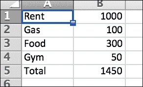

在前面的代码片段中，我们使用 `xlsxwrite` 模块在 Excel 表格上执行了简单的写入操作。我们首先使用 `Workbook()` 方法创建了一个工作簿，然后使用 `add_worksheet()` 方法向该工作簿添加了一个新的 `sheet` 对象。通过在 `worksheet` 对象上使用 `write()` 方法，我们将数据添加到 Excel 表格中。我们还执行了一个小公式操作，使用 `=SUM(B1:B4)` 获取所有费用的总和。

我们所看到的是一个非常基础的编写 Excel 文件的例子。我们可以像在 Excel 表格上手动操作那样，通过编程执行更多的操作。现在，让我们学习如何在下一组菜谱中格式化 Excel 单元格。

# 格式化 Excel 单元格

单元格格式化有多种原因。在商业世界中，它们用于根据主题分组数据，或者在软件开发过程中，单元格被着色以指示功能是否完成或错误是否已修复。

## 准备工作

对于这个菜谱，我们将使用相同的 `xlsxwriter` 模块并格式化单元格。我们将学习如何添加和应用于单元格格式。

## 如何做...

1.  我们继续使用支出示例来演示单元格的格式化。但首先让我们了解如何创建格式。格式是通过 `add_format()` 方法添加的。以下代码示例显示了如何创建一个格式：

    ```py
            format = workbook.add_format()
            format.set_bold()
            format.set_font_color('green')
    ```

    在前面的例子中，我们创建了一个单元格格式，其中单元格（应用了该格式的单元格）中的数据是加粗的，颜色设置为 `绿色`。

1.  回到支出表格的例子，如何突出显示超过 150 的单元格？是的，我们可以通过创建一个格式来突出显示红色单元格的程序化方式来实现。但让我们按顺序来做。首先，我们创建一个表格并向其中添加数据，如下面的代码所示：

    ```py
            import xlsxwriter
            workbook = xlsxwriter.Workbook('cell_format.xlsx')
            worksheet = workbook.add_worksheet()
            expenses = (
                ['Rent', 1000],
                ['Gas',   100],
                ['Food',  300],
                ['Gym',    50],
            )

            row = 0
            col = 0
            for item, cost in (expenses):
                worksheet.write(row, col, item)
                worksheet.write(row, col + 1, cost)
                row += 1
    ```

    前面的代码将创建一个名为 `cell_format.xlsx` 的 Excel 表格，并向其中添加支出。

1.  现在，让我们创建一个格式，其中单元格被着色为蓝色，单元格值将显示为红色。我们可以使用 `set_font_color()` 方法设置格式，但在以下示例中，我们通过 `'bg_color'` 和 `'font_color'` 等选项设置格式：

    ```py
            format1 = workbook.add_format({'bg_color': 'blue',
                              'font_color': 'red'})
    ```

1.  现在，唯一剩下的步骤是将此格式应用于超过 150 的支出。以下代码应用了格式并遵守了条件：

    ```py
            worksheet.conditional_format('B1:KB5',  
                  {'type': 'cell',
                   'criteria': '>=',
                   'value': 150,
                   'format': format1} 
            ) 
            workbook.close()

    ```

    当我们运行这个程序时，`cell_format.xlsx` 文件的内容看起来如下面的截图所示：

    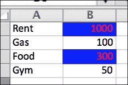

## 还有更多...

太棒了，现在我们已经完成了单元格格式化，接下来我们如何继续在 Excel 表格中处理公式？

# 玩转 Excel 公式

我们用一个非常简单的例子来演示在 Excel 表格中使用公式。

## 准备工作

对于这个菜谱，我们将使用相同的 `xlsxwriter` 模块，并在单元格中添加公式。Excel 表格支持许多操作，例如获取数据的标准差、对数、获取趋势等，因此花时间了解大多数可用操作是值得的。

## 如何做...

你需要执行以下步骤：

我们使用一个简单的例子，其中我们使用 `SUM()` 公式添加一个数字列表，并将总和存储在单元格 **A1** 中：

```py
        import xlsxwriter
        workbook = xlsxwriter.Workbook('formula.xlsx')
        worksheet = workbook.add_worksheet()
        worksheet.write_formula('A1', '=SUM(1, 2, 3)')
        workbook.close()
```

## 工作原理...

当我们运行前面的代码时，会创建一个新的 Excel 文件，名为 `formula.xlsx`，其中单元格 **A1** 包含数字 **6**（`1`、`2` 和 `3` 的和）。

如前所述，我们可以使用 Excel 公式执行更复杂的数学运算。例如，你可以在 Excel 表格中规划你团队的年度 IT 预算。

## 还有更多...

如果我们不讨论图表并完成关于 Excel 工作表的章节，那就没有乐趣了。是的，在下一节中，我们将讨论如何使用 Excel 图表。

# 在 Excel 工作表中构建图表

Excel 工作表能够构建各种图表，包括折线图、柱状图和饼图等，帮助我们描绘趋势和可视化数据。

## 准备工作

对于这个菜谱，我们将使用相同的`xlsxwriter`模块，并使用模块中定义的方法来构建图表。

## 如何操作...

1.  在这个例子中，我们将在 Excel 文件中写入一个列，其中填充了数字。我们可以取所有单元格的值并构建一个折线图：

    ```py
            import xlsxwriter

            workbook = xlsxwriter.Workbook('chart_line.xlsx')
            worksheet = workbook.add_worksheet()

            data = [10, 40, 50, 20, 10, 50]
            worksheet.write_column('A1', data)
            chart = workbook.add_chart({'type': 'line'})
            chart.add_series({'values': '=Sheet1!$A$1:$A$6'})
            worksheet.insert_chart('C1', chart)

            workbook.close()
    ```

    在前面的代码片段中，我们有一个整数值从`10`到`50`的数据列表。像往常一样，我们使用`Workbook()`方法创建一个工作簿，并添加一个默认的**Sheet1**工作表。然后我们写入一个新的列，其中包含列表数据中的所有数字。

1.  `add_chart()`方法随后定义了图表的类型。在这种情况下，它是一个折线图。`add_chart()`方法返回一个图表类型的对象。但仅仅创建一个对象是没有帮助的。图表将如何知道要绘制的数据点？这是通过`add_series()`方法实现的，该方法接受用于绘制图表的单元格值。在这个例子中，单元格范围从**A1**到**A6**（记住我们已将`data`列表中的所有数字添加到从**A1**开始的列**A**中）。

1.  一旦图表准备就绪，它也应该添加到 Excel 工作表中。这是通过`insert_chart()`方法实现的，该方法接受单元格名称和图表对象作为参数。在这个例子中，图表被插入到单元格**C1**。

1.  当我们运行这个程序时，会创建一个新的文件`chart_line.xlsx`，其中插入了折线图。以下截图显示了折线图和绘制的数据：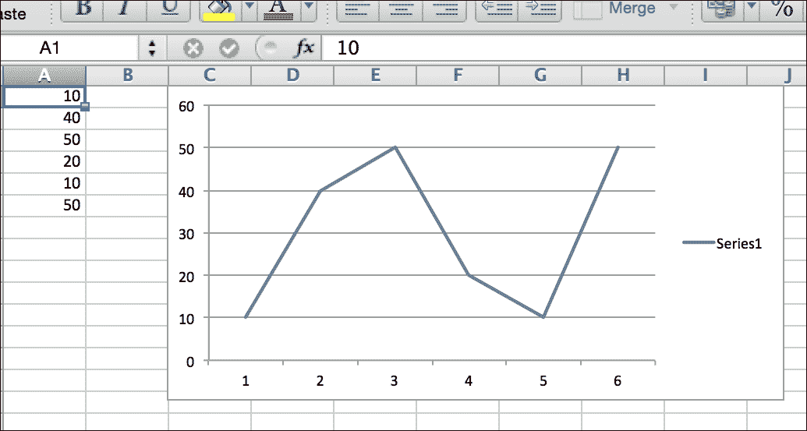

# 自动比较公司财务

我们在 Excel 工作表上的菜谱涵盖了多个方面，如读取/写入文件、格式化单元格、处理公式和图表。让我们用本章获得的知识解决一个美好的商业案例。

Monica 是 Xtel Inc 的财务经理，负责公司的收益。Xtel Inc 正在寻找资金，Monica 的任务是根据过去三年的收入报表比较公司的财务状况。这些数据将提交给投资者，以便他们可以就投资 Xtel Inc 做出适当的决定。获取三年的数据将很容易，但 Xtel 的 CFO 要求 Monica 获取过去 5 年的月度数据。Monica 担心手动比较 60 个月的财务数据！在本章中获得的知识，你认为你能帮助 Monica 吗？

## 准备工作

让我们用 Python 菜谱来解决 Monica 的问题。为此菜谱，我们将比较 Xtel Inc 过去三年的财务状况，并使用 Python 在 Excel 工作表中绘制比较图。我们将借助影响公司利润表的因素，即收入、成本和毛利润来完成这项工作。

## 如何做到这一点...

1.  在以下代码中，我们首先在工作表中添加公司财务信息，例如收入、销售成本和毛利润。假设我们有一个包含这些数据的 Python 列表 `data`。

1.  然后，我们使用柱状图绘制这些值，并使用 Excel 公式计算净增益百分比。以下代码片段正是 Monica 需要的：

    ```py
            import xlsxwriter

            workbook = xlsxwriter.Workbook('chart_column.xlsx')

            worksheet = workbook.add_worksheet()
            chart = workbook.add_chart({'type': 'column'})

            data = [
                   ['Year', '2013', '2014', '2015'],
                   ['Revenue', 100, 120, 125],
                   ['COGS', 80, 90, 70],
                   ['Profit', 20, 30, 55], 
            ]

            worksheet.write_row('A1', data[0])
            worksheet.write_row('A2', data[1])
            worksheet.write_row('A3', data[2])
            worksheet.write_row('A4', data[3])

            chart.add_series({'values': '=Sheet1!$B$2:$B$4', 'name':'2013'}) 
            chart.add_series({'values': '=Sheet1!$C$2:$C$4', 'name':'2014'})
            chart.add_series({'values': '=Sheet1!$D$2:$D$4', 'name':'2015'}) 
            worksheet.insert_chart('G1', chart)

            worksheet.write(5, 0, '% Gain')
            worksheet.write(5, 1, '=(B4/B2)*100')
            worksheet.write(5, 2, '=(C4/C2)*100')
            worksheet.write(5, 3, '=(D4/D2)*100')

            workbook.close()
    ```

1.  当我们运行这个 Python 程序时，会生成一个新的 Excel 工作表，比较公司三年来的财务表现，如下面的截图所示。这正是 Monica 想要的！ :)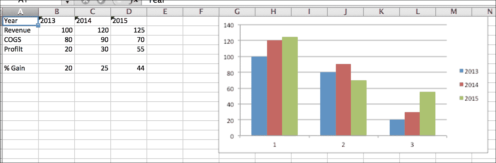

## 它是如何工作的...

在前面的代码片段中，我们将公司财务数据收集到一个 Python 列表 `data` 中。

使用 `xlsxwriter` 模块，我们创建一个工作簿对象，然后使用 `add_worksheet()` 方法向其中添加一个工作表。

一旦我们有了工作表和数据，我们就开始使用 `write_row()` 方法将数据写入工作表。

我们还在工作表中添加了一个图表对象。这将帮助我们轻松地添加比较过去三年公司财务状况的条形图。我们使用 `add_chart()` 方法添加图表对象。

由于我们已经将数据填充到我们的工作表中，我们使用这些数据通过 `add_series()` 方法创建所有三年的条形图。`add_series()` 方法接受 Excel 单元格作为参数，并绘制这些单元格中的数据条形图。最后，我们使用 `insert_chart()` 方法将图表对象（以及条形图）插入到工作表中。

最后，我们使用 Excel 公式和 `write()` 方法添加所有年份的增益数据。

太棒了！这很简单，你为 Monica 做到了！她可以修改这个 Python 代码片段来比较她需要的所有数据点的公司财务状况，而且还能在非常短的时间内完成。确实，Xtel Inc 的 CEO 会非常高兴她的工作的！

## 还有更多...

好了，伙计们，这就是本章的全部内容。与 CSV 和 Excel 文件一起的乐趣永远不会停止。你可以用这些文件执行许多其他操作，它们可以在商业和软件开发世界中以不同的方式使用。因此，我强烈建议你尝试本章中讨论的模块，并根据自己的用例构建它们。下章再见！
